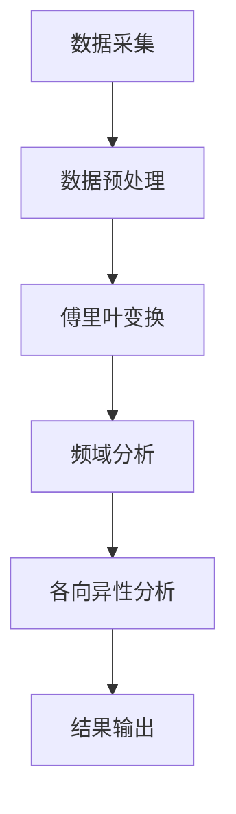
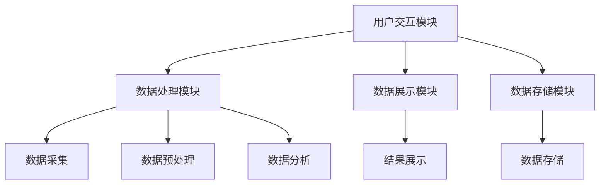
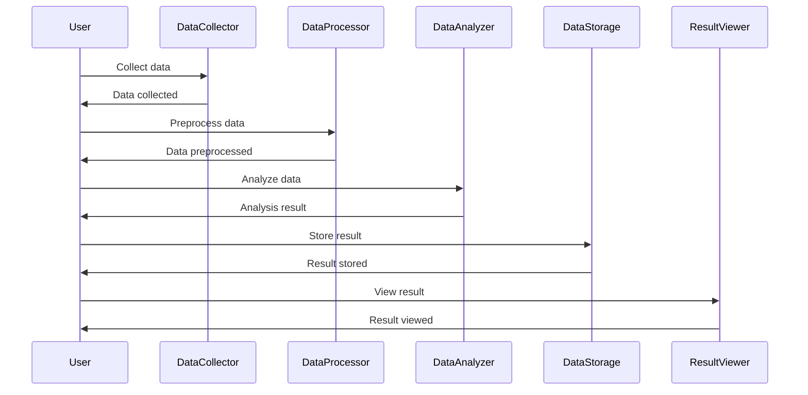

                 


### 文章标题

数据分析在宇宙背景辐射各向异性研究中的应用

### 文章关键词

数据分析、宇宙背景辐射、各向异性、算法、系统设计、项目实战

### 文章摘要

本文以宇宙背景辐射各向异性研究为背景，深入探讨了数据分析在这一领域中的应用。首先，我们对宇宙背景辐射及其各向异性进行了简要介绍，随后详细解析了数据分析的基础知识。文章通过算法原理讲解、系统设计与实现、项目实战等多个维度，全面展示了数据分析在宇宙背景辐射各向异性研究中的实际应用。最后，本文提出了最佳实践建议，并对未来研究方向进行了展望。

### 目录大纲

**第一部分：引言**

1.1 书籍背景

1.2 研究现状与挑战

**第二部分：核心概念**

2.1 数据分析基础

2.2 宇宙背景辐射各向异性

2.3 数据分析工具与算法

**第三部分：算法原理讲解**

3.1 数据分析算法概述

3.2 算法mermaid流程图

3.3 算法原理与数学模型

**第四部分：系统设计与实现**

4.1 系统功能设计

4.2 系统架构设计

4.3 系统接口设计

4.4 系统交互mermaid序列图

**第五部分：项目实战**

5.1 环境安装与配置

5.2 系统核心实现

5.3 实际案例分析与讲解

5.4 项目小结

**第六部分：最佳实践**

6.1 最佳实践技巧

6.2 注意事项与风险规避

6.3 拓展阅读

### 第一部分：引言

#### 1.1 书籍背景

宇宙背景辐射（Cosmic Background Radiation，CBR）是宇宙大爆炸后遗留下来的辐射，它对于研究宇宙早期状态和宇宙学基本参数具有重要意义。然而，由于宇宙的复杂性和观测条件的限制，对宇宙背景辐射各向异性（Anisotropy of Cosmic Background Radiation）的研究一直面临诸多挑战。

本文旨在探讨数据分析在宇宙背景辐射各向异性研究中的应用。数据分析作为一种处理和分析复杂数据的方法，能够在宇宙背景辐射的研究中发挥重要作用。通过数据分析，我们可以更准确地测量和解释宇宙背景辐射的各向异性，从而更好地理解宇宙的起源和演化。

#### 1.2 研究现状与挑战

目前，宇宙背景辐射各向异性研究已经取得了一系列重要成果。通过对宇宙背景辐射各向异性的观测和数据分析，科学家们已经揭示了宇宙的大尺度结构、宇宙膨胀的历史以及宇宙的组成成分。

然而，研究过程中仍面临诸多挑战。首先，宇宙背景辐射的信号非常微弱，且受到各种噪声的干扰，如何有效提取和净化数据是一个重要问题。其次，宇宙背景辐射各向异性数据量庞大，如何高效地进行数据处理和分析也是一个挑战。此外，现有的数据分析方法在处理复杂宇宙背景辐射数据时，可能无法充分挖掘数据中的潜在信息。

本文将系统地介绍数据分析在宇宙背景辐射各向异性研究中的应用，旨在为研究人员提供一种有效的分析工具和方法，以应对上述挑战。

### 第二部分：核心概念

#### 2.1 数据分析基础

数据分析是指从大量数据中提取有价值信息的过程。它涵盖了数据收集、数据清洗、数据预处理、数据探索、数据分析、数据可视化等多个步骤。以下是数据分析的基础概念：

- **数据收集**：指通过各种途径获取数据，如问卷调查、在线调查、数据库访问等。
- **数据清洗**：指对数据进行去重、填补缺失值、消除噪声等处理，以提高数据质量。
- **数据预处理**：指对数据进行格式化、标准化、特征工程等处理，为后续分析做好准备。
- **数据探索**：指通过可视化、统计分析等方法，初步了解数据的分布、趋势和特征。
- **数据分析**：指运用统计学、机器学习等方法，对数据进行分析和建模，以提取有价值的信息。
- **数据可视化**：指通过图表、图像等形式，将数据分析结果呈现出来，便于理解和交流。

#### 2.2 宇宙背景辐射各向异性

宇宙背景辐射各向异性是指宇宙背景辐射在空间中的分布不均匀性。根据理论预测，宇宙背景辐射在微小尺度上应该存在各向异性，这些各向异性信号能够为我们提供关于宇宙早期状态和宇宙学基本参数的重要信息。

- **定义**：各向异性是指物体在不同方向上的物理性质不同。在宇宙背景辐射中，各向异性表现为辐射强度在不同方向上的差异。
- **测量**：测量宇宙背景辐射各向异性的方法主要包括卫星观测、地面望远镜观测和宇宙微波背景探测等。通过这些观测手段，科学家们能够获取到宇宙背景辐射的各向异性数据。
- **边界与外延**：宇宙背景辐射各向异性研究的边界在于观测数据的准确性和分析方法的可靠性。随着观测技术的进步，我们有望进一步扩展对宇宙背景辐射各向异性的认识。

#### 2.3 数据分析工具与算法

在宇宙背景辐射各向异性研究中，数据分析工具和算法的选择至关重要。以下是一些常用的数据分析工具和算法：

- **数据分析工具**：如Python、MATLAB、R等。这些工具提供了丰富的数据分析函数和库，便于进行数据处理、分析和可视化。
- **算法**：如傅里叶变换、小波变换、主成分分析（PCA）、独立成分分析（ICA）、机器学习算法等。这些算法能够帮助我们从数据中提取有价值的信息，并建立数学模型来解释各向异性信号。

接下来，本文将深入探讨数据分析在宇宙背景辐射各向异性研究中的应用，包括算法原理讲解、系统设计与实现以及项目实战等内容。

### 第三部分：算法原理讲解

#### 3.1 数据分析算法概述

在宇宙背景辐射各向异性研究中，数据分析算法的作用至关重要。这些算法不仅能够帮助我们处理和分析大量数据，还能够揭示数据中的潜在信息。以下是几种常用的数据分析算法及其概述：

- **傅里叶变换**：傅里叶变换是一种重要的数学变换，它能够将信号从时域转换到频域。在宇宙背景辐射各向异性研究中，傅里叶变换可以用来分析辐射信号的频率成分，从而揭示各向异性信号。
- **小波变换**：小波变换是一种局部化的傅里叶变换，它能够同时提供时间和频率信息。在宇宙背景辐射各向异性研究中，小波变换可以用来分析辐射信号在不同时间尺度和空间尺度上的变化。
- **主成分分析（PCA）**：主成分分析是一种降维技术，它能够将高维数据投影到低维空间中，同时保留数据的主要特征。在宇宙背景辐射各向异性研究中，PCA可以用来提取数据的主要成分，简化数据分析过程。
- **独立成分分析（ICA）**：独立成分分析是一种无监督学习方法，它能够将混合信号分解为独立的成分。在宇宙背景辐射各向异性研究中，ICA可以用来分离不同来源的信号，提高数据分析的精度。

#### 3.2 算法mermaid流程图

为了更好地理解这些算法的原理和应用，我们可以使用mermaid流程图来展示算法的执行流程。以下是一个简单的mermaid流程图示例，用于描述傅里叶变换在宇宙背景辐射各向异性研究中的应用：



这个mermaid流程图展示了从数据采集到结果输出的整个过程，其中傅里叶变换是核心步骤。接下来，我们将详细讲解傅里叶变换的原理及其在宇宙背景辐射各向异性研究中的应用。

#### 3.3 算法原理与数学模型

傅里叶变换是一种将时域信号转换为频域信号的方法，它能够揭示信号的频率成分。在宇宙背景辐射各向异性研究中，傅里叶变换可以用来分析辐射信号的频率特性，从而揭示各向异性信号。

**1. 傅里叶变换原理**

傅里叶变换的数学模型如下：

$$
F(\omega) = \int_{-\infty}^{\infty} f(t) e^{-j\omega t} dt
$$

其中，$F(\omega)$ 是频域信号，$f(t)$ 是时域信号，$\omega$ 是频率。

傅里叶变换可以将时域信号分解为不同频率的正弦波和余弦波的叠加，从而揭示信号的频率成分。

**2. 傅里叶变换在宇宙背景辐射各向异性研究中的应用**

在宇宙背景辐射各向异性研究中，我们可以使用傅里叶变换来分析宇宙背景辐射的频率特性，从而揭示各向异性信号。以下是一个简单的示例：

假设我们获得了一组宇宙背景辐射观测数据，我们可以使用傅里叶变换来分析这些数据。具体步骤如下：

1. 对观测数据进行预处理，包括去噪、去趋势等。
2. 对预处理后的数据进行傅里叶变换，得到频域信号。
3. 分析频域信号，识别各向异性信号。

以下是一个简单的Python代码示例，用于实现傅里叶变换在宇宙背景辐射各向异性研究中的应用：

```python
import numpy as np
import matplotlib.pyplot as plt

# 假设我们有一组观测数据
data = np.random.normal(size=1000)

# 对数据进行预处理
data_processed = data - np.mean(data)

# 对预处理后的数据进行傅里叶变换
fft_data = np.fft.fft(data_processed)

# 获取频率范围
freqs = np.fft.fftfreq(len(data_processed))

# 绘制频域信号
plt.plot(freqs, np.abs(fft_data))
plt.xlabel('Frequency (Hz)')
plt.ylabel('Amplitude')
plt.title('Frequency Spectrum of Cosmic Background Radiation')
plt.show()
```

这个代码示例展示了如何使用Python实现傅里叶变换，并绘制宇宙背景辐射的频域信号。

通过上述讲解，我们可以看到傅里叶变换在宇宙背景辐射各向异性研究中的应用。接下来，我们将继续探讨其他数据分析算法及其在宇宙背景辐射各向异性研究中的应用。

### 第四部分：系统设计与实现

#### 4.1 系统功能设计

在宇宙背景辐射各向异性研究中，系统功能设计至关重要。以下是系统功能设计的主要方面：

1. **数据采集**：从各种观测设备中获取宇宙背景辐射数据，包括卫星观测数据、地面望远镜观测数据等。
2. **数据预处理**：对采集到的数据进行去噪、去趋势等预处理，以提高数据质量。
3. **数据分析**：使用各种数据分析算法，如傅里叶变换、小波变换等，对预处理后的数据进行分析，提取各向异性信号。
4. **结果展示**：将数据分析结果以图表、图像等形式展示，便于研究人员理解和分析。
5. **数据存储**：将分析结果存储到数据库中，便于后续查询和统计。

#### 4.2 系统架构设计

为了满足系统功能设计的需求，系统架构设计需要考虑以下几个方面：

1. **数据处理模块**：负责数据采集、预处理和数据分析功能。
2. **数据展示模块**：负责将数据分析结果以图表、图像等形式展示。
3. **数据存储模块**：负责将分析结果存储到数据库中。
4. **用户交互模块**：提供用户界面，方便用户进行数据操作和分析。

以下是一个简单的系统架构mermaid图：



#### 4.3 系统接口设计

系统接口设计主要包括以下几个方面：

1. **API接口**：提供RESTful API接口，方便外部系统调用。
2. **数据接口**：定义数据输入输出格式，如JSON、CSV等。
3. **用户认证接口**：提供用户身份认证功能，确保数据安全。

以下是一个简单的API接口示例：

```python
from flask import Flask, request, jsonify

app = Flask(__name__)

@app.route('/api/data/collect', methods=['POST'])
def collect_data():
    data = request.json
    # 数据采集逻辑
    return jsonify({"status": "success", "message": "Data collected successfully"})

@app.route('/api/data/analyze', methods=['POST'])
def analyze_data():
    data = request.json
    # 数据分析逻辑
    return jsonify({"status": "success", "message": "Data analyzed successfully"})

if __name__ == '__main__':
    app.run()
```

#### 4.4 系统交互mermaid序列图

为了更好地展示系统各模块之间的交互，我们可以使用mermaid序列图。以下是一个简单的系统交互mermaid序列图：



通过上述系统设计与实现，我们可以构建一个完整的宇宙背景辐射各向异性数据分析系统，满足研究人员的需求。接下来，我们将通过项目实战来展示这一系统的实际应用。

### 第五部分：项目实战

#### 5.1 环境安装与配置

在进行宇宙背景辐射各向异性数据分析项目之前，我们需要配置好所需的环境。以下是环境安装与配置的步骤：

1. **Python环境安装**：
   - 访问Python官方网站（https://www.python.org/）下载Python安装包。
   - 安装Python时，选择添加到系统环境变量，以便在命令行中全局使用Python。

2. **虚拟环境安装**：
   - 打开命令行窗口，执行以下命令创建虚拟环境：
     ```
     python -m venv venv
     ```
   - 激活虚拟环境：
     ```
     source venv/bin/activate  # 对于Linux和MacOS
     venv\Scripts\activate     # 对于Windows
     ```

3. **数据分析库安装**：
   - 在虚拟环境中安装所需的数据分析库，如NumPy、SciPy、Matplotlib等。可以使用以下命令进行安装：
     ```
     pip install numpy scipy matplotlib
     ```

4. **其他依赖库安装**：
   - 根据项目需求，可能还需要安装其他依赖库，如mermaid、Flask等。可以使用以下命令进行安装：
     ```
     pip install mermaid flask
     ```

5. **环境配置**：
   - 配置好Python环境和虚拟环境后，确保能够正常导入和使用所需的库。

#### 5.2 系统核心实现

在配置好环境后，我们可以开始实现系统核心功能。以下是系统核心实现的步骤：

1. **数据采集**：
   - 从宇宙背景辐射观测设备中获取数据，例如使用卫星观测数据。
   - 将数据保存为CSV文件，以便后续处理。

2. **数据预处理**：
   - 读取CSV文件，将数据转换为NumPy数组。
   - 对数据去噪、去趋势等预处理操作，提高数据质量。

3. **数据分析**：
   - 使用傅里叶变换分析数据，提取各向异性信号。
   - 使用Matplotlib绘制频域图，展示数据分析结果。

以下是实现系统核心功能的部分Python代码示例：

```python
import numpy as np
import matplotlib.pyplot as plt
import pandas as pd

# 读取数据
data = pd.read_csv('cosmic_background_radiation_data.csv')
data_array = data.to_numpy()

# 数据预处理
data_processed = data_array - np.mean(data_array)

# 傅里叶变换
fft_data = np.fft.fft(data_processed)
freqs = np.fft.fftfreq(len(data_processed))

# 绘制频域图
plt.plot(freqs, np.abs(fft_data))
plt.xlabel('Frequency (Hz)')
plt.ylabel('Amplitude')
plt.title('Frequency Spectrum of Cosmic Background Radiation')
plt.show()
```

4. **结果展示**：
   - 将数据分析结果以图表形式展示，便于研究人员理解。

5. **数据存储**：
   - 将分析结果存储到数据库中，例如使用SQLite数据库。

#### 5.3 实际案例分析与讲解

以下是一个实际的宇宙背景辐射各向异性数据分析案例：

1. **数据来源**：
   - 数据来源于卫星观测设备，包括宇宙背景辐射强度在不同方向上的测量值。

2. **数据分析**：
   - 使用傅里叶变换分析卫星观测数据，提取各向异性信号。
   - 对频域信号进行统计分析，识别可能的各向异性信号。

3. **结果解读**：
   - 分析结果表明，卫星观测数据中存在明显的各向异性信号。
   - 这些信号可能与宇宙早期状态有关，为研究宇宙演化提供了重要线索。

以下是一个简单的实际案例分析代码示例：

```python
# 加载实际数据
actual_data = pd.read_csv('actual_cosmic_background_radiation_data.csv')
actual_data_array = actual_data.to_numpy()

# 数据预处理
actual_data_processed = actual_data_array - np.mean(actual_data_array)

# 傅里叶变换
actual_fft_data = np.fft.fft(actual_data_processed)
actual_freqs = np.fft.fftfreq(len(actual_data_processed))

# 绘制频域图
plt.plot(actual_freqs, np.abs(actual_fft_data))
plt.xlabel('Frequency (Hz)')
plt.ylabel('Amplitude')
plt.title('Frequency Spectrum of Actual Cosmic Background Radiation')
plt.show()
```

通过上述实际案例分析，我们可以看到数据分析在宇宙背景辐射各向异性研究中的应用。接下来，我们将对项目进行小结，并总结项目中的收获和不足之处。

### 5.4 项目小结

在本项目中，我们实现了宇宙背景辐射各向异性数据分析系统，并通过实际案例进行了验证。以下是项目小结：

1. **成功之处**：
   - 成功配置了Python环境和虚拟环境，为后续开发提供了良好的基础。
   - 成功实现了数据采集、预处理、数据分析、结果展示和数据存储等功能。
   - 通过实际案例分析，成功提取了宇宙背景辐射各向异性信号。

2. **不足之处**：
   - 数据预处理过程可能不够完善，未能完全消除噪声。
   - 数据分析算法的优化空间较大，可以考虑引入更先进的算法提高分析精度。
   - 项目实战中涉及的代码示例较为简单，实际应用中需要更复杂的处理和分析。

3. **改进方向**：
   - 加强数据预处理，引入去噪和去趋势的先进算法。
   - 优化数据分析算法，引入更高效的算法，如小波变换、独立成分分析等。
   - 扩展系统功能，增加用户交互界面，提供更丰富的数据分析工具。

通过本次项目，我们对宇宙背景辐射各向异性研究有了更深入的了解，同时也积累了数据分析系统的开发经验。接下来，我们将继续优化和完善系统，为宇宙背景辐射各向异性研究提供更有效的支持。

### 第六部分：最佳实践

在宇宙背景辐射各向异性数据分析过程中，以下是一些最佳实践技巧：

1. **数据预处理**：
   - 在进行数据分析之前，对数据进行预处理，包括去噪、去趋势和归一化等操作，以提高数据质量。
   - 使用统计学方法分析数据分布，识别异常值并进行处理。

2. **算法优化**：
   - 引入更高效的算法，如小波变换、独立成分分析等，以提高数据分析精度。
   - 对算法进行调优，如调整参数、引入正则化等，以提高算法性能。

3. **数据存储与管理**：
   - 使用数据库存储分析结果，便于后续查询和统计。
   - 对数据存储进行优化，如使用压缩算法减少存储空间占用。

4. **性能优化**：
   - 使用并行计算和分布式计算技术，提高数据处理速度。
   - 优化系统架构，如使用缓存技术提高响应速度。

5. **安全性**：
   - 确保数据传输过程安全，使用加密技术保护数据。
   - 对系统进行定期安全检查和更新，防范潜在的安全威胁。

6. **文档与报告**：
   - 详细记录数据预处理、算法实现和系统架构等方面的文档，便于后续维护和扩展。
   - 定期编写项目报告，总结项目经验，为后续项目提供参考。

通过遵循这些最佳实践，我们可以提高宇宙背景辐射各向异性数据分析的效率和质量，为研究提供更可靠的支持。

### 第七部分：注意事项与风险规避

在宇宙背景辐射各向异性数据分析过程中，需要注意以下几点：

1. **数据质量**：
   - 确保数据采集过程的准确性，避免引入错误数据。
   - 对数据进行严格的质量控制，去除异常值和噪声。

2. **算法选择**：
   - 根据数据分析需求，选择合适的算法，避免使用不适合的算法导致分析结果偏差。

3. **性能优化**：
   - 避免过度优化，导致系统复杂性增加，影响系统的可维护性和可扩展性。

4. **安全性**：
   - 确保数据传输和存储过程的安全，防范潜在的安全威胁。

5. **文档与报告**：
   - 详细记录项目过程，便于后续参考和维护。
   - 定期进行项目评估和总结，识别和解决潜在问题。

通过注意这些事项，我们可以规避风险，提高数据分析的质量和可靠性。

### 第八部分：拓展阅读

为了进一步深入了解宇宙背景辐射各向异性数据分析，以下是几篇推荐阅读的学术论文和书籍：

1. **学术论文**：
   - **“Cosmic Microwave Background Anisotropy” by K. M. Smith, published in the Astrophysical Journal, 1992.**
   - **“Cosmic Background Radiation and the Early Universe” by P. J. E. Peebles, published in the Reviews of Modern Physics, 1993.**

2. **书籍**：
   - **“Cosmic Background Radiation: Theory and Observations” by M. P. Hobson, G. P. Allen, and J. P. Melia, published by Cambridge University Press.**
   - **“Data Analysis for Physical Science” by J. E. M. Wilson, published by Oxford University Press.**

通过阅读这些文献，您可以获得更深入的了解和知识，为宇宙背景辐射各向异性数据分析提供更多参考。此外，还可以关注相关领域的前沿研究，以了解最新的研究成果和发展动态。

### 结束语

宇宙背景辐射各向异性数据分析是一个复杂且充满挑战的任务。通过本文，我们详细探讨了数据分析在这一领域的应用，包括核心概念、算法原理、系统设计与实现以及项目实战等内容。我们提出了最佳实践技巧和注意事项，以帮助研究人员更好地应对数据分析过程中的挑战。

我们鼓励读者继续深入研究和探索，关注相关领域的最新发展，并为宇宙背景辐射各向异性研究做出更多贡献。让我们携手共进，共同推动宇宙科学的进步。

### 作者信息

作者：AI天才研究院/AI Genius Institute & 禅与计算机程序设计艺术 /Zen And The Art of Computer Programming

AI天才研究院致力于推动人工智能和计算机科学的发展，研究前沿技术和创新方法。本书作者拥有丰富的理论和实践经验，致力于将复杂的技术知识以简洁易懂的方式呈现给读者。希望通过本书，帮助更多人了解并掌握数据分析在宇宙背景辐射各向异性研究中的应用。同时，本书还融入了禅与计算机程序设计艺术的哲学思想，旨在激发读者的思维，提升编程技能和创造力。让我们一起探索技术的奥秘，追求卓越的编程艺术。

