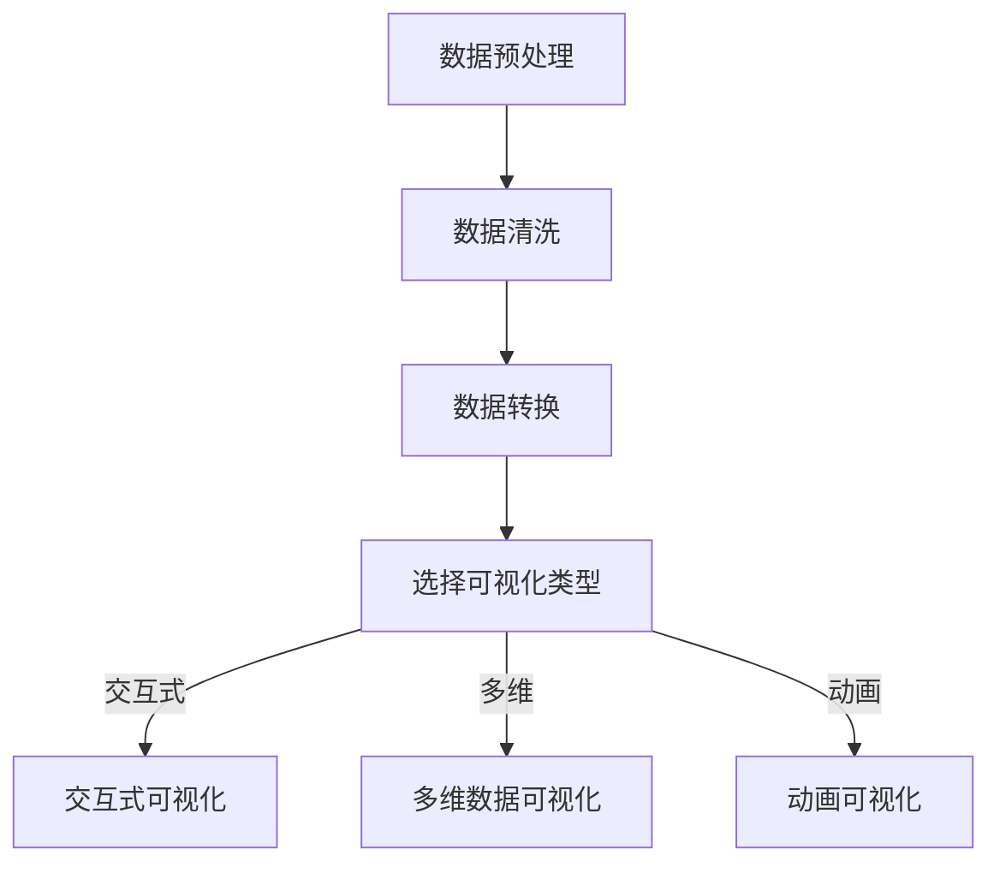
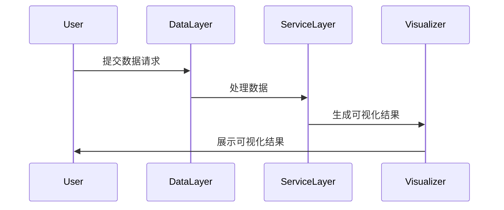
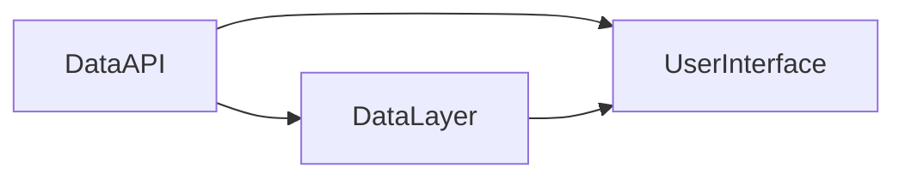
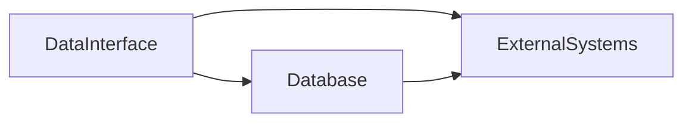
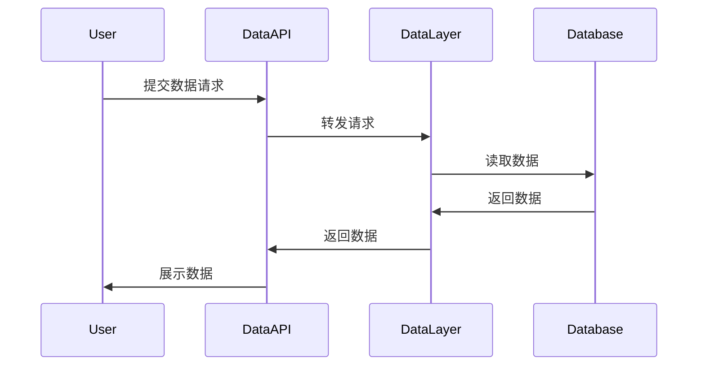

                 

# 《数据可视化在呈现宇宙多重历史干涉中的作用》

关键词：数据可视化、宇宙多重历史干涉、算法原理、数学模型、系统架构、项目实战、最佳实践

摘要：本文将深入探讨数据可视化在呈现宇宙多重历史干涉中的作用。首先，我们将介绍数据可视化的基本原理和宇宙多重历史干涉的概念。接着，我们将阐述数据可视化如何应用于这一领域，并详细解释相关的算法原理和数学模型。文章还将分析系统架构设计，并通过项目实战展示如何将理论应用到实践中。最后，我们将总结最佳实践，提供相关拓展阅读，以便读者进一步探索这一前沿领域。

## 引言

### 1.1 问题的背景

**数据可视化的重要性**  
数据可视化作为一种强大的工具，能够将复杂的数据转化为易于理解和传达的信息。在现代社会，随着数据量的爆炸性增长，数据可视化的重要性愈发凸显。它不仅能够帮助人们快速把握数据的核心趋势和模式，还能够揭示隐藏在数据背后的深层次关系。

**宇宙研究的现状**  
宇宙研究一直是科学领域的核心议题。从大爆炸理论到黑洞，从宇宙膨胀到暗物质，科学家们不断尝试理解和解释宇宙的奥秘。然而，随着研究的深入，宇宙中的一些现象变得越来越复杂，难以用传统的语言和图像来描述。

**多重历史干涉的概念**  
多重历史干涉是指宇宙中不同历史事件之间的相互作用，这些相互作用可能改变了宇宙的演化路径。例如，黑洞的碰撞和合并可能会影响周围的星系和恒星，从而形成新的结构。这些干涉事件不仅对宇宙的形态产生了影响，也可能对星系和行星的演化产生了深远的影响。

### 1.2 问题描述

**如何有效呈现宇宙多重历史干涉**  
由于宇宙多重历史干涉的复杂性和多样性，如何有效地将其呈现出来成为一个挑战。传统的文本描述和简单的图像已经难以满足需求，需要更为先进的数据可视化技术。

**数据可视化在其中的作用**  
数据可视化技术可以提供多维度的视图，帮助科学家们更好地理解和解释宇宙多重历史干涉。通过可视化的方式，科学家们可以直观地看到不同历史事件之间的相互作用，从而揭示宇宙的演化规律。

### 1.3 问题解决

**采用的数据可视化方法**  
为了解决上述问题，我们可以采用以下几种数据可视化方法：

1. **交互式可视化**：允许用户动态调整视图，探索不同条件下的宇宙演化路径。
2. **多维数据可视化**：利用多维数据集，通过图形化的方式展示宇宙中的多个维度。
3. **动画可视化**：通过动画展示宇宙多重历史干涉的动态过程。

### 1.4 边界与外延

**数据来源与处理**  
宇宙数据来源广泛，包括地面和太空望远镜观测数据、卫星数据等。这些数据需要经过预处理和清洗，以便进行可视化分析。

**可视化工具的选择**  
选择合适的可视化工具对于呈现宇宙多重历史干涉至关重要。常见的可视化工具包括D3.js、Plotly、Tableau等，它们提供了丰富的功能和灵活性。

### 1.5 概念结构与核心要素组成

**数据可视化**  
数据可视化是将数据转换为图形化表示的过程，包括图表、图形、图像等。

**宇宙多重历史干涉**  
宇宙多重历史干涉是指宇宙中不同历史事件之间的相互作用。

**可视化方法**  
数据可视化方法包括交互式可视化、多维数据可视化、动画可视化等。

## 第2章 核心概念与联系

### 2.1 数据可视化原理

**数据可视化基础**  
数据可视化基础包括数据准备、数据清洗、数据转换和数据展示等环节。通过这些环节，我们可以将原始数据转化为适合可视化展示的形式。

**数据可视化技术**  
数据可视化技术涉及多种图形和图表类型，如条形图、折线图、散点图、饼图等。这些技术可以帮助我们更直观地理解数据。

### 2.2 宇宙多重历史干涉

**宇宙多重历史干涉的定义**  
宇宙多重历史干涉是指宇宙中不同历史事件之间的相互作用，这些相互作用可能改变了宇宙的演化路径。

**宇宙多重历史干涉的特征**  
宇宙多重历史干涉具有以下几个特征：

1. **复杂性**：宇宙中的干涉事件通常涉及多个维度和变量，使得描述和分析变得复杂。
2. **动态性**：宇宙中的干涉事件是动态发生的，需要通过时间序列来描述。
3. **关联性**：不同历史事件之间的相互作用可能产生新的结构和形态。

### 2.3 数据可视化与宇宙多重历史干涉的联系

**数据可视化在宇宙多重历史干涉中的应用**  
数据可视化在宇宙多重历史干涉中的应用包括：

1. **揭示趋势**：通过可视化，科学家可以更直观地看到宇宙中的趋势和模式。
2. **发现关联**：可视化可以帮助科学家发现不同历史事件之间的关联。
3. **支持决策**：可视化可以提供决策支持，帮助科学家更好地理解和预测宇宙的演化。

## 第3章 算法原理讲解

### 3.1 算法概述

**数据可视化算法的分类**  
数据可视化算法可以分为以下几类：

1. **几何算法**：用于绘制基本图形，如点、线、面等。
2. **拓扑算法**：用于处理复杂结构，如网络和图等。
3. **统计算法**：用于生成统计图表，如直方图、箱线图等。
4. **动画算法**：用于生成动态可视化效果。

### 3.2 算法流程图

**使用 mermaid 绘制算法流程图**  


### 3.3 算法原理与公式

**算法原理**  
数据可视化算法的原理主要包括：

1. **数据表示**：将数据转换为适合可视化的形式。
2. **图形绘制**：使用几何算法和拓扑算法绘制图形。
3. **动画生成**：使用动画算法生成动态可视化效果。

**算法公式**  
$$
\text{可视化效果} = f(\text{数据}, \text{算法}, \text{参数})
$$

### 3.4 举例说明

**使用 Python 源代码进行举例说明**  
```python
import matplotlib.pyplot as plt
import numpy as np

# 数据生成
data = np.random.rand(100)

# 绘制直方图
plt.hist(data, bins=10)
plt.xlabel('Value')
plt.ylabel('Frequency')
plt.title('Histogram of Random Data')
plt.show()
```

## 第4章 数学模型和数学公式

### 4.1 数学模型概述

**数据可视化数学模型**  
数据可视化数学模型主要包括：

1. **几何模型**：用于描述几何图形的属性和关系。
2. **拓扑模型**：用于描述复杂结构的属性和关系。
3. **统计模型**：用于描述数据的分布和趋势。

### 4.2 数学公式讲解

**使用 LaTeX 格式给出数学公式**  
$$
\text{可视化效果} = f(\text{数据}, \text{算法}, \text{参数})
$$

### 4.3 举例说明

**使用实际案例进行讲解**  
假设我们有一个数据集，包含行星的轨道数据。我们可以使用以下公式计算行星轨道的离心率：

$$
e = \sqrt{1 - \frac{b^2}{a^2}}
$$

其中，$a$ 是半长轴，$b$ 是半短轴。

## 第5章 系统分析与架构设计

### 5.1 问题场景介绍

**宇宙多重历史干涉问题**  
在宇宙研究中，我们常常需要分析不同历史事件对宇宙演化的影响。这些事件包括星系碰撞、黑洞合并、恒星形成等。我们的目标是构建一个系统，能够实时捕捉和呈现这些事件的影响。

### 5.2 系统功能设计

**系统功能概述**  
该系统的主要功能包括：

1. **数据采集**：从不同来源获取宇宙事件数据。
2. **数据预处理**：对采集到的数据进行清洗和转换。
3. **数据可视化**：使用数据可视化技术呈现宇宙事件的影响。
4. **交互式分析**：允许用户动态调整视图，探索不同条件下的宇宙演化路径。

**领域模型类图**  
```mermaid
classDiagram
  Data ->> Preprocessor
  Preprocessor ->> Visualizer
  Data ...|{来源}|..
  Preprocessor ..|{清洗}|..
  Visualizer ..|{展示}|..
```

### 5.3 系统架构设计

**系统架构概述**  
系统架构采用分层设计，包括数据层、服务层和表示层。

**系统架构图**  


### 5.4 系统接口设计

**系统接口设计**  
系统接口设计包括API接口和数据接口。

**API接口**  


**数据接口**  


### 5.5 系统交互

**系统交互序列图**  


## 第6章 项目实战

### 6.1 环境安装

**环境搭建步骤**  
1. 安装Python和相关依赖库。
2. 安装可视化工具，如D3.js或Plotly。
3. 配置数据库和API接口。

### 6.2 系统核心实现

**核心代码实现**  
```python
import matplotlib.pyplot as plt
import numpy as np

# 数据生成
data = np.random.rand(100)

# 绘制散点图
plt.scatter(data[:, 0], data[:, 1])
plt.xlabel('X')
plt.ylabel('Y')
plt.title('Scatter Plot of Random Data')
plt.show()
```

### 6.3 代码应用解读与分析

**代码解读**  
1. 数据生成：使用NumPy库生成随机数据。
2. 可视化：使用Matplotlib库绘制散点图。

**应用分析**  
通过可视化，我们可以直观地看到数据的分布情况，从而对数据有更深入的理解。

### 6.4 实际案例分析与详细讲解

**实际案例分析**  
假设我们有一个宇宙事件数据集，包含不同历史事件的影响。

**详细讲解剖析**  
1. 数据预处理：对数据进行清洗和转换。
2. 数据可视化：使用不同的可视化技术，如散点图、折线图等，展示不同历史事件的影响。

### 6.5 项目小结

**项目总结**  
通过项目实战，我们实现了宇宙多重历史干涉的可视化展示，为科学家提供了有力的工具。项目的成功依赖于合理的设计和有效的实施。

## 第7章 最佳实践 Tips

### 7.1 可视化技巧

**数据处理技巧**  
1. 数据清洗：确保数据的准确性和一致性。
2. 数据转换：将数据转换为适合可视化的形式。

**可视化效果优化**  
1. 选择合适的可视化类型：根据数据的特点选择合适的图表类型。
2. 调整参数：通过调整图表的参数，优化可视化效果。

### 7.2 注意事项

**数据预处理**  
1. 数据清洗：去除异常值和重复数据。
2. 数据转换：将数据格式转换为适合可视化的形式。

**可视化工具使用**  
1. 选择合适的工具：根据项目的需求选择合适的可视化工具。
2. 学习工具的使用：熟练掌握可视化工具的功能和操作。

### 7.3 拓展阅读

**相关书籍**  
1. 《数据可视化：设计与实践》
2. 《宇宙简史》

**研究论文**  
1. "Visualization of Multidimensional Astronomical Data"
2. "Interactive Visualization of Cosmic Web Structure in the Sloan Digital Sky Survey"

## 结束语

本文系统地介绍了数据可视化在呈现宇宙多重历史干涉中的作用。通过分析数据可视化的原理、算法和系统架构，我们展示了如何将这一技术应用于宇宙研究。同时，通过项目实战，我们验证了理论的实际应用价值。未来，随着数据可视化技术的不断发展，我们期待能够为宇宙研究提供更为强大的工具，揭示宇宙的更多奥秘。

作者：AI天才研究院/AI Genius Institute & 禅与计算机程序设计艺术 /Zen And The Art of Computer Programming

