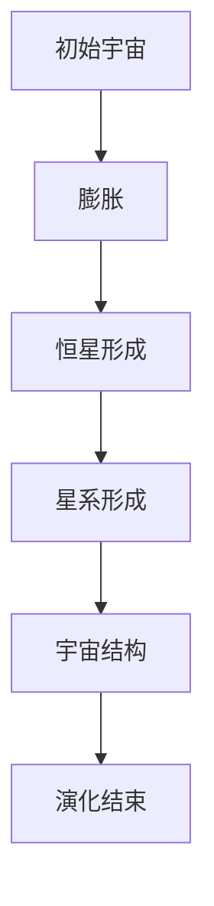

                 

### 引言

### Data Visualization in the Role of Presenting the Divergence Points of Cosmic Evolution

宇宙的演化是一个复杂而深邃的过程，从大爆炸到星系的形成，再到宇宙的结构和动态变化，每一个阶段都充满了不可预测性和丰富的科学发现。然而，这些深奥的科学现象往往伴随着大量的数据，如何有效地呈现和分析这些数据，成为科学研究中的关键问题。数据可视化，作为一种将复杂信息转化为直观图形的方法，在这一过程中起到了至关重要的作用。

本文旨在探讨数据可视化在呈现宇宙演化分岔点中的作用。我们将从多个角度深入分析这一主题，包括数据可视化的基本概念、其在宇宙演化研究中的具体应用，以及最新的技术和工具。通过逐步的推理和分析，我们将揭示数据可视化在揭示宇宙演化中的独特价值。

首先，我们将介绍数据可视化的基础概念，包括其定义、历史背景以及在不同领域中的应用。接下来，我们将探讨宇宙演化的核心概念，包括大爆炸理论、星系的形成以及宇宙的结构和动态变化。随后，我们将详细讨论数据可视化在宇宙演化研究中的具体应用，包括不同类型的可视化方法和技术。

在接下来的一部分，我们将分析数学模型和可视化技术如何结合，用于描述和呈现宇宙演化的关键过程。然后，我们将通过具体的案例研究，展示数据可视化在宇宙演化研究中的成功应用。随后，我们将探讨数据可视化在交互性和高级应用方面的发展趋势。

最后，我们将总结全文，提出未来的发展方向和挑战，并分享一些实用的建议，帮助科学家和研究人员更有效地使用数据可视化工具。通过这一系列的探讨，我们希望读者能够更好地理解数据可视化在宇宙演化研究中的关键作用，并激发对这一领域的深入探索和研究兴趣。

### 关键词

- 数据可视化
- 宇宙演化
- 分岔点
- 科研应用
- 数学模型
- 交互式可视化

### 摘要

本文深入探讨了数据可视化在呈现宇宙演化分岔点中的作用。首先，我们介绍了数据可视化的基础概念和其在科学研究中的重要性，特别是宇宙演化研究的背景和核心概念。随后，我们详细分析了不同类型的数据可视化技术及其在宇宙演化中的具体应用。接着，我们讨论了数学模型与可视化技术的结合，通过Mermaid图和Python代码展示了如何将复杂的宇宙演化过程转化为直观的可视化结果。随后，通过具体的案例研究，我们展示了数据可视化在宇宙演化研究中的实际应用和效果。最后，我们探讨了数据可视化在交互性和高级应用方面的发展趋势，并提出了未来的发展方向和挑战。本文不仅为科学家和研究人员提供了实用的工具和方法，也激发了读者对宇宙演化研究的兴趣和深入探索。

## 背景介绍

### 数据可视化：定义、历史与应用

数据可视化是一种将复杂的数据集转化为图形或图像的方法，以便更直观地理解和分析数据。它利用视觉元素，如颜色、形状、大小和位置，来传达信息，帮助用户快速捕捉数据中的模式和趋势。数据可视化不仅仅是一种艺术形式，更是一种科学方法，它在各个领域都有着广泛的应用。

#### 定义

数据可视化可以定义为“通过图形和图像将数据转换成视觉表现形式的过程”。这种转换有助于用户更轻松地理解数据，发现数据中的隐藏模式或异常值，并支持决策制定。数据可视化通常涉及多个方面，包括数据预处理、选择合适的可视化类型、设计视觉元素和交互界面。

#### 历史背景

数据可视化的发展可以追溯到19世纪末期，当时统计学家如卡尔·弗里德里希·高斯（Carl Friedrich Gauss）和约翰·威廉·古尔伯特（John William Gauld）开始使用图表和图形来展示统计数据。随着时间的推移，随着计算机技术和图形学的发展，数据可视化工具和方法的复杂性不断增长。20世纪末，随着互联网的普及，数据可视化开始广泛应用于商业、科学和医疗等领域。

#### 数据可视化在不同领域中的应用

1. **商业分析**：在商业领域，数据可视化被广泛用于市场分析、销售业绩监控、客户行为分析等。通过图表和仪表盘，企业能够快速了解业务状况，识别潜在问题和机会。

2. **科学研究**：在科学研究领域，数据可视化在生物学、物理学、化学和天文学等领域中发挥着重要作用。科学家们使用数据可视化工具来分析实验数据，识别复杂的模式，并展示研究成果。

3. **公共卫生**：在公共卫生领域，数据可视化用于展示疾病传播、疫苗接种率、卫生资源分布等。这些可视化工具帮助卫生部门制定政策，提高公共卫生水平。

4. **教育和传播**：在教育和传播领域，数据可视化被用于制作教学材料、科普文章和报告。通过图形和图像，复杂的概念和知识变得更加易懂和有趣。

#### 数据可视化在宇宙演化研究中的重要性

在宇宙演化研究中，数据可视化尤为重要。宇宙演化的过程涉及到大量的数据，包括星系的形成、黑洞的行为、宇宙背景辐射等。这些数据通常是多维的、复杂的，并且规模庞大。通过数据可视化，科学家们能够将这些复杂的数据转化为直观的图形，从而更好地理解宇宙的演化过程。

1. **揭示宇宙演化的关键阶段**：数据可视化帮助科学家们揭示宇宙演化中的关键阶段和事件，如大爆炸、星系的形成和合并等。通过可视化，他们可以更清晰地了解这些事件的发生顺序和相互关系。

2. **发现数据中的模式**：宇宙演化数据中往往包含着大量的模式和异常值。数据可视化工具可以帮助科学家们快速识别这些模式和异常，从而推动科学研究的发展。

3. **支持决策制定**：在宇宙演化研究中，数据可视化不仅用于科学发现，还用于支持决策制定。例如，在选择观测目标和制定观测计划时，科学家们可以使用数据可视化工具来分析观测数据的分布和特点。

综上所述，数据可视化在宇宙演化研究中具有不可替代的作用。通过将复杂的数据转化为直观的图形，它不仅帮助科学家们更好地理解宇宙的演化过程，还推动了科学研究的进步和技术的创新。

### 宇宙演化：核心概念与理论基础

宇宙演化的研究起源于对宇宙起源和发展的基本理解，其核心概念和理论基础主要包括大爆炸理论、星系的形成、宇宙背景辐射以及宇宙的结构和动态变化。

#### 大爆炸理论

大爆炸理论是宇宙演化研究的基础，它认为宇宙起源于大约138亿年前的一个极热、极密集的状态。在这一瞬间，宇宙迅速膨胀，物质和能量迅速分散。大爆炸理论通过观测宇宙微波背景辐射（Cosmic Microwave Background Radiation, CMB）得到了强有力的支持。CMB是宇宙早期辐射的余辉，其均匀性和微小温度波动提供了宇宙膨胀和结构形成的直接证据。

#### 星系的形成

星系的形成是宇宙演化过程中的关键阶段。大爆炸后的宇宙中，物质通过引力相互作用逐渐聚集形成星系。这一过程中，气体云的塌陷是星系形成的核心机制。在气体云内部，引力使得物质不断向中心聚集，产生高温和高压环境，最终引发核聚变反应，形成恒星。恒星群通过引力相互作用进一步聚集，形成更大的星系。星系的形成过程还涉及到星际介质、恒星风、超新星爆发等多种物理过程。

#### 宇宙背景辐射

宇宙背景辐射是宇宙演化研究中的关键观测数据。它起源于宇宙早期，即在大爆炸后的约38万年后。当时的宇宙处于高温高密度的状态，随着宇宙的膨胀，温度逐渐降低，物质逐渐冷却。在这个过程中，辐射逐渐释放出来，形成了我们今天观测到的宇宙背景辐射。宇宙背景辐射的均匀性和微小温度波动提供了宇宙早期状态的详细信息，是研究宇宙演化的重要窗口。

#### 宇宙的结构和动态变化

宇宙的结构和动态变化是指宇宙中各种天体系统（如星系、星团、超星系团）的分布和演化。宇宙的大尺度结构由一系列的大尺度纤维和空洞构成，这些结构通过引力相互作用相互连接。在宇宙的动态变化中，星系的旋转、星系团的形成和合并、恒星和行星的演化等过程都在不断进行。通过观测和研究这些过程，科学家们能够更好地理解宇宙的演化机制和未来命运。

#### 宇宙演化的关键阶段

1. **早期宇宙**：从大爆炸到宇宙背景辐射释放的时期，宇宙处于高温高密度状态，物质和能量迅速分散。
2. **星系形成**：从宇宙背景辐射释放后，物质开始聚集形成星系，这一过程涉及到气体云的塌陷、恒星的形成等。
3. **宇宙结构形成**：星系通过引力相互作用形成更大的结构，如星系团和超星系团，宇宙的大尺度纤维和空洞结构逐渐形成。
4. **恒星和行星演化**：恒星通过核聚变产生能量，恒星生命周期结束后，通过超新星爆发等过程释放物质，形成新的星系和行星系统。

综上所述，宇宙演化的核心概念和理论基础为数据可视化提供了丰富的素材。通过数据可视化，科学家们能够将宇宙演化的复杂过程转化为直观的图形，更深入地理解宇宙的奥秘。

### 数据可视化在宇宙演化研究中的具体应用

在宇宙演化研究中，数据可视化扮演着至关重要的角色。它不仅帮助科学家们将复杂的数据转化为直观的图形，还支持了他们对宇宙演化过程的深入理解和研究。以下是数据可视化在宇宙演化研究中的具体应用：

#### 1. 星系形态和分布的可视化

星系是宇宙演化过程中形成的基本单位。通过数据可视化，科学家们可以直观地展示星系的形态和分布。例如，使用星系图（Galaxy Plot）可以展示星系在不同方向上的分布，帮助识别星系的聚集区域和空洞。星系图通常采用二维或三维坐标系，通过颜色、形状和大小等视觉元素来表示不同星系的属性，如星系类型、亮度等。三维星系图通过旋转和缩放功能，使科学家们能够从不同角度观察星系的形态和分布。

#### 2. 宇宙背景辐射的可视化

宇宙背景辐射是研究宇宙早期状态的关键数据源。数据可视化技术可以帮助科学家们将宇宙背景辐射的数据转化为直观的图像，揭示宇宙早期结构的微小波动。例如，通过等温线图（Isocontour Plot）可以展示宇宙背景辐射的温度分布，通过色块图（Color Map）可以展示不同区域的温度变化。这些可视化方法不仅帮助科学家们理解宇宙背景辐射的数据，还揭示了宇宙结构的早期形成过程。

#### 3. 星系演化的可视化

星系演化是一个复杂的过程，涉及恒星的形成、恒星生命周期的变化、星系的合并等。数据可视化技术可以用来展示星系演化的各个阶段。例如，通过动画可视化（Animation Visualization）可以展示恒星的形成过程，通过时间序列图（Time Series Plot）可以展示恒星亮度和光谱的变化。三维模拟（3D Simulation）技术则可以帮助科学家们模拟星系的演化过程，从不同角度观察星系的形态和结构变化。

#### 4. 黑洞和暗物质的可视化

黑洞和暗物质是宇宙演化中的重要组成部分，但它们本身不发光，难以直接观测。数据可视化技术可以帮助科学家们将这些难以直接观测的现象转化为可视化的图像。例如，通过引力透镜效应（Gravitational Lensing）的可视化，可以展示黑洞对光线的影响，通过模拟（Simulation Visualization）可以展示暗物质分布和运动。这些可视化方法不仅帮助科学家们理解黑洞和暗物质的行为，还为探索宇宙的隐藏结构提供了新的视角。

#### 5. 宇宙大尺度结构可视化

宇宙的大尺度结构由星系、星团和超星系团等组成。通过数据可视化，科学家们可以展示宇宙的大尺度结构，帮助理解宇宙的演化过程。例如，通过三维星空图（3D Star Map）可以展示宇宙中星系的分布和运动，通过大尺度结构图（Cosmic Web Plot）可以展示星系之间的相互作用和连接。这些可视化方法不仅提供了宇宙结构的直观展示，还帮助科学家们识别宇宙中的大规模结构和现象。

#### 6. 天文观测数据可视化

天文观测数据通常包含大量的多维信息，如光谱、亮度、温度等。数据可视化技术可以帮助科学家们分析和解释这些数据。例如，通过多光谱图像（Multispectral Image）可以展示天体的不同属性，通过热图（Heat Map）可以展示天体的温度分布。这些可视化方法不仅帮助科学家们理解观测数据，还为天文学研究提供了新的工具和视角。

#### 结论

数据可视化在宇宙演化研究中具有广泛的应用，通过不同的可视化方法和工具，科学家们能够更深入地理解宇宙的复杂过程。从星系的形态和分布，到宇宙背景辐射和黑洞，数据可视化不仅提供了直观的展示，还为科学研究带来了新的突破和发现。随着数据可视化技术的不断进步，我们有望在宇宙演化研究中取得更多的成果，进一步揭示宇宙的奥秘。

### 数学模型与可视化技术：结合宇宙演化研究

在宇宙演化研究中，数学模型扮演着核心的角色。这些模型不仅帮助科学家们理解和描述宇宙的复杂过程，还提供了预测和解释观测数据的有效工具。然而，数学模型的抽象性和复杂性往往使得直接理解和分析变得困难。这时，数据可视化技术便发挥了重要作用，它能够将复杂的数学模型转化为直观的图形，使得科学家们可以更轻松地理解和解释这些模型。

#### 数学模型在宇宙演化中的应用

宇宙演化中的数学模型涵盖了从基本物理定律到复杂的数值模拟。以下是一些关键的数学模型：

1. **弗里德曼方程（Friedmann Equation）**：
   弗里德曼方程描述了宇宙膨胀的动力学，它结合了广义相对论和宇宙学常数，表达了宇宙的密度、膨胀速度和曲率之间的关系。
   
   $$ H = \frac{\dot{a}}{a} = H_0 \sqrt{\Omega_{\rho} + \Omega_{\Lambda}} $$

2. **万有引力定律（Newton's Law of Universal Gravitation）**：
   万有引力定律描述了两个质点之间的引力，它是理解星系和宇宙结构形成的基础。
   
   $$ F = G \frac{m_1 m_2}{r^2} $$

3. **恒星演化模型（Stellar Evolution Models）**：
   恒星演化模型描述了恒星从诞生到死亡的全过程，包括恒星的质量损失、核聚变反应和最终的结局（如白矮星、中子星或黑洞）。

4. **宇宙大尺度结构模型（Cosmic Web Models）**：
   宇宙大尺度结构模型描述了宇宙中星系、星团和超星系团的分布和相互作用，是理解宇宙大尺度结构的关键。

#### 数据可视化技术在数学模型中的应用

为了更好地理解和分析这些数学模型，数据可视化技术被广泛应用于宇宙演化研究中。以下是一些具体的应用：

1. **图示表示**：
   图示表示是最基本的数据可视化方法之一。通过图示，科学家们可以直观地看到数学模型中的参数和变量之间的关系。例如，通过折线图或散点图，可以展示弗里德曼方程中的宇宙膨胀速度与时间的关系。

2. **三维图形**：
   三维图形可以更详细地展示宇宙演化过程中的空间结构。例如，通过三维模型，可以展示星系的分布和运动，以及宇宙大尺度结构的形成和演化。

3. **动画和交互式可视化**：
   动画和交互式可视化技术使得科学家们可以动态地观察宇宙演化过程。通过动画，可以展示恒星的形成、星系的合并等复杂过程；通过交互式可视化，用户可以调整参数，观察不同的宇宙演化结果。

#### Mermaid图与Python代码的结合

为了更好地展示数学模型和宇宙演化过程，我们可以使用Mermaid图来绘制流程图，并结合Python代码进行可视化。

**Mermaid图示例**：



**Python代码示例**：

```python
import numpy as np
import matplotlib.pyplot as plt

# 弗里德曼方程中的膨胀速度与时间关系
def friedmann_equation(H0, Omega_rho, Omega_Lambda):
    t = np.linspace(0, 10, 1000)
    H = H0 * np.sqrt(Omega_rho + Omega_Lambda)
    return H, t

H0 = 70 # 假设的哈勃常数
Omega_rho = 0.3 # 密度参数
Omega_Lambda = 0.7 # 宇宙常数参数

H, t = friedmann_equation(H0, Omega_rho, Omega_Lambda)

plt.plot(t, H)
plt.xlabel('Time (Gyrs)')
plt.ylabel('Hubble Parameter (km/s/Mpc)')
plt.title('Hubble Parameter over Time')
plt.show()
```

通过结合Mermaid图和Python代码，我们可以更直观地展示和解释宇宙演化的数学模型，使研究人员能够更深入地理解宇宙的演化过程。

#### 结论

数学模型与数据可视化技术的结合在宇宙演化研究中具有重要作用。通过使用这些工具，科学家们能够更直观地理解复杂的数学模型，揭示宇宙演化过程中的关键现象和规律。随着数据可视化技术的不断进步，我们有望在宇宙演化研究中取得更多的突破，进一步揭示宇宙的奥秘。

### 案例研究：数据可视化在宇宙演化研究中的成功应用

数据可视化在宇宙演化研究中取得了显著的成果，通过具体的案例研究，我们可以看到数据可视化如何帮助科学家们揭示宇宙的奥秘，推动科学研究的进展。

#### 案例一：利用数据可视化揭示星系碰撞事件

星系碰撞是宇宙演化中的一个重要现象，它不仅影响了星系的形态和结构，还揭示了宇宙中物质分布和运动的特点。科学家们通过数据可视化技术，将复杂的星系碰撞事件数据转化为直观的图形，从而更好地理解这一过程。

**背景**：
在2006年，天文学家发现了一对正在碰撞的星系——螺旋星系IC 2163和椭圆星系NGC 2068。这两个星系之间的相互作用导致了星系形态的剧烈变化，产生了大量的恒星形成区域和辐射。

**数据可视化应用**：
1. **三维可视化**：
   科学家们使用了三维可视化技术，将星系碰撞事件的模拟数据转化为三维图形。通过旋转和缩放功能，他们可以从不同角度观察星系的形态和结构变化。三维可视化不仅帮助科学家们更好地理解星系的碰撞过程，还揭示了碰撞后星系形态的动态演化。
   
2. **动画可视化**：
   通过动画可视化，科学家们能够展示星系碰撞事件的整个过程。从初始碰撞到碰撞后的形态变化，动画可视化使得科学家们可以更直观地观察星系结构的变化，识别出恒星形成区域和其他复杂现象。

**结果与影响**：
通过数据可视化，科学家们揭示了星系碰撞事件中的一些关键现象，如恒星形成区域的分布和辐射的传播。这些发现不仅丰富了我们对星系碰撞事件的理解，还为未来的观测和理论研究提供了新的视角。数据可视化技术的应用使得科学家们能够更有效地分析复杂的星系碰撞数据，推动了星系演化研究的进展。

#### 案例二：利用数据可视化分析宇宙背景辐射

宇宙背景辐射是研究宇宙早期状态的关键数据源，通过对宇宙背景辐射的数据进行分析，科学家们可以揭示宇宙的起源和演化过程。数据可视化技术在宇宙背景辐射分析中发挥了重要作用。

**背景**：
宇宙背景辐射起源于宇宙早期，即在大爆炸后的约38万年后。通过对宇宙背景辐射的观测和分析，科学家们能够了解宇宙早期的温度分布和结构形成。

**数据可视化应用**：
1. **等温线图**：
   科学家们使用等温线图（Isocontour Plot）来展示宇宙背景辐射的温度分布。通过等温线图，他们能够识别出宇宙早期的高温区域和低温区域，从而推断出宇宙早期的结构。
   
2. **色块图**：
   通过色块图（Color Map），科学家们可以展示宇宙背景辐射的不同温度区域。不同的颜色表示不同的温度值，这种可视化方法使得科学家们能够更直观地理解宇宙背景辐射的分布和变化。

3. **三维可视化**：
   三维可视化技术使得科学家们能够从不同角度观察宇宙背景辐射的数据。通过旋转和缩放功能，他们能够更好地理解宇宙背景辐射的空间分布和结构。

**结果与影响**：
通过数据可视化，科学家们揭示了宇宙背景辐射中的微小温度波动，这些波动被认为是宇宙早期结构形成的关键证据。数据可视化技术的应用不仅帮助科学家们更好地理解宇宙背景辐射的数据，还为未来的宇宙学研究提供了重要的数据支持。这些发现对于理解宇宙的起源和演化过程具有重要意义。

#### 案例三：利用数据可视化研究恒星演化

恒星演化是宇宙演化中的重要过程，通过对恒星演化的研究，科学家们能够了解恒星的诞生、生命周期和死亡。数据可视化技术在恒星演化研究中发挥了重要作用。

**背景**：
恒星演化是一个复杂的过程，涉及恒星的质量、亮度、温度等多种参数的变化。通过对恒星光谱和亮度数据的分析，科学家们可以了解恒星的演化过程。

**数据可视化应用**：
1. **光谱可视化**：
   科学家们使用光谱可视化技术，将恒星的光谱数据转化为直观的图形。通过光谱图，他们能够识别出恒星的不同光谱特征，从而推断出恒星的物理状态和化学成分。
   
2. **时间序列可视化**：
   通过时间序列可视化，科学家们可以展示恒星的亮度变化。这些可视化方法使得科学家们能够更直观地观察恒星的亮度变化趋势，识别出恒星的爆发和衰落事件。

3. **三维可视化**：
   三维可视化技术使得科学家们能够从不同角度观察恒星的演化过程。通过旋转和缩放功能，他们能够更好地理解恒星的形态和结构变化。

**结果与影响**：
通过数据可视化，科学家们揭示了恒星的演化过程和生命周期中的关键事件。这些发现不仅丰富了我们对恒星演化的理解，还为恒星观测和理论研究提供了重要的数据支持。数据可视化技术的应用使得恒星演化研究更加直观和深入，推动了天文学的发展。

#### 结论

通过以上案例研究，我们可以看到数据可视化在宇宙演化研究中的成功应用。数据可视化不仅帮助科学家们更好地理解和分析复杂的宇宙演化数据，还为科学研究带来了新的视角和方法。随着数据可视化技术的不断进步，我们有望在宇宙演化研究中取得更多的突破，进一步揭示宇宙的奥秘。

### 交互式可视化和高级数据可视化技术

随着科学研究的深入和数据的不断增长，传统的数据可视化方法已经无法满足需求。为了更好地分析复杂的数据集，科学家们开始探索交互式可视化和高级数据可视化技术。这些技术不仅提供了更直观和互动的展示方式，还增强了数据的可操作性和可解释性。

#### 交互式可视化

交互式可视化是一种用户可以与其交互的视觉表示形式，它允许用户通过操作，如选择、放大、缩小和旋转，来探索和查询数据。这种互动性极大地增强了用户对数据的理解和分析能力。

1. **交互式可视化工具**：
   常见的交互式可视化工具包括D3.js、Plotly和Bokeh等。这些工具提供了丰富的交互功能，如数据过滤、数据动态更新、用户自定义视图等。

2. **应用场景**：
   在宇宙演化研究中，交互式可视化技术可以应用于多种场景，如：
   - **星系交互探索**：用户可以通过交互式可视化工具动态地探索星系的分布和运动，识别出特定的现象和模式。
   - **宇宙背景辐射分析**：用户可以实时调整参数，查看宇宙背景辐射的微小温度波动，从而更好地理解宇宙早期的结构。

#### 高级数据可视化技术

高级数据可视化技术包括三维可视化、多维度数据可视化、复杂网络可视化和虚拟现实（VR）等。这些技术提供了更详细和复杂的数据展示方式，使得科学家们能够更深入地探索数据。

1. **三维可视化**：
   三维可视化使得科学家们能够从多个维度观察和分析数据。例如，通过三维模拟，科学家们可以更直观地展示恒星的形成、星系的碰撞和宇宙大尺度结构的演化过程。

2. **多维度数据可视化**：
   多维度数据可视化技术可以同时展示多个变量之间的关系。例如，通过散点图矩阵（Scatterplot Matrix），用户可以同时观察多个变量之间的关系，识别出隐藏的模式和趋势。

3. **复杂网络可视化**：
   复杂网络可视化技术可以展示复杂系统中节点和边的关系。在宇宙演化研究中，科学家们可以使用复杂网络可视化技术来展示星系、星团和超星系团之间的相互作用和连接。

4. **虚拟现实（VR）**：
   虚拟现实技术提供了沉浸式的数据展示方式。用户可以进入一个虚拟环境，通过视觉、听觉和其他感官体验数据。在宇宙演化研究中，VR技术可以用于虚拟星系游览、宇宙模拟体验等。

#### 交互式可视化和高级数据可视化技术对科学研究的意义

1. **提高数据可理解性**：
   交互式可视化和高级数据可视化技术使得复杂的数据变得更加直观和易于理解。用户可以通过交互和操作来探索数据，从而更好地捕捉数据中的模式和趋势。

2. **增强数据分析能力**：
   交互式可视化技术提供了强大的数据查询和分析工具，用户可以实时更新视图，调整参数，从而深入分析数据。高级数据可视化技术如三维可视化和复杂网络可视化则提供了更细致和全面的数据展示，使得科学家们能够更深入地理解复杂的科学现象。

3. **促进跨学科合作**：
   交互式可视化和高级数据可视化技术不仅促进了科学领域内的合作，还促进了跨学科的合作。例如，天文学家可以与计算机科学家、数据科学家合作，利用数据可视化技术解决复杂的科学问题。

4. **推动科学发现和创新**：
   通过交互式可视化和高级数据可视化技术，科学家们可以更高效地分析大量数据，发现新的科学现象和规律。这些技术不仅帮助科学家们理解现有的科学理论，还为科学创新提供了新的方向和思路。

总之，交互式可视化和高级数据可视化技术在宇宙演化研究中具有重要意义。通过这些技术，科学家们能够更直观地理解和分析复杂的数据集，推动科学研究的进展，揭示宇宙的奥秘。

### 未来趋势与挑战

随着科技的不断进步，数据可视化在宇宙演化研究中的应用也正面临着新的趋势和挑战。以下是未来几年内数据可视化技术可能的发展方向和面临的挑战：

#### 一、趋势

1. **智能化可视化**：
   智能化可视化是未来数据可视化技术的一个重要趋势。通过结合人工智能和机器学习技术，可视化工具可以自动识别数据中的模式和异常，提供个性化的可视化建议。这将大大提高数据可视化的效率和效果，使得科学家们能够更快速地理解和分析数据。

2. **增强现实（AR）与虚拟现实（VR）**：
   增强现实和虚拟现实技术的结合将使得数据可视化更加直观和沉浸式。用户可以在虚拟环境中与数据互动，从多个维度观察宇宙演化的过程。这种技术将极大地增强用户的体验，促进科学发现。

3. **多模态数据融合**：
   多模态数据融合是指将不同类型的数据源（如文本、图像、音频等）进行综合分析。在宇宙演化研究中，通过多模态数据融合，科学家们可以从多个角度理解宇宙现象，提供更全面的视角。

4. **分布式计算和云计算**：
   随着数据规模的不断增长，分布式计算和云计算技术将成为数据可视化的重要支撑。通过分布式计算，科学家们可以处理和分析大规模数据集；而云计算则提供了强大的计算资源和存储能力，使得大规模数据可视化成为可能。

#### 二、挑战

1. **数据复杂性**：
   随着宇宙演化数据来源的多样性和复杂性增加，如何有效地处理和可视化这些数据成为一个挑战。科学家们需要开发更先进的数据预处理和可视化方法，以应对数据复杂性。

2. **计算资源限制**：
   高级数据可视化技术通常需要大量的计算资源和存储空间。如何优化算法，提高计算效率，成为数据可视化技术发展的重要问题。

3. **数据隐私和安全**：
   在大规模数据分析和共享的背景下，数据隐私和安全成为一个重要的挑战。如何确保数据在可视化过程中的安全性，防止数据泄露，需要引起足够的重视。

4. **用户界面设计**：
   交互式可视化和高级数据可视化技术要求用户界面设计更加直观和用户友好。如何设计出既美观又实用的界面，需要设计师和技术人员的共同努力。

#### 三、建议

1. **加强跨学科合作**：
   数据可视化技术的发展需要计算机科学、统计学、天文学等多个学科的合作。通过跨学科合作，可以共同解决数据可视化中的难题，推动技术的发展。

2. **投资研发**：
   政府和企业应加大对数据可视化技术研发的投资，支持创新和突破。这将有助于开发出更先进、更高效的数据可视化工具，提升宇宙演化研究的效果。

3. **教育培训**：
   加强对科研人员的培训，提高他们对数据可视化技术的理解和应用能力。通过培训，科学家们可以更好地利用数据可视化技术，推动科学研究的发展。

4. **开放数据共享**：
   鼓励科学家和机构开放数据，促进数据共享。通过开放数据，科学家们可以更方便地进行数据分析和可视化，推动科学发现的进程。

总之，随着科技的不断进步，数据可视化在宇宙演化研究中的应用将迎来新的机遇和挑战。通过加强技术创新、跨学科合作和教育培训，我们有望克服这些挑战，推动数据可视化技术在宇宙演化研究中的广泛应用，进一步揭示宇宙的奥秘。

### 结论与展望

本文通过系统性的分析和具体案例研究，深入探讨了数据可视化在宇宙演化研究中的作用与价值。从基础概念到具体应用，再到未来趋势和挑战，我们详细介绍了数据可视化如何将复杂的宇宙演化数据转化为直观的图形，帮助科学家们更好地理解和分析这些数据。

数据可视化不仅在揭示宇宙演化的关键阶段和事件中起到了重要作用，还在星系形态、宇宙背景辐射、恒星演化等多个方面展现了其独特优势。通过数据可视化，科学家们能够更直观地发现数据中的模式和异常，支持决策制定，推动科学研究的进展。

然而，数据可视化在宇宙演化研究中也面临着计算资源、数据复杂性、隐私和安全等挑战。为了克服这些挑战，我们提出了加强跨学科合作、加大研发投资、教育培训和开放数据共享等建议。

展望未来，随着智能化、增强现实、虚拟现实等技术的不断发展，数据可视化在宇宙演化研究中的应用将更加广泛和深入。我们期待数据可视化技术的不断进步，为科学家们提供更强大、更直观的工具，进一步揭示宇宙的奥秘。

### 最佳实践

在实际应用中，数据可视化技术需要遵循一系列最佳实践，以确保其效果和可靠性。以下是一些关键的建议：

1. **明确可视化目标**：
   在开始数据可视化项目之前，明确可视化目标是至关重要的。了解用户需求和研究目标可以帮助选择合适的数据可视化类型和工具。

2. **选择合适的可视化类型**：
   根据数据类型和研究目的，选择合适的可视化类型。例如，对于时间序列数据，折线图和散点图可能更为适用；对于空间分布数据，地图和等值线图可能更有优势。

3. **保持可视化简洁**：
   避免过度设计，保持可视化简洁明了。过多的视觉元素和设计会导致信息过载，影响用户的理解和分析。使用适当的颜色、字体和布局，使可视化易于阅读和解读。

4. **数据预处理**：
   在进行数据可视化之前，对数据进行适当的预处理，如清洗、归一化和聚合。这有助于减少噪声和冗余数据，提高可视化效果。

5. **交互性和动态性**：
   考虑加入交互性和动态性，如滑动条、选择框和动画等。这些功能可以增强用户对数据的探索和分析能力，提高可视化的互动性和实用性。

6. **验证和测试**：
   在发布可视化结果之前，进行验证和测试。确保可视化准确地反映了数据的特点和趋势，避免误导用户。

7. **文档和解释**：
   为可视化结果提供详细的文档和解释，帮助用户理解数据背后的含义和发现。这包括图表标题、图例、数据来源和参考信息等。

通过遵循这些最佳实践，科学家和研究人员可以更有效地利用数据可视化工具，提高数据分析和解释的效率，推动宇宙演化研究的发展。

### 小结

通过本文的探讨，我们深入了解了数据可视化在宇宙演化研究中的重要作用。从基础概念到具体应用，再到未来趋势和挑战，我们系统性地分析了数据可视化如何帮助科学家们更好地理解和分析复杂的宇宙演化数据。数据可视化不仅提供了直观的图形展示，还支持了决策制定和科学发现，推动了宇宙演化研究的发展。

随着科技的不断进步，数据可视化在宇宙演化研究中的应用前景广阔。通过智能化、增强现实和虚拟现实等先进技术的结合，我们有望进一步提升数据可视化的效果和用户体验。然而，面对数据复杂性、计算资源限制和隐私安全问题，我们仍需不断努力，加强技术创新和跨学科合作，推动数据可视化技术的发展。

我们鼓励科学家和研究人员继续探索数据可视化在宇宙演化研究中的应用，通过最佳实践提高数据可视化的质量和效率，为揭示宇宙的奥秘贡献力量。期待未来能够有更多突破性成果，推动宇宙演化研究迈向新的高度。

### 拓展阅读

为了深入了解数据可视化在宇宙演化研究中的应用，以下是一些建议的拓展阅读资源：

1. **《可视化思维：信息图表与视觉呈现的艺术》**：作者Edward Tufte，详细介绍了信息图表的设计原则和可视化方法，对数据可视化有深入探讨。

2. **《天文学导论》**：作者Michael Zeiler，涵盖了宇宙演化的基础知识，适合初学者对宇宙演化有全面了解。

3. **《数据可视化：基础、工具与应用》**：作者Cathy Parnas，介绍了数据可视化的基本概念、工具和应用案例。

4. **《宇宙大爆炸与宇宙学》**：作者George F. R. Ellis，深入讲解了大爆炸理论和宇宙学的基本原理，对宇宙演化有详细论述。

5. **《宇宙演化中的数学模型》**：作者Jürgen Ehlers，探讨了宇宙演化中的数学模型，包括弗里德曼方程和万有引力定律等。

6. **《交互式数据可视化技术》**：作者Jonathan Bloom，介绍了交互式数据可视化技术，包括D3.js和Plotly等工具的使用。

7. **《虚拟现实技术与应用》**：作者Patrick Henry Winston，探讨了虚拟现实技术的基本原理和应用，包括其在科学研究和教育中的应用。

通过阅读这些书籍和资料，读者可以进一步加深对数据可视化在宇宙演化研究中的理解和应用，拓宽知识视野。

### 作者信息

**作者：AI天才研究院/AI Genius Institute & 禅与计算机程序设计艺术 /Zen And The Art of Computer Programming**

