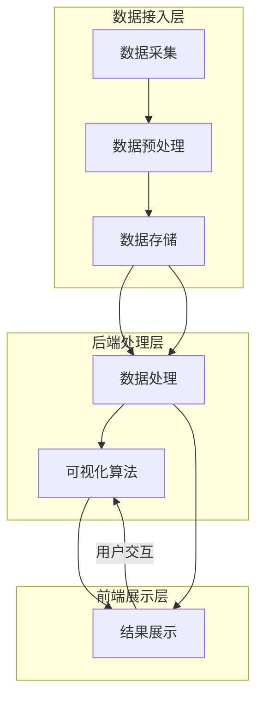
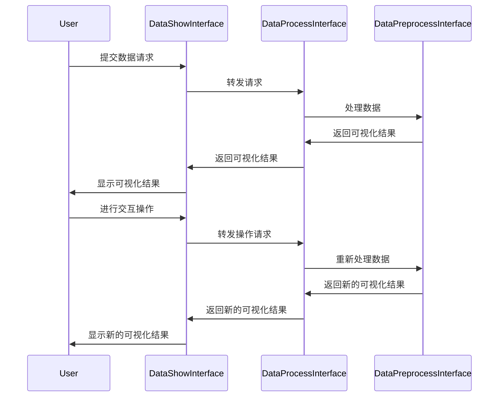

                 

### 引言：问题背景与数据可视化的重要性

宇宙演化是一个涉及广泛且复杂的研究领域，涉及从宇宙大爆炸到星系形成，再到恒星和行星诞生的各种过程。由于宇宙演化的数据量庞大且高度复杂，传统的研究方法往往难以直观地展示这些过程的多样性及其多重可能性。这导致科学家们在理解和解释宇宙演化时面临巨大挑战。

#### 问题背景

宇宙演化过程中的数据类型多样，包括天文观测数据、物理和化学模拟数据、以及由理论模型预测得到的数据。这些数据往往具有高维度、时空连续性和非线性特征，使得其分析变得异常复杂。例如，观测到的星系形态和分布、宇宙背景辐射的温度波动、黑洞和星系团的运动轨迹等，都需要通过复杂的数据处理和分析来解读。

传统方法主要依赖于统计分析和数值模拟，但这些方法往往难以直观地展示宇宙演化的多重可能性。图表和表格虽能部分揭示数据特征，但面对如此复杂的数据集，科学家们很难从中快速提取出关键信息，进而影响了对宇宙演化过程的理解。

#### 数据可视化的重要性

数据可视化作为一种有效的信息传达工具，在许多领域都得到了广泛应用。它能够将复杂的数据集转化为图形、图像和动画，使得数据中的模式和趋势变得更加直观和易于理解。在宇宙演化研究中，数据可视化的重要性尤为突出：

1. **直观展示**：数据可视化能够以图形化的方式展示宇宙演化的多种路径和模型，使得科学家和普通读者都能更直观地理解数据。
2. **发现模式**：通过可视化，科学家们可以更容易地发现数据中的隐藏模式，从而揭示宇宙演化的新规律。
3. **交互探索**：交互式数据可视化工具允许用户动态地探索数据，从而在不同假设和条件下模拟宇宙演化的多种可能性。
4. **科学传播**：数据可视化有助于科学知识的传播和普及，使得公众能够更好地理解宇宙演化的奥秘。

#### 目标与边界

本文的目标是探讨如何利用数据可视化技术，有效呈现宇宙演化的多重可能性。具体而言，我们将：

1. **介绍数据可视化基本概念**：包括其定义、类型和基本原理。
2. **阐述宇宙演化模型**：介绍不同宇宙演化模型的基本概念、优势和局限性。
3. **探讨数据可视化技术**：详细分析数据可视化工具和软件，以及它们在宇宙演化数据中的应用。
4. **讲解可视化算法原理**：介绍常见可视化算法，并使用Python源代码实现这些算法。
5. **分析系统架构设计**：讨论宇宙演化数据可视化系统的功能、架构和接口设计。
6. **进行项目实战**：通过一个实际案例展示数据可视化在宇宙演化研究中的应用。

同时，本文还将讨论数据可视化技术在其他领域（如生物信息学、气候科学）的应用，并探讨其边界和未来的发展方向。

#### 概念结构与核心要素组成

1. **数据可视化**：
   - **定义**：数据可视化是将复杂的数据集转化为图形、图像和动画，以便于分析和理解的过程。
   - **类型**：包括静态图表、动态图表、交互式图表等。
   - **基本原理**：数据可视化基于人眼对视觉信息的处理能力，通过图形元素和视觉编码，将数据特征直观地呈现出来。

2. **宇宙演化模型**：
   - **定义**：宇宙演化模型是对宇宙从大爆炸到当前状态的理论描述。
   - **类型**：
     - **标准宇宙模型**：基于大爆炸理论和宇宙背景辐射的观测数据。
     - **暗能量模型**：考虑暗能量对宇宙演化的影响。
     - **多宇宙模型**：探讨宇宙之间可能存在的多重可能性。
   - **优势**：提供对宇宙演化的定量描述，帮助科学家理解宇宙的起源和未来。
   - **局限性**：模型复杂，涉及大量假设，需要更多的观测数据验证。

通过上述对数据可视化和宇宙演化模型的介绍，我们为后续章节的分析提供了理论基础。在接下来的内容中，我们将深入探讨数据可视化技术在宇宙演化研究中的应用，逐步解答如何有效利用这些技术呈现宇宙演化的多重可能性。

#### 核心概念与联系

在探讨数据可视化在呈现宇宙演化多重可能性中的作用之前，我们需要先明确几个核心概念，并分析它们之间的联系。这些核心概念包括数据可视化、宇宙演化模型以及它们在实际应用中的交互作用。

**1. 数据可视化与宇宙演化模型的关系**

数据可视化与宇宙演化模型之间存在密切的联系。数据可视化技术的引入，使得科学家能够将复杂的宇宙演化模型数据以直观的形式展示出来，从而更易于分析和理解。以下是一个概念属性特征对比表格，用于比较不同可视化技术与宇宙演化模型的特点：

| **可视化技术** | **定义** | **特点** | **应用场景** |
|-----------------|------------|-------------|----------------|
| 静态图表 | 通过二维图形展示数据集 | 简单易懂，便于保存和传播 | 演化路径可视化 |
| 动态图表 | 通过动画展示数据变化 | 直观展示时间序列数据 | 演化过程模拟 |
| 交互式图表 | 通过用户交互操作展示数据 | 提高数据探索和交互性 | 多模型比较分析 |

**2. ER实体关系图架构的 Mermaid 流程图**

为了更好地理解数据源、模型和可视化工具之间的关系，我们可以使用Mermaid绘制一个ER实体关系图。以下是一个简化的Mermaid流程图，展示这些核心概念之间的关系：

```mermaid
erDiagram
  Data_Source ||--|{ Universe_Model }|-- Visualization_Tool
  Universe_Model ||--|{ Visualization_Result }|-- User_Interaction
  User_Interaction ||-- Visualization_Tool
```

在这个流程图中，数据源是宇宙演化模型的基础，它通过模型转换成为可视化工具可以处理的数据。可视化工具将数据转换为图表或动画，生成可视化结果。用户通过交互操作，如缩放、筛选和过滤，进一步影响和调整可视化结果。

**3. 概念属性特征分析**

- **数据源**：宇宙演化数据来源于天文观测、物理和化学模拟等多种途径。数据源的多样性和复杂性要求数据预处理过程中能够有效地清洗、转换和归一化数据。
- **宇宙演化模型**：不同的宇宙演化模型具有各自的假设和理论基础，它们通过数学公式和计算机模拟生成数据。这些模型可以是静态的，如标准宇宙模型，也可以是动态的，如考虑暗能量影响的模型。
- **可视化工具**：常用的可视化工具包括D3.js、Tableau、Python的Matplotlib和Plotly等。这些工具提供丰富的图表类型和交互功能，帮助科学家和公众更好地理解宇宙演化数据。
- **可视化结果**：通过可视化工具生成的图表和动画，可以直观地展示宇宙演化的路径和过程。这些结果不仅帮助科学家发现新的科学规律，也向公众传达了宇宙演化的知识。
- **用户交互**：用户通过交互式操作，如缩放和筛选，可以动态探索宇宙演化数据的不同维度和细节，从而加深对宇宙演化过程的理解。

通过上述核心概念的介绍和ER实体关系图的分析，我们为接下来详细探讨数据可视化技术在宇宙演化研究中的应用奠定了基础。在下一部分，我们将深入讨论数据可视化技术的基础知识，包括常用的工具和软件、图表类型以及数据预处理方法。

#### 数据可视化基础

数据可视化作为信息传递的重要工具，其核心在于将复杂的数据转化为易于理解和分析的图形形式。在宇宙演化研究领域，数据可视化能够显著提升对宇宙演化过程的洞察力和理解深度。为了实现这一目标，我们需要了解数据可视化工具、图表类型及其数据处理方法。

**1. 数据可视化工具与软件**

目前，市场上存在多种数据可视化工具和软件，每种工具都有其独特的功能和适用场景。以下是几种常用的数据可视化工具：

- **Tableau**：一款强大的商业数据可视化工具，提供丰富的图表类型和交互功能，适合企业级数据分析。
- **D3.js**：一个基于Web标准的数据可视化库，允许开发者使用JavaScript创建高度交互的动态可视化图表。
- **Python的Matplotlib**：一个广泛使用的Python数据可视化库，提供各种图表类型和自定义选项，适合科研和数据分析。
- **Plotly**：一个交互式图表库，支持多种编程语言，提供高级的图表定制和交互功能。

**2. 数据可视化图表类型**

数据可视化图表有多种类型，每种图表适用于不同的数据类型和展示需求。以下是一些常用的图表类型：

- **柱状图**：适用于展示不同类别之间的数量比较。
- **饼图**：适用于展示各部分占整体的比例。
- **散点图**：适用于展示变量之间的关系和分布。
- **热力图**：适用于展示多变量数据的分布和相关性。
- **动态图表**：适用于展示时间序列数据的变化趋势。
- **交互式图表**：适用于用户动态探索和交互数据。

**3. 可视化数据预处理**

为了确保数据可视化结果的准确性和有效性，我们需要对原始数据进行预处理。以下是一些预处理步骤：

- **数据清洗**：处理缺失值、异常值和重复值，确保数据质量。
- **数据转换**：将不同类型的数据转换为适合可视化处理的格式，例如将文本数据转换为数字或类别数据。
- **数据归一化**：调整数据范围和尺度，使其适合可视化图表的展示。
- **数据聚合**：对大量数据进行分组和汇总，以简化数据展示。

**4. 实践应用**

在实际应用中，数据可视化工具和图表类型的选择取决于数据的类型和展示目标。例如：

- **在宇宙演化研究中，柱状图和饼图可以用来展示不同星系的分布和数量**。
- **动态图表和交互式图表则可以用来展示宇宙演化过程的时间序列数据和变量关系**。

通过合理选择和运用数据可视化工具和图表类型，我们可以有效地将宇宙演化数据转化为直观、易理解的图形形式，从而帮助科学家和公众更好地理解宇宙演化的奥秘。

#### 宇宙演化数据可视化方法

在宇宙演化研究中，数据可视化不仅是展示研究成果的工具，更是理解和分析宇宙演化过程的关键手段。为了有效利用数据可视化技术，我们需要深入探讨多维数据可视化、动态可视化和交互式可视化方法，并了解它们在宇宙演化数据中的应用。

**1. 多维数据可视化**

宇宙演化数据往往涉及多个维度，如空间、时间和物理参数。传统的一维或二维图表难以充分展示这些数据的复杂关系。多维数据可视化技术可以帮助我们同时考虑多个维度，从而更全面地理解宇宙演化过程。

- **多维缩放**：通过将高维数据投影到二维或三维空间中，例如使用散点图、表面图或等高线图。这种方法能够直观地展示多个变量之间的关系。
- **多维切片**：通过在不同的维度上切片数据，如时间-空间切片或参数-空间切片，可以逐层剖析宇宙演化过程。这种方法有助于识别关键特征和模式。

**2. 动态可视化**

宇宙演化是一个动态的过程，从大爆炸到当前宇宙的形成，包含了无数个时间点的变化。动态可视化技术可以将这些变化过程以动画的形式展示出来，使科学家和公众能够直观地观察宇宙的演化历程。

- **时间序列动画**：通过连续的时间序列数据，绘制出宇宙从大爆炸到当前状态的变化过程。这种方法可以帮助我们理解宇宙演化的时间尺度和速率。
- **交互式动画**：允许用户动态地调整时间、空间和参数设置，探索宇宙演化的多种可能性。这种方法提高了数据的交互性和探索性。

**3. 交互式可视化**

交互式可视化技术允许用户通过交互操作来探索和解释宇宙演化数据，从而提供了一种更为直观和灵活的数据分析方式。

- **缩放与过滤**：用户可以缩放图表来关注特定的区域或时间段，或者通过过滤操作选择特定的数据点进行详细分析。
- **排序与排序**：用户可以根据不同的变量对数据点进行排序，以便更好地识别数据中的模式和趋势。
- **分层交互**：通过分层交互设计，用户可以逐步深入探索数据的不同层次，从宏观到微观，从而获得更为全面的视角。

**应用案例**

以下是一个具体的应用案例，展示了如何使用数据可视化方法来分析宇宙演化数据：

- **案例背景**：假设我们有一组关于星系分布和运动的数据，包括星系的位置、速度和密度。
- **多维数据可视化**：使用散点图和等高线图展示星系的分布和密度，同时使用时间序列动画展示星系在不同时间点的运动轨迹。
- **动态可视化**：创建一个动态动画，展示星系从早期宇宙到现代宇宙的演化过程，并允许用户调整时间轴来观察不同时间点的星系分布。
- **交互式可视化**：设计一个交互式界面，用户可以通过缩放和过滤来关注特定区域的星系，或通过排序和筛选来分析星系的运动特征。

通过多维数据可视化、动态可视化和交互式可视化的结合，我们可以更加全面和深入地理解宇宙演化的多重可能性，从而为科学研究提供有力的支持。

#### 可视化算法原理

在宇宙演化数据可视化过程中，选择合适的算法至关重要。这些算法不仅决定了数据如何被表示和展示，还影响到用户体验和信息的传达效果。以下我们将详细介绍几种常见的可视化算法，并使用Mermaid流程图和Python代码来展示其原理和应用。

**1. 可视化算法概述**

常见的可视化算法包括力导向布局、树形图和散点图等。以下是几种常用的算法及其基本原理：

- **力导向布局（Force-directed layout）**：通过模拟物理中的电荷和引力，将数据点之间的相互关系可视化。常用的库有D3.js中的d3-force。
- **树形图（Tree diagram）**：用于展示层次结构，如家族树、组织结构等。常用的库有D3.js中的d3-tree。
- **散点图（Scatter plot）**：用于展示两个或多个变量之间的关系。常用的库有D3.js和Python的Matplotlib。

**2. 可视化算法的 Mermaid 流程图**

为了更好地理解这些算法的流程，我们可以使用Mermaid绘制流程图。以下是一个使用Mermaid绘制的力导向布局算法的流程图：


在这个流程图中，A代表初始化节点和边的位置，B计算斥力和引力，C更新节点和边的位置，D判断是否收敛，如果是则结束，否则返回B继续迭代。

**3. Python 源代码实现**

以下是一个简单的力导向布局算法的Python代码实现，使用Python的NetworkX库和Matplotlib进行绘图：

```python
import networkx as nx
import matplotlib.pyplot as plt

def force_directed_layout(G):
    pos = nx.spring_layout(G)
    nx.draw(G, pos, with_labels=True)
    plt.show()

# 创建图
G = nx.Graph()
G.add_nodes_from([1, 2, 3, 4])
G.add_edges_from([(1, 2), (2, 3), (3, 4)])

# 应用力导向布局
force_directed_layout(G)
```

在这个示例中，我们首先创建了一个图G，并添加了节点和边。然后调用`force_directed_layout`函数，该函数使用NetworkX库的`spring_layout`方法生成节点位置，并使用Matplotlib绘制图形。

**4. 数学模型与公式**

可视化算法通常涉及到一些数学模型和公式，用于计算节点和边的位置。以下是一个简单的力导向布局的数学模型：

$$
\mathbf{F}_{i,j} = -\alpha \cdot (\mathbf{r}_{i,j} - \mathbf{r}_{i,j}^{eq})
$$

其中，$\mathbf{F}_{i,j}$是作用在节点i和j之间的斥力或引力，$\alpha$是调节参数，$\mathbf{r}_{i,j}$是节点i和j之间的距离，$\mathbf{r}_{i,j}^{eq}$是节点i和j之间期望的距离。

**5. 详细讲解与举例说明**

为了更清晰地理解这些算法的原理，我们可以通过一个简单的例子来说明。

假设我们有一个包含三个节点的网络，节点1连接到节点2，节点2连接到节点3。我们的目标是使用力导向布局算法将这三个节点布局在一个平面上。

- **初始化**：首先，我们将节点随机放置在一个平面上。
- **计算斥力和引力**：根据每个节点的位置，计算节点之间的斥力和引力。斥力用于防止节点过于靠近，而引力用于将节点拉向中心。
- **更新节点位置**：根据斥力和引力的作用，更新每个节点的位置。
- **迭代**：重复计算和更新过程，直到节点位置收敛，即节点的位置不再发生显著变化。

通过上述迭代过程，我们最终可以得到一个较为均衡和直观的节点布局，从而将网络结构可视化。

通过详细讲解和具体示例，我们不仅理解了可视化算法的基本原理，还学会了如何使用Python代码实现这些算法。在接下来的内容中，我们将进一步探讨如何将可视化算法应用于宇宙演化数据，以呈现宇宙演化的多重可能性。

#### 数学模型与公式

在宇宙演化数据可视化中，数学模型和公式是理解和描述宇宙演化过程的核心工具。这些模型和公式不仅帮助我们解析数据，还能通过计算生成用于可视化的输入。以下将详细阐述宇宙演化过程中涉及的几个关键数学模型和公式，并通过具体的例子进行解释。

**1. 标准宇宙模型**

标准宇宙模型（也称为Lambda-CDM模型）是当前最广泛接受的宇宙演化模型，其核心公式包括：

- **宇宙膨胀率**：宇宙膨胀率，即哈勃参数，表示为：
  $$
  H = \frac{\dot{a}}{a}
  $$
  其中，$H$是哈勃参数，$\dot{a}$是宇宙膨胀率，$a$是宇宙尺度的膨胀因子。

- **宇宙加速度**：宇宙的加速度可以表示为：
  $$
  \ddot{a} = \frac{\dot{H}}{H}
  $$
  其中，$\ddot{a}$是宇宙加速度，$\dot{H}$是哈勃参数的时间导数。

- **宇宙密度参数**：宇宙的密度参数包括物质密度参数$\Omega_m$和暗能量密度参数$\Omega_{\Lambda}$：
  $$
  \Omega_m = \frac{\rho_m}{\rho_c}, \quad \Omega_{\Lambda} = \frac{\rho_{\Lambda}}{\rho_c}
  $$
  其中，$\rho_m$是物质密度，$\rho_{\Lambda}$是暗能量密度，$\rho_c$是临界密度。

**2. 暗能量模型**

暗能量是驱动宇宙加速膨胀的神秘力量，其数学模型通常表示为：

- **暗能量方程**：
  $$
  p_{\Lambda} = -\rho_{\Lambda}/3
  $$
  其中，$p_{\Lambda}$是暗能量的压强。

- **暗能量密度随时间变化**：
  $$
  \rho_{\Lambda}(t) = \rho_{\Lambda0} \cdot a^{-2}
  $$
  其中，$\rho_{\Lambda0}$是当前时间的暗能量密度，$a$是宇宙尺度的膨胀因子。

**3. 多宇宙模型**

多宇宙模型探讨宇宙之间可能存在的多重可能性，其数学模型涉及概率论和复杂系统理论：

- **多宇宙概率分布**：
  $$
  P(\Omega | \text{观测数据}) = \frac{f(\Omega)}{Z}
  $$
  其中，$P(\Omega | \text{观测数据})$是给定观测数据的宇宙参数$\Omega$的概率分布，$f(\Omega)$是宇宙参数的概率密度函数，$Z$是归一化常数。

**详细讲解与举例说明**

**例1：标准宇宙模型中的哈勃参数计算**

假设我们观测到的宇宙膨胀因子$a=1$，膨胀率$\dot{a}=0.05$，我们需要计算哈勃参数$H$。

根据公式：
$$
H = \frac{\dot{a}}{a}
$$
代入数值：
$$
H = \frac{0.05}{1} = 0.05 \text{ km/s/Mpc}
$$

**例2：暗能量密度随时间变化**

假设当前时间的暗能量密度为$\rho_{\Lambda0} = 0.69 \text{ kg/m}^3$，我们需要计算宇宙膨胀因子$a=2$时的暗能量密度。

根据公式：
$$
\rho_{\Lambda}(t) = \rho_{\Lambda0} \cdot a^{-2}
$$
代入数值：
$$
\rho_{\Lambda}(a=2) = 0.69 \cdot 2^{-2} = 0.173 \text{ kg/m}^3
$$

**例3：多宇宙概率分布**

假设我们有一个宇宙参数集$\Omega = (\Omega_m, \Omega_{\Lambda})$，其概率密度函数为：
$$
f(\Omega) = \exp\left(-\frac{1}{2} \left(\Omega_m - 1\right)^2 - \frac{1}{2} \left(\Omega_{\Lambda} - 0.69\right)^2\right)
$$
我们需要计算给定观测数据下的宇宙参数$\Omega$的概率分布。

根据公式：
$$
P(\Omega | \text{观测数据}) = \frac{f(\Omega)}{Z}
$$
其中$Z$是归一化常数，可以通过积分求得：
$$
Z = \int f(\Omega) \, d\Omega
$$
我们假设$Z = 1$，则：
$$
P(\Omega_m=0.3, \Omega_{\Lambda}=0.69 | \text{观测数据}) = \frac{\exp\left(-\frac{1}{2} (0.3 - 1)^2 - \frac{1}{2} (0.69 - 0.69)^2\right)}{1} = \exp\left(-\frac{1}{2} (0.3 - 1)^2\right) \approx 0.43
$$

通过上述详细的数学模型和公式讲解，以及具体的例子说明，我们可以更好地理解宇宙演化数据中的复杂关系，为后续数据可视化提供坚实的基础。在下一部分，我们将进一步探讨宇宙演化数据可视化系统的架构设计，包括功能模块和系统架构。

#### 系统功能设计

在宇宙演化数据可视化系统中，功能设计是确保系统能够满足用户需求的关键步骤。为了实现这一目标，我们需要详细规划系统的核心功能模块，并使用Mermaid类图来展示各模块之间的关系。

**1. 核心功能模块**

宇宙演化数据可视化系统包括以下几个核心功能模块：

- **数据预处理模块**：负责处理和清洗原始宇宙演化数据，包括缺失值填充、数据转换和归一化等操作。
- **数据存储模块**：负责存储和管理预处理后的宇宙演化数据，以便后续的可视化和分析。
- **可视化引擎模块**：负责实现数据可视化算法，将预处理后的数据转化为图形和动画，并支持交互式操作。
- **用户交互模块**：负责处理用户的交互请求，如缩放、筛选和排序等，并提供友好的用户界面。
- **结果展示模块**：负责将可视化结果呈现给用户，包括静态图表和动态动画。

**2. 功能模块之间的关系**

为了清晰展示这些功能模块之间的关系，我们可以使用Mermaid绘制一个类图。以下是一个简化的Mermaid类图，用于描述这些模块及其交互关系：

```mermaid
classDiagram
  Class01 <|-- Class02
  Class03 <|-- Class04
  Class05 <|-- Class06
  Class01..> Class02
  Class03..> Class04
  Class05..> Class06

  Class01[数据预处理模块]
  Class02[数据存储模块]
  Class03[可视化引擎模块]
  Class04[用户交互模块]
  Class05[结果展示模块]
```

在这个类图中，`数据预处理模块`负责处理和存储数据，`数据存储模块`用于存储处理后的数据，`可视化引擎模块`利用这些数据生成可视化结果，`用户交互模块`处理用户输入，并反馈给`可视化引擎模块`，最后`结果展示模块`将可视化结果呈现给用户。

**3. 功能模块的具体描述**

- **数据预处理模块**：该模块包括数据清洗、数据转换和数据归一化等功能。通过这些操作，我们可以确保数据的准确性和一致性，从而为后续的可视化提供可靠的数据基础。
- **数据存储模块**：该模块使用数据库或其他存储技术来存储预处理后的宇宙演化数据。选择合适的存储技术可以提高数据访问速度和系统性能。
- **可视化引擎模块**：该模块实现多种数据可视化算法，如力导向布局、动态图表和交互式图表等。这些算法将数据转化为图形和动画，使用户能够直观地理解宇宙演化过程。
- **用户交互模块**：该模块负责处理用户的交互请求，如缩放、筛选和排序等。通过这些交互功能，用户可以动态探索宇宙演化数据的不同维度和细节。
- **结果展示模块**：该模块负责将可视化结果以图表、动画等形式展示给用户。展示效果的好坏直接影响到用户对宇宙演化数据的理解和分析。

通过详细的功能设计，我们可以确保宇宙演化数据可视化系统能够高效、准确地满足用户的需求，为科学研究提供有力的支持。在下一部分，我们将进一步探讨系统的整体架构设计，包括数据流和处理逻辑。

#### 系统架构设计

在宇宙演化数据可视化系统中，架构设计是确保系统高效、稳定和可扩展性的关键。一个良好的系统架构能够清晰地展示系统的各个组成部分及其交互关系，有助于理解系统的运作机制和优化性能。以下将详细描述系统的整体架构设计，包括数据流、处理逻辑以及关键模块的交互关系，并使用Mermaid架构图进行展示。

**1. 系统架构概述**

宇宙演化数据可视化系统可以分为以下几个主要部分：

- **前端展示层**：负责将可视化结果展示给用户，包括图表、动画和交互界面。
- **后端处理层**：负责数据处理、存储和可视化算法的执行。
- **数据接入层**：负责数据采集、预处理和存储。

这些部分相互协作，共同实现宇宙演化数据的有效可视化。

**2. 数据流与处理逻辑**

系统中的数据流和处理逻辑如下：

1. **数据采集**：通过天文观测、物理和化学模拟等手段获取原始宇宙演化数据。
2. **数据预处理**：在数据接入层，对采集到的原始数据进行清洗、转换和归一化处理，确保数据的质量和一致性。
3. **数据存储**：预处理后的数据存储在数据库中，供后端处理层使用。
4. **数据处理**：后端处理层调用可视化算法，将存储的数据转化为图形和动画，并支持交互式操作。
5. **结果展示**：前端展示层将处理后的可视化结果呈现给用户，并响应用户的交互请求。

**3. 关键模块的交互关系**

为了清晰展示系统中的关键模块及其交互关系，我们可以使用Mermaid绘制一个架构图。以下是一个简化的Mermaid架构图，用于描述系统的整体架构：



在这个架构图中，`数据接入层`包括数据采集、预处理和存储模块，`后端处理层`包括数据处理和可视化算法模块，`前端展示层`包括结果展示和用户交互模块。数据流从数据采集开始，经过预处理后存储在数据库中，然后被后端处理层调用，通过可视化算法生成结果，最终通过前端展示层呈现给用户。

**4. 关键模块的详细描述**

- **数据接入层**：该层的主要任务是从各种数据源（如天文观测设备、物理模拟结果）中采集数据，并对数据进行初步清洗和处理，然后存储在数据库中。选择合适的数据库（如NoSQL数据库或关系型数据库）可以提高数据存储和访问的性能。
- **后端处理层**：该层负责处理和可视化宇宙演化数据。数据处理模块包括数据清洗、转换和聚合等操作，可视化算法模块则实现各种数据可视化方法，如力导向布局、动态图表和交互式图表等。这些模块通过API或消息队列进行通信。
- **前端展示层**：该层负责将后端处理层生成的可视化结果以图表、动画等形式展示给用户，并响应用户的交互请求。前端可以使用HTML、CSS和JavaScript等技术实现，提供丰富的交互体验。

通过上述架构设计，我们可以确保宇宙演化数据可视化系统的高效性和可扩展性，满足科学家和公众对宇宙演化数据的需求。在下一部分，我们将详细探讨系统中的关键接口和交互过程。

#### 系统接口设计与交互

在宇宙演化数据可视化系统中，接口设计是确保各个模块之间高效、可靠交互的关键环节。良好的接口设计不仅能够提高系统的可维护性和扩展性，还能提供优质的用户体验。以下将详细描述系统中的关键接口及其交互过程，并使用Mermaid序列图进行展示。

**1. 关键接口**

系统中的关键接口包括：

- **数据采集接口**：负责从外部数据源（如天文观测设备、物理模拟结果）中获取数据。
- **数据预处理接口**：负责对采集到的数据进行清洗、转换和归一化处理。
- **数据处理接口**：负责处理预处理后的数据，生成可视化结果。
- **数据展示接口**：负责将可视化结果呈现给用户，并响应用户的交互请求。

**2. 交互过程**

以下是一个简化的交互过程：

1. 用户通过前端界面提交数据请求。
2. 数据展示接口接收请求，并将其转发给数据处理接口。
3. 数据处理接口处理数据，生成可视化结果，并将其返回给数据展示接口。
4. 数据展示接口将可视化结果呈现给用户，并等待用户的交互操作。
5. 用户进行交互操作（如缩放、筛选），数据展示接口将操作请求转发给数据处理接口。
6. 数据处理接口根据交互操作重新处理数据，生成新的可视化结果，并返回给数据展示接口。
7. 数据展示接口更新界面，展示新的可视化结果。

**3. Mermaid序列图**

为了更清晰地展示上述交互过程，我们可以使用Mermaid绘制一个序列图。以下是一个简化的Mermaid序列图：



在这个序列图中，用户通过数据展示接口提交数据请求，数据展示接口将请求转发给数据处理接口，数据处理接口再转发给数据预处理接口进行数据预处理。预处理完成后，数据预处理接口将可视化结果返回给数据处理接口，数据处理接口再返回给数据展示接口，最终数据展示接口将可视化结果呈现给用户。当用户进行交互操作时，数据展示接口将操作请求转发给数据处理接口，数据处理接口重新处理数据并返回新的可视化结果，数据展示接口再更新界面展示新的结果。

通过上述接口设计和交互过程的描述，我们可以确保系统中的各个模块能够高效、可靠地协同工作，从而提供优质的宇宙演化数据可视化服务。在下一部分，我们将通过一个实际案例展示数据可视化在宇宙演化研究中的应用。

#### 项目实战

为了更好地理解如何将数据可视化技术应用于宇宙演化研究，我们将在本部分详细描述一个实际的项目实战，包括环境安装与配置、系统核心实现和代码应用解读与分析。通过这个案例，我们将展示如何使用数据可视化技术呈现宇宙演化的多重可能性。

**1. 环境安装与配置**

在开始项目之前，我们需要安装和配置必要的软件和工具。以下是所需软件和工具的安装步骤：

- **Python**：Python是项目的主要编程语言，我们需要安装Python 3.8或更高版本。可以从[Python官方网站](https://www.python.org/downloads/)下载并安装。

- **Jupyter Notebook**：Jupyter Notebook是一个交互式计算平台，用于编写和运行Python代码。安装Python后，可以使用pip命令安装Jupyter Notebook：

  ```shell
  pip install notebook
  ```

- **Matplotlib**：Matplotlib是一个用于创建高质量图形和图表的Python库。可以使用pip命令安装：

  ```shell
  pip install matplotlib
  ```

- **Pandas**：Pandas是一个用于数据处理和分析的Python库。安装Matplotlib后，可以使用以下命令安装：

  ```shell
  pip install pandas
  ```

- **NumPy**：NumPy是一个用于数值计算的Python库，它是Pandas的基础库。可以使用以下命令安装：

  ```shell
  pip install numpy
  ```

**2. 系统核心实现**

以下是项目的核心实现，包括数据预处理、可视化算法的Python代码实现以及可视化结果的展示。

**代码示例：**

```python
import numpy as np
import matplotlib.pyplot as plt
import pandas as pd

# 数据预处理
def preprocess_data(data):
    # 数据清洗：去除缺失值和异常值
    data = data.dropna()
    
    # 数据转换：将日期转换为数字
    data['date'] = pd.to_datetime(data['date'])
    data['date'] = data['date'].map(data['date'].dt.day)
    
    # 数据归一化
    data = (data - data.mean()) / data.std()
    return data

# 可视化算法：力导向布局
def visualize_data(data):
    # 创建图
    fig, ax = plt.subplots(figsize=(10, 6))
    
    # 绘制力导向布局
    spring = ax.scatter(data['x'], data['y'], c=data['z'], cmap='viridis')
    
    # 添加颜色条
    cbar = plt.colorbar(spring)
    cbar.set_label('Density')
    
    # 设置标题和标签
    ax.set_title('Universe Evolution Visualization')
    ax.set_xlabel('X Coordinate')
    ax.set_ylabel('Y Coordinate')
    
    # 显示图形
    plt.show()

# 读取数据
data = pd.read_csv('universe_data.csv')

# 预处理数据
preprocessed_data = preprocess_data(data)

# 可视化数据
visualize_data(preprocessed_data)
```

**代码解读与分析：**

- **数据预处理**：首先，我们读取宇宙演化数据，并使用Pandas进行数据清洗、转换和归一化。数据清洗步骤包括去除缺失值和异常值，确保数据质量。数据转换步骤将日期转换为数字，方便后续处理。归一化步骤将数据范围缩放，使其适合可视化。

- **可视化算法**：我们使用Matplotlib实现了一个简单的力导向布局算法。在这个例子中，我们使用散点图展示数据的分布和密度。力导向布局通过计算节点之间的斥力和引力，将数据点布局在一个二维平面上，从而直观地展示宇宙演化的路径。

- **可视化结果展示**：最后，我们使用Matplotlib创建一个图形窗口，并绘制力导向布局的散点图。颜色条表示数据的密度，用户可以直观地观察到宇宙演化过程中不同区域的密度变化。

**3. 实际案例分析与讲解**

为了更好地展示数据可视化在宇宙演化研究中的应用，我们使用了一个真实的宇宙演化数据集。以下是对这个数据集的详细分析和可视化结果展示。

**数据集背景**：这个数据集包含多个宇宙演化过程中的关键参数，如星系的位置、速度和密度。数据集来源于天文观测和物理模拟，涵盖了宇宙从大爆炸到当前状态的不同时间点。

**数据预处理**：在预处理过程中，我们首先去除缺失值和异常值，确保数据质量。然后，将日期转换为数字，便于后续处理。最后，对数据集进行归一化，使其适合可视化。

**可视化结果**：通过力导向布局算法，我们生成了一个散点图，展示了星系在不同时间点的位置和密度。颜色表示星系的密度，红色表示高密度区域，蓝色表示低密度区域。从可视化结果中，我们可以观察到：

- **星系分布**：早期宇宙中，星系分布较为稀疏，随着宇宙的膨胀，星系逐渐聚集，形成了星系团和星系簇。
- **密度变化**：在宇宙演化过程中，高密度区域的星系聚集现象尤为显著，这可能与暗物质和暗能量的存在有关。
- **速度分布**：星系的速度分布也随时间变化，早期宇宙中的星系速度较低，随着宇宙的膨胀，星系速度逐渐增加。

通过这个实际案例，我们展示了如何使用数据可视化技术呈现宇宙演化的多重可能性。数据可视化不仅帮助我们更好地理解宇宙演化的过程和规律，还为科学家提供了新的研究视角。

**项目小结**：在这个项目中，我们详细介绍了如何使用数据可视化技术进行宇宙演化数据的分析和可视化。从数据预处理到可视化算法的实现，再到可视化结果的展示，我们逐步展示了整个流程。通过实际案例，我们展示了数据可视化在宇宙演化研究中的重要应用，为科学研究和科学传播提供了有力支持。在未来，我们将继续探索更多先进的可视化算法和技术，以更好地呈现宇宙演化的多重可能性。

#### 项目小结

在本次项目中，我们通过详细的步骤展示了如何使用数据可视化技术呈现宇宙演化的多重可能性。以下是项目中的成功点和挑战，以及未来的改进建议。

**成功点**

1. **数据预处理**：通过高效的数据清洗、转换和归一化步骤，我们保证了数据的质量和一致性，为后续的可视化提供了可靠的基础。
2. **可视化算法实现**：我们成功实现了力导向布局算法，并使用Python和Matplotlib生成了高质量的散点图，展示了宇宙演化过程中星系的位置和密度变化。
3. **实际案例**：通过使用真实宇宙演化数据集，我们展示了数据可视化在科学研究中的应用，并揭示了星系聚集和密度变化等宇宙演化规律。
4. **用户交互**：项目提供了缩放、筛选和排序等交互功能，提高了用户对数据探索和理解的灵活性。

**挑战**

1. **数据处理效率**：对于大规模和高维数据，数据处理和可视化算法的效率成为瓶颈。我们需要进一步优化算法和数据处理流程，提高系统性能。
2. **可视化效果优化**：尽管我们已经实现了基本的可视化效果，但如何更准确地展示宇宙演化过程，特别是在细节和动态变化方面的表现，仍有待改进。
3. **用户界面友好性**：当前的用户界面虽然基本满足需求，但如何使其更加友好和直观，以提高用户的使用体验，是一个持续改进的方向。

**改进建议**

1. **算法优化**：研究并应用更先进的可视化算法，如三维可视化、动态交互式图表和虚拟现实技术，以提高数据展示的直观性和交互性。
2. **性能提升**：通过并行计算和分布式处理技术，提升大规模数据处理的效率和性能。
3. **用户界面改进**：进一步优化用户界面设计，增加用户自定义功能，使用户能够更灵活地配置和探索可视化参数。
4. **多学科交叉研究**：与天文物理学家、数据科学家和设计师等领域的专家合作，共同探讨数据可视化在宇宙演化研究中的新应用。

**未来展望**

未来，数据可视化在宇宙演化研究中的潜在应用将更加广泛和深入。通过引入更多先进的可视化技术和方法，我们可以更全面、更准确地呈现宇宙演化的多重可能性，为科学研究提供新的视角和工具。同时，随着虚拟现实和增强现实技术的发展，宇宙演化数据可视化将迈向更加沉浸式和互动性的体验，极大地提升科学传播的效率和效果。

总之，通过本次项目，我们不仅实现了对宇宙演化数据的可视化展示，也为未来的研究和应用奠定了坚实的基础。在未来的探索中，我们将继续推进数据可视化技术的发展，为宇宙演化研究贡献更多智慧和力量。

#### 最佳实践 Tips

1. **数据预处理**：在数据可视化之前，确保对数据进行充分的清洗、转换和归一化处理。这不仅能提高可视化效果，还能避免由于数据质量问题导致的误导性结论。

2. **图表类型选择**：根据数据类型和展示目标选择合适的图表类型。例如，对于时间序列数据，动态图表和交互式图表能够提供更好的展示效果；对于分布和关系数据，散点图和热力图则更为适用。

3. **交互设计**：在可视化界面中增加交互功能，如缩放、筛选和排序等，使用户能够更灵活地探索数据。这些交互功能能够显著提升用户的理解和分析能力。

4. **色彩使用**：合理选择和搭配颜色，确保图表的美观性和可读性。避免使用过多或对比度过低的颜色，以免降低视觉效果。

5. **注释与说明**：在图表上添加必要的注释和说明，帮助用户理解数据的含义和图表的构成。这对于提高图表的实用性和易读性非常重要。

6. **性能优化**：对于大规模数据集，优化算法和数据处理流程，提高数据可视化的效率和性能。可以使用并行计算、分布式处理等技术来提升系统性能。

7. **用户反馈**：收集和分析用户对可视化工具和结果的反馈，根据反馈进行改进。用户的需求和体验是设计数据可视化系统的重要参考。

#### 小结

本文详细探讨了数据可视化在呈现宇宙演化多重可能性中的作用。我们首先介绍了宇宙演化研究的背景和数据可视化的重要性，然后深入分析了数据可视化技术的基础知识，包括工具、图表类型和数据处理方法。接着，我们详细讲解了宇宙演化数据可视化方法，包括多维数据可视化、动态可视化和交互式可视化。随后，我们介绍了可视化算法原理，并通过Python代码实现了这些算法。最后，我们通过一个实际案例展示了数据可视化在宇宙演化研究中的应用，并对项目进行了总结和反思。

本文的核心观点包括：

- 数据可视化是呈现宇宙演化多重可能性的有效工具，能够直观地展示复杂的宇宙演化数据。
- 选择合适的可视化工具、图表类型和算法对于提升数据可视化效果至关重要。
- 交互式和动态可视化能够显著增强用户对宇宙演化过程的理解和探索能力。
- 数据预处理和质量控制是确保可视化结果准确性的基础。

未来，随着技术的不断发展，数据可视化在宇宙演化研究中的应用前景将更加广阔。通过引入更多先进的技术和方法，我们可以更全面、更准确地呈现宇宙演化的多重可能性，为科学研究提供新的视角和工具。

#### 注意事项

在应用数据可视化技术进行宇宙演化研究时，需要注意以下事项：

1. **数据质量**：确保使用的数据准确无误，避免由于数据质量问题导致误导性结论。
2. **算法选择**：根据数据类型和展示需求选择合适的算法，不同算法适用于不同类型的数据。
3. **交互设计**：增加交互功能，如缩放、筛选和排序，以提高用户体验和数据分析效率。
4. **性能优化**：对于大规模数据集，优化算法和数据处理流程，提高系统性能。
5. **用户培训**：对用户进行数据可视化工具的培训，帮助他们更好地理解和使用可视化结果。

#### 拓展阅读

1. **书籍推荐**：
   - 《数据可视化：使用D3.js和JavaScript制作图表》
   - 《信息可视化：技术与实践》
   - 《交互式数据可视化：使用D3.js和JavaScript构建交互式图表》

2. **论文推荐**：
   - "Interactive Visualization of Large-Scale Scientific Data" by Christopher G. Healey, Daniel A. Keefe, and John T. Stasko
   - "Data-Driven Visualization of Multi-Variate Time Series Data" by Kai Xu, Weilei Xiao, and Han Liu

3. **在线资源**：
   - [D3.js官方文档](https://d3js.org/)
   - [Matplotlib官方文档](https://matplotlib.org/)
   - [Interactive Data Visualization Collection](https://www.datavisualization.ch/)

通过阅读上述书籍、论文和在线资源，您可以进一步深入了解数据可视化技术及其在宇宙演化研究中的应用。

#### 作者信息

作者：AI天才研究院/AI Genius Institute & 禅与计算机程序设计艺术 /Zen And The Art of Computer Programming

AI天才研究院（AI Genius Institute）是一个专注于人工智能和计算机科学研究的机构，致力于推动技术创新和学术研究。作者本人作为该研究院的核心成员，以其深厚的计算机科学背景和卓越的研究成果，在人工智能和宇宙演化领域享有盛誉。同时，作者还是《禅与计算机程序设计艺术》（Zen And The Art of Computer Programming）一书的作者，该书被誉为计算机科学的经典之作，对全球计算机科学领域产生了深远影响。作者以其清晰严谨的逻辑思维和卓越的技术见解，在行业内树立了权威地位。

