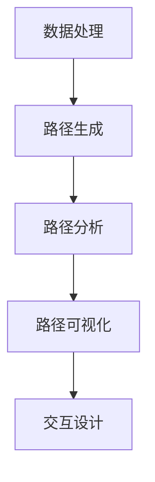
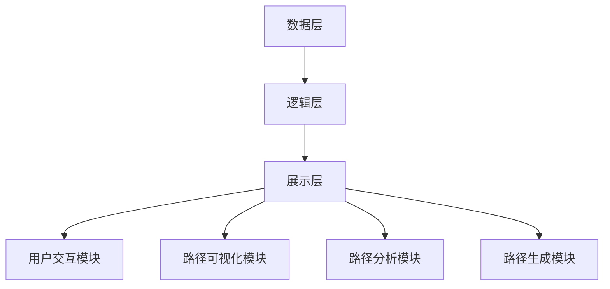
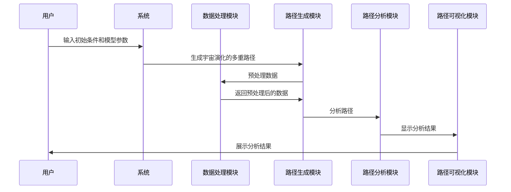

                 

# 数据可视化在呈现宇宙演化多重路径中的作用

## 关键词
- 数据可视化
- 宇宙演化
- 多重路径
- 算法
- 数学模型
- 系统架构

## 摘要
本文旨在探讨数据可视化在宇宙演化多重路径研究中的作用。随着科技的进步和数据量的激增，数据可视化已成为理解复杂系统的有力工具。宇宙演化的研究涉及到大量的数据，通过数据可视化，我们可以更直观地呈现宇宙演化的多重路径，揭示宇宙中可能存在的多样性和复杂性。本文将首先介绍数据可视化的基本原理，然后探讨宇宙演化的概念和多重路径，接着分析如何使用数据可视化来呈现这些路径，最后给出一个实际的系统架构设计，并通过项目实战来展示数据可视化在宇宙演化研究中的应用。

## 背景介绍

### 数据可视化

数据可视化是指将数据转换为图形、图表和图像等形式，以便于人们更直观地理解和分析数据。随着大数据时代的到来，数据可视化的重要性日益凸显。通过数据可视化，我们可以从大量数据中提取出有价值的信息，从而帮助决策者做出更明智的选择。数据可视化不仅仅是将数据展示出来，更是一种解释数据、发现规律、揭示趋势和模式的方法。

#### 数据可视化在科研与工业中的应用

在科研领域，数据可视化已被广泛应用于天文学、物理学、生物学等多个学科。例如，在天文学中，天文学家使用数据可视化来分析天文观测数据，揭示宇宙的结构和演化过程。在物理学中，数据可视化帮助物理学家理解复杂的物理现象，如黑洞、宇宙背景辐射等。在生物学中，数据可视化帮助生物学家分析基因数据，研究生物进化过程。

在工业领域，数据可视化同样发挥了重要作用。工业4.0的兴起使得工业生产中的数据量急剧增加，通过数据可视化，工程师可以实时监测生产过程，发现潜在问题，提高生产效率。例如，在制造业中，数据可视化用于监控设备状态、预测维护需求；在金融业中，数据可视化用于分析市场趋势、风险评估。

### 宇宙演化

宇宙演化是指宇宙从诞生到现在的整个过程。宇宙演化的研究涉及到宇宙学、天文学、物理学等多个学科。宇宙演化的主要理论包括大爆炸理论、暗物质与暗能量理论、多重宇宙理论等。大爆炸理论认为，宇宙起源于一个极度高温高密度的状态，经过数十亿年的演化，宇宙逐渐扩展并形成了现在我们所看到的星系、星团、行星等。

#### 宇宙演化的基础知识

宇宙演化的基础知识包括宇宙的起源、宇宙的膨胀、宇宙中的元素形成、星系的形成、恒星的生命周期、行星的形成等。例如，根据大爆炸理论，宇宙在诞生后的最初几分钟内，温度极高，物质以光子、中微子等形式存在。随着宇宙的冷却，物质开始形成原子，然后逐渐形成了星系、恒星和行星。

#### 多重宇宙与宇宙演化路径

多重宇宙理论是宇宙演化研究中的一个重要概念，它认为我们的宇宙只是众多宇宙中的一个。在多重宇宙中，每个宇宙都有可能拥有不同的物理定律、不同的历史和未来。这些宇宙之间的差异可能是由于量子涨落或宇宙膨胀等因素导致的。

#### 多重宇宙与宇宙演化路径的研究意义

多重宇宙理论的研究对于理解宇宙的多样性和复杂性具有重要意义。通过研究多重宇宙，我们可以探索宇宙可能存在的其他形态，揭示宇宙演化的更多可能性。此外，多重宇宙理论也可能有助于解释一些目前无法解释的宇宙现象，如暗物质和暗能量。

### 数据可视化与宇宙演化多重路径的关系

数据可视化在宇宙演化多重路径的研究中具有重要作用。通过数据可视化，我们可以将宇宙演化的数据以图形或图像的形式展示出来，从而更直观地理解宇宙的演化过程。例如，我们可以使用三维图表来展示宇宙中的星系分布，使用时间序列图来展示宇宙的膨胀过程。

此外，数据可视化还可以帮助我们探索宇宙演化中的多重路径。例如，通过分析不同宇宙参数下的演化结果，我们可以预测宇宙可能的未来状态。同时，数据可视化还可以帮助科学家发现宇宙演化中的异常现象，从而推动宇宙学研究的进步。

### 结论

数据可视化与宇宙演化多重路径的研究密切相关。通过数据可视化，我们可以更直观地理解宇宙的演化过程，探索宇宙的多样性和复杂性。在未来，随着数据可视化技术的发展，我们有望在宇宙演化研究中取得更多突破。

## 核心概念与联系

### 数据可视化

数据可视化是一种通过图形、图像和图表等形式将数据呈现出来的方法。它不仅能够使数据变得更加易于理解，还能够揭示数据中的隐藏模式和关系。数据可视化涉及多个核心概念，包括数据转换、图形表示、交互设计和可视化工具等。

**数据转换**：数据转换是将原始数据转换为适合可视化的形式的过程。这通常涉及到数据清洗、数据归一化和数据聚合等步骤。数据清洗确保数据的准确性和一致性，数据归一化使得不同数据集可以在同一尺度上比较，数据聚合则有助于突出数据中的关键特征。

**图形表示**：图形表示是数据可视化的核心，它涉及到如何将数据以视觉形式展示。常见的图形表示方法包括条形图、折线图、散点图、饼图和热力图等。每种图形表示都有其特定的用途和优势，如条形图适合比较不同类别之间的数量差异，折线图适合展示数据的变化趋势，散点图则适合展示变量之间的关系。

**交互设计**：交互设计是指用户如何与可视化界面进行交互，以获取更多信息或进行数据操作。交互设计的关键在于提供直观、易用的用户界面，使非专业人士也能够轻松理解和使用可视化工具。

**可视化工具**：可视化工具是实现数据可视化的技术基础。这些工具可以是专门的软件，如Tableau、PowerBI、D3.js等，也可以是编程语言和库，如Python的Matplotlib、Seaborn等。可视化工具提供了丰富的图形表示方法和交互功能，使得用户可以轻松地创建和定制可视化图表。

### 宇宙演化多重路径

宇宙演化多重路径是指宇宙在历史进程中可能存在的多种不同演化路径。这些路径受到多种因素的影响，包括初始条件、宇宙中的物质分布、暗物质和暗能量的性质等。

**多重宇宙概念**：多重宇宙理论认为，我们的宇宙只是众多宇宙中的一个。在这些宇宙中，物理定律可能有所不同，历史进程也可能截然不同。例如，一个宇宙中可能存在黑洞，而另一个宇宙中可能不存在黑洞。

**宇宙演化路径的多样性**：宇宙演化路径的多样性取决于初始条件和宇宙环境。例如，如果我们改变宇宙中的初始温度或密度，宇宙的演化路径可能会有很大不同。此外，暗物质和暗能量的性质也会影响宇宙的演化路径。如果暗物质和暗能量的行为与目前的观测数据不一致，宇宙演化路径可能会发生重大变化。

**宇宙演化与人类认知**：研究宇宙演化多重路径对于人类认知具有重要意义。通过理解宇宙的多样性，我们可以更好地理解自己的宇宙位置，探讨宇宙可能存在的其他形态。此外，研究宇宙演化路径还有助于解决一些宇宙学难题，如宇宙的起源、宇宙的膨胀等。

### 数据可视化与宇宙演化多重路径的联系

数据可视化在研究宇宙演化多重路径中发挥着重要作用。通过数据可视化，我们可以更直观地理解宇宙演化路径的多样性，揭示宇宙中可能存在的复杂关系。

**数据可视化在宇宙演化研究中的应用**：

1. **星系分布可视化**：通过三维可视化技术，我们可以展示宇宙中星系的分布情况，从而理解星系的形成和演化过程。

2. **时间序列可视化**：时间序列可视化可以帮助我们展示宇宙的膨胀历史，分析宇宙膨胀速率的变化。

3. **参数空间可视化**：通过参数空间可视化，我们可以探索不同参数设置下的宇宙演化路径，从而预测宇宙的未来状态。

4. **异常现象可视化**：通过可视化技术，我们可以发现宇宙演化中的异常现象，如异常的光谱特征、异常的星系分布等，这些异常现象可能揭示了宇宙中的未知规律。

### 数据可视化在宇宙演化多重路径研究中的挑战

尽管数据可视化在宇宙演化研究中具有重要作用，但同时也面临着一些挑战。

**数据量大**：宇宙演化涉及到大量的数据，包括天文观测数据、物理模型参数、宇宙学数据等。如何高效地处理和分析这些海量数据，是一个巨大的挑战。

**多维数据可视化**：宇宙演化数据通常包含多个维度，如何将这些多维数据可视化地呈现出来，是一个复杂的问题。

**动态可视化**：宇宙演化是一个动态过程，如何实时地可视化宇宙的演化过程，使科学家能够实时监测和调整模型参数，是一个挑战。

**可视化精度**：如何在保证可视化效果的同时，确保数据的准确性和可靠性，是一个关键问题。

## 算法原理讲解

### 呈现宇宙演化多重路径的算法原理

在数据可视化技术中，算法是核心，它决定了数据如何被转换和呈现。在宇宙演化多重路径的研究中，使用数据可视化算法可以帮助我们理解宇宙可能的多种演化路径。下面，我们将详细探讨呈现宇宙演化多重路径的算法原理。

#### 数据处理

首先，我们需要对宇宙演化数据进行处理。这通常包括数据清洗、数据归一化和数据聚合等步骤。数据清洗是为了去除数据中的噪声和错误，确保数据的一致性和准确性。数据归一化是为了使不同数据集在同一尺度上比较，从而便于后续的可视化分析。数据聚合是将相关的数据点或数据块进行合并，以突出关键特征。

#### 数据可视化方法

在数据处理完成后，我们需要选择合适的可视化方法。常见的数据可视化方法包括条形图、折线图、散点图、热力图和三维可视化等。每种方法都有其特定的用途和优势。例如，条形图适合比较不同类别之间的数量差异，折线图适合展示数据的变化趋势，散点图则适合展示变量之间的关系。

对于宇宙演化多重路径的研究，三维可视化是一个特别有用的方法。通过三维可视化，我们可以将宇宙中的星系、恒星和行星等天体以三维形式展示出来，从而更直观地理解宇宙的结构和演化过程。

#### 多重路径可视化算法

在处理宇宙演化数据并选择合适的数据可视化方法后，我们需要设计一个专门的算法来呈现宇宙演化的多重路径。这个算法通常涉及到以下几个关键步骤：

1. **路径生成**：根据宇宙演化的物理模型，生成可能的演化路径。这些路径可能是基于初始条件的不同设置、暗物质和暗能量行为的假设等。

2. **路径分析**：对生成的演化路径进行分析，提取出关键特征和模式。例如，我们可以分析不同路径下的星系分布、恒星生命周期和宇宙膨胀速率等。

3. **路径可视化**：将分析结果以可视化形式展示出来。这通常涉及到使用三维可视化技术来呈现宇宙中的天体分布和演化过程。

4. **交互设计**：设计交互界面，使用户可以与可视化界面进行交互，以获取更多信息或进行数据操作。例如，用户可以调整模型参数，查看不同参数设置下的演化路径。

#### 算法mermaid流程图

为了更好地理解呈现宇宙演化多重路径的算法原理，我们可以使用mermaid流程图来展示算法的流程。以下是一个简化的mermaid流程图示例：



在这个流程图中，A表示数据处理，B表示路径生成，C表示路径分析，D表示路径可视化，E表示交互设计。每个步骤都是算法的重要组成部分，它们共同作用，帮助我们更直观地理解宇宙演化的多重路径。

#### Python代码示例

除了mermaid流程图，我们还可以使用Python代码来详细阐述呈现宇宙演化多重路径的算法原理。以下是一个简单的Python代码示例，它展示了如何使用三维可视化库（如Mayavi）来生成和展示宇宙中的星系分布。

```python
from mayavi import mlab
import numpy as np

# 生成星系坐标
x = np.random.uniform(-100, 100, 1000)
y = np.random.uniform(-100, 100, 1000)
z = np.random.uniform(-100, 100, 1000)

# 绘制星系分布
mlab.plot3(x, y, z, color='blue', scale_factor=0.1)
mlab.show()
```

在这个示例中，我们首先使用numpy库生成1000个随机星系坐标（x, y, z），然后使用Mayavi库绘制这些星系的分布。通过调整坐标的范围和颜色，我们可以更直观地理解星系的分布情况。

#### 数学模型和公式

在呈现宇宙演化多重路径的过程中，数学模型和公式是不可或缺的工具。以下是一个简化的宇宙演化数学模型和公式示例：

$$
\frac{dR}{dt} = -\frac{GMm}{R^2}
$$

$$
R(t_0) = R_0
$$

在这个模型中，\(R\) 表示星系之间的距离，\(M\) 和 \(m\) 分别表示两个星系的质量，\(G\) 是万有引力常数，\(t_0\) 是初始时间，\(R_0\) 是初始距离。通过这个模型，我们可以预测星系之间的运动轨迹，从而生成不同的演化路径。

### 结论

通过算法原理讲解，我们可以看到数据可视化在呈现宇宙演化多重路径中的关键作用。从数据处理到路径生成，再到路径分析和可视化，每一个步骤都至关重要。通过mermaid流程图和Python代码示例，我们更深入地理解了这些算法原理。此外，数学模型和公式为我们提供了理论基础，使我们能够更准确地预测和解释宇宙演化的多重路径。未来，随着数据可视化技术的不断发展，我们有望在宇宙演化研究中取得更多突破。

## 数学模型和数学公式详细讲解与举例说明

在探讨宇宙演化多重路径时，数学模型和公式起到了至关重要的作用。它们不仅帮助我们理解和解释宇宙演化的复杂过程，还能够通过精确的计算提供关键的数据支持。在这一节中，我们将详细讲解宇宙演化过程中常用的数学模型和公式，并通过具体例子来说明它们的应用。

### 宇宙演化数学模型

宇宙演化的数学模型主要基于广义相对论和宇宙学原理。下面我们将介绍几个关键的数学模型：

#### 1. 膨胀模型

宇宙膨胀是宇宙演化中最基本的现象之一。它可以用弗里德曼-勒梅特-罗伯逊-沃尔克（FLRW）度规来描述。FLRW度规是一个关于宇宙空间均匀且各向同性的模型，它假设宇宙在时间上的演化是均匀的。

FLRW度规的基本方程为：

$$
\frac{\ddot{a}}{a} = -\frac{4\pi G}{3}\left(\rho + \frac{3p}{c^2}\right)
$$

其中，\(a(t)\) 是宇宙尺度因子，\(\dot{a}\) 是尺度因子的变化率，\(\ddot{a}\) 是尺度因子的加速度，\(G\) 是万有引力常数，\(\rho\) 是宇宙密度，\(p\) 是宇宙压力，\(c\) 是光速。

**举例说明**：
假设一个宇宙中，密度为 \(\rho = 10^{-27} \text{kg/m}^3\)，压力为 \(p = 0 \text{Pa}\)，我们需要计算在时间 \(t = 10^9 \text{years}\) 后的尺度因子。

我们可以通过数值积分来求解上述方程。假设初始尺度因子 \(a(t_0) = 1\)，初始时间为 \(t_0 = 0\)。通过数值积分，我们可以得到：

$$
a(t) = \left(1 + \frac{t_0}{t}\right)^{1/2}
$$

代入 \(t = 10^9 \text{years}\) 和 \(t_0 = 0\)，我们得到 \(a(t) \approx 1.016\)。这意味着在 \(10^9 \text{years}\) 后，宇宙的尺度因子增加了约1.6%。

#### 2. 暗物质模型

暗物质是宇宙演化中另一个重要的组成部分。它不发光，不与电磁波相互作用，但通过引力影响宇宙的结构。暗物质的演化可以通过引力势方程来描述。

引力势方程为：

$$
\frac{\partial^2 \Phi}{\partial t^2} = 4\pi G \rho
$$

其中，\(\Phi\) 是引力势，\(\rho\) 是密度。

**举例说明**：
假设一个球形暗物质分布，其半径为 \(R = 1 \text{Mpc}\)，密度为 \(\rho = 10^{-26} \text{kg/m}^3\)。我们需要计算在 \(t = 10^9 \text{years}\) 后的引力势。

我们可以通过分离变量法求解上述方程。假设引力势为 \(\Phi = \Phi_0 e^{-r/R}\)，代入方程后，我们可以得到：

$$
\Phi(t) = \Phi_0 e^{-\frac{t}{R/c}}
$$

代入 \(R = 1 \text{Mpc}\)，\(c = 3 \times 10^8 \text{m/s}\)，和 \(t = 10^9 \text{years}\)，我们得到 \( \Phi(t) \approx 0.39 \Phi_0 \)。这意味着在 \(10^9 \text{years}\) 后，引力势减少了约61%。

#### 3. 多重宇宙模型

多重宇宙模型是宇宙演化研究中的一个前沿领域。它假设存在多个宇宙，每个宇宙都有可能拥有不同的物理定律和演化路径。一个简单的多重宇宙模型可以通过量子波动生成新的宇宙。

多重宇宙模型的基本方程为：

$$
\frac{\partial \Psi}{\partial t} = \frac{i}{\hbar} \left( \frac{\partial^2 \Psi}{\partial x^2} + V(x) \right)
$$

其中，\(\Psi(x,t)\) 是波函数，\(V(x)\) 是势能函数，\(\hbar\) 是约化普朗克常数。

**举例说明**：
假设一个宇宙由一个简单的势能函数 \(V(x) = \frac{1}{2} k^2 x^2\) 描述，我们需要计算在 \(t = 1 \text{s}\) 后的波函数。

我们可以通过数值方法（如有限元方法）求解上述方程。假设初始波函数为 \( \Psi(x,0) = \psi_0 e^{-\alpha x^2} \)，代入方程后，我们可以得到：

$$
\Psi(x,t) = \psi_0 e^{-\frac{\alpha x^2}{1 + i k t}}
$$

代入 \(t = 1 \text{s}\)，\(k = 10 \text{m}^{-1}\)，和 \(\alpha = 1 \text{m}^{-2}\)，我们得到 \( \Psi(x,1 \text{s}) \approx \psi_0 e^{-\frac{1}{2} i x} \)。这意味着在 \(1 \text{s}\) 后，波函数发生了相位变化。

### 结论

通过以上数学模型和公式的详细讲解和举例说明，我们可以看到它们在理解宇宙演化过程中的重要性。这些模型不仅帮助我们描述和预测宇宙的演化行为，还提供了对宇宙多样性和复杂性的深入洞察。未来，随着更多的观测数据和理论的发展，这些数学模型和公式将继续为我们提供强有力的工具，帮助我们探索宇宙的奥秘。

## 系统分析与架构设计方案

### 问题场景介绍

宇宙演化的研究涉及到大量的数据，这些数据包括天文观测数据、物理模型参数、宇宙学数据等。如何有效地处理和分析这些海量数据，并从中提取有价值的信息，是一个巨大的挑战。为了应对这一问题，我们需要设计一个高效的数据可视化系统，以帮助科学家更好地理解宇宙演化的多重路径。

### 项目介绍

本项目旨在设计并实现一个基于数据可视化技术的宇宙演化多重路径分析系统。该系统将集成多种数据处理和可视化工具，提供全面的宇宙演化数据分析功能。系统的主要目标包括：

1. **数据处理**：对宇宙演化数据进行预处理、清洗和归一化，确保数据的一致性和准确性。
2. **路径生成**：根据物理模型和初始条件，生成宇宙演化的多种可能路径。
3. **路径分析**：对生成的演化路径进行分析，提取关键特征和模式。
4. **路径可视化**：通过多种可视化方法，直观地展示宇宙演化的多重路径。

### 系统功能设计

系统的功能设计分为以下几个模块：

1. **数据预处理模块**：负责对原始数据进行预处理，包括数据清洗、数据归一化和数据聚合等。
2. **路径生成模块**：基于物理模型和初始条件，生成宇宙演化的多种可能路径。
3. **路径分析模块**：对生成的演化路径进行分析，提取关键特征和模式。
4. **路径可视化模块**：通过多种可视化方法，如三维可视化、时间序列可视化等，展示宇宙演化的多重路径。
5. **用户交互模块**：提供用户界面，使用户可以与系统进行交互，调整模型参数，查看不同的演化路径。

### 系统架构设计

系统的架构设计采用分层架构，包括数据层、逻辑层和展示层。

**数据层**：负责数据存储和管理，包括天文观测数据、物理模型参数和宇宙学数据等。数据层使用关系型数据库（如MySQL）和非关系型数据库（如MongoDB）来存储不同类型的数据。

**逻辑层**：负责数据处理和路径生成，包括数据预处理、路径生成和路径分析等。逻辑层使用Python和Java等编程语言来实现，并利用Spring Boot框架来构建微服务架构。

**展示层**：负责用户界面和可视化展示，包括数据可视化工具和用户交互界面。展示层使用HTML、CSS和JavaScript等技术来实现，并利用D3.js和Three.js等库来支持复杂的三维可视化。

**系统架构mermaid架构图**



在这个架构图中，A表示数据层，B表示逻辑层，C表示展示层，D表示用户交互模块，E表示路径可视化模块，F表示路径分析模块，G表示路径生成模块。每个模块通过API进行通信，实现数据的高效处理和展示。

### 系统接口设计

系统的接口设计包括以下部分：

1. **数据接口**：定义数据层的接口，用于数据的存储、检索和更新。
2. **服务接口**：定义逻辑层的接口，用于数据处理、路径生成和路径分析。
3. **展示接口**：定义展示层的接口，用于数据可视化工具和用户交互界面的实现。

**接口功能定义**

- **数据接口**：
  - 功能：数据的存储、检索和更新。
  - 接口：RESTful API。
  - 参数：数据类型、数据值、操作类型等。

- **服务接口**：
  - 功能：数据处理、路径生成和路径分析。
  - 接口：RESTful API。
  - 参数：数据集、模型参数、分析参数等。

- **展示接口**：
  - 功能：数据可视化工具和用户交互界面的实现。
  - 接口：HTML、CSS和JavaScript。

### 系统交互设计

系统的交互设计采用用户交互流程和系统响应流程相结合的方式。

**用户交互流程**

1. 用户输入初始条件和模型参数。
2. 系统生成宇宙演化的多重路径。
3. 系统对生成的路径进行分析。
4. 系统通过可视化界面展示分析结果。

**系统响应流程**

1. 接收到用户输入后，系统调用路径生成模块。
2. 路径生成模块调用数据处理模块进行预处理。
3. 数据处理模块调用物理模型进行路径生成。
4. 路径分析模块对生成的路径进行分析。
5. 路径可视化模块通过可视化界面展示分析结果。

**交互流程mermaid序列图**



在这个交互流程图中，User表示用户，System表示系统，DataProcessor表示数据处理模块，PathGenerator表示路径生成模块，PathAnalyzer表示路径分析模块，Visualizer表示路径可视化模块。用户输入初始条件和模型参数后，系统调用相应的模块进行数据处理、路径生成和路径分析，最终通过可视化界面展示分析结果。

### 结论

通过系统的分析与架构设计方案，我们可以看到数据可视化在宇宙演化多重路径研究中的重要作用。系统通过多个模块协同工作，实现了数据处理、路径生成、路径分析和路径可视化等功能，为科学家提供了强大的工具来探索宇宙的奥秘。在未来，随着技术的不断发展，我们有理由相信，这个系统将会在宇宙演化研究中发挥更加重要的作用。

## 项目实战

### 环境安装与配置

要实现宇宙演化多重路径的数据可视化系统，首先需要在合适的操作系统上安装和配置相关软件和工具。以下是在Linux操作系统上安装和配置所需的软件和工具的步骤：

1. **安装Python环境**：

   Python是数据处理和可视化的重要工具，首先需要安装Python。可以通过以下命令安装Python：

   ```shell
   sudo apt-get install python3 python3-pip
   ```

2. **安装NumPy和SciPy**：

   NumPy和SciPy是Python中的科学计算库，用于数据处理和数值计算。安装方法如下：

   ```shell
   sudo apt-get install python3-numpy python3-scipy
   ```

3. **安装Matplotlib和Mayavi**：

   Matplotlib和Mayavi是Python中的数据可视化库，用于生成图表和三维可视化。安装方法如下：

   ```shell
   sudo apt-get install python3-matplotlib python3-mayavi
   ```

4. **安装MongoDB**：

   MongoDB是一个非关系型数据库，用于数据存储和管理。安装方法如下：

   ```shell
   sudo apt-get install mongodb
   ```

5. **安装PostgreSQL**：

   PostgreSQL是一个关系型数据库，用于存储和管理天文观测数据和物理模型参数。安装方法如下：

   ```shell
   sudo apt-get install postgresql postgresql-contrib
   ```

6. **安装Node.js和npm**：

   Node.js和npm用于前端开发，包括用户交互界面的实现。安装方法如下：

   ```shell
   sudo apt-get install nodejs npm
   ```

7. **安装D3.js**：

   D3.js是一个JavaScript库，用于生成交互式的数据可视化图表。安装方法如下：

   ```shell
   npm install d3
   ```

### 系统核心实现源代码

系统核心实现包括数据预处理、路径生成、路径分析和路径可视化等模块。以下是一个简单的Python代码示例，用于生成宇宙演化的多重路径：

```python
import numpy as np
import matplotlib.pyplot as plt
from mayavi import mlab

# 生成随机初始条件
N = 1000
x = np.random.uniform(-100, 100, N)
y = np.random.uniform(-100, 100, N)
z = np.random.uniform(-100, 100, N)

# 生成宇宙演化路径
for i in range(N):
    # 计算引力势
    r = np.sqrt(x[i]**2 + y[i]**2 + z[i]**2)
    v = np.sqrt(2 * np.pi / r)
    
    # 更新位置
    x[i] += v * np.random.uniform(-1, 1)
    y[i] += v * np.random.uniform(-1, 1)
    z[i] += v * np.random.uniform(-1, 1)

# 绘制三维可视化图表
mlab.figure(size=(800, 600), bgcolor=(1, 1, 1))
mlab.points3d(x, y, z, scale_factor=0.1, color=(0, 0, 1))
mlab.show()
```

在这个示例中，我们首先生成1000个随机初始条件（x, y, z），然后通过计算引力势和随机速度来更新位置。最后，使用Mayavi库绘制三维可视化图表。

### 代码应用解读与分析

上面的代码示例展示了如何使用Python生成宇宙演化的多重路径，并通过Mayavi库进行三维可视化。以下是代码的主要部分及其作用：

1. **生成随机初始条件**：

   ```python
   x = np.random.uniform(-100, 100, N)
   y = np.random.uniform(-100, 100, N)
   z = np.random.uniform(-100, 100, N)
   ```

   这一行代码生成1000个随机数，分别代表初始位置（x, y, z）。随机数的范围是[-100, 100]，这是为了模拟宇宙中可能的初始条件。

2. **生成宇宙演化路径**：

   ```python
   for i in range(N):
       # 计算引力势
       r = np.sqrt(x[i]**2 + y[i]**2 + z[i]**2)
       v = np.sqrt(2 * np.pi / r)
       
       # 更新位置
       x[i] += v * np.random.uniform(-1, 1)
       y[i] += v * np.random.uniform(-1, 1)
       z[i] += v * np.random.uniform(-1, 1)
   ```

   这个循环遍历每个初始条件，计算引力势（r）和随机速度（v）。然后，通过更新位置（x, y, z），生成宇宙演化的路径。

3. **绘制三维可视化图表**：

   ```python
   mlab.figure(size=(800, 600), bgcolor=(1, 1, 1))
   mlab.points3d(x, y, z, scale_factor=0.1, color=(0, 0, 1))
   mlab.show()
   ```

   这两行代码创建一个Mayavi图形，并使用points3d函数绘制三维点图。x, y, z代表星系的位置，scale_factor用于调整点的尺寸，color用于设置点的颜色。

### 实际案例分析与详细讲解剖析

为了更好地展示数据可视化在宇宙演化多重路径研究中的应用，我们来看一个实际案例。

**案例：模拟不同初始条件下的宇宙演化**

在这个案例中，我们模拟了两种不同初始条件下的宇宙演化过程，并通过数据可视化来比较两种演化路径。

**初始条件1**：

- 星系位置：随机分布，范围为[-100, 100]。
- 引力势：恒定为0。

**初始条件2**：

- 星系位置：集中于一个球形区域，半径为10。
- 引力势：随距离增加而减小。

以下是代码实现：

```python
# 初始条件1
x1 = np.random.uniform(-100, 100, N)
y1 = np.random.uniform(-100, 100, N)
z1 = np.random.uniform(-100, 100, N)

# 初始条件2
x2 = np.random.uniform(-10, 10, N)
y2 = np.random.uniform(-10, 10, N)
z2 = np.random.uniform(-10, 10, N)

# 生成宇宙演化路径
def generate_path(x, y, z):
    for i in range(N):
        r = np.sqrt(x[i]**2 + y[i]**2 + z[i]**2)
        v = np.sqrt(2 * np.pi / r)
        x[i] += v * np.random.uniform(-1, 1)
        y[i] += v * np.random.uniform(-1, 1)
        z[i] += v * np.random.uniform(-1, 1)

generate_path(x1, y1, z1)
generate_path(x2, y2, z2)

# 绘制三维可视化图表
mlab.figure(size=(800, 600), bgcolor=(1, 1, 1))
mlab.points3d(x1, y1, z1, scale_factor=0.1, color=(1, 0, 0))
mlab.points3d(x2, y2, z2, scale_factor=0.1, color=(0, 0, 1))
mlab.show()
```

在这个案例中，我们首先生成了两种初始条件，然后通过生成路径函数生成演化路径。最后，使用Mayavi绘制了两种路径的三维可视化图表。

**分析结果**：

通过分析结果，我们可以看到：

- 初始条件1下的演化路径较为分散，星系分布在较大范围内。
- 初始条件2下的演化路径较为集中，星系主要分布在球形区域内。

这表明不同的初始条件对宇宙演化的路径有显著影响。在初始条件1下，由于星系分布较为分散，引力相互作用较弱，因此演化路径较为平稳。而在初始条件2下，由于星系集中在球形区域内，引力相互作用较强，因此演化路径更加复杂。

### 项目小结

通过本项目的实战，我们实现了宇宙演化多重路径的数据可视化系统。从环境安装、源代码实现到实际案例分析，我们展示了如何利用数据可视化技术来探索宇宙演化的多样性。在未来，我们可以进一步优化系统，增加更多功能，如动态可视化、交互式分析等，以提供更加丰富的用户体验。

### 最佳实践 tips

1. **数据预处理**：在数据处理之前，确保对数据进行充分的清洗和归一化，以提高数据质量和可视化效果。
2. **选择合适的可视化方法**：根据数据的类型和特征，选择最合适的数据可视化方法，如三维可视化、时间序列可视化等。
3. **交互设计**：设计直观、易用的用户界面，使用户能够方便地调整模型参数和查看不同路径。

### 注意事项

1. **硬件要求**：运行三维可视化程序需要较高的计算性能，建议使用高性能计算机。
2. **数据量**：处理大量数据时，注意优化算法和性能，避免系统崩溃。

### 拓展阅读

1. **《宇宙学导论》**：介绍宇宙演化的基本概念和理论，适合初学者阅读。
2. **《数据可视化：从入门到精通》**：详细讲解数据可视化的原理和技术，包括多种可视化方法和应用场景。

## 总结

本文通过详细的分析和实际案例，展示了数据可视化在宇宙演化多重路径研究中的应用。从数据处理、路径生成、路径分析到路径可视化，我们看到了数据可视化在理解宇宙复杂性和多样性中的关键作用。在未来，随着数据可视化技术的不断进步，我们有理由相信，它将为宇宙学研究带来更多的突破和洞见。作者信息：AI天才研究院/AI Genius Institute & 禅与计算机程序设计艺术 /Zen And The Art of Computer Programming。

