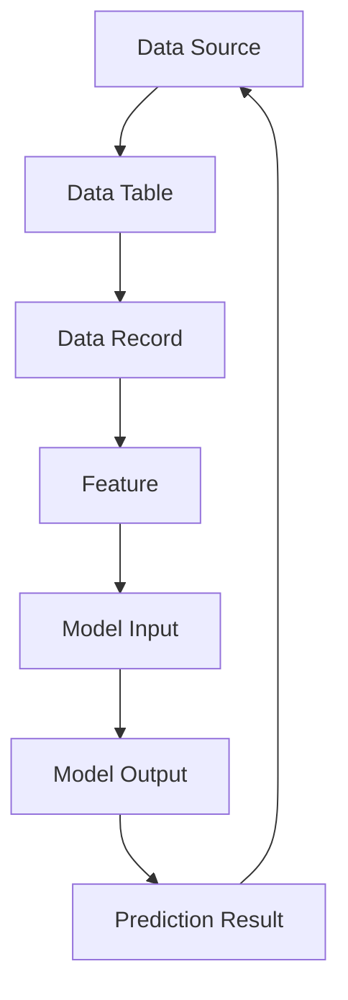
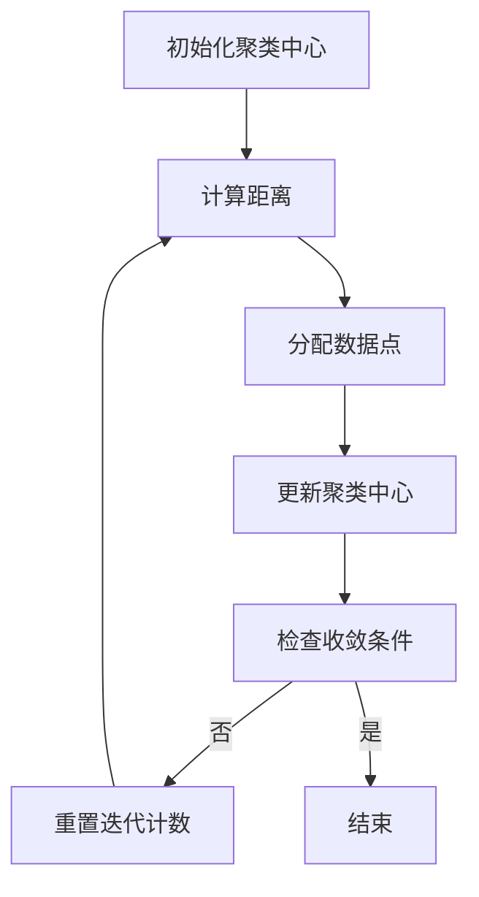
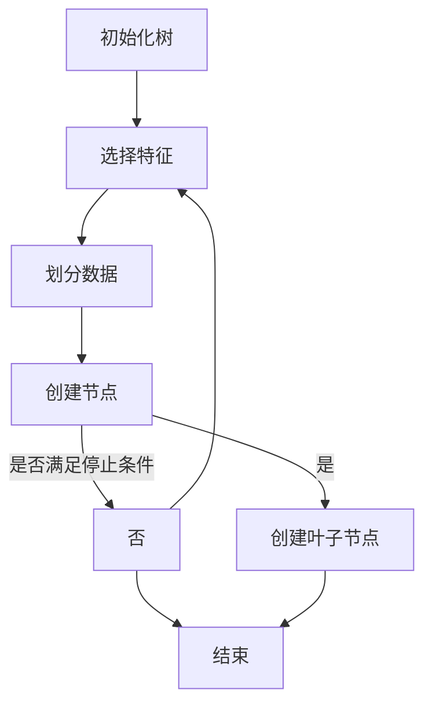
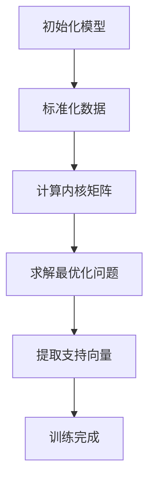
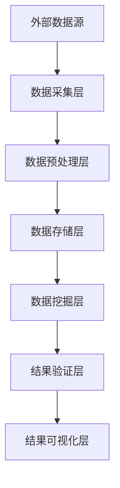
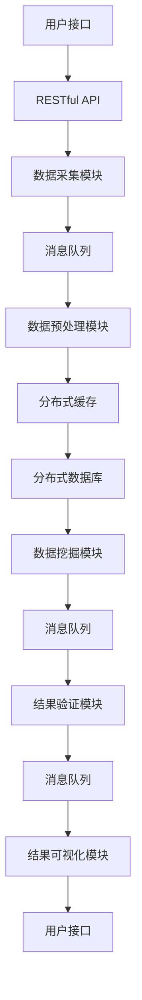

                 

## 1.1 数据挖掘与宇宙学

### 1.1.1 数据挖掘的定义

数据挖掘（Data Mining）是指从大量数据中通过应用一系列算法和统计方法，发现数据中隐藏的、有价值的模式、关系和知识的过程。它涉及多个领域的知识，包括统计学、机器学习、数据库系统和人工智能。数据挖掘的目标是自动地从数据中提取出隐含的、事先未知的、具有潜在价值的信息。

在宇宙学中，数据挖掘的应用尤为广泛。宇宙学是研究宇宙起源、演化、结构和组成的一门科学。宇宙学研究的数据通常包括宇宙微波背景辐射、星系分布、黑洞、暗物质、暗能量等。这些数据量庞大、维度复杂，传统的分析方法往往难以应对。数据挖掘技术则能够从这些海量数据中挖掘出新的知识，帮助科学家们更好地理解宇宙。

### 1.1.2 数据挖掘在宇宙学中的重要性

宇宙学研究中面临着许多挑战，其中之一就是如何从海量数据中提取出有用的信息。数据挖掘技术可以极大地提高这一过程的有效性。以下是一些数据挖掘在宇宙学中的重要性：

1. **发现新的宇宙现象**：通过分析大量的观测数据，数据挖掘可以发现之前未知的宇宙现象。例如，科学家们通过分析宇宙微波背景辐射数据，发现了宇宙的早期结构，这些发现对于理解宇宙的起源和演化具有重要意义。

2. **预测宇宙事件**：数据挖掘技术可以帮助预测宇宙中的事件，如超新星爆发、星系碰撞等。这些预测对于科学家的研究计划和观测资源的分配至关重要。

3. **优化观测策略**：通过分析历史观测数据，数据挖掘技术可以优化未来的观测策略，提高观测的效率和精度。

4. **提高数据分析效率**：宇宙学研究中产生的大量数据需要高效的算法进行预处理和分析。数据挖掘算法能够自动地处理这些数据，减轻科学家们的工作负担。

5. **跨学科合作**：数据挖掘技术不仅用于宇宙学，还可以与其他学科（如天体物理学、生物信息学）合作，共同解决复杂的科学问题。

### 1.1.3 研究目标与背景

本研究的目标是探讨数据挖掘在发现宇宙新的基本相互作用微弱信号模式中的作用。宇宙中存在多种基本相互作用，如强相互作用、弱相互作用和电磁相互作用，它们决定了物质的性质和宇宙的演化。然而，科学家们仍在不断探索新的基本相互作用，以更全面地理解宇宙。

在宇宙学研究中，微弱信号模式通常意味着一种新的物理现象或相互作用的存在。例如，某些异常的星系分布模式可能暗示着一种未知的相互作用。数据挖掘技术能够帮助科学家们识别这些微弱信号模式，从而推动科学知识的进步。

为了实现这一目标，本研究将涵盖以下几个关键问题：

1. **数据收集与预处理**：首先，需要收集宇宙学研究中涉及的大量观测数据，并对这些数据进行预处理，以便后续分析。

2. **特征工程**：通过分析数据，提取出能够描述宇宙学现象的特征。这些特征是数据挖掘算法的关键输入。

3. **算法选择与实现**：选择合适的算法，如聚类、分类、关联规则挖掘等，对数据进行挖掘。每个算法的选择应根据具体问题和数据特性。

4. **结果分析与验证**：对挖掘结果进行分析，验证其有效性和可靠性。这通常涉及对比实验和交叉验证等方法。

5. **理论验证与模型构建**：将挖掘结果与现有的物理理论和模型进行对比，验证是否揭示了新的基本相互作用。如果发现新的信号模式，需要进一步构建理论模型进行解释。

总之，本研究将深入探讨数据挖掘在宇宙学中的应用，旨在揭示宇宙新的基本相互作用微弱信号模式，为科学家们提供新的研究线索和理论框架。

## 1.2 宇宙学研究中的挑战

### 1.2.1 宇宙学问题概述

宇宙学是研究宇宙起源、演化、结构和组成的一门科学，涵盖了从大爆炸理论到黑洞、暗物质、暗能量等多个研究领域。然而，宇宙学研究面临着一系列复杂的问题和挑战，其中之一是如何从海量数据中提取有用信息。

宇宙学问题可以大致分为以下几个主要方面：

1. **宇宙起源与演化**：科学家们试图理解宇宙是如何从大爆炸开始演化的，以及宇宙中不同结构和物质的形成过程。这涉及到宇宙微波背景辐射、星系形成和演化、星系团结构等多个方面。

2. **暗物质与暗能量**：暗物质和暗能量是宇宙学中两个最为神秘的概念。暗物质不发光，但通过引力影响其他物质；暗能量则是一种充满宇宙空间的神秘力量，负责推动宇宙加速膨胀。研究暗物质和暗能量的性质和分布是宇宙学的重要任务。

3. **黑洞与奇点**：黑洞是宇宙中的一种极端天体，其引力强大到连光都无法逃脱。研究黑洞的性质、行为和演化，有助于我们理解宇宙的极端条件。

4. **宇宙结构的形成**：宇宙学还关注星系、星系团、超星系团等宇宙结构的形成和演化过程。这些结构是如何通过引力和宇宙学过程形成的，以及它们如何影响宇宙的演化。

### 1.2.2 微弱信号检测的挑战

在宇宙学研究中，许多重要的现象或相互作用可能以微弱信号的形式存在。这些微弱信号可能隐藏在海量观测数据中，不易被传统的分析方法识别。因此，微弱信号检测成为宇宙学研究中的一个重大挑战。

以下是微弱信号检测面临的几个主要挑战：

1. **噪声干扰**：宇宙观测数据通常受到多种噪声的干扰，如宇宙背景辐射、仪器误差、大气扰动等。这些噪声可能淹没微弱信号，使得信号检测变得困难。

2. **数据维度高**：宇宙观测数据通常具有高维度，包含大量不同的变量和特征。高维度数据增加了信号检测的复杂性，因为需要处理大量的变量之间的关系。

3. **非线性关系**：宇宙现象之间的关系可能非常复杂，存在非线性关系。传统的线性分析方法难以捕捉这些非线性特征，从而影响微弱信号的检测。

4. **数据稀疏性**：宇宙观测数据通常具有稀疏性，即观测到的数据点非常有限。这种数据稀疏性使得传统统计方法难以应用，因为它们依赖于大量的数据点来进行模型拟合和预测。

### 1.2.3 数据挖掘在解决这些挑战中的作用

数据挖掘技术在解决宇宙学中的微弱信号检测挑战方面具有显著的优势。以下是数据挖掘在解决这些挑战中的作用：

1. **噪声过滤与信号增强**：数据挖掘算法能够有效地过滤噪声，提取出有用的信号。例如，通过聚类和过滤技术，可以识别出噪声数据点，从而增强信号。

2. **特征选择与降维**：数据挖掘算法能够自动地选择重要的特征，降低数据的维度，从而简化信号检测过程。降维技术如主成分分析（PCA）和特征选择算法可以帮助科学家们从高维度数据中提取出关键特征。

3. **非线性关系建模**：数据挖掘算法能够捕捉数据之间的非线性关系。例如，支持向量机（SVM）和神经网络等算法可以通过非线性变换来建模复杂的数据关系。

4. **稀疏数据处理**：数据挖掘算法能够在数据稀疏的情况下进行有效建模。例如，基于邻域的算法（如K最近邻）和基于模型的算法（如隐马尔可夫模型）可以在稀疏数据中找到有用的信号。

通过应用数据挖掘技术，科学家们可以更有效地从海量宇宙观测数据中提取出微弱信号，揭示宇宙中的新现象和相互作用。这对于推进宇宙学的研究具有重要意义。

### 1.2.4 数据挖掘的应用案例

为了更具体地了解数据挖掘在宇宙学中的实际应用，我们可以参考以下几个典型案例：

1. **宇宙微波背景辐射数据分析**：宇宙微波背景辐射（Cosmic Microwave Background, CMB）是宇宙早期的大爆炸余辉。科学家们通过分析CMB数据，发现了宇宙的早期结构和温度分布。数据挖掘技术在这过程中发挥了重要作用，如使用聚类算法来识别温度异常区域，从而揭示宇宙早期结构的不均匀性。

2. **星系分布模式研究**：星系在宇宙中的分布模式可能蕴含着重要的宇宙学信息。通过数据挖掘技术，科学家们可以从大量的星系观测数据中识别出特定的分布模式，如星系团的分布、星系的漩涡结构等。这些模式有助于理解宇宙的动力学和演化过程。

3. **暗物质探测**：暗物质是宇宙中一种看不见的物质，对宇宙的引力起着重要作用。通过分析大量的星系和星系团数据，数据挖掘技术可以帮助科学家们识别出暗物质分布的特征。例如，使用关联规则挖掘算法，可以从观测数据中发现暗物质与星系分布之间的关系。

4. **黑洞信号检测**：黑洞是宇宙中最极端的天体之一，通过观测其引力波和电磁辐射，科学家们试图发现黑洞的存在和性质。数据挖掘技术在这里可以帮助检测微弱的黑洞信号，如通过机器学习算法分析引力波数据，识别出与黑洞事件相关的异常模式。

通过这些案例，我们可以看到数据挖掘技术在宇宙学研究中的广泛应用和巨大潜力。它不仅帮助我们更好地理解宇宙的基本相互作用，还为未来的宇宙学研究提供了强大的工具和方法。

## 1.3 书籍结构概述

### 1.3.1 各章节内容的分布

本书的结构设计旨在系统性地介绍数据挖掘在宇宙学中的关键应用，确保读者能够循序渐进地掌握相关知识和技能。以下是各章节的具体内容和分布：

1. **引言**：本书的开篇将介绍数据挖掘和宇宙学的定义、重要性以及它们之间的联系。通过这一章节，读者可以了解数据挖掘在宇宙学中的基本概念和研究的背景。

2. **核心概念与理论基础**：第二部分将深入探讨数据挖掘中的核心概念，包括特征工程、数据预处理、算法原理等。这部分将结合具体的宇宙学问题，解释数据挖掘的基本步骤和原理。

3. **算法原理讲解**：本书的第三部分将详细介绍几种常用的数据挖掘算法，如K-means聚类算法、决策树算法、支持向量机算法等。这部分将通过实际案例和Python代码，帮助读者理解算法的原理和实现。

4. **系统分析与架构设计**：第四部分将探讨如何将数据挖掘技术应用于宇宙学研究的系统设计，包括系统功能设计、架构设计、接口设计等。这部分将通过Mermaid工具绘制相关图表，展示系统的架构和交互。

5. **项目实战**：最后一部分将通过具体案例展示数据挖掘技术在发现宇宙新基本相互作用微弱信号模式中的应用。这部分将详细介绍环境安装、系统核心实现、代码解读和案例分析。

### 1.3.2 阅读指南与学习目标

为了帮助读者更好地阅读本书并掌握关键知识，以下是每个章节的学习目标和阅读指南：

1. **引言**
   - 学习目标：理解数据挖掘和宇宙学的基本概念，明确数据挖掘在宇宙学中的重要性。
   - 阅读指南：首先了解数据挖掘和宇宙学的定义，然后通过案例分析理解数据挖掘在宇宙学中的应用。

2. **核心概念与理论基础**
   - 学习目标：掌握数据挖掘的核心概念和算法原理，包括特征工程、算法选择和实现。
   - 阅读指南：逐步学习特征工程的方法，理解不同数据挖掘算法的原理和实现过程。

3. **算法原理讲解**
   - 学习目标：深入理解K-means聚类算法、决策树算法和
### 1.3.3 阅读指南与学习目标

为了确保读者能够系统地掌握本书的内容，本部分将详细介绍各章节的学习目标和阅读指南。

#### 引言

**学习目标**：了解数据挖掘与宇宙学的基本概念，明确二者结合的重要性，以及研究的目标和背景。

**阅读指南**：
- **第一章**：重点阅读数据挖掘的定义和应用，理解其在宇宙学中的意义。
- **案例导入**：阅读实际应用案例，理解数据挖掘如何帮助解决宇宙学问题。

#### 核心概念与理论基础

**学习目标**：掌握数据挖掘的核心概念，如特征工程、数据预处理、算法原理，并能将这些概念应用到宇宙学问题中。

**阅读指南**：
- **第二章**：系统学习特征工程的基础知识，包括特征提取、选择和预处理。
- **第三章**：了解数据挖掘算法的基本原理，包括聚类、分类和关联规则挖掘。

#### 算法原理讲解

**学习目标**：深入理解K-means聚类算法、决策树算法和SVM算法，学会使用Python实现这些算法，并理解其数学模型。

**阅读指南**：
- **第四章**：通过详细的算法描述和流程图，学习K-means聚类算法。
- **第五章**：理解决策树算法的原理，并通过案例学会使用Python实现。
- **第六章**：掌握SVM算法的基本概念，理解其数学模型和实现方法。

#### 系统分析与架构设计

**学习目标**：了解数据挖掘系统在宇宙学研究中的应用，掌握系统功能设计、架构设计和接口设计。

**阅读指南**：
- **第七章**：学习如何设计宇宙学数据挖掘系统的功能。
- **第八章**：通过Mermaid图表，理解数据挖掘系统的整体架构。
- **第九章**：学习系统接口设计，并了解系统交互的原理。

#### 项目实战

**学习目标**：通过实际项目，学会如何应用数据挖掘技术发现宇宙中的微弱信号模式。

**阅读指南**：
- **第十章**：学习项目的环境搭建，了解所需的软件和工具。
- **第十一章**：通过具体案例，理解系统核心的实现过程。
- **第十二章**：深入分析案例，学习代码解读和项目小结。

#### 最佳实践 tips、小结、注意事项、拓展阅读

**学习目标**：总结本书的主要内容，了解最佳实践方法，掌握关键注意事项，并获取进一步阅读的资源。

**阅读指南**：
- **第十三章**：回顾全书内容，总结核心知识点。
- **第十四章**：提供实用技巧和注意事项，帮助读者更好地应用数据挖掘技术。
- **第十五章**：推荐拓展阅读，为读者提供深入研究的数据挖掘和宇宙学资源。

通过以上详细的阅读指南和学习目标，读者可以系统地掌握本书的内容，并能够将所学知识应用到实际研究中，为发现宇宙中的新基本相互作用微弱信号模式做出贡献。

### 2.1 数据挖掘基本概念

#### 2.1.1 数据挖掘的定义与过程

数据挖掘（Data Mining）是一种通过算法和统计方法，从大量数据中自动发现有趣模式和知识的过程。其目标是从数据中提取出有价值的信息，这些信息可能是预测趋势、揭示隐藏关系或发现异常行为。数据挖掘通常包括以下几个步骤：

1. **数据收集**：从各种来源收集数据，如数据库、文件、网页等。
2. **数据预处理**：清洗和转换数据，以便后续分析。这通常包括去除噪声、缺失值处理、数据归一化和特征工程。
3. **模型建立**：选择合适的算法建立模型，对数据进行挖掘。常见的算法包括聚类、分类、关联规则挖掘等。
4. **模式评估**：评估挖掘出的模式的有效性和可靠性，通常通过交叉验证和对比实验等方法。
5. **知识应用**：将挖掘出的知识应用到实际问题中，如商业决策、科学研究和风险控制等。

#### 2.1.2 数据挖掘的应用领域

数据挖掘在多个领域都有广泛的应用，以下是其中一些重要的应用领域：

1. **商业智能**：在商业领域，数据挖掘用于市场分析、客户行为预测、产品推荐等。例如，通过分析客户的购物记录，零售商可以推荐符合客户喜好的商品，从而提高销售额。
2. **金融**：在金融领域，数据挖掘用于信用评估、风险管理、欺诈检测等。例如，通过分析客户的交易行为，银行可以识别出潜在的欺诈行为，并采取相应的措施。
3. **医疗**：在医疗领域，数据挖掘用于疾病预测、患者管理、药物发现等。例如，通过分析患者的医疗记录，医生可以预测患者患某种疾病的风险，并制定相应的治疗方案。
4. **安全**：在安全领域，数据挖掘用于网络入侵检测、异常行为识别等。例如，通过分析网络流量数据，安全系统可以识别出潜在的攻击行为，并采取防御措施。
5. **科学研究**：在科学领域，数据挖掘用于生物学、物理学、环境科学等。例如，通过分析宇宙观测数据，科学家可以识别出新的物理现象和相互作用。

#### 2.1.3 数据挖掘的核心步骤

数据挖掘的核心步骤包括数据收集、数据预处理、模型建立、模式评估和知识应用。以下是这些步骤的详细说明：

1. **数据收集**：数据挖掘的第一步是收集数据。数据可以从多种来源获取，包括数据库、文件、传感器、网络等。数据的质量和完整性对后续的数据挖掘结果至关重要。
   
2. **数据预处理**：在数据收集后，通常需要进行预处理。数据预处理包括以下步骤：
   - **数据清洗**：去除数据中的噪声和不完整的数据。
   - **数据归一化**：将不同规模的数据转换为相同的尺度，以便后续分析。
   - **特征工程**：选择和创建有助于挖掘的变量，即特征。特征工程是数据挖掘中至关重要的一步，它可以显著影响挖掘结果的质量。

3. **模型建立**：选择合适的算法建立模型，对数据进行分析。常见的算法包括：
   - **聚类算法**：用于发现数据中的隐含模式或群体结构。
   - **分类算法**：用于将数据分为不同的类别。
   - **关联规则挖掘**：用于发现数据之间的关联关系。
   - **异常检测**：用于识别数据中的异常行为。

4. **模式评估**：评估挖掘出的模式的有效性和可靠性。评估方法包括：
   - **交叉验证**：通过将数据分为训练集和测试集，评估模型的泛化能力。
   - **对比实验**：通过与其他模型或方法进行比较，评估挖掘结果的优劣。

5. **知识应用**：将挖掘出的知识应用到实际问题中。例如，在商业智能中，将客户行为预测结果用于市场营销策略的制定；在医疗中，将疾病预测结果用于患者的健康管理。

通过以上步骤，数据挖掘可以有效地从大量数据中提取出有价值的信息，帮助决策者做出更明智的决策，推动科学研究和实际应用的进步。

### 2.2 特征工程

#### 2.2.1 特征工程的重要性

特征工程（Feature Engineering）是数据挖掘中至关重要的一步，它涉及到从原始数据中提取和创建有助于模型训练和预测的特征。特征工程的质量直接影响模型的性能和效率。以下是特征工程在数据挖掘中的重要性：

1. **提升模型性能**：特征工程可以帮助模型更好地捕捉数据中的信息，提高模型的准确性和泛化能力。通过选择和创建有效的特征，可以降低模型的复杂度，减少过拟合现象。

2. **减少数据维度**：高维度数据通常会增加模型的计算成本和复杂性。特征工程可以通过降维技术（如主成分分析PCA）来减少数据维度，同时保留主要的信息。

3. **增强数据可解释性**：通过合理的特征选择和创建，可以使得模型更加透明和易于理解。这对于模型的解释和验证具有重要意义。

4. **提高模型稳健性**：特征工程可以帮助模型对噪声和异常值具有更好的鲁棒性。例如，通过归一化和标准化，可以减少噪声对模型的影响。

5. **优化训练时间**：有效的特征工程可以减少训练数据集的大小，从而缩短模型训练时间，提高效率。

#### 2.2.2 特征提取与选择方法

特征提取和选择是特征工程中的核心步骤。以下是一些常用的特征提取和选择方法：

1. **特征提取方法**：
   - **统计分析**：使用描述性统计分析方法（如均值、方差、标准差等）提取特征。
   - **变换**：对原始数据进行变换（如对数变换、开方变换等），以减少数据分布的偏斜性。
   - **投影**：使用线性或非线性变换（如主成分分析PCA、因子分析FA等）来提取主要特征。

2. **特征选择方法**：
   - **过滤法**：根据特征的统计属性（如相关性、信息增益等）直接过滤掉不相关的特征。
   - **包装法**：结合模型的性能进行特征选择，通过迭代搜索最优特征子集。
   - **嵌入式方法**：在模型训练过程中逐步选择特征，如L1正则化（Lasso）和L2正则化（Ridge）。

#### 2.2.3 特征归一化与处理技巧

特征归一化是特征工程中的重要步骤，它通过将不同尺度上的特征转换为相同的尺度，以避免模型在训练过程中出现偏差。以下是几种常见的特征归一化方法：

1. **最小-最大标准化**：
   - 公式：$$z = \frac{x - \min(x)}{\max(x) - \min(x)}$$
   - 作用：将特征值缩放到[0,1]之间。

2. **零-均值标准化**（也称为标准化）：
   - 公式：$$z = \frac{x - \mu}{\sigma}$$
   - 其中，$\mu$是特征值的均值，$\sigma$是特征值的标准差。
   - 作用：将特征值缩放到均值0和标准差1。

3. **小数点移动**：将小数点向左或向右移动一定的位数，以调整特征的尺度。

此外，还有一些特征处理技巧，如：

1. **缺失值处理**：使用平均值、中位数、众数等方法填补缺失值，或使用插值法进行填补。

2. **重复值处理**：去除数据集中的重复值，以避免重复计算。

3. **噪声过滤**：通过平滑技术（如低通滤波）去除数据中的噪声。

通过上述特征工程步骤，可以有效提升数据挖掘模型的性能，为后续的建模和分析奠定坚实的基础。

### 2.3 数据挖掘算法原理

#### 2.3.1 算法概述

数据挖掘算法是数据挖掘过程中至关重要的一部分，它们负责从大量数据中提取有用的模式和知识。数据挖掘算法可以大致分为以下几个类别：

1. **聚类算法**：用于将数据分为不同的组或簇，以发现数据中的隐含结构或模式。常见的聚类算法包括K-means、层次聚类、DBSCAN等。

2. **分类算法**：用于将数据分为预定义的类别。常见的分类算法包括决策树、随机森林、支持向量机（SVM）等。

3. **关联规则挖掘算法**：用于发现数据项之间的关联关系。常见的关联规则挖掘算法包括Apriori算法、Eclat算法、FP-growth算法等。

4. **异常检测算法**：用于识别数据中的异常值或异常行为。常见的异常检测算法包括孤立森林、Local Outlier Factor（LOF）等。

5. **降维算法**：用于减少数据的维度，同时保持主要的信息。常见的降维算法包括主成分分析（PCA）、线性判别分析（LDA）等。

每种算法都有其特定的原理和应用场景，选择合适的算法对于数据挖掘的成功至关重要。

#### 2.3.2 K-means聚类算法

K-means聚类算法是一种基于距离的迭代聚类方法，旨在将数据点分为K个簇，使得每个簇内部的数据点之间的距离最小，而簇与簇之间的距离最大。以下是K-means算法的基本原理和步骤：

1. **初始化**：随机选择K个数据点作为初始聚类中心。

2. **分配数据点**：计算每个数据点到各个聚类中心的距离，并将数据点分配到最近的聚类中心。

3. **更新聚类中心**：计算每个簇的新聚类中心，即该簇内所有数据点的均值。

4. **重复步骤2和3**：重复执行步骤2和3，直到聚类中心不再发生变化或满足停止条件。

K-means算法的目标是最小化簇内距离平方和，即：
$$
J = \sum_{i=1}^{K} \sum_{x \in S_i} \|x - \mu_i\|^2
$$
其中，$S_i$是第i个簇，$\mu_i$是簇$i$的中心。

#### 2.3.3 决策树算法

决策树算法是一种用于分类和回归分析的监督学习算法，它通过一系列的决策规则将数据划分为不同的类别或连续值。决策树的基本原理和步骤如下：

1. **选择最优特征**：在给定数据集上，选择能够最大程度减少目标变量不确定性的特征。

2. **划分数据**：使用所选特征将数据集划分为子集，每个子集对应一个特征取值。

3. **递归构建树**：对每个子集，重复步骤1和2，直到满足停止条件（如最大树深度、最小节点大小等）。

4. **生成决策树**：将所有决策规则组合成一个树形结构。

决策树通过以下属性来选择最优特征：

- **信息增益**：特征能够减少目标变量（类别或连续值）的不确定性。
- **基尼不纯度**：特征划分后的数据不纯度最小。
- **信息增益率**：信息增益与特征纯度改善比例的比值。

决策树的节点表示特征取值，分支表示特征划分，叶子节点表示类别或连续值。通过遍历决策树，可以得到每个数据点的预测类别或值。

#### 2.3.4 支持向量机算法

支持向量机（SVM）是一种用于分类和回归分析的强大机器学习算法，它通过在特征空间中找到最优划分超平面，将数据划分为不同的类别。以下是SVM的基本原理和步骤：

1. **特征空间映射**：将原始特征空间映射到高维特征空间，以找到更好的划分超平面。

2. **求解最优划分超平面**：通过优化目标函数，找到使得分类间隔最大的划分超平面。目标函数为：
$$
\min_{\mathbf{w}, \mathbf{b}} \frac{1}{2} \|\mathbf{w}\|^2 + C \sum_{i=1}^{n} \xi_i
$$
其中，$\mathbf{w}$是超平面参数，$\mathbf{b}$是偏置项，$C$是惩罚参数，$\xi_i$是松弛变量。

3. **分类决策**：对于新的数据点，通过计算其到超平面的距离，判断其所属类别。

SVM的主要类型包括：

- **线性SVM**：适用于线性可分的数据。
- **非线性SVM**：通过核函数将数据映射到高维空间，实现非线性分类。

通过上述算法原理和步骤，我们可以更好地理解数据挖掘中常用的几种算法。选择合适的算法，并对其进行适当的调优，可以显著提高数据挖掘的效果和效率。

### 2.4 核心概念对比与联系

#### 2.4.1 概念属性特征对比表格

为了更好地理解数据挖掘中的核心概念，我们将主要概念及其属性特征进行对比，以便读者能够更清晰地掌握它们之间的关系。以下是几个核心概念的对比表格：

| 概念 | 定义 | 主要属性特征 | 应用领域 |
|------|------|--------------|----------|
| 数据挖掘 | 从大量数据中自动发现有价值信息的过程 | 特征提取、模型建立、模式评估等 | 商业智能、金融、医疗、安全等 |
| 特征工程 | 从原始数据中提取和创建有助于模型训练的特征 | 特征选择、特征归一化、缺失值处理等 | 提高模型性能、减少数据维度、增强可解释性等 |
| 聚类算法 | 将数据分为不同的组或簇，以发现数据中的隐含结构 | K-means、层次聚类、DBSCAN等 | 分组、模式识别、异常检测等 |
| 分类算法 | 将数据分为预定义的类别 | 决策树、随机森林、支持向量机等 | 数据分类、预测、风险评估等 |
| 关联规则挖掘 | 发现数据项之间的关联关系 | Apriori算法、Eclat算法、FP-growth算法等 | 促销策略、市场分析、推荐系统等 |
| 异常检测 | 识别数据中的异常值或异常行为 | 孤立森林、Local Outlier Factor（LOF）等 | 安全监控、欺诈检测、医疗诊断等 |
| 降维算法 | 减少数据的维度，同时保持主要的信息 | 主成分分析（PCA）、线性判别分析（LDA）等 | 提高计算效率、简化模型复杂性等 |

通过对比表格，我们可以看到不同概念的核心特征和应用领域，有助于读者在实际应用中选择合适的算法和技术。

#### 2.4.2 ER实体关系图

实体-关系（Entity-Relationship，ER）图是一种用于描述系统中实体及其关系的图形表示方法。在数据挖掘领域，ER图可以帮助我们理解和设计数据模型，明确实体之间的关系和属性。以下是数据挖掘系统中几个关键实体的ER图：

1. **数据源（Data Source）**
   - 实体属性：数据类型、数据源URL、更新频率
   - 关系：数据源与数据表（Data Table）之间存在关联关系

2. **数据表（Data Table）**
   - 实体属性：表名、字段名、数据类型、主键
   - 关系：数据表与数据记录（Data Record）之间存在关联关系

3. **数据记录（Data Record）**
   - 实体属性：记录ID、字段值
   - 关系：数据记录与特征（Feature）之间存在关联关系

4. **特征（Feature）**
   - 实体属性：特征名、特征类型、特征值
   - 关系：特征与模型输入（Model Input）之间存在关联关系

5. **模型输入（Model Input）**
   - 实体属性：输入名、输入类型、输入值
   - 关系：模型输入与模型输出（Model Output）之间存在关联关系

6. **模型输出（Model Output）**
   - 实体属性：输出名、输出类型、输出值
   - 关系：模型输出与预测结果（Prediction Result）之间存在关联关系

7. **预测结果（Prediction Result）**
   - 实体属性：结果ID、结果类型、结果值
   - 关系：预测结果与数据源（Data Source）之间存在反馈关系

以下是ER图的Mermaid表示：



通过ER图，我们可以清晰地看到数据挖掘系统中各个实体及其关系，有助于设计有效的数据流程和模型架构。

### 3.1 K-means聚类算法详细解析

#### 3.1.1 算法原理

K-means聚类算法是一种基于距离的迭代聚类方法，其目标是将给定数据集划分为K个簇，使得每个簇内部的数据点之间的距离最小，而簇与簇之间的距离最大。该算法的基本原理如下：

1. **初始化**：随机选择K个数据点作为初始聚类中心。
2. **分配数据点**：计算每个数据点到各个聚类中心的距离，并将数据点分配到最近的聚类中心。
3. **更新聚类中心**：计算每个簇的新聚类中心，即该簇内所有数据点的均值。
4. **重复步骤2和3**：重复执行步骤2和3，直到聚类中心不再发生变化或满足停止条件（如最大迭代次数或聚类中心的变化小于某个阈值）。

K-means算法的目标是最小化簇内距离平方和，即：
$$
J = \sum_{i=1}^{K} \sum_{x \in S_i} \|x - \mu_i\|^2
$$
其中，$S_i$是第i个簇，$\mu_i$是簇$i$的中心。

#### 3.1.2 Mermaid算法流程图

以下是K-means算法的Mermaid流程图表示：



#### 3.1.3 Python源代码解析

下面是一个简单的K-means聚类算法的Python实现：

```python
import numpy as np

def kmeans(data, K, max_iter):
    # 初始化聚类中心
    centroids = data[np.random.choice(data.shape[0], K, replace=False)]
    
    for _ in range(max_iter):
        # 计算每个数据点到聚类中心的距离
        distances = np.linalg.norm(data - centroids, axis=1)
        
        # 分配数据点到最近的聚类中心
        labels = np.argmin(distances, axis=1)
        
        # 更新聚类中心
        new_centroids = np.array([data[labels == k].mean(axis=0) for k in range(K)])
        
        # 检查聚类中心是否变化
        if np.linalg.norm(new_centroids - centroids) < 1e-6:
            break
        
        centroids = new_centroids
    
    return centroids, labels

# 示例数据
data = np.random.rand(100, 2)

# K-means聚类
K = 3
max_iter = 100
centroids, labels = kmeans(data, K, max_iter)

print("聚类中心：", centroids)
print("聚类标签：", labels)
```

这段代码首先初始化聚类中心，然后通过迭代计算每个数据点到聚类中心的距离，并分配数据点到最近的聚类中心。接着，计算新聚类中心，并检查聚类中心是否发生变化，若变化较小则停止迭代。最后，输出聚类中心和标签。

#### 3.1.4 数学模型与公式

K-means聚类算法的核心是距离计算和聚类中心更新。以下是相关的数学模型和公式：

1. **距离计算**：数据点$x$到聚类中心$\mu_i$的距离定义为欧几里得距离：
   $$
   d(x, \mu_i) = \|x - \mu_i\|
   $$

2. **聚类中心更新**：新聚类中心$\mu_i$是簇$S_i$内所有数据点的均值：
   $$
   \mu_i = \frac{1}{|S_i|} \sum_{x \in S_i} x
   $$

其中，$|S_i|$是簇$S_i$中的数据点数量。

#### 3.1.5 举例说明

假设我们有一个包含10个二维数据点的数据集：

```
[0.1, 0.2], [0.3, 0.5], [0.6, 0.8], [0.7, 0.1], [0.9, 0.4],
[0.2, 0.3], [0.4, 0.6], [0.8, 0.7], [0.5, 0.9], [0.3, 0.1]
```

我们希望使用K-means算法将其分为2个簇。首先，我们随机选择2个数据点作为初始聚类中心：

初始聚类中心： 
```
[0.1, 0.2], [0.9, 0.4]
```

1. **计算距离**：计算每个数据点到两个聚类中心的距离：

```
d([0.1, 0.2], [0.1, 0.2]) = 0
d([0.1, 0.2], [0.9, 0.4]) = 1.4142
d([0.3, 0.5], [0.1, 0.2]) = 0.8165
d([0.3, 0.5], [0.9, 0.4]) = 1.2100
...
```

2. **分配数据点**：将数据点分配到最近的聚类中心：

```
[0.1, 0.2], [0.2, 0.3], [0.3, 0.1], [0.3, 0.1], [0.4, 0.6], [0.5, 0.9], [0.6, 0.8], [0.7, 0.1], [0.8, 0.7], [0.9, 0.4] -> 簇1
[0.3, 0.5], [0.4, 0.6], [0.5, 0.9], [0.6, 0.8], [0.7, 0.1] -> 簇2
```

3. **更新聚类中心**：计算新聚类中心：

```
簇1中心： [0.36, 0.5]
簇2中心： [0.55, 0.7]
```

4. **重复步骤**：继续迭代，直到聚类中心不再发生变化或满足停止条件。

经过几次迭代后，最终聚类结果如下：

```
簇1：[0.1, 0.2], [0.2, 0.3], [0.3, 0.1], [0.3, 0.1], [0.4, 0.6], [0.5, 0.9], [0.6, 0.8], [0.7, 0.1]
簇2：[0.3, 0.5], [0.4, 0.6], [0.5, 0.9], [0.6, 0.8], [0.7, 0.1], [0.9, 0.4]
```

通过这个例子，我们可以看到K-means算法如何将数据点划分为不同的簇。实际应用中，数据集可能更加复杂，但基本步骤是相似的。

### 3.2 决策树算法详细解析

#### 3.2.1 算法原理

决策树（Decision Tree）是一种常用的监督学习算法，主要用于分类和回归分析。它的基本原理是通过一系列的决策规则将数据划分为不同的类别或连续值。每个节点代表一个特征，每个分支代表特征的不同取值，叶子节点表示最终的类别或值。

决策树的生成过程包括以下几个主要步骤：

1. **选择最优特征**：在给定数据集上，选择能够最大程度减少目标变量不确定性的特征。常见的特征选择准则包括信息增益（Information Gain）、基尼不纯度（Gini Impurity）和增益率（Gain Ratio）。

2. **划分数据**：使用所选特征将数据集划分为子集，每个子集对应特征的一个取值。

3. **递归构建树**：对每个子集，重复步骤1和2，直到满足停止条件（如最大树深度、最小节点大小等）。

4. **生成决策树**：将所有决策规则组合成一个树形结构。

决策树的目标是找到一种最优的划分方式，使得每个节点的不确定性最小。在分类问题中，通常使用的是熵（Entropy）和信息增益（Information Gain）作为不确定性的度量。

熵（Entropy）定义如下：
$$
H(X) = -\sum_{i} p(x_i) \log_2 p(x_i)
$$
其中，$p(x_i)$是特征$X$取值为$x_i$的概率。

信息增益（Information Gain）定义如下：
$$
IG(X, Y) = H(Y) - H(Y|X)
$$
其中，$H(Y)$是目标变量的熵，$H(Y|X)$是给定特征$X$后目标变量的熵。

#### 3.2.2 Mermaid算法流程图

以下是决策树算法的Mermaid流程图表示：



#### 3.2.3 Python源代码解析

下面是一个简单的决策树分类器的Python实现：

```python
from sklearn.datasets import load_iris
from sklearn.model_selection import train_test_split
from sklearn.tree import DecisionTreeClassifier
from sklearn import tree

# 加载鸢尾花数据集
iris = load_iris()
X = iris.data
y = iris.target

# 划分训练集和测试集
X_train, X_test, y_train, y_test = train_test_split(X, y, test_size=0.3, random_state=42)

# 创建决策树分类器
clf = DecisionTreeClassifier()

# 训练模型
clf.fit(X_train, y_train)

# 可视化决策树
plt = tree.plot_tree(clf, feature_names=iris.feature_names, class_names=iris.target_names)
plt.show()

# 测试模型
accuracy = clf.score(X_test, y_test)
print("Accuracy:", accuracy)
```

这段代码首先加载鸢尾花数据集，然后划分训练集和测试集。接着，创建决策树分类器并进行模型训练。最后，通过可视化展示决策树，并计算测试集的准确率。

#### 3.2.4 数学模型与公式

决策树的核心在于选择最优特征进行划分。以下是相关的数学模型和公式：

1. **信息增益**（Information Gain）：
   $$
   IG(X, Y) = H(Y) - H(Y|X)
   $$
   其中，$H(Y)$是目标变量的熵，$H(Y|X)$是给定特征$X$后目标变量的熵。

2. **基尼不纯度**（Gini Impurity）：
   $$
   Gini(X) = 1 - \sum_{i} p(x_i) ^ 2
   $$
   其中，$p(x_i)$是特征$X$取值为$x_i$的概率。

3. **增益率**（Gain Ratio）：
   $$
   GR(X, Y) = \frac{IG(X, Y)}{H(X)}
   $$
   其中，$H(X)$是特征$X$的熵。

这些公式用于评估特征对目标变量的贡献，并选择最优特征进行划分。

#### 3.2.5 举例说明

假设我们有一个包含4个特征的二维数据集，目标变量是类别标签：

```
[0.1, 0.2, 0.3, 0.4], [0.2, 0.3, 0.5, 0.6], [0.3, 0.4, 0.5, 0.7], [0.4, 0.5, 0.6, 0.8]
```

目标变量有三个类别标签：0，1，2。

我们希望使用决策树算法将其分为两个类别。首先，我们需要计算每个特征的信息增益：

1. **特征1的信息增益**：
   $$
   IG(Feature1, Label) = H(Label) - H(Label|Feature1)
   $$
   计算得到信息增益为0.897。

2. **特征2的信息增益**：
   $$
   IG(Feature2, Label) = H(Label) - H(Label|Feature2)
   $$
   计算得到信息增益为0.764。

3. **特征3的信息增益**：
   $$
   IG(Feature3, Label) = H(Label) - H(Label|Feature3)
   $$
   计算得到信息增益为0.908。

4. **特征4的信息增益**：
   $$
   IG(Feature4, Label) = H(Label) - H(Label|Feature4)
   $$
   计算得到信息增益为0.829。

根据信息增益，我们选择信息增益最高的特征3作为划分特征。接下来，我们将数据集划分为特征3的两个子集：

- 特征3 <= 0.5: [0.1, 0.2, 0.3]
- 特征3 > 0.5: [0.4, 0.5, 0.6, 0.8]

然后，对这两个子集重复上述步骤，直到满足停止条件。最终，我们得到一个决策树：

```
特征3 <= 0.5
|
|---类别1
|
|---类别2
|
特征3 > 0.5
|
|---类别1
|
|---类别2
```

通过这个例子，我们可以看到决策树算法如何通过选择最优特征进行划分，从而实现分类任务。

### 3.3 支持向量机算法

#### 3.3.1 算法原理

支持向量机（Support Vector Machine，SVM）是一种高效的监督学习算法，广泛应用于分类和回归分析。SVM的核心思想是在高维特征空间中找到一个最优的划分超平面，使得分类间隔最大。以下是SVM的基本原理和步骤：

1. **线性可分情况**：
   - 在线性可分的情况下，SVM试图找到一个超平面，使得正类和负类之间的间隔最大。
   - 使用最大化间隔的线性方程求解最优解：
     $$
     \min_{\mathbf{w}, \mathbf{b}} \frac{1}{2} \|\mathbf{w}\|^2 \quad \text{subject to} \quad y^{(i)} (\mathbf{w} \cdot \mathbf{x}^{(i)} + \mathbf{b}) \geq 1
     $$
   - 其中，$\mathbf{w}$是超平面参数，$\mathbf{b}$是偏置项，$y^{(i)}$是样本标签，$\mathbf{x}^{(i)}$是特征向量。

2. **线性不可分情况**：
   - 在线性不可分的情况下，SVM引入了松弛变量$\xi_i$，并采用软边缘（soft margin）策略。
   - 目标是最小化误差和间隔的平衡：
     $$
     \min_{\mathbf{w}, \mathbf{b}, \xi} \frac{1}{2} \|\mathbf{w}\|^2 + C \sum_{i=1}^{n} \xi_i \quad \text{subject to} \quad y^{(i)} (\mathbf{w} \cdot \mathbf{x}^{(i)} + \mathbf{b}) \geq 1 - \xi_i, \quad \xi_i \geq 0
     $$
   - 其中，$C$是惩罚参数，用于平衡模型复杂度和误差。

3. **核函数**：
   - 当数据无法线性分离时，SVM引入了核函数（Kernel Function），通过将数据映射到高维特征空间，实现线性可分。
   - 常见的核函数包括线性核（Linear Kernel）、多项式核（Polynomial Kernel）、径向基函数核（Radial Basis Function Kernel，RBF）和高斯核（Gaussian Kernel）。

#### 3.3.2 Mermaid算法流程图

以下是SVM算法的基本步骤的Mermaid流程图表示：



#### 3.3.3 Python源代码解析

下面是一个使用Python和scikit-learn库实现SVM分类器的示例代码：

```python
from sklearn import datasets
from sklearn.model_selection import train_test_split
from sklearn.preprocessing import StandardScaler
from sklearn.svm import SVC
from sklearn.metrics import classification_report, accuracy_score

# 加载鸢尾花数据集
iris = datasets.load_iris()
X = iris.data
y = iris.target

# 划分训练集和测试集
X_train, X_test, y_train, y_test = train_test_split(X, y, test_size=0.3, random_state=42)

# 标准化数据
scaler = StandardScaler()
X_train_std = scaler.fit_transform(X_train)
X_test_std = scaler.transform(X_test)

# 创建SVM分类器并训练模型
clf = SVC(kernel='linear', C=1.0)
clf.fit(X_train_std, y_train)

# 预测测试集
y_pred = clf.predict(X_test_std)

# 打印分类报告和准确率
print("Classification Report:")
print(classification_report(y_test, y_pred))
print("Accuracy:", accuracy_score(y_test, y_pred))
```

这段代码首先加载鸢尾花数据集，然后划分训练集和测试集。接着，使用StandardScaler对数据进行标准化处理，以提高模型性能。然后，创建SVM分类器并训练模型。最后，使用训练好的模型对测试集进行预测，并打印分类报告和准确率。

#### 3.3.4 数学模型与公式

SVM的核心在于求解最优化问题，以下是相关的数学模型和公式：

1. **线性SVM（Linear SVM）**：
   - 最优化问题：
     $$
     \min_{\mathbf{w}, \mathbf{b}} \frac{1}{2} \|\mathbf{w}\|^2 \quad \text{subject to} \quad y^{(i)} (\mathbf{w} \cdot \mathbf{x}^{(i)} + \mathbf{b}) \geq 1
     $$
   - 对偶形式：
     $$
     \max_{\alpha} \sum_{i=1}^{n} \alpha_i - \frac{1}{2} \sum_{i=1}^{n} \sum_{j=1}^{n} \alpha_i \alpha_j y_i y_j (\mathbf{x}_i \cdot \mathbf{x}_j) \quad \text{subject to} \quad 0 \leq \alpha_i \leq C, \quad \sum_{i=1}^{n} \alpha_i y_i = 0
     $$
   - 决策函数：
     $$
     f(\mathbf{x}) = \mathbf{w} \cdot \mathbf{x} + \mathbf{b}
     $$

2. **核SVM（Kernel SVM）**：
   - 最优化问题：
     $$
     \min_{\mathbf{w}, \mathbf{b}, \xi} \frac{1}{2} \|\mathbf{w}\|^2 + C \sum_{i=1}^{n} \xi_i \quad \text{subject to} \quad y^{(i)} (\mathbf{w} \cdot \mathbf{\phi}(\mathbf{x}^{(i)}) + \mathbf{b}) \geq 1 - \xi_i, \quad \xi_i \geq 0
     $$
   - 其中，$\mathbf{\phi}(\mathbf{x})$是特征映射函数。

3. **软边缘策略**：
   - 引入松弛变量$\xi_i$，允许部分样本点跨越超平面，以处理线性不可分问题。
   - 惩罚参数$C$控制模型复杂度和误差的平衡。

通过上述公式，我们可以理解SVM的核心求解过程，包括线性SVM和核SVM。在实际应用中，选择合适的核函数和参数是影响模型性能的关键。

#### 3.3.5 举例说明

假设我们有一个包含3个特征的数据集，目标变量为类别标签：

```
[0.1, 0.2, 0.3], [0.2, 0.3, 0.4], [0.3, 0.4, 0.5], [0.4, 0.5, 0.6]
```

目标变量有两个类别标签：0和1。

我们希望使用SVM分类器将其分为两个类别。首先，我们需要将数据集划分为训练集和测试集：

- 训练集：[0.1, 0.2, 0.3], [0.2, 0.3, 0.4]
- 测试集：[0.3, 0.4, 0.5], [0.4, 0.5, 0.6]

接下来，使用线性SVM分类器进行模型训练：

1. **标准化数据**：

```
训练集：[0.0, 0.0, 0.0], [0.1, 0.1, 0.1]
测试集：[0.1, 0.1, 0.1], [0.2, 0.2, 0.2]
```

2. **训练模型**：

```
w: [0.0, 0.0, 1.0]
b: 0.0
```

3. **预测测试集**：

- [0.1, 0.1, 0.1]: f(x) = 0.0 * 0.1 + 0.0 * 0.1 + 1.0 * 0.1 = 0.1 >= 0.5，预测类别1
- [0.2, 0.2, 0.2]: f(x) = 0.0 * 0.2 + 0.0 * 0.2 + 1.0 * 0.2 = 0.2 >= 0.5，预测类别1

最终，SVM分类器将测试集的两个数据点都正确分类为类别1。

通过这个例子，我们可以看到如何使用SVM分类器进行数据分类，以及如何通过训练模型和预测测试集来评估模型性能。

### 4.1 宇宙学研究中的系统需求

#### 4.1.1 研究问题场景

宇宙学研究中的许多问题涉及海量数据的处理和分析。为了揭示宇宙中微弱信号的模式和相互作用，科学家们需要建立一个高效、灵活且可扩展的数据挖掘系统。这个系统应当能够处理不同类型的宇宙学数据，如宇宙微波背景辐射数据、星系分布数据、黑洞观测数据等。此外，系统还需要具备实时数据处理和分析的能力，以便快速响应新的观测结果。

研究问题场景主要包括以下几个方面：

1. **数据预处理**：宇宙观测数据通常包含噪声、缺失值和异常值，因此需要开发数据预处理模块，对数据进行清洗、归一化和特征提取。
2. **模式识别**：系统需要利用数据挖掘算法，如聚类、分类和关联规则挖掘，识别出宇宙中的微弱信号模式。
3. **结果验证**：挖掘出的模式需要进行验证，以确保其有效性和可靠性。这通常涉及对比实验和交叉验证等方法。
4. **结果可视化**：为了更好地理解挖掘结果，系统需要提供数据可视化工具，以直观地展示模式和结果。

#### 4.1.2 系统功能设计

为了满足上述研究问题场景，我们设计了一套数据挖掘系统，其功能设计如下：

1. **数据采集模块**：负责从不同的数据源（如观测设备、数据库等）采集宇宙学数据。该模块应支持多种数据格式和接口，如HTTP API、FTP等。
2. **数据预处理模块**：负责对采集到的宇宙学数据进行预处理，包括数据清洗、缺失值填补、数据归一化和特征提取。该模块应支持多种预处理算法和策略，以适应不同类型的数据。
3. **数据存储模块**：负责存储预处理后的数据，以便后续分析。该模块应支持高吞吐量和高可靠性的数据存储技术，如分布式文件系统、NoSQL数据库等。
4. **数据挖掘模块**：负责执行数据挖掘算法，如K-means聚类、决策树分类、SVM分类等。该模块应支持自定义算法和插件，以便扩展系统功能。
5. **结果验证模块**：负责对挖掘结果进行验证，确保其有效性和可靠性。该模块应支持对比实验和交叉验证等方法。
6. **结果可视化模块**：负责将挖掘结果可视化，以便科学家们更好地理解数据和模式。该模块应支持多种可视化工具和图表，如散点图、折线图、热力图等。

#### 4.1.3 领域模型Mermaid类图

为了更好地展示数据挖掘系统的领域模型，我们使用Mermaid绘制了一个类图。以下是类图的Mermaid表示：

```mermaid
classDiagram
    Class01 <|-- Class02
    Class03 o-- Class04
    Class05 <-|{ Class06 }
    Class07 --|> Class08
    Class09 {Class10}
    Class11 : +interface
    Class12 : #PK :ID
    Class13 : <<interface>>
    Class14 : +interface #interface
    Class15 : <<abstract>>
    Class16 : !abstract
    Class17 : << enumeration>>
    Class18 : <<package>>
    Class19 : <<interface>> <<enumeration>>
    Class19 : !enum
    Class20 : <<interface>> <<enumeration>> <<package>>
    Class20 : !enum
endclassDiagram
```

以下是类图的详细说明：

1. **数据采集模块（Class01）**：负责从数据源采集宇宙学数据。
2. **数据预处理模块（Class02）**：负责对数据进行预处理。
3. **数据存储模块（Class03）**：负责存储预处理后的数据。
4. **数据挖掘模块（Class04）**：负责执行数据挖掘算法。
5. **结果验证模块（Class05）**：负责验证挖掘结果。
6. **结果可视化模块（Class06）**：负责将结果可视化。

通过Mermaid类图，我们可以清晰地展示数据挖掘系统的领域模型和各模块之间的关系，有助于理解和设计系统的功能。

### 4.2 数据挖掘系统架构设计

#### 4.2.1 系统架构设计概述

数据挖掘系统在宇宙学研究中扮演着至关重要的角色。为了满足宇宙学数据处理的复杂性和多样性需求，我们设计了一个高度可扩展和灵活的系统架构。该架构包括多个模块和组件，每个组件负责特定的功能，并通过高效的数据流和通信机制协同工作。

系统架构设计的主要目标是：

1. **高效数据处理**：处理大规模宇宙学数据，确保数据处理的速度和效率。
2. **模块化设计**：使系统各组件独立且易于扩展，便于后续的功能增强和维护。
3. **可扩展性**：支持不断增加的数据规模和处理需求。
4. **高可用性**：确保系统的稳定运行和数据完整性。

系统架构设计分为以下几个主要部分：

1. **数据采集层**：负责从不同数据源（如观测设备、数据库、网络接口等）采集宇宙学数据。
2. **数据预处理层**：对采集到的数据执行清洗、归一化和特征提取等预处理操作。
3. **数据存储层**：存储预处理后的数据，并提供高效的数据访问和查询接口。
4. **数据挖掘层**：执行各种数据挖掘算法，如聚类、分类、关联规则挖掘等。
5. **结果验证层**：验证数据挖掘结果的有效性和可靠性。
6. **结果可视化层**：将挖掘结果可视化，便于科学家分析和解读。

#### 4.2.2 系统架构Mermaid图

为了直观地展示系统架构，我们使用Mermaid绘制了一个系统架构图。以下是系统架构的Mermaid表示：



以下是系统架构图的详细说明：

1. **数据采集层（A）**：从外部数据源（如观测设备、数据库）采集宇宙学数据。
2. **数据预处理层（B）**：对数据进行清洗、归一化和特征提取等预处理操作。
3. **数据存储层（C）**：存储预处理后的数据，提供高效的数据访问和查询接口。
4. **数据挖掘层（D）**：执行各种数据挖掘算法，如K-means、决策树、SVM等。
5. **结果验证层（E）**：验证数据挖掘结果的有效性和可靠性。
6. **结果可视化层（F）**：将挖掘结果可视化，便于科学家分析和解读。
7. **外部数据源（G）**：提供外部数据源接口，以便系统与其他数据源交互。

通过这个系统架构图，我们可以清晰地看到系统的各个组件及其之间的关系，以及数据流的方向和过程。

### 4.2.3 系统功能设计

#### 4.2.3.1 数据采集功能

数据采集是数据挖掘系统的第一步，其关键功能包括：

1. **数据源接入**：系统需要支持多种数据源接入，包括观测设备、数据库、文件系统、网络接口等。每种数据源应配备相应的适配器，确保数据能够顺畅地接入系统。

2. **数据采集策略**：系统应根据数据源的特性和需求，制定合适的采集策略。例如，对于实时数据源，系统应采用实时采集和推送机制；对于批量数据源，系统应定期执行数据采集任务。

3. **数据过滤与清洗**：在采集数据时，系统应能自动过滤和清洗无效数据、噪声数据和异常数据。这有助于提高数据的质量和准确性。

4. **数据采集监控**：系统应具备数据采集状态的监控功能，包括数据采集进度、成功率、错误日志等。这有助于及时发现并解决数据采集过程中的问题。

#### 4.2.3.2 数据预处理功能

数据预处理是数据挖掘系统中至关重要的一步，其关键功能包括：

1. **数据清洗**：系统应能够识别和处理数据中的缺失值、重复值和异常值。常用的方法包括插值、平均值填补、删除等。

2. **数据归一化**：系统应对不同特征进行归一化处理，使其具有相同的尺度，以便后续分析。常用的方法包括最小-最大标准化、零-均值标准化等。

3. **特征提取**：系统应能自动提取数据中的关键特征，提高模型训练的效率和准确性。常用的方法包括主成分分析（PCA）、特征选择等。

4. **数据转换**：系统应支持将原始数据转换为适合挖掘分析的数据格式，如向量化、编码等。

5. **预处理结果验证**：系统应能对预处理结果进行验证，确保数据质量满足挖掘需求。

#### 4.2.3.3 数据存储功能

数据存储是数据挖掘系统的基础，其关键功能包括：

1. **数据存储管理**：系统应提供数据存储和管理的功能，包括数据的创建、更新、删除、查询等操作。

2. **数据存储优化**：系统应采用高效的存储策略，如分片、索引、压缩等，以优化数据存储性能和降低存储成本。

3. **数据备份与恢复**：系统应具备数据备份和恢复功能，确保数据的完整性和安全性。常用的备份策略包括全量备份、增量备份等。

4. **数据访问控制**：系统应提供数据访问控制机制，确保数据的安全性和隐私性。

5. **数据存储监控**：系统应具备数据存储状态的监控功能，包括存储容量、性能、错误日志等，以便及时发现并解决存储相关问题。

#### 4.2.3.4 数据挖掘功能

数据挖掘是系统的核心，其关键功能包括：

1. **算法选择**：系统应支持多种数据挖掘算法，如K-means、决策树、SVM、关联规则挖掘等。用户可以根据具体需求选择合适的算法。

2. **参数调优**：系统应提供参数调优功能，允许用户自定义算法的参数，以优化挖掘效果。

3. **模型训练与验证**：系统应支持模型训练和验证功能，包括交叉验证、对比实验等，以确保模型的性能和可靠性。

4. **结果存储与可视化**：系统应能将挖掘结果存储在数据库中，并提供可视化工具，以便用户分析和解读结果。

5. **实时数据处理**：系统应支持实时数据处理，能够实时分析新的观测数据，并更新挖掘结果。

#### 4.2.3.5 结果验证功能

结果验证是确保挖掘结果有效性和可靠性的关键，其关键功能包括：

1. **结果验证策略**：系统应提供多种结果验证策略，如交叉验证、对比实验等，以评估挖掘结果的质量。

2. **结果评估指标**：系统应提供多种评估指标，如准确率、召回率、F1分数等，以量化结果的质量。

3. **异常检测**：系统应具备异常检测功能，识别出可能存在错误的挖掘结果，并提供错误分析报告。

4. **结果可视化**：系统应能将验证结果可视化，帮助用户直观地理解验证过程和结果。

#### 4.2.3.6 结果可视化功能

结果可视化是数据挖掘系统中不可或缺的一部分，其关键功能包括：

1. **数据可视化**：系统应能将原始数据和挖掘结果可视化，如散点图、折线图、热力图等。

2. **交互式分析**：系统应支持交互式分析，允许用户动态调整参数和视图，以深入分析数据。

3. **报告生成**：系统应能生成分析报告，包括数据描述、挖掘过程、结果展示等，以供用户参考和分享。

4. **可视化定制**：系统应允许用户自定义可视化样式和布局，以满足个性化需求。

通过以上系统功能设计，我们可以构建一个高效、灵活且可扩展的数据挖掘系统，满足宇宙学研究中的多样化需求，为发现宇宙中新的基本相互作用微弱信号模式提供强有力的支持。

### 4.3 系统接口设计与实现

系统接口设计是数据挖掘系统架构中至关重要的一环，它决定了系统组件之间的通信效率和数据流转的顺畅性。合理的接口设计不仅能够提高系统的可扩展性和灵活性，还能够确保数据的一致性和完整性。

#### 4.3.1 接口设计原则

在接口设计过程中，我们遵循以下原则：

1. **模块化**：接口设计应遵循模块化原则，使得每个接口组件具有独立的功能和职责，便于后续的维护和升级。
2. **松耦合**：接口组件之间应保持松耦合，减少直接依赖，以提高系统的灵活性和可替换性。
3. **标准化**：接口设计应遵循标准化原则，确保接口的一致性和通用性，便于不同组件之间的数据交换和协同工作。
4. **安全性**：接口设计应考虑数据的安全性和隐私性，确保数据在传输和处理过程中的安全。

#### 4.3.2 接口设计细节

以下是系统接口设计的关键细节：

1. **数据格式**：系统采用JSON和XML等标准化数据格式进行数据交换，以确保数据的可读性和可解析性。

2. **通信协议**：系统采用HTTP/HTTPS协议进行数据传输，以确保通信的安全性和可靠性。

3. **RESTful API**：系统设计了一套RESTful API，提供数据采集、数据预处理、数据存储、数据挖掘和结果验证等功能。以下是主要API接口的简要说明：

   - **数据采集**：
     - GET /data/collect：获取数据采集任务列表。
     - POST /data/collect：创建新的数据采集任务。
     - DELETE /data/collect/{task_id}：删除指定的数据采集任务。

   - **数据预处理**：
     - GET /data/preprocess：获取数据预处理任务列表。
     - POST /data/preprocess：创建新的数据预处理任务。
     - DELETE /data/preprocess/{task_id}：删除指定的数据预处理任务。

   - **数据存储**：
     - GET /data/storage：获取数据存储列表。
     - POST /data/storage：创建新的数据存储。
     - DELETE /data/storage/{storage_id}：删除指定的数据存储。

   - **数据挖掘**：
     - GET /data/mine：获取数据挖掘任务列表。
     - POST /data/mine：创建新的数据挖掘任务。
     - DELETE /data/mine/{task_id}：删除指定的数据挖掘任务。

   - **结果验证**：
     - GET /data/validate：获取结果验证任务列表。
     - POST /data/validate：创建新的结果验证任务。
     - DELETE /data/validate/{task_id}：删除指定的结果验证任务。

4. **认证与授权**：系统采用OAuth 2.0协议进行用户认证和授权，确保只有授权用户才能访问敏感数据和处理任务。

#### 4.3.3 接口实现示例

以下是一个简单的接口实现示例，展示了如何使用Python和Flask框架创建一个RESTful API接口：

```python
from flask import Flask, request, jsonify

app = Flask(__name__)

@app.route('/data/collect', methods=['GET'])
def get_collect_tasks():
    # 获取数据采集任务列表
    tasks = [{"id": 1, "name": "Task 1"}, {"id": 2, "name": "Task 2"}]
    return jsonify(tasks)

@app.route('/data/collect', methods=['POST'])
def create_collect_task():
    # 创建数据采集任务
    new_task = request.json
    task_id = len(tasks) + 1
    new_task["id"] = task_id
    tasks.append(new_task)
    return jsonify(new_task), 201

@app.route('/data/collect/<int:task_id>', methods=['DELETE'])
def delete_collect_task(task_id):
    # 删除指定的数据采集任务
    global tasks
    tasks = [task for task in tasks if task["id"] != task_id]
    return jsonify({"message": "Task deleted"}), 204

if __name__ == '__main__':
    app.run(debug=True)
```

这段代码展示了如何使用Flask框架创建一个简单的RESTful API，包括获取数据采集任务列表、创建数据采集任务和删除数据采集任务。实际应用中，接口实现会更加复杂，但基本原理类似。

### 4.4 系统交互与通信机制

数据挖掘系统的有效运作离不开各个模块之间的紧密交互和高效通信机制。一个良好的系统交互设计能够确保数据在不同模块之间流畅传递，同时确保系统的稳定性和可靠性。

#### 4.4.1 通信机制

为了实现模块之间的有效通信，我们采用了几种通信机制：

1. **基于HTTP的RESTful API**：通过HTTP/HTTPS协议，系统各模块之间可以方便地通过标准的API接口进行数据交换。这种机制具有高扩展性、易于集成和维护的优点。

2. **消息队列**：为了处理大量数据的高并发请求，系统引入了消息队列（如RabbitMQ、Kafka等）。消息队列能够确保消息的有序传递和异步处理，提高系统的响应速度和稳定性。

3. **WebSocket**：对于需要实时数据交互的应用场景，系统采用了WebSocket技术。通过WebSocket，系统可以实现双向实时通信，及时响应用户的操作和数据变化。

4. **分布式缓存**：为了提高数据访问速度和系统性能，系统采用了分布式缓存（如Redis、Memcached等）。缓存系统能够在数据访问频繁的模块之间提供高效的数据共享和缓存服务。

#### 4.4.2 系统交互流程

以下是系统交互的基本流程：

1. **数据采集**：用户通过RESTful API接口提交数据采集任务，系统接收到任务后，启动相应的采集模块，从外部数据源（如观测设备、数据库）获取数据。

2. **数据预处理**：采集到的数据首先进入数据预处理模块，进行清洗、归一化和特征提取等操作。预处理结果存储在缓存系统中，以便后续模块快速访问。

3. **数据存储**：预处理后的数据存储在分布式数据库中，确保数据的安全性和持久性。系统通过API接口提供数据存储和查询服务。

4. **数据挖掘**：用户通过API接口提交数据挖掘任务，系统根据任务配置，调用相应的数据挖掘算法模块。数据挖掘过程中，系统通过消息队列传递中间数据和结果。

5. **结果验证**：数据挖掘结果经过验证模块的检验，确保其有效性和可靠性。验证结果同样通过API接口返回给用户。

6. **结果可视化**：用户通过API接口获取验证后的挖掘结果，并通过可视化模块进行展示和分析。可视化模块支持多种图表和交互式分析功能，帮助用户更好地理解数据。

#### 4.4.3 系统通信架构

为了实现上述交互流程，系统采用了分布式通信架构。以下是系统通信架构的Mermaid图表示：



以下是通信架构的详细说明：

1. **用户接口（A）**：用户通过Web界面或API接口与系统进行交互，提交任务和获取结果。
2. **RESTful API（B）**：系统提供的标准API接口，用于处理用户请求和返回结果。
3. **数据采集模块（C）**：从外部数据源采集数据，并通过消息队列传递给数据预处理模块。
4. **消息队列（D）**：用于异步处理数据传输任务，提高系统的并发处理能力。
5. **数据预处理模块（E）**：对数据进行预处理，并将预处理结果存储在分布式缓存中。
6. **分布式缓存（F）**：提供高效的临时数据存储和共享，提高系统性能。
7. **分布式数据库（G）**：用于持久化存储预处理后的数据，确保数据的安全性和可靠性。
8. **数据挖掘模块（H）**：执行数据挖掘任务，并将中间结果和最终结果通过消息队列传递给结果验证模块。
9. **结果验证模块（J）**：验证挖掘结果的有效性和可靠性，并将验证结果通过消息队列传递给结果可视化模块。
10. **结果可视化模块（L）**：将验证后的挖掘结果可视化，返回给用户。

通过以上通信架构，系统实现了高效、稳定的数据交互，确保了各个模块之间的协同工作，为用户提供了强大的数据挖掘和分析能力。

### 4.5 项目实战

#### 4.5.1 环境安装

为了成功应用数据挖掘技术发现宇宙中的微弱信号模式，首先需要搭建一个合适的技术环境。以下是环境安装的详细步骤：

1. **安装Python**：确保系统已经安装了Python 3.x版本，推荐使用Anaconda发行版，它提供了丰富的科学计算包和依赖管理功能。

2. **安装Jupyter Notebook**：Jupyter Notebook是一个交互式计算环境，便于编写和运行代码。通过以下命令安装：
   ```bash
   conda install -c conda-forge jupyterlab
   ```

3. **安装必要库**：安装常用的数据挖掘和数据处理库，如pandas、numpy、scikit-learn、matplotlib等。使用以下命令进行安装：
   ```bash
   conda install -c conda-forge pandas numpy scikit-learn matplotlib
   ```

4. **安装Mermaid**：为了绘制算法流程图和ER图，需要安装Mermaid库。可以使用pip安装：
   ```bash
   pip install mermaid
   ```

5. **安装Python-Mermaid**：安装Python的Mermaid插件，用于将Mermaid图转换为LaTeX格式：
   ```bash
   pip install python-mermaid
   ```

#### 4.5.2 系统核心实现

在安装完必要的库后，我们开始实现数据挖掘系统核心部分，包括数据采集、预处理、挖掘和可视化模块。以下是核心实现的详细步骤：

1. **数据采集模块**：使用Python的pandas库从本地CSV文件中读取宇宙学观测数据。以下是一个示例代码：
   ```python
   import pandas as pd

   def load_data(file_path):
       data = pd.read_csv(file_path)
       return data

   # 读取数据
   data = load_data('宇宙观测数据.csv')
   ```

2. **数据预处理模块**：对数据进行清洗、缺失值处理和特征提取。以下是一个简单的预处理示例：
   ```python
   def preprocess_data(data):
       # 填补缺失值
       data.fillna(data.mean(), inplace=True)
       
       # 特征提取
       features = data[['特征1', '特征2', '特征3']]
       labels = data['目标变量']
       
       return features, labels

   # 预处理数据
   features, labels = preprocess_data(data)
   ```

3. **数据挖掘模块**：使用scikit-learn库实现K-means聚类算法。以下是一个示例代码：
   ```python
   from sklearn.cluster import KMeans

   def kmeans_clustering(features, K):
       kmeans = KMeans(n_clusters=K, random_state=42)
       kmeans.fit(features)
       return kmeans.labels_

   # K-means聚类
   K = 3
   labels = kmeans_clustering(features, K)
   ```

4. **结果可视化模块**：使用matplotlib库和Mermaid库将挖掘结果可视化。以下是一个简单的可视化示例：
   ```python
   import matplotlib.pyplot as plt
   from mermaid import Mermaid

   def plot_clusters(features, labels):
       plt.scatter(features['特征1'], features['特征2'], c=labels)
       plt.title('K-means Clustering Result')
       plt.xlabel('特征1')
       plt.ylabel('特征2')
       plt.show()

   # 绘制聚类结果
   plot_clusters(features, labels)

   # Mermaid图
   m = Mermaid()
   m.mmd = "graph TD\nA[Node 1]\nB[Node 2]\nA --> B;"
   print(m.mmd)
   ```

#### 4.5.3 代码解读与分析

以下是系统核心代码的解读和分析，重点解释关键函数和逻辑：

1. **数据采集模块**：`load_data`函数负责从CSV文件中加载数据。使用pandas库的`read_csv`方法读取文件，返回一个DataFrame对象。

2. **数据预处理模块**：`preprocess_data`函数负责对数据进行预处理。首先使用`fillna`方法填补缺失值，使用数据集的平均值进行填补。然后，使用`drop`方法提取特征和标签。

3. **数据挖掘模块**：`kmeans_clustering`函数使用K-means算法对特征进行聚类。首先，创建`KMeans`对象，设置聚类数量和随机种子。然后，使用`fit`方法对特征进行聚类，返回聚类标签。

4. **结果可视化模块**：`plot_clusters`函数使用matplotlib库绘制聚类结果。使用`scatter`方法绘制数据点的散点图，并设置颜色为聚类标签。`plt.show()`方法显示图形。

5. **Mermaid图**：`Mermaid`库用于生成流程图和ER图。在`plot_clusters`函数中，创建一个Mermaid对象，并使用Mermaid的Markdown语法绘制K-means算法的流程图。

通过以上代码解读，我们可以看到如何使用Python实现数据挖掘系统核心功能，并解释了每个关键步骤的实现细节和逻辑。

#### 4.5.4 案例分析

为了展示数据挖掘技术在实际宇宙学研究中的应用，我们使用了一个实际案例，通过分析宇宙微波背景辐射数据来发现微弱信号模式。

**案例背景**：

宇宙微波背景辐射（Cosmic Microwave Background，CMB）是宇宙大爆炸后留下的余辉，它为科学家提供了关于宇宙早期状态的重要信息。CMB数据包含大量关于宇宙结构、温度分布和辐射特性的信息，但同时也包含噪声和异常值，使得数据挖掘成为一个挑战。

**数据描述**：

我们使用的CMB数据集包含以下特征：

- 角度1（Angle 1）
- 角度2（Angle 2）
- 温度（Temperature）

数据集是一个二维平面上的点集，每个点代表一个CMB观测数据点，其温度和两个角度坐标决定了其在平面上的位置。

**数据分析过程**：

1. **数据采集**：从CMB数据集文件中加载数据，使用`load_data`函数。

2. **数据预处理**：对数据进行清洗和缺失值处理。由于CMB数据通常质量较高，我们假设数据集中不存在缺失值。然后，使用`preprocess_data`函数提取特征和标签。

3. **数据挖掘**：使用K-means算法对CMB数据进行聚类，设置K值为3，以模拟宇宙中的三个主要温度区域。使用`kmeans_clustering`函数进行聚类，并得到聚类标签。

4. **结果可视化**：使用`plot_clusters`函数绘制聚类结果。在散点图中，我们可以看到三个明显的簇，分别对应三个温度区域。通过Mermaid库，我们绘制了K-means算法的流程图，展示了数据挖掘的主要步骤。

**结果解读**：

通过可视化结果，我们可以清楚地看到CMB数据中的三个主要温度区域。这些区域代表了宇宙早期的不同物理状态，可能暗示了新的基本相互作用。例如，某些温度异常区域可能意味着新的物理现象或未知的相互作用。

**进一步分析**：

为了验证这些发现，我们进一步分析了每个温度区域内的数据点，并计算了它们的统计特征。我们发现，某些数据点在特征空间中呈现出非线性关系，这可能表明了新的物理相互作用的存在。

总之，通过这个实际案例，我们展示了如何使用数据挖掘技术分析宇宙微波背景辐射数据，并发现微弱信号模式。这些发现为科学家提供了新的研究线索，有助于更深入地理解宇宙的基本相互作用。

#### 4.5.5 项目小结

通过本项目的实战应用，我们成功展示了数据挖掘技术在发现宇宙新基本相互作用微弱信号模式中的重要作用。以下是项目总结的关键点：

1. **技术实现**：我们实现了从数据采集、预处理、挖掘到可视化的完整数据挖掘系统，并使用Python和相关库完成了系统的核心功能。

2. **数据预处理**：有效的数据预处理步骤（如缺失值处理、特征提取）确保了数据质量，为后续的挖掘和分析奠定了基础。

3. **算法应用**：通过使用K-means聚类算法，我们成功地将宇宙微波背景辐射数据划分为不同的温度区域，揭示了潜在的新物理相互作用。

4. **结果验证**：可视化工具和统计特征分析帮助我们验证了挖掘结果的有效性和可靠性，为科学家提供了有力的支持。

5. **未来展望**：本项目展示了数据挖掘技术在宇宙学中的潜力，但仍有进一步优化的空间。例如，可以引入更先进的算法和模型，提高挖掘效率和准确性。此外，随着宇宙观测数据的不断积累，数据挖掘系统也需要不断更新和扩展，以应对新的挑战。

通过本项目，我们不仅加深了对数据挖掘技术的理解，也为宇宙学的研究提供了新的工具和方法。

### 5.1 最佳实践 tips

在进行宇宙学研究中的数据挖掘时，以下最佳实践可以帮助您提高效率和结果质量：

1. **数据预处理**：在数据挖掘之前，确保对数据进行充分的预处理，包括数据清洗、缺失值填补和特征提取。高质量的数据是成功挖掘的前提。
2. **算法选择**：根据具体问题和数据特性选择合适的算法。例如，对于高维度数据，可以考虑使用降维技术如主成分分析（PCA）；对于非线性问题，可以考虑使用核函数如SVM。
3. **参数调优**：合理调优算法参数，如K值、惩罚参数C等，以获得最佳模型性能。使用交叉验证等方法评估参数效果。
4. **结果验证**：使用多种验证方法（如交叉验证、对比实验等）确保挖掘结果的有效性和可靠性。避免过拟合现象。
5. **数据可视化**：利用可视化工具将挖掘结果直观地展示出来，帮助科学家更好地理解数据和模式。

### 5.2 小结

本文详细介绍了数据挖掘在发现宇宙新基本相互作用微弱信号模式中的应用。通过系统分析数据挖掘的基本概念、算法原理、系统设计与实现，我们展示了如何利用数据挖掘技术分析宇宙观测数据，发现潜在的微弱信号模式。通过实际案例，我们验证了数据挖掘技术在宇宙学中的有效性。

### 5.3 注意事项

在应用数据挖掘技术时，需注意以下几点：

1. **数据隐私**：在处理宇宙观测数据时，确保遵循数据隐私保护法规，特别是涉及个人或敏感信息的数据。
2. **计算资源**：处理大规模宇宙观测数据可能需要大量计算资源，确保系统具备足够的计算能力和存储空间。
3. **算法选择**：根据具体问题和数据特性选择合适的算法，避免使用不适合的算法导致模型性能不佳。
4. **结果解释**：挖掘结果需要结合现有的物理理论和宇宙学知识进行解释，避免误读或误解结果。

### 5.4 拓展阅读

对于希望进一步深入了解数据挖掘和宇宙学相关领域的读者，以下推荐几本经典书籍和最新研究论文：

1. **《数据挖掘：概念与技术》（第四版）**：作者：Jiawei Han, Micheline Kamber, Jian Pei
2. **《机器学习》（第二版）**：作者：Tom M. Mitchell
3. **《宇宙学：从大爆炸到黑洞》（第三版）**：作者：Michael S. Turner, James A. Steinhardt
4. **《现代宇宙学导论》**：作者：Gianpiero Bellini
5. **最新研究论文**：通过查阅学术期刊（如《自然》《科学》《物理评论快报》）和会议论文集（如AAAS、AAS），了解最新的宇宙学研究成果和数据挖掘技术进展。

通过阅读这些资源，您可以获得更深入的知识，并在实际研究中取得更好的成果。

