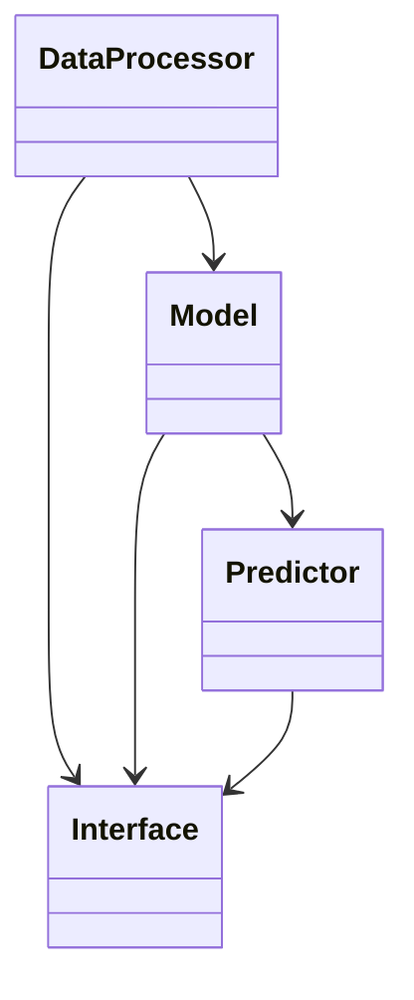

                 

在撰写《数据挖掘在寻找暗能量性质中的作用》这篇文章时，我们可以按照以下步骤进行：

### 1. 背景介绍

首先，我们需要介绍数据挖掘和暗能量的基本概念。数据挖掘是指从大量数据中通过算法和统计学方法提取有价值的信息和知识的过程。暗能量是宇宙学中一个神秘的物理现象，它是推动宇宙加速膨胀的力，但至今其本质尚未完全揭示。

### 2. 核心概念与联系

在介绍完基本概念后，我们需要明确数据挖掘与暗能量之间的联系。数据挖掘可以通过分析天文观测数据来揭示暗能量的性质，如其分布、变化规律等。我们将使用ER实体关系图来展示这一联系。

#### ER实体关系图示例：

```mermaid
erDiagram
    天文观测数据 ||--|{ 暗能量数据 }|< 数据挖掘
    暗能量数据 ||--|{ 暗能量性质 }|< 研究成果
    研究成果 ||--|{ 暗能量模型 }|< 科学理论
```

### 3. 算法原理讲解

接下来，我们将介绍用于寻找暗能量性质的数据挖掘算法。例如，我们可以使用K-means聚类算法来识别暗能量在宇宙中的分布模式。以下是K-means算法的mermaid流程图示例：

```mermaid
flowchart LR
    A[选择初始中心点] --> B[计算距离]
    B -->|最小距离| C{更新中心点}
    C -->|迭代} B
    B -->|结束?} D{是} D
```

同时，我们还将使用Python代码来详细阐述K-means算法的实现：

```python
import numpy as np

def kmeans(data, k, max_iterations):
    # 初始化中心点
    centroids = data[np.random.choice(data.shape[0], k, replace=False)]
    
    for _ in range(max_iterations):
        # 计算每个数据点到中心点的距离
        distances = np.linalg.norm(data - centroids, axis=1)
        
        # 分配数据到最近的中心点
        labels = np.argmin(distances, axis=1)
        
        # 更新中心点
        new_centroids = np.array([data[labels == i].mean(axis=0) for i in range(k)])
        
        # 判断是否收敛
        if np.linalg.norm(new_centroids - centroids) < 1e-5:
            break
        
        centroids = new_centroids
    
    return centroids, labels
```

我们将进一步解释算法的数学模型和关键公式，并使用LaTeX格式进行展示：

```latex
$$
J = \frac{1}{N} \sum_{i=1}^{N} \sum_{j=1}^{K} (x_i - \mu_j)^2
$$

$$
\mu_j = \frac{1}{N_j} \sum_{i=1}^{N} x_i \quad \text{(其中 } N_j \text{ 是第 } j \text{ 类的数据个数)}
$$
```

### 4. 系统分析与架构设计方案

我们接下来将介绍一个可能的数据挖掘系统，包括功能设计、架构设计、接口设计等。以下是系统的功能设计和架构设计：

#### 系统功能设计（mermaid类图）：



#### 系统架构设计（mermaid架构图）：

```mermaid
archy
    DB
    DataProcessor
    Model
    Predictor
    Interface
    DB --> DataProcessor
    DataProcessor --> Model
    Model --> Predictor
    Interface --> DataProcessor
    Interface --> Model
    Interface --> Predictor
```

### 5. 项目实战

在项目实战部分，我们将提供一个实际案例，介绍环境安装、系统核心实现、代码应用解读与分析等。例如，我们可以使用一个开源天文数据集来演示数据挖掘算法的应用。

### 6. 最佳实践 tips、小结、注意事项、拓展阅读

最后，我们将总结书中的要点，提供最佳实践建议，并给出进一步学习和实践的指导。

通过以上步骤，我们将逐步构建一篇逻辑清晰、结构紧凑、简单易懂的专业技术博客文章，帮助读者深入理解数据挖掘在寻找暗能量性质中的作用。让我们一步一步地展开思考，深入探索这个令人兴奋的领域。|>

