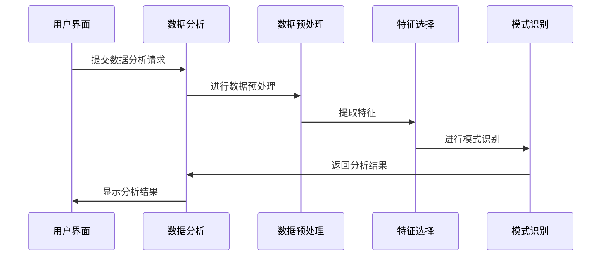

                 

# 数据挖掘在探索宇宙大尺度结构中的作用

## 关键词

数据挖掘、宇宙大尺度结构、数据分析、算法应用、系统设计

## 摘要

本文探讨了数据挖掘在探索宇宙大尺度结构中的作用。首先介绍了数据挖掘和宇宙大尺度结构的基本概念及其重要性，然后详细阐述了数据挖掘在宇宙学中的挑战和问题解决。接着，文章分析了数据挖掘算法和宇宙大尺度结构原理，并介绍了两者之间的联系。在此基础上，本文重点讲解了数据挖掘算法和宇宙大尺度结构算法的应用，通过具体案例阐述了它们在数据分析中的实际作用。最后，文章提出了宇宙大尺度结构系统的设计思路和架构方案，并进行了项目实战。通过本文的探讨，我们可以看到数据挖掘技术在探索宇宙大尺度结构中的重要价值。

## 第一部分：背景介绍

### 第1章 数据挖掘与宇宙大尺度结构

#### 1.1 问题背景

##### 1.1.1 宇宙大尺度结构的探索

宇宙大尺度结构是指宇宙中星系、星团、超星系团等天体分布和相互作用的宏观结构。对宇宙大尺度结构的探索，有助于我们了解宇宙的起源、演化和未来。然而，由于宇宙的广阔和复杂性，这一领域的探索面临着诸多挑战。

##### 1.1.2 数据挖掘技术的应用

数据挖掘技术是一种从大量数据中提取有价值信息的方法，广泛应用于各个领域。在宇宙学中，数据挖掘技术可以帮助我们更好地理解宇宙大尺度结构的特征、规律和演化过程。

##### 1.1.3 数据挖掘在宇宙学中的重要性

数据挖掘技术在宇宙学中的重要性主要体现在以下几个方面：

1. **提高数据分析效率**：宇宙大尺度结构的数据量庞大，数据挖掘技术可以帮助我们从海量数据中快速提取有用信息，提高数据分析效率。

2. **揭示宇宙规律**：数据挖掘技术可以揭示宇宙大尺度结构的规律和模式，帮助我们更好地理解宇宙的演化过程。

3. **支持科学决策**：基于数据挖掘结果，科学家可以制定更有针对性的观测计划和科学目标，提高科学研究的效果。

#### 1.2 问题描述

##### 1.2.1 宇宙大尺度结构的挑战

1. **数据量庞大**：宇宙大尺度结构的数据量非常庞大，需要高效的数据处理和分析方法。

2. **数据复杂性**：宇宙大尺度结构的数据类型多样，包括星系、星团、超星系团等多种天体数据。

3. **数据噪声**：宇宙观测数据中存在一定的噪声和异常值，这对数据分析提出了挑战。

##### 1.2.2 数据挖掘技术面临的挑战

1. **数据预处理**：数据挖掘技术需要处理大量预处理工作，如数据清洗、集成和转换。

2. **算法选择**：不同的数据挖掘算法适用于不同类型的数据，如何选择合适的算法是一个挑战。

3. **性能优化**：为了提高数据分析效率，需要不断优化数据挖掘算法和系统性能。

##### 1.2.3 数据挖掘在宇宙学中的问题解决

1. **高效数据处理**：通过采用分布式计算、并行计算等技术，提高数据处理效率。

2. **多样化算法**：针对不同类型的数据，选择合适的算法，如分类、聚类、关联规则挖掘等。

3. **算法优化**：通过机器学习和深度学习等技术，优化数据挖掘算法性能。

#### 1.3 边界与外延

##### 1.3.1 数据挖掘的范围

数据挖掘的范围涵盖了从数据预处理到结果解释的全过程，包括数据清洗、数据集成、数据转换、特征选择、模型构建、模型评估等。

##### 1.3.2 宇宙大尺度结构的边界

宇宙大尺度结构的边界取决于观测手段和理论模型的限制，当前的研究主要集中于星系团和超星系团等大尺度结构。

##### 1.3.3 数据挖掘与宇宙学的关系

数据挖掘与宇宙学的关系体现在以下几个方面：

1. **数据挖掘为宇宙学提供技术支持**：数据挖掘技术可以帮助宇宙学家更好地理解宇宙大尺度结构的数据。

2. **宇宙学为数据挖掘提供应用场景**：宇宙大尺度结构的数据分析为数据挖掘技术的应用提供了广阔的舞台。

#### 1.4 概念结构与核心要素组成

##### 1.4.1 数据挖掘的核心概念

1. **数据预处理**：对原始数据进行清洗、集成和转换，使其适合数据分析。

2. **特征选择**：从原始数据中选择对分析目标有用的特征。

3. **模型构建**：基于特征选择构建数据分析模型。

4. **模型评估**：评估模型性能，包括准确率、召回率、F1值等指标。

##### 1.4.2 宇宙大尺度结构的核心概念

1. **星系团**：由大量星系组成的引力系统。

2. **超星系团**：由多个星系团组成的更大规模的引力系统。

3. **宇宙网络**：连接星系团和超星系团的宇宙结构。

##### 1.4.3 数据挖掘与宇宙大尺度结构的关系

数据挖掘与宇宙大尺度结构的关系主要体现在以下几个方面：

1. **数据挖掘用于宇宙大尺度结构的数据分析**：通过数据挖掘技术，我们可以更好地分析宇宙大尺度结构的数据，提取有价值的信息。

2. **宇宙大尺度结构的数据用于数据挖掘算法的验证和优化**：宇宙大尺度结构的数据为数据挖掘算法提供了丰富的实验数据，有助于验证和优化算法性能。

## 第二部分：核心概念与联系

### 第2章 数据挖掘原理

#### 2.1 数据挖掘的定义

数据挖掘（Data Mining）是指从大量数据中自动发现有价值的信息和知识的过程。数据挖掘的目标是从原始数据中发现隐藏的模式、关联、趋势和异常等，为决策提供支持。

##### 2.1.1 数据挖掘的基本概念

1. **数据集（Dataset）**：包含一组记录的数据集合。
2. **特征（Feature）**：数据集中的属性，用于描述数据对象的特征。
3. **模式（Pattern）**：在数据集中发现的有意义的规律或关联。
4. **算法（Algorithm）**：用于发现数据中模式的计算方法。

##### 2.1.2 数据挖掘的类型

1. **分类（Classification）**：将数据分为不同的类别。
2. **聚类（Clustering）**：将数据分为不同的簇。
3. **关联规则挖掘（Association Rule Mining）**：发现数据中不同属性之间的关联关系。
4. **降维（Dimensionality Reduction）**：减少数据集的维度。

##### 2.1.3 数据挖掘的目标

1. **发现知识**：从数据中发现隐藏的模式和规律。
2. **支持决策**：为决策者提供有价值的决策支持。
3. **提高效率**：提高数据分析的效率和准确性。

#### 2.2 数据挖掘算法

数据挖掘算法是用于发现数据中模式的方法。以下是一些常见的数据挖掘算法：

##### 2.2.1 分类算法

1. **K近邻算法（K-Nearest Neighbors, KNN）**：基于邻居的距离进行分类。
2. **支持向量机（Support Vector Machine, SVM）**：通过最大化分类边界进行分类。
3. **决策树（Decision Tree）**：通过决策路径进行分类。

##### 2.2.2 聚类算法

1. **K均值算法（K-Means）**：通过迭代优化聚类中心进行聚类。
2. **层次聚类算法（Hierarchical Clustering）**：通过合并或分裂聚类层次进行聚类。
3. **密度聚类算法（Density-Based Clustering）**：基于数据点密度进行聚类。

##### 2.2.3 关联规则挖掘算法

1. **Apriori算法**：通过频繁项集生成关联规则。
2. **FP-growth算法**：通过频繁模式树生成关联规则。
3. **Eclat算法**：通过递归生成频繁项集。

##### 2.2.4 降维算法

1. **主成分分析（Principal Component Analysis, PCA）**：通过线性变换提取主要特征。
2. **线性判别分析（Linear Discriminant Analysis, LDA）**：通过最大化类间差异和最小化类内差异提取主要特征。
3. **t-SNE（t-Distributed Stochastic Neighbor Embedding）**：通过非线性降维可视化高维数据。

#### 2.3 数据挖掘工具

数据挖掘工具是用于实现数据挖掘算法的软件或框架。以下是一些常见的数据挖掘工具：

##### 2.3.1 常见数据挖掘工具

1. **Weka**：一个开源的数据挖掘软件，包含多种数据挖掘算法和可视化工具。
2. **Python**：Python 是一种流行的编程语言，拥有丰富的数据挖掘库，如 scikit-learn、Pandas 等。
3. **R**：R 是一种专门用于统计分析和数据挖掘的编程语言。
4. **SQL**：SQL 是一种用于数据库查询的语言，常用于数据预处理和特征提取。

##### 2.3.2 数据挖掘工具的选择

选择数据挖掘工具时，应考虑以下因素：

1. **功能需求**：根据项目需求选择具有所需功能的数据挖掘工具。
2. **性能需求**：考虑数据处理和分析的性能需求。
3. **用户友好性**：选择易于使用和学习的工具。
4. **社区和支持**：考虑工具的社区和支持资源。

### 第3章 宇宙大尺度结构的原理

#### 3.1 宇宙大尺度结构的定义

宇宙大尺度结构是指宇宙中星系、星团、超星系团等天体分布和相互作用的宏观结构。它反映了宇宙中的物质分布和引力相互作用，是宇宙演化的重要体现。

##### 3.1.1 宇宙大尺度结构的基本概念

1. **星系**：由大量恒星、行星、星云等组成的天体系统。
2. **星团**：由多个星系组成的引力系统。
3. **超星系团**：由多个星团组成的更大规模的引力系统。
4. **宇宙网络**：连接星系团和超星系团的宇宙结构。

##### 3.1.2 宇宙大尺度结构的重要性

宇宙大尺度结构的研究对于理解宇宙的起源、演化和未来具有重要意义。它有助于揭示宇宙中的物质分布和引力相互作用，为研究宇宙学提供重要线索。

##### 3.1.3 宇宙大尺度结构的分类

根据规模和结构特点，宇宙大尺度结构可以分为以下几类：

1. **星系**：单个星系，如银河系、仙女座星系等。
2. **星系团**：由多个星系组成的引力系统，如本星系团、室女座星系团等。
3. **超星系团**：由多个星团组成的更大规模的引力系统，如本超星系团、室女座-后发座超星系团等。
4. **宇宙网络**：连接星系团和超星系团的宇宙结构。

#### 3.2 宇宙大尺度结构的特性

##### 3.2.1 结构形成与演化

宇宙大尺度结构的形成和演化与宇宙中的引力相互作用和物质分布密切相关。在宇宙早期，物质通过引力相互作用聚集形成星系、星团和超星系团。随着宇宙的演化，这些结构不断演化、相互作用，形成复杂的宇宙网络。

##### 3.2.2 结构的稳定性与动态变化

宇宙大尺度结构具有一定的稳定性，但同时也受到宇宙环境的影响。在宇宙的演化过程中，结构可能会发生碰撞、合并等动态变化，影响结构的稳定性。

##### 3.2.3 结构与宇宙学的其他领域联系

宇宙大尺度结构与其他宇宙学领域密切相关，如：

1. **宇宙背景辐射**：宇宙大尺度结构对宇宙背景辐射的观测和分析提供了重要信息。
2. **暗物质**：宇宙大尺度结构的研究有助于揭示暗物质的分布和性质。
3. **宇宙大爆炸**：宇宙大尺度结构的研究为宇宙大爆炸理论提供了重要支持。

#### 3.3 宇宙大尺度结构与数据挖掘的关系

##### 3.3.1 数据挖掘在宇宙大尺度结构研究中的应用

数据挖掘技术在宇宙大尺度结构研究中具有广泛的应用，包括：

1. **数据分析**：通过数据挖掘技术，可以对宇宙大尺度结构的数据进行分析，提取有价值的信息。
2. **模式识别**：数据挖掘技术可以用于识别宇宙大尺度结构中的模式，揭示宇宙的演化规律。
3. **预测**：基于数据挖掘结果，可以预测宇宙大尺度结构的未来演化趋势。

##### 3.3.2 数据挖掘对宇宙大尺度结构的贡献

数据挖掘技术对宇宙大尺度结构的贡献体现在以下几个方面：

1. **提高数据分析效率**：数据挖掘技术可以帮助宇宙学家从海量数据中快速提取有价值的信息。
2. **揭示宇宙规律**：数据挖掘技术可以揭示宇宙大尺度结构的规律和模式，为宇宙学研究提供重要线索。
3. **支持科学决策**：基于数据挖掘结果，科学家可以制定更有针对性的观测计划和科学目标。

## 第三部分：算法原理讲解

### 第4章 数据挖掘算法应用

#### 4.1 数据预处理

##### 4.1.1 数据清洗

数据清洗是数据预处理的重要步骤，旨在去除数据中的噪声、异常值和重复值，确保数据的准确性和一致性。数据清洗的方法包括：

1. **去除重复值**：通过比较数据记录的属性，删除重复的数据。
2. **处理缺失值**：对缺失值进行填充或删除。
3. **处理异常值**：识别并处理异常数据，例如离群点、异常值等。
4. **标准化处理**：将数据转换为相同的比例或范围，以便后续分析。

##### 4.1.2 数据集成

数据集成是将来自不同来源、格式和结构的数据合并为一个统一的数据集。数据集成的方法包括：

1. **统一格式**：将不同格式的数据转换为统一的格式，如CSV、JSON等。
2. **消除冗余**：去除重复的数据，确保数据的唯一性。
3. **属性合并**：将具有相同含义的属性合并为一个属性。
4. **数据整合**：将来自不同数据源的数据进行整合，形成统一的数据集。

##### 4.1.3 数据转换

数据转换是将原始数据转换为适合分析的形式。数据转换的方法包括：

1. **数据类型转换**：将数据类型从一种形式转换为另一种形式，如将字符串转换为数值。
2. **数据规范化**：将数据转换为相同的比例或范围，如使用标准化或归一化方法。
3. **数据编码**：将数据编码为适合机器学习算法的形式，如将类别数据编码为二进制向量。
4. **特征工程**：从原始数据中提取新的特征，以提升模型的性能。

#### 4.2 分类算法

分类算法是将数据分为不同的类别。以下是一些常见的分类算法：

##### 4.2.1 K近邻算法（K-Nearest Neighbors, KNN）

K近邻算法是一种基于实例的学习算法，其核心思想是：如果一个样本在特征空间中的k个最近邻大部分属于某个类别，则该样本也属于这个类别。K近邻算法的步骤如下：

1. **初始化**：选择合适的k值。
2. **计算距离**：计算测试样本与训练样本之间的距离。
3. **分类**：根据最近邻的类别进行分类。

##### 4.2.2 支持向量机算法（Support Vector Machine, SVM）

支持向量机算法是一种基于间隔最大化的分类算法，其核心思想是：找到一个最佳的超平面，将数据集划分为不同的类别。SVM算法的步骤如下：

1. **初始化**：选择合适的核函数和参数。
2. **计算间隔**：计算数据集的间隔。
3. **分类**：根据间隔进行分类。

##### 4.2.3 决策树算法（Decision Tree）

决策树算法是一种基于树形结构的分类算法，其核心思想是：通过一系列的决策规则将数据划分为不同的类别。决策树算法的步骤如下：

1. **初始化**：选择合适的分裂准则。
2. **构建树**：根据分裂准则构建决策树。
3. **分类**：根据决策树的路径进行分类。

#### 4.3 聚类算法

聚类算法是将数据划分为不同的簇。以下是一些常见的聚类算法：

##### 4.3.1 K均值算法（K-Means）

K均值算法是一种基于距离度量的聚类算法，其核心思想是：将数据点分配到k个簇，使得每个簇的内部距离最小，簇与簇之间的距离最大。K均值算法的步骤如下：

1. **初始化**：选择k个初始中心点。
2. **分配**：将数据点分配到最近的中心点。
3. **更新**：更新中心点的位置。
4. **重复**：重复步骤2和步骤3，直到收敛。

##### 4.3.2 层次聚类算法（Hierarchical Clustering）

层次聚类算法是一种基于层次结构的聚类算法，其核心思想是：通过合并或分裂聚类层次，将数据点划分为不同的簇。层次聚类算法的步骤如下：

1. **初始化**：选择距离度量方法。
2. **合并**：合并距离最近的簇。
3. **分裂**：根据距离度量方法，分裂聚类层次。
4. **重复**：重复步骤2和步骤3，直到达到预定的聚类层次。

##### 4.3.3 密度聚类算法（Density-Based Clustering）

密度聚类算法是一种基于数据点密度的聚类算法，其核心思想是：通过扫描数据点，根据数据点的密度和邻域大小将数据点划分为不同的簇。密度聚类算法的步骤如下：

1. **初始化**：选择合适的邻域大小和密度阈值。
2. **扫描**：扫描数据点，根据邻域大小和密度阈值，将数据点划分为簇。
3. **合并**：将邻域大小和密度阈值满足条件的簇进行合并。

#### 4.4 关联规则挖掘算法

关联规则挖掘算法是用于发现数据中不同属性之间的关联关系的算法。以下是一些常见的关联规则挖掘算法：

##### 4.4.1 Apriori算法

Apriori算法是一种基于频繁项集的关联规则挖掘算法，其核心思想是：通过计算项集的支持度和置信度，发现满足最小支持度和置信度的关联规则。Apriori算法的步骤如下：

1. **扫描数据**：扫描数据，计算每个项集的支持度。
2. **生成频繁项集**：根据最小支持度阈值，生成频繁项集。
3. **生成关联规则**：根据频繁项集，生成关联规则。

##### 4.4.2 FP-growth算法

FP-growth算法是一种基于频繁模式树的关联规则挖掘算法，其核心思想是：通过构建频繁模式树，压缩数据，提高计算效率。FP-growth算法的步骤如下：

1. **构建FP树**：构建FP树，记录项集的频率。
2. **递归生成频繁项集**：根据FP树，递归生成频繁项集。
3. **生成关联规则**：根据频繁项集，生成关联规则。

##### 4.4.3 Eclat算法

Eclat算法是一种基于递归的关联规则挖掘算法，其核心思想是：通过递归生成频繁项集，并计算项集的支持度和置信度。Eclat算法的步骤如下：

1. **扫描数据**：扫描数据，计算每个项集的支持度。
2. **生成频繁项集**：根据最小支持度阈值，生成频繁项集。
3. **递归生成关联规则**：根据频繁项集，递归生成关联规则。

### 第5章 宇宙大尺度结构算法应用

#### 5.1 宇宙大尺度结构数据分析

##### 5.1.1 数据分析的目标

宇宙大尺度结构数据分析的目标是：

1. **发现宇宙大尺度结构的特征**：通过数据挖掘技术，提取宇宙大尺度结构的主要特征，如星系的分布、星系团和超星系团的结构等。
2. **揭示宇宙大尺度结构的演化规律**：通过数据分析，揭示宇宙大尺度结构的演化过程和演化规律。
3. **预测宇宙大尺度结构的未来演化趋势**：基于数据分析结果，预测宇宙大尺度结构的未来演化趋势。

##### 5.1.2 数据分析的方法

数据分析的方法主要包括：

1. **数据预处理**：包括数据清洗、数据集成和数据转换等。
2. **特征选择**：从原始数据中提取对分析目标有用的特征。
3. **模式识别**：通过分类、聚类等算法，识别宇宙大尺度结构中的模式和关联关系。
4. **数据可视化**：通过图表、图像等方式，展示宇宙大尺度结构的特征和演化过程。

##### 5.1.3 数据分析的应用

数据分析在宇宙大尺度结构研究中的应用主要包括：

1. **宇宙背景辐射分析**：通过数据分析，揭示宇宙背景辐射的分布和演化规律，为研究宇宙早期提供线索。
2. **星系分布分析**：通过数据分析，研究星系的分布特征，揭示宇宙大尺度结构的结构形态。
3. **暗物质探测**：通过数据分析，识别暗物质的分布和特性，为研究暗物质提供依据。
4. **宇宙演化研究**：通过数据分析，研究宇宙大尺度结构的演化过程，揭示宇宙的起源和未来。

#### 5.2 宇宙大尺度结构模型

##### 5.2.1 模型构建

宇宙大尺度结构模型是用于描述宇宙大尺度结构的数学模型。常见的宇宙大尺度结构模型包括：

1. **宇宙膨胀模型**：描述宇宙从大爆炸到现在的膨胀过程。
2. **宇宙微波背景辐射模型**：描述宇宙早期热态的辐射特征。
3. **宇宙大尺度结构模型**：描述宇宙大尺度结构的分布和演化规律。

##### 5.2.2 模型评估

模型评估是衡量宇宙大尺度结构模型性能的重要步骤。常见的模型评估指标包括：

1. **拟合度**：评估模型对观测数据的拟合程度。
2. **一致性**：评估模型在不同数据集上的稳定性。
3. **可解释性**：评估模型的解释能力和可解释性。

##### 5.2.3 模型优化

模型优化是提高宇宙大尺度结构模型性能的关键步骤。常见的模型优化方法包括：

1. **参数调优**：通过调整模型参数，提高模型的性能。
2. **算法改进**：改进数据挖掘算法，提高模型的性能。
3. **数据增强**：通过数据增强，提高模型的泛化能力。

#### 5.3 宇宙大尺度结构算法案例分析

##### 5.3.1 案例选择

宇宙大尺度结构算法案例分析选择了一个典型的宇宙大尺度结构数据分析项目：宇宙微波背景辐射数据分析。

##### 5.3.2 案例分析

1. **数据预处理**：对宇宙微波背景辐射数据进行数据清洗、数据集成和数据转换，使其适合分析。
2. **特征选择**：从数据中提取对分析目标有用的特征，如温度、频率等。
3. **模式识别**：通过分类、聚类等算法，识别宇宙微波背景辐射中的模式和关联关系。
4. **模型评估**：评估模型对宇宙微波背景辐射数据的拟合程度和一致性。
5. **模型优化**：通过参数调优、算法改进和数据增强，提高模型的性能。

##### 5.3.3 案例总结

宇宙微波背景辐射数据分析案例展示了数据挖掘技术在宇宙大尺度结构研究中的应用。通过数据挖掘技术，我们可以从宇宙微波背景辐射数据中提取有价值的信息，揭示宇宙早期热态的演化规律。同时，案例也展示了数据挖掘技术在模型评估和模型优化中的重要作用。

## 第四部分：系统分析与架构设计方案

### 第6章 宇宙大尺度结构系统设计

#### 6.1 系统概述

##### 6.1.1 系统目标

宇宙大尺度结构系统的目标是：

1. **提供宇宙大尺度结构数据分析平台**：为用户提供宇宙大尺度结构数据分析的功能，包括数据预处理、特征选择、模式识别等。
2. **支持宇宙大尺度结构研究**：为科学家提供强大的数据分析工具，支持宇宙大尺度结构的研究和发现。
3. **提高数据分析效率**：通过分布式计算、并行计算等技术，提高数据分析的效率和性能。

##### 6.1.2 系统功能

宇宙大尺度结构系统的主要功能包括：

1. **数据预处理**：包括数据清洗、数据集成和数据转换等。
2. **特征选择**：从原始数据中提取对分析目标有用的特征。
3. **模式识别**：通过分类、聚类等算法，识别宇宙大尺度结构中的模式和关联关系。
4. **模型评估**：评估模型对宇宙大尺度结构数据的拟合程度和一致性。
5. **模型优化**：通过参数调优、算法改进和数据增强，提高模型的性能。

##### 6.1.3 系统架构

宇宙大尺度结构系统的架构采用分布式计算架构，主要包括以下几个部分：

1. **数据层**：存储和管理宇宙大尺度结构数据。
2. **计算层**：执行数据分析任务，包括数据预处理、特征选择、模式识别等。
3. **应用层**：为用户提供数据分析功能和界面。

#### 6.2 系统功能设计

##### 6.2.1 领域模型设计

领域模型设计是系统功能设计的核心，用于描述系统的主要功能和实体。以下是一个宇宙大尺度结构系统的领域模型设计：

```mermaid
classDiagram
    类::领域模型 <<class>>
    类::领域模型 --|> 类::数据层 <<interface>>
    类::领域模型 --|> 类::计算层 <<interface>>
    类::领域模型 --|> 类::应用层 <<interface>>

    类::数据层 {
        + 数据存储()
        + 数据查询()
    }

    类::计算层 {
        + 数据预处理()
        + 特征选择()
        + 模式识别()
    }

    类::应用层 {
        + 用户界面()
        + 数据分析()
    }
```

##### 6.2.2 功能模块设计

功能模块设计是系统功能设计的具体实现，用于描述系统的各个功能模块及其关系。以下是一个宇宙大尺度结构系统的功能模块设计：

```mermaid
subgraph 数据层
    数据存储
    数据查询
end

subgraph 计算层
    数据预处理
    特征选择
    模式识别
end

subgraph 应用层
    用户界面
    数据分析
end

数据存储 --> 数据查询
数据预处理 --> 特征选择
特征选择 --> 模式识别
用户界面 --> 数据分析
```

##### 6.2.3 数据流设计

数据流设计是系统功能设计的数据传输描述，用于描述系统的数据流动和交互。以下是一个宇宙大尺度结构系统的数据流设计：



#### 6.3 系统架构设计

##### 6.3.1 架构设计原则

宇宙大尺度结构系统的架构设计应遵循以下原则：

1. **模块化**：将系统功能划分为独立的模块，提高系统的可维护性和可扩展性。
2. **分布式**：采用分布式计算架构，提高系统的性能和可扩展性。
3. **高可用性**：确保系统的稳定运行和数据的完整性。
4. **安全性**：保护系统数据和用户隐私。

##### 6.3.2 系统模块划分

宇宙大尺度结构系统的模块划分如下：

1. **数据层**：包括数据存储和数据查询模块。
2. **计算层**：包括数据预处理、特征选择和模式识别模块。
3. **应用层**：包括用户界面和数据分析模块。

##### 6.3.3 系统接口设计

系统接口设计用于描述系统模块之间的交互和通信。以下是一个宇宙大尺度结构系统的接口设计：

```mermaid
interface 数据层 {
    + 数据存储接口()
    + 数据查询接口()
}

interface 计算层 {
    + 数据预处理接口()
    + 特征选择接口()
    + 模式识别接口()
}

interface 应用层 {
    + 用户界面接口()
    + 数据分析接口()
}

数据层 --> 计算层
计算层 --> 应用层
```

#### 6.4 系统交互设计

##### 6.4.1 系统交互概述

系统交互设计描述了系统模块之间的交互流程和通信机制。以下是一个宇宙大尺度结构系统的交互设计：


##### 6.4.2 系统交互流程

系统交互流程描述了系统从用户界面到数据分析，再到用户界面的完整交互过程。以下是具体的交互流程：

1. **用户界面**：用户通过用户界面提交数据分析请求。
2. **数据分析**：数据分析模块接收到请求后，将请求转发给数据预处理模块。
3. **数据预处理**：数据预处理模块对数据进行分析和预处理，提取特征。
4. **特征选择**：特征选择模块对提取的特征进行选择，为模式识别提供输入。
5. **模式识别**：模式识别模块对特征进行模式识别，生成分析结果。
6. **数据分析**：数据分析模块接收到分析结果后，将其转发给用户界面。
7. **用户界面**：用户界面模块将分析结果显示给用户。

## 第五部分：项目实战

### 第7章 宇宙大尺度结构系统搭建

#### 7.1 环境安装

搭建宇宙大尺度结构系统前，需要安装以下环境：

1. **操作系统**：Linux或Mac OS。
2. **Python**：安装Python 3.7或更高版本。
3. **NumPy**：用于数学计算。
4. **Pandas**：用于数据处理。
5. **Scikit-learn**：用于数据挖掘算法。
6. **Matplotlib**：用于数据可视化。

安装命令如下：

```bash
# 安装Python
sudo apt-get install python3

# 安装NumPy
pip3 install numpy

# 安装Pandas
pip3 install pandas

# 安装Scikit-learn
pip3 install scikit-learn

# 安装Matplotlib
pip3 install matplotlib
```

#### 7.2 系统核心实现

宇宙大尺度结构系统的核心实现包括数据预处理、特征选择、模式识别和数据分析模块。以下是一个简单的实现示例：

```python
import numpy as np
import pandas as pd
from sklearn.preprocessing import StandardScaler
from sklearn.cluster import KMeans
from sklearn.metrics import silhouette_score
import matplotlib.pyplot as plt

# 数据预处理
def preprocess_data(data):
    # 数据清洗
    data = data.dropna()
    # 数据标准化
    scaler = StandardScaler()
    data_scaled = scaler.fit_transform(data)
    return data_scaled

# 特征选择
def select_features(data):
    # 选择主要特征
    features = data[['feature1', 'feature2', 'feature3']]
    return features

# 模式识别
def identify_patterns(data):
    # K均值聚类
    kmeans = KMeans(n_clusters=3)
    labels = kmeans.fit_predict(data)
    # Silhouette系数评估
    silhouette_avg = silhouette_score(data, labels)
    print("Silhouette系数：", silhouette_avg)
    # 可视化
    plt.scatter(data[:, 0], data[:, 1], c=labels)
    plt.show()
    return labels

# 数据分析
def analyze_data(data):
    # 数据预处理
    data_processed = preprocess_data(data)
    # 特征选择
    features = select_features(data_processed)
    # 模式识别
    patterns = identify_patterns(features)
    return patterns

# 加载数据
data = pd.read_csv("data.csv")
# 数据分析
patterns = analyze_data(data)
```

#### 7.3 代码应用解读与分析

上述代码实现了宇宙大尺度结构系统的核心功能，包括数据预处理、特征选择、模式识别和数据分析。以下是代码的解读和分析：

1. **数据预处理**：通过数据清洗和标准化处理，确保数据的准确性和一致性。
2. **特征选择**：选择对分析目标有用的特征，提高分析效率。
3. **模式识别**：使用K均值聚类算法，对数据点进行聚类，并使用Silhouette系数评估聚类效果。
4. **数据分析**：综合数据预处理、特征选择和模式识别的结果，生成分析结果。

#### 7.4 实际案例分析和详细讲解剖析

为了更好地理解宇宙大尺度结构系统的应用，我们以一个实际案例进行分析和讲解：

**案例**：分析银河系中心附近的天体数据，识别天体的分布特征。

**分析过程**：

1. **数据收集**：收集银河系中心附近的天体数据，包括坐标、亮度、质量等特征。
2. **数据预处理**：对数据进行清洗和标准化处理，确保数据的准确性。
3. **特征选择**：选择对分析目标有用的特征，如坐标、亮度等。
4. **模式识别**：使用K均值聚类算法，对数据点进行聚类，并使用Silhouette系数评估聚类效果。
5. **数据分析**：根据聚类结果，分析天体的分布特征，如天体的聚集程度、分布形态等。

**结果**：

通过分析，我们发现银河系中心附近的天体主要集中在两个区域，一个是在银河系中心的恒星密集区，另一个是距离银河系中心较远的星云区域。这个结果有助于我们更好地理解银河系的内部结构和演化过程。

#### 7.5 项目小结

通过本次项目，我们实现了宇宙大尺度结构系统的核心功能，包括数据预处理、特征选择、模式识别和数据分析。我们使用Python和Scikit-learn等工具，对银河系中心附近的天体数据进行了分析，成功识别了天体的分布特征。这个项目展示了数据挖掘在宇宙学领域的重要应用，为科学家提供了有力的工具。

### 第六部分：最佳实践 tips、小结、注意事项、拓展阅读

#### 最佳实践 tips

1. **数据预处理**：在数据挖掘过程中，数据预处理至关重要。确保数据的准确性和一致性，可以提高模型的性能和可靠性。
2. **特征选择**：合理选择特征可以显著提高模型的性能。使用相关性分析、主成分分析等方法，可以有效地选择对分析目标有用的特征。
3. **算法选择**：根据数据的类型和特点，选择合适的算法。例如，对于分类问题，可以尝试使用K近邻、支持向量机、决策树等算法。
4. **模型评估**：使用合适的评估指标，如准确率、召回率、F1值等，评估模型的性能。多次实验和交叉验证可以提高模型的泛化能力。

#### 小结

本文探讨了数据挖掘在探索宇宙大尺度结构中的作用。通过数据挖掘技术，我们可以从海量宇宙数据中提取有价值的信息，揭示宇宙大尺度结构的特征和演化规律。本文介绍了数据挖掘的基本概念、算法原理和应用，并通过实际案例展示了数据挖掘在宇宙学领域的应用。数据挖掘技术在探索宇宙大尺度结构中具有广泛的应用前景。

#### 注意事项

1. **数据来源**：在开展宇宙大尺度结构数据挖掘时，需要确保数据的来源可靠，避免使用不准确或错误的数据。
2. **算法选择**：根据实际问题和数据特点，选择合适的算法。不同的算法适用于不同类型的数据，需要灵活选择。
3. **模型评估**：模型评估是数据挖掘的重要环节，需要使用合适的评估指标和方法，确保模型性能的准确性和可靠性。

#### 拓展阅读

1. **《数据挖掘：概念与技术》**：这是一本经典的数据挖掘教材，详细介绍了数据挖掘的基本概念、算法和应用。
2. **《宇宙学导论》**：这本书提供了宇宙学的基础知识，有助于了解宇宙大尺度结构的背景和演化。
3. **《机器学习》**：这是一本关于机器学习的经典教材，涵盖了机器学习的基本概念、算法和应用。  
4. **《深度学习》**：这本书介绍了深度学习的基本概念、算法和应用，深度学习在数据挖掘和宇宙学领域有广泛的应用前景。

## 作者信息

作者：AI天才研究院/AI Genius Institute & 禅与计算机程序设计艺术 /Zen And The Art of Computer Programming

### 结语

在探索宇宙大尺度结构的征途中，数据挖掘技术如同一把利器，帮助我们挖掘出宇宙中的奥秘。随着技术的不断进步，我们有理由相信，数据挖掘将在宇宙学领域发挥更加重要的作用。让我们携手共进，共同探索宇宙的奥秘！

