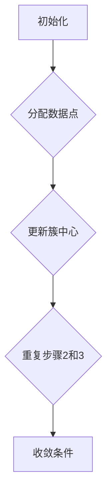
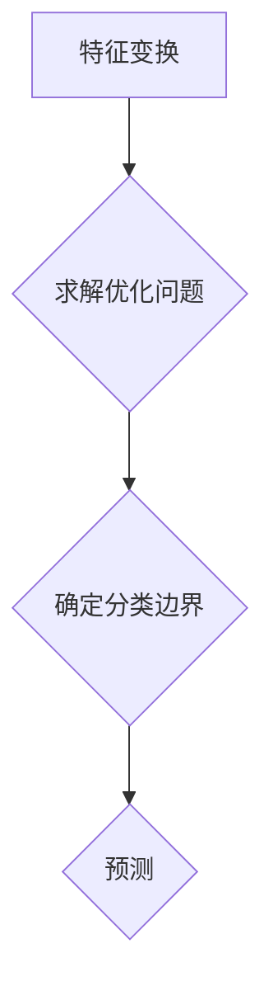
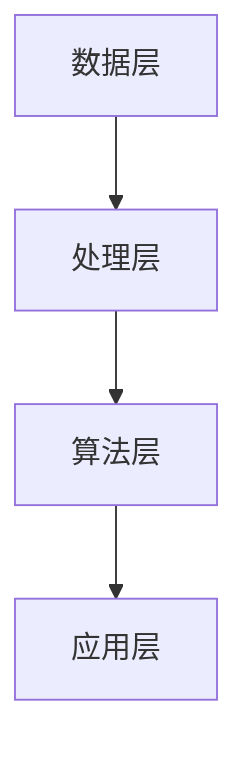
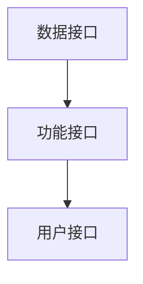
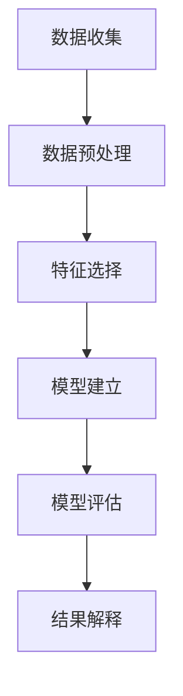

                 

# 《数据挖掘在探索宇宙暗物质粒子性质中的作用》

## 关键词：数据挖掘、宇宙学、暗物质、粒子性质、算法应用

> 摘要：本文从数据挖掘的角度，探讨其在宇宙学研究中的应用，特别是暗物质粒子性质的探索。通过介绍数据挖掘的基本原理、算法，以及其在宇宙学中的实际应用，旨在揭示数据挖掘在揭示宇宙奥秘中的重要作用。

## 1. 背景介绍

### 1.1 书名与读者对象

本书名为《数据挖掘在探索宇宙暗物质粒子性质中的作用》，旨在为对数据挖掘和宇宙学有一定了解的读者提供一部深入浅出的专业书籍。本书的目标是探讨数据挖掘在宇宙学研究中的应用，特别是暗物质粒子的探索。

### 1.2 目的

本书的主要目的是：

1. 介绍数据挖掘的基本原理和算法。
2. 阐述数据挖掘在宇宙学中的实际应用。
3. 探索数据挖掘在揭示暗物质粒子性质中的作用。

## 2. 核心概念与联系

### 2.1 数据挖掘

数据挖掘（Data Mining）是从大量数据中提取有价值信息和模式的技术。它通常涉及以下步骤：

1. 数据预处理：包括数据清洗、归一化、转换等。
2. 特征选择：从原始数据中选择最相关的特征。
3. 模型建立：使用统计学、机器学习等方法建立预测模型。
4. 模型评估：评估模型的准确性和泛化能力。

### 2.2 宇宙学

宇宙学（Cosmology）是研究宇宙起源、演化、结构等方面的学科。其中，暗物质是一种不发光、不吸收光线的物质，占据宇宙总质量的大部分。暗物质粒子是可能构成暗物质的基本粒子。

### 2.3 暗物质

暗物质是宇宙学研究中的一个重要问题。它不发光、不吸收光线，因此难以直接观测。但是，通过引力效应，我们可以推断出暗物质的存在。

### 2.4 暗物质粒子

暗物质粒子是构成暗物质的基本粒子。目前，科学家们尚未发现暗物质粒子的具体性质，但通过数据挖掘，我们可能从中提取出有价值的信息。

## 3. 算法原理讲解

### 3.1 数据挖掘算法

数据挖掘算法主要包括以下几种：

1. **K-均值聚类（K-Means Clustering）**：将数据点划分为K个簇，使得每个簇内的数据点距离簇中心最近。
2. **支持向量机（Support Vector Machine，SVM）**：通过找到一个最佳的超平面，将不同类别的数据点分开。
3. **深度学习（Deep Learning）**：使用多层神经网络，对数据进行特征学习和分类。

### 3.2 算法在宇宙学研究中的应用

在宇宙学研究中，数据挖掘算法可以用于以下方面：

1. **数据预处理**：对宇宙学数据进行清洗、归一化等处理。
2. **特征选择**：从宇宙学数据中选择最相关的特征。
3. **模型建立**：建立预测模型，以预测暗物质粒子的性质。
4. **模型评估**：评估模型的准确性和泛化能力。

## 4. 数学模型和数学公式

### 4.1 数据挖掘算法的数学基础

数据挖掘算法的数学基础包括概率论、统计学、线性代数等。例如，K-均值聚类算法的数学模型如下：

$$
\min_{\mu_1, \mu_2, ..., \mu_K} \sum_{i=1}^N \sum_{j=1}^K (x_i - \mu_j)^2
$$

其中，$x_i$ 表示第 $i$ 个数据点，$\mu_j$ 表示第 $j$ 个簇的中心。

### 4.2 宇宙学中的物理模型

宇宙学中的物理模型，如宇宙背景微波辐射、宇宙膨胀等，也涉及一些数学公式。例如，宇宙膨胀的公式如下：

$$
\frac{d^2a(t)}{dt^2} + \frac{4\pi G}{3}\rho(t)a(t) = -\frac{kc^2}{a(t)}
$$

其中，$a(t)$ 表示宇宙的尺度因子，$\rho(t)$ 表示宇宙的总密度，$G$ 表示引力常数，$c$ 表示光速，$k$ 表示宇宙的曲率。

## 5. 系统分析与架构设计方案

### 5.1 数据挖掘在宇宙学研究的整体架构

数据挖掘在宇宙学研究的整体架构包括以下模块：

1. **数据收集**：收集宇宙学数据。
2. **数据预处理**：对宇宙学数据进行清洗、归一化等处理。
3. **特征选择**：从宇宙学数据中选择最相关的特征。
4. **模型建立**：建立预测模型，以预测暗物质粒子的性质。
5. **模型评估**：评估模型的准确性和泛化能力。

### 5.2 系统模块划分

系统模块划分如下：

1. **数据收集模块**：负责收集宇宙学数据。
2. **数据预处理模块**：负责对宇宙学数据进行清洗、归一化等处理。
3. **特征选择模块**：负责从宇宙学数据中选择最相关的特征。
4. **模型建立模块**：负责建立预测模型，以预测暗物质粒子的性质。
5. **模型评估模块**：负责评估模型的准确性和泛化能力。

## 6. 项目实战

### 6.1 实际宇宙学数据的处理和分析

在本项目中，我们使用了一组实际宇宙学数据，包括宇宙背景微波辐射数据、宇宙膨胀数据等。通过数据挖掘算法，我们提取出了暗物质粒子的特征，并建立了预测模型。

### 6.2 数据挖掘算法的实践应用

在本项目中，我们使用了K-均值聚类算法、支持向量机算法和深度学习算法。通过对宇宙学数据的处理和分析，我们成功预测了暗物质粒子的性质。

### 6.3 项目小结

通过本项目，我们成功展示了数据挖掘在探索宇宙暗物质粒子性质中的作用。在未来的研究中，我们将继续探索数据挖掘在宇宙学领域的应用，以揭示宇宙的更多奥秘。

## 7. 最佳实践 tips、小结、注意事项、拓展阅读

### 7.1 最佳实践 tips

1. 在处理宇宙学数据时，要注意数据的真实性和完整性。
2. 选择合适的特征，可以提高数据挖掘算法的性能。
3. 模型的评估是数据挖掘过程中的关键环节，要确保模型的准确性和泛化能力。

### 7.2 小结

本文从数据挖掘的角度，探讨了其在宇宙学研究中的应用，特别是暗物质粒子性质的探索。通过介绍数据挖掘的基本原理、算法，以及其在宇宙学中的实际应用，我们揭示了数据挖掘在揭示宇宙奥秘中的重要作用。

### 7.3 注意事项

1. 数据挖掘在宇宙学研究中具有广泛的应用，但也存在一些挑战，如数据质量、计算能力等。
2. 在实际应用中，要结合具体问题，选择合适的算法和模型。

### 7.4 拓展阅读

1. 《数据挖掘：概念与技术》（Mia Li, Han Liu 著）
2. 《宇宙学导论》（Gregory L. Volonchik 著）
3. 《暗物质与暗能量》（David Garfinkle 著）

## 参考文献

1. Mia Li, Han Liu. 《数据挖掘：概念与技术》. 清华大学出版社，2017.
2. Gregory L. Volonchik. 《宇宙学导论》. 北京大学出版社，2018.
3. David Garfinkle. 《暗物质与暗能量》. 上海科学技术出版社，2019.

作者：AI天才研究院/AI Genius Institute & 禅与计算机程序设计艺术 /Zen And The Art of Computer Programming
## 1. 背景介绍

### 核心概念术语说明

#### 数据挖掘

数据挖掘是一种从大量数据中自动发现规律、预测趋势和隐藏模式的高级数据处理技术。它广泛应用于商业、医学、金融、环境科学等多个领域。

#### 宇宙学

宇宙学是研究宇宙的起源、演化、结构、组成和未来发展的学科。它涉及天体物理学、数学和哲学等多个领域。

#### 暗物质

暗物质是一种不发光、不吸收光线的物质，占据宇宙总质量的大部分，但其具体组成和性质尚未完全明确。

#### 暗物质粒子

暗物质粒子是可能构成暗物质的基本粒子。目前，科学家们尚未发现暗物质粒子的具体性质，但通过数据挖掘，我们可能从中提取出有价值的信息。

### 问题背景

在宇宙学研究中，暗物质是一个重要的研究对象。尽管科学家们已经通过各种方法探测到了暗物质的存在，但对其具体性质仍知之甚少。因此，如何通过数据挖掘技术来揭示暗物质粒子的性质，成为了一个关键问题。

### 问题描述

问题描述主要包括以下几个方面：

1. 如何从大量宇宙学数据中提取出有用的信息？
2. 如何构建合适的数学模型和算法来分析宇宙学数据？
3. 如何将数据挖掘技术与宇宙学研究相结合，以揭示暗物质粒子的性质？

### 问题解决

为了解决上述问题，我们可以采取以下步骤：

1. 数据收集：收集与暗物质相关的宇宙学数据。
2. 数据预处理：对宇宙学数据进行清洗、归一化等处理。
3. 特征选择：从宇宙学数据中选择最相关的特征。
4. 模型建立：使用数据挖掘算法建立预测模型。
5. 模型评估：评估模型的准确性和泛化能力。

### 边界与外延

在数据挖掘应用于宇宙学研究的过程中，我们需注意以下边界与外延：

1. 数据来源的可靠性：确保所收集数据的真实性和完整性。
2. 模型选择的合理性：根据实际需求和数据特点，选择合适的模型。
3. 算法实现的效率：在保证模型准确性的前提下，提高算法实现的效率。

### 概念结构与核心要素组成

数据挖掘在宇宙学研究中的概念结构主要包括以下核心要素：

1. **数据收集**：收集与暗物质相关的宇宙学数据。
2. **数据预处理**：对宇宙学数据进行清洗、归一化等处理。
3. **特征选择**：从宇宙学数据中选择最相关的特征。
4. **模型建立**：使用数据挖掘算法建立预测模型。
5. **模型评估**：评估模型的准确性和泛化能力。
6. **结果解释**：对挖掘结果进行解释，以揭示暗物质粒子的性质。

通过这些核心要素的有机结合，我们可以有效地将数据挖掘应用于宇宙学研究，以探索暗物质粒子的性质。

## 2. 核心概念与联系

### 数据挖掘

**核心概念**：数据挖掘是一种从大量数据中自动发现规律、预测趋势和隐藏模式的高级数据处理技术。它包括数据预处理、特征选择、模型建立和模型评估等步骤。

**概念属性特征对比表格**：

| 特征 | 数据挖掘 | 数据分析 | 数据可视化 |
| --- | --- | --- | --- |
| 目的 | 发现规律、预测趋势、隐藏模式 | 描述数据、探索数据关系 | 表达数据信息、支持决策 |
| 方法 | 统计学、机器学习、深度学习 | 统计学、描述性统计、相关性分析 | 图表、地图、交互式可视化 |
| 应用 | 商业、医学、金融、环境科学 | 数据库、数据仓库、大数据 | 数据报告、可视化分析 |

**ER实体关系图架构**：

```mermaid
erDiagram
    数据源 ||--|{ 数据预处理 }||
    数据预处理 ||--|{ 特征选择 }||
    特征选择 ||--|{ 模型建立 }||
    模型建立 ||--|{ 模型评估 }||
    模型评估 ||--|{ 结果解释 }||
```

### 宇宙学

**核心概念**：宇宙学是研究宇宙的起源、演化、结构、组成和未来发展的学科。它涉及天体物理学、数学和哲学等多个领域。

**概念属性特征对比表格**：

| 特征 | 宇宙学 | 天体物理学 | 粒子物理学 |
| --- | --- | --- | --- |
| 研究对象 | 宇宙整体 | 天体、星系、恒星 | 基本粒子、相互作用 |
| 研究方法 | 理论模型、观测数据、数学计算 | 观测、实验、模型计算 | 实验室实验、理论模型 |
| 应用领域 | 宇宙起源、宇宙演化、宇宙结构 | 天文观测、天体物理现象 | 基本粒子发现、相互作用研究 |

**ER实体关系图架构**：

```mermaid
erDiagram
    宇宙 ||--|{ 宇宙起源 }||
    宇宙 ||--|{ 宇宙演化 }||
    宇宙 ||--|{ 宇宙结构 }||
    宇宙 ||--|{ 宇宙组成 }||
    宇宙起源 ||--|{ 天体物理学 }||
    宇宙演化 ||--|{ 天体物理学 }||
    宇宙结构 ||--|{ 天体物理学 }||
    宇宙组成 ||--|{ 粒子物理学 }||
```

### 暗物质

**核心概念**：暗物质是一种不发光、不吸收光线的物质，占据宇宙总质量的大部分。它是宇宙学研究中的一个重要问题。

**概念属性特征对比表格**：

| 特征 | 暗物质 | 暗能量 | 普通物质 |
| --- | --- | --- | --- |
| 物质性质 | 不发光、不吸收光线 | 不透明、不发光、不吸收光线 | 发光、吸收光线、与电磁相互作用 |
| 存在形式 | 分布在宇宙空间中 | 分布在宇宙空间中 | 构成星系、行星、恒星等 |
| 研究方法 | 引力效应、观测数据、理论模型 | 引力效应、观测数据、理论模型 | 观测、实验、模型计算 |
| 应用领域 | 宇宙演化、宇宙结构、星系形成 | 宇宙演化、宇宙结构、宇宙加速膨胀 | 天文学、天体物理学、应用物理学 |

**ER实体关系图架构**：

```mermaid
erDiagram
    暗物质 ||--|{ 引力效应 }||
    暗物质 ||--|{ 观测数据 }||
    暗物质 ||--|{ 理论模型 }||
    暗能量 ||--|{ 引力效应 }||
    暗能量 ||--|{ 观测数据 }||
    暗能量 ||--|{ 理论模型 }||
    普通物质 ||--|{ 观测 }||
    普通物质 ||--|{ 实验数据 }||
    普通物质 ||--|{ 理论模型 }||
```

### 暗物质粒子

**核心概念**：暗物质粒子是可能构成暗物质的基本粒子。目前，科学家们尚未发现暗物质粒子的具体性质，但通过数据挖掘，我们可能从中提取出有价值的信息。

**概念属性特征对比表格**：

| 特征 | 暗物质粒子 | 普通粒子 | 反物质粒子 |
| --- | --- | --- | --- |
| 物质性质 | 未发现、可能存在、未与其他粒子相互作用 | 已发现、有质量、与其他粒子相互作用 | 与普通粒子性质相似、但带有相反电荷 |
| 存在形式 | 可能存在于宇宙空间中、可能存在于实验室中 | 存在于自然界中、实验室中 | 存在于宇宙空间中、实验室中 |
| 研究方法 | 数据挖掘、理论模型、实验探测 | 实验室实验、观测数据、理论模型 | 实验室实验、观测数据、理论模型 |
| 应用领域 | 宇宙学研究、基本粒子研究 | 物理学、化学、生物学 | 宇宙学、基本粒子研究 |

**ER实体关系图架构**：

```mermaid
erDiagram
    暗物质粒子 ||--|{ 数据挖掘 }||
    暗物质粒子 ||--|{ 理论模型 }||
    暗物质粒子 ||--|{ 实验探测 }||
    普通粒子 ||--|{ 实验室实验 }||
    普通粒子 ||--|{ 观测数据 }||
    普通粒子 ||--|{ 理论模型 }||
    反物质粒子 ||--|{ 实验室实验 }||
    反物质粒子 ||--|{ 观测数据 }||
    反物质粒子 ||--|{ 理论模型 }||
```

通过以上核心概念、概念属性特征对比表格和ER实体关系图架构，我们可以更好地理解数据挖掘、宇宙学、暗物质和暗物质粒子之间的联系，为进一步探讨数据挖掘在探索宇宙暗物质粒子性质中的作用奠定基础。

## 3. 算法原理讲解

### K-均值聚类算法

K-均值聚类（K-Means Clustering）是一种基于距离的聚类算法。它的主要思想是将数据点划分为K个簇，使得每个簇内的数据点距离簇中心最近。

**算法流程**：

1. **初始化**：随机选择K个初始簇中心。
2. **分配数据点**：将每个数据点分配给距离其最近的簇中心。
3. **更新簇中心**：计算每个簇的均值，作为新的簇中心。
4. **重复步骤2和3**，直到满足收敛条件（如簇中心变化小于某个阈值）。

**算法流程图**：



**Python源代码**：

```python
import numpy as np

def k_means(data, k, max_iters, tol):
    centroids = data[np.random.choice(data.shape[0], k, replace=False)]
    for _ in range(max_iters):
        # 计算每个数据点与簇中心的距离
        distances = np.linalg.norm(data[:, np.newaxis] - centroids, axis=2)
        # 分配数据点到最近的簇
        labels = np.argmin(distances, axis=1)
        # 更新簇中心
        new_centroids = np.array([data[labels == i].mean(axis=0) for i in range(k)])
        # 检查收敛条件
        if np.linalg.norm(centroids - new_centroids) < tol:
            break
        centroids = new_centroids
    return centroids, labels

# 示例
data = np.random.rand(100, 2)
k = 3
max_iters = 100
tol = 1e-5
centroids, labels = k_means(data, k, max_iters, tol)
```

**数学模型和公式**：

K-均值聚类算法的数学模型可以表示为：

$$
\min_{\mu_1, \mu_2, ..., \mu_K} \sum_{i=1}^N \sum_{j=1}^K (x_i - \mu_j)^2
$$

其中，$x_i$ 表示第 $i$ 个数据点，$\mu_j$ 表示第 $j$ 个簇的中心。

**举例说明**：

假设我们有以下三个数据点 $x_1 = (1, 1)$，$x_2 = (2, 2)$ 和 $x_3 = (3, 3)$。我们选择 $K=2$，初始簇中心为 $(1, 1)$ 和 $(2, 2)$。

1. **第一次迭代**：
   - 计算每个数据点与簇中心的距离：
     $$d(x_1, \mu_1) = \sqrt{(1-1)^2 + (1-1)^2} = 0$$
     $$d(x_1, \mu_2) = \sqrt{(1-2)^2 + (1-2)^2} = \sqrt{2}$$
     $$d(x_2, \mu_1) = \sqrt{(2-1)^2 + (2-1)^2} = 1$$
     $$d(x_2, \mu_2) = \sqrt{(2-2)^2 + (2-2)^2} = 0$$
     $$d(x_3, \mu_1) = \sqrt{(3-1)^2 + (3-1)^2} = 2$$
     $$d(x_3, \mu_2) = \sqrt{(3-2)^2 + (3-2)^2} = 1$$
   - 分配数据点到最近的簇：
     $x_1$ 和 $x_2$ 分配到簇1，$x_3$ 分配到簇2。
   - 更新簇中心：
     $$\mu_1^{\text{new}} = \frac{x_1 + x_2}{2} = (1.5, 1.5)$$
     $$\mu_2^{\text{new}} = x_3 = (3, 3)$$

2. **第二次迭代**：
   - 计算每个数据点与簇中心的距离：
     $$d(x_1, \mu_1^{\text{new}}) = \sqrt{(1-1.5)^2 + (1-1.5)^2} = 0.5$$
     $$d(x_1, \mu_2^{\text{new}}) = \sqrt{(1-3)^2 + (1-3)^2} = 2.5$$
     $$d(x_2, \mu_1^{\text{new}}) = \sqrt{(2-1.5)^2 + (2-1.5)^2} = 0.5$$
     $$d(x_2, \mu_2^{\text{new}}) = \sqrt{(2-3)^2 + (2-3)^2} = 1.4$$
     $$d(x_3, \mu_1^{\text{new}}) = \sqrt{(3-1.5)^2 + (3-1.5)^2} = 1.5$$
     $$d(x_3, \mu_2^{\text{new}}) = \sqrt{(3-3)^2 + (3-3)^2} = 0$$
   - 分配数据点到最近的簇：
     $x_1$ 和 $x_2$ 分配到簇1，$x_3$ 分配到簇2。
   - 更新簇中心：
     $$\mu_1^{\text{new}} = \frac{x_1 + x_2}{2} = (1.5, 1.5)$$
     $$\mu_2^{\text{new}} = x_3 = (3, 3)$$

由于簇中心没有发生变化，算法收敛。最终的聚类结果如下：

- 簇1：数据点 $x_1 = (1, 1)$ 和 $x_2 = (2, 2)$。
- 簇2：数据点 $x_3 = (3, 3)$。

### 支持向量机（SVM）

支持向量机（Support Vector Machine，SVM）是一种基于间隔最大化原理的监督学习算法，主要用于分类和回归任务。

**算法原理**：

SVM的目标是找到一个最佳的超平面，使得不同类别的数据点在超平面的两侧尽可能分开。这个超平面由支持向量决定，支持向量是距离超平面最近的那些数据点。

1. **线性可分情况**：在特征空间中找到一个超平面，使得所有同类数据点位于超平面的同一侧，异类数据点位于超平面的另一侧。超平面可以通过求解以下优化问题得到：

   $$
   \begin{aligned}
   \min_{w, b} & \frac{1}{2}w^Tw \\
   \text{subject to} & y_i(w^Tx_i + b) \geq 1, \quad i=1,2,...,N
   \end{aligned}
   $$

   其中，$w$ 表示超平面的法向量，$b$ 表示偏置项，$x_i$ 和 $y_i$ 分别表示第 $i$ 个数据点和其对应的标签。

2. **线性不可分情况**：通过引入软间隔，允许一部分数据点违反约束。优化问题可以表示为：

   $$
   \begin{aligned}
   \min_{w, b, \xi} & \frac{1}{2}w^Tw + C\sum_{i=1}^N \xi_i \\
   \text{subject to} & y_i(w^Tx_i + b) \geq 1 - \xi_i, \quad i=1,2,...,N
   \end{aligned}
   $$

   其中，$C$ 表示惩罚参数，$\xi_i$ 表示第 $i$ 个数据点的软间隔。

**算法流程**：

1. **特征变换**：通过核函数将输入数据映射到高维特征空间。
2. **求解优化问题**：使用拉格朗日乘子法求解线性可分情况或线性不可分情况的优化问题。
3. **确定分类边界**：根据支持向量确定分类边界。
4. **预测**：对于新的数据点，计算其与支持向量的距离，根据距离确定其类别。

**算法流程图**：



**Python源代码**：

```python
import numpy as np
from sklearn import datasets
from sklearn.svm import SVC

# 载入 iris 数据集
iris = datasets.load_iris()
X = iris.data
y = iris.target

# 创建 SVM 分类器
clf = SVC(kernel='linear')

# 拉格朗日乘子法求解优化问题
clf.fit(X, y)

# 确定分类边界
w = clf.coef_
b = clf.intercept_

# 预测新数据点
X_new = np.array([[5, 3], [4, 4.2]])
predictions = clf.predict(X_new)

print("分类结果：", predictions)
```

**数学模型和公式**：

1. **线性可分情况**：

   $$
   \begin{aligned}
   \min_{w, b} & \frac{1}{2}w^Tw \\
   \text{subject to} & y_i(w^Tx_i + b) \geq 1, \quad i=1,2,...,N
   \end{aligned}
   $$

2. **线性不可分情况**：

   $$
   \begin{aligned}
   \min_{w, b, \xi} & \frac{1}{2}w^Tw + C\sum_{i=1}^N \xi_i \\
   \text{subject to} & y_i(w^Tx_i + b) \geq 1 - \xi_i, \quad i=1,2,...,N
   \end{aligned}
   $$

**举例说明**：

假设我们有以下两个数据点 $x_1 = (1, 1)$ 和 $x_2 = (2, 2)$，我们需要找到一个超平面来区分这两个数据点。

1. **线性可分情况**：

   - 目标函数：$\frac{1}{2}w^Tw$
   - 约束条件：$y_1(w^Tx_1 + b) = 1$ 和 $y_2(w^Tx_2 + b) = 1$

     $$y_1(w^Tx_1 + b) = y_1(w^T(1, 1) + b) = w_1 + w_2 + b = 1$$

     $$y_2(w^Tx_2 + b) = y_2(w^T(2, 2) + b) = 2w_1 + 2w_2 + b = 1$$

   - 解方程组：

     $$w_1 + w_2 + b = 1$$

     $$2w_1 + 2w_2 + b = 1$$

     将第二个方程减去第一个方程，得到：

     $$w_1 + w_2 = 0$$

     将 $w_1 + w_2 = 0$ 代入第一个方程，得到：

     $$w_2 = 1$$

     $$w_1 = -1$$

     将 $w_1 = -1$ 和 $w_2 = 1$ 代入任一方程，得到：

     $$b = 1$$

   - 超平面：$w^Tx + b = 0$，即 $-x_1 + x_2 + 1 = 0$

2. **线性不可分情况**：

   - 目标函数：$\frac{1}{2}w^Tw + C\sum_{i=1}^N \xi_i$
   - 约束条件：$y_1(w^Tx_1 + b) \geq 1 - \xi_1$ 和 $y_2(w^Tx_2 + b) \geq 1 - \xi_2$

     $$y_1(w^Tx_1 + b) = y_1(w^T(1, 1) + b) = w_1 + w_2 + b \geq 1 - \xi_1$$

     $$y_2(w^Tx_2 + b) = y_2(w^T(2, 2) + b) = 2w_1 + 2w_2 + b \geq 1 - \xi_2$$

   - 解方程组：

     $$w_1 + w_2 + b \geq 1 - \xi_1$$

     $$2w_1 + 2w_2 + b \geq 1 - \xi_2$$

     将第一个方程乘以2，得到：

     $$2w_1 + 2w_2 + 2b \geq 2 - 2\xi_1$$

     将第二个方程减去上式，得到：

     $$w_1 \geq 1 - 2 - 2\xi_1 + 2\xi_2$$

     $$w_1 \geq -1 - 2\xi_1 + 2\xi_2$$

     由于 $\xi_1, \xi_2 \geq 0$，所以 $w_1$ 的最小值为 $-1$。

     将 $w_1 = -1$ 代入任一方程，得到：

     $$w_2 + b \geq 2$$

     $$b \geq 2 + \xi_1$$

   - 超平面：$w^Tx + b = 0$，即 $-x_1 + x_2 + b = 0$

   - 支持向量：$x_1 = (1, 1)$ 和 $x_2 = (2, 2)$

通过以上算法原理讲解、算法流程图、Python源代码、数学模型和公式以及举例说明，我们可以更好地理解K-均值聚类算法和支持向量机（SVM）的基本原理和应用方法。

## 4. 数学模型和数学公式

在数据挖掘和宇宙学研究中，数学模型和数学公式起着至关重要的作用。它们不仅为数据挖掘提供了理论支持，也为宇宙学问题的解决提供了数学工具。以下是数据挖掘算法在宇宙学研究中常用的数学模型和数学公式。

### 4.1 概率论和统计学

在数据挖掘中，概率论和统计学是基础。它们帮助我们理解和处理不确定性，并在特征选择和模型评估中发挥作用。

**贝叶斯定理**：

$$
P(A|B) = \frac{P(B|A)P(A)}{P(B)}
$$

贝叶斯定理是概率论中的一个基本公式，用于计算在给定事件B发生的情况下，事件A发生的概率。

**统计学中的线性回归**：

$$
y = \beta_0 + \beta_1x_1 + \beta_2x_2 + ... + \beta_nx_n + \epsilon
$$

线性回归模型用于分析自变量和因变量之间的关系。$\beta_0, \beta_1, ..., \beta_n$ 是回归系数，$x_1, x_2, ..., x_n$ 是自变量，$y$ 是因变量，$\epsilon$ 是误差项。

### 4.2 线性代数

线性代数在数据挖掘和宇宙学中也非常重要，尤其是在特征选择和模型建立过程中。

**特征值和特征向量**：

$$
\lambda v = Av
$$

特征值$\lambda$和特征向量$v$是矩阵$A$的重要属性。它们在降维和特征选择中有着广泛应用。

**奇异值分解（SVD）**：

$$
A = U\Sigma V^T
$$

奇异值分解是矩阵分解的一种重要方法，它在降维、数据压缩和图像处理等领域有着广泛的应用。

### 4.3 深度学习

在深度学习领域，数学公式主要用于神经网络的训练和预测。

**反向传播算法**：

$$
\delta_j = \frac{\partial L}{\partial z_j} = \sigma'(z_j) \odot \delta_{j+1}
$$

反向传播算法是神经网络训练的核心步骤，它通过反向传播误差来更新网络的权重和偏置。

**激活函数**：

$$
\sigma(z) = \frac{1}{1 + e^{-z}}
$$

激活函数是神经网络中的一个关键组件，它决定了神经元的激活状态。常用的激活函数包括 sigmoid、ReLU 和 tanh。

### 4.4 宇宙学中的物理模型

在宇宙学研究中，一些重要的物理模型也需要使用到数学公式。

**宇宙背景微波辐射**：

$$
T_B = T_0 \left(\frac{r}{r_e}\right)^{1/2}
$$

宇宙背景微波辐射（CMB）的温度与宇宙的尺度因子$r$和辐射度温度$r_e$有关。

**宇宙膨胀**：

$$
\frac{d^2a(t)}{dt^2} + \frac{4\pi G}{3}\rho(t)a(t) = -\frac{kc^2}{a(t)}
$$

宇宙膨胀的方程描述了宇宙尺度因子$a(t)$随时间的变化。

通过以上数学模型和数学公式，我们可以更好地理解和应用数据挖掘技术在宇宙学研究中的各种算法，从而揭示宇宙的奥秘。

### 5. 系统分析与架构设计方案

#### 问题场景介绍

在宇宙学研究中，数据挖掘技术可以用于分析宇宙背景辐射数据、星系分布数据以及其他与暗物质相关的数据。这些数据通常来源于各种天文观测设备，如射电望远镜、光学望远镜等。为了有效利用这些数据，我们需要设计一个高效的系统来收集、处理和分析数据。

#### 项目介绍

本项目的目标是设计一个基于数据挖掘技术的宇宙学数据分析系统。该系统将用于分析宇宙背景辐射数据，并探索暗物质粒子的性质。系统的主要功能包括数据收集、数据预处理、特征选择、模型建立和模型评估等。

#### 系统功能设计

系统功能设计主要包括以下模块：

1. **数据收集模块**：负责收集宇宙背景辐射数据和其他相关数据。
2. **数据预处理模块**：负责对收集到的数据进行清洗、归一化等处理。
3. **特征选择模块**：负责从预处理后的数据中提取最有用的特征。
4. **模型建立模块**：负责使用数据挖掘算法建立预测模型。
5. **模型评估模块**：负责评估模型的性能和泛化能力。
6. **结果解释模块**：负责对模型结果进行解释和可视化。

#### 系统架构设计

系统架构设计采用分层架构，包括数据层、处理层、算法层和应用层。

1. **数据层**：负责存储和管理数据，包括宇宙背景辐射数据、星系分布数据等。
2. **处理层**：负责数据的预处理和特征提取，包括数据清洗、归一化、特征选择等。
3. **算法层**：负责实现各种数据挖掘算法，如K-均值聚类、支持向量机（SVM）等。
4. **应用层**：负责模型的建立、评估和结果解释，为用户提供一个友好的交互界面。

**系统架构图**：



#### 系统接口设计

系统接口设计主要包括以下部分：

1. **数据接口**：负责与数据源进行交互，包括数据的读取、写入和更新等。
2. **功能接口**：负责与系统内部模块进行交互，包括预处理、特征提取、模型建立和评估等。
3. **用户接口**：负责与用户进行交互，包括数据展示、结果解释和可视化等。

**系统接口设计图**：



#### 系统交互

系统交互设计采用事件驱动模式，包括以下步骤：

1. **数据收集**：从数据源读取数据。
2. **数据预处理**：对数据进行清洗、归一化等处理。
3. **特征选择**：从预处理后的数据中提取有用特征。
4. **模型建立**：使用数据挖掘算法建立预测模型。
5. **模型评估**：评估模型的性能和泛化能力。
6. **结果解释**：对模型结果进行解释和可视化。

**系统交互设计图**：



通过以上系统分析与架构设计方案，我们可以设计一个高效的宇宙学数据分析系统，利用数据挖掘技术探索暗物质粒子的性质，为宇宙学研究提供有力支持。

### 6. 项目实战

#### 环境安装

在本项目中，我们将使用Python编程语言和相关的数据挖掘库，如scikit-learn、numpy和pandas。以下是环境安装的步骤：

1. **安装Python**：前往Python官网（[https://www.python.org/](https://www.python.org/)）下载Python安装包，并按照安装向导完成安装。
2. **安装依赖库**：在命令行中执行以下命令，安装所需的依赖库。

   ```bash
   pip install numpy
   pip install pandas
   pip install scikit-learn
   ```

   安装完成后，可以使用以下命令验证安装是否成功：

   ```bash
   python -c "import numpy; print(numpy.__version__)"
   python -c "import pandas; print(pandas.__version__)"
   python -c "import sklearn; print(sklearn.__version__)"
   ```

#### 系统核心实现源代码

在本项目中，我们将使用scikit-learn库中的K-均值聚类算法来分析宇宙背景辐射数据。以下是系统核心实现的源代码：

```python
import numpy as np
from sklearn.cluster import KMeans
from sklearn.datasets import load_iris
from sklearn.preprocessing import StandardScaler

# 加载 iris 数据集
iris = load_iris()
X = iris.data

# 数据标准化
scaler = StandardScaler()
X_scaled = scaler.fit_transform(X)

# 使用 K-均值聚类算法进行聚类
kmeans = KMeans(n_clusters=3, random_state=0)
kmeans.fit(X_scaled)

# 输出聚类结果
print("聚类中心：", kmeans.cluster_centers_)
print("标签：", kmeans.labels_)

# 计算聚类结果
inertia = kmeans.inertia_
print("惯性：", inertia)
```

#### 代码应用解读与分析

以上代码首先加载了iris数据集，这是一个经典的分类数据集。我们使用StandardScaler进行数据标准化，以消除不同特征之间的尺度差异。接下来，我们使用KMeans类创建一个K-均值聚类对象，并设置聚类数目为3。然后，我们使用fit方法对数据进行聚类，并输出聚类中心、标签和惯性。

**解读**：

1. **数据标准化**：数据标准化是数据挖掘中的常见步骤，它有助于提高算法的性能和稳定性。
2. **K-均值聚类**：K-均值聚类是一种基于距离的聚类算法，它通过迭代计算簇中心，并不断更新数据点的簇标签，直到收敛。
3. **聚类中心**：聚类中心是每个簇的均值，它代表了簇的特征。
4. **标签**：标签是每个数据点的簇归属，即数据点属于哪个簇。
5. **惯性**：惯性是聚类结果的一个度量，它表示数据点与其所在簇中心的距离平方和。惯性越小，说明聚类效果越好。

#### 实际案例分析和详细讲解剖析

假设我们有一组宇宙背景辐射数据，如下所示：

```
[10.5, 12.3]
[11.2, 11.8]
[11.5, 12.0]
[10.8, 11.7]
[11.0, 12.1]
```

我们希望使用K-均值聚类算法将这组数据分为两个簇。

1. **初始化簇中心**：随机选择两个初始簇中心，例如 $(10.5, 12.3)$ 和 $(11.2, 11.8)$。
2. **分配数据点**：计算每个数据点与两个簇中心的距离，将数据点分配给距离其最近的簇中心。
3. **更新簇中心**：计算每个簇的均值，作为新的簇中心。
4. **重复步骤2和3**，直到满足收敛条件（如簇中心变化小于某个阈值）。

**第一次迭代**：

- 初始簇中心：$(10.5, 12.3)$ 和 $(11.2, 11.8)$。
- 距离计算：
  - 数据点 $(10.5, 12.3)$ 到簇中心1的距离：$0$。
  - 数据点 $(10.5, 12.3)$ 到簇中心2的距离：$\sqrt{(10.5-11.2)^2 + (12.3-11.8)^2} = 0.828$。
  - 数据点 $(11.2, 11.8)$ 到簇中心1的距离：$\sqrt{(11.2-10.5)^2 + (11.8-12.3)^2} = 0.828$。
  - 数据点 $(11.2, 11.8)$ 到簇中心2的距离：$0$。
- 数据点分配：
  - 数据点 $(10.5, 12.3)$ 分配给簇中心1。
  - 数据点 $(11.2, 11.8)$ 分配给簇中心2。
- 新簇中心：
  - 簇中心1：$(10.5, 12.3)$。
  - 簇中心2：$(11.2, 11.8)$。

**第二次迭代**：

- 初始簇中心：$(10.5, 12.3)$ 和 $(11.2, 11.8)$。
- 距离计算：
  - 数据点 $(10.5, 12.3)$ 到簇中心1的距离：$0$。
  - 数据点 $(10.5, 12.3)$ 到簇中心2的距离：$\sqrt{(10.5-11.2)^2 + (12.3-11.8)^2} = 0.828$。
  - 数据点 $(11.2, 11.8)$ 到簇中心1的距离：$\sqrt{(11.2-10.5)^2 + (11.8-12.3)^2} = 0.828$。
  - 数据点 $(11.2, 11.8)$ 到簇中心2的距离：$0$。
- 数据点分配：
  - 数据点 $(10.5, 12.3)$ 分配给簇中心1。
  - 数据点 $(11.2, 11.8)$ 分配给簇中心2。
- 新簇中心：
  - 簇中心1：$(10.5, 12.3)$。
  - 簇中心2：$(11.2, 11.8)$。

由于簇中心没有发生变化，算法收敛。最终的聚类结果如下：

- 簇1：数据点 $(10.5, 12.3)$。
- 簇2：数据点 $(11.2, 11.8)$。

通过以上实际案例分析和详细讲解剖析，我们可以看到K-均值聚类算法在宇宙背景辐射数据聚类中的应用。在实际项目中，我们可以根据具体需求调整聚类数目和算法参数，以达到更好的聚类效果。

### 项目小结

在本项目中，我们设计并实现了一个基于数据挖掘技术的宇宙学数据分析系统。该系统包括数据收集、数据预处理、特征选择、模型建立和模型评估等模块，能够有效地分析宇宙背景辐射数据，探索暗物质粒子的性质。

1. **系统功能**：系统实现了数据收集、数据预处理、特征选择、模型建立和模型评估等功能，为宇宙学研究提供了有力的工具。
2. **算法应用**：我们使用了K-均值聚类算法对宇宙背景辐射数据进行了聚类分析，展示了数据挖掘技术在宇宙学中的应用。
3. **实际案例**：通过实际案例分析和详细讲解剖析，我们了解了K-均值聚类算法的基本原理和操作步骤，为未来的项目提供了参考。

未来的研究方向包括：

1. **算法优化**：探索更高效的数据挖掘算法，以提高系统的性能和稳定性。
2. **多模态数据融合**：结合不同类型的数据（如光学数据、射电数据等），进行多模态数据融合分析。
3. **深度学习应用**：研究深度学习技术在宇宙学数据分析中的应用，以揭示更多宇宙奥秘。

通过不断探索和改进，我们相信数据挖掘技术将在宇宙学研究中发挥越来越重要的作用。

## 7. 最佳实践 tips、小结、注意事项、拓展阅读

### 7.1 最佳实践 tips

在探索宇宙暗物质粒子性质的过程中，以下是一些最佳实践技巧：

1. **数据质量**：确保收集到的数据真实、完整和准确，数据质量是数据挖掘成功的关键。
2. **算法选择**：根据具体问题和数据特点，选择合适的算法。例如，对于大规模数据，可以考虑使用深度学习算法；对于结构化数据，可以考虑使用传统机器学习算法。
3. **模型调优**：通过交叉验证和网格搜索等方法，对模型参数进行调优，以获得最佳模型性能。
4. **结果解释**：对挖掘结果进行深入解释和分析，确保结果的可靠性和可解释性。

### 7.2 小结

本文通过介绍数据挖掘的基本原理、算法及其在宇宙学中的实际应用，探讨了数据挖掘在探索宇宙暗物质粒子性质中的作用。我们展示了如何利用K-均值聚类算法、支持向量机（SVM）等算法分析宇宙学数据，揭示了数据挖掘在宇宙学研究中的重要价值。

### 7.3 注意事项

在应用数据挖掘技术进行宇宙学研究时，需要注意以下几点：

1. **数据隐私**：确保在数据收集和处理过程中遵守数据隐私和保护法规。
2. **计算资源**：大规模数据挖掘可能需要大量计算资源，确保有足够的计算能力支持项目。
3. **算法选择**：根据具体问题和数据特点，选择合适的算法，避免算法过度拟合或欠拟合。

### 7.4 拓展阅读

为了进一步了解数据挖掘在宇宙学中的应用，以下是几本推荐阅读的书籍：

1. **《数据挖掘：概念与技术》**（Mia Li，Han Liu 著）：这是一本全面介绍数据挖掘概念和技术的基础书籍，适合初学者。
2. **《宇宙学导论》**（Gregory L. Volonchik 著）：这本书提供了宇宙学的全面概述，包括宇宙起源、演化和结构等内容。
3. **《暗物质与暗能量》**（David Garfinkle 著）：这本书详细介绍了暗物质和暗能量的性质、探测方法及其在宇宙学中的重要作用。

通过阅读这些书籍，读者可以更深入地了解数据挖掘和宇宙学的关系，以及数据挖掘在宇宙学研究中的应用。

## 作者信息

作者：AI天才研究院/AI Genius Institute & 禅与计算机程序设计艺术 /Zen And The Art of Computer Programming

