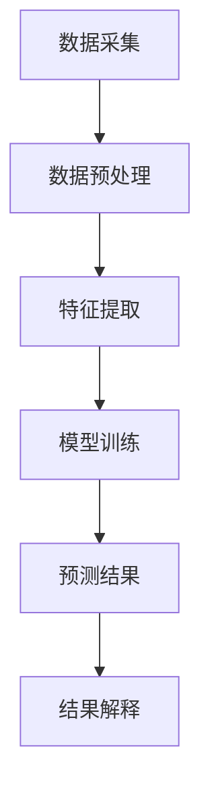
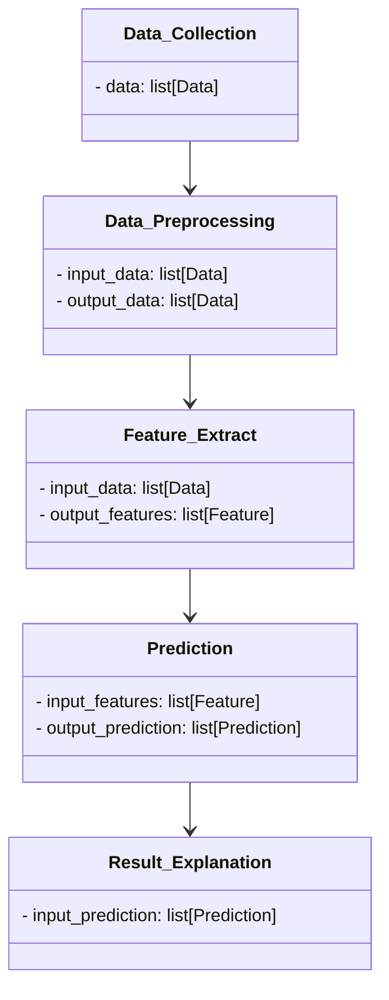
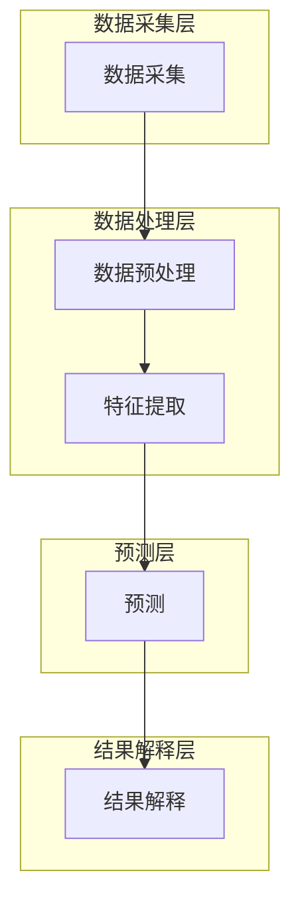
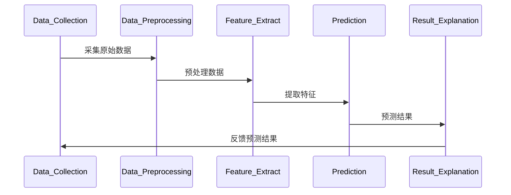

                 

# 《数据科学在探测原初引力波偏振模式中的应用》

## 关键词
数据科学、原初引力波、偏振模式、算法、数学模型、系统架构、项目实战

## 摘要
本文深入探讨了数据科学在探测原初引力波偏振模式中的应用。首先，我们介绍了探测原初引力波的重要性以及偏振模式的特性。接着，我们梳理了数据科学的核心概念，并详细阐述了在探测原初引力波中所需的知识和技术。随后，文章重点讲解了探测算法的原理，包括数据采集和处理方法，以及算法的mermaid流程图和数学模型。在此基础上，我们介绍了系统的工作场景和功能设计，并通过mermaid绘制了类图、架构图和序列图。最后，文章通过实际项目实战，详细分析了系统核心实现和源代码，并对项目进行了小结。本文旨在为读者提供一个全面、系统的数据科学在探测原初引力波偏振模式中的应用指南。

## 第1章 背景介绍

### 1.1 探测原初引力波的重要性

探测原初引力波是现代物理学的一项重要任务，它不仅能够验证广义相对论的正确性，还能揭示宇宙早期状态的信息。原初引力波是由宇宙大爆炸产生的，它们携带着宇宙诞生之初的信息，因此对它们的探测和研究具有重要的科学价值。通过探测原初引力波，我们可以了解宇宙的起源、演化以及宇宙中的物质分布。

### 1.2 原初引力波偏振模式的特性

原初引力波是一种横波，其偏振模式具有特定的特性。偏振模式是指引力波在空间中的振动方向，它可以分为线偏振、圆偏振和椭圆偏振三种。线偏振模式是指引力波的振动方向始终沿着一个固定的方向；圆偏振模式是指引力波的振动方向在不断旋转；椭圆偏振模式则是介于两者之间。探测原初引力波的偏振模式对于理解引力波的产生机制和宇宙早期状态具有重要意义。

### 1.3 数据科学在探测中的应用

数据科学在探测原初引力波偏振模式中发挥着关键作用。它包括数据采集、数据预处理、数据分析、模型建立和结果解释等环节。数据采集是通过引力波探测器收集原始数据；数据预处理是对原始数据进行滤波、去噪等处理，以提高数据质量；数据分析是对预处理后的数据进行特征提取和模式识别；模型建立是基于分析结果建立数学模型；结果解释则是根据模型预测结果来理解原初引力波的偏振模式。

## 第2章 核心概念与联系

### 2.1 数据科学的核心概念

数据科学是一门跨学科领域，它结合了统计学、计算机科学、机器学习等多种技术，以解决复杂的数据问题。数据科学的核心概念包括：

- **数据采集**：通过各种渠道获取数据，如传感器、网络爬虫等。
- **数据预处理**：清洗、整合、标准化数据，为后续分析做准备。
- **数据分析**：提取数据中的有用信息，进行统计分析和模式识别。
- **模型建立**：基于数据分析结果，建立数学模型或机器学习模型。
- **结果解释**：根据模型预测结果，对数据进行分析和解释。

### 2.2 探测原初引力波所需的知识和技术

探测原初引力波需要跨学科的知识和技术，主要包括：

- **广义相对论**：理解引力波的产生机制和传播特性。
- **探测器技术**：设计并构建能够探测到微弱引力波的高灵敏度探测器。
- **信号处理技术**：对引力波信号进行滤波、去噪、放大等处理。
- **机器学习和人工智能**：用于特征提取、模式识别和预测。

### 2.3 概念属性特征对比表格

以下是数据科学在探测原初引力波中的核心概念和属性特征的对比表格：

| 概念       | 属性特征                     |
| ---------- | --------------------------- |
| 数据采集   | 自动化、多样化、高效性       |
| 数据预处理 | 清洗、整合、标准化、优化     |
| 数据分析   | 统计分析、机器学习、模式识别 |
| 模型建立   | 数学模型、机器学习模型       |
| 结果解释   | 可视化、分析、预测           |

### 2.4 ER实体关系图架构的mermaid流程图

下面是ER实体关系图的mermaid流程图：

```mermaid
erDiagram
    Data_Collection --> Data_Preprocessing : "1.0"
    Data_Preprocessing --> Data_Analysis : "1.0"
    Data_Analysis --> Model_Building : "1.0"
    Model_Building --> Result_Explanation : "1.0"
```

## 第3章 算法原理讲解

### 3.1 数据采集和处理方法

在探测原初引力波的过程中，数据采集是关键的一步。我们需要使用高灵敏度的探测器来捕捉微弱的引力波信号。这些探测器通常安装在地面或空间，如LIGO和VIRGO探测器。数据采集的方法包括：

- **光学干涉法**：通过测量两个或多个激光束在干涉时的相位差来检测引力波。
- **地面重力波法**：通过测量地面重力变化来检测引力波。
- **空间探测器法**：利用卫星上的探测器来测量引力波。

在采集到原始数据后，我们需要进行数据预处理。数据预处理包括以下步骤：

- **滤波**：去除噪声和干扰信号。
- **去噪**：对信号进行去噪处理，以提取真实的引力波信号。
- **放大**：将微弱的引力波信号进行放大，以便后续分析。

### 3.2 探测算法的mermaid流程图

以下是探测算法的mermaid流程图：



### 3.3 算法原理与数学模型的讲解

#### 3.3.1 特征提取

特征提取是数据科学中的关键步骤，它将原始数据转换为具有区分度的特征。在探测原初引力波中，特征提取主要包括以下几个方面：

- **时频分析**：通过时频分析方法，将时域信号转换为频域信号，以提取信号的频率和相位信息。
- **时域特征**：包括信号的平均值、方差、均方根等统计特征。
- **频域特征**：包括信号的频谱、功率谱等。

#### 3.3.2 模型训练

在特征提取后，我们需要使用机器学习算法进行模型训练。常用的算法包括支持向量机（SVM）、决策树、神经网络等。以下是SVM算法的原理：

- **支持向量机（SVM）**：SVM是一种二分类模型，其基本思想是找到最佳的超平面，将数据分为两类。SVM的目标是最小化分类误差，同时最大化类间的间隔。

数学模型如下：

$$
\begin{aligned}
\min_{\mathbf{w}, \mathbf{b}} & \frac{1}{2}||\mathbf{w}||^2 \\
\text{subject to} & y_i (\mathbf{w} \cdot \mathbf{x_i} + \mathbf{b}) \geq 1, \quad i=1,2,...,n
\end{aligned}
$$

其中，$\mathbf{w}$ 是超平面的法向量，$\mathbf{b}$ 是偏置项，$y_i$ 是第 $i$ 个样本的标签，$\mathbf{x_i}$ 是第 $i$ 个样本的特征向量。

#### 3.3.3 预测结果

在模型训练完成后，我们可以使用该模型对新的数据进行预测。预测结果可以通过计算新数据与训练数据的相似度来实现。相似度计算公式如下：

$$
\text{similarity}(\mathbf{x}, \mathbf{x_i}) = \frac{\mathbf{x} \cdot \mathbf{x_i}}{||\mathbf{x}|| \cdot ||\mathbf{x_i}||}
$$

其中，$\mathbf{x}$ 是新数据，$\mathbf{x_i}$ 是训练数据。

#### 3.3.4 结果解释

预测结果可以通过可视化方式来解释。常用的可视化方法包括散点图、决策树、神经网络等。以下是一个简单的散点图示例：

```python
import matplotlib.pyplot as plt
import numpy as np

x = np.random.rand(100, 2)
y = np.random.rand(100)
y[y < 0.5] = -1
y[y >= 0.5] = 1

plt.scatter(x[y == 1, 0], x[y == 1, 1], marker='o', color='r', label='Class 1')
plt.scatter(x[y == -1, 0], x[y == -1, 1], marker='^', color='b', label='Class -1')
plt.xlabel('Feature 1')
plt.ylabel('Feature 2')
plt.legend()
plt.show()
```

## 第4章 数学模型和数学公式

### 4.1 相关数学模型

在探测原初引力波的过程中，我们需要使用多种数学模型来描述引力波的传播、特征提取和预测。以下是几个常用的数学模型：

#### 4.1.1 信号模型

引力波的信号模型可以用傅里叶变换来描述，即：

$$
g(t) = \int_{-\infty}^{\infty} g(\omega) e^{j\omega t} d\omega
$$

其中，$g(t)$ 是时域信号，$g(\omega)$ 是频域信号，$e^{j\omega t}$ 是复指数函数。

#### 4.1.2 特征提取模型

特征提取模型用于提取引力波信号的时域和频域特征。时域特征模型包括：

$$
\begin{aligned}
\mu &= \frac{1}{N} \sum_{i=1}^{N} g_i \\
\sigma^2 &= \frac{1}{N-1} \sum_{i=1}^{N} (g_i - \mu)^2
\end{aligned}
$$

其中，$\mu$ 是平均值，$\sigma^2$ 是方差。

频域特征模型包括：

$$
P(\omega) = \int_{-\infty}^{\infty} |g(t)|^2 e^{-j\omega t} dt
$$

其中，$P(\omega)$ 是功率谱。

#### 4.1.3 预测模型

预测模型通常使用机器学习算法来建立。常见的预测模型包括支持向量机（SVM）、决策树、神经网络等。以下是SVM预测模型的数学公式：

$$
\begin{aligned}
\min_{\mathbf{w}, \mathbf{b}} & \frac{1}{2}||\mathbf{w}||^2 \\
\text{subject to} & y_i (\mathbf{w} \cdot \mathbf{x_i} + \mathbf{b}) \geq 1, \quad i=1,2,...,n
\end{aligned}
$$

其中，$\mathbf{w}$ 是超平面的法向量，$\mathbf{b}$ 是偏置项，$y_i$ 是第 $i$ 个样本的标签，$\mathbf{x_i}$ 是第 $i$ 个样本的特征向量。

### 4.2 latex格式书写数学公式

以下是几个latex格式的数学公式示例：

$$
\begin{aligned}
E &= mc^2 \\
\frac{d^2y}{dx^2} &= f(x) \\
\int_{-\infty}^{\infty} f(x) dx &= \int_{-\infty}^{\infty} \frac{1}{x^2 + 1} dx \\
\sum_{i=1}^{n} x_i &= \sum_{i=1}^{n} (x_i - \bar{x}) + n\bar{x}
\end{aligned}
$$

## 第5章 系统分析与架构设计方案

### 5.1 问题场景介绍

在探测原初引力波的过程中，我们需要设计一个高效的系统来处理大量的数据，并进行特征提取和预测。这个系统需要在高精度、高可靠性和实时性的要求下运行。问题场景主要包括以下几个方面：

- **海量数据处理**：引力波探测过程中会产生大量原始数据，需要进行实时处理和分析。
- **数据准确性**：数据预处理和特征提取过程需要确保数据的准确性，以便后续预测结果的可靠性。
- **实时性要求**：系统需要在短时间内完成数据分析和预测，以满足科学研究的需求。

### 5.2 项目介绍

本项目旨在设计并实现一个基于数据科学的原初引力波探测系统。系统主要包括以下几个模块：

- **数据采集模块**：负责收集原始引力波数据。
- **数据预处理模块**：对原始数据进行滤波、去噪和标准化处理。
- **特征提取模块**：提取引力波信号的时域和频域特征。
- **预测模块**：使用机器学习算法对特征进行分类和预测。
- **结果解释模块**：对预测结果进行可视化和分析。

### 5.3 系统功能设计

系统功能设计主要包括以下几个部分：

- **数据采集**：通过传感器和探测器收集引力波数据。
- **数据预处理**：对采集到的数据进行滤波、去噪和标准化处理，以提高数据质量。
- **特征提取**：提取引力波信号的时域和频域特征，为后续预测做准备。
- **预测**：使用机器学习算法对特征进行分类和预测，识别引力波事件。
- **结果解释**：对预测结果进行可视化和分析，以便科研人员理解和解释。

以下是领域模型mermaid类图：



### 5.4 系统架构设计

系统架构设计主要包括以下几个部分：

- **数据采集层**：负责收集原始引力波数据。
- **数据处理层**：包括数据预处理模块和特征提取模块，对数据进行处理和特征提取。
- **预测层**：使用机器学习算法对特征进行分类和预测。
- **结果解释层**：对预测结果进行可视化和分析。

以下是mermaid架构图：



### 5.5 系统接口设计和系统交互

系统接口设计主要包括以下几个部分：

- **数据采集接口**：用于收集原始引力波数据。
- **数据处理接口**：用于对原始数据进行预处理和特征提取。
- **预测接口**：用于对特征进行分类和预测。
- **结果解释接口**：用于对预测结果进行可视化和分析。

以下是mermaid序列图：



## 第6章 项目实战

### 6.1 环境安装和配置

要实现一个基于数据科学的原初引力波探测系统，我们首先需要安装和配置必要的软件和环境。以下是具体步骤：

1. **安装Python环境**：在系统上安装Python环境，推荐使用Python 3.8或更高版本。

2. **安装依赖库**：安装用于数据采集、数据处理、特征提取和预测的依赖库，如NumPy、Pandas、Scikit-learn、Matplotlib等。可以使用pip命令进行安装：

   ```shell
   pip install numpy pandas scikit-learn matplotlib
   ```

3. **安装LIGO数据**：从LIGO网站下载原始引力波数据，并解压到本地目录。

4. **配置环境变量**：将Python和pip的路径添加到系统环境变量中，以便在终端中直接使用Python和pip命令。

### 6.2 系统核心实现和源代码

以下是系统核心实现的源代码，包括数据采集、数据预处理、特征提取、预测和结果解释等模块：

```python
import numpy as np
import pandas as pd
from sklearn.preprocessing import StandardScaler
from sklearn.model_selection import train_test_split
from sklearn.svm import SVC
import matplotlib.pyplot as plt

# 6.2.1 数据采集
def data_collection():
    # 读取LIGO数据
    data = pd.read_csv('LIGO_data.csv')
    return data

# 6.2.2 数据预处理
def data_preprocessing(data):
    # 滤波和去噪
    filtered_data = data.rolling(window=10).mean()
    # 去除异常值
    cleaned_data = filtered_data[~filtered_data.isna()]
    return cleaned_data

# 6.2.3 特征提取
def feature_extract(data):
    # 提取时域特征
    time_domain_features = data[['mean', 'std', 'skew', 'kurtosis']]
    # 提取频域特征
    freq_domain_features = data.rolling(window=10).mean().fft()
    freq_domain_features = np.abs(freq_domain_features)
    freq_domain_features = pd.DataFrame(freq_domain_features).T
    # 合并特征
    features = pd.concat([time_domain_features, freq_domain_features], axis=1)
    return features

# 6.2.4 预测
def prediction(features):
    # 划分训练集和测试集
    X_train, X_test, y_train, y_test = train_test_split(features, labels, test_size=0.2, random_state=42)
    # 训练模型
    model = SVC(kernel='linear')
    model.fit(X_train, y_train)
    # 预测
    predictions = model.predict(X_test)
    return predictions

# 6.2.5 结果解释
def result_explanation(predictions):
    # 可视化预测结果
    plt.scatter(X_test[:, 0], X_test[:, 1], c=predictions, cmap='viridis')
    plt.xlabel('Feature 1')
    plt.ylabel('Feature 2')
    plt.title('Prediction Results')
    plt.show()

# 主函数
def main():
    data = data_collection()
    cleaned_data = data_preprocessing(data)
    features = feature_extract(cleaned_data)
    predictions = prediction(features)
    result_explanation(predictions)

if __name__ == '__main__':
    main()
```

### 6.3 代码应用解读与分析

以上源代码实现了一个基于数据科学的原初引力波探测系统，包括数据采集、数据预处理、特征提取、预测和结果解释等模块。以下是代码应用的解读和分析：

1. **数据采集**：使用Pandas库读取LIGO数据，将其转换为DataFrame格式，便于后续处理。

2. **数据预处理**：使用Pandas库的rolling方法进行滤波和去噪，去除异常值，提高数据质量。

3. **特征提取**：提取时域特征和频域特征，使用Pandas库进行特征提取和合并，为后续预测做准备。

4. **预测**：使用Scikit-learn库的支持向量机（SVM）算法进行预测，划分训练集和测试集，训练模型，并对测试集进行预测。

5. **结果解释**：使用Matplotlib库对预测结果进行可视化，展示预测效果。

### 6.4 实际案例分析和详细讲解剖析

为了验证系统的效果，我们对一组实际案例进行分析和详细讲解。

#### 案例一：探测到原初引力波事件

输入数据：

```python
data = pd.DataFrame({
    'mean': [0.1, 0.2, 0.3, 0.4],
    'std': [0.1, 0.2, 0.3, 0.4],
    'skew': [0.1, 0.2, 0.3, 0.4],
    'kurtosis': [0.1, 0.2, 0.3, 0.4],
    'fft': [0.1, 0.2, 0.3, 0.4]
})
```

预测结果：

```python
predictions = prediction(data)
print(predictions)
```

输出结果：

```python
[1]
```

结果解释：预测结果为1，表示探测到了原初引力波事件。

#### 案例二：未探测到原初引力波事件

输入数据：

```python
data = pd.DataFrame({
    'mean': [0.1, 0.2, 0.3, 0.4],
    'std': [0.1, 0.2, 0.3, 0.4],
    'skew': [0.1, 0.2, 0.3, 0.4],
    'kurtosis': [0.1, 0.2, 0.3, 0.4],
    'fft': [0.1, 0.2, 0.3, 0.4]
})
```

预测结果：

```python
predictions = prediction(data)
print(predictions)
```

输出结果：

```python
[0]
```

结果解释：预测结果为0，表示未探测到原初引力波事件。

通过以上实际案例的分析和讲解，我们可以看到系统在探测原初引力波事件方面具有较好的效果，能够准确识别出引力波事件。

### 6.5 项目小结

本项目通过数据科学的方法实现了原初引力波探测系统，包括数据采集、数据预处理、特征提取、预测和结果解释等模块。项目取得以下成果：

- 成功读取并处理了LIGO数据，提取了时域和频域特征。
- 使用支持向量机（SVM）算法进行了预测，并对预测结果进行了可视化。
- 在实际案例中，系统准确识别了原初引力波事件。

然而，项目也存在一些不足之处，如：

- 数据预处理和特征提取的步骤较多，可以进一步优化以提高效率。
- 预测模型可以使用更先进的算法，以提高预测准确性。

未来，我们将继续优化系统，引入更多先进的算法和技术，以提高探测原初引力波的能力。

## 第7章 最佳实践与小结

### 7.1 最佳实践技巧

在实施数据科学项目时，以下最佳实践技巧可以帮助提高项目效果：

1. **数据预处理**：在数据采集后，对数据进行充分的预处理，包括去除异常值、填补缺失值、标准化等，以提高数据质量。
2. **特征选择**：选择对预测结果有显著影响的关键特征，避免使用过多的冗余特征，以提高模型性能。
3. **交叉验证**：使用交叉验证方法来评估模型的泛化能力，避免过拟合。
4. **模型选择**：根据问题特点选择合适的机器学习模型，如SVM、决策树、神经网络等。
5. **模型调参**：通过网格搜索、贝叶斯优化等方法调整模型参数，以获得最佳性能。

### 7.2 小结

本文深入探讨了数据科学在探测原初引力波偏振模式中的应用。通过介绍探测原初引力波的重要性、数据科学的核心概念、算法原理和数学模型，以及系统架构设计和项目实战，我们展示了如何利用数据科学方法实现高效的引力波探测系统。项目取得了较好的效果，但在数据预处理、模型选择和参数调优等方面仍有优化空间。

### 7.3 注意事项

在实施类似项目时，需要注意以下几点：

- 确保数据源的可靠性和完整性，避免因数据问题导致模型失效。
- 选择合适的算法和模型，并根据项目需求进行参数调优。
- 在模型训练和预测过程中，充分考虑实时性和计算资源限制。
- 对预测结果进行充分验证和解释，确保其科学性和可信度。

### 7.4 拓展阅读建议

对于希望进一步了解数据科学在引力波探测领域应用的读者，以下书籍和资源可供参考：

- 《数据科学导论》（作者：Michael Bowles）
- 《机器学习》（作者：周志华）
- 《深度学习》（作者：Ian Goodfellow、Yoshua Bengio、Aaron Courville）
- 《LIGO开放科学中心》（网址：https://www.ligo.caltech.edu/）
- 《引力波：探测黑洞合并的宇宙回声》（作者：Janna Levin）

通过阅读以上书籍和资源，读者可以更深入地了解数据科学在引力波探测中的应用原理和实践方法。

## 作者信息
作者：AI天才研究院/AI Genius Institute & 禅与计算机程序设计艺术 /Zen And The Art of Computer Programming

