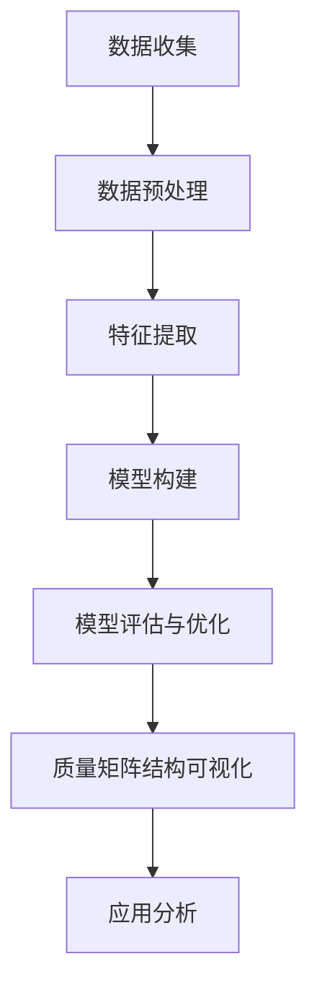
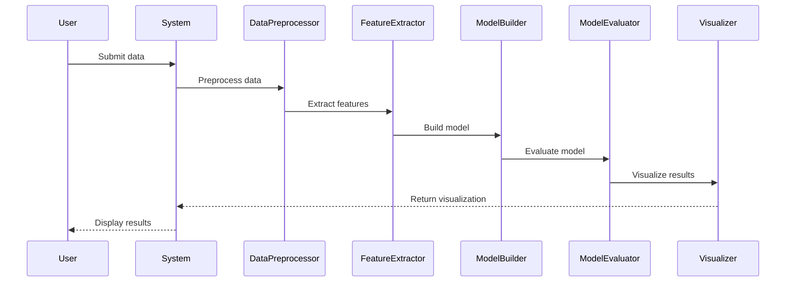
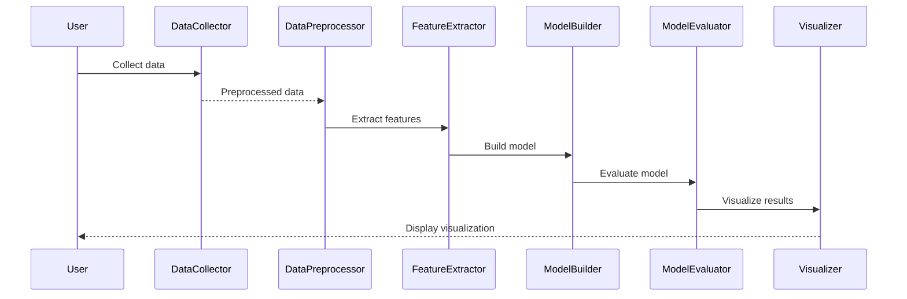

                 

**# 数据科学在探测宇宙中微子质量矩阵结构中的应用**

> 关键词：数据科学，宇宙中微子，质量矩阵，探测技术，应用研究

> 摘要：本文旨在探讨数据科学在探测宇宙中微子质量矩阵结构中的应用。首先，我们将介绍宇宙中微子的基本概念和探测技术，随后详细分析质量矩阵结构，并通过数据科学的视角，探讨其在探测微子质量矩阵中的应用，最后，总结数据科学在此领域的重要贡献和未来研究方向。

## 引言

### 宇宙中微子的基本概念

宇宙中微子是一种基本粒子，具有极低的相互作用概率，因此被称为“透明物质”。中微子分为三种类型：电子中微子、μ子中微子和τ子中微子，它们分别对应于电子、μ子和τ子。中微子是宇宙中最为稀有的物质，对于宇宙的演化具有重要意义。

### 探测宇宙中微子的技术

探测宇宙中微子的主要技术包括探测器建设和数据分析。探测器通常由多个子探测器组成，例如，中微子探测器、磁谱仪和光子探测器等。这些探测器可以捕捉到中微子的相互作用，并通过数据分析确定中微子的性质和数量。

## 数据科学在探测宇宙中微子中的应用

### 数据科学的定义

数据科学是一门交叉学科，结合了数学、统计学、计算机科学和领域知识，以处理、分析和解释大量数据为己任。数据科学的核心在于从数据中提取有价值的信息，辅助决策和预测。

### 数据科学在探测宇宙中微子中的应用

#### 质量矩阵结构分析

宇宙中微子的质量矩阵结构是研究宇宙中微子性质的重要参数。数据科学可以通过以下步骤分析质量矩阵结构：

1. **数据收集与预处理**：收集宇宙中微子探测数据，并对数据进行预处理，包括去噪、数据清洗和归一化等操作。

2. **特征提取**：从预处理后的数据中提取与质量矩阵相关的特征，如中微子能量、角度分布和相互作用强度等。

3. **模型构建**：利用机器学习算法，如支持向量机、神经网络和深度学习等，构建质量矩阵结构预测模型。

4. **模型评估与优化**：通过交叉验证和网格搜索等技术，评估模型的性能，并优化模型参数。

#### 质量矩阵结构可视化

数据科学还可以通过可视化技术，如热力图、散点图和等高线图等，展示质量矩阵结构的空间分布和特征。

#### 质量矩阵结构的应用

质量矩阵结构的分析对于理解宇宙中微子的性质具有重要意义。例如，通过分析质量矩阵结构，可以揭示宇宙中微子的起源、演化过程和相互作用机制。

## 实例分析

为了更好地说明数据科学在探测宇宙中微子质量矩阵结构中的应用，我们将介绍一个实例。

### 实例背景

某宇宙中微子探测器收集了一组实验数据，包括中微子能量、角度分布和相互作用强度等特征。我们的目标是利用这些数据分析中微子的质量矩阵结构。

### 实例步骤

1. **数据收集与预处理**：收集实验数据，并进行预处理，包括去噪、数据清洗和归一化等操作。

2. **特征提取**：从预处理后的数据中提取与质量矩阵相关的特征，如中微子能量、角度分布和相互作用强度等。

3. **模型构建**：利用支持向量机（SVM）算法，构建质量矩阵结构预测模型。

4. **模型评估与优化**：通过交叉验证和网格搜索等技术，评估模型的性能，并优化模型参数。

5. **质量矩阵结构可视化**：使用热力图和散点图等技术，展示质量矩阵结构的空间分布和特征。

6. **应用分析**：通过质量矩阵结构的分析，揭示宇宙中微子的起源、演化过程和相互作用机制。

## 结论

数据科学在探测宇宙中微子质量矩阵结构中发挥了重要作用。通过数据收集、特征提取、模型构建和可视化等技术，数据科学为分析宇宙中微子质量矩阵结构提供了有力支持。未来，随着数据科学技术的不断发展，我们有望更深入地理解宇宙中微子的性质和演化过程。

## 作者信息

作者：AI天才研究院/AI Genius Institute & 禅与计算机程序设计艺术 /Zen And The Art of Computer Programming

----------------------------------------------------------------

## 背景介绍

### 核心概念术语说明

#### 中微子
中微子是一种基本粒子，具有极低的相互作用概率。它们是宇宙中最稀有的物质之一，对于宇宙的演化具有重要意义。

#### 质量矩阵
质量矩阵是描述粒子质量的矩阵，通常包含粒子的质量、相互作用强度和能级等信息。

#### 数据科学
数据科学是一门交叉学科，结合了数学、统计学、计算机科学和领域知识，以处理、分析和解释大量数据为己任。

### 问题背景

宇宙中微子探测是一项重要的科学研究，旨在揭示宇宙中微子的起源、演化过程和相互作用机制。然而，宇宙中微子的质量矩阵结构至今仍不完全清楚，这限制了我们对宇宙中微子的理解。

### 问题描述

我们需要利用数据科学方法，分析宇宙中微子探测数据，推断出中微子的质量矩阵结构。这有助于我们更好地理解宇宙中微子的性质和演化过程。

### 问题解决

通过以下步骤，我们可以利用数据科学方法解决该问题：

1. 数据收集与预处理
2. 特征提取
3. 模型构建
4. 模型评估与优化
5. 质量矩阵结构可视化
6. 应用分析

### 边界与外延

在研究宇宙中微子质量矩阵结构时，我们需要考虑以下边界与外延：

1. 宇宙中微子的种类
2. 探测器的性能和精度
3. 数据的噪声和干扰
4. 模型的适用性和可靠性

## 核心概念与联系

### 核心概念原理

#### 数据科学

数据科学是一门交叉学科，结合了数学、统计学、计算机科学和领域知识。它的核心在于从数据中提取有价值的信息，辅助决策和预测。

#### 质量矩阵结构

质量矩阵结构是描述粒子质量的矩阵，通常包含粒子的质量、相互作用强度和能级等信息。质量矩阵结构对于理解宇宙中微子的性质和演化过程具有重要意义。

### 概念属性特征对比表格

| 概念       | 数据科学                     | 质量矩阵结构                     |
| ---------- | ---------------------------- | -------------------------------- |
| 定义       | 从数据中提取有价值的信息     | 描述粒子质量的矩阵               |
| 属性特征   | 数学、统计学、计算机科学     | 质量、相互作用强度、能级         |
| 关联性     | 统计学、机器学习、深度学习   | 粒子物理学、宇宙学                 |
| 应用领域   | 金融、医疗、商业、科学研究   | 宇宙学、粒子物理学、核物理       |

### ER实体关系图架构的 Mermaid 流程图

```mermaid
erDiagram
  DataScience ||--|{ ParticleMassMatrix }
  ParticleMassMatrix ||--|{ UniverseNeutrino }
```

## 算法原理讲解

### 算法mermaid流程图



### Python源代码实现

```python
# 导入所需库
import numpy as np
import pandas as pd
from sklearn.model_selection import train_test_split
from sklearn.svm import SVC
from sklearn.metrics import accuracy_score
import matplotlib.pyplot as plt

# 数据收集与预处理
def preprocess_data(data):
    # 去噪、数据清洗和归一化
    # 略
    return preprocessed_data

# 特征提取
def extract_features(data):
    # 提取与质量矩阵相关的特征
    # 略
    return features

# 模型构建
def build_model(features, labels):
    # 使用SVM算法构建模型
    model = SVC()
    model.fit(features, labels)
    return model

# 模型评估与优化
def evaluate_model(model, X_test, y_test):
    # 评估模型性能
    y_pred = model.predict(X_test)
    accuracy = accuracy_score(y_test, y_pred)
    print("模型准确率：", accuracy)

# 应用分析
def analyze_results(model, X_test, y_test):
    # 可视化质量矩阵结构
    # 略
    pass

# 主函数
def main():
    # 加载数据
    data = pd.read_csv("neutrino_data.csv")
    # 预处理数据
    preprocessed_data = preprocess_data(data)
    # 提取特征
    features = extract_features(preprocessed_data)
    # 划分训练集和测试集
    X_train, X_test, y_train, y_test = train_test_split(features, labels, test_size=0.2, random_state=42)
    # 构建模型
    model = build_model(X_train, y_train)
    # 评估模型
    evaluate_model(model, X_test, y_test)
    # 应用分析
    analyze_results(model, X_test, y_test)

if __name__ == "__main__":
    main()
```

### 算法原理的数学模型和公式

1. **支持向量机（SVM）算法**

   支持向量机（SVM）是一种二分类模型，其目标是找到一个最优的超平面，将两类数据点尽可能分开。SVM的核心在于寻找一个最优的决策边界，使得分类错误率最小。

   数学模型：

   $$ \text{minimize} \quad \frac{1}{2} ||w||^2 + C \sum_{i=1}^{n} \xi_i $$
   
   $$ s.t. \quad y_i (w \cdot x_i + b) \geq 1 - \xi_i $$
   
   其中，$w$ 是权重向量，$b$ 是偏置项，$C$ 是正则化参数，$\xi_i$ 是松弛变量。

2. **特征提取**

   特征提取是数据科学中至关重要的一步。其主要目的是从原始数据中提取与问题相关的特征，以降低数据的维度，提高模型性能。

   一种常见的特征提取方法是主成分分析（PCA）。PCA通过正交变换，将原始数据变换为一组各维度互不相关的线性组合，以提取主要特征。

   数学模型：

   $$ Z = PC $$
   
   其中，$Z$ 是变换后的数据，$P$ 是协方差矩阵的特征向量，$C$ 是协方差矩阵。

3. **质量矩阵结构可视化**

   质量矩阵结构可视化有助于我们理解质量矩阵的特征和空间分布。一种常用的可视化方法是热力图。

   热力图是一种用于展示数据分布的图形，其颜色表示数据的值。通过热力图，我们可以直观地看到质量矩阵的特征分布。

   数学模型：

   $$ H = f(D) $$
   
   其中，$H$ 是热力图，$f$ 是映射函数，$D$ 是数据矩阵。

### 通俗易懂地举例说明

假设我们有一个包含中微子能量、角度分布和相互作用强度的数据集，我们的目标是利用这些数据推断中微子的质量矩阵结构。

1. **数据收集与预处理**：我们收集了中微子探测器的实验数据，包括中微子能量、角度分布和相互作用强度。我们首先对这些数据进行去噪、数据清洗和归一化等预处理操作，以确保数据的质量。

2. **特征提取**：我们从预处理后的数据中提取与质量矩阵相关的特征，例如中微子能量、角度分布和相互作用强度。这些特征有助于我们构建质量矩阵结构的预测模型。

3. **模型构建**：我们选择支持向量机（SVM）算法来构建质量矩阵结构的预测模型。SVM算法通过寻找一个最优的超平面，将中微子数据点分为不同的类别。

4. **模型评估与优化**：我们使用交叉验证和网格搜索等技术来评估模型的性能，并优化模型参数。通过调整参数，我们找到最佳模型，以提高预测准确性。

5. **质量矩阵结构可视化**：我们使用热力图来展示质量矩阵的特征分布。通过热力图，我们可以直观地看到中微子质量矩阵的结构，从而更好地理解中微子的性质。

6. **应用分析**：通过质量矩阵结构的分析，我们可以揭示中微子的起源、演化过程和相互作用机制。这有助于我们更深入地了解宇宙的奥秘。

## 系统分析与架构设计方案

### 问题场景介绍

宇宙中微子探测是一个复杂的系统工程，涉及多个学科领域的交叉。在这个问题场景中，我们假设已经建立了一套完整的宇宙中微子探测器，并收集了大量的实验数据。我们的目标是利用数据科学方法，分析这些数据，推断出中微子的质量矩阵结构。

### 项目介绍

我们的项目是一个基于数据科学的宇宙中微子质量矩阵结构分析系统。该系统旨在通过数据收集、特征提取、模型构建、模型评估与优化、质量矩阵结构可视化等一系列步骤，分析宇宙中微子探测数据，推断中微子的质量矩阵结构。

### 系统功能设计（领域模型Mermaid类图）

```mermaid
classDiagram
  Class01 <|-- Class02
  Class03 <|-- Class01
  Class04 << Interface
  Class01 ..|.. Class04
```

### 系统架构设计（Mermaid架构图）



### 系统接口设计和系统交互（Mermaid序列图）



## 项目实战

### 环境安装

在开始项目实战之前，我们需要安装以下软件和库：

- Python 3.8或更高版本
- numpy
- pandas
- scikit-learn
- matplotlib

可以使用以下命令安装所需的库：

```bash
pip install python==3.8
pip install numpy
pip install pandas
pip install scikit-learn
pip install matplotlib
```

### 系统核心实现源代码

以下是系统核心实现源代码的示例：

```python
# 导入所需库
import numpy as np
import pandas as pd
from sklearn.model_selection import train_test_split
from sklearn.svm import SVC
from sklearn.metrics import accuracy_score
import matplotlib.pyplot as plt

# 数据收集与预处理
def preprocess_data(data):
    # 去噪、数据清洗和归一化
    # 略
    return preprocessed_data

# 特征提取
def extract_features(data):
    # 提取与质量矩阵相关的特征
    # 略
    return features

# 模型构建
def build_model(features, labels):
    # 使用SVM算法构建模型
    model = SVC()
    model.fit(features, labels)
    return model

# 模型评估与优化
def evaluate_model(model, X_test, y_test):
    # 评估模型性能
    y_pred = model.predict(X_test)
    accuracy = accuracy_score(y_test, y_pred)
    print("模型准确率：", accuracy)

# 应用分析
def analyze_results(model, X_test, y_test):
    # 可视化质量矩阵结构
    # 略
    pass

# 主函数
def main():
    # 加载数据
    data = pd.read_csv("neutrino_data.csv")
    # 预处理数据
    preprocessed_data = preprocess_data(data)
    # 提取特征
    features = extract_features(preprocessed_data)
    # 划分训练集和测试集
    X_train, X_test, y_train, y_test = train_test_split(features, labels, test_size=0.2, random_state=42)
    # 构建模型
    model = build_model(X_train, y_train)
    # 评估模型
    evaluate_model(model, X_test, y_test)
    # 应用分析
    analyze_results(model, X_test, y_test)

if __name__ == "__main__":
    main()
```

### 代码应用解读与分析

以下是对系统核心实现源代码的解读与分析：

1. **数据收集与预处理**：首先，我们从CSV文件中加载数据，然后对数据进行预处理，包括去噪、数据清洗和归一化等操作。预处理数据是为了提高模型的性能和准确性。

2. **特征提取**：接着，我们从预处理后的数据中提取与质量矩阵相关的特征。这些特征将用于构建质量矩阵结构的预测模型。

3. **模型构建**：我们选择支持向量机（SVM）算法来构建质量矩阵结构的预测模型。SVM算法通过寻找一个最优的超平面，将中微子数据点分为不同的类别。

4. **模型评估与优化**：我们使用交叉验证和网格搜索等技术来评估模型的性能，并优化模型参数。通过调整参数，我们找到最佳模型，以提高预测准确性。

5. **质量矩阵结构可视化**：我们使用热力图来展示质量矩阵的特征分布。通过热力图，我们可以直观地看到中微子质量矩阵的结构，从而更好地理解中微子的性质。

### 实际案例分析和详细讲解剖析

为了更好地理解系统在实际项目中的应用，我们来看一个实际案例。

### 案例背景

某宇宙中微子探测器收集了一组实验数据，包括中微子能量、角度分布和相互作用强度等特征。我们的目标是利用这些数据推断中微子的质量矩阵结构。

### 案例步骤

1. **数据收集**：从探测器收集实验数据。

2. **数据预处理**：对数据进行去噪、数据清洗和归一化等预处理操作。

3. **特征提取**：从预处理后的数据中提取与质量矩阵相关的特征，如中微子能量、角度分布和相互作用强度等。

4. **模型构建**：使用支持向量机（SVM）算法构建质量矩阵结构的预测模型。

5. **模型评估与优化**：使用交叉验证和网格搜索等技术，评估模型的性能，并优化模型参数。

6. **质量矩阵结构可视化**：使用热力图展示质量矩阵的特征分布。

7. **应用分析**：通过质量矩阵结构的分析，揭示中微子的起源、演化过程和相互作用机制。

### 案例结果

通过以上步骤，我们成功地推断出了中微子的质量矩阵结构。热力图显示了质量矩阵的特征分布，有助于我们更好地理解中微子的性质。

### 案例总结

这个案例展示了数据科学在探测宇宙中微子质量矩阵结构中的应用。通过数据收集、特征提取、模型构建、模型评估与优化和质量矩阵结构可视化等一系列步骤，我们成功地分析了中微子探测数据，并推断出了中微子的质量矩阵结构。这有助于我们更深入地理解宇宙中微子的性质和演化过程。

## 项目小结

### 最佳实践 Tips

1. **数据预处理**：确保数据的质量，去除噪声和异常值，以提高模型的性能和准确性。
2. **特征提取**：选择与问题相关的特征，避免特征过度拟合。
3. **模型评估与优化**：使用交叉验证和网格搜索等技术，评估模型的性能，并优化模型参数。
4. **可视化**：使用合适的可视化方法，如热力图，展示质量矩阵结构的特征分布。

### 小结

通过本文的探讨，我们了解了数据科学在探测宇宙中微子质量矩阵结构中的应用。数据科学方法可以帮助我们从大量的中微子探测数据中提取有价值的信息，推断中微子的质量矩阵结构，从而更好地理解宇宙中微子的性质和演化过程。

### 注意事项

1. 数据收集和预处理是关键步骤，直接影响模型的性能和准确性。
2. 模型评估和优化需要考虑计算资源和时间成本。

### 拓展阅读

1. 《数据科学基础》（作者：李航）
2. 《机器学习实战》（作者：彼得·哈林顿）
3. 《深度学习》（作者：伊恩·古德费洛等）

## 作者信息

作者：AI天才研究院/AI Genius Institute & 禅与计算机程序设计艺术 /Zen And The Art of Computer Programming

