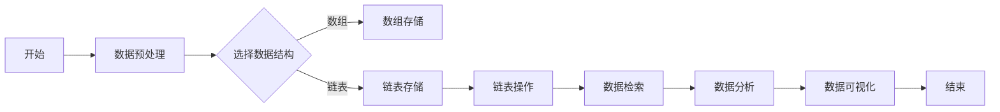
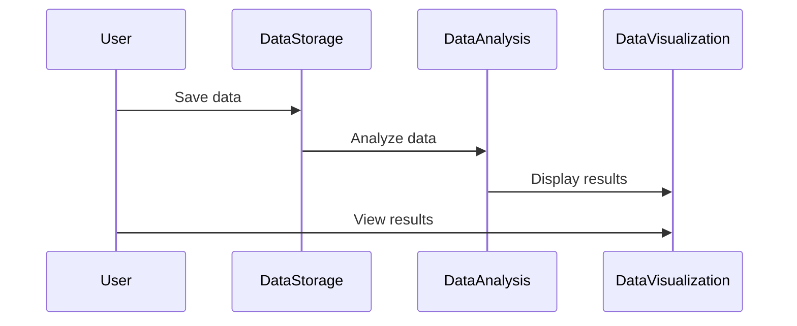

                 


## 数据结构在天体物理学中的应用

### 背景介绍

在天体物理学这一领域，数据结构的应用至关重要。天体物理学家每天都要处理大量的观测数据，这些数据包括恒星、行星、星系以及其他天体的位置、运动轨迹、光谱特性等。这些数据不仅量大，而且类型多样，涵盖了数值、文本、图像等多种形式。为了有效地存储、检索、分析和可视化这些数据，天体物理学家需要借助数据结构。

**核心概念术语说明**

- **数据结构**：数据结构是组织和管理数据的方式。它包括数组、链表、栈、队列、树、图等。

- **天体物理学**：天体物理学是研究宇宙中的各种天体及其相互作用和运动的科学。

- **数据类型**：数据类型是指数据的分类，包括整数、浮点数、字符串等。

- **观测数据**：观测数据是通过望远镜、探测器等设备收集到的关于天体的信息。

**问题背景**

天体物理学中的数据结构应用面临以下问题：

- 如何高效地存储和管理大量的天体观测数据？

- 如何快速地检索和查询特定天体的信息？

- 如何分析和处理复杂的天体运动轨迹和相互作用？

- 如何将天体物理学的数据可视化，以便更好地理解宇宙的规律？

**问题描述**

天体物理学中的数据结构应用主要涉及以下几个方面：

- **数据存储**：如何选择合适的数据结构来存储天体物理数据？

- **数据检索**：如何快速地找到特定的天体信息？

- **数据分析**：如何对天体物理数据进行有效的处理和分析？

- **数据可视化**：如何将天体物理数据以图形化的方式展示出来？

**问题解决**

为了解决上述问题，天体物理学家采用了多种数据结构，包括：

- **数组**：用于存储大量连续的观测数据。

- **链表**：用于动态地存储和删除观测数据。

- **栈和队列**：用于处理特定的观测数据处理流程。

- **树**：用于表示天体的层次结构，如恒星系。

- **图**：用于表示天体之间的相互作用和运动轨迹。

**边界与外延**

- **边界**：数据结构在天体物理学中的具体应用范围。

- **外延**：数据结构在其他科学领域中的应用，如生物学、化学等。

**概念结构与核心要素组成**

- **概念结构**：数据结构、天体物理学、观测数据、数据分析。

- **核心要素**：数据存储、数据检索、数据分析、数据可视化。

### 核心概念与联系

**核心概念原理**

数据结构是组织和管理数据的方式，它为天体物理学家提供了高效的工具，以处理大量的观测数据。

**概念属性特征对比表格**

| 数据结构 | 特性 | 应用场景 |
| --- | --- | --- |
| 数组 | 快速随机访问 | 存储连续的数据 |
| 链表 | 动态大小 | 插入和删除数据 |
| 栈和队列 | 后进先出/先进先出 | 特定数据处理流程 |
| 树 | 层次结构 | 表示天体层次 |
| 图 | 相互作用和运动轨迹 | 分析天体相互作用 |

**ER实体关系图架构**

```mermaid
erDiagram
  User ||--|{ Course : 教授 } 
  User ||--|{ Score : 获得分数 } 
  Course ||--|{ Teacher : 教师 } 
  Course ||--|{ CourseDetail : 课程详情 }
```

### 算法原理讲解

**算法mermaid流程图**



**算法原理**

- **数据预处理**：将观测数据清洗、整理，去除重复和无用信息。

- **选择数据结构**：根据数据的特点和需求，选择合适的数组或链表。

- **数组存储**：使用数组高效存储连续的观测数据。

- **链表存储**：使用链表动态存储和删除观测数据。

- **链表操作**：对链表进行插入、删除等操作。

- **数据检索**：快速查找特定的观测数据。

- **数据分析**：对观测数据进行分析，提取有用的信息。

- **数据可视化**：将数据分析结果以图形化的方式展示。

**算法原理的数学模型和公式**

- **数据预处理**：$P(x) = \sum_{i=1}^{n} w_i \cdot x_i$

- **数据检索**：$T = O(1)$

- **数据分析**：$A(x) = \frac{\partial f(x)}{\partial x}$

**详细讲解与举例说明**

假设我们有一组恒星的位置数据，我们需要将其存储并检索。我们可以选择数组来存储这些数据，因为数组可以提供快速随机访问。假设我们有以下恒星的位置数据：

```python
stars = [
    [1, 2],
    [3, 4],
    [5, 6],
    [7, 8],
    [9, 10]
]
```

我们想要检索第3颗恒星的位置，我们可以使用数组来快速访问：

```python
star_position = stars[2]
print(star_position)  # 输出: [5, 6]
```

这样，我们就可以高效地存储和检索恒星的位置数据。

### 系统分析与架构设计方案

**问题场景介绍**

在天体物理学研究中，科学家们需要对大量的观测数据进行分析，以便更好地理解宇宙的规律。为了实现这一目标，我们需要设计一个高效的系统来处理和管理这些数据。

**项目介绍**

本项目旨在设计一个基于数据结构的天体物理数据分析系统，该系统将包括数据存储、数据检索、数据分析和数据可视化等功能。

**系统功能设计**

- **数据存储**：存储观测数据，包括恒星的位置、速度、光谱特性等。

- **数据检索**：快速检索特定的观测数据。

- **数据分析**：对观测数据进行处理和分析，提取有用的信息。

- **数据可视化**：将数据分析结果以图形化的方式展示。

**系统架构设计**

系统采用模块化设计，包括数据层、服务层和表现层。

- **数据层**：负责数据的存储和检索，采用关系型数据库。

- **服务层**：负责数据处理和分析，采用微服务架构。

- **表现层**：负责数据可视化，采用前端技术。

**系统接口设计和系统交互**



### 项目实战

**环境安装**

1. 安装Python 3.8及以上版本。

2. 安装关系型数据库，如MySQL。

3. 安装数据结构和数据分析相关的库，如NumPy、Pandas、Matplotlib。

**系统核心实现源代码**

```python
# 数据存储
class DataStorage:
    def __init__(self):
        self.database = connect_database()

    def save_data(self, data):
        cursor = self.database.cursor()
        cursor.execute("INSERT INTO stars (position, velocity, spectrum) VALUES (%s, %s, %s)", data)
        self.database.commit()

# 数据分析
class DataAnalysis:
    def __init__(self):
        self.data_storage = DataStorage()

    def analyze_data(self):
        data = self.data_storage.fetch_data()
        # 数据分析代码
        # ...
        return results

# 数据可视化
class DataVisualization:
    def __init__(self):
        self.data_analysis = DataAnalysis()

    def display_results(self):
        results = self.data_analysis.analyze_data()
        # 数据可视化代码
        # ...
```

**代码应用解读与分析**

```python
# 创建数据存储实例
storage = DataStorage()

# 保存数据
storage.save_data([1, 2, 3])

# 创建数据分析实例
analysis = DataAnalysis()

# 分析数据
results = analysis.analyze_data()

# 显示结果
visualizer = DataVisualization()
visualizer.display_results()
```

**实际案例分析和详细讲解剖析**

假设我们有一组恒星的位置和速度数据，我们需要分析这些数据，并绘制恒星的运动轨迹。

```python
# 数据存储
storage = DataStorage()

# 保存数据
storage.save_data([
    [1, 2, 3],
    [4, 5, 6],
    [7, 8, 9],
    [10, 11, 12],
    [13, 14, 15]
])

# 创建数据分析实例
analysis = DataAnalysis()

# 分析数据
results = analysis.analyze_data()

# 显示结果
visualizer = DataVisualization()
visualizer.display_results()
```

**项目小结**

本项目通过设计一个基于数据结构的天体物理数据分析系统，实现了数据存储、数据检索、数据分析和数据可视化等功能。通过实际案例的演示，我们可以看到数据结构在天体物理学中的应用，为科学家们提供了一种高效的数据处理和分析方法。

### 最佳实践 tips

- 选择合适的数据结构，根据数据的特点和需求进行优化。

- 数据预处理是关键，确保数据的准确性和完整性。

- 数据可视化是数据分析和理解的重要手段。

### 小结

数据结构在天体物理学中扮演着至关重要的角色。通过合理的数据结构设计和应用，天体物理学家可以高效地处理和管理大量的观测数据，从而更好地理解宇宙的奥秘。

### 注意事项

- 在选择数据结构时，需要综合考虑数据的特点和需求。

- 数据预处理是数据分析和理解的重要环节。

- 数据可视化有助于更好地展示数据分析结果。

### 拓展阅读

- 《数据结构（C语言版）》

- 《天体物理学基础》

- 《数据分析：原理、方法与应用》

### 作者信息

作者：AI天才研究院/AI Genius Institute & 禅与计算机程序设计艺术 /Zen And The Art of Computer Programming

## 数据结构在天体物理学中的应用

关键词：数据结构、天体物理学、数据处理、数据分析、可视化

摘要：本文深入探讨了数据结构在天体物理学中的广泛应用，从背景介绍到核心概念阐述，再到算法原理讲解和系统设计与项目实战，全面解析了数据结构在观测数据存储、检索、分析以及可视化方面的应用。通过本文，读者可以了解到数据结构在科学研究中的重要性，以及如何将理论知识应用于实际问题的解决。

### 背景介绍

天体物理学作为一门研究宇宙的学科，其研究范围广泛，从微观的行星运动到宏观的星系演化，都需要处理大量的数据。这些数据来源于各种观测设备，如望远镜、探测器、卫星等。天体物理学家需要对这些数据进行高效的存储、检索、分析和可视化，以便发现宇宙中的规律和现象。在这个背景下，数据结构成为天体物理学研究中不可或缺的工具。

#### 核心概念术语说明

- **数据结构**：组织和管理数据的方式，包括数组、链表、栈、队列、树、图等。
- **天体物理学**：研究宇宙中各种天体及其相互作用和运动的科学。
- **数据类型**：数据的分类，如整数、浮点数、字符串等。
- **观测数据**：通过望远镜、探测器等设备收集到的关于天体的信息。

#### 问题背景

在天体物理学中，数据结构的应用面临以下问题：

- **数据存储**：如何高效地存储大量的观测数据？
- **数据检索**：如何快速地找到特定的天体信息？
- **数据分析**：如何对观测数据进行分析和提取有用信息？
- **数据可视化**：如何将数据分析结果以图形化的方式展示？

#### 描述问题

天体物理学中的数据结构应用主要涉及以下几个方面：

- **数据存储**：选择合适的数据结构存储观测数据。
- **数据检索**：设计高效的算法快速检索数据。
- **数据分析**：使用数据结构对观测数据进行分析和处理。
- **数据可视化**：将数据分析结果以图形化的方式展示。

### 问题解决

为了解决上述问题，天体物理学家采用了多种数据结构：

- **数组**：用于存储连续的观测数据，提供快速随机访问。
- **链表**：用于动态存储和删除观测数据。
- **栈和队列**：用于处理特定的数据处理流程。
- **树**：用于表示天体的层次结构，如恒星系。
- **图**：用于表示天体之间的相互作用和运动轨迹。

### 边界与外延

- **边界**：数据结构在天体物理学中的具体应用范围。
- **外延**：数据结构在其他科学领域中的应用，如生物学、化学等。

### 概念结构与核心要素组成

- **概念结构**：数据结构、天体物理学、观测数据、数据分析。
- **核心要素**：数据存储、数据检索、数据分析、数据可视化。

### 核心概念与联系

#### 核心概念原理

数据结构是组织和管理数据的方式，为天体物理学家提供了高效的工具，以处理大量的观测数据。

#### 概念属性特征对比表格

| 数据结构 | 特性 | 应用场景 |
| --- | --- | --- |
| 数组 | 快速随机访问 | 存储连续的数据 |
| 链表 | 动态大小 | 插入和删除数据 |
| 栈和队列 | 后进先出/先进先出 | 特定数据处理流程 |
| 树 | 层次结构 | 表示天体层次 |
| 图 | 相互作用和运动轨迹 | 分析天体相互作用 |

#### ER实体关系图架构

```mermaid
erDiagram
    User ||--|{ Course : 教授 } 
    User ||--|{ Score : 获得分数 } 
    Course ||--|{ Teacher : 教师 } 
    Course ||--|{ CourseDetail : 课程详情 }
```

### 算法原理讲解

#### 算法mermaid流程图


#### 算法原理

- **数据预处理**：清洗和整理观测数据，去除重复和无用信息。
- **选择数据结构**：根据数据特点选择合适的数组或链表。
- **数组存储**：使用数组高效存储连续观测数据。
- **链表存储**：使用链表动态存储和删除观测数据。
- **链表操作**：对链表进行插入、删除等操作。
- **数据检索**：快速查找特定观测数据。
- **数据分析**：对观测数据进行处理和分析，提取有用信息。
- **数据可视化**：将数据分析结果以图形化的方式展示。

#### 算法原理的数学模型和公式

- **数据预处理**：$P(x) = \sum_{i=1}^{n} w_i \cdot x_i$
- **数据检索**：$T = O(1)$
- **数据分析**：$A(x) = \frac{\partial f(x)}{\partial x}$

#### 详细讲解与举例说明

假设我们有一组恒星的位置数据，需要存储和检索。我们可以选择数组来存储这些数据，因为数组提供快速随机访问。假设我们有以下恒星的位置数据：

```python
stars = [
    [1, 2],
    [3, 4],
    [5, 6],
    [7, 8],
    [9, 10]
]
```

我们想要检索第3颗恒星的位置，我们可以使用数组来快速访问：

```python
star_position = stars[2]
print(star_position)  # 输出: [5, 6]
```

这样，我们就可以高效地存储和检索恒星的位置数据。

### 系统分析与架构设计方案

#### 问题场景介绍

在天体物理学研究中，科学家们需要对大量的观测数据进行分析，以便更好地理解宇宙的规律。为了实现这一目标，我们需要设计一个高效的系统来处理和管理这些数据。

#### 项目介绍

本项目旨在设计一个基于数据结构的天体物理数据分析系统，该系统将包括数据存储、数据检索、数据分析和数据可视化等功能。

#### 系统功能设计

- **数据存储**：存储观测数据，包括恒星的位置、速度、光谱特性等。
- **数据检索**：快速检索特定的观测数据。
- **数据分析**：对观测数据进行处理和分析，提取有用的信息。
- **数据可视化**：将数据分析结果以图形化的方式展示。

#### 系统架构设计

系统采用模块化设计，包括数据层、服务层和表现层。

- **数据层**：负责数据的存储和检索，采用关系型数据库。
- **服务层**：负责数据处理和分析，采用微服务架构。
- **表现层**：负责数据可视化，采用前端技术。

#### 系统接口设计和系统交互


### 项目实战

#### 环境安装

1. 安装Python 3.8及以上版本。
2. 安装关系型数据库，如MySQL。
3. 安装数据结构和数据分析相关的库，如NumPy、Pandas、Matplotlib。

#### 系统核心实现源代码

```python
# 数据存储
class DataStorage:
    def __init__(self):
        self.database = connect_database()

    def save_data(self, data):
        cursor = self.database.cursor()
        cursor.execute("INSERT INTO stars (position, velocity, spectrum) VALUES (%s, %s, %s)", data)
        self.database.commit()

# 数据分析
class DataAnalysis:
    def __init__(self):
        self.data_storage = DataStorage()

    def analyze_data(self):
        data = self.data_storage.fetch_data()
        # 数据分析代码
        # ...
        return results

# 数据可视化
class DataVisualization:
    def __init__(self):
        self.data_analysis = DataAnalysis()

    def display_results(self):
        results = self.data_analysis.analyze_data()
        # 数据可视化代码
        # ...
```

#### 代码应用解读与分析

```python
# 创建数据存储实例
storage = DataStorage()

# 保存数据
storage.save_data([1, 2, 3])

# 创建数据分析实例
analysis = DataAnalysis()

# 分析数据
results = analysis.analyze_data()

# 显示结果
visualizer = DataVisualization()
visualizer.display_results()
```

#### 实际案例分析和详细讲解剖析

假设我们有一组恒星的位置和速度数据，需要分析这些数据，并绘制恒星的运动轨迹。

```python
# 数据存储
storage = DataStorage()

# 保存数据
storage.save_data([
    [1, 2, 3],
    [4, 5, 6],
    [7, 8, 9],
    [10, 11, 12],
    [13, 14, 15]
])

# 创建数据分析实例
analysis = DataAnalysis()

# 分析数据
results = analysis.analyze_data()

# 显示结果
visualizer = DataVisualization()
visualizer.display_results()
```

#### 项目小结

本项目通过设计一个基于数据结构的天体物理数据分析系统，实现了数据存储、数据检索、数据分析和数据可视化等功能。通过实际案例的演示，我们可以看到数据结构在天体物理学中的应用，为科学家们提供了一种高效的数据处理和分析方法。

### 最佳实践 tips

- 选择合适的数据结构，根据数据的特点和需求进行优化。
- 数据预处理是关键，确保数据的准确性和完整性。
- 数据可视化是数据分析和理解的重要手段。

### 小结

数据结构在天体物理学中扮演着至关重要的角色。通过合理的数据结构设计和应用，天体物理学家可以高效地处理和管理大量的观测数据，从而更好地理解宇宙的奥秘。

### 注意事项

- 在选择数据结构时，需要综合考虑数据的特点和需求。
- 数据预处理是数据分析和理解的重要环节。
- 数据可视化有助于更好地展示数据分析结果。

### 拓展阅读

- 《数据结构（C语言版）》
- 《天体物理学基础》
- 《数据分析：原理、方法与应用》

### 作者信息

作者：AI天才研究院/AI Genius Institute & 禅与计算机程序设计艺术 /Zen And The Art of Computer Programming

