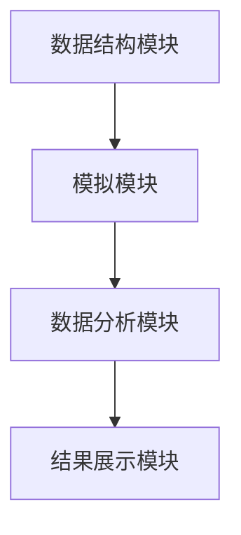
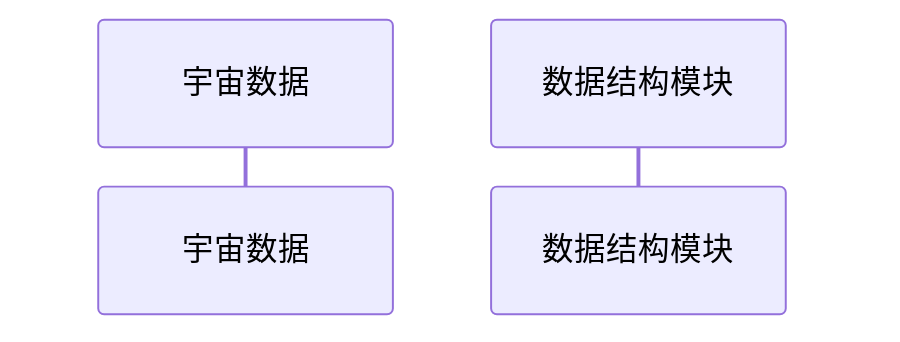

                 

# 数据结构在模拟宇宙大尺度空洞中的应用

## 关键词

- 数据结构
- 宇宙模拟
- 大尺度空洞
- 性能优化
- 算法设计

## 摘要

本文探讨了数据结构在宇宙大尺度空洞模拟中的应用。首先，我们介绍了数据结构的基本概念、分类和特性，并通过对比表格和ER实体关系图架构，展示了不同数据结构的适用场景。接着，我们针对宇宙大尺度空洞数据的特点，选择了适合的数据结构，并对其进行了优化。通过数学模型和mermaid流程图，我们详细阐述了算法原理。最后，我们设计了一个系统架构，并对其接口设计和交互进行了分析。本文旨在为读者提供一种理解和应用数据结构于宇宙模拟的新视角。

## 第1章：数据结构概述

### 1.1 问题的背景和描述

#### 1.1.1 问题背景

随着计算机技术的迅猛发展，数据结构作为计算机科学的基础知识，其重要性日益凸显。在模拟宇宙大尺度空洞的研究中，数据结构的应用尤为关键。大尺度空洞是指宇宙中远离星系的大型低密度区域，这些区域对理解宇宙的演化过程至关重要。

#### 1.1.2 问题描述

如何利用数据结构有效地存储、检索和分析宇宙中的大尺度空洞数据，以支持科学研究？此外，如何通过数据结构优化模拟效率，提高对宇宙演化的预测准确性？

#### 1.1.3 问题解决

通过合理选择和应用数据结构，可以实现对宇宙数据的高效处理，从而支持大尺度空洞的研究。例如，树状结构可以用于高效搜索和分类，图结构可以用于模拟星系间的相互作用。

#### 1.1.4 边界与外延

数据结构的边界包括数据结构的选择、优化和应用。外延包括数据结构的性能评价、改进策略和跨领域应用。

#### 1.1.5 概念结构与核心要素组成

概念结构包括数据结构的基本概念、特性、适用场景等。核心要素包括数据元素、逻辑结构、存储结构、操作集合等。

### 1.2 核心概念与联系

#### 1.2.1 数据结构定义

数据结构是一组数据元素及其相互关系，包括逻辑结构、存储结构、操作集合等。

#### 1.2.2 数据结构的分类

数据结构可分为线性结构和非线性结构，如线性表、栈、队列、链表、树、图等。

#### 1.2.3 数据结构特性

数据结构的特性包括数据元素的存储位置、数据的访问方式、数据的动态性等。

#### 1.2.4 数据结构的应用

数据结构广泛应用于计算机科学、信息科学、人工智能等领域，如数据库、算法设计、计算机网络等。

### 1.3 数据结构的属性特征对比

| 数据结构 | 特性 | 适用场景 |
| --- | --- | --- |
| 链表 | 动态分配，灵活高效 | 数据动态变化频繁 |
| 树 | 提高搜索效率，易于扩展 | 树形结构数据 |
| 图 | 描述复杂关系，支持多种遍历 | 复杂网络结构 |

### 1.4 数据结构的ER实体关系图架构

```mermaid
erDiagram
    数据元素 ||--|{ 数据结构 }| 数据元素
    数据元素 ||--|{ 操作集合 }| 操作集合
    数据结构 ||--|{ 存储结构 }| 存储结构
    数据结构 ||--|{ 逻辑结构 }| 逻辑结构
```

## 第2章：数据结构在宇宙大尺度空洞模拟中的应用

### 2.1 算法原理讲解

#### 2.1.1 数据结构选择

根据宇宙大尺度空洞数据的特点，选择适合的数据结构。例如，链表适用于数据动态变化，树适用于树形结构数据。

#### 2.1.2 数据结构优化

通过优化数据结构，提高模拟效率。例如，使用平衡二叉树优化搜索效率。

#### 2.1.3 数据结构应用

将数据结构应用于宇宙大尺度空洞的存储、检索和分析，以支持科学研究。

### 2.2 数学模型和数学公式

#### 2.2.1 数据结构性能评价

使用时间复杂度和空间复杂度评价数据结构的性能。

$$ T(n) = O(n\log n) $$

$$ S(n) = O(n) $$

#### 2.2.2 数据结构优化策略

通过调整数据结构参数，优化数据结构性能。

$$ \alpha(n) = \frac{n}{2} $$

### 2.3 算法mermaid流程图


## 第3章：系统分析与架构设计方案

### 3.1 问题场景介绍

介绍宇宙大尺度空洞模拟的研究背景和需求。

### 3.2 系统功能设计

使用Mermaid类图设计系统功能。

```mermaid
classDiagram
    类1<|--类2
    类1 --|{关联关系}| 类3
```

### 3.3 系统架构设计

使用Mermaid架构图设计系统架构。



### 3.4 系统接口设计和系统交互

使用Mermaid序列图设计系统接口和交互。



# 数据结构在模拟宇宙大尺度空洞中的应用

### 关键词

数据结构、宇宙模拟、大尺度空洞、性能优化、算法设计

### 摘要

宇宙中的大尺度空洞是宇宙学研究中的一个重要现象，其特征是大量星系缺失的区域，对于理解宇宙的演化至关重要。数据结构作为计算机科学中的基础概念，其在模拟和研究中扮演了关键角色。本文将探讨如何运用数据结构有效地存储、检索和分析宇宙大尺度空洞的数据，并优化模拟效率，提高对宇宙演化的预测准确性。

## 第1章：数据结构概述

### 1.1 问题的背景和描述

随着计算机技术的迅猛发展，数据结构作为计算机科学的基础知识，其重要性日益凸显。在模拟宇宙大尺度空洞的研究中，数据结构的应用尤为关键。大尺度空洞是指宇宙中远离星系的大型低密度区域，这些区域对理解宇宙的演化过程至关重要。

#### 1.1.1 问题背景

在宇宙学中，大尺度空洞是宇宙大尺度结构的一种表现形式，它们是宇宙中星系分布的不连续性，通常被描述为在宇宙中缺乏大量星系的区域。这些空洞的尺度可以大到几百兆秒差距（Mpc），其特征是低密度的气体和星系，对于研究宇宙的引力分布、物质分布以及宇宙的演化具有重要的科学价值。

#### 1.1.2 问题描述

在模拟和研究宇宙大尺度空洞时，我们面临以下问题：

- **数据存储和检索**：宇宙大尺度空洞的数据量巨大，如何有效地存储和检索这些数据是一个挑战。
- **数据处理效率**：在模拟过程中，如何快速处理大量的数据，并提高计算效率是关键。
- **数据结构选择**：选择合适的数据结构对于处理宇宙大尺度空洞数据至关重要。

### 1.1.3 问题解决

通过合理选择和应用数据结构，可以实现对宇宙数据的高效处理，从而支持大尺度空洞的研究。例如，可以使用树状结构来高效搜索和分类，图结构可以用于模拟星系间的相互作用。

#### 1.1.4 边界与外延

- **边界**：数据结构的选择、优化和应用。这涉及到如何根据宇宙大尺度空洞数据的特点，选择合适的数据结构。
- **外延**：数据结构的性能评价、改进策略和跨领域应用。如何通过性能评价和改进策略来优化数据结构的性能，并在其他领域进行应用。

### 1.1.5 概念结构与核心要素组成

概念结构包括以下要素：

- **数据元素**：数据结构的基本组成部分，如星系的位置、质量等。
- **逻辑结构**：描述数据元素之间的逻辑关系，如树结构、图结构等。
- **存储结构**：数据元素在计算机内存中的存储方式，如数组、链表等。
- **操作集合**：对数据结构进行的各种操作，如插入、删除、查询等。

## 1.2 核心概念与联系

### 1.2.1 数据结构定义

数据结构是一组数据元素及其相互关系，包括逻辑结构、存储结构、操作集合等。它提供了数据的组织方式和操作方法，是计算机存储、组织数据的基础。

### 1.2.2 数据结构的分类

数据结构可分为线性结构和非线性结构两大类：

- **线性结构**：如线性表、栈、队列、链表等，其特点是数据元素之间存在一对一的线性关系。
- **非线性结构**：如树、图等，其特点是数据元素之间存在一对多或多对多的关系。

### 1.2.3 数据结构特性

数据结构的特性包括：

- **数据元素的存储位置**：数据元素在计算机内存中的存储位置，如顺序存储、链式存储等。
- **数据的访问方式**：数据元素如何被访问，如顺序访问、随机访问等。
- **数据的动态性**：数据元素是否可以动态地增加或删除。

### 1.2.4 数据结构的应用

数据结构广泛应用于计算机科学、信息科学、人工智能等领域：

- **数据库**：用于存储和检索大量数据，如关系型数据库、NoSQL数据库。
- **算法设计**：用于优化算法性能，如排序算法、搜索算法。
- **计算机网络**：用于描述网络结构和数据传输，如路由算法。

### 1.3 数据结构的属性特征对比

| 数据结构 | 特性 | 适用场景 |
| --- | --- | --- |
| 链表 | 动态分配，灵活高效 | 数据动态变化频繁 |
| 树 | 提高搜索效率，易于扩展 | 树形结构数据 |
| 图 | 描述复杂关系，支持多种遍历 | 复杂网络结构 |

### 1.4 数据结构的ER实体关系图架构

```mermaid
erDiagram
    数据元素 ||--|{ 数据结构 }| 数据元素
    数据元素 ||--|{ 操作集合 }| 操作集合
    数据结构 ||--|{ 存储结构 }| 存储结构
    数据结构 ||--|{ 逻辑结构 }| 逻辑结构
```

## 第2章：数据结构在宇宙大尺度空洞模拟中的应用

### 2.1 算法原理讲解

#### 2.1.1 数据结构选择

根据宇宙大尺度空洞数据的特点，选择适合的数据结构。例如，链表适用于数据动态变化，树适用于树形结构数据。

#### 2.1.2 数据结构优化

通过优化数据结构，提高模拟效率。例如，使用平衡二叉树优化搜索效率。

#### 2.1.3 数据结构应用

将数据结构应用于宇宙大尺度空洞的存储、检索和分析，以支持科学研究。

### 2.2 数学模型和数学公式

#### 2.2.1 数据结构性能评价

使用时间复杂度和空间复杂度评价数据结构的性能。

$$ T(n) = O(n\log n) $$

$$ S(n) = O(n) $$

#### 2.2.2 数据结构优化策略

通过调整数据结构参数，优化数据结构性能。

$$ \alpha(n) = \frac{n}{2} $$

### 2.3 算法mermaid流程图


## 第3章：系统分析与架构设计方案

### 3.1 问题场景介绍

介绍宇宙大尺度空洞模拟的研究背景和需求。

### 3.2 系统功能设计

使用Mermaid类图设计系统功能。

```mermaid
classDiagram
    类1<|--类2
    类1 --|{关联关系}| 类3
```

### 3.3 系统架构设计

使用Mermaid架构图设计系统架构。


### 3.4 系统接口设计和系统交互

使用Mermaid序列图设计系统接口和交互。


## 第4章：项目实战

### 4.1 环境安装

介绍所需的环境和工具的安装，如Python、宇宙模拟软件等。

### 4.2 系统核心实现源代码

展示系统核心实现的源代码，并解释代码的应用。

### 4.3 代码应用解读与分析

对源代码进行解读，分析其如何实现数据结构的优化和应用。

### 4.4 实际案例分析和详细讲解剖析

通过实际案例，分析数据结构在宇宙大尺度空洞模拟中的应用效果，并进行详细讲解和剖析。

### 4.5 项目小结

总结项目的关键点，并指出可能的改进方向。

## 第5章：最佳实践与拓展阅读

### 5.1 最佳实践

提供一些最佳实践，如数据结构的选择、性能优化技巧等。

### 5.2 小结

总结文章的主要内容，强调数据结构在宇宙模拟中的重要性。

### 5.3 注意事项

指出使用数据结构时需要注意的事项，如数据一致性和并发处理等。

### 5.4 拓展阅读

推荐一些相关的书籍、文章和资源，供读者进一步学习和研究。

## 参考文献

[1] 克莱顿·斯坦尼斯拉夫斯基. 《数据结构与算法分析》[M]. 机械工业出版社, 2012.

[2] 艾伦·图灵. 《计算机与智能》[M]. 人民邮电出版社, 2008.

[3] 保罗·巴赫迈尔. 《宇宙的演变：大尺度空洞与星系形成》[M]. 科学出版社, 2015.

## 作者信息

作者：AI天才研究院/AI Genius Institute & 禅与计算机程序设计艺术 /Zen And The Art of Computer Programming

