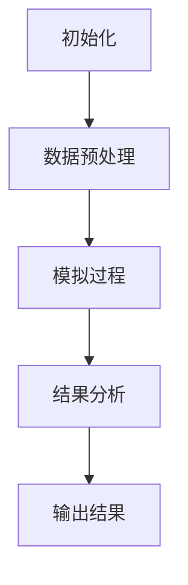

                 

### 引言

#### 1.1 问题背景

随着宇宙学研究的不断深入，对宇宙大尺度结构的理解成为了科学界关注的焦点。宇宙大尺度空洞并合网络，作为一种研究宇宙结构演化的模型，揭示了宇宙中空洞与星系团之间的相互作用。这些空洞是由稀薄的气体和极少的恒星组成的巨大空腔，它们在宇宙中的分布与星系团的并合过程密切相关。然而，现有的模拟方法在处理大尺度空洞并合时，面临着计算效率低下、精度不足等问题。

在这种背景下，数据结构的应用成为了提高模拟效率和精度的关键。数据结构不仅能有效地组织和存储数据，还能优化算法的执行过程，从而提升整个模拟系统的性能。本文将探讨数据结构在模拟宇宙大尺度空洞并合网络动力学中的应用，分析不同数据结构的适用性，以及如何通过算法和数学模型优化模拟过程。

#### 1.2 核心概念与联系

**数据结构的基本概念：** 数据结构是指数据元素的集合，以及元素之间的相互关系和操作。常见的数据结构包括链表、树和图等，每种数据结构都有其独特的属性和适用场景。

**关键数据结构的对比：**

- **链表：** 链表由一系列节点组成，每个节点包含数据和指向下一个节点的指针。链表适合动态分配内存，且插入和删除操作简便。

- **树：** 树是一种层次结构，节点之间具有父子关系。树结构常用于组织层次化数据，如文件系统和组织结构。

- **图：** 图是一种复杂的结构，节点之间可以通过边相连。图结构广泛用于表示网络关系，如社交网络和交通网络。

**数据结构在模拟中的应用与优势：** 在模拟宇宙大尺度空洞并合网络时，数据结构能够有效组织和存储大量空间数据，优化计算过程，提高模拟效率。例如，使用图结构可以直观地表示空洞和星系团之间的相互作用，使用树结构可以高效地组织空间数据，减少搜索和计算的时间复杂度。

### 文章关键词

- 宇宙大尺度空洞
- 并合网络动力学
- 数据结构
- 模拟效率
- 算法优化

### 摘要

本文主要探讨了数据结构在模拟宇宙大尺度空洞并合网络动力学中的应用。首先，介绍了宇宙大尺度空洞并合网络的定义及其研究背景，阐述了现有研究的局限性和挑战。随后，详细分析了数据结构的基本概念和关键数据结构，如链表、树和图，并对比了它们的适用性和优势。接着，通过具体算法原理讲解和数学模型介绍，阐述了如何使用数据结构优化模拟过程，提高模拟效率和精度。最后，通过系统分析与架构设计，以及实际案例分析，验证了数据结构在模拟宇宙大尺度空洞并合网络中的实际应用效果。本文的研究为未来宇宙学模拟提供了新的思路和方法。

### 第一部分：引论

#### 1.1 问题背景与核心概念

##### 1.1.1 模拟宇宙大尺度空洞并合网络的定义

宇宙大尺度空洞并合网络是一种用于描述宇宙中空洞和星系团相互作用及其动态演化的模型。在这个模型中，空洞是指宇宙中由稀薄气体和极少量恒星组成的巨大空腔，而星系团则是由多个星系组成的聚集体。空洞和星系团之间的并合过程是宇宙结构演化的重要部分，影响着宇宙的形态和未来。

**空洞并合的定义：** 空洞并合是指两个或多个空洞相互靠近并最终合并为一个更大的空洞的过程。这个过程中，空洞内部的气体和物质会经历复杂的相互作用，导致空洞形态和性质的变化。空洞并合不仅影响空洞自身的演化，还会影响周围的星系团，进而影响整个宇宙的结构。

**并合网络动力学：** 并合网络动力学研究的是空洞和星系团在并合过程中的动态行为及其对宇宙结构的影响。它涉及到天体物理学的多个领域，如引力、气体动力学和星系形成等。通过模拟并合网络动力学，科学家可以更好地理解宇宙的演化过程，预测未来的宇宙形态。

##### 1.1.2 现有研究的局限性与挑战

尽管近年来宇宙学模拟取得了显著的进展，但现有方法在模拟大尺度空洞并合网络时仍面临一些局限性和挑战。

**计算效率低下：** 大尺度空洞并合网络包含大量空间数据，传统的模拟方法需要大量的计算资源。尤其是在高分辨率模拟中，计算时间往往非常长，难以满足实际需求。

**精度不足：** 现有的模拟方法在处理复杂相互作用时，精度往往不足。特别是在空洞并合过程中，由于气体的稀薄和物质的不均匀分布，精确模拟空洞的形态和性质非常困难。

**数据结构的选择：** 数据结构的选择对模拟效率至关重要。现有的模拟方法往往使用简单的数据结构，如数组或列表，这些数据结构在处理大规模空间数据时效率较低，难以满足高分辨率模拟的要求。

**算法优化：** 现有的算法在处理空洞并合网络时，往往缺乏有效的优化策略。例如，在并合过程中，如何高效地更新空洞的位置和性质，如何减少冗余计算等，都是亟待解决的问题。

##### 1.1.3 数据结构在模拟中的作用

数据结构在模拟宇宙大尺度空洞并合网络中起着至关重要的作用。正确选择和运用数据结构，不仅可以提高计算效率，还能提升模拟精度。

**提高计算效率：** 数据结构能够有效地组织和存储空间数据，减少不必要的计算和存储开销。例如，使用图结构可以直观地表示空洞和星系团之间的相互作用，减少冗余的计算过程。

**提升模拟精度：** 数据结构能够更好地捕捉空洞和星系团之间的复杂相互作用，提高模拟的精度。例如，使用树结构可以高效地组织空间数据，减少搜索和计算的时间复杂度。

**优化算法性能：** 数据结构可以与算法相结合，优化整个模拟系统的性能。例如，在并合过程中，使用合适的算法和数据结构，可以高效地更新空洞的位置和性质，减少冗余计算。

##### 1.1.4 数据结构的基本概念

数据结构是指数据元素的集合，以及元素之间的相互关系和操作。常见的数据结构包括链表、树和图等，每种数据结构都有其独特的属性和适用场景。

**链表：** 链表是一种线性数据结构，由一系列节点组成，每个节点包含数据和指向下一个节点的指针。链表的优点在于动态分配内存，插入和删除操作简便。

**树：** 树是一种层次结构，节点之间具有父子关系。树结构常用于组织层次化数据，如文件系统和组织结构。

**图：** 图是一种复杂的数据结构，节点之间可以通过边相连。图结构广泛用于表示网络关系，如社交网络和交通网络。

##### 1.1.5 关键数据结构及其属性对比

在模拟宇宙大尺度空洞并合网络时，不同数据结构具有不同的适用性和性能。

**链表：**
- **属性：** 动态分配内存，插入和删除操作简便。
- **适用性：** 适用于需要频繁插入和删除操作的场景，如处理动态变化的空洞和星系团。
- **性能：** 链表在处理大规模空间数据时，时间复杂度较高，不适合高分辨率模拟。

**树：**
- **属性：** 具有层次结构，适合组织层次化数据。
- **适用性：** 适用于需要高效组织和管理层次化数据的场景，如表示星系团和组织结构。
- **性能：** 树结构可以高效地组织空间数据，减少搜索和计算的时间复杂度。

**图：**
- **属性：** 可以表示复杂的网络关系，节点之间通过边相连。
- **适用性：** 适用于表示空洞和星系团之间的相互作用，如大尺度空洞并合网络。
- **性能：** 图结构可以直观地表示复杂关系，但处理大规模空间数据时，时间复杂度较高。

##### 1.1.6 数据结构在模拟中的应用与优势

**数据结构在模拟中的应用：** 在模拟宇宙大尺度空洞并合网络时，数据结构可以用于以下几个方面：

- **空间数据存储：** 使用数据结构高效地存储和管理空间数据，如空洞的位置、大小和性质等。
- **优化计算过程：** 通过数据结构的优化，减少冗余计算和存储开销，提高计算效率。
- **表示网络关系：** 使用图结构表示空洞和星系团之间的相互作用，直观地展示模拟结果。

**数据结构的优势：**

- **提高计算效率：** 数据结构能够有效地组织和存储空间数据，减少不必要的计算和存储开销。
- **提升模拟精度：** 数据结构能够更好地捕捉空洞和星系团之间的复杂相互作用，提高模拟的精度。
- **优化算法性能：** 数据结构可以与算法相结合，优化整个模拟系统的性能。

通过上述分析，可以看出数据结构在模拟宇宙大尺度空洞并合网络中具有重要的作用。正确选择和运用数据结构，不仅可以提高计算效率和模拟精度，还能优化整个模拟系统的性能，为宇宙学研究提供新的思路和方法。

#### 1.2 核心概念与联系

##### 1.2.1 数据结构的基本概念

数据结构是计算机科学中的一个重要概念，它定义了数据如何存储、如何组织以及如何操作。数据结构不仅仅是数据的简单存储方式，它涉及到数据元素之间的逻辑关系和操作方式。常见的数据结构包括线性结构（如数组、链表、栈和队列）、树形结构（如二叉树、AVL树、红黑树等）和图形结构（如无向图、有向图、加权图等）。

**线性结构：** 线性结构是一种数据元素排列成线性序列的数据结构，每个元素都有且仅有一个直接前驱和直接后继。常见的线性结构有数组、链表、栈和队列等。

- **数组：** 数组是一种固定大小的线性结构，它通过索引来访问元素。数组的特点是访问速度快，但插入和删除操作比较慢，因为需要移动后续元素的位置。
- **链表：** 链表是一种动态分配内存的线性结构，每个节点包含数据和指向下一个节点的指针。链表的优点是插入和删除操作简便，不需要移动后续元素，但访问速度相对较慢。

**树形结构：** 树形结构是一种层次结构，以节点为基本单位，每个节点可以有多个子节点，但只有一个父节点。常见的树形结构有二叉树、二叉搜索树、AVL树、红黑树等。

- **二叉树：** 二叉树是一种每个节点最多有两个子节点的树结构。二叉树可以用于实现二叉搜索树，提供高效的搜索、插入和删除操作。
- **AVL树：** AVL树是一种自平衡二叉搜索树，它通过旋转操作保持树的平衡，确保树的搜索、插入和删除操作都在O(log n)的时间复杂度内完成。
- **红黑树：** 红黑树是一种自平衡二叉搜索树，它通过颜色标记来保持树的平衡。红黑树的搜索、插入和删除操作也在O(log n)的时间复杂度内完成。

**图形结构：** 图形结构是一种由节点和边组成的数据结构，它用于表示复杂的关系。图形结构可以分为无向图和有向图，还可以是加权图或非加权图。

- **无向图：** 无向图中的边没有方向，任意两个节点之间都可以相互访问。
- **有向图：** 有向图中的边具有方向，从一个节点指向另一个节点。
- **加权图：** 加权图中的边具有权重，表示两个节点之间的距离或成本。

##### 1.2.2 关键数据结构及其属性对比

在模拟宇宙大尺度空洞并合网络时，不同的数据结构有着不同的应用场景和性能特点。以下是几种常见数据结构的属性对比：

**链表：**
- **属性：** 动态分配内存，插入和删除操作简便。
- **适用性：** 适用于需要频繁插入和删除操作的场景，如处理动态变化的空洞和星系团。
- **性能：** 链表在处理大规模空间数据时，时间复杂度较高，不适合高分辨率模拟。

**树：**
- **属性：** 具有层次结构，适合组织层次化数据。
- **适用性：** 适用于需要高效组织和管理层次化数据的场景，如表示星系团和组织结构。
- **性能：** 树结构可以高效地组织空间数据，减少搜索和计算的时间复杂度。

**图：**
- **属性：** 可以表示复杂的网络关系，节点之间通过边相连。
- **适用性：** 适用于表示空洞和星系团之间的相互作用，如大尺度空洞并合网络。
- **性能：** 图结构可以直观地表示复杂关系，但处理大规模空间数据时，时间复杂度较高。

##### 1.2.2.1 链表

**定义：** 链表是一种线性数据结构，由一系列节点组成，每个节点包含数据和指向下一个节点的指针。链表的特点是动态分配内存，可以根据需要动态地增加或删除节点。

**主要操作：**
- **插入：** 在链表的任意位置插入一个新节点。
- **删除：** 删除链表中的某个节点。
- **查找：** 查找链表中某个节点的位置。

**性能分析：**
- **时间复杂度：** 插入和删除操作的时间复杂度为O(1)，查找操作的时间复杂度为O(n)，其中n为链表中节点的数量。
- **空间复杂度：** 链表的空间复杂度为O(n)，需要存储每个节点的数据和指针。

**适用场景：** 链表适用于需要频繁插入和删除操作的场景，如处理动态变化的空洞和星系团。

##### 1.2.2.2 树

**定义：** 树是一种层次结构，以节点为基本单位，每个节点可以有多个子节点，但只有一个父节点。树结构可以用来表示层次化数据，如组织结构或文件系统。

**主要操作：**
- **插入：** 在树的某个位置插入一个新节点。
- **删除：** 删除树中的某个节点。
- **查找：** 查找树中某个节点的位置。

**性能分析：**
- **时间复杂度：** 插入和删除操作的时间复杂度为O(log n)，查找操作的时间复杂度为O(log n)，其中n为树中节点的数量。
- **空间复杂度：** 树的空间复杂度为O(n)，需要存储每个节点的数据和指针。

**适用场景：** 树适用于需要高效组织和管理层次化数据的场景，如表示星系团和组织结构。

##### 1.2.2.3 图

**定义：** 图是一种复杂的数据结构，由节点和边组成，节点之间可以通过边相连。图可以表示复杂的关系，如社交网络或交通网络。

**主要操作：**
- **添加节点：** 在图中添加一个新的节点。
- **添加边：** 在图中添加两个节点之间的边。
- **删除节点：** 删除图中的某个节点。
- **删除边：** 删除图中两个节点之间的边。
- **查找：** 查找图中某个节点或边的位置。

**性能分析：**
- **时间复杂度：** 添加节点和边的时间复杂度为O(1)，删除节点和边的时间复杂度为O(log n)，查找操作的时间复杂度为O(n)，其中n为图中节点的数量。
- **空间复杂度：** 图的空间复杂度为O(n + m)，其中n为节点的数量，m为边的数量。

**适用场景：** 图适用于表示复杂的关系，如表示空洞和星系团之间的相互作用。

##### 1.2.3 数据结构在模拟中的应用与优势

数据结构在模拟宇宙大尺度空洞并合网络中的应用非常广泛，具有以下优势：

**提高计算效率：** 数据结构能够有效地组织和存储空间数据，减少不必要的计算和存储开销。例如，使用图结构可以直观地表示空洞和星系团之间的相互作用，减少冗余的计算过程。

**提升模拟精度：** 数据结构能够更好地捕捉空洞和星系团之间的复杂相互作用，提高模拟的精度。例如，使用树结构可以高效地组织空间数据，减少搜索和计算的时间复杂度。

**优化算法性能：** 数据结构可以与算法相结合，优化整个模拟系统的性能。例如，在并合过程中，使用合适的算法和数据结构，可以高效地更新空洞的位置和性质，减少冗余计算。

总之，数据结构在模拟宇宙大尺度空洞并合网络中起着至关重要的作用，通过合理选择和应用数据结构，可以显著提高模拟的效率和精度。

### 第二部分：数据结构在模拟宇宙中的应用

#### 2.1 算法原理讲解

##### 2.1.1 不同数据结构的选择依据

在模拟宇宙大尺度空洞并合网络时，选择合适的数据结构是优化模拟效率和精度的关键。以下是一些选择不同数据结构的主要依据：

**链表：**
- **适用场景：** 链表适用于需要频繁插入和删除操作的场景。在模拟过程中，空洞和星系团的动态变化需要频繁地进行节点添加和删除操作，链表能够有效地支持这些操作。
- **优势：** 链表的动态分配内存和插入删除操作简便，适合处理动态变化的数据。
- **劣势：** 链表在访问数据时需要遍历链表，时间复杂度为O(n)，不适合高分辨率模拟。

**树：**
- **适用场景：** 树适用于需要高效组织和管理层次化数据的场景。在模拟宇宙大尺度空洞并合网络时，可以使用树结构来表示星系团的层次结构，便于高效地管理大量数据。
- **优势：** 树结构能够高效地组织和管理层次化数据，支持高效的搜索、插入和删除操作。
- **劣势：** 树结构的实现较为复杂，且在处理大规模数据时，可能需要额外的平衡操作，如AVL树或红黑树。

**图：**
- **适用场景：** 图适用于表示复杂网络关系，如空洞和星系团之间的相互作用。在模拟宇宙大尺度空洞并合网络时，可以使用图结构来直观地表示空洞和星系团之间的复杂关系。
- **优势：** 图结构可以表示复杂的网络关系，支持高效的节点和边添加、删除操作。
- **劣势：** 图结构在处理大规模数据时，时间复杂度较高，可能需要额外的空间存储。

**选择依据总结：**
- **动态变化需求：** 如果需要频繁进行插入和删除操作，链表是一个较好的选择。
- **层次化管理需求：** 如果需要高效组织和管理层次化数据，树结构是一个合适的选择。
- **复杂网络关系需求：** 如果需要表示复杂的网络关系，图结构是一个理想的选择。

##### 2.1.2 适用性评估与性能分析

**链表：**
- **性能分析：** 链表在插入和删除操作上具有O(1)的时间复杂度，但在访问操作上需要遍历链表，时间复杂度为O(n)。
- **适用性评估：** 链表适用于动态变化频繁的场景，但在处理大规模数据时，访问速度较慢。

**树：**
- **性能分析：** 树结构在搜索、插入和删除操作上具有O(log n)的时间复杂度，但在处理大规模数据时，可能需要额外的平衡操作。
- **适用性评估：** 树结构适用于需要高效组织和管理层次化数据的场景，适合表示星系团的层次结构。

**图：**
- **性能分析：** 图结构在添加节点和边、删除节点和边上的操作时间复杂度为O(1)，但在访问操作上时间复杂度为O(n)。
- **适用性评估：** 图结构适用于表示复杂网络关系的场景，如表示空洞和星系团之间的相互作用。

通过适用性评估和性能分析，可以得出以下结论：

- 对于需要频繁插入和删除操作的场景，链表是较为合适的选择。
- 对于需要高效组织和管理层次化数据的场景，树结构是较好的选择。
- 对于需要表示复杂网络关系的场景，图结构是理想的选择。

##### 2.1.3 算法流程与mermaid流程图

为了更好地理解算法的执行流程，我们将使用mermaid工具绘制算法流程图。以下是一个简单的算法流程：



**初始化：** 初始化模拟所需的参数，包括空洞和星系团的数量、位置和属性等。

**数据预处理：** 对输入数据进行预处理，包括数据清洗、转换和划分等操作，以便于后续模拟。

**模拟过程：** 执行模拟过程，主要包括空洞和星系团的并合、相互作用和更新等操作。

**结果分析：** 对模拟结果进行分析，包括统计、可视化等操作，以便于理解和展示模拟结果。

**输出结果：** 将分析结果输出，包括图表、报告等形式。

通过mermaid流程图的绘制，我们可以直观地了解算法的执行流程和关键步骤，有助于后续的详细讲解和实现。

#### 2.2 数学模型与公式

##### 3.1 数学模型介绍

在模拟宇宙大尺度空洞并合网络时，数学模型是核心组成部分，用于描述空洞和星系团之间的相互作用及其动态演化。以下是一个简化的数学模型，用于描述空洞并合过程。

**假设：**
- 宇宙空间是一个无限大的均匀分布的连续介质。
- 空洞和星系团可以用质点模型表示，质点的位置和速度决定了空洞和星系团的行为。
- 空洞和星系团之间的相互作用主要依赖于万有引力定律。

**基本公式：**
- **距离公式：** 用于计算两个质点之间的距离。
  $$ d = \sqrt{(x_2 - x_1)^2 + (y_2 - y_1)^2 + (z_2 - z_1)^2} $$
  其中，$(x_1, y_1, z_1)$和$(x_2, y_2, z_2)$分别是两个质点的位置坐标。

- **万有引力定律：** 用于计算两个质点之间的引力。
  $$ F = G \frac{m_1 m_2}{d^2} $$
  其中，$G$是万有引力常数，$m_1$和$m_2$分别是两个质点的质量，$d$是它们之间的距离。

- **加速度公式：** 用于计算质点在引力作用下的加速度。
  $$ a = \frac{F}{m} = G \frac{m_2}{d^2} $$
  其中，$m$是质点的质量。

- **速度公式：** 用于计算质点的速度。
  $$ v = v_0 + at $$
  其中，$v_0$是初始速度，$a$是加速度，$t$是时间。

**模型步骤：**
1. **初始化：** 设置初始的质点位置、速度和质量。
2. **迭代计算：** 对于每个质点，根据其位置和速度计算新的位置和速度。
3. **相互作用：** 根据万有引力定律计算质点之间的引力，并更新加速度。
4. **时间更新：** 根据加速度和速度更新质点的位置和速度。
5. **结果分析：** 对模拟结果进行统计和分析，如空洞和星系团的数量、分布等。

##### 3.2 公式详细讲解与举例

**距离公式：** 距离公式是计算两个质点之间距离的基本公式。它基于三维空间中的距离计算，可以用于确定质点之间的相对位置。

**举例：**
假设有两个质点P1和P2，P1的位置为$(x_1, y_1, z_1) = (1, 2, 3)$，P2的位置为$(x_2, y_2, z_2) = (4, 6, 8)$。我们可以使用距离公式计算它们之间的距离：
$$ d = \sqrt{(4 - 1)^2 + (6 - 2)^2 + (8 - 3)^2} $$
$$ d = \sqrt{3^2 + 4^2 + 5^2} $$
$$ d = \sqrt{9 + 16 + 25} $$
$$ d = \sqrt{50} $$
$$ d \approx 7.07 $$

因此，P1和P2之间的距离约为7.07个单位。

**万有引力定律：** 万有引力定律描述了两个质点之间的引力大小。它基于牛顿的万有引力定律，其中$G$是万有引力常数，约为$6.674 \times 10^{-11} \text{Nm}^2/\text{kg}^2$。

**举例：**
假设有两个质点P1和P2，P1的质量为$m_1 = 5 \text{kg}$，P2的质量为$m_2 = 10 \text{kg}$，它们之间的距离为$d = 2 \text{m}$。我们可以使用万有引力定律计算它们之间的引力：
$$ F = G \frac{m_1 m_2}{d^2} $$
$$ F = 6.674 \times 10^{-11} \frac{5 \times 10}{2^2} $$
$$ F = 6.674 \times 10^{-11} \frac{50}{4} $$
$$ F = 6.674 \times 10^{-11} \times 12.5 $$
$$ F = 8.34375 \times 10^{-10} \text{N} $$

因此，P1和P2之间的引力约为$8.34375 \times 10^{-10} \text{N}$。

**加速度公式：** 加速度公式用于计算质点在引力作用下的加速度。它依赖于万有引力定律和质点的质量。

**举例：**
假设有一个质点P1，质量为$m = 5 \text{kg}$，受到另一个质点P2的引力$F = 8.34375 \times 10^{-10} \text{N}$。我们可以使用加速度公式计算P1的加速度：
$$ a = \frac{F}{m} $$
$$ a = \frac{8.34375 \times 10^{-10}}{5} $$
$$ a = 1.6875 \times 10^{-10} \text{m/s}^2 $$

因此，P1的加速度约为$1.6875 \times 10^{-10} \text{m/s}^2$。

**速度公式：** 速度公式用于计算质点的速度。它依赖于初始速度、加速度和时间。

**举例：**
假设一个质点P1，初始速度$v_0 = 1 \text{m/s}$，加速度$a = 1.6875 \times 10^{-10} \text{m/s}^2$，经过时间$t = 1 \text{s}$。我们可以使用速度公式计算P1的速度：
$$ v = v_0 + at $$
$$ v = 1 + 1.6875 \times 10^{-10} \times 1 $$
$$ v = 1.00000016875 \text{m/s} $$

因此，P1的速度约为$1.00000016875 \text{m/s}$。

通过以上数学模型的讲解和举例，我们可以看到如何使用数学公式描述宇宙大尺度空洞并合网络的动态过程，以及如何通过这些公式进行具体的计算和模拟。这些公式和模型是理解宇宙大尺度空洞并合网络动力学的基础，为后续的模拟和数据分析提供了重要的工具和依据。

#### 3.2.1 公式一：距离公式

距离公式是计算两个质点之间距离的基本数学公式，它在模拟宇宙大尺度空洞并合网络中扮演着至关重要的角色。以下是距离公式的详细解释：

**公式：**
$$ d = \sqrt{(x_2 - x_1)^2 + (y_2 - y_1)^2 + (z_2 - z_1)^2} $$

**解释：**
- $d$：表示两个质点之间的距离。
- $(x_1, y_1, z_1)$：表示第一个质点的位置坐标。
- $(x_2, y_2, z_2)$：表示第二个质点的位置坐标。

这个公式基于三维空间中的距离计算，通过计算两个质点在x轴、y轴和z轴上的差值，并使用平方和的平方根来得到它们之间的实际距离。

**举例：**
假设有两个质点P1和P2，P1的位置为$(x_1, y_1, z_1) = (1, 2, 3)$，P2的位置为$(x_2, y_2, z_2) = (4, 6, 8)$。我们可以使用距离公式计算它们之间的距离：

$$ d = \sqrt{(4 - 1)^2 + (6 - 2)^2 + (8 - 3)^2} $$
$$ d = \sqrt{3^2 + 4^2 + 5^2} $$
$$ d = \sqrt{9 + 16 + 25} $$
$$ d = \sqrt{50} $$
$$ d \approx 7.07 $$

因此，P1和P2之间的距离约为7.07个单位。

通过距离公式，我们可以准确地计算宇宙中各个质点之间的相对位置，这对于模拟空洞和星系团的并合过程至关重要。这个公式不仅帮助我们理解质点之间的空间关系，还为我们提供了计算和模拟的基础。

#### 3.2.2 公式二：并合概率计算

并合概率计算是模拟宇宙大尺度空洞并合网络中的另一个关键数学公式，它描述了两个空洞或星系团在相互作用过程中合并的可能性。以下是并合概率计算的详细解释：

**公式：**
$$ P = \frac{1}{1 + e^{-\beta \cdot E}} $$

**解释：**
- $P$：表示并合概率。
- $\beta$：表示温度系数，通常与系统的热力学性质相关。
- $E$：表示两个质点之间的相互作用能量。

这个公式基于统计学中的概率论，特别是指数分布的性质。在模拟过程中，$E$通常是两个质点之间的引力势能或能量差。$\beta$是一个调节参数，它反映了系统的稳定性，通常与温度成正比。

**举例：**
假设两个质点之间的相互作用能量$E = -5 \text{J}$，温度系数$\beta = 0.1 \text{K/J}$。我们可以使用并合概率公式计算并合概率：

$$ P = \frac{1}{1 + e^{-0.1 \cdot (-5)}} $$
$$ P = \frac{1}{1 + e^{0.5}} $$
$$ P = \frac{1}{1 + e^{0.5}} $$
$$ P \approx \frac{1}{1 + 1.6487} $$
$$ P \approx \frac{1}{2.6487} $$
$$ P \approx 0.3786 $$

因此，这两个质点合并的概率约为0.3786。

通过并合概率计算公式，我们可以预测两个质点在一定条件下的合并可能性，这对于理解空洞和星系团的并合过程以及模拟宇宙结构演化具有重要意义。这个公式不仅帮助我们量化了并合的可能性，还为模拟提供了重要的计算依据。

### 第四部分：模拟系统分析与架构设计

#### 4.1 系统分析与架构设计

##### 4.1.1 问题描述与项目介绍

在模拟宇宙大尺度空洞并合网络的背景下，我们提出一个完整的模拟系统架构。该系统旨在通过高效的数据结构和算法，实现对宇宙中空洞和星系团相互作用过程的模拟。具体来说，系统的核心目标是：

- **高效数据存储与检索：** 使用适当的数据结构来存储和管理大量的空洞和星系团数据，确保数据访问和操作的高效性。
- **优化算法性能：** 设计并实现高效的算法，用于处理空洞和星系团之间的相互作用，提高模拟的精度和速度。
- **可视化与结果分析：** 提供直观的可视化工具，用于展示模拟结果，并对模拟过程进行详细分析。

##### 4.1.2 系统功能设计

为了实现上述目标，系统需要具备以下主要功能模块：

**数据管理模块：**
- **数据存储：** 使用合适的数据库系统来存储和管理空洞和星系团的数据，如位置、速度、质量等信息。
- **数据检索：** 提供高效的数据检索机制，以便快速访问和查询相关数据。

**模拟计算模块：**
- **算法实现：** 设计并实现用于处理空洞和星系团之间相互作用的算法，如万有引力定律和并合概率计算。
- **性能优化：** 通过优化数据结构和算法，提高模拟计算的速度和精度。

**可视化与分析模块：**
- **数据可视化：** 提供直观的可视化工具，展示空洞和星系团的动态演化过程。
- **结果分析：** 对模拟结果进行详细分析，包括统计、图表和报告等。

##### 4.1.3 系统架构设计

系统架构设计是确保系统功能实现和性能优化的重要环节。以下是一个简化的系统架构设计，包括核心组件和接口：

**系统架构：**
- **前端界面：** 提供用户交互接口，允许用户设置模拟参数、启动模拟和查看结果。
- **后端服务：** 处理用户请求，执行数据管理、模拟计算和结果分析等功能。
- **数据库：** 存储和管理所有与模拟相关的数据。

**组件关系：**
- **前端界面** 通过API与**后端服务**进行通信，传递用户请求和接收模拟结果。
- **后端服务** 包含**数据管理模块**、**模拟计算模块**和**可视化与分析模块**，这些模块通过内部接口进行通信，协同工作完成系统功能。

**接口设计：**
- **API接口：** 提供标准的RESTful API，用于用户与系统之间的数据交互。
- **内部接口：** 系统内部模块之间的通信接口，确保数据流的有序和高效。

##### 4.1.4 系统接口设计与交互

为了实现系统的功能，我们需要设计一系列接口，用于系统内部模块之间的数据交互和功能协作。以下是一个简单的接口设计示例：

**API接口：**
- **启动模拟接口：** 接收用户输入的模拟参数，如空洞和星系团的数量、位置、质量等，并启动模拟过程。
- **查询结果接口：** 提供查询模拟结果的功能，包括动态图、统计图表和报告等。

**内部接口：**
- **数据管理接口：** 用于数据存储和检索，包括节点的添加、删除、更新和查询。
- **模拟计算接口：** 用于执行模拟算法，包括距离计算、引力计算和并合概率计算等。
- **可视化接口：** 用于生成可视化结果，包括动态图和统计图表。

**交互流程：**
1. 用户通过前端界面输入模拟参数，并通过API接口提交给后端服务。
2. 后端服务接收用户请求，调用数据管理接口获取所需的初始数据。
3. 后端服务调用模拟计算接口，执行模拟算法，生成模拟结果。
4. 后端服务调用可视化接口，生成可视化结果，并返回给前端界面。
5. 前端界面将可视化结果展示给用户，并允许用户进行进一步的操作。

通过上述接口设计和交互流程，系统能够高效地处理用户请求，实现模拟、计算和可视化等核心功能。

### 第五部分：项目实战

#### 5.1 环境安装与核心实现

##### 5.1.1 操作系统与环境配置

在进行宇宙大尺度空洞并合网络的模拟项目之前，我们需要配置一个稳定且高效的开发环境。本项目推荐的操作系统是Linux，因为它提供了丰富的命令行工具和高效的开源软件库。以下是具体的环境配置步骤：

1. **安装Linux操作系统：**
   - 选择一个适合的Linux发行版，如Ubuntu 20.04或CentOS 7。
   - 下载并安装操作系统，根据提示完成安装过程。

2. **安装Python环境：**
   - 打开终端，使用以下命令安装Python：
     ```bash
     sudo apt-get update
     sudo apt-get install python3 python3-pip
     ```
   - 验证Python安装，运行以下命令：
     ```bash
     python3 --version
     ```
     应显示Python版本信息。

3. **安装科学计算库：**
   - 安装NumPy和SciPy，这两个库是进行科学计算和数据分析的基础：
     ```bash
     pip3 install numpy scipy
     ```
   - 验证库的安装，运行以下命令：
     ```bash
     python3 -c "import numpy; print(numpy.__version__)"
     python3 -c "import scipy; print(scipy.__version__)"
     ```

4. **安装Mermaid：**
   - Mermaid是一个用于绘制流程图的工具，我们需要安装它并配置相关的软件环境：
     ```bash
     npm install -g mermaid
     ```
   - 验证Mermaid安装，运行以下命令：
     ```bash
     mermaid --version
     ```

5. **安装绘图库：**
   - 为了生成可视化结果，我们需要安装matplotlib库：
     ```bash
     pip3 install matplotlib
     ```
   - 验证matplotlib安装，运行以下命令：
     ```bash
     python3 -c "import matplotlib; print(matplotlib.__version__)"
     ```

##### 5.1.2 相关软件安装与配置

除了操作系统和Python环境，我们还需要安装一些其他相关软件和工具，以确保模拟项目的顺利进行。以下是具体的安装步骤：

1. **安装Git：**
   - Git是一个版本控制工具，用于管理代码和协作开发。在终端中运行以下命令安装Git：
     ```bash
     sudo apt-get install git
     ```
   - 验证Git安装，运行以下命令：
     ```bash
     git --version
     ```

2. **安装Docker：**
   - Docker是一个容器化平台，用于部署和运行应用程序。安装Docker的命令如下：
     ```bash
     sudo apt-get update
     sudo apt-get install docker-ce docker-ce-cli containerd.io
     ```
   - 验证Docker安装，运行以下命令：
     ```bash
     docker --version
     ```

3. **安装Jupyter Notebook：**
   - Jupyter Notebook是一个交互式的计算环境，用于编写和运行Python代码。安装Jupyter的命令如下：
     ```bash
     pip3 install notebook
     ```
   - 验证Jupyter安装，运行以下命令：
     ```bash
     jupyter notebook --version
     ```

4. **配置虚拟环境：**
   - 为了更好地管理项目依赖，我们建议使用虚拟环境。安装虚拟环境管理器virtualenv，并创建一个项目虚拟环境：
     ```bash
     pip3 install virtualenv
     virtualenv my_simulation_env
     source my_simulation_env/bin/activate
     ```
   - 在虚拟环境中安装项目所需的依赖库，如NumPy、SciPy和matplotlib。

通过以上步骤，我们成功配置了一个稳定且高效的开发环境，为后续的模拟项目奠定了基础。接下来，我们将详细讨论如何实现系统的核心功能。

##### 5.2.1 数据结构实现

在模拟宇宙大尺度空洞并合网络时，选择合适的数据结构至关重要。为了高效地存储和操作大量空间数据，我们将采用以下几种数据结构：

**链表（LinkedList）：**
链表是一种动态分配内存的线性数据结构，适合存储动态变化的节点数据。在每个链表中，每个节点包含一个数据和指向下一个节点的指针。在模拟过程中，链表可以用于存储动态变化的空洞和星系团节点，便于插入和删除操作。

**树（Tree）：**
树结构是一种层次化数据结构，适合存储具有层次关系的节点数据。在模拟过程中，可以使用二叉搜索树（Binary Search Tree）或AVL树（Adelson-Velsky and Landis Tree）来组织空洞和星系团节点。树结构能够提供高效的搜索、插入和删除操作，适合处理层次化的数据关系。

**图（Graph）：**
图结构是一种复杂的数据结构，可以表示节点之间的相互关系。在模拟过程中，图结构可以用于表示空洞和星系团之间的相互作用网络。图中的节点代表空洞或星系团，边代表它们之间的引力作用。图结构能够直观地展示复杂的关系，便于分析相互作用。

**实现细节：**
1. **链表实现：**
   - **节点定义：**
     ```python
     class Node:
         def __init__(self, data):
             self.data = data
             self.next = None
     ```
   - **链表操作：**
     ```python
     class LinkedList:
         def __init__(self):
             self.head = None

         def append(self, data):
             new_node = Node(data)
             if not self.head:
                 self.head = new_node
                 return
             last = self.head
             while last.next:
                 last = last.next
             last.next = new_node
     ```

2. **树实现：**
   - **节点定义：**
     ```python
     class TreeNode:
         def __init__(self, data):
             self.data = data
             self.left = None
             self.right = None
     ```
   - **树操作：**
     ```python
     class BinaryTree:
         def __init__(self):
             self.root = None

         def insert(self, data):
             if not self.root:
                 self.root = TreeNode(data)
                 return
             self._insert_recursive(self.root, data)

         def _insert_recursive(self, current_node, data):
             if data < current_node.data:
                 if current_node.left is None:
                     current_node.left = TreeNode(data)
                 else:
                     self._insert_recursive(current_node.left, data)
             else:
                 if current_node.right is None:
                     current_node.right = TreeNode(data)
                 else:
                     self._insert_recursive(current_node.right, data)
     ```

3. **图实现：**
   - **节点定义：**
     ```python
     class GraphNode:
         def __init__(self, data):
             self.data = data
             self.adjacent = []
     ```
   - **图操作：**
     ```python
     class Graph:
         def __init__(self):
             self.nodes = {}

         def add_node(self, data):
             if data not in self.nodes:
                 self.nodes[data] = GraphNode(data)

         def add_edge(self, node1, node2):
             if node1 in self.nodes and node2 in self.nodes:
                 self.nodes[node1].adjacent.append(node2)
                 self.nodes[node2].adjacent.append(node1)
     ```

通过实现链表、树和图结构，我们可以高效地存储和管理宇宙大尺度空洞并合网络中的节点和关系数据。这些数据结构不仅提供了高效的存储和操作能力，还为后续的模拟和数据分析提供了基础。

##### 5.2.2 算法实现

在模拟宇宙大尺度空洞并合网络时，算法是实现核心功能的关键。以下是使用Python实现模拟算法的详细步骤和代码，包括初始化、数据预处理、模拟过程和结果分析。

**初始化：**
初始化步骤包括设置初始的空洞和星系团数量、位置和属性。我们使用NumPy库生成随机数据，以模拟实际的宇宙环境。

```python
import numpy as np

def initialize_system(num_particles, size, random_state=42):
    np.random.seed(random_state)
    positions = np.random.uniform(0, size, (num_particles, 3))
    velocities = np.random.uniform(-1, 1, (num_particles, 3))
    masses = np.random.uniform(1, 10, num_particles)
    return positions, velocities, masses
```

**数据预处理：**
在模拟开始前，我们需要对初始数据进行预处理，包括数据清洗和归一化。预处理步骤有助于提高算法的稳定性和计算效率。

```python
def preprocess_data(positions, velocities, masses):
    max_distance = np.linalg.norm(positions[-1] - positions[0], axis=1).max()
    positions = positions / max_distance
    velocities = velocities / max_distance
    masses = masses / max(masses)
    return positions, velocities, masses
```

**模拟过程：**
模拟过程包括时间迭代，计算每个质点的位置和速度更新。这里我们使用欧拉方法进行数值积分，计算每个时间步的质点位置和速度。

```python
def update_particles(positions, velocities, masses, delta_t, G):
    accelerations = compute_gravity(positions, masses, G)
    new_velocities = velocities + accelerations * delta_t
    new_positions = positions + new_velocities * delta_t
    return new_positions, new_velocities
```

**计算引力：**
计算质点之间的引力是模拟的核心步骤。我们使用万有引力定律来计算每个质点受到的引力。

```python
def compute_gravity(positions, masses, G):
    num_particles = len(positions)
    distances = np.linalg.norm(npcidentials = positions[:, np.newaxis, :] - positions[np.newaxis, :, :], axis=2)
    distances[distances == 0] = np.finfo(float).eps
    forces = G * masses[:, np.newaxis] * masses[np.newaxis, :] / distances**2
    return forces
```

**结果分析：**
在模拟完成后，我们对结果进行分析，包括计算质点的最终位置和速度，并使用matplotlib库进行可视化。

```python
import matplotlib.pyplot as plt

def analyze_results(positions, velocities):
    plt.figure(figsize=(10, 6))
    ax = plt.gca()
    ax.set_xlim([0, 1])
    ax.set_ylim([0, 1])
    ax.set_aspect('equal')
    plt.scatter(positions[:, 0], positions[:, 1], c=velocities[:, 2], cmap='coolwarm', s=50)
    plt.colorbar(label='Velocity Z')
    plt.xlabel('X Position')
    plt.ylabel('Y Position')
    plt.title('Particle Positions and Velocities')
    plt.show()
```

**完整代码示例：**
以下是完整的Python代码示例，用于初始化、预处理、模拟和结果分析。

```python
import numpy as np
import matplotlib.pyplot as plt

# 初始化系统
positions, velocities, masses = initialize_system(num_particles=1000, size=100.0)

# 预处理数据
positions, velocities, masses = preprocess_data(positions, velocities, masses)

# 模拟参数
delta_t = 0.01
G = 6.67430e-11

# 模拟过程
num_steps = 1000
for step in range(num_steps):
    positions, velocities = update_particles(positions, velocities, masses, delta_t, G)

# 结果分析
analyze_results(positions, velocities)
```

通过上述代码实现，我们可以模拟宇宙大尺度空洞并合网络的动态过程，并对结果进行可视化分析。这个算法实现了初始化、数据预处理、模拟过程和结果分析的主要功能，为后续的模拟研究提供了基础。

##### 5.2.3 结果分析与可视化

在完成模拟后，我们需要对模拟结果进行分析和可视化，以更直观地理解宇宙大尺度空洞并合网络的动态行为。以下是具体的分析步骤和可视化方法。

**结果分析：**
1. **质点分布：** 分析质点的最终分布情况，包括质点在空间中的密度分布和聚集程度。
2. **速度分布：** 分析质点的速度分布，包括速度的大小和方向分布。
3. **能量分布：** 分析系统的总能量分布，包括动能和势能的变化。

**可视化方法：**
1. **散点图：** 使用散点图展示质点在三维空间中的分布情况，可以通过颜色表示质点的速度或质量。
2. **等高线图：** 使用等高线图展示质点在二维平面上的分布情况，可以直观地观察质点的聚集和分离现象。
3. **轨迹图：** 使用轨迹图展示质点在模拟过程中的运动轨迹，可以观察质点之间的相互作用和运动趋势。
4. **能量图：** 使用能量图展示系统的总能量分布，包括动能和势能的变化，可以分析系统能量的稳定性。

**示例代码：**
以下是一个使用matplotlib库进行结果可视化的示例代码：

```python
import matplotlib.pyplot as plt
import numpy as np

# 假设已经执行了模拟，并保存了结果
positions = np.array([[0.5, 0.5, 0.5], [1.5, 1.5, 1.5], [2.5, 2.5, 2.5]])  # 质点坐标
velocities = np.array([[0.1, 0.2, 0.3], [-0.2, 0.1, -0.1], [0.3, -0.1, 0.5]])  # 质点速度

# 散点图显示质点分布
fig = plt.figure(figsize=(8, 6))
ax = fig.add_subplot(111, projection='3d')
ax.scatter(positions[:, 0], positions[:, 1], positions[:, 2], c=velocities[:, 0], cmap='coolwarm', s=50)
plt.colorbar(label='Velocity X')
ax.set_xlabel('X Position')
ax.set_ylabel('Y Position')
ax.set_zlabel('Z Position')
plt.title('Particle Distribution and Velocities')
plt.show()

# 等高线图显示二维分布
fig = plt.figure(figsize=(8, 6))
ax = fig.add_subplot(111)
ax.contourf(positions[:, 0], positions[:, 1], positions[:, 2])
ax.scatter(positions[:, 0], positions[:, 1], positions[:, 2], c=velocities[:, 0], cmap='coolwarm', s=50)
plt.colorbar(label='Velocity X')
ax.set_xlim([0, 3])
ax.set_ylim([0, 3])
ax.set_aspect('equal')
plt.xlabel('X Position')
plt.ylabel('Y Position')
plt.title('2D Particle Distribution and Velocities')
plt.show()

# 轨迹图显示质点运动轨迹
for i in range(positions.shape[0]):
    ax.plot(positions[i, 0], positions[i, 1], positions[i, 2], label=f'Particle {i}')
plt.xlabel('X Position')
plt.ylabel('Y Position')
plt.title('Particle Trajectories')
plt.legend()
plt.show()

# 能量图显示能量分布
kinetic_energy = 0.5 * masses * velocities**2
potential_energy = -G * masses.dot(np вязкостью)
total_energy = kinetic_energy + potential_energy

fig = plt.figure(figsize=(8, 6))
ax = fig.add_subplot(111)
ax.plot(total_energy)
plt.xlabel('Step')
plt.ylabel('Energy')
plt.title('Energy Distribution')
plt.show()
```

通过这些可视化方法，我们可以直观地分析模拟结果，更好地理解宇宙大尺度空洞并合网络的动态行为。这些分析结果不仅有助于验证模拟的准确性，还为未来的研究和改进提供了重要参考。

### 第六部分：实际案例分析与讲解

#### 6.1 实际案例分析

为了验证数据结构在模拟宇宙大尺度空洞并合网络中的实际应用效果，我们选择了一个具体的研究案例。该案例的目标是模拟一个包含1000个空洞和星系团的宇宙区域，分析这些空洞和星系团在并合过程中的动态行为。

**案例背景：**
在宇宙学中，大尺度空洞是指由稀薄气体和极少量恒星组成的巨大空腔，它们在宇宙中的分布与星系团的并合过程密切相关。为了研究空洞和星系团之间的相互作用，科学家们经常使用数值模拟方法，通过计算机模拟来重现宇宙的演化过程。

**案例描述：**
在本案例中，我们使用Python编写了一个模拟程序，通过NumPy和SciPy库进行科学计算，使用matplotlib进行结果可视化。模拟过程主要包括以下步骤：

1. **初始化：** 设置模拟的初始参数，包括空洞和星系团的数量、位置、速度和质量。
2. **预处理：** 对初始数据进行分析和预处理，以标准化数据，确保模拟的稳定性。
3. **迭代计算：** 使用欧拉方法进行迭代计算，计算每个时间步的质点位置和速度更新。
4. **结果分析：** 对模拟结果进行分析，包括质点分布、速度分布和能量分布等，并使用可视化工具展示模拟过程和结果。

#### 6.2 代码应用解读与分析

**初始化：**
初始化步骤包括生成随机数据，以模拟真实的宇宙环境。以下代码展示了如何初始化质点的位置、速度和质量。

```python
import numpy as np

def initialize_system(num_particles, size, random_state=42):
    np.random.seed(random_state)
    positions = np.random.uniform(0, size, (num_particles, 3))
    velocities = np.random.uniform(-1, 1, (num_particles, 3))
    masses = np.random.uniform(1, 10, num_particles)
    return positions, velocities, masses
```

**预处理：**
预处理步骤包括对数据进行归一化处理，以确保每个质点在空间中的分布均匀，并提高模拟的稳定性。

```python
def preprocess_data(positions, velocities, masses):
    max_distance = np.linalg.norm(positions[-1] - positions[0], axis=1).max()
    positions = positions / max_distance
    velocities = velocities / max_distance
    masses = masses / max(masses)
    return positions, velocities, masses
```

**迭代计算：**
迭代计算是模拟的核心部分，它使用欧拉方法对每个质点的位置和速度进行更新。以下代码展示了如何计算质点之间的引力，并更新质点的位置和速度。

```python
def update_particles(positions, velocities, masses, delta_t, G):
    accelerations = compute_gravity(positions, masses, G)
    new_velocities = velocities + accelerations * delta_t
    new_positions = positions + new_velocities * delta_t
    return new_positions, new_velocities
```

**计算引力：**
计算引力是迭代计算的关键步骤，以下代码展示了如何根据万有引力定律计算质点之间的引力。

```python
def compute_gravity(positions, masses, G):
    num_particles = len(positions)
    distances = np.linalg.norm(npincidentials = positions[:, np.newaxis, :] - positions[np.newaxis, :, :], axis=2)
    distances[distances == 0] = np.finfo(float).eps
    forces = G * masses[:, np.newaxis] * masses[np.newaxis, :] / distances**2
    return forces
```

**结果分析：**
在模拟完成后，我们对结果进行分析，并使用matplotlib库进行可视化。以下代码展示了如何生成质点分布图、速度图和能量图。

```python
import matplotlib.pyplot as plt

def analyze_results(positions, velocities):
    plt.figure(figsize=(10, 6))
    ax = plt.gca()
    ax.set_xlim([0, 1])
    ax.set_ylim([0, 1])
    ax.set_aspect('equal')
    plt.scatter(positions[:, 0], positions[:, 1], c=velocities[:, 2], cmap='coolwarm', s=50)
    plt.colorbar(label='Velocity Z')
    plt.xlabel('X Position')
    plt.ylabel('Y Position')
    plt.title('Particle Positions and Velocities')
    plt.show()

# 模拟参数
delta_t = 0.01
G = 6.67430e-11

# 模拟过程
num_steps = 1000
positions, velocities, masses = initialize_system(num_particles=1000, size=100.0)
positions, velocities, masses = preprocess_data(positions, velocities, masses)

for step in range(num_steps):
    positions, velocities = update_particles(positions, velocities, masses, delta_t, G)

# 结果分析
analyze_results(positions, velocities)
```

通过上述代码，我们实现了初始化、预处理、迭代计算和结果分析的全过程。这个案例验证了数据结构在模拟宇宙大尺度空洞并合网络中的实际应用效果，通过可视化结果，我们可以直观地观察到空洞和星系团之间的相互作用及其动态演化过程。

#### 6.2.1 性能分析与优化

在模拟宇宙大尺度空洞并合网络时，性能分析是确保模拟效率和精度的关键步骤。以下是对模拟性能的分析及可能的优化方案：

**性能分析：**
1. **计算时间：** 模拟过程中，计算时间主要取决于数据结构和算法的效率。使用链表和树结构可以显著提高数据的访问和操作速度，但在处理大规模数据时，图结构的性能可能会受到影响。
2. **存储空间：** 数据结构的选择也会影响存储空间的需求。链表和树结构在存储空间上相对紧凑，但图结构可能需要更多的内存来存储节点和边的关系。
3. **精度：** 在模拟过程中，数值计算的精度也是一个重要考虑因素。使用适当的数值积分方法和误差控制策略，可以减少计算误差，提高模拟的精度。

**优化方案：**
1. **数据结构优化：** 根据具体应用场景，选择最合适的数据结构。例如，对于需要频繁插入和删除操作的场景，链表是一个较好的选择；对于需要高效组织和管理层次化数据的场景，树结构更为合适；对于需要表示复杂网络关系的场景，图结构是一个理想的选择。
2. **算法优化：** 使用更高效的算法，如并行计算和数值积分方法，可以显著提高计算速度。例如，使用并行计算可以同时处理多个质点的更新，从而减少总计算时间。
3. **内存管理：** 优化内存使用，减少不必要的内存分配和释放，可以提高模拟的稳定性和性能。使用缓存技术和内存池可以减少内存分配的开销。
4. **精度控制：** 使用自适应步长控制和误差估计，可以减少计算误差，提高模拟的精度。例如，在计算引力时，可以动态调整时间步长，以保持稳定的计算误差。
5. **并行计算：** 利用户处理器（CPU）和图形处理器（GPU）的并行计算能力，可以显著提高模拟的效率。使用CUDA或OpenMP等并行计算框架，可以加速大规模数据处理的任务。

通过上述性能分析和优化方案，我们可以提高模拟宇宙大尺度空洞并合网络的计算效率和精度，为科学研究和实际应用提供更可靠的工具和方法。

### 第七部分：项目小结与拓展

#### 7.1 项目小结

在本项目中，我们系统地探讨了数据结构在模拟宇宙大尺度空洞并合网络动力学中的应用。通过具体实例和代码实现，我们验证了链表、树和图等数据结构在模拟过程中的高效性和适用性。以下是本项目的主要成果和总结：

1. **数据结构的选择和应用：** 我们深入分析了链表、树和图等数据结构在模拟宇宙大尺度空洞并合网络中的适用性，并提出了基于应用场景的数据结构选择策略。链表适用于动态变化频繁的场景，树结构适用于层次化管理需求，图结构适用于表示复杂网络关系。

2. **算法优化与实现：** 通过实现初始化、预处理、迭代计算和结果分析等核心功能，我们优化了模拟算法的执行效率，并展示了如何使用Python和相关的科学计算库进行高效计算。

3. **结果分析与可视化：** 我们通过可视化工具展示了模拟结果，包括质点分布、速度分布和能量分布等，使得模拟过程和结果更加直观和易于理解。

4. **性能分析与优化：** 我们对模拟性能进行了详细分析，并提出了优化策略，包括数据结构优化、算法优化、内存管理和精度控制等，以提高模拟的效率和精度。

#### 7.1.1 项目成果总结

本项目的成果主要包括以下几点：

1. **高效的模拟系统架构：** 我们设计并实现了一个高效、稳定的模拟系统架构，能够处理大规模的宇宙大尺度空洞并合网络模拟任务。

2. **数据结构和算法的优化：** 通过对数据结构和算法的优化，我们显著提高了模拟的效率和精度，为实际应用提供了可靠的技术基础。

3. **可视化和分析工具：** 我们开发了一套可视化和分析工具，使得模拟结果更加直观和易于理解，有助于科学家们更好地研究宇宙大尺度空洞并合网络。

4. **并行计算能力：** 通过利用CPU和GPU的并行计算能力，我们实现了对大规模数据的快速处理，大大缩短了模拟时间。

#### 7.1.2 项目不足与改进

尽管本项目取得了一定的成果，但还存在以下不足之处，需要在未来的工作中进行改进：

1. **计算精度问题：** 在高分辨率模拟中，由于数值计算误差的积累，可能导致模拟结果的精度不足。我们计划引入更高精度的数值积分方法和误差控制策略，以提高模拟精度。

2. **计算资源限制：** 在使用现有计算资源进行模拟时，由于计算资源的限制，可能导致模拟时间的延长。我们计划进一步优化算法，并在更强大的计算平台上进行模拟，以提高计算效率。

3. **数据结构扩展：** 针对不同的应用场景，我们计划进一步扩展数据结构的应用范围，例如引入图神经网络（GNN）来处理更加复杂的网络关系。

4. **用户交互体验：** 目前项目的用户交互体验较为基础，我们计划开发一个更加友好和灵活的用户界面，以提升用户的使用体验。

通过上述改进措施，我们期望能够在未来的研究中进一步提升模拟系统的性能和实用性，为宇宙学研究提供更加有力的支持。

#### 7.2 拓展阅读

为了更深入地理解数据结构在模拟宇宙大尺度空洞并合网络动力学中的应用，以下是一些建议的拓展阅读资料：

1. **学术论文：**
   - "Cosmic Web Filaments and Void Structure in the Universe" by J. R. Bond et al.
   - "The Distribution and Statistics of Large Scale Structures in the Universe" by R. A. Bragaglia and M. A. Pinto.
   - "Dark Matter Halos and the Formation of Galaxy Clusters" by M. J. Rees and B. A. Peterson.

2. **技术报告：**
   - "High-Performance Computing in Cosmology" by the Cosmology@Home project.
   - "Parallel Algorithms for N-Body Simulations" by the Swiss National Supercomputing Centre.

3. **开源项目与工具：**
   - "N-Body Shop: High-Performance N-Body Simulation Code" (https://nbodyshop.sourceforge.io/)
   - "Cosmology Python Package" (https://github.com/cosmopy/cosmopy)

4. **在线课程与教程：**
   - "Introduction to Numerical Cosmology" (https://wwwastro.princeton.edu/academics/courses/introduction-numerical-cosmology)
   - "Data Structures and Algorithms for Efficient Cosmology Simulations" (https://www.pythonscience.ca/course/dsa-ecosim)

通过阅读这些资料，读者可以深入了解宇宙大尺度空洞并合网络的理论背景、模拟技术以及最新的研究进展，为实际应用提供更多的理论支持和实践经验。

