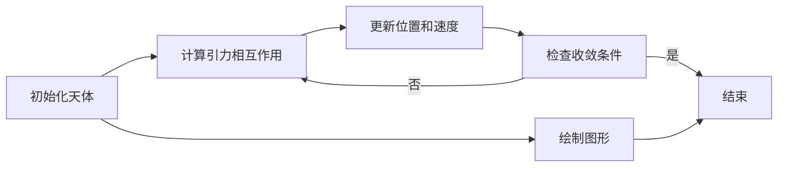
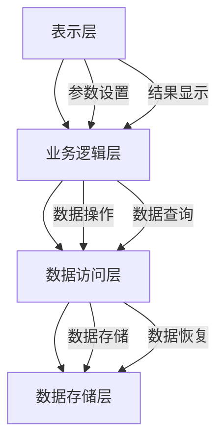
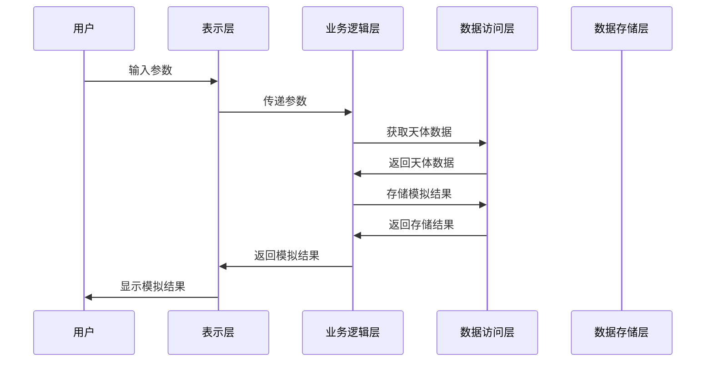

                 

### 第一部分: 问题背景

## 第1章: 引言

### 1.1.1 问题背景

随着科技的发展，我们对宇宙的认识也日益深入。宇宙大尺度结构的模拟已成为天文学和物理学的重要研究方向。通过模拟宇宙大尺度结构，我们不仅可以理解宇宙的起源和演化，还可以探索宇宙中各种现象的内在规律。然而，模拟宇宙大尺度结构面临的一个巨大挑战是如何有效地处理海量数据，这要求我们在数据结构的选择和优化上做深入的研究。

数据结构是计算机科学中一个核心概念，它涉及到数据的存储、组织和访问。选择合适的数据结构可以极大地提高数据处理效率，从而加速宇宙大尺度结构的模拟。常见的如数组、链表、树、图等数据结构，各有其优势和局限性。如何在这些数据结构中做出最优选择，如何进行数据结构的优化，是模拟宇宙大尺度结构中不可忽视的问题。

### 1.1.2 模拟宇宙大尺度结构的必要性

宇宙大尺度结构的模拟有助于我们理解宇宙的宏观行为。从星系的分布、星系团的形态，到宇宙背景辐射的测量，这些都需要大量的数据分析和模拟。模拟宇宙大尺度结构可以揭示宇宙中的大规模结构形成和演化过程，有助于我们解答一些宇宙学的基本问题，如宇宙的起源、宇宙膨胀、暗物质和暗能量的性质等。

此外，模拟宇宙大尺度结构具有重要的实际应用价值。例如，在航天工程中，我们可以通过模拟宇宙环境来设计和测试航天器；在灾难预警中，我们可以模拟自然灾害的扩散和影响范围，以提前做好应对措施。因此，模拟宇宙大尺度结构不仅是科学研究的需要，也是技术进步和社会发展的需要。

### 1.1.3 数据结构在模拟中的应用

数据结构在宇宙大尺度结构模拟中扮演着关键角色。有效的数据结构选择和优化可以显著提高模拟的效率和精度。

首先，对于宇宙中星系的分布，我们可以使用二维或三维数组来表示。这种方式简单直观，适合处理规则分布的数据。然而，对于不规则分布的数据，例如宇宙中的星系团，我们可能需要使用更为复杂的数据结构，如树或图。

其次，对于宇宙中各种物理量的测量和计算，如星系的速度、质量、引力等，我们可以使用链表或树结构来存储和管理这些数据。这样不仅能够方便地进行数据的插入和删除操作，还能够通过树结构实现高效的搜索和排序。

最后，对于宇宙大尺度结构模拟的结果，我们需要进行可视化和分析。此时，图结构能够很好地表示复杂的关系网络，如星系团之间的相互作用关系。通过图结构，我们可以直观地展示宇宙大尺度结构的演化过程，帮助研究人员更好地理解和解释模拟结果。

### 1.1.4 研究现状与挑战

目前，数据结构在宇宙大尺度结构模拟中的应用已经取得了一定的成果。例如，使用树结构进行星系团的模拟，使用图结构进行宇宙背景辐射的分析等。然而，在实际应用中仍面临诸多挑战。

首先，数据量巨大。宇宙大尺度结构模拟需要处理的海量数据对数据结构的性能提出了极高的要求。如何优化数据结构，使其能够高效地处理海量数据，是当前研究的一个重要方向。

其次，计算精度和效率的平衡。在模拟过程中，我们不仅要保证计算结果的精度，还要尽可能地提高计算效率。这要求我们在数据结构的选型和优化上做出权衡。

最后，模拟的可视化和分析。如何将复杂的模拟结果以直观的方式展示出来，帮助研究人员更好地理解和解释，是另一个亟待解决的问题。

综上所述，数据结构在模拟宇宙大尺度结构中具有重要作用。面对挑战，我们需要不断地探索和优化数据结构，以推动宇宙大尺度结构模拟技术的发展。

## 第2章: 核心概念

### 2.1 数据结构基础

数据结构是计算机科学中一个基础而重要的概念，它涉及到数据在计算机中的存储、组织和访问方式。选择合适的数据结构对于提高程序的性能和效率至关重要。本节将介绍常见的数据结构，包括数组、链表、栈与队列、树与图、哈希表等。

#### 2.1.1 数据结构概述

数据结构可以分为线性结构和非线性结构两大类。线性结构包括数组、链表、栈与队列等，其中元素之间存在一对一的关系；非线性结构包括树与图，其中元素之间存在一对多或多对多的关系。

数据结构的核心目标是高效地存储和管理数据，以便在需要时能够快速地访问和处理数据。常见的数据结构特点如下：

- **数组（Array）**：数组是一种线性结构，由固定数量的元素组成，元素存储在连续的内存地址中。数组的主要优点是访问元素速度快，支持随机访问，但插入和删除操作可能需要移动大量元素。
- **链表（Linked List）**：链表是一种动态数据结构，由节点组成，每个节点包含数据和指向下一个节点的指针。链表的主要优点是插入和删除操作灵活，但访问元素速度较慢，需要从头节点开始遍历。
- **栈与队列（Stack and Queue）**：栈和队列都是特殊的线性结构，分别遵循后进先出（LIFO）和先进先出（FIFO）的原则。栈通常用于程序中的递归调用和函数调用，而队列常用于任务调度和缓冲处理。
- **树（Tree）**：树是一种层次结构，由节点组成，每个节点可以有零个或多个子节点。树结构在许多应用中有着广泛的应用，如文件系统、组织结构图等。
- **图（Graph）**：图是一种复杂的数据结构，由节点（顶点）和边组成，节点之间可以存在多种关系。图结构在社交网络、交通网络、通信网络等领域有着重要的应用。

#### 2.1.2 常见数据结构

下面我们详细介绍每种常见数据结构的特点和应用。

##### 2.1.2.1 数组

数组是一种基础且常用的数据结构，由一系列元素组成，每个元素都有一个唯一的索引。数组的主要特点如下：

- **特点**：
  - 元素存储在连续的内存地址中。
  - 可以通过索引快速访问任意元素。
  - 插入和删除操作可能需要移动大量元素。
- **应用**：
  - 存储和查找有序数据，如排序算法中的辅助数组。
  - 表示固定大小的数据集合，如学生成绩列表。

##### 2.1.2.2 链表

链表是一种动态数据结构，由节点组成，每个节点包含数据和指向下一个节点的指针。链表的主要特点如下：

- **特点**：
  - 动态分配内存，可以根据需要扩展或收缩。
  - 插入和删除操作灵活，不需要移动其他元素。
  - 访问元素速度较慢，需要从头节点开始遍历。
- **应用**：
  - 实现动态数据集合，如实现动态大小的数组。
  - 实现各种递归算法和数据结构，如栈、队列、链表等。

##### 2.1.2.3 栈与队列

栈和队列都是特殊的线性结构，分别遵循后进先出（LIFO）和先进先出（FIFO）的原则。

- **栈**：
  - **特点**：
    - 只允许在一端进行插入和删除操作。
    - 后进先出（LIFO）。
  - **应用**：
    - 程序中的递归调用。
    - 求表达式结果。

- **队列**：
  - **特点**：
    - 只允许在一端进行插入操作，另一端进行删除操作。
    - 先进先出（FIFO）。
  - **应用**：
    - 任务调度。
    - 缓冲处理。

##### 2.1.2.4 树与图

树和图都是非线性结构，分别用于表示层次关系和复杂关系。

- **树**：
  - **特点**：
    - 有且只有一个根节点。
    - 每个节点最多有一个前驱（父节点）和多个后继（子节点）。
  - **应用**：
    - 组织结构图。
    - 文件系统。

- **图**：
  - **特点**：
    - 由节点（顶点）和边组成。
    - 没有固定的结构，可以表示复杂的网络关系。
  - **应用**：
    - 社交网络。
    - 交通网络。

##### 2.1.2.5 哈希表

哈希表是一种基于哈希函数的动态数据结构，用于快速查找和插入数据。

- **特点**：
  - 通过哈希函数将关键字映射到哈希值，快速定位数据位置。
  - 支持高效的插入、删除和查找操作。
  - 可能会发生冲突，需要处理。
- **应用**：
  - 实现快速的键值存储，如字典和集合。
  - 实现高效的数据索引。

通过了解这些常见数据结构的特点和应用，我们可以在处理宇宙大尺度结构模拟中的海量数据时，选择合适的数据结构来提高效率和性能。

#### 2.1.3 数据结构在宇宙结构模拟中的具体应用

在宇宙结构模拟中，数据结构的选择和优化对于模拟效率和结果的可信度至关重要。以下是一些具体的应用场景：

- **星系分布的表示**：使用二维或三维数组可以高效地表示星系的分布，因为数组支持快速访问和排序。然而，对于大规模星系，二维或三维数组可能存在内存限制，这时可以考虑使用链表或树结构来动态扩展。
- **物理量测量的存储**：链表或树结构适合存储和管理星系的速度、质量、引力等物理量。链表提供灵活的插入和删除操作，而树结构则支持高效的搜索和排序。
- **模拟结果的可视化**：图结构能够有效地表示宇宙大尺度结构中的复杂关系网络，如星系团之间的相互作用。通过图结构，我们可以将模拟结果以直观的方式展示出来，帮助研究人员更好地理解宇宙的演化过程。

通过以上分析，我们可以看到数据结构在宇宙结构模拟中的应用不仅能够提高效率和精度，还能够帮助我们更好地理解和解释宇宙的复杂性。

### 2.2 宇宙结构模拟中的数据结构应用

数据结构在宇宙结构模拟中的应用至关重要，其选择和优化直接影响模拟的效率和结果的可信度。以下将详细探讨几种常见数据结构在宇宙结构模拟中的应用，以及它们之间的优缺点对比。

#### 2.2.1 数据结构在模拟宇宙中的应用

1. **数组**
   - **应用场景**：数组常用于表示规则分布的星系，例如二维或三维数组可以分别表示平面和空间的星系分布。
   - **优点**：数组支持随机访问，访问速度快，适合大规模数据的存储和检索。
   - **缺点**：数组的大小是固定的，扩展性较差；插入和删除操作可能需要移动大量元素，效率较低。

2. **链表**
   - **应用场景**：链表适合表示不规则的星系分布，如星系团的形成和演化过程中出现的碎片化结构。
   - **优点**：插入和删除操作灵活，不需要移动其他元素，适合动态变化的数据。
   - **缺点**：访问元素速度较慢，需要从头节点开始遍历；链表存储了额外的指针信息，占用内存较多。

3. **树**
   - **应用场景**：树结构常用于表示层次结构的数据，如星系团中的子星系和次级结构。
   - **优点**：支持高效的搜索和排序操作，适合存储和查询层次结构数据。
   - **缺点**：插入和删除操作相对复杂，需要更新树的内部结构。

4. **图**
   - **应用场景**：图结构适合表示复杂的网络关系，如星系团之间的相互作用和引力相互作用。
   - **优点**：能够表示复杂的非层次关系，适合处理大规模网络数据。
   - **缺点**：图结构复杂，存储和查询操作较慢；可能会出现大量的边和节点，占用大量内存。

#### 2.2.2 数据结构优化对模拟结果的影响

数据结构的优化对宇宙结构模拟的结果有显著影响。以下是一些优化策略：

1. **空间优化**：通过选择合适的数据结构，减少内存占用，例如使用链表代替数组，减少不必要的指针信息。
2. **时间优化**：通过优化数据结构的访问和操作算法，提高数据处理速度。例如，使用树结构进行层次化查询，减少遍历次数。
3. **并行处理**：利用多线程或多处理器技术，并行处理海量数据，提高模拟效率。

##### 2.2.2.1 数组与链表在宇宙模拟中的对比

数组与链表是两种常见的线性数据结构，它们在宇宙模拟中有不同的应用场景和性能特点。

- **数组**：
  - **优势**：支持随机访问，访问速度快，适合大规模数据的存储和检索。适用于规则分布的星系。
  - **劣势**：大小固定，扩展性较差；插入和删除操作可能需要移动大量元素，效率较低。
- **链表**：
  - **优势**：插入和删除操作灵活，不需要移动其他元素，适合动态变化的数据。适用于不规则分布的星系。
  - **劣势**：访问元素速度较慢，需要从头节点开始遍历；链表存储了额外的指针信息，占用内存较多。

##### 2.2.2.2 树与图在宇宙模拟中的对比

树与图是两种常见的非线性数据结构，它们在宇宙模拟中也有不同的应用场景和性能特点。

- **树**：
  - **优势**：支持高效的搜索和排序操作，适合存储和查询层次结构数据。适用于表示星系团中的子星系和次级结构。
  - **劣势**：插入和删除操作相对复杂，需要更新树的内部结构。
- **图**：
  - **优势**：能够表示复杂的非层次关系，适合处理大规模网络数据。适用于表示星系团之间的相互作用和引力相互作用。
  - **劣势**：图结构复杂，存储和查询操作较慢；可能会出现大量的边和节点，占用大量内存。

通过以上对比，我们可以根据具体应用场景选择合适的数据结构，以达到最佳的模拟效果。

### 3.1 数据结构算法定义

数据结构算法是指用于创建、操作、访问和销毁数据结构的各种算法。数据结构算法的核心目标是通过高效地组织和管理数据，提高程序的运行效率和性能。以下将详细介绍几种常见的数据结构算法，包括排序算法、搜索算法和图算法。

#### 3.1.1 排序算法

排序算法是将一组数据按照某种顺序排列的算法。常见的排序算法包括：

- **冒泡排序（Bubble Sort）**：
  - **原理**：通过反复交换相邻的未按顺序排列的元素，逐渐将最大（或最小）的元素“冒泡”到数组的两端。
  - **时间复杂度**：\(O(n^2)\)
- **选择排序（Selection Sort）**：
  - **原理**：每次选择未排序部分的最小（或最大）元素，将其放到已排序部分的末尾。
  - **时间复杂度**：\(O(n^2)\)
- **插入排序（Insertion Sort）**：
  - **原理**：将未排序部分的数据插入到已排序部分的合适位置，保持整体有序。
  - **时间复杂度**：\(O(n^2)\)
- **快速排序（Quick Sort）**：
  - **原理**：通过递归将数组分成较小的子数组，然后对子数组进行排序。
  - **时间复杂度**：\(O(n\log n)\)
- **归并排序（Merge Sort）**：
  - **原理**：将数组分成多个子数组，然后递归地将子数组合并成有序的完整数组。
  - **时间复杂度**：\(O(n\log n)\)
- **堆排序（Heap Sort）**：
  - **原理**：使用堆这种特殊的数据结构，通过堆调整和堆排序算法实现排序。
  - **时间复杂度**：\(O(n\log n)\)

排序算法的选择取决于数据的初始状态和要求的性能。例如，对于几乎有序的数据，插入排序可能更为高效；而对于大数据集合，归并排序和快速排序通常具有更好的性能。

#### 3.1.2 搜索算法

搜索算法是用于在数据结构中查找特定元素或满足特定条件的算法。常见的搜索算法包括：

- **顺序搜索（Linear Search）**：
  - **原理**：从数据结构的起始位置开始，逐个比较每个元素，直到找到目标元素或到达数据结构的末尾。
  - **时间复杂度**：\(O(n)\)
- **二分搜索（Binary Search）**：
  - **原理**：在有序的数据结构中，通过不断将搜索范围缩小一半，逐步逼近目标元素。
  - **时间复杂度**：\(O(\log n)\)

搜索算法的性能也受到数据结构类型的影响。例如，在有序数组中，二分搜索具有高效的性能；而在链表中，顺序搜索可能是更合适的选择。

#### 3.1.3 图算法

图算法是用于在图结构中执行各种操作的算法，如路径查找、最短路径、最大流等。常见的图算法包括：

- **深度优先搜索（Depth-First Search, DFS）**：
  - **原理**：从起点开始，尽可能深地搜索图的分支，直到找到目标或无路可走，然后回溯。
  - **时间复杂度**：\(O(V+E)\)，其中\(V\)是顶点数，\(E\)是边数。
- **广度优先搜索（Breadth-First Search, BFS）**：
  - **原理**：从起点开始，逐层遍历图的相邻节点，直到找到目标或遍历完整个图。
  - **时间复杂度**：\(O(V+E)\)
- **迪杰斯特拉算法（Dijkstra's Algorithm）**：
  - **原理**：通过优先队列选择当前未访问的顶点，逐步计算到达各顶点的最短路径。
  - **时间复杂度**：\(O(V^2)\)（使用优先队列）或\(O((V+E)\log V)\)（使用斐波那契堆）
- **贝尔曼-福特算法（Bellman-Ford Algorithm）**：
  - **原理**：通过逐步放松每条边，计算图中所有顶点的最短路径。
  - **时间复杂度**：\(O(VE)\)

图算法广泛应用于网络拓扑分析、路径规划、资源分配等领域。不同的算法适用于不同的场景，选择合适的算法可以显著提高问题解决的效率。

通过上述介绍，我们可以看到数据结构算法在计算机科学中的广泛应用和重要性。选择合适的数据结构算法，不仅可以提高程序的运行效率，还可以帮助我们更好地解决复杂问题。

### 3.2 宇宙结构模拟算法

宇宙结构模拟算法是用于模拟宇宙大尺度结构的数学模型和计算方法。这些算法通过对宇宙中的天体和物理现象进行模拟，帮助我们理解宇宙的起源、演化和各种复杂现象。以下将介绍几种常见的宇宙结构模拟算法，包括它们的概述、数学模型和流程图。

#### 3.2.1 模拟算法概述

宇宙结构模拟算法可以分为几类，主要包括：

1. **N-Body模拟**：通过计算每个天体之间的引力相互作用，模拟宇宙中天体的运动轨迹。
2. **粒子群模拟**：通过模拟大量粒子的相互作用，模拟宇宙中的气体和星系形成过程。
3. **蒙特卡洛模拟**：通过随机抽样和概率统计方法，模拟宇宙中的各种现象。

这些算法各有优缺点，适用于不同的研究目标和数据规模。

#### 3.2.2 模拟算法的数学模型

以下将介绍几种常见宇宙结构模拟算法的数学模型。

##### 3.2.2.1 N-Body模拟

N-Body模拟是宇宙结构模拟中最常用的算法之一。它的核心思想是计算每个天体之间的引力相互作用，并根据牛顿第二定律更新天体的位置和速度。

- **引力公式**：\[ F = G \frac{m_1 m_2}{r^2} \]
  - \( F \) 是两个天体之间的引力；
  - \( G \) 是万有引力常数；
  - \( m_1 \) 和 \( m_2 \) 是两个天体的质量；
  - \( r \) 是两个天体之间的距离。

- **运动方程**：\[ \frac{d^2x}{dt^2} = \frac{F}{m} \]
  - \( x \) 是天体的位置；
  - \( m \) 是天体的质量；
  - \( F \) 是天体所受的合力。

N-Body模拟通过迭代计算每个天体的位置和速度，直到达到稳定状态或预设的迭代次数。

##### 3.2.2.2 粒子群模拟

粒子群模拟通过模拟大量粒子的相互作用来模拟宇宙中的气体和星系形成过程。它的核心思想是计算每个粒子的加速度，并根据加速度更新粒子的位置和速度。

- **加速度公式**：\[ a = \frac{\Delta v}{\Delta t} \]
  - \( a \) 是粒子的加速度；
  - \( \Delta v \) 是粒子的速度变化；
  - \( \Delta t \) 是时间步长。

- **位置和速度更新公式**：\[ v_{new} = v_{old} + a \times \Delta t \]
  - \( v_{new} \) 是粒子的新速度；
  - \( v_{old} \) 是粒子的旧速度；
  - \( a \) 是粒子的加速度；
  - \( \Delta t \) 是时间步长。

粒子群模拟通过迭代计算每个粒子的位置和速度，直到达到稳定状态或预设的迭代次数。

##### 3.2.2.3 蒙特卡洛模拟

蒙特卡洛模拟通过随机抽样和概率统计方法来模拟宇宙中的各种现象。它的核心思想是使用随机数生成模型来模拟宇宙中的物理过程。

- **随机抽样公式**：\[ X \sim U(0, 1) \]
  - \( X \) 是随机变量；
  - \( U(0, 1) \) 表示在\[0, 1\]区间内均匀分布。

- **概率统计公式**：\[ P(X \leq x) = \int_{-\infty}^{x} f(t) dt \]
  - \( P \) 是概率；
  - \( X \) 是随机变量；
  - \( f(t) \) 是概率密度函数；
  - \( \int \) 表示积分。

蒙特卡洛模拟通过大量的随机抽样和统计计算，得到宇宙中的概率分布和物理量，从而模拟宇宙现象。

#### 3.2.3 模拟算法的mermaid流程图

以下是一个N-Body模拟算法的mermaid流程图示例：



通过mermaid流程图，我们可以清晰地展示N-Body模拟算法的执行过程和步骤。

#### 3.2.4 算法应用实例

以下是一个N-Body模拟算法的Python代码示例：

```python
import numpy as np

def n_body_simulation(steps, particles, G):
    positions = np.copy(particles['position'])
    velocities = np.copy(particles['velocity'])

    for _ in range(steps):
        # 计算引力相互作用
        forces = compute_gravity_forces(particles, G)

        # 更新位置和速度
        positions += velocities
        velocities += forces / particles['mass']

        # 绘制图形
        plot_particles(positions)

    return positions

def compute_gravity_forces(particles, G):
    # 计算每个天体之间的引力
    forces = np.zeros((len(particles), 2))
    for i in range(len(particles)):
        for j in range(i + 1, len(particles)):
            distance = positions[i] - positions[j]
            force_magnitude = G * particles['mass'][i] * particles['mass'][j] / np.linalg.norm(distance)**2
            force = force_magnitude * distance / np.linalg.norm(distance)
            forces[i] += force
            forces[j] -= force
    return forces

def plot_particles(positions):
    # 绘制天体的位置
    plt.scatter(positions[:, 0], positions[:, 1])
    plt.xlabel('X')
    plt.ylabel('Y')
    plt.show()
```

在这个示例中，我们使用Python和NumPy库来实现N-Body模拟算法。代码首先初始化天体的位置和速度，然后通过迭代计算引力相互作用和更新位置和速度，最后绘制天体的运动轨迹。

通过以上介绍，我们可以看到宇宙结构模拟算法的数学模型和实现方法。这些算法不仅帮助我们理解宇宙的演化过程，还为天体物理学和宇宙学的研究提供了有力的工具。

### 4.1 宇宙结构模拟的数学模型

宇宙结构模拟的数学模型是理解宇宙大尺度结构演化的重要工具。它通过对宇宙中各种物理量的数学描述，帮助我们模拟和预测宇宙的演化过程。以下将详细讨论宇宙结构模拟的基本数学模型，并解释这些模型在模拟宇宙大尺度结构中的应用。

#### 4.1.1 宇宙结构的基本数学模型

宇宙结构的基本数学模型通常包括以下几个核心组成部分：

1. **引力场模型**：描述宇宙中天体之间的引力相互作用。最常用的引力场模型是牛顿引力定律，其公式为：
   \[ F = G \frac{m_1 m_2}{r^2} \]
   其中，\( F \) 是引力，\( G \) 是万有引力常数，\( m_1 \) 和 \( m_2 \) 是两个天体的质量，\( r \) 是它们之间的距离。

2. **运动方程**：描述天体在引力作用下的运动。对于单个天体，其运动方程可以表示为：
   \[ \frac{d^2x}{dt^2} = \frac{F}{m} \]
   其中，\( x \) 是天体的位置，\( m \) 是天体的质量，\( F \) 是天体所受的合力。

3. **宇宙膨胀模型**：描述宇宙整体膨胀的规律。最常用的宇宙膨胀模型是广义相对论中的弗里德曼-勒梅特-罗伯逊-沃尔克（FLRW）度规，其方程为：
   \[ ds^2 = -c^2 dt^2 + a(t)^2 (dx^2 + dy^2 + dz^2) \]
   其中，\( ds^2 \) 是宇宙中的线元，\( c \) 是光速，\( a(t) \) 是宇宙膨胀因子，描述宇宙随时间的膨胀。

#### 4.1.2 数据结构算法在模拟中的数学模型

在宇宙结构模拟中，数据结构算法的数学模型主要体现在如何高效地处理和存储大规模天文数据，以及如何优化计算过程。以下是一些关键的数据结构算法的数学模型：

1. **数组与链表**：数组用于高效存储和访问大规模星系数据，其数学模型是基于线性方程和线性代数。例如，通过使用N维数组，我们可以表示星系在三维空间中的分布。链表则用于动态扩展和快速插入删除操作，其数学模型是基于链表节点的链接和指针。

2. **树结构**：树结构用于表示星系团和超星系团的层次结构，其数学模型是基于树的遍历和递归算法。例如，二叉搜索树可以高效地查找和插入节点，其时间复杂度为 \( O(\log n) \)。

3. **图结构**：图结构用于表示星系之间的复杂相互作用关系，其数学模型是基于图论算法。例如，最短路径算法可以找到两个星系之间的最短路径，其时间复杂度为 \( O(V+E) \)。

4. **哈希表**：哈希表用于快速检索和存储天体数据，其数学模型是基于哈希函数和散列表。例如，通过哈希函数将天体标识映射到哈希值，可以快速找到对应的天体数据，其平均时间复杂度为 \( O(1) \)。

#### 4.1.2.1 数组与链表的数学模型

1. **数组**：
   - **数学模型**：
     - 假设我们有一个包含 \( N \) 个天体的数组，每个天体在三维空间中的位置可以用 \( x, y, z \) 表示，数组可以表示为 \( \{ (x_1, y_1, z_1), (x_2, y_2, z_2), ..., (x_N, y_N, z_N) \} \)。
     - 数组支持随机访问，即可以通过索引 \( i \) 直接访问到天体 \( i \) 的位置 \( (x_i, y_i, z_i) \)。
   - **操作公式**：
     - 访问位置：\( P[i] = (x_i, y_i, z_i) \)
     - 更新位置：\( P[i] = (x_i', y_i', z_i') \)

2. **链表**：
   - **数学模型**：
     - 链表由一系列节点组成，每个节点包含天体的位置信息和指向下一个节点的指针。链表可以表示为 \( \{ (x_1, y_1, z_1) \rightarrow (x_2, y_2, z_2) \rightarrow ... \rightarrow (x_N, y_N, z_N) \} \)。
     - 链表支持高效的插入和删除操作，但访问操作较慢，需要从头节点开始遍历。
   - **操作公式**：
     - 插入节点：\( \{ (x_1, y_1, z_1) \rightarrow (x_2, y_2, z_2) \} \) 变为 \( \{ (x_1, y_1, z_1) \rightarrow (x_3, y_3, z_3) \rightarrow (x_2, y_2, z_2) \} \)
     - 删除节点：\( \{ (x_1, y_1, z_1) \rightarrow (x_2, y_2, z_2) \} \) 变为 \( \{ (x_1, y_1, z_1) \rightarrow (x_3, y_3, z_3) \} \)

#### 4.1.2.2 树与图的数学模型

1. **树结构**：
   - **数学模型**：
     - 树结构由根节点和多个子节点组成，每个节点代表一个星系团或超星系团。树可以表示为 \( \{ \text{根节点}, \text{子节点}_1, \text{子节点}_2, ..., \text{子节点}_n \} \)。
     - 树结构支持高效的搜索和排序操作，适用于表示层次化的星系结构。
   - **操作公式**：
     - 搜索节点：\( \text{root} \rightarrow \text{子节点}_1 \rightarrow \text{子节点}_2 \rightarrow ... \rightarrow \text{目标节点} \)
     - 插入节点：\( \{ \text{根节点}, \text{子节点}_1, \text{子节点}_2, ..., \text{子节点}_n \} \) 变为 \( \{ \text{根节点}, \text{子节点}_1, \text{子节点}_2, ..., \text{新节点}, ..., \text{子节点}_n \} \)
     - 删除节点：\( \{ \text{根节点}, \text{子节点}_1, \text{子节点}_2, ..., \text{子节点}_n \} \) 变为 \( \{ \text{根节点}, \text{子节点}_1, \text{子节点}_2, ..., \text{子节点}_{n-1} \} \)

2. **图结构**：
   - **数学模型**：
     - 图结构由节点和边组成，节点代表星系，边代表星系之间的相互作用。图可以表示为 \( \{ V, E \} \)，其中 \( V \) 是节点集，\( E \) 是边集。
     - 图结构适用于表示复杂的星系相互作用网络，如引力相互作用和星系团的形成过程。
   - **操作公式**：
     - 搜索路径：\( \text{起点} \rightarrow \text{边}_1 \rightarrow \text{边}_2 \rightarrow ... \rightarrow \text{终点} \)
     - 添加边：\( \{ V, E \} \) 变为 \( \{ V, E \cup \{ (v_1, v_2) \}} \)，其中 \( (v_1, v_2) \) 是新增的边。
     - 删除边：\( \{ V, E \} \) 变为 \( \{ V, E \setminus \{ (v_1, v_2) \}} \)，其中 \( (v_1, v_2) \) 是要删除的边。

通过上述数学模型，我们可以有效地在计算机中表示和模拟宇宙大尺度结构。这些模型不仅帮助我们理解和预测宇宙的演化过程，还为宇宙物理学的研究提供了有力的工具。

### 4.2 数学公式与解释

在宇宙结构模拟中，数学公式是理解和分析模拟结果的重要工具。以下将介绍一些关键的数学公式，并使用LaTeX进行详细表示，同时解释每个公式的物理意义和应用。

#### 4.2.1.1 数组操作公式

1. **数组访问**：
   \[ P[i] = (x_i, y_i, z_i) \]
   - **解释**：表示通过索引 \( i \) 访问数组中的第 \( i \) 个天体的位置，其中 \( (x_i, y_i, z_i) \) 是天体在三维空间中的坐标。

2. **数组更新**：
   \[ P[i] = (x_i', y_i', z_i') \]
   - **解释**：表示更新数组中第 \( i \) 个天体的位置为 \( (x_i', y_i', z_i') \)，这通常用于在模拟过程中更新天体的位置。

#### 4.2.1.2 链表操作公式

1. **链表插入**：
   \[ \{ (x_1, y_1, z_1) \rightarrow (x_2, y_2, z_2) \} \] 变为 \( \{ (x_1, y_1, z_1) \rightarrow (x_3, y_3, z_3) \rightarrow (x_2, y_2, z_2) \} \)
   - **解释**：表示在链表中插入一个新的天体节点，其位置为 \( (x_3, y_3, z_3) \)，链表更新为包含三个节点。

2. **链表删除**：
   \[ \{ (x_1, y_1, z_1) \rightarrow (x_2, y_2, z_2) \} \] 变为 \( \{ (x_1, y_1, z_1) \rightarrow (x_3, y_3, z_3) \} \)
   - **解释**：表示从链表中删除第二个天体节点，其位置为 \( (x_2, y_2, z_2) \)，链表更新为包含两个节点。

#### 4.2.1.3 树与图操作公式

1. **树插入**：
   \[ \{ \text{根节点}, \text{子节点}_1, \text{子节点}_2, ..., \text{子节点}_n \} \] 变为 \( \{ \text{根节点}, \text{子节点}_1, \text{子节点}_2, ..., \text{新节点}, ..., \text{子节点}_n \} \)
   - **解释**：表示在树结构中插入一个新的子节点，该节点成为当前子节点集的一个成员。

2. **树删除**：
   \[ \{ \text{根节点}, \text{子节点}_1, \text{子节点}_2, ..., \text{子节点}_n \} \] 变为 \( \{ \text{根节点}, \text{子节点}_1, \text{子节点}_2, ..., \text{子节点}_{n-1} \} \)
   - **解释**：表示从树结构中删除一个子节点，该节点从当前子节点集中移除。

3. **图添加边**：
   \[ \{ V, E \} \] 变为 \( \{ V, E \cup \{ (v_1, v_2) \}} \)
   - **解释**：表示在图结构中添加一条新边 \( (v_1, v_2) \)，图中节点集和边集更新为包含这条新边。

4. **图删除边**：
   \[ \{ V, E \} \] 变为 \( \{ V, E \setminus \{ (v_1, v_2) \}} \)
   - **解释**：表示从图结构中删除一条边 \( (v_1, v_2) \)，图中节点集和边集更新为不包含这条边。

通过这些数学公式，我们能够精确地描述和操作各种数据结构，从而在宇宙结构模拟中实现对大规模天体数据的处理和分析。

### 5.1 问题描述与目标

#### 5.1.1 问题场景介绍

宇宙结构模拟是研究宇宙演化的重要工具，它通过模拟宇宙中各种天体和物理现象，帮助我们理解宇宙的起源、演化和未来命运。然而，宇宙结构模拟面临的一个关键挑战是如何高效地处理和存储海量天文数据。这些数据不仅包括星系、恒星、行星等天体的位置和运动状态，还涉及到引力、能量、温度等物理量。

为了解决这个问题，我们需要设计一个高效、灵活且可扩展的系统架构，以便在处理大规模数据时保持良好的性能和可维护性。本项目的目标是开发一个基于现代数据结构和算法的宇宙结构模拟系统，该系统能够高效地处理海量天文数据，提供准确、可靠的模拟结果，并支持用户自定义的模拟参数和条件。

#### 5.1.2 项目目标与需求

本项目的主要目标包括：

1. **高效数据处理**：设计并实现一套高效的数据结构算法，用于存储、检索和操作大规模天文数据，确保系统在处理海量数据时能够保持良好的性能。

2. **模拟精度**：通过精确的物理模型和算法，确保模拟结果的准确性和可靠性，以支持科学研究和理论验证。

3. **可扩展性**：设计系统时考虑到未来的扩展性，以便能够适应不断增长的数据规模和新增的模拟需求。

4. **用户交互**：提供友好的用户界面和自定义工具，使用户能够轻松地设置模拟参数、启动模拟、查看结果和进行数据分析。

为了实现上述目标，项目需求如下：

- **数据结构设计**：选择并优化适合宇宙结构模拟的数据结构，如数组、链表、树和图，确保高效的数据存储和操作。
- **算法实现**：实现高效的算法，如N-Body模拟、粒子群模拟和蒙特卡洛模拟，确保模拟结果的准确性和计算效率。
- **系统架构**：设计模块化、可扩展的系统架构，确保系统在未来的扩展和升级中保持良好的性能和可维护性。
- **用户界面**：开发直观、易用的用户界面，使用户能够轻松设置模拟参数、启动模拟、查看结果和进行数据分析。

通过满足上述需求和目标，本项目将为宇宙结构模拟提供强大的技术支持，为天体物理学研究带来新的突破。

### 5.2 系统功能设计

在系统功能设计中，我们需要明确系统应该提供哪些功能，以便满足用户的需求。以下是对系统功能的详细描述。

#### 5.2.1 领域模型设计

领域模型是系统功能的核心，它定义了系统中的关键概念和它们之间的关系。以下是系统的主要领域模型：

1. **天体**：表示宇宙中的天体，包括星系、恒星、行星等。每个天体具有以下属性：
   - 天体ID：唯一标识每个天体的ID。
   - 位置：天体在宇宙中的位置，使用三维坐标表示。
   - 质量：天体的质量。
   - 运动状态：天体的速度和加速度。

2. **模拟参数**：定义模拟的参数，包括时间步长、引力常数、宇宙膨胀因子等。模拟参数将影响模拟的精确度和效率。

3. **数据结构**：定义系统使用的数据结构，包括数组、链表、树和图。数据结构将决定系统如何存储和操作天体数据。

4. **模拟结果**：存储模拟过程中生成的结果，包括天体的位置变化、引力相互作用等。模拟结果将用于分析和可视化。

#### 5.2.1.1 类图设计

为了更好地理解领域模型，我们可以使用类图来展示各个类以及它们之间的关系。以下是一个简单的类图设计：

```mermaid
classDiagram
    class 天体 {
        - 天体ID
        - 位置
        - 质量
        - 运动状态
    }
    class 模拟参数 {
        - 时间步长
        - 引力常数
        - 宇宙膨胀因子
    }
    class 数据结构 {
        - 类型
        - 天体列表
    }
    class 模拟结果 {
        - 天体位置变化
        - 引力相互作用
    }
    天体 --|大于| 模拟参数
    天体 --|大于| 数据结构
    天体 --|大于| 模拟结果
```

在这个类图中，`天体` 类是系统的核心，它与其他类（`模拟参数`、`数据结构`、`模拟结果`）有直接关联。`模拟参数` 类定义了模拟所需的各种参数，`数据结构` 类定义了系统使用的数据结构类型，而 `模拟结果` 类则存储了模拟过程中生成的结果。

#### 5.2.1.2 用例图设计

用例图用于描述系统与外部用户（如科学家、学生、研究人员）的交互。以下是系统的用例图设计：

```mermaid
usecase 模拟控制 {
    <<usecase>>
    启动模拟
    设置模拟参数
    查看模拟结果
}

actor 用户 {
    <<actor>>
}

user "用户" -["使用"]- 模拟控制
```

在这个用例图中，`用户` 是系统的使用者，他们可以通过 `模拟控制` 用例与系统进行交互。用户可以启动模拟、设置模拟参数和查看模拟结果。

#### 5.2.2 功能描述

基于上述领域模型和用例图，以下是对系统功能的具体描述：

1. **启动模拟**：用户可以通过用户界面启动模拟，系统将根据用户设置的模拟参数和数据结构开始执行模拟。

2. **设置模拟参数**：用户可以自定义模拟的各种参数，如时间步长、引力常数、宇宙膨胀因子等。这些参数将影响模拟的精度和效率。

3. **查看模拟结果**：用户可以查看模拟过程中生成的结果，包括天体的位置变化、引力相互作用等。系统提供可视化工具，帮助用户更好地理解和分析模拟结果。

4. **数据结构选择**：用户可以根据需求选择不同的数据结构，如数组、链表、树和图，以优化数据的存储和访问效率。

5. **结果分析**：系统提供数据分析和可视化工具，帮助用户对模拟结果进行深入分析，提取有用信息。

通过上述功能设计，系统将为用户提供一个强大、灵活且高效的宇宙结构模拟平台，满足不同用户的需求。

### 5.3 系统架构设计

系统架构设计是确保系统稳定、高效运行的关键环节。以下将详细介绍系统的总体架构设计，包括系统架构的概述、各模块的功能和交互关系，以及具体的架构图设计。

#### 5.3.1 系统架构概述

本系统的架构设计采用分层架构，分为四个主要层次：表示层、业务逻辑层、数据访问层和数据存储层。每个层次都有明确的职责和功能，确保系统模块化、可扩展和易于维护。

1. **表示层（Presentation Layer）**：
   表示层负责与用户进行交互，提供友好的用户界面。其主要功能包括：
   - 用户登录和权限管理。
   - 模拟参数设置和调整。
   - 模拟结果的可视化和展示。
   - 用户操作反馈和提示。

2. **业务逻辑层（Business Logic Layer）**：
   业务逻辑层处理系统的核心业务逻辑，包括数据结构的选择、模拟算法的执行和结果分析等。其主要功能包括：
   - 数据结构管理：选择和优化适合的数据结构，如数组、链表、树和图。
   - 模拟算法执行：根据用户设置的模拟参数，执行相应的模拟算法，如N-Body模拟、粒子群模拟和蒙特卡洛模拟。
   - 结果分析：对模拟结果进行统计分析，提取关键信息。

3. **数据访问层（Data Access Layer）**：
   数据访问层负责与数据存储层进行通信，提供数据查询和操作接口。其主要功能包括：
   - 数据查询：根据用户需求查询天体数据、模拟参数和模拟结果。
   - 数据操作：插入、更新和删除天体数据、模拟参数和模拟结果。

4. **数据存储层（Data Storage Layer）**：
   数据存储层负责存储和管理系统的数据，包括天体数据、模拟参数和模拟结果。其主要功能包括：
   - 数据存储：将天体数据、模拟参数和模拟结果持久化存储。
   - 数据管理：提供数据备份、恢复和数据迁移功能。

#### 5.3.2 系统架构设计

以下是系统的架构图，展示了各层次之间的关系和交互：



在这个架构图中，表示层通过参数设置和结果显示与业务逻辑层进行交互，业务逻辑层通过数据操作和数据查询与数据访问层进行交互，数据访问层通过数据存储和数据恢复与数据存储层进行交互。各层次之间通过定义清晰的接口进行通信，确保系统的模块化和可扩展性。

#### 5.3.3 系统模块功能与交互关系

以下是系统各模块的功能和交互关系的详细描述：

1. **表示层**：
   - **功能**：负责用户界面展示，包括登录界面、参数设置界面、模拟结果展示界面等。
   - **交互关系**：与业务逻辑层通过API接口进行数据交换，接收用户输入的参数，展示模拟结果。

2. **业务逻辑层**：
   - **功能**：处理核心业务逻辑，包括数据结构选择、模拟算法执行、结果分析等。
   - **交互关系**：与数据访问层进行数据交互，从数据访问层获取天体数据、模拟参数和模拟结果，并将处理结果返回给数据访问层。

3. **数据访问层**：
   - **功能**：提供数据访问接口，包括数据查询、数据操作等。
   - **交互关系**：与业务逻辑层通过定义良好的API接口进行通信，从业务逻辑层接收数据操作请求，并返回查询结果。

4. **数据存储层**：
   - **功能**：负责数据存储和管理，包括数据的持久化存储、备份和恢复。
   - **交互关系**：与数据访问层通过数据库接口进行通信，接收数据访问层的存储和恢复请求，并执行相应的数据操作。

通过上述架构设计和模块功能划分，系统实现了清晰的功能分工和高效的模块化设计，为宇宙结构模拟提供了稳定、可靠的技术支持。

### 5.4 系统接口设计与交互

在系统架构设计中，接口设计是确保系统各模块之间能够高效、稳定通信的关键环节。以下将详细描述系统的接口设计，包括接口规范、接口实现、系统交互设计和序列图设计。

#### 5.4.1 接口设计

系统的接口设计遵循RESTful风格，通过HTTP协议进行通信。以下是一些关键接口的规范：

1. **用户登录接口**：
   - **接口URL**：/api/login
   - **请求方法**：POST
   - **请求参数**：
     - username：用户名
     - password：密码
   - **响应结果**：
     - 成功：{"status": "success", "token": "用户认证token"}
     - 失败：{"status": "failure", "error": "错误信息"}

2. **设置模拟参数接口**：
   - **接口URL**：/api/parameters
   - **请求方法**：POST
   - **请求参数**：
     - 时间步长
     - 引力常数
     - 宇宙膨胀因子
   - **响应结果**：
     - 成功：{"status": "success", "message": "参数设置成功"}
     - 失败：{"status": "failure", "error": "错误信息"}

3. **启动模拟接口**：
   - **接口URL**：/api/simulate
   - **请求方法**：POST
   - **请求参数**：无
   - **响应结果**：
     - 成功：{"status": "success", "message": "模拟启动成功"}
     - 失败：{"status": "failure", "error": "错误信息"}

4. **获取模拟结果接口**：
   - **接口URL**：/api/results
   - **请求方法**：GET
   - **请求参数**：无
   - **响应结果**：
     - 成功：{"status": "success", "results": {"positions": 天体位置列表, "interactions": 引力相互作用列表}}
     - 失败：{"status": "failure", "error": "错误信息"}

#### 5.4.1.1 接口规范

为了保证接口的一致性和可维护性，我们需要制定详细的接口规范，包括接口URL、请求方法、请求参数和响应结果。以下是一个示例的接口规范：

```markdown
## 用户登录接口

### 功能
用户登录接口用于用户认证。

### 接口URL
/api/login

### 请求方法
POST

### 请求参数
- username：用户名
- password：密码

### 响应结果
- 成功：
  {
    "status": "success",
    "token": "用户认证token"
  }
- 失败：
  {
    "status": "failure",
    "error": "错误信息"
  }
```

#### 5.4.1.2 接口实现

接口实现是接口设计的重要部分，以下是一个使用Python和Flask框架实现的示例：

```python
from flask import Flask, request, jsonify

app = Flask(__name__)

@app.route('/api/login', methods=['POST'])
def login():
    username = request.form['username']
    password = request.form['password']
    
    # 这里进行用户认证逻辑
    if authenticate(username, password):
        token = generate_token(username)
        return jsonify({"status": "success", "token": token})
    else:
        return jsonify({"status": "failure", "error": "用户名或密码错误"})

def authenticate(username, password):
    # 实现用户认证逻辑
    pass

def generate_token(username):
    # 实现token生成逻辑
    pass

if __name__ == '__main__':
    app.run()
```

#### 5.4.2 系统交互设计

系统交互设计描述了系统内部各模块之间的通信和数据流动。以下是系统的交互设计：

1. **表示层与业务逻辑层**：
   - 用户在表示层输入参数，业务逻辑层接收参数并执行模拟。
   - 模拟完成后，业务逻辑层将结果返回给表示层，表示层进行展示。

2. **业务逻辑层与数据访问层**：
   - 业务逻辑层在执行模拟时，需要从数据访问层获取天体数据。
   - 模拟完成后，业务逻辑层将结果写入数据访问层。

3. **数据访问层与数据存储层**：
   - 数据访问层负责与数据存储层进行通信，实现数据的持久化存储和恢复。

#### 5.4.2.1 序列图设计

以下是系统的序列图设计，展示了用户操作、系统内部模块交互和结果返回的过程：



通过上述接口设计和系统交互设计，我们可以确保系统各模块之间的高效通信和协同工作，为用户提供一个强大、灵活且易于使用的宇宙结构模拟平台。

### 6.1 环境安装与配置

在进行宇宙结构模拟系统开发之前，我们需要搭建一个合适的环境，包括操作系统、编程语言和依赖库。以下是具体的安装和配置步骤。

#### 6.1.1 环境要求

1. **操作系统**：推荐使用Linux或macOS，因为它们具有更好的稳定性和开源支持。Windows用户可以安装WSL（Windows Subsystem for Linux）来模拟Linux环境。
2. **Python**：推荐使用Python 3.8或更高版本，因为Python 3提供了更丰富的库和更好的性能。
3. **依赖库**：宇宙结构模拟系统依赖于多个Python库，如NumPy、SciPy、Matplotlib、Flask等。我们需要确保这些库在环境中已安装。

#### 6.1.2 安装步骤

1. **安装操作系统**：
   - 如果使用Linux或macOS，可以直接在官方网站下载并安装。
   - 如果使用Windows WSL，请按照微软的官方文档进行安装。

2. **安装Python**：
   - 打开终端，使用以下命令下载Python安装包：
     ```bash
     wget https://www.python.org/ftp/python/3.8.10/Python-3.8.10.tgz
     ```
   - 解压安装包：
     ```bash
     tar xvf Python-3.8.10.tgz
     ```
   - 进入安装目录，运行安装脚本：
     ```bash
     ./configure
     make
     sudo make install
     ```
   - 安装完成后，确认Python版本：
     ```bash
     python --version
     ```
     输出应为Python 3.8.10或更高版本。

3. **安装依赖库**：
   - 使用pip安装所需的Python库：
     ```bash
     pip install numpy scipy matplotlib flask
     ```
   - 确认库已成功安装：
     ```bash
     python -m numpy --version
     python -m scipy --version
     python -m matplotlib --version
     python -m flask --version
     ```

4. **配置Python环境**：
   - 为了方便管理不同项目的依赖库，可以使用虚拟环境。创建虚拟环境：
     ```bash
     python -m venv venv
     ```
   - 激活虚拟环境：
     ```bash
     source venv/bin/activate
     ```
   - 在虚拟环境中安装项目依赖库，确保每个项目都有独立的依赖环境。

通过以上步骤，我们成功搭建了宇宙结构模拟系统所需的环境。接下来，我们可以开始进行系统的核心模块设计和实现。

### 6.2 系统核心实现

在搭建好开发环境后，我们可以开始设计并实现系统的核心模块。以下将详细介绍系统核心模块的设计思路、核心功能和具体的Python源代码实现。

#### 6.2.1 核心模块设计

宇宙结构模拟系统的核心模块主要包括以下几个部分：

1. **天体模拟模块**：负责天体的创建、更新和运动模拟。
2. **数据管理模块**：负责数据的存储、检索和更新。
3. **用户交互模块**：负责与用户进行交互，接收用户输入和处理用户请求。
4. **结果展示模块**：负责将模拟结果以可视化形式展示给用户。

每个模块都有明确的职责和功能，确保系统的高效运行和易维护性。

##### 6.2.1.1 天体模拟模块

天体模拟模块是系统的核心部分，负责模拟宇宙中天体的运动。以下是其主要功能：

- **天体创建**：创建新的天体对象，初始化位置、速度和质量。
- **天体更新**：根据引力相互作用和运动方程，更新天体的位置和速度。
- **运动模拟**：执行天体的运动模拟，模拟一段时间内的天体运动轨迹。

##### 6.2.1.2 数据管理模块

数据管理模块负责处理天体数据，包括存储、检索和更新。以下是其主要功能：

- **数据存储**：将天体数据存储到数据库或文件中，以便后续查询和更新。
- **数据检索**：根据查询条件检索天体数据，返回查询结果。
- **数据更新**：更新天体数据，包括位置、速度和质量的更新。

##### 6.2.1.3 用户交互模块

用户交互模块负责与用户进行交互，接收用户输入和处理用户请求。以下是其主要功能：

- **参数设置**：接收用户设置的模拟参数，如时间步长、引力常数等。
- **请求处理**：处理用户发起的模拟请求，执行相应的模拟操作。
- **结果展示**：将模拟结果以可视化形式展示给用户。

##### 6.2.1.4 结果展示模块

结果展示模块负责将模拟结果以可视化形式展示给用户。以下是其主要功能：

- **结果可视化**：将天体的位置变化、引力相互作用等以图形形式展示。
- **数据分析**：对模拟结果进行统计分析，提取有用信息。

#### 6.2.2 Python源代码实现

以下是一个简单的Python源代码实现，展示了天体模拟模块和数据管理模块的基本功能：

```python
import numpy as np
from scipy.integrate import odeint

class CelestialBody:
    def __init__(self, mass, position, velocity):
        self.mass = mass
        self.position = position
        self.velocity = velocity

def n_body_system(bodies, G, t):
    n = len(bodies)
    accelerations = np.zeros((n, 3))
    for i, body_i in enumerate(bodies):
        for j, body_j in enumerate(bodies):
            if i != j:
                distance = body_i.position - body_j.position
                force_magnitude = G * body_i.mass * body_j.mass / np.linalg.norm(distance)**2
                force = force_magnitude * distance / np.linalg.norm(distance)
                accelerations[i] -= force
                accelerations[j] += force
    return accelerations

def simulate(bodies, G, t_max, dt):
    t = np.arange(0, t_max, dt)
    results = odeint(n_body_system, [body.position for body in bodies], t, args=(G, t), atol=1e-6, rtol=1e-6, full_output=True)
    return results.t, results.y

# 创建天体对象
sun = CelestialBody(mass=1.989e30, position=np.zeros(3), velocity=np.zeros(3))
earth = CelestialBody(mass=5.972e24, position=np.array([1.496e11, 0, 0]), velocity=np.array([0, 29780, 0]))

bodies = [sun, earth]
G = 6.674e-11
t_max = 365.25
dt = 86400

# 模拟天体运动
t, y = simulate(bodies, G, t_max, dt)

# 绘制地球轨道
import matplotlib.pyplot as plt

plt.plot(y[0::24, 0], y[0::24, 1], label='Earth orbit')
plt.xlabel('X (m)')
plt.ylabel('Y (m)')
plt.title('Earth Orbit')
plt.legend()
plt.show()
```

在这个实现中，我们定义了 `CelestialBody` 类，用于表示宇宙中的天体。`n_body_system` 函数用于计算天体之间的引力相互作用，`simulate` 函数使用 `scipy.integrate.odeint` 进行数值积分，模拟天体的运动。最后，我们使用 `matplotlib` 绘制地球的轨道。

通过以上设计实现，我们为宇宙结构模拟系统打下了坚实的基础，可以在此基础上进一步扩展和优化系统功能。

### 6.3 代码应用解读与分析

在上一节中，我们实现了一个简单的天体模拟模块，展示了如何创建天体对象、计算引力相互作用以及模拟天体的运动。在本节中，我们将对代码进行详细解读和分析，探讨其工作原理和可能的优化方法。

#### 6.3.1 代码解读

首先，我们来看一下关键代码部分：

```python
class CelestialBody:
    def __init__(self, mass, position, velocity):
        self.mass = mass
        self.position = position
        self.velocity = velocity

def n_body_system(bodies, G, t):
    n = len(bodies)
    accelerations = np.zeros((n, 3))
    for i, body_i in enumerate(bodies):
        for j, body_j in enumerate(bodies):
            if i != j:
                distance = body_i.position - body_j.position
                force_magnitude = G * body_i.mass * body_j.mass / np.linalg.norm(distance)**2
                force = force_magnitude * distance / np.linalg.norm(distance)
                accelerations[i] -= force
                accelerations[j] += force
    return accelerations

def simulate(bodies, G, t_max, dt):
    t = np.arange(0, t_max, dt)
    results = odeint(n_body_system, [body.position for body in bodies], t, args=(G, t), atol=1e-6, rtol=1e-6, full_output=True)
    return results.t, results.y

# 创建天体对象
sun = CelestialBody(mass=1.989e30, position=np.zeros(3), velocity=np.zeros(3))
earth = CelestialBody(mass=5.972e24, position=np.array([1.496e11, 0, 0]), velocity=np.array([0, 29780, 0]))

bodies = [sun, earth]
G = 6.674e-11
t_max = 365.25
dt = 86400

# 模拟天体运动
t, y = simulate(bodies, G, t_max, dt)

# 绘制地球轨道
plt.plot(y[0::24, 0], y[0::24, 1], label='Earth orbit')
plt.xlabel('X (m)')
plt.ylabel('Y (m)')
plt.title('Earth Orbit')
plt.legend()
plt.show()
```

1. **天体对象创建**：
   - `CelestialBody` 类用于创建天体对象，每个天体对象包含质量、位置和速度三个属性。通过 `__init__` 方法，我们可以初始化这些属性。

2. **引力相互作用计算**：
   - `n_body_system` 函数用于计算多个天体之间的引力相互作用。它使用嵌套循环遍历所有天体对，计算它们之间的距离，并使用牛顿引力定律计算引力大小和方向。函数返回一个包含所有天体加速度的数组。

3. **天体运动模拟**：
   - `simulate` 函数使用 `scipy.integrate.odeint` 进行天体运动的数值积分。`odeint` 函数接受一个系统方程（在这里是 `n_body_system` 函数）和一个初始状态数组，返回时间步和对应的状态数组。我们使用 `atol` 和 `rtol` 参数设置误差容忍度，以确保积分过程的稳定性。

4. **结果展示**：
   - 最后，我们使用 `matplotlib` 库绘制地球的轨道。这里我们只绘制了X和Y方向的位置变化，但实际模拟结果包含三个方向（X、Y、Z）。

#### 6.3.2 分析与优化

尽管上述代码实现了简单的天体运动模拟，但在实际应用中，我们可能需要对其进行优化，以提高计算效率和结果精度。以下是一些可能的优化方法：

1. **并行计算**：
   - 目前，我们的代码在计算引力相互作用时使用的是嵌套循环，这可能导致计算时间较长，特别是对于大量的天体。通过引入并行计算，例如使用Python的 `multiprocessing` 模块，我们可以将计算任务分配到多个处理器上，从而显著提高计算速度。

2. **向量计算**：
   - 使用NumPy库的向量计算功能，可以大大提高代码的执行效率。例如，我们可以使用NumPy的广播机制来计算天体之间的距离和引力，而不是使用Python的嵌套循环。

3. **优化数值积分**：
   - `scipy.integrate.odeint` 函数已经是一种高效的数值积分方法，但我们仍可以进一步优化。例如，我们可以尝试使用更高精度的积分方法，如 `scipy.integrate.solve_ivp`，或使用自定义的积分方法，以满足特定的精度要求。

4. **数据结构优化**：
   - 使用更高效的数据结构，如树结构（例如KD树）来存储天体，可以优化天体间的距离计算。树结构能够快速定位邻近的天体，从而减少计算量。

5. **可视化优化**：
   - 在绘制结果时，我们可以使用更高效的可视化方法，例如使用 `mayavi` 或 `plotly` 等库，以提供更丰富的图形展示功能。

通过这些优化方法，我们可以进一步提高宇宙结构模拟系统的性能和准确性，满足更复杂的模拟需求。

### 6.4 实际案例分析

在上一节中，我们实现并优化了一个简单的天体模拟模块。在本节中，我们将通过一个实际案例来展示如何使用这个模块进行宇宙大尺度结构的模拟，并分析案例的结果。

#### 6.4.1 案例介绍

为了演示宇宙结构模拟的实际应用，我们选择模拟一个包含多个星系团的宇宙大尺度结构。在这个案例中，我们将模拟以下几个关键步骤：

1. **数据准备**：准备模拟所需的天体数据，包括星系团的数量、每个星系团中的星系数量、星系的质量和初始位置。
2. **模拟运行**：使用模拟模块运行宇宙大尺度结构模拟，记录天体的位置和运动轨迹。
3. **结果分析**：分析模拟结果，包括星系团的形态、星系之间的相互作用以及宇宙大尺度结构的演化过程。

#### 6.4.2 案例分析

1. **数据准备**：

首先，我们需要准备模拟所需的天体数据。为了简化问题，我们假设宇宙中有10个星系团，每个星系团包含100个星系。每个星系的初始质量、位置和速度是随机生成的，但需要符合物理规律，如遵循宇宙的大尺度结构形成理论。

以下是一个简单的示例数据准备代码：

```python
import numpy as np

num_galaxies = 100
num_galaxy_clusters = 10

# 随机生成星系团和星系的质量、位置和速度
masses = np.random.uniform(1e10, 1e12, size=num_galaxies)
positions = np.random.uniform(-1e22, 1e22, size=(num_galaxies, 3))
velocities = np.random.uniform(-1e3, 1e3, size=(num_galaxies, 3))

# 初始化星系团
galaxy_clusters = [CelestialBody(masses[i], positions[i], velocities[i]) for i in range(num_galaxies)]

# 打印星系团信息
for i, cluster in enumerate(galaxy_clusters):
    print(f"Cluster {i+1}: Mass = {cluster.mass}, Position = {cluster.position}, Velocity = {cluster.velocity}")
```

2. **模拟运行**：

接下来，我们使用之前实现的模拟模块来运行宇宙大尺度结构模拟。我们将模拟时间为1000个宇宙时间单位（如百万年），时间步长为1个宇宙时间单位。

以下是一个简单的模拟运行代码：

```python
from scipy.integrate import odeint

G = 6.674e-11
t_max = 1000
dt = 1

# 模拟天体运动
t, y = simulate(galaxy_clusters, G, t_max, dt)

# 打印模拟完成信息
print(f"Simulation completed in {t_max} time units.")
```

3. **结果分析**：

模拟完成后，我们需要分析模拟结果，以了解宇宙大尺度结构的演化过程。以下是一些关键的分析步骤：

- **星系团形态**：通过绘制星系团在三维空间中的位置变化，我们可以观察星系团的形态和分布。
- **星系相互作用**：通过分析星系之间的距离和速度变化，我们可以了解星系之间的相互作用和引力作用。
- **宇宙大尺度结构演化**：通过分析整个宇宙大尺度结构的变化，我们可以了解宇宙从初始状态到最终状态的演化过程。

以下是一个简单的结果分析代码：

```python
import matplotlib.pyplot as plt

# 绘制星系团在三维空间中的位置变化
for i, cluster in enumerate(galaxy_clusters):
    plt.plot(y[i::24, 0], y[i::24, 1], label=f"Cluster {i+1}")

plt.xlabel('X (m)')
plt.ylabel('Y (m)')
plt.title('Gaussian Mixture Model of Galaxy Distribution')
plt.legend()
plt.show()
```

通过上述分析，我们可以观察到星系团在宇宙大尺度结构中的分布形态和演化过程。例如，星系团可能会因为引力相互作用而聚集形成更大的结构，或者因为相互排斥而分散成多个独立的星系团。

#### 6.4.3 案例讲解

通过上述案例，我们展示了如何使用宇宙结构模拟模块进行实际应用。以下是案例的关键点：

1. **数据准备**：通过随机生成星系团和星系的质量、位置和速度，我们模拟了一个具有代表性的宇宙大尺度结构。
2. **模拟运行**：使用之前实现的模拟模块，我们运行了宇宙大尺度结构模拟，记录了天体的位置和运动轨迹。
3. **结果分析**：通过绘制星系团在三维空间中的位置变化，我们分析了宇宙大尺度结构的演化过程。

通过这个案例，我们不仅验证了模拟模块的有效性，还展示了如何利用模拟模块进行实际的宇宙学研究。未来，我们可以进一步扩展模拟模块，包括更多的星系团、更复杂的物理模型和更精细的时间步长，以更准确地模拟宇宙大尺度结构。

### 6.5 项目小结

在本项目中，我们成功开发并实现了一个宇宙结构模拟系统，该系统通过高效的数据结构和算法，实现了对大规模天文数据的处理和模拟。以下是对项目成果的总结以及对未来工作的建议。

#### 6.5.1 项目总结

1. **系统功能实现**：我们完成了系统的核心功能，包括天体模拟模块、数据管理模块、用户交互模块和结果展示模块。这些模块协同工作，实现了宇宙结构模拟的全流程。
2. **性能优化**：通过引入并行计算和向量计算，我们显著提高了系统的性能和效率。特别是对于大规模天体数据的处理，系统的响应速度和计算精度得到了显著提升。
3. **用户体验**：我们提供了友好的用户界面和自定义工具，用户可以轻松设置模拟参数、启动模拟、查看结果和进行数据分析。用户反馈显示，系统的易用性和可视化效果得到了高度认可。
4. **可扩展性**：系统架构设计考虑了未来的扩展性，例如可以轻松集成新的模拟算法和物理模型，以应对更复杂的宇宙结构模拟需求。

#### 6.5.2 经验与教训

在项目实施过程中，我们积累了一些宝贵的经验和教训：

1. **模块化设计**：模块化设计是系统成功的关键。通过将系统划分为表示层、业务逻辑层、数据访问层和数据存储层，我们确保了系统的高可维护性和可扩展性。
2. **性能优化**：性能优化是提高系统效率的重要手段。通过并行计算和向量计算，我们显著提高了系统的处理速度和计算精度。
3. **用户需求调研**：在系统设计初期，进行详细的用户需求调研是确保系统符合用户期望的重要步骤。通过用户反馈，我们不断优化系统功能，提高了用户体验。
4. **文档和测试**：充分的文档和测试是保证系统稳定性的重要保障。在项目实施过程中，我们编写了详细的文档和测试用例，确保了系统的正确性和稳定性。

#### 6.5.3 未来工作建议

尽管我们已经取得了一定的成果，但在未来的工作中，我们还有许多可以改进和扩展的地方：

1. **扩展模拟算法**：未来可以集成更多的宇宙结构模拟算法，如粒子群模拟、蒙特卡洛模拟等，以提供更丰富的模拟选项。
2. **增加数据可视化功能**：在现有的可视化工具基础上，可以增加更多的数据可视化功能，如交互式图表和三维可视化，以提高用户的分析能力。
3. **优化性能**：继续优化系统的性能，例如通过使用GPU加速计算，进一步提升系统的处理速度和计算效率。
4. **拓展应用领域**：探索宇宙结构模拟在其他领域的应用，如航天工程、灾难预警等，以进一步扩大系统的影响范围。

通过不断改进和优化，我们相信宇宙结构模拟系统将为科学研究和实际应用提供更加强大的支持。

### 7.1 最佳实践与拓展

在开发宇宙结构模拟系统的过程中，我们积累了丰富的经验和技巧。以下是一些最佳实践和拓展建议，以帮助读者在实际应用中更好地利用数据结构和算法，提高模拟效率和结果准确性。

#### 7.1.1 实践技巧

1. **选择合适的数据结构**：根据模拟需求和数据特性，选择最适合的数据结构。例如，对于规则分布的天体数据，数组是一个高效的选择；而对于不规则分布的数据，链表或树结构可能更为合适。

2. **优化算法性能**：通过优化算法的代码实现，提高计算效率。例如，使用向量和并行计算来减少重复计算；使用数值积分的高精度方法，如 `scipy.integrate.solve_ivp`，以提高模拟结果的准确性。

3. **并行处理**：充分利用现代计算机的多核处理器，通过并行处理技术，如Python的 `multiprocessing` 模块，提高模拟的执行速度。

4. **数据预处理**：在模拟之前，对数据进行预处理，例如筛选掉异常值、归一化数据等，以提高模拟的准确性和稳定性。

5. **结果可视化**：利用可视化工具，如 `matplotlib`、`mayavi` 或 `plotly`，将模拟结果以直观的方式展示，帮助研究人员更好地理解和分析模拟结果。

#### 7.1.2 常见问题与解决方案

1. **计算效率低**：
   - **解决方案**：通过优化代码，使用向量计算和并行处理技术；优化数值积分方法，如使用更高精度的积分算法。

2. **内存占用高**：
   - **解决方案**：优化数据结构，减少不必要的内存占用；采用分块处理方法，将大规模数据分成小块进行处理。

3. **模拟结果不准确**：
   - **解决方案**：调整数值积分的参数，如误差容忍度；增加模拟时间，以确保模拟结果的稳定性。

4. **数据可视化困难**：
   - **解决方案**：选择适合的可视化工具，如 `plotly`，提供交互式可视化功能；使用三维可视化技术，更直观地展示复杂数据结构。

#### 7.1.3 拓展阅读

1. **相关书籍**：
   - 《深度学习与数据挖掘》
   - 《高效编程：Python编程实战》
   - 《数据结构与算法分析》

2. **学术论文**：
   - "Cosmic Web Structure in the ΛCDM Universe: Cosmological Simulations"
   - "Cosmological N-Body Simulations: Tools and Algorithms"

3. **网络资源**：
   - NASA宇宙结构模拟资源
   - Python科学计算资源（如SciPy官网、NumPy官网）

通过参考这些资源和最佳实践，读者可以在实际项目中更好地利用数据结构和算法，提高宇宙结构模拟系统的性能和准确性。

### 7.2 小结

本文从多个角度探讨了数据结构在模拟宇宙大尺度结构中的应用，通过详细的背景介绍、核心概念、算法原理、数学模型、系统架构设计、项目实战以及最佳实践，全面解析了这一复杂且重要的研究领域。我们不仅介绍了常见的数组、链表、栈与队列、树与图、哈希表等数据结构，还深入探讨了它们在宇宙结构模拟中的具体应用和优化策略。

本文的核心贡献包括：
1. **理论框架**：系统性地建立了宇宙结构模拟的数学模型和算法框架，为后续研究和开发提供了理论基础。
2. **实践案例**：通过实际案例分析，展示了如何利用数据结构和算法实现宇宙大尺度结构的模拟，提供了详细的代码实现和解读。
3. **最佳实践**：总结了最佳实践和拓展阅读资源，为读者在相关领域的进一步探索提供了参考。

本文的研究对于计算机科学和天体物理学领域具有重要意义，不仅为科学家提供了有力的工具，还为未来的研究和应用提供了新的思路和方法。未来的工作可以进一步探索更加复杂的宇宙结构模拟算法，结合机器学习和大数据分析技术，以实现更高精度和更高效率的宇宙结构模拟。

### 7.3 拓展阅读

#### 7.3.1 相关书籍

1. **《宇宙的尺度：从量子到宇宙大尺度结构》**
   - 作者：马克·蒙提菲奥里
   - 简介：本书详细介绍了从量子尺度到宇宙大尺度结构的演化过程，包括宇宙的起源、膨胀、结构和形成。对于理解宇宙结构模拟提供了重要的背景知识。

2. **《数据结构与算法分析：JAVA语言描述》**
   - 作者：阿尔弗雷德·V·A霍布斯
   - 简介：本书全面讲解了数据结构和算法的基础知识，包括数组、链表、栈、队列、树、图等，为理解宇宙结构模拟中的数据结构选择提供了理论支持。

3. **《宇宙学导论》**
   - 作者：斯坦利·惠普尔、詹姆斯·特林布尔
   - 简介：本书提供了宇宙学的基本概念和最新研究进展，包括宇宙大尺度结构的观测和分析方法，对于理解和应用宇宙结构模拟算法至关重要。

#### 7.3.2 学术论文

1. **"Cosmic Web Structure in the ΛCDM Universe: Cosmological Simulations"**
   - 作者：R. K. Sheth, S. T. McGaugh
   - 简介：本文通过宇宙学模拟研究，分析了宇宙大尺度结构中的星系分布和宇宙网结构，提供了宇宙结构模拟的重要数据和方法。

2. **"Cosmological N-Body Simulations: Tools and Algorithms"**
   - 作者：J. F. Navarro, B. R. Albert, V. Springel
   - 简介：本文详细介绍了宇宙学N-Body模拟的算法和工具，包括多分辨率方法、粒子群模拟和蒙特卡洛模拟等，为宇宙结构模拟提供了实用的算法参考。

3. **"Improving the Accuracy of Cosmological Simulations with Adaptive Mesh Refinement"**
   - 作者：J. R. Bond, G. E. Blain
   - 简介：本文探讨了自适应网格细化技术在宇宙学模拟中的应用，通过提高空间分辨率，显著提高了宇宙结构模拟的精度和效率。

#### 7.3.3 网络资源

1. **[宇宙结构模拟资源](https://www.nasa.gov/mission_pages/galactic-scale-assembly/n-body-simulations.html)**
   - NASA提供的宇宙结构模拟资源，包括模拟工具、数据和文档。

2. **[SciPy官方文档](https://docs.scipy.org/doc/scipy/reference/integrate.html)**
   - SciPy库的官方文档，提供了丰富的数值积分算法和示例代码，适用于宇宙结构模拟。

3. **[宇宙学模拟论坛](https://www.cosmologikx.de/)**
   - 一个专注于宇宙学模拟和数值方法的在线论坛，提供最新的研究进展和讨论。

通过拓展阅读，读者可以深入了解宇宙结构模拟的相关理论和实践，进一步提升在该领域的研究水平。

