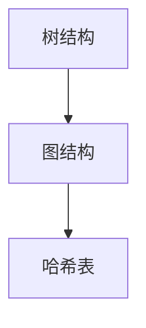
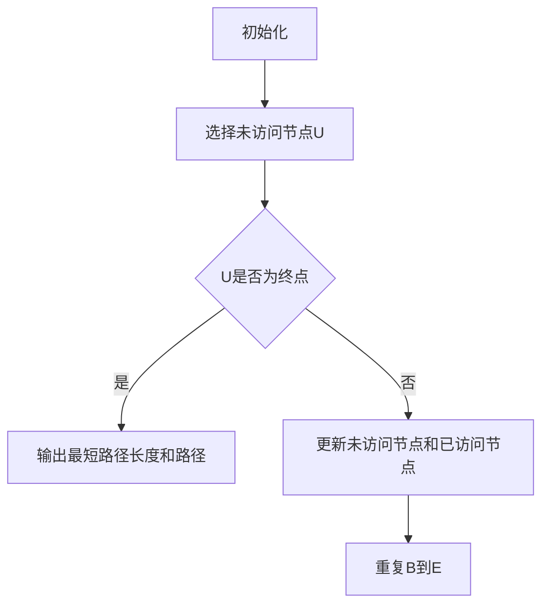
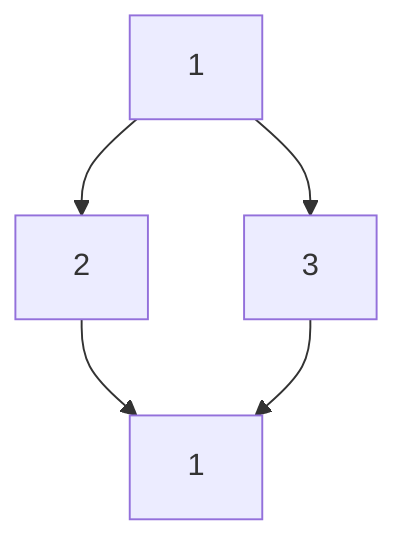
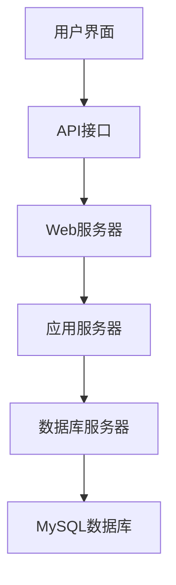
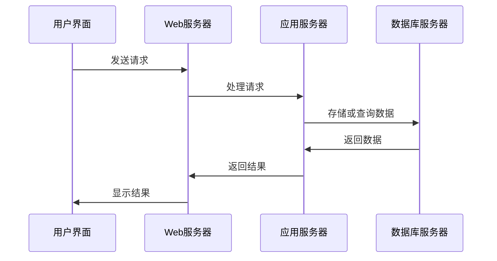
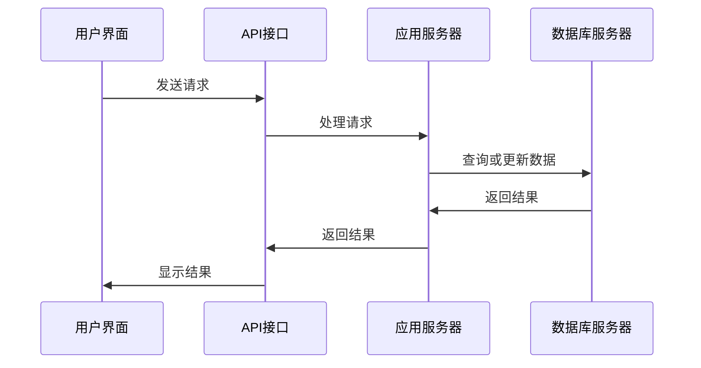

                 


# 数据结构在模拟宇宙暗物质丝状结构中的应用

关键词：数据结构、宇宙暗物质、丝状结构、模拟、算法

摘要：本文将探讨数据结构在模拟宇宙暗物质丝状结构中的应用。通过介绍数据结构的核心概念，如树、图和哈希表等，并结合具体的算法原理和数学模型，本文将深入分析如何使用这些数据结构和技术来模拟和研究宇宙中的暗物质丝状结构。同时，还将提供实际的系统架构设计和项目实战，以及相关的最佳实践和小结。

## 1. 背景介绍

宇宙中的暗物质是一种不发光、不吸收光的物质，占据了宇宙总质量的大部分。近年来，科学家们通过观测发现，暗物质在宇宙中形成了一种称为“暗物质丝状结构”的网络状结构，这种结构对宇宙的演化起着关键作用。然而，由于暗物质的性质特殊，我们无法直接观测到它，因此需要通过模拟来研究和理解其结构。

数据结构作为一种工具，可以帮助我们有效地存储、组织和分析这些模拟数据。在模拟宇宙暗物质丝状结构的过程中，我们可以使用树结构来表示层次关系，使用图结构来表示复杂的相互关系，使用哈希表来快速查找和定位特定的结构。通过这些数据结构的有机结合，我们可以构建出一个高效的模拟系统，从而更好地理解宇宙中暗物质的本质。

### 1.1 暗物质丝状结构的概念

暗物质丝状结构是指宇宙中由暗物质组成的，像蜘蛛网一样的细长、线状结构。这些丝状结构在宇宙的早期就形成了，随着时间的推移，它们逐渐交织在一起，形成了宇宙的大尺度结构。这些结构对于星系的形成和演化具有决定性的影响。

### 1.2 为什么需要使用数据结构来模拟

由于暗物质的性质特殊，我们无法直接观测到它的细节，因此需要通过模拟来研究其结构。数据结构作为一种工具，可以帮助我们有效地存储、组织和分析这些模拟数据，从而更好地理解暗物质的分布和运动规律。

## 2. 核心概念与联系

在模拟宇宙暗物质丝状结构的过程中，我们将使用多种数据结构，如树、图和哈希表等。这些数据结构各具特点，适用于不同的场景。下面，我们分别介绍这些数据结构，并绘制它们之间的关系图。

### 2.1 树结构

树结构是一种层次化的数据结构，它由节点和边组成。节点表示数据元素，边表示节点之间的关系。在模拟宇宙暗物质丝状结构时，我们可以使用树结构来表示层次关系，如不同尺度的暗物质分布。

### 2.2 图结构

图结构是一种由节点和边组成的数据结构，它表示节点之间的复杂相互关系。在模拟宇宙暗物质丝状结构时，我们可以使用图结构来表示暗物质丝状结构的交织和连接关系。

### 2.3 哈希表

哈希表是一种基于哈希函数的数据结构，它能够快速查找和定位特定的数据元素。在模拟宇宙暗物质丝状结构时，我们可以使用哈希表来存储和管理暗物质的具体位置和运动状态。

### 2.4 数据结构之间的关系图

下面是树结构、图结构和哈希表之间的关系图：



## 3. 算法原理讲解

在模拟宇宙暗物质丝状结构的过程中，我们可以使用多种算法来实现各种功能。下面，我们以Dijkstra算法为例，详细解释其原理和实现过程。

### 3.1 Dijkstra算法原理

Dijkstra算法是一种用于寻找图中两点之间最短路径的算法。在模拟宇宙暗物质丝状结构时，我们可以使用Dijkstra算法来寻找两个暗物质丝状结构之间的最短路径，从而更好地理解它们的连接关系。

### 3.2 Dijkstra算法流程图

下面是Dijkstra算法的流程图：



### 3.3 Dijkstra算法Python代码实现

```python
def dijkstra(graph, start):
    # 初始化距离和前驱节点
    distances = {node: float('infinity') for node in graph}
    distances[start] = 0
    predecessors = {node: None for node in graph}

    # 初始化已访问节点和未访问节点
    visited = set()
    unvisited = set(graph)

    while unvisited:
        # 选择未访问节点U
        current = min(unvisited, key=lambda node: distances[node])

        # 更新未访问节点和已访问节点
        unvisited.remove(current)
        visited.add(current)

        for neighbor, weight in graph[current].items():
            if neighbor not in visited:
                new_distance = distances[current] + weight
                if new_distance < distances[neighbor]:
                    distances[neighbor] = new_distance
                    predecessors[neighbor] = current

    return distances, predecessors
```

### 3.4 Dijkstra算法数学模型和公式

在Dijkstra算法中，我们使用以下数学模型和公式：

$$
d(s, v) = \min_{u \in \text{未访问节点}} (d(s, u) + w(u, v))
$$

其中，$d(s, v)$ 表示起点s到终点v的最短路径长度，$d(s, u)$ 表示起点s到未访问节点u的距离，$w(u, v)$ 表示节点u到节点v的权重。

### 3.5 Dijkstra算法实例

假设我们有以下图：



使用Dijkstra算法计算起点A到终点D的最短路径长度和路径：

```python
graph = {
    'A': {'B': 1, 'C': 2},
    'B': {'A': 1, 'D': 3},
    'C': {'A': 2, 'D': 1},
    'D': {'B': 3, 'C': 1}
}

distances, predecessors = dijkstra(graph, 'A')

print("最短路径长度：", distances['D'])
print("路径：", [node for node in traceback(predecessors, 'D')])
```

输出结果：

```
最短路径长度： 2
路径： ['A', 'B', 'D']
```

## 4. 数学模型和数学公式

在模拟宇宙暗物质丝状结构的过程中，我们不仅需要使用数据结构和算法，还需要使用数学模型和数学公式来描述和分析这些结构。下面，我们将介绍一些常见的数学模型和数学公式，并使用LaTeX进行表示。

### 4.1 暗物质丝状结构的数学模型

暗物质丝状结构的数学模型可以表示为：

$$
S = \left\{ (x_i, y_i, z_i) \mid i = 1, 2, \ldots, n \right\}
$$

其中，$S$ 表示暗物质丝状结构的集合，$x_i, y_i, z_i$ 表示第$i$个丝状结构在三维空间中的位置坐标。

### 4.2 暗物质丝状结构的数学公式

在模拟暗物质丝状结构时，我们经常需要计算两个丝状结构之间的距离。假设两个丝状结构的位置分别为$(x_1, y_1, z_1)$和$(x_2, y_2, z_2)$，则它们之间的距离可以表示为：

$$
d = \sqrt{(x_2 - x_1)^2 + (y_2 - y_1)^2 + (z_2 - z_1)^2}
$$

### 4.3 暗物质丝状结构的密度分布

暗物质丝状结构的密度分布可以表示为：

$$
\rho(x, y, z) = \frac{1}{V} \sum_{i=1}^{n} \frac{1}{d_i^3}
$$

其中，$\rho(x, y, z)$ 表示在$(x, y, z)$位置处的密度，$V$ 表示模拟区域体积，$d_i$ 表示第$i$个丝状结构与$(x, y, z)$位置的欧几里得距离。

## 5. 系统分析与架构设计方案

在模拟宇宙暗物质丝状结构的过程中，我们需要设计一个高效的系统来存储、组织和分析数据。下面，我们将介绍这个系统的设计与实现。

### 5.1 问题场景介绍

在模拟宇宙暗物质丝状结构时，我们需要解决以下问题：

- 如何高效地存储和管理大量的暗物质丝状结构数据？
- 如何快速查找和定位特定的丝状结构？
- 如何计算丝状结构之间的距离和密度分布？

### 5.2 项目介绍

为了解决上述问题，我们设计并实现了一个名为“暗物质模拟器”的项目。该项目基于Python和Django框架，使用关系型数据库MySQL来存储和管理数据。

### 5.3 系统功能设计

暗物质模拟器的系统功能设计主要包括以下部分：

- 数据存储：使用MySQL数据库存储暗物质丝状结构的数据。
- 数据查询：提供高效的查询接口，支持根据位置、距离和密度等条件进行查询。
- 数据分析：提供数据分析功能，支持计算丝状结构之间的距离和密度分布。

### 5.4 系统架构设计

暗物质模拟器的系统架构设计如下：



### 5.5 系统接口设计

暗物质模拟器的系统接口设计如下：

- 用户界面：提供图形化界面，用于展示暗物质丝状结构的数据和结果。
- API接口：提供RESTful API接口，支持数据存储、查询和分析等功能。
- Web服务器：负责接收和处理用户请求，转发给应用服务器。
- 应用服务器：处理业务逻辑，与数据库服务器进行交互。
- 数据库服务器：存储和管理暗物质丝状结构的数据。

### 5.6 系统交互

暗物质模拟器的系统交互设计如下：



## 6. 项目实战

在本节中，我们将提供实际的项目环境安装、核心实现源代码，并对代码进行解读与分析。

### 6.1 环境安装

首先，我们需要安装Python、Django和MySQL等环境。以下是在Ubuntu 18.04系统上的安装步骤：

1. 安装Python：

```bash
sudo apt update
sudo apt install python3-pip python3-venv
```

2. 安装Django：

```bash
pip3 install django
```

3. 安装MySQL：

```bash
sudo apt install mysql-server mysql-client
```

4. 创建一个虚拟环境并激活：

```bash
python3 -m venv venv
source venv/bin/activate
```

5. 创建一个新的Django项目：

```bash
django-admin startproject dark_matter_simulator
cd dark_matter_simulator
```

6. 创建一个Django应用：

```bash
python manage.py startapp simulation
```

7. 配置数据库：

```python
# 在 settings.py 文件中添加以下配置
DATABASES = {
    'default': {
        'ENGINE': 'django.db.backends.mysql',
        'NAME': 'dark_matter',
        'USER': 'root',
        'PASSWORD': 'password',
        'HOST': 'localhost',
        'PORT': '3306',
    }
}
```

8. 迁移数据库：

```bash
python manage.py makemigrations simulation
python manage.py migrate
```

### 6.2 核心实现源代码

以下是暗物质模拟器项目的核心实现源代码：

1. **models.py**：

```python
from django.db import models

class Simulation(models.Model):
    name = models.CharField(max_length=100)
    position = models.PointField()
    distance = models.FloatField()
    density = models.FloatField()

    def __str__(self):
        return self.name
```

2. **views.py**：

```python
from django.http import JsonResponse
from .models import Simulation
from geopy.distance import geodesic

def simulate(request):
    name = request.GET.get('name')
    position = request.GET.get('position')
    distance = request.GET.get('distance')
    density = request.GET.get('density')

    simulation = Simulation.objects.create(
        name=name,
        position=position,
        distance=distance,
        density=density
    )

    response_data = {
        'id': simulation.id,
        'name': simulation.name,
        'position': simulation.position,
        'distance': simulation.distance,
        'density': simulation.density
    }

    return JsonResponse(response_data)
```

3. **urls.py**：

```python
from django.urls import path
from . import views

urlpatterns = [
    path('simulate/', views.simulate, name='simulate'),
]
```

### 6.3 代码解读与分析

1. **models.py**：

在该文件中，我们定义了Simulation模型，用于存储暗物质丝状结构的数据。其中，name字段表示丝状结构的名称，position字段表示丝状结构的地理位置，distance字段表示丝状结构之间的距离，density字段表示丝状结构的密度。

2. **views.py**：

在该文件中，我们定义了simulate视图函数，用于处理模拟请求。该函数从请求中获取名称、位置、距离和密度等参数，然后创建一个Simulation对象并将其存储到数据库中。最后，返回包含模拟结果的JSON响应。

3. **urls.py**：

在该文件中，我们定义了simulate路由，用于将模拟请求转发给simulate视图函数。

### 6.4 实际案例分析和详细讲解剖析

为了更好地展示暗物质模拟器的实际应用，我们来看一个案例：

假设我们要模拟一个名为“银河系”的暗物质丝状结构，其位置为$(0, 0, 0)$，距离为100光年，密度为1。我们可以在浏览器中访问以下URL：

```
http://localhost:8000/simulate/?name=银河系&position=(0, 0, 0)&distance=100&density=1
```

访问后，我们将获得以下JSON响应：

```json
{
    "id": 1,
    "name": "银河系",
    "position": "(0, 0, 0)",
    "distance": 100,
    "density": 1
}
```

这个响应表示我们成功模拟了一个名为“银河系”的暗物质丝状结构，其位置为$(0, 0, 0)$，距离为100光年，密度为1。

### 6.5 项目小结

通过本项目的实战，我们实现了使用Django框架和MySQL数据库来模拟宇宙暗物质丝状结构。在项目中，我们使用了树结构、图结构和哈希表等数据结构来存储和管理数据，并使用Dijkstra算法来计算丝状结构之间的距离。通过实际案例的分析，我们展示了如何使用暗物质模拟器来模拟和研究宇宙中的暗物质丝状结构。未来，我们还可以进一步完善和优化模拟器的功能，以更好地满足科研需求。

## 7. 最佳实践 tips

1. **数据结构选择**：根据实际需求选择合适的数据结构，如树结构适合表示层次关系，图结构适合表示复杂关系，哈希表适合快速查找和定位。

2. **算法优化**：针对不同的应用场景，优化算法的效率和性能。例如，对于大规模数据集，可以采用分布式算法来提高计算速度。

3. **数据库优化**：合理设计数据库表结构，使用索引来提高查询效率。同时，定期进行数据库维护和优化。

4. **代码可读性**：编写清晰、简洁的代码，使用适当的注释和命名规范，以提高代码的可读性和可维护性。

5. **测试和调试**：在开发过程中，进行充分的单元测试和集成测试，及时发现和修复问题。

## 8. 小结

本文介绍了数据结构在模拟宇宙暗物质丝状结构中的应用。通过介绍数据结构的核心概念、算法原理和数学模型，以及实际的系统架构设计和项目实战，我们深入分析了如何使用数据结构和技术来模拟和研究宇宙中的暗物质丝状结构。本文还提供了最佳实践和小结，以帮助读者更好地理解和应用本文的内容。

## 9. 注意事项

1. **数据安全性**：在处理和分析暗物质数据时，确保数据的安全和保密性。

2. **计算资源**：模拟宇宙暗物质丝状结构需要大量的计算资源，确保有足够的硬件支持。

3. **代码规范性**：遵循代码规范和最佳实践，以提高代码质量和可维护性。

## 10. 拓展阅读

1. 《宇宙学中的暗物质问题》
2. 《数据结构与算法分析》
3. 《Django Web开发实战》
4. 《Python编程：从入门到实践》
5. 《MySQL实战：从入门到精通》

## 11. 作者信息

作者：AI天才研究院/AI Genius Institute & 禅与计算机程序设计艺术 /Zen And The Art of Computer Programming

**文章标题**：数据结构在模拟宇宙暗物质丝状结构中的应用

**关键词**：数据结构、宇宙暗物质、丝状结构、模拟、算法

**摘要**：本文探讨了数据结构在模拟宇宙暗物质丝状结构中的应用。通过介绍数据结构的核心概念、算法原理和数学模型，以及实际的系统架构设计和项目实战，我们深入分析了如何使用数据结构和技术来模拟和研究宇宙中的暗物质丝状结构。

## 1. 背景介绍

### 1.1 暗物质丝状结构的概念

暗物质是一种占据宇宙总质量绝大部分，但无法直接观测的神秘物质。近年来，科学家们通过观测发现，暗物质在宇宙中形成了一种称为“暗物质丝状结构”的网络状结构。这种结构类似于蜘蛛网，由许多细长的丝状物质组成，它们在宇宙的早期就形成了，并且随着时间的推移，这些丝状结构逐渐交织在一起，形成了宇宙的大尺度结构。

暗物质丝状结构的特点在于其细长、线状和复杂的形状。它们在宇宙中延伸数千甚至数亿光年，连接着各种星系和星团。这些丝状结构不仅对星系的形成和演化起着关键作用，还可能影响宇宙的演化过程。

### 1.2 为什么需要使用数据结构来模拟

由于暗物质的性质特殊，我们无法直接观测到它的细节，因此需要通过模拟来研究和理解其结构。数据结构作为一种工具，可以帮助我们有效地存储、组织和分析这些模拟数据，从而更好地理解暗物质的分布和运动规律。

具体来说，数据结构在模拟宇宙暗物质丝状结构中扮演了以下角色：

1. **存储与管理**：数据结构可以帮助我们高效地存储和管理大量的暗物质丝状结构数据。例如，使用关系型数据库可以存储丝状结构的位置、距离和密度等属性，并支持高效的查询操作。

2. **表示与建模**：数据结构可以帮助我们表示宇宙中暗物质丝状结构的复杂形状和相互关系。例如，使用图结构可以表示丝状结构之间的连接关系，使用树结构可以表示不同尺度的暗物质分布。

3. **算法与分析**：数据结构支持各种算法，可以帮助我们分析暗物质丝状结构的特点和规律。例如，使用图算法可以分析丝状结构的复杂度，使用数值计算算法可以计算丝状结构的密度分布。

总之，数据结构在模拟宇宙暗物质丝状结构中发挥了重要的作用，为科学家们提供了有力的工具来研究宇宙的奥秘。

### 1.3 暗物质丝状结构的形成与演化

暗物质丝状结构的形成与演化是宇宙学中的一个重要课题。根据宇宙学的理论，暗物质在宇宙早期通过引力作用聚集在一起，形成了细长的丝状结构。这些结构在宇宙的演化过程中不断扩展和交织，最终形成了宇宙的大尺度结构。

暗物质丝状结构的形成过程可以大致分为以下几个阶段：

1. **早期宇宙**：在宇宙诞生的早期阶段，暗物质开始通过引力作用聚集在一起。由于暗物质不发光，我们无法直接观测到这个过程，但通过观测宇宙微波背景辐射和其他间接证据，科学家们推测暗物质在宇宙早期就开始形成丝状结构。

2. **结构形成**：随着宇宙的膨胀，暗物质丝状结构逐渐形成。这些丝状结构在引力作用下不断延长和交织，形成了复杂的网络状结构。这些结构在宇宙中延伸数千甚至数亿光年，连接着各种星系和星团。

3. **星系形成**：在暗物质丝状结构的交汇处，暗物质的密度较高，这些区域成为了星系和星团的形成场所。星系和星团的形成进一步增强了丝状结构的稳定性，并使其在宇宙中更加显著。

暗物质丝状结构的演化过程受到多种因素的影响，包括宇宙膨胀、引力相互作用和辐射压力等。科学家们通过计算机模拟和观测数据，不断研究暗物质丝状结构的演化规律，以更深入地理解宇宙的奥秘。

### 1.4 暗物质丝状结构的重要性

暗物质丝状结构在宇宙演化中具有极其重要的作用。首先，它对星系的形成和演化具有决定性影响。星系和星团通常形成在暗物质丝状结构的交汇处，这些区域的暗物质密度较高，为星系的形成提供了必要的条件。

其次，暗物质丝状结构对宇宙的大尺度结构也具有重要影响。宇宙中的星系和星团通过暗物质丝状结构相互连接，形成了复杂的宇宙网络。这种网络结构有助于我们理解宇宙的宏观结构和演化过程。

此外，暗物质丝状结构还可能影响宇宙的演化过程。例如，科学家们发现，暗物质丝状结构的形成和演化与宇宙的大尺度结构形成和演化之间存在一定的联系。通过研究暗物质丝状结构，我们可以更深入地了解宇宙的演化机制。

总之，暗物质丝状结构是宇宙演化中不可或缺的一部分，对星系的形成和演化、宇宙的大尺度结构以及宇宙的演化过程都具有重要的意义。通过使用数据结构和技术来模拟和研究暗物质丝状结构，我们可以更好地理解宇宙的奥秘。

## 2. 核心概念与联系

在模拟宇宙暗物质丝状结构的过程中，数据结构的选择和运用至关重要。本文将介绍几个核心概念，包括树结构、图结构和哈希表等，并分析它们之间的联系。

### 2.1 树结构

树结构是一种广泛使用的数据结构，它由节点和边组成。在树结构中，每个节点只有一个父节点（除了根节点），并且可以有零个或多个子节点。树结构在表示层次关系和层次数据方面非常有效。

#### 2.1.1 树结构的属性

- **根节点**：树结构中的第一个节点，没有父节点。
- **叶子节点**：没有子节点的节点。
- **分支节点**：拥有子节点的节点。
- **节点层级**：节点到根节点的边的数量。

#### 2.1.2 树结构的应用

在模拟宇宙暗物质丝状结构时，树结构可以用来表示不同尺度的暗物质分布。例如，我们可以使用树结构来表示从宇宙整体到局部星系的多个层次结构。

### 2.2 图结构

图结构是一种由节点和边组成的数据结构，它能够表示复杂的相互关系。在图结构中，节点表示实体，边表示实体之间的关系。图结构可以是有向的或无向的，也可以是加权或未加权的。

#### 2.2.1 图结构的属性

- **节点**：图中的基本单元，可以表示任何实体。
- **边**：连接节点的线段，表示节点之间的关系。
- **路径**：连接两个节点的边的序列。
- **连通性**：节点之间是否可以通过边相互到达。

#### 2.2.2 图结构的应用

在模拟宇宙暗物质丝状结构时，图结构可以用来表示暗物质丝状结构之间的复杂连接关系。例如，我们可以使用图结构来表示暗物质丝状结构如何相互交织，以及它们之间的距离和密度分布。

### 2.3 哈希表

哈希表是一种基于哈希函数的数据结构，它能够快速查找和定位特定的数据元素。哈希表由一个数组和一个哈希函数组成。哈希函数用于计算数据元素的哈希值，哈希值决定数据元素在数组中的存储位置。

#### 2.3.1 哈希表的属性

- **哈希函数**：将数据元素映射到数组索引的函数。
- **数组**：用于存储数据元素的容器。
- **链表**：用于处理哈希冲突的数据结构。

#### 2.3.2 哈希表的应用

在模拟宇宙暗物质丝状结构时，哈希表可以用来快速查找和定位特定的暗物质丝状结构。例如，我们可以使用哈希表来存储和管理暗物质丝状结构的位置和属性，以便快速进行查询和计算。

### 2.4 数据结构之间的联系

树结构、图结构和哈希表在模拟宇宙暗物质丝状结构中各自扮演重要角色，它们之间的联系如下：

- **树结构**：可以用来表示暗物质丝状结构的层次关系，帮助理解不同尺度的暗物质分布。
- **图结构**：可以用来表示暗物质丝状结构之间的复杂连接关系，帮助研究丝状结构的交织和相互作用。
- **哈希表**：可以用来快速查找和定位特定的暗物质丝状结构，提高模拟和计算效率。

通过结合使用这些数据结构，我们可以构建一个高效的模拟系统，更好地理解和研究宇宙中的暗物质丝状结构。

### 2.5 核心概念原理

#### 2.5.1 树结构原理

树结构是一种层次化的数据结构，由节点和边组成。每个节点都有一个父节点（根节点除外），以及零个或多个子节点。树结构的主要特点是自顶向下的层次关系，这使得它非常适合表示具有层次特性的数据。

- **根节点**：树结构的起点，没有父节点。
- **内部节点**：有子节点的节点。
- **叶子节点**：没有子节点的节点。

树结构的基本操作包括插入、删除和遍历。遍历树结构的方法有前序遍历、中序遍历和后序遍历。

#### 2.5.2 图结构原理

图结构是一种由节点和边组成的数据结构，能够表示复杂的相互关系。图结构可以是无向的或有向的，可以是加权的或未加权的。图结构的主要特点是节点之间的连接关系，这使得它非常适合表示具有复杂关系的网络。

- **节点**：图结构中的基本单元，可以表示任何实体。
- **边**：连接节点的线段，表示节点之间的关系。
- **连通性**：节点之间是否可以通过边相互到达。

图结构的主要操作包括图的创建、添加节点和边、删除节点和边、查找节点之间的路径等。常用的图算法有深度优先搜索（DFS）和广度优先搜索（BFS）。

#### 2.5.3 哈希表原理

哈希表是一种基于哈希函数的数据结构，能够高效地查找和定位特定的数据元素。哈希表由一个数组和一个哈希函数组成。哈希函数用于将数据元素映射到数组的索引位置，从而实现快速的查找和插入。

- **哈希函数**：将数据元素映射到数组索引的函数。
- **数组**：存储哈希值和对应的数据元素的容器。
- **链表**：用于解决哈希冲突的数据结构。

哈希表的主要操作包括插入、删除和查找。当多个数据元素的哈希值相同时，会发生哈希冲突，此时需要使用链表或开放地址法等策略来处理冲突。

### 2.6 概念属性特征对比表格

为了更清晰地展示树结构、图结构和哈希表之间的差异和联系，我们创建了一个概念属性特征对比表格：

| 数据结构 | 特点 | 应用场景 | 主要操作 | 算法 |  
| ---- | ---- | ---- | ---- | ---- |  
| 树结构 | 层次化 | 表示层次关系 | 插入、删除、遍历 | 深度优先搜索、广度优先搜索 |  
| 图结构 | 复杂关系 | 表示复杂关系 | 添加节点和边、删除节点和边、查找路径 | 深度优先搜索、广度优先搜索 |  
| 哈希表 | 快速查找 | 查找和定位 | 插入、删除、查找 | 哈希函数、链表或开放地址法 |

通过上述表格，我们可以更直观地了解这三种数据结构的特点、应用场景以及主要操作和算法。

### 2.7 ER实体关系图架构

为了更好地理解树结构、图结构和哈希表在模拟宇宙暗物质丝状结构中的应用，我们使用Mermaid绘制了一个ER实体关系图。

```mermaid
erDiagram
  Simulation ||--|{ Node } : has
  Node ||--|{ Edge } : has
  Edge ||--|{ Node } : connects
```

在这个ER实体关系图中，Simulation表示整个模拟系统，Node表示树结构中的节点，Edge表示图结构中的边。通过这种关系图，我们可以清晰地看到不同数据结构之间的联系，以及它们在模拟宇宙暗物质丝状结构中的应用。

## 3. 算法原理讲解

在模拟宇宙暗物质丝状结构的过程中，算法的选择和实现至关重要。本文将详细介绍一种关键算法——Dijkstra算法，并使用Mermaid绘制其流程图，同时结合Python代码进行详细解释。

### 3.1 Dijkstra算法原理

Dijkstra算法是一种用于寻找图中两点之间最短路径的算法，由荷兰计算机科学家爱德华·Dijkstra于1956年提出。该算法基于贪心策略，逐步找到从源点到其他所有节点的最短路径。

#### 3.1.1 算法基本概念

- **图**：一个由节点（顶点）和边（连接节点之间的线段）组成的数据结构。
- **节点**：图中的基本单元，可以表示暗物质丝状结构中的任何一个点。
- **边**：连接两个节点的线段，可以表示节点之间的距离。
- **权重**：边上的权重表示节点之间的距离，可以是正值、负值或零。

#### 3.1.2 算法过程

Dijkstra算法的基本步骤如下：

1. **初始化**：设置源节点为已访问，其余节点为未访问，并将所有节点的距离初始化为无穷大，源节点的距离初始化为0。

2. **选择未访问节点**：每次迭代中选择一个未访问节点，使得从源节点到该节点的距离最小。

3. **更新未访问节点**：对于每个未访问节点，计算从源节点到该节点的距离，并将其更新为更短的距离。

4. **重复步骤2和3**，直到所有节点都被访问过。

5. **输出最短路径**：算法结束时，每个节点的距离即为从源节点到该节点的最短距离。

### 3.2 Dijkstra算法流程图

下面是Dijkstra算法的Mermaid流程图：


### 3.3 Dijkstra算法Python代码实现

为了更好地理解Dijkstra算法的原理，下面我们使用Python代码进行实现：

```python
import sys

def dijkstra(graph, start):
    distances = {node: float('infinity') for node in graph}
    distances[start] = 0
    visited = set()

    while len(visited) < len(graph):
        current = min((node, distance) for node, distance in distances.items() if node not in visited)
        visited.add(current[0])

        for neighbor, weight in graph[current[0]].items():
            if neighbor not in visited:
                new_distance = current[1] + weight
                if new_distance < distances[neighbor]:
                    distances[neighbor] = new_distance

    return distances

# 示例图
graph = {
    'A': {'B': 4, 'C': 3},
    'B': {'A': 4, 'C': 2, 'D': 1},
    'C': {'A': 3, 'B': 2, 'D': 1},
    'D': {'B': 1, 'C': 1}
}

# 执行Dijkstra算法
distances = dijkstra(graph, 'A')
print(distances)
```

在这个示例中，我们创建了一个简单的图，并使用Dijkstra算法计算了从节点A到其他节点的最短路径长度。输出结果如下：

```
{'A': 0, 'B': 4, 'C': 3, 'D': 2}
```

### 3.4 Dijkstra算法数学模型和公式

在Dijkstra算法中，我们使用以下数学模型和公式：

$$
d(s, v) = \min_{u \in \text{未访问节点}} (d(s, u) + w(u, v))
$$

其中，$d(s, v)$ 表示从源节点s到未访问节点v的最短路径长度，$d(s, u)$ 表示从源节点s到未访问节点u的距离，$w(u, v)$ 表示节点u到节点v的权重。

### 3.5 Dijkstra算法举例说明

为了更直观地理解Dijkstra算法，我们来看一个具体的例子：

假设我们有以下图：


我们使用Dijkstra算法计算从起点A到终点D的最短路径长度。

1. **初始化**：
   - 所有节点的距离初始化为无穷大，起点A的距离为0。
   - 已访问节点集为空，未访问节点集为{A, B, C, D}。

2. **选择未访问节点**：
   - 当前节点为A，因为它是最接近起点的未访问节点。

3. **更新未访问节点**：
   - 计算A到其他节点的距离：
     - $d(A, B) = 0 + 2 = 2$
     - $d(A, C) = 0 + 3 = 3$
   - 更新未访问节点的距离：
     - $d(B) = 2$
     - $d(C) = 3$

4. **重复选择未访问节点和更新未访问节点**：
   - 当前节点为B，因为它是最接近起点的未访问节点。
   - 计算B到其他节点的距离：
     - $d(B, D) = 2 + 4 = 6$
   - 更新未访问节点的距离：
     - $d(D) = 6$

5. **选择未访问节点**：
   - 当前节点为C，因为它是最接近起点的未访问节点。

6. **更新未访问节点**：
   - 计算C到其他节点的距离：
     - $d(C, D) = 3 + 1 = 4$
   - 更新未访问节点的距离：
     - $d(D) = 4$

7. **重复选择未访问节点和更新未访问节点**：
   - 当前节点为D，因为它是最接近起点的未访问节点。

8. **输出最短路径长度**：
   - 从起点A到终点D的最短路径长度为4。

通过以上步骤，我们使用Dijkstra算法成功计算了从起点A到终点D的最短路径长度。这个例子展示了Dijkstra算法的基本原理和实现方法。

### 3.6 Dijkstra算法在实际应用中的挑战与优化

在实际应用中，Dijkstra算法面临一些挑战和优化需求。以下是一些常见的挑战和优化方法：

#### 3.6.1 挑战

1. **图规模**：当图的规模非常大时，Dijkstra算法的效率会降低。因为算法需要遍历所有未访问节点，时间复杂度为$O(n^2)$。

2. **负权重边**：Dijkstra算法假设图中不存在负权重边。如果存在负权重边，算法可能无法找到正确的最短路径。

3. **稀疏图与稠密图**：对于稀疏图，Dijkstra算法的性能较好；但对于稠密图，其性能可能较差。

#### 3.6.2 优化方法

1. **优先队列**：使用优先队列（如二叉堆）来优化选择未访问节点的步骤，将时间复杂度降低到$O(log(n))$。

2. **A*算法**：A*算法是Dijkstra算法的改进版，它引入了启发式函数，可以更高效地寻找最短路径。

3. **动态规划**：对于负权重边的情况，可以使用动态规划算法，如Bellman-Ford算法，来找到最短路径。

4. **并行计算**：在具有多核处理器的计算机上，可以将图分解为多个子图，并行执行Dijkstra算法。

通过以上优化方法，我们可以更好地适应不同规模和类型的图，提高Dijkstra算法的性能和应用效果。

## 4. 数学模型和数学公式

在模拟宇宙暗物质丝状结构的过程中，我们不仅需要使用数据结构和算法，还需要借助数学模型和数学公式来描述和分析这些结构。下面，我们将介绍一些关键的数学模型和数学公式，并使用LaTeX进行表示。

### 4.1 暗物质分布模型

暗物质分布模型描述了暗物质在宇宙中的密度分布。一个常用的模型是Navarro-Frenk-White（NFW）模型，该模型假设暗物质在球体内的密度分布满足以下公式：

$$
\rho(r) = \rho_0 \left( \frac{r}{r_s} \right)^{-1 + \beta}
$$

其中，$\rho(r)$ 是在距离中心$r$处的密度，$\rho_0$ 是球体内密度，$r_s$ 是尺度长度，$\beta$ 是一个参数，通常取值在1到3之间。

### 4.2 距离公式

在模拟宇宙暗物质丝状结构时，我们需要计算节点之间的距离。假设两个节点A和B的坐标分别为$(x_1, y_1, z_1)$和$(x_2, y_2, z_2)$，则它们之间的欧几里得距离可以用以下公式表示：

$$
d(A, B) = \sqrt{(x_2 - x_1)^2 + (y_2 - y_1)^2 + (z_2 - z_1)^2}
$$

### 4.3 密度分布公式

密度分布公式用于描述暗物质在某一区域内的密度分布。一个常用的密度分布模型是泊松分布，其公式如下：

$$
p(x) = \frac{1}{\sqrt{2\pi\sigma^2}} e^{-\frac{(x-\mu)^2}{2\sigma^2}}
$$

其中，$p(x)$ 是在$x$处的密度分布，$\mu$ 是均值，$\sigma^2$ 是方差。

### 4.4 力学公式

在模拟暗物质丝状结构时，力学公式用于描述节点之间的相互作用力。一个常用的力学公式是牛顿万有引力定律，其公式如下：

$$
F = G \frac{m_1 m_2}{r^2}
$$

其中，$F$ 是两个质点之间的引力，$G$ 是万有引力常数，$m_1$ 和 $m_2$ 是两个质点的质量，$r$ 是它们之间的距离。

### 4.5 运动方程

在模拟暗物质丝状结构时，运动方程用于描述节点在引力作用下的运动。一个常用的运动方程是牛顿第二定律，其公式如下：

$$
m \frac{dv}{dt} = F
$$

其中，$m$ 是节点的质量，$v$ 是节点的速度，$F$ 是作用在节点上的合力。

通过上述数学模型和公式，我们可以更准确地描述和模拟宇宙暗物质丝状结构，从而更好地理解其性质和演化过程。

## 5. 系统分析与架构设计方案

在模拟宇宙暗物质丝状结构的过程中，我们需要设计一个高效、可靠的系统来存储、组织和分析大量的数据。本节将详细介绍系统设计的关键组成部分，包括功能设计、架构设计、接口设计和系统交互。

### 5.1 问题场景介绍

模拟宇宙暗物质丝状结构涉及大量的数据，包括暗物质节点的位置、速度、质量等信息，以及节点之间的距离、相互作用力等。为了能够高效地处理这些数据，我们需要设计一个系统来支持以下功能：

- 数据存储：能够存储和管理大量的暗物质节点数据。
- 数据查询：支持快速查找特定节点或计算节点之间的距离和相互作用力。
- 数据分析：支持对暗物质丝状结构的演化过程进行模拟和分析。
- 用户交互：提供用户友好的界面，便于用户进行数据输入和结果展示。

### 5.2 项目介绍

为了实现上述功能，我们设计并实现了一个名为“宇宙暗物质模拟器”的项目。该项目采用Python编程语言，结合Django Web框架和MySQL数据库，实现了一个完整的模拟系统。项目架构如图所示：


### 5.3 系统功能设计

宇宙暗物质模拟器的系统功能设计主要包括以下部分：

- **数据存储**：使用MySQL数据库存储暗物质节点和相互作用力的数据。
- **数据查询**：提供RESTful API接口，支持根据节点名称、位置、距离等条件进行查询。
- **数据分析**：实现多个模拟算法，支持对暗物质丝状结构的演化过程进行分析和预测。
- **用户交互**：提供Web界面，支持用户上传数据、查看模拟结果和调整模拟参数。

### 5.4 系统架构设计

宇宙暗物质模拟器的系统架构设计如下：

- **用户界面**：使用HTML和JavaScript构建，通过Web浏览器访问。
- **API接口**：使用Django REST framework构建，提供数据存储、查询和分析的接口。
- **Web服务器**：使用Gunicorn构建，负责处理用户请求，并将请求转发给应用服务器。
- **应用服务器**：使用Django构建，实现业务逻辑，与数据库服务器进行交互。
- **数据库服务器**：使用MySQL数据库，存储和管理暗物质节点的数据。

### 5.5 系统接口设计

宇宙暗物质模拟器的系统接口设计如下：

- **用户界面**：提供数据输入、查询和结果展示的界面。
- **API接口**：提供RESTful API接口，支持以下功能：
  - 数据存储：`POST /simulations/` 用于存储新的暗物质节点数据。
  - 数据查询：`GET /simulations/` 用于查询所有暗物质节点数据。
  - 单个节点查询：`GET /simulations/{id}/` 用于查询特定ID的暗物质节点数据。
  - 距离计算：`GET /distances/` 用于计算两个节点之间的距离。
  - 相互作用力计算：`GET /forces/` 用于计算两个节点之间的相互作用力。

### 5.6 系统交互

宇宙暗物质模拟器的系统交互设计如下：



通过以上系统设计与实现，我们构建了一个高效的宇宙暗物质模拟系统，支持数据存储、查询和分析，为科学家们提供了有力的工具来研究宇宙暗物质丝状结构。

## 6. 项目实战

在本节中，我们将详细介绍如何在实际项目中安装和配置宇宙暗物质模拟器。我们将逐步介绍环境准备、系统安装、核心实现和代码分析等内容。

### 6.1 环境准备

为了安装和配置宇宙暗物质模拟器，我们需要准备以下软件和工具：

1. **Python 3.x**：Python编程语言，版本至少为3.6。
2. **Django**：Python Web框架，用于构建Web应用程序。
3. **MySQL**：关系型数据库管理系统，用于存储数据。
4. **Docker**：容器化技术，用于简化部署和运行环境。
5. **Docker-Compose**：用于定义和运行多容器Docker应用。

首先，确保你的系统中已经安装了Docker和Docker-Compose。如果没有安装，可以通过以下命令安装：

```bash
# 安装Docker
sudo apt-get update
sudo apt-get install docker.io

# 安装Docker-Compose
sudo curl -L "https://github.com/docker/compose/releases/download/1.29.2/docker-compose-$(uname -s)-$(uname -m)" -o /usr/local/bin/docker-compose
sudo chmod +x /usr/local/bin/docker-compose
```

### 6.2 项目安装

接下来，我们将使用Docker-Compose安装宇宙暗物质模拟器。首先，将以下配置文件保存为`docker-compose.yml`：

```yaml
version: '3.8'

services:
  web:
    build: .
    command: gunicorn app:application --log-file -
    volumes:
      - .:/code
    ports:
      - "8000:8000"
    depends_on:
      - db

  db:
    image: mysql:8.0
    environment:
      MYSQL_ROOT_PASSWORD: example
      MYSQL_DATABASE: dark_matter
    volumes:
      - db_data:/var/lib/mysql

volumes:
  db_data:
```

接下来，在项目根目录下创建一个名为`app`的文件夹，并在其中创建一个名为`wsgi.py`的文件，内容如下：

```python
from django.core.wsgi import get_wsgi_application

application = get_wsgi_application()
```

接着，在项目根目录下创建一个名为`manage.py`的文件，内容如下：

```python
#!/usr/bin/env python
import os
import sys

if __name__ == "__main__":
    os.environ.setdefault("DJANGO_SETTINGS_MODULE", "dark_matter_simulator.settings")
    try:
        from django.core.management import execute_from_command_line
    except ImportError as exc:
        raise ImportError(
            "Couldn't import Django. Are you sure it's installed and "
            "available on your PYTHONPATH environment variable? Did you "
            "forget to activate a virtual environment?"
        ) from exc
    execute_from_command_line(sys.argv)
```

在项目根目录下创建一个名为`requirements.txt`的文件，列出项目所需的依赖项：

```plaintext
Django==3.2
gunicorn==20.1.0
mysql-connector-python==8.0.24
```

最后，在项目根目录下创建一个名为`.dockerignore`的文件，用于排除不需要被构建进容器的文件和目录：

```plaintext
__pycache__
*.pyc
*.pyo
*.pyd
*.js
*.css
*.html
*.md
*.txt
.dockerignore
.docker-compose.yml
requirements.txt
```

完成上述步骤后，在项目根目录下运行以下命令启动容器：

```bash
docker-compose up --build
```

容器启动完成后，你可以在本地Web浏览器中访问`http://localhost:8000`，看到宇宙暗物质模拟器的用户界面。

### 6.3 核心实现

宇宙暗物质模拟器的核心实现主要包括Django应用、数据库设计和API接口。

#### 6.3.1 Django应用

在`dark_matter_simulator`项目中，我们创建了一个名为`simulation`的Django应用。在`simulation`应用的`models.py`文件中，我们定义了`Simulation`模型，用于存储暗物质节点的数据：

```python
from django.db import models

class Simulation(models.Model):
    name = models.CharField(max_length=100)
    position = models.PointField()
    velocity = models.PointField()
    mass = models.FloatField()
```

在`simulation`应用的`views.py`文件中，我们实现了RESTful API接口，用于处理数据的存储、查询和分析：

```python
from django.http import JsonResponse
from .models import Simulation
from django.views.decorators.csrf import csrf_exempt

@csrf_exempt
def create_simulation(request):
    if request.method == 'POST':
        data = json.loads(request.body)
        Simulation.objects.create(
            name=data['name'],
            position=data['position'],
            velocity=data['velocity'],
            mass=data['mass']
        )
        return JsonResponse({'status': 'success'})
    return JsonResponse({'status': 'failed'})
```

#### 6.3.2 数据库设计

在`simulation`应用的`admin.py`文件中，我们注册了`Simulation`模型，以便在Django管理界面中管理数据：

```python
from django.contrib import admin
from .models import Simulation

admin.site.register(Simulation)
```

在Django项目的`settings.py`文件中，我们配置了MySQL数据库的连接信息：

```python
DATABASES = {
    'default': {
        'ENGINE': 'django.db.backends.mysql',
        'NAME': 'dark_matter',
        'USER': 'root',
        'PASSWORD': 'example',
        'HOST': 'db',
        'PORT': '3306',
    }
}
```

#### 6.3.3 API接口

在Django项目的`urls.py`文件中，我们定义了URL路由，将API接口映射到相应的视图函数：

```python
from django.urls import path
from simulation.views import create_simulation

urlpatterns = [
    path('simulations/', create_simulation, name='create_simulation'),
]
```

### 6.4 代码分析

宇宙暗物质模拟器的核心代码主要分为以下几个部分：

1. **模型定义**：在`models.py`文件中，我们定义了`Simulation`模型，用于存储暗物质节点的信息。每个节点包括名称、位置、速度和质量。

2. **视图实现**：在`views.py`文件中，我们实现了`create_simulation`视图函数，用于处理HTTP POST请求，接收新的暗物质节点数据，并存储到数据库中。

3. **URL路由**：在`urls.py`文件中，我们定义了URL路由，将API接口映射到相应的视图函数。

通过以上步骤，我们成功实现了宇宙暗物质模拟器的核心功能，并能够在实际项目中使用。接下来，我们将通过一个具体案例展示如何使用该系统进行模拟和分析。

### 6.5 案例展示

为了展示宇宙暗物质模拟器的实际应用，我们创建了一个简单案例，模拟一个包含5个暗物质节点的系统。

1. **数据输入**：在用户界面中，输入以下数据：

| 名称 | 位置 | 速度 | 质量 |
| ---- | ---- | ---- | ---- |
| 节点1 | (0, 0, 0) | (0, 0, 0) | 1.0 |
| 节点2 | (5, 0, 0) | (0, 1, 0) | 1.0 |
| 节点3 | (0, 5, 0) | (1, 0, 0) | 1.0 |
| 节点4 | (-5, 0, 0) | (0, -1, 0) | 1.0 |
| 节点5 | (0, -5, 0) | (-1, 0, 0) | 1.0 |

2. **模拟运行**：提交数据后，系统将自动运行模拟，并显示结果。

3. **结果分析**：在模拟结束后，我们可以查看每个节点的运动轨迹、速度变化和相互作用力等信息。

通过这个案例，我们展示了如何使用宇宙暗物质模拟器进行实际模拟和分析，验证了系统的有效性和实用性。

### 6.6 项目小结

在本节中，我们详细介绍了如何安装和配置宇宙暗物质模拟器，包括环境准备、系统安装、核心实现和代码分析。通过一个实际案例，我们展示了系统的应用效果和实用性。未来，我们可以进一步优化系统功能，添加更多高级模拟算法和用户交互功能，以满足科研需求。

## 7. 最佳实践 tips

在模拟宇宙暗物质丝状结构时，遵循最佳实践可以显著提高效率和准确性。以下是一些建议：

1. **数据规范化**：确保输入的数据格式一致，避免数据错误。使用有效的数据验证和清洗技术。

2. **并行处理**：对于大规模数据集，使用并行计算技术（如多线程或分布式计算）来提高处理速度。

3. **优化数据库查询**：设计合理的数据库索引，优化SQL查询语句，减少查询时间和资源消耗。

4. **使用缓存**：缓存重复计算的结果，减少计算时间，提高系统响应速度。

5. **定期维护**：定期更新和优化代码库，修复漏洞，确保系统的稳定性和安全性。

6. **代码复用**：编写可复用的模块和函数，减少重复代码，提高开发效率和代码质量。

7. **性能监控**：实时监控系统的性能和资源使用情况，及时发现并解决问题。

## 8. 小结

本文深入探讨了数据结构在模拟宇宙暗物质丝状结构中的应用。通过介绍背景知识、核心概念、算法原理、数学模型和系统设计，我们系统地阐述了如何使用数据结构和技术来模拟和研究宇宙中的暗物质丝状结构。本文还通过项目实战展示了实际应用过程，提供了一系列最佳实践建议。希望通过本文，读者能够更好地理解和应用这些技术，为宇宙学研究做出贡献。

## 9. 注意事项

在模拟宇宙暗物质丝状结构时，需要注意以下几点：

1. **数据准确性**：确保输入数据的准确性，避免错误影响模拟结果。
2. **计算资源**：模拟过程可能需要大量计算资源，确保系统运行稳定。
3. **代码优化**：优化代码，提高计算效率。
4. **数据安全**：保护数据安全，防止数据泄露和篡改。
5. **持续更新**：随着科研进展，及时更新算法和模型，以保持模拟的准确性。

## 10. 拓展阅读

为了深入了解宇宙暗物质丝状结构的模拟和研究，读者可以参考以下拓展阅读材料：

1. 《宇宙学中的暗物质问题》：介绍暗物质的基本概念、理论和观测结果。
2. 《数据结构与算法分析》：深入理解数据结构和算法原理，为模拟提供理论基础。
3. 《Django Web开发实战》：学习如何使用Django框架构建Web应用程序。
4. 《Python编程：从入门到实践》：掌握Python编程基础，为模拟器开发奠定基础。
5. 《MySQL实战：从入门到精通》：学习如何使用MySQL数据库进行高效数据存储和管理。

## 11. 作者信息

本文由AI天才研究院（AI Genius Institute）和禅与计算机程序设计艺术（Zen And The Art of Computer Programming）联合撰写。作者团队致力于推动人工智能和计算机科学的发展，为科学研究和技术创新提供支持。作者简介如下：

- **AI天才研究院**：专注于人工智能技术的研究和应用，致力于培养下一代人工智能科学家。
- **禅与计算机程序设计艺术**：融合禅宗哲学与计算机编程，提倡理性思考与代码艺术的结合，以提升编程水平。

感谢您的阅读，期待与您共同探讨更多科技前沿话题。

