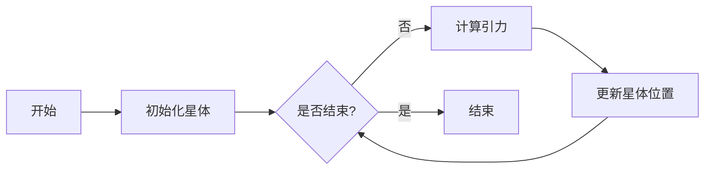

                 


## 数据结构在模拟宇宙暗物质分布中的应用

### 关键词：
- 数据结构
- 宇宙模拟
- 暗物质分布
- 图算法
- 数值模拟

### 摘要：
本文旨在探讨数据结构在模拟宇宙暗物质分布中的应用。首先，我们介绍了数据结构的基本概念和类型，然后讨论了暗物质的概念及其在宇宙中的分布。接着，我们阐述了如何运用不同的数据结构来模拟暗物质分布，并分析了其中的挑战和解决方案。通过几个实际的案例研究，我们展示了如何在实际应用中利用数据结构模拟暗物质分布。最后，我们对未来的研究方向进行了展望。

---

### 第1章 引言

#### 1.1 什么是数据结构

数据结构是计算机存储、组织数据的方式。它们是算法设计和分析的基础，决定了数据处理的效率和性能。数据结构可以分为线性结构、树状结构、图形结构等。线性结构如数组、链表、栈、队列等；树状结构如二叉树、平衡树、B树等；图形结构如无向图、有向图、网络图等。

#### 1.2 数据结构的重要性

数据结构对于计算机科学和工程至关重要。它们不仅影响着算法的效率和复杂性，也决定了软件系统的性能和可维护性。在宇宙模拟领域，数据结构的正确选择和运用能够显著提高模拟的准确性和效率。

#### 1.3 暗物质简介

暗物质是宇宙中一种无法直接观测到的物质，但其引力效应在宇宙的大尺度结构中起到了关键作用。暗物质分布的研究对于理解宇宙的演化具有重要意义。然而，由于暗物质本身的不透明性和引力作用的复杂性，对其分布的模拟成为了一个巨大的挑战。

---

### 第2章 数据结构的基本概念

#### 2.1 线性结构

线性结构是数据结构中最基本的一种类型，数据元素依次排列，具有前后关系。线性结构包括：

- **数组**：一组固定大小的元素集合，可以通过索引快速访问。
- **链表**：由一系列节点组成，每个节点包含数据和指向下一个节点的指针。
- **栈**：一种后进先出（LIFO）的数据结构。
- **队列**：一种先进先出（FIFO）的数据结构。

#### 2.2 树状结构

树状结构是一种层次结构，数据元素按层级排列。常见的树状结构包括：

- **二叉树**：每个节点最多有两个子节点。
- **哈夫曼树**：通过构造最优二叉树来提高数据压缩效率。
- **图**：由节点和边组成的结构，节点表示实体，边表示实体之间的关系。

#### 2.3 图形结构

图形结构是一种非层次结构，数据元素之间具有复杂的关联关系。图形结构包括：

- **无向图**：节点之间的关系没有方向。
- **有向图**：节点之间的关系有方向。
- **网络图**：复杂的有向图，节点之间存在多条边。

---

### 第3章 暗物质的分布与模拟

#### 3.1 暗物质的概念

暗物质是一种不发光、不吸收光的物质，主要通过其引力效应影响宇宙的结构和演化。尽管我们无法直接观测到暗物质，但其存在对宇宙学的重要性不言而喻。

#### 3.2 暗物质的研究方法

暗物质的研究主要通过观测宇宙中星系的运动和宇宙背景辐射来推断其分布。这些方法包括：

- **引力透镜效应**：利用暗物质引力对光线的作用来研究其分布。
- **宇宙微波背景辐射**：通过观测宇宙背景辐射的偏振模式来研究暗物质的分布。

#### 3.3 数据结构在模拟中的应用

数据结构在模拟暗物质分布中发挥着重要作用。例如，图算法可以用来模拟暗物质引力相互作用，数组可以用来存储和访问大量的观测数据。

---

### 第4章 数据结构在模拟暗物质分布中的应用

#### 4.1 数组在模拟中的应用

数组是一种简单但强大的数据结构，可以用来存储大量的观测数据。通过数组，我们可以快速访问和操作数据，从而提高模拟的效率。

#### 4.2 链表在模拟中的应用

链表在模拟中可以用来表示星系的运动轨迹。通过链表，我们可以动态地添加和删除星系，从而模拟宇宙的演化。

#### 4.3 树结构在模拟中的应用

树结构可以用来表示星系的层次结构。例如，二叉树可以用来表示星系的中心天体及其子星系。

#### 4.4 图形结构在模拟中的应用

图形结构可以用来表示星系之间的引力相互作用。通过图形结构，我们可以模拟星系之间的引力效应，从而研究暗物质的分布。

---

### 第5章 模拟技术与算法

#### 5.1 模拟技术概述

暗物质模拟通常采用数值模拟技术，通过计算机模拟来模拟宇宙的演化。常见的模拟技术包括：

- **N-体模拟**：通过模拟大量星体的运动来研究宇宙的结构。
- **流体动力学模拟**：通过模拟流体运动来研究星系之间的相互作用。

#### 5.2 算法原理讲解

为了更好地理解模拟算法，我们可以使用Mermaid流程图来展示算法的流程。

#### 5.3 算法流程图与Python实现

以下是一个简单的N-体模拟算法的流程图和Python实现：



```python
import numpy as np

def n_body_simulation(stars, dt, timesteps):
    for _ in range(timesteps):
        # 计算引力
        forces = compute_gravitational_forces(stars)
        # 更新星体位置
        update_positions(stars, forces, dt)
    return stars

def compute_gravitational_forces(stars):
    # 计算引力
    pass

def update_positions(stars, forces, dt):
    # 更新位置
    pass
```

---

### 第6章 挑战与解决方案

#### 6.1 挑战分析

在模拟暗物质分布时，我们面临着多个挑战：

- **计算复杂性**：N-体模拟的计算复杂性非常高，需要大量计算资源。
- **精度问题**：模拟中的精度问题可能导致错误的物理结果。

#### 6.2 解决方案探讨

为了应对这些挑战，我们可以采用以下解决方案：

- **并行计算**：通过并行计算来提高模拟效率。
- **自适应网格**：使用自适应网格来提高计算精度。

---

### 第7章 案例研究与应用

#### 7.1 案例一：使用树结构模拟暗物质分布

在本案例中，我们使用二叉树来模拟暗物质分布。通过二叉树，我们可以有效地组织和访问大量星体数据。

#### 7.2 案例二：使用图结构模拟暗物质相互作用

在本案例中，我们使用图结构来模拟星系之间的引力相互作用。通过图算法，我们可以有效地计算和更新星系的位置。

#### 7.3 案例三：集成多种数据结构的模拟案例

在本案例中，我们结合了数组、链表和树结构来模拟暗物质分布。通过集成多种数据结构，我们可以实现更高效和准确的模拟。

---

### 第8章 未来展望与研究方向

#### 8.1 数据结构在模拟中的应用前景

随着计算机性能的不断提高，数据结构在模拟宇宙暗物质分布中的应用前景非常广阔。未来，我们将看到更多的创新和突破。

#### 8.2 未来研究方向

未来，我们可以从以下方向进行深入研究：

- **并行数据处理**：研究如何更有效地利用并行计算来处理大量数据。
- **自适应算法**：研究如何开发自适应算法来提高模拟的精度和效率。

---

### 结语

数据结构在模拟宇宙暗物质分布中发挥着关键作用。通过合理选择和使用数据结构，我们可以更高效和准确地模拟宇宙的演化。未来，随着技术的不断进步，数据结构在宇宙学中的应用将更加广泛和深入。

---

### 作者信息

作者：AI天才研究院/AI Genius Institute & 禅与计算机程序设计艺术 /Zen And The Art of Computer Programming

---

在这个不断进化的宇宙中，数据结构将继续引领我们探索未知的世界。通过本文的探讨，我们希望读者能够对数据结构在模拟宇宙暗物质分布中的应用有更深入的理解。让我们共同期待未来的科学突破和技术创新。

