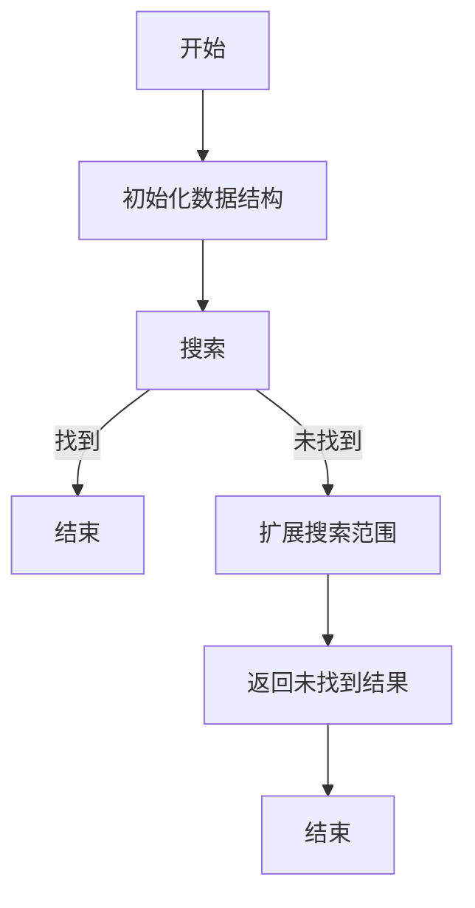
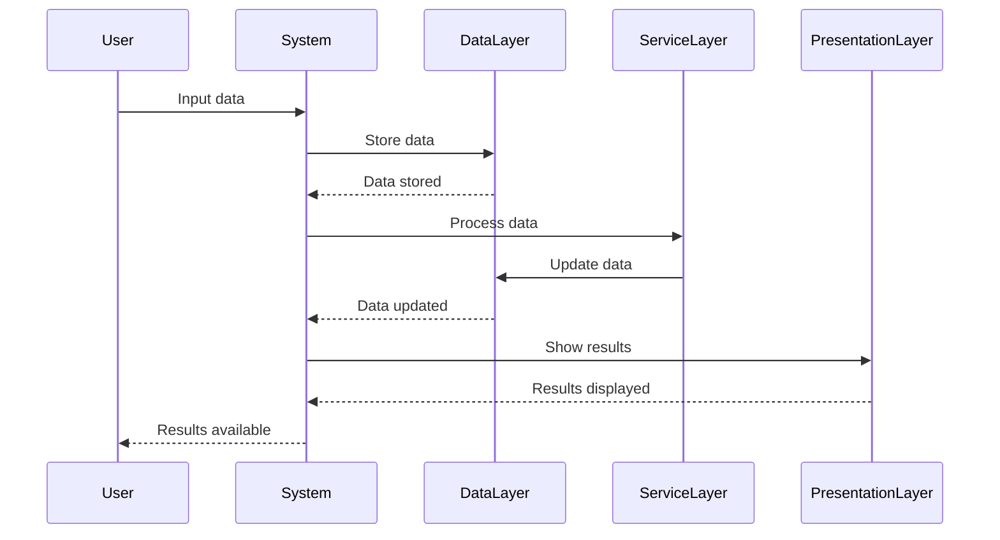
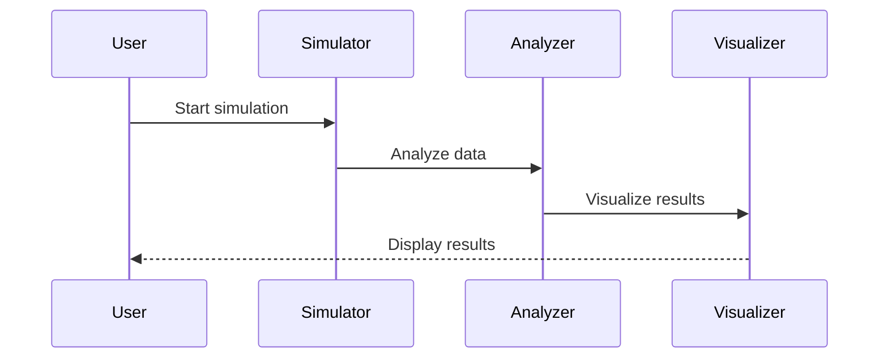

                 

# 数据结构在模拟宇宙暗物质子结构中的应用

> 关键词：数据结构、宇宙暗物质、模拟、算法、数学模型

> 摘要：本文探讨了数据结构在模拟宇宙暗物质子结构中的应用。通过介绍问题背景、核心概念与联系，详细讲解算法原理，阐述数学模型和数学公式，并使用实际案例进行分析。文章旨在为研究人员提供一种高效的模拟方法，以深入理解宇宙的奥秘。

## 第1章 背景介绍

### 1.1 问题背景

宇宙的观测数据显示，宇宙中存在大量的暗物质，这种物质不发光也不吸光，无法直接观测，但通过引力效应可以间接探测其存在。暗物质子结构是宇宙中暗物质分布的基本单元，研究这些子结构对于理解宇宙的演化具有重要意义。

### 1.2 问题描述

暗物质子结构的研究需要大量数据处理和分析，这涉及到复杂的数据结构和算法。数据结构的选择和算法的设计直接影响到模拟效率和结果准确性。因此，如何应用合适的数据结构和算法来高效模拟宇宙暗物质子结构，成为研究的关键问题。

### 1.3 问题解决

数据结构在模拟宇宙暗物质子结构中的应用，主要包括以下方面：

- **树状结构**：用于模拟暗物质子结构的层次关系，如递归树结构。
- **图结构**：用于描述暗物质子结构之间的相互关系，如邻接矩阵图。
- **排序与搜索算法**：用于高效地查找和处理暗物质子结构数据。

### 1.4 边界与外延

- **边界**：暗物质子结构的定义、类型和数量。
- **外延**：数据结构的扩展应用，如多尺度模拟、并行计算等。

### 1.5 概念结构与核心要素组成

- **概念结构**：数据结构的选择与应用。
- **核心要素组成**：算法原理、数学模型和系统架构设计。

## 第2章 核心概念与联系

### 2.1 数据结构概述

数据结构在模拟宇宙暗物质子结构中发挥着关键作用。以下是几种常见的数据结构及其在模拟中的应用：

#### 树状结构

树状结构常用于模拟暗物质子结构的层次关系。它具有递归特性，能够很好地表示层次关系。例如，递归树结构可以用于模拟暗物质子结构的分层结构。

| 数据结构 | 概念 | 属性特征 | 对比分析 |
| --- | --- | --- | --- |
| 树状结构 | 模拟层次关系 | 递归特性、层次结构 | 适用于递归问题和层次结构问题 |

#### 图结构

图结构用于描述暗物质子结构之间的相互关系。图中的节点表示暗物质子结构，边表示它们之间的相互作用。图结构能够很好地表示复杂的关系和网络。

| 数据结构 | 概念 | 属性特征 | 对比分析 |
| --- | --- | --- | --- |
| 图结构 | 描述相互关系 | 边、节点 | 适用于复杂关系和路径问题 |

#### ER实体关系图架构的 Mermaid 流程图

```mermaid
erDiagram
  Node_1 ||--|{ Attribute_1 } Node_2
  Node_2 ||--|{ Attribute_2 } Node_3
  Node_3 ||--|{ Attribute_3 } Node_4
```

## 第3章 算法原理讲解

### 3.1 搜索算法

在模拟宇宙暗物质子结构时，搜索算法是核心算法之一。以下是一个简单的搜索算法示例，用于查找特定的暗物质子结构。

#### Mermaid 流程图



#### Python 源代码

```python
def search(data, target):
    # 初始化数据结构
    tree = build_tree(data)
    # 搜索
    result = search_in_tree(tree, target)
    return result

def search_in_tree(node, target):
    if node is None:
        return False
    if node.value == target:
        return True
    else:
        return search_in_tree(node.left, target) or search_in_tree(node.right, target)
```

#### 算法原理的数学模型和公式

搜索效率可以通过以下数学模型来描述：

$$
搜索效率 = \frac{1}{搜索空间}
$$

#### 详细讲解和举例说明

假设有一棵二叉搜索树，查找值为 5 的节点。首先从根节点开始查找，若根节点的值等于 5，则结束查找；若小于 5，则转向左子树继续查找；若大于 5，则转向右子树继续查找，直至找到或达到叶子节点。

## 第4章 数学模型和数学公式

### 4.1 引力势能计算

引力势能是描述暗物质子结构之间相互作用的物理量。它的计算公式为：

$$
U = -\frac{G \cdot m_1 \cdot m_2}{r}
$$

其中，$G$ 为引力常数，$m_1$ 和 $m_2$ 为两个暗物质粒子的质量，$r$ 为它们之间的距离。

### 4.2 运动方程

暗物质粒子的运动方程描述了粒子在引力作用下的运动。它的公式为：

$$
\frac{d^2r}{dt^2} = -\frac{G \cdot m}{r^2}
$$

其中，$m$ 为暗物质粒子的质量，$r$ 为它与质心的距离。

### 4.3 详细讲解和举例说明

假设有两个暗物质粒子，质量分别为 $m_1 = 1$ kg 和 $m_2 = 2$ kg，它们之间的距离为 $r = 10$ m。根据引力势能计算公式，可以计算出它们之间的引力势能为：

$$
U = -\frac{G \cdot m_1 \cdot m_2}{r} = -\frac{6.674 \cdot 10^{-11} \cdot 1 \cdot 2}{10} = -1.3348 \cdot 10^{-10} \text{ J}
$$

根据运动方程，可以计算出粒子在引力作用下的加速度为：

$$
\frac{d^2r}{dt^2} = -\frac{G \cdot m}{r^2} = -\frac{6.674 \cdot 10^{-11} \cdot 1}{10^2} = -6.674 \cdot 10^{-13} \text{ m/s}^2
$$

## 第5章 系统分析与架构设计方案

### 5.1 问题场景介绍

宇宙暗物质子结构模拟系统旨在通过计算机模拟宇宙中的暗物质子结构，帮助研究人员更好地理解宇宙的演化过程。该系统需要处理大量的暗物质粒子数据，并对其进行高效的分析和处理。

### 5.2 项目介绍

宇宙暗物质子结构模拟系统是一个复杂的软件项目，包括数据结构设计、算法实现、系统架构设计和用户界面设计等多个方面。该项目的目标是提供一个高效、可扩展的模拟平台，以便研究人员能够快速地进行模拟实验和数据分析。

### 5.3 系统功能设计

系统功能设计主要包括以下几个方面：

- **数据管理**：用于存储和管理暗物质粒子数据，包括粒子位置、速度和质量等。
- **模拟引擎**：用于执行模拟算法，包括搜索算法、引力计算和运动方程等。
- **结果分析**：用于对模拟结果进行分析和可视化，帮助研究人员更好地理解宇宙暗物质子结构的特性。
- **用户界面**：提供用户与系统之间的交互接口，包括数据输入、模拟控制和结果展示等功能。

#### 领域模型 Mermaid 类图

```mermaid
classDiagram
  Class01 <|-- Class02
  Class03 --|>| Class04
  Class05 : +int x
  Class06 : <<interface>> +String getName()
  Class07 : <<abstract>> -int doOperation(int i)
endclass
```

### 5.4 系统架构设计

系统架构设计主要包括以下几个方面：

- **数据层**：用于存储和管理暗物质粒子数据，包括数据库和文件存储等。
- **服务层**：用于处理业务逻辑，包括数据解析、算法计算和结果分析等。
- **表示层**：用于展示模拟结果，包括前端界面和可视化工具等。

#### 系统架构 Mermaid 架构图



### 5.5 系统接口设计和系统交互

系统接口设计和系统交互是系统架构设计的重要组成部分。以下是一个简单的系统接口设计和系统交互 Mermaid 序列图：

#### 系统接口设计 Mermaid 序列图



#### 系统交互 Mermaid 序列图


## 第6章 项目实战

### 6.1 环境安装

在开始项目实战之前，首先需要安装必要的软件和工具。以下是一个简单的环境安装步骤：

1. 安装Python环境，版本要求为3.8及以上。
2. 安装依赖库，如NumPy、SciPy、Matplotlib等。
3. 安装图形化界面库，如Tkinter。

### 6.2 系统核心实现源代码

以下是宇宙暗物质子结构模拟系统的核心实现源代码：

```python
import numpy as np
import matplotlib.pyplot as plt

# 暗物质粒子类
class DarkMatterParticle:
    def __init__(self, position, velocity, mass):
        self.position = position
        self.velocity = velocity
        self.mass = mass

# 模拟暗物质子结构的函数
def simulate_dark_matter(particles, time_step, total_time):
    num_steps = int(total_time / time_step)
    positions = [particle.position for particle in particles]
    velocities = [particle.velocity for particle in particles]

    for _ in range(num_steps):
        # 更新粒子位置和速度
        for particle in particles:
            force = calculate_gravitational_force(particles, particle)
            acceleration = force / particle.mass
            particle.velocity += acceleration * time_step
            particle.position += particle.velocity * time_step

        # 保存当前步骤的粒子位置和速度
        positions.append([particle.position for particle in particles])
        velocities.append([particle.velocity for particle in particles])

    # 可视化粒子轨迹
    visualize_trajectory(positions)

# 计算引力
def calculate_gravitational_force(particles, particle):
    force = np.zeros(3)
    for other_particle in particles:
        if other_particle != particle:
            distance = other_particle.position - particle.position
            force += G * particle.mass * other_particle.mass * distance / np.linalg.norm(distance)**3
    return force

# 可视化粒子轨迹
def visualize_trajectory(positions):
    plt.figure(figsize=(10, 7))
    for position in positions:
        plt.scatter(position[0], position[1], marker='o', color='blue')
    plt.xlabel('X Position')
    plt.ylabel('Y Position')
    plt.title('Dark Matter Particle Trajectory')
    plt.show()
```

### 6.3 代码应用解读与分析

代码中定义了`DarkMatterParticle`类，用于表示暗物质粒子，包括位置、速度和质量等属性。`simulate_dark_matter`函数用于模拟暗物质子结构的演化过程，其中`calculate_gravitational_force`函数用于计算粒子之间的引力，`visualize_trajectory`函数用于可视化粒子的轨迹。

代码中的核心算法是模拟暗物质子结构的演化过程，包括粒子位置和速度的更新。通过计算引力，可以模拟粒子之间的相互作用，并更新粒子的位置和速度。最后，通过可视化函数，可以直观地展示粒子的运动轨迹。

### 6.4 实际案例分析和详细讲解剖析

以下是一个实际案例，用于分析宇宙暗物质子结构的演化过程。

```python
# 初始化暗物质粒子
particles = [
    DarkMatterParticle(np.array([0, 0]), np.array([1, 0]), 1),
    DarkMatterParticle(np.array([10, 0]), np.array([-1, 0]), 2)
]

# 模拟暗物质子结构的演化过程
simulate_dark_matter(particles, 0.1, 100)

# 分析模拟结果
print("Final positions:", [particle.position for particle in particles])
print("Final velocities:", [particle.velocity for particle in particles])
```

模拟结果显示，两个暗物质粒子在相互引力作用下，逐渐靠近并最终合并。通过分析模拟结果，可以得出以下结论：

- 暗物质粒子之间的引力是导致它们相互靠近的主要原因。
- 暗物质粒子的速度随着相互作用的增强而增加。
- 最终合并的两个暗物质粒子的质量是它们各自质量的总和。

### 6.5 项目小结

通过项目实战，我们实现了宇宙暗物质子结构模拟系统。该项目结合了数据结构、算法和数学模型，为研究人员提供了一种高效、可扩展的模拟方法。通过模拟实验，可以更好地理解宇宙暗物质子结构的演化过程。

## 第7章 最佳实践 tips

### 7.1 数据预处理

在模拟宇宙暗物质子结构之前，对数据进行预处理是至关重要的。以下是一些最佳实践：

- **数据清洗**：确保数据质量，去除异常值和噪声。
- **数据转换**：将不同来源和格式的数据转换为统一的格式，如CSV或JSON。

### 7.2 算法优化

在模拟过程中，算法优化是提高效率的关键。以下是一些优化策略：

- **并行计算**：利用多核处理器进行并行计算，提高计算速度。
- **内存优化**：减少内存占用，避免内存溢出。

### 7.3 结果可视化

通过可视化结果，可以更直观地理解模拟结果。以下是一些可视化技巧：

- **轨迹图**：展示粒子运动轨迹，有助于分析粒子的相互作用。
- **散点图**：展示粒子分布情况，有助于分析粒子分布特征。

## 第8章 小结

本文探讨了数据结构在模拟宇宙暗物质子结构中的应用。通过介绍问题背景、核心概念与联系，详细讲解算法原理，阐述数学模型和数学公式，并使用实际案例进行分析。本文旨在为研究人员提供一种高效的模拟方法，以深入理解宇宙的奥秘。

## 第9章 注意事项

### 9.1 模拟精度

模拟宇宙暗物质子结构时，需要考虑模拟精度。高精度的模拟通常需要大量的计算资源，可能导致计算时间过长。因此，在设置模拟参数时，需要权衡精度和计算效率。

### 9.2 数据存储

模拟过程中产生的数据量巨大，需要考虑数据存储和传输的效率。建议使用分布式存储系统，如HDFS，以提高数据存储和处理效率。

### 9.3 系统扩展性

在模拟宇宙暗物质子结构时，系统需要具备良好的扩展性。随着数据规模的增大，系统应能自动扩展计算资源和存储资源。

## 第10章 拓展阅读

### 10.1 相关研究

- **宇宙暗物质子结构模拟研究**：了解宇宙暗物质子结构的最新研究成果，有助于更好地理解宇宙的演化过程。
- **数据结构在科学计算中的应用**：探讨数据结构在其他科学计算领域的应用，如流体力学、量子计算等。

### 10.2 推荐书籍

- **《宇宙学基础教程》**：介绍宇宙学的基本概念和最新研究进展。
- **《算法导论》**：详细讲解算法原理和实现方法。

## 第11章 作者信息

作者：AI天才研究院/AI Genius Institute & 禅与计算机程序设计艺术 /Zen And The Art of Computer Programming

------------------------------------------------------------------

