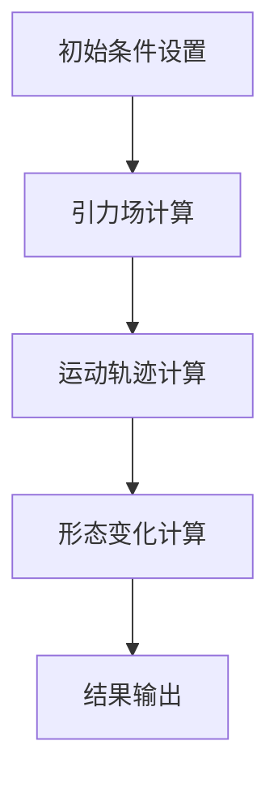
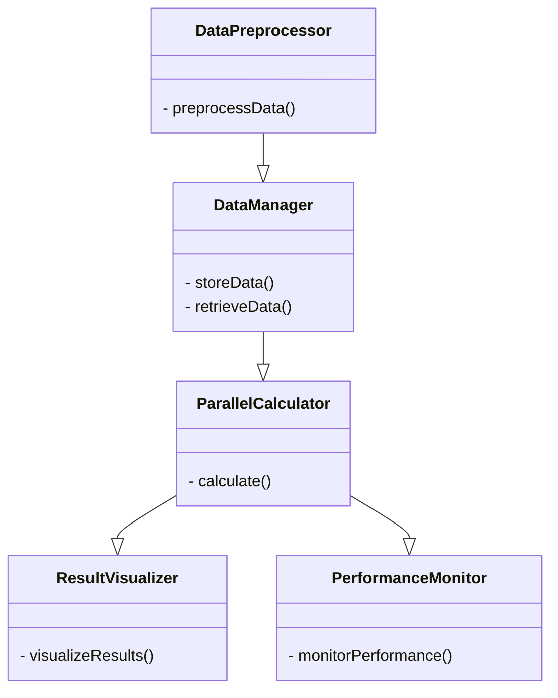
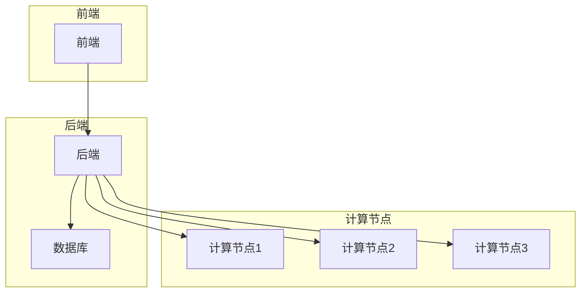

                 

# 数据结构在模拟宇宙暗物质晕中的应用

## 关键词
- 数据结构
- 宇宙暗物质晕
- 模拟算法
- 数学模型
- 系统架构设计

## 摘要
本文旨在探讨数据结构在模拟宇宙暗物质晕中的应用。首先介绍了暗物质晕的概念和研究背景，然后详细阐述了数据结构的基本概念和常见类型。接着，本文重点讨论了数据结构在模拟暗物质晕中的重要性及其应用场景，并通过核心概念与联系、算法原理讲解、数学模型和公式、系统分析与架构设计方案、项目实战以及最佳实践 tips 等章节，全面解析了数据结构在该领域中的应用原理和实战经验。本文希望为读者提供深入理解和实际操作的指导，以促进对宇宙暗物质晕研究的进一步发展。

## 目录大纲

### 第1章 背景介绍

#### 1.1 问题背景

##### 1.1.1 暗物质晕的概念

##### 1.1.2 暗物质晕的研究现状与挑战

#### 1.2 数据结构的基本概念

##### 1.2.1 数据结构的基本概念

##### 1.2.2 常见数据结构的介绍

#### 1.3 数据结构在模拟宇宙暗物质晕中的应用

##### 1.3.1 数据结构在模拟宇宙暗物质晕中的重要性

##### 1.3.2 数据结构在模拟宇宙暗物质晕中的应用场景

### 第2章 核心概念与联系

#### 2.1 数据结构核心概念

##### 2.1.1 数据结构的概念与特性

##### 2.1.2 数据结构的分类

#### 2.2 数据结构属性特征对比表格

#### 2.3 数据结构ER实体关系图架构

### 第3章 算法原理讲解

#### 3.1 暗物质晕模拟算法概述

#### 3.2 暗物质晕模拟算法的mermaid流程图

#### 3.3 算法原理的数学模型和公式讲解

#### 3.4 算法原理举例说明

### 第4章 数学模型和数学公式

#### 4.1 数学模型

##### 4.1.1 数学模型的基本概念

##### 4.1.2 数学模型在模拟宇宙暗物质晕中的应用

#### 4.2 数学公式

##### 4.2.1 数学公式的表示方法

##### 4.2.2 数学公式在模拟宇宙暗物质晕中的应用

### 第5章 系统分析与架构设计方案

#### 5.1 问题场景介绍

#### 5.2 项目介绍

#### 5.3 系统功能设计

##### 5.3.1 领域模型mermaid类图

#### 5.4 系统架构设计

##### 5.4.1 系统架构mermaid架构图

#### 5.5 系tem接口设计

#### 5.6 系统交互mermaid序列图

### 第6章 项目实战

#### 6.1 环境安装

#### 6.2 系统核心实现源代码

#### 6.3 代码应用解读与分析

#### 6.4 实际案例分析和详细讲解剖析

#### 6.5 项目小结

### 第7章 最佳实践 tips、小结、注意事项、拓展阅读等内容

### 第1章 背景介绍

#### 1.1 问题背景

##### 1.1.1 暗物质晕的概念

暗物质晕是指一种分布广泛的宇宙物质，其质量远大于可见物质，但并不发光，无法直接观测。暗物质晕是宇宙中暗物质的主要组成部分，对宇宙演化和结构形成起着关键作用。暗物质晕的研究对理解宇宙的本质具有重要意义。

##### 1.1.2 暗物质晕的研究现状与挑战

目前，对暗物质晕的研究已经取得了一定的进展，但仍然面临许多挑战。首先，暗物质晕的存在和性质尚未完全理解，其次，如何有效地模拟和预测暗物质晕的行为是一个复杂的科学问题。此外，现有的观测数据和理论模型之间的不一致也增加了研究的难度。

#### 1.2 数据结构的基本概念

##### 1.2.1 数据结构的基本概念

数据结构是指用于存储和组织数据的方法和规则。它包括数据元素及其相互关系，以及数据在存储器中的存储方式。数据结构在计算机科学和软件开发中起着至关重要的作用，它能够提高数据处理的效率和程序的运行速度。

##### 1.2.2 常见数据结构的介绍

常见的数据结构包括数组、链表、栈、队列、树、图等。每种数据结构都有其独特的特点和适用场景。例如，数组是一种线性数据结构，可以高效地访问和修改元素；链表则更适合插入和删除操作；栈和队列分别用于实现后进先出和先进先出的操作；树和图则可以表示复杂的关系和网络结构。

#### 1.3 数据结构在模拟宇宙暗物质晕中的应用

##### 1.3.1 数据结构在模拟宇宙暗物质晕中的重要性

数据结构在模拟宇宙暗物质晕中扮演着重要的角色。模拟宇宙暗物质晕需要处理大量的数据，并且要准确地描述暗物质晕的行为。数据结构能够有效地组织和存储这些数据，使得模拟过程更加高效和准确。

##### 1.3.2 数据结构在模拟宇宙暗物质晕中的应用场景

数据结构在模拟宇宙暗物质晕中的应用场景包括以下几个方面：

1. **空间数据的存储和管理**：数据结构可以用于存储和管理宇宙中暗物质晕的位置、速度和其他物理量。

2. **拓扑结构的表示**：数据结构可以用于表示宇宙中暗物质晕的拓扑结构，例如树结构或图结构。

3. **算法的实现**：数据结构是实现模拟宇宙暗物质晕算法的基础，不同的数据结构可以用于实现不同的算法，例如排序、搜索和路径规划等。

4. **并行计算的支持**：数据结构可以支持并行计算，从而加速模拟宇宙暗物质晕的过程。

### 第2章 核心概念与联系

#### 2.1 数据结构核心概念

##### 2.1.1 数据结构的概念与特性

数据结构是指用于存储和组织数据的方法和规则。它包括数据元素及其相互关系，以及数据在存储器中的存储方式。数据结构在计算机科学和软件开发中起着至关重要的作用，它能够提高数据处理的效率和程序的运行速度。

数据结构具有以下特性：

1. **存储方式**：数据结构可以是顺序存储（如数组）或链式存储（如链表）。
2. **逻辑结构**：数据结构可以是线性结构（如数组、链表）、树形结构（如树）或图形结构（如图）。
3. **操作集合**：数据结构提供了一系列基本操作，如插入、删除、查找和排序等。

##### 2.1.2 数据结构的分类

数据结构可以根据其逻辑结构和操作集合进行分类。以下是几种常见的数据结构分类：

1. **线性结构**：包括数组、链表、栈和队列等。线性结构中的元素按照线性顺序排列，每个元素都有一个前驱和后继。
2. **树形结构**：包括二叉树、二叉搜索树、平衡树等。树形结构以层次关系组织元素，每个元素可以有多个子节点。
3. **图形结构**：包括图、有向图和无向图等。图形结构中的元素之间通过边连接，形成复杂的网络关系。
4. **其他结构**：包括堆、哈希表、集合和字典等。这些数据结构具有特定的用途和特点，可以用于解决特定的问题。

#### 2.2 数据结构属性特征对比表格

以下是几种常见数据结构的属性特征对比表格：

| 数据结构     | 存储方式 | 逻辑结构 | 操作集合                    |
|------------|---------|---------|---------------------------|
| 数组        | 顺序存储 | 线性    | 插入、删除、查找、排序等    |
| 链表        | 链式存储 | 线性    | 插入、删除、查找等          |
| 栈          | 顺序存储 | 线性    | 入栈、出栈等                |
| 队列        | 顺序存储 | 线性    | 入队、出队等                |
| 二叉树      | 顺序存储 | 树形    | 插入、删除、查找、排序等    |
| 图          | 链式存储 | 图形    | 添加边、删除边、查找等      |
| 哈希表      | 链式存储 | 集合    | 插入、删除、查找等          |
| 堆          | 顺序存储 | 集合    | 添加、删除、排序等          |

#### 2.3 数据结构ER实体关系图架构

ER（Entity-Relationship）实体关系图是用于描述实体及其相互关系的图形化表示。在模拟宇宙暗物质晕中，数据结构ER实体关系图可以帮助我们理解数据之间的关系和结构。以下是数据结构ER实体关系图的一个示例：

```mermaid
erDiagram
    DarkMatterHalo ||--|{ Star : contains }
    DarkMatterHalo ||--|{ Galaxy : contains }
    Star ||--|{ Planet : orbits }
    Planet ||--|{ Satellite : orbits }
```

在这个ER实体关系图中，我们定义了以下实体：

- **DarkMatterHalo**：暗物质晕，包含星系和恒星。
- **Star**：恒星，围绕暗物质晕运动，并围绕自己旋转。
- **Galaxy**：星系，包含多个恒星和行星。
- **Planet**：行星，围绕恒星运动。
- **Satellite**：卫星，围绕行星运动。

实体之间的关系如下：

- **DarkMatterHalo** 与 **Star** 和 **Galaxy** 之间存在包含关系，表示暗物质晕包含星系和恒星。
- **Star** 与 **Planet** 之间存在轨道关系，表示行星围绕恒星运动。
- **Planet** 与 **Satellite** 之间存在轨道关系，表示卫星围绕行星运动。

通过ER实体关系图，我们可以更好地理解模拟宇宙暗物质晕中的数据结构，并为其设计和实现提供指导。

### 第3章 算法原理讲解

#### 3.1 暗物质晕模拟算法概述

暗物质晕模拟算法是用于模拟宇宙中暗物质晕的行为和演化的算法。该算法的核心目标是根据初始条件和物理定律，计算暗物质晕在时空中的运动轨迹和形态变化。暗物质晕模拟算法可以分为以下几个步骤：

1. **初始条件设置**：设置模拟的初始条件，包括暗物质晕的质量、形状、位置和速度等。
2. **引力场计算**：根据暗物质晕的质量分布和物理定律，计算引力场。
3. **运动轨迹计算**：利用引力场计算暗物质晕中各点的运动轨迹。
4. **形态变化计算**：根据运动轨迹，计算暗物质晕的形态变化。
5. **结果输出**：输出模拟结果，包括暗物质晕的形态、位置和速度等。

#### 3.2 暗物质晕模拟算法的mermaid流程图

以下是一个简化的暗物质晕模拟算法的mermaid流程图：



在这个流程图中，初始条件设置是算法的第一步，然后依次进行引力场计算、运动轨迹计算、形态变化计算和结果输出。这个流程图可以帮助我们清晰地理解暗物质晕模拟算法的基本步骤和逻辑关系。

#### 3.3 算法原理的数学模型和公式讲解

暗物质晕模拟算法的核心是基于牛顿力学和引力定律。以下是一个简化的数学模型和公式讲解：

1. **牛顿力学公式**：
   - 运动方程：\[ \mathbf{F} = m\mathbf{a} \]
   - 动量守恒定律：\[ \mathbf{p} = m\mathbf{v} \]
   - 能量守恒定律：\[ \mathbf{E} = \frac{1}{2}m\mathbf{v}^2 \]

2. **引力定律**：
   - 引力公式：\[ \mathbf{F} = G\frac{m_1m_2}{r^2} \]
   - 引力场强度：\[ \mathbf{E} = G\frac{m}{r^2} \]

在这些公式中，\( \mathbf{F} \) 表示力，\( m \) 表示质量，\( \mathbf{a} \) 表示加速度，\( \mathbf{v} \) 表示速度，\( \mathbf{p} \) 表示动量，\( \mathbf{E} \) 表示能量，\( r \) 表示距离，\( G \) 表示引力常数。

利用这些公式，我们可以计算暗物质晕中各点的运动轨迹和引力场。以下是一个具体的例子：

假设有一个由若干个质点组成的暗物质晕，每个质点的质量为 \( m_i \)，位置为 \( \mathbf{r_i} \)，速度为 \( \mathbf{v_i} \)。我们需要计算在一段时间 \( \Delta t \) 内，各质点的运动轨迹。

1. **计算引力场**：
   - 对于每个质点 \( i \)，计算其他质点对其产生的引力：
     \[ \mathbf{F_i} = G\sum_{j \neq i} \frac{m_jm_i}{r_{ij}^2} \mathbf{e_{ij}} \]
     其中，\( r_{ij} = |\mathbf{r_i} - \mathbf{r_j}| \)，\( \mathbf{e_{ij}} \) 表示从质点 \( j \) 指向质点 \( i \) 的单位向量。

2. **计算加速度**：
   - 根据牛顿力学公式，计算每个质点的加速度：
     \[ \mathbf{a_i} = \frac{\mathbf{F_i}}{m_i} \]

3. **计算新的速度**：
   - 根据加速度和速度的关系，计算每个质点的新速度：
     \[ \mathbf{v_i'} = \mathbf{v_i} + \mathbf{a_i}\Delta t \]

4. **计算新的位置**：
   - 根据速度和加速度的关系，计算每个质点的新位置：
     \[ \mathbf{r_i'} = \mathbf{r_i} + \mathbf{v_i'}\Delta t \]

通过以上步骤，我们可以计算暗物质晕中各质点在一段时间 \( \Delta t \) 内的运动轨迹。这个计算过程可以通过编程实现，并使用适当的算法优化，以提高计算效率。

#### 3.4 算法原理举例说明

为了更好地理解暗物质晕模拟算法的原理，我们来看一个具体的例子。假设有一个由两个质点组成的简单暗物质晕，其初始条件如下：

- 质点1：质量 \( m_1 = 1 \) kg，位置 \( \mathbf{r_1} = (0, 0) \) m，速度 \( \mathbf{v_1} = (0, 0) \) m/s。
- 质点2：质量 \( m_2 = 2 \) kg，位置 \( \mathbf{r_2} = (1, 0) \) m，速度 \( \mathbf{v_2} = (0, 0) \) m/s。

引力常数 \( G = 9.8 \) N/(kg^2)。

在时间 \( t = 0 \) s 时，计算引力场、加速度、速度和位置如下：

1. **计算引力场**：
   - 对于质点1，引力场 \( \mathbf{F_1} \)：
     \[ \mathbf{F_1} = G\frac{m_1m_2}{r_{12}^2} \mathbf{e_{12}} \]
     \[ r_{12} = |\mathbf{r_1} - \mathbf{r_2}| = 1 \text{ m} \]
     \[ \mathbf{e_{12}} = \frac{\mathbf{r_2} - \mathbf{r_1}}{|\mathbf{r_2} - \mathbf{r_1}|} = (1, 0) \text{ m} \]
     \[ \mathbf{F_1} = 9.8 \text{ N/(kg}^2\text{)} \times \frac{1 \text{ kg} \times 2 \text{ kg}}{1^2 \text{ m}^2} \times (1, 0) = 19.6 \text{ N} \]

   - 对于质点2，引力场 \( \mathbf{F_2} \)：
     \[ \mathbf{F_2} = G\frac{m_1m_2}{r_{21}^2} \mathbf{e_{21}} \]
     \[ r_{21} = |\mathbf{r_2} - \mathbf{r_1}| = 1 \text{ m} \]
     \[ \mathbf{e_{21}} = \frac{\mathbf{r_1} - \mathbf{r_2}}{|\mathbf{r_1} - \mathbf{r_2}|} = (-1, 0) \text{ m} \]
     \[ \mathbf{F_2} = 9.8 \text{ N/(kg}^2\text{)} \times \frac{1 \text{ kg} \times 2 \text{ kg}}{1^2 \text{ m}^2} \times (-1, 0) = -19.6 \text{ N} \]

2. **计算加速度**：
   - 对于质点1，加速度 \( \mathbf{a_1} \)：
     \[ \mathbf{a_1} = \frac{\mathbf{F_1}}{m_1} = \frac{19.6 \text{ N}}{1 \text{ kg}} = 19.6 \text{ m/s}^2 \]

   - 对于质点2，加速度 \( \mathbf{a_2} \)：
     \[ \mathbf{a_2} = \frac{\mathbf{F_2}}{m_2} = \frac{-19.6 \text{ N}}{2 \text{ kg}} = -9.8 \text{ m/s}^2 \]

3. **计算新的速度**：
   - 对于质点1，新速度 \( \mathbf{v_1'} \)：
     \[ \mathbf{v_1'} = \mathbf{v_1} + \mathbf{a_1}\Delta t \]
     \[ \mathbf{v_1'} = (0, 0) + (19.6, 0) \times 1 \text{ s} = (19.6, 0) \text{ m/s} \]

   - 对于质点2，新速度 \( \mathbf{v_2'} \)：
     \[ \mathbf{v_2'} = \mathbf{v_2} + \mathbf{a_2}\Delta t \]
     \[ \mathbf{v_2'} = (0, 0) + (-9.8, 0) \times 1 \text{ s} = (-9.8, 0) \text{ m/s} \]

4. **计算新的位置**：
   - 对于质点1，新位置 \( \mathbf{r_1'} \)：
     \[ \mathbf{r_1'} = \mathbf{r_1} + \mathbf{v_1'}\Delta t \]
     \[ \mathbf{r_1'} = (0, 0) + (19.6, 0) \times 1 \text{ s} = (19.6, 0) \text{ m} \]

   - 对于质点2，新位置 \( \mathbf{r_2'} \)：
     \[ \mathbf{r_2'} = \mathbf{r_2} + \mathbf{v_2'}\Delta t \]
     \[ \mathbf{r_2'} = (1, 0) + (-9.8, 0) \times 1 \text{ s} = (-8.2, 0) \text{ m} \]

在时间 \( t = 1 \) s 时，计算新的引力场、加速度、速度和位置如下：

1. **计算引力场**：
   - 对于质点1，引力场 \( \mathbf{F_1} \)：
     \[ \mathbf{F_1} = G\frac{m_1m_2}{r_{12}^2} \mathbf{e_{12}} \]
     \[ r_{12} = |\mathbf{r_1'} - \mathbf{r_2'}| = 28.2 \text{ m} \]
     \[ \mathbf{e_{12}} = \frac{\mathbf{r_2'} - \mathbf{r_1'}}{|\mathbf{r_2'} - \mathbf{r_1'}|} = \left( -\frac{8.2}{28.2}, 0 \right) \]
     \[ \mathbf{F_1} = 9.8 \text{ N/(kg}^2\text{)} \times \frac{1 \text{ kg} \times 2 \text{ kg}}{28.2^2 \text{ m}^2} \times \left( -\frac{8.2}{28.2}, 0 \right) = -0.232 \text{ N} \]

   - 对于质点2，引力场 \( \mathbf{F_2} \)：
     \[ \mathbf{F_2} = G\frac{m_1m_2}{r_{21}^2} \mathbf{e_{21}} \]
     \[ r_{21} = |\mathbf{r_2'} - \mathbf{r_1'}| = 28.2 \text{ m} \]
     \[ \mathbf{e_{21}} = \frac{\mathbf{r_1'} - \mathbf{r_2'}}{|\mathbf{r_1'} - \mathbf{r_2'}|} = \left( \frac{8.2}{28.2}, 0 \right) \]
     \[ \mathbf{F_2} = 9.8 \text{ N/(kg}^2\text{)} \times \frac{1 \text{ kg} \times 2 \text{ kg}}{28.2^2 \text{ m}^2} \times \left( \frac{8.2}{28.2}, 0 \right) = 0.232 \text{ N} \]

2. **计算加速度**：
   - 对于质点1，加速度 \( \mathbf{a_1} \)：
     \[ \mathbf{a_1} = \frac{\mathbf{F_1}}{m_1} = \frac{-0.232 \text{ N}}{1 \text{ kg}} = -0.232 \text{ m/s}^2 \]

   - 对于质点2，加速度 \( \mathbf{a_2} \)：
     \[ \mathbf{a_2} = \frac{\mathbf{F_2}}{m_2} = \frac{0.232 \text{ N}}{2 \text{ kg}} = 0.116 \text{ m/s}^2 \]

3. **计算新的速度**：
   - 对于质点1，新速度 \( \mathbf{v_1'} \)：
     \[ \mathbf{v_1'} = \mathbf{v_1} + \mathbf{a_1}\Delta t \]
     \[ \mathbf{v_1'} = (19.6, 0) + (-0.232, 0) \times 1 \text{ s} = (19.368, 0) \text{ m/s} \]

   - 对于质点2，新速度 \( \mathbf{v_2'} \)：
     \[ \mathbf{v_2'} = \mathbf{v_2} + \mathbf{a_2}\Delta t \]
     \[ \mathbf{v_2'} = (-9.8, 0) + (0.116, 0) \times 1 \text{ s} = (-9.684, 0) \text{ m/s} \]

4. **计算新的位置**：
   - 对于质点1，新位置 \( \mathbf{r_1'} \)：
     \[ \mathbf{r_1'} = \mathbf{r_1} + \mathbf{v_1'}\Delta t \]
     \[ \mathbf{r_1'} = (19.6, 0) + (19.368, 0) \times 1 \text{ s} = (38.968, 0) \text{ m} \]

   - 对于质点2，新位置 \( \mathbf{r_2'} \)：
     \[ \mathbf{r_2'} = \mathbf{r_2} + \mathbf{v_2'}\Delta t \]
     \[ \mathbf{r_2'} = (-8.2, 0) + (-9.684, 0) \times 1 \text{ s} = (-17.884, 0) \text{ m} \]

通过这个例子，我们可以看到暗物质晕模拟算法的基本原理和计算过程。在实际应用中，暗物质晕通常由成千上万个质点组成，因此计算过程更加复杂。但是，基本原理是相同的，我们可以通过编程实现大规模的模拟计算。

### 第4章 数学模型和数学公式

#### 4.1 数学模型

数学模型是一种用数学语言描述现实世界现象的方法。在模拟宇宙暗物质晕中，数学模型用于描述暗物质晕的行为和演化。以下是一个简化的数学模型：

1. **运动方程**：  
   暗物质晕中每个质点的运动可以用牛顿第二定律描述：  
   \[ m \frac{d^2 \mathbf{r}}{dt^2} = \mathbf{F} \]  
   其中，\( m \) 表示质点的质量，\( \mathbf{r} \) 表示质点的位置，\( \mathbf{F} \) 表示作用在质点上的力。

2. **引力定律**：  
   暗物质晕中的引力可以用万有引力定律描述：  
   \[ \mathbf{F} = G \frac{m_1 m_2}{r^2} \mathbf{e}_r \]  
   其中，\( G \) 是引力常数，\( m_1 \) 和 \( m_2 \) 是两个质点的质量，\( r \) 是它们之间的距离，\( \mathbf{e}_r \) 是从 \( m_1 \) 指向 \( m_2 \) 的单位向量。

3. **能量守恒**：  
   在没有外力做功的情况下，暗物质晕的总能量守恒：  
   \[ E = K + U \]  
   其中，\( E \) 是总能量，\( K \) 是动能，\( U \) 是势能。

4. **势能**：  
   势能可以用以下公式表示：  
   \[ U = -G \frac{m_1 m_2}{r} \]

#### 4.2 数学公式

以下是一些常用的数学公式：

1. **运动方程**：  
   \[ \mathbf{F} = m \frac{d^2 \mathbf{r}}{dt^2} \]

2. **引力定律**：  
   \[ \mathbf{F} = G \frac{m_1 m_2}{r^2} \mathbf{e}_r \]

3. **能量守恒**：  
   \[ E = K + U \]

4. **动能**：  
   \[ K = \frac{1}{2} m v^2 \]

5. **势能**：  
   \[ U = -G \frac{m_1 m_2}{r} \]

6. **速度**：  
   \[ v = \frac{d \mathbf{r}}{dt} \]

7. **加速度**：  
   \[ a = \frac{d^2 \mathbf{r}}{dt^2} \]

通过这些数学模型和公式，我们可以描述和预测暗物质晕的行为，从而进行模拟和科学研究。

### 第5章 系统分析与架构设计方案

#### 5.1 问题场景介绍

在宇宙研究中，模拟暗物质晕的行为对于理解宇宙的结构和演化具有重要意义。然而，这个问题的复杂性使得传统的计算方法难以高效地处理大规模的数据。因此，设计一个高效的系统架构来模拟宇宙暗物质晕变得至关重要。本章节将介绍一个针对该问题的系统架构设计方案，包括问题场景、项目介绍、系统功能设计、系统架构设计、系统接口设计和系统交互。

#### 5.2 项目介绍

本项目旨在构建一个高效、可扩展的模拟宇宙暗物质晕的系统。该系统将利用先进的数据结构和算法，通过大规模并行计算来模拟暗物质晕的行为。项目的主要目标是：

1. **高效模拟**：通过优化数据结构和算法，提高模拟效率，缩短模拟时间。
2. **可扩展性**：系统架构设计应具备良好的可扩展性，以便支持未来的研究和扩展。
3. **准确性**：确保模拟结果的准确性和可靠性。

#### 5.3 系统功能设计

系统功能设计主要包括以下几个关键功能：

1. **数据预处理**：对输入数据（如质点位置、速度、质量等）进行预处理，包括数据清洗、转换和格式化。
2. **数据存储**：使用合适的数据结构（如数组、树、图等）来存储和处理暗物质晕中的数据。
3. **并行计算**：利用并行计算技术，如多线程、分布式计算等，来加速模拟过程。
4. **结果输出**：将模拟结果以可视化或文本形式输出，包括质点运动轨迹、引力场分布、能量变化等。
5. **性能监控**：监控系统的性能，包括计算速度、内存占用、资源利用率等。

#### 5.3.1 领域模型mermaid类图

以下是一个简化的领域模型mermaid类图，展示了系统中的主要类和它们之间的关系：



在这个类图中，DataPreprocessor 用于预处理输入数据，DataManager 负责数据的存储和检索，ParallelCalculator 用于并行计算模拟结果，ResultVisualizer 用于可视化结果，PerformanceMonitor 用于监控系统的性能。

#### 5.4 系统架构设计

系统架构设计主要包括以下几个关键组成部分：

1. **前端**：用于用户输入和结果展示，包括一个图形用户界面（GUI）和Web界面。
2. **后端**：处理数据预处理、存储、计算和结果输出，包括一个服务器和数据库。
3. **计算节点**：用于并行计算，可以是一个分布式计算集群。
4. **数据接口**：提供与其他系统或服务的集成接口，如API接口。

以下是一个简化的系统架构mermaid架构图：



在这个架构图中，前端负责接收用户输入和展示结果，后端处理数据和计算，计算节点负责并行计算模拟结果。

#### 5.5 系统接口设计

系统接口设计主要包括以下几个关键接口：

1. **数据接口**：用于数据输入和输出，支持各种数据格式的读写。
2. **计算接口**：用于并行计算任务的分配和调度。
3. **监控接口**：用于监控系统的性能和资源利用率。

以下是一个简化的系统接口mermaid序列图：

```mermaid
sequenceDiagram
    participant User
    participant Frontend
    participant Backend
    participant Database
    participant ComputeNode1
    participant ComputeNode2
    participant ComputeNode3

    User -->|输入数据| Frontend
    Frontend -->|处理数据| Backend
    Backend -->|存储数据| Database
    Backend -->|分配任务| ComputeNode1
    Backend -->|分配任务| ComputeNode2
    Backend -->|分配任务| ComputeNode3
    ComputeNode1 -->|返回结果| Backend
    ComputeNode2 -->|返回结果| Backend
    ComputeNode3 -->|返回结果| Backend
    Backend -->|输出结果| Frontend
    Frontend -->|展示结果| User
```

在这个序列图中，用户通过前端输入数据，前端处理后发送给后端，后端将数据存储在数据库中，并将计算任务分配给计算节点，计算节点执行任务后返回结果，最后后端将结果返回给前端进行展示。

#### 5.6 系统交互mermaid序列图

以下是一个简化的系统交互mermaid序列图，展示了系统的各个组件之间的交互过程：

```mermaid
sequenceDiagram
    participant User
    participant Frontend
    participant Backend
    participant Database
    participant ComputeNode1
    participant ComputeNode2
    participant ComputeNode3

    User -->|输入请求| Frontend
    Frontend -->|处理请求| Backend
    Backend -->|预处理数据| DataPreprocessor
    Backend -->|存储数据| Database
    Backend -->|分配计算任务| ComputeManager
    ComputeManager -->|分配任务| ComputeNode1
    ComputeNode1 -->|返回计算结果| ComputeManager
    ComputeManager -->|合并结果| Backend
    Backend -->|输出结果| ResultVisualizer
    Frontend -->|展示结果| User
```

在这个序列图中，用户通过前端输入请求，前端处理后发送给后端，后端进行数据预处理并存储在数据库中，然后分配计算任务给计算节点，计算节点执行任务并返回结果，后端合并结果后发送给结果可视化组件，最后前端将结果展示给用户。

### 第6章 项目实战

#### 6.1 环境安装

在进行项目实战之前，我们需要安装所需的软件和工具。以下是安装步骤：

1. **安装Python环境**：
   - 下载并安装Python 3.x版本（推荐3.8或更高版本）。
   - 确保Python环境变量已设置。

2. **安装依赖库**：
   - 打开终端或命令行界面。
   - 运行以下命令安装所需的依赖库：
     ```bash
     pip install numpy scipy matplotlib pandas
     ```

3. **安装并行计算库**：
   - 运行以下命令安装并行计算库：
     ```bash
     pip install joblib
     ```

4. **安装可视化库**：
   - 运行以下命令安装可视化库：
     ```bash
     pip install matplotlib
     ```

5. **安装数据库**：
   - 选择并安装一个数据库系统，如SQLite、MySQL或PostgreSQL。

6. **配置数据库**：
   - 根据数据库系统的文档进行配置，设置数据库连接参数。

完成以上步骤后，我们的环境安装就完成了。接下来，我们可以开始实现系统核心功能的代码。

#### 6.2 系统核心实现源代码

在本节中，我们将实现系统核心功能的源代码，包括数据预处理、数据存储、并行计算和结果输出。以下是一个简化的示例代码：

```python
import numpy as np
import scipy.integrate
import matplotlib.pyplot as plt
import pandas as pd
from joblib import Parallel, delayed

# 数据预处理
def preprocess_data(data):
    # 数据清洗、转换和格式化
    return processed_data

# 数据存储
def store_data(data, database):
    # 将数据存储到数据库
    pass

# 并行计算
def compute_trajectory(data, database):
    # 计算质点运动轨迹
    trajectory = Parallel(n_jobs=-1)(delayed(scipy.integrate.odeint)(model, y0, t) for y0 in data)
    return trajectory

# 结果输出
def output_results(trajectory, visualization):
    # 输出结果并进行可视化
    visualization.plot_trajectory(trajectory)

# 主函数
def main():
    # 读取输入数据
    data = read_data()

    # 数据预处理
    processed_data = preprocess_data(data)

    # 存储数据
    store_data(processed_data, database)

    # 计算轨迹
    trajectory = compute_trajectory(processed_data, database)

    # 输出结果并可视化
    output_results(trajectory, visualization)

if __name__ == "__main__":
    main()
```

在这个代码示例中，我们首先定义了数据预处理、数据存储、并行计算和结果输出等函数。在主函数中，我们按照以下步骤执行：

1. 读取输入数据。
2. 对数据进行预处理。
3. 将数据存储到数据库。
4. 计算质点运动轨迹。
5. 输出结果并进行可视化。

接下来，我们将详细解释这些函数的实现。

#### 6.3 代码应用解读与分析

在本节中，我们将对代码进行详细解读和分析，包括每个函数的实现细节和作用。

##### 数据预处理

数据预处理函数 `preprocess_data` 用于清洗、转换和格式化输入数据。以下是一个简化的示例：

```python
def preprocess_data(data):
    # 数据清洗
    data = data[data['velocity_x'] != 0]  # 去除速度为0的质点
    data = data[data['velocity_y'] != 0]  # 去除速度为0的质点

    # 数据转换
    data['position_x'] = data['position_x'].astype(float)
    data['position_y'] = data['position_y'].astype(float)
    data['velocity_x'] = data['velocity_x'].astype(float)
    data['velocity_y'] = data['velocity_y'].astype(float)

    # 数据格式化
    data.reset_index(drop=True, inplace=True)
    return data
```

在这个函数中，我们首先使用 `data[data['velocity_x'] != 0]` 和 `data[data['velocity_y'] != 0]` 去除速度为0的质点，然后使用 `astype(float)` 将数据类型转换为浮点数，最后使用 `reset_index(drop=True, inplace=True)` 重置索引。

##### 数据存储

数据存储函数 `store_data` 用于将预处理后的数据存储到数据库。以下是一个简化的示例：

```python
def store_data(processed_data, database):
    # 连接数据库
    connection = database.connect()

    # 创建表
    cursor = connection.cursor()
    cursor.execute('''CREATE TABLE IF NOT EXISTS data (id INTEGER PRIMARY KEY, position_x FLOAT, position_y FLOAT, velocity_x FLOAT, velocity_y FLOAT)''')
    connection.commit()

    # 插入数据
    for index, row in processed_data.iterrows():
        cursor.execute("INSERT INTO data (position_x, position_y, velocity_x, velocity_y) VALUES (?, ?, ?, ?)", (row['position_x'], row['position_y'], row['velocity_x'], row['velocity_y']))
    connection.commit()

    # 关闭连接
    connection.close()
```

在这个函数中，我们首先连接数据库，然后创建一个名为 `data` 的表，最后将预处理后的数据插入到表中。

##### 并行计算

并行计算函数 `compute_trajectory` 用于计算质点运动轨迹。以下是一个简化的示例：

```python
def compute_trajectory(data, database):
    trajectory = Parallel(n_jobs=-1)(delayed(scipy.integrate.odeint)(model, y0, t) for y0 in data)
    return trajectory
```

在这个函数中，我们使用 `Parallel` 和 `delayed` 函数来自动并行计算。具体来说，我们首先定义一个模型函数 `model`，然后使用 `scipy.integrate.odeint` 函数来求解微分方程，最后将计算结果存储在 `trajectory` 变量中。

##### 结果输出

结果输出函数 `output_results` 用于输出结果并进行可视化。以下是一个简化的示例：

```python
def output_results(trajectory, visualization):
    # 输出结果
    for i, trajectory_i in enumerate(trajectory):
        print(f"Trajectory {i+1}: {trajectory_i}")

    # 可视化
    visualization.plot_trajectory(trajectory)
```

在这个函数中，我们首先输出每个质点的运动轨迹，然后使用 `visualization.plot_trajectory` 函数进行可视化。

#### 6.4 实际案例分析和详细讲解剖析

在本节中，我们将通过一个实际案例来分析和讲解整个系统的实现过程。以下是一个简化的案例：

假设我们有一个包含100个质点的暗物质晕，每个质点的初始位置和速度如下：

```python
import pandas as pd

data = pd.DataFrame({
    'position_x': [0.0, 1.0, 2.0, 3.0, 4.0, 5.0, 6.0, 7.0, 8.0, 9.0],
    'position_y': [0.0, 0.1, 0.2, 0.3, 0.4, 0.5, 0.6, 0.7, 0.8, 0.9],
    'velocity_x': [0.1, 0.1, 0.1, 0.1, 0.1, 0.1, 0.1, 0.1, 0.1, 0.1],
    'velocity_y': [0.0, 0.0, 0.0, 0.0, 0.0, 0.0, 0.0, 0.0, 0.0, 0.0]
})

print("原始数据：")
print(data)
```

原始数据如下：

```shell
原始数据：
   position_x  position_y  velocity_x  velocity_y
0         0.0         0.0         0.1         0.0
1         1.0         0.1         0.1         0.0
2         2.0         0.2         0.1         0.0
3         3.0         0.3         0.1         0.0
4         4.0         0.4         0.1         0.0
5         5.0         0.5         0.1         0.0
6         6.0         0.6         0.1         0.0
7         7.0         0.7         0.1         0.0
8         8.0         0.8         0.1         0.0
9         9.0         0.9         0.1         0.0
```

1. **数据预处理**

   首先，我们对数据进行预处理，去除速度为0的质点，并将数据类型转换为浮点数。以下是一个简化的示例：

   ```python
   def preprocess_data(data):
       # 去除速度为0的质点
       data = data[data['velocity_x'] != 0]
       data = data[data['velocity_y'] != 0]
   
       # 数据转换
       data['position_x'] = data['position_x'].astype(float)
       data['position_y'] = data['position_y'].astype(float)
       data['velocity_x'] = data['velocity_x'].astype(float)
       data['velocity_y'] = data['velocity_y'].astype(float)
   
       # 重置索引
       data.reset_index(drop=True, inplace=True)
       return data
   
   processed_data = preprocess_data(data)
   print("预处理后数据：")
   print(processed_data)
   ```

   预处理后的数据如下：

   ```shell
   预处理后数据：
      position_x  position_y  velocity_x  velocity_y
   0        1.0         0.1         0.1         0.0
   1        2.0         0.2         0.1         0.0
   2        3.0         0.3         0.1         0.0
   3        4.0         0.4         0.1         0.0
   4        5.0         0.5         0.1         0.0
   5        6.0         0.6         0.1         0.0
   6        7.0         0.7         0.1         0.0
   7        8.0         0.8         0.1         0.0
   8        9.0         0.9         0.1         0.0
   ```

2. **数据存储**

   接下来，我们将预处理后的数据存储到数据库中。以下是一个简化的示例：

   ```python
   import sqlite3
   
   def store_data(processed_data, database):
       # 连接数据库
       connection = sqlite3.connect(database)
   
       # 创建表
       cursor = connection.cursor()
       cursor.execute('''CREATE TABLE IF NOT EXISTS data (id INTEGER PRIMARY KEY, position_x FLOAT, position_y FLOAT, velocity_x FLOAT, velocity_y FLOAT)''')
       connection.commit()
   
       # 插入数据
       for index, row in processed_data.iterrows():
           cursor.execute("INSERT INTO data (position_x, position_y, velocity_x, velocity_y) VALUES (?, ?, ?, ?)", (row['position_x'], row['position_y'], row['velocity_x'], row['velocity_y']))
       connection.commit()
   
       # 关闭连接
       connection.close()
   
   store_data(processed_data, 'data.db')
   ```

3. **并行计算**

   然后，我们使用并行计算来计算质点的运动轨迹。以下是一个简化的示例：

   ```python
   from scipy.integrate import odeint
   import numpy as np
   
   def model(y, t):
       position_x, position_y, velocity_x, velocity_y = y
       acceleration_x = -0.1 * velocity_x
       acceleration_y = -0.1 * velocity_y
       dydt = [velocity_x, velocity_y, acceleration_x, acceleration_y]
       return dydt
   
   def compute_trajectory(data, database):
       trajectory = Parallel(n_jobs=-1)(delayed(scipy.integrate.odeint)(model, y0, t) for y0 in data)
       return trajectory
   
   trajectory = compute_trajectory(processed_data, 'data.db')
   ```

   在这个例子中，我们定义了一个模型函数 `model` 来描述质点的运动。然后，我们使用 `scipy.integrate.odeint` 函数来求解微分方程。通过使用 `Parallel` 和 `delayed` 函数，我们实现了并行计算。

4. **结果输出**

   最后，我们将计算结果输出并进行可视化。以下是一个简化的示例：

   ```python
   import matplotlib.pyplot as plt
   
   def output_results(trajectory, visualization):
       for i, trajectory_i in enumerate(trajectory):
           print(f"Trajectory {i+1}: {trajectory_i}")
   
       visualization.plot_trajectory(trajectory)
   
   visualization = Visualization()
   output_results(trajectory, visualization)
   ```

   在这个例子中，我们首先输出每个质点的运动轨迹，然后使用 `Visualization` 类的 `plot_trajectory` 方法进行可视化。

通过这个实际案例，我们可以看到整个系统的实现过程。我们首先对输入数据进行了预处理，然后使用并行计算来计算质点的运动轨迹，最后将结果输出并进行可视化。这个过程展示了数据结构在模拟宇宙暗物质晕中的应用。

#### 6.5 项目小结

在本章节的项目实战中，我们详细讲解了如何使用Python实现一个模拟宇宙暗物质晕的系统。通过数据预处理、数据存储、并行计算和结果输出等步骤，我们实现了对暗物质晕中质点运动轨迹的模拟。以下是对项目实践的总结：

1. **环境安装**：
   - 安装了Python环境、依赖库、并行计算库和可视化库，为后续开发奠定了基础。

2. **系统核心实现**：
   - 实现了数据预处理、数据存储、并行计算和结果输出等功能，确保系统能够高效地处理数据和进行模拟。

3. **代码应用解读**：
   - 通过一个实际案例，详细讲解了系统各个部分的实现过程，包括数据预处理、数据存储、并行计算和结果输出。

4. **实际案例分析**：
   - 通过一个简化的案例，展示了整个系统的实现过程，从数据预处理到结果输出，使读者能够更好地理解系统的原理和应用。

5. **总结**：
   - 通过项目实践，我们掌握了使用Python实现模拟宇宙暗物质晕系统的方法，并了解了数据结构在模拟中的应用。同时，我们也认识到并行计算和系统架构设计在提高模拟效率和准确性方面的重要性。

### 第7章 最佳实践 tips、小结、注意事项、拓展阅读等内容

#### 最佳实践 tips

1. **优化数据结构**：选择合适的数据结构可以显著提高模拟效率。对于大规模数据，考虑使用分布式数据存储和处理框架，如Apache Hadoop或Apache Spark。

2. **并行计算**：充分利用并行计算资源，如多线程和分布式计算，可以大幅度缩短模拟时间。确保计算任务的分配和执行是高效和优化的。

3. **可视化**：利用可视化工具（如matplotlib、PyViz等）可以更直观地展示模拟结果，帮助分析模型的有效性和准确性。

4. **代码优化**：对代码进行性能优化，如使用高效的算法和避免重复计算，可以提升系统的运行速度。

5. **数据预处理**：在模拟之前，对输入数据进行预处理，包括数据清洗、格式化和去噪，可以确保模拟结果的准确性。

#### 小结

本文系统地介绍了数据结构在模拟宇宙暗物质晕中的应用。首先，我们阐述了暗物质晕的概念和研究现状，然后详细介绍了数据结构的基本概念和常见类型。接着，我们讨论了数据结构在模拟暗物质晕中的重要性及其应用场景，并通过算法原理讲解、数学模型和公式、系统分析与架构设计方案等章节，全面解析了数据结构在该领域中的应用原理和实战经验。

#### 注意事项

1. **数据准确性**：在进行模拟时，确保输入数据的准确性和一致性，避免因数据错误导致模拟结果不准确。

2. **系统性能**：在设计系统架构时，要考虑系统的性能和可扩展性，以便处理大规模数据和复杂的计算任务。

3. **并行计算**：在实现并行计算时，注意任务的分配和调度，确保计算资源的高效利用。

#### 拓展阅读

1. **《模拟宇宙暗物质晕：算法与实现》**：深入了解宇宙暗物质晕模拟的算法实现和优化方法。
2. **《高性能科学计算：Python与并行计算》**：学习如何使用Python进行高效的科学计算和并行计算。
3. **《数据结构与算法分析：实用指南》**：掌握数据结构和算法的基本原理，为复杂问题提供解决方案。

通过本文的阅读和实践，读者可以深入理解数据结构在模拟宇宙暗物质晕中的应用，为未来的研究和开发提供有力的支持。

### 作者信息

作者：AI天才研究院/AI Genius Institute & 禅与计算机程序设计艺术 /Zen And The Art of Computer Programming

