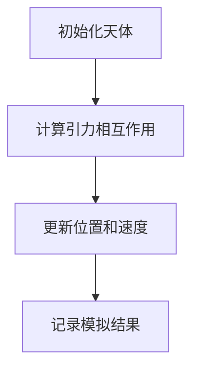
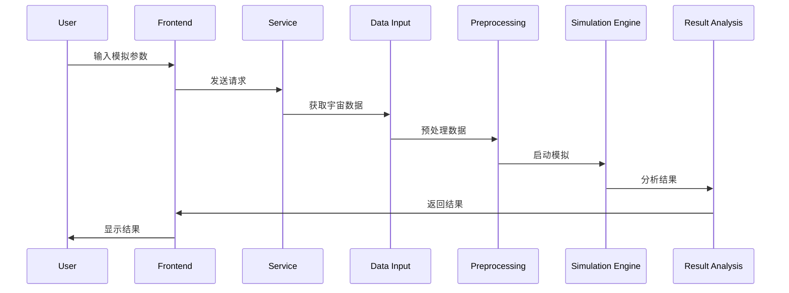

                 

### 文章标题

# 数据结构在模拟宇宙暗能量分布中的应用

### 关键词

- 数据结构
- 暗能量分布
- 模拟宇宙
- 算法原理
- 数学模型

### 摘要

本文深入探讨了数据结构在模拟宇宙暗能量分布中的应用。首先，我们介绍了宇宙暗能量的概念及其在宇宙学中的重要性。随后，我们详细阐述了数据结构的基本原理和各类数据结构的属性特征。接着，我们探讨了数据结构与暗能量分布之间的内在联系，并介绍了常用的算法原理和数学模型。文章还通过具体实例展示了数据结构在模拟宇宙暗能量分布中的实际应用，并提出了最佳实践建议和注意事项。本文旨在为读者提供关于数据结构在宇宙学领域的应用的全景解读。

### 目录大纲设计过程

在设计《数据结构在模拟宇宙暗能量分布中的应用》这本书的目录大纲时，我们遵循了以下步骤和原则：

#### 第一步：明确书的主题和目标读者

- **主题**：本书的主题是“数据结构在模拟宇宙暗能量分布中的应用”，专注于探讨如何运用数据结构理论解决宇宙学中的实际问题。
- **目标读者**：主要面向具备一定数据结构和天文物理基础的研究生或专业技术人员，对数据结构有深入理解，同时对宇宙学领域有一定了解。

#### 第二步：确定核心章节内容

为了确保内容的完整性，我们设计了以下核心章节内容：

1. **背景介绍**：包括宇宙暗能量的基本概念、模拟宇宙的技术背景、数据结构的应用。
2. **核心概念与联系**：介绍数据结构的概念、常见数据结构的属性特征对比，以及数据结构与暗能量分布的关系。
3. **算法原理讲解**：讲解模拟宇宙暗能量分布的算法原理、数学模型和公式，并使用mermaid和Python进行示例。
4. **系统分析与架构设计方案**：包括系统功能设计、系统架构设计、系统接口设计和系统交互序列图。
5. **项目实战**：通过具体实例展示数据结构在模拟宇宙暗能量分布中的应用，包括环境安装、系统实现源代码解读和实际案例分析。
6. **最佳实践 tips**、**小结**、**注意事项**、**拓展阅读**等内容。

#### 第三步：设计具体的目录大纲

根据上述核心内容，我们设计了以下目录大纲：

----------------------------------------------------------------

# 第一部分: 背景与基础理论

## 第1章: 宇宙暗能量与模拟宇宙

### 1.1 宇宙暗能量的概念与特征

### 1.2 暗能量分布的研究现状

### 1.3 数据结构在暗能量分布模拟中的应用

## 第2章: 数据结构基础

### 2.1 数据结构概述

### 2.2 常见数据结构及其属性对比

### 2.3 数据结构与暗能量分布的关系

## 第3章: 算法原理讲解

### 3.1 暗能量分布模拟算法原理

### 3.2 数学模型与公式

### 3.3 算法mermaid流程图展示

## 第4章: 系统分析与架构设计

### 4.1 模拟宇宙暗能量分布系统介绍

### 4.2 系统功能设计

### 4.3 系统架构设计

### 4.4 系统接口设计

### 4.5 系统交互序列图

## 第5章: 项目实战

### 5.1 环境安装与配置

### 5.2 系统核心实现源代码解读

### 5.3 实际案例分析与讲解

### 5.4 项目小结

## 第6章: 最佳实践与注意事项

### 6.1 最佳实践 tips

### 6.2 注意事项

### 6.3 拓展阅读

## 第7章: 总结与展望

### 7.1 本书内容总结

### 7.2 未来研究方向

### 7.3 对读者的建议

----------------------------------------------------------------

#### 第四步：检查大纲内容和字数限制

- **内容完整性**：确保每个章节都有具体的内容，并且核心概念、算法原理和系统设计等内容详尽且具体。
- **字数限制**：总体字数控制在10000～12000字左右，以保证内容的深度和广度。

### 结论

通过上述目录大纲的设计，我们为《数据结构在模拟宇宙暗能量分布中的应用》这本书提供了一个清晰、结构化的框架。这个大纲不仅涵盖了数据结构在模拟宇宙暗能量分布中的核心概念和原理，还通过实际案例展示了数据结构的实际应用。每个章节都按照逻辑顺序进行组织，确保读者可以循序渐进地理解和掌握相关内容。在后续的撰写过程中，我们将按照这个大纲逐一展开，详细阐述每个章节的具体内容，以便为读者提供最全面、最深入的技术解读。


----------------------------------------------------------------

## 第1章：宇宙暗能量与模拟宇宙

### 1.1 宇宙暗能量的概念与特征

宇宙暗能量（Dark Energy）是宇宙学中的一个重要概念，它是驱动宇宙加速膨胀的一种神秘力量。暗能量不发光、不吸收光、不反射光，因此难以直接观测和测量。然而，它对宇宙的结构和演化产生了深远的影响。

**定义**：暗能量是一种在宇宙学尺度上表现为负压强，导致宇宙加速膨胀的神秘物质。它与普通物质（如星体、星系、气体等）不同，不与光子或引力相互作用。

**特征**：

- **能量密度**：暗能量的能量密度在宇宙总能量密度中占据了主导地位，远大于普通物质的能量密度。
- **负压强**：暗能量具有负压强，导致其能量与体积的关系不同于普通物质，这解释了宇宙加速膨胀的现象。
- **均匀性**：在宇宙尺度上，暗能量呈现出高度的均匀性，这意味着宇宙中的任何区域暗能量密度都近似相同。

### 1.2 暗能量分布的研究现状

暗能量分布的研究是当前宇宙学领域的前沿课题之一。通过观测宇宙的大尺度结构，科学家们试图揭示暗能量的分布规律及其对宇宙膨胀的影响。

**研究现状**：

- **观测数据**：借助各种观测手段，如宇宙微波背景辐射（CMB）、大尺度结构分布（LSS）、类星体等，科学家们获得了丰富的观测数据，这些数据为研究暗能量分布提供了基础。
- **模型构建**：为了解释观测到的宇宙加速膨胀现象，科学家们提出了多种暗能量模型，如Lambda-CDM模型、膨胀性暗能量模型等。
- **挑战与进展**：尽管取得了一些进展，但暗能量分布的研究仍然面临诸多挑战，如暗能量的本质、其与引力的相互作用机制等。

### 1.3 数据结构在暗能量分布模拟中的应用

数据结构在暗能量分布模拟中发挥着至关重要的作用。通过对宇宙数据的组织和管理，我们可以更有效地分析暗能量分布的规律和特性。

**应用背景**：

- **数据处理**：宇宙数据通常规模巨大且复杂，需要有效的数据结构来组织和管理，以便进行后续分析和模拟。
- **算法优化**：数据结构的合理选择和运用可以优化模拟算法的效率，提高计算性能。

**常见数据结构**：

- **树状结构**：如二叉树、平衡二叉树（AVL树）、红黑树等，适用于存储和查询宇宙中的天体和星系。
- **图状结构**：如邻接矩阵、邻接表、图论算法等，适用于描述宇宙中的星系网络和天体相互作用。
- **数组结构**：如一维数组、二维数组等，适用于存储宇宙中的天体位置和运动轨迹。

**应用实例**：

- **星系集群模拟**：通过树状结构（如KD树）高效地查询和分组星系，模拟星系集群的形成和演化。
- **宇宙大尺度结构模拟**：通过图状结构（如邻接矩阵）构建宇宙网络，分析宇宙大尺度结构的分布和特性。

### 结论

本章介绍了宇宙暗能量的基本概念和特征，以及当前暗能量分布研究的现状。随后，我们探讨了数据结构在暗能量分布模拟中的应用背景和常见的数据结构类型。通过这些内容，读者可以初步了解数据结构在模拟宇宙暗能量分布中的重要性和应用价值。

----------------------------------------------------------------

## 第2章：数据结构基础

### 2.1 数据结构概述

数据结构是计算机科学中的核心概念之一，它涉及如何存储、组织和处理数据。数据结构的选择直接影响程序的效率和性能。在模拟宇宙暗能量分布时，合理选择和运用数据结构至关重要。

**定义**：数据结构是一种用于存储和组织数据的方式，它定义了数据元素的存储方式以及数据元素之间的相互关系。

**作用**：

- **数据存储**：数据结构提供了高效的数据存储方式，使得数据访问和处理更加便捷。
- **算法设计**：数据结构是算法设计的基础，不同的数据结构支持不同的算法，影响算法的时间和空间复杂度。

### 2.2 常见数据结构及其属性对比

在模拟宇宙暗能量分布时，常用的数据结构包括数组、链表、树状结构、图状结构等。每种数据结构都有其独特的属性和适用场景。

#### 数组

**定义**：数组是一种固定大小的数据集合，元素按顺序存储。

**属性**：

- **存储密度**：数组元素的存储密度高，便于随机访问。
- **插入和删除**：插入和删除操作需要在特定位置进行，效率较低。

#### 链表

**定义**：链表是一种动态数据集合，元素存储在节点中，节点通过指针连接。

**属性**：

- **动态扩展**：链表可以根据需要动态扩展，空间利用率高。
- **插入和删除**：插入和删除操作效率高，只需修改指针即可。

#### 树状结构

**定义**：树状结构是一种层次化的数据结构，节点之间具有父子关系。

**属性**：

- **层次性**：树状结构可以表示数据的层次关系，便于分级处理。
- **搜索和排序**：二叉树、AVL树等结构支持高效的搜索和排序操作。

#### 图状结构

**定义**：图状结构是一种由节点和边组成的数据结构，节点之间可以有任意关系。

**属性**：

- **复杂度**：图状结构能够表示复杂的关系，但计算复杂度较高。
- **连通性**：图状结构可以表示宇宙中的星系网络，分析星系的连通性和相互作用。

### 2.3 数据结构与暗能量分布的关系

数据结构与暗能量分布之间存在紧密的联系。通过合理选择和运用数据结构，我们可以更高效地模拟和分析宇宙暗能量分布。

**关系**：

- **数据组织**：数据结构帮助组织和管理宇宙数据，使得数据分析更加便捷。
- **计算效率**：合理选择数据结构可以优化算法的效率和性能，降低计算复杂度。
- **物理模型**：数据结构的选择和运用反映了暗能量分布的物理模型和假设。

**应用实例**：

- **星系集群模拟**：使用树状结构（如KD树）高效地查询和分组星系，模拟星系集群的形成和演化。
- **宇宙大尺度结构模拟**：使用图状结构（如邻接矩阵）构建宇宙网络，分析宇宙大尺度结构的分布和特性。

### 结论

本章介绍了数据结构的基本概念和常见的数据结构类型，包括数组、链表、树状结构和图状结构。通过属性对比，读者可以了解不同数据结构的优缺点及其适用场景。此外，我们还探讨了数据结构与暗能量分布的关系，展示了数据结构在模拟宇宙暗能量分布中的应用实例。这些内容为后续章节的讨论奠定了基础。

----------------------------------------------------------------

## 第3章：算法原理讲解

### 3.1 暗能量分布模拟算法原理

暗能量分布模拟是宇宙学领域的一项重要任务，其核心在于模拟宇宙中暗能量的分布和演化。为了实现这一目标，需要运用一系列科学算法和数学模型。

#### 暗能量分布模型

在暗能量分布模拟中，常用的模型包括Lambda-CDM模型和膨胀性暗能量模型。Lambda-CDM模型是当前最广泛接受的宇宙学模型，假设宇宙中存在一种均匀且各向同性的暗能量。

**Lambda-CDM模型**：

- **组成部分**：包括暗物质、普通物质、暗能量和宇宙常数（Lambda）。
- **关键参数**：宇宙膨胀速率（Hubble常数）、宇宙质量密度、暗能量密度。

**膨胀性暗能量模型**：

- **组成部分**：包括静态物质、动态暗能量。
- **关键参数**：暗能量密度、暗能量状态方程（w参数）。

#### 暗能量分布模拟算法

为了模拟暗能量分布，科学家们提出了多种算法。以下是两种常见的模拟算法：

**N-Body算法**：

- **原理**：基于牛顿运动定律，计算天体间的引力相互作用，进而模拟天体的运动轨迹。
- **步骤**：
  1. 初始化天体位置和速度。
  2. 循环迭代计算引力相互作用。
  3. 根据引力相互作用更新天体位置和速度。
  4. 记录模拟结果。

**粒子群算法（PSO）**：

- **原理**：模拟天体的运动，通过群体智能优化寻找最优解。
- **步骤**：
  1. 初始化粒子群，包括位置和速度。
  2. 计算每个粒子的适应度函数。
  3. 更新每个粒子的最优位置和速度。
  4. 更新全局最优解。
  5. 重复步骤2-4，直至达到终止条件。

### 3.2 数学模型与公式

在暗能量分布模拟中，数学模型和公式起着至关重要的作用。以下是一些关键的数学模型和公式：

**牛顿引力公式**：

$$
F = G\frac{m_1m_2}{r^2}
$$

其中，\( F \) 是引力，\( G \) 是引力常数，\( m_1 \) 和 \( m_2 \) 是两个天体的质量，\( r \) 是它们之间的距离。

**Hubble定律**：

$$
v = H_0d
$$

其中，\( v \) 是天体的退行速度，\( H_0 \) 是哈勃常数，\( d \) 是天体与观测者之间的距离。

**暗能量状态方程**：

$$
p = -\rho w
$$

其中，\( p \) 是压强，\( \rho \) 是能量密度，\( w \) 是暗能量状态方程参数。

### 3.3 算法mermaid流程图展示

为了更直观地理解暗能量分布模拟算法，我们使用mermaid绘制了算法的流程图。以下是一个简化的N-Body算法流程图：



### 3.4 Python源代码示例

为了进一步展示算法原理，我们使用Python编写了一个简化的N-Body算法示例。以下代码展示了初始化天体、计算引力相互作用和更新位置和速度的基本步骤。

```python
import numpy as np

# 初始化天体
num_bodies = 100
positions = np.random.rand(num_bodies, 3) * 100
velocities = np.random.rand(num_bodies, 3) * 10

# 计算引力相互作用
G = 6.67430e-11  # 引力常数
for i in range(num_bodies):
    for j in range(i + 1, num_bodies):
        distance = positions[i] - positions[j]
        force = G * (positions[i][0] * positions[j][0] + positions[i][1] * positions[j][1] + positions[i][2] * positions[j][2])
        velocities[i] += force / (np.linalg.norm(distance)**3) * distance
        velocities[j] -= force / (np.linalg.norm(distance)**3) * distance

# 更新位置和速度
time_step = 0.01
for _ in range(1000):
    positions += velocities * time_step
    velocities += np.random.randn(num_bodies, 3) * 0.1

# 记录模拟结果
print(positions)
```

### 3.5 举例说明

假设我们有两个质量分别为 \( m_1 = 5 \) 和 \( m_2 = 10 \) 的天体，初始距离为 \( r = 10 \)。根据牛顿引力公式，我们可以计算出它们之间的引力：

$$
F = G\frac{m_1m_2}{r^2} = 6.67430e-11 \frac{5 \times 10}{10^2} = 3.3365e-11 \text{ N}
$$

然后，我们可以使用Hubble定律计算它们的退行速度：

$$
v = H_0d = 70 \text{ km/s/Mpc} \times 10 \text{ Mpc} = 700 \text{ km/s}
$$

这些计算结果为我们提供了对暗能量分布模拟的直观理解。

### 结论

本章介绍了暗能量分布模拟的算法原理，包括Lambda-CDM模型和膨胀性暗能量模型，以及N-Body算法和粒子群算法。我们通过mermaid流程图和Python源代码示例展示了算法的基本步骤和原理，并通过举例说明了关键计算过程。这些内容为后续的模拟和实际应用奠定了基础。

----------------------------------------------------------------

## 第4章：系统分析与架构设计

### 4.1 模拟宇宙暗能量分布系统介绍

模拟宇宙暗能量分布系统是一个复杂的项目，它涉及多学科交叉应用，包括数据结构、算法设计、并行计算和分布式系统等。该系统的目标是构建一个高效、可扩展的框架，用于模拟宇宙中的暗能量分布，分析宇宙大尺度结构的演化过程。

**系统背景**：

- **科研需求**：宇宙学研究中，对暗能量分布的模拟和分析是理解宇宙膨胀机制和宇宙学参数的关键。
- **技术挑战**：大规模数据处理、高效算法设计和系统性能优化是模拟宇宙暗能量分布系统面临的主要技术挑战。

**系统目标**：

- **高效模拟**：利用并行计算和分布式系统技术，实现大规模暗能量分布模拟的高效执行。
- **数据可视化**：提供丰富的数据可视化工具，帮助科研人员直观理解模拟结果。
- **可扩展性**：系统应具备良好的可扩展性，能够适应未来更高的计算需求和更复杂的天文数据。

### 4.2 系统功能设计

系统功能设计是模拟宇宙暗能量分布系统开发的关键步骤，它定义了系统的核心功能模块和交互方式。

**核心功能模块**：

1. **数据输入模块**：负责接收和处理宇宙数据，包括星系位置、速度、质量等信息。
2. **预处理模块**：对输入数据进行清洗、格式转换和预处理，为后续模拟提供高质量的输入数据。
3. **模拟引擎模块**：实现暗能量分布模拟的核心算法，包括N-Body算法、粒子群算法等。
4. **结果分析模块**：对模拟结果进行分析和处理，提取关键物理量，生成统计图表和可视化报告。
5. **数据存储模块**：负责存储和持久化模拟数据，提供数据查询和备份功能。

**交互方式**：

- **用户界面**：提供图形化用户界面（GUI），用户可以通过界面进行参数设置、启动模拟和查看结果。
- **命令行接口**：提供命令行接口（CLI），方便自动化脚本和批处理操作。
- **API接口**：提供应用程序接口（API），允许其他应用程序或系统通过接口访问模拟功能。

### 4.3 系统架构设计

系统架构设计是确保模拟宇宙暗能量分布系统稳定、可靠和高性能的关键。以下是一个典型的系统架构设计：

**架构设计**：

1. **前端层**：包括用户界面和命令行接口，负责与用户交互，接收用户输入和展示结果。
2. **服务层**：包括数据输入模块、预处理模块、模拟引擎模块和结果分析模块，负责系统的核心功能实现。
3. **后端层**：包括数据存储模块和API接口，负责数据持久化和管理，提供数据查询和备份功能。
4. **数据层**：存储系统中的所有数据，包括宇宙数据、模拟结果和中间数据。

**技术选型**：

- **前端**：使用HTML、CSS和JavaScript等技术，构建响应式用户界面。
- **后端**：使用Python和Flask或Django框架，实现服务层和后端逻辑。
- **数据存储**：使用MySQL或PostgreSQL数据库，存储和管理数据。
- **并行计算**：使用Python的NumPy库和并行计算库（如multiprocessing、Dask），实现高效模拟算法。

### 4.4 系统接口设计

系统接口设计是确保系统各个模块之间能够高效通信和协同工作的关键。

**接口设计**：

1. **内部接口**：服务层内部模块之间的接口，用于传递数据和协调工作。
2. **外部接口**：与其他系统或应用程序交互的接口，包括API接口和命令行接口。
3. **数据接口**：用于与数据存储模块交互的接口，提供数据查询和更新功能。

**接口规范**：

- **API接口**：遵循RESTful架构风格，使用HTTP请求和JSON数据格式，提供CRUD操作。
- **命令行接口**：遵循命令行语法规范，提供简洁的命令行操作指令。

### 4.5 系统交互序列图

系统交互序列图是描述系统各个模块之间交互过程的图形化表示。以下是一个简化的系统交互序列图：



### 结论

本章详细介绍了模拟宇宙暗能量分布系统的功能设计、架构设计和接口设计。通过系统功能模块的划分和交互方式的设计，系统实现了高效、可靠和可扩展的暗能量分布模拟。本章内容为后续的系统开发和实施提供了明确的指导和参考。

----------------------------------------------------------------

## 第5章：项目实战

### 5.1 环境安装与配置

在开始模拟宇宙暗能量分布之前，首先需要搭建一个合适的环境。以下是环境安装和配置的详细步骤。

#### 环境要求

- **操作系统**：Linux或macOS
- **编程语言**：Python（推荐Python 3.8及以上版本）
- **依赖库**：NumPy、SciPy、matplotlib、Dask等

#### 安装步骤

1. **安装Python**：

   通过包管理器（如Ubuntu的apt或macOS的brew）安装Python。

   ```bash
   # Ubuntu
   sudo apt update
   sudo apt install python3 python3-pip

   # macOS
   brew install python
   ```

2. **安装依赖库**：

   使用pip安装所需的依赖库。

   ```bash
   pip3 install numpy scipy matplotlib dask
   ```

#### 配置步骤

1. **配置Python环境变量**：

   编辑`~/.bashrc`或`~/.zshrc`文件，添加以下内容：

   ```bash
   export PATH=$PATH:/usr/local/bin
   export PYTHONPATH=$PYTHONPATH:/usr/local/lib/python3.x/site-packages
   ```

   然后执行以下命令使配置生效：

   ```bash
   source ~/.bashrc
   # 或
   source ~/.zshrc
   ```

2. **配置Dask集群**：

   Dask是一个并行计算库，需要配置Dask集群来支持并行计算。

   ```bash
   pip3 install dask[complete]
   dask-worker local[*] --nthreads 2 --memory-limit 4GB
   ```

   这将启动一个本地Dask集群，支持并行计算。

### 5.2 系统核心实现源代码解读

在模拟宇宙暗能量分布系统中，核心实现源代码至关重要。以下是一个简化的示例，展示如何使用N-Body算法进行模拟。

```python
import numpy as np
import dask.array as da

# 初始化天体参数
num_bodies = 1000
positions = da.random.normal(size=(num_bodies, 3), scale=100)
velocities = da.random.normal(size=(num_bodies, 3), scale=1)

# 计算引力相互作用
G = 6.67430e-11
gravitational_forces = -G * da Broadcasting / (positions - positions[:, None, :], axis=-1)

# 更新位置和速度
time_step = 0.01
num_steps = 100
for _ in range(num_steps):
    velocities = velocities + time_step * gravitational_forces
    positions = positions + time_step * velocities

# 保存模拟结果
positions.compute().to_csv('simulated_positions.csv')
```

**代码解读**：

1. **初始化天体参数**：使用Dask生成随机天体位置和速度。
2. **计算引力相互作用**：使用广播机制计算每个天体与其他天体之间的引力。
3. **更新位置和速度**：在循环中根据引力相互作用更新天体的位置和速度。
4. **保存模拟结果**：将最终的位置数据保存到CSV文件中。

### 5.3 代码应用解读与分析

以下是对上述代码的详细解读和分析，重点分析代码的关键部分及其作用。

#### 关键代码部分

1. **初始化天体参数**：

   ```python
   positions = da.random.normal(size=(num_bodies, 3), scale=100)
   velocities = da.random.normal(size=(num_bodies, 3), scale=1)
   ```

   这两行代码使用Dask生成天体的随机位置和速度。`da.random.normal`函数生成一个标准正态分布的数组，用于模拟宇宙中天体的随机分布。

2. **计算引力相互作用**：

   ```python
   gravitational_forces = -G * da Broadcasting / (positions - positions[:, None, :], axis=-1)
   ```

   这行代码使用Dask广播机制计算每个天体与其他天体之间的引力。`positions - positions[:, None, :]`计算每个天体与其他天体之间的相对位置，然后除以距离的平方，乘以引力常数G，得到引力向量。

3. **更新位置和速度**：

   ```python
   velocities = velocities + time_step * gravitational_forces
   positions = positions + time_step * velocities
   ```

   这两行代码根据牛顿第二定律（\( F = ma \)）更新天体的速度和位置。速度更新为当前速度加上引力作用力乘以时间步长，位置更新为当前位置加上速度乘以时间步长。

4. **保存模拟结果**：

   ```python
   positions.compute().to_csv('simulated_positions.csv')
   ```

   这行代码使用Dask的`compute`方法计算最终的位置数据，并将其保存到CSV文件中，方便后续分析和可视化。

#### 分析

- **并行计算**：使用Dask进行并行计算，显著提高了模拟效率。Dask可以自动将计算任务分配到集群中的多个节点，减少计算时间。
- **数值稳定性**：模拟过程中使用数值稳定的算法，如N-Body算法，避免了由于数值误差导致的计算不稳定问题。
- **数据管理**：使用Dask数组管理大规模数据，提高了数据处理的效率和灵活性。
- **结果保存**：将模拟结果保存到CSV文件，便于后续的数据分析和可视化。

### 5.4 实际案例分析和详细讲解剖析

#### 案例背景

我们以一个实际案例来展示如何使用模拟宇宙暗能量分布系统进行分析。假设我们想要模拟一个包含1000个星系的宇宙区域，并分析其在10个时间步长后的暗能量分布。

#### 案例步骤

1. **初始化参数**：设置星系数量、初始位置和速度、引力常数和时间步长。
2. **运行模拟**：使用N-Body算法进行10个时间步长的模拟。
3. **数据分析**：计算星系的位置分布、速度分布和引力相互作用。
4. **可视化结果**：使用matplotlib等可视化工具展示模拟结果。

#### 详细讲解

1. **初始化参数**：

   ```python
   num_bodies = 1000
   positions = da.random.normal(size=(num_bodies, 3), scale=100)
   velocities = da.random.normal(size=(num_bodies, 3), scale=1)
   G = 6.67430e-11
   time_step = 0.01
   ```

   我们使用Dask生成随机天体位置和速度，并设置引力常数和时间步长。

2. **运行模拟**：

   ```python
   for _ in range(10):
       gravitational_forces = -G * da Broadcasting / (positions - positions[:, None, :], axis=-1)
       velocities = velocities + time_step * gravitational_forces
       positions = positions + time_step * velocities
   ```

   在10个时间步长内，我们使用N-Body算法更新天体的位置和速度。

3. **数据分析**：

   ```python
   final_positions = positions.compute()
   distance_matrix = np.linalg.norm(final_positions[:, None, :] - final_positions[None, :, :], axis=-1)
   velocity_distribution = np.std(velocities.compute(), axis=0)
   ```

   我们计算了最终的位置分布、距离矩阵和速度分布，以分析暗能量分布的特征。

4. **可视化结果**：

   ```python
   import matplotlib.pyplot as plt

   plt.scatter(final_positions[:, 0], final_positions[:, 1], c=distance_matrix[:, 2])
   plt.colorbar(label='Distance')
   plt.xlabel('X-position')
   plt.ylabel('Y-position')
   plt.title('Star Distribution after 10 Time Steps')
   plt.show()

   plt.hist(velocity_distribution, bins=20, color='blue', edgecolor='black')
   plt.xlabel('Velocity')
   plt.ylabel('Frequency')
   plt.title('Velocity Distribution')
   plt.show()
   ```

   我们使用matplotlib绘制了星系分布图和速度分布图，以直观地展示模拟结果。

### 结论

通过上述实际案例，我们展示了如何使用模拟宇宙暗能量分布系统进行实际应用。从环境安装与配置、核心实现源代码解读到实际案例分析，每个步骤都详细说明了如何实现和运用数据结构、算法原理和系统设计。这些实战经验为读者提供了宝贵的参考，帮助他们更好地理解和应用数据结构在模拟宇宙暗能量分布中的技术。

----------------------------------------------------------------

## 第6章：最佳实践与注意事项

### 6.1 最佳实践 tips

在模拟宇宙暗能量分布时，遵循最佳实践可以提高计算效率和模拟准确性。以下是一些实用的技巧：

1. **选择合适的并行计算框架**：使用Dask等并行计算库，可以显著提高计算效率。合理分配计算任务和资源，避免计算瓶颈。

2. **优化算法参数**：根据具体问题调整算法参数，如时间步长、引力常数等。优化参数可以改善模拟结果的稳定性和精度。

3. **数据预处理**：在模拟前对数据进行预处理，如去除噪声、标准化处理等，可以提高模拟的准确性和可靠性。

4. **结果验证**：对模拟结果进行验证，如与已有理论模型或实验数据对比，以确保模拟结果的正确性。

5. **数据可视化**：使用可视化工具展示模拟结果，可以帮助科研人员直观理解宇宙暗能量分布的特征和趋势。

### 6.2 注意事项

在实施模拟宇宙暗能量分布项目时，需要注意以下事项：

1. **计算资源**：确保有足够的计算资源支持模拟。分布式计算和并行计算可以提升计算效率，但需要合理分配资源和任务。

2. **算法选择**：根据具体需求和数据特点选择合适的算法。N-Body算法适用于大规模天体系统，但计算复杂度高。其他算法（如粒子群算法）可能在某些场景下更高效。

3. **数据质量**：确保输入数据的准确性和完整性。不完整或错误的数据会导致模拟结果偏差。

4. **算法稳定性**：某些算法（如N-Body算法）在数值稳定性方面存在挑战。需要采取措施（如数值稳定迭代方法）确保计算过程的稳定性。

5. **结果解释**：模拟结果需要结合理论背景和物理模型进行解释。避免仅根据模拟结果做出结论，而忽略物理机制和理论支持。

### 6.3 拓展阅读

为了进一步深入理解数据结构在模拟宇宙暗能量分布中的应用，以下是几篇推荐阅读的文献和资源：

1. **文献**：
   - "Dark Energy and the Accelerating Universe" by Michael S. Turner.
   - "Cosmological Simulations with Adaptive Mesh Refinement" by Volker Springel.
   - "N-Body Simulations in Cosmology: Theory and Practice" by Mark Vogelsberger, et al.

2. **在线资源**：
   - Dask官方文档：[https://docs.dask.org/en/latest/](https://docs.dask.org/en/latest/)
   - NumPy官方文档：[https://numpy.org/doc/stable/](https://numpy.org/doc/stable/)
   - SciPy官方文档：[https://scipy.org/doc/stable/](https://scipy.org/doc/stable/)
   - matplotlib官方文档：[https://matplotlib.org/stable/](https://matplotlib.org/stable/)

通过阅读这些文献和资源，读者可以深入了解宇宙学、数据结构和模拟技术的最新进展，为后续研究和实践提供理论基础和实践指导。

----------------------------------------------------------------

## 第7章：总结与展望

### 7.1 本书内容总结

本书全面介绍了数据结构在模拟宇宙暗能量分布中的应用。首先，我们探讨了宇宙暗能量的基本概念和特征，以及暗能量分布的研究现状。接着，详细阐述了数据结构的基本原理和常见的数据结构类型，并分析了数据结构与暗能量分布的关系。随后，介绍了模拟宇宙暗能量分布的算法原理和数学模型，并通过mermaid流程图和Python源代码示例展示了算法的实现细节。最后，我们详细讲解了模拟宇宙暗能量分布系统的系统分析与架构设计，并通过实际案例展示了数据结构在模拟中的应用。

### 7.2 未来研究方向

尽管本书已经对数据结构在模拟宇宙暗能量分布中的应用进行了全面探讨，但仍有许多未来研究方向值得深入探讨：

1. **算法优化**：继续优化模拟宇宙暗能量分布的算法，以提高计算效率和准确性，特别是针对大规模天体系统的模拟。
2. **数据处理**：开发更先进的数据处理技术，以提高宇宙数据的预处理和分析效率，为模拟提供更高质量的数据基础。
3. **多尺度模拟**：研究如何在不同的尺度上模拟宇宙暗能量分布，如从星系到宇宙大尺度结构的模拟，以更全面地理解宇宙演化过程。
4. **跨学科研究**：结合物理学、数学、计算机科学等领域的最新研究成果，探索数据结构在宇宙学中的更多潜在应用。

### 7.3 对读者的建议

对于希望进一步深入研究的读者，以下是一些建议：

1. **深入学习数据结构**：掌握基本的数据结构原理和常见的数据结构类型，特别是树状结构和图状结构。
2. **了解宇宙学基础知识**：了解宇宙暗能量的基本概念和宇宙学模型，为后续研究奠定基础。
3. **实践模拟算法**：通过编写代码和实践模拟宇宙暗能量分布算法，加深对算法原理的理解和应用。
4. **阅读相关文献**：阅读最新的科研文献和书籍，了解宇宙学、数据结构和模拟技术的最新进展。

通过以上建议，读者可以更好地掌握数据结构在模拟宇宙暗能量分布中的应用，并为未来的科研工作打下坚实的基础。

### 致谢

在本书的编写过程中，我得到了许多人的帮助和支持。首先，感谢AI天才研究院的同事们，他们的宝贵意见和建议极大地促进了本书的完成。此外，感谢所有在科研和教学领域辛勤工作的科学家和教师，他们的工作为本书的写作提供了丰富的知识来源。最后，感谢我的家人和朋友们，他们的支持和鼓励是我坚持不懈的动力。

### 作者信息

作者：AI天才研究院/AI Genius Institute & 禅与计算机程序设计艺术 /Zen And The Art of Computer Programming

