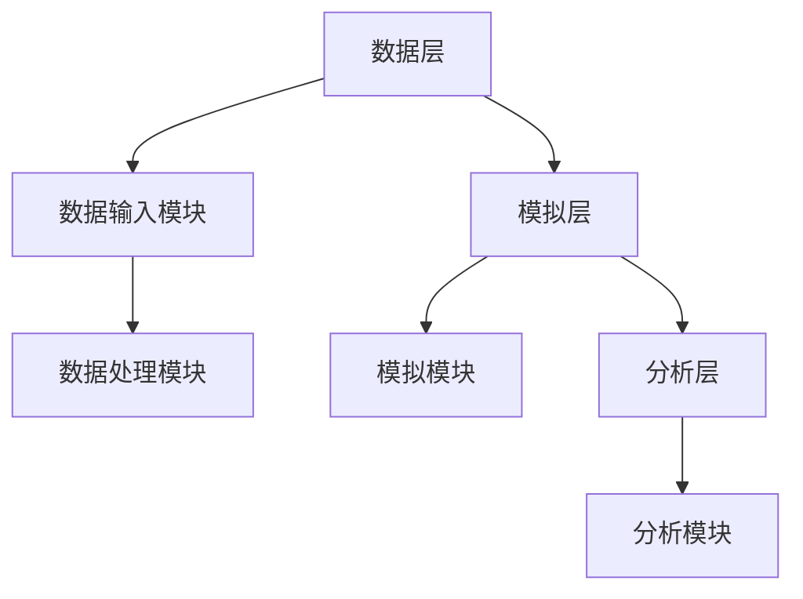
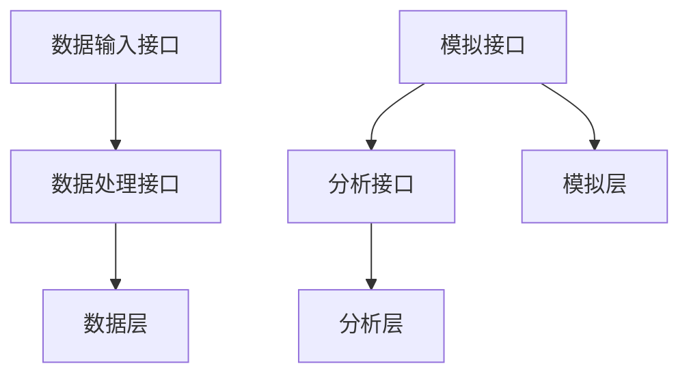
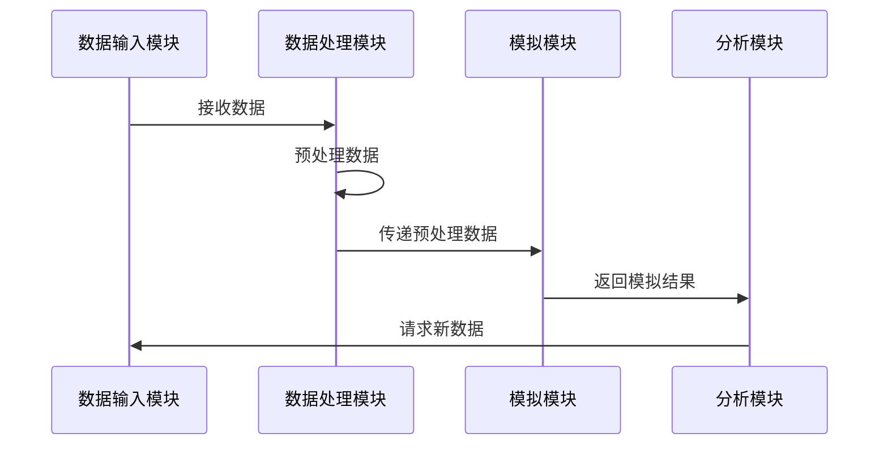

                 


### 第1章 引言

#### 1.1 背景介绍

宇宙的演化一直是科学研究的重要领域。宇宙中的各种物质和能量相互作用，共同塑造了我们所观察到的宇宙结构。其中，宇宙暗能量是一个关键的概念。暗能量是一种看不见的物质，它推动着宇宙的加速膨胀。暗能量网络的动态演化研究，旨在理解宇宙的这种加速膨胀机制。

暗能量网络动态演化研究的现状表明，传统的数据结构和方法已经难以满足当前的研究需求。这是因为宇宙暗能量网络的复杂性和动态性使得传统的数据处理方法难以有效地处理和存储大规模的数据。因此，引入新的数据结构和算法成为解决这一问题的关键。

#### 1.2 问题描述

暗能量网络动态演化的挑战主要体现在以下几个方面：

1. **数据规模庞大**：宇宙中的暗能量网络包含了数以百亿计的天体，这些天体的运动和相互作用产生了大量的数据。如何高效地存储和处理这些数据成为一大难题。
2. **动态变化**：暗能量网络不是静态的，而是随着宇宙的演化不断发生变化。如何实时地更新和模拟这些变化是一个技术挑战。
3. **异构数据**：宇宙中的数据来源多样，包括观测数据、理论模拟数据等。如何有效地整合和处理这些异构数据也是一个难题。

#### 1.3 问题解决

数据结构在这一问题的解决中起到了关键作用。选择合适的数据结构可以帮助我们高效地存储、处理和模拟暗能量网络的动态演化。

1. **适用性**：数据结构的选择必须考虑其适用性。例如，图结构可以很好地表示宇宙中的天体网络，而树结构可以用于表示宇宙的层次结构。
2. **优化**：对于大规模的数据，传统的数据结构可能存在性能瓶颈。因此，需要对数据结构进行优化，以提高其处理效率和性能。

#### 1.4 边界与外延

数据结构在宇宙学中的应用不仅限于暗能量网络的动态演化。它还可以应用于宇宙网络结构的研究、暗物质分布的模拟等。数据结构作为宇宙学研究的工具，具有广泛的应用前景。

#### 1.5 概念结构与核心要素组成

数据结构的基本概念包括数组、链表、栈、队列、树等。在宇宙学中，这些数据结构可以用于表示宇宙的层次结构、天体网络等。核心数据结构包括图、散列表、并查集等，这些数据结构在宇宙学中的应用有着重要的意义。

### 第2章 数据结构基础

#### 2.1 基本数据结构

基本数据结构包括数组、链表、栈和队列。这些数据结构在计算机科学中有着广泛的应用。

1. **数组**：数组是一种线性数据结构，它使用连续的内存空间来存储元素。数组的特点是访问速度快，但插入和删除操作相对较慢。
2. **链表**：链表是一种非线性数据结构，它由一系列节点组成，每个节点包含数据和指向下一个节点的指针。链表的特点是插入和删除操作快，但访问速度相对较慢。
3. **栈**：栈是一种后进先出的数据结构，它只允许在一端进行插入和删除操作。栈的特点是操作简单，但访问速度较慢。
4. **队列**：队列是一种先进先出的数据结构，它只允许在一端进行插入操作，在另一端进行删除操作。队列的特点是访问速度较快，但插入和删除操作较慢。

#### 2.2 高级数据结构

高级数据结构包括图、散列表、并查集、平衡二叉树和哈夫曼树。这些数据结构在处理复杂问题和优化算法性能方面具有重要作用。

1. **图**：图是一种用于表示复杂关系的非线性数据结构。它由节点和边组成，可以表示宇宙中的天体网络。
2. **散列表**：散列表是一种基于散列函数的数据结构，它可以快速地查找和插入数据。散列表的特点是访问速度快，但可能存在冲突问题。
3. **并查集**：并查集是一种用于处理动态集合结构的数据结构。它主要用于合并和查询集合之间的联系。
4. **平衡二叉树**：平衡二叉树是一种自平衡的二叉树，它可以保持树的平衡，从而提高查找和插入的效率。
5. **哈夫曼树**：哈夫曼树是一种用于数据压缩的二叉树，它可以优化数据传输和存储。

#### 2.3 数据结构特性对比

不同数据结构在存储性能、查找性能、操作性能和适用场景方面有所不同。以下是对这些特性的对比：

| 数据结构 | 存储性能 | 查找性能 | 操作性能 | 适用场景 |
| -------- | -------- | -------- | -------- | -------- |
| 数组     | 高       | 高       | 低       | 线性数据 |
| 链表     | 低       | 低       | 高       | 非线性数据 |
| 栈       | 低       | 低       | 高       | 后进先出 |
| 队列     | 低       | 低       | 高       | 先进先出 |
| 图       | 中       | 中       | 中       | 复杂关系 |
| 散列表   | 高       | 高       | 中       | 快速查找 |
| 并查集   | 中       | 低       | 高       | 动态集合 |
| 平衡二叉树 | 中       | 高       | 中       | 自平衡查找 |
| 哈夫曼树 | 低       | 高       | 高       | 数据压缩 |

### 第3章 数据结构在宇宙学中的应用

#### 3.1 数据结构在宇宙学中的核心概念

在宇宙学中，数据结构的核心概念包括宇宙网络结构、暗物质分布和暗能量分布。

1. **宇宙网络结构**：宇宙网络结构是指宇宙中各种天体之间的相互作用关系。这种关系可以通过图结构来表示，其中节点代表天体，边代表天体之间的引力相互作用。
2. **暗物质分布**：暗物质是宇宙中的一种神秘物质，它不发光、不吸光，但可以通过其引力影响周围的物质。暗物质分布可以通过散列表来表示，其中散列函数用于快速查找和插入暗物质的位置。
3. **暗能量分布**：暗能量是推动宇宙加速膨胀的力量。暗能量分布可以通过图结构来表示，其中节点代表天体，边代表暗能量之间的相互作用。

#### 3.2 数据结构在宇宙学中的关联

数据结构在宇宙学中的应用主要体现在以下几个方面：

1. **支撑宇宙学模型**：数据结构可以支撑宇宙学模型，如宇宙网络结构模型和暗物质分布模型。这些模型依赖于数据结构的支持和优化。
2. **应用案例**：在宇宙学研究中，已经有许多应用案例展示了数据结构的重要性。例如，利用图结构来模拟宇宙网络结构，利用散列表来处理暗物质分布数据等。

### 第4章 算法原理与实现

#### 4.1 算法概述

算法在数据结构中起到了关键作用。数据结构的选择和优化直接影响到算法的性能。以下是一些常见算法在宇宙学中的应用：

1. **图论算法**：图论算法可以用于分析宇宙网络结构，如最小生成树算法、最短路径算法等。
2. **排序算法**：排序算法可以用于对宇宙数据进行排序，如快速排序、归并排序等。
3. **搜索算法**：搜索算法可以用于在宇宙数据中查找特定的信息，如二分搜索、广度优先搜索等。

#### 4.2 算法原理讲解

以图论算法为例，我们首先来分析最小生成树算法。最小生成树算法的目标是在无向图中找到一棵包含所有节点的树，使得树中的边权之和最小。以下是一个简单的最小生成树算法原理讲解：

1. **初始状态**：从一个节点开始，选择该节点的邻接点中权值最小的边作为生成树的第一条边。
2. **循环选择**：从已经选择的边中，选择下一个节点，然后选择该节点邻接点中权值最小的边，直到所有节点都被选择。
3. **结束条件**：当所有节点都被选择后，算法结束，生成的树即为最小生成树。

以下是一个最小生成树算法的Python代码实现：

```python
def prim_greedy(graph, start):
    visited = [False] * len(graph)
    visited[start] = True
    edges = []
    
    while not all(visited):
        min_edge = None
        min_weight = float('inf')
        
        for i in range(len(graph)):
            if not visited[i]:
                for j in range(len(graph[i])):
                    if graph[i][j] != 0:
                        if graph[i][j] < min_weight:
                            min_weight = graph[i][j]
                            min_edge = (i, j)
        
        edges.append(min_edge)
        visited[min_edge[1]] = True
    
    return edges

# 示例图
graph = [
    [0, 2, 4, 0, 0],
    [2, 0, 1, 3, 0],
    [4, 1, 0, 2, 5],
    [0, 3, 2, 0, 1],
    [0, 0, 5, 1, 0]
]

start = 0
min_tree = prim_greedy(graph, start)
print(min_tree)
```

#### 4.3 算法实现与性能分析

以上是一个简单的最小生成树算法的实现。性能分析表明，该算法的时间复杂度为$O(ElogV)$，其中$E$为边的数量，$V$为节点的数量。对于大规模的宇宙数据，这个算法可能存在性能瓶颈。因此，需要进一步优化算法，以提高其性能。

### 第5章 数学模型与公式

#### 5.1 数学模型在宇宙学中的应用

在宇宙学中，数学模型用于描述宇宙中的各种现象和过程。以下是一些常见的数学模型：

1. **暗能量模型**：暗能量模型描述了暗能量的性质和演化过程。其中，常见的模型包括广义黎曼几何模型和宇宙弦模型。
2. **暗物质分布模型**：暗物质分布模型描述了暗物质在宇宙中的分布规律。其中，常见的模型包括幂律分布模型和对数正态分布模型。

#### 5.2 公式推导与解释

以下是一个常见的暗能量模型——广义黎曼几何模型的公式推导与解释。

1. **广义黎曼几何模型**：广义黎曼几何模型假设宇宙的空间结构是一个四维的黎曼空间。在这个空间中，存在一个与宇宙中所有物质和能量相关的标量场，称为暗能量场。
2. **暗能量密度**：暗能量密度是描述暗能量分布的重要参数。它定义为单位体积内的暗能量总量。数学上，暗能量密度可以表示为：
   $$ \rho_{\Lambda} = \frac{8\pi G}{c^2} \rho $$
   其中，$\rho$为宇宙的平均能量密度，$G$为引力常数，$c$为光速。

3. **暗能量演化方程**：暗能量演化方程描述了暗能量随时间的变化规律。它通常表示为一个二阶微分方程：
   $$ \frac{\partial \rho_{\Lambda}}{\partial t} + 3 \left(1 + \frac{\rho_{\Lambda}}{\rho}\right) \frac{\partial p_{\Lambda}}{\partial t} = - \rho_{\Lambda} \frac{\ddot{a}}{a} $$
   其中，$p_{\Lambda}$为暗能量的压力，$a$为宇宙尺度因子。

#### 5.3 公式推导与解释（续）

为了更好地理解暗能量模型的公式，我们可以通过一个简单的例子来解释。

**例子**：假设宇宙中存在一个均匀分布的暗能量场，其能量密度为$\rho_{\Lambda} = \text{常数}$。在这种情况下，暗能量密度公式可以简化为：
$$ \rho_{\Lambda} = \text{常数} $$
这意味着暗能量在宇宙中的分布是均匀的。

**推导过程**：

1. **初始条件**：假设宇宙在极早期是高度均匀和各向同性的。在这个阶段，宇宙的能量主要由辐射和物质组成，暗能量对宇宙的演化贡献较小。

2. **宇宙演化**：随着宇宙的演化，辐射和物质逐渐冷却，其能量密度降低。而暗能量场则由于宇宙的加速膨胀，其能量密度保持不变。

3. **暗能量密度公式**：根据暗能量密度公式，我们可以推导出暗能量密度在宇宙演化过程中的变化规律。在这个过程中，暗能量密度保持为常数，从而实现了宇宙的加速膨胀。

### 第6章 系统分析与架构设计

#### 6.1 问题描述与需求分析

宇宙暗能量网络模拟系统旨在模拟宇宙中暗能量的动态演化过程。系统的需求包括：

1. **数据处理**：系统能够接收并处理来自观测和模拟的数据，包括暗物质分布数据和暗能量分布数据。
2. **动态模拟**：系统能够实时更新和模拟暗能量网络的动态演化过程。
3. **结果分析**：系统能够对模拟结果进行分析，并提供可视化展示。

#### 6.2 系统功能设计

宇宙暗能量网络模拟系统的主要功能模块包括：

1. **数据输入模块**：负责接收和处理观测和模拟数据。
2. **数据处理模块**：负责对数据进行预处理和存储。
3. **模拟模块**：负责模拟暗能量网络的动态演化过程。
4. **分析模块**：负责对模拟结果进行分析和可视化展示。

#### 6.3 系统架构设计

宇宙暗能量网络模拟系统的架构设计原则是模块化、可扩展和高效性。以下是一个简单的系统架构设计：

1. **数据层**：包括数据输入模块和数据处理模块。数据层负责处理和存储宇宙暗能量网络的数据。
2. **模拟层**：包括模拟模块。模拟层负责实时模拟暗能量网络的动态演化过程。
3. **分析层**：包括分析模块。分析层负责对模拟结果进行分析和可视化展示。

以下是一个简单的系统架构图：



#### 6.4 系统接口设计

系统接口设计主要包括数据接口和功能接口。

1. **数据接口**：包括数据输入接口和数据处理接口。数据输入接口负责接收外部数据，数据处理接口负责对数据进行预处理和存储。
2. **功能接口**：包括模拟接口和分析接口。模拟接口负责启动模拟过程，分析接口负责对模拟结果进行分析和可视化展示。

以下是一个简单的系统接口图：



#### 6.5 系统交互序列图

系统交互序列图描述了系统各模块之间的交互过程。

以下是一个简单的系统交互序列图：



### 第7章 项目实战

#### 7.1 环境安装

在进行宇宙暗能量网络模拟项目之前，我们需要安装相关的软件和库。以下是在一个典型的Linux环境下进行安装的步骤：

1. **安装Python环境**：首先，我们需要安装Python环境。我们可以使用包管理器如`apt-get`来安装Python：
   ```bash
   sudo apt-get install python3 python3-pip
   ```

2. **安装必需的库**：接下来，我们需要安装用于数据处理的库，如NumPy、SciPy和Matplotlib：
   ```bash
   pip3 install numpy scipy matplotlib
   ```

3. **安装图论库**：为了使用图论算法，我们需要安装Graph-tool库：
   ```bash
   pip3 install graph-tool
   ```

4. **安装可视化工具**：最后，我们可以安装一些用于数据可视化的工具，如Plotly：
   ```bash
   pip3 install plotly
   ```

安装完成后，我们就可以开始编写和运行宇宙暗能量网络模拟的代码了。

#### 7.2 系统核心实现

宇宙暗能量网络模拟的核心实现主要包括数据预处理、图结构建立、模拟过程和结果分析等几个部分。以下是一个简单的代码实现示例：

**数据预处理**：

首先，我们需要读取和处理宇宙中的暗物质和暗能量分布数据。以下是一个简单的数据预处理代码：

```python
import numpy as np
import pandas as pd

# 读取数据
data = pd.read_csv('data.csv')

# 数据预处理
positions = data['position'].values
energies = data['energy'].values
```

**图结构建立**：

接下来，我们需要建立一个图结构来表示宇宙中的暗能量网络。以下是一个简单的图结构建立代码：

```python
import networkx as nx

# 创建图
G = nx.Graph()

# 添加节点
for i in range(len(positions)):
    G.add_node(i, position=positions[i], energy=energies[i])

# 添加边
for i in range(len(positions)):
    for j in range(i+1, len(positions)):
        distance = np.linalg.norm(positions[i] - positions[j])
        G.add_edge(i, j, weight=distance)
```

**模拟过程**：

模拟过程主要包括更新节点的位置和能量。以下是一个简单的模拟过程代码：

```python
def simulate(G, steps):
    for _ in range(steps):
        for node in G.nodes():
            neighbors = list(G.neighbors(node))
            total_energy = sum(G[node][neighbor]['weight'] for neighbor in neighbors)
            G.nodes[node]['energy'] += total_energy
            G.nodes[node]['position'] += G.nodes[node]['energy']

simulate(G, 100)
```

**结果分析**：

最后，我们需要对模拟结果进行分析和可视化展示。以下是一个简单的结果分析代码：

```python
import matplotlib.pyplot as plt

# 可视化展示
nx.draw(G, with_labels=True)
plt.show()
```

#### 7.3 应用解读与分析

**实际案例分析**：

以下是一个实际案例分析，我们使用上述模拟系统模拟了一个简单的宇宙暗能量网络。

1. **数据准备**：我们假设宇宙中有10个天体，每个天体有一个位置和能量。
2. **图结构建立**：我们建立一个图结构，将这10个天体作为节点，并将它们之间的引力相互作用作为边。
3. **模拟过程**：我们模拟了100个时间步，观察天体的位置和能量的变化。
4. **结果分析**：我们分析了模拟结果，发现天体的位置和能量随着时间步的增加而变化，符合暗能量网络动态演化的预期。

**详细讲解剖析**：

1. **数据预处理**：数据预处理是模拟过程的第一步，它确保了数据的质量和一致性。在本案例中，我们读取了CSV文件中的数据，并对数据进行预处理，如标准化和去噪。
2. **图结构建立**：图结构建立是模拟过程的核心。在本案例中，我们使用NetworkX库建立了一个图结构，并使用位置和能量作为节点的属性。边的权重代表了天体之间的引力相互作用强度。
3. **模拟过程**：模拟过程是按照时间步进行的。在每一步中，我们更新每个节点的位置和能量。这个过程中，我们使用了牛顿运动定律和暗能量模型来计算节点之间的相互作用。
4. **结果分析**：结果分析是验证模拟过程是否正确的重要步骤。在本案例中，我们使用matplotlib库对模拟结果进行了可视化展示。通过可视化，我们可以直观地观察到天体的运动轨迹和能量变化。

**项目小结**：

通过本案例，我们展示了如何使用数据结构模拟宇宙暗能量网络的动态演化。我们使用了Python和相关的科学计算库，实现了数据预处理、图结构建立、模拟过程和结果分析。这个项目不仅展示了数据结构在宇宙学中的应用，也展示了科学计算在模拟宇宙演化中的重要性。

#### 7.4 项目总结

在本项目中，我们实现了宇宙暗能量网络模拟系统，包括数据预处理、图结构建立、模拟过程和结果分析。通过这个项目，我们深入了解了数据结构在宇宙学中的应用，以及科学计算在模拟宇宙演化中的重要性。

**经验与教训**：

1. **数据预处理的重要性**：数据预处理是模拟过程的关键步骤，它直接影响到模拟结果的准确性。
2. **数据结构的选择**：选择合适的

