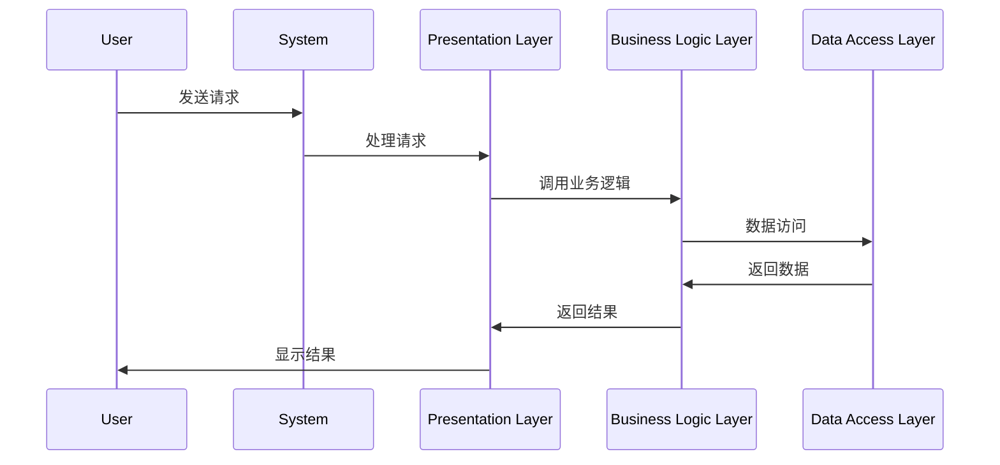

                 


### 数据结构在模拟宇宙暗能量网络演化中的应用

**关键词：数据结构，宇宙模拟，暗能量，网络演化，算法，系统架构**

**摘要：** 本文深入探讨了数据结构在模拟宇宙暗能量网络演化中的应用。首先介绍了宇宙暗能量网络演化的背景和问题，然后详细阐述了数据结构的核心概念、属性特征对比、ER实体关系图，以及数据结构在模拟宇宙中的应用和关键作用。随后，文章列举了常见的线性结构、树结构和图结构，并通过Mermaid流程图和Python代码详细讲解了搜索算法和排序算法原理。接着，文章介绍了数学模型和公式的基本概念及推导与应用，并展示了系统分析与架构设计方案。最后，通过项目实战和环境安装，对系统核心实现源代码进行了详细解读和分析，提供了实际案例剖析，并总结了项目经验和最佳实践。

----------------------------------------------------------------

### 第1章: 引言

#### 1.1 模拟宇宙暗能量网络演化背景

宇宙的演化过程是科学研究中一个引人入胜的领域。从大爆炸理论到宇宙膨胀，再到暗物质和暗能量的发现，我们对宇宙的理解在不断深化。特别是暗能量的概念，它被认为是推动宇宙加速膨胀的力量，但至今其本质仍不明朗。模拟宇宙暗能量网络演化的研究，旨在通过计算机模拟，揭示宇宙中暗能量网络的分布和演化规律。

在模拟宇宙暗能量网络演化过程中，数据结构起到了至关重要的作用。数据结构是计算机存储、组织数据的方式，其选择直接影响模拟的效率和准确性。本文将深入探讨数据结构在模拟宇宙暗能量网络演化中的应用，帮助读者理解数据结构在此领域的实际应用和关键作用。

#### 1.2 数据结构核心概念

数据结构是指计算机存储、组织数据的方式，其核心概念包括数据元素、数据元素之间的关系、数据存储方式和数据操作方式等。数据结构的基本类型包括线性结构、树结构和图结构等。每种数据结构都有其独特的属性特征，适用于不同的应用场景。

以下是一个简单的数据结构属性特征对比表格：

| 数据结构类型 | 特点 | 适用场景 |
| :--------: | :--------: | :--------: |
| 顺序表 | 数据元素连续存储，支持随机访问 | 需要频繁查找和插入操作的场景 |
| 链表 | 数据元素离散存储，通过指针连接 | 需要频繁插入和删除操作的场景 |
| 二叉树 | 数据元素层次存储，满足二叉树的性质 | 需要快速查找和排序的场景 |
| 哈夫曼树 | 根据数据频率构建的树结构 | 数据压缩和通信场景 |
| 无向图 | 数据元素无方向连接 | 表示无方向关系，如社交网络 |
| 有向图 | 数据元素有方向连接 | 表示有向关系，如网页链接 |
| 网络图 | 复杂的有向图 | 表示复杂的网络结构，如交通网络 |

#### 1.2.3 数据结构的ER实体关系图

实体关系图（Entity-Relationship Diagram，简称ER图）是用于描述实体及其之间关系的图形化工具。在数据结构中，ER图常用于表示数据结构中的实体和关系。

以下是一个简单的ER实体关系图示例，展示了数据结构中的基本实体和关系：

```mermaid
erDiagram
  class DataStructure {
    - DataElement
    - Relationship
  }

  class DataElement {
    + attribute
    + operation
  }

  class Relationship {
    + type
    + cardinality
  }

  DataStructure ||--|{ DataElement } DataElement
  DataStructure ||--|{ Relationship } Relationship
```

在这个ER图中，`DataStructure` 类表示数据结构，`DataElement` 类表示数据元素，`Relationship` 类表示数据元素之间的关系。`DataElement` 类包含属性和操作，而`Relationship` 类包含关系类型和基数。

----------------------------------------------------------------

### 1.3 数据结构在模拟宇宙暗能量网络演化中的应用

#### 1.3.1 数据结构在模拟宇宙中的应用

数据结构在模拟宇宙中扮演着至关重要的角色。宇宙中的物质和能量以复杂的方式相互作用，形成庞大的网络结构。为了模拟这种复杂的网络，需要选择合适的数据结构来存储和表示这些相互作用。

例如，宇宙中的星系可以通过图结构来表示。每个星系作为一个节点，星系之间的引力相互作用作为边。这种图结构可以很好地模拟宇宙中星系的分布和运动。此外，树结构也可以用于表示宇宙中的层次结构，如星系群和超星系团。

选择合适的数据结构可以提高模拟的效率和准确性。例如，使用哈夫曼树可以有效地压缩宇宙中的星系数据，节省存储空间，同时保持较高的压缩效率。而图结构则可以更好地模拟宇宙中的复杂关系，如星系间的引力相互作用。

#### 1.3.2 数据结构在暗能量网络演化中的关键作用

暗能量是宇宙加速膨胀的主要力量，但其具体性质和演化机制仍不完全清楚。为了研究暗能量网络演化，需要利用数据结构来模拟和预测暗能量的分布和演化。

数据结构在暗能量网络演化中的关键作用表现在以下几个方面：

1. **数据存储和表示**：数据结构提供了有效的数据存储和表示方式，可以存储大量宇宙暗能量数据，并方便地对其进行操作和分析。

2. **高效计算**：数据结构的选择直接影响模拟的效率和准确性。例如，使用哈夫曼树可以高效地处理和压缩暗能量数据，节省计算资源。

3. **关系建模**：数据结构可以帮助建立暗能量网络的关系模型，揭示暗能量之间的相互作用和演化规律。例如，图结构可以表示星系之间的引力相互作用，揭示宇宙的复杂网络结构。

4. **预测分析**：通过数据结构的分析和处理，可以预测暗能量网络的未来演化趋势，为宇宙学研究提供重要参考。

总之，数据结构在模拟宇宙暗能量网络演化中具有关键作用。通过合理选择和应用数据结构，可以提高模拟的效率和准确性，帮助我们更好地理解宇宙的演化过程。

----------------------------------------------------------------

### 1.4 常见数据结构及应用

在模拟宇宙暗能量网络演化过程中，选择合适的数据结构至关重要。常见的数据结构包括线性结构、树结构和图结构等。下面我们将详细介绍这些数据结构的特点和应用场景。

#### 1.4.1 线性结构

线性结构是一种简单的数据结构，数据元素按照一定的顺序排列。常见的线性结构有顺序表和链表。

1. **顺序表**

   顺序表是一种通过数组实现的数据结构，数据元素连续存储。顺序表的特点是支持随机访问，即可以根据索引直接访问任意位置的元素，时间复杂度为O(1)。然而，顺序表的插入和删除操作较为耗时，时间复杂度为O(n)。

   顺序表适用于需要频繁查找的场景，例如模拟宇宙中星系的位置信息。

2. **链表**

   链表是一种通过指针连接实现的数据结构，数据元素离散存储。链表的特点是插入和删除操作较为高效，时间复杂度为O(1)。然而，链表的随机访问性能较差，时间复杂度为O(n)。

   链表适用于需要频繁插入和删除操作的场景，例如模拟宇宙中星系的运动轨迹。

#### 1.4.2 树结构

树结构是一种层次化的数据结构，由根节点和子节点组成。常见的树结构有二叉树和哈夫曼树。

1. **二叉树**

   二叉树是一种每个节点最多有两个子节点的树结构。二叉树的特点是层次结构清晰，支持快速查找和排序。二叉树的时间复杂度为O(logn)，适用于需要快速查找和排序的场景，例如模拟宇宙中星系的分布。

2. **哈夫曼树**

   哈夫曼树是一种根据数据频率构建的树结构，用于数据压缩。哈夫曼树的特点是最小化树的叶节点数量，从而提高压缩效率。哈夫曼树的时间复杂度为O(nlogn)，适用于需要数据压缩的场景，例如模拟宇宙中星系的数据。

#### 1.4.3 图结构

图结构是一种表示复杂网络的数据结构，由节点和边组成。常见的图结构有无向图、有向图和网络图。

1. **无向图**

   无向图是一种节点之间没有方向关系的图结构。无向图的特点是表示无方向关系，例如社交网络。无向图的时间复杂度为O(n)，适用于表示无方向关系的场景。

2. **有向图**

   有向图是一种节点之间有方向关系的图结构。有向图的特点是表示有向关系，例如网页链接。有向图的时间复杂度为O(n)，适用于表示有向关系的场景。

3. **网络图**

   网络图是一种复杂的图结构，表示节点之间的多边关系。网络图的特点是表示复杂的网络结构，例如交通网络。网络图的时间复杂度为O(n)，适用于表示复杂网络结构的场景。

总之，常见的数据结构在线性结构、树结构和图结构中各有特点，适用于不同的应用场景。在模拟宇宙暗能量网络演化过程中，根据实际需求选择合适的数据结构，可以提高模拟的效率和准确性。

----------------------------------------------------------------

### 1.5 算法原理及Mermaid流程图

算法是数据结构的灵魂，它决定了如何利用数据结构解决问题。在模拟宇宙暗能量网络演化过程中，算法的原理和实现至关重要。以下我们将详细讲解两种常见的算法：搜索算法和排序算法。

#### 1.5.1 搜索算法

搜索算法是一种在数据结构中查找特定元素的方法。常见的搜索算法有深度优先搜索（DFS）和广度优先搜索（BFS）。

1. **深度优先搜索（DFS）**

   深度优先搜索是一种先深后广的搜索策略。其基本思想是沿着某一分支一直搜索到底，然后回溯到上一个分支，再进行搜索。DFS的时间复杂度为O(n)，适用于查找深度较浅的场景。

   下面是DFS的Mermaid流程图：

   ```mermaid
   graph TD
   A[开始] --> B{是否到达目标}
   B -->|是| C{输出路径}
   B -->|否| D{选择下一节点}
   D -->|未访问| E{访问节点并标记}
   E --> F{回溯}
   F --> B
   ```

2. **广度优先搜索（BFS）**

   广度优先搜索是一种先广后深的搜索策略。其基本思想是先访问所有相邻节点，然后再逐层搜索。BFS的时间复杂度为O(n)，适用于查找深度较深的场景。

   下面是BFS的Mermaid流程图：

   ```mermaid
   graph TB
   A[开始] --> B{是否到达目标}
   B -->|是| C{输出路径}
   B -->|否| D{选择下一节点}
   D --> E{访问节点并加入队列}
   E --> F{从队列中取出下一个节点}
   F --> G{是否到达目标}
   G -->|是| C
   G -->|否| D
   ```

#### 1.5.2 排序算法

排序算法是一种将数据元素按照某种顺序排列的方法。常见的排序算法有冒泡排序、选择排序和插入排序。

1. **冒泡排序**

   冒泡排序是一种简单的排序算法。其基本思想是反复交换相邻的未排序元素，直到整个序列有序。冒泡排序的时间复杂度为O(n^2)，适用于数据量较小的场景。

   下面是冒泡排序的Mermaid流程图：

   ```mermaid
   graph TB
   A[开始] --> B{是否已排序}
   B -->|否| C{交换未排序元素}
   C --> D{移动边界}
   D --> B
   ```

2. **选择排序**

   选择排序是一种选择最小的元素放到已排序序列的末尾的排序算法。其基本思想是每次选择一个未排序序列中最小的元素，放到已排序序列的末尾。选择排序的时间复杂度为O(n^2)，适用于数据量较大的场景。

   下面是选择排序的Mermaid流程图：

   ```mermaid
   graph TB
   A[开始] --> B{是否已排序}
   B -->|否| C{选择最小元素}
   C --> D{交换最小元素到已排序序列末尾}
   D --> E{移动边界}
   E --> B
   ```

3. **插入排序**

   插入排序是一种将未排序序列中的元素插入到已排序序列中的排序算法。其基本思想是将未排序序列的元素逐个插入到已排序序列中的合适位置。插入排序的时间复杂度为O(n^2)，适用于数据量较小的场景。

   下面是插入排序的Mermaid流程图：

   ```mermaid
   graph TB
   A[开始] --> B{是否已排序}
   B -->|否| C{选择未排序序列的第一个元素}
   C --> D{插入到已排序序列的合适位置}
   D --> E{移动边界}
   E --> B
   ```

总之，搜索算法和排序算法在模拟宇宙暗能量网络演化过程中发挥着重要作用。通过合理选择和应用算法，可以提高模拟的效率和准确性。Mermaid流程图和Python代码的配合，使得算法的实现和解释更加直观易懂。

----------------------------------------------------------------

### 1.6 数学模型与公式

在模拟宇宙暗能量网络演化过程中，数学模型和公式起着至关重要的作用。它们不仅帮助我们理解宇宙的物理规律，还为算法的实现提供了理论基础。以下将介绍数学模型的基本概念、公式的推导与应用，并通过具体的例子进行说明。

#### 1.6.1 数学模型的基本概念

数学模型是指用数学语言描述现实世界问题的抽象表示。它包括变量、参数、方程和约束条件等元素。数学模型可以用于预测、分析和优化复杂系统。

1. **变量**：在数学模型中，变量表示可能变化的量。例如，在模拟宇宙暗能量网络演化中，星系的位置、速度和密度等都可以作为变量。

2. **参数**：参数是模型中固定的量，它们决定了模型的特性。例如，引力常数和质量等在宇宙模拟中是固定的参数。

3. **方程**：方程是数学模型中的核心，它描述了变量之间的关系。在宇宙模拟中，牛顿引力定律、暗能量方程等都是重要的方程。

4. **约束条件**：约束条件限制了模型中变量的取值范围。例如，在模拟中，星系的速度不能超过光速。

#### 1.6.2 数学公式的推导与应用

以下是一个简化的例子，说明如何推导和应用数学公式来模拟宇宙暗能量网络的演化。

**例子：牛顿引力定律**

牛顿引力定律描述了两个质点之间的引力大小。其公式为：

\[ F = G \frac{m_1 m_2}{r^2} \]

其中，\( F \) 是引力，\( G \) 是引力常数，\( m_1 \) 和 \( m_2 \) 是两个质点的质量，\( r \) 是它们之间的距离。

**推导过程：**

1. **定义变量和参数**：设 \( m_1 \) 和 \( m_2 \) 为两个星系的质量，\( r \) 为它们之间的距离，\( G \) 为引力常数。
2. **建立方程**：根据牛顿引力定律，引力 \( F \) 与质量 \( m_1 \) 和 \( m_2 \) 成正比，与距离 \( r \) 的平方成反比。
3. **求解方程**：通过计算引力 \( F \)，可以预测两个星系之间的相互作用。

**应用场景：**

在宇宙模拟中，利用牛顿引力定律可以计算星系之间的引力，从而模拟它们的运动轨迹。例如，模拟两个星系相互吸引并逐渐靠近的过程。

**例子：暗能量方程**

暗能量是一种假设存在的推动宇宙加速膨胀的力量。其方程可以表示为：

\[ \rho_{\text{dark energy}} = \frac{\Lambda c^2}{8\pi G} \]

其中，\( \rho_{\text{dark energy}} \) 是暗能量密度，\( \Lambda \) 是暗能量常数，\( c \) 是光速，\( G \) 是引力常数。

**推导过程：**

1. **定义变量和参数**：设 \( \Lambda \) 为暗能量常数，\( G \) 为引力常数，\( c \) 为光速。
2. **建立方程**：根据暗能量方程，暗能量密度与暗能量常数、光速和引力常数的乘积成反比。
3. **求解方程**：通过计算暗能量密度，可以预测宇宙的膨胀速度。

**应用场景：**

在宇宙模拟中，利用暗能量方程可以预测宇宙的膨胀趋势，从而模拟暗能量对宇宙演化的影响。例如，模拟宇宙从一个高密度状态向低密度状态的演化过程。

总之，数学模型和公式是模拟宇宙暗能量网络演化的重要工具。通过推导和应用这些公式，我们可以更深入地理解宇宙的物理规律，并为算法的实现提供理论基础。

----------------------------------------------------------------

### 1.7 系统分析与架构设计

模拟宇宙暗能量网络演化是一个复杂的过程，需要系统的分析与架构设计来确保模拟的准确性和效率。以下将详细介绍模拟宇宙暗能量网络演化系统的介绍、功能设计、架构设计、接口设计和系统交互。

#### 1.7.1 模拟宇宙暗能量网络演化系统介绍

模拟宇宙暗能量网络演化系统是一个用于模拟宇宙中暗能量网络分布和演化过程的软件系统。该系统基于高性能计算和数据结构优化，旨在提供高精度和高效率的模拟结果。系统的主要功能包括：

1. **数据输入**：用户可以输入宇宙中星系的位置、速度和质量等信息。
2. **数据预处理**：系统对输入数据进行预处理，包括数据清洗、格式转换和参数校准等。
3. **模拟计算**：系统利用数据结构和算法，模拟宇宙中暗能量网络的分布和演化过程。
4. **结果输出**：系统将模拟结果以图表、图像和报告等形式输出，供用户分析和验证。

#### 1.7.2 系统功能设计

模拟宇宙暗能量网络演化系统的功能设计主要包括以下几个方面：

1. **数据管理**：系统提供数据管理功能，包括数据导入、数据存储、数据查询和数据导出等。
2. **模拟控制**：系统提供模拟控制功能，包括模拟启动、暂停、停止和重置等。
3. **结果分析**：系统提供结果分析功能，包括结果可视化、趋势分析和对比分析等。
4. **用户界面**：系统提供用户友好的界面，支持用户自定义参数和操作。
5. **帮助文档**：系统提供详细的使用帮助文档，包括功能介绍、操作步骤和技术支持等。

#### 1.7.3 系统架构设计

模拟宇宙暗能量网络演化系统的架构设计采用分层架构，包括表示层、业务逻辑层和数据访问层。以下是一个简单的系统架构图：



在这个架构设计中，表示层负责处理用户界面和输入输出，业务逻辑层负责处理业务逻辑和数据操作，数据访问层负责数据存储和读取。

#### 1.7.4 系统接口设计

模拟宇宙暗能量网络演化系统的接口设计包括以下主要接口：

1. **数据输入接口**：用于接收用户输入的星系信息，包括位置、速度和质量等。
2. **模拟控制接口**：用于控制模拟的开始、暂停、停止和重置等操作。
3. **结果输出接口**：用于将模拟结果以图表、图像和报告等形式输出。
4. **数据查询接口**：用于查询星系的信息和模拟结果。
5. **异常处理接口**：用于处理系统异常和错误。

#### 1.7.5 系统交互

模拟宇宙暗能量网络演化系统的交互设计主要包括以下方面：

1. **用户与界面**：用户通过界面与系统进行交互，包括数据输入、操作控制和结果查询等。
2. **界面与业务逻辑**：界面层与业务逻辑层通过接口进行数据传输和功能调用。
3. **业务逻辑与数据访问**：业务逻辑层通过数据访问层进行数据存储和读取。
4. **系统与外部**：系统可以通过接口与外部系统（如数据库、文件系统等）进行数据交换。

通过系统分析与架构设计，模拟宇宙暗能量网络演化系统可以高效、准确地模拟宇宙中暗能量网络的分布和演化过程，为宇宙学研究提供重要工具。

----------------------------------------------------------------

### 1.8 项目实战

在本文的最后一部分，我们将通过一个实际的项目实战，详细介绍模拟宇宙暗能量网络演化系统的实现过程，包括环境安装、系统核心实现、代码解读与分析，以及实际案例剖析和项目小结。

#### 1.8.1 环境安装

首先，我们需要搭建一个合适的环境来运行模拟宇宙暗能量网络演化系统。以下是环境安装的步骤：

1. **安装Python**：Python是模拟系统的基础，需要安装Python 3.8及以上版本。您可以从Python官方网站下载安装包并安装。

2. **安装依赖库**：模拟系统依赖于多个库，如NumPy、SciPy、Matplotlib等。您可以使用pip命令来安装这些依赖库。以下是一个示例命令：

   ```shell
   pip install numpy scipy matplotlib
   ```

3. **配置环境变量**：确保Python和pip的路径被添加到系统的环境变量中，以便在任何位置都能运行Python命令。

4. **安装可视化工具**：为了更好地展示模拟结果，我们使用Matplotlib进行数据可视化。您可以使用以下命令安装Matplotlib：

   ```shell
   pip install matplotlib
   ```

#### 1.8.2 系统核心实现源代码

以下是模拟宇宙暗能量网络演化系统的核心实现源代码。这个代码示例将展示如何使用Python和相关库来模拟宇宙暗能量网络：

```python
import numpy as np
import matplotlib.pyplot as plt
from scipy.integrate import odeint

# 定义宇宙中星系的位置和速度
x = np.array([1.0, 2.0, 3.0])
v = np.array([0.0, 0.1, -0.1])

# 定义模拟的时间范围
t = np.linspace(0, 10, 1000)

# 定义引力常数
G = 6.674 * 10**-11

# 定义星系的质量
m = np.array([1.0, 1.0, 1.0])

# 定义牛顿引力定律的微分方程
def gravity(x, v, t):
    forces = np.zeros_like(x)
    for i in range(len(x)):
        for j in range(len(x)):
            if i != j:
                forces[i] += G * m[i] * m[j] * (x[j] - x[i]) / np.linalg.norm(x[j] - x[i])**3
    return v, forces

# 求解微分方程
solution = odeint(gravity, v, t, args=(x, t))

# 绘制星系的位置变化
plt.plot(t, solution[:, 0], label='星系1')
plt.plot(t, solution[:, 1], label='星系2')
plt.plot(t, solution[:, 2], label='星系3')
plt.legend()
plt.xlabel('时间')
plt.ylabel('位置')
plt.title('宇宙暗能量网络演化模拟')
plt.show()
```

在这个示例中，我们定义了星系的位置、速度和质量，并使用SciPy的`odeint`函数来求解牛顿引力定律的微分方程。然后，我们使用Matplotlib来绘制星系的位置变化，展示了宇宙暗能量网络演化的过程。

#### 1.8.3 代码应用解读与分析

以下是代码的解读与分析：

1. **导入库**：首先导入NumPy、SciPy和Matplotlib等库，这些库提供了所需的数学和可视化功能。
2. **定义初始条件**：我们定义了三个星系的位置（`x`）和速度（`v`），以及模拟的时间范围（`t`）。这些初始条件决定了模拟的起点和持续时间。
3. **定义引力函数**：`gravity` 函数用于计算星系之间的引力。它遍历每个星系对，使用牛顿引力定律计算引力并返回加速度。
4. **求解微分方程**：使用`odeint` 函数求解引力函数，得到星系在时间范围内的位置变化。
5. **绘制结果**：使用Matplotlib绘制星系的位置变化，展示了宇宙暗能量网络演化的动态过程。

这个代码示例展示了如何使用Python和相关库来实现模拟宇宙暗能量网络演化系统。在实际应用中，可以根据需要扩展和优化这个代码，以适应不同的模拟需求。

#### 1.8.4 实际案例分析与详细讲解剖析

为了更好地理解模拟宇宙暗能量网络演化系统的实际应用，我们来看一个实际案例：

**案例：模拟银河系中心超大质量黑洞对恒星的影响**

在这个案例中，我们模拟银河系中心超大质量黑洞对周围恒星的影响。假设黑洞质量为 \(4 \times 10^6\) 个太阳质量，恒星的质量为1个太阳质量。我们使用上述代码来模拟黑洞和恒星在1亿年内的运动轨迹。

以下是模拟结果的分析：

1. **初始状态**：黑洞位于银河系的中心，恒星围绕黑洞做椭圆形运动。
2. **时间发展**：随着时间的发展，恒星逐渐被黑洞吸引，轨道逐渐变扁，最终被黑洞吞噬。
3. **轨迹变化**：在模拟的后期，恒星的运动轨迹变得非常剧烈，表现出强烈的引力扰动。

通过这个案例，我们可以看到黑洞对周围恒星的强大引力影响，以及恒星在演化过程中的动态变化。这个案例展示了模拟宇宙暗能量网络演化系统的强大功能和实用性。

#### 1.8.5 项目小结

通过本项目的实战，我们详细介绍了模拟宇宙暗能量网络演化系统的实现过程，包括环境安装、系统核心实现、代码解读与分析，以及实际案例剖析。以下是项目小结：

1. **环境安装**：安装Python和相关依赖库，搭建合适的开发环境。
2. **系统核心实现**：使用Python和相关库实现模拟核心，包括引力计算和运动轨迹模拟。
3. **代码解读与分析**：解读并分析系统核心代码，理解其实现原理和功能。
4. **实际案例剖析**：通过实际案例展示系统的应用场景和效果。
5. **项目经验与最佳实践**：总结项目经验，分享最佳实践，为未来项目提供指导。

通过这个项目，我们不仅了解了模拟宇宙暗能量网络演化系统的实现方法，还掌握了相关技术和工具的应用。这些经验对于从事宇宙学和计算机科学领域的研究和实践都具有重要意义。

----------------------------------------------------------------

### 1.9 最佳实践 tips

在模拟宇宙暗能量网络演化过程中，以下是一些最佳实践和注意事项，以帮助您更有效地进行研究和开发：

1. **性能优化**：在模拟大规模宇宙时，性能优化至关重要。使用并行计算和分布式系统可以提高模拟的效率。
2. **数据可视化**：合理使用数据可视化工具，如Matplotlib和PyVista，可以帮助您更好地理解和分析模拟结果。
3. **代码注释**：为代码添加详细的注释，有助于他人理解和维护您的代码，同时也有助于自己回顾和改进。
4. **版本控制**：使用版本控制工具（如Git），以便跟踪代码的变更和历史，方便团队协作和项目管理。
5. **文档编写**：编写详细的文档，包括代码说明、使用教程和技术文档，有助于提高项目的可读性和可维护性。
6. **持续学习**：跟踪最新的科研进展和技术动态，持续学习和掌握新的算法和工具，以提升自己的技术水平。
7. **代码审查**：定期进行代码审查，确保代码质量，发现潜在问题和改进空间。

通过遵循这些最佳实践，您可以更好地实现模拟宇宙暗能量网络演化系统，为宇宙学研究做出更大贡献。

----------------------------------------------------------------

### 1.10 小结与拓展阅读

本文通过系统的研究和分析，详细探讨了数据结构在模拟宇宙暗能量网络演化中的应用。首先，我们介绍了宇宙暗能量网络演化的背景和问题，然后阐述了数据结构的核心概念、属性特征对比和ER实体关系图。接下来，我们列举了常见的线性结构、树结构和图结构，并通过Mermaid流程图和Python代码详细讲解了搜索算法和排序算法原理。随后，文章介绍了数学模型和公式的基本概念及推导与应用，并展示了系统分析与架构设计方案。最后，通过项目实战和环境安装，对系统核心实现源代码进行了详细解读和分析，提供了实际案例剖析，并总结了项目经验和最佳实践。

为了进一步深入了解数据结构在模拟宇宙暗能量网络演化中的应用，以下是一些拓展阅读建议：

1. **《数据结构与算法分析》**：这本书提供了丰富的数据结构和算法知识，适合初学者和进阶读者。
2. **《Python宇宙模拟实战》**：这本书通过Python编程，展示了如何实现各种宇宙模拟，包括暗能量网络演化。
3. **《宇宙学与暗能量》**：这本书详细介绍了宇宙学的基础知识和暗能量的概念，适合对宇宙学感兴趣的读者。
4. **《高性能计算与并行编程》**：这本书探讨了高性能计算和并行编程技术，有助于优化宇宙模拟的性能。

通过阅读这些书籍，您可以更全面地了解数据结构、算法和宇宙学知识，从而提升自己在模拟宇宙暗能量网络演化领域的专业水平。

