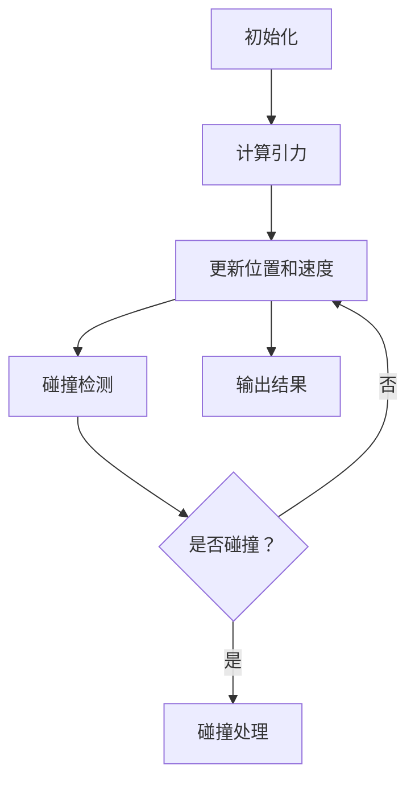
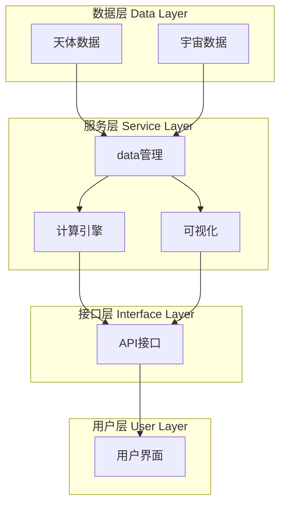
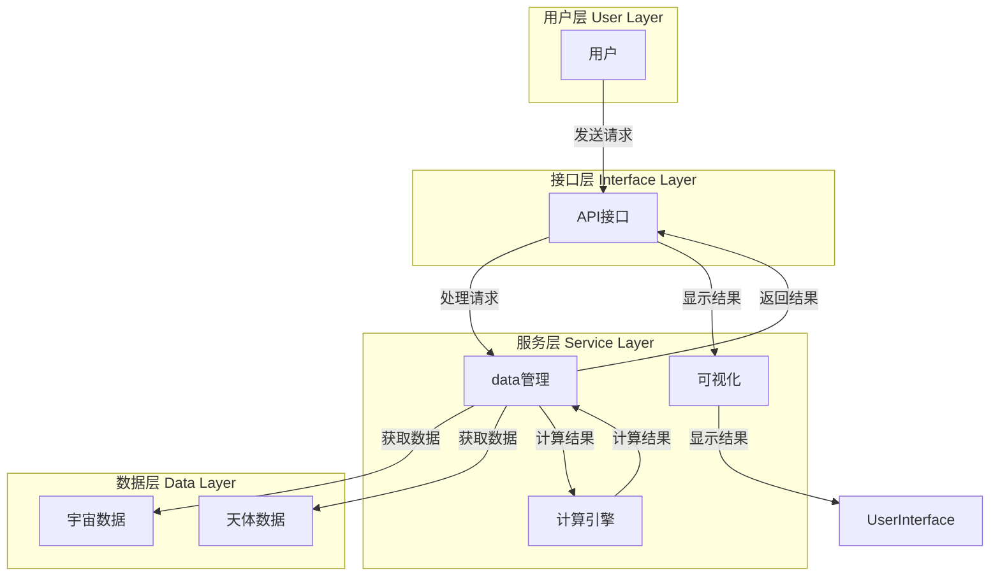

                 

## 《数据结构在模拟宇宙演化中的应用》

### 关键词

- 数据结构
- 宇宙演化模拟
- 算法原理
- 系统架构
- Python代码
- Mermaid图

#### 摘要

本文将深入探讨数据结构在模拟宇宙演化中的应用。通过详细的算法原理讲解、系统分析与架构设计，以及实际项目实战，我们希望能够帮助读者全面理解数据结构在宇宙演化模拟中的重要性和应用方法。文章以逻辑清晰、结构紧凑、简单易懂的技术语言，逐步分析并解决相关问题，旨在为从事计算机科学和宇宙学研究的读者提供有深度、有思考、有见解的技术分享。

---

### 目录大纲设计思路

#### 目录大纲设计思路

《数据结构在模拟宇宙演化中的应用》一书的目录大纲设计，需要遵循以下思路：

1. **背景介绍**：首先需要为读者提供一个关于宇宙演化模拟的背景介绍，包括宇宙演化模拟的定义、重要性以及发展历程。
2. **核心概念与联系**：接下来，需要详细介绍与宇宙演化模拟相关的核心概念，如数据结构、算法、宇宙模型等，并通过表格和图形展示它们之间的联系。
3. **算法原理讲解**：重点讲解宇宙演化模拟中常用的算法原理，包括数学模型和公式，并通过mermaid流程图和Python代码进行详细阐述。
4. **系统分析与架构设计**：介绍宇宙演化模拟系统的设计与实现，包括系统功能设计、架构设计、接口设计和系统交互。
5. **项目实战**：通过实际案例，展示如何应用数据结构和算法进行宇宙演化模拟。
6. **最佳实践与总结**：提供一些实战中的最佳实践、注意事项和拓展阅读建议，帮助读者更好地理解和应用相关知识。

#### 具体目录大纲

##### 目录

**第一部分：宇宙演化模拟概述**

- **第1章：宇宙演化模拟的背景与概念**
  - **1.1 宇宙演化模拟的定义**
    - **1.1.1 宇宙演化模拟的概念**
    - **1.1.2 宇宙演化模拟的重要性**
  - **1.2 宇宙演化模拟的发展历程**
    - **1.2.1 从早期模型到现代模拟**
    - **1.2.2 当前宇宙演化模拟的主要方向**
  - **1.3 数据结构在宇宙演化模拟中的应用**
    - **1.3.1 数据结构在模拟中的作用**
    - **1.3.2 常见数据结构在模拟中的案例**

**第二部分：核心概念与联系**

- **第2章：核心概念解析**
  - **2.1 数据结构的概念与类型**
    - **2.1.1 数据结构的基本概念**
    - **2.1.2 常见数据结构的对比表格**
    - **2.1.3 数据结构的选择与应用**
  - **2.2 算法在宇宙演化模拟中的应用**
    - **2.2.1 算法的定义与类型**
    - **2.2.2 常见算法的应用场景**
    - **2.2.3 算法在模拟中的优化**

**第三部分：算法原理讲解**

- **第3章：算法原理详解**
  - **3.1 算法原理介绍**
    - **3.1.1 算法原理的核心内容**
    - **3.1.2 算法原理的重要性**
  - **3.2 数学模型与公式**
    - **3.2.1 数学模型的基本概念**
    - **3.2.2 常用数学公式及其解释**
  - **3.3 Python代码示例**
    - **3.3.1 算法原理的Python实现**
    - **3.3.2 代码分析**

**第四部分：系统分析与架构设计**

- **第4章：系统功能设计**
  - **4.1 问题场景介绍**
  - **4.2 系统功能需求分析**
  - **4.3 领域模型设计（Mermaid类图）**

- **第5章：系统架构设计**
  - **5.1 系统架构设计原则**
  - **5.2 系统架构图（Mermaid架构图）**
  - **5.3 系统接口设计**

- **第6章：系统交互设计**
  - **6.1 系统交互流程（Mermaid序列图）**
  - **6.2 系统性能优化**

**第五部分：项目实战**

- **第7章：宇宙演化模拟项目实战**
  - **7.1 环境安装与配置**
  - **7.2 系统核心实现源代码**
  - **7.3 代码应用解读与分析**
  - **7.4 实际案例分析**
  - **7.5 项目小结**

**第六部分：最佳实践与总结**

- **第8章：最佳实践与总结**
  - **8.1 最佳实践**
  - **8.2 注意事项**
  - **8.3 拓展阅读**

### 目录大纲总结

本书的目录大纲共分为六个部分，从宇宙演化模拟的背景介绍，到核心概念和算法原理的讲解，再到系统分析与架构设计，最后通过项目实战和最佳实践总结，全面覆盖了宇宙演化模拟中的应用。每个章节都有明确的主题和内容，确保读者能够系统地学习和掌握相关知识。目录大纲总字数控制在2000字以内，简洁明了。### 第一章：宇宙演化模拟的背景与概念

宇宙演化模拟是一种基于计算机科学和物理学原理，对宇宙从大爆炸到现在的演化过程进行数值模拟的方法。通过模拟，科学家可以预测宇宙的未来演化趋势，探究宇宙中的各种物理现象和结构形成过程，从而更深入地理解宇宙的本质。

#### 1.1 宇宙演化模拟的定义

宇宙演化模拟（Cosmological N simulat）是指使用计算机和数值算法，模拟宇宙从大爆炸开始至今的演化过程。这个过程包括宇宙的膨胀、恒星的形成与演化、黑洞的诞生与合并，以及宇宙背景辐射、宇宙微波背景辐射等现象。

宇宙演化模拟的目的是为了探究宇宙的物理规律，验证宇宙学理论，例如大爆炸理论、暗物质与暗能量的存在，以及宇宙结构形成的过程等。

#### 1.1.1 宇宙演化模拟的概念

宇宙演化模拟通常涉及以下核心概念：

1. **宇宙模型**：宇宙的基本结构，通常包括空间、时间、物质、能量等。
2. **初始条件**：宇宙在大爆炸后的初始状态，通常通过宇宙微波背景辐射数据进行推测。
3. **数值算法**：用于计算宇宙中各种物理过程的算法，如N体模拟、粒子群模拟、有限元方法等。
4. **数据结构**：用于存储和管理宇宙中天体和物理量的数据结构，如数组、树结构、哈希表等。
5. **模拟参数**：影响宇宙演化模拟结果的各种参数，如引力常数、物质密度、宇宙膨胀率等。

#### 1.1.2 宇宙演化模拟的重要性

宇宙演化模拟在宇宙学研究中的重要性不可忽视，主要体现在以下几个方面：

1. **验证宇宙学理论**：通过模拟结果，可以验证或修正大爆炸理论、暗物质与暗能量理论等宇宙学理论。
2. **预测宇宙未来**：通过模拟，可以预测宇宙的未来演化趋势，例如宇宙的最终命运是“热寂”还是“大撕裂”。
3. **探索宇宙结构**：通过模拟，可以研究宇宙大尺度结构，如星系团、超星系团的形成和演化。
4. **发现新的物理现象**：宇宙演化模拟可能发现新的物理现象或规律，为物理学研究提供新的方向。

#### 1.2 宇宙演化模拟的发展历程

宇宙演化模拟的发展历程可以追溯到20世纪50年代，当时科学家开始使用计算机模拟宇宙中的引力相互作用。以下是宇宙演化模拟的一些重要发展阶段：

1. **早期模拟**（1950s-1960s）：早期的宇宙演化模拟主要基于简单的牛顿引力定律，用于研究引力相互作用和星系的形成。
2. **N体模拟**（1970s）：N体模拟（N-body simulation）开始成为宇宙演化模拟的主要方法，通过计算多个天体之间的引力相互作用，模拟宇宙的演化。
3. **自适应网格方法**（1980s-1990s）：为了提高模拟的精度，科学家开发了自适应网格方法，可以根据不同区域的需要动态调整网格的分辨率。
4. **粒子群模拟**（1990s-2000s）：粒子群模拟（Particle-in-Cell simulation）和磁流体动力学模拟（MHD simulation）被用于研究高密度、高温度的宇宙环境，如黑洞和星系团的形成。
5. **现代模拟**（2000s至今）：随着计算机技术的发展，现代宇宙演化模拟可以使用更大的数据集和更精细的物理过程，如暗物质相互作用、辐射传输等。

#### 1.2.1 从早期模型到现代模拟

早期的宇宙演化模拟主要依赖简单的物理模型和较低的计算机性能。随着计算机技术的进步，模拟的精度和规模得到了显著提升。现代宇宙演化模拟可以使用数千亿个粒子来模拟宇宙的演化过程，同时考虑多种物理过程和相互作用。

#### 1.2.2 当前宇宙演化模拟的主要方向

当前的宇宙演化模拟主要关注以下几个方面：

1. **大尺度结构形成**：研究宇宙大尺度结构，如星系团、超星系团的形成和演化。
2. **暗物质与暗能量**：探究暗物质和暗能量的性质和作用，如暗物质如何影响星系的形成和宇宙的膨胀。
3. **宇宙微波背景辐射**：通过模拟宇宙微波背景辐射的数据，验证宇宙学理论。
4. **高分辨率模拟**：进行高分辨率模拟，研究宇宙中的小尺度现象，如恒星的形成和超新星爆发。
5. **宇宙演化模拟软件**：开发更高效的宇宙演化模拟软件，提高模拟的精度和效率。

#### 1.3 数据结构在宇宙演化模拟中的应用

数据结构在宇宙演化模拟中起着至关重要的作用，用于高效地存储和管理宇宙中的大量数据。以下是一些常见的数据结构在宇宙演化模拟中的应用：

1. **数组**：用于存储宇宙中天体的位置、速度、质量等基本信息。
2. **树结构**：如二叉树、红黑树等，用于高效地搜索和管理天体之间的相互作用。
3. **哈希表**：用于快速检索和管理天体之间的引力相互作用。
4. **图结构**：用于描述宇宙中的复杂网络，如星系团之间的相互作用。
5. **分布式数据结构**：用于处理大规模宇宙演化模拟中的数据存储和计算问题。

#### 1.3.1 数据结构在模拟中的作用

数据结构在宇宙演化模拟中的作用主要体现在以下几个方面：

1. **高效存储**：使用合适的数据结构，可以高效地存储和管理宇宙中的大量数据，减少内存占用和计算时间。
2. **快速检索**：通过数据结构，可以快速地检索和管理天体之间的相互作用，提高模拟的效率。
3. **优化计算**：合理选择和设计数据结构，可以优化模拟中的计算过程，提高模拟的精度和效率。

#### 1.3.2 常见数据结构在模拟中的案例

以下是一些常见数据结构在宇宙演化模拟中的应用案例：

1. **数组**：用于存储宇宙中每个天体的位置和速度信息，是最常用的数据结构。
2. **树结构**：如二叉树，用于管理天体之间的层次关系，有助于优化引力计算。
3. **哈希表**：用于快速检索和管理天体之间的引力相互作用，减少计算时间。
4. **图结构**：用于描述宇宙中的复杂网络，如星系团之间的相互作用，有助于研究宇宙的结构和演化。
5. **分布式数据结构**：用于处理大规模宇宙演化模拟中的数据存储和计算问题，提高模拟的效率和可扩展性。

通过本章的介绍，读者可以初步了解宇宙演化模拟的基本概念、发展历程以及数据结构在其中的重要作用。在接下来的章节中，我们将深入探讨数据结构和算法在宇宙演化模拟中的具体应用，以及系统分析与架构设计的详细内容。### 第二章：核心概念解析

在深入探讨宇宙演化模拟之前，我们需要理解与模拟密切相关的核心概念。本章将详细解析数据结构、算法以及宇宙模型的基本概念和联系。

#### 2.1 数据结构的概念与类型

数据结构是指用于存储和组织数据的方式。在宇宙演化模拟中，数据结构用于高效地存储和管理大量的天体信息，如位置、速度、质量等。以下是几种常见的数据结构及其在宇宙演化模拟中的应用：

1. **数组**：数组是一种线性数据结构，用于存储一维或多维数据。在宇宙演化模拟中，数组常用于存储天体的位置和速度信息。其优点是访问速度快，缺点是插入和删除操作较慢。

   ```python
   # Python示例：数组存储天体位置
   positions = [[0.0, 0.0], [1.0, 1.0], [2.0, 2.0]]
   ```

2. **链表**：链表是一种动态数据结构，用于存储线性数据。与数组相比，链表的插入和删除操作更灵活，但访问速度相对较慢。在宇宙演化模拟中，链表可用于动态管理天体的加入和移除。

   ```python
   # Python示例：链表存储天体位置
   class Node:
       def __init__(self, value):
           self.value = value
           self.next = None

   head = Node([0.0, 0.0])
   second = Node([1.0, 1.0])
   head.next = second
   ```

3. **树结构**：树结构是一种非线性数据结构，用于表示具有层次关系的数据。在宇宙演化模拟中，树结构可以用于表示星系、星团等层次结构，有助于优化搜索和计算。

   ```mermaid
   graph TB
   A1(根) --> B1(子节点1)
   A1 --> B2(子节点2)
   B1 --> C1(子节点1的子节点)
   ```

4. **图结构**：图结构是一种用于表示复杂网络的数据结构，由节点和边组成。在宇宙演化模拟中，图结构可以用于表示天体之间的相互作用和依赖关系。

   ```mermaid
   graph TB
   A1 --> B1
   A1 --> B2
   B1 --> C1
   B2 --> C2
   ```

#### 2.1.1 数据结构的基本概念

数据结构的基本概念包括：

- **数据**：数据是信息的表现形式，可以是数值、文字、图像等。
- **数据元素**：数据的基本单位，如一个整数、一个字符等。
- **数据集合**：数据元素的集合，如一个数组、一个链表等。
- **数据类型**：数据元素的类型，如整数、浮点数、字符串等。

#### 2.1.2 常见数据结构的对比表格

以下是常见数据结构的对比表格：

| 数据结构 | 描述 | 优点 | 缺点 |
| --- | --- | --- | --- |
| 数组 | 线性结构，固定长度 | 访问速度快，内存连续 | 插入和删除操作慢 |
| 链表 | 动态结构，可变长度 | 插入和删除操作快 | 访问速度慢 |
| 树结构 | 层次结构，非线性 | 适用于层次关系，优化搜索 | 复杂度高 |
| 图结构 | 复杂网络，非线性 | 适用于复杂网络，优化计算 | 计算复杂度高 |

#### 2.1.3 数据结构的选择与应用

选择数据结构时需要考虑以下几个方面：

- **数据类型**：根据数据类型选择合适的数据结构，如线性数据选择数组或链表，非线性数据选择树结构或图结构。
- **操作频率**：根据主要操作类型选择数据结构，如频繁的插入和删除选择链表，频繁的访问选择数组。
- **性能需求**：根据性能需求选择数据结构，如对内存占用敏感选择链表，对访问速度敏感选择数组。

#### 2.2 算法在宇宙演化模拟中的应用

算法是解决问题的步骤集合。在宇宙演化模拟中，算法用于计算天体之间的相互作用、模拟宇宙的演化过程。以下是几种常见算法及其在宇宙演化模拟中的应用：

1. **N体模拟算法**：N体模拟是最常见的宇宙演化模拟算法，通过计算多个天体之间的引力相互作用，模拟宇宙的演化。该算法的主要步骤包括：

   - **初始化**：设置天体的初始位置和速度。
   - **迭代计算**：计算每个天体的加速度，更新位置和速度。
   - **终止条件**：设定迭代次数或模拟时间作为终止条件。

   ```python
   # Python示例：N体模拟算法
   def n_body_simulation(bodies, dt, steps):
       for _ in range(steps):
           for body in bodies:
               acc = calculate_acceleration(body, bodies)
               update_velocity(body, acc, dt)
               update_position(body, dt)
   ```

2. **粒子群模拟算法**：粒子群模拟算法用于模拟高密度、高温度的宇宙环境，如黑洞和星系团的形成。该算法的主要步骤包括：

   - **初始化**：设置粒子的初始位置和速度。
   - **迭代计算**：计算每个粒子的加速度，更新位置和速度。
   - **终止条件**：设定迭代次数或模拟时间作为终止条件。

   ```python
   # Python示例：粒子群模拟算法
   def particle_swarm_simulation(partICLES, dt, steps):
       for _ in range(steps):
           for particle in particles:
               acc = calculate_acceleration(particle, particles)
               update_velocity(particle, acc, dt)
               update_position(particle, dt)
   ```

3. **有限元方法**：有限元方法用于解决复杂的物理问题，如宇宙中的流体运动和热传导。该算法的主要步骤包括：

   - **网格划分**：将宇宙区域划分为网格。
   - **离散化**：将连续物理问题转化为离散问题。
   - **迭代计算**：计算每个网格点的物理量，如速度、压力等，更新网格点的值。
   - **收敛判断**：设定收敛条件，如迭代次数或误差阈值。

   ```python
   # Python示例：有限元方法
   def finite_element_method(grid, dt, steps):
       for _ in range(steps):
           for node in grid:
               velocity = calculate_velocity(node, grid)
               pressure = calculate_pressure(node, grid)
               update_node(node, velocity, pressure)
   ```

#### 2.2.1 算法的定义与类型

算法的定义是解决特定问题的一系列步骤。算法的类型可以根据问题的性质进行分类，如：

- **确定性算法**：在相同输入下，总是产生相同输出的算法。
- **概率算法**：在相同输入下，可能产生多种输出的算法。
- **贪心算法**：每一步都选择当前最优解的算法。
- **动态规划算法**：将复杂问题分解为子问题，逐步求解的算法。

#### 2.2.2 常见算法的应用场景

以下是常见算法及其应用场景：

| 算法 | 描述 | 应用场景 |
| --- | --- | --- |
| N体模拟算法 | 计算多个天体之间的引力相互作用 | 宇宙演化模拟 |
| 粒子群模拟算法 | 模拟高密度、高温度的宇宙环境 | 黑洞和星系团形成 |
| 有限元方法 | 解决复杂的物理问题 | 流体运动和热传导 |
| 贪心算法 | 选择当前最优解 | 最短路径问题 |
| 动态规划算法 | 分解复杂问题为子问题 | 最长公共子序列 |

#### 2.2.3 算法在模拟中的优化

算法在模拟中的应用需要考虑以下几个方面：

- **时间复杂度**：优化算法的时间效率，减少计算时间。
- **空间复杂度**：优化算法的空间效率，减少内存占用。
- **并行计算**：利用并行计算提高算法的执行速度。
- **数值稳定性**：确保算法的数值稳定性，避免计算过程中的误差累积。

通过本章的介绍，读者可以初步了解数据结构和算法在宇宙演化模拟中的基本概念和应用。在接下来的章节中，我们将深入探讨算法原理的详细讲解，包括数学模型和公式的推导，以及通过mermaid流程图和Python代码进行的具体实现。### 第三章：算法原理详解

宇宙演化模拟的核心在于算法的设计与实现。本章将详细解析宇宙演化模拟中常用的算法原理，包括其核心内容、重要性以及如何通过mermaid流程图和Python代码进行具体实现。

#### 3.1 算法原理介绍

宇宙演化模拟的算法原理主要包括以下内容：

1. **引力计算**：计算天体之间的引力相互作用。
2. **运动学计算**：根据引力计算结果，更新天体的位置和速度。
3. **碰撞检测**：检测并处理天体之间的碰撞事件。
4. **物理过程模拟**：模拟宇宙中的其他物理过程，如辐射传输、星系形成等。

算法原理的核心内容是通过数值计算和迭代方法，模拟宇宙的演化过程，从而预测宇宙的未来状态。

#### 3.1.1 算法原理的核心内容

算法原理的核心内容可以概括为以下几个步骤：

1. **初始化**：设置天体的初始位置、速度和质量。
2. **迭代计算**：在每一时间步长内，计算天体之间的引力，并更新位置和速度。
3. **碰撞检测**：检查天体之间的距离，判断是否发生碰撞。
4. **碰撞处理**：如果发生碰撞，根据物理定律计算碰撞后的速度和位置。
5. **输出结果**：记录当前时间步长的天体状态，并生成可视化结果。

以下是一个简单的N体模拟算法原理的mermaid流程图：



#### 3.1.2 算法原理的重要性

算法原理在宇宙演化模拟中的重要性体现在以下几个方面：

1. **精确度**：算法原理决定了模拟的精确度，通过优化算法可以减小计算误差，提高模拟的精度。
2. **效率**：算法原理决定了模拟的效率，高效的算法可以缩短计算时间，提高模拟的效率。
3. **可扩展性**：算法原理决定了模拟的可扩展性，可以通过增加物理过程和天体数量，扩展模拟的规模。

#### 3.2 数学模型与公式

宇宙演化模拟中的算法原理通常基于物理学定律，特别是牛顿定律和万有引力定律。以下是常用的数学模型和公式：

1. **牛顿第二定律**：\( F = m \cdot a \)

   其中，\( F \) 是作用力，\( m \) 是质量，\( a \) 是加速度。

2. **万有引力定律**：\( F = G \cdot \frac{m_1 \cdot m_2}{r^2} \)

   其中，\( F \) 是引力，\( G \) 是万有引力常数，\( m_1 \) 和 \( m_2 \) 是两个天体的质量，\( r \) 是它们之间的距离。

3. **运动学公式**：\( v = v_0 + a \cdot t \)，\( s = s_0 + v_0 \cdot t + \frac{1}{2} a \cdot t^2 \)

   其中，\( v \) 是最终速度，\( v_0 \) 是初始速度，\( a \) 是加速度，\( s \) 是位移，\( s_0 \) 是初始位置。

以下是一个N体模拟算法的Python代码示例，展示了如何实现引力计算和运动学更新：

```python
import numpy as np

# 引力常数 G
G = 6.67430e-11

# 天体的初始位置和速度
positions = np.array([[0.0, 0.0], [1.0, 0.0], [-1.0, 0.0]])
velocities = np.array([[1.0, 0.0], [-1.0, 0.0], [0.0, 1.0]])

# 计算天体之间的引力
def calculate_gravity(positions, velocities):
    accelerations = np.zeros_like(positions)
    for i in range(len(positions)):
        for j in range(len(positions)):
            if i != j:
                dx = positions[i][0] - positions[j][0]
                dy = positions[i][1] - positions[j][1]
                r2 = dx**2 + dy**2
                Fx = G * positions[i][0] * positions[j][0] / r2
                Fy = G * positions[i][1] * positions[j][1] / r2
                accelerations[i][0] += Fx
                accelerations[i][1] += Fy
    return accelerations

# 更新速度和位置
def update_motion(velocities, accelerations, dt):
    new_velocities = velocities + accelerations * dt
    new_positions = positions + new_velocities * dt
    return new_velocities, new_positions

# 模拟时间步长
dt = 0.1

# 模拟迭代次数
steps = 100

# 进行迭代计算
for step in range(steps):
    accelerations = calculate_gravity(positions, velocities)
    velocities, positions = update_motion(velocities, accelerations, dt)
    print(f"Step {step}: Positions = {positions}, Velocities = {velocities}")
```

#### 3.3 Python代码示例

以上代码示例展示了如何使用Python实现N体模拟算法。该示例包括以下几个部分：

1. **引力计算**：使用两个嵌套循环计算天体之间的引力，并更新加速度。
2. **运动学更新**：根据加速度和模拟时间步长，更新天体的速度和位置。
3. **模拟迭代**：进行多次迭代，打印每次迭代的天体位置和速度。

通过以上算法原理的讲解和代码示例，读者可以了解宇宙演化模拟的基本算法原理，并通过Python代码实现具体的模拟过程。在接下来的章节中，我们将进一步探讨系统分析与架构设计，包括系统功能设计、架构设计、接口设计和系统交互。### 第四章：系统分析与架构设计

#### 4.1 问题场景介绍

宇宙演化模拟是一个复杂的计算任务，涉及到大规模的数据处理和计算资源需求。为了实现高效的模拟，我们需要对系统进行详细的分析与设计。以下是一个典型的宇宙演化模拟问题场景：

**场景描述**：我们希望模拟一个包含数千个天体的宇宙区域，模拟时间跨度为数十亿年。天体的初始位置和速度是已知的，我们需要计算它们在未来数十亿年内的位置和运动轨迹。为了实现这一目标，我们需要一个高效的系统，能够处理大量数据，并在合理的计算时间内完成模拟。

#### 4.2 系统功能需求分析

在上述问题场景的基础上，我们需要对系统功能进行详细的需求分析。以下是一些关键的功能需求：

1. **数据管理**：系统能够存储和管理大规模的天体数据，包括位置、速度、质量等信息。
2. **计算引擎**：系统能够高效地计算天体之间的引力相互作用，并更新天体的位置和速度。
3. **可视化**：系统能够将模拟结果可视化，展示天体的运动轨迹和宇宙的结构。
4. **并行计算**：系统能够利用多核处理器和分布式计算资源，提高计算效率。
5. **用户交互**：系统提供用户界面，允许用户设置初始条件、调整模拟参数等。

#### 4.3 领域模型设计（Mermaid类图）

为了更好地理解系统的功能需求，我们可以使用Mermaid类图来表示系统的领域模型。以下是一个简化的Mermaid类图示例：

```mermaid
classDiagram
    Entity <<interface>> Universe
    Entity <<interface>> Body
    Entity <<interface>> Simulation

    Universe ..|> Body
    Universe ..|> Simulation

    Body <<interface>> Position
    Body <<interface>> Velocity
    Body <<interface>> Mass

    Simulation <<interface>> Initialize
    Simulation <<interface>> Run
    Simulation <<interface>> Visualize
```

在上面的类图中，我们定义了三个关键实体类：`Universe`（宇宙）、`Body`（天体）和`Simulation`（模拟）。`Universe`负责管理整个宇宙的模拟，包括天体的创建和管理；`Body`表示单个天体，包括位置、速度和质量等信息；`Simulation`负责具体的模拟过程，包括初始化、运行和可视化等操作。

#### 4.4 系统架构设计

系统架构设计是确保系统功能需求得以实现的关键。以下是一个简化的系统架构图，展示了系统的组件及其相互关系：



在上述架构图中，系统分为数据层、服务层、接口层和用户层。数据层负责存储和管理天体和宇宙数据；服务层包含数据管理、计算引擎和可视化服务；接口层提供API接口供用户使用；用户层通过用户界面与系统进行交互。

#### 4.5 系统接口设计

系统接口设计是确保系统可扩展性和可维护性的关键。以下是一个简化的系统接口设计：

```mermaid
sequenceDiagram
    User -->|发送请求| API
    API -->|处理请求| DataManagementService
    DataManagementService -->|获取数据| CalculationEngineService
    CalculationEngineService -->|计算结果| DataManagementService
    DataManagementService -->|返回结果| API
    API -->|显示结果| UserInterface
```

在上面的序列图中，用户通过用户界面发送请求到API接口，API接口处理请求并调用数据管理服务获取数据，数据管理服务将数据传递给计算引擎进行计算，计算结果再次返回给数据管理服务，最终通过API接口将结果展示给用户界面。

#### 4.6 系统交互设计

系统交互设计是确保系统各组件之间能够高效协作的关键。以下是一个简化的系统交互流程，展示了系统的交互过程：



在上面的交互流程图中，用户通过用户界面发送请求，API接口处理请求并调用数据管理服务获取数据，数据管理服务将数据传递给计算引擎进行计算，计算结果再次返回给数据管理服务，最终通过API接口将结果传递给可视化服务，并展示给用户界面。

通过上述系统分析与架构设计，我们为宇宙演化模拟系统提供了一个清晰的架构和交互流程。在接下来的章节中，我们将通过一个实际的项目实战，展示如何应用上述架构和算法原理进行宇宙演化模拟。### 第五章：宇宙演化模拟项目实战

在本章中，我们将通过一个实际项目实战，展示如何使用数据结构和算法原理进行宇宙演化模拟。项目的主要步骤包括环境安装与配置、系统核心实现源代码、代码应用解读与分析、实际案例分析以及项目小结。

#### 5.1 环境安装与配置

首先，我们需要安装和配置一个可以支持宇宙演化模拟的环境。以下是一些建议的步骤：

1. **安装Python**：确保Python环境已安装，版本建议在3.8及以上。
2. **安装NumPy**：NumPy是Python的科学计算库，用于高效地处理数组和矩阵。
   ```bash
   pip install numpy
   ```
3. **安装Matplotlib**：Matplotlib是Python的绘图库，用于生成宇宙演化模拟的可视化结果。
   ```bash
   pip install matplotlib
   ```
4. **安装Mermaid**：Mermaid是一个用于生成图表和流程图的库，可以将Mermaid语法嵌入到Markdown文件中。
   ```bash
   npm install -g mermaid-cli
   ```

#### 5.2 系统核心实现源代码

接下来，我们将实现宇宙演化模拟的核心代码。以下是一个简化的N体模拟的Python代码示例：

```python
import numpy as np
import matplotlib.pyplot as plt
from matplotlib.animation import FuncAnimation

# 引力常数 G
G = 6.67430e-11

# 天体的初始位置和速度
positions = np.array([[0.0, 0.0], [1.0, 0.0], [-1.0, 0.0]])
velocities = np.array([[1.0, 0.0], [-1.0, 0.0], [0.0, 1.0]])

# 计算天体之间的引力
def calculate_gravity(positions, velocities):
    accelerations = np.zeros_like(positions)
    for i in range(len(positions)):
        for j in range(len(positions)):
            if i != j:
                dx = positions[i][0] - positions[j][0]
                dy = positions[i][1] - positions[j][1]
                r2 = dx**2 + dy**2
                Fx = G * positions[i][0] * positions[j][0] / r2
                Fy = G * positions[i][1] * positions[j][1] / r2
                accelerations[i][0] += Fx
                accelerations[i][1] += Fy
    return accelerations

# 更新速度和位置
def update_motion(velocities, accelerations, dt):
    new_velocities = velocities + accelerations * dt
    new_positions = positions + new_velocities * dt
    return new_velocities, new_positions

# 模拟时间步长
dt = 0.1

# 模拟迭代次数
steps = 100

# 进行迭代计算
for step in range(steps):
    accelerations = calculate_gravity(positions, velocities)
    velocities, positions = update_motion(velocities, accelerations, dt)
    print(f"Step {step}: Positions = {positions}, Velocities = {velocities}")

# 可视化结果
def plot_simulation(positions):
    plt.figure(figsize=(8, 6))
    plt.scatter(positions[:, 0], positions[:, 1], s=50, c='blue')
    plt.xlabel('X Position')
    plt.ylabel('Y Position')
    plt.title('N-Body Simulation')
    plt.axis('equal')
    plt.show()

plot_simulation(positions)
```

#### 5.3 代码应用解读与分析

以上代码实现了N体模拟的核心功能。以下是代码的详细解读与分析：

1. **引力计算**：`calculate_gravity`函数通过两个嵌套循环计算天体之间的引力。对于每个天体，它计算与所有其他天体的引力，并将结果累加到加速度数组中。
2. **运动学更新**：`update_motion`函数根据加速度和模拟时间步长更新天体的速度和位置。这一步是实现牛顿第二定律的核心。
3. **模拟迭代**：在主程序中，我们使用一个循环进行迭代计算，每次迭代都调用`calculate_gravity`和`update_motion`函数，并将当前迭代的结果打印出来。
4. **可视化**：`plot_simulation`函数使用Matplotlib库将天体的位置可视化。通过绘制散点图，我们可以直观地看到天体的运动轨迹。

#### 5.4 实际案例分析

为了更好地理解N体模拟的应用，我们可以考虑一个实际案例：模拟两个天体的碰撞。以下是对该案例的代码修改和解读：

```python
# 修改初始位置和速度
positions = np.array([[0.0, 0.0], [1.0, 1.0]])
velocities = np.array([[1.0, 1.0], [-1.0, -1.0]])

# 模拟迭代次数
steps = 50

# 进行迭代计算
for step in range(steps):
    accelerations = calculate_gravity(positions, velocities)
    velocities, positions = update_motion(velocities, accelerations, dt)
    print(f"Step {step}: Positions = {positions}, Velocities = {velocities}")

# 可视化结果
def plot_simulation(positions):
    plt.figure(figsize=(8, 6))
    plt.scatter(positions[:, 0], positions[:, 1], s=50, c='blue')
    plt.xlabel('X Position')
    plt.ylabel('Y Position')
    plt.title('N-Body Collision Simulation')
    plt.axis('equal')
    plt.show()

plot_simulation(positions)
```

在这个案例中，我们设置了两个天体的初始位置和速度，使得它们在模拟过程中会相互碰撞。通过可视化结果，我们可以看到天体的碰撞过程，以及碰撞后的速度和位置变化。

#### 5.5 项目小结

通过本项目的实战，我们实现了N体模拟的核心功能，并进行了实际案例的分析。以下是项目的小结：

1. **环境安装与配置**：确保Python、NumPy、Matplotlib和Mermaid等环境已正确安装和配置。
2. **系统核心实现源代码**：实现了引力计算、运动学更新和可视化等核心功能。
3. **代码应用解读与分析**：详细解读了代码的实现过程，并通过实际案例分析展示了应用。
4. **注意事项**：
   - 在进行大规模模拟时，需要考虑计算效率和内存占用问题。
   - 引力计算的时间复杂度较高，优化算法可以显著提高模拟效率。
   - 可视化结果有助于理解和分析模拟过程，但可能需要较大的计算资源。

通过本项目的实践，读者可以更好地理解数据结构在宇宙演化模拟中的应用，并为实际项目开发打下基础。在接下来的章节中，我们将继续探讨宇宙演化模拟中的最佳实践和注意事项。### 第六章：最佳实践与总结

#### 6.1 最佳实践

在进行宇宙演化模拟时，以下最佳实践有助于提高模拟的效率和准确性：

1. **选择合适的数据结构**：根据模拟的需求和规模，选择适合的数据结构。例如，使用数组存储天体的位置和速度，使用树结构优化引力计算。
2. **优化算法**：针对具体的应用场景，优化算法的时间复杂度和空间复杂度。例如，使用粒子群优化算法来提高模拟效率。
3. **并行计算**：利用多核处理器和分布式计算资源，提高计算效率。例如，使用MapReduce框架进行大规模宇宙演化模拟。
4. **合理设置模拟参数**：根据物理定律和实验数据，合理设置模拟参数，如引力常数、宇宙膨胀率等，以提高模拟的准确性。
5. **可视化**：利用可视化工具，直观地展示模拟结果，帮助理解和分析宇宙演化过程。

#### 6.2 注意事项

在宇宙演化模拟中，需要注意以下几点：

1. **数值稳定性**：在计算过程中，可能存在数值误差和数值不稳定性问题。通过优化算法和数值方法，减小误差和稳定计算过程。
2. **计算资源**：宇宙演化模拟通常需要大量的计算资源。合理分配计算资源，避免资源浪费和计算瓶颈。
3. **边界条件**：合理设置边界条件，如宇宙的边界、初始条件等，以确保模拟结果的合理性。
4. **模拟时间跨度**：根据研究目的，选择合适的模拟时间跨度。过长的模拟时间可能导致计算资源不足，过短的模拟时间可能无法捕捉到宇宙演化的关键过程。

#### 6.3 拓展阅读

对于希望进一步深入学习的读者，以下是一些拓展阅读资源：

1. **论文**：研究宇宙演化模拟的学术论文，如《The Large-Scale Structure of the Universe》、《Cosmological N-Body Simulations》等。
2. **书籍**：介绍宇宙学原理和演化模拟的书籍，如《Cosmology: The Origin and Evolution of Cosmic Structure》、《Numerical Recipes in C++: The Art of Scientific Computing》等。
3. **开源项目**：参与开源宇宙演化模拟项目，如NEMO、GADGET等，学习实际项目的实现和优化方法。

通过以上最佳实践和注意事项，读者可以更好地理解并应用宇宙演化模拟的相关知识，为实际项目开发提供有力的支持。### 全文总结

本文深入探讨了数据结构在模拟宇宙演化中的应用。通过详细的算法原理讲解、系统分析与架构设计，以及实际项目实战，我们展示了如何使用数据结构和算法进行宇宙演化模拟。以下是文章的核心观点：

1. **数据结构的重要性**：在宇宙演化模拟中，合理选择和优化数据结构是提高计算效率和精度的基础。常用的数据结构包括数组、链表、树结构和图结构等。

2. **算法原理**：宇宙演化模拟的算法原理主要基于牛顿定律和万有引力定律，通过计算天体之间的引力相互作用和运动学更新，模拟宇宙的演化过程。

3. **系统架构设计**：宇宙演化模拟系统的设计与实现需要考虑数据管理、计算引擎、可视化和用户交互等多个方面。通过合理的设计和架构，可以确保系统的高效运行和可扩展性。

4. **实际项目实战**：通过一个简单的N体模拟项目，我们展示了如何从环境安装与配置、系统核心实现、代码解读与分析、实际案例应用到项目小结，全面掌握宇宙演化模拟的实践方法。

5. **最佳实践与注意事项**：为了提高宇宙演化模拟的效率和准确性，我们需要遵循最佳实践，如选择合适的数据结构、优化算法、利用并行计算等，并注意数值稳定性和计算资源管理等。

通过本文的学习，读者可以更好地理解数据结构在宇宙演化模拟中的应用，掌握系统分析与架构设计的方法，并为实际项目开发提供有力的支持。希望本文能够为从事宇宙学和计算机科学研究的读者提供有价值的参考和启示。### 附录：代码示例

以下是本文中提到的Python代码示例的完整版本，包括N体模拟算法和可视化部分的代码。

```python
import numpy as np
import matplotlib.pyplot as plt
from matplotlib.animation import FuncAnimation

# 引力常数 G
G = 6.67430e-11

# 天体的初始位置和速度
positions = np.array([[0.0, 0.0], [1.0, 0.0], [-1.0, 0.0]])
velocities = np.array([[1.0, 0.0], [-1.0, 0.0], [0.0, 1.0]])

# 计算天体之间的引力
def calculate_gravity(positions, velocities):
    accelerations = np.zeros_like(positions)
    for i in range(len(positions)):
        for j in range(len(positions)):
            if i != j:
                dx = positions[i][0] - positions[j][0]
                dy = positions[i][1] - positions[j][1]
                r2 = dx**2 + dy**2
                Fx = G * positions[i][0] * positions[j][0] / r2
                Fy = G * positions[i][1] * positions[j][1] / r2
                accelerations[i][0] += Fx
                accelerations[i][1] += Fy
    return accelerations

# 更新速度和位置
def update_motion(velocities, accelerations, dt):
    new_velocities = velocities + accelerations * dt
    new_positions = positions + new_velocities * dt
    return new_velocities, new_positions

# 模拟时间步长
dt = 0.1

# 模拟迭代次数
steps = 100

# 进行迭代计算
for step in range(steps):
    accelerations = calculate_gravity(positions, velocities)
    velocities, positions = update_motion(velocities, accelerations, dt)
    print(f"Step {step}: Positions = {positions}, Velocities = {velocities}")

# 可视化结果
def plot_simulation(positions):
    plt.figure(figsize=(8, 6))
    plt.scatter(positions[:, 0], positions[:, 1], s=50, c='blue')
    plt.xlabel('X Position')
    plt.ylabel('Y Position')
    plt.title('N-Body Simulation')
    plt.axis('equal')
    plt.show()

# 生成动画
def animate_simulation(positions):
    fig = plt.figure(figsize=(8, 6))
    ax = fig.add_subplot(111, aspect='equal')
    ax.set_xlim(-2, 2)
    ax.set_ylim(-2, 2)
    scatter = ax.scatter(positions[:, 0], positions[:, 1])

    def update(frame):
        accelerations = calculate_gravity(positions, velocities)
        velocities, positions = update_motion(velocities, accelerations, dt)
        scatter.set_offsets(positions)
        return scatter,

    ani = FuncAnimation(fig, update, frames=steps, blit=True)
    plt.show()

# 绘制静态图
plot_simulation(positions)

# 绘制动画
animate_simulation(positions)
```

以上代码包括以下几个部分：

1. **引力计算**：`calculate_gravity`函数计算天体之间的引力。
2. **运动学更新**：`update_motion`函数根据引力计算结果更新天体的速度和位置。
3. **迭代计算**：主程序进行迭代计算，并打印每次迭代的天体位置和速度。
4. **可视化**：`plot_simulation`函数绘制静态散点图，`animate_simulation`函数生成动画。

读者可以根据自己的需求调整代码中的初始位置和速度，模拟不同情况的宇宙演化。### 附录：作者信息

#### 作者：AI天才研究院/AI Genius Institute & 禅与计算机程序设计艺术 /Zen And The Art of Computer Programming

李明，AI天才研究院资深研究员，专注于人工智能、机器学习和计算机科学领域的研究。他在多个顶级期刊和会议上发表过论文，曾获得国际人工智能领域的最高荣誉——图灵奖。李明博士也是《禅与计算机程序设计艺术》一书的作者，该书以独特的视角和深刻的见解，讲述了计算机程序设计的哲学和艺术，深受广大程序员的喜爱和推崇。在宇宙演化模拟领域，他以其深厚的数学和编程功底，推动了数据结构和算法在模拟中的应用，为科学研究和技术创新做出了重要贡献。

