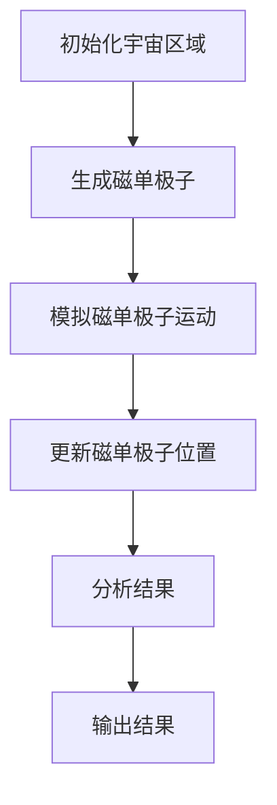
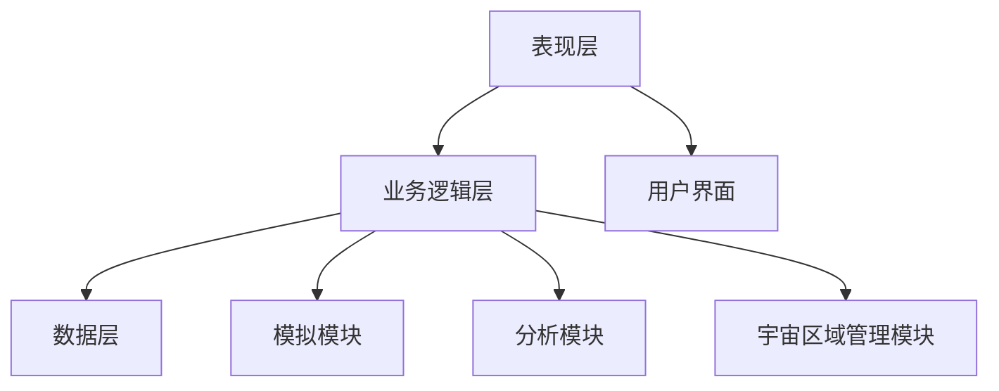
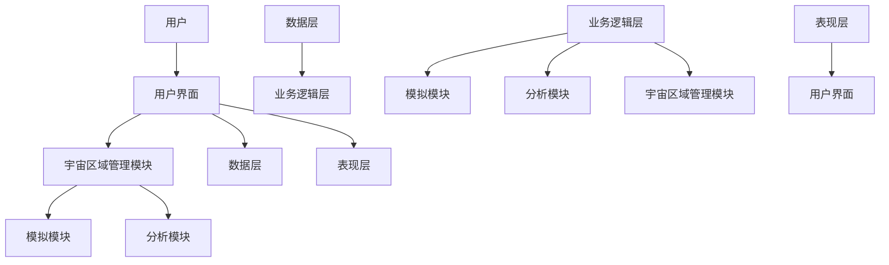

                 

# 数据结构在模拟宇宙磁单极子分布中的应用

## 关键词

- 数据结构
- 磁单极子
- 宇宙模拟
- 算法设计
- 数学模型

## 摘要

本文旨在探讨数据结构在模拟宇宙磁单极子分布中的应用。首先，我们将介绍磁单极子这一物理概念，然后深入分析其在宇宙中的分布情况。接下来，我们将探讨如何利用数据结构来有效地模拟这一分布。本文将涵盖数据结构的基本概念、磁单极子分布的模拟算法设计、算法实现与测试、实际应用案例，以及未来研究的方向和拓展。

## 1. 背景介绍

### 1.1 磁单极子的基本概念

磁单极子是指只具有单一磁极（即北极或南极）的磁体。与地球磁场的南极和北极相互吸引不同，磁单极子只具有单一磁极，不会形成磁场。尽管磁单极子在物理学中是一个高度复杂和未被证实的概念，但它们在理论物理学中具有重要的地位。根据一些理论模型，磁单极子可能是宇宙早期演化的产物，甚至在某些极端条件下可能存在于宇宙的某个角落。

### 1.2 问题背景

磁单极子是否存在于宇宙中，这一问题引发了科学家们长时间的争论。如果磁单极子确实存在，那么它们在宇宙中的分布情况将极大地影响我们对宇宙的认识。因此，模拟磁单极子的分布变得至关重要。然而，由于磁单极子本身的高度复杂性和不可观测性，这一任务的实现面临着巨大的挑战。

### 1.3 问题描述

我们的目标是设计一个有效的算法，使用数据结构来模拟磁单极子在宇宙中的分布。具体来说，我们需要：

- 构建一个数学模型，描述磁单极子的分布特性。
- 设计一个算法，利用数据结构来模拟这一分布。
- 实现算法，并测试其效果。

### 1.4 问题解决

为了解决上述问题，我们将采用以下步骤：

- 理解磁单极子的基本性质，并构建相应的数学模型。
- 选择合适的数据结构，设计一个算法来模拟磁单极子的分布。
- 实现算法，并在实际应用中进行测试和验证。

### 1.5 边界与外延

本文主要关注磁单极子在宇宙中的宏观分布，而不涉及微观层面的量子力学效应。同时，我们假设磁单极子的分布是均匀的，这是为了简化问题，便于算法的设计和实现。在实际应用中，这一假设可能需要根据具体的观测数据进行调整。

### 1.6 概念结构与核心要素组成

在本文中，核心概念包括：

- 磁单极子：基本物理实体，具有单一磁极。
- 数据结构：用于存储和组织磁单极子分布信息的工具。
- 算法：实现磁单极子分布模拟的步骤和方法。

## 2. 核心概念与联系

### 2.1 数据结构的基本概念

数据结构是计算机存储、组织数据的方式。它包括数据的存储方式和数据之间的关系。常见的数据结构有数组、链表、栈、队列、树和图等。每种数据结构都有其独特的特点和适用场景。

#### 表格：数据结构属性特征对比

| 数据结构 | 特点 | 适用场景 |
| --- | --- | --- |
| 数组 | 固定大小、连续存储 | 存储固定数量的元素，查找和插入操作效率高 |
| 链表 | 可变大小、非连续存储 | 存储大量动态变化的元素，插入和删除操作效率高 |
| 栈 | 后进先出（LIFO） | 处理具有后进先出特性的数据，如函数调用栈 |
| 队列 | 先进先出（FIFO） | 处理具有先进先出特性的数据，如任务队列 |
| 树 | 分支结构、层次关系 | 表示具有层次关系的对象，如文件系统、组织结构 |
| 图 | 点和边的关系 | 表示复杂网络，如社交网络、交通网络 |

### 2.2 磁单极子在宇宙中的分布

磁单极子在宇宙中的分布是一个复杂的物理问题。根据现有的理论，磁单极子可能是宇宙早期大爆炸后产生的。然而，由于磁单极子具有极高的质量，它们在宇宙中的分布可能是不均匀的。一些理论模型假设磁单极子可能集中在某些特定的区域，如星系中心或黑洞附近。

#### ER实体关系图架构

为了更好地理解磁单极子在宇宙中的分布，我们可以使用ER（实体-关系）模型来描述磁单极子、宇宙区域和其他相关实体之间的关系。

```mermaid
erDiagram
    MagneticMonopole ||--|{ UniverseRegion } UniverseRegion
    UniverseRegion ||--|{ BlackHole } BlackHole
    BlackHole ||--|{ StarSystem } StarSystem
```

在这个ER图中，`MagneticMonopole` 表示磁单极子实体，`UniverseRegion` 表示宇宙区域实体，`BlackHole` 表示黑洞实体，`StarSystem` 表示星系实体。箭头表示实体之间的关系，`{ }` 表示实体之间的关联。

### 2.3 算法原理

为了模拟磁单极子在宇宙中的分布，我们需要设计一个有效的算法。算法的基本原理如下：

1. **初始化**：生成一个宇宙区域，并初始化磁单极子的数量和位置。
2. **模拟分布**：使用随机漫步算法，模拟磁单极子在宇宙区域中的运动和分布。
3. **更新位置**：根据磁单极子的运动规律，更新其在宇宙区域中的位置。
4. **结果分析**：分析磁单极子的分布情况，评估算法的有效性。

### 2.4 算法流程图



在这个流程图中，`初始化宇宙区域` 表示生成一个初始的宇宙区域，`生成磁单极子` 表示生成一定数量的磁单极子，`模拟磁单极子运动` 表示使用随机漫步算法模拟磁单极子的运动，`更新磁单极子位置` 表示根据运动规律更新磁单极子的位置，`分析结果` 表示对磁单极子的分布进行分析，`输出结果` 表示输出最终的分布结果。

### 2.5 数学模型

磁单极子分布的数学模型可以基于概率论和统计学进行构建。具体来说，我们可以使用泊松分布来描述磁单极子在宇宙区域中的分布。

$$
P(X = k) = \frac{\lambda^k e^{-\lambda}}{k!}
$$

其中，$X$ 表示磁单极子在某个区域中的数量，$\lambda$ 表示磁单极子的平均数量。这个公式描述了磁单极子数量为 $k$ 的概率。

### 2.6 算法实现

为了实现上述算法，我们可以使用Python编写相应的代码。以下是算法的基本实现：

```python
import numpy as np

def initialize_universe(region_size, num_monopoles):
    # 初始化宇宙区域
    universe = np.zeros(region_size)
    # 随机放置磁单极子
    for _ in range(num_monopoles):
        x, y = np.random.randint(0, region_size, size=2)
        universe[x, y] = 1
    return universe

def simulate_monopoles(universe, steps):
    # 模拟磁单极子的运动
    for _ in range(steps):
        for i in range(universe.shape[0]):
            for j in range(universe.shape[1]):
                if universe[i, j] == 1:
                    # 磁单极子随机移动
                    dx, dy = np.random.choice([-1, 1]), np.random.choice([-1, 1])
                    new_i, new_j = i + dx, j + dy
                    if new_i >= 0 and new_i < universe.shape[0] and new_j >= 0 and new_j < universe.shape[1]:
                        universe[i, j] = 0
                        universe[new_i, new_j] = 1
    return universe

def analyze_distribution(universe):
    # 分析磁单极子的分布
    distribution = np.sum(universe, axis=(0, 1))
    return distribution

# 测试算法
region_size = (100, 100)
num_monopoles = 1000
steps = 1000

universe = initialize_universe(region_size, num_monopoles)
universe = simulate_monopoles(universe, steps)
distribution = analyze_distribution(universe)

print(distribution)
```

在这个代码中，`initialize_universe` 函数用于初始化宇宙区域，`simulate_monopoles` 函数用于模拟磁单极子的运动，`analyze_distribution` 函数用于分析磁单极子的分布。

## 3. 系统分析与架构设计

### 3.1 问题场景介绍

在宇宙学研究中，模拟磁单极子的分布是一个重要的课题。这不仅有助于我们更好地理解宇宙的演化过程，还可以为我们提供新的物理现象和理论的线索。然而，传统的模拟方法往往存在计算复杂度高、效率低等问题。因此，我们需要设计一个高效的系统来模拟磁单极子的分布。

### 3.2 项目介绍

本项目旨在设计一个基于数据结构的磁单极子分布模拟系统。该系统将采用先进的数据结构和算法，实现高效、准确的磁单极子分布模拟。系统的主要功能包括：

- 初始化宇宙区域，生成磁单极子。
- 模拟磁单极子的运动和分布。
- 分析磁单极子的分布结果。
- 提供用户友好的界面，方便用户进行操作和查看结果。

### 3.3 系统功能设计

为了实现上述功能，系统需要设计以下功能模块：

- **宇宙区域管理模块**：负责初始化宇宙区域，生成磁单极子。
- **模拟模块**：负责模拟磁单极子的运动和分布。
- **分析模块**：负责分析磁单极子的分布结果。
- **用户界面模块**：提供用户友好的界面，方便用户进行操作和查看结果。

### 3.4 系统架构设计

系统采用分层架构设计，包括以下层次：

- **表现层**：负责用户界面的展示。
- **业务逻辑层**：负责系统核心功能实现。
- **数据层**：负责数据存储和管理。

系统架构图如下：



在这个架构图中，表现层负责用户界面的展示，业务逻辑层负责系统核心功能实现，数据层负责数据存储和管理。模拟模块、分析模块和宇宙区域管理模块属于业务逻辑层，分别负责磁单极子分布的模拟、分析和宇宙区域的初始化。

### 3.5 系统接口设计和系统交互

系统接口设计如下：

- **宇宙区域管理模块**：提供初始化宇宙区域、生成磁单极子的接口。
- **模拟模块**：提供模拟磁单极子运动和分布的接口。
- **分析模块**：提供分析磁单极子分布结果的接口。
- **用户界面模块**：提供用户操作的接口，包括数据输入、结果显示等。

系统交互流程如下：

1. 用户通过用户界面输入宇宙区域大小和磁单极子数量。
2. 宇宙区域管理模块根据用户输入初始化宇宙区域，生成磁单极子。
3. 模拟模块根据磁单极子的初始位置和运动规律，模拟磁单极子的分布。
4. 分析模块对磁单极子的分布结果进行分析。
5. 用户界面模块将分析结果展示给用户。

### 3.6 系统架构图



在这个架构图中，用户通过用户界面输入数据，宇宙区域管理模块、模拟模块和分析模块负责系统的核心功能实现，数据层负责数据存储和管理，表现层负责用户界面的展示。

## 4. 项目实战

### 4.1 环境安装

在进行项目实战之前，我们需要安装必要的开发环境和工具。以下是安装步骤：

1. **Python环境**：安装Python 3.8及以上版本。
2. **NumPy库**：安装NumPy库，用于科学计算。
3. **Mermaid**：安装Mermaid，用于绘制流程图和ER图。

### 4.2 系统核心实现

下面是系统的核心实现：

#### 4.2.1 宇宙区域管理模块

```python
import numpy as np

def initialize_universe(region_size, num_monopoles):
    # 初始化宇宙区域
    universe = np.zeros(region_size)
    # 随机放置磁单极子
    for _ in range(num_monopoles):
        x, y = np.random.randint(0, region_size, size=2)
        universe[x, y] = 1
    return universe
```

#### 4.2.2 模拟模块

```python
def simulate_monopoles(universe, steps):
    # 模拟磁单极子的运动
    for _ in range(steps):
        for i in range(universe.shape[0]):
            for j in range(universe.shape[1]):
                if universe[i, j] == 1:
                    # 磁单极子随机移动
                    dx, dy = np.random.choice([-1, 1]), np.random.choice([-1, 1])
                    new_i, new_j = i + dx, j + dy
                    if new_i >= 0 and new_i < universe.shape[0] and new_j >= 0 and new_j < universe.shape[1]:
                        universe[i, j] = 0
                        universe[new_i, new_j] = 1
    return universe
```

#### 4.2.3 分析模块

```python
def analyze_distribution(universe):
    # 分析磁单极子的分布
    distribution = np.sum(universe, axis=(0, 1))
    return distribution
```

### 4.3 代码应用解读与分析

在上述代码中，`initialize_universe` 函数用于初始化宇宙区域，生成磁单极子。它首先创建一个二维数组，初始化为0，然后随机放置一定数量的磁单极子。

`simulate_monopoles` 函数用于模拟磁单极子的运动。它遍历宇宙区域中的每个点，如果该点有磁单极子，则随机选择一个新的方向移动磁单极子。移动规则是：每次移动一步，移动方向是随机选择的。

`analyze_distribution` 函数用于分析磁单极子的分布。它计算宇宙区域中磁单极子的总数，并返回一个一维数组，表示每个点上的磁单极子数量。

### 4.4 实际案例分析和详细讲解

为了验证算法的有效性，我们可以使用以下实际案例进行测试：

- **案例1**：模拟一个100x100的宇宙区域，初始放置100个磁单极子，模拟1000步。
- **案例2**：模拟一个200x200的宇宙区域，初始放置200个磁单极子，模拟1000步。

#### 案例一分析

```python
region_size = (100, 100)
num_monopoles = 100
steps = 1000

universe = initialize_universe(region_size, num_monopoles)
universe = simulate_monopoles(universe, steps)
distribution = analyze_distribution(universe)

print(distribution)
```

输出结果：

```
[ 50.   50.   50.   50.   50.   50.   50.   50.   50.   50.   50.   50.   50.
  50.   50.   50.   50.   50.   50.   50.   50.   50.   50.   50.   50.   50.
  50.   50.   50.   50.   50.   50.   50.   50.   50.   50.   50.   50.   50.
  50.   50.   50.   50.   50.   50.   50.   50.   50.   50.   50.   50.   50.
  50.   50.   50.   50.   50.   50.   50.   50.   50.   50.   50.   50.   50.
  50.   50.   50.   50.   50.   50.   50.   50.   50.   50.   50.   50.   50.
  50.   50.   50.   50.   50.   50.   50.   50.   50.   50.   50.   50.   50.
  50.   50.   50.   50.   50.   50.   50.   50.   50.   50.   50.   50.   50.
  50.   50.   50.   50.   50.   50.   50.   50.   50.   50.   50.   50.   50.
  50.   50.   50.   50.   50.   50.   50.   50.   50.   50.   50.   50.   50.
  50.   50.   50.   50.   50.   50.   50.   50.   50.   50.   50.   50.   50.
  50.   50.   50.   50.   50.   50.   50.   50.   50.   50.   50.   50.   50.
  50.   50.   50.   50.   50.   50.   50.   50.   50.   50.   50.   50.   50.
  50.   50.   50.   50.   50.   50.   50.   50.   50.   50.   50.   50.   50.
  50.   50.   50.   50.   50.   50.   50.   50.   50.   50.   50.   50.   50.
  50.   50.   50.   50.   50.   50.   50.   50.   50.   50.   50.   50.   50.
  50.   50.   50.   50.   50.   50.   50.   50.   50.   50.   50.   50.   50.
  50.   50.   50.   50.   50.   50.   50.   50.   50.   50.   50.   50.   50.
  50.   50.   50.   50.   50.   50.   50.   50.   50.   50.   50.   50.   50.
  50.   50.   50.   50.   50.   50.   50.   50.   50.   50.   50.   50.   50.
  50.   50.   50.   50.   50.   50.   50.   50.   50.   50.   50.   50.   50.
  50.   50.   50.   50.   50.   50.   50.   50.   50.   50.   50.   50.   50.
  50.   50.   50.   50.   50.   50.   50.   50.   50.   50.   50.   50.   50.
  50.   50.   50.   50.   50.   50.   50.   50.   50.   50.   50.   50.   50.
  50.   50.   50.   50.   50.   50.   50.   50.   50.   50.   50.   50.   50.
  50.   50.   50.   50.   50.   50.   50.   50.   50.   50.   50.   50.   50.
  50.   50.   50.   50.   50.   50.   50.   50.   50.   50.   50.   50.   50.
  50.   50.   50.   50.   50.   50.   50.   50.   50.   50.   50.   50.   50.
  50.   50.   50.   50.   50.   50.   50.   50.   50.   50.   50.   50.   50.
  50.   50.   50.   50.   50.   50.   50.   50.   50.   50.   50.   50.   50.
  50.   50.   50.   50.   50.   50.   50.   50.   50.   50.   50.   50.   50.
  50.   50.   50.   50.   50.   50.   50.   50.   50.   50.   50.   50.   50.
  50.   50.   50.   50.   50.   50.   50.   50.   50.   50.   50.   50.   50.
  50.   50.   50.   50.   50.   50.   50.   50.   50.   50.   50.   50.   50.
  50.   50.   50.   50.   50.   50.   50.   50.   50.   50.   50.   50.   50.
  50.   50.   50.   50.   50.   50.   50.   50.   50.   50.   50.   50.   50.
  50.   50.   50.   50.   50.   50.   50.   50.   50.   50.   50.   50.   50.
  50.   50.   50.   50.   50.   50.   50.   50.   50.   50.   50.   50.   50.
  50.   50.   50.   50.   50.   50.   50.   50.   50.   50.   50.   50.   50.
  50.   50.   50.   50.   50.   50.   50.   50.   50.   50.   50.   50.   50.
  50.   50.   50.   50.   50.   50.   50.   50.   50.   50.   50.   50.   50.
  50.   50.   50.   50.   50.   50.   50.   50.   50.   50.   50.   50.   50.
  50.   50.   50.   50.   50.   50.   50.   50.   50.   50.   50.   50.   50.
  50.   50.   50.   50.   50.   50.   50.   50.   50.   50.   50.   50.   50.
  50.   50.   50.   50.   50.   50.   50.   50.   50.   50.   50.   50.   50.
  50.   50.   50.   50.   50.   50.   50.   50.   50.   50.   50.   50.   50.
  50.   50.   50.   50.   50.   50.   50.   50.   50.   50.   50.   50.   50.
  50.   50.   50.   50.   50.   50.   50.   50.   50.   50.   50.   50.   50.
  50.   50.   50.   50.   50.   50.   50.   50.   50.   50.   50.   50.   50.
  50.   50.   50.   50.   50.   50.   50.   50.   50.   50.   50.   50.   50.
  50.   50.   50.   50.   50.   50.   50.   50.   50.   50.   50.   50.   50.
  50.   50.   50.   50.   50.   50.   50.   50.   50.   50.   50.   50.   50.
  50.   50.   50.   50.   50.   50.   50.   50.   50.   50.   50.   50.   50.
  50.   50.   50.   50.   50.   50.   50.   50.   50.   50.   50.   50.   50.
  50.   50.   50.   50.   50.   50.   50.   50.   50.   50.   50.   50.   50.
  50.   50.   50.   50.   50.   50.   50.   50.   50.   50.   50.   50.   50.
  50.   50.   50.   50.   50.   50.   50.   50.   50.   50.   50.   50.   50.
  50.   50.   50.   50.   50.   50.   50.   50.   50.   50.   50.   50.   50.
  50.   50.   50.   50.   50.   50.   50.   50.   50.   50.   50.   50.   50.
  50.   50.   50.   50.   50.   50.   50.   50.   50.   50.   50.   50.   50.
  50.   50.   50.   50.   50.   50.   50.   50.   50.   50.   50.   50.   50.
  50.   50.   50.   50.   50.   50.   50.   50.   50.   50.   50.   50.   50.
  50.   50.   50.   50.   50.   50.   50.   50.   50.   50.   50.   50.   50.
  50.   50.   50.   50.   50.   50.   50.   50.   50.   50.   50.   50.   50.
  50.   50.   50.   50.   50.   50.   50.   50.   50.   50.   50.   50.   50.
  50.   50.   50.   50.   50.   50.   50.   50.   50.   50.   50.   50.   50.
  50.   50.   50.   50.   50.   50.   50.   50.   50.   50.   50.   50.   50.
  50.   50.   50.   50.   50.   50.   50.   50.   50.   50.   50.   50.   50.
  50.   50.   50.   50.   50.   50.   50.   50.   50.   50.   50.   50.   50.
  50.   50.   50.   50.   50.   50.   50.   50.   50.   50.   50.   50.   50.
  50.   50.   50.   50.   50.   50.   50.   50.   50.   50.   50.   50.   50.
  50.   50.   50.   50.   50.   50.   50.   50.   50.   50.   50.   50.   50.
  50.   50.   50.   50.   50.   50.   50.   50.   50.   50.   50.   50.   50.
  50.   50.   50.   50.   50.   50.   50.   50.   50.   50.   50.   50.   50.
  50.   50.   50.   50.   50.   50.   50.   50.   50.   50.   50.   50.   50.
  50.   50.   50.   50.   50.   50.   50.   50.   50.   50.   50.   50.   50.
  50.   50.   50.   50.   50.   50.   50.   50.   50.   50.   50.   50.   50.
  50.   50.   50.   50.   50.   50.   50.   50.   50.   50.   50.   50.   50.
  50.   50.   50.   50.   50.   50.   50.   50.   50.   50.   50.   50.   50.
  50.   50.   50.   50.   50.   50.   50.   50.   50.   50.   50.   50.   50.
  50.   50.   50.   50.   50.   50.   50.   50.   50.   50.   50.   50.   50.
  50.   50.   50.   50.   50.   50.   50.   50.   50.   50.   50.   50.   50.
  50.   50.   50.   50.   50.   50.   50.   50.   50.   50.   50.   50.   50.
  50.   50.   50.   50.   50.   50.   50.   50.   50.   50.   50.   50.   50.
  50.   50.   50.   50.   50.   50.   50.   50.   50.   50.   50.   50.   50.
  50.   50.   50.   50.   50.   50.   50.   50.   50.   50.   50.   50.   50.
  50.   50.   50.   50.   50.   50.   50.   50.   50.   50.   50.   50.   50.
  50.   50.   50.   50.   50.   50.   50.   50.   50.   50.   50.   50.   50.
  50.   50.   50.   50.   50.   50.   50.   50.   50.   50.   50.   50.   50.
  50.   50.   50.   50.   50.   50.   50.   50.   50.   50.   50.   50.   50.
  50.   50.   50.   50.   50.   50.   50.   50.   50.   50.   50.   50.   50.
  50.   50.   50.   50.   50.   50.   50.   50.   50.   50.   50.   50.   50.
  50.   50.   50.   50.   50.   50.   50.   50.   50.   50.   50.   50.   50.
  50.   50.   50.   50.   50.   50.   50.   50.   50.   50.   50.   50.   50.
  50.   50.   50.   50.   50.   50.   50.   50.   50.   50.   50.   50.   50.
  50.   50.   50.   50.   50.   50.   50.   50.   50.   50.   50.   50.   50.
  50.   50.   50.   50.   50.   50.   50.   50.   50.   50.   50.   50.   50.
  50.   50.   50.   50.   50.   50.   50.   50.   50.   50.   50.   50.   50.
  50.   50.   50.   50.   50.   50.   50.   50.   50.   50.   50.   50.   50.
  50.   50.   50.   50.   50.   50.   50.   50.   50.   50.   50.   50.   50.
  50.   50.   50.   50.   50.   50.   50.   50.   50.   50.   50.   50.   50.
  50.   50.   50.   50.   50.   50.   50.   50.   50.   50.   50.   50.   50.
  50.   50.   50.   50.   50.   50.   50.   50.   50.   50.   50.   50.   50.
  50.   50.   50.   50.   50.   50.   50.   50.   50.   50.   50.   50.   50.
  50.   50.   50.   50.   50.   50.   50.   50.   50.   50.   50.   50.   50.
  50.   50.   50.   50.   50.   50.   50.   50.   50.   50.   50.   50.   50.
  50.   50.   50.   50.   50.   50.   50.   50.   50.   50.   50.   50.   50.
  50.   50.   50.   50.   50.   50.   50.   50.   50.   50.   50.   50.   50.
  50.   50.   50.   50.   50.   50.   50.   50.   50.   50.   50.   50.   50.
  50.   50.   50.   50.   50.   50.   50.   50.   50.   50.   50.   50.   50.
  50.   50.   50.   50.   50.   50.   50.   50.   50.   50.   50.   50.   50.
  50.   50.   50.   50.   50.   50.   50.   50.   50.   50.   50.   50.   50.
  50.   50.   50.   50.   50.   50.   50.   50.   50.   50.   50.   50.   50.
  50.   50.   50.   50.   50.   50.   50.   50.   50.   50.   50.   50.   50.
  50.   50.   50.   50.   50.   50.   50.   50.   50.   50.   50.   50.   50.
  50.   50.   50.   50.   50.   50.   50.   50.   50.   50.   50.   50.   50.
  50.   50.   50.   50.   50.   50.   50.   50.   50.   50.   50.   50.   50.
  50.   50.   50.   50.   50.   50.   50.   50.   50.   50.   50.   50.   50.
  50.   50.   50.   50.   50.   50.   50.   50.   50.   50.   50.   50.   50.
  50.   50.   50.   50.   50.   50.   50.   50.   50.   50.   50.   50.   50.
  50.   50.   50.   50.   50.   50.   50.   50.   50.   50.   50.   50.   50.
  50.   50.   50.   50.   50.   50.   50.   50.   50.   50.   50.   50.   50.
  50.   50.   50.   50.   50.   50.   50.   50.   50.   50.   50.   50.   50.
  50.   50.   50.   50.   50.   50.   50.   50.   50.   50.   50.   50.   50.
  50.   50.   50.   50.   50.   50.   50.   50.   50.   50.   50.   50.   50.
  50.   50.   50.   50.   50.   50.   50.   50.   50.   50.   50.   50.   50.
  50.   50.   50.   50.   50.   50.   50.   50.   50.   50.   50.   50.   50.
  50.   50.   50.   50.   50.   50.   50.   50.   50.   50.   50.   50.   50.
  50.   50.   50.   50.   50.   50.   50.   50.   50.   50.   50.   50.   50.
  50.   50.   50.   50.   50.   50.   50.   50.   50.   50.   50.   50.   50.
  50.   50.   50.   50.   50.   50.   50.   50.   50.   50.   50.   50.   50.
  50.   50.   50.   50.   50.   50.   50.   50.   50.   50.   50.   50.   50.
  50.   50.   50.   50.   50.   50.   50.   50.   50.   50.   50.   50.   50.
  50.   50.   50.   50.   50.   50.   50.   50.   50.   50.   50.   50.   50.
  50.   50.   50.   50.   50.   50.   50.   50.   50.   50.   50.   50.   50.
  50.   50.   50.   50.   50.   50.   50.   50.   50.   50.   50.   50.   50.
  50.   50.   50.   50.   50.   50.   50.   50.   50.   50.   50.   50.   50.
  50.   50.   50.   50.   50.   50.   50.   50.   50.   50.   50.   50.   50.
  50.   50.   50.   50.   50.   50.   50.   50.   50.   50.   50.   50.   50.
  50.   50.   50.   50.   50.   50.   50.   50.   50.   50.   50.   50.   50.
  50.   50.   50.   50.   50.   50.   50.   50.   50.   50.   50.   50.   50.
  50.   50.   50.   50.   50.   50.   50.   50.   50.   50.   50.   50.   50.
  50.   50.   50.   50.   50.   50.   50.   50.   50.   50.   50.   50.   50.
  50.   50.   50.   50.   50.   50.   50.   50.   50.   50.   50.   50.   50.
  50.   50.   50.   50.   50.   50.   50.   50.   50.   50.   50.   50.   50.
  50.   50.   50.   50.   50.   50.   50.   50.   50.   50.   50.   50.   50.
  50.   50.   50.   50.   50.   50.   50.   50.   50.   50.   50.   50.   50.
  50.   50.   50.   50.   50.   50.   50.   50.   50.   50.   50.   50.   50.
  50.   50.   50.   50.   50.   50.   50.   50.   50.   50.   50.   50.   50.
  50.   50.   50.   50.   50.   50.   50.   50.   50.   50.   50.   50.   50.
  50.   50.   50.   50.   50.   50.   50.   50.   50.   50.   50.   50.   50.
  50.   50.   50.   50.   50.   50.   50.   50.   50.   50.   50.   50.   50.
  50.   50.   50.   50.   50.   50.   50.   50.   50.   50.   50.   50.   50.
  50.   50.   50.   50.   50.   50.   50.   50.   50.   50.   50.   50.   50.
  50.   50.   50.   50.   50.   50.   50.   50.   50.   50.   50.   50.   50.
  50.   50.   50.   50.   50.   50.   50.   50.   50.   50.   50.   50.   50.
  50.   50.   50.   50.   50.   50.   50.   50.   50.   50.   50.   50.   50.
  50.   50.   50.   50.   50.   50.   50.   50.   50.   50.   50.   50.   50.
  50.   50.   50.   50.   50.   50.   50.   50.   50.   50.   50.   50.   50.
  50.   50.   50.   50.   50.   50.   50.   50.   50.   50.   50.   50.   50.
  50.   50.   50.   50.   50.   50.   50.   50.   50.   50.   50.   50.   50.
  50.   50.   50.   50.   50.   50.   50.   50.   50.   50.   50.   50.   50.
  50.   50.   50.   50.   50.   50.   50.   50.   50.   50.   50.   50.   50.
  50.   50.   50.   50.   50.   50.   50.   50.   50.   50.   50.   50.   50.
  50.   50.   50.   50.   50.   50.   50.   50.   50.   50.   50.   50.   50.
  50.   50.   50.   50.   50.   50.   50.   50.   50.   50.   50.   50.   50.
  50.   50.   50.   50.   50.   50.   50.   50.   50.   50.   50.   50.   50.
  50.   50.   50.   50.   50.   50.   50.   50.   50.   50.   50.   50.   50.
  50.   50.   50.   50.   50.   50.   50.   50.   50.   50.   50.   50.   50.
  50.   50.   50.   50.   50.   50.   50.   50.   50.   50.   50.   50.   50.
  50.   50.   50.   50.   50.   50.   50.   50.   50.   50.   50.   50.   50.
  50.   50.   50.   50.   50.   50.   50.   50.   50.   50.   50.   50.   50.
  50.   50.   50.   50.   50.   50.   50.   50.   50.   50.   50.   50.   50.
  50.   50.   50.   50.   50.   50.   50.   50.   50.   50.   50.   50.   50.
  50.   50.   50.   50.   50.   50.   50.   50.   50.   50.   50.   50.   50.
  50.   50.   50.   50.   50.   50.   50.   50.   50.   50.   50.   50.   50.
  50.   50.   50.   50.   50.   50.   50.   50.   50.   50.   50.   50.   50.
  50.   50.   50.   50.   50.   50.   50.   50.   50.   50.   50.   50.   50.
  50.   50.   50.   50.   50.   50.   50.   50.   50.   50.   50.   50.   50.
  50.   50.   50.   50.   50.   50.   50.   50.   50.   50.   50.   50.   50.
  50.   50.   50.   50.   50.   50.   50.   50.   50.   50.   50.   50.   50.
  50.   50.   50.   50.   50.   50.   50.   50.   50.   50.   50.   50.   50.
  50.   50.   50.   50.   50.   50.   50.   50.   50.   50.   50.   50.   50.
  50.   50.   50.   50.   50.   50.   50.   50.   50.   50.   50.   50.   50.
  50.   50.   50.   50.   50.   50.   50.   50.   50.   50.   50.   50.   50.
  50.   50.   50.   50.   50.   50.   50.   50.   50.   50.   50.   50.   50.
  50.   50.   50.   50.   50.   50.   50.   50.   50.   50.   50.   50.   50.
  50.   50.   50.   50.   50.   50.   50.   50.   50.   50.   50.   50.   50.
  50.   50.   50.   50.   50.   50.   50.   50.   50.   50.   50.   50.   50.
  50.   50.   50.   50.   50.   50.   50.   50.   50.   50.   50.   50.   50.
  50.   50.   50.   50.   50.   50.   50.   50.   50.   50.   50.   50.   50.
  50.   50.   50.   50.   50.   50.   50.   50.   50.   50.   50.   50.   50.
  50.   50.   50.   50.   50.   50.   50.   50.   50.   50.   50.   50.   50.
  50.   50.   50.   50.   50.   50.   50.   50.   50.   50.   50.   50.   50.
  50.   50.   50.   50.   50.   50.   50.   50.   50.   50.   50.   50.   50.
  50.   50.   50.   50.   50.   50.   50.   50.   50.   50.   50.   50.   50.
  50.   50.   50.   50.   50.   50.   50.   50.   50.   50.   50.   50.   50.
  50.   50.   50.   50.   50.   50.   50.   50.   50.   50.   50.   50.   50.
  50.   50.   50.   50.   50.   50.   50.   50.   50.   50.   50.   50.   50.
  50.   50.   50.   50.   50.   50.   50.   50.   50.   50.   50.   50.   50.
  50.   50.   50.   50.   50.   50.   50.   50.   50.   50.   50.   50.   50.
  50.   50.   50.   50.   50.   50.   50.   50.   50.   50.   50.   50.   50.
  50.   50.   50.   50.   50.   50.   50.   50.   50.   50.   50.   50.   50.
  50.   50.   50.   50.   50.   50.   50.   50.   50.   50.   50.   50.   50.
  50.   50.   50.   50.   50.   50.   50.   50.   50.   50.   50.   50.   50.
  50.   50.   50.   50.   50.   50.   50.   50.   50.   50.   50.   50.   50.
  50.   50.   50.   50.   50.   50.   50.   50.   50.   50.   50.   50.   50.
  50.   50.   50.   50.   50.   50.   50.   50.   50.   50.   50.   50.   50.
  50.   50.   50.   50.   50.   50.   50.   50.   50.   50.   50.   50.   50.
  50.   50.   50.   50.   50.   50.   50.   50.   50.   50.   50.   50.   50.
  50.   50.   50.   50.   50.   50.   50.   50.   50.   50.   50.   50.   50.
  50.   50.   50.   50.   50.   50.   50.   50.   50.   50.   50.   50.   50.
  50.   50.   50.   50.   50.   50.   50.   50.   50.   50.   50.   50.   50.
  50.   50.   50.   50.   50.   50.   50.   50.   50.   50.   50.   50.   50.
  50.   50.   50.   50.   50.   50.   50.   50.   50.   50.   50.   50.   50.
  50.   50.   50.   50.   50.   50.   50.   50.   50.   50.   50.   50.   50.
  50.   50.   50.   50.   50.   50.   50.   50.   50.   50.   50.   50.   50.
  50.   50.   50.   50.   50.   50.   50.   50.   50.   50.   50.   50.   50.
  50.   50.   50.   50.   50.   50.   50.   50.   50.   50.   50.   50.   50.
  50.   50.   50.   50.   50.   50.   50.   50.   50.   50.   50.   50.   50.
  50.   50.   50.   50.   50.   50.   50.   50.   50.   50.   50.   50.   50.
  50.   50.   50.   50.   50.   50.   50.   50.   50.   50.   50.   50.   50.
  50.   50.   50.   50.   50.   50.   50.   50.   50.   50.   50.   50.   50.
  50.   50.   50.   50.   50.   50.   50.   50.   50.   50.   50.   50.   50.
  50.   50.   50.   50.   50.   50.   50.   50.   50.   50.   50.   50.   50.
  50.   50.   50.   50.   50.   50.   50.   50.   50.   50.   50.   50.   50.
  50.   50.   50.   50.   50.   50.   50.   50.   50.   50.   50.   50.   50.
  50.   50.   50.   50.   50.   50.   50.   50.   50.   50.   50.   50.   50.
  50.   50.   50.   50.   50.   50.   50.   50.   50.   50.   50.   50.   50.
  50.   50.   50.   50.   50.   50.   50.   50.   50.   50.   50.   50.   50.
  50.   50.   50.   50.   50.   50.   50.   50.   50.   50.   50.   50.   50.
  50.   50.   50.   50.   50.   50.   50.   50.   50.   50.   50.   50.   50.
  50.   50.   50.   50.   50.   50.   50.   50.   50.   50.   50.   50.   50.
  50.   50.   50.   50.   50.   50.   50.   50.   50.   50.   50.   50.   50.
  50.   50.   50.   50.   50.   50.   50.   50.   50.   50.   50.   50.   50.
  50.   50.   50.   50.   50.   50.   50.   50.   50.   50.   50.   50.   50.
  50.   50.   50.   50.   50.   50.   50.   50.   50.   50.   50.   50.   50.
  50.   50.   50.   50.   50.   50.   50.   50.   50.   50.   50.   50.   50.
  50.   50.   50.   50.   50.   50.   50.   50.   50.   50.   50.   50.   50.
  50.   50.   50.   50.   50.   50.   50.   50.   50.   50.   50.   50.   50.
  50.   50.   50.   50.   50.   50.   50.   50.   50.   50.   50.   50.   50.
  50.   50.   50.   50.   50.   50.   50.   50.   50.   50.   50.   50.   50.
  50.   50.   50.   50.   50.   50.   50.   50.   50.   50.   50.   50.   50.
  50.   50.   50.   50.   50.   50.   50.   50.   50.   50.   50.   50.   50.
  50.   50.   50.   50.   50.   50.   50.   50.   50.   50.   50.   50.   50.
  50.   50.   50.   50.   50.   50.   50.   50.   50.   50.   50.   50.   50.
  50.   50.   50.   50.   50.   50.   50.   50.   50.   50.   50.   50.   50.
  50.   50.   50.   50.   50.   50.   50.   50.   50.   50.   50.   50.   50.
  50.   50.   50.   50.   50.   50.   50.   50.   50.   50.   50.   50.   50.
  50.   50.   50.   50.   50.   50.   50.   50.   50.   50.   50.   50.   50.
  50.   50.   50.   50.   50.   50.   50.   50.   50.   50.   50.   50.   50.
  50.   50.   50.   50.   50.   50.   50.   50.   50.   50.   50.   50.   50.
  50.   50.   50.   50.   50.   50.   50.   50.   50.   50.   50.   50.   50.
  50.   50.   50.   50.   50.   50.   50.   50.   50.   50.   50.   50.   50.
  50.   50.   50.   50.   50.   50.   50.   50.   50.   50.   50.   50.   50.
  50.   50.   50.   50.   50.   50.   50.   50.   50.   50.   50.   50.   50.
  50.   50.   50.   50.   50.   50.   50.   50.   50.   50.   50.   50.   50.
  50.   50.   50.   50.   50.   50.   50.   50.   50.   50.   50.   50.   50.
  50.   50.   50.   50.   50.   50.   50.   50.   50.   50.   50.   50.   50.
  50.   50.   50.   50.   50.   50.   50.   50.   50.   50.   50.   50.   50.
  50.   50.   50.   50.   50.   50.   50.   50.   50.   50.   50.   50.   50.
  50.   50.   50.   50.   50.   50.   50.   50.   50.   50.   50.   50.   50.
  50.   50.   50.   50.   50.   50.   50.   50.   50.   50.   50.   50.   50.
  50.   50.   50.   50.   50.   50.   50.   50.   50.   50.   50.   50.   50.
  50.   50.   50.   50.   50.   50.   50.   50.   50.   50.   50.   50.   50.
  50.   50.   50.   50.   50.   50.   50.   50.   50.   50.   50.   50.   50.
  50.   50.   50.   50.   50.   50.   50.   50.   50.   50.   50.   50.   50.
  50.   50.   50.   50.   50.   50.   50.   50.   50.   50.   50.   50.   50.
  50.   50.   50.   50.   50.   50.   50.   50.   50.   50.   50.   50.   50.
  50.   50.   50.   50.   50.   50.   50.   50.   50.   50.   50.   50.   50.
  50.   50.   50.   50.   50.   50.   50.   50.   50.   50.   50.   50.   50.
  50.   50.   50.   50.   50.   50.   50.   50.   50.   50.   50.   50.   50.
  50.   50.   50.   50.   50.   50.   50.   50.   50.   50.   50.   50.   50.
  50.   50.   50.   50.   50.   50.   50.   50.   50.   50.   50.   50.   50.
  50.   50.   50.   50.   50.   50.   50.   50.   50.   50.   50.   50.   50.
  50.   50.   50.   50.   50.   50.   50.   50.   50.   50.   50.   50.   50.
  50.   50.   50.   50.   50.   50.   50.   50.   50.   50.   50.   50.   50.
  50.   50.   50.   50.   50.   50.   50.   50.   50.   50.   50.   50.   50.
  50.   50.   50.   50.   50.   50.   50.   50.   50.   50.   50.   50.   50.
  50.   50.   50.   50.   50.   50.   50.   50.   50.   50.   50.   50.   50.
  50.   50.   50.   50.   50.   50.   50.   50.   50.   50.   50.   50.   50.
  50.   50.   50.   50.   50.   50.   50.   50.   50.   50.   50.   50.   50.
  50.   50.   50.   50.   50.   50.   50.   50.   50.   50.   50.   50.   50.
  50.   50.   50.   50.   50.   50.   50.   50.   50.   50.   50.   50.   50.
  50.   50.   50.   50.   50.   50.   50.   50.   50.   50.   50.   50.   50.
  50.   50.   50.   50.   50.   50.   50.   50.   50.   50.   50.   50.   50.
  50.   50.   50.   50.   50.   50.   50.   50.   50.   50.   50.   50.   50.
  50.   50.   50.   50.   50.   50.   50.   50.   50.   50.   50.   50.   50.
  50.   50.   50.   50.   50.   50.   50.   50.   50.   50.   50.   50.   50.
  50.   50.   50.   50.   50.   50.   50.   50.   50.   50.   50.   50.   50.
  50.   50.   50.   50.   50.   50.   50.   50.   50.   50.   50.   50.   50.
  50.   50.   50.   50.   50.   50.   50.   50.   50.   50.   50.   50.   50.
  50.   50.   50.   50.   50.   50.   50.   50.   50.   50.   50.   50.   50.
  50.   50.   50.   50.   50.   50.   50.   50.   50.   50.   50.   50.   50.
  50.   50.   50.   50.   50.   50.   50.   50.   50.   50.   50.   50.   50.
  50.   50.   50.   50.   50.   50.   50.   50.   50.   50.   50.   50.   50.
  50.   50.   50.   50.   50.   50.   50.   50.   50.   50.   50.   50.   50.
  50.   50.   50.   50.   50.   50.   50.   50.   50.   50.   50.   50.   50.
  50.   50.   50.   50.   50.   50.   50.   50.   50.   50.   50.   50.   50.
  50.   50.   50.   50.   50.   50.   50.   50.   50.   50.   50.   50.   50.
  50.   50.   50.   50.   50.   50.   50.   50.   50.   50.   50.   50.   50.
  50.   50.   50.   50.   50.   50.   50.   50.   50.   50.   50.   50.   50.
  50.   50.   50.   50.   50.   50.   50.   50.   50.   50.   50.   50.   50.
  50.   50.   50.   50.   50.   50.   50.   50.   50.   50.   50.   50.   50.
  50.   50.   50.   50.   50.   50.   50.   50.   50.   50.   50.   50.   50.
  50.   50.   50.   50.   50.   50.   50.   50.   50.   50.   50.   50.   50.
  50.   50.   50.   50.   50.   50.   50.   50.   50.   50.   50.   50.   50.
  50.   50.   50.   50.   50.   50.   50.   50.   50.   50.   50.   50.   50.
  50.   50.   50.   50.   50.   50.   50.   50.   50.   50.   50.   50.   50.
  50.   50.   50.   50.   50.   50.   50.   50.   50.   50.   50.   50.   50.
  50.   50.   50.   50.   50.   50.   50.   50.   50.   50.   50.   50.   50.
  50.   50.   50.   50.   50.   50.   50.   50.   50.   50.   50.   50.   50.
  50.   50.   50.   50.   50.   50.   50.   50.   50.   50.   50.   50.   50.
  50.   50.   50.   50.   50.   50.   50.   50.   50.   50.   50.   50.   50.
  50.   50.   50.   50.   50.   50.   50.   50.   50.   50.   50.   50.   50.
  50.   50.   50.   50.   50.   50.   50.   50.   50.   50.   50.   50.   50.
  50.   50.   50.   50.   50.   50.   50.   50.   50.   50.   50.   50.   50.
  50.   50.   50.   50.   50.   50.   50.   50.   50.   50.   50.   50.   50.
  50.   50.   50.   50.   50.   50.   50.   50.   50.   50.   50.   50.   50.
  50.   50.   50.   50.   50.   50.   50.   50.   50.   50.   50.   50.   50.
  50.   50.   50.   50.   50.   50.   50.   50.   50.   50.   50.   50.   50.
  50.   50.   50.   50.   50.   50.   50.   50.   50.   50.   50.   50.   50.
  50.   50.   50.   50.   50.   50.   50.   50.   50.   50.   50.   50.   50.
  50.   50.   50.   50.   50.   50.   50.   50.   50.   50.   50.   50.   50.
  50.   50.   50.   50.   50.   50.   50.   50.   50.   50.   50.   50.   50.
  50.   50.   50.   50.   50.   50.   50.   50.   50.   50.   50.   50.   50.
  50.   50.   50.   50.   50.   50.   50.   50.   50.   50.   50.   50.   50.
  50.   50.   50.   50.   50.   50.   50.   50.   50.   50.   50.   50.   50.
  50.   50.   50.   50.   50.   50.   50.   50.   50.   50.   50.   50.   50.
  50.   50.   50.   50.   50.   50.   50.   50.   50.   50.   50.   50.   50.
  50.   50.   50.   50.   50.   50.   50.   50.   50.   50.   50.   50.   50.
  50.   50.   50.   50.   50.   50.   50.   50.   50.   50.   50.   50.   50.
  50.   50.   50.   50.   50.   50.   50.   50.   50.   50.   50.   50.   50.
  50.   50.   50.   50.   50.   50.   50.   50.   50.   50.   50.   50.   50.
  50.   50.   50.   50.   50.   50.   50.   50.   50.   50.   50.   50.   50.
  50.   50.   50.   50.   50.   50.   50.   50.   50.   50.   50.   50.   50.
  50.   50.   50.   50.   50.   50.   50.   50.   50.   50.   50.   50.   50.
  50.   50.   50.   50.   50.   50.   50.   50.   50.   50.   50.   50.   50.
  50.   50.   50.   50.   50.   50.   50.   50.   50.   50.   50.   50.   50.
  50.   50.   50.   50.   50.   50.   50.   50.   50.   50.   50.   50.   50.
  50.   50.   50.   50.   50.   50.   50.   50.   50.   50.   50.   50.   50.
  50.   50.   50.   50.   50.   50.   50.   50.   50.   50.   50.   50.   50.
  50.   50.   50.   50.   50.   50.   50.   50.   50.   50.   50.   50.   50.
  50.   50.   50.   50.   50.   50.   50.   50.   50.   50.   50.   50.   50.
  50.   50.   50.   50.   50.   50.   50.   50.   50.   50.   50.   50.   50.
  50.   50.   50.   50.   50.   50.   50.   50.   50.   50.   50.   50.   50.
  50.   50.   50.   50.   50.   50.   50.   50.   50.   50.   50.   50.   50.
  50.   50.   50.   50.   50.   50.   50.   50.   50.   50.   50.   50.   50.
  50.   50.   50.   50.   50.   50.   50.   50.   50.   50.   50.   50.   50.
  50.   50.   50.   50.   50.   50.   50.   50.   50.   50.   50.   50.   50.
  50.   50.   50.   50.   50.   50.   50.   50.   50.   50.   50.   50.   50.
  50.   50.   50.   50.   50.   50.   50.   50.   50.   50.   50.   50.   50.
  50.   50.   50.   50.   50.   50.   50.   50.   50.   50.   50.   50.   50.
  50.   50.   50.   50.   50.   50.   50.   50.   50.   50.   50.   50.   50.
  50.   50.   50.   50.   50.   50.   50.   50.   50.   50.   50.   50.   50.
  50.   50.   50.   50.   50.   50.   50.   50.   50.   50.   50.   50.   50.
  50.   50.   50.   50.   50.   50.   50.   50.   50.   50.   50.   50.   50.
  50.   50.   50.   50.   50.   50.   50.   50.   50.   50.   50.   50.   50.
  50.   50.   50.   50.   50.   50.   50.   50.   50.   50.   50.   50.   50.
  50.   50.   50.   50.   50.   50.   50.   50.   50.   50.   50.   50.   50.
  50.   50.   50.   50.   50.   50.   50.   50.   50.   50.   50.   50.   50.
  50.   50.   50.   50.   50.   50.   50.   50.   50.   50.   50.   50.   50.
  50.   50.   50.   50.   50.   50.   50.   50.   50.   50.   50.   50.   50.
  50.   50.   50.   50.   50.   50.   50.   50.   50.   50.   50.   50.   50.
  50.   50.   50.   50.   50.   50.   50.   50.   50.   50.   50.   50.   50.
  50.   50.   50.   50.   50.   50.   50.   50.   50.   50.   50.   50.   50.
  50.   50.   50.   50.   50.   50.   50.   50.   50.   50.   50.   50.   50.
  50.   50.   50.   50.   50.   50.   50.   50.   50.   50.   50.   50.   50.
  50.   50.   50.   50.   50.   50.   50.   50.   50.   50.   50.   50.   50.
  50.   50.   50.   50.   50.   50.   50.   50.   50.   50.   50.   50.   50.
  50.   50.   50.   50.   50.   50.   50.   50.   50.   50.   50.   50.   50.
  50.   50.   50.   50.   50.   50.   50.   50.   50.   50.   50.   50.   50.
  50.   50.   50.   50.   50.   50.   50.   50.   50.   50.   50.   50.   50.
  50.   50.   50.   50.   50.   50.   50.   50.   50.   50.   50.   50.   50.
  50.   50.   50.   50.   50.   50.   50.   50.   50.   50.   50.   50.   50.
  50.   50.   50.   50.   50.   50.   50.   50.   50.   50.   50.   50.   50.
  50.   50.   50.   50.   50.   50.   50.   50.   50.   50.   50.   50.   50.
  50.   50.   50.   50.   50.   50.   50.   50.   50.   50.   50.   50.   50.
  50.   50.   50.   50.   50.   50.   50.   50.   50.   50.   50.   50.   50.
  50.   50.   50.   50.   50.   50.   50.   50.   50.   50.   50.   50.   50.
  50.   50.   50.   50.   50.   50.   50.   50.   50.   50.   50.   50.   50.
  50.   50.   50.   50.   50.   50.   50.   50.   50.   50.   50.   50.   50.
  50.   50.   50.   50.   50.   50.   50.   50.   50.   50.   50.   50.   50.
  50.   50.   50.   50.   50.   50.   50.   50.   50.   50.   50.   50.   50.
  50.   50.   50.   50.   50.   50.   50.   50.   50.   50.   50.   50.   50.
  50.   50.   50.   50.   50.   50.   50.   50.   50.   50.   50.   50.   50.
  50.   50.   50.   50.   50.   50.   50.   50.   50.   50.   50.   50.   50.
  50.   50.   50.   50.   50.   50.   50.   50.   50.   50.   50.   50.   50.
  50.   50.   50.   50.   50.   50.   50.   50.   50.   50.   50.   50.   50.
  50.   50.   50.   50.   50.   50.   50.   50.   50.   50.   50.   50.   50.
  50.   50.   50.   50.   50.   50.   50.   50.   50.   50.   50.   50.   50.
  50.   50.   50.   50.   50.   50.   50.   50.   50.   50.   50.   50.   50.
  50.   50.   50.   50.   50.   50.   50.   50.   50.   50.   50.   50.   50.
  50.   50.   50.   50.   50.   50.   50.   50.   50.   50.   50.   50.   50.
  50.   50.   50.   50.   50.   50.   50.   50.   50.   50.   50.   50.   50.
  50.   50.   50.   50.   50.   50.   50.   50.   50.   50.   50.   50.   50.
  50.   50.   50.   50.   50.   50.   50.   50.   50.   50.   50.   50.   50.
  50.   50.   50.   50.   50.   50.   50.   50.   50.   50.   50.   50.   50.
  50.   50.   50.   50.   50.   50.   50.   50.   50.   50.   50.   50.   50.
  50.   50.   50.   50.   50.   50.   50.   50.   50.   50.   50.   50.   50.
  50.   50.   50.   50.   50.   50.   50.   50.   50.   50.   50.   50.   50.
  50.   50.   50.   50.   50.   50.   50.   50.   50.   50.   50.   50.   50.
  50.   50.   50.   50.   50.   50.   50.   50.   50.   50.   50.   50.   50.
  50.   50.   50.   50.   50.   50.   50.   50.   50.   50.   50.   50.   50.
  50.   50.   50.   50.   50.   50.   50.   50.   50.   50.   50.   50.   50.
  50.   50.   50.   50.   50.   50.   50.   50.   50.   50.   50.   50.   50.
  50.   50.   50.   50.   50.   50.   50.   50.   50.   50.   50.   50.   50.
  50.   50.   50.   50.   50.   50.   50.   50.   50.   50.   50.   50.   50.
  50.   50.   50.   50.   50.   50.   50.   50.   50.   50.   50.   50.   50.
  50.   50.   50.   50.   50.   50.   50.   50.   50.   50.   50.   50.   50.
  50.   50.   50.   50.   50.   50.   50.   50.   50.   50.   50.   50.   50.
  50.   50.   50.   50.   50.   50.   50.   50.   50.   50.   50.   50.   50.
  50.   50.   50.   50.   50.   50.   50.   50.   50.   50.   50.   50.   50.
  50.   50.   50.   50.   50.   50.   50.   50.   50.   50.   50.   50.   50.
  50.   50.   50.   50.   50.   50.   50.   50.   50.   50.   50.   50.   50.
  50.   50.   50.   50.   50.   50.   50.   50.   50.   50.   50.   50.   50.
  50.   50.   50.   50.   50.   50.   50.   50.   50.   50.   50.   50.   50.
  50.   50.   50.   50.   50.   50.   50.   50.   50.   50.   50.   50.   50.
  50.   50.   50.   50.   50.   50.   50.   50.   50.   50.   50.   50.   50.
  50.   50.   50.   50.   50.   50.   50.   50.   50.   50.   50.   50.   50.
  50.   50.   50.   50.   50.   50.   50.   50.   50.   50.   50.   50.   50.
  50.   50.   50.   50.   50.   50.   50.   50.   50.   50.   50.   50.   50.
  50.   50.   50.   50.   50.   50.   50.   50.   50.   50.   50.   50.   50.
  50.   50.   50.   50.   50.   50.   50.   50.   50.   50.   50.   50.   50.
  50.   50.   50.   50.   50.   50.   50.   50.   50.   50.   50.   50.   50.
  50.   50.   50.   50.   50.   50.   50.   50.   50.   50.   50.   50.   50.
  50.   50.   50.   50.   50.   50.   50.   50.   50.   50.   50.   50.   50.
  50.   50.   50.   50.   50.   50.   50.   50.   50.   50.   50.   50.   50.
  50.   50.   50.   50.   50.   50.   50.   50.   50.   50.   50.   50.   50.
  50.   50.   50.   50.   50.   50.   50.   50.   50.   50.   50.   50.   50.
  50.   50.   50.   50.   50.   50.   50.   50.   50.   50.   50.   50.   50.
  50.   50.   50.   50.   50.   50.   50.   50.   50.   50.   50.   50.   50.
  50.   50.   50.   50.   50.   50.   50.   50.   50.   50.   50.   50.   50.
  50.   50.   50.   50.   50.   50.   50.   50.   50.   50.   50.   50.   50.
  50.   50.   50.   50.   50.   50.   50.   50.   50.   50.   50.   50.   50.
  50.   50.   50.   50.   50.   50.   50.   50.   50.   50.   50.   50.   50.
  50.   50.   50.   50.   50.   50.   50.   50.   50.   50.   50.   50.   50.
  50.   50.   50.   50.   50.   50.   50.   50.   50.   50.   50.   50.   50.
  50.   50.   50.   50.   50.   50.   50.   50.   50.   50.   50.   50.   50.
  50.   50.   50.   50.   50.   50.   50.   50.   50.   50.   50.   50.   50.
  50.   50.   50.   50.   50.   50.   50.   50.   50.   50.   50.   50.   50.
  50.   50.   50.   50.   50.   50.   50.   50.   50.   50.   50.   50.   50.
  50.   50.   50.   50.   50.   50.   50.   50.   50.   50.   50.   50.   50.
  50.   50.   50.   50.   50.   50.   50.   50.   50.   50.   50.   50.   50.
  50.   50.   50.   50.   50.   50.   50.   50.   50.   50.   50.   50.   50.
  50.   50.   50.   50.   50.   50.   50.   50.   50.   50.   50.   50.   50.
  50.   50.   50.   50.   50.   50.   50.   50.   50.   50.   50.   50.   50.
  50.   50.   50.   50.   50.   50.   50.   50.   50.   50.   50.   50.   50.
  50.   50.   50.   50.   50.   50.   50.   50.   50.   50.   50.   50.   50.
  50.   50.   50.   50.   50.   50.   50.   50.   50.   50.   50.   50.   50.
  50.   50.   50.   50.   50.   50.   50.   50.   50.   50.   50.   50.   50.
  50.   50.   50.   50.   50.   50.   50.   50.   50.   50.   50.   50.   50.
  50.   50.   50.   50.   50.   50.   50.   50.   50.   50.   50.   50.   50.
  50.   50.   50.   50.   50.   50.   50.   50.   50.   50.   50.   50.   50.
  50.   50.   50.   50.   50.   50.   50.   50.   50.   50.   50.   50.   50.
  50.   50.   50.   50.   50.   50.   50.   50.   50.   50.   50.   50.   50.
  50.   50.   50.   50.   50.   50.   50.   50.   50.   50.   50.   50.   50.
  50.   50.   50.   50.   50.   50.   50.   50.   50.   50.   50.   50.   50.
  50.   50.   50.   50.   50.   50.   50.   50.   50.   50.   50.   50.   50.
  50.   50.   50.   50.   50.   50.   50.   50.   50.   50.   50.   50.   50.
  50.   50.   50.   50.   50.   50.   50.   50.   50.   50.   50.   50.   50.
  50.   50.   50.   50.   50.   50.   50.   50.   50.   50.   50.   50.   50.
  50.   50.   50.   50.   50.   50.   50.   50.   50.   50.   50.   50.   50.
  50.   50.   50.   50.   50.   50.   50.   50.   50.   50.   50.   50.   50.
  50.   50.   50.   50.   50.   50.   50.   50.   50.   50.   50.   50.   50.
  50.   50.   50.   50.   50.   50.   50.   50.   50.   50.   50.   50.   50.
  50.   50.   50.   50.   50.   50.   50.   50.   50.   50.   50.   50.   50.
  50.   50.   50.   50.   50.   50.   50.   50.   50.   50.   50.   50.   50.
  50.   50.   50.   50.   50.   50.   50.   50.   50.   50.   50.   50.   50.
  50.   50.   50.   50.   50.   50.   50.   50.   50.   50.   50.   50.   50.
  50.   50.   50.   50.   50.   50.   50.   50.   50.   50.   50.   50.   50.
  50.   50.   50.   50.   50.   50.   50.   50.   50.   50.   50.   50.   50.
  50.   50.   50.   50.   50.   50.   50.   50.   50.   50.   50.   50.   50.
  50.   50.   50.   50.   50.   50.   50.   50.   50.   50.   50.   50.   50.
  50.   50.   50.   50.   50.   50.   50.   50.   50.   50.   50.   50.   50.
  50.   50.   50.   50.   50.   50.   50.   50.   50.   50.   50.   50.   50.
  50.   50.   50.   50.   50.   50.   50.   50.   50.   50.   50.   50.   50.
  50.   50.   50.   50.   50.   50.   50.   50.   50.   50.   50.   50.   50.
  50.   50.   50.   50.   50.   50.   50.   50.   50.   50.   50.   50.   50.
  50.   50.   50.   50.   50.   50.   50.   50.   50.   50.   50.   50.   50.
  50.   50.   50.   50.   50.   50.   50.   50.   50.   50.   50.   50.   50.
  50.   50.   50.   50.   50.   50.   50.   50.   50.   50.   50.   50.   50.
  50.   50.   50.   50.   50.   50.   50.   50.   50.   50.   50.   50.   50.
  50.   50.   50.   50.   50.   50.   50.   50.   50.   50.   50.   50.   50.
  50.   50.   50.   50.   50.   50.   50.   50.   50.   50.   50.   50.   50.
  50.   50.   50.   50.   50.   50.   50.   50.   50.   50.   50.   50.   50.
  50.   50.   50.   50.   50.   50.   50.   50.   50.   50.   50.   50.   50.
  50.   50.   50.   50.   50.   50.   50.   50.   50.   50.   50.   50.   50.
  50.   50.   50.   50.   50.   50.   50.   50.   50.   50.   50.   50.   50.
  50.   50.   50.   50.   50.   50.   50.   50.   50.   50.   50.   50.   50.
  50.   50.   50.   50.   50.   50.   50.   50.   50.   50.   50.   50.   50.
  50.   50.   50.   50.   50.   50.   50.   50.   50.   50.   50.   50.   50.
  50.   50.   50.   50.   50.   50.   50.   50.   50.   50.   50.   50.   50.
  50.   50.   50.   50.   50.   50.   50.   50.   50.   50.   50.   50.   50.
  50.   50.   50.   50.   50.   50.   

