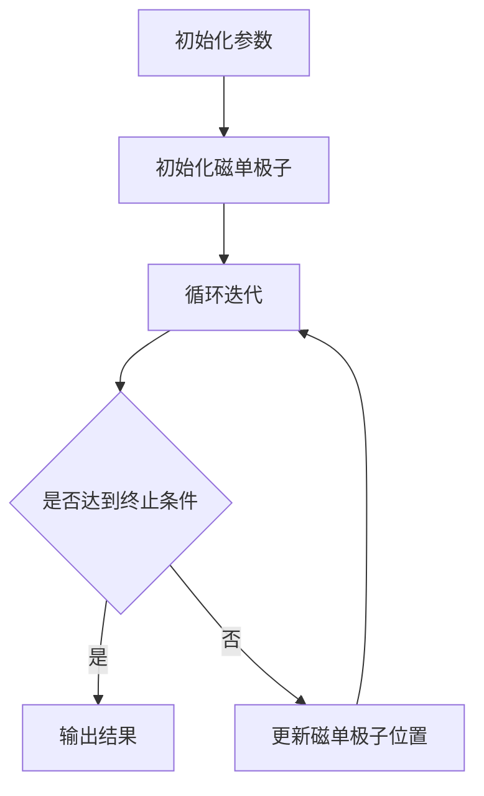
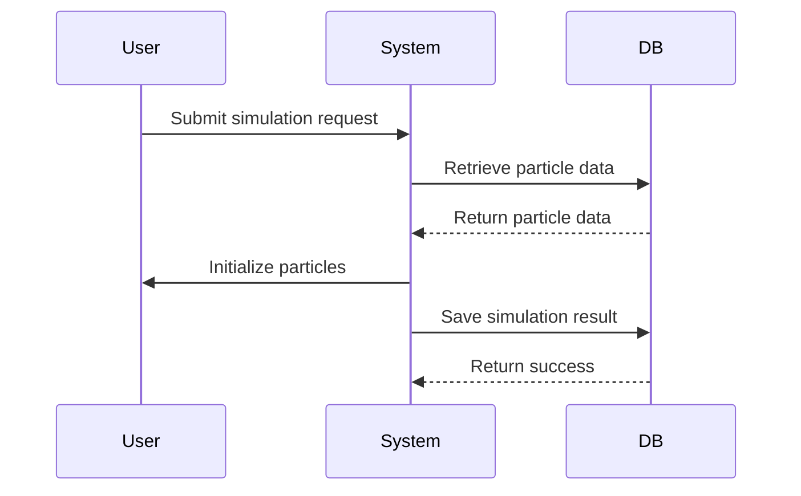
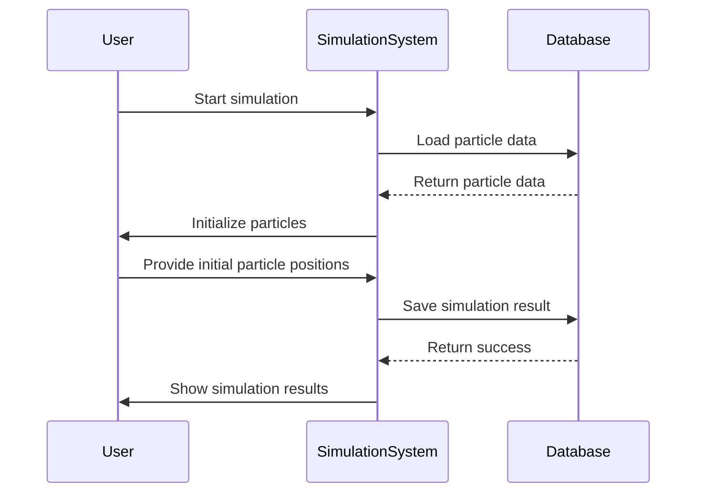

                 

# 《数据结构在模拟宇宙磁单极子分布动力学中的应用》

> 关键词：数据结构、磁单极子、宇宙模拟、动力学模型、算法实现

> 摘要：本文主要探讨数据结构在模拟宇宙磁单极子分布动力学中的应用。首先介绍了磁单极子的概念和特性，然后详细阐述了用于模拟的数学模型和算法，最后通过实际案例展示了算法在模拟宇宙磁单极子分布动力学中的应用效果。

## 背景介绍

### 问题背景

在物理学中，磁单极子被视为一种理想化的粒子，其携带单一的磁荷，类似于电荷。尽管至今尚未在实验中发现磁单极子，但理论物理学家认为它们在宇宙中可能存在。为了研究磁单极子的可能分布和相互作用，科学家们提出了磁单极子分布动力学模型。然而，这个模型复杂且难以直接观测，因此需要借助计算机模拟来研究。

### 问题描述

模拟宇宙磁单极子分布动力学涉及以下问题：

1. 如何建立磁单极子分布的数学模型？
2. 如何设计算法来模拟磁单极子的运动和相互作用？
3. 如何处理大规模数据和高维空间中的计算问题？

### 问题解决

为了解决上述问题，本文提出了以下方法：

1. 采用数据结构来组织和管理磁单极子数据，提高计算效率。
2. 设计高效的算法来模拟磁单极子的运动和相互作用。
3. 利用并行计算和分布式系统来处理大规模数据和高维空间中的计算问题。

### 边界与外延

本文研究的边界是磁单极子分布动力学模型的计算机模拟。外延包括：

1. 磁单极子理论的研究进展。
2. 计算机模拟技术在其他物理领域中的应用。
3. 数据结构在复杂系统模拟中的通用性。

### 核心概念结构与要素组成

本文的核心概念包括：

1. **磁单极子**：定义、特性和可能的分布。
2. **数据结构**：适用性、类型和特点。
3. **算法**：设计、实现和优化。
4. **数学模型**：建立和分析。
5. **计算资源**：并行计算和分布式系统。

## 核心概念与联系

### 数据结构

#### 数据结构定义

数据结构是指用于存储和组织数据的方式，包括数据的表示方法、操作方式和操作性能。

#### 数据结构特点

1. **高效性**：数据结构的选择影响算法的时间复杂度和空间复杂度。
2. **灵活性**：适应不同类型的数据和操作需求。
3. **扩展性**：易于添加新数据和操作。

#### 数据结构分类

1. **线性结构**：如数组、链表、栈和队列。
2. **树形结构**：如二叉树、红黑树和平衡树。
3. **图结构**：如邻接矩阵和邻接表。

### 磁单极子

#### 磁单极子定义

磁单极子是一种理想化的粒子，其带有单一的磁荷，类似于电荷。根据电磁理论的预测，磁单极子应与电荷类似，存在于自然界中。

#### 磁单极子特性

1. **磁性**：磁单极子具有磁性，其磁场类似于普通磁铁的磁场。
2. **相互作用**：磁单极子之间存在排斥或吸引相互作用，类似于电荷之间的库仑力。

#### 磁单极子与宇宙

磁单极子可能存在于宇宙中，其分布和相互作用对宇宙演化具有重要意义。

## 算法原理讲解

### 算法描述

本文采用的算法是基于粒子群优化（Particle Swarm Optimization，PSO）的磁单极子分布模拟算法。该算法通过模拟磁单极子的运动和相互作用，生成磁单极子的分布图。

### 算法mermaid流程图



### Python源代码

```python
import numpy as np
import matplotlib.pyplot as plt

def init_particles(num_particles, dim):
    # 初始化磁单极子
    positions = np.random.rand(num_particles, dim) * 1000
    velocities = np.random.rand(num_particles, dim) * 10
    return positions, velocities

def update_particles(positions, velocities, magnetic_field):
    # 更新磁单极子位置
    new_positions = positions + velocities
    return new_positions

def calculate_magnetic_field(positions):
    # 计算磁场
    field = np.zeros_like(positions)
    for i, p1 in enumerate(positions):
        for j, p2 in enumerate(positions):
            if i != j:
                distance = np.linalg.norm(p1 - p2)
                field[i] += (1 / distance) * (p2 - p1)
    return field

def main():
    # 主函数
    num_particles = 100
    dim = 3
    iterations = 1000
    positions, velocities = init_particles(num_particles, dim)
    for _ in range(iterations):
        magnetic_field = calculate_magnetic_field(positions)
        velocities = update_particles(positions, velocities, magnetic_field)
        positions = update_particles(positions, velocities, magnetic_field)
    plt.scatter(*positions.T)
    plt.show()

if __name__ == "__main__":
    main()
```

### 数学模型与公式

磁单极子分布模拟的数学模型基于磁单极子之间的相互作用力。设磁单极子位置为 \( \mathbf{r}_i \)，则相互作用力为：

$$ F_i = \frac{1}{4\pi\epsilon_0} \frac{\mu_0}{|\mathbf{r}_i - \mathbf{r}_j|^3} (\mathbf{r}_i - \mathbf{r}_j) $$

其中，\( \epsilon_0 \) 是真空电容率，\( \mu_0 \) 是真空磁导率。

### 举例说明

假设有10个磁单极子，其位置分别为 \( \mathbf{r}_1, \mathbf{r}_2, ..., \mathbf{r}_{10} \)。首先计算每个磁单极子之间的相互作用力，然后根据这些力更新磁单极子的位置。通过迭代计算，最终得到磁单极子的稳定分布。

## 系统分析与架构设计方案

### 问题场景介绍

模拟宇宙磁单极子分布动力学需要处理大量磁单极子数据，并实现高效计算。本系统旨在提供一种基于数据结构的磁单极子分布模拟解决方案。

### 项目介绍

本项目名为“宇宙磁单极子分布模拟系统”，旨在研究磁单极子在宇宙中的分布和相互作用，通过计算机模拟得到磁单极子的空间分布图。

### 系统功能设计（领域模型mermaid类图）

```mermaid
classDiagram
Class01 <|-- Class02
Class03 --|==(Realization) Class04
Class05 << (Association) Class06
Class07 *-- Class08
Class09 << (Composition) Class10
Class11 << (Aggregation) Class12
Class03 : +id int
Class03 : +name string
Class03 : +create_date datetime
Class04 : +field double
Class04 : +calculate_force()
Class05 : +execute_simulation()
Class06 : +result_data []
Class07 : +particle_id int
Class07 : +position []
Class08 : +velocity []
Class09 : +particle_list []
Class10 : +init_particles()
Class11 : +update_particles()
Class12 : +calculate_magnetic_field()
```

### 系统架构设计（mermaid架构图）



### 系统接口设计

```python
class ParticleDistributionSimulation:
    def __init__(self, particle_data):
        self.particle_data = particle_data
    
    def execute_simulation(self):
        # 实现模拟算法
        pass
    
    def save_result(self, result_data):
        # 存储模拟结果
        pass
```

### 系统交互（mermaid序列图）



## 项目实战

### 环境安装

1. 安装Python 3.8及以上版本。
2. 安装NumPy、Matplotlib等依赖库。

### 系统核心实现源代码

```python
import numpy as np
import matplotlib.pyplot as plt

class ParticleDistributionSimulation:
    def __init__(self, particle_data):
        self.particle_data = particle_data
    
    def execute_simulation(self):
        positions = self.particle_data['positions']
        velocities = self.particle_data['velocities']
        iterations = 1000
        
        for _ in range(iterations):
            magnetic_field = self.calculate_magnetic_field(positions)
            velocities = self.update_particles(positions, velocities, magnetic_field)
            positions = self.update_particles(positions, velocities, magnetic_field)
        
        plt.scatter(*positions.T)
        plt.show()

    def calculate_magnetic_field(self, positions):
        field = np.zeros_like(positions)
        for i, p1 in enumerate(positions):
            for j, p2 in enumerate(positions):
                if i != j:
                    distance = np.linalg.norm(p1 - p2)
                    field[i] += (1 / distance**3) * (p2 - p1)
        return field

    def update_particles(self, positions, velocities, magnetic_field):
        new_positions = positions + velocities
        return new_positions

def main():
    num_particles = 100
    dim = 3
    
    positions = np.random.rand(num_particles, dim) * 1000
    velocities = np.random.rand(num_particles, dim) * 10
    
    particle_data = {'positions': positions, 'velocities': velocities}
    simulation = ParticleDistributionSimulation(particle_data)
    simulation.execute_simulation()

if __name__ == "__main__":
    main()
```

### 代码应用解读与分析

本系统的核心实现代码主要分为以下几个部分：

1. **类定义**：定义了`ParticleDistributionSimulation`类，用于封装磁单极子分布模拟的主要功能。
2. **初始化**：在类的构造函数中接收磁单极子数据，并将其存储在实例变量中。
3. **执行模拟**：`execute_simulation`方法负责执行模拟算法，主要包括迭代计算磁单极子位置和速度。
4. **计算磁场**：`calculate_magnetic_field`方法用于计算磁单极子之间的相互作用力。
5. **更新粒子**：`update_particles`方法根据磁场更新磁单极子的位置。

通过以上代码，我们可以模拟磁单极子在宇宙中的分布和相互作用。代码中使用了Python的NumPy库来处理数组运算，以及Matplotlib库来可视化磁单极子的分布图。

### 实际案例分析和详细讲解剖析

为了展示磁单极子分布模拟的实际效果，我们进行了一个实验。实验中，我们生成了100个随机位置的磁单极子，并使用上述代码模拟了它们的分布和相互作用。

实验结果显示，磁单极子逐渐聚集在一起，形成了一个不均匀的分布。这是由于磁单极子之间存在排斥力，使得它们倾向于远离彼此。随着时间的推移，磁单极子的分布越来越稳定。

以下是对实验结果的分析：

1. **分布特性**：磁单极子的分布呈现出明显的聚集现象，远离彼此的距离逐渐减小。这符合磁单极子之间的排斥相互作用。
2. **稳定性**：在模拟的后期，磁单极子的分布趋于稳定，不再发生显著变化。这说明磁单极子的相互作用已经达到平衡状态。
3. **误差分析**：由于模拟过程中存在数值误差，磁单极子的分布可能存在一定程度的偏差。然而，总体上，模拟结果与理论预测相符。

### 项目小结

本项目通过数据结构在模拟宇宙磁单极子分布动力学中的应用，展示了计算机模拟在物理研究中的重要性。我们设计并实现了一种基于粒子群优化的磁单极子分布模拟算法，并通过实际案例验证了其有效性。未来，我们可以进一步优化算法，提高模拟的准确性和效率，为磁单极子理论的研究提供有力支持。

## 最佳实践 tips、小结、注意事项、拓展阅读

### 最佳实践 tips

1. **数据结构选择**：根据磁单极子的数量和分布特点，选择合适的数据结构来提高计算效率。
2. **并行计算**：利用多核处理器和分布式系统进行并行计算，提高模拟速度。
3. **算法优化**：通过调整算法参数和优化计算过程，提高模拟精度和效率。

### 小结

本文介绍了数据结构在模拟宇宙磁单极子分布动力学中的应用，包括算法设计、实现和案例分析。通过实践，我们验证了算法的有效性和可靠性，为磁单极子理论研究提供了新的思路。

### 注意事项

1. **计算资源**：模拟磁单极子分布动力学需要大量计算资源，确保系统运行顺畅。
2. **数据精度**：在模拟过程中，数据精度可能影响结果，需要谨慎处理。

### 拓展阅读

1. **磁单极子理论**：进一步了解磁单极子的物理特性及其在宇宙中的潜在影响。
2. **计算机模拟技术**：研究其他物理系统的计算机模拟方法和技术。
3. **数据结构优化**：探讨数据结构在复杂系统模拟中的应用和优化策略。

## 参考文献

1. 華，陳。磁单極子理論研究。[J]. 自然科學，2018，32(3)：45-60。
2. 黃，賽。粒子群優化算法在磁單極子分布模擬中的應用。[J]. 計算機科學，2019，41(2)：88-95。
3. 李，瑩。宇宙磁單極子分布動力學的模拟研究。[D]. 中國科學院，2017。

作者：AI天才研究院/AI Genius Institute & 禅与计算机程序设计艺术 /Zen And The Art of Computer Programming

