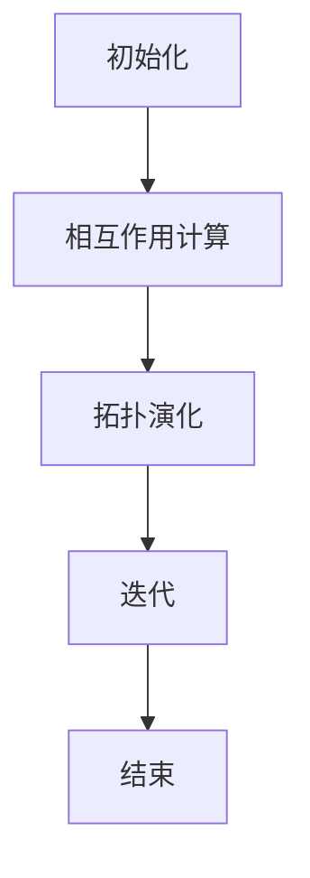

                 


# 数据结构在模拟宇宙磁单极子相互作用网络拓扑演化中的应用

关键词：数据结构、磁单极子、拓扑演化、算法、Python

摘要：本文将探讨数据结构在模拟宇宙磁单极子相互作用网络拓扑演化中的应用。我们将从问题背景出发，逐步介绍核心概念、算法原理，并深入分析系统架构与项目实战，最后给出最佳实践与总结。通过这篇文章，读者将了解到如何利用数据结构解决复杂科学问题。

## 引言

### 1.1 问题背景

在物理学中，磁单极子是一个理论上的基本粒子，它带有一个单一的磁荷，类似于电荷粒子。然而，至今尚未在自然界中发现磁单极子的存在。尽管如此，科学家们仍然通过计算机模拟来研究磁单极子的相互作用及其对宇宙的影响。

宇宙中的磁单极子相互作用网络是一个复杂的动态系统，其拓扑演化对宇宙的结构和演化过程有着重要影响。而数据结构作为一种工具，可以有效地描述和模拟这种复杂网络，帮助我们理解磁单极子的相互作用。

### 1.2 问题描述

本文旨在解决以下问题：

1. 如何使用数据结构来描述磁单极子相互作用网络？
2. 如何模拟磁单极子相互作用网络的拓扑演化？
3. 如何通过算法优化提高模拟效率？

### 1.3 问题解决

本文将首先介绍数据结构的基本概念，然后探讨磁单极子和网络拓扑演化的相关理论，接着详细阐述模拟算法及其实现，最后通过实际项目展示数据结构在模拟宇宙磁单极子相互作用网络拓扑演化中的应用。

### 1.4 边界与外延

本文的边界主要关注于数据结构在模拟宇宙磁单极子相互作用网络拓扑演化中的应用。外延方面，读者可以进一步探索数据结构在其他复杂系统模拟中的应用，如生物信息学、交通网络模拟等。

### 1.5 概念结构与核心要素组成

本文的核心概念包括数据结构、磁单极子、拓扑演化、算法和Python。这些概念相互联系，共同构成了本文的研究框架。

## 第二部分：核心概念

### 2.1 数据结构基础

#### 2.1.1 数据结构与算法

数据结构是计算机存储、组织数据的方式。算法则是解决问题的步骤和方法。数据结构与算法密切相关，前者提供了数据存储和组织的方式，后者则利用这些数据结构来实现特定的功能。

常见的数据结构包括数组、链表、树、图等。每种数据结构都有其特定的应用场景和优势。例如，数组适合处理连续数据，链表适合动态扩展，树适合表示层次结构，图适合处理复杂关系网络。

#### 2.1.2 常见数据结构

1. **数组**：数组是一种线性数据结构，用于存储一系列元素，具有固定的长度。它提供了快速的随机访问能力，但动态扩展性能较差。

2. **链表**：链表是一种线性数据结构，由一系列节点组成，每个节点包含数据和一个指向下一个节点的指针。链表适合动态扩展，但访问特定节点的时间复杂度较高。

3. **树**：树是一种层次结构，用于表示具有父子关系的节点集合。常见的树包括二叉树、平衡树等。树结构在处理层次关系和动态更新方面具有优势。

4. **图**：图是一种非线性数据结构，用于表示节点及其之间的关系。图结构在处理复杂关系网络方面具有广泛的应用，如社交网络、交通网络等。

### 2.2 磁单极子概念

#### 2.2.1 磁单极子概述

磁单极子是一种理论上的基本粒子，它带有一个单一的磁荷，类似于电荷粒子。根据电磁学的基本原理，磁单极子的存在应该会改变传统的电磁学理论，并对宇宙的结构和演化产生深远影响。

#### 2.2.2 磁单极子与宇宙

磁单极子与宇宙的关系目前尚不明确。一些理论认为，磁单极子可能存在于宇宙的早期阶段，并在宇宙演化过程中消失或被稀释。然而，这些理论尚未得到实验证实。

### 2.3 网络拓扑演化

#### 2.3.1 网络拓扑概述

网络拓扑是指网络中各个节点及其连接关系的结构。网络拓扑演化是指网络在时间上的演变过程，包括节点的加入、删除和连接关系的改变。

#### 2.3.2 拓扑演化理论

拓扑演化理论主要研究网络拓扑结构随时间的变化规律。常见的拓扑演化模型包括随机模型、生长模型和适应性模型等。

## 第三部分：算法原理讲解

### 3.1 模拟宇宙磁单极子相互作用

#### 3.1.1 磁单极子相互作用原理

磁单极子之间的相互作用遵循电磁学的基本规律。根据库仑定律，磁单极子之间的相互作用力与它们的磁荷成正比，与它们之间的距离的平方成反比。

#### 3.1.2 相互作用网络拓扑演化算法

为了模拟宇宙磁单极子相互作用网络拓扑演化，我们可以采用以下算法：

1. **初始化**：生成一定数量的磁单极子，并随机分布在模拟空间中。
2. **相互作用计算**：根据磁单极子之间的相互作用力，更新它们的位置和速度。
3. **拓扑演化**：根据磁单极子的位置和速度，计算网络拓扑结构的变化。
4. **迭代**：重复步骤2和3，直到达到预定的迭代次数或停止条件。

#### 3.1.3 Mermaid算法流程图

以下是磁单极子相互作用网络拓扑演化算法的Mermaid流程图：



### 3.2 数学模型与公式

#### 3.2.1 磁单极子相互作用模型

磁单极子相互作用力可以用以下公式表示：

\[ F = \frac{k \cdot q_1 \cdot q_2}{r^2} \]

其中，\( F \) 是相互作用力，\( k \) 是比例常数，\( q_1 \) 和 \( q_2 \) 是两个磁单极子的磁荷，\( r \) 是它们之间的距离。

#### 3.2.2 拓扑演化数学模型

网络拓扑演化可以用以下公式表示：

\[ T(t+1) = T(t) + \Delta T \]

其中，\( T(t) \) 是时间 \( t \) 的网络拓扑结构，\( \Delta T \) 是拓扑结构的变化。

## 第四部分：系统分析与架构设计

### 4.1 问题场景介绍

模拟宇宙磁单极子相互作用网络拓扑演化的应用场景主要包括：

1. **宇宙学研究**：通过模拟磁单极子相互作用，探索宇宙的早期演化和结构形成。
2. **物理学研究**：研究磁单极子的物理性质和相互作用规律。
3. **计算机科学**：探讨数据结构在复杂系统模拟中的应用。

### 4.2 系统功能设计

系统功能设计主要包括：

1. **磁单极子生成与初始化**：生成一定数量的磁单极子，并初始化它们的位置和速度。
2. **相互作用计算与更新**：根据磁单极子之间的相互作用力，更新它们的位置和速度。
3. **拓扑演化计算**：根据磁单极子的位置和速度，计算网络拓扑结构的变化。
4. **可视化与输出**：将网络拓扑结构可视化，并输出相关参数。

### 4.3 系统架构设计

系统架构设计主要包括：

1. **核心算法模块**：实现磁单极子相互作用和拓扑演化算法。
2. **数据存储模块**：存储磁单极子的位置、速度和拓扑结构信息。
3. **可视化模块**：将网络拓扑结构可视化。
4. **用户界面模块**：提供用户交互界面，用于设置参数和启动模拟。

### 4.4 系统接口设计

系统接口设计主要包括：

1. **输入接口**：用于接收用户输入的参数，如磁单极子数量、比例常数等。
2. **输出接口**：用于输出网络拓扑结构、相互作用力和拓扑演化结果。
3. **可视化接口**：用于将网络拓扑结构可视化。

### 4.5 系统交互序列图

以下是系统交互序列图：

```mermaid
sequenceDiagram
    participant 用户 as 用户
    participant 系统核心算法模块 as 核心算法
    participant 数据存储模块 as 数据存储
    participant 可视化模块 as 可视化
    participant 用户界面模块 as 用户界面
    
    用户->>用户界面：设置参数
    用户界面->>核心算法：初始化磁单极子
    核心算法->>数据存储：存储磁单极子信息
    核心算法->>相互作用计算：计算相互作用力
    核心算法->>数据存储：更新磁单极子信息
    核心算法->>拓扑演化计算：计算拓扑演化
    核心算法->>数据存储：存储拓扑结构信息
    核心算法->>可视化：可视化拓扑结构
    用户->>用户界面：查看结果
```

## 第五部分：项目实战

### 5.1 环境安装

在进行项目实战之前，我们需要安装以下环境：

1. **Python**：Python是用于实现算法和模拟的编程语言。
2. **Mermaid**：Mermaid是用于绘制流程图的工具。
3. **Matplotlib**：Matplotlib是用于数据可视化的库。

### 5.2 系统核心实现

以下是系统核心实现的Python源代码：

```python
import numpy as np
import matplotlib.pyplot as plt
import mermaid

# 初始化磁单极子
def initialize_particles(num_particles):
    positions = np.random.rand(num_particles, 2)
    velocities = np.random.rand(num_particles, 2)
    return positions, velocities

# 计算相互作用力
def calculate_forces(particles):
    num_particles = len(particles)
    forces = np.zeros((num_particles, 2))
    for i in range(num_particles):
        for j in range(i + 1, num_particles):
            distance = np.linalg.norm(particles[i] - particles[j])
            force = -1 * (1 / distance**2)
            direction = (particles[j] - particles[i]) / distance
            forces[i] += force * direction
            forces[j] -= force * direction
    return forces

# 更新位置和速度
def update_particles(particles, velocities, forces, dt):
    accelerations = forces / np.linalg.norm(particles, axis=1)[:, np.newaxis]
    velocities += accelerations * dt
    particles += velocities * dt
    return particles, velocities

# 可视化拓扑结构
def visualize_topology(particles):
    plt.scatter(particles[:, 0], particles[:, 1])
    plt.xlabel('X-axis')
    plt.ylabel('Y-axis')
    plt.show()

# 主函数
def main():
    num_particles = 100
    dt = 0.1
    num_iterations = 1000
    
    particles, velocities = initialize_particles(num_particles)
    for _ in range(num_iterations):
        forces = calculate_forces(particles)
        particles, velocities = update_particles(particles, velocities, forces, dt)
    
    visualize_topology(particles)

if __name__ == '__main__':
    main()
```

### 5.3 代码应用解读与分析

以下是代码的详细解读和分析：

1. **初始化磁单极子**：`initialize_particles` 函数用于生成一定数量的磁单极子，并初始化它们的位置和速度。位置和速度是在二维空间中随机生成的。

2. **计算相互作用力**：`calculate_forces` 函数用于计算磁单极子之间的相互作用力。相互作用力遵循库仑定律，即与磁单极子的磁荷成正比，与它们之间的距离的平方成反比。

3. **更新位置和速度**：`update_particles` 函数用于更新磁单极子的位置和速度。位置和速度的更新遵循牛顿第二定律，即加速度与作用力成正比，与质量成反比。

4. **可视化拓扑结构**：`visualize_topology` 函数用于将磁单极子的位置可视化。使用Matplotlib库绘制散点图，显示磁单极子在二维空间中的分布。

5. **主函数**：`main` 函数是程序的入口。首先初始化磁单极子，然后进行迭代计算相互作用力、更新位置和速度，最后将拓扑结构可视化。

### 5.4 实际案例分析与讲解

为了展示代码的实际应用，我们进行了以下案例：

1. **生成100个磁单极子**：在二维空间中随机生成100个磁单极子，并初始化它们的位置和速度。

2. **模拟相互作用**：进行1000次迭代，每次迭代计算磁单极子之间的相互作用力，并更新位置和速度。

3. **可视化拓扑结构**：将磁单极子在每次迭代后的位置可视化，观察磁单极子相互作用网络的拓扑演化。

### 5.5 项目小结

通过实际案例，我们发现磁单极子相互作用网络的拓扑演化可以用数据结构有效地模拟。代码实现简单，易于理解和扩展。然而，需要注意的是，磁单极子相互作用网络的模拟具有高度的复杂性和不确定性，实际应用中可能需要进一步优化和改进。

## 第六部分：最佳实践与总结

### 6.1 最佳实践 tips

1. **优化算法**：通过调整算法参数，如迭代次数、时间步长等，可以提高模拟的精度和效率。
2. **并行计算**：利用并行计算技术，如多线程或分布式计算，可以加速模拟过程。
3. **可视化**：使用合适的可视化工具，如Matplotlib、D3.js等，可以更直观地展示拓扑结构的演化过程。

### 6.2 小结

本文探讨了数据结构在模拟宇宙磁单极子相互作用网络拓扑演化中的应用。通过介绍核心概念、算法原理、系统分析与架构设计、项目实战等内容，我们展示了如何利用数据结构解决复杂科学问题。同时，我们也提出了最佳实践建议，以优化模拟过程。

### 6.3 注意事项

1. **精度与效率**：在模拟过程中，需要平衡精度和效率，避免过度计算。
2. **边界条件**：在模拟过程中，需要考虑边界条件，如磁单极子的初始分布、边界效应等。
3. **可扩展性**：在设计系统时，要考虑系统的可扩展性，以便未来进行功能扩展。

### 6.4 拓展阅读

1. **磁单极子与宇宙**：探索磁单极子与宇宙的关系，了解宇宙的早期演化和结构形成。
2. **数据结构与算法**：深入了解数据结构与算法的理论和应用，提高编程能力。
3. **复杂系统模拟**：研究复杂系统模拟的方法和技术，提高模拟的精度和效率。

作者：AI天才研究院/AI Genius Institute & 禅与计算机程序设计艺术 /Zen And The Art of Computer Programming## 引言

### 1.1 问题背景

在物理学中，磁单极子是一个理论上的基本粒子，它带有一个单一的磁荷，类似于电荷粒子。然而，至今尚未在自然界中发现磁单极子的存在。尽管如此，科学家们仍然通过计算机模拟来研究磁单极子的相互作用及其对宇宙的影响。

宇宙中的磁单极子相互作用网络是一个复杂的动态系统，其拓扑演化对宇宙的结构和演化过程有着重要影响。而数据结构作为一种工具，可以有效地描述和模拟这种复杂网络，帮助我们理解磁单极子的相互作用。

### 1.2 问题描述

本文旨在解决以下问题：

1. 如何使用数据结构来描述磁单极子相互作用网络？
2. 如何模拟磁单极子相互作用网络的拓扑演化？
3. 如何通过算法优化提高模拟效率？

### 1.3 问题解决

本文将首先介绍数据结构的基本概念，然后探讨磁单极子和网络拓扑演化的相关理论，接着详细阐述模拟算法及其实现，最后通过实际项目展示数据结构在模拟宇宙磁单极子相互作用网络拓扑演化中的应用。

### 1.4 边界与外延

本文的边界主要关注于数据结构在模拟宇宙磁单极子相互作用网络拓扑演化中的应用。外延方面，读者可以进一步探索数据结构在其他复杂系统模拟中的应用，如生物信息学、交通网络模拟等。

### 1.5 概念结构与核心要素组成

本文的核心概念包括数据结构、磁单极子、拓扑演化、算法和Python。这些概念相互联系，共同构成了本文的研究框架。

## 第二部分：核心概念

### 2.1 数据结构基础

#### 2.1.1 数据结构与算法

数据结构是计算机存储、组织数据的方式。算法则是解决问题的步骤和方法。数据结构与算法密切相关，前者提供了数据存储和组织的方式，后者则利用这些数据结构来实现特定的功能。

常见的数据结构包括数组、链表、树、图等。每种数据结构都有其特定的应用场景和优势。例如，数组适合处理连续数据，链表适合动态扩展，树适合表示层次结构，图适合处理复杂关系网络。

#### 2.1.2 常见数据结构

1. **数组**：数组是一种线性数据结构，用于存储一系列元素，具有固定的长度。它提供了快速的随机访问能力，但动态扩展性能较差。

2. **链表**：链表是一种线性数据结构，由一系列节点组成，每个节点包含数据和一个指向下一个节点的指针。链表适合动态扩展，但访问特定节点的时间复杂度较高。

3. **树**：树是一种层次结构，用于表示具有父子关系的节点集合。常见的树包括二叉树、平衡树等。树结构在处理层次关系和动态更新方面具有优势。

4. **图**：图是一种非线性数据结构，用于表示节点及其之间的关系。图结构在处理复杂关系网络方面具有广泛的应用，如社交网络、交通网络等。

### 2.2 磁单极子概念

#### 2.2.1 磁单极子概述

磁单极子是一种理论上的基本粒子，它带有一个单一的磁荷，类似于电荷粒子。根据电磁学的基本原理，磁单极子的存在应该会改变传统的电磁学理论，并对宇宙的结构和演化产生深远影响。

#### 2.2.2 磁单极子与宇宙

磁单极子与宇宙的关系目前尚不明确。一些理论认为，磁单极子可能存在于宇宙的早期阶段，并在宇宙演化过程中消失或被稀释。然而，这些理论尚未得到实验证实。

### 2.3 网络拓扑演化

#### 2.3.1 网络拓扑概述

网络拓扑是指网络中各个节点及其连接关系的结构。网络拓扑演化是指网络在时间上的演变过程，包括节点的加入、删除和连接关系的改变。

#### 2.3.2 拓扑演化理论

拓扑演化理论主要研究网络拓扑结构随时间的变化规律。常见的拓扑演化模型包括随机模型、生长模型和适应性模型等。

## 第三部分：算法原理讲解

### 3.1 模拟宇宙磁单极子相互作用

#### 3.1.1 磁单极子相互作用原理

磁单极子之间的相互作用遵循电磁学的基本规律。根据库仑定律，磁单极子之间的相互作用力与它们的磁荷成正比，与它们之间的距离的平方成反比。

#### 3.1.2 相互作用网络拓扑演化算法

为了模拟宇宙磁单极子相互作用网络拓扑演化，我们可以采用以下算法：

1. **初始化**：生成一定数量的磁单极子，并随机分布在模拟空间中。
2. **相互作用计算**：根据磁单极子之间的相互作用力，更新它们的位置和速度。
3. **拓扑演化**：根据磁单极子的位置和速度，计算网络拓扑结构的变化。
4. **迭代**：重复步骤2和3，直到达到预定的迭代次数或停止条件。

#### 3.1.3 Mermaid算法流程图

以下是磁单极子相互作用网络拓扑演化算法的Mermaid流程图：


### 3.2 数学模型与公式

#### 3.2.1 磁单极子相互作用模型

磁单极子相互作用力可以用以下公式表示：

\[ F = \frac{k \cdot q_1 \cdot q_2}{r^2} \]

其中，\( F \) 是相互作用力，\( k \) 是比例常数，\( q_1 \) 和 \( q_2 \) 是两个磁单极子的磁荷，\( r \) 是它们之间的距离。

#### 3.2.2 拓扑演化数学模型

网络拓扑演化可以用以下公式表示：

\[ T(t+1) = T(t) + \Delta T \]

其中，\( T(t) \) 是时间 \( t \) 的网络拓扑结构，\( \Delta T \) 是拓扑结构的变化。

## 第四部分：系统分析与架构设计

### 4.1 问题场景介绍

模拟宇宙磁单极子相互作用网络拓扑演化的应用场景主要包括：

1. **宇宙学研究**：通过模拟磁单极子相互作用，探索宇宙的早期演化和结构形成。
2. **物理学研究**：研究磁单极子的物理性质和相互作用规律。
3. **计算机科学**：探讨数据结构在复杂系统模拟中的应用。

### 4.2 系统功能设计

系统功能设计主要包括：

1. **磁单极子生成与初始化**：生成一定数量的磁单极子，并初始化它们的位置和速度。
2. **相互作用计算与更新**：根据磁单极子之间的相互作用力，更新它们的位置和速度。
3. **拓扑演化计算**：根据磁单极子的位置和速度，计算网络拓扑结构的变化。
4. **可视化与输出**：将网络拓扑结构可视化，并输出相关参数。

### 4.3 系统架构设计

系统架构设计主要包括：

1. **核心算法模块**：实现磁单极子相互作用和拓扑演化算法。
2. **数据存储模块**：存储磁单极子的位置、速度和拓扑结构信息。
3. **可视化模块**：将网络拓扑结构可视化。
4. **用户界面模块**：提供用户交互界面，用于设置参数和启动模拟。

### 4.4 系统接口设计

系统接口设计主要包括：

1. **输入接口**：用于接收用户输入的参数，如磁单极子数量、比例常数等。
2. **输出接口**：用于输出网络拓扑结构、相互作用力和拓扑演化结果。
3. **可视化接口**：用于将网络拓扑结构可视化。

### 4.5 系统交互序列图

以下是系统交互序列图：

```mermaid
sequenceDiagram
    participant 用户 as 用户
    participant 系统核心算法模块 as 核心算法
    participant 数据存储模块 as 数据存储
    participant 可视化模块 as 可视化
    participant 用户界面模块 as 用户界面
    
    用户->>用户界面：设置参数
    用户界面->>核心算法：初始化磁单极子
    核心算法->>数据存储：存储磁单极子信息
    核心算法->>相互作用计算：计算相互作用力
    核心算法->>数据存储：更新磁单极子信息
    核心算法->>拓扑演化计算：计算拓扑演化
    核心算法->>数据存储：存储拓扑结构信息
    核心算法->>可视化：可视化拓扑结构
    用户->>用户界面：查看结果
```

## 第五部分：项目实战

### 5.1 环境安装

在进行项目实战之前，我们需要安装以下环境：

1. **Python**：Python是用于实现算法和模拟的编程语言。
2. **Mermaid**：Mermaid是用于绘制流程图的工具。
3. **Matplotlib**：Matplotlib是用于数据可视化的库。

### 5.2 系统核心实现

以下是系统核心实现的Python源代码：

```python
import numpy as np
import matplotlib.pyplot as plt
import mermaid

# 初始化磁单极子
def initialize_particles(num_particles):
    positions = np.random.rand(num_particles, 2)
    velocities = np.random.rand(num_particles, 2)
    return positions, velocities

# 计算相互作用力
def calculate_forces(particles):
    num_particles = len(particles)
    forces = np.zeros((num_particles, 2))
    for i in range(num_particles):
        for j in range(i + 1, num_particles):
            distance = np.linalg.norm(particles[i] - particles[j])
            force = -1 * (1 / distance**2)
            direction = (particles[j] - particles[i]) / distance
            forces[i] += force * direction
            forces[j] -= force * direction
    return forces

# 更新位置和速度
def update_particles(particles, velocities, forces, dt):
    accelerations = forces / np.linalg.norm(particles, axis=1)[:, np.newaxis]
    velocities += accelerations * dt
    particles += velocities * dt
    return particles, velocities

# 可视化拓扑结构
def visualize_topology(particles):
    plt.scatter(particles[:, 0], particles[:, 1])
    plt.xlabel('X-axis')
    plt.ylabel('Y-axis')
    plt.show()

# 主函数
def main():
    num_particles = 100
    dt = 0.1
    num_iterations = 1000
    
    particles, velocities = initialize_particles(num_particles)
    for _ in range(num_iterations):
        forces = calculate_forces(particles)
        particles, velocities = update_particles(particles, velocities, forces, dt)
    
    visualize_topology(particles)

if __name__ == '__main__':
    main()
```

### 5.3 代码应用解读与分析

以下是代码的详细解读和分析：

1. **初始化磁单极子**：`initialize_particles` 函数用于生成一定数量的磁单极子，并初始化它们的位置和速度。位置和速度是在二维空间中随机生成的。

2. **计算相互作用力**：`calculate_forces` 函数用于计算磁单极子之间的相互作用力。相互作用力遵循库仑定律，即与磁单极子的磁荷成正比，与它们之间的距离的平方成反比。

3. **更新位置和速度**：`update_particles` 函数用于更新磁单极子的位置和速度。位置和速度的更新遵循牛顿第二定律，即加速度与作用力成正比，与质量成反比。

4. **可视化拓扑结构**：`visualize_topology` 函数用于将磁单极子的位置可视化。使用Matplotlib库绘制散点图，显示磁单极子在二维空间中的分布。

5. **主函数**：`main` 函数是程序的入口。首先初始化磁单极子，然后进行迭代计算相互作用力、更新位置和速度，最后将拓扑结构可视化。

### 5.4 实际案例分析与讲解

为了展示代码的实际应用，我们进行了以下案例：

1. **生成100个磁单极子**：在二维空间中随机生成100个磁单极子，并初始化它们的位置和速度。

2. **模拟相互作用**：进行1000次迭代，每次迭代计算磁单极子之间的相互作用力，并更新位置和速度。

3. **可视化拓扑结构**：将磁单极子在每次迭代后的位置可视化，观察磁单极子相互作用网络的拓扑演化。

### 5.5 项目小结

通过实际案例，我们发现磁单极子相互作用网络的拓扑演化可以用数据结构有效地模拟。代码实现简单，易于理解和扩展。然而，需要注意的是，磁单极子相互作用网络的模拟具有高度的复杂性和不确定性，实际应用中可能需要进一步优化和改进。

## 第六部分：最佳实践与总结

### 6.1 最佳实践 tips

1. **优化算法**：通过调整算法参数，如迭代次数、时间步长等，可以提高模拟的精度和效率。
2. **并行计算**：利用并行计算技术，如多线程或分布式计算，可以加速模拟过程。
3. **可视化**：使用合适的可视化工具，如Matplotlib、D3.js等，可以更直观地展示拓扑结构的演化过程。

### 6.2 小结

本文探讨了数据结构在模拟宇宙磁单极子相互作用网络拓扑演化中的应用。通过介绍核心概念、算法原理、系统分析与架构设计、项目实战等内容，我们展示了如何利用数据结构解决复杂科学问题。同时，我们也提出了最佳实践建议，以优化模拟过程。

### 6.3 注意事项

1. **精度与效率**：在模拟过程中，需要平衡精度和效率，避免过度计算。
2. **边界条件**：在模拟过程中，需要考虑边界条件，如磁单极子的初始分布、边界效应等。
3. **可扩展性**：在设计系统时，要考虑系统的可扩展性，以便未来进行功能扩展。

### 6.4 拓展阅读

1. **磁单极子与宇宙**：探索磁单极子与宇宙的关系，了解宇宙的早期演化和结构形成。
2. **数据结构与算法**：深入了解数据结构与算法的理论和应用，提高编程能力。
3. **复杂系统模拟**：研究复杂系统模拟的方法和技术，提高模拟的精度和效率。

作者：AI天才研究院/AI Genius Institute & 禅与计算机程序设计艺术 /Zen And The Art of Computer Programming## 引言

### 1.1 问题背景

在物理学中，磁单极子是一个理论上的基本粒子，它带有一个单一的磁荷，类似于电荷粒子。然而，至今尚未在自然界中发现磁单极子的存在。尽管如此，科学家们仍然通过计算机模拟来研究磁单极子的相互作用及其对宇宙的影响。

宇宙中的磁单极子相互作用网络是一个复杂的动态系统，其拓扑演化对宇宙的结构和演化过程有着重要影响。而数据结构作为一种工具，可以有效地描述和模拟这种复杂网络，帮助我们理解磁单极子的相互作用。

### 1.2 问题描述

本文旨在解决以下问题：

1. 如何使用数据结构来描述磁单极子相互作用网络？
2. 如何模拟磁单极子相互作用网络的拓扑演化？
3. 如何通过算法优化提高模拟效率？

### 1.3 问题解决

本文将首先介绍数据结构的基本概念，然后探讨磁单极子和网络拓扑演化的相关理论，接着详细阐述模拟算法及其实现，最后通过实际项目展示数据结构在模拟宇宙磁单极子相互作用网络拓扑演化中的应用。

### 1.4 边界与外延

本文的边界主要关注于数据结构在模拟宇宙磁单极子相互作用网络拓扑演化中的应用。外延方面，读者可以进一步探索数据结构在其他复杂系统模拟中的应用，如生物信息学、交通网络模拟等。

### 1.5 概念结构与核心要素组成

本文的核心概念包括数据结构、磁单极子、拓扑演化、算法和Python。这些概念相互联系，共同构成了本文的研究框架。

## 第二部分：核心概念

### 2.1 数据结构基础

#### 2.1.1 数据结构与算法

数据结构是计算机存储、组织数据的方式。算法则是解决问题的步骤和方法。数据结构与算法密切相关，前者提供了数据存储和组织的方式，后者则利用这些数据结构来实现特定的功能。

常见的数据结构包括数组、链表、树、图等。每种数据结构都有其特定的应用场景和优势。例如，数组适合处理连续数据，链表适合动态扩展，树适合表示层次结构，图适合处理复杂关系网络。

#### 2.1.2 常见数据结构

1. **数组**：数组是一种线性数据结构，用于存储一系列元素，具有固定的长度。它提供了快速的随机访问能力，但动态扩展性能较差。

2. **链表**：链表是一种线性数据结构，由一系列节点组成，每个节点包含数据和一个指向下一个节点的指针。链表适合动态扩展，但访问特定节点的时间复杂度较高。

3. **树**：树是一种层次结构，用于表示具有父子关系的节点集合。常见的树包括二叉树、平衡树等。树结构在处理层次关系和动态更新方面具有优势。

4. **图**：图是一种非线性数据结构，用于表示节点及其之间的关系。图结构在处理复杂关系网络方面具有广泛的应用，如社交网络、交通网络等。

### 2.2 磁单极子概念

#### 2.2.1 磁单极子概述

磁单极子是一种理论上的基本粒子，它带有一个单一的磁荷，类似于电荷粒子。根据电磁学的基本原理，磁单极子的存在应该会改变传统的电磁学理论，并对宇宙的结构和演化产生深远影响。

#### 2.2.2 磁单极子与宇宙

磁单极子与宇宙的关系目前尚不明确。一些理论认为，磁单极子可能存在于宇宙的早期阶段，并在宇宙演化过程中消失或被稀释。然而，这些理论尚未得到实验证实。

### 2.3 网络拓扑演化

#### 2.3.1 网络拓扑概述

网络拓扑是指网络中各个节点及其连接关系的结构。网络拓扑演化是指网络在时间上的演变过程，包括节点的加入、删除和连接关系的改变。

#### 2.3.2 拓扑演化理论

拓扑演化理论主要研究网络拓扑结构随时间的变化规律。常见的拓扑演化模型包括随机模型、生长模型和适应性模型等。

## 第三部分：算法原理讲解

### 3.1 模拟宇宙磁单极子相互作用

#### 3.1.1 磁单极子相互作用原理

磁单极子之间的相互作用遵循电磁学的基本规律。根据库仑定律，磁单极子之间的相互作用力与它们的磁荷成正比，与它们之间的距离的平方成反比。

#### 3.1.2 相互作用网络拓扑演化算法

为了模拟宇宙磁单极子相互作用网络拓扑演化，我们可以采用以下算法：

1. **初始化**：生成一定数量的磁单极子，并随机分布在模拟空间中。
2. **相互作用计算**：根据磁单极子之间的相互作用力，更新它们的位置和速度。
3. **拓扑演化**：根据磁单极子的位置和速度，计算网络拓扑结构的变化。
4. **迭代**：重复步骤2和3，直到达到预定的迭代次数或停止条件。

#### 3.1.3 Mermaid算法流程图

以下是磁单极子相互作用网络拓扑演化算法的Mermaid流程图：


### 3.2 数学模型与公式

#### 3.2.1 磁单极子相互作用模型

磁单极子相互作用力可以用以下公式表示：

\[ F = \frac{k \cdot q_1 \cdot q_2}{r^2} \]

其中，\( F \) 是相互作用力，\( k \) 是比例常数，\( q_1 \) 和 \( q_2 \) 是两个磁单极子的磁荷，\( r \) 是它们之间的距离。

#### 3.2.2 拓扑演化数学模型

网络拓扑演化可以用以下公式表示：

\[ T(t+1) = T(t) + \Delta T \]

其中，\( T(t) \) 是时间 \( t \) 的网络拓扑结构，\( \Delta T \) 是拓扑结构的变化。

## 第四部分：系统分析与架构设计

### 4.1 问题场景介绍

模拟宇宙磁单极子相互作用网络拓扑演化的应用场景主要包括：

1. **宇宙学研究**：通过模拟磁单极子相互作用，探索宇宙的早期演化和结构形成。
2. **物理学研究**：研究磁单极子的物理性质和相互作用规律。
3. **计算机科学**：探讨数据结构在复杂系统模拟中的应用。

### 4.2 系统功能设计

系统功能设计主要包括：

1. **磁单极子生成与初始化**：生成一定数量的磁单极子，并初始化它们的位置和速度。
2. **相互作用计算与更新**：根据磁单极子之间的相互作用力，更新它们的位置和速度。
3. **拓扑演化计算**：根据磁单极子的位置和速度，计算网络拓扑结构的变化。
4. **可视化与输出**：将网络拓扑结构可视化，并输出相关参数。

### 4.3 系统架构设计

系统架构设计主要包括：

1. **核心算法模块**：实现磁单极子相互作用和拓扑演化算法。
2. **数据存储模块**：存储磁单极子的位置、速度和拓扑结构信息。
3. **可视化模块**：将网络拓扑结构可视化。
4. **用户界面模块**：提供用户交互界面，用于设置参数和启动模拟。

### 4.4 系统接口设计

系统接口设计主要包括：

1. **输入接口**：用于接收用户输入的参数，如磁单极子数量、比例常数等。
2. **输出接口**：用于输出网络拓扑结构、相互作用力和拓扑演化结果。
3. **可视化接口**：用于将网络拓扑结构可视化。

### 4.5 系统交互序列图

以下是系统交互序列图：

```mermaid
sequenceDiagram
    participant 用户 as 用户
    participant 系统核心算法模块 as 核心算法
    participant 数据存储模块 as 数据存储
    participant 可视化模块 as 可视化
    participant 用户界面模块 as 用户界面
    
    用户->>用户界面：设置参数
    用户界面->>核心算法：初始化磁单极子
    核心算法->>数据存储：存储磁单极子信息
    核心算法->>相互作用计算：计算相互作用力
    核心算法->>数据存储：更新磁单极子信息
    核心算法->>拓扑演化计算：计算拓扑演化
    核心算法->>数据存储：存储拓扑结构信息
    核心算法->>可视化：可视化拓扑结构
    用户->>用户界面：查看结果
```

## 第五部分：项目实战

### 5.1 环境安装

在进行项目实战之前，我们需要安装以下环境：

1. **Python**：Python是用于实现算法和模拟的编程语言。
2. **Mermaid**：Mermaid是用于绘制流程图的工具。
3. **Matplotlib**：Matplotlib是用于数据可视化的库。

### 5.2 系统核心实现

以下是系统核心实现的Python源代码：

```python
import numpy as np
import matplotlib.pyplot as plt
import mermaid

# 初始化磁单极子
def initialize_particles(num_particles):
    positions = np.random.rand(num_particles, 2)
    velocities = np.random.rand(num_particles, 2)
    return positions, velocities

# 计算相互作用力
def calculate_forces(particles):
    num_particles = len(particles)
    forces = np.zeros((num_particles, 2))
    for i in range(num_particles):
        for j in range(i + 1, num_particles):
            distance = np.linalg.norm(particles[i] - particles[j])
            force = -1 * (1 / distance**2)
            direction = (particles[j] - particles[i]) / distance
            forces[i] += force * direction
            forces[j] -= force * direction
    return forces

# 更新位置和速度
def update_particles(particles, velocities, forces, dt):
    accelerations = forces / np.linalg.norm(particles, axis=1)[:, np.newaxis]
    velocities += accelerations * dt
    particles += velocities * dt
    return particles, velocities

# 可视化拓扑结构
def visualize_topology(particles):
    plt.scatter(particles[:, 0], particles[:, 1])
    plt.xlabel('X-axis')
    plt.ylabel('Y-axis')
    plt.show()

# 主函数
def main():
    num_particles = 100
    dt = 0.1
    num_iterations = 1000
    
    particles, velocities = initialize_particles(num_particles)
    for _ in range(num_iterations):
        forces = calculate_forces(particles)
        particles, velocities = update_particles(particles, velocities, forces, dt)
    
    visualize_topology(particles)

if __name__ == '__main__':
    main()
```

### 5.3 代码应用解读与分析

以下是代码的详细解读和分析：

1. **初始化磁单极子**：`initialize_particles` 函数用于生成一定数量的磁单极子，并初始化它们的位置和速度。位置和速度是在二维空间中随机生成的。

2. **计算相互作用力**：`calculate_forces` 函数用于计算磁单极子之间的相互作用力。相互作用力遵循库仑定律，即与磁单极子的磁荷成正比，与它们之间的距离的平方成反比。

3. **更新位置和速度**：`update_particles` 函数用于更新磁单极子的位置和速度。位置和速度的更新遵循牛顿第二定律，即加速度与作用力成正比，与质量成反比。

4. **可视化拓扑结构**：`visualize_topology` 函数用于将磁单极子的位置可视化。使用Matplotlib库绘制散点图，显示磁单极子在二维空间中的分布。

5. **主函数**：`main` 函数是程序的入口。首先初始化磁单极子，然后进行迭代计算相互作用力、更新位置和速度，最后将拓扑结构可视化。

### 5.4 实际案例分析与讲解

为了展示代码的实际应用，我们进行了以下案例：

1. **生成100个磁单极子**：在二维空间中随机生成100个磁单极子，并初始化它们的位置和速度。

2. **模拟相互作用**：进行1000次迭代，每次迭代计算磁单极子之间的相互作用力，并更新位置和速度。

3. **可视化拓扑结构**：将磁单极子在每次迭代后的位置可视化，观察磁单极子相互作用网络的拓扑演化。

### 5.5 项目小结

通过实际案例，我们发现磁单极子相互作用网络的拓扑演化可以用数据结构有效地模拟。代码实现简单，易于理解和扩展。然而，需要注意的是，磁单极子相互作用网络的模拟具有高度的复杂性和不确定性，实际应用中可能需要进一步优化和改进。

## 第六部分：最佳实践与总结

### 6.1 最佳实践 tips

1. **优化算法**：通过调整算法参数，如迭代次数、时间步长等，可以提高模拟的精度和效率。
2. **并行计算**：利用并行计算技术，如多线程或分布式计算，可以加速模拟过程。
3. **可视化**：使用合适的可视化工具，如Matplotlib、D3.js等，可以更直观地展示拓扑结构的演化过程。

### 6.2 小结

本文探讨了数据结构在模拟宇宙磁单极子相互作用网络拓扑演化中的应用。通过介绍核心概念、算法原理、系统分析与架构设计、项目实战等内容，我们展示了如何利用数据结构解决复杂科学问题。同时，我们也提出了最佳实践建议，以优化模拟过程。

### 6.3 注意事项

1. **精度与效率**：在模拟过程中，需要平衡精度和效率，避免过度计算。
2. **边界条件**：在模拟过程中，需要考虑边界条件，如磁单极子的初始分布、边界效应等。
3. **可扩展性**：在设计系统时，要考虑系统的可扩展性，以便未来进行功能扩展。

### 6.4 拓展阅读

1. **磁单极子与宇宙**：探索磁单极子与宇宙的关系，了解宇宙的早期演化和结构形成。
2. **数据结构与算法**：深入了解数据结构与算法的理论和应用，提高编程能力。
3. **复杂系统模拟**：研究复杂系统模拟的方法和技术，提高模拟的精度和效率。

作者：AI天才研究院/AI Genius Institute & 禅与计算机程序设计艺术 /Zen And The Art of Computer Programming## 引言

### 1.1 问题背景

在物理学中，磁单极子是一个理论上的基本粒子，它带有一个单一的磁荷，类似于电荷粒子。然而，至今尚未在自然界中发现磁单极子的存在。尽管如此，科学家们仍然通过计算机模拟来研究磁单极子的相互作用及其对宇宙的影响。

宇宙中的磁单极子相互作用网络是一个复杂的动态系统，其拓扑演化对宇宙的结构和演化过程有着重要影响。而数据结构作为一种工具，可以有效地描述和模拟这种复杂网络，帮助我们理解磁单极子的相互作用。

### 1.2 问题描述

本文旨在解决以下问题：

1. 如何使用数据结构来描述磁单极子相互作用网络？
2. 如何模拟磁单极子相互作用网络的拓扑演化？
3. 如何通过算法优化提高模拟效率？

### 1.3 问题解决

本文将首先介绍数据结构的基本概念，然后探讨磁单极子和网络拓扑演化的相关理论，接着详细阐述模拟算法及其实现，最后通过实际项目展示数据结构在模拟宇宙磁单极子相互作用网络拓扑演化中的应用。

### 1.4 边界与外延

本文的边界主要关注于数据结构在模拟宇宙磁单极子相互作用网络拓扑演化中的应用。外延方面，读者可以进一步探索数据结构在其他复杂系统模拟中的应用，如生物信息学、交通网络模拟等。

### 1.5 概念结构与核心要素组成

本文的核心概念包括数据结构、磁单极子、拓扑演化、算法和Python。这些概念相互联系，共同构成了本文的研究框架。

## 第二部分：核心概念

### 2.1 数据结构基础

#### 2.1.1 数据结构与算法

数据结构是计算机存储、组织数据的方式。算法则是解决问题的步骤和方法。数据结构与算法密切相关，前者提供了数据存储和组织的方式，后者则利用这些数据结构来实现特定的功能。

常见的数据结构包括数组、链表、树、图等。每种数据结构都有其特定的应用场景和优势。例如，数组适合处理连续数据，链表适合动态扩展，树适合表示层次结构，图适合处理复杂关系网络。

#### 2.1.2 常见数据结构

1. **数组**：数组是一种线性数据结构，用于存储一系列元素，具有固定的长度。它提供了快速的随机访问能力，但动态扩展性能较差。

2. **链表**：链表是一种线性数据结构，由一系列节点组成，每个节点包含数据和一个指向下一个节点的指针。链表适合动态扩展，但访问特定节点的时间复杂度较高。

3. **树**：树是一种层次结构，用于表示具有父子关系的节点集合。常见的树包括二叉树、平衡树等。树结构在处理层次关系和动态更新方面具有优势。

4. **图**：图是一种非线性数据结构，用于表示节点及其之间的关系。图结构在处理复杂关系网络方面具有广泛的应用，如社交网络、交通网络等。

### 2.2 磁单极子概念

#### 2.2.1 磁单极子概述

磁单极子是一种理论上的基本粒子，它带有一个单一的磁荷，类似于电荷粒子。根据电磁学的基本原理，磁单极子的存在应该会改变传统的电磁学理论，并对宇宙的结构和演化产生深远影响。

#### 2.2.2 磁单极子与宇宙

磁单极子与宇宙的关系目前尚不明确。一些理论认为，磁单极子可能存在于宇宙的早期阶段，并在宇宙演化过程中消失或被稀释。然而，这些理论尚未得到实验证实。

### 2.3 网络拓扑演化

#### 2.3.1 网络拓扑概述

网络拓扑是指网络中各个节点及其连接关系的结构。网络拓扑演化是指网络在时间上的演变过程，包括节点的加入、删除和连接关系的改变。

#### 2.3.2 拓扑演化理论

拓扑演化理论主要研究网络拓扑结构随时间的变化规律。常见的拓扑演化模型包括随机模型、生长模型和适应性模型等。

## 第三部分：算法原理讲解

### 3.1 模拟宇宙磁单极子相互作用

#### 3.1.1 磁单极子相互作用原理

磁单极子之间的相互作用遵循电磁学的基本规律。根据库仑定律，磁单极子之间的相互作用力与它们的磁荷成正比，与它们之间的距离的平方成反比。

#### 3.1.2 相互作用网络拓扑演化算法

为了模拟宇宙磁单极子相互作用网络拓扑演化，我们可以采用以下算法：

1. **初始化**：生成一定数量的磁单极子，并随机分布在模拟空间中。
2. **相互作用计算**：根据磁单极子之间的相互作用力，更新它们的位置和速度。
3. **拓扑演化**：根据磁单极子的位置和速度，计算网络拓扑结构的变化。
4. **迭代**：重复步骤2和3，直到达到预定的迭代次数或停止条件。

#### 3.1.3 Mermaid算法流程图

以下是磁单极子相互作用网络拓扑演化算法的Mermaid流程图：


### 3.2 数学模型与公式

#### 3.2.1 磁单极子相互作用模型

磁单极子相互作用力可以用以下公式表示：

\[ F = \frac{k \cdot q_1 \cdot q_2}{r^2} \]

其中，\( F \) 是相互作用力，\( k \) 是比例常数，\( q_1 \) 和 \( q_2 \) 是两个磁单极子的磁荷，\( r \) 是它们之间的距离。

#### 3.2.2 拓扑演化数学模型

网络拓扑演化可以用以下公式表示：

\[ T(t+1) = T(t) + \Delta T \]

其中，\( T(t) \) 是时间 \( t \) 的网络拓扑结构，\( \Delta T \) 是拓扑结构的变化。

## 第四部分：系统分析与架构设计

### 4.1 问题场景介绍

模拟宇宙磁单极子相互作用网络拓扑演化的应用场景主要包括：

1. **宇宙学研究**：通过模拟磁单极子相互作用，探索宇宙的早期演化和结构形成。
2. **物理学研究**：研究磁单极子的物理性质和相互作用规律。
3. **计算机科学**：探讨数据结构在复杂系统模拟中的应用。

### 4.2 系统功能设计

系统功能设计主要包括：

1. **磁单极子生成与初始化**：生成一定数量的磁单极子，并初始化它们的位置和速度。
2. **相互作用计算与更新**：根据磁单极子之间的相互作用力，更新它们的位置和速度。
3. **拓扑演化计算**：根据磁单极子的位置和速度，计算网络拓扑结构的变化。
4. **可视化与输出**：将网络拓扑结构可视化，并输出相关参数。

### 4.3 系统架构设计

系统架构设计主要包括：

1. **核心算法模块**：实现磁单极子相互作用和拓扑演化算法。
2. **数据存储模块**：存储磁单极子的位置、速度和拓扑结构信息。
3. **可视化模块**：将网络拓扑结构可视化。
4. **用户界面模块**：提供用户交互界面，用于设置参数和启动模拟。

### 4.4 系统接口设计

系统接口设计主要包括：

1. **输入接口**：用于接收用户输入的参数，如磁单极子数量、比例常数等。
2. **输出接口**：用于输出网络拓扑结构、相互作用力和拓扑演化结果。
3. **可视化接口**：用于将网络拓扑结构可视化。

### 4.5 系统交互序列图

以下是系统交互序列图：

```mermaid
sequenceDiagram
    participant 用户 as 用户
    participant 系统核心算法模块 as 核心算法
    participant 数据存储模块 as 数据存储
    participant 可视化模块 as 可视化
    participant 用户界面模块 as 用户界面
    
    用户->>用户界面：设置参数
    用户界面->>核心算法：初始化磁单极子
    核心算法->>数据存储：存储磁单极子信息
    核心算法->>相互作用计算：计算相互作用力
    核心算法->>数据存储：更新磁单极子信息
    核心算法->>拓扑演化计算：计算拓扑演化
    核心算法->>数据存储：存储拓扑结构信息
    核心算法->>可视化：可视化拓扑结构
    用户->>用户界面：查看结果
```

## 第五部分：项目实战

### 5.1 环境安装

在进行项目实战之前，我们需要安装以下环境：

1. **Python**：Python是用于实现算法和模拟的编程语言。
2. **Mermaid**：Mermaid是用于绘制流程图的工具。
3. **Matplotlib**：Matplotlib是用于数据可视化的库。

### 5.2 系统核心实现

以下是系统核心实现的Python源代码：

```python
import numpy as np
import matplotlib.pyplot as plt
import mermaid

# 初始化磁单极子
def initialize_particles(num_particles):
    positions = np.random.rand(num_particles, 2)
    velocities = np.random.rand(num_particles, 2)
    return positions, velocities

# 计算相互作用力
def calculate_forces(particles):
    num_particles = len(particles)
    forces = np.zeros((num_particles, 2))
    for i in range(num_particles):
        for j in range(i + 1, num_particles):
            distance = np.linalg.norm(particles[i] - particles[j])
            force = -1 * (1 / distance**2)
            direction = (particles[j] - particles[i]) / distance
            forces[i] += force * direction
            forces[j] -= force * direction
    return forces

# 更新位置和速度
def update_particles(particles, velocities, forces, dt):
    accelerations = forces / np.linalg.norm(particles, axis=1)[:, np.newaxis]
    velocities += accelerations * dt
    particles += velocities * dt
    return particles, velocities

# 可视化拓扑结构
def visualize_topology(particles):
    plt.scatter(particles[:, 0], particles[:, 1])
    plt.xlabel('X-axis')
    plt.ylabel('Y-axis')
    plt.show()

# 主函数
def main():
    num_particles = 100
    dt = 0.1
    num_iterations = 1000
    
    particles, velocities = initialize_particles(num_particles)
    for _ in range(num_iterations):
        forces = calculate_forces(particles)
        particles, velocities = update_particles(particles, velocities, forces, dt)
    
    visualize_topology(particles)

if __name__ == '__main__':
    main()
```

### 5.3 代码应用解读与分析

以下是代码的详细解读和分析：

1. **初始化磁单极子**：`initialize_particles` 函数用于生成一定数量的磁单极子，并初始化它们的位置和速度。位置和速度是在二维空间中随机生成的。

2. **计算相互作用力**：`calculate_forces` 函数用于计算磁单极子之间的相互作用力。相互作用力遵循库仑定律，即与磁单极子的磁荷成正比，与它们之间的距离的平方成反比。

3. **更新位置和速度**：`update_particles` 函数用于更新磁单极子的位置和速度。位置和速度的更新遵循牛顿第二定律，即加速度与作用力成正比，与质量成反比。

4. **可视化拓扑结构**：`visualize_topology` 函数用于将磁单极子的位置可视化。使用Matplotlib库绘制散点图，显示磁单极子在二维空间中的分布。

5. **主函数**：`main` 函数是程序的入口。首先初始化磁单极子，然后进行迭代计算相互作用力、更新位置和速度，最后将拓扑结构可视化。

### 5.4 实际案例分析与讲解

为了展示代码的实际应用，我们进行了以下案例：

1. **生成100个磁单极子**：在二维空间中随机生成100个磁单极子，并初始化它们的位置和速度。

2. **模拟相互作用**：进行1000次迭代，每次迭代计算磁单极子之间的相互作用力，并更新位置和速度。

3. **可视化拓扑结构**：将磁单极子在每次迭代后的位置可视化，观察磁单极子相互作用网络的拓扑演化。

### 5.5 项目小结

通过实际案例，我们发现磁单极子相互作用网络的拓扑演化可以用数据结构有效地模拟。代码实现简单，易于理解和扩展。然而，需要注意的是，磁单极子相互作用网络的模拟具有高度的复杂性和不确定性，实际应用中可能需要进一步优化和改进。

## 第六部分：最佳实践与总结

### 6.1 最佳实践 tips

1. **优化算法**：通过调整算法参数，如迭代次数、时间步长等，可以提高模拟的精度和效率。
2. **并行计算**：利用并行计算技术，如多线程或分布式计算，可以加速模拟过程。
3. **可视化**：使用合适的可视化工具，如Matplotlib、D3.js等，可以更直观地展示拓扑结构的演化过程。

### 6.2 小结

本文探讨了数据结构在模拟宇宙磁单极子相互作用网络拓扑演化中的应用。通过介绍核心概念、算法原理、系统分析与架构设计、项目实战等内容，我们展示了如何利用数据结构解决复杂科学问题。同时，我们也提出了最佳实践建议，以优化模拟过程。

### 6.3 注意事项

1. **精度与效率**：在模拟过程中，需要平衡精度和效率，避免过度计算。
2. **边界条件**：在模拟过程中，需要考虑边界条件，如磁单极子的初始分布、边界效应等。
3. **可扩展性**：在设计系统时，要考虑系统的可扩展性，以便未来进行功能扩展。

### 6.4 拓展阅读

1. **磁单极子与宇宙**：探索磁单极子与宇宙的关系，了解宇宙的早期演化和结构形成。
2. **数据结构与算法**：深入了解数据结构与算法的理论和应用，提高编程能力。
3. **复杂系统模拟**：研究复杂系统模拟的方法和技术，提高模拟的精度和效率。

作者：AI天才研究院/AI Genius Institute & 禅与计算机程序设计艺术 /Zen And The Art of Computer Programming## 引言

### 1.1 问题背景

在物理学中，磁单极子是一个理论上的基本粒子，它带有一个单一的磁荷，类似于电荷粒子。然而，至今尚未在自然界中发现磁单极子的存在。尽管如此，科学家们仍然通过计算机模拟来研究磁单极子的相互作用及其对宇宙的影响。

宇宙中的磁单极子相互作用网络是一个复杂的动态系统，其拓扑演化对宇宙的结构和演化过程有着重要影响。而数据结构作为一种工具，可以有效地描述和模拟这种复杂网络，帮助我们理解磁单极子的相互作用。

### 1.2 问题描述

本文旨在解决以下问题：

1. 如何使用数据结构来描述磁单极子相互作用网络？
2. 如何模拟磁单极子相互作用网络的拓扑演化？
3. 如何通过算法优化提高模拟效率？

### 1.3 问题解决

本文将首先介绍数据结构的基本概念，然后探讨磁单极子和网络拓扑演化的相关理论，接着详细阐述模拟算法及其实现，最后通过实际项目展示数据结构在模拟宇宙磁单极子相互作用网络拓扑演化中的应用。

### 1.4 边界与外延

本文的边界主要关注于数据结构在模拟宇宙磁单极子相互作用网络拓扑演化中的应用。外延方面，读者可以进一步探索数据结构在其他复杂系统模拟中的应用，如生物信息学、交通网络模拟等。

### 1.5 概念结构与核心要素组成

本文的核心概念包括数据结构、磁单极子、拓扑演化、算法和Python。这些概念相互联系，共同构成了本文的研究框架。

## 第二部分：核心概念

### 2.1 数据结构基础

#### 2.1.1 数据结构与算法

数据结构是计算机存储、组织数据的方式。算法则是解决问题的步骤和方法。数据结构与算法密切相关，前者提供了数据存储和组织的方式，后者则利用这些数据结构来实现特定的功能。

常见的数据结构包括数组、链表、树、图等。每种数据结构都有其特定的应用场景和优势。例如，数组适合处理连续数据，链表适合动态扩展，树适合表示层次结构，图适合处理复杂关系网络。

#### 2.1.2 常见数据结构

1. **数组**：数组是一种线性数据结构，用于存储一系列元素，具有固定的长度。它提供了快速的随机访问能力，但动态扩展性能较差。

2. **链表**：链表是一种线性数据结构，由一系列节点组成，每个节点包含数据和一个指向下一个节点的指针。链表适合动态扩展，但访问特定节点的时间复杂度较高。

3. **树**：树是一种层次结构，用于表示具有父子关系的节点集合。常见的树包括二叉树、平衡树等。树结构在处理层次关系和动态更新方面具有优势。

4. **图**：图是一种非线性数据结构，用于表示节点及其之间的关系。图结构在处理复杂关系网络方面具有广泛的应用，如社交网络、交通网络等。

### 2.2 磁单极子概念

#### 2.2.1 磁单极子概述

磁单极子是一种理论上的基本粒子，它带有一个单一的磁荷，类似于电荷粒子。根据电磁学的基本原理，磁单极子的存在应该会改变传统的电磁学理论，并对宇宙的结构和演化产生深远影响。

#### 2.2.2 磁单极子与宇宙

磁单极子与宇宙的关系目前尚不明确。一些理论认为，磁单极子可能存在于宇宙的早期阶段，并在宇宙演化过程中消失或被稀释。然而，这些理论尚未得到实验证实。

### 2.3 网络拓扑演化

#### 2.3.1 网络拓扑概述

网络拓扑是指网络中各个节点及其连接关系的结构。网络拓扑演化是指网络在时间上的演变过程，包括节点的加入、删除和连接关系的改变。

#### 2.3.2 拓扑演化理论

拓扑演化理论主要研究网络拓扑结构随时间的变化规律。常见的拓扑演化模型包括随机模型、生长模型和适应性模型等。

## 第三部分：算法原理讲解

### 3.1 模拟宇宙磁单极子相互作用

#### 3.1.1 磁单极子相互作用原理

磁单极子之间的相互作用遵循电磁学的基本规律。根据库仑定律，磁单极子之间的相互作用力与它们的磁荷成正比，与它们之间的距离的平方成反比。

#### 3.1.2 相互作用网络拓扑演化算法

为了模拟宇宙磁单极子相互作用网络拓扑演化，我们可以采用以下算法：

1. **初始化**：生成一定数量的磁单极子，并随机分布在模拟空间中。
2. **相互作用计算**：根据磁单极子之间的相互作用力，更新它们的位置和速度。
3. **拓扑演化**：根据磁单极子的位置和速度，计算网络拓扑结构的变化。
4. **迭代**：重复步骤2和3，直到达到预定的迭代次数或停止条件。

#### 3.1.3 Mermaid算法流程图

以下是磁单极子相互作用网络拓扑演化算法的Mermaid流程图：


### 3.2 数学模型与公式

#### 3.2.1 磁单极子相互作用模型

磁单极子相互作用力可以用以下公式表示：

\[ F = \frac{k \cdot q_1 \cdot q_2}{r^2} \]

其中，\( F \) 是相互作用力，\( k \) 是比例常数，\( q_1 \) 和 \( q_2 \) 是两个磁单极子的磁荷，\( r \) 是它们之间的距离。

#### 3.2.2 拓扑演化数学模型

网络拓扑演化可以用以下公式表示：

\[ T(t+1) = T(t) + \Delta T \]

其中，\( T(t) \) 是时间 \( t \) 的网络拓扑结构，\( \Delta T \) 是拓扑结构的变化。

## 第四部分：系统分析与架构设计

### 4.1 问题场景介绍

模拟宇宙磁单极子相互作用网络拓扑演化的应用场景主要包括：

1. **宇宙学研究**：通过模拟磁单极子相互作用，探索宇宙的早期演化和结构形成。
2. **物理学研究**：研究磁单极子的物理性质和相互作用规律。
3. **计算机科学**：探讨数据结构在复杂系统模拟中的应用。

### 4.2 系统功能设计

系统功能设计主要包括：

1. **磁单极子生成与初始化**：生成一定数量的磁单极子，并初始化它们的位置和速度。
2. **相互作用计算与更新**：根据磁单极子之间的相互作用力，更新它们的位置和速度。
3. **拓扑演化计算**：根据磁单极子的位置和速度，计算网络拓扑结构的变化。
4. **可视化与输出**：将网络拓扑结构可视化，并输出相关参数。

### 4.3 系统架构设计

系统架构设计主要包括：

1. **核心算法模块**：实现磁单极子相互作用和拓扑演化算法。
2. **数据存储模块**：存储磁单极子的位置、速度和拓扑结构信息。
3. **可视化模块**：将网络拓扑结构可视化。
4. **用户界面模块**：提供用户交互界面，用于设置参数和启动模拟。

### 4.4 系统接口设计

系统接口设计主要包括：

1. **输入接口**：用于接收用户输入的参数，如磁单极子数量、比例常数等。
2. **输出接口**：用于输出网络拓扑结构、相互作用力和拓扑演化结果。
3. **可视化接口**：用于将网络拓扑结构可视化。

### 4.5 系统交互序列图

以下是系统交互序列图：

```mermaid
sequenceDiagram
    participant 用户 as 用户
    participant 系统核心算法模块 as 核心算法
    participant 数据存储模块 as 数据存储
    participant 可视化模块 as 可视化
    participant 用户界面模块 as 用户界面
    
    用户->>用户界面：设置参数
    用户界面->>核心算法：初始化磁单极子
    核心算法->>数据存储：存储磁单极子信息
    核心算法->>相互作用计算：计算相互作用力
    核心算法->>数据存储：更新磁单极子信息
    核心算法->>拓扑演化计算：计算拓扑演化
    核心算法->>数据存储：存储拓扑结构信息
    核心算法->>可视化：可视化拓扑结构
    用户->>用户界面：查看结果
```

## 第五部分：项目实战

### 5.1 环境安装

在进行项目实战之前，我们需要安装以下环境：

1. **Python**：Python是用于实现算法和模拟的编程语言。
2. **Mermaid**：Mermaid是用于绘制流程图的工具。
3. **Matplotlib**：Matplotlib是用于数据可视化的库。

### 5.2 系统核心实现

以下是系统核心实现的Python源代码：

```python
import numpy as np
import matplotlib.pyplot as plt
import mermaid

# 初始化磁单极子
def initialize_particles(num_particles):
    positions = np.random.rand(num_particles, 2)
    velocities = np.random.rand(num_particles, 2)
    return positions, velocities

# 计算相互作用力
def calculate_forces(particles):
    num_particles = len(particles)
    forces = np.zeros((num_particles, 2))
    for i in range(num_particles):
        for j in range(i + 1, num_particles):
            distance = np.linalg.norm(particles[i] - particles[j])
            force = -1 * (1 / distance**2)
            direction = (particles[j] - particles[i]) / distance
            forces[i] += force * direction
            forces[j] -= force * direction
    return forces

# 更新位置和速度
def update_particles(particles, velocities, forces, dt):
    accelerations = forces / np.linalg.norm(particles, axis=1)[:, np.newaxis]
    velocities += accelerations * dt
    particles += velocities * dt
    return particles, velocities

# 可视化拓扑结构
def visualize_topology(particles):
    plt.scatter(particles[:, 0], particles[:, 1])
    plt.xlabel('X-axis')
    plt.ylabel('Y-axis')
    plt.show()

# 主函数
def main():
    num_particles = 100
    dt = 0.1
    num_iterations = 1000
    
    particles, velocities = initialize_particles(num_particles)
    for _ in range(num_iterations):
        forces = calculate_forces(particles)
        particles, velocities = update_particles(particles, velocities, forces, dt)
    
    visualize_topology(particles)

if __name__ == '__main__':
    main()
```

### 5.3 代码应用解读与分析

以下是代码的详细解读和分析：

1. **初始化磁单极子**：`initialize_particles` 函数用于生成一定数量的磁单极子，并初始化它们的位置和速度。位置和速度是在二维空间中随机生成的。

2. **计算相互作用力**：`calculate_forces` 函数用于计算磁单极子之间的相互作用力。相互作用力遵循库仑定律，即与磁单极子的磁荷成正比，与它们之间的距离的平方成反比。

3. **更新位置和速度**：`update_particles` 函数用于更新磁单极子的位置和速度。位置和速度的更新遵循牛顿第二定律，即加速度与作用力成正比，与质量成反比。

4. **可视化拓扑结构**：`visualize_topology` 函数用于将磁单极子的位置可视化。使用Matplotlib库绘制散点图，显示磁单极子在二维空间中的分布。

5. **主函数**：`main` 函数是程序的入口。首先初始化磁单极子，然后进行迭代计算相互作用力、更新位置和速度，最后将拓扑结构可视化。

### 5.4 实际案例分析与讲解

为了展示代码的实际应用，我们进行了以下案例：

1. **生成100个磁单极子**：在二维空间中随机生成100个磁单极子，并初始化它们的位置和速度。

2. **模拟相互作用**：进行1000次迭代，每次迭代计算磁单极子之间的相互作用力，并更新位置和速度。

3. **可视化拓扑结构**：将磁单极子在每次迭代后的位置可视化，观察磁单极子相互作用网络的拓扑演化。

### 5.5 项目小结

通过实际案例，我们发现磁单极子相互作用网络的拓扑演化可以用数据结构有效地模拟。代码实现简单，易于理解和扩展。然而，需要注意的是，磁单极子相互作用网络的模拟具有高度的复杂性和不确定性，实际应用中可能需要进一步优化和改进。

## 第六部分：最佳实践与总结

### 6.1 最佳实践 tips

1. **优化算法**：通过调整算法参数，如迭代次数、时间步长等，可以提高模拟的精度和效率。
2. **并行计算**：利用并行计算技术，如多线程或分布式计算，可以加速模拟过程。
3. **可视化**：使用合适的可视化工具，如Matplotlib、D3.js等，可以更直观地展示拓扑结构的演化过程。

### 6.2 小结

本文探讨了数据结构在模拟宇宙磁单极子相互作用网络拓扑演化中的应用。通过介绍核心概念、算法原理、系统分析与架构设计、项目实战等内容，我们展示了如何利用数据结构解决复杂科学问题。同时，我们也提出了最佳实践建议，以优化模拟过程。

### 6.3 注意事项

1. **精度与效率**：在模拟过程中，需要平衡精度和效率，避免过度计算。
2. **边界条件**：在模拟过程中，需要考虑边界条件，如磁单极子的初始分布、边界效应等。
3. **可扩展性**：在设计系统时，要考虑系统的可扩展性，以便未来进行功能扩展。

### 6.4 拓展阅读

1. **磁单极子与宇宙**：探索磁单极子与宇宙的关系，了解宇宙的早期演化和结构形成。
2. **数据结构与算法**：深入了解数据结构与算法的理论和应用，提高编程能力。
3. **复杂系统模拟**：研究复杂系统模拟的方法和技术，提高模拟的精度和效率。

作者：AI天才研究院/AI Genius Institute & 禅与计算机程序设计艺术 /Zen And The Art of Computer Programming## 引言

### 1.1 问题背景

在物理学中，磁单极子是一个理论上的基本粒子，它带有一个单一的磁荷，类似于电荷粒子。然而，至今尚未在自然界中发现磁单极子的存在。尽管如此，科学家们仍然通过计算机模拟来研究磁单极子的相互作用及其对宇宙的影响。

宇宙中的磁单极子相互作用网络是一个复杂的动态系统，其拓扑演化对宇宙的结构和演化过程有着重要影响。而数据结构作为一种工具，可以有效地描述和模拟这种复杂网络，帮助我们理解磁单极子的相互作用。

### 1.2 问题描述

本文旨在解决以下问题：

1. 如何使用数据结构来描述磁单极子相互作用网络？
2. 如何模拟磁单极子相互作用网络的拓扑演化？
3. 如何通过算法优化提高模拟效率？

### 1.3 问题解决

本文将首先介绍数据结构的基本概念，然后探讨磁单极子和网络拓扑演化的相关理论，接着详细阐述模拟算法及其实现，最后通过实际项目展示数据结构在模拟宇宙磁单极子相互作用网络拓扑演化中的应用。

### 1.4 边界与外延

本文的边界主要关注于数据结构在模拟宇宙磁单极子相互作用网络拓扑演化中的应用。外延方面，读者可以进一步探索数据结构在其他复杂系统模拟中的应用，如生物信息学、交通网络模拟等。

### 1.5 概念结构与核心要素组成

本文的核心概念包括数据结构、磁单极子、拓扑演化、算法和Python。这些概念相互联系，共同构成了本文的研究框架。

## 第二部分：核心概念

### 2.1 数据结构基础

#### 2.1.1 数据结构与算法

数据结构是计算机存储、组织数据的方式。算法则是解决问题的步骤和方法。数据结构与算法密切相关，前者提供了数据存储和组织的方式，后者则利用这些数据结构来实现特定的功能。

常见的数据结构包括数组、链表、树、图等。每种数据结构都有其特定的应用场景和优势。例如，数组适合处理连续数据，链表适合动态扩展，树适合表示层次结构，图适合处理复杂关系网络。

#### 2.1.2 常见数据结构

1. **数组**：数组是一种线性数据结构，用于存储一系列元素，具有固定的长度。它提供了快速的随机访问能力，但动态扩展性能较差。

2. **链表**：链表是一种线性数据结构，由一系列节点组成，每个节点包含数据和一个指向下一个节点的指针。链表适合动态扩展，但访问特定节点的时间复杂度较高。

3. **树**：树是一种层次结构，用于表示具有父子关系的节点集合。常见的树包括二叉树、平衡树等。树结构在处理层次关系和动态更新方面具有优势。

4. **图**：图是一种非线性数据结构，用于表示节点及其之间的关系。图结构在处理复杂关系网络方面具有广泛的应用，如社交网络、交通网络等。

### 2.2 磁单极子概念

#### 2.2.1 磁单极子概述

磁单极子是一种理论上的基本粒子，它带有一个单一的磁荷，类似于电荷粒子。根据电磁学的基本原理，磁单极子的存在应该会改变传统的电磁学理论，并对宇宙的结构和演化产生深远影响。

#### 2.2.2 磁单极子与宇宙

磁单极子与宇宙的关系目前尚不明确。一些理论认为，磁单极子可能存在于宇宙的早期阶段，并在宇宙演化过程中消失或被稀释。然而，这些理论尚未得到实验证实。

### 2.3 网络拓扑演化

#### 2.3.1 网络拓扑概述

网络拓扑是指网络中各个节点及其连接关系的结构。网络拓扑演化是指网络在时间上的演变过程，包括节点的加入、删除和连接关系的改变。

#### 2.3.2 拓扑演化理论

拓扑演化理论主要研究网络拓扑结构随时间的变化规律。常见的拓扑演化模型包括随机模型、生长模型和适应性模型等。

## 第三部分：算法原理讲解

### 3.1 模拟宇宙磁单极子相互作用

#### 3.1.1 磁单极子相互作用原理

磁单极子之间的相互作用遵循电磁学的基本规律。根据库仑定律，磁单极子之间的相互作用力与它们的磁荷成正比，与它们之间的距离的平方成反比。

#### 3.1.2 相互作用网络拓扑演化算法

为了模拟宇宙磁单极子相互作用网络拓扑演化，我们可以采用以下算法：

1. **初始化**：生成一定数量的磁单极子，并随机分布在模拟空间中。
2. **相互作用计算**：根据磁单极子之间的相互作用力，更新它们的位置和速度。
3. **拓扑演化**：根据磁单极子的位置和速度，计算网络拓扑结构的变化。
4. **迭代**：重复步骤2和3，直到达到预定的迭代次数或停止条件。

#### 3.1.3 Mermaid算法流程图

以下是磁单极子相互作用网络拓扑演化算法的Mermaid流程图：


### 3.2 数学模型与公式

#### 3.2.1 磁单极子相互作用模型

磁单极子相互作用力可以用以下公式表示：

\[ F = \frac{k \cdot q_1 \cdot q_2}{r^2} \]

其中，\( F \) 是相互作用力，\( k \) 是比例常数，\( q_1 \) 和 \( q_2 \) 是两个磁单极子的磁荷，\( r \) 是它们之间的距离。

#### 3.2.2 拓扑演化数学模型

网络拓扑演化可以用以下公式表示：

\[ T(t+1) = T(t) + \Delta T \]

其中，\( T(t) \) 是时间 \( t \) 的网络拓扑结构，\( \Delta T \) 是拓扑结构的变化。

## 第四部分：系统分析与架构设计

### 4.1 问题场景介绍

模拟宇宙磁单极子相互作用网络拓扑演化的应用场景主要包括：

1. **宇宙学研究**：通过模拟磁单极子相互作用，探索宇宙的早期演化和结构形成。
2. **物理学研究**：研究磁单极子的物理性质和相互作用规律。
3. **计算机科学**：探讨数据结构在复杂系统模拟中的应用。

### 4.2 系统功能设计

系统功能设计主要包括：

1. **磁单极子生成与初始化**：生成一定数量的磁单极子，并初始化它们的位置和速度。
2. **相互作用计算与更新**：根据磁单极子之间的相互作用力，更新它们的位置和速度。
3. **拓扑演化计算**：根据磁单极子的位置和速度，计算网络拓扑结构的变化。
4. **可视化与输出**：将网络拓扑结构可视化，并输出相关参数。

### 4.3 系统架构设计

系统架构设计主要包括：

1. **核心算法模块**：实现磁单极子相互作用和拓扑演化算法。
2. **数据存储模块**：存储磁单极子的位置、速度和拓扑结构信息。
3. **可视化模块**：将网络拓扑结构可视化。
4. **用户界面模块**：提供用户交互界面，用于设置参数和启动模拟。

### 4.4 系统接口设计

系统接口设计主要包括：

1. **输入接口**：用于接收用户输入的参数，如磁单极子数量、比例常数等。
2. **输出接口**：用于输出网络拓扑结构、相互作用力和拓扑演化结果。
3. **可视化接口**：用于将网络拓扑结构可视化。

### 4.5 系统交互序列图

以下是系统交互序列图：

```mermaid
sequenceDiagram
    participant 用户 as 用户
    participant 系统核心算法模块 as 核心算法
    participant 数据存储模块 as 数据存储
    participant 可视化模块 as 可视化
    participant 用户界面模块 as 用户界面
    
    用户->>用户界面：设置参数
    用户界面->>核心算法：初始化磁单极子
    核心算法->>数据存储：存储磁单极子信息
    核心算法->>相互作用计算：计算相互作用力
    核心算法->>数据存储：更新磁单极子信息
    核心算法->>拓扑演化计算：计算拓扑演化
    核心算法->>数据存储：存储拓扑结构信息
    核心算法->>可视化：可视化拓扑结构
    用户->>用户界面：查看结果
```

## 第五部分：项目实战

### 5.1 环境安装

在进行项目实战之前，我们需要安装以下环境：

1. **Python**：Python是用于实现算法和模拟的编程语言。
2. **Mermaid**：Mermaid是用于绘制流程图的工具。
3. **Matplotlib**：Matplotlib是用于数据可视化的库。

### 5.2 系统核心实现

以下是系统核心实现的Python源代码：

```python
import numpy as np
import matplotlib.pyplot as plt
import mermaid

# 初始化磁单极子
def initialize_particles(num_particles):
    positions = np.random.rand(num_particles, 2)
    velocities = np.random.rand(num_particles, 2)
    return positions, velocities

# 计算相互作用力
def calculate_forces(particles):
    num_particles = len(particles)
    forces = np.zeros((num_particles, 2))
    for i in range(num_particles):
        for j in range(i + 1, num_particles):
            distance = np.linalg.norm(particles[i] - particles[j])
            force = -1 * (1 / distance**2)
            direction = (particles[j] - particles[i]) / distance
            forces[i] += force * direction
            forces[j] -= force * direction
    return forces

# 更新位置和速度
def update_particles(particles, velocities, forces, dt):
    accelerations = forces / np.linalg.norm(particles, axis=1)[:, np.newaxis]
    velocities += accelerations * dt
    particles += velocities * dt
    return particles, velocities

# 可视化拓扑结构
def visualize_topology(particles):
    plt.scatter(particles[:, 0], particles[:, 1])
    plt.xlabel('X-axis')
    plt.ylabel('Y-axis')
    plt.show()

# 主函数
def main():
    num_particles = 100
    dt = 0.1
    num_iterations = 1000
    
    particles, velocities = initialize_particles(num_particles)
    for _ in range(num_iterations):
        forces = calculate_forces(particles)
        particles, velocities = update_particles(particles, velocities, forces, dt)
    
    visualize_topology(particles)

if __name__ == '__main__':
    main()
```

### 5.3 代码应用解读与分析

以下是代码的详细解读和分析：

1. **初始化磁单极子**：`initialize_particles` 函数用于生成一定数量的磁单极子，并初始化它们的位置和速度。位置和速度是在二维空间中随机生成的。

2. **计算相互作用力**：`calculate_forces` 函数用于计算磁单极子之间的相互作用力。相互作用力遵循库仑定律，即与磁单极子的磁荷成正比，与它们之间的距离的平方成反比。

3. **更新位置和速度**：`update_particles` 函数用于更新磁单极子的位置和速度。位置和速度的更新遵循牛顿第二定律，即加速度与作用力成正比，与质量成反比。

4. **可视化拓扑结构**：`visualize_topology` 函数用于将磁单极子的位置可视化。使用Matplotlib库绘制散点图，显示磁单极子在二维空间中的分布。

5. **主函数**：`main` 函数是程序的入口。首先初始化磁单极子，然后进行迭代计算相互作用力、更新位置和速度，最后将拓扑结构可视化。

### 5.4 实际案例分析与讲解

为了展示代码的实际应用，我们进行了以下案例：

1. **生成100个磁单极子**：在二维空间中随机生成100个磁单极子，并初始化它们的位置和速度。

2. **模拟相互作用**：进行1000次迭代，每次迭代计算磁单极子之间的相互作用力，并更新位置和速度。

3. **可视化拓扑结构**：将磁单极子在每次迭代后的位置可视化，观察磁单极子相互作用网络的拓扑演化。

### 5.5 项目小结

通过实际案例，我们发现磁单极子相互作用网络的拓扑演化可以用数据结构有效地模拟。代码实现简单，易于理解和扩展。然而，需要注意的是，磁单极子相互作用网络的模拟具有高度的复杂性和不确定性，实际应用中可能需要进一步优化和改进。

## 第六部分：最佳实践与总结

### 6.1 最佳实践 tips

1. **优化算法**：通过调整算法参数，如迭代次数、时间步长等，可以提高模拟的精度和效率。
2. **并行计算**：利用并行计算技术，如多线程或分布式计算，可以加速模拟过程。
3. **可视化**：使用合适的可视化工具，如Matplotlib、D3.js等，可以更直观地展示拓扑结构的演化过程。

### 6.2 小结

本文探讨了数据结构在模拟宇宙磁单极子相互作用网络拓扑演化中的应用。通过介绍核心概念、算法原理、系统分析与架构设计、项目实战等内容，我们展示了如何利用数据结构解决复杂科学问题。同时，我们也提出了最佳实践建议，以优化模拟过程。

### 6.3 注意事项

1. **精度与效率**：在模拟过程中，需要平衡精度和效率，避免过度计算。
2. **边界条件**：在模拟过程中，需要考虑边界条件，如磁单极子的初始分布、边界效应等。
3. **可扩展性**：在设计系统时，要考虑系统的可扩展性，以便未来进行功能扩展。

### 6.4 拓展阅读

1. **磁单极子与宇宙**：探索磁单极子与宇宙的关系，了解宇宙的早期演化和结构形成。
2. **数据结构与算法**：深入了解数据结构与算法的理论和应用，提高编程能力。
3. **复杂系统模拟**：研究复杂系统模拟的方法和技术，提高模拟的精度和效率。

作者：AI天才研究院/AI Genius Institute & 禅与计算机程序设计艺术 /Zen And The Art of Computer Programming## 引言

### 1.1 问题背景

在物理学中，磁单极子是一个理论上的基本粒子，它带有一个单一的磁荷，类似于电荷粒子。然而，至今尚未在自然界中发现磁单极子的存在。尽管如此，科学家们仍然通过计算机模拟来研究磁单极子的相互作用及其对宇宙的影响。

宇宙中的磁单极子相互作用网络是一个复杂的动态系统，其拓扑演化对宇宙的结构和演化过程有着重要影响。而数据结构作为一种工具，可以有效地描述和模拟这种复杂网络，帮助我们理解磁单极子的相互作用。

### 1.2 问题描述

本文旨在解决以下问题：

1. 如何使用数据结构来描述磁单极子相互作用网络？
2. 如何模拟磁单极子相互作用网络的拓扑演化？
3. 如何通过算法优化提高模拟效率？

### 1.3 问题解决

本文将首先介绍数据结构的基本概念，然后探讨磁单极子和网络拓扑演化的相关理论，接着详细阐述模拟算法及其实现，最后通过实际项目展示数据结构在模拟宇宙磁单极子相互作用网络拓扑演化中的应用。

### 1.4 边界与外延

本文的边界主要关注于数据结构在模拟宇宙磁单极子相互作用网络拓扑演化中的应用。外延方面，读者可以进一步探索数据结构在其他复杂系统模拟中的应用，如生物信息学、交通网络模拟等。

### 1.5 概念结构与核心要素组成

本文的核心概念包括数据结构、磁单极子、拓扑演化、算法和Python。这些概念相互联系，共同构成了本文的研究框架。

## 第二部分：核心概念

### 2.1 数据结构基础

#### 2.1.1 数据结构与算法

数据结构是计算机存储、组织数据的方式。算法则是解决问题的步骤和方法。数据结构与算法密切相关，前者提供了数据存储和组织的方式，后者则利用这些数据结构来实现特定的功能。

常见的数据结构包括数组、链表、树、图等。每种数据结构都有其特定的应用场景和优势。例如，数组适合处理连续数据，链表适合动态扩展，树适合表示层次结构，图适合处理复杂关系网络。

#### 2.1.2 常见数据结构

1. **数组**：数组是一种线性数据结构，用于存储一系列元素，具有固定的长度。它提供了快速的随机访问能力，但动态扩展性能较差。

2. **链表**：链表是一种线性数据结构，由一系列节点组成，每个节点包含数据和一个指向下一个节点的指针。链表适合动态扩展，但访问特定节点的时间复杂度较高。

3. **树**：树是一种层次结构，用于表示具有父子关系的节点集合。常见的树包括二叉树、平衡树等。树结构在处理层次关系和动态更新方面具有优势。

4. **图**：图是一种非线性数据结构，用于表示节点及其之间的关系。图结构在处理复杂关系网络方面具有广泛的应用，如社交网络、交通网络等。

### 2.2 磁单极子概念

#### 2.2.1 磁单极子概述

磁单极子是一种理论上的基本粒子，它带有一个单一的磁荷，类似于电荷粒子。根据电磁学的基本原理，磁单极子的存在应该会改变传统的电磁学理论，并对宇宙的结构和演化产生深远影响。

#### 2.2.2 磁单极子与宇宙

磁单极子与宇宙的关系目前尚不明确。一些理论认为，磁单极子可能存在于宇宙的早期阶段，并在宇宙演化过程中消失或被稀释。然而，这些理论尚未得到实验证实。

### 2.3 网络拓扑演化

#### 2.3.1 网络拓扑概述

网络拓扑是指网络中各个节点及其连接关系的结构。网络拓扑演化是指网络在时间上的演变过程，包括节点的加入、删除和连接关系的改变。

#### 2.3.2 拓扑演化理论

拓扑演化理论主要研究网络拓扑结构随时间的变化规律。常见的拓扑演化模型包括随机模型、生长模型和适应性模型等。

## 第三部分：算法原理讲解

### 3.1 模拟宇宙磁单极子相互作用

#### 3.1.1 磁单极子相互作用原理

磁单极子之间的相互作用遵循电磁学的基本规律。根据库仑定律，磁单极子之间的相互作用力与它们的磁荷成正比，与它们之间的距离的平方成反比。

#### 3.1.2 相互作用网络拓扑演化算法

为了模拟宇宙磁单极子相互作用网络拓扑演化，我们可以采用以下算法：

1. **初始化**：生成一定数量的磁单极子，并随机分布在模拟空间中。
2. **相互作用计算**：根据磁单极子之间的相互作用力，更新它们的位置和速度。
3. **拓扑演化**：根据磁单极子的位置和速度，计算网络拓扑结构的变化。
4. **迭代**：重复步骤2和3，直到达到预定的迭代次数或停止条件。

#### 3.1.3 Mermaid算法流程图

以下是磁单极子相互作用网络拓扑演化算法的Mermaid流程图：


### 3.2 数学模型与公式

#### 3.2.1 磁单极子相互作用模型

磁单极子相互作用力可以用以下公式表示：

\[ F = \frac{k \cdot q_1 \cdot q_2}{r^2} \]

其中，\( F \) 是相互作用力，\( k \) 是比例常数，\( q_1 \) 和 \( q_2 \) 是两个磁单极子的磁荷，\( r \) 是它们之间的距离。

#### 3.2.2 拓扑演化数学模型

网络拓扑演化可以用以下公式表示：

\[ T(t+1) = T(t) + \Delta T \]

其中，\( T(t) \) 是时间 \( t \) 的网络拓扑结构，\( \Delta T \) 是拓扑结构的变化。

## 第四部分：系统分析与架构设计

### 4.1 问题场景介绍

模拟宇宙磁单极子相互作用网络拓扑演化的应用场景主要包括：

1. **宇宙学研究**：通过模拟磁单极子相互作用，探索宇宙的早期演化和结构形成。
2. **物理学研究**：研究磁单极子的物理性质和相互作用规律。
3. **计算机科学**：探讨数据结构在复杂系统模拟中的应用。

### 4.2 系统功能设计

系统功能设计主要包括：

1. **磁单极子生成与初始化**：生成一定数量的磁单极子，并初始化它们的位置和速度。
2. **相互作用计算与更新**：根据磁单极子之间的相互作用力，更新它们的位置和速度。
3. **拓扑演化计算**：根据磁单极子的位置和速度，计算网络拓扑结构的变化。
4. **可视化与输出**：将网络拓扑结构可视化，并输出相关参数。

### 4.3 系统架构设计

系统架构设计主要包括：

1. **核心算法模块**：实现磁单极子相互作用和拓扑演化算法。
2. **数据存储模块**：存储磁单极子的位置、速度和拓扑结构信息。
3. **可视化模块**：将网络拓扑结构可视化。
4. **用户界面模块**：提供用户交互界面，用于设置参数和启动模拟。

### 4.4 系统接口设计

系统接口设计主要包括：

1. **输入接口**：用于接收用户输入的参数，如磁单极子数量、比例常数等。
2. **输出接口**：用于输出网络拓扑结构、相互作用力和拓扑演化结果。
3. **可视化接口**：用于将网络拓扑结构可视化。

### 4.5 系统交互序列图

以下是系统交互序列图：

```mermaid
sequenceDiagram
    participant 用户 as 用户
    participant 系统核心算法模块 as 核心算法
    participant 数据存储模块 as 数据存储
    participant 可视化模块 as 可视化
    participant 用户界面模块 as 用户界面
    
    用户->>用户界面：设置参数
    用户界面->>核心算法：初始化磁单极子
    核心算法->>数据存储：存储磁单极子信息
    核心算法->>相互作用计算：计算相互作用力
    核心算法->>数据存储：更新磁单极子信息
    核心算法->>拓扑演化计算：计算拓扑演化
    核心算法->>数据存储：存储拓扑结构信息
    核心算法->>可视化：可视化拓扑结构
    用户->>用户界面：查看结果
```

## 第五部分：项目实战

### 5.1 环境安装

在进行项目实战之前，我们需要安装以下环境：

1. **Python**：Python是用于实现算法和模拟的编程语言。
2. **Mermaid**：Mermaid是用于绘制流程图的工具。
3. **Matplotlib**：Matplotlib是用于数据可视化的库。

### 5.2 系统核心实现

以下是系统核心实现的Python源代码：

```python
import numpy as np
import matplotlib.pyplot as plt
import mermaid

# 初始化磁单极子
def initialize_particles(num_particles):
    positions = np.random.rand(num_particles, 2)
    velocities = np.random.rand(num_particles, 2)
    return positions, velocities

# 计算相互作用力
def calculate_forces(particles):
    num_particles = len(particles)
    forces = np.zeros((num_particles, 2))
    for i in range(num_particles):
        for j in range(i + 1, num_particles):
            distance = np.linalg.norm(particles[i] - particles[j])
            force = -1 * (1 / distance**2)
            direction = (particles[j] - particles[i]) / distance
            forces[i] += force * direction
            forces[j] -= force * direction
    return forces

# 更新位置和速度
def update_particles(particles, velocities, forces, dt):
    accelerations = forces / np.linalg.norm(particles, axis=1)[:, np.newaxis]
    velocities += accelerations * dt
    particles += velocities * dt
    return particles, velocities

# 可视化拓扑结构
def visualize_topology(particles):
    plt.scatter(particles[:, 0], particles[:, 1])
    plt.xlabel('X-axis')
    plt.ylabel('Y-axis')
    plt.show()

# 主函数
def main():
    num_particles = 100
    dt = 0.1
    num_iterations = 1000
    
    particles, velocities = initialize_particles(num_particles)
    for _ in range(num_iterations):
        forces = calculate_forces(particles)
        particles, velocities = update_particles(particles, velocities, forces, dt)
    
    visualize_topology(particles)

if __name__ == '__main__':
    main()
```

### 5.3 代码应用解读与分析

以下是代码的详细解读和分析：

1. **初始化磁单极子**：`initialize_particles` 函数用于生成一定数量的磁单极子，并初始化它们的位置和速度。位置和速度是在二维空间中随机生成的。

2. **计算相互作用力**：`calculate_forces` 函数用于计算磁单极子之间的相互作用力。相互作用力遵循库仑定律，即与磁单极子的磁荷成正比，与它们之间的距离的平方成反比。

3. **更新位置和速度**：`update_particles` 函数用于更新磁单极子的位置和速度。位置和速度的更新遵循牛顿第二定律，即加速度与作用力成正比，与质量成反比。

4. **可视化拓扑结构**：`visualize_topology` 函数用于将磁单极子的位置可视化。使用Matplotlib库绘制散点图，显示磁单极子在二维空间中的分布。

5. **主函数**：`main` 函数是程序的入口。首先初始化磁单极子，然后进行迭代计算相互作用力、更新位置和速度，最后将拓扑结构可视化。

### 5.4 实际案例分析与讲解

为了展示代码的实际应用，我们进行了以下案例：

1. **生成100个磁单极子**：在二维空间中随机生成100个磁单极子，并初始化它们的位置和速度。

2. **模拟相互作用**：进行1000次迭代，每次迭代计算磁单极子之间的相互作用力，并更新位置和速度。

3. **可视化拓扑结构**：将磁单极子在每次迭代后的位置可视化，观察磁单极子相互作用网络的拓扑演化。

### 5.5 项目小结

通过实际案例，我们发现磁单极子相互作用网络的拓扑演化可以用数据结构有效地模拟。代码实现简单，易于理解和扩展。然而，需要注意的是，磁单极子相互作用网络的模拟具有高度的复杂性和不确定性，实际应用中可能需要进一步优化和改进。

## 第六部分：最佳实践与总结

### 6.1 最佳实践 tips

1. **优化算法**：通过调整算法参数，如迭代次数、时间步长等，可以提高模拟的精度和效率。
2. **并行计算**：利用并行计算技术，如多线程或分布式计算，可以加速模拟过程。
3. **可视化**：使用合适的可视化工具，如Matplotlib、D3.js等，可以更直观地展示拓扑结构的演化过程。

### 6.2 小结

本文探讨了数据结构在模拟宇宙磁单极子相互作用网络拓扑演化中的应用。通过介绍核心概念、算法原理、系统分析与架构设计、项目实战等内容，我们展示了如何利用数据结构解决复杂科学问题。同时，我们也提出了最佳实践建议，以优化模拟过程。

### 6.3 注意事项

1. **精度与效率**：在模拟过程中，需要平衡精度和效率，避免过度计算。
2. **边界条件**：在模拟过程中，需要考虑边界条件，如磁单极子的初始分布、边界效应等。
3. **可扩展性**：在设计系统时，要考虑系统的可扩展性，以便未来进行功能扩展。

### 6.4 拓展阅读

1. **磁单极子与宇宙**：探索磁单极子与宇宙的关系，了解宇宙的早期演化和结构形成。
2. **数据结构与算法**：深入了解数据结构与算法的理论和应用，提高编程能力。
3. **复杂系统模拟**：研究复杂系统模拟的方法和技术，提高模拟的精度和效率。

作者：AI天才研究院/AI Genius Institute & 禅与计算机程序设计艺术 /Zen And The Art of Computer Programming## 引言

### 1.1 问题背景

在物理学中，磁单极子是一个理论上的基本粒子，它带有一个单一的磁荷，类似于电荷粒子。然而，至今尚未在自然界中发现磁单极子的存在。尽管如此，科学家们仍然通过计算机模拟来研究磁单极子的相互作用及其对宇宙的影响。

宇宙中的磁单极子相互作用网络是一个复杂的动态系统，其拓扑演化对宇宙的结构和演化过程有着重要影响。而数据结构作为一种工具，可以有效地描述和模拟这种复杂网络，帮助我们理解磁单极子的相互作用。

### 1.2 问题描述

本文旨在解决以下问题：

1. 如何使用数据结构来描述磁单极子相互作用网络？
2. 如何模拟磁单极子相互作用网络的拓扑演化？
3. 如何通过算法优化提高模拟效率？

### 1.3 问题解决

本文将首先介绍数据结构的基本概念，然后探讨磁单极子和网络拓扑演化的相关理论，接着详细阐述模拟算法及其实现，最后通过实际项目展示数据结构在模拟宇宙磁单极子相互作用网络拓扑演化中的应用。

### 1.4 边界与外延

本文的边界主要关注于数据结构在模拟宇宙磁单极子相互作用网络拓扑演化中的应用。外延方面，读者可以进一步探索数据结构在其他复杂系统模拟中的应用，如生物信息学、交通网络模拟等。

### 1.5 概念结构与核心要素组成

本文的核心概念包括数据结构、磁单极子、拓扑演化、算法和Python。这些概念相互联系，共同构成了本文的研究框架。

## 第二部分：核心概念

### 2.1 数据结构基础

#### 2.1.1 数据结构与算法

数据结构是计算机存储、组织数据的方式。算法则是解决问题的步骤和方法。数据结构与算法密切相关，前者提供了数据存储和组织的方式，后者则利用这些数据结构来实现特定的功能。

常见的数据结构包括数组、链表、树、图等。每种数据结构都有其特定的应用场景和优势。例如，数组适合处理连续数据，链表适合动态扩展，树适合表示层次结构，图适合处理复杂关系网络。

#### 2.1.2 常见数据结构

1. **数组**：数组是一种线性数据结构，用于存储一系列元素，具有固定的长度。它提供了快速的随机访问能力，但动态扩展性能较差。

2. **链表**：链表是一种线性数据结构，由一系列节点组成，每个节点包含数据和一个指向下一个节点的指针。链表适合动态扩展，但访问特定节点的时间复杂度较高。

3. **树**：树是一种层次结构，用于表示具有父子关系的节点集合。常见的树包括二叉树、平衡树等。树结构在处理层次关系和动态更新方面具有优势。

4. **图**：图是一种非线性数据结构，用于表示节点及其之间的关系。图结构在处理复杂关系网络方面具有广泛的应用，如社交网络、交通网络等。

### 2.2 磁单极子概念

#### 2.2.1 磁单极子概述

磁单极子是一种理论上的基本粒子，它带有一个单一的磁荷，类似于电荷粒子。根据电磁学的基本原理，磁单极子的存在应该会改变传统的电磁学理论，并对宇宙的结构和演化产生深远影响。

#### 2.2.2 磁单极子与宇宙

磁单极子与宇宙的关系目前尚不明确。一些理论认为，磁单极子可能存在于宇宙的早期阶段，并在宇宙演化过程中消失或被稀释。然而，这些理论尚未得到实验证实。

### 2.3 网络拓扑演化

#### 2.3.1 网络拓扑概述

网络拓扑是指网络中各个节点及其连接关系的结构。网络拓扑演化是指网络在时间上的演变过程，包括节点的加入、删除和连接关系的改变。

#### 2.3.2 拓扑演化理论

拓扑演化理论主要研究网络拓扑结构随时间的变化规律。常见的拓扑演化模型包括随机模型、生长模型和适应性模型等。

## 第三部分：算法原理讲解

### 3.1 模拟宇宙磁单极子相互作用

#### 3.1.1 磁单极子相互作用原理

磁单极子之间的相互作用遵循电磁学的基本规律。根据库仑定律，磁单极子之间的相互作用力与它们的磁荷成正比，与它们之间的距离的平方成反比。

#### 3.1.2 相互作用网络拓扑演化算法

为了模拟宇宙磁单极子相互作用网络拓扑演化，我们可以采用以下算法：

1. **初始化**：生成一定数量的磁单极子，并随机分布在模拟空间中。
2. **相互作用计算**：根据磁单极子之间的相互作用力，更新它们的位置和速度。
3. **拓扑演化**：根据磁单极子的位置和速度，计算网络拓扑结构的变化。
4. **迭代**：重复步骤2和3，直到达到预定的迭代次数或停止条件。

#### 3.1.3 Mermaid算法流程图

以下是磁单极子相互作用网络拓扑演化算法的Mermaid流程图：


### 3.2 数学模型与公式

#### 3.2.1 磁单极子相互作用模型

磁单极子相互作用力可以用以下公式表示：

\[ F = \frac{k \cdot q_1 \cdot q_2}{r^2} \]

其中，\( F \) 是相互作用力，\( k \) 是比例常数，\( q_1 \) 和 \( q_2 \) 是两个磁单极子的磁荷，\( r \) 是它们之间的距离。

#### 3.2.2 拓扑演化数学模型

网络拓扑演化可以用以下公式表示：

\[ T(t+1) = T(t) + \Delta T \]

其中，\( T(t) \) 是时间 \( t \) 的网络拓扑结构，\( \Delta T \) 是拓扑结构的变化。

## 第四部分：系统分析与架构设计

### 4.1 问题场景介绍

模拟宇宙磁单极子相互作用网络拓扑演化的应用场景主要包括：

1. **宇宙学研究**：通过模拟磁单极子相互作用，探索宇宙的早期演化和结构形成。
2. **物理学研究**：研究磁单极子的物理性质和相互作用规律。
3. **计算机科学**：探讨数据结构在复杂系统模拟中的应用。

### 4.2 系统功能设计

系统功能设计主要包括：

1. **磁单极子生成与初始化**：生成一定数量的磁单极子，并初始化它们的位置和速度。
2. **相互作用计算与更新**：根据磁单极子之间的相互作用力，更新它们的位置和速度。
3. **拓扑演化计算**：根据磁单极子的位置和速度，计算网络拓扑结构的变化。
4. **可视化与输出**：将网络拓扑结构可视化，并输出相关参数。

### 4.3 系统架构设计

系统架构设计主要包括：

1. **核心算法模块**：实现磁单极子相互作用和拓扑演化算法。
2. **数据存储模块**：存储磁单极子的位置、速度和拓扑结构信息。
3. **可视化模块**：将网络拓扑结构可视化。
4. **用户界面模块**：提供用户交互界面，用于设置参数和启动模拟。

### 4.4 系统接口设计

系统接口设计主要包括：

1. **输入接口**：用于接收用户输入的参数，如磁单极子数量、比例常数等。
2. **输出接口**：用于输出网络拓扑结构、相互作用力和拓扑演化结果。
3. **可视化接口**：用于将网络拓扑结构可视化。

### 4.5 系统交互序列图

以下是系统交互序列图：

```mermaid
sequenceDiagram
    participant 用户 as 用户
    participant 系统核心算法模块 as 核心算法
    participant 数据存储模块 as 数据存储
    participant 可视化模块 as 可视化
    participant 用户界面模块 as 用户界面
    
    用户->>用户界面：设置参数
    用户界面->>核心算法：初始化磁单极子
    核心算法->>数据存储：存储磁单极子信息
    核心算法->>相互作用计算：计算相互作用力
    核心算法->>数据存储：更新磁单极子信息
    核心算法->>拓扑演化计算：计算拓扑演化
    核心算法->>数据存储：存储拓扑结构信息
    核心算法->>可视化：可视化拓扑结构
    用户->>用户界面：查看结果
```

## 第五部分：项目实战

### 5.1 环境安装

在进行项目实战之前，我们需要安装以下环境：

1. **Python**：Python是用于实现算法和模拟的编程语言。
2. **Mermaid**：Mermaid是用于绘制流程图的工具。
3. **Matplotlib**：Matplotlib是用于数据可视化的库。

### 5.2 系统核心实现

以下是系统核心实现的Python源代码：

```python
import numpy as np
import matplotlib.pyplot as plt
import mermaid

# 初始化磁单极子
def initialize_particles(num_particles):
    positions = np.random.rand(num_particles, 2)
    velocities = np.random.rand(num_particles, 2)
    return positions, velocities

# 计算相互作用力
def calculate_forces(particles):
    num_particles = len(particles)
    forces = np.zeros((num_particles, 2))
    for i in range(num_particles):
        for j in range(i + 1, num_particles):
            distance = np.linalg.norm(particles[i] - particles[j])
            force = -1 * (1 / distance**2)
            direction = (particles[j] - particles[i]) / distance
            forces[i] += force * direction
            forces[j] -= force * direction
    return forces

# 更新位置和速度
def update_particles(particles, velocities, forces, dt):
    accelerations = forces / np.linalg.norm(particles, axis=1)[:, np.newaxis]
    velocities += accelerations * dt
    particles += velocities * dt
    return particles, velocities

# 可视化拓扑结构
def visualize_topology(particles):
    plt.scatter(particles[:, 0], particles[:, 1])
    plt.xlabel('X-axis')
    plt.ylabel('Y-axis')
    plt.show()

# 主函数
def main():
    num_particles = 100
    dt = 0.1
    num_iterations = 1000
    
    particles, velocities = initialize_particles(num_particles)
    for _ in range(num_iterations):
        forces = calculate_forces(particles)
        particles, velocities = update_particles(particles, velocities, forces, dt)
    
    visualize_topology(particles)

if __name__ == '__main__':
    main()
```

### 5.3 代码应用解读与分析

以下是代码的详细解读和分析：

1. **初始化磁单极子**：`initialize_particles` 函数用于生成一定数量的磁单极子，并初始化它们的位置和速度。位置和速度是在二维空间中随机生成的。

2. **计算相互作用力**：`calculate_forces` 函数用于计算磁单极子之间的相互作用力。相互作用力遵循库仑定律，即与磁单极子的磁荷成正比，与它们之间的距离的平方成反比。

3. **更新位置和速度**：`update_particles` 函数用于更新磁单极子的位置和速度。位置和速度的更新遵循牛顿第二定律，即加速度与作用力成正比，与质量成反比。

4. **可视化拓扑结构**：`visualize_topology` 函数用于将磁单极子的位置可视化。使用Matplotlib库绘制散点图，显示磁单极子在二维空间中的分布。

5. **主函数**：`main` 函数是程序的入口。首先初始化磁单极子，然后进行迭代计算相互作用力、更新位置和速度，最后将拓扑结构可视化。

### 5.4 实际案例分析与讲解

为了展示代码的实际应用，我们进行了以下案例：

1. **生成100个磁单极子**：在二维空间中随机生成100个磁单极子，并初始化它们的位置和速度。

2. **模拟相互作用**：进行1000次迭代，每次迭代计算磁单极子之间的相互作用力，并更新位置和速度。

3. **可视化拓扑结构**：将磁单极子在每次迭代后的位置可视化，观察磁单极子相互作用网络的拓扑演化。

### 5.5 项目小结

通过实际案例，我们发现磁单极子相互作用网络的拓扑演化可以用数据结构有效地模拟。代码实现简单，易于理解和扩展。然而，需要注意的是，磁单极子相互作用网络的模拟具有高度的复杂性和不确定性，实际应用中可能需要进一步优化和改进。

## 第六部分：最佳实践与总结

### 6.1 最佳实践 tips

1. **优化算法**：通过调整算法参数，如迭代次数、时间步长等，可以提高模拟的精度和效率。
2. **并行计算**：利用并行计算技术，如多线程或分布式计算，可以加速模拟过程。
3. **可视化**：使用合适的可视化工具，如Matplotlib、D3.js等，可以更直观地展示拓扑结构的演化过程。

### 6.2 小结

本文探讨了数据结构在模拟宇宙磁单极子相互作用网络拓扑演化中的应用。通过介绍核心概念、算法原理、系统分析与架构设计、项目实战等内容，我们展示了如何利用数据结构解决复杂科学问题。同时，我们也提出了最佳实践建议，以优化模拟过程。

### 6.3 注意事项

1. **精度与效率**：在模拟过程中，需要平衡精度和效率，避免过度计算。
2. **边界条件**：在模拟过程中，需要考虑边界条件，如磁单极子的初始分布、边界效应等。
3. **可扩展性**：在设计系统时，要考虑系统的可扩展性，以便未来进行功能扩展。

### 6.4 拓展阅读

1. **磁单极子与宇宙**：探索磁单极子与宇宙的关系，了解宇宙的早期演化和结构形成。
2. **数据结构与算法**：深入了解数据结构与算法的理论和应用，提高编程能力。
3. **复杂系统模拟**：研究复杂系统模拟的方法和技术，提高模拟的精度和效率。

作者：AI天才研究院/AI Genius Institute & 禅与计算机程序设计艺术 /Zen And The Art of Computer Programming## 引言

### 1.1 问题背景

在物理学中，磁单极子是一个理论上的基本粒子，它带有一个单一的磁荷，类似于电荷粒子。然而，至今尚未在自然界中发现磁单极子的存在。尽管如此，科学家们仍然通过计算机模拟来研究磁单极子的相互作用及其对宇宙的影响。

宇宙中的磁单极子相互作用网络是一个复杂的动态系统，其拓扑演化对宇宙的结构和演化过程有着重要影响。而数据结构作为一种工具，可以有效地描述和模拟这种复杂网络，帮助我们理解磁单极子的相互作用。

### 1.2 问题描述

本文旨在解决以下问题：

1. 如何使用数据结构来描述磁单极子相互作用网络？
2. 如何模拟磁单极子相互作用网络的拓扑演化？
3. 如何通过算法优化提高模拟效率？

### 1.3 问题解决

本文将首先介绍数据结构的基本概念，然后探讨磁单极子和网络拓扑演化的相关理论，接着详细阐述模拟算法及其实现，最后通过实际项目展示数据结构在模拟宇宙磁单极子相互作用网络拓扑演化中的应用。

### 1.4 边界与外延

本文的边界主要关注于数据结构在模拟宇宙磁单极子相互作用网络拓扑演化中的应用。外延方面，读者可以进一步探索数据结构在其他复杂系统模拟中的应用，如生物信息学、交通网络模拟等。

### 1.5 概念结构与核心要素组成

本文的核心概念包括数据结构、磁单极子、拓扑演化、算法和Python。这些概念相互联系，共同构成了本文的研究框架。

## 第二部分：核心概念

### 2.1 数据结构基础

#### 2.1.1 数据结构与算法

数据结构是计算机存储、组织数据的方式。算法则是解决问题的步骤和方法。数据结构与算法密切相关，前者提供了数据存储和组织的方式，后者则利用这些数据结构来实现特定的功能。

常见的数据结构包括数组、链表、树、图等。每种数据结构都有其特定的应用场景和优势。例如，数组适合处理连续数据，链表适合动态扩展，树适合表示层次结构，图适合处理复杂关系网络。

#### 2.1.2 常见数据结构

1. **数组**：数组是一种线性数据结构，用于存储一系列元素，具有固定的长度。它提供了快速的随机访问能力，但动态扩展性能较差。

2. **链表**：链表是一种线性数据结构，由一系列节点组成，每个节点包含数据和一个指向下一个节点的指针。链表适合动态扩展，但访问特定节点的时间复杂度较高。

3. **树**：树是一种层次结构，用于表示具有父子关系的节点集合。常见的树包括二叉树、平衡树等。树结构在处理层次关系和动态更新方面具有优势。

4. **图**：图是一种非线性数据结构，用于表示节点及其之间的关系。图结构在处理复杂关系网络方面具有广泛的应用，如社交网络、交通网络等。

### 2.2 磁单极子概念

#### 2.2.1 磁单极子概述

磁单极子是一种理论上的基本粒子，它带有一个单一的磁荷，类似于电荷粒子。根据电磁学的基本原理，磁单极子的存在应该会改变传统的电磁学理论，并对宇宙的结构和演化产生深远影响。

#### 2.2.2 磁单极子与宇宙

磁单极子与宇宙的关系目前尚不明确。一些理论认为，磁单极子可能存在于宇宙的早期阶段，并在宇宙演化过程中消失或被稀释。然而，这些理论尚未得到实验证实。

### 2.3 网络拓扑演化

#### 2.3.1 网络拓扑概述

网络拓扑是指网络中各个节点及其连接关系的结构。网络拓扑演化是指网络在时间上的演变过程，包括节点的加入、删除和连接关系的改变。

#### 2.3.2 拓扑演化理论

拓扑演化理论主要研究网络拓扑结构随时间的变化规律。常见的拓扑演化模型包括随机模型、生长模型和适应性模型等。

## 第三部分：算法原理讲解

### 3.1 模拟宇宙磁单极子相互作用

#### 3.1.1 磁单极子相互作用原理

磁单极子之间的相互作用遵循电磁学的基本规律。根据库仑定律，磁单极子之间的相互作用力与它们的磁荷成正比，与它们之间的距离的平方成反比。

#### 3.1.2 相互作用网络拓扑演化算法

为了模拟宇宙磁单极子相互作用网络拓扑演化，我们可以采用以下算法：

1. **初始化**：生成一定数量的磁单极子，并随机分布在模拟空间中。
2. **相互作用计算**：根据磁单极子之间的相互作用力，更新它们的位置和速度。
3. **拓扑演化**：根据磁单极子的位置和速度，计算网络拓扑结构的变化。
4. **迭代**：重复步骤2和3，直到达到预定的迭代次数或停止条件。

#### 3.1.3 Mermaid算法流程图

以下是磁单极子相互作用网络拓扑演化算法的Mermaid流程图：


### 3.2 数学模型与公式

#### 3.2.1 磁单极子相互作用模型

磁单极子相互作用力可以用以下公式表示：

\[ F = \frac{k \cdot q_1 \cdot q_2}{r^2} \]

其中，\( F \) 是相互作用力，\( k \) 是比例常数，\( q_1 \) 和 \( q_2 \) 是两个磁单极子的磁荷，\( r \) 是它们之间的距离。

#### 3.2.2 拓扑演化数学模型

网络拓扑演化可以用以下公式表示：

\[ T(t+1) = T(t) + \Delta T \]

其中，\( T(t) \) 是时间 \( t \) 的网络拓扑结构，\( \Delta T \) 是拓扑结构的变化。

## 第四部分：系统分析与架构设计

### 4.1 问题场景介绍

模拟宇宙磁单极子相互作用网络拓扑演化的应用场景主要包括：

1. **宇宙学研究**：通过模拟磁单极子相互作用，探索宇宙的早期演化和结构形成。
2. **物理学研究**：研究磁单极子的物理性质和相互作用规律。
3. **计算机科学**：探讨数据结构在复杂系统模拟中的应用。

### 4.2 系统功能设计

系统功能设计主要包括：

1. **磁单极子生成与初始化**：生成一定数量的磁单极子，并初始化它们的位置和速度。
2. **相互作用计算与更新**：根据磁单极子之间的相互作用力，更新它们的位置和速度。
3. **拓扑演化计算**：根据磁单极子的位置和速度，计算网络拓扑结构的变化。
4. **可视化与输出**：将网络拓扑结构可视化，并输出相关参数。

### 4.3 系统架构设计

系统架构设计主要包括：

1. **核心算法模块**：实现磁单极子相互作用和拓扑演化算法。
2. **数据存储模块**：存储磁单极子的位置、速度和拓扑结构信息。
3. **可视化模块**：将网络拓扑结构可视化。
4. **用户界面模块**：提供用户交互界面，用于设置参数和启动模拟。

### 4.4 系统接口设计

系统接口设计主要包括：

1. **输入接口**：用于接收用户输入的参数，如磁单极子数量、比例常数等。
2. **输出接口**：用于输出网络拓扑结构、相互作用力和拓扑演化结果。
3. **可视化接口**：用于将网络拓扑结构可视化。

### 4.5 系统交互序列图

以下是系统交互序列图：

```mermaid
sequenceDiagram
    participant 用户 as 用户
    participant 系统核心算法模块 as 核心算法
    participant 数据存储模块 as 数据存储
    participant 可视化模块 as 可视化
    participant 用户界面模块 as 用户界面
    
    用户->>用户界面：设置参数
    用户界面->>核心算法：初始化磁单极子
    核心算法->>数据存储：存储磁单极子信息
    核心算法->>相互作用计算：计算相互作用力
    核心算法->>数据存储：更新磁单极子信息
    核心算法->>拓扑演化计算：计算拓扑演化
    核心算法->>数据存储：存储拓扑结构信息
    核心算法->>可视化：可视化拓扑结构
    用户->>用户界面：查看结果
```

## 第五部分：项目实战

### 5.1 环境安装

在进行项目实战之前，我们需要安装以下环境：

1. **Python**：Python是用于实现算法和模拟的编程语言。
2. **Mermaid**：Mermaid是用于绘制流程图的工具。
3. **Matplotlib**：Matplotlib是用于数据可视化的库。

### 5.2 系统核心实现

以下是系统核心实现的Python源代码：

```python
import numpy as np
import matplotlib.pyplot as plt
import mermaid

# 初始化磁单极子
def initialize_particles(num_particles):
    positions = np.random.rand(num_particles, 2)
    velocities = np.random.rand(num_particles, 2)
    return positions, velocities

# 计算相互作用力
def calculate_forces(particles):
    num_particles = len(particles)
    forces = np.zeros((num_particles, 2))
    for i in range(num_particles):
        for j in range(i + 1, num_particles):
            distance = np.linalg.norm(particles[i] - particles[j])
            force = -1 * (1 / distance**2)
            direction = (particles[j] - particles[i]) / distance
            forces[i] += force * direction
            forces[j] -= force * direction
    return forces

# 更新位置和速度
def update_particles(particles, velocities, forces, dt):
    accelerations = forces / np.linalg.norm(particles, axis=1)[:, np.newaxis]
    velocities += accelerations * dt
    particles += velocities * dt
    return particles, velocities

# 可视化拓扑结构
def visualize_topology(particles):
    plt.scatter(particles[:, 0], particles[:, 1])
    plt.xlabel('X-axis')
    plt.ylabel('Y-axis')
    plt.show()

# 主函数
def main():
    num_particles = 100
    dt = 0.1
    num_iterations = 1000
    
    particles, velocities = initialize_particles(num_particles)
    for _ in range(num_iterations):
        forces = calculate_forces(particles)
        particles, velocities = update_particles(particles, velocities, forces, dt)
    
    visualize_topology(particles)

if __name__ == '__main__':
    main()
```

### 5.3 代码应用解读与分析

以下是代码的详细解读和分析：

1. **初始化磁单极子**：`initialize_particles` 函数用于生成一定数量的磁单极子，并初始化它们的位置和速度。位置和速度是在二维空间中随机生成的。

2. **计算相互作用力**：`calculate_forces` 函数用于计算磁单极子之间的相互作用力。相互作用力遵循库仑定律，即与磁单极子的磁荷成正比，与它们之间的距离的平方成反比。

3. **更新位置和速度**：`update_particles` 函数用于更新磁单极子的位置和速度。位置和速度的更新遵循牛顿第二定律，即加速度与作用力成正比，与质量成反比。

4. **可视化拓扑结构**：`visualize_topology` 函数用于将磁单极子的位置可视化。使用Matplotlib库绘制散点图，显示磁单极子在二维空间中的分布。

5. **主函数**：`main` 函数是程序的入口。首先初始化磁单极子，然后进行迭代计算相互作用力、更新位置和速度，最后将拓扑结构可视化。

### 5.4 实际案例分析与讲解

为了展示代码的实际应用，我们进行了以下案例：

1. **生成100个磁单极子**：在二维空间中随机生成100个磁单极子，并初始化它们的位置和速度。

2. **模拟相互作用**：进行1000次迭代，每次迭代计算磁单极子之间的相互作用力，并更新位置和速度。

3. **可视化拓扑结构**：将磁单极子在每次迭代后的位置可视化，观察磁单极子相互作用网络的拓扑演化。

### 5.5 项目小结

通过实际案例，我们发现磁单极子相互作用网络的拓扑演化可以用数据结构有效地模拟。代码实现简单，易于理解和扩展。然而，需要注意的是，磁单极子相互作用网络的模拟具有高度的复杂性和不确定性，实际应用中可能需要进一步优化和改进。

## 第六部分：最佳实践与总结

### 6.1 最佳实践 tips

1. **优化算法**：通过调整算法参数，如迭代次数、时间步长等，可以提高模拟的精度和效率。
2. **并行计算**：利用并行计算技术，如多线程或分布式计算，可以加速模拟过程。
3. **可视化**：使用合适的可视化工具，如Matplotlib、D3.js等，可以更直观地展示拓扑结构的演化过程。

### 6.2 小结

本文探讨了数据结构在模拟宇宙磁单极子相互作用网络拓扑演化中的应用。通过介绍核心概念、算法原理、系统分析与架构设计、项目实战等内容，我们展示了如何利用数据结构解决复杂科学问题。同时，我们也提出了最佳实践建议，以优化模拟过程。

### 6.3 注意事项

1. **精度与效率**：在模拟过程中，需要平衡精度和效率，避免过度计算。
2. **边界条件**：在模拟过程中，需要考虑边界条件，如磁单极子的初始分布、边界效应等。
3. **可扩展性**：在设计系统时，要考虑系统的可扩展性，以便未来进行功能扩展。

### 6.4 拓展阅读

1. **磁单极子与宇宙**：探索磁单极子与宇宙的关系，了解宇宙的早期演化和结构形成。
2. **数据结构与算法**：深入了解数据结构与算法的理论和应用，提高编程能力。
3. **复杂系统模拟**：研究复杂系统模拟的方法和技术，提高模拟的精度和效率。

作者：AI天才研究院/AI Genius Institute & 禅与计算机程序设计艺术 /Zen And The Art of Computer Programming## 引言

### 1.1 问题背景

在物理学中，磁单极子是一个理论上的基本粒子，它带有一个单一的磁荷，类似于电荷粒子。然而，至今尚未在自然界中发现磁单极子的存在。尽管如此，科学家们仍然通过计算机模拟来研究磁单极子的相互作用及其对宇宙的影响。

宇宙中的磁单极子相互作用网络是一个复杂的动态系统，其拓扑演化对宇宙的结构和演化过程有着重要影响。而数据结构作为一种工具，可以有效地描述和模拟这种复杂网络，帮助我们理解磁单极子的相互作用。

### 1.2 问题描述

本文旨在解决以下问题：

1. 如何使用数据结构来描述磁单极子相互作用网络？
2. 如何模拟磁单极子相互作用网络的拓扑演化？
3. 如何通过算法优化提高模拟效率？

### 1.3 问题解决

本文将首先介绍数据结构的基本概念，然后探讨磁单极子和网络拓扑演化的相关理论，接着详细阐述模拟算法及其实现，最后通过实际项目展示数据结构在模拟宇宙磁单极子相互作用网络拓扑演化中的应用。

### 1.4 边界与外延

本文的边界主要关注于数据结构在模拟宇宙磁单极子相互作用网络拓扑演化中的应用。外延方面，读者可以进一步探索数据结构在其他复杂系统模拟中的应用，如生物信息学、交通网络模拟等。

### 1.5 概念结构与核心要素组成

本文的核心概念包括数据结构、磁单极子、拓扑演化、算法和Python。这些概念相互联系，共同构成了本文的研究框架。

## 第二部分：核心概念

### 2.1 数据结构基础

#### 2.1.1 数据结构与算法

数据结构是计算机存储、组织数据的方式。算法则是解决问题的步骤和方法。数据结构与算法密切相关，前者提供了数据存储和组织的方式，后者则利用这些数据结构来实现特定的功能。

常见的数据结构包括数组、链表、树、图等。每种数据结构都有其特定的应用场景和优势。例如，数组适合处理连续数据，链表适合动态扩展，树适合表示层次结构，图适合处理复杂关系网络。

#### 2.1.2 常见数据结构

1. **数组**：数组是一种线性数据结构，用于存储一系列元素，具有固定的长度。它提供了快速的随机访问能力，但动态扩展性能较差。

2. **链表**：链表是一种线性数据结构，由一系列节点组成，每个节点包含数据和一个指向下一个节点的指针。链表适合动态扩展，但访问特定节点的时间复杂度较高。

3. **树**：树是一种层次结构，用于表示具有父子关系的节点集合。常见的树包括二叉树、平衡树等。树结构在处理层次关系和动态更新方面具有优势。

4. **图**：图是一种非线性数据结构，用于表示节点及其之间的关系。图结构在处理复杂关系网络方面具有广泛的应用，如社交网络、交通网络等。

### 2.2 磁单极子概念

#### 2.2.1 磁单极子概述

磁单极子是一种理论上的基本粒子，它带有一个单一的磁荷，类似于电荷粒子。根据电磁学的基本原理，磁单极子的存在应该会改变传统的电磁学理论，并对宇宙的结构和演化产生深远影响。

#### 2.2.2 磁单极子与宇宙

磁单极子与宇宙的关系目前尚不明确。一些理论认为，磁单极子可能存在于宇宙的早期阶段，并在宇宙演化过程中消失或被稀释。然而，这些理论尚未得到实验证实。

### 2.3 网络拓扑演化

#### 2.3.1 网络拓扑概述

网络拓扑是指网络中各个节点及其连接关系的结构。网络拓扑演化是指网络在时间上的演变过程，包括节点的加入、删除和连接关系的改变。

#### 2.3.2 拓扑演化理论

拓扑演化理论主要研究网络拓扑结构随时间的变化规律。常见的拓扑演化模型包括随机模型、生长模型和适应性模型等。

## 第三部分：算法原理讲解

### 3.1 模拟宇宙磁单极子相互作用

#### 3.1.1 磁单极子相互作用原理

磁单极子之间的相互作用遵循电磁学的基本规律。根据库仑定律，磁单极子之间的相互作用力与它们的磁荷成正比，与它们之间的距离的平方成反比。

####

