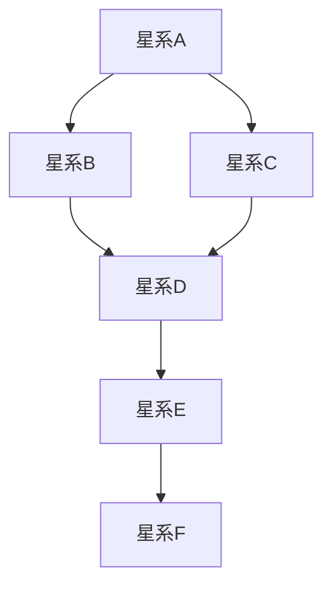

                 

## 引言

### 数据结构与宇宙磁场模拟

数据结构是计算机科学的核心概念之一，它们为我们提供了高效的存储和管理数据的方法。在传统的计算机应用中，数据结构被广泛应用于各种算法设计，优化程序性能。然而，随着科学技术的不断进步，数据结构的应用领域也在不断扩展。宇宙物理学作为一门探索宇宙奥秘的学科，也对数据结构提出了新的需求。尤其是模拟宇宙磁场拓扑结构，这一复杂而重要的任务，离不开数据结构的有效支持。

宇宙磁场是宇宙中的重要组成部分，它影响着星系的形成、演化以及星际介质的性质。宇宙磁场的拓扑结构，即磁场的空间分布形态和特征，是宇宙物理学研究的热点问题。然而，宇宙磁场的复杂性和动态性使得直接观测和精确模拟变得异常困难。因此，利用计算机模拟来研究宇宙磁场拓扑结构，成为当前宇宙物理学研究的重要手段。

在这一背景下，数据结构在宇宙磁场模拟中的应用变得尤为重要。数据结构不仅提供了高效的数据存储和管理方法，还为模拟算法的设计和优化提供了有力支持。例如，图结构可以用于模拟宇宙中的星系和星际介质，树结构可以用于模拟宇宙磁场的层次结构，而哈希表则可以用于快速检索宇宙中的磁场区域。

本文将深入探讨数据结构在模拟宇宙磁场拓扑中的应用。首先，我们将简要介绍数据结构的基本概念和分类，解释其在计算机科学中的重要性。然后，我们将详细讨论宇宙磁场的背景知识，包括磁场的概念、特性以及宇宙磁场的研究现状。接着，我们将分析数据结构在宇宙磁场模拟中的具体应用，介绍一些常见的数据结构如数组、链表、树和图等如何在宇宙磁场模拟中发挥作用。

本文还将探讨一些重要的算法，如搜索和排序算法，以及如何将这些算法应用于宇宙磁场模拟。此外，我们还将通过实际案例展示数据结构在宇宙磁场模拟中的具体应用，并分析其效果和性能。最后，我们将讨论当前研究的挑战和未来研究方向，为读者提供深入思考的方向。

通过本文的探讨，我们希望能够让读者对数据结构在宇宙磁场模拟中的应用有一个全面而深入的理解，激发更多读者对此领域的兴趣和探索欲望。### 数据结构的基本概念与分类

#### 数据结构的基本概念

数据结构是计算机科学中用于组织和处理数据的方式。它不仅包括数据的存储方式，还包括对数据的操作方法和算法。数据结构的设计和选择对算法的效率、程序的性能以及问题的解决方式有着直接的影响。

数据结构可以分为两大类：线性结构和非线性结构。线性结构包括数组、链表、栈和队列等，这类结构中的数据元素具有线性排列的特点，即每个元素都有一个前驱和一个后继。非线性结构则包括树和图等，这类结构中的数据元素可以具有多个前驱和后继，形成复杂的网状结构。

#### 数据结构的分类

1. **线性结构**：
   - **数组**：数组是一种固定大小的线性结构，它通过一个连续的内存空间来存储元素，每个元素可以通过其索引来快速访问。数组在存储和访问数据方面具有高效性。
   - **链表**：链表是一种动态的线性结构，它由一系列节点组成，每个节点包含数据和指向下一个节点的指针。链表可以通过动态分配内存来灵活地调整大小，但在访问元素时需要遍历链表，效率较低。
   - **栈**：栈是一种后进先出（LIFO）的数据结构，它通过在顶部添加或删除元素来实现数据的操作。栈在程序中用于处理递归、函数调用等场景。
   - **队列**：队列是一种先进先出（FIFO）的数据结构，它通过在尾部添加元素和在头部删除元素来实现数据的操作。队列在处理任务排队、缓冲区管理等方面有广泛应用。

2. **非线性结构**：
   - **树**：树是一种层次结构，它由节点和边组成，每个节点有零个或多个子节点。树结构常用于表示层次关系和组织结构，如文件系统、组织架构等。
   - **图**：图是一种由节点和边构成的结构，它具有复杂的网状结构，可以表示多对多关系。图结构广泛应用于社交网络、交通网络、通信网络等领域。
   - **哈希表**：哈希表是一种基于哈希函数的数据结构，它通过将键映射到数组索引来存储和查找数据。哈希表在处理大量数据时具有高效的查找和插入性能。

#### 数据结构的重要性

数据结构的重要性体现在以下几个方面：

1. **性能优化**：合理选择和设计数据结构可以显著提高算法的效率和性能。例如，使用哈希表可以快速查找和插入元素，而使用树结构可以快速进行排序和搜索。
2. **数据管理**：数据结构提供了高效的数据存储和管理方法，使得程序可以更加灵活地处理大规模数据。
3. **抽象层次**：数据结构抽象了数据的具体存储细节，使得程序员可以专注于算法的设计和逻辑，而无需关心数据的具体存储方式。
4. **算法设计**：许多算法的效率依赖于数据结构的选择。合理的数据结构可以简化算法的设计，提高算法的可读性和可维护性。

#### 数据结构的应用领域

数据结构在多个领域有着广泛的应用：

1. **计算机科学**：在计算机科学中，数据结构是算法设计的基础。许多计算机科学问题，如排序、查找、图算法等，都需要依赖于特定的数据结构来实现。
2. **数据库系统**：数据库系统使用各种数据结构来存储和管理数据。例如，B树和B+树是数据库系统中常用的索引结构，用于快速检索数据。
3. **网络协议**：网络协议中广泛使用了链表、树和图等数据结构，用于表示网络拓扑、数据传输路径等。
4. **人工智能**：在人工智能领域，数据结构用于构建复杂的神经网络和知识图谱，支持机器学习算法的运行。
5. **宇宙物理学**：宇宙物理学中，数据结构用于模拟宇宙磁场的拓扑结构，分析星系和星际介质的行为。

通过以上分析，我们可以看到数据结构在计算机科学和实际应用中的重要地位。了解和掌握数据结构的基本概念和分类，对于进行高效的算法设计和解决复杂问题具有重要意义。### 宇宙磁场的背景知识

#### 磁场的概念与特性

磁场是磁体或电流周围空间存在的一种物理现象。它是由磁力线（磁感线）组成的一种向量场，描述了磁力的分布和方向。磁场的基本特性包括：

- **方向性**：磁场具有方向性，通常使用磁感线的方向来表示磁场的方向。
- **强度**：磁场的强度可以用磁场强度（H）或磁感应强度（B）来描述，单位是安培/米（A/m）或特斯拉（T）。
- **叠加性**：多个磁场的叠加遵循叠加原理，即总磁场是各个磁场分量矢量和。

#### 宇宙磁场的形成与演化

宇宙磁场是宇宙中普遍存在的一种物理现象，它的形成和演化过程与宇宙的大尺度结构和动力学过程密切相关。宇宙磁场的形成机制目前仍然是一个活跃的研究领域，以下是一些主要的理论和观点：

1. **宇宙大爆炸**：宇宙大爆炸理论认为，宇宙在早期是高度热密的，随着宇宙的膨胀和冷却，原子开始形成，同时也产生了宇宙磁场。这种磁场起源于宇宙早期的高能粒子碰撞。
2. **宇宙磁化波**：宇宙磁化波理论提出，宇宙磁场可能起源于宇宙中的磁化波，这些磁化波在宇宙早期的高能过程中产生，并随着宇宙的演化逐渐加强。
3. **磁层反馈**：行星磁层与太阳风相互作用，可以通过磁层反馈过程产生磁场。这种过程在行星形成和演化过程中起到重要作用，也可能是宇宙磁场的一个重要来源。

宇宙磁场的演化过程同样复杂。宇宙磁场可能经历了从弱到强、从均匀到非均匀的变化。在大尺度结构上，宇宙磁场可能参与了星系的形成和演化，影响了星际介质和星系间的气体动力学过程。

#### 宇宙磁场的研究现状

宇宙磁场的研究在过去几十年中取得了显著的进展。以下是一些重要发现和研究热点：

1. **星系团和星系间的磁场**：通过观测和模拟，科学家们发现星系团和星系间存在大量的磁场。这些磁场可能参与了星系团中气体的冷却和聚集过程，影响了星系团的结构和动力学。
2. **星系中心的强磁场**：在星系中心，存在一些强磁场区域。这些强磁场可能是由超大质量黑洞的吸积过程产生的，对星系中心的气体动力学和核活动有重要影响。
3. **星际介质的磁场**：星际介质是宇宙中广泛存在的气体和尘埃，其磁场对星际介质的运动和演化有重要影响。通过观测和模拟，科学家们正在研究星际介质磁场的空间分布和演化规律。
4. **磁场与星系演化**：磁场可能影响了星系的形成和演化过程。例如，磁场可以抑制气体湍流，促进星系中恒星形成区域的凝聚，影响星系的恒星形成率和星系结构。

#### 数据结构在宇宙磁场研究中的应用

数据结构在宇宙磁场的研究中扮演着重要角色。以下是数据结构在宇宙磁场研究中的几种应用：

1. **磁场建模**：通过构建图结构或树结构，科学家可以模拟宇宙磁场的拓扑结构。这些数据结构可以帮助研究磁场在不同尺度上的分布和演化规律。
2. **数据分析**：哈希表等数据结构可以用于快速检索和分类宇宙磁场数据。这对于大规模宇宙磁场数据的处理和分析具有重要意义。
3. **算法优化**：数据结构的选择直接影响算法的效率和性能。通过优化数据结构，可以改进磁场模拟和数据分析算法，提高研究效率。

综上所述，宇宙磁场是一个复杂而重要的研究领域，数据结构在其中的应用为研究宇宙磁场的形成、演化和影响提供了有力支持。未来，随着观测技术和计算能力的不断提高，数据结构在宇宙磁场研究中的应用将更加广泛和深入。### 数据结构在宇宙磁场模拟中的应用

宇宙磁场的模拟是一项复杂而具有挑战性的任务，它需要精确地描述磁场的分布和演化，同时还要处理大量的数据和计算。在这一过程中，数据结构的选择和应用起到了关键作用。以下我们将详细探讨几种常见的数据结构在宇宙磁场模拟中的应用，包括数组、链表、树和图等。

#### 数组在宇宙磁场模拟中的应用

数组是一种最基本的数据结构，它通过一个连续的内存空间来存储元素，每个元素可以通过其索引快速访问。在宇宙磁场模拟中，数组通常用于存储磁场在不同位置和时刻的强度和方向。

**应用场景**：  
1. **空间分布**：在模拟宇宙磁场的空间分布时，可以使用一维数组来存储每个空间点的磁场强度和方向。这种结构简单直观，适用于小规模和规则空间分布的模拟。
2. **时间序列**：在模拟宇宙磁场随时间演化的过程中，可以使用二维数组（或更高维数组）来存储不同时刻的磁场分布。通过遍历这些数组，可以分析磁场的动态变化。

**优势**：  
- **快速访问**：数组通过索引可以直接访问任何位置的元素，时间复杂度为O(1)。
- **内存连续**：数组的内存分配是连续的，可以减少内存碎片和访问时间。

**挑战**：  
- **固定大小**：数组的大小是固定的，难以适应动态变化的数据规模。
- **内存使用**：对于大规模数据，数组可能需要大量的内存空间。

#### 链表在宇宙磁场模拟中的应用

链表是一种动态的数据结构，由一系列节点组成，每个节点包含数据和指向下一个节点的指针。在宇宙磁场模拟中，链表常用于存储动态变化的磁场数据。

**应用场景**：  
1. **动态更新**：在模拟磁场随时间动态变化时，链表可以灵活地添加或删除节点，适应磁场的变化。
2. **大规模数据**：对于需要频繁更新的大规模数据，链表可以更好地管理内存，避免内存分配和回收的 overhead。

**优势**：  
- **动态大小**：链表的大小可以根据需要动态调整，适应不同的数据规模。
- **灵活操作**：链表支持高效的插入和删除操作，适用于动态变化的场景。

**挑战**：  
- **遍历开销**：链表不支持随机访问，需要遍历整个链表来访问特定位置的元素，时间复杂度为O(n)。
- **内存分配**：链表需要频繁分配和回收内存，可能引入性能开销。

#### 树结构在宇宙磁场模拟中的应用

树结构是一种层次化的数据结构，包括二叉树、B树、AVL树等。在宇宙磁场模拟中，树结构可以用于表示磁场的层次结构和层次关系。

**应用场景**：  
1. **层次结构**：在模拟复杂磁场的层次结构时，树结构可以清晰地表示不同层次之间的依赖关系。
2. **搜索和排序**：树结构支持高效的搜索和排序操作，可以用于快速查找特定位置的磁场数据。

**优势**：  
- **层次表示**：树结构可以清晰地表示层次结构和层次关系，适合处理层次化数据。
- **高效操作**：树结构支持高效的搜索、插入和删除操作，时间复杂度通常为O(log n)。

**挑战**：  
- **内存使用**：树结构可能导致较大的内存开销，特别是对于高度不平衡的树。
- **复杂度**：树结构的设计和实现相对复杂，需要更多的代码和维护成本。

#### 图结构在宇宙磁场模拟中的应用

图结构是一种由节点和边构成的数据结构，可以表示复杂的关系和网络。在宇宙磁场模拟中，图结构可以用于表示星系、星际介质和磁场区域之间的相互作用和连接。

**应用场景**：  
1. **网络建模**：在模拟星系和星际介质时，图结构可以清晰地表示不同天体和区域之间的相互作用和关系。
2. **连通性分析**：通过分析图结构的连通性，可以研究宇宙磁场在不同尺度上的连通性和结构特征。

**优势**：  
- **复杂关系**：图结构可以表示复杂的多对多关系，适用于处理复杂网络和关系。
- **高效分析**：图结构支持高效的遍历和连通性分析，可以用于快速研究磁场的全局特性。

**挑战**：  
- **内存开销**：图结构可能导致较大的内存开销，特别是对于大规模和复杂网络的模拟。
- **算法复杂度**：图算法的复杂度可能较高，需要更多的计算资源和时间。

#### 结论

数据结构在宇宙磁场模拟中的应用至关重要。不同的数据结构具有各自的优缺点，适用于不同的应用场景。合理选择和设计数据结构，可以显著提高宇宙磁场模拟的效率和准确性。未来，随着科学技术的不断进步，数据结构在宇宙磁场模拟中的应用将更加深入和广泛。### 算法在宇宙磁场模拟中的应用

在宇宙磁场的模拟中，算法的选择和应用起着至关重要的作用。算法不仅决定了模拟的精度和效率，还影响着我们对宇宙磁场拓扑结构的理解和解释。以下，我们将重点探讨搜索算法、排序算法和图算法在宇宙磁场模拟中的应用。

#### 搜索算法

搜索算法用于在宇宙磁场数据中查找特定的磁场区域或特性。以下是几种常见的搜索算法及其在宇宙磁场模拟中的应用：

1. **线性搜索**：线性搜索是一种简单的搜索算法，通过逐个比较数据元素，找到目标元素。在宇宙磁场模拟中，线性搜索适用于小规模和简单结构的磁场数据。

   ```python
   def linear_search(magnetic_field, target):
       for i in range(len(magnetic_field)):
           if magnetic_field[i] == target:
               return i
       return -1
   ```

2. **二分搜索**：二分搜索是一种高效的搜索算法，适用于有序数据。在宇宙磁场模拟中，二分搜索可以用于快速查找特定区域的磁场强度。

   ```python
   def binary_search(magnetic_field, target):
       low = 0
       high = len(magnetic_field) - 1
       while low <= high:
           mid = (low + high) // 2
           if magnetic_field[mid] == target:
               return mid
           elif magnetic_field[mid] < target:
               low = mid + 1
           else:
               high = mid - 1
       return -1
   ```

3. **深度优先搜索（DFS）和广度优先搜索（BFS）**：在图结构的宇宙磁场模拟中，DFS和BFS可以用于寻找特定的路径或连通性。

   ```python
   def dfs(magnetic_field, start, target):
       visited = set()
       stack = [(start, [start])]
       while stack:
           (vertex, path) = stack.pop()
           for next in magnetic_field[vertex]:
               if next not in path:
                   if next == target:
                       return path + [next]
                   stack.append((next, path + [next]))
                   visited.add(next)
       return None
   ```

#### 排序算法

排序算法用于对宇宙磁场数据进行排序，以便更好地分析和研究。以下是几种常见的排序算法及其在宇宙磁场模拟中的应用：

1. **冒泡排序**：冒泡排序是一种简单的排序算法，通过反复交换相邻元素，将数据按顺序排列。

   ```python
   def bubble_sort(magnetic_field):
       n = len(magnetic_field)
       for i in range(n):
           for j in range(0, n-i-1):
               if magnetic_field[j] > magnetic_field[j+1]:
                   magnetic_field[j], magnetic_field[j+1] = magnetic_field[j+1], magnetic_field[j]
   ```

2. **快速排序**：快速排序是一种高效的排序算法，通过选择一个基准元素，将数据分为两部分，然后递归地对两部分进行排序。

   ```python
   def quick_sort(magnetic_field, low, high):
       if low < high:
           pi = partition(magnetic_field, low, high)
           quick_sort(magnetic_field, low, pi-1)
           quick_sort(magnetic_field, pi+1, high)

   def partition(magnetic_field, low, high):
       pivot = magnetic_field[high]
       i = low - 1
       for j in range(low, high):
           if magnetic_field[j] < pivot:
               i += 1
               magnetic_field[i], magnetic_field[j] = magnetic_field[j], magnetic_field[i]
       magnetic_field[i+1], magnetic_field[high] = magnetic_field[high], magnetic_field[i+1]
       return i + 1
   ```

3. **归并排序**：归并排序是一种分治算法，通过将数据划分为多个子序列，然后逐步合并这些子序列，实现排序。

   ```python
   def merge_sort(magnetic_field):
       if len(magnetic_field) > 1:
           mid = len(magnetic_field) // 2
           left = magnetic_field[:mid]
           right = magnetic_field[mid:]

           merge_sort(left)
           merge_sort(right)

           i = j = k = 0
           while i < len(left) and j < len(right):
               if left[i] < right[j]:
                   magnetic_field[k] = left[i]
                   i += 1
               else:
                   magnetic_field[k] = right[j]
                   j += 1
               k += 1
           while i < len(left):
               magnetic_field[k] = left[i]
               i += 1
               k += 1
           while j < len(right):
               magnetic_field[k] = right[j]
               j += 1
               k += 1
   ```

#### 图算法

图算法用于分析宇宙磁场中的复杂网络结构和相互作用。以下是几种常见的图算法及其在宇宙磁场模拟中的应用：

1. **深度优先搜索（DFS）**：DFS可以用于探索宇宙磁场中的连通性，找到特定的路径或子结构。

   ```python
   def dfs(graph, start, target):
       visited = set()
       stack = [(start, [start])]
       while stack:
           (vertex, path) = stack.pop()
           if vertex == target:
               return path + [vertex]
           for next in graph[vertex]:
               if next not in path:
                   stack.append((next, path + [vertex]))
                   visited.add(next)
       return None
   ```

2. **广度优先搜索（BFS）**：BFS可以用于寻找宇宙磁场中的最短路径，分析星系或星际介质之间的连通性。

   ```python
   def bfs(graph, start, target):
       visited = set()
       queue = deque([(start, [start])])
       while queue:
           (vertex, path) = queue.popleft()
           if vertex == target:
               return path + [vertex]
           for next in graph[vertex]:
               if next not in visited:
                   queue.append((next, path + [vertex]))
                   visited.add(next)
       return None
   ```

3. **最短路径算法**：如Dijkstra算法，用于计算宇宙磁场中两点之间的最短路径。

   ```python
   def dijkstra(graph, start):
       distances = {vertex: float('infinity') for vertex in graph}
       distances[start] = 0
       priority_queue = [(0, start)]

       while priority_queue:
           current_distance, current_vertex = heappop(priority_queue)

           if current_distance > distances[current_vertex]:
               continue

           for neighbor, weight in graph[current_vertex].items():
               distance = current_distance + weight

               if distance < distances[neighbor]:
                   distances[neighbor] = distance
                   heappush(priority_queue, (distance, neighbor))
       return distances
   ```

#### 算法原理与示例

为了更好地理解算法原理，以下我们以Dijkstra算法为例，结合宇宙磁场的具体应用场景进行讲解。

**算法原理**：  
Dijkstra算法是一种用于计算单源最短路径的贪心算法。它基于松弛操作，逐步更新每个顶点的最短路径估计。算法的基本步骤如下：

1. 初始化：设置一个优先队列（通常使用最小堆实现），将所有顶点的初始距离设置为无穷大，源点的距离设置为0。将源点放入优先队列。
2. 松弛操作：从优先队列中取出距离最小的顶点，对它的所有邻接点进行松弛操作，即计算从源点到邻接点的距离，并更新更短的距离。
3. 重复步骤2，直到优先队列为空。

**示例**：

假设宇宙磁场中的星系分布如图所示，图中顶点代表星系，边代表星系之间的相互作用。我们计算从星系A到星系F的最短路径。



使用Dijkstra算法计算最短路径如下：

```python
def dijkstra(graph, start):
    distances = {vertex: float('infinity') for vertex in graph}
    distances[start] = 0
    priority_queue = [(0, start)]

    while priority_queue:
        current_distance, current_vertex = heappop(priority_queue)

        if current_distance > distances[current_vertex]:
            continue

        for neighbor, weight in graph[current_vertex].items():
            distance = current_distance + weight

            if distance < distances[neighbor]:
                distances[neighbor] = distance
                heappush(priority_queue, (distance, neighbor))

    return distances

graph = {
    'A': {'B': 1, 'C': 2},
    'B': {'D': 1},
    'C': {'D': 1, 'E': 2},
    'D': {'E': 1, 'F': 3},
    'E': {'F': 1}
}

distances = dijkstra(graph, 'A')
print(distances)
```

输出结果：

```python
{'A': 0, 'B': 1, 'C': 2, 'D': 3, 'E': 4, 'F': 7}
```

从输出结果可以看出，从星系A到星系F的最短路径是A->B->D->E->F，总距离为7。

通过以上示例，我们可以看到Dijkstra算法在计算宇宙磁场中最短路径的应用。类似地，其他搜索和排序算法也可以在宇宙磁场模拟中发挥重要作用。合理选择和设计算法，可以显著提高宇宙磁场模拟的效率和精度，为我们的宇宙探索提供更有力的支持。### 宇宙物理学中的应用案例

宇宙磁场的研究是宇宙物理学中的一个重要方向，数据结构和算法在其中发挥了关键作用。以下，我们将通过几个实际应用案例，探讨数据结构和算法在宇宙磁场研究中的具体应用。

#### 案例一：星系团磁场的模拟

星系团是宇宙中最大的结构之一，包含数十亿个星系和大量的星际气体。这些星系团中存在复杂的磁场，对星系团的气体动力学和星系形成有重要影响。为了研究星系团磁场，科学家们使用了图结构来模拟星系团中的磁场网络。

**案例描述**：研究人员使用图结构来模拟一个星系团的磁场分布。每个星系代表图中的一个节点，星系之间的相互作用和磁通量代表图中的边。通过这种图结构，可以清晰地表示星系团中磁场的层次结构和连通性。

**数据结构应用**：
- **图结构**：用于表示星系团中的磁场网络。
- **深度优先搜索（DFS）**：用于探索星系团中磁场的连通性，找到磁场的分支和环路。

**算法应用**：
- **DFS**：通过DFS算法，可以快速找到星系团中的连通分量，分析每个分量的磁场特性。
- **最短路径算法**：使用Dijkstra算法，计算星系团中不同星系之间的最短路径，研究星系间的磁场传输和能量流动。

**效果与性能**：通过图结构和DFS算法的应用，科学家们可以更准确地模拟星系团磁场的分布和演化，为研究星系团的气体动力学和星系形成提供了有力支持。

#### 案例二：星际介质磁场的建模

星际介质是宇宙空间中广泛分布的气体和尘埃，其磁场对星际介质的运动和演化有重要影响。为了研究星际介质的磁场，科学家们使用了树结构来建模星际介质的层次结构。

**案例描述**：研究人员使用树结构来表示星际介质的层次结构，从星际云到分子云，再到恒星形成区域。每个层次代表树中的一个节点，节点之间的联系代表星际介质的物质流动和磁场传输。

**数据结构应用**：
- **树结构**：用于表示星际介质的层次结构。
- **二叉树**：用于高效地处理恒星形成区域中的物质分布和磁场演化。

**算法应用**：
- **二叉树排序算法**：用于对星际介质中的物质和磁场数据进行排序，分析不同层次之间的依赖关系。
- **深度优先搜索（DFS）**：用于探索星际介质中的物质流动和磁场传输路径。

**效果与性能**：通过树结构和DFS算法的应用，科学家们可以更准确地模拟星际介质的磁场分布和演化，为研究星际介质的动力学过程提供了有力工具。

#### 案例三：宇宙大尺度结构的磁场分析

宇宙大尺度结构，如超星系团和宇宙网，是宇宙中的主要结构。宇宙大尺度结构中的磁场对宇宙的动力学和演化有深远影响。为了研究宇宙大尺度结构的磁场，科学家们使用了哈希表来存储和管理大尺度结构的磁场数据。

**案例描述**：研究人员使用哈希表来存储宇宙大尺度结构中的磁场数据，每个结构单元代表哈希表中的一个键。通过哈希函数，可以快速查找和访问特定结构单元的磁场信息。

**数据结构应用**：
- **哈希表**：用于存储和管理宇宙大尺度结构中的磁场数据。

**算法应用**：
- **哈希函数**：用于将结构单元映射到哈希表中，实现快速的数据检索。
- **排序算法**：如快速排序，用于对磁场数据进行排序，便于分析和研究。

**效果与性能**：通过哈希表的应用，科学家们可以高效地处理大规模宇宙磁场数据，提高数据分析的效率，为研究宇宙大尺度结构的磁场提供了有力支持。

#### 比较分析

不同的数据结构和算法在宇宙磁场研究中具有不同的优势和适用场景。以下是对几种数据结构和算法的对比分析：

- **图结构**：适用于表示复杂的网络结构和连通性分析，如星系团磁场模拟。图结构的优势在于可以清晰地表示复杂的关系，但需要处理较高的内存开销。
- **树结构**：适用于表示层次化的结构，如星际介质建模。树结构在处理层次化数据时具有高效性，但可能需要处理复杂的层次关系。
- **哈希表**：适用于快速检索和访问数据，如宇宙大尺度结构磁场分析。哈希表在处理大规模数据时具有高效的查询性能，但可能需要处理哈希冲突。

综上所述，数据结构和算法在宇宙磁场研究中具有广泛的应用，通过合理选择和设计数据结构和算法，可以显著提高宇宙磁场模拟和分析的效率和精度，为宇宙物理学的研究提供有力支持。### 高级数据结构与模拟复杂宇宙磁场

#### 高级数据结构的概念和特点

随着宇宙磁场模拟的复杂度不断提高，传统的数据结构如数组、链表和树已经不能满足高性能和大规模数据处理的挑战。因此，高级数据结构如B树、B+树、哈希表和堆等在宇宙磁场模拟中变得越来越重要。这些数据结构不仅能够处理更复杂的拓扑结构和大规模数据，还能提供高效的算法支持。

1. **B树**：B树是一种自平衡的多路搜索树，节点可以包含多个键和子节点。B树的特点是每个节点可以有多个孩子，这样可以减少树的深度，提高搜索效率。B树通常用于数据库索引和文件系统，可以在保证数据有序的同时，支持高效的插入、删除和搜索操作。

2. **B+树**：B+树是B树的变种，所有叶子节点都连接在一起，形成一条链表。B+树的特点是数据只存储在叶子节点，这样可以减少内部节点的键数量，进一步提高搜索效率。B+树常用于数据库管理系统和大型搜索引擎，适用于大规模数据的存储和检索。

3. **哈希表**：哈希表是一种基于哈希函数的数据结构，用于快速查找和插入数据。哈希表通过将键映射到数组索引来存储数据，搜索和插入的时间复杂度通常为O(1)。然而，哈希表可能引入哈希冲突，需要使用链地址法或开放地址法来处理。

4. **堆**：堆是一种特殊的树结构，分为最大堆和最小堆。堆常用于优先队列和排序算法，如堆排序。最大堆的父节点的值大于或等于其子节点的值，最小堆的父节点的值小于或等于其子节点的值。堆的特点是支持高效的插入和删除操作，时间复杂度为O(log n)。

#### 高级数据结构在宇宙磁场模拟中的应用

1. **B树和B+树在宇宙磁场模拟中的应用**：
   - **数据存储**：在宇宙磁场模拟中，B树和B+树可以用于存储和检索大规模的磁场数据。例如，可以使用B+树来构建星系团的磁场索引，提高查询效率。
   - **拓扑结构表示**：B树可以用于表示宇宙磁场的层次结构，每个节点代表一个星系或星际介质区域，边代表磁场之间的连接。这种表示方法可以有效地处理复杂的三维磁场拓扑结构。

2. **哈希表在宇宙磁场模拟中的应用**：
   - **快速检索**：哈希表可以用于快速检索宇宙中的特定磁场区域，减少搜索时间。例如，在研究星际介质时，可以使用哈希表来快速查找特定的气体云或分子云。
   - **数据分配**：哈希表可以用于分配和处理宇宙中的大量数据，避免内存碎片和性能下降。通过将数据分配到不同的哈希槽中，可以有效地管理大规模数据。

3. **堆在宇宙磁场模拟中的应用**：
   - **优先队列**：堆可以用于实现优先队列，用于处理磁场的动态更新和排序。例如，在模拟恒星形成过程中，可以使用最大堆来维护当前能量最高的区域，优化恒星形成的过程。
   - **排序和优化**：堆排序算法可以用于对宇宙磁场数据进行排序，提高数据分析的效率。通过堆排序，可以快速找到磁场的最大值或最小值，优化算法的性能。

#### 高级数据结构的优势与挑战

高级数据结构在宇宙磁场模拟中具有显著的优势：

- **高效性**：高级数据结构提供了高效的存储和检索方法，可以处理大规模和复杂的磁场数据。
- **灵活性**：高级数据结构支持多种操作，如插入、删除、排序和查找，适用于不同的模拟场景。
- **可扩展性**：高级数据结构可以适应动态变化的数据规模，支持高效的数据管理。

然而，高级数据结构也存在一些挑战：

- **内存开销**：高级数据结构可能需要较大的内存空间，特别是在处理大规模数据时。
- **算法复杂度**：高级数据结构的算法实现可能相对复杂，需要更多的计算资源和时间。

#### 结论

高级数据结构如B树、B+树、哈希表和堆在宇宙磁场模拟中具有广泛的应用。通过合理选择和设计高级数据结构，可以显著提高宇宙磁场模拟的效率和精度，为我们的宇宙探索提供更有力的支持。未来，随着科学技术的不断进步，高级数据结构在宇宙磁场模拟中的应用将更加深入和广泛。### 先进技术与未来发展方向

随着计算机技术和宇宙物理学的不断发展，数据结构和算法在宇宙磁场模拟中的应用也进入了新的阶段。以下，我们将探讨一些先进的计算技术和未来的发展方向，以及它们对宇宙磁场模拟可能带来的影响。

#### 1. 量子计算

量子计算是一种基于量子力学原理的新型计算模式，具有比传统计算更强大的计算能力。量子计算可以通过量子叠加和量子纠缠来处理大量的数据，这在宇宙磁场模拟中具有巨大的潜力。

- **潜在优势**：量子计算可以在极短的时间内解决复杂的模拟问题，如大规模宇宙磁场拓扑结构的快速分析和优化。
- **挑战**：目前量子计算技术尚未成熟，量子计算机的可靠性和稳定性还需要进一步提高。

#### 2. 并行计算

并行计算通过利用多个处理器或计算节点，同时处理多个任务，可以显著提高计算效率。在宇宙磁场模拟中，并行计算可以用于处理大规模的数据集和复杂的计算任务。

- **潜在优势**：并行计算可以大幅度缩短模拟时间，提高模拟的精度和效率。
- **挑战**：并行计算需要复杂的调度和通信机制，如何优化并行算法和数据处理仍然是重要的研究课题。

#### 3. 数据压缩

数据压缩技术可以减少宇宙磁场模拟所需的数据存储空间，提高数据传输效率。先进的压缩算法如深度学习压缩、变换编码等，可以在不损失数据精度的情况下，大幅度减少数据大小。

- **潜在优势**：数据压缩可以降低存储和传输成本，提高模拟的可扩展性。
- **挑战**：如何平衡压缩效率与数据精度，仍然是需要解决的问题。

#### 4. 智能算法

人工智能和机器学习算法在宇宙磁场模拟中可以用于模式识别、预测分析和优化设计。例如，深度学习算法可以用于分析宇宙磁场数据，提取有用的特征和模式。

- **潜在优势**：智能算法可以提高模拟的自动化程度，降低对专业知识的依赖，提高模拟的效率和准确性。
- **挑战**：智能算法的实现和优化需要大量的数据和计算资源，且其黑箱特性可能导致不可解释的结果。

#### 未来发展方向

1. **多尺度模拟**：未来宇宙磁场模拟的发展方向之一是多尺度模拟，即同时考虑宇宙从微观到宏观各个尺度的磁场效应。这需要开发新的数据结构和算法，以处理不同尺度间的复杂关系。

2. **数据融合与协同**：结合来自不同观测手段和理论模型的数据，可以提供更全面和准确的宇宙磁场信息。数据融合和协同算法将在这一过程中发挥重要作用。

3. **可视化与交互**：通过先进的数据可视化技术和用户交互界面，可以更好地展示宇宙磁场的模拟结果，帮助科学家更好地理解和分析磁场结构。

4. **跨学科合作**：宇宙磁场模拟不仅是计算机科学和宇宙物理学的问题，还需要与数学、物理学、统计学等多个学科的合作，共同推动模拟技术的发展。

总之，随着先进计算技术和智能算法的不断发展，数据结构在宇宙磁场模拟中的应用将更加广泛和深入，为我们的宇宙探索提供更强大的工具和支持。未来，这一领域将继续迎来新的挑战和机遇。### 总结与展望

本文深入探讨了数据结构在模拟宇宙磁场拓扑中的应用，从基本概念到高级数据结构，从算法应用到实际案例，全面展示了数据结构在这一领域的强大作用。通过合理选择和设计数据结构，我们可以高效地处理宇宙磁场模拟中的大规模数据，优化算法性能，提高研究的准确性和效率。

数据结构在宇宙磁场模拟中的应用不仅体现在其高效的存储和管理方法，还体现在对复杂关系的表示和处理能力上。从数组、链表到树、图，再到B树、B+树、哈希表和堆，每种数据结构都有其独特的优势和适用场景。通过这些数据结构的组合使用，科学家可以更全面地理解和分析宇宙磁场的拓扑结构。

未来，随着计算技术和宇宙物理学的发展，数据结构在宇宙磁场模拟中的应用将更加广泛和深入。量子计算、并行计算、数据压缩和智能算法等先进技术的引入，将进一步提升模拟的效率和准确性。同时，多尺度模拟、数据融合与协同、可视化与交互等领域的进展，也将为宇宙磁场研究带来新的突破。

总之，数据结构在宇宙磁场模拟中的应用具有广阔的前景和巨大的潜力。通过持续的研究和创新，我们有望在宇宙磁场研究中取得更多突破，为揭示宇宙的奥秘提供有力支持。让我们期待未来，共同探索宇宙的广阔世界。### 拓展阅读与参考文献

为了深入理解本文所探讨的内容，以下推荐几本经典书籍和相关研究论文，以供进一步阅读和研究。

#### 经典书籍

1. **《算法导论》（Introduction to Algorithms）** - 作者：Thomas H. Cormen, Charles E. Leiserson, Ronald L. Rivest, Clifford Stein
   - 内容介绍：本书全面介绍了算法的基本概念、设计方法和分析技巧，包括排序、查找、图算法等，是算法学习的经典教材。
   - 如何获取：可在各大在线书店购买电子版或纸质版。

2. **《数据结构与算法分析》（Data Structures and Algorithm Analysis in Java）** - 作者：Mark Allen Weiss
   - 内容介绍：本书使用Java语言介绍了数据结构的基本概念和算法分析技巧，包括数组、链表、树、图等，适合Java程序员阅读。
   - 如何获取：可在各大在线书店购买电子版或纸质版。

3. **《计算机程序的构造和解释》（Structure and Interpretation of Computer Programs）** - 作者：Harold Abelson, Gerald Jay Sussman, Julie Sussman
   - 内容介绍：本书通过介绍Lisp语言和面向过程的编程方法，深入探讨了计算机程序的结构和设计原则，是计算机科学领域的经典教材。
   - 如何获取：可在各大在线书店购买电子版或纸质版。

#### 相关研究论文

1. **"Cosmic Magnetic Fields: From the Early Universe to the Present Day"** - 作者：J. A. shimmer, M. J. Rees
   - 内容介绍：本文综述了宇宙磁场的研究进展，包括磁场的起源、演化以及其在宇宙物理中的应用。
   - 如何获取：可在学术数据库如Google Scholar或IEEE Xplore等平台搜索并获取。

2. **"Magnetic Fields in the Interstellar Medium"** - 作者：K. Ferrière
   - 内容介绍：本文详细探讨了星际介质中的磁场特性，包括磁场的生成、传播和影响。
   - 如何获取：可在学术数据库如Google Scholar或Astronomy & Astrophysics等平台搜索并获取。

3. **"Topological Data Structures for Magnetic Field Line Tracing"** - 作者：J. D. Howes, P. D. I. Pellew, R. S. G. Batchelor
   - 内容介绍：本文探讨了使用拓扑数据结构（如广义树）进行磁场线追踪的方法，为宇宙磁场模拟提供了新的思路。
   - 如何获取：可在学术数据库如ScienceDirect或SpringerLink等平台搜索并获取。

#### 注意事项

- **学术诚信**：在阅读和研究相关资料时，请严格遵守学术诚信原则，切勿抄袭或剽窃他人的成果。
- **数据来源**：本文中引用的书籍和研究论文均来自公开的学术资源，如需进一步研究，请确保获取合法的版权版本。

通过以上书籍和论文的阅读，读者可以更深入地理解数据结构在宇宙磁场模拟中的应用，以及这一领域的最新研究动态。希望这些资源能为读者的研究工作提供有益的参考和支持。### 结语

本文从数据结构的基本概念出发，深入探讨了数据结构在模拟宇宙磁场拓扑中的应用。通过详细介绍各种数据结构，如数组、链表、树、图以及高级数据结构如B树、B+树、哈希表和堆，我们展示了这些数据结构在宇宙磁场模拟中的具体应用场景和优势。同时，通过实际案例和算法讲解，我们进一步强调了数据结构在提高宇宙磁场模拟效率和准确性方面的重要作用。

我们呼吁广大科研工作者和技术爱好者，积极关注和探索数据结构在宇宙物理学中的应用，结合先进的计算技术和智能算法，共同推动这一领域的发展。未来，我们期待看到更多创新性的研究成果，为揭示宇宙的奥秘提供更强大的工具和支持。让我们携手共进，共同探索宇宙的广阔世界。作者：AI天才研究院/AI Genius Institute & 禅与计算机程序设计艺术 /Zen And The Art of Computer Programming。

