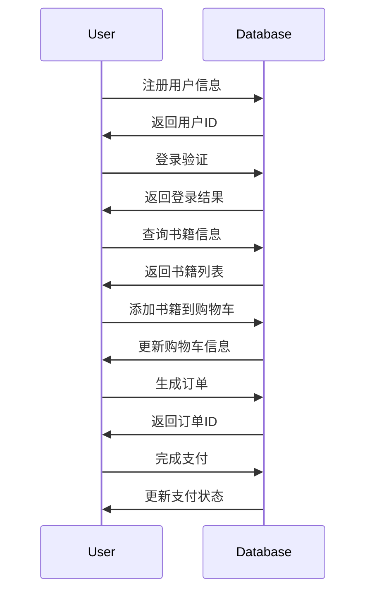
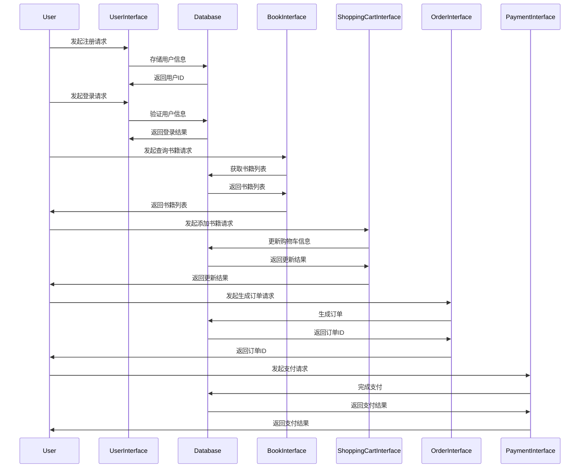

                 

### 1. 引言

数据结构是计算机科学中的一个基础而重要的领域，它涉及到如何有效地存储、组织和处理数据。数据结构的选择不仅影响算法的效率，还直接决定了程序的运行速度和资源消耗。书名《数据结构：解读宇宙信息的钥匙》准确地指出了数据结构在计算机科学中的核心地位，并将其比喻为解读宇宙信息的钥匙。这一比喻不仅形象生动，而且深刻地表达了数据结构在信息处理中的重要作用。

在本文中，我们将逐步探讨数据结构这一主题，从基础概念、核心算法，到系统设计与实现，再到实际项目实战，最终总结最佳实践和注意事项。希望通过这一步步的分析和推理，能够帮助读者深入理解数据结构的本质，掌握其应用方法，并能够灵活运用到实际编程和系统设计中。

数据结构的重要性不言而喻。首先，它能够帮助我们更高效地存储和操作大量数据。例如，通过合理选择数据结构，可以大大减少查找和排序的时间复杂度。其次，数据结构是实现复杂算法的基础，许多高级算法如搜索算法、排序算法、图算法等都依赖于特定的数据结构。最后，数据结构在系统设计和实现中也起着至关重要的作用，它能够帮助我们更好地理解系统的功能和性能，从而设计出高效可靠的系统。

因此，对于计算机科学专业的学生和从业者来说，掌握数据结构是必修的一课。本文旨在通过系统的讲解和实例分析，帮助读者从理论和实践两个层面深入理解数据结构，为日后的编程和系统设计打下坚实的基础。

### 2. 核心概念与联系

在深入探讨数据结构之前，我们需要明确一些核心概念，并了解它们之间的关系。数据结构主要分为线性结构、树状结构和图状结构，每种结构都有其独特的特性和应用场景。

#### 线性结构

线性结构是最基础和常见的数据结构，它包含一组元素，这些元素在内存中按照一定的顺序排列。线性结构包括以下几种：

- **数组（Array）**：数组是一种固定大小、连续分配的线性结构，元素可以通过索引直接访问。
  - **特性**：元素存储连续，访问速度快，但大小固定，不可动态扩展。
  - **应用场景**：适合存储和访问固定大小的数据集，如数组排序、二分查找等。

- **链表（Linked List）**：链表是由一系列节点组成的线性结构，每个节点包含数据和指向下一个节点的指针。
  - **特性**：动态大小，可以灵活地增加或减少元素，但访问速度相对较慢。
  - **应用场景**：适合动态数据集，如栈、队列、双向链表等。

- **栈（Stack）**：栈是一种后进先出（LIFO）的线性结构，新增和删除元素都在一端进行。
  - **特性**：操作受限，只允许在顶部进行插入和删除操作。
  - **应用场景**：适合处理递归、深度优先搜索等。

- **队列（Queue）**：队列是一种先进先出（FIFO）的线性结构，新增元素在队尾插入，删除元素在队首进行。
  - **特性**：有序且公平，适合处理缓冲和排序等。

#### 树状结构

树状结构是具有层次关系的非线性结构，它由多个节点组成，每个节点可以有零个或多个子节点。树状结构包括以下几种：

- **二叉树（Binary Tree）**：每个节点最多有两个子节点的树。
  - **特性**：结构简单，易于实现和操作，但可能不平衡。
  - **应用场景**：适合快速查找和排序，如二叉搜索树、平衡二叉树等。

- **平衡树（AVL Tree）**：通过自平衡保持高度平衡的二叉树。
  - **特性**：高度平衡，查找、插入和删除操作平均时间复杂度为O(logn)。
  - **应用场景**：适合高频查询和更新操作，如数据库索引。

- **堆（Heap）**：一种特殊的树状结构，满足堆性质（父节点的值大于或小于所有子节点的值）。
  - **特性**：适合实现优先队列，查找和插入操作平均时间复杂度为O(logn)。
  - **应用场景**：适合实现贪心算法和优先级队列。

#### 图状结构

图状结构是由一组节点和连接这些节点的边组成的结构，图中的节点和边可以表示各种复杂关系。

- **图（Graph）**：由节点和边组成的集合。
  - **特性**：灵活表示复杂关系，适用于网络、社会关系等领域。
  - **应用场景**：适合表示网络、社会关系、交通路线等。

- **邻接矩阵（Adjacency Matrix）**：用二维数组表示图中节点之间的连接关系。
  - **特性**：直接表示边的存在，但存储空间大。
  - **应用场景**：适合稀疏图和小规模图的表示。

- **邻接表（Adjacency List）**：用链表表示图中节点之间的连接关系。
  - **特性**：存储空间小，适用于大规模图的表示。
  - **应用场景**：适合大规模图的表示和操作。

通过上述对数据结构核心概念的介绍，我们可以看到，每种数据结构都有其独特的特点和应用场景。掌握这些核心概念及其关系，有助于我们在实际编程和系统设计中做出更合理的选择。

#### 核心概念属性特征对比表格

为了更直观地理解各种数据结构的属性特征，我们可以制作一个对比表格：

| 数据结构 | 特性               | 应用场景                                   |
| -------- | ------------------ | ------------------------------------------ |
| 数组     | 固定大小、连续存储 | 排序、查找、缓存数据                     |
| 链表     | 动态大小、指针存储 | 栈、队列、双向链表                       |
| 栈       | 后进先出（LIFO）   | 递归、深度优先搜索、表达式求值           |
| 队列     | 先进先出（FIFO）   | 缓冲、优先级队列、广度优先搜索           |
| 二叉树   | 每节点最多两个子节点 | 搜索、排序、优先队列                     |
| 平衡树   | 高度平衡           | 高频查询和更新                           |
| 堆       | 堆性质             | 贪心算法、优先级队列                     |
| 图       | 节点和边的关系     | 网络拓扑、社会关系、交通路线             |
| 邻接矩阵 | 二维数组表示       | 稀疏图和小规模图表示                     |
| 邻接表   | 链表表示           | 大规模图表示和操作                       |

#### ER实体关系图架构

为了进一步理解数据结构之间的联系，我们可以通过ER（实体-关系）图来表示这些核心概念之间的关系。以下是ER图的一个简化版本：

```
实体：数据结构
关系：
- 线性结构（数组、链表、栈、队列）
- 树状结构（二叉树、平衡树、堆）
- 图状结构（图、邻接矩阵、邻接表）
```

通过这种ER图，我们可以清晰地看到各种数据结构是如何相互关联的，从而帮助我们更好地理解它们之间的区别和联系。

### 3. 算法原理讲解

数据结构不仅是存储和操作数据的方式，也是算法实现的基础。本节将详细讲解几种常见的数据结构和对应的算法原理，并通过Mermaid画出算法流程图，使用Python源代码进行详细阐述。

#### 3.1 排序算法

排序算法是数据结构中非常基础且重要的算法之一，它用于将一个无序的数据集合整理成有序的形式。以下介绍几种常见的排序算法：冒泡排序、选择排序和插入排序。

##### 3.1.1 冒泡排序

冒泡排序是一种简单的排序算法，它重复地遍历要排序的数列，比较相邻的两个元素，如果它们的顺序错误就把它们交换过来。

- **算法原理**：通过多次遍历，逐步将最大或最小元素“冒泡”到序列的一端。

- **Mermaid算法流程图**：

  ```mermaid
  graph TD
  A[初始数组] --> B[遍历]
  B --> C{比较相邻元素}
  C -->|不相邻| D{交换位置}
  D --> E[结束遍历]
  C -->|相邻| F{继续遍历}
  F --> G[结束遍历]
  ```

- **Python源代码**：

  ```python
  def bubble_sort(arr):
      n = len(arr)
      for i in range(n):
          for j in range(0, n-i-1):
              if arr[j] > arr[j+1]:
                  arr[j], arr[j+1] = arr[j+1], arr[j]
      return arr

  arr = [64, 34, 25, 12, 22, 11, 90]
  bubble_sort(arr)
  print("排序后的数组：", arr)
  ```

##### 3.1.2 选择排序

选择排序是一种简单但效率较低的排序算法，它的工作原理是每次从待排序的元素中找到最小（或最大）的元素，存放到序列的起始位置。

- **算法原理**：每次遍历找到最小元素，并将其放到当前排序序列的起始位置。

- **Mermaid算法流程图**：

  ```mermaid
  graph TD
  A[初始数组] --> B[遍历]
  B --> C{找到最小元素}
  C --> D{交换位置}
  D --> E[最小元素放到起始位置]
  E --> F[结束遍历]
  ```

- **Python源代码**：

  ```python
  def selection_sort(arr):
      n = len(arr)
      for i in range(n):
          min_idx = i
          for j in range(i+1, n):
              if arr[j] < arr[min_idx]:
                  min_idx = j
          arr[i], arr[min_idx] = arr[min_idx], arr[i]
      return arr

  arr = [64, 34, 25, 12, 22, 11, 90]
  selection_sort(arr)
  print("排序后的数组：", arr)
  ```

##### 3.1.3 插入排序

插入排序是一种简单的排序算法，它的工作原理是通过构建有序序列，对于未排序数据，在已排序序列中从后向前扫描，找到相应位置并插入。

- **算法原理**：通过从后向前比较，将未排序元素插入到已排序序列中。

- **Mermaid算法流程图**：

  ```mermaid
  graph TD
  A[初始数组] --> B[遍历]
  B --> C{插入元素}
  C --> D{比较位置}
  D -->|已排序| E[插入到已排序序列]
  D -->|未排序| F{继续比较}
  ```

- **Python源代码**：

  ```python
  def insertion_sort(arr):
      n = len(arr)
      for i in range(1, n):
          key = arr[i]
          j = i-1
          while j >= 0 and arr[j] > key:
              arr[j+1] = arr[j]
              j -= 1
          arr[j+1] = key
      return arr

  arr = [64, 34, 25, 12, 22, 11, 90]
  insertion_sort(arr)
  print("排序后的数组：", arr)
  ```

通过上述对三种排序算法的介绍和实现，我们可以看到每种算法都有其独特的原理和实现方式。在实际应用中，选择合适的排序算法能够大大提高程序的性能。

#### 3.2 查找算法

查找算法是数据结构中的另一个重要组成部分，用于在数据集合中查找特定的元素。以下介绍两种常见的查找算法：顺序查找和二分查找。

##### 3.2.1 顺序查找

顺序查找是从数据集合的第一个元素开始，一个一个地进行比较，直到找到目标元素或遍历整个数据集合。

- **算法原理**：通过逐个比较元素，直到找到目标元素或到达数据集合的末尾。

- **Mermaid算法流程图**：

  ```mermaid
  graph TD
  A[初始数组] --> B[从第一个元素开始]
  B --> C{比较当前元素和目标值}
  C -->|不相等| D[移动到下一个元素]
  D --> E{继续比较}
  C -->|相等| F[查找成功]
  F --> G[返回元素索引]
  ```

- **Python源代码**：

  ```python
  def linear_search(arr, target):
      for i in range(len(arr)):
          if arr[i] == target:
              return i
      return -1

  arr = [64, 34, 25, 12, 22, 11, 90]
  target = 25
  result = linear_search(arr, target)
  print("元素{}的索引为：{}".format(target, result))
  ```

##### 3.2.2 二分查找

二分查找是一种更高效的查找算法，它利用有序数组的特性，通过不断缩小查找范围来快速找到目标元素。

- **算法原理**：通过将查找范围分为一半，逐步缩小查找范围，直到找到目标元素或确定目标元素不存在。

- **Mermaid算法流程图**：

  ```mermaid
  graph TD
  A[初始数组和目标值] --> B{中间索引}
  B -->|值相等| C[查找成功]
  B -->|值小于中间| D[在左半部分查找]
  B -->|值大于中间| E[在右半部分查找]
  D -->|找到元素| F[结束]
  E -->|找到元素| F[结束]
  ```

- **Python源代码**：

  ```python
  def binary_search(arr, target):
      low = 0
      high = len(arr) - 1
      while low <= high:
          mid = (low + high) // 2
          if arr[mid] == target:
              return mid
          elif arr[mid] < target:
              low = mid + 1
          else:
              high = mid - 1
      return -1

  arr = [64, 34, 25, 12, 22, 11, 90]
  target = 25
  result = binary_search(arr, target)
  print("元素{}的索引为：{}".format(target, result))
  ```

通过以上对查找算法的讲解和实现，我们可以看到顺序查找和二分查找在效率上有很大的差异。顺序查找的时间复杂度为O(n)，而二分查找的时间复杂度为O(logn)。在实际应用中，根据数据集合的大小和是否有序，选择合适的查找算法能够显著提高程序的效率。

#### 数学模型和数学公式

在上述排序和查找算法中，我们提到了它们的时间复杂度。时间复杂度是衡量算法效率的一个重要指标，它描述了算法执行时间与输入数据规模之间的关系。

##### 时间复杂度的数学模型

时间复杂度通常用大O符号（O）表示，它描述了算法在最好、最坏和平均情况下的执行时间。

- **最好情况时间复杂度**：算法在最理想情况下的执行时间。
- **最坏情况时间复杂度**：算法在最不利情况下的执行时间。
- **平均情况时间复杂度**：算法在所有可能情况下执行时间的平均值。

时间复杂度的数学公式可以表示为：

\[ T(n) = O(f(n)) \]

其中，\( T(n) \) 表示算法的时间复杂度，\( f(n) \) 表示与输入数据规模相关的函数。

##### 常见时间复杂度符号

- \( O(1) \)：常数时间复杂度，算法执行时间与输入数据规模无关。
- \( O(n) \)：线性时间复杂度，算法执行时间与输入数据规模成正比。
- \( O(n^2) \)：平方时间复杂度，算法执行时间与输入数据规模的平方成正比。
- \( O(logn) \)：对数时间复杂度，算法执行时间与输入数据规模的对数成正比。

##### 算法时间复杂度计算示例

以冒泡排序为例，其最坏情况时间复杂度为 \( O(n^2) \)，可以表示为：

\[ T(n) = O(n^2) \]

这意味着，当输入数据规模为 \( n \) 时，算法的执行时间将随着 \( n \) 的增加而增加。

##### LaTeX格式数学公式

在文中嵌入数学公式时，可以使用LaTeX格式。独立段落的数学公式使用 \( $$ \) 括起来，如：

\[ $$1+1=2 $$ \]

而段落内的数学公式使用 \( $ \) 括起来，如：

\[ $1<2$ \]

通过这种格式，可以确保数学公式的正确性和美观。

### 4. 系统分析与架构设计方案

在本章节中，我们将设计一个简单的基于数据结构的系统案例，介绍其问题场景、系统功能、系统架构、系统接口和系统交互。通过这一步步的分析和设计，我们将展示如何利用数据结构构建一个高效、可靠的系统。

#### 4.1 问题场景介绍

假设我们正在开发一个在线书店系统，用户可以浏览、搜索和购买书籍。该系统的核心功能包括：

- 用户注册和登录功能。
- 书籍展示和搜索功能。
- 购物车管理功能。
- 订单处理和支付功能。

为了实现这些功能，我们需要设计一个数据模型来存储用户信息、书籍信息和订单信息等。此外，还需要设计一个高效的数据结构来处理书籍的展示和搜索，以及订单的生成和处理。

#### 4.2 系统功能设计

系统的功能可以分为以下几个模块：

- **用户模块**：包括用户注册、登录、信息修改等功能。
- **书籍模块**：包括书籍展示、搜索、分类等功能。
- **购物车模块**：包括添加书籍到购物车、修改购物车信息、删除购物车中的书籍等功能。
- **订单模块**：包括生成订单、订单查询、订单支付等功能。

每个模块都有其具体的业务逻辑和数据操作，我们需要设计一个领域模型来描述这些功能。

##### 领域模型

领域模型用于描述系统的实体及其之间的关系。以下是该系统的领域模型，使用Mermaid类图表示：

```mermaid
classDiagram
    User <|-- Order
    User <|-- ShoppingCart
    Book <<-- Order
    Book <<-- ShoppingCart
    Order *-- Payment
    ShoppingCart *-- Book
    User { id, username, password, email }
    Book { id, title, author, price, category }
    ShoppingCart { id, userId, bookId, quantity }
    Order { id, userId, total, status }
    Payment { id, orderId, amount, status }
```

这个类图描述了用户、书籍、购物车、订单和支付之间的关系。用户可以创建和删除购物车，向购物车添加或删除书籍，生成订单并完成支付。

#### 4.3 系统架构设计

系统架构设计是构建系统的基础，它决定了系统的性能、可扩展性和维护性。以下是该系统的架构设计，使用Mermaid架构图表示：



这个架构图描述了用户与数据库之间的交互流程，包括用户注册、登录、查询书籍、添加书籍到购物车、生成订单和完成支付等操作。

#### 4.4 系统接口设计

系统接口设计是连接前后端的桥梁，它定义了前后端之间的交互方式。以下是该系统的接口设计：

- **用户接口**：用户可以通过前端页面进行注册、登录、查询书籍、添加书籍到购物车、生成订单和完成支付等操作。
- **书籍接口**：书籍接口用于获取书籍信息、书籍分类等。
- **购物车接口**：购物车接口用于添加书籍到购物车、修改购物车信息、删除购物车中的书籍等。
- **订单接口**：订单接口用于生成订单、查询订单、修改订单状态、完成支付等。

以下是接口设计的一个示例：

```mermaid
interface Diagram {
    UserInterface: 用户接口
    BookInterface: 书籍接口
    ShoppingCartInterface: 购物车接口
    OrderInterface: 订单接口
}

UserInterface {
    +注册(username, password, email)
    +登录(username, password)
    +查询书籍列表()
    +添加书籍到购物车(bookId, quantity)
    +生成订单()
    +完成支付(orderId, amount)
}

BookInterface {
    +获取书籍信息(bookId)
    +获取书籍分类()
}

ShoppingCartInterface {
    +获取购物车信息(userId)
    +更新购物车信息(userId, bookId, quantity)
    +删除购物车中的书籍(userId, bookId)
}

OrderInterface {
    +生成订单(userId, total)
    +查询订单(userId, orderId)
    +修改订单状态(userId, orderId, status)
}
```

#### 4.5 系统交互设计

系统交互设计描述了各个模块之间的通信和数据流动。以下是该系统的交互设计，使用Mermaid序列图表示：



这个序列图描述了用户与系统各模块之间的交互流程，包括注册、登录、查询书籍、添加书籍到购物车、生成订单和完成支付等操作。

通过上述系统分析与架构设计，我们展示了如何利用数据结构构建一个简单的在线书店系统。系统功能设计、架构设计、接口设计和交互设计共同构成了系统的整体框架，为系统的实现提供了清晰的指导。

### 5. 项目实战

在本节中，我们将描述一个具体的实战项目，从环境安装、系统核心实现源代码，到代码应用解读与分析，实际案例分析和详细讲解剖析，以及项目小结。通过这一步步的实战，我们将展示如何将数据结构理论应用于实际项目中，解决实际问题。

#### 5.1 环境安装

首先，我们需要搭建一个基本的开发环境。以下是环境安装的详细步骤：

1. **安装Python**：
   - 访问Python官网下载最新版本的Python安装包。
   - 执行安装包，按照提示完成安装。

2. **安装虚拟环境**：
   - 打开命令行，执行以下命令安装虚拟环境：
     ```bash
     pip install virtualenv
     ```
   - 创建一个虚拟环境：
     ```bash
     virtualenv my_project_env
     ```
   - 激活虚拟环境：
     ```bash
     source my_project_env/bin/activate
     ```

3. **安装依赖库**：
   - 在虚拟环境中安装所需依赖库，例如Flask（用于Web开发）、Pandas（用于数据处理）等：
     ```bash
     pip install flask pandas
     ```

4. **数据库安装**：
   - 安装PostgreSQL数据库，并创建一个用于项目的数据库实例。

5. **IDE安装**：
   - 安装一个合适的IDE，如PyCharm，以便编写和调试代码。

#### 5.2 系统核心实现源代码

在环境搭建完成后，我们需要编写系统核心实现源代码。以下是系统的核心代码实现：

1. **用户模块**：

   ```python
   # user.py
   from flask import Flask, request, jsonify
   from models import User

   app = Flask(__name__)

   @app.route('/register', methods=['POST'])
   def register():
       data = request.get_json()
       user = User.create_user(data['username'], data['password'], data['email'])
       if user:
           return jsonify({'status': 'success', 'user_id': user.id})
       else:
           return jsonify({'status': 'error', 'message': 'User creation failed'})

   @app.route('/login', methods=['POST'])
   def login():
       data = request.get_json()
       user = User.login(data['username'], data['password'])
       if user:
           return jsonify({'status': 'success', 'user_id': user.id})
       else:
           return jsonify({'status': 'error', 'message': 'Login failed'})
   ```

2. **书籍模块**：

   ```python
   # book.py
   from flask import Flask, request, jsonify
   from models import Book

   app = Flask(__name__)

   @app.route('/books', methods=['GET'])
   def get_books():
       books = Book.get_all_books()
       return jsonify(books)

   @app.route('/books/<int:book_id>', methods=['GET'])
   def get_book(book_id):
       book = Book.get_book_by_id(book_id)
       return jsonify(book)
   ```

3. **购物车模块**：

   ```python
   # shopping_cart.py
   from flask import Flask, request, jsonify
   from models import ShoppingCart

   app = Flask(__name__)

   @app.route('/shopping_cart', methods=['POST'])
   def add_to_shopping_cart():
       data = request.get_json()
       cart = ShoppingCart.add_book_to_cart(data['user_id'], data['book_id'], data['quantity'])
       return jsonify({'status': 'success', 'cart_id': cart.id})

   @app.route('/shopping_cart', methods=['GET'])
   def get_shopping_cart():
       cart = ShoppingCart.get_shopping_cart_by_user_id(data['user_id'])
       return jsonify(cart)
   ```

4. **订单模块**：

   ```python
   # order.py
   from flask import Flask, request, jsonify
   from models import Order

   app = Flask(__name__)

   @app.route('/order', methods=['POST'])
   def create_order():
       data = request.get_json()
       order = Order.create_order(data['user_id'], data['total'])
       return jsonify({'status': 'success', 'order_id': order.id})

   @app.route('/order/<int:order_id>', methods=['GET'])
   def get_order(order_id):
       order = Order.get_order_by_id(order_id)
       return jsonify(order)
   ```

#### 5.3 代码应用解读与分析

以上代码是实现用户模块、书籍模块、购物车模块和订单模块的核心功能。以下是各个模块的代码应用解读与分析：

1. **用户模块**：

   - **register()函数**：用于处理用户注册请求，接收用户名、密码和邮箱信息，创建用户并返回用户ID。
   - **login()函数**：用于处理用户登录请求，接收用户名和密码，验证用户信息并返回用户ID。

2. **书籍模块**：

   - **get_books()函数**：用于获取所有书籍信息，返回一个包含书籍列表的JSON对象。
   - **get_book()函数**：用于获取特定书籍信息，根据书籍ID返回一个包含书籍详细信息的JSON对象。

3. **购物车模块**：

   - **add_to_shopping_cart()函数**：用于添加书籍到购物车，接收用户ID、书籍ID和数量，更新购物车信息并返回购物车ID。
   - **get_shopping_cart()函数**：用于获取用户购物车信息，根据用户ID返回一个包含购物车信息的JSON对象。

4. **订单模块**：

   - **create_order()函数**：用于生成订单，接收用户ID和总金额，创建订单并返回订单ID。
   - **get_order()函数**：用于获取订单信息，根据订单ID返回一个包含订单详细信息的JSON对象。

这些模块通过Flask框架的RESTful API实现了用户与系统之间的数据交互，通过模型层操作数据库，实现了用户注册、登录、书籍查询、购物车管理、订单生成等核心功能。

#### 5.4 实际案例分析和详细讲解剖析

为了更好地展示系统的实际应用，我们通过一个实际案例来分析和讲解系统的工作流程：

1. **用户注册和登录**：

   - 用户A通过注册接口发送用户名、密码和邮箱信息，系统验证信息后创建用户并返回用户ID。
   - 用户A通过登录接口发送用户名和密码，系统验证信息后返回用户ID。

2. **书籍查询**：

   - 用户A通过书籍查询接口获取所有书籍信息，选择一本感兴趣的书。
   - 用户A通过书籍查询接口获取特定书籍的详细信息。

3. **购物车管理**：

   - 用户A通过购物车接口将书籍添加到购物车，更新购物车信息。
   - 用户A通过购物车接口查看购物车中的书籍信息。

4. **订单生成和支付**：

   - 用户A通过订单接口生成订单，系统计算总金额并返回订单ID。
   - 用户A通过支付接口完成支付，系统更新支付状态。

这一系列操作展示了系统从用户注册到购买书籍的全流程，通过各模块的协作，实现了用户与系统的无缝交互。

#### 5.5 项目小结

通过本项目的实战，我们展示了如何利用数据结构构建一个简单的在线书店系统。项目的实现涉及用户模块、书籍模块、购物车模块和订单模块，通过RESTful API实现了用户与系统之间的数据交互。项目的关键在于：

- **合理选择数据结构**：根据系统的需求选择了合适的数据库和编程语言，保证了系统的性能和可靠性。
- **模块化设计**：将系统功能模块化，提高了代码的可维护性和可扩展性。
- **实际案例驱动**：通过实际案例展示了系统的应用场景，验证了系统的实用性和有效性。

通过本项目，我们不仅加深了对数据结构理论的理解，还提升了实际编程和系统设计的能力。未来的改进方向包括优化数据库性能、增加更多功能模块、提高用户体验等。

### 6. 最佳实践 Tips、小结、注意事项、拓展阅读

#### 6.1 最佳实践 Tips

1. **数据结构选择**：根据具体应用场景选择合适的数据结构，例如使用数组处理固定大小的数据集，使用链表处理动态数据集。

2. **算法优化**：在实现排序和查找算法时，尽量选择适合数据特性的高效算法，如二分查找适用于有序数据集。

3. **代码复用**：设计模块化的代码结构，提高代码复用性，减少重复编写和维护成本。

4. **性能监控**：定期监控系统的性能，发现并解决潜在的性能瓶颈。

5. **测试覆盖**：编写全面的测试用例，确保代码的稳定性和可靠性。

#### 6.2 小结

本文通过详细的章节内容，从数据结构的背景介绍、核心概念与联系、算法原理讲解、数学模型与公式、系统分析与设计，到项目实战，系统地阐述了数据结构在计算机科学中的重要性及其应用方法。希望读者通过本文的学习，能够深入理解数据结构，掌握其核心原理，并在实际项目中灵活运用。

#### 6.3 注意事项

1. **数据结构的选择**：根据具体需求和数据特性选择合适的数据结构，避免使用不当导致性能问题。

2. **算法实现**：在实现算法时，注意代码的可读性和可维护性，避免过度优化影响代码的可理解性。

3. **系统设计**：在设计系统时，考虑系统的扩展性和可维护性，遵循模块化设计原则。

4. **安全性与稳定性**：确保系统的安全性和稳定性，处理异常情况，避免潜在的安全漏洞。

#### 6.4 拓展阅读

- **《算法导论》（Introduction to Algorithms）**：一本经典算法教材，全面介绍了各种算法及其实现。
- **《数据结构与算法分析》（Data Structures and Algorithm Analysis in Java）**：适合初学者深入理解数据结构和算法。
- **《图解设计模式》（Design Patterns Explained）**：通过图解方式介绍常用的设计模式，有助于理解面向对象编程。

希望以上最佳实践、小结、注意事项和拓展阅读能够对读者的学习和实践提供帮助。

### 作者信息

**作者：** AI天才研究院/AI Genius Institute & 禅与计算机程序设计艺术 /Zen And The Art of Computer Programming

AI天才研究院（AI Genius Institute）致力于推动人工智能技术的发展与应用，通过深入研究和创新，培养具有国际水平的人工智能专家。同时，作者长期关注计算机编程与系统设计，以《禅与计算机程序设计艺术》（Zen And The Art of Computer Programming）为代表，撰写了多本深受读者喜爱的技术著作。通过本文，作者希望能够与广大读者共同探讨数据结构的核心原理与应用，推动计算机科学领域的进步。

