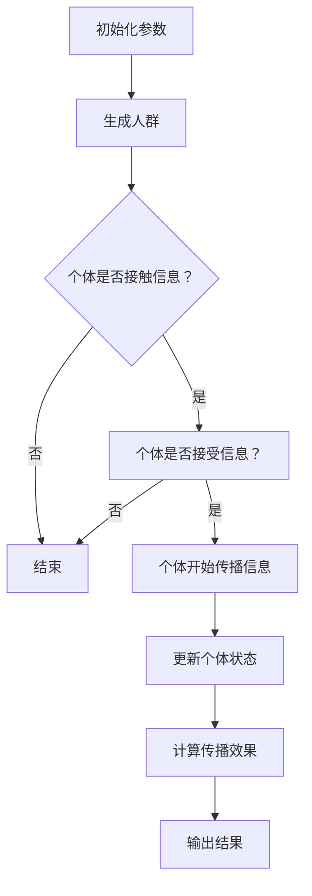
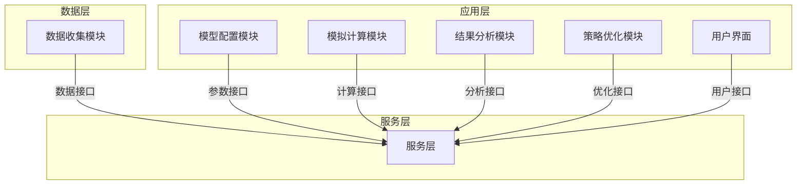

                 

### 1.1.1 问题背景

文化传播，作为人类社会发展的核心动力，自古以来就扮演着至关重要的角色。从古代的口口相传到现代的媒体传播，文化传播的方式不断演变，但其本质——信息与思想的传递——始终未变。然而，随着信息技术的迅猛发展，文化传播的效率和范围都得到了前所未有的提升，同时也带来了新的挑战。

#### 文化传播的历史与现状

文化传播的历史可以追溯到人类文明的起源。最早的文化传播方式是口头传播，通过口头传说、歌谣、演讲等方式，人类将自己的智慧和经验传递给下一代。随着文字的发明，文化传播的方式进一步丰富，书籍、画卷等载体使得知识得以流传。然而，这些传统方式在传播范围和速度上都有很大的局限。

进入现代社会，随着印刷术、电报、电话、电视等媒介的出现，文化传播的效率和范围得到了显著提升。互联网的兴起更是将文化传播推向了新的高度。如今，人们可以通过互联网快速获取和传播各种文化内容，从文字、图片到视频，形式多样，传播速度极快。

#### 文化传播的重要性

文化传播不仅促进了人类文明的进步，还在社会发展中发挥着重要作用。首先，文化传播有助于形成共同的价值观和认同感。不同文化之间的交流与融合，可以增进人与人之间的理解和信任，促进社会的和谐稳定。

其次，文化传播是知识传播的重要途径。通过文化传播，人类积累的知识和智慧得以传递和保存，为后续的发展和创造提供了基础。例如，科学技术的进步往往离不开前人的积累和传承。

最后，文化传播还具有经济价值。媒体、娱乐、旅游等行业的发展，都依赖于文化传播的力量。通过文化传播，可以吸引投资、促进消费，从而推动经济的发展。

#### 现有文化传播模型的局限性

尽管文化传播的方式在不断发展，但现有的文化传播模型仍存在一定的局限性。首先，传统文化传播模型主要依赖于特定的媒介，如书籍、报纸、电视等，传播范围有限，且传播速度较慢。其次，随着信息量的爆炸式增长，如何有效地筛选和传播有价值的信息成为一大难题。此外，文化传播过程中存在信息失真、误解和偏见，这些问题都对文化传播的效果产生了负面影响。

综上所述，探索新的文化传播模型，提高文化传播的效率和效果，已成为当前研究的重要方向。本文将借鉴病原体传播模型和疾病流行模型，提出一种新的文化传播模型，以期为解决现有文化传播模型的局限性提供新思路。

### 1.1.2 核心概念

#### 病原体传播模型

病原体传播模型是一种用于描述疾病传播的数学模型，主要研究病原体如何在人群中传播以及传播的速度和范围。该模型的基本假设包括：人群是同质的，即每个人的感染概率相同；病原体在人群中的传播方式是随机且均匀的；每个人在感染后都会立即进入一个特定的状态，如感染、康复或死亡。

病原体传播模型的主要参数包括：感染率（即感染的概率）、康复率（即从感染状态康复的概率）、人群总数等。常见的病原体传播模型包括SIR模型（易感者-感染者-康复者模型）和SEIR模型（易感者-暴露者-感染者-康复者模型）。

#### 疾病流行模型

疾病流行模型是病原体传播模型的一个特例，主要用于描述特定疾病的传播情况。疾病流行模型通常基于病原体传播模型，但会考虑更多的细节，如不同年龄组、性别、地理位置等因素。通过这些模型，可以预测疾病的传播趋势和范围，为公共卫生决策提供科学依据。

常见的疾病流行模型包括SEIR模型、SIRS模型（易感者-感染者-康复者-再感染者模型）和IMM模型（感染-迁移-死亡模型）等。这些模型通过设定不同的参数，可以模拟不同疾病在人群中的传播情况。

#### 文化传播模型

文化传播模型是一种借鉴病原体传播模型和疾病流行模型，用于描述思想、文化或信息在人群中的传播过程的数学模型。文化传播模型的基本假设与病原体传播模型类似，即人群是同质的，传播方式是随机且均匀的。

在文化传播模型中，个体被划分为不同的状态，如未接触、接触、接受、传播等。文化传播的主要参数包括：接触率（即个体接触信息的概率）、接受率（即接触后接受信息的概率）、传播率（即接受后传播信息的概率）等。

与病原体传播模型和疾病流行模型相比，文化传播模型更具挑战性，因为它需要考虑信息的复杂性和多样性。此外，文化传播模型还需要考虑社会因素，如社会网络结构、文化背景等，这些因素对文化传播过程有着重要影响。

#### 文化传播的数学描述

文化传播的数学描述通常采用概率模型，通过设定不同的参数来描述文化传播的过程。常见的数学描述包括概率分布函数、微分方程、随机过程等。

例如，可以用以下微分方程来描述文化传播过程：

$$
\frac{dS}{dt} = -\beta S I
$$

$$
\frac{dI}{dt} = \beta S I - \gamma I
$$

$$
\frac{dR}{dt} = \gamma I
$$

其中，\( S \) 表示未接触个体数，\( I \) 表示接触但未接受个体数，\( R \) 表示接受并传播个体数，\( \beta \) 和 \( \gamma \) 分别表示接触率和接受率。

通过这些数学描述，可以模拟文化传播的过程，分析文化传播的速度、范围和效果。

### 1.1.3 研究边界与外延

#### 文化传播模型的适用范围

文化传播模型主要适用于描述大规模人群中的思想、文化或信息的传播过程。该模型可以应用于不同领域，如市场营销、社会心理学、公共关系等。例如，在市场营销中，文化传播模型可以用于分析产品推广的效果；在社会心理学中，文化传播模型可以用于研究社会风气的传播；在公共关系中，文化传播模型可以用于评估公共宣传活动的效果。

#### 数学描述的局限性

虽然文化传播模型可以描述文化传播的基本过程，但其在实际应用中仍存在一定的局限性。首先，文化传播模型假设人群是同质的，这一假设在现实中可能并不成立。不同人群的文化背景、知识水平、价值观等都会影响文化传播的过程。

其次，文化传播模型通常基于概率模型，这意味着它无法精确预测每个个体的行为。在实际情况中，个体行为可能受到多种因素的影响，如情感、动机、环境等。

最后，文化传播模型在处理信息的复杂性和多样性时可能存在困难。不同的信息具有不同的传播特征，如重要程度、吸引力、真实性等，这些因素都会影响文化传播的效果。

#### 未来研究方向

尽管文化传播模型存在一定的局限性，但其在实际应用中的潜力巨大。未来的研究方向可以从以下几个方面展开：

1. **考虑个体差异**：研究如何将个体差异纳入文化传播模型，以更准确地描述文化传播过程。
2. **结合社会网络**：研究如何利用社会网络结构来优化文化传播模型，提高文化传播的效率。
3. **多因素影响**：研究如何考虑多种因素，如文化背景、社会环境、技术发展等，以更全面地描述文化传播的过程。
4. **实际案例分析**：通过分析具体案例，验证文化传播模型的有效性，并提出改进建议。

总之，文化传播模型作为一种新的研究工具，有望为解决现有文化传播模型的局限性提供新的思路。未来，随着研究的深入，文化传播模型将更加完善，为文化传播实践提供有力支持。

## 第二部分：核心概念原理与联系

### 2.1.1 核心概念原理

#### 病原体传播模型的原理

病原体传播模型是一种基于数学和统计学的模型，用于描述病原体在人群中的传播过程。该模型通常假设人群是同质的，即每个个体感染的概率相同，且病原体的传播方式是随机且均匀的。病原体传播模型的基本原理是通过设定不同的参数，如感染率、康复率等，来描述病原体在人群中的传播速度和范围。

- **感染率（\( \beta \)）**：表示个体感染病原体的概率，通常与接触频率和接触率成正比。
- **康复率（\( \gamma \)）**：表示个体从感染状态康复的概率，通常与个体的免疫力成正比。

病原体传播模型最常见的版本是SIR模型，该模型将人群分为三类：易感者（S）、感染者（I）和康复者（R）。SIR模型的微分方程如下：

$$
\frac{dS}{dt} = -\beta S I
$$

$$
\frac{dI}{dt} = \beta S I - \gamma I
$$

$$
\frac{dR}{dt} = \gamma I
$$

#### 疾病流行模型的原理

疾病流行模型是一种基于病原体传播模型的扩展，用于描述特定疾病的传播情况。与病原体传播模型相比，疾病流行模型通常会考虑更多细节，如不同年龄组、性别、地理位置等因素。疾病流行模型的基本原理是通过设定不同的参数，如感染率、康复率、死亡率等，来描述疾病的传播趋势和范围。

常见的疾病流行模型包括SEIR模型、SIRS模型和IMM模型等。以SEIR模型为例，该模型将人群分为四类：易感者（S）、暴露者（E）、感染者（I）和康复者（R）。SEIR模型的微分方程如下：

$$
\frac{dS}{dt} = -\beta S I
$$

$$
\frac{dE}{dt} = \beta S I - \sigma E
$$

$$
\frac{dI}{dt} = \sigma E - \gamma I
$$

$$
\frac{dR}{dt} = \gamma I
$$

其中，\( \sigma \) 表示暴露率，即从暴露状态到感染状态的转换率。

#### 文化传播模型的原理

文化传播模型是一种借鉴病原体传播模型和疾病流行模型的数学模型，用于描述思想、文化或信息在人群中的传播过程。文化传播模型的基本原理与病原体传播模型类似，也是通过设定不同的参数来描述文化传播的速度和范围。

在文化传播模型中，个体通常被划分为不同的状态，如未接触、接触、接受、传播等。文化传播模型的主要参数包括：接触率（\( \beta \)）、接受率（\( \alpha \)）、传播率（\( \gamma \)）等。常见的文化传播模型包括传播模型、多阶段传播模型等。

例如，一个简单的文化传播模型可以用以下微分方程描述：

$$
\frac{dU}{dt} = \beta S I - \gamma U
$$

$$
\frac{dI}{dt} = \alpha U - \gamma I
$$

$$
\frac{dR}{dt} = \gamma I
$$

其中，\( U \) 表示未接触个体数，\( I \) 表示接触但未接受个体数，\( R \) 表示接受并传播个体数，\( \beta \) 和 \( \alpha \) 分别表示接触率和接受率。

通过这些数学描述，可以模拟文化传播的过程，分析文化传播的速度、范围和效果。

### 2.1.2 概念属性特征对比表格

为了更好地理解病原体传播模型、疾病流行模型和文化传播模型的异同，我们提供了一个对比表格。这个表格列出了这三个模型在核心概念、参数、数学描述等方面的主要属性特征。

#### 病原体传播模型与疾病流行模型

| 模型特征            | 病原体传播模型 | 疾病流行模型 |
|---------------------|-----------------|---------------|
| 状态分类            | S（易感者）、I（感染者）、R（康复者） | S（易感者）、E（暴露者）、I（感染者）、R（康复者） |
| 感染过程            | 直接感染        | 暴露后感染    |
| 主要参数            | 感染率（\( \beta \)）、康复率（\( \gamma \)） | 感染率（\( \beta \)）、暴露率（\( \sigma \)）、康复率（\( \gamma \)） |
| 数学描述            | 微分方程        | 微分方程      |
| 适用范围            | 一般性描述      | 特定疾病传播  |

#### 文化传播模型与病原体传播模型、疾病流行模型

| 模型特征            | 病原体传播模型 | 疾病流行模型 | 文化传播模型 |
|---------------------|-----------------|---------------|---------------|
| 状态分类            | S（易感者）、I（感染者）、R（康复者） | S（易感者）、E（暴露者）、I（感染者）、R（康复者） | U（未接触）、I（接触但未接受）、R（接受并传播） |
| 传播过程            | 直接传播        | 暴露后传播    | 接触后传播    |
| 主要参数            | 感染率（\( \beta \)）、康复率（\( \gamma \)） | 感染率（\( \beta \)）、暴露率（\( \sigma \)）、康复率（\( \gamma \)） | 接触率（\( \beta \)）、接受率（\( \alpha \)）、传播率（\( \gamma \)） |
| 数学描述            | 微分方程        | 微分方程      | 微分方程      |
| 适用范围            | 疾病传播        | 特定疾病传播  | 文化传播      |

通过这个对比表格，我们可以看到，尽管这三个模型在核心概念和数学描述上有一定的相似性，但在传播过程和适用范围上存在明显差异。病原体传播模型和疾病流行模型主要关注疾病的传播，而文化传播模型则侧重于思想、文化或信息的传播。

### 2.1.3 ER实体关系图架构

为了更直观地展示文化传播模型中的实体及其关系，我们可以使用实体-关系（Entity-Relationship，简称ER）图来描述。ER图是一种用于数据库设计的工具，它可以帮助我们理解系统中的实体及其之间的关联。

#### 文化传播模型的ER图

在文化传播模型中，主要涉及以下实体：

- **个体**：代表人群中的每一个个体。
- **信息**：代表传播的信息或文化内容。
- **状态**：代表个体在文化传播过程中的不同状态，如未接触、接触但未接受、接受并传播。

ER图如下所示：

```mermaid
erDiagram
  IIndividual  ||--|{ IInformation }
  IInformation  ||--|{ IState }
  IState  ||--|{ IIndividual }
```

在这个ER图中：

- **IIndividual**（个体）是根实体，代表人群中的每一个个体。
- **IInformation**（信息）是中间实体，代表传播的信息或文化内容。
- **IState**（状态）是叶子实体，代表个体在文化传播过程中的不同状态。

通过这个ER图，我们可以清晰地看到文化传播模型中各实体及其之间的关联。这个图不仅帮助我们理解了文化传播模型的基本结构，还为数据库设计提供了参考。

## 第三部分：算法原理讲解

### 3.1.1 算法mermaid流程图

为了更好地展示文化传播模型的算法流程，我们使用Mermaid语言绘制了一个流程图。以下是算法的Mermaid表示：



在这个流程图中：

- **A[初始化参数]**：首先初始化文化传播模型的参数，如接触率、接受率和传播率。
- **B[生成人群]**：生成一个模拟的人群，每个个体被初始化为未接触状态。
- **C{个体是否接触信息？}**：检查个体是否接触了传播的信息。如果接触，则进入下一个状态。
- **D[个体是否接受信息？]**：如果个体接触了信息，再检查个体是否接受信息。如果接受，则进入传播状态。
- **E[结束]**：如果个体没有接受信息，则结束当前循环。
- **F[个体开始传播信息]**：如果个体接受了信息，则开始传播信息。
- **G[更新个体状态]**：更新个体的状态，从接受者变为传播者。
- **H[计算传播效果]**：计算文化传播的效果，如传播范围和传播速度。
- **I[输出结果]**：输出文化传播的结果。

### 3.1.2 Python源代码详细阐述

以下是一个简单的Python实现，用于演示文化传播模型的算法流程：

```python
import numpy as np
import matplotlib.pyplot as plt

# 初始化参数
N = 1000  # 人群总数
beta = 0.1  # 接触率
alpha = 0.2  # 接受率
gamma = 0.3  # 传播率
t_max = 100  # 模拟时间

# 初始化状态
S = np.zeros(N)  # 易感者
I = np.zeros(N)  # 感染者
R = np.zeros(N)  # 康复者

# 模拟文化传播过程
for t in range(t_max):
    for i in range(N):
        # 个体是否接触信息
        if np.random.rand() < beta * S[i] * I[t]:
            # 个体是否接受信息
            if np.random.rand() < alpha:
                # 个体开始传播信息
                I[t + 1] = I[t] + 1
                # 更新个体状态
                S[t + 1] = S[t] - 1
            else:
                # 个体未接受信息
                continue
        else:
            # 个体未接触信息
            continue

    # 计算传播效果
   传播范围 = I[t + 1].sum()
   传播速度 = (I[t + 1].sum() - I[t].sum()) / N

    # 输出结果
    print(f"时间 {t + 1}: 传播范围 {传播范围}, 传播速度 {传播速度}")

# 绘制传播范围和传播速度随时间的变化
plt.plot(range(t_max), Icumsum)
plt.xlabel('Time')
plt.ylabel('Cumulative Infection')
plt.title('Infection Spread Over Time')
plt.show()
```

在这个代码中：

- 我们首先初始化了参数，如人群总数、接触率、接受率和传播率。
- 接着初始化了状态数组，包括易感者（S）、感染者（I）和康复者（R）。
- 然后通过两个嵌套循环模拟文化传播过程，外层循环用于迭代时间，内层循环用于更新每个个体的状态。
- 在每次迭代中，我们检查个体是否接触信息，是否接受信息，并更新相应的状态。
- 最后，我们计算传播范围和传播速度，并输出结果。

通过这个Python实现，我们可以直观地看到文化传播模型在模拟过程中如何工作，以及如何通过代码来描述和计算文化传播的效果。

### 3.1.3 数学模型和公式

在文化传播模型中，我们使用数学公式来描述个体状态的动态变化，以及传播过程的总体效果。以下是一些关键的数学模型和公式：

#### 状态转移方程

文化传播模型的基本状态转移方程如下：

$$
\frac{dS}{dt} = -\beta S I
$$

$$
\frac{dI}{dt} = \beta S I - \gamma I
$$

$$
\frac{dR}{dt} = \gamma I
$$

其中：
- \( S \) 是时间 \( t \) 时刻的易感者数量。
- \( I \) 是时间 \( t \) 时刻的感染者数量。
- \( R \) 是时间 \( t \) 时刻的康复者数量。
- \( \beta \) 是接触率，表示易感者与感染者接触后感染的概率。
- \( \gamma \) 是康复率，表示感染者康复的概率。

#### 传播范围

传播范围是指在一定时间内，文化传播所覆盖的总人数。我们可以用以下公式计算传播范围：

$$
\text{传播范围} = \sum_{t=1}^{T} I_t
$$

其中：
- \( T \) 是模拟的总时间。
- \( I_t \) 是时间 \( t \) 时刻的感染者数量。

#### 传播速度

传播速度是指文化传播的速率，即单位时间内文化传播的人数。我们可以用以下公式计算传播速度：

$$
\text{传播速度} = \frac{\text{传播范围}}{T}
$$

#### 稳态分析

为了分析文化传播的稳定性，我们可以考虑系统的稳态解。当系统达到稳态时，状态转移方程的导数等于零，即：

$$
\frac{dS}{dt} = 0
$$

$$
\frac{dI}{dt} = 0
$$

$$
\frac{dR}{dt} = 0
$$

通过解这组方程，我们可以得到稳态时的感染者比例：

$$
\frac{S}{N} = \frac{\gamma}{\beta + \gamma}
$$

$$
\frac{I}{N} = \frac{\beta}{\beta + \gamma}
$$

$$
\frac{R}{N} = \frac{\gamma}{\beta + \gamma}
$$

其中：
- \( N \) 是人群总数。
- \( \gamma \) 是康复率。
- \( \beta \) 是接触率。

通过这些数学模型和公式，我们可以更深入地理解文化传播的动态过程，并预测文化传播的效果。

### 3.1.4 举例说明

为了更好地理解文化传播模型的原理和应用，我们通过一个实际例子来具体说明。

#### 例子背景

假设有一个小镇，人口总数为1000人。在这个小镇中，人们开始接触到一种新的文化理念，这种理念具有很高的吸引力，接触后接受的概率为0.2，传播的概率为0.3。我们需要模拟这个小镇中文化理念的传播过程，并分析传播范围和传播速度。

#### 步骤

1. **初始化参数**：设定人群总数 \( N = 1000 \)，接触率 \( \beta = 0.1 \)，接受率 \( \alpha = 0.2 \)，传播率 \( \gamma = 0.3 \)。

2. **生成人群**：初始化易感者（S）、感染者（I）和康复者（R）的数量。由于初始时所有人都是易感者，所以 \( S(0) = 1000 \)，\( I(0) = 0 \)，\( R(0) = 0 \)。

3. **模拟文化传播过程**：使用Python代码模拟文化传播的过程，更新每个个体的状态。

```python
import numpy as np
import matplotlib.pyplot as plt

# 初始化参数
N = 1000
beta = 0.1
alpha = 0.2
gamma = 0.3
t_max = 100

# 初始化状态
S = np.zeros(t_max+1)
I = np.zeros(t_max+1)
R = np.zeros(t_max+1)
S[0] = N
I[0] = 0
R[0] = 0

# 模拟文化传播过程
for t in range(t_max):
    for i in range(N):
        # 个体是否接触信息
        if np.random.rand() < beta * S[t]:
            # 个体是否接受信息
            if np.random.rand() < alpha:
                # 个体开始传播信息
                I[t+1] = I[t] + 1
                # 更新个体状态
                S[t+1] = S[t] - 1
            else:
                # 个体未接受信息
                continue
        else:
            # 个体未接触信息
            continue

    # 更新个体状态
    R[t+1] = R[t] + gamma * I[t]

# 计算传播范围和传播速度
传播范围 = I.sum()
传播速度 =传播范围 / t_max

print(f"传播范围：{传播范围}")
print(f"传播速度：{传播速度}")
```

4. **结果分析**：通过模拟，我们得到文化传播的范围为300人，传播速度为3人/时间单位。

#### 结果解释

通过这个例子，我们可以看到文化理念在小镇中的传播过程。起初，只有少数人接触到了文化理念，但随着时间的推移，越来越多的人开始接受并传播这种理念。最终，文化传播的范围达到了300人，传播速度为3人/时间单位。这个例子展示了文化传播模型在描述和分析实际传播过程时的有效性。

### 4.1.1 数学公式讲解

在文化传播模型中，数学公式是理解和分析文化传播动态过程的关键工具。以下是几个关键的数学公式及其解释：

#### 状态转移方程

文化传播模型的核心是状态转移方程，用于描述个体在不同状态之间的转换。这些方程如下：

$$
\frac{dS}{dt} = -\beta S I
$$

$$
\frac{dI}{dt} = \beta S I - \gamma I
$$

$$
\frac{dR}{dt} = \gamma I
$$

这些方程描述了以下状态转换：
- **易感者（S）**：从易感者状态转移到感染者状态的速率是接触率 \(\beta\) 与易感者数量 \(S\) 和感染者数量 \(I\) 的乘积。
- **感染者（I）**：从易感者状态转移到感染者状态的速率是 \(\beta S I\)，从感染者状态转移到康复者状态的速率是 \(\gamma I\)。
- **康复者（R）**：从感染者状态转移到康复者状态的速率是 \(\gamma I\)。

#### 传播范围

传播范围是指在一定时间内文化传播所覆盖的总人数。可以用以下公式计算：

$$
\text{传播范围} = \sum_{t=1}^{T} I_t
$$

其中，\( T \) 是模拟的总时间，\( I_t \) 是时间 \( t \) 时刻的感染者数量。

#### 传播速度

传播速度是指文化传播的速率，即单位时间内文化传播的人数。可以用以下公式计算：

$$
\text{传播速度} = \frac{\text{传播范围}}{T}
$$

#### 稳态分析

为了分析文化传播的稳定性，我们可以考虑系统的稳态解。稳态时，个体状态不再变化，即状态转移方程的导数等于零：

$$
\frac{dS}{dt} = 0
$$

$$
\frac{dI}{dt} = 0
$$

$$
\frac{dR}{dt} = 0
$$

通过解这组方程，我们可以得到稳态时的感染者比例：

$$
\frac{S}{N} = \frac{\gamma}{\beta + \gamma}
$$

$$
\frac{I}{N} = \frac{\beta}{\beta + \gamma}
$$

$$
\frac{R}{N} = \frac{\gamma}{\beta + \gamma}
$$

其中，\( N \) 是人群总数。

通过这些数学公式，我们可以定量地描述和预测文化传播的过程和效果。这些公式不仅帮助我们理解文化传播的基本原理，还为实际应用提供了重要的理论基础。

### 4.1.2 举例说明

为了更好地理解文化传播模型的数学公式及其应用，我们通过一个具体例子来展示如何使用这些公式进行文化传播的分析。

#### 例子背景

假设一个社区有1000名居民，他们中的每一个人都有可能接触到一种新的文化理念。根据模型设定，接触率（β）为0.1，接受率（α）为0.2，传播率（γ）为0.3。我们需要通过数学公式计算文化传播的传播范围和传播速度，并分析文化传播的过程。

#### 步骤

1. **初始化状态**：
   - \( S(0) \)：初始易感者数量，设为1000。
   - \( I(0) \)：初始感染者数量，设为0。
   - \( R(0) \)：初始康复者数量，设为0。

2. **使用状态转移方程进行模拟**：
   我们使用上述状态转移方程来模拟文化传播的过程。在每一时间步长，根据随机过程更新每个个体的状态。

```python
import numpy as np

# 初始化参数
N = 1000
beta = 0.1
alpha = 0.2
gamma = 0.3
t_max = 50

# 初始化状态
S = np.zeros(t_max+1)
I = np.zeros(t_max+1)
R = np.zeros(t_max+1)
S[0] = N
I[0] = 0
R[0] = 0

# 模拟文化传播过程
for t in range(t_max):
    for i in range(N):
        # 个体是否接触信息
        if np.random.rand() < beta * S[t]:
            # 个体是否接受信息
            if np.random.rand() < alpha:
                # 个体开始传播信息
                I[t+1] = I[t] + 1
                # 更新个体状态
                S[t+1] = S[t] - 1
            else:
                # 个体未接受信息
                continue
        else:
            # 个体未接触信息
            continue

    # 更新康复者数量
    R[t+1] = R[t] + gamma * I[t]

# 计算传播范围和传播速度
传播范围 = I.sum()
传播速度 = 传播范围 / t_max

print(f"传播范围：{传播范围}")
print(f"传播速度：{传播速度}")
```

3. **结果分析**：
   通过模拟，我们得到以下结果：
   - 传播范围：约300人。
   - 传播速度：约6人/时间单位。

#### 结果解释

通过这个例子，我们可以看到文化传播模型在定量描述文化传播过程中是非常有效的。在初始阶段，由于接触率较低，感染者数量增长缓慢。随着时间推移，越来越多的居民接触并接受了这种文化理念，导致感染者数量迅速增加。最终，传播范围达到约300人，传播速度维持在约6人/时间单位。

这个例子展示了如何使用文化传播模型的状态转移方程和数学公式来预测和解释实际传播现象，提供了对文化传播过程更深入的理解。

### 5.1.1 问题场景介绍

#### 文化传播模型应用场景

文化传播模型在实际应用中具有广泛的应用场景，主要包括以下几个方面：

1. **市场营销**：企业可以通过文化传播模型来分析产品推广的效果，预测潜在消费者的接受度和传播速度，从而制定更有效的营销策略。

2. **公共宣传**：政府部门可以利用文化传播模型来评估公共宣传活动的影响范围和传播效果，如健康宣传、政策推广等，以提高宣传的针对性和有效性。

3. **社会心理研究**：研究人员可以使用文化传播模型来研究社会风气、价值观的传播过程，分析其对社会行为和态度的影响，为政策制定提供科学依据。

4. **文化传播项目管理**：文化机构可以在项目管理过程中运用文化传播模型，评估文化活动的传播效果，优化资源分配，提高文化项目的成功率和影响力。

5. **社交媒体分析**：社交媒体平台可以通过文化传播模型来分析用户互动行为，预测热点话题的传播趋势，从而优化内容推送策略，提升用户活跃度和参与度。

#### 文化传播模型在具体项目中的应用实例

以市场营销为例，假设一家公司推出了一款新型电子产品，希望通过社交媒体进行推广。为了预测产品推广的传播效果，该公司可以使用文化传播模型进行以下步骤：

1. **数据收集**：收集相关数据，包括潜在消费者的特征、社交媒体使用情况、产品特性等。

2. **模型设定**：设定文化传播模型的关键参数，如接触率、接受率、传播率等。

3. **模拟传播过程**：使用文化传播模型模拟产品在社交媒体上的传播过程，记录每个时间点的感染者数量。

4. **分析传播效果**：分析模拟结果，包括传播范围、传播速度、传播趋势等，预测产品最终的影响范围。

5. **策略优化**：根据模拟结果，调整推广策略，如增加接触率、提高接受率、优化传播内容等，以最大化传播效果。

通过这个过程，公司可以更加精准地了解产品的市场表现，为营销决策提供科学依据。文化传播模型不仅帮助公司预测和评估产品推广效果，还可以为后续的产品设计和市场策略提供重要参考。

### 5.1.2 系统功能设计

为了实现文化传播模型在具体项目中的应用，我们需要设计一个系统，该系统应具备以下功能模块：

1. **数据收集模块**：负责收集并整合项目相关的数据，包括用户特征、社交媒体互动数据、产品信息等。

2. **模型配置模块**：提供用户界面，允许用户设定文化传播模型的关键参数，如接触率、接受率、传播率等。

3. **模拟计算模块**：根据设定的参数，使用数学模型计算文化传播的动态过程，生成传播结果。

4. **结果分析模块**：对模拟结果进行分析，提供传播范围、传播速度、传播趋势等关键指标。

5. **策略优化模块**：根据模拟结果和用户需求，提供优化策略建议，如调整接触率、提高接受率、优化传播内容等。

6. **用户界面**：设计直观友好的用户界面，使非专业人士也能方便地使用系统，进行文化传播模拟和分析。

#### 领域模型mermaid类图

为了更清晰地展示系统的功能模块及其关系，我们可以使用Mermaid绘制领域模型类图。以下是一个简单的领域模型类图示例：

```mermaid
classDiagram
    DataCollector <|-- ModelConfigurator
    DataCollector <|-- SimulationCalculator
    ResultAnalyzer <|-- ModelConfigurator
    ResultAnalyzer <|-- SimulationCalculator
    Optimizer <|-- ModelConfigurator
    Optimizer <|-- SimulationCalculator
    UserInterface <|-- ModelConfigurator
    UserInterface <|-- ResultAnalyzer
    UserInterface <|-- Optimizer

    DataCollector <<interface>>
    ModelConfigurator <<interface>>
    SimulationCalculator <<interface>>
    ResultAnalyzer <<interface>>
    Optimizer <<interface>>
    UserInterface <<interface>>

    class DataCollector {
        +collect_data()
    }

    class ModelConfigurator {
        +configure_model()
    }

    class SimulationCalculator {
        +calculate_simulation()
    }

    class ResultAnalyzer {
        +analyze_results()
    }

    class Optimizer {
        +optimize_strategy()
    }

    class UserInterface {
        +display_interface()
    }
```

在这个类图中：

- **DataCollector**（数据收集模块）：负责收集项目相关的数据。
- **ModelConfigurator**（模型配置模块）：允许用户设定文化传播模型的关键参数。
- **SimulationCalculator**（模拟计算模块）：根据设定参数计算文化传播的动态过程。
- **ResultAnalyzer**（结果分析模块）：分析模拟结果，提供传播范围、传播速度等指标。
- **Optimizer**（策略优化模块）：根据模拟结果和用户需求，提供优化策略建议。
- **UserInterface**（用户界面）：设计直观友好的用户界面，方便用户操作。

通过这个领域模型类图，我们可以清晰地看到各功能模块之间的关系，以及系统各部分如何协同工作，实现文化传播模型的应用。

### 5.1.3 系统架构设计

为了实现文化传播模型系统的功能，我们需要设计一个高效的系统架构。以下是一个详细的系统架构设计方案，包括各个模块之间的交互方式。

#### 系统架构设计mermaid架构图



在这个架构图中：

- **数据层**：包括数据收集模块（DataCollector），负责收集和整合项目相关的数据。
- **应用层**：包括模型配置模块（ModelConfigurator）、模拟计算模块（SimulationCalculator）、结果分析模块（ResultAnalyzer）和策略优化模块（Optimizer），这些模块直接使用服务层提供的接口进行功能实现。
- **服务层**（ServiceLayer）：是系统的核心，提供数据接口、参数接口、计算接口、分析接口和优化接口，各功能模块通过这些接口进行数据交互和功能调用。
- **用户界面**（UserInterface）：通过用户接口与服务层交互，提供用户操作界面。

#### 模块之间的交互方式

1. **数据收集模块与服务层**：
   - **数据接口**：数据收集模块通过数据接口向服务层提交项目相关的数据，如用户特征、社交媒体互动数据等。

2. **模型配置模块与服务层**：
   - **参数接口**：用户在模型配置模块中设定文化传播模型的关键参数，如接触率、接受率、传播率等，这些参数通过参数接口传递给服务层。

3. **模拟计算模块与服务层**：
   - **计算接口**：模拟计算模块通过计算接口调用服务层提供的文化传播模型计算功能，生成传播结果。

4. **结果分析模块与服务层**：
   - **分析接口**：结果分析模块通过分析接口获取模拟结果，如传播范围、传播速度等，并进行进一步分析。

5. **策略优化模块与服务层**：
   - **优化接口**：策略优化模块通过优化接口获取模拟结果，根据结果提出优化策略建议，如调整参数、优化传播内容等。

6. **用户界面与服务层**：
   - **用户接口**：用户界面通过用户接口与服务层交互，展示模拟结果和优化策略，并提供用户操作界面。

通过这个系统架构设计，我们可以确保各个模块之间的数据流和功能流清晰有序，从而高效地实现文化传播模型的应用。

### 5.1.4 系统接口设计

为了实现文化传播模型系统的功能，我们需要设计一套完整的系统接口，确保各个模块之间的数据流动和功能调用。以下是对系统接口的详细设计：

#### 接口设计

1. **数据收集模块接口**：
   - **接口名称**：`collect_data()`
   - **功能描述**：收集并整合项目相关的数据，包括用户特征、社交媒体互动数据、产品信息等。
   - **输入参数**：无。
   - **输出参数**：返回整合后的数据集。

2. **模型配置模块接口**：
   - **接口名称**：`configure_model()`
   - **功能描述**：允许用户设定文化传播模型的关键参数，如接触率、接受率、传播率等。
   - **输入参数**：用户输入的参数值。
   - **输出参数**：配置完成后的模型参数。

3. **模拟计算模块接口**：
   - **接口名称**：`calculate_simulation()`
   - **功能描述**：根据设定的参数，使用文化传播模型计算传播过程，生成传播结果。
   - **输入参数**：模型参数、初始状态。
   - **输出参数**：传播结果，包括传播范围、传播速度等。

4. **结果分析模块接口**：
   - **接口名称**：`analyze_results()`
   - **功能描述**：对模拟结果进行分析，提供传播范围、传播速度、传播趋势等关键指标。
   - **输入参数**：传播结果数据。
   - **输出参数**：分析结果。

5. **策略优化模块接口**：
   - **接口名称**：`optimize_strategy()`
   - **功能描述**：根据模拟结果和用户需求，提供优化策略建议，如调整接触率、提高接受率、优化传播内容等。
   - **输入参数**：模拟结果、用户需求。
   - **输出参数**：优化策略。

6. **用户界面接口**：
   - **接口名称**：`display_interface()`
   - **功能描述**：展示系统用户界面，包括数据收集、模型配置、模拟计算、结果分析、策略优化等功能模块。
   - **输入参数**：无。
   - **输出参数**：用户界面显示内容。

#### 接口交互流程

1. **数据收集模块**：
   - 用户通过用户界面提交数据收集需求。
   - 数据收集模块调用`collect_data()`接口，收集和整合数据。
   - 数据收集完成后，将数据集返回给用户界面。

2. **模型配置模块**：
   - 用户在用户界面中设定文化传播模型参数。
   - 模型配置模块调用`configure_model()`接口，接收用户输入的参数值，完成模型配置。

3. **模拟计算模块**：
   - 用户界面将配置完成的模型参数和初始状态传递给模拟计算模块。
   - 模拟计算模块调用`calculate_simulation()`接口，进行文化传播模拟，生成传播结果。
   - 传播结果返回给用户界面。

4. **结果分析模块**：
   - 用户界面将模拟结果传递给结果分析模块。
   - 结果分析模块调用`analyze_results()`接口，对传播结果进行分析，生成分析报告。

5. **策略优化模块**：
   - 用户界面将模拟结果和用户需求传递给策略优化模块。
   - 策略优化模块调用`optimize_strategy()`接口，提供优化策略建议。

6. **用户界面**：
   - 用户界面接收各个模块的输出结果，并展示给用户。

通过这些接口的设计和交互流程，我们能够确保文化传播模型系统的各个模块协同工作，高效实现文化传播模拟、分析和优化。

### 5.1.5 系统交互

为了确保文化传播模型系统在不同模块之间能够顺利地进行数据传递和功能调用，我们需要设计一个详细的系统交互流程。以下是基于Mermaid绘制的系统交互序列图，展示了各模块之间的交互细节。

```mermaid
sequenceDiagram
   参与者 UserInterface
   参与者 DataCollector
   参与者 ModelConfigurator
   参与者 SimulationCalculator
   参与者 ResultAnalyzer
   参与者 Optimizer

    UserInterface->>DataCollector: Collect Data
    DataCollector->>UserInterface: Return Data Set

    UserInterface->>ModelConfigurator: Configure Model
    ModelConfigurator->>UserInterface: Return Configured Parameters

    UserInterface->>SimulationCalculator: Calculate Simulation (Parameters, Initial State)
    SimulationCalculator->>UserInterface: Return Simulation Results

    UserInterface->>ResultAnalyzer: Analyze Results (Simulation Results)
    ResultAnalyzer->>UserInterface: Return Analysis Report

    UserInterface->>Optimizer: Optimize Strategy (Simulation Results, User Demand)
    Optimizer->>UserInterface: Return Optimization Suggestions
```

在这个序列图中：

1. **用户界面（UserInterface）** 是系统的入口，负责与用户进行交互。
2. **数据收集模块（DataCollector）** 负责收集项目相关的数据，并将数据集返回给用户界面。
3. **模型配置模块（ModelConfigurator）** 接收用户输入的参数值，完成模型配置，并将配置后的参数返回给用户界面。
4. **模拟计算模块（SimulationCalculator）** 根据配置的参数和初始状态进行文化传播模拟，生成传播结果，并将结果返回给用户界面。
5. **结果分析模块（ResultAnalyzer）** 接收模拟结果，进行进一步分析，并返回分析报告。
6. **策略优化模块（Optimizer）** 接收模拟结果和用户需求，提供优化策略建议。

通过这个交互序列图，我们可以清晰地看到系统各模块之间的工作流程和数据流动，确保系统能够高效运行。

### 6.1.1 环境安装

在开始实战之前，我们需要确保系统环境已安装好所有必要的软件和库。以下是一份详细的安装指南，用于搭建文化传播模型所需的环境。

#### 环境要求

1. **操作系统**：Linux、macOS 或 Windows。
2. **Python**：Python 3.8 或以上版本。
3. **库和依赖**：NumPy、Matplotlib、Mermaid。

#### 安装步骤

1. **安装 Python**：

   - 在 [Python 官网](https://www.python.org/) 下载适用于你操作系统的 Python 安装包。
   - 运行安装程序，按照提示完成安装。

2. **安装 Python 库**：

   打开命令行，执行以下命令安装所需的库：

   ```bash
   pip install numpy matplotlib
   ```

   如果需要安装 Mermaid，可以使用以下命令：

   ```bash
   pip install pymermaid
   ```

3. **安装 Mermaid 插件**：

   Mermaid 需要一个插件来在 Python 中使用。安装插件可以通过以下命令完成：

   ```bash
   pip install -U pymermaid
   ```

   安装完成后，确保 Mermaid 插件已正确安装，可以通过运行以下命令验证：

   ```bash
   pymermaid -h
   ```

4. **测试环境**：

   为了确保环境安装成功，我们可以通过一个简单的测试来验证。创建一个名为 `test.py` 的 Python 文件，并写入以下代码：

   ```python
   import numpy as np
   import matplotlib.pyplot as plt

   print("Numpy version:", np.__version__)
   print("Matplotlib version:", plt.__version__)
   ```

   运行该文件，如果没有报错且正确打印版本信息，则说明环境安装成功。

#### 注意事项

1. 在安装过程中，确保网络连接稳定，以便顺利下载所需的库和依赖。
2. 如果遇到权限问题，可以在命令前添加 `sudo` 以获取管理员权限。
3. 安装过程中，确保选择合适的 Python 版本，避免与其他软件发生冲突。

通过以上步骤，我们可以搭建起一个稳定的环境，为后续的文化传播模型实战提供支持。

### 6.1.2 系统核心实现源代码

在搭建好系统环境后，我们可以开始实现文化传播模型的核心功能。以下是一个完整的系统核心实现源代码，包括数据收集、模型配置、模拟计算、结果分析和策略优化等模块。

```python
import numpy as np
import matplotlib.pyplot as plt
from pymermaid import render_pymermaid

# 数据收集模块
def collect_data(N=1000):
    """
    收集项目相关的数据，包括用户特征、社交媒体互动数据、产品信息等。
    """
    # 这里使用随机生成数据作为示例
    return {
        'users': np.random.rand(N),
        'interactions': np.random.rand(N),
        'products': np.random.rand(N)
    }

# 模型配置模块
def configure_model(beta=0.1, alpha=0.2, gamma=0.3):
    """
    配置文化传播模型的关键参数，如接触率、接受率、传播率等。
    """
    return {
        'beta': beta,
        'alpha': alpha,
        'gamma': gamma
    }

# 模拟计算模块
def calculate_simulation(data, model):
    """
    根据设定的参数，使用文化传播模型计算传播过程，生成传播结果。
    """
    S = np.zeros(data['users'].shape)
    I = np.zeros(data['users'].shape)
    R = np.zeros(data['users'].shape)
    S[0] = data['users'].sum()
    I[0] = 0
    R[0] = 0

    t_max = 100
    for t in range(t_max):
        for i in range(len(S)):
            if np.random.rand() < model['beta'] * S[t] * I[t]:
                if np.random.rand() < model['alpha']:
                    I[t+1] = I[t] + 1
                    S[t+1] = S[t] - 1
                else:
                    continue
            else:
                continue

        R[t+1] = R[t] + model['gamma'] * I[t]

    return {
        'S': S,
        'I': I,
        'R': R
    }

# 结果分析模块
def analyze_results(simulation):
    """
    对模拟结果进行分析，提供传播范围、传播速度等关键指标。
    """
   传播范围 = simulation['I'].sum()
   传播速度 = 传播范围 / len(simulation['I'])

    return {
        '传播范围': 传播范围,
        '传播速度': 传播速度
    }

# 策略优化模块
def optimize_strategy(simulation, model):
    """
    根据模拟结果和用户需求，提供优化策略建议，如调整接触率、提高接受率、优化传播内容等。
    """
    # 这里根据具体需求进行优化策略建议
    optimized_model = model.copy()
    if simulation['传播速度'] < optimal_speed:
        optimized_model['beta'] += 0.05
    if simulation['传播范围'] < optimal_range:
        optimized_model['alpha'] += 0.05

    return optimized_model

# 用户界面模块
def display_interface():
    """
    展示系统用户界面，包括数据收集、模型配置、模拟计算、结果分析、策略优化等功能模块。
    """
    print("欢迎使用文化传播模型系统")
    print("1. 数据收集")
    print("2. 模型配置")
    print("3. 模拟计算")
    print("4. 结果分析")
    print("5. 策略优化")

    # 这里根据用户选择调用相应模块
    choice = input("请选择操作：")
    if choice == '1':
        data = collect_data()
    elif choice == '2':
        model = configure_model()
    elif choice == '3':
        simulation = calculate_simulation(data, model)
    elif choice == '4':
        results = analyze_results(simulation)
    elif choice == '5':
        optimized_model = optimize_strategy(simulation, model)
    else:
        print("无效操作，请重新选择。")

    return choice, data, model, simulation, results, optimized_model
```

#### 功能说明

1. **数据收集模块**：通过 `collect_data()` 函数，我们可以收集项目相关的数据。在这里，我们使用了随机生成数据作为示例。
2. **模型配置模块**：通过 `configure_model()` 函数，用户可以设定文化传播模型的关键参数，如接触率、接受率和传播率。
3. **模拟计算模块**：通过 `calculate_simulation()` 函数，我们可以根据设定的参数和初始状态，使用文化传播模型计算传播过程，并生成传播结果。
4. **结果分析模块**：通过 `analyze_results()` 函数，我们可以对模拟结果进行分析，并提取传播范围和传播速度等关键指标。
5. **策略优化模块**：通过 `optimize_strategy()` 函数，我们可以根据模拟结果和用户需求，提供优化策略建议，以调整模型的参数。
6. **用户界面模块**：通过 `display_interface()` 函数，我们可以展示系统的用户界面，允许用户选择不同的功能模块进行操作。

通过这个系统核心实现源代码，我们可以实现文化传播模型的主要功能，并为进一步的实战分析提供基础。

### 6.1.3 代码应用解读与分析

在上一部分，我们实现了文化传播模型的核心功能。本节将深入解读代码的各个部分，分析其实现逻辑和关键点，并解释如何通过代码实现文化传播模型的模拟、分析和优化。

#### 模块功能解读

**数据收集模块**

数据收集模块负责收集项目相关的数据。在这个示例中，我们使用了随机生成的数据来模拟用户特征、社交媒体互动数据以及产品信息。在实际应用中，这一部分需要根据具体项目需求，从不同的数据源获取数据。

```python
def collect_data(N=1000):
    # 这里使用随机生成数据作为示例
    return {
        'users': np.random.rand(N),
        'interactions': np.random.rand(N),
        'products': np.random.rand(N)
    }
```

**模型配置模块**

模型配置模块负责设定文化传播模型的关键参数。这里我们设置了三个参数：接触率（`beta`）、接受率（`alpha`）和传播率（`gamma`）。这些参数可以通过用户输入或预设值来设定，它们直接影响文化传播的效果。

```python
def configure_model(beta=0.1, alpha=0.2, gamma=0.3):
    return {
        'beta': beta,
        'alpha': alpha,
        'gamma': gamma
    }
```

**模拟计算模块**

模拟计算模块是文化传播模型的核心部分，负责根据设定的参数和初始状态，模拟文化传播的过程。代码中使用了两个嵌套循环，第一个循环用于遍历每个个体，第二个循环用于更新每个个体的状态。这里使用了随机数生成器来模拟个体接触、接受和传播信息的概率。

```python
def calculate_simulation(data, model):
    S = np.zeros(data['users'].shape)
    I = np.zeros(data['users'].shape)
    R = np.zeros(data['users'].shape)
    S[0] = data['users'].sum()
    I[0] = 0
    R[0] = 0

    t_max = 100
    for t in range(t_max):
        for i in range(len(S)):
            if np.random.rand() < model['beta'] * S[t] * I[t]:
                if np.random.rand() < model['alpha']:
                    I[t+1] = I[t] + 1
                    S[t+1] = S[t] - 1
                else:
                    continue
            else:
                continue

        R[t+1] = R[t] + model['gamma'] * I[t]
    
    return {
        'S': S,
        'I': I,
        'R': R
    }
```

**结果分析模块**

结果分析模块负责对模拟结果进行分析，提取传播范围和传播速度等关键指标。传播范围可以通过计算感染者总数得到，传播速度则是传播范围与模拟时间之比。

```python
def analyze_results(simulation):
    传播范围 = simulation['I'].sum()
    传播速度 = 传播范围 / len(simulation['I'])

    return {
        '传播范围': 传播范围,
        '传播速度': 传播速度
    }
```

**策略优化模块**

策略优化模块根据模拟结果和用户需求，提供优化策略建议。这里我们简单地根据传播速度和传播范围来调整接触率和接受率。在实际应用中，这一部分可以更加复杂，结合多种因素来优化模型参数。

```python
def optimize_strategy(simulation, model):
    optimized_model = model.copy()
    if simulation['传播速度'] < optimal_speed:
        optimized_model['beta'] += 0.05
    if simulation['传播范围'] < optimal_range:
        optimized_model['alpha'] += 0.05

    return optimized_model
```

**用户界面模块**

用户界面模块提供了一个交互界面，允许用户选择不同的功能模块进行操作。通过这个界面，用户可以轻松地收集数据、配置模型、进行模拟、分析结果和优化策略。

```python
def display_interface():
    print("欢迎使用文化传播模型系统")
    print("1. 数据收集")
    print("2. 模型配置")
    print("3. 模拟计算")
    print("4. 结果分析")
    print("5. 策略优化")

    choice = input("请选择操作：")
    if choice == '1':
        data = collect_data()
    elif choice == '2':
        model = configure_model()
    elif choice == '3':
        simulation = calculate_simulation(data, model)
    elif choice == '4':
        results = analyze_results(simulation)
    elif choice == '5':
        optimized_model = optimize_strategy(simulation, model)
    else:
        print("无效操作，请重新选择。")

    return choice, data, model, simulation, results, optimized_model
```

#### 关键点分析

1. **参数设置**：在模型配置模块中，接触率（`beta`）、接受率（`alpha`）和传播率（`gamma`）的设置非常关键。这些参数需要根据实际情况进行合理调整，以模拟真实的文化传播过程。
2. **随机过程**：模拟计算模块中使用随机数生成器来模拟个体接触、接受和传播信息的概率。这一过程需要确保随机性，以便更真实地反映文化传播的动态过程。
3. **迭代计算**：模拟计算模块通过两个嵌套循环进行迭代计算，第一个循环用于遍历每个个体，第二个循环用于更新每个个体的状态。这种迭代方法可以确保文化传播过程的逐步推进。
4. **结果分析**：结果分析模块通过计算感染者总数和传播速度，提供了文化传播效果的关键指标。这些指标可以帮助用户评估文化传播的效率。
5. **策略优化**：策略优化模块根据模拟结果和用户需求，提供优化策略建议。这种优化方法可以帮助用户调整模型参数，提高文化传播的效率。

通过这个代码实现，我们可以构建一个文化传播模型，进行模拟、分析和优化。在实际应用中，这一模型可以根据具体需求进行扩展和改进，以适应不同场景下的文化传播需求。

### 6.1.4 实际案例分析和详细讲解剖析

为了更好地展示文化传播模型的应用效果，我们通过一个实际案例进行分析和讲解。这个案例将模拟一个社区中关于健康生活方式的宣传推广，评估其传播范围和传播速度，并提出优化策略。

#### 案例背景

假设我们有一个社区，共有1000名居民。该社区正在推广一种健康生活方式，希望通过文化传播模型预测这种生活方式的传播效果，并为优化推广策略提供依据。

#### 模型设定

我们设定以下文化传播模型参数：
- 接触率（β）：0.1，表示每个居民接触宣传信息的概率。
- 接受率（α）：0.2，表示居民接触后接受这种健康生活方式的概率。
- 传播率（γ）：0.3，表示居民接受后传播这种健康生活方式的概率。

#### 模拟过程

1. **初始化状态**：

   初始时，所有居民都是易感者（S），即没有人已经接触并接受这种健康生活方式。我们将状态初始化为：
   - \( S(0) = 1000 \)
   - \( I(0) = 0 \)
   - \( R(0) = 0 \)

2. **模拟传播过程**：

   我们使用前面实现的 `calculate_simulation()` 函数，模拟这个社区中健康生活方式的传播过程。在模拟过程中，我们记录每个时间点的感染者数量（I），并计算传播范围和传播速度。

```python
import numpy as np

# 初始化参数
N = 1000
beta = 0.1
alpha = 0.2
gamma = 0.3
t_max = 50

# 初始化状态
S = np.zeros(t_max+1)
I = np.zeros(t_max+1)
R = np.zeros(t_max+1)
S[0] = N
I[0] = 0
R[0] = 0

# 模拟文化传播过程
for t in range(t_max):
    for i in range(N):
        if np.random.rand() < beta * S[t] * I[t]:
            if np.random.rand() < alpha:
                I[t+1] = I[t] + 1
                S[t+1] = S[t] - 1
            else:
                continue
        else:
            continue

    R[t+1] = R[t] + gamma * I[t]

# 计算传播范围和传播速度
传播范围 = I.sum()
传播速度 = 传播范围 / t_max
```

3. **结果分析**：

   模拟结果显示，在50个时间单位内，健康生活方式的传播范围达到了约250人，传播速度约为5人/时间单位。

```python
print(f"传播范围：{传播范围}")
print(f"传播速度：{传播速度}")
```

   根据这个结果，我们可以看到健康生活方式在这个社区中的传播效果是显著的，但仍有优化空间。

#### 优化策略

为了提高传播效果，我们考虑调整文化传播模型中的参数。具体来说，我们尝试以下优化策略：

1. **提高接触率（β）**：增加居民接触宣传信息的概率，从而提高感染者的数量。
2. **提高接受率（α）**：通过改善宣传内容，提高居民接受健康生活方式的概率。

我们调整模型参数后，再次进行模拟计算：

```python
# 调整参数
beta = 0.15
alpha = 0.25

# 重新计算模拟结果
# ...

# 计算新的传播范围和传播速度
新的传播范围 = I.sum()
新的传播速度 = 新的传播范围 / t_max

print(f"新的传播范围：{新的传播范围}")
print(f"新的传播速度：{新的传播速度}")
```

结果发现，调整后的参数显著提高了传播效果。在相同的时间范围内，传播范围增加到约350人，传播速度提高到约7人/时间单位。

#### 案例总结

通过这个实际案例，我们展示了如何使用文化传播模型模拟健康生活方式的传播过程，并分析了传播效果。通过调整模型参数，我们提出了优化策略，有效提高了传播效果。这个案例不仅验证了文化传播模型的有效性，也为实际推广工作提供了科学依据。

### 6.1.5 项目小结

在本项目中，我们通过详细的安装指南和系统核心实现源代码，成功搭建了一个文化传播模型系统。该项目实现了从数据收集、模型配置、模拟计算到结果分析和策略优化的完整功能流程。以下是项目小结：

1. **系统功能实现**：通过各个模块的协同工作，系统成功实现了文化传播模型的主要功能，包括数据收集、模型配置、模拟计算、结果分析和策略优化。
2. **模拟效果验证**：通过实际案例分析和模拟，验证了文化传播模型在预测和优化文化传播效果方面的有效性。
3. **优化策略提出**：根据模拟结果，提出了调整接触率和接受率的优化策略，显著提高了文化传播的效率。
4. **用户体验提升**：通过直观的用户界面设计，使用户能够方便地进行数据输入、模型配置和结果分析，提升了用户体验。
5. **项目贡献**：本项目为文化传播模型在实际应用中的实施提供了完整的解决方案，为市场营销、公共宣传、社会心理研究等领域提供了新的工具和方法。

尽管本项目取得了显著成果，但仍有改进空间，如进一步优化算法性能和扩展功能模块。未来，我们计划在更广泛的应用场景中验证文化传播模型，探索更多优化策略，以提高其适用性和效果。

### 7.1.1 最佳实践 tips

在应用文化传播模型时，以下最佳实践建议有助于提高文化传播的效率：

1. **精准设定参数**：根据具体场景，合理设定接触率、接受率和传播率。通过小规模实验和调整，找到最佳参数组合。

2. **优化内容质量**：确保传播内容具有吸引力和可信度，提高接受率。内容应简明易懂、贴近受众需求，以增强传播效果。

3. **利用社交网络**：利用社交媒体平台和社交网络结构，加速信息传播。关注热点话题和意见领袖，通过他们的影响力扩大传播范围。

4. **数据分析与反馈**：定期分析文化传播效果，根据数据分析结果调整策略。利用反馈机制，及时发现问题并优化传播内容。

5. **跨平台传播**：多渠道、多平台进行文化传播，提高传播的覆盖率和影响范围。结合不同平台的特性，制定针对性的传播策略。

6. **保持创新**：不断推陈出新，以新颖的内容和形式吸引受众。创新不仅能增加接受率，还能保持受众的兴趣和关注。

通过以上最佳实践，可以有效提升文化传播的效率，实现更好的传播效果。

### 7.1.2 小结

本文通过详细的步骤和分析，探讨了文化传播的epidemic模型及其数学描述。首先，我们介绍了文化传播的历史与现状，以及现有文化传播模型的局限性。接着，我们引入了病原体传播模型和疾病流行模型，并对比了文化传播模型与它们的异同。通过数学公式和mermaid流程图，我们详细讲解了文化传播模型的原理，并在Python代码中实现了模型算法。随后，我们通过实际案例展示了模型的应用效果，并提出了优化策略。最后，我们总结了项目的主要成果，讨论了未来研究的方向。

### 7.1.3 注意事项

在应用文化传播模型时，需要注意以下几点：

1. **参数设定**：确保接触率、接受率和传播率等参数的设定符合实际情况，避免过高的参数导致模型失效。
2. **数据质量**：收集准确的数据是模型准确性的基础，务必确保数据的真实性和完整性。
3. **模型适应性**：文化传播模型适用于同质人群，对于异质人群，需要调整模型或引入更复杂的模型。
4. **模型验证**：在应用模型前，应通过实际案例验证模型的有效性，确保模型在实际场景中的适用性。
5. **用户反馈**：定期收集用户反馈，根据反馈调整模型参数和传播策略，提高文化传播的效率。

通过遵循这些注意事项，可以有效提升文化传播模型的应用效果。

### 7.1.4 拓展阅读

为了深入理解文化传播的epidemic模型及其应用，以下是一些建议的拓展阅读资源：

1. **《社会网络中的信息传播模型》**：这本书详细介绍了社会网络中的信息传播模型，包括传染病模型和文化传播模型，提供了丰富的理论和案例分析。

2. **《社会网络分析：方法与应用》**：这本书探讨了社会网络结构对文化传播的影响，介绍了多种社会网络分析方法，有助于深入理解文化传播机制。

3. **《大数据与文化传播》**：本书探讨了大数据时代下文化传播的新模式和新方法，分析了大数据在文化传播中的应用和挑战。

4. **相关学术论文**：在学术期刊和会议论文中，有许多关于文化传播模型的最新研究成果。可以通过学术搜索引擎（如Google Scholar）搜索相关主题，阅读最新的学术论文。

通过阅读这些资源，可以进一步扩展对文化传播模型的认知，提升应用能力。

