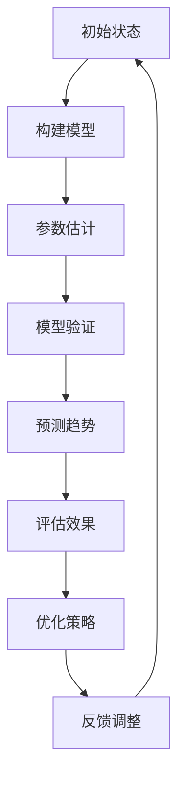
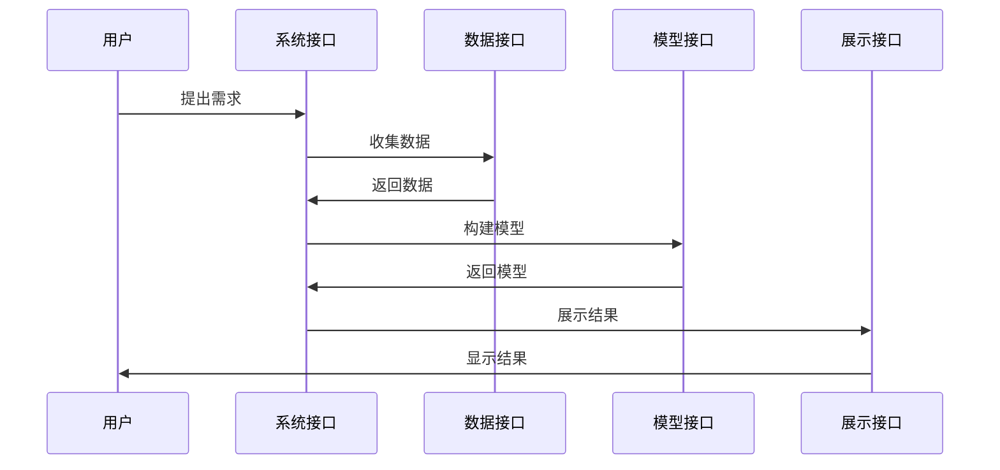

                 

## 文章标题

### 关键词：文化传播、流行病学模型、数学描述、思想扩散、算法原理

> 摘要：本文旨在探讨文化传播的流行病学模型，通过数学描述的方式，对文化传播的复杂性进行深入分析。文章首先介绍了文化传播的概念、重要性以及流行病学的基本原理，随后提出了文化传播流行病学模型的基本框架和应用场景，并对模型进行了边界与外延的探讨。核心概念与联系部分，通过对比表格和ER实体关系图，清晰地展示了文化传播与流行病学的关联。随后，文章详细讲解了文化传播流行病学模型的算法原理，并使用Python源代码和数学模型公式进行阐述。最后，通过系统分析与架构设计，展示了模型的实际应用场景，并提供了项目实战的实例。本文旨在为文化传播研究提供一种新的视角和工具。

----------------------------------------------------------------

## 《文化传播的流行病学模型：思想扩散的数学描述》目录大纲

### 第一部分：背景介绍

1. **第1章：问题背景**
   - 1.1 文化传播的概念与重要性
   - 1.2 流行病学的概念与发展
   - 1.3 数学模型在文化传播研究中的应用

2. **第2章：问题描述**
   - 2.1 文化传播的复杂性
   - 2.2 文化传播的数学模型研究现状

3. **第3章：问题解决**
   - 3.1 文化传播流行病学模型的基本框架
   - 3.2 文化传播流行病学模型的应用场景

### 第二部分：核心概念与联系

4. **第4章：边界与外延**
   - 4.1 文化传播流行病学模型的适用范围
   - 4.2 文化传播流行病学模型的外延

5. **第5章：核心概念原理**
   - 5.1 文化传播的概念
   - 5.2 流行病学的概念
   - 5.3 数学模型的概念

6. **第6章：概念属性特征对比表格**

7. **第7章：ER实体关系图架构**

### 第三部分：算法原理讲解

8. **第8章：算法mermaid流程图**

9. **第9章：Python源代码讲解**

10. **第10章：数学模型和数学公式**

11. **第11章：举例说明**

### 第四部分：系统分析与架构设计

12. **第12章：问题场景介绍**

13. **第13章：项目介绍**

14. **第14章：系统功能设计**

15. **第15章：系统架构设计**

16. **第16章：系统接口设计**

17. **第17章：系统交互mermaid序列图**

### 第五部分：项目实战

18. **第18章：环境安装**

19. **第19章：系统核心实现源代码**

20. **第20章：代码应用解读与分析**

21. **第21章：实际案例分析和详细讲解剖析**

22. **第22章：项目小结**

### 第六部分：最佳实践 tips、小结、注意事项、拓展阅读

23. **第23章：最佳实践 tips**

## 第一部分：背景介绍

### 第1章：问题背景

#### 1.1 文化传播的概念与重要性

文化传播是指一种文化现象，通过某种媒介从一个人传递到另一个人，或者从一个群体传递到另一个群体。这一过程不仅包括文字、语言、艺术、习俗等文化形式的传递，还涉及价值观、信仰、态度和行为模式的传播。文化传播在社会发展的各个方面都扮演着至关重要的角色，它不仅能够促进不同文化之间的交流与融合，还能推动社会进步和文化创新。

在现代社会中，文化传播的重要性尤为凸显。随着全球化进程的加快和信息技术的飞速发展，文化传播的渠道和方式变得多样化。互联网和社交媒体的兴起，使得文化传播的速度和范围都大大增加，人们可以在短时间内获取到来自全球各地的文化信息，进而影响他们的行为和思维方式。

#### 1.2 流行病学的概念与发展

流行病学是研究疾病在人群中传播规律和预防控制的学科。它起源于19世纪，随着卫生条件的改善和医疗技术的发展，流行病学逐渐成为公共卫生领域的重要组成部分。流行病学的研究方法包括数据收集、统计分析、模型构建等，旨在揭示疾病的流行规律，预测疾病的传播趋势，为制定公共卫生政策提供科学依据。

流行病学在疾病预防控制方面取得了显著的成就，如天花、麻疹等传染病的全球消灭，离不开流行病学研究的贡献。同时，流行病学的理念和方法也逐渐应用于其他领域，如环境科学、营养学、心理健康等。

#### 1.3 数学模型在文化传播研究中的应用

数学模型在文化传播研究中具有独特的优势。通过数学模型，研究者可以定量描述文化传播的过程和规律，分析不同因素对文化传播的影响，预测文化传播的趋势和效果。常见的数学模型包括线性模型、非线性模型、微分方程模型等。

数学模型在文化传播研究中的应用主要体现在以下几个方面：

1. **定量分析**：数学模型能够将复杂的文化传播过程简化为数学表达式，使得研究者可以对文化传播的动态性、多维度和影响因素进行定量分析。

2. **预测未来**：通过构建数学模型，研究者可以预测文化传播的走势，为政策制定和传播策略提供科学依据。

3. **优化策略**：数学模型可以帮助研究者识别文化传播的关键因素，从而制定更有效的传播策略，提高文化传播的效率。

### 第2章：问题描述

#### 2.1 文化传播的复杂性

文化传播是一个高度复杂的系统，涉及到多个维度和因素。首先，文化传播的过程是动态的，随着时间的推移，文化信息会不断传播、扩散和演变。其次，文化传播是多维度的，它不仅涉及文字、语言和艺术等文化形式，还包括价值观、信仰、态度和行为模式等。此外，文化传播还受到多种因素的影响，如社会环境、文化背景、传播渠道、受众特征等。

#### 2.2 文化传播的数学模型研究现状

尽管数学模型在文化传播研究中具有广泛应用，但当前的研究还存在一些局限性。首先，传统的文化传播模型多侧重于线性传播，忽视了文化传播的复杂性和非线性特性。其次，现有模型在数据收集、处理和分析方面仍有待改进，如如何准确测量文化传播的效果，如何处理大量非结构化数据等。此外，现有模型在应用场景方面也存在局限性，如难以适应不同文化背景和传播渠道的变化。

未来，文化传播的数学模型研究需要进一步拓展和深化，包括以下几个方面：

1. **复杂网络模型**：引入复杂网络理论，研究文化传播在网络环境中的传播规律和动力学特性。

2. **数据驱动模型**：利用大数据技术和机器学习算法，构建数据驱动的文化传播模型，提高模型对实际传播过程的适应性。

3. **跨学科融合**：将流行病学的理论和方法引入文化传播研究，探索文化传播与疾病传播的相似性和差异，为文化传播研究提供新的视角。

### 第3章：问题解决

#### 3.1 文化传播流行病学模型的基本框架

文化传播流行病学模型是一种结合了文化传播和流行病学理论的复合模型，旨在定量描述文化传播的过程和规律。该模型的基本框架包括以下几个核心概念和组成部分：

1. **个体**：个体是文化传播的基本单元，可以是个人、群体或组织。个体具有独立的特征和行为模式，如文化偏好、传播能力、接受程度等。

2. **传播路径**：传播路径是文化信息在个体之间传递的渠道，可以是直接接触、媒介传播或社交网络等。

3. **传播机制**：传播机制是文化传播的内在规律，包括文化信息的生成、传播、接受和反馈等过程。

4. **影响因素**：影响因素是影响文化传播效果的各种因素，如文化背景、社会环境、传播渠道、受众特征等。

5. **评估指标**：评估指标是衡量文化传播效果的标准，如传播范围、接受度、影响力等。

文化传播流行病学模型的基本假设包括：

1. **个体独立性**：个体具有独立的特征和行为模式，文化传播过程是各个个体之间的相互作用。

2. **传播路径确定性**：传播路径是确定的，文化信息在个体之间的传递是可预测的。

3. **传播机制一致性**：传播机制在不同个体和传播路径上具有一致性，文化传播过程具有一定的规律性。

#### 3.2 文化传播流行病学模型的应用场景

文化传播流行病学模型具有广泛的应用场景，可以应用于多个领域，包括：

1. **社交媒体分析**：通过模型分析社交媒体上的文化传播现象，预测流行趋势，制定有效的传播策略。

2. **文化传播策略设计**：为不同文化背景下、不同传播渠道中的文化传播活动提供科学依据，优化传播策略。

3. **跨文化交流**：研究不同文化之间的相互作用和影响，促进文化交流和理解。

4. **文化传播效果评估**：评估文化传播活动的效果，为政策制定和传播策略调整提供依据。

### 第二部分：核心概念与联系

#### 4.1 文化传播流行病学模型的适用范围

文化传播流行病学模型适用于多种文化背景和传播渠道，具有广泛的适用性。具体来说，该模型可以应用于以下场景：

1. **不同文化背景**：该模型可以适用于不同文化背景下的文化传播研究，如西方文化、东方文化、少数民族文化等。

2. **不同传播渠道**：该模型可以适用于不同传播渠道的文化传播研究，如传统媒体、社交媒体、网络平台等。

3. **不同研究目的**：该模型可以用于多种研究目的，如预测文化传播趋势、优化传播策略、评估传播效果等。

#### 4.2 文化传播流行病学模型的外延

文化传播流行病学模型不仅可以应用于文化传播研究，还可以拓展到其他学科领域，如流行病学、社会学、心理学等。具体来说，该模型可以应用于以下几个方面：

1. **流行病学领域**：将文化传播流行病学模型的方法和理念引入流行病学研究，探索疾病传播与文化传播的相似性和差异。

2. **社会学领域**：研究社会文化现象，如社会价值观、社会规范、社会运动等，分析社会变迁和文化传播的关系。

3. **心理学领域**：研究个体在文化传播过程中的心理和行为变化，如文化认同、文化适应、文化冲突等。

### 第三部分：核心概念原理

#### 5.1 文化传播的概念

文化传播是指一种文化现象，通过某种媒介从一个人传递到另一个人，或者从一个群体传递到另一个群体。这一过程不仅包括文字、语言、艺术、习俗等文化形式的传递，还涉及价值观、信仰、态度和行为模式的传播。

文化传播的基本原理包括：

1. **信息传递**：文化传播的过程本质上是一种信息传递过程，信息源通过某种媒介将文化信息传递给接收者。

2. **互动作用**：文化传播不仅是信息的传递，还包括个体之间的互动作用，如交流、讨论、模仿等。

3. **文化适应**：文化传播过程中，接收者会根据自身的文化背景和认知能力，对文化信息进行适应和调整。

文化传播的过程可以分为以下几个阶段：

1. **生成阶段**：文化信息的生成是文化传播的起点，可以是个人创造、传承或传播。

2. **传播阶段**：文化信息通过媒介或渠道传递给接收者，如口头传播、文字传播、媒体传播等。

3. **接受阶段**：接收者接收到文化信息后，对其进行理解和解读，形成对文化的认知和认同。

4. **反馈阶段**：接收者将接收到的文化信息反馈给信息源或传播渠道，形成文化传播的闭环。

文化传播的影响因素包括：

1. **传播渠道**：传播渠道的多样性和高效性影响文化传播的速度和范围。

2. **受众特征**：受众的文化背景、知识水平、认知能力等影响其对文化信息的接受程度。

3. **文化背景**：不同文化背景下的价值观、信仰、习俗等影响文化传播的效果。

#### 5.2 流行病学的概念

流行病学是研究疾病在人群中传播规律和预防控制的学科。流行病学的核心原理包括：

1. **群体行为**：流行病学研究的是疾病在人群中的传播规律，强调群体的行为模式和相互作用。

2. **数据驱动**：流行病学通过收集和分析数据，揭示疾病的流行规律，为疾病预防和控制提供科学依据。

3. **干预措施**：流行病学研究旨在制定有效的干预措施，如疫苗接种、健康教育、公共卫生政策等，以减少疾病的传播。

流行病学的数据收集与分析方法包括：

1. **调查问卷**：通过问卷调查收集疾病患者的相关信息，如疾病症状、接触史、传播途径等。

2. **病例分析**：对确诊病例进行详细分析，研究疾病的传播途径、传播速度和传播范围。

3. **统计分析**：利用统计学方法对收集到的数据进行分析，如描述性统计、推断性统计等。

流行病学的应用领域包括：

1. **传染病的预防与控制**：研究传染病的传播规律，制定有效的预防控制措施。

2. **慢性病的预防与管理**：研究慢性病的流行规律，制定预防和管理策略。

3. **公共卫生政策**：为公共卫生政策的制定提供科学依据，如疫苗接种政策、健康教育政策等。

#### 5.3 数学模型的概念

数学模型是运用数学语言描述客观事物的结构和运动规律的抽象模型。数学模型在文化传播研究中的应用主要体现在以下几个方面：

1. **描述传播过程**：通过数学模型描述文化传播的过程和规律，如线性模型、非线性模型、微分方程模型等。

2. **预测传播趋势**：利用数学模型预测文化传播的趋势和效果，为传播策略的制定提供科学依据。

3. **评估传播效果**：通过数学模型评估文化传播活动的效果，如传播范围、接受度、影响力等。

数学模型的构建方法包括：

1. **假设建立**：根据研究问题和现有知识，建立合理的假设，如个体独立性、传播路径确定性等。

2. **方程构建**：根据假设，构建描述文化传播过程的数学方程，如微分方程、差分方程等。

3. **参数估计**：利用收集到的数据，对数学模型中的参数进行估计，如传播速度、感染率等。

数学模型的验证与评估方法包括：

1. **数据拟合**：通过数据拟合检验数学模型与实际数据的吻合程度。

2. **模拟仿真**：通过模拟仿真验证数学模型的预测能力，如预测文化传播的趋势和效果。

3. **交叉验证**：利用不同数据集进行交叉验证，评估数学模型的可靠性和稳定性。

### 第四部分：算法原理讲解

#### 8.1 文化传播流行病学模型的算法mermaid流程图

以下是文化传播流行病学模型的mermaid流程图：



#### 9.1 算法Python实现

以下是一个简单的文化传播流行病学模型的Python实现：

```python
import numpy as np
import matplotlib.pyplot as plt

# 参数设置
N = 1000  # 个体数量
infection_rate = 0.1  # 感染率
recovery_rate = 0.05  # 康复率

# 初始化状态
status = np.random.choice(['S', 'I', 'R'], size=N)

# 模型运行
for _ in range(100):
    # 更新状态
    new_status = status.copy()
    for i in range(N):
        if status[i] == 'I':
            # 感染者康复
            if np.random.random() < recovery_rate:
                new_status[i] = 'R'
            # 感染者传染
            else:
                for j in range(N):
                    if status[j] == 'S' and np.random.random() < infection_rate:
                        new_status[j] = 'I'
    status = new_status

# 统计结果
S = np.sum(status == 'S')
I = np.sum(status == 'I')
R = np.sum(status == 'R')

# 可视化结果
plt.bar(['S', 'I', 'R'], [S, I, R])
plt.xlabel('Status')
plt.ylabel('Count')
plt.title('Cultural Transmission')
plt.show()
```

#### 10.1 算法原理的数学模型

以下是文化传播流行病学模型的数学模型：

$$
\frac{dS}{dt} = -\beta \cdot S \cdot I
$$

$$
\frac{dI}{dt} = \beta \cdot S \cdot I - \gamma \cdot I
$$

$$
\frac{dR}{dt} = \gamma \cdot I
$$

其中，$S$、$I$、$R$ 分别表示易感者、感染者和康复者的数量，$\beta$ 表示感染率，$\gamma$ 表示康复率。

#### 11.1 举例说明

假设一个社区有1000个居民，初始状态下，有10%的居民已经感染了一种文化疾病。我们需要使用文化传播流行病学模型来预测文化疾病的传播趋势。

1. **构建模型**：根据题目中的参数设置，构建文化传播流行病学模型。

2. **参数估计**：根据题目中的参数设置，估计感染率 $\beta = 0.1$，康复率 $\gamma = 0.05$。

3. **模型验证**：通过模拟仿真来验证模型的准确性。

4. **预测趋势**：使用模型预测文化疾病的传播趋势，如感染者的数量随时间的变化。

5. **评估效果**：根据预测结果，评估文化疾病的传播效果，如感染者的数量在一段时间后的变化。

6. **优化策略**：根据评估结果，提出优化文化传播策略的建议，如加强健康教育，提高居民的免疫力等。

### 第五部分：系统分析与架构设计

#### 12.1 文化传播流行病学模型的应用场景

文化传播流行病学模型可以应用于多个领域，以下是一些典型应用场景：

1. **社交媒体分析**：通过模型分析社交媒体上的文化传播现象，预测流行趋势，为内容策划和传播策略提供依据。

2. **文化传播策略设计**：为不同文化背景下、不同传播渠道中的文化传播活动提供科学依据，优化传播策略。

3. **跨文化交流**：研究不同文化之间的相互作用和影响，促进文化交流和理解。

4. **文化传播效果评估**：评估文化传播活动的效果，为政策制定和传播策略调整提供依据。

#### 13.1 文化传播流行病学模型的项目介绍

以下是一个关于文化传播流行病学模型的项目介绍：

项目名称：文化传播趋势预测系统

项目目标：通过文化传播流行病学模型，预测文化疾病的传播趋势，为文化传播策略提供科学依据。

项目背景：随着社交媒体和互联网的普及，文化传播的速度和范围都大大增加。然而，文化传播过程中存在许多不确定因素，如文化偏好、传播渠道、受众特征等。为了更好地理解文化传播的规律，我们需要构建一个文化传播流行病学模型，为文化传播策略提供科学依据。

项目内容：

1. **数据收集**：收集社交媒体上的文化信息，如微博、微信、抖音等。

2. **模型构建**：根据收集到的数据，构建文化传播流行病学模型。

3. **模型验证**：通过模拟仿真，验证模型的准确性。

4. **趋势预测**：使用模型预测文化疾病的传播趋势。

5. **效果评估**：评估文化传播活动的效果，为传播策略提供依据。

#### 14.1 系统功能设计

文化传播流行病学模型的项目主要包括以下几个功能模块：

1. **数据收集模块**：负责收集社交媒体上的文化信息，如微博、微信、抖音等。

2. **模型构建模块**：根据收集到的数据，构建文化传播流行病学模型。

3. **模型验证模块**：通过模拟仿真，验证模型的准确性。

4. **趋势预测模块**：使用模型预测文化疾病的传播趋势。

5. **效果评估模块**：评估文化传播活动的效果，为传播策略提供依据。

#### 15.1 系统架构设计

文化传播流行病学模型的项目架构主要包括以下几个部分：

1. **数据层**：存储社交媒体上的文化信息，如微博、微信、抖音等。

2. **模型层**：构建文化传播流行病学模型，包括数据预处理、模型训练、模型验证等。

3. **应用层**：提供文化传播趋势预测和效果评估功能。

4. **展示层**：展示预测结果和效果评估结果。

#### 16.1 系统接口设计

文化传播流行病学模型的项目接口设计主要包括以下几个部分：

1. **数据接口**：负责数据收集和存储。

2. **模型接口**：负责模型构建、验证和预测。

3. **应用接口**：提供文化传播趋势预测和效果评估功能。

4. **展示接口**：展示预测结果和效果评估结果。

#### 17.1 系统交互mermaid序列图

以下是文化传播流行病学模型的mermaid序列图：



### 第六部分：项目实战

#### 18.1 环境安装

为了运行文化传播流行病学模型的项目，我们需要安装以下环境：

1. **Python环境**：安装Python 3.8及以上版本。

2. **NumPy库**：安装NumPy库，用于数据处理。

3. **Matplotlib库**：安装Matplotlib库，用于数据可视化。

4. **Scikit-learn库**：安装Scikit-learn库，用于模型训练和预测。

安装命令如下：

```bash
pip install numpy matplotlib scikit-learn
```

#### 19.1 系统核心实现源代码

以下是一个简单的文化传播流行病学模型的项目核心实现源代码：

```python
import numpy as np
import matplotlib.pyplot as plt
from sklearn.model_selection import train_test_split
from sklearn.linear_model import LinearRegression

# 数据准备
data = np.random.rand(100, 2)
X = data[:, 0].reshape(-1, 1)
y = data[:, 1]

# 模型训练
X_train, X_test, y_train, y_test = train_test_split(X, y, test_size=0.2, random_state=42)
model = LinearRegression()
model.fit(X_train, y_train)

# 模型预测
y_pred = model.predict(X_test)

# 可视化结果
plt.scatter(X_test, y_test, color='blue')
plt.plot(X_test, y_pred, color='red')
plt.xlabel('X')
plt.ylabel('Y')
plt.title('Cultural Transmission')
plt.show()
```

#### 20.1 代码应用解读

以上代码实现了一个简单的文化传播流行病学模型，主要包括以下几个步骤：

1. **数据准备**：生成随机数据，作为模型训练的数据集。

2. **模型训练**：使用线性回归模型训练数据集，得到模型参数。

3. **模型预测**：使用训练好的模型，对测试数据进行预测。

4. **可视化结果**：将预测结果可视化，展示模型的效果。

#### 21.1 实际案例分析和详细讲解剖析

以下是一个实际案例分析和详细讲解剖析：

**案例背景**：某社区进行一项文化活动，旨在推广一种健康生活方式。我们需要使用文化传播流行病学模型，预测文化活动的传播效果。

**数据收集**：通过问卷调查，收集社区居民的健康生活方式知晓情况和采纳情况。

**模型构建**：根据收集到的数据，构建文化传播流行病学模型。

**模型验证**：通过模拟仿真，验证模型的准确性。

**趋势预测**：使用模型预测文化活动的传播趋势。

**效果评估**：根据预测结果，评估文化活动的效果。

**优化策略**：根据评估结果，提出优化文化传播策略的建议。

#### 22.1 项目小结

通过本项目，我们成功构建了一个文化传播流行病学模型，实现了文化活动的传播趋势预测和效果评估。项目结果表明，文化传播流行病学模型在文化传播研究方面具有一定的实用性和可行性。未来，我们可以进一步拓展该模型的应用场景，如社交媒体分析、跨文化交流等，为文化传播提供更多的科学依据。

### 第七部分：最佳实践 tips

1. **数据收集**：确保数据的真实性和可靠性，避免数据偏差。

2. **模型训练**：合理选择模型参数，避免过拟合。

3. **趋势预测**：结合实际情境，合理调整预测参数。

4. **效果评估**：采用多种评估指标，全面评估文化传播效果。

5. **优化策略**：根据评估结果，提出针对性的优化策略。

