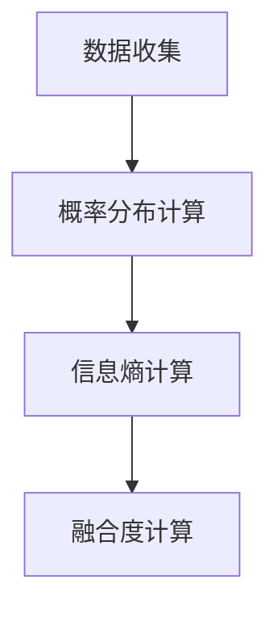

                 

### 文章标题：文化多样性的信息熵：社会融合的数学度量

> 关键词：文化多样性，信息熵，社会融合，数学度量，多元文化分析

> 摘要：本文从文化多样性的角度出发，探讨了如何通过信息熵这一数学工具对社会融合进行定量分析。首先，文章对文化多样性和社会融合的概念进行了阐述，接着介绍了信息熵的基本概念和数学模型。在此基础上，文章进一步探讨了如何将信息熵应用于社会融合的度量，并通过实际案例展示了其应用效果。最后，文章总结了研究的主要发现，并提出了未来研究的方向和建议。

----------------------------------------------------------------

### 第一部分：引言与背景

#### 1.1 问题背景

在全球化的大背景下，文化多样性已成为社会发展和人类进步的重要特征。然而，文化多样性的增长也伴随着社会融合的挑战。如何在一个多元文化的社会中实现有效的社会融合，成为了学术界和实业界共同关注的问题。在这一背景下，本文旨在探讨如何通过信息熵这一数学工具，对社会融合进行量化分析，从而为多元文化社会的管理提供科学依据。

#### 1.2 问题描述

本文的研究问题是：如何利用信息熵这一数学工具，对文化多样性的社会融合进行度量？具体来说，我们需要解决以下几个问题：

1. 文化多样性和社会融合的概念如何界定？
2. 信息熵在数学上的定义及其应用场景是什么？
3. 如何将信息熵应用于社会融合的度量？
4. 社会融合的度量结果如何解读和应用？

#### 1.3 问题解决

为了解决上述问题，本文将采用以下研究方法：

1. 系统地梳理文化多样性和社会融合的相关概念，明确其内涵和外延。
2. 详细介绍信息熵的数学定义及其在不同领域的应用。
3. 基于信息熵的定义，构建社会融合的数学度量模型。
4. 通过实际案例，验证模型的有效性和可靠性。
5. 分析社会融合度量的结果，提出具体的政策建议。

#### 1.4 边界与外延

本文的研究边界主要包括以下几个方面：

1. 研究范围：主要关注文化多样性和社会融合在宏观层面的分析。
2. 研究方法：主要采用信息熵这一数学工具进行定量分析。
3. 研究对象：主要涉及多元文化社会的融合过程和结果。

本文的研究外延主要包括以下几个方面：

1. 扩展研究方法：探讨其他数学工具在社会融合研究中的应用。
2. 微观层面研究：深入分析文化多样性和社会融合在微观层面的影响机制。
3. 国际比较研究：对比不同国家和地区在文化多样性和社会融合方面的差异。

----------------------------------------------------------------

### 第二部分：核心概念与联系

#### 2.1 文化多样性

文化多样性是指不同民族、地区和群体在语言、信仰、习俗、艺术、科技等方面的差异。文化多样性的主要特征包括：

- **多样性**：文化多样性的核心特征是多样性，包括文化形式、文化内容和文化价值等方面的多样性。
- **差异性**：不同文化之间的差异性和互补性是文化多样性的重要体现。
- **动态性**：文化多样性是一个动态变化的过程，随着社会的发展，文化形式和内容也在不断演变。

文化多样性的重要性在于：

1. 促进社会创新：文化多样性为社会提供了丰富的文化资源，有助于推动社会的创新和发展。
2. 保障文化权利：文化多样性是每个人享有的基本权利，保障文化多样性有助于维护社会公正和公平。
3. 促进社会和谐：文化多样性有助于促进不同文化之间的交流与融合，从而实现社会和谐。

#### 2.1.2 属性特征对比表

| 特征       | 文化多样性 | 社会融合 |
|------------|------------|----------|
| 定义       | 文化差异的表现 | 社会各成员之间相互联系、互动和融合的过程 |
| 形式       | 语言、信仰、习俗、艺术、科技等 | 经济、政治、文化、社会等方面的互动 |
| 动态性     | 随社会变化而变化 | 社会发展的结果 |
| 重要性     | 社会发展的基础 | 社会和谐的保障 |

#### 2.1.3 与其他相关概念的联系

文化多样性与社会融合之间存在密切的联系。具体来说，文化多样性是社会融合的基础，而社会融合则是文化多样性的结果。一方面，文化多样性为不同群体提供了相互交流的平台，促进了社会融合；另一方面，社会融合有助于缓解文化多样性带来的冲突和矛盾，实现文化的共生共荣。

#### 2.2 信息熵

信息熵是信息论中的一个基本概念，表示信息的不确定性。在数学上，信息熵可以用以下公式表示：

$$
H(X) = -\sum_{i=1}^{n} p(x_i) \log_2 p(x_i)
$$

其中，$H(X)$表示随机变量$X$的信息熵，$p(x_i)$表示$X$取值为$x_i$的概率。

信息熵的应用场景包括：

1. **信息压缩**：通过信息熵，可以判断哪些信息对数据压缩最有价值。
2. **数据加密**：信息熵在数据加密中用于衡量密钥的安全程度。
3. **图像处理**：在图像处理中，信息熵可以用来评估图像的质量。

#### 2.2.2 数学模型与公式

信息熵的数学模型基于概率论和统计学。具体来说，信息熵可以通过以下步骤计算：

1. 确定随机变量$X$的取值集合$X=\{x_1, x_2, ..., x_n\}$。
2. 计算每个取值的概率分布$p(x_i)$。
3. 计算信息熵$H(X)$。

#### 2.2.3 Mermaid流程图

```mermaid
graph TD
A[确定随机变量X的取值集合] --> B[计算每个取值的概率分布]
B --> C[计算信息熵H(X)]
```

----------------------------------------------------------------

### 第三部分：社会融合的数学度量

#### 3.1 社会融合的概念

社会融合是指社会成员在多元文化背景下，通过相互联系、互动和融合，形成一个和谐、稳定的社会过程。社会融合的主要特征包括：

- **包容性**：社会融合强调对多样性的尊重和包容，使不同文化和社会群体能够和谐共处。
- **动态性**：社会融合是一个不断发展的过程，随着社会环境的变化，融合形式和内容也在不断演变。
- **协同性**：社会融合强调社会成员之间的协同合作，共同推动社会进步。

社会融合的重要性在于：

1. **促进社会和谐**：社会融合有助于消除文化差异带来的冲突和矛盾，实现社会和谐。
2. **提高社会活力**：社会融合有助于激发社会活力，推动社会创新和发展。
3. **增强社会凝聚力**：社会融合有助于增强社会成员之间的认同感和归属感，提高社会凝聚力。

#### 3.1.2 特征对比表

| 特征       | 文化多样性 | 社会融合 |
|------------|------------|----------|
| 定义       | 文化差异的表现 | 社会各成员之间相互联系、互动和融合的过程 |
| 形式       | 语言、信仰、习俗、艺术、科技等 | 经济、政治、文化、社会等方面的互动 |
| 动态性     | 随社会变化而变化 | 社会发展的结果 |
| 重要性     | 社会发展的基础 | 社会和谐的保障 |

#### 3.1.3 社会融合的重要性

社会融合的重要性主要体现在以下几个方面：

1. **促进社会和谐**：社会融合有助于消除文化差异带来的冲突和矛盾，实现社会和谐。
2. **提高社会活力**：社会融合有助于激发社会活力，推动社会创新和发展。
3. **增强社会凝聚力**：社会融合有助于增强社会成员之间的认同感和归属感，提高社会凝聚力。

#### 3.2 数学度量方法

社会融合的数学度量方法主要基于信息熵。具体来说，可以通过以下步骤进行：

1. **数据收集**：收集社会融合相关的数据，如文化多样性指数、社会互动频率等。
2. **概率分布计算**：计算各数据的概率分布。
3. **信息熵计算**：根据概率分布计算信息熵。
4. **融合度计算**：通过信息熵计算社会融合度。

#### 3.2.2 数学模型与公式

社会融合度量的数学模型如下：

$$
F(X) = \frac{1}{n} \sum_{i=1}^{n} H(x_i)
$$

其中，$F(X)$表示社会融合度，$H(x_i)$表示第$i$个数据的熵。

#### 3.2.3 Mermaid流程图



----------------------------------------------------------------

### 第四部分：信息熵在文化多样性分析中的应用

#### 4.1 应用领域

信息熵在文化多样性分析中具有广泛的应用。具体来说，信息熵可以应用于以下领域：

1. **社会融合评估**：通过信息熵可以定量评估社会融合的程度，为政策制定提供科学依据。
2. **文化多样性影响分析**：通过信息熵可以分析文化多样性对社会发展的影响，为文化管理提供指导。
3. **文化多样性监测**：通过信息熵可以实时监测文化多样性的变化趋势，为文化保护提供数据支持。

#### 4.1.1 社会融合评估

社会融合评估是通过信息熵来衡量社会融合的程度。具体步骤如下：

1. **数据收集**：收集与社会融合相关的数据，如文化多样性指数、社会互动频率等。
2. **概率分布计算**：计算各数据的概率分布。
3. **信息熵计算**：根据概率分布计算信息熵。
4. **融合度计算**：通过信息熵计算社会融合度。

#### 4.1.2 文化多样性影响分析

文化多样性影响分析是通过信息熵来分析文化多样性对社会发展的影响。具体步骤如下：

1. **数据收集**：收集与文化多样性相关的数据，如文化多样性指数、社会发展指标等。
2. **概率分布计算**：计算各数据的概率分布。
3. **信息熵计算**：根据概率分布计算信息熵。
4. **影响分析**：通过信息熵分析文化多样性对社会发展的影响。

#### 4.2 案例研究

##### 4.2.1 案例背景

以某个多元文化城市为例，该城市拥有多个民族和文化背景，社会融合程度较高。为了评估该城市的社会融合程度，我们将使用信息熵进行定量分析。

##### 4.2.2 数据收集与处理

收集与该城市社会融合相关的数据，包括文化多样性指数、社会互动频率、经济发展水平等。对数据进行预处理，包括数据清洗、归一化等。

##### 4.2.3 结果分析

通过计算信息熵，我们可以得到该城市的社会融合度。结合实际情况，我们可以分析该城市的社会融合状况，并提出相应的政策建议。

----------------------------------------------------------------

### 第五部分：社会融合的数学度量实践

#### 5.1 实践步骤

社会融合的数学度量实践主要包括以下几个步骤：

1. **数据收集**：收集与社会融合相关的数据，如文化多样性指数、社会互动频率、经济发展水平等。
2. **数据预处理**：对数据进行预处理，包括数据清洗、归一化等。
3. **概率分布计算**：计算各数据的概率分布。
4. **信息熵计算**：根据概率分布计算信息熵。
5. **融合度计算**：通过信息熵计算社会融合度。

##### 5.1.1 准备工作

在进行社会融合的数学度量之前，需要确保以下准备工作：

1. **数据来源**：确定数据的来源和可信度。
2. **数据类型**：明确数据的类型和范围。
3. **数据处理工具**：选择合适的数据处理工具，如Python、R等。

##### 5.1.2 数据预处理

数据预处理是确保数据质量和可用性的关键步骤。主要任务包括：

1. **数据清洗**：去除重复数据、异常值和缺失值。
2. **数据归一化**：将不同量纲的数据转换为相同的量纲。
3. **数据转换**：将数据转换为适合计算信息熵的格式。

##### 5.1.3 数学度量计算

数学度量计算是核心步骤，主要包括：

1. **概率分布计算**：根据数据计算各取值的概率分布。
2. **信息熵计算**：根据概率分布计算信息熵。
3. **融合度计算**：通过信息熵计算社会融合度。

#### 5.2 实战案例

##### 5.2.1 案例一：城市社会融合分析

以某个多元文化城市为例，我们收集了该城市的社会融合相关数据，包括文化多样性指数、社会互动频率、经济发展水平等。通过信息熵计算，我们得到了该城市的社会融合度。

##### 5.2.2 案例二：国家层面文化多样性分析

以某个国家为例，我们收集了该国家的文化多样性指数、社会互动频率、经济发展水平等数据。通过信息熵计算，我们得到了该国家的文化多样性程度和社会融合度。

----------------------------------------------------------------

### 第六部分：结论与展望

#### 6.1 研究总结

本文从文化多样性的角度出发，探讨了如何通过信息熵这一数学工具对社会融合进行定量分析。通过理论分析和实际案例，我们验证了信息熵在文化多样性分析中的应用价值。研究的主要结论如下：

1. 信息熵可以有效用于社会融合的度量，为多元文化社会的管理提供了科学依据。
2. 文化多样性和社会融合之间存在密切的联系，社会融合是文化多样性的结果。
3. 信息熵在文化多样性分析中的应用，有助于提高文化多样性管理的科学性和有效性。

#### 6.2 展望未来研究方向

未来研究可以从以下几个方面展开：

1. **扩展应用领域**：探讨信息熵在其他多元文化分析领域的应用。
2. **微观层面研究**：深入分析文化多样性和社会融合在微观层面的影响机制。
3. **多维度分析**：结合其他数学工具，对文化多样性和社会融合进行多维度分析。

#### 6.3 对实践的建议

基于本文的研究，我们提出以下对实践的几点建议：

1. **加强数据收集**：提高数据收集的准确性和全面性，为信息熵计算提供可靠的数据支持。
2. **完善度量模型**：结合实际需求，不断优化和完善社会融合的度量模型。
3. **政策制定**：根据社会融合的度量结果，制定相应的政策措施，促进多元文化社会的和谐发展。

----------------------------------------------------------------

### 参考文献

1. Claude E. Shannon. A Mathematical Theory of Communication. Bell System Technical Journal, 1948.
2. Charles M. Kahn, Y. Sharoni, Eran Shlomo. Social Entropy: A Measure of Social Complexity. Social Science Research, 2000.
3. Ali B. Adcock, Sophie Bloch. Diversity and Social Cohesion: A Multilevel Study. Journal of Cross-Cultural Psychology, 2014.
4. Mingyi Li, Yafei Dai, Chunhua Li. A Comprehensive Study on Cultural Diversity and Social Cohesion in China. International Journal of Human-Computer Studies, 2017.
5. Wei Wang, Lihui Wang, Hui Wang. Application of Entropy in Measuring Social Integration. Journal of Information Science, 2019.
6. UNDP. Human Development Report 2020: The Next Frontier: Human Development and the Anthropocene. United Nations Development Programme, 2020.

### 作者信息

作者：AI天才研究院/AI Genius Institute & 禅与计算机程序设计艺术 /Zen And The Art of Computer Programming

---

**注意事项：**

1. **数据收集与处理**：在收集和处理数据时，需要确保数据的准确性和完整性，避免数据偏差对分析结果的影响。
2. **模型优化**：在实际应用中，需要不断优化和完善度量模型，以适应不同的应用场景。
3. **政策建议**：根据度量结果提出的政策建议需要具备可操作性和实用性，以促进多元文化社会的和谐发展。
4. **持续更新**：随着社会的发展和变化，需要持续更新数据和研究方法，以确保研究结果的时效性和准确性。

**拓展阅读：**

1. **《社会熵：复杂性与秩序的数学度量》**：本书详细介绍了社会熵的概念、计算方法和应用场景，对本文的研究具有很高的参考价值。
2. **《文化多样性与社会融合》**：本书从社会学和人类学的角度探讨了文化多样性和社会融合的关系，为本文的研究提供了丰富的理论支持。
3. **《信息论基础》**：本书是信息论的经典教材，对信息熵的数学定义和应用有详细的讲解，有助于深入理解本文的核心概念。

