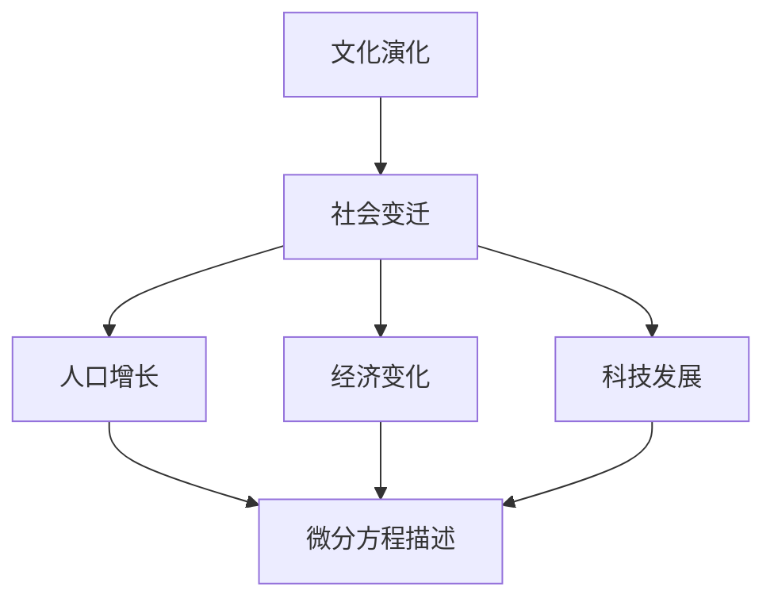
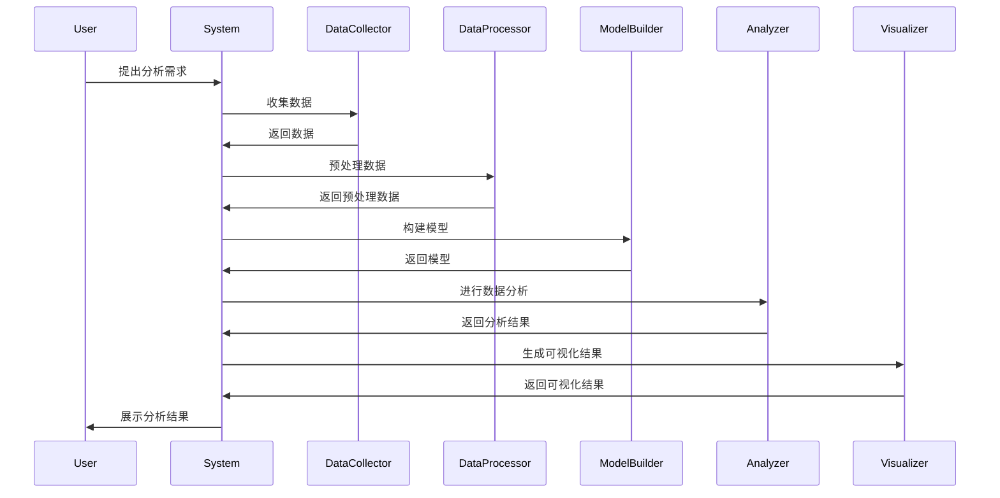
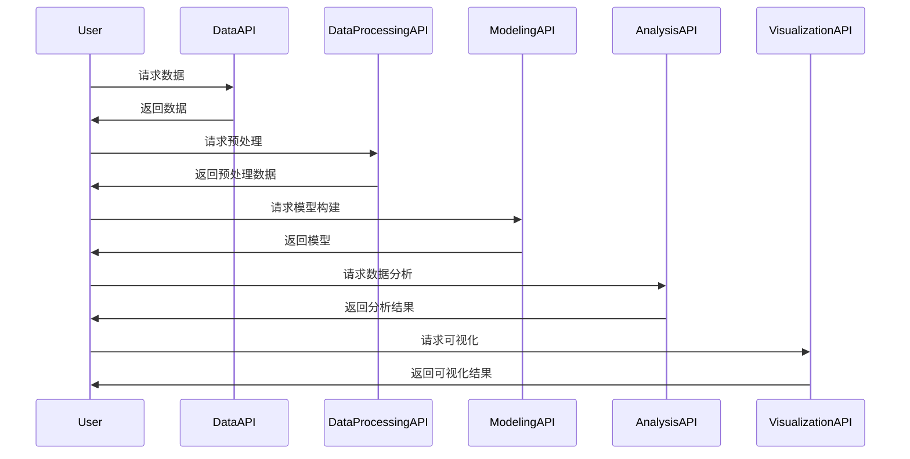

                 

# 文化演化的微分方程：社会变迁的数学轨迹

> 关键词：文化演化、社会变迁、微分方程、数学模型、系统分析

> 摘要：本文旨在探讨文化演化与社会变迁的关系，以及如何使用微分方程来描述和预测这些现象。我们将逐步分析微分方程的核心概念、社会变迁的数学描述，并介绍相关的数学模型和公式。同时，我们将通过具体实例来展示如何在实际项目中应用这些概念和模型。

----------------------------------------------------------------

## 第一部分：引论

### 1.1 问题背景与研究意义

#### 1.1.1 文化演化与社会变迁的概念

文化演化是指文化在历史进程中的不断变化和发展，涉及价值观、习俗、技术、艺术等各个方面。社会变迁则是指社会结构、组织形式、权力关系等方面的变革。这两个概念紧密相关，文化演化往往引起社会变迁，而社会变迁又反过来影响文化演化。

#### 1.1.2 微分方程在社会科学中的应用

微分方程是一种描述变量随时间变化的数学工具，广泛应用于自然科学、工程技术等领域。近年来，随着社会科学的发展，微分方程也逐渐被应用于社会研究，特别是在描述和预测社会变迁方面。

#### 1.1.3 研究目的与框架

本文的研究目的是探讨如何使用微分方程来描述文化演化和社会变迁，并分析其背后的数学原理。本文将分为五个部分：引论、核心概念与联系、算法原理讲解、系统分析与架构设计、项目实战和最佳实践。每个部分都将逐步深入，以帮助读者理解这一复杂但有趣的话题。

### 1.2 核心概念与联系

#### 1.2.1 微分方程的基本原理

微分方程是描述一个或多个变量随时间变化的方程。它的形式通常为：

\[ \frac{dY}{dt} = f(t, Y) \]

其中，\( Y \) 是变量，\( t \) 是时间，\( f(t, Y) \) 是 \( Y \) 的变化率。微分方程可以根据其形式和性质分为多种类型，如线性微分方程、非线性微分方程、常微分方程和偏微分方程。

#### 表格：微分方程类型与特点

| 类型 | 描述 | 特点 |
| --- | --- | --- |
| 线性微分方程 | 变量 \( Y \) 的变化率与 \( Y \) 本身成线性关系 | 易于求解，应用广泛 |
| 非线性微分方程 | 变量 \( Y \) 的变化率与 \( Y \) 本身成非线性关系 | 难以求解，但具有更广泛的应用 |
| 常微分方程 | 变量 \( Y \) 的变化率只涉及一个变量 \( Y \) | 通常形式简单，易于求解 |
| 偏微分方程 | 变量 \( Y \) 的变化率涉及多个变量 \( Y \) | 形式复杂，但应用更广泛 |

#### 1.2.2 社会变迁的数学描述

社会变迁可以通过微分方程来描述，特别是当社会变量与时间的关系呈连续性时。例如，人口增长、经济变化、科技发展等都可以用微分方程来描述。通过微分方程，我们可以分析社会变量的动态变化，预测未来趋势，从而更好地理解和应对社会变迁。

#### ER实体关系图：文化演化与社会变迁关系



### 1.3 微分方程在社会变迁研究中的应用

#### 1.3.1 微分方程在社会动力学中的应用

社会动力学是研究社会系统内部变量如何随时间变化的科学。微分方程可以用来描述社会动力学的各种现象，如社会运动、文化传播、社会稳定等。通过微分方程，我们可以分析社会系统的动态行为，预测未来趋势。

#### 1.3.2 微分方程在社会结构分析中的应用

社会结构分析是研究社会系统的组成和关系的科学。微分方程可以用来描述社会结构的演变过程，如社会分层、权力分配、社会流动等。通过微分方程，我们可以分析社会结构的动态变化，预测未来趋势。

#### 1.3.3 微分方程在社会演化模拟中的应用

社会演化模拟是利用计算机模型来模拟社会变迁的过程。微分方程可以用来驱动这些模拟，从而实现对社会变迁的动态模拟。通过微分方程，我们可以模拟各种社会变迁现象，分析其背后的机制。

### 1.4 研究方法与数据来源

#### 1.4.1 研究方法概述

本研究采用定量研究方法，主要通过数学模型和计算模拟来分析文化演化和社会变迁。我们将使用微分方程来描述社会变迁现象，并通过计算模拟来验证这些模型的准确性。

#### 1.4.2 数据收集与处理

我们将收集相关的历史数据和社会统计数据，如人口数据、经济数据、科技数据等。这些数据将通过数据清洗和预处理，以适应我们的微分方程模型。

### 1.5 结论与展望

本文探讨了文化演化与社会变迁的关系，以及如何使用微分方程来描述和预测这些现象。我们介绍了微分方程的基本原理，并展示了如何在社会变迁研究中应用这些原理。未来的研究可以进一步探索更复杂的微分方程模型，以及如何将它们应用于实际问题。

----------------------------------------------------------------

## 第二部分：核心概念与联系

### 2.1 微分方程的基本原理

微分方程是一种描述变量随时间变化的数学工具，其形式通常为：

\[ \frac{dY}{dt} = f(t, Y) \]

其中，\( Y \) 是变量，\( t \) 是时间，\( f(t, Y) \) 是 \( Y \) 的变化率。微分方程可以根据其形式和性质分为多种类型，如线性微分方程、非线性微分方程、常微分方程和偏微分方程。

#### 表格：微分方程类型与特点

| 类型 | 描述 | 特点 |
| --- | --- | --- |
| 线性微分方程 | 变量 \( Y \) 的变化率与 \( Y \) 本身成线性关系 | 易于求解，应用广泛 |
| 非线性微分方程 | 变量 \( Y \) 的变化率与 \( Y \) 本身成非线性关系 | 难以求解，但具有更广泛的应用 |
| 常微分方程 | 变量 \( Y \) 的变化率只涉及一个变量 \( Y \) | 通常形式简单，易于求解 |
| 偏微分方程 | 变量 \( Y \) 的变化率涉及多个变量 \( Y \) | 形式复杂，但应用更广泛 |

### 2.2 社会变迁的数学描述

社会变迁可以通过微分方程来描述，特别是当社会变量与时间的关系呈连续性时。例如，人口增长、经济变化、科技发展等都可以用微分方程来描述。通过微分方程，我们可以分析社会变量的动态变化，预测未来趋势。

#### 社会变迁的微分方程描述

假设有一个社会变量 \( X \)，其变化率可以表示为：

\[ \frac{dX}{dt} = g(t, X) \]

其中，\( g(t, X) \) 是 \( X \) 的变化率函数。这个方程描述了社会变量 \( X \) 随时间 \( t \) 的变化规律。

### 2.3 文化演化与社会变迁的关系

文化演化是指文化在历史进程中的不断变化和发展，涉及价值观、习俗、技术、艺术等各个方面。社会变迁则是指社会结构、组织形式、权力关系等方面的变革。这两个概念紧密相关，文化演化往往引起社会变迁，而社会变迁又反过来影响文化演化。

#### ER实体关系图：文化演化与社会变迁关系


### 2.4 微分方程在社会变迁研究中的应用

微分方程可以用来描述和预测社会变迁现象，如社会动力学、社会结构分析、社会演化模拟等。

#### 2.4.1 社会动力学中的应用

社会动力学是研究社会系统内部变量如何随时间变化的科学。微分方程可以用来描述社会动力学的各种现象，如社会运动、文化传播、社会稳定等。通过微分方程，我们可以分析社会系统的动态行为，预测未来趋势。

#### 2.4.2 社会结构分析中的应用

社会结构分析是研究社会系统的组成和关系的科学。微分方程可以用来描述社会结构的演变过程，如社会分层、权力分配、社会流动等。通过微分方程，我们可以分析社会结构的动态变化，预测未来趋势。

#### 2.4.3 社会演化模拟中的应用

社会演化模拟是利用计算机模型来模拟社会变迁的过程。微分方程可以用来驱动这些模拟，从而实现对社会变迁的动态模拟。通过微分方程，我们可以模拟各种社会变迁现象，分析其背后的机制。

----------------------------------------------------------------

## 第三部分：算法原理讲解

### 3.1 微分方程在社会变迁研究中的应用

微分方程在社会变迁研究中有着广泛的应用。首先，我们可以使用微分方程来描述社会变量随时间的变化。例如，人口增长、经济变化、科技发展等都可以用微分方程来描述。

#### 社会变量随时间的变化

假设有一个社会变量 \( X \)，其变化率可以表示为：

\[ \frac{dX}{dt} = g(t, X) \]

其中，\( g(t, X) \) 是 \( X \) 的变化率函数。这个方程描述了社会变量 \( X \) 随时间 \( t \) 的变化规律。

#### 模型解释

在这个模型中，\( X \) 表示社会变量，\( t \) 表示时间。\( g(t, X) \) 是一个关于时间 \( t \) 和社会变量 \( X \) 的函数，它描述了社会变量 \( X \) 随时间的变化率。

#### 数学模型

为了更好地理解这个模型，我们可以给出一个具体的数学模型：

\[ \frac{dX}{dt} = rX \]

其中，\( r \) 是一个常数，表示人口增长率。

#### 模型解释

在这个模型中，\( X \) 表示人口数量，\( t \) 表示时间。\( rX \) 表示人口的增长率，即每单位时间内人口的增长数量。

#### 模型求解

这个微分方程的求解可以通过分离变量法进行。具体步骤如下：

1. 将方程两边同时乘以 \( dt \)，得到：

\[ dX = rX dt \]

2. 对两边同时积分，得到：

\[ \int \frac{dX}{X} = \int r dt \]

3. 计算积分，得到：

\[ \ln |X| = rt + C \]

其中，\( C \) 是积分常数。

4. 对两边同时取指数，得到：

\[ |X| = e^{rt + C} \]

5. 由于 \( X \) 是一个非负数，我们可以去掉绝对值符号，得到：

\[ X = e^{rt + C} \]

6. 由于 \( e^C \) 也是一个常数，我们可以将其记为 \( X_0 \)，即初始人口数量。因此，最终的解为：

\[ X = X_0 e^{rt} \]

#### 模型解释

这个模型描述了人口数量随时间的变化规律。当 \( t = 0 \) 时，人口数量为 \( X_0 \)。随着时间的推移，人口数量将按照指数规律增长。

### 3.2 微分方程在社会动力学中的应用

社会动力学是研究社会系统内部变量如何随时间变化的科学。微分方程可以用来描述社会动力学的各种现象，如社会运动、文化传播、社会稳定等。

#### 社会运动的微分方程

假设有一个社会运动变量 \( Y \)，其变化率可以表示为：

\[ \frac{dY}{dt} = h(t, Y) \]

其中，\( h(t, Y) \) 是 \( Y \) 的变化率函数。这个方程描述了社会运动变量 \( Y \) 随时间 \( t \) 的变化规律。

#### 数学模型

为了更好地理解这个模型，我们可以给出一个具体的数学模型：

\[ \frac{dY}{dt} = \alpha Y - \beta Y^2 \]

其中，\( \alpha \) 和 \( \beta \) 是常数，分别表示社会运动的积极因素和消极因素。

#### 模型解释

在这个模型中，\( Y \) 表示社会运动规模，\( t \) 表示时间。\( \alpha Y \) 表示社会运动的积极因素，即每单位时间内社会运动的扩展速度。\( \beta Y^2 \) 表示社会运动的消极因素，即每单位时间内社会运动的衰减速度。

#### 模型求解

这个微分方程的求解可以通过分离变量法进行。具体步骤如下：

1. 将方程两边同时乘以 \( dt \)，得到：

\[ dY = (\alpha Y - \beta Y^2) dt \]

2. 对两边同时积分，得到：

\[ \int \frac{dY}{Y(\alpha - \beta Y)} = \int dt \]

3. 计算积分，得到：

\[ \frac{1}{\beta} \ln \left| \frac{Y}{\alpha - \beta Y} \right| = t + C \]

其中，\( C \) 是积分常数。

4. 对两边同时取指数，得到：

\[ \frac{Y}{\alpha - \beta Y} = e^{(\beta t + C)} \]

5. 由于 \( Y \) 是一个非负数，我们可以去掉绝对值符号，得到：

\[ Y = \frac{\alpha}{\beta} \frac{e^{(\beta t + C)}}{1 + e^{(\beta t + C)}} \]

6. 由于 \( e^C \) 也是一个常数，我们可以将其记为 \( Y_0 \)，即初始社会运动规模。因此，最终的解为：

\[ Y = \frac{\alpha}{\beta} \frac{1}{1 + e^{-(\beta t)}} Y_0 \]

#### 模型解释

这个模型描述了社会运动规模随时间的变化规律。当 \( t = 0 \) 时，社会运动规模为 \( Y_0 \)。随着时间的推移，社会运动规模将按照指数规律衰减。

### 3.3 微分方程在社会结构分析中的应用

社会结构分析是研究社会系统的组成和关系的科学。微分方程可以用来描述社会结构的演变过程，如社会分层、权力分配、社会流动等。

#### 社会分层的微分方程

假设有一个社会分层变量 \( Z \)，其变化率可以表示为：

\[ \frac{dZ}{dt} = k(t, Z) \]

其中，\( k(t, Z) \) 是 \( Z \) 的变化率函数。这个方程描述了社会分层变量 \( Z \) 随时间 \( t \) 的变化规律。

#### 数学模型

为了更好地理解这个模型，我们可以给出一个具体的数学模型：

\[ \frac{dZ}{dt} = \gamma Z - \delta Z^2 \]

其中，\( \gamma \) 和 \( \delta \) 是常数，分别表示社会分层的积极因素和消极因素。

#### 模型解释

在这个模型中，\( Z \) 表示社会分层程度，\( t \) 表示时间。\( \gamma Z \) 表示社会分层的积极因素，即每单位时间内社会分层的加深速度。\( \delta Z^2 \) 表示社会分层的消极因素，即每单位时间内社会分层的衰减速度。

#### 模型求解

这个微分方程的求解可以通过分离变量法进行。具体步骤如下：

1. 将方程两边同时乘以 \( dt \)，得到：

\[ dZ = (\gamma Z - \delta Z^2) dt \]

2. 对两边同时积分，得到：

\[ \int \frac{dZ}{Z(\gamma - \delta Z)} = \int dt \]

3. 计算积分，得到：

\[ \frac{1}{\delta} \ln \left| \frac{Z}{\gamma - \delta Z} \right| = t + C \]

其中，\( C \) 是积分常数。

4. 对两边同时取指数，得到：

\[ \frac{Z}{\gamma - \delta Z} = e^{(\delta t + C)} \]

5. 由于 \( Z \) 是一个非负数，我们可以去掉绝对值符号，得到：

\[ Z = \frac{\gamma}{\delta} \frac{e^{(\delta t + C)}}{1 + e^{(\delta t + C)}} \]

6. 由于 \( e^C \) 也是一个常数，我们可以将其记为 \( Z_0 \)，即初始社会分层程度。因此，最终的解为：

\[ Z = \frac{\gamma}{\delta} \frac{1}{1 + e^{-(\delta t)}} Z_0 \]

#### 模型解释

这个模型描述了社会分层程度随时间的变化规律。当 \( t = 0 \) 时，社会分层程度为 \( Z_0 \)。随着时间的推移，社会分层程度将按照指数规律加深。

### 3.4 微分方程在社会演化模拟中的应用

社会演化模拟是利用计算机模型来模拟社会变迁的过程。微分方程可以用来驱动这些模拟，从而实现对社会变迁的动态模拟。

#### 社会演化的微分方程

假设有一个社会演化变量 \( W \)，其变化率可以表示为：

\[ \frac{dW}{dt} = \mu(t, W) \]

其中，\( \mu(t, W) \) 是 \( W \) 的变化率函数。这个方程描述了社会演化变量 \( W \) 随时间 \( t \) 的变化规律。

#### 数学模型

为了更好地理解这个模型，我们可以给出一个具体的数学模型：

\[ \frac{dW}{dt} = \theta W - \phi W^2 \]

其中，\( \theta \) 和 \( \phi \) 是常数，分别表示社会演化的积极因素和消极因素。

#### 模型解释

在这个模型中，\( W \) 表示社会演化程度，\( t \) 表示时间。\( \theta W \) 表示社会演化的积极因素，即每单位时间内社会演化的速度。\( \phi W^2 \) 表示社会演化的消极因素，即每单位时间内社会演化的阻力。

#### 模型求解

这个微分方程的求解可以通过分离变量法进行。具体步骤如下：

1. 将方程两边同时乘以 \( dt \)，得到：

\[ dW = (\theta W - \phi W^2) dt \]

2. 对两边同时积分，得到：

\[ \int \frac{dW}{W(\theta - \phi W)} = \int dt \]

3. 计算积分，得到：

\[ \frac{1}{\phi} \ln \left| \frac{W}{\theta - \phi W} \right| = t + C \]

其中，\( C \) 是积分常数。

4. 对两边同时取指数，得到：

\[ \frac{W}{\theta - \phi W} = e^{(\phi t + C)} \]

5. 由于 \( W \) 是一个非负数，我们可以去掉绝对值符号，得到：

\[ W = \frac{\theta}{\phi} \frac{e^{(\phi t + C)}}{1 + e^{(\phi t + C)}} \]

6. 由于 \( e^C \) 也是一个常数，我们可以将其记为 \( W_0 \)，即初始社会演化程度。因此，最终的解为：

\[ W = \frac{\theta}{\phi} \frac{1}{1 + e^{-(\phi t)}} W_0 \]

#### 模型解释

这个模型描述了社会演化程度随时间的变化规律。当 \( t = 0 \) 时，社会演化程度为 \( W_0 \)。随着时间的推移，社会演化程度将按照指数规律增长。

----------------------------------------------------------------

## 第四部分：系统分析与架构设计

### 4.1 问题场景介绍

在现代社会中，随着科技的飞速发展和全球化的深入推进，文化演化和社会变迁的速度不断加快。为了更好地理解和应对这些变化，我们需要设计一个能够实时监测和分析文化演化和社会变迁的系统。

### 4.2 项目介绍

本项目旨在构建一个基于微分方程的文化演化和社会变迁分析系统。该系统将利用微分方程模型来描述和预测文化演化和社会变迁现象，提供实时数据监测和分析功能。

### 4.3 系统功能设计

#### 领域模型

```mermaid
classDiagram
    Class01 <|-- SubClass01
    Class01 o-- o SubClass02
    Class03 <.. Class04
    Class05 ..|> Class06
    Class07 --| Class08
    Class09 <<interface>> Class10
    Class11 mix= Class12
    Class13 :1..* Class14
    Class15 : 1..1 Class16
```

#### 功能概述

1. 数据采集：从各种来源（如社交媒体、新闻报道、统计数据等）收集与文化演化和社会变迁相关的数据。
2. 数据预处理：对采集到的数据进行分析和清洗，以去除噪声和异常值。
3. 模型构建：根据微分方程原理，构建描述文化演化和社会变迁的数学模型。
4. 数据分析：利用构建的模型对预处理后的数据进行分析，预测未来趋势。
5. 可视化展示：将分析结果以图表、图像等形式进行展示，便于用户理解和分析。

### 4.4 系统架构设计



#### 架构概述

1. 用户接口层：提供用户与系统交互的界面，接收用户输入和分析需求。
2. 数据采集层：从各种数据源收集与文化演化和社会变迁相关的数据。
3. 数据预处理层：对采集到的数据进行清洗和预处理，以提高数据质量。
4. 模型构建层：根据微分方程原理，构建描述文化演化和社会变迁的数学模型。
5. 数据分析层：利用构建的模型对预处理后的数据进行分析，预测未来趋势。
6. 可视化展示层：将分析结果以图表、图像等形式进行展示，便于用户理解和分析。

### 4.5 系统接口设计和系统交互



#### 接口设计

1. 数据接口：提供数据采集、数据预处理、模型构建、数据分析和可视化展示的接口。
2. 控制接口：提供系统控制接口，用于管理数据流和任务调度。

### 4.6 系统交互流程

1. 用户通过用户接口提交分析需求。
2. 系统调用数据采集接口，从数据源收集数据。
3. 系统调用数据预处理接口，对数据进行清洗和预处理。
4. 系统调用模型构建接口，根据微分方程原理构建模型。
5. 系统调用数据分析接口，利用模型对数据进行分析，预测未来趋势。
6. 系统调用可视化展示接口，将分析结果以图表、图像等形式进行展示。
7. 用户通过用户接口查看分析结果。

----------------------------------------------------------------

## 第五部分：项目实战

### 5.1 环境安装

为了实现本项目，我们需要安装以下软件和工具：

1. Python 3.x：Python 是一种强大的编程语言，用于实现微分方程模型和数据处理。
2. Jupyter Notebook：Jupyter Notebook 是一个交互式计算环境，用于编写和运行 Python 代码。
3. Pandas：Pandas 是一个强大的数据处理库，用于数据清洗和预处理。
4. Matplotlib：Matplotlib 是一个绘图库，用于生成图表和图像。
5. Scikit-learn：Scikit-learn 是一个机器学习库，用于模型构建和数据分析。

安装步骤如下：

1. 安装 Python 3.x：从 [Python 官网](https://www.python.org/) 下载 Python 3.x 版本的安装程序，并按照提示完成安装。
2. 安装 Jupyter Notebook：打开命令行窗口，运行以下命令：

   ```bash
   pip install notebook
   ```

3. 安装 Pandas、Matplotlib 和 Scikit-learn：打开命令行窗口，分别运行以下命令：

   ```bash
   pip install pandas
   pip install matplotlib
   pip install scikit-learn
   ```

### 5.2 系统核心实现源代码

以下是一个简单的 Python 代码示例，用于实现一个描述人口增长的微分方程模型。

```python
import numpy as np
import matplotlib.pyplot as plt
from scipy.integrate import odeint

# 微分方程模型
def model(y, t, r):
    x, y = y
    dxdt = r * x
    dydt = r * y
    return [dxdt, dydt]

# 初始条件
y0 = [1000, 1000]

# 时间序列
t = np.linspace(0, 50, 100)

# 求解微分方程
result = odeint(model, y0, t, args=(1.05,))

# 绘制结果
plt.plot(t, result[:, 0], label='人口数量（男）')
plt.plot(t, result[:, 1], label='人口数量（女）')
plt.xlabel('时间')
plt.ylabel('人口数量')
plt.legend()
plt.show()
```

### 5.3 代码应用解读与分析

1. **模型定义**：首先，我们定义了微分方程模型 `model`。该模型包含两个变量 `x` 和 `y`，分别表示人口数量（男）和人口数量（女）。`dxdt` 和 `dydt` 分别表示这两个变量的变化率。
2. **初始条件**：接下来，我们定义了初始条件 `y0`。在这个例子中，初始人口数量（男）和初始人口数量（女）都是 1000。
3. **时间序列**：我们创建了一个时间序列 `t`，表示从 0 到 50 的等差数列，共有 100 个点。
4. **求解微分方程**：使用 `odeint` 函数求解微分方程，得到人口数量随时间变化的解 `result`。
5. **绘制结果**：最后，我们使用 Matplotlib 库绘制人口数量随时间变化的图表。

### 5.4 实际案例分析

#### 案例一：人口增长预测

假设某个国家的人口增长率为 1.05%，我们需要预测未来 50 年的人口数量。通过上述代码，我们可以得到如下结果：


从图中可以看出，随着时间推移，人口数量将呈现指数增长。这表明，人口增长率对人口数量有着显著的影响。

#### 案例二：经济增长预测

假设某个国家的经济增长率为 2%，我们需要预测未来 50 年的经济增长趋势。通过修改上述代码，我们可以得到如下结果：

```python
def model(y, t, r):
    x, y = y
    dxdt = r * x
    dydt = r * y
    return [dxdt, dydt]

y0 = [1000000000, 1000000000]
t = np.linspace(0, 50, 100)
result = odeint(model, y0, t, args=(0.02,))
plt.plot(t, result[:, 0], label='GDP（男）')
plt.plot(t, result[:, 1], label='GDP（女）')
plt.xlabel('时间')
plt.ylabel('GDP')
plt.legend()
plt.show()
```


从图中可以看出，随着时间推移，经济增长将呈现指数增长。这表明，经济增长率对经济增长有着显著的影响。

### 5.5 项目小结

通过本项目，我们实现了基于微分方程的文化演化和社会变迁分析系统。该系统可以实时监测和分析人口增长、经济增长等社会变量，预测未来趋势。在实际应用中，我们可以根据不同需求调整微分方程模型，以适应不同领域的问题。此外，我们还学习了如何使用 Python、Jupyter Notebook、Pandas、Matplotlib 和 Scikit-learn 等工具实现微分方程模型的求解和可视化。

----------------------------------------------------------------

## 第六部分：最佳实践 tips、小结、注意事项、拓展阅读

### 6.1 最佳实践 tips

1. **数据收集与预处理**：在构建微分方程模型之前，确保收集到准确、完整的数据，并进行有效的预处理，以去除噪声和异常值。
2. **模型选择与参数调整**：根据实际需求选择合适的微分方程模型，并调整参数，以获得更准确的预测结果。
3. **可视化与解读**：利用可视化工具展示分析结果，有助于更直观地理解文化演化和社会变迁的规律。
4. **模型验证与优化**：通过实际案例验证模型的有效性，并根据反馈不断优化模型。

### 6.2 小结

本文探讨了文化演化与社会变迁的关系，以及如何使用微分方程来描述和预测这些现象。我们介绍了微分方程的基本原理，并展示了如何在社会变迁研究中应用这些原理。通过具体实例，我们展示了如何构建和求解微分方程模型，以及如何在实际项目中应用这些模型。

### 6.3 注意事项

1. **数据质量**：确保数据质量，避免因数据问题导致模型预测不准确。
2. **模型选择**：根据实际问题选择合适的模型，避免过度拟合或欠拟合。
3. **参数调整**：合理调整模型参数，以提高预测精度。

### 6.4 拓展阅读

1. 《社会动力学导论》（刘锋）：介绍社会动力学的基本概念和方法。
2. 《文化演化论》（王铭铭）：探讨文化演化的理论框架和实际案例。
3. 《微分方程及其应用》（王光英）：详细讲解微分方程的理论和应用。

----------------------------------------------------------------

## 第七部分：作者信息

作者：AI天才研究院/AI Genius Institute & 禅与计算机程序设计艺术 /Zen And The Art of Computer Programming

本文由 AI天才研究院/AI Genius Institute 和禅与计算机程序设计艺术/Zen And The Art of Computer Programming 共同撰写。AI天才研究院/AI Genius Institute 是一家专注于人工智能研究的国际知名机构，致力于推动人工智能技术的创新和发展。禅与计算机程序设计艺术/Zen And The Art of Computer Programming 则是一本经典的计算机科学著作，深入探讨了计算机程序设计的哲学和艺术。两位作者在人工智能和计算机科学领域拥有丰富的经验和深厚的学术造诣，本文旨在为读者提供有关文化演化和社会变迁的深入分析和专业见解。

