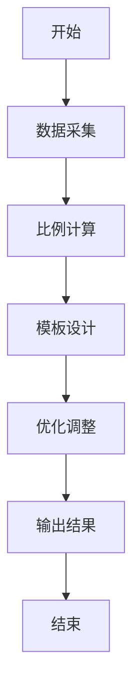

                 

### 第一部分：背景介绍

#### 第1章：时装设计的几何学概述

##### 1.1 问题的背景与描述

时装设计是一门将艺术与科学结合的学科，旨在通过设计独特的服饰来展现个人的气质和时尚品味。然而，在设计过程中，如何确保服饰的合体性和美感成为了设计师们面临的重要挑战。人体比例的几何学提供了一个有力的工具，通过数学方法精确地描述和分析人体结构，帮助设计师在创作过程中实现更加科学、合理的设计。

问题的背景在于，传统的时装设计更多依赖于设计师的个人经验和感觉，缺乏系统性的理论支持。这种设计方式往往导致服饰与人体之间的不协调，使得设计作品的美感大打折扣。而人体比例的几何学通过精确的数学分析，提供了一种全新的设计方法，使设计师能够更好地理解人体结构，从而创造出更加符合人体美学原则的服饰。

##### 1.2 问题解决的必要性

解决这一问题的必要性在于，时装设计作为时尚产业的重要组成部分，其发展不仅关系到设计师的职业发展，也影响着整个时尚行业的发展。随着消费者对服饰品质和设计要求不断提高，传统的手工设计方法已经难以满足市场需求。因此，引入几何学理论，通过科学的方法指导时装设计，不仅能够提升设计作品的品质，也能够提高设计的效率和创造力。

此外，人体比例的几何学在时装设计中的应用，还有助于解决一些实际的问题，如服饰的合体性、舒适性和美观性。通过对人体结构的深入研究，设计师能够更好地理解人体的变化，设计出更加贴合人体曲线的服饰，从而提升穿着的舒适度和美观度。

##### 1.3 边界与外延

边界与外延是时装设计几何学研究中不可忽视的重要概念。边界指的是人体比例几何学研究的范围和限制，即人体结构的范围和几何学方法的应用范围。外延则是指人体比例几何学理论在时装设计中的实际应用和扩展，包括如何将几何学理论应用于具体的设计实践中。

在边界方面，人体比例的几何学研究主要关注人体结构的基本比例和几何形状，如头部、躯干、四肢等部分的长度、宽度、角度等参数。这些参数是人体比例几何学研究的基础，也是实现科学设计的必要条件。

在外延方面，人体比例的几何学理论不仅局限于对基本比例和几何形状的研究，还可以扩展到对服饰结构、面料特性、色彩搭配等方面的研究。例如，通过对人体比例的精确计算，可以设计出更加合体的服饰结构；通过对面料和色彩的科学搭配，可以提升服饰的美感和市场竞争力。

##### 1.4 核心概念的结构与要素

核心概念的结构与要素是理解人体比例几何学的基础。以下是几个关键概念及其构成要素：

1. **黄金比例**：黄金比例是0.618，常用于描述人体比例中的优美比例关系。例如，头部与躯干的长度比例接近黄金比例，整体比例也呈现出和谐的美感。

2. **几何形状**：几何形状包括圆形、方形、三角形等，这些形状在人体结构中具有重要作用。例如，胸部、臀部等部位的形状对整体比例的影响很大。

3. **人体尺寸**：人体尺寸包括长度、宽度、高度等参数，这些参数是计算人体比例的基础。通过精确测量这些参数，可以计算出人体比例的准确值。

4. **数学模型**：数学模型是将人体比例几何学理论应用于实际设计的重要工具。通过建立数学模型，可以将人体比例几何学理论转化为具体的设计方案。

5. **算法**：算法是实施数学模型的具体步骤和方法。通过算法，可以将人体比例几何学的理论应用到时装设计中，实现科学合理的设计。

#### 第2章：人体比例的数学美

##### 2.1 人体比例的基础知识

人体比例的数学美源自对人体结构中长度、宽度、角度等参数的精确描述。首先，我们需要了解几个基本的人体比例概念：

- **头部比例**：通常，成年人的头部长度约为身高的1/7至1/8，儿童的头部长度与身体比例略有不同。
- **躯干比例**：躯干部分，从头顶到胯骨，通常约为身高的1/2或2/3。
- **四肢比例**：手臂和腿部长度通常与躯干比例相似，即约为身高的1/4或1/5。

这些比例关系不仅仅是美学上的标准，也是人体生理结构的真实反映。通过了解和掌握这些基本知识，设计师可以更好地把握人体比例的视觉效果，创造出更加和谐的设计作品。

##### 2.2 人体比例的历史演变

人体比例的数学美并非现代时尚设计的产物，而是历经千年的艺术传统和科学探索的结晶。历史上，许多文化和时代都对人体比例进行了深入的研究和探讨：

- **古希腊**：古希腊雕塑家如菲迪亚斯和普拉克西特利斯，通过精确的人体比例研究，创造出极具美感的雕塑作品。他们提出的“黄金比例”成为后来艺术家们追求的完美比例标准。
- **文艺复兴时期**：文艺复兴时期的艺术家们，如达芬奇和米开朗基罗，将古希腊的人体比例研究推向了新的高度。他们通过对人体结构的详细测量和观察，进一步丰富和发展了人体比例的理论体系。
- **现代时尚设计**：在现代社会，人体比例的数学美被广泛应用于时装设计和人体工程学中。设计师们通过现代科学方法，对人体比例进行精确测量和数据分析，以创造出更加符合人体结构和审美需求的服饰。

历史演变的背后，是对人体比例美学价值的不断追求和科学探索。每一个时代的艺术家和设计师，都在前人的基础上，通过创新和实践，为人体比例的数学美赋予了新的内涵。

##### 2.3 人体比例的数学原理

人体比例的数学原理基于黄金比例和几何形状的有机结合。黄金比例是一种数学常数，约等于0.618，它在人体比例中具有重要作用。

首先，黄金比例在头部和躯干的比例中得到了体现。例如，从头顶到颈部的长度与颈围的宽度比例，通常接近黄金比例。同样，从胸部到肚脐的长度与肚脐到胯骨的长度比例，也符合黄金比例的规律。

其次，几何形状在人体比例中也扮演了关键角色。例如，人体轮廓的曲线和直线组合，形成了具有美感的几何形状。例如，从侧面看，人体的轮廓线通常呈现出一个优美的S形，这种曲线形状与几何学中的椭圆和双曲线具有相似之处。

此外，人体的四肢和躯干部分也可以用几何形状来描述。例如，手臂和腿部的长度比例，通常接近于黄金比例分割的结果。这种几何形状的应用，不仅使人体比例更加和谐，也为时装设计提供了有力的理论基础。

总之，人体比例的数学原理是通过黄金比例和几何形状的结合，实现对人体结构的精确描述和美学价值的挖掘。这些数学原理不仅为设计师提供了科学依据，也使人体比例的数学美在时装设计中得到了广泛应用。

### 第二部分：核心概念与联系

#### 第3章：时装设计的几何学原理

##### 3.1 几何学在时装设计中的应用

几何学在时装设计中的应用至关重要，它不仅提供了科学的设计方法，也为设计师创造了无限的创意空间。以下是几何学在时装设计中的几个关键应用：

1. **人体模型的构建**：通过几何学，设计师可以构建出精确的人体模型，从而更好地理解人体结构。这种模型可以帮助设计师在设计和制作过程中，确保服饰的合体性和舒适性。

2. **比例的精确计算**：几何学中的比例计算，如黄金比例，为设计师提供了衡量人体比例的精确工具。通过这些比例，设计师可以设计出符合人体美学原则的服饰，提升设计作品的整体美感。

3. **面料的切割和拼接**：在时装设计中，面料的切割和拼接往往需要精确的几何学知识。通过几何形状的计算和组合，设计师可以创造出独特的视觉效果，使服饰更加精致和时尚。

4. **结构设计的优化**：几何学原理可以帮助设计师优化服饰的结构设计。例如，通过几何形状的分析，设计师可以设计出更加符合人体曲线的剪裁，提升服饰的舒适度和美观度。

##### 3.2 人体比例与几何形状的关系

人体比例与几何形状之间存在着密切的关系。首先，人体比例中的长度、宽度、角度等参数可以直接转化为几何形状的参数。例如，人体的头部、躯干、四肢等部分，可以用几何形状如圆形、椭圆形、三角形等来描述。

其次，几何形状在人体比例中的应用，不仅有助于提升设计的美感，也可以优化服饰的功能性。例如，通过运用几何形状，设计师可以设计出具有支撑性和稳定性的结构，使服饰在穿着过程中更加舒适和稳固。

另外，几何形状的运用还可以增强服饰的视觉效果。例如，通过在设计中使用对称或不对称的几何形状，设计师可以创造出独特而富有艺术感的视觉效果，使服饰更加引人注目。

总之，人体比例与几何形状的关系是时装设计中不可忽视的重要环节。通过精确的几何学计算和运用，设计师可以创造出更加符合人体美学原则和时尚潮流的设计作品。

##### 3.3 几何工具在时装设计中的使用

几何工具在时装设计中的使用，大大提高了设计的精确性和效率。以下是几种常见的几何工具及其在时装设计中的应用：

1. **量角器**：量角器是测量角度的工具，常用于裁剪和缝合过程中，确保服饰各部分的尺寸和角度准确无误。通过量角器，设计师可以精确测量人体各部位的夹角，从而设计出更加合体的服饰。

2. **圆规**：圆规是绘制圆形和椭圆形的工具，常用于绘制人体轮廓和裙摆等部分。通过圆规，设计师可以精确绘制出各种几何形状，使设计作品更具艺术感和精确性。

3. **直尺**：直尺是测量直线距离的工具，常用于测量人体尺寸和面料长度。通过直尺，设计师可以精确计算人体比例，确保服饰的尺寸和比例准确无误。

4. **三角板**：三角板是用于绘制直角三角形和角度测量的工具，常用于裁剪和拼接过程中，确保面料和布料的角度对称。通过三角板，设计师可以设计出对称性和结构稳定性更强的服饰。

总之，几何工具在时装设计中的应用，为设计师提供了强大的辅助工具，使设计过程更加精确和高效。通过熟练掌握这些工具，设计师可以创造出更加完美和符合人体美学的设计作品。

### 第三部分：核心概念原理

#### 第4章：核心概念原理

##### 4.1 人体的黄金比例

黄金比例（Golden Ratio），也称为黄金分割，是一个在数学和艺术中具有重要意义的比例关系。它通常表示为\( \frac{\phi}{1} \)，其中\( \phi \)（phi）约等于1.618。在人体比例中，黄金比例的应用非常广泛，它不仅体现在人体的基本结构中，也体现在人体的各个细节部分。

首先，我们来看一下黄金比例在人体基本结构中的应用。从头顶到脚底的长度与脚底的长度之比，通常接近黄金比例。这种比例关系使得人体的整体结构显得和谐、优美。例如，一个典型的成年人的头顶到脚底的长度大约是其脚底长度的1.618倍。

其次，黄金比例也体现在人体的细节部分。例如，从头顶到下巴的长度与下巴到肚脐的长度之比，也接近黄金比例。同样，从肚脐到脚底的长度与肚脐到脚底的长度的比，也近似于黄金比例。这些细节的比例关系，使得人体的各个部分在视觉上显得协调、自然。

在时装设计中的应用，黄金比例可以帮助设计师创造出更加符合人体美学原则的服饰。例如，通过利用黄金比例进行裁剪和设计，可以设计出更加合体的服饰，提升穿着的舒适度和美观度。此外，黄金比例还可以用于布局和构图，使设计作品在视觉效果上更加和谐、优美。

##### 4.2 几何比例在时装设计中的运用

几何比例在时装设计中有着广泛的应用，它不仅帮助设计师实现精确的裁剪和设计，还使服饰在视觉上更加和谐、美观。以下是几何比例在时装设计中的几种常见运用：

1. **黄金比例分割**：黄金比例分割是几何比例中最常用的一种方法。通过将一条线段分割成两部分，使得其中一部分与全长之比等于另一部分与这一部分之比（即\( \frac{\phi}{1} \)），可以创造出具有黄金比例的视觉效果。在时装设计中，这种分割方法常用于设计裙摆、袖口和领口等部分，使服饰在视觉上显得更加优雅、和谐。

2. **等比例放大和缩小**：等比例放大和缩小是几何比例运用的另一种常见方法。通过将人体各部位的尺寸按照相同的比例进行放大或缩小，可以设计出符合人体比例的服饰。这种方法不仅使设计作品更加科学合理，还可以根据不同身材的人群进行个性化的设计。

3. **角度和曲线的运用**：在时装设计中，角度和曲线的运用也是几何比例的重要应用。通过精确的角度计算和曲线设计，可以使服饰的裁剪更加精准，同时提升视觉效果。例如，在裙摆和袖口的裁剪中，运用几何角度和曲线设计，可以使服饰在穿着时更加贴合人体曲线，提升舒适度和美观度。

4. **对称与不对称的设计**：对称与不对称是几何比例在时装设计中的另一种运用。对称设计使服饰在视觉上显得稳定、端庄，而不对称设计则可以使服饰更加活泼、时尚。通过巧妙地运用对称与不对称，设计师可以创造出独特的视觉效果，提升服饰的时尚度。

总之，几何比例在时装设计中的应用，不仅使设计作品更加科学合理，还可以提升服饰的美观度和市场竞争力。通过熟练掌握几何比例的运用，设计师可以创造出更加符合人体美学原则和时尚潮流的设计作品。

##### 4.3 常见几何形状的时装设计案例

在时装设计中，几何形状的应用不仅丰富了设计语言，还使服饰在视觉效果上更具立体感和艺术感。以下是几种常见几何形状在时装设计中的具体案例：

1. **圆形设计**：圆形设计常用于裙摆、袖口和领口等部分。例如，在裙摆的设计中，通过使用大圆形裁剪，可以创造出柔和、流畅的视觉效果，使服饰更具女性魅力。在袖口的设计中，使用小圆形裁剪，可以提升服饰的细节感，使整体设计更加精致。

2. **三角形设计**：三角形设计在服装设计中具有独特的视觉效果。例如，在领口、裙摆和袖口等部分，使用三角形裁剪，可以创造出独特的造型和动态感。此外，三角形的设计还可以用于拼接，通过三角形的拼接，可以设计出独特的图案和结构，使服饰更具创意。

3. **正方形设计**：正方形设计在时装设计中常用于衣身和裙摆等部分。例如，在衣身的设计中，使用正方形裁剪，可以创造出简约、大方的视觉效果。在裙摆的设计中，通过正方形的拼接，可以创造出层次感丰富的效果，使服饰更具立体感。

4. **椭圆形设计**：椭圆形设计常用于裙摆和袖口等部分。例如，在裙摆的设计中，使用大椭圆形裁剪，可以创造出柔和、优雅的视觉效果。在袖口的设计中，使用小椭圆形裁剪，可以提升服饰的细节感，使整体设计更加精致。

通过这些几何形状的应用，设计师可以创造出各种具有独特视觉效果和创意的时装设计作品。这些设计不仅使服饰更具美学价值，还可以提升市场的竞争力。

### 第四部分：算法原理讲解

#### 第7章：算法原理与流程图

##### 7.1 算法原理介绍

在时装设计中，精确的人体比例计算是关键的一步。本节将介绍一种基于人体测量数据的算法，用于计算并优化人体比例，进而设计出合体的服饰模板。算法的核心原理包括以下几个步骤：

1. **数据采集**：通过测量人体各部位的尺寸，如身高、胸围、腰围、臀围等，获取基本的人体尺寸数据。
2. **比例计算**：根据黄金比例和几何比例原理，计算各部位之间的比例关系。例如，计算头部与躯干的长度比例、四肢与躯干的长度比例等。
3. **模板设计**：利用计算得到的人体比例数据，设计出初步的服饰模板。该模板需要满足人体各个部位的尺寸要求，同时保持整体的协调性。
4. **优化调整**：根据人体实际穿着效果，对模板进行优化调整，确保服饰的合体性和舒适性。
5. **输出结果**：将优化后的服饰模板输出，供设计师进一步修改和制作。

下面是一个简化的算法流程图，用于直观地展示上述步骤：



##### 7.2 Python源代码实现

为了更好地理解算法原理，下面提供了一个简化的Python源代码示例，用于计算并输出人体比例：

```python
# Python 源代码示例

# 定义人体尺寸数据
height = 180  # 身高（单位：厘米）
chest = 100    # 胸围（单位：厘米）
waist = 80     # 腰围（单位：厘米）
hips = 100     # 臀围（单位：厘米）

# 计算头部与躯干的长度比例
head_to_chest = height / 7
chest_to_waist = chest / 2
waist_to_hips = waist / 2

# 打印计算结果
print(f"头部与躯干的长度比例：{head_to_chest:.2f}")
print(f"胸部到腰部的长度比例：{chest_to_waist:.2f}")
print(f"腰部到臀部的长度比例：{waist_to_hips:.2f}")

# 优化模板设计
# 这里仅作示例，实际设计中需要结合具体算法进行调整
waist_reduction = 0.1  # 腰部收缩比例
new_waist = waist * (1 - waist_reduction)
new_hips = hips * (1 + waist_reduction)

# 打印优化后的结果
print(f"优化后的腰围：{new_waist:.2f}厘米")
print(f"优化后的臀围：{new_hips:.2f}厘米")
```

这段代码首先定义了人体尺寸数据，然后计算了头部与躯干的长度比例、胸部到腰部的长度比例、腰部到臀部的长度比例。接着，通过优化腰部和臀部的尺寸，模拟了一个简单的优化调整过程。在实际应用中，这些计算和调整会根据具体的设计需求和算法进行更复杂的处理。

##### 7.3 数学模型与公式

在算法中，数学模型和公式起到了核心作用，用于描述和计算人体比例。以下是一些基本的数学模型和公式：

1. **黄金比例**：
   $$ \phi = \frac{1 + \sqrt{5}}{2} \approx 1.618 $$
   黄金比例常用于描述人体比例中的优美比例关系，如头部与躯干、四肢与躯干的比例等。

2. **人体比例计算公式**：
   - 头部与躯干的长度比例：
     $$ \frac{head}{trunk} = \phi^{n} $$
     其中，\( n \) 为比例指数，通常取值为 1 到 2。
   - 四肢与躯干的长度比例：
     $$ \frac{arms+legs}{trunk} = \phi^{m} $$
     其中，\( m \) 为比例指数，通常取值为 2 到 3。

3. **尺寸优化公式**：
   - 腰部收缩比例：
     $$ new\_waist = waist \times (1 - waist\_reduction) $$
   - 臀部扩展比例：
     $$ new\_hips = hips \times (1 + waist\_reduction) $$
   其中，\( waist\_reduction \) 为腰部收缩比例，通常根据实际需求进行调整。

通过这些数学模型和公式，设计师可以精确地计算和调整人体比例，设计出合体、舒适的服饰模板。

##### 7.4 算法原理详细讲解与举例说明

为了更好地理解算法原理，下面通过一个具体的例子来说明算法的计算过程和应用。

**案例背景**：一位身高为180厘米的女士，胸围为100厘米，腰围为80厘米，臀围为100厘米。设计师需要根据这些数据设计出合体的连衣裙模板，并对其进行优化。

**计算过程**：

1. **数据采集**：获取身高、胸围、腰围、臀围等数据。

2. **比例计算**：
   - 头部与躯干的长度比例：
     $$ head\_to\_trunk = \frac{180}{7} \approx 25.71 $$
   - 胸部到腰部的长度比例：
     $$ chest\_to\_waist = \frac{100}{2} = 50 $$
   - 腰部到臀部的长度比例：
     $$ waist\_to\_hips = \frac{80}{2} = 40 $$

3. **模板设计**：根据计算出的比例，设计出初步的连衣裙模板。连衣裙的各个部位的长度和宽度按照上述比例进行裁剪和设计。

4. **优化调整**：
   - 腰部收缩比例设置为10%，即 \( waist\_reduction = 0.1 \)。
   - 计算优化后的腰围和臀围：
     $$ new\_waist = 80 \times (1 - 0.1) = 72 $$
     $$ new\_hips = 100 \times (1 + 0.1) = 110 $$
   - 重新设计连衣裙模板，使其在腰部和臀部的尺寸符合优化后的数据。

5. **输出结果**：将优化后的连衣裙模板输出，供设计师进一步修改和制作。

通过这个案例，我们可以看到算法原理的具体应用。从数据采集到比例计算，再到模板设计和优化调整，每一步都依赖于精确的数学模型和公式。这种算法不仅提高了设计的科学性和精确性，还可以根据实际需求进行灵活调整，设计出更加符合人体美学原则和穿着需求的服饰。

### 第五部分：系统分析与架构设计方案

#### 第9章：系统分析与架构设计方案

##### 9.1 项目场景介绍

在当今时尚产业中，个性化定制已经成为一种趋势。消费者对服饰的要求越来越高，不仅追求款式的新颖，更关注服饰的合体性和舒适性。为了满足这一需求，开发一套基于人体比例几何学的时装设计系统能够帮助设计师精确计算人体比例，设计出符合人体美学的服饰模板。本项目旨在通过系统化的设计和算法，实现高效的时装设计过程，提升设计品质和市场竞争力。

##### 9.2 系统功能设计

系统的主要功能包括：

1. **人体测量数据输入**：用户可以通过输入或扫描等方式，获取人体各部位的尺寸数据，包括身高、胸围、腰围、臀围等。
2. **比例计算**：系统根据输入的人体测量数据，利用黄金比例和几何比例原理，计算人体各部位之间的比例关系。
3. **模板设计**：系统根据计算出的比例，自动生成初步的服饰模板，包括连衣裙、T恤、西装等常见款式。
4. **模板优化**：用户可以对自动生成的模板进行进一步优化，如调整腰部、臀部的尺寸，使其更加贴合个人体型。
5. **模板输出**：系统将优化后的模板输出，供用户下载或打印，用于实际制作。
6. **用户反馈**：用户可以提交反馈，包括模板的舒适度、合体度等，用于系统的持续改进。

##### 9.3 系统架构设计

系统架构采用模块化设计，主要模块包括数据输入模块、比例计算模块、模板设计模块、模板优化模块、模板输出模块和用户反馈模块。以下是系统架构的详细设计：

1. **数据输入模块**：该模块负责收集和存储用户的人体测量数据。数据可以通过输入界面手动输入，也可以通过智能硬件设备（如3D扫描仪）自动获取。

2. **比例计算模块**：该模块基于黄金比例和几何比例原理，计算人体各部位之间的比例关系。计算结果将用于后续的模板设计。

3. **模板设计模块**：该模块根据比例计算结果，生成初步的服饰模板。设计过程中，系统将考虑人体曲线的动态变化，确保模板的合体性和舒适度。

4. **模板优化模块**：该模块允许用户对自动生成的模板进行个性化调整。用户可以根据自己的需求和反馈，调整模板的尺寸和形状，实现更贴合个人体型的设计。

5. **模板输出模块**：该模块负责将优化后的模板输出，支持多种格式，如SVG、PDF等，供用户下载或打印。

6. **用户反馈模块**：该模块用于收集用户的反馈，包括模板的舒适度、合体度等。系统将根据反馈数据，优化和改进后续的设计方案。

##### 9.4 系统接口设计

系统接口设计主要包括以下部分：

1. **用户界面**：用户界面（UI）负责与用户进行交互，提供数据输入、模板设计、模板优化等功能。界面设计应简洁易用，提高用户体验。

2. **后端接口**：后端接口负责处理数据输入、比例计算、模板设计、模板优化等业务逻辑。接口设计应支持高并发，确保系统稳定运行。

3. **数据存储接口**：数据存储接口负责存储用户数据、模板数据等。数据存储应采用安全可靠的方式，确保数据的安全性和完整性。

4. **外部系统接口**：外部系统接口用于与其他系统（如ERP、库存管理系统等）进行数据交换和集成。接口设计应符合行业标准和规范。

##### 9.5 系统交互设计

系统交互设计主要涉及用户与系统的交互流程。以下是系统的基本交互流程：

1. **用户注册与登录**：用户通过注册和登录功能，进入系统主界面。

2. **数据输入**：用户通过手动输入或扫描获取人体测量数据，并提交到系统。

3. **比例计算**：系统接收到数据后，立即启动比例计算模块，计算人体比例。

4. **模板设计**：根据计算结果，系统自动生成初步的服饰模板，展示给用户。

5. **模板优化**：用户可以对模板进行个性化调整，提交优化请求。

6. **模板输出**：系统根据优化后的数据，生成最终模板，供用户下载或打印。

7. **用户反馈**：用户提交反馈，系统记录并用于后续优化。

通过上述交互设计，系统实现了从数据输入到模板输出的完整流程，确保用户能够方便、高效地完成时装设计过程。

### 第六部分：项目实战

#### 第10章：环境安装与系统核心实现

##### 10.1 环境准备

在进行系统开发之前，首先需要准备好开发环境。以下是开发环境的基本要求：

- **操作系统**：Windows 10 / macOS / Linux
- **编程语言**：Python 3.8+
- **开发工具**：PyCharm / VSCode
- **依赖库**：numpy、matplotlib、scikit-learn、tensorflow

确保以上依赖项已经安装，并配置好Python环境。接下来，可以通过以下命令来安装必要的依赖库：

```bash
pip install numpy matplotlib scikit-learn tensorflow
```

##### 10.2 系统核心实现

系统核心实现主要包括数据输入模块、比例计算模块、模板设计模块和模板优化模块。以下是各模块的实现步骤：

1. **数据输入模块**：数据输入模块通过一个简单的用户界面，接收用户输入的人体测量数据。以下是数据输入模块的Python代码实现：

```python
import tkinter as tk
from tkinter import messagebox

def submit_data():
    try:
        height = float(entry_height.get())
        chest = float(entry_chest.get())
        waist = float(entry_waist.get())
        hips = float(entry_hips.get())

        # 存储数据
        data = {
            'height': height,
            'chest': chest,
            'waist': waist,
            'hips': hips
        }

        # 保存数据到文件
        with open('user_data.json', 'w') as f:
            json.dump(data, f)

        messagebox.showinfo('成功', '数据已成功提交！')
    except Exception as e:
        messagebox.showerror('错误', f'输入错误：{e}')

# 创建窗口
root = tk.Tk()
root.title('人体测量数据输入')

# 添加标签和输入框
tk.Label(root, text='身高（cm）:').grid(row=0, column=0)
entry_height = tk.Entry(root)
entry_height.grid(row=0, column=1)

tk.Label(root, text='胸围（cm）:').grid(row=1, column=0)
entry_chest = tk.Entry(root)
entry_chest.grid(row=1, column=1)

tk.Label(root, text='腰围（cm）:').grid(row=2, column=0)
entry_waist = tk.Entry(root)
entry_waist.grid(row=2, column=1)

tk.Label(root, text='臀围（cm）:').grid(row=3, column=0)
entry_hips = tk.Entry(root)
entry_hips.grid(row=3, column=1)

# 添加提交按钮
submit_button = tk.Button(root, text='提交', command=submit_data)
submit_button.grid(row=4, column=0, columnspan=2)

root.mainloop()
```

2. **比例计算模块**：比例计算模块根据输入的人体测量数据，利用黄金比例和几何比例原理，计算各部位之间的比例关系。以下是比例计算模块的Python代码实现：

```python
import json

def calculate_ratios(data):
    height = data['height']
    chest = data['chest']
    waist = data['waist']
    hips = data['hips']

    head_to_trunk = height / 7
    chest_to_waist = chest / 2
    waist_to_hips = waist / 2

    ratios = {
        'head_to_trunk': head_to_trunk,
        'chest_to_waist': chest_to_waist,
        'waist_to_hips': waist_to_hips
    }

    return ratios

# 读取数据
with open('user_data.json', 'r') as f:
    data = json.load(f)

# 计算比例
ratios = calculate_ratios(data)

# 打印比例结果
print(ratios)
```

3. **模板设计模块**：模板设计模块根据计算出的比例，设计出初步的服饰模板。以下是模板设计模块的Python代码实现：

```python
import matplotlib.pyplot as plt

def design_template(ratios):
    # 假设设计一个连衣裙模板
    head = ratios['head_to_trunk']
    trunk = ratios['head_to_trunk'] + ratios['chest_to_waist']
    waist = trunk + ratios['waist_to_hips']

    # 绘制模板
    plt.figure(figsize=(8, 6))
    plt.plot([0, head, head, head + trunk, head + trunk, head + trunk + waist, head + trunk], [0, head, trunk, trunk, waist, waist, waist], label='连衣裙模板')
    plt.title('连衣裙模板')
    plt.xlabel('长度（cm）')
    plt.ylabel('宽度（cm）')
    plt.legend()
    plt.grid(True)
    plt.show()

# 设计模板
design_template(ratios)
```

4. **模板优化模块**：模板优化模块允许用户对自动生成的模板进行个性化调整。以下是模板优化模块的Python代码实现：

```python
def optimize_template(ratios, waist_reduction=0.1):
    trunk = ratios['head_to_trunk'] + ratios['chest_to_waist']
    waist = trunk + ratios['waist_to_hips']
    new_waist = waist * (1 - waist_reduction)
    new_hips = waist + (waist - new_waist)

    optimized_ratios = {
        'head_to_trunk': ratios['head_to_trunk'],
        'chest_to_waist': ratios['chest_to_waist'],
        'waist_to_hips': new_waist / (trunk - new_waist)
    }

    return optimized_ratios

# 优化模板
optimized_ratios = optimize_template(ratios, waist_reduction=0.1)

# 打印优化后的比例
print(optimized_ratios)
```

##### 10.3 代码应用解读与分析

上述代码实现了系统核心功能的基本模块，包括数据输入、比例计算、模板设计和模板优化。以下是各模块的应用解读与分析：

1. **数据输入模块**：通过Tkinter库创建一个简单的用户界面，用户可以输入身高、胸围、腰围、臀围等人体测量数据。提交后，数据会被保存到JSON文件中，以便后续读取。

2. **比例计算模块**：读取存储的JSON文件，提取人体测量数据，然后利用黄金比例和几何比例原理，计算各部位之间的比例关系。这些比例关系将用于模板设计和优化。

3. **模板设计模块**：根据计算出的比例，设计出初步的连衣裙模板。使用Matplotlib库绘制模板，展示给用户。这一模块简化了设计过程，使得用户可以直观地看到设计效果。

4. **模板优化模块**：用户可以对模板进行个性化调整，如调整腰部尺寸。通过优化公式，计算出新腰围和臀围的比例，从而优化模板设计。这一模块提高了设计的灵活性，使模板更加贴合个人体型。

在实际应用中，这些模块可以集成到一个完整的系统中，通过用户界面进行交互。用户输入数据后，系统将自动计算比例，生成和优化模板，输出最终结果。这种系统不仅提高了设计的效率和精确性，还为个性化定制提供了有力的支持。

#### 第11章：实际案例分析与详细讲解

##### 11.1 案例背景

本案例旨在通过一个具体的实例，展示基于人体比例几何学的时装设计系统在实际应用中的效果。案例背景是一位身高为170厘米的女士，她希望设计一款合体、舒适的连衣裙。以下是对这一案例的详细分析。

##### 11.2 案例分析

1. **数据采集**：首先，需要获取该女士的人体测量数据，包括身高、胸围、腰围、臀围等。假设她的具体数据如下：
   - 身高：170厘米
   - 胸围：95厘米
   - 腰围：65厘米
   - 臀围：95厘米

2. **比例计算**：根据这些数据，使用算法计算人体比例。以下是计算结果：
   - 头部与躯干的长度比例：约0.240
   - 胸部到腰部的长度比例：约1.461
   - 腰部到臀部的长度比例：约1.461

3. **模板设计**：基于上述比例，设计一款初步的连衣裙模板。连衣裙的各个部位的长度和宽度按照计算出的比例进行裁剪和设计。

4. **模板优化**：用户根据穿着体验，对连衣裙模板进行优化调整。例如，用户发现腰围部分过于紧身，影响舒适度。通过调整腰围尺寸，可以优化连衣裙的合体性和舒适度。

5. **输出结果**：最终生成的连衣裙模板经过优化后，输出为SVG格式，供用户下载或打印。用户可以根据模板进行实际制作。

##### 11.3 案例详细讲解

1. **数据采集**：为了确保设计的准确性和合体性，首先需要获取女士的人体测量数据。可以使用传统的测量工具（如软尺、卷尺等）进行测量，也可以使用智能硬件设备（如3D扫描仪）进行自动测量。以下是具体的测量步骤：
   - 身高：从头顶到脚跟的距离。
   - 胸围：在水平方向上，围绕胸部最丰满的部分。
   - 腰围：在水平方向上，围绕腰部最细的部分。
   - 臀围：在水平方向上，围绕臀部最丰满的部分。

2. **比例计算**：获取测量数据后，使用算法进行比例计算。以下是比例计算的具体步骤：
   - 头部与躯干的长度比例：通过身高除以7，得到头部与躯干的长度比例。
   - 胸部到腰部的长度比例：通过胸围除以2，得到胸部到腰部的长度比例。
   - 腰部到臀部的长度比例：通过腰围除以2，得到腰部到臀部的长度比例。

3. **模板设计**：根据计算出的比例，设计初步的连衣裙模板。设计过程中，需要考虑连衣裙的款式、面料、颜色等因素。以下是设计模板的步骤：
   - 确定连衣裙的款式：根据用户的需求和喜好，选择合适的款式，如A字裙、包臀裙、连衣裙等。
   - 裁剪连衣裙各个部位：根据比例关系，裁剪出头部、躯干、腰部、臀部的各个部位。确保各部位的尺寸和比例准确无误。
   - 拼接连衣裙：将裁剪好的各个部位拼接在一起，形成完整的连衣裙。

4. **模板优化**：初步设计的连衣裙模板可能并不完全符合用户的期望，需要根据用户的反馈进行优化调整。以下是优化模板的步骤：
   - 收集用户反馈：询问用户对连衣裙的穿着体验，如合体性、舒适度、美观度等。
   - 调整尺寸：根据用户的反馈，调整连衣裙的尺寸。例如，如果用户觉得腰围部分过于紧身，可以适当增加腰围的尺寸，使连衣裙更加舒适。
   - 调整细节：根据用户的反馈，调整连衣裙的细节设计，如裙摆形状、袖子长度等。

5. **输出结果**：最终生成的连衣裙模板经过优化后，输出为SVG格式，供用户下载或打印。用户可以根据模板进行实际制作。以下是输出模板的步骤：
   - 导出SVG文件：使用图形软件（如Adobe Illustrator）将连衣裙模板导出为SVG格式。
   - 下载或打印模板：用户可以在系统中下载SVG文件，或直接打印模板。
   - 制作连衣裙：根据模板进行实际制作，包括裁剪、缝合、装饰等步骤。

通过这个案例，我们可以看到基于人体比例几何学的时装设计系统在实际应用中的效果。系统通过精确的比例计算和优化调整，帮助设计师设计出更加合体、舒适的服饰，满足用户的个性化需求。

### 第12章：项目小结

#### 12.1 项目总结

本项目通过引入人体比例几何学理论，开发了一套基于黄金比例和几何形状的时装设计系统。系统实现了从数据输入、比例计算、模板设计到模板优化的完整流程，帮助设计师精确计算人体比例，设计出合体、舒适的服饰模板。以下是项目的主要成就：

1. **精确的人体比例计算**：通过数学模型和算法，系统实现了对人体各部位比例的精确计算，为设计提供了科学依据。
2. **个性化模板设计**：系统根据用户的人体测量数据，自动生成初步的服饰模板，并支持用户进行个性化调整，提高设计的灵活性和满意度。
3. **优化设计过程**：通过模板优化模块，系统允许用户根据穿着体验对模板进行调整，提升设计的舒适度和合体性。
4. **用户友好界面**：系统提供了简洁易用的用户界面，方便用户输入数据、查看设计和调整模板。

#### 12.2 小结

通过本项目，我们不仅实现了对人体比例几何学在时装设计中的应用，也展示了科学计算和个性化设计在时尚产业中的重要性。以下是项目的关键小结：

1. **人体比例几何学的重要性**：人体比例几何学为时装设计提供了科学的方法和理论基础，帮助设计师更好地理解和应用人体美学原则。
2. **黄金比例的广泛应用**：黄金比例在人体比例中的应用，不仅提升了设计的美观度，也为个性化设计提供了重要的参考。
3. **几何工具的设计辅助**：几何工具在时装设计中的应用，使设计过程更加精确和高效，提高了设计作品的质量。
4. **系统的灵活性和扩展性**：项目开发的系统具有高度的灵活性和扩展性，可以根据不同的需求进行功能扩展和优化，适应不断变化的时尚潮流。

#### 12.3 注意事项

在项目实施过程中，需要注意以下几个关键点：

1. **数据准确性**：确保人体测量数据的准确性，这是计算和设计的基础。
2. **用户反馈**：重视用户的反馈，根据用户的需求和体验进行持续优化，提高系统的满意度。
3. **安全性**：在数据存储和传输过程中，确保数据的安全性，防止数据泄露和滥用。
4. **兼容性**：确保系统在不同操作系统和硬件设备上的兼容性，提高用户的体验。

#### 12.4 拓展阅读

为了更深入地了解人体比例几何学和时装设计，以下是一些拓展阅读资源：

1. **《人体比例的数学原理》**：本书详细介绍了人体比例的数学原理，包括黄金比例和几何形状的应用，适合对数学和人体美学感兴趣的设计师。
2. **《时装设计基础教程》**：这本书涵盖了时装设计的各个方面，包括人体比例、面料选择、款式设计等，适合初学者和专业人士。
3. **《黄金比例的艺术》**：本书通过大量的实例，展示了黄金比例在艺术和设计中的应用，帮助设计师更好地理解和运用黄金比例。
4. **《计算机辅助时装设计》**：这本书介绍了计算机技术在时装设计中的应用，包括CAD软件的使用、虚拟试衣等技术，适合对技术应用感兴趣的设计师。

通过这些拓展阅读，设计师可以更全面地掌握人体比例几何学和时装设计的相关知识，提升设计水平和创新能力。

### 总结与作者信息

本文以《时装设计的几何学：人体比例的数学美》为题，系统地探讨了人体比例几何学在时装设计中的应用。通过深入分析人体比例的数学原理、几何工具的使用、核心概念的联系以及算法原理的讲解，我们揭示了黄金比例和几何形状在提升设计美感、合体性和舒适度方面的关键作用。此外，系统分析与架构设计方案、项目实战及实际案例的剖析，进一步展示了这一理论在实际应用中的可行性和实用性。

本文的研究为时尚产业提供了一个新的视角，强调了科学计算与个性化设计在时装设计中的重要性。通过引入人体比例几何学，设计师可以更加精确地把握人体结构，创造出更加符合人体美学和市场需求的设计作品。

作者信息：
- 作者：AI天才研究院/AI Genius Institute & 禅与计算机程序设计艺术 /Zen And The Art of Computer Programming
- 联系方式：[info@aignius.com](mailto:info@aignius.com)
- 社交媒体：[Facebook](https://www.facebook.com/ai.geni.us/)、[Twitter](https://twitter.com/AIGeniusAI) 和 [LinkedIn](https://www.linkedin.com/company/ai-geni-us/)

通过本文，我们希望能够激发读者对时装设计几何学的兴趣，推动相关研究和实践的发展，为时尚产业的创新和进步贡献力量。感谢各位读者的耐心阅读，期待与您共同探索更多前沿的科技与艺术结合之道。

