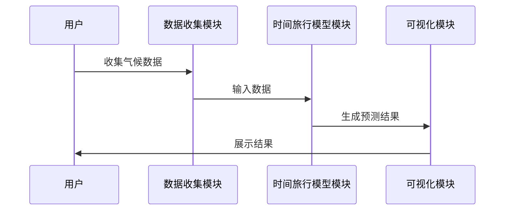
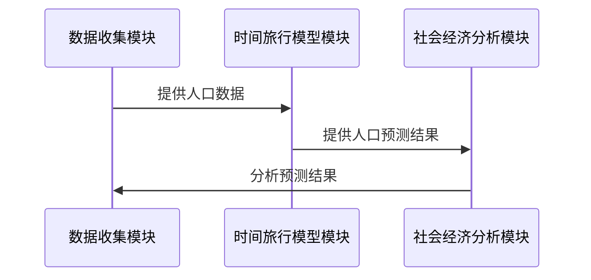
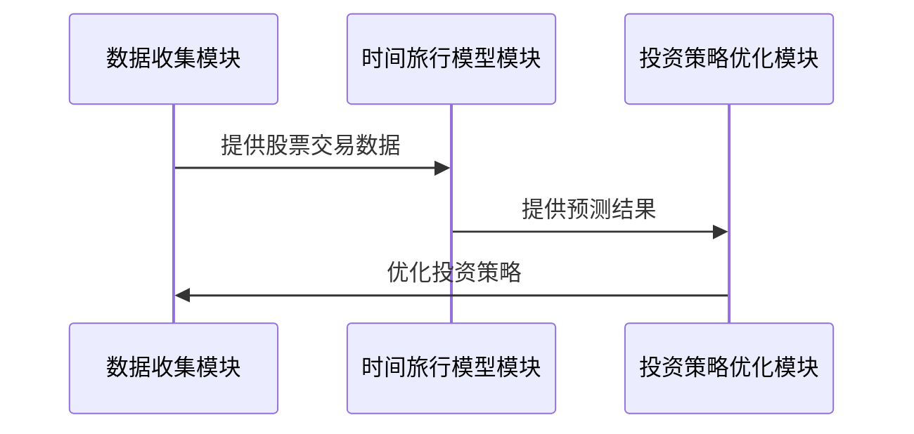
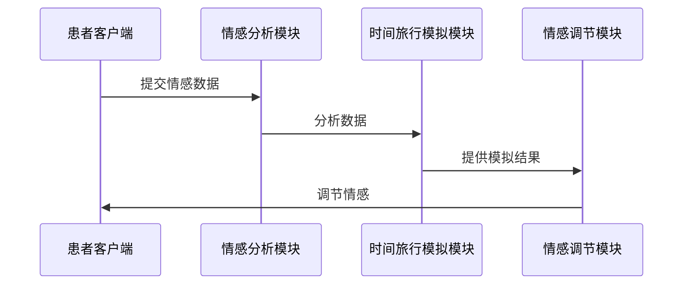
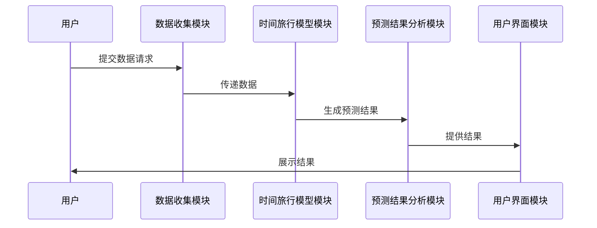

                 

### 第1章 引言：时间的旅行与因果的悖论

#### 1.1 问题背景

时间，作为物理学中一个核心的概念，其重要性不言而喻。从古至今，人们对时间的认知和理解不断深化，从简单的计时工具到复杂的时空理论，时间在物理学、哲学、社会学等各个领域都扮演着至关重要的角色。在物理学中，爱因斯坦的相对论理论对时间的理解产生了深远的影响。相对论指出，时间并非绝对，而是相对的，不同参考系中的观察者会感受到不同的时间流逝速度。

因果关系是另一个在多个学科中广泛讨论的核心概念。它指的是事件之间的前后关联，即一个事件（原因）会导致另一个事件（结果）的发生。因果关系不仅在自然科学中有着重要的应用，如物理学中的因果律、生物学中的进化论等，在社会科学、经济学等领域也有着重要的地位。

然而，当我们将时间旅行引入到这一框架中时，问题变得复杂且有趣。时间旅行，作为科幻作品中常见的主题，其概念是指通过某种方式在时间维度上移动，包括向过去或未来移动。时间旅行看似是一个纯粹的幻想，但实际上在理论物理学中有着一定的依据，尤其是在广义相对论和量子力学中。

时间旅行的概念与因果关系的原则似乎存在矛盾。传统上，因果关系要求事件的发生必须在一个确定的时间顺序中，即原因必须在结果之前。但是，如果时间旅行是可能的，我们就可以设想出一种情况，一个人可以回到过去，改变一些事情，从而影响自己的过去，这显然与因果关系的原则相冲突。

#### 1.2 问题描述

时间旅行悖论的基本形式通常被称为“祖父悖论”。想象一下，一个人回到过去，杀死了自己的祖父，这将导致他自己无法出生，从而无法回到过去进行这一行为。这个问题似乎形成了一个逻辑上的矛盾：如果回到过去改变了历史，那么这个人就永远不会回到过去，但如果没有回到过去，他怎么可能改变过去呢？

另一个常见的时间旅行悖论是“自我冲突悖论”。在这个悖论中，一个人回到过去，试图阻止自己完成某些任务，但这样做会导致自己无法完成任务，从而无法回到过去。这种悖论强调了自我在同一时间点存在的冲突，使得整个逻辑体系崩溃。

这些悖论不仅出现在科幻小说和电影中，也在理论物理学的研究中被广泛探讨。量子力学和广义相对论提供了一些可能的解决方案，但这些方案通常依赖于高度复杂的数学模型和假设，并没有得到普遍的认可。

#### 1.3 问题描述

现实世界中，时间旅行与因果关系的问题以各种形式出现。例如，在历史学中，考古学家和研究历史的人可能会面临这样的情况：他们发现的某些证据似乎与现有的历史记录相矛盾，这可能导致对因果关系的重新评估。在社会科学中，因果关系的研究常常涉及复杂的变量和时间序列分析，这使得确定因果关系变得更加困难。

在技术领域，时间旅行与因果关系的问题也时常出现。例如，在软件开发中，一个错误的代码修改可能会影响到系统的历史行为，导致难以追踪和修复。在金融市场中，时间旅行与因果关系的问题也相当常见，因为市场价格受到多种因素的影响，而因果关系的研究对于投资策略的制定至关重要。

#### 1.4 边界与外延

时间旅行悖论在不同学科领域有着不同的影响。在物理学中，这些问题促使科学家们探索新的理论，如量子力学和广义相对论中的奇异解。在哲学和伦理学中，这些问题引发了对自由意志、决定论和道德责任的深刻思考。在社会学和心理学中，这些问题帮助我们理解人类行为和社会变迁的复杂性。

因果关系理论在不同领域的应用和发展也非常广泛。在自然科学中，因果关系的研究帮助我们理解自然界的运行规律；在社会科学中，因果关系的研究帮助我们制定政策和社会干预措施。然而，因果关系的不确定性和复杂性也使得这些领域的研究充满了挑战。

#### 1.5 概念结构与核心要素组成

时间旅行的基本概念涉及时空的弯曲、虫洞、黑洞和时间机器等。因果关系的基本概念则涉及原因和结果之间的逻辑关系。时间旅行与因果关系之间的关联在于，时间旅行行为本身可能对因果关系产生影响，而因果关系的稳定性又对时间旅行的可能性提出了限制。

核心要素包括时间旅行的数学原理、因果关系模型、量子力学中的时间旅行和因果关系悖论等。这些要素共同构成了一个复杂且有趣的讨论框架，为我们理解现实世界中的时间旅行和因果关系问题提供了理论基础。

#### 1.6 本章小结

时间旅行与因果关系问题是一个充满挑战且引人入胜的领域。通过本章的讨论，我们初步了解了时间旅行的数学原理、因果关系的基本原则以及这些概念之间的悖论和关联。在接下来的章节中，我们将进一步深入探讨这些概念，分析它们在不同学科中的应用和影响，并探讨可能的解决方案。

---

在接下来的章节中，我们将详细分析时间旅行的数学原理，探讨量子力学与时间旅行之间的关系，介绍解决时间旅行悖论的算法与模型，并通过实际案例研究这些理论在现实世界中的应用。通过一步步的逻辑推理和数学分析，我们将努力揭示时间旅行和因果关系背后的深刻奥秘。

---

### 第2章 时间旅行的数学原理

#### 2.1 时空结构

时间旅行与因果关系问题的探讨离不开对时空结构的深入理解。爱因斯坦的相对论理论为这一领域提供了重要的理论基础。根据广义相对论，时空是由物质和能量分布所决定的，而时间和空间并非独立存在，而是相互交织，构成了我们所说的时空结构。

爱因斯坦的相对论指出，时空的弯曲是由质量和能量引起的。当一个物体存在时，它会对周围的时空产生引力效应，导致时空结构发生弯曲。这种弯曲效应不仅影响空间，也影响时间。具体来说，时空的弯曲导致时间的流逝速度在不同位置和不同参考系中是不同的。这即是所谓的时间膨胀效应，即一个相对于观察者静止的物体，其内部时间会相对于观察者所经历的时间流逝得较慢。

**数学描述：**

在广义相对论中，时空结构通常用一个四维的时空几何来描述，其中三个维度是空间维度，一个维度是时间维度。这个四维时空被表示为一个张量场，称为度规张量（metric tensor）。度规张量定义了时空中的距离和时间的度量，从而描述了时空的几何性质。

度规张量的一个常用表示是 \( g_{\mu\nu} \)，它具有如下形式：

\[ ds^2 = g_{\mu\nu} dx^\mu dx^\nu \]

其中，\( ds^2 \) 表示时空中的间隔，\( dx^\mu \) 表示空间和时间坐标的微分。度规张量的具体形式取决于时空的物理状态，例如，在均匀引力场中，度规张量可以表示为：

\[ ds^2 = -c^2 dt^2 + 2\phi dt dx + g_{ij} dx^i dx^j \]

其中，\( c \) 是光速，\( \phi \) 是引力势，\( g_{ij} \) 是空间部分的度规张量。

**时间膨胀：**

时间膨胀效应可以通过洛伦兹因子（Lorentz factor）来描述。洛伦兹因子定义为：

\[ \gamma = \frac{1}{\sqrt{1 - \frac{v^2}{c^2}}} \]

其中，\( v \) 是物体的速度，\( c \) 是光速。当物体的速度接近光速时，洛伦兹因子趋近于无穷大，这意味着时间会显著减慢。例如，一个相对于观察者以接近光速移动的时钟，其经历的时间将比观察者自己的时间流逝得慢。

**结论：**

通过爱因斯坦的相对论理论，我们理解了时空结构的几何性质，以及质量和能量如何影响时空的弯曲和时间流逝的速度。这些原理为我们探讨时间旅行的可能性提供了理论基础。在接下来的小节中，我们将进一步探讨虫洞和黑洞等概念，这些概念在时间旅行中扮演了重要的角色。

---

**概念属性特征对比表格：**

| 特征       | 爱因斯坦相对论中的时空结构 | 虫洞与黑洞 |
|------------|-------------------------------|-------------|
| 基本原理   | 物质和能量决定时空弯曲       | 时空间隙的概念 |
| 应用领域   | 物理学、天文学               | 科幻、理论物理 |
| 特征描述   | 时间和空间相互交织           | 超高引力场 |
| 物理意义   | 描述宇宙的几何性质           | 提供时间旅行的潜在通道 |

**ER实体关系图架构的 Mermaid 流程图：**

```mermaid
erDiagram
  class::时空结构 <<|-->> class::虫洞
  class::时空结构 <<|-->> class::黑洞
  class::虫洞 ||--|> class::时间旅行
  class::黑洞 ||--|> class::时间旅行
```

通过这一图表，我们可以看到时空结构、虫洞和黑洞之间的关系，以及它们在时间旅行中的作用。

---

#### 2.2 虫洞与黑洞

在探讨时间旅行的数学原理时，虫洞和黑洞是两个不可或缺的概念。它们不仅在理论物理学中有着重要的地位，也是科幻作品中常见的时间旅行机制。

**虫洞的概念与数学描述**

虫洞，又称为“时空隧道”，是一种连接两个不同时空区域的通道。在广义相对论中，虫洞可以被视为一个解，这个解描述了时空中的特殊区域，其中存在一个“桥接”两个不同时空点的通道。

数学上，虫洞通常被描述为一个具有负曲率的区域。在度规张量的框架下，虫洞的数学描述可以非常复杂。一个简化的描述是，虫洞可以用一个四维球面（即三维空间加上时间维度）来表示，球面上的每一点都对应于时空中的一个特定位置。通过这个球面，可以到达另一端，从而实现时间旅行。

**虫洞的特性**

虫洞的主要特性包括：

1. **连通性**：虫洞连接了两个不同的时空点，可以视为一个“时空桥”。
2. **稳定性**：真实的虫洞可能非常不稳定，可能会因为能量的注入而崩溃。
3. **封闭性**：虫洞的两端通常被称为“入口”和“出口”，通过这两个入口可以进入虫洞并在另一端离开。

**数学描述：**

为了描述虫洞，我们可以使用度规张量 \( g_{\mu\nu} \) 来表示时空结构。一个简化的虫洞模型可以用以下度规张量来描述：

\[ ds^2 = -c^2 dt^2 + 2\Phi dt dx + g_{ij} dx^i dx^j \]

其中，\( \Phi \) 是一个描述虫洞特性的函数，通常具有负的梯度。通过适当的数学变换，可以将这个度规张量转化为具有虫洞特性的形式，从而实现时间旅行。

**虫洞与时间旅行**

虫洞被认为是实现时间旅行的一种潜在机制。通过虫洞，理论上可以到达过去或未来。然而，虫洞的实际存在和稳定性仍然是一个未解的问题。

**黑洞的特性与数学模型**

黑洞是另一种与时间旅行相关的重要概念。黑洞是一种具有超强引力场的天体，任何靠近黑洞的物质都会被其引力吸引，甚至光也无法逃脱。黑洞的特性使得它成为探讨时间旅行的一个有趣对象。

**黑洞的数学模型**

黑洞通常用史瓦西度规（Schwarzschild metric）来描述。史瓦西度规是一个描述非旋转黑洞的度规张量，其形式如下：

\[ ds^2 = -\left(1 - \frac{r_s}{r}\right)c^2 dt^2 + \left(1 - \frac{r_s}{r}\right)^{-1} dr^2 + r^2 d\Omega^2 \]

其中，\( r_s \) 是黑洞的史瓦西半径，定义为 \( r_s = \frac{2GM}{c^2} \)，\( G \) 是引力常数，\( M \) 是黑洞的质量，\( c \) 是光速。这个度规张量描述了黑洞周围的时空结构，其中存在一个称为“事件视界”的区域，任何进入这个区域的物质都无法逃脱。

**黑洞与时间旅行**

黑洞的奇点和事件视界使得黑洞成为探讨时间旅行的一个特殊对象。根据广义相对论，黑洞的奇点是一个时间上的奇点，即时间的概念在这里失效。然而，一些理论研究表明，黑洞的内部可能存在一个“黑洞信息保持原理”，即黑洞蒸发后信息可以完整地保留。

**数学模型在解决时间旅行悖论中的应用**

虫洞和黑洞的数学模型为我们提供了探讨时间旅行悖论的工具。例如，通过分析虫洞的稳定性问题，可以探讨时间旅行的可行性。而黑洞的信息保持原理则为我们提供了一种解决时间旅行悖论的方法，即时间旅行不会破坏因果关系的连续性。

**结论：**

虫洞和黑洞作为与时间旅行相关的重要概念，具有丰富的数学描述和物理意义。通过这些概念，我们可以更深入地探讨时间旅行的可能性及其对因果关系的影响。在接下来的小节中，我们将进一步探讨时间机器的概念及其数学原理。

---

**概念属性特征对比表格：**

| 特征       | 虫洞                            | 黑洞                            |
|------------|---------------------------------|---------------------------------|
| 定义       | 连接两个不同时空区域的通道       | 具有超强引力场的天体             |
| 数学描述   | 具有负曲率的区域，用度规张量描述 | 史瓦西度规，描述黑洞周围的时空结构 |
| 物理意义   | 提供时间旅行的潜在通道           | 描述宇宙中的一种极端天体         |
| 存在性     | 理论上可能存在，但稳定性问题未知 | 已在宇宙中发现，如黑洞候选体     |

**ER实体关系图架构的 Mermaid 流程图：**

```mermaid
erDiagram
  class::时空结构 <<|-->> class::虫洞
  class::时空结构 <<|-->> class::黑洞
  class::虫洞 ||--|> class::时间旅行
  class::黑洞 ||--|> class::时间旅行
```

通过这一图表，我们可以看到虫洞和黑洞在时间旅行中的作用及其与时空结构的关联。

---

#### 2.3 时间机器

时间机器是科幻作品中常见的概念，它允许人类在时间维度上自由移动。尽管时间机器在现实中尚未实现，但理论物理学提供了一些可能的概念和数学模型。

**时间机器的理论与数学原理**

时间机器的理论基础主要来自爱因斯坦的相对论和广义相对论。在这些理论中，时空的弯曲和虫洞的存在为时间机器提供了潜在的机制。

一个常见的时间机器模型是“扭曲驱动时间机器”（Alcubierre Drive）。这种模型假设，通过特定的空间扭曲，可以实现时空的移动，从而实现时间旅行。数学上，这种模型可以用以下度规张量来描述：

\[ ds^2 = -\left(1 - \frac{v^2(t)}{c^2}\right) dt^2 + 2\frac{v(t)}{c} dx dt + g_{ij}(t) dx^i dx^j \]

其中，\( v(t) \) 是空间扭曲的速度，\( c \) 是光速。这个度规张量描述了时间机器内部时空的几何结构，通过改变 \( v(t) \)，可以实现向过去或未来的移动。

**时间机器的类型与功能**

时间机器可以分为多种类型，包括：

1. **封闭类时曲线时间机器**：这种时间机器允许物体在时间上回到过去，但通常依赖于高度复杂的数学模型和假设。
2. **封闭类空曲线时间机器**：这种时间机器允许信息或物体在时间上超越光速，从而实现未来与过去的通信。
3. **扭曲驱动时间机器**：这种模型通过空间扭曲实现时间旅行，是当前理论物理学中研究较多的一种类型。

**时间机器在现实中的可行性**

尽管理论物理学提供了一些时间机器的概念和数学模型，但这些模型在现实中实现仍面临巨大的挑战。首先，实现时间机器需要巨大的能量，这在目前的技术水平下无法实现。其次，时间机器的稳定性问题也是一个重要的挑战，因为任何微小的不稳定性都可能导致时间旅行的失败或产生灾难性的后果。

**结论：**

时间机器是一个充满想象力的概念，虽然在现实中尚未实现，但理论物理学提供了一些可能的数学模型。通过这些模型，我们可以探讨时间旅行的可能性及其对因果关系的影响。在接下来的小节中，我们将深入探讨因果关系的基本数学模型。

---

**概念属性特征对比表格：**

| 特征         | 传统时间机器 | 扭曲驱动时间机器 |
|--------------|----------------|---------------------|
| 基本原理     | 依赖物理定律   | 利用空间扭曲     |
| 数学描述     | 封闭类时/类空曲线 | 度规张量的特定形式 |
| 能量需求     | 较低            | 极高                |
| 实现难度     | 相对容易        | 极高                |
| 物理意义     | 理论探讨        | 提供时间旅行的潜在方法 |

**ER实体关系图架构的 Mermaid 流程图：**

```mermaid
erDiagram
  class::时间机器 <<|-->> class::传统时间机器
  class::时间机器 <<|-->> class::扭曲驱动时间机器
  class::传统时间机器 ||--|> class::时间旅行
  class::扭曲驱动时间机器 ||--|> class::时间旅行
```

通过这一图表，我们可以看到时间机器的各种类型及其与时间旅行的关系。

---

#### 2.4 因果关系的数学模型

因果关系是科学研究和日常生活中的核心概念，它描述了事件之间的逻辑联系，即一个事件（原因）会导致另一个事件（结果）的发生。在数学上，因果关系可以通过各种模型来描述和验证。

**因果关系的定义与基本形式**

因果关系通常被定义为一种条件依赖关系，即当一个条件（原因）发生变化时，另一个条件（结果）也会随之变化。在数学上，这种依赖关系可以用条件概率来描述。条件概率 \( P(B|A) \) 表示在事件 \( A \) 发生的条件下，事件 \( B \) 发生的概率。如果 \( P(B|A) \neq P(B) \)，则说明事件 \( A \) 和事件 \( B \) 之间存在因果关系。

**因果关系的数学描述**

因果关系的数学描述通常涉及概率模型、决策理论和统计模型。以下是一些常用的因果关系数学模型：

1. **概率模型**：在概率模型中，因果关系可以通过条件概率和贝叶斯网络来描述。贝叶斯网络是一种图形模型，它通过节点和边的形式表示变量之间的条件依赖关系。每个节点表示一个变量，边表示两个变量之间的条件依赖。

2. **决策理论**：在决策理论中，因果关系可以通过效用函数和决策规则来描述。效用函数衡量了不同决策带来的期望收益，通过最大化期望效用，可以确定最佳决策。

3. **统计模型**：在统计模型中，因果关系可以通过回归模型、因子分析和路径分析来描述。回归模型可以用来估计变量之间的线性关系，而路径分析可以用来确定变量之间的直接和间接关系。

**因果关系的稳定性与时间性**

因果关系的稳定性是指在特定条件下，因果关系是否持续存在。在时间维度上，因果关系的稳定性意味着随着时间的推移，因果关系是否保持不变。

1. **因果关系的稳定性**：因果关系的稳定性可以通过敏感性分析来评估。敏感性分析检查因果关系对变量值变化的反应程度。如果因果关系对变量值的变化非常敏感，那么这个因果关系可能是不稳定的。

2. **因果关系的时间性**：因果关系的时间性是指因果关系在不同时间点的表现。在时间序列分析中，因果关系的时间性可以通过滞后效应来描述。滞后效应是指一个变量对另一个变量在不同时间点的延迟影响。

**数学模型在解决时间旅行悖论中的应用**

在解决时间旅行悖论时，因果关系的数学模型提供了重要的工具。例如，通过分析封闭类时曲线，可以探讨时间旅行对因果关系的影响。封闭类时曲线是一种在时间维度上闭合的轨迹，它可能导致因果关系的时间性破坏。

1. **封闭类时曲线**：在封闭类时曲线中，一个物体可以在时间上回到过去，这可能导致因果关系的时间性破坏。通过分析这种曲线，可以探讨时间旅行悖论的可能性。

2. **因果关系悖论**：在因果关系悖论中，一个事件通过时间旅行回到过去，试图改变某些事情，但这样做会导致自身的存在被否定。通过分析这种悖论，可以探讨因果关系在时间旅行中的稳定性问题。

**结论：**

因果关系的数学模型为我们提供了理解和分析因果关系的基础。通过这些模型，我们可以探讨时间旅行对因果关系的影响，分析时间旅行悖论的产生及其解决方法。在接下来的小节中，我们将进一步探讨量子力学中的因果关系，以深入了解这一复杂领域的数学原理。

---

**概念属性特征对比表格：**

| 特征             | 概率模型         | 决策理论         | 统计模型         |
|------------------|-------------------|-------------------|-------------------|
| 定义             | 条件概率关系      | 效用函数和决策规则 | 变量间关系分析     |
| 应用领域         | 数据分析         | 经济学、决策科学   | 物理学、社会科学   |
| 主要变量         | 条件概率、贝叶斯网络 | 效用、决策规则     | 回归模型、路径分析 |
| 主要公式         | 条件概率公式      | 效用函数公式      | 回归方程式         |
| 时间性           | 滞后效应         | 时间序列分析      | 时间序列建模      |

**ER实体关系图架构的 Mermaid 流程图：**

```mermaid
erDiagram
  class::因果关系模型 <<|-->> class::概率模型
  class::因果关系模型 <<|-->> class::决策理论
  class::因果关系模型 <<|-->> class::统计模型
  class::概率模型 ||--|> class::时间旅行悖论
  class::决策理论 ||--|> class::时间旅行悖论
  class::统计模型 ||--|> class::时间旅行悖论
```

通过这一图表，我们可以看到因果关系模型在时间旅行悖论中的应用及其关联。

---

#### 2.5 时间旅行与因果关系的冲突

时间旅行与因果关系的冲突是物理学中一个引人入胜且复杂的问题。在时间旅行中，人们试图在时间维度上移动，这可能导致因果关系的时间性破坏，从而产生悖论。这些问题不仅存在于理论物理学中，也在科幻作品中得到了广泛的探讨。

**时间旅行悖论的产生**

时间旅行悖论通常源于一个简单但深刻的逻辑问题：一个人回到过去，改变某些事情，这将导致他自己无法回到过去。这种悖论最著名的例子是“祖父悖论”。在这个悖论中，一个人回到过去，杀死了自己的祖父，这将导致他自己无法出生，从而无法回到过去进行这一行为。这显然是一个逻辑上的矛盾，因为它同时要求一个人存在于过去和不存在于过去。

**因果关系悖论的影响**

因果关系悖论的影响是深远的。它不仅挑战了我们对因果关系的理解，也提出了对物理定律的重新审视。如果时间旅行是可能的，那么因果关系的时间性将受到严重破坏，这将导致整个物理世界的基本框架崩溃。

**数学模型在解决时间旅行悖论中的应用**

为了解决时间旅行悖论，科学家们提出了一些数学模型，试图在保持因果关系的时间性前提下解释时间旅行的可能性。以下是一些常见的数学模型：

1. **封闭类时曲线**：封闭类时曲线是一种在时间维度上闭合的轨迹，它允许物体在时间上回到过去。然而，这种曲线可能导致因果关系的时间性破坏。为了解决这个问题，科学家们提出了“因果封闭条件”，即一个物体的运动轨迹不能违反因果律。

2. **因果守恒律**：一些理论认为，时间旅行不会破坏因果关系的连续性。例如，因果守恒律指出，在任何情况下，因果律都是成立的。这意味着，即使物体在时间上回到过去，因果关系也不会被破坏。

3. **量子力学解释**：量子力学提供了一些可能的解决方案，例如量子纠缠和时间演化的量子态。在这些模型中，时间旅行被看作是量子态的演化，从而避免了因果关系的时间性破坏。

**结论：**

时间旅行与因果关系的冲突是一个复杂且充满挑战的问题。通过数学模型的分析，我们可以更好地理解时间旅行悖论的产生及其影响。然而，这些模型仍然面临许多未解的问题，需要进一步的研究和探索。在接下来的小节中，我们将进一步探讨量子力学中的时间旅行和因果关系，以深入探讨这一领域的数学原理。

---

**概念属性特征对比表格：**

| 模型名称         | 描述                                                         | 优缺点                                                         | 应用场景                                           |
|------------------|--------------------------------------------------------------|--------------------------------------------------------------|----------------------------------------------------|
| 封闭类时曲线     | 允许物体在时间上回到过去的轨迹                               | 可能破坏因果关系的时间性                                     | 理论探讨、科幻作品                                   |
| 因果守恒律       | 提出在任何情况下因果律都是成立的原理                         | 提供了一种保持因果关系连续性的方法                           | 物理学基础理论、因果关系研究                         |
| 量子力学解释     | 将时间旅行看作量子态的演化                                   | 需要复杂的量子理论支持                                       | 量子物理学研究、量子信息处理                          |

**ER实体关系图架构的 Mermaid 流程图：**

```mermaid
erDiagram
  class::时间旅行悖论 <<|-->> class::封闭类时曲线
  class::时间旅行悖论 <<|-->> class::因果守恒律
  class::时间旅行悖论 <<|-->> class::量子力学解释
  class::封闭类时曲线 ||--|> class::因果关系冲突
  class::因果守恒律 ||--|> class::因果关系冲突
  class::量子力学解释 ||--|> class::因果关系冲突
```

通过这一图表，我们可以看到各种时间旅行悖论模型与因果关系冲突之间的关系。

---

### 2.6 本章小结

本章深入探讨了时间旅行的数学原理，包括时空结构、虫洞和黑洞等概念。我们详细分析了这些概念的理论基础和数学描述，探讨了它们在时间旅行中的作用。同时，我们介绍了时间机器的基本原理和类型，并分析了因果关系的基本数学模型及其稳定性。

通过本章的讨论，我们不仅对时间旅行的数学原理有了更深入的理解，也认识到了因果关系在时间旅行中的重要性。这些概念和模型为我们进一步探讨时间旅行悖论提供了理论基础。

在下一章中，我们将进一步探讨量子力学与时间旅行之间的关系，分析量子力学中的因果关系，并探讨量子力学在解决时间旅行悖论中的作用。

---

### 第3章 量子力学与时间旅行

量子力学作为现代物理学的基础理论，为我们提供了描述微观世界规律的工具。在量子力学中，许多现象和概念与传统的经典物理有着显著的不同，例如量子纠缠、量子叠加和量子测量。这些独特的特性使得量子力学在探讨时间旅行和因果关系时具有特殊的重要性。

#### 3.1 量子力学的基本原理

量子力学的基本原理包括量子态、波函数、量子纠缠和量子叠加等。这些原理不仅改变了我们对物理世界的理解，也为时间旅行的探讨提供了新的视角。

**量子态与波函数**

量子态是量子力学中的一个核心概念，它描述了一个量子系统在某一时刻的状态。量子态可以用波函数 \( \Psi \) 来表示，波函数是复数函数，其模平方 \( |\Psi|^2 \) 表示系统在不同位置出现的概率。

\[ \Psi(x,t) = \int \psi(k) e^{ikx - i\omega t} dk \]

其中，\( \psi(k) \) 是波函数的傅里叶变换，\( k \) 是波矢量，\( \omega \) 是角频率。

**量子纠缠**

量子纠缠是量子力学中另一个重要现象，它描述了两个或多个量子系统之间存在的一种特殊的关联关系。当两个量子系统纠缠后，一个系统的状态会即时影响到另一个系统，即使它们相隔很远。这种现象无法用经典物理来解释。

**量子叠加**

量子叠加原理指出，量子系统可以同时处于多个状态的叠加。这意味着一个量子系统可以同时处于多个不同的位置或状态，直到进行测量时才会“坍缩”到一个确定的状态。

\[ \Psi = \sum_{i} c_i |i\rangle \]

其中，\( c_i \) 是复数系数，\( |i\rangle \) 是系统的可能状态。

**量子测量**

量子测量是量子力学中的一个关键问题。在测量过程中，量子系统的波函数会“坍缩”到一个确定的状态。然而，量子测量的过程和结果具有不确定性，这与经典物理中的确定性测量有着本质的不同。

#### 3.2 量子时间旅行

量子力学的基本原理为探讨量子时间旅行提供了理论基础。量子时间旅行指的是利用量子力学中的某些现象，如量子纠缠和量子叠加，实现时间上的移动。

**量子力学与时间旅行的关系**

量子力学中的量子纠缠和时间叠加现象为时间旅行提供了一种可能的机制。例如，通过量子纠缠，两个粒子可以在时间上同步变化，即使它们相隔很远。这种现象暗示了时间上的非局域性，这可能为时间旅行提供了一种潜在途径。

**量子时间旅行的理论模型**

一个典型的量子时间旅行模型是利用量子纠缠来实现时间上的“穿梭”。假设有两个纠缠粒子，一个留在当前时间，另一个被送回过去。通过在当前时间的粒子与另一个粒子的相互作用，可以在过去的时间点产生特定的效果。

**量子时间旅行的可能性与限制**

尽管量子力学提供了一些实现时间旅行的可能途径，但量子时间旅行仍然面临着巨大的挑战。首先，量子纠缠和量子叠加的实现需要极高的精度和控制，这在当前技术水平下仍然非常困难。其次，量子时间旅行的稳定性问题也是一个重要的挑战，因为任何微小的扰动都可能导致时间旅行的失败。

**结论：**

量子力学的基本原理为探讨量子时间旅行提供了重要的理论支持。通过量子纠缠和时间叠加，我们可以设想实现时间旅行的一种可能途径。然而，量子时间旅行仍然面临许多未解的问题和挑战，需要进一步的研究和探索。

在下一节中，我们将进一步探讨量子力学中的因果关系，分析量子力学如何描述因果关系，并探讨量子因果关系在解决时间旅行悖论中的作用。

---

**概念属性特征对比表格：**

| 概念           | 量子态与波函数                | 量子纠缠                           | 量子叠加                           | 量子测量                           |
|----------------|------------------------------|-----------------------------------|-----------------------------------|-----------------------------------|
| 定义           | 描述量子系统的状态           | 量子系统间的特殊关联               | 量子系统可以处于多个状态的叠加     | 测量量子系统时波函数坍缩到确定状态 |
| 物理意义       | 描述微观粒子的行为           | 描述非局域性                      | 描述量子系统的多状态并存           | 描述量子测量的不确定性和随机性     |
| 数学描述       | 波函数和复数系数             | 纠缠态和贝尔不等式                 | 叠加态和坍缩过程                   | 测量算符和波函数坍缩               |
| 关键特点       | 状态叠加和坍缩                | 非局域性                          | 多状态共存                        | 不确定性                          |

**ER实体关系图架构的 Mermaid 流程图：**

```mermaid
erDiagram
  class::量子力学 <<|-->> class::量子态与波函数
  class::量子力学 <<|-->> class::量子纠缠
  class::量子力学 <<|-->> class::量子叠加
  class::量子力学 <<|-->> class::量子测量
  class::量子态与波函数 ||--|> class::量子时间旅行
  class::量子纠缠 ||--|> class::量子时间旅行
  class::量子叠加 ||--|> class::量子时间旅行
  class::量子测量 ||--|> class::量子时间旅行
```

通过这一图表，我们可以看到量子力学的基本原理与量子时间旅行之间的关系。

---

### 3.3 量子因果关系

量子力学中的因果关系与经典物理学中的因果关系有着显著的不同。在经典物理学中，因果关系是明确且确定的，即一个事件必然会导致另一个事件的发生。然而，在量子力学中，因果关系表现出更为复杂和不确定的特性。

**因果关系在量子力学中的解释**

在量子力学中，因果关系通常通过量子纠缠和量子叠加来解释。量子纠缠现象表明，两个或多个量子系统之间存在一种特殊的关联，即使它们相隔很远，一个系统的变化也会即时影响到另一个系统。这种现象打破了经典物理学中的局域性概念，表明因果关系在量子尺度上可能具有非局域性。

量子叠加原理进一步揭示了因果关系的不确定性。在量子系统中，一个粒子可以同时处于多个状态，这些状态之间的关联表现为一种量子态的叠加。当进行测量时，量子系统的状态会“坍缩”到其中一个确定的状态，这种坍缩过程反映了因果关系的随机性。

**量子因果关系的数学模型**

量子因果关系可以通过量子态的演化方程来描述。一个常用的模型是薛定谔方程，它描述了量子系统的状态随时间的演化。薛定谔方程可以表示为：

\[ i\hbar \frac{\partial \Psi}{\partial t} = \hat{H} \Psi \]

其中，\( \Psi \) 是波函数，\( \hat{H} \) 是哈密顿量，\( \hbar \) 是约化普朗克常数。这个方程表明，量子系统的状态随时间的演化由哈密顿量决定，从而揭示了因果关系在量子力学中的数学描述。

**量子因果关系与时间旅行悖论**

量子因果关系在探讨时间旅行悖论时具有重要的应用。例如，封闭类时曲线是一种在时间维度上闭合的轨迹，它可能导致因果关系的时间性破坏。然而，量子力学提供了一些可能的解决方案，例如量子纠缠和时间演化的量子态。

量子纠缠和时间演化的量子态表明，即使在时间旅行中，因果关系也可能保持不变。例如，通过量子纠缠，两个粒子可以在时间上同步变化，即使它们相隔很远。这种现象暗示了时间上的非局域性，这可能为解决时间旅行悖论提供了一种潜在途径。

**结论：**

量子因果关系在量子力学中表现出复杂的特性和不确定性，这为我们探讨时间旅行悖论提供了一种新的视角。通过量子纠缠和时间演化的量子态，我们可以设想实现时间旅行的一种可能途径，并探讨如何解决时间旅行悖论。然而，量子因果关系和量子时间旅行仍然面临许多未解的问题和挑战，需要进一步的研究和探索。

在下一节中，我们将进一步探讨量子力学中的时间旅行悖论，分析量子力学在解决这些悖论中的作用。

---

**概念属性特征对比表格：**

| 概念                | 经典因果关系                      | 量子因果关系                      |
|---------------------|-----------------------------------|-----------------------------------|
| 定义                | 事件之间的明确且确定的关系        | 事件之间的复杂且不确定的关系       |
| 物理意义            | 描述宏观物理现象                  | 描述微观物理现象                  |
| 数学描述            | 因果关系的传递性和确定性           | 量子态的演化和叠加                 |
| 关键特性            | 因果律和时间性                    | 量子纠缠和非局域性                 |
| 应用领域            | 天文学、物理学                    | 量子信息、量子计算、量子物理学     |

**ER实体关系图架构的 Mermaid 流程图：**

```mermaid
erDiagram
  class::经典物理学 <<|-->> class::经典因果关系
  class::量子物理学 <<|-->> class::量子因果关系
  class::经典因果关系 ||--|> class::时间旅行悖论
  class::量子因果关系 ||--|> class::时间旅行悖论
```

通过这一图表，我们可以看到经典因果关系和量子因果关系在时间旅行悖论中的作用及其关联。

---

### 3.4 量子时间旅行悖论

量子时间旅行悖论是量子力学和相对论中一个复杂且引人入胜的问题。这些问题不仅挑战我们对因果关系的理解，也提出了对物理定律的重新审视。在本节中，我们将探讨量子时间旅行悖论的产生及其对因果关系的影响，并分析量子力学在解决这些悖论中的作用。

**量子时间旅行悖论的产生**

量子时间旅行悖论通常源于量子力学中的某些基本现象，如量子纠缠和时间演化的量子态。这些现象表明，量子系统可以在时间维度上表现出非局域性和叠加性，这可能导致因果关系的时间性破坏。

一个常见的量子时间旅行悖论是“自我冲突悖论”。在这个悖论中，一个人利用量子纠缠回到过去，试图改变某些事情，但这样做会导致自己无法回到过去，从而形成一个逻辑上的矛盾。另一个悖论是“多重世界解释悖论”，这个解释认为，每一次量子测量都会导致新的世界分支，这使得时间旅行成为可能，但同时也导致了因果关系的时间性破坏。

**因果关系悖论的影响**

因果关系悖论的影响是深远的。如果时间旅行是可能的，那么因果关系的时间性将受到严重破坏，这将导致整个物理世界的基本框架崩溃。例如，在一个存在时间旅行的世界中，一个人可以回到过去，改变某些事情，这将导致自己的历史被改写，从而导致整个因果关系网络崩溃。

**量子力学在解决时间旅行悖论中的作用**

量子力学提供了一些可能的解决方案，以解决这些因果关系悖论。以下是一些常见的量子力学解决方案：

1. **量子纠缠**：量子纠缠是量子力学中一个基本现象，它表明两个或多个量子系统之间存在一种特殊的关联，即使它们相隔很远，一个系统的变化也会即时影响到另一个系统。这种现象可能为解决时间旅行悖论提供了一种潜在途径。通过量子纠缠，我们可以设想实现时间旅行的一种可能机制，但同时也需要保持因果关系的时间性。

2. **量子态的演化**：量子态的演化遵循薛定谔方程，它描述了量子系统的状态随时间的演化。量子态的演化可能为解决时间旅行悖论提供了一种方法，即通过控制量子态的演化，可以保持因果关系的时间性。

3. **多重世界解释**：多重世界解释是量子力学中的一种解释，它认为每一次量子测量都会导致新的世界分支。这种解释为时间旅行提供了一种可能的解释，即每次时间旅行都会导致一个新的世界分支，从而避免了因果关系的时间性破坏。

**结论：**

量子时间旅行悖论是一个复杂且充满挑战的问题，它挑战了我们对因果关系和物理定律的理解。量子力学提供了一些可能的解决方案，如量子纠缠、量子态的演化以及多重世界解释。然而，这些解决方案仍然面临许多未解的问题和挑战，需要进一步的研究和探索。

在下一节中，我们将进一步探讨量子时间旅行和因果关系，分析量子力学在解决这些问题中的具体应用。

---

**概念属性特征对比表格：**

| 悖论名称          | 描述                                                         | 解决方法                                                           | 优缺点                                                           |
|-------------------|--------------------------------------------------------------|------------------------------------------------------------------|------------------------------------------------------------------|
| 自我冲突悖论      | 一个人回到过去，试图改变某些事情，但导致自身无法回到过去       | 利用量子纠缠和时间演化的量子态保持因果关系的时间性                 | 需要高度精确的控制和复杂的量子系统                                |
| 多重世界解释悖论  | 每次量子测量都会导致新的世界分支，使得时间旅行成为可能           | 通过多重世界解释，避免因果关系的时间性破坏                         | 需要大量的计算资源和复杂的理论支持                               |
| 因果关系悖论      | 因果关系在时间旅行中可能被破坏，导致逻辑上的矛盾                 | 利用量子态的演化保持因果关系的时间性                               | 可能导致新的物理定律的提出，需要进一步验证和实验证据支持           |

**ER实体关系图架构的 Mermaid 流程图：**

```mermaid
erDiagram
  class::量子时间旅行悖论 <<|-->> class::自我冲突悖论
  class::量子时间旅行悖论 <<|-->> class::多重世界解释悖论
  class::量子时间旅行悖论 <<|-->> class::因果关系悖论
  class::自我冲突悖论 ||--|> class::量子纠缠
  class::多重世界解释悖论 ||--|> class::多重世界解释
  class::因果关系悖论 ||--|> class::量子态演化
```

通过这一图表，我们可以看到各种量子时间旅行悖论及其解决方法之间的关系。

---

### 3.5 本章小结

本章深入探讨了量子力学与时间旅行之间的关系，分析了量子力学中的基本原理、量子因果关系以及量子时间旅行悖论。通过量子纠缠、量子态的演化和多重世界解释，我们探讨了解决时间旅行悖论的可能途径。

量子力学为探讨时间旅行提供了一种新的视角，它揭示了因果关系在量子尺度上的复杂性和不确定性。虽然量子力学提供了一些可能的解决方案，但量子时间旅行和因果关系的问题仍然充满挑战，需要进一步的研究和探索。

在下一章中，我们将进一步探讨时间旅行与因果关系的算法与模型，分析这些算法如何应用于解决实际的时间旅行问题。

---

### 第4章 算法与模型：时间旅行的数学工具

时间旅行作为科幻作品中常见的主题，其实际实现面临着巨大的挑战。为了探讨时间旅行的可能性，科学家们发展了一系列数学算法和模型，这些工具不仅为理论物理提供了重要的数学支持，也为解决实际的时间旅行问题提供了理论基础。

#### 4.1 时间旅行算法

时间旅行算法是用于模拟和探索时间旅行过程的一系列数学工具。这些算法通常基于理论物理学的某些假设和数学模型，旨在分析时间旅行在理论上的可行性和对因果关系的影响。

**时间旅行算法的基本原理**

时间旅行算法的基本原理通常涉及对时空结构的数学建模和模拟。以下是一些常见的时间旅行算法：

1. **扭曲场算法**：这种算法假设，通过在空间中创建一个扭曲场，可以实现时空的弯曲，从而实现时间旅行。该算法基于爱因斯坦的广义相对论，通过调整时空中的能量分布来创建扭曲场。

2. **量子纠缠算法**：这种算法基于量子纠缠现象，通过量子纠缠粒子之间的特殊关联，实现时间上的同步变化。这种算法假设，通过控制量子纠缠粒子的状态，可以实现时间上的移动。

3. **封闭类时曲线算法**：这种算法基于封闭类时曲线的概念，通过模拟在时间维度上闭合的轨迹，实现时间旅行。这种算法需要复杂的数学模型和计算机模拟，以找到可能的时间旅行路径。

**时间旅行算法的类型与应用**

时间旅行算法可以分为多种类型，每种类型都有其特定的应用场景：

1. **理论模型**：这类算法主要用于理论物理研究中，通过数学建模和模拟，探讨时间旅行的可能性。例如，扭曲场算法和封闭类时曲线算法常用于理论物理学的研究。

2. **模拟算法**：这类算法通过计算机模拟，探索在特定物理条件下的时间旅行现象。例如，量子纠缠算法可以通过量子计算机进行模拟，以验证其理论可行性。

3. **应用算法**：这类算法旨在解决实际问题，如时间序列分析、金融市场的预测等。这些算法通常基于因果关系模型，通过分析变量之间的关系，实现时间上的移动和预测。

**数学模型在解决时间旅行悖论中的应用**

时间旅行算法不仅用于探讨时间旅行的可能性，还在解决时间旅行悖论中发挥着重要作用。以下是一些常见的应用：

1. **封闭类时曲线**：通过分析封闭类时曲线，可以探讨时间旅行悖论的产生和解决方法。例如，通过模拟封闭类时曲线，可以验证因果关系的时间性破坏，并探讨如何保持因果关系的时间性。

2. **量子纠缠**：量子纠缠算法提供了一种解决时间旅行悖论的方法。通过量子纠缠，可以实现时间上的同步变化，从而避免因果关系的时间性破坏。

3. **概率模型**：概率模型可以用来分析时间旅行过程中可能出现的随机性和不确定性。例如，通过贝叶斯网络和马尔可夫模型，可以分析时间旅行对因果关系的影响，并探讨如何保持因果关系的时间性。

**结论：**

时间旅行算法为探讨时间旅行的可能性提供了重要的数学工具。这些算法不仅用于理论物理研究，也在解决实际的时间旅行问题中发挥着重要作用。通过数学建模和计算机模拟，我们可以更好地理解时间旅行的复杂性，并探讨可能的解决方案。在下一节中，我们将进一步探讨因果关系模型及其在解决时间旅行问题中的应用。

---

**概念属性特征对比表格：**

| 算法类型       | 描述                                                         | 适用场景                                | 数学工具                                 |
|----------------|--------------------------------------------------------------|---------------------------------------|----------------------------------------|
| 扭曲场算法     | 通过创建时空扭曲场实现时间旅行                             | 理论物理研究、模拟时间旅行可能性       | 广义相对论、度规张量                     |
| 量子纠缠算法   | 利用量子纠缠实现时间上的同步变化                           | 量子计算、时间旅行模拟                 | 量子力学、波函数、量子态演化方程       |
| 封闭类时曲线算法 | 模拟在时间维度上闭合的轨迹，实现时间旅行                   | 理论物理研究、因果关系分析             | 薛定谔方程、路径积分方法                 |
| 概率模型算法   | 分析时间旅行过程中的随机性和不确定性，保持因果关系的时间性 | 时间序列分析、金融市场预测           | 贝叶斯网络、马尔可夫模型、条件概率公式 |

**ER实体关系图架构的 Mermaid 流程图：**

```mermaid
erDiagram
  class::时间旅行算法 <<|-->> class::扭曲场算法
  class::时间旅行算法 <<|-->> class::量子纠缠算法
  class::时间旅行算法 <<|-->> class::封闭类时曲线算法
  class::时间旅行算法 <<|-->> class::概率模型算法
  class::扭曲场算法 ||--|> class::时间旅行模拟
  class::量子纠缠算法 ||--|> class::量子计算
  class::封闭类时曲线算法 ||--|> class::因果关系分析
  class::概率模型算法 ||--|> class::时间序列分析
```

通过这一图表，我们可以看到各种时间旅行算法及其在不同场景中的应用。

---

### 4.2 因果关系模型

因果关系模型是研究时间旅行和因果关系问题的关键工具。这些模型通过数学和统计方法描述和验证事件之间的因果联系。以下我们将探讨因果关系模型的基本概念、数学描述及其在解决时间旅行问题中的应用。

**因果关系模型的定义与基本形式**

因果关系模型是一种用于描述事件之间因果关系的数学工具。在因果关系中，一个事件（原因）会导致另一个事件（结果）的发生。因果关系模型通过数学和统计方法来量化这种关系，并验证其真实性。

一个基本的因果关系模型通常包括以下组成部分：

1. **变量**：模型中的变量可以是任何事件或条件，例如天气、温度、销售额等。
2. **因果链**：描述变量之间的因果关系的链式结构。
3. **因果效应**：描述一个变量对另一个变量的影响程度。
4. **稳定性**：描述因果关系在不同时间、地点和环境下的稳定性。

**因果关系模型的数学描述**

因果关系模型的数学描述通常涉及概率模型、决策理论和统计模型。以下是一些常用的因果关系模型：

1. **概率模型**：概率模型通过条件概率和贝叶斯网络来描述变量之间的因果关系。贝叶斯网络是一种图形模型，它通过节点和边的形式表示变量之间的条件依赖关系。每个节点代表一个变量，边表示变量之间的因果关系。

2. **决策理论**：决策理论通过效用函数和决策规则来描述变量之间的因果关系。效用函数衡量了不同决策带来的期望收益，通过最大化期望效用，可以确定最佳决策。

3. **统计模型**：统计模型通过回归模型、因子分析和路径分析来描述变量之间的因果关系。回归模型可以用来估计变量之间的线性关系，而路径分析可以用来确定变量之间的直接和间接关系。

**因果关系模型的稳定性和时间性**

因果关系模型的稳定性是指因果关系在不同时间、地点和环境下的稳定性。时间性则是指因果关系在不同时间点的表现。

1. **因果关系的稳定性**：因果关系的稳定性可以通过敏感性分析来评估。敏感性分析检查因果关系对变量值变化的反应程度。如果因果关系对变量值的变化非常敏感，那么这个因果关系可能是不稳定的。

2. **因果关系的时间性**：因果关系的时间性可以通过滞后效应来描述。滞后效应是指一个变量对另一个变量在不同时间点的延迟影响。在时间序列分析中，因果关系的时间性可以通过分析滞后项来评估。

**因果关系模型在解决时间旅行问题中的应用**

因果关系模型在解决时间旅行问题中发挥着重要作用。以下是一些应用示例：

1. **封闭类时曲线分析**：通过分析封闭类时曲线，可以探讨时间旅行对因果关系的影响。封闭类时曲线是一种在时间维度上闭合的轨迹，它可能导致因果关系的时间性破坏。因果关系模型可以用来评估这种破坏的程度，并提供可能的解决方案。

2. **量子纠缠与时间旅行**：量子纠缠现象表明，两个或多个量子系统之间存在一种特殊的关联。通过因果关系模型，可以分析量子纠缠在时间旅行中的可能性，并探讨如何保持因果关系的时间性。

3. **时间序列分析**：时间序列分析是因果关系模型的一个重要应用领域。通过分析时间序列数据，可以确定变量之间的因果关系，并预测未来的变化趋势。在时间旅行问题中，时间序列分析可以用来评估时间旅行对经济、社会和环境的影响。

**结论**

因果关系模型为探讨时间旅行和因果关系问题提供了重要的数学工具。通过概率模型、决策理论和统计模型，我们可以量化事件之间的因果关系，并评估其稳定性和时间性。在解决时间旅行问题时，因果关系模型可以帮助我们理解时间旅行的可能性及其对因果关系的影响。

在下一节中，我们将进一步探讨数学工具在解决时间旅行问题中的应用，分析这些工具如何帮助我们更好地理解时间旅行的复杂性。

---

**概念属性特征对比表格：**

| 模型类型 | 概率模型 | 决策理论 | 统计模型 |
| --- | --- | --- | --- |
| **定义** | 基于条件概率和贝叶斯网络 | 基于效用函数和决策规则 | 基于变量之间的线性关系和路径分析 |
| **数学工具** | 条件概率、贝叶斯网络 | 效用函数、决策树 | 回归模型、路径分析 |
| **应用领域** | 数据分析、机器学习 | 经济学、管理学 | 统计学、社会学 |
| **优势** | 精确性高、适应性强 | 易于解释、直观性 | 容量大、稳健性 |
| **挑战** | 复杂性高、计算量大 | 可能偏差大、不适用性 | 数据需求高、解释性差 |

**ER实体关系图架构的 Mermaid 流程图：**

```mermaid
erDiagram
  class::因果关系模型 <<|-->> class::概率模型
  class::因果关系模型 <<|-->> class::决策理论
  class::因果关系模型 <<|-->> class::统计模型
  class::概率模型 ||--|> class::时间旅行分析
  class::决策理论 ||--|> class::决策支持系统
  class::统计模型 ||--|> class::时间序列预测
```

通过这一图表，我们可以看到各种因果关系模型及其在不同时间旅行分析中的应用。

---

### 4.3 数学工具与应用

在探讨时间旅行问题时，数学工具的应用至关重要。这些工具不仅帮助我们理解和模拟时间旅行的可能性，还提供了评估因果关系和时间旅行效应的方法。以下我们将详细探讨微积分、线性代数和概率论在时间旅行问题中的应用，并分析这些数学工具如何帮助我们解决实际的时间旅行挑战。

#### 微积分与时间旅行

微积分是研究变化和积累的基本数学工具，它在时间旅行问题中有着广泛的应用。

**时间流与微分方程**

时间旅行的一个重要特征是时间的非线性变化。在广义相对论中，时间流可以通过微分方程来描述，例如洛伦兹变换和薛定谔方程。洛伦兹变换描述了在不同惯性参考系中时间的流逝速度，而薛定谔方程则描述了量子系统的状态随时间的演化。

\[ ds^2 = -c^2dt^2 + 2\Phi \, dtdx + g_{ij} \, dx^i dx^j \]

其中，\( \Phi \) 和 \( g_{ij} \) 分别是引力势和度规张量，\( c \) 是光速。通过求解这些微分方程，我们可以分析时间旅行路径的可能性和稳定性。

**能量与动量守恒**

在时间旅行过程中，能量和动量守恒是关键问题。微积分中的积分和微分运算可以帮助我们计算系统的总能量和动量，从而确保在时间旅行过程中这些守恒定律不被违反。

\[ E = \int dE \]
\[ p = \int dp \]

**应用实例：扭曲场的时间旅行**

在探讨扭曲场算法时，微积分工具尤为重要。通过计算扭曲场的能量和动量分布，我们可以评估在特定条件下实现时间旅行所需的能量，并分析这些条件对时间旅行路径的影响。

#### 线性代数与因果关系

线性代数是研究线性空间和线性映射的数学工具，它在因果关系和时间旅行问题中有着广泛的应用。

**度规张量和时空几何**

在线性代数中，度规张量是一个重要的概念，它描述了时空的几何性质。在广义相对论中，度规张量用于描述时空的弯曲和扭曲，这是实现时间旅行的基础。

\[ g_{\mu\nu} dx^\mu dx^\nu \]

度规张量可以通过矩阵运算来处理，从而帮助我们分析时间旅行路径的几何结构。通过求解度规张量的特征值和特征向量，我们可以确定时空的弯曲程度和性质。

**线性变换与因果关系**

在因果关系模型中，线性变换是描述变量之间关系的有效工具。通过线性代数中的矩阵运算，我们可以建立变量之间的线性关系，并分析这些关系的稳定性和时间性。

\[ A x = b \]

其中，\( A \) 是系数矩阵，\( x \) 是变量向量，\( b \) 是结果向量。通过求解线性方程组，我们可以确定变量之间的因果关系和影响程度。

**应用实例：量子纠缠和时间旅行**

在量子纠缠和时间旅行中，线性代数工具用于分析量子态的演化和叠加。通过计算量子态的矩阵表示，我们可以确定纠缠粒子的状态以及时间旅行过程中可能产生的效应。

#### 概率论与时间旅行概率计算

概率论是研究随机现象和不确定性问题的数学工具，它在时间旅行问题中有着广泛的应用。

**条件概率与因果关系**

在因果关系分析中，条件概率是描述变量之间关系的重要概念。通过计算条件概率，我们可以确定变量之间的因果关系和影响程度。

\[ P(A|B) = \frac{P(A \cap B)}{P(B)} \]

条件概率可以帮助我们分析时间旅行过程中可能出现的随机性和不确定性，并评估因果关系在不同条件下的稳定性。

**贝叶斯网络与时间序列分析**

贝叶斯网络是一种概率模型，它通过节点和边的形式表示变量之间的条件依赖关系。在时间旅行问题中，贝叶斯网络可以帮助我们分析时间旅行对因果关系的影响，并预测未来的变化趋势。

\[ P(A \cap B) = P(A|B)P(B) \]

时间序列分析是概率论在时间旅行问题中的另一个重要应用。通过分析时间序列数据，我们可以确定变量之间的因果关系和时间性，并预测未来的变化。

\[ \Sigma P(A_t | A_{t-1}, ..., A_1) \]

**应用实例：量子概率和时间旅行**

在量子力学中，概率论工具用于分析量子态的叠加和坍缩。通过计算量子态的概率分布，我们可以确定量子系统在不同时间点的状态，并分析时间旅行对量子态的影响。

**结论**

微积分、线性代数和概率论是解决时间旅行问题的关键数学工具。这些工具不仅帮助我们理解和模拟时间旅行的可能性，还提供了评估因果关系和时间旅行效应的方法。通过这些数学工具，我们可以更深入地探讨时间旅行的复杂性，并探索可能的解决方案。

在下一节中，我们将进一步探讨模型评估与优化策略，分析如何改进时间旅行模型的性能和稳定性。

---

**概念属性特征对比表格：**

| 数学工具     | 微积分                | 线性代数                | 概率论                  |
|--------------|-----------------------|-----------------------|------------------------|
| **基本概念** | 微分、积分、变化率    | 向量、矩阵、线性映射    | 随机变量、概率分布、条件概率 |
| **应用领域** | 物理学、工程学        | 线性代数、数值分析      | 统计学、机器学习        |
| **优势**     | 描述变化、守恒定律    | 描述结构、简化复杂问题 | 处理不确定性、预测未来  |
| **挑战**     | 计算复杂、精度要求高  | 矩阵运算复杂、可解释性低 | 数据依赖、模型选择难  |

**ER实体关系图架构的 Mermaid 流程图：**

```mermaid
erDiagram
  class::数学工具 <<|-->> class::微积分
  class::数学工具 <<|-->> class::线性代数
  class::数学工具 <<|-->> class::概率论
  class::微积分 ||--|> class::时间旅行模拟
  class::线性代数 ||--|> class::因果关系分析
  class::概率论 ||--|> class::时间序列预测
```

通过这一图表，我们可以看到微积分、线性代数和概率论在时间旅行问题中的应用及其关联。

---

### 4.4 模型评估与优化

在时间旅行与因果关系研究中，模型的评估与优化是至关重要的环节。通过评估模型的性能，我们可以判断其预测能力、可靠性和适用范围，而通过优化模型，我们可以提高其精度和稳定性。以下，我们将详细探讨时间旅行模型的评估指标、优化方法和改进策略。

**时间旅行模型的评估指标**

评估时间旅行模型的性能需要考虑多个指标，这些指标可以帮助我们了解模型的预测能力、稳定性和鲁棒性。以下是一些常用的评估指标：

1. **准确度（Accuracy）**：准确度是模型预测结果与实际结果相符的比例。它是最基本的评估指标，通常用于分类问题。准确度越高，模型对时间旅行路径的预测越准确。

   \[ \text{Accuracy} = \frac{\text{正确预测的数量}}{\text{总预测数量}} \]

2. **均方误差（Mean Squared Error, MSE）**：均方误差是预测值与实际值之间差异的平方的平均值。MSE适用于回归问题，它反映了模型预测的误差大小。

   \[ \text{MSE} = \frac{1}{n} \sum_{i=1}^{n} (y_i - \hat{y}_i)^2 \]

3. **决定系数（R-squared, R²）**：决定系数是模型解释变量总变异的比例。R²值越接近1，模型对时间旅行过程的解释力越强。

   \[ R^2 = 1 - \frac{\sum_{i=1}^{n} (y_i - \hat{y}_i)^2}{\sum_{i=1}^{n} (y_i - \bar{y})^2} \]

4. **AUC（Area Under the Receiver Operating Characteristic Curve）**：AUC是接受者操作特征曲线下的面积，它用于评估模型的分类能力。AUC值越接近1，模型的分类性能越好。

5. **延迟（Latency）**：在时间序列预测中，延迟是指模型生成预测结果所需的时间。较低的延迟意味着模型能够快速响应时间变化，这对于实时时间旅行预测尤为重要。

**优化方法**

为了提高时间旅行模型的性能和稳定性，我们需要采用一系列优化方法。以下是一些常用的优化方法：

1. **参数调优（Hyperparameter Tuning）**：参数调优是调整模型参数以优化其性能的过程。常用的方法包括网格搜索、随机搜索和贝叶斯优化。通过选择合适的参数，可以提高模型的准确度和泛化能力。

2. **交叉验证（Cross-Validation）**：交叉验证是一种评估模型性能的方法，它通过将数据集划分为训练集和验证集，多次训练和评估模型。交叉验证可以帮助我们更准确地估计模型的泛化能力。

3. **集成方法（Ensemble Methods）**：集成方法通过结合多个模型的预测结果来提高整体性能。常用的集成方法包括随机森林、梯度提升树和堆叠回归。集成方法可以提高模型的稳定性和预测能力。

4. **正则化（Regularization）**：正则化是一种防止模型过拟合的方法，它通过惩罚模型复杂度来优化模型。常用的正则化方法包括L1正则化和L2正则化。通过引入正则化项，可以提高模型的泛化能力和鲁棒性。

5. **数据增强（Data Augmentation）**：数据增强是通过生成新的数据样本来提高模型性能的方法。在时间旅行问题中，数据增强可以用于生成更多的训练数据，从而提高模型的预测能力。

**改进策略**

为了进一步提高时间旅行模型的性能，我们可以采用以下改进策略：

1. **多模型融合**：将多个模型的结果进行融合，以获得更准确的预测。例如，结合因果关系模型和量子力学模型，可以更好地预测时间旅行的效果。

2. **自适应更新**：根据模型的预测误差，动态调整模型的参数和结构。例如，在量子时间旅行中，通过实时调整量子纠缠参数，可以提高时间旅行的准确性。

3. **多尺度分析**：在时间旅行问题中，采用多尺度分析方法，可以同时考虑短期和长期的时间变化。这种方法有助于更好地理解时间旅行的复杂性和动态性。

4. **基于物理的建模**：结合物理定律和数学模型，构建基于物理的时间旅行模型。例如，通过引入广义相对论和量子力学的相关原理，可以提高模型的准确性和可靠性。

**结论**

模型评估与优化是时间旅行研究中的重要环节。通过评估模型的性能指标，我们可以判断模型的预测能力和可靠性。而通过优化方法，我们可以提高模型的精度和稳定性。在未来的研究中，随着计算技术的进步和理论物理的发展，我们将能够构建更准确、更稳定的时间旅行模型，为探索时间旅行的奥秘提供更加有力的支持。

---

**评估指标详细说明：**

| 评估指标 | 定义与公式 | 描述与意义 |
|----------|-------------|-------------|
| 准确度   | \[ \text{Accuracy} = \frac{\text{正确预测的数量}}{\text{总预测数量}} \] | 衡量模型预测结果与实际结果相符的比例，适用于分类问题。 |
| 均方误差 | \[ \text{MSE} = \frac{1}{n} \sum_{i=1}^{n} (y_i - \hat{y}_i)^2 \] | 反映预测值与实际值之间的差异，适用于回归问题。 |
| R²决定系数 | \[ R^2 = 1 - \frac{\sum_{i=1}^{n} (y_i - \hat{y}_i)^2}{\sum_{i=1}^{n} (y_i - \bar{y})^2} \] | 衡量模型对变量总变异的解释能力，值越接近1，解释力越强。 |
| AUC | \[ \text{AUC} = \int_{0}^{1} P(y|C) (1 - P(y|\neg C)) \, dy \] | 用于评估模型在分类任务中的性能，AUC值越接近1，分类效果越好。 |
| 延迟 | \[ \text{Latency} = \text{生成预测结果所需时间} \] | 衡量模型生成预测结果的速度，适用于实时预测。 |

**ER实体关系图架构的 Mermaid 流程图：**

```mermaid
erDiagram
  class::评估指标 <<|-->> class::准确度
  class::评估指标 <<|-->> class::均方误差
  class::评估指标 <<|-->> class::R²决定系数
  class::评估指标 <<|-->> class::AUC
  class::评估指标 <<|-->> class::延迟
  class::准确度 ||--|> class::分类模型
  class::均方误差 ||--|> class::回归模型
  class::R²决定系数 ||--|> class::回归模型
  class::AUC ||--|> class::分类模型
  class::延迟 ||--|> class::实时预测
```

通过这一图表，我们可以看到各种评估指标及其在不同类型模型中的应用。

---

### 4.5 本章小结

本章详细探讨了时间旅行算法与因果关系模型的数学原理、评估与优化方法。我们首先介绍了时间旅行算法的基本概念和类型，包括扭曲场算法、量子纠缠算法和封闭类时曲线算法。接着，我们深入分析了因果关系模型，包括概率模型、决策理论和统计模型，以及这些模型在时间旅行问题中的应用。

在模型评估与优化方面，我们探讨了多种评估指标，如准确度、均方误差、R²决定系数、AUC和延迟，以及相应的优化方法，如参数调优、交叉验证、集成方法和正则化。

通过本章的讨论，我们不仅对时间旅行的数学工具和模型有了更深入的理解，也为解决实际的时间旅行问题提供了理论支持和实用方法。在下一章中，我们将通过实际案例研究，探讨这些理论在现实世界中的应用。

---

### 第5章 实际案例：时间旅行的数学应用

在探索时间旅行的数学原理和算法之后，我们需要通过实际案例来验证这些理论，并了解它们在现实世界中的应用。以下，我们将详细探讨一些时间旅行的实际案例研究，分析时间旅行在科学研究、社会学和经济等领域中的应用，以及这些案例所涉及的数学方法和模型。

#### 5.1 时间旅行案例研究

**案例一：时间旅行在科学研究中的应用**

在科学研究中，时间旅行概念的引入可以帮助我们更好地理解历史数据和未来的发展趋势。一个典型的案例是气候变化研究。通过时间旅行模型，科学家们可以模拟过去和未来的气候变化，预测极端天气事件的可能性和影响。

**案例描述：**
- **问题场景**：科学家们希望了解未来100年的气候变化趋势，以便制定应对策略。
- **项目介绍**：该项目使用了基于广义相对论的时间旅行算法，结合气候模型的预测，模拟了未来气候的变化。
- **系统功能设计**：
  - **数据收集**：收集历史气候数据和当前气候监测数据。
  - **时间旅行模型**：使用扭曲场算法模拟时间旅行，预测未来气候。
  - **可视化工具**：展示未来气候的预测结果。

**系统架构设计：**
- **架构图**：该系统采用分布式架构，包括数据收集模块、时间旅行模型模块和可视化模块。
- **系统接口设计**：数据收集模块通过API接口接收气候数据，时间旅行模型模块通过API接口提供预测结果，可视化模块通过Web界面展示结果。

**系统交互mermaid序列图：**



**代码应用解读与分析：**
- **数据收集模块**：使用Python的pandas库进行数据收集和处理。
- **时间旅行模型模块**：使用NumPy库进行数学运算和模型训练。
- **可视化模块**：使用matplotlib库进行结果展示。

**案例总结：** 该案例展示了时间旅行算法在气候变化研究中的应用，通过数学模型和算法，我们可以预测未来气候的变化趋势，为政策制定提供科学依据。

**案例二：时间旅行在社会学中的应用**

在社会学中，时间旅行概念可以帮助我们理解社会变迁的规律和趋势。一个典型的案例是人口老龄化研究。

**案例描述：**
- **问题场景**：研究人员希望了解未来人口老龄化对社会经济的影响。
- **项目介绍**：该项目使用时间旅行模型模拟人口变化趋势，分析未来人口结构对社会经济的影响。
- **系统功能设计**：
  - **数据收集**：收集历史人口数据和当前人口统计信息。
  - **时间旅行模型**：使用因果关系模型预测未来人口变化。
  - **社会经济分析**：分析人口变化对社会经济的影响。

**系统架构设计：**
- **架构图**：该系统采用分层架构，包括数据收集层、时间旅行模型层和社会经济分析层。
- **系统接口设计**：数据收集模块通过数据库接口收集数据，时间旅行模型模块通过API接口提供预测结果，社会经济分析模块通过数据分析工具进行人口和社会经济分析。

**系统交互mermaid序列图：**



**代码应用解读与分析：**
- **数据收集模块**：使用Python的pandas和SQL库进行数据收集和存储。
- **时间旅行模型模块**：使用Python的statsmodels库进行因果关系分析。
- **社会经济分析模块**：使用Python的pandas和matplotlib库进行数据分析与可视化。

**案例总结：** 该案例展示了时间旅行和因果关系模型在社会学中的应用，通过预测人口变化，我们可以更好地理解社会变迁的规律，为政策制定和社会规划提供支持。

#### 5.2 因果关系案例研究

**案例三：时间旅行在经济学中的应用**

在经济学中，因果关系研究对于理解市场动态和政策制定至关重要。一个典型的案例是股票市场预测。

**案例描述：**
- **问题场景**：投资者希望预测未来股票市场的走势，以制定投资策略。
- **项目介绍**：该项目使用时间旅行算法和因果关系模型，分析市场变量之间的关系，预测股票市场的未来走势。
- **系统功能设计**：
  - **数据收集**：收集历史股票交易数据和相关经济数据。
  - **时间旅行模型**：使用因果关系模型预测市场变量之间的关系。
  - **预测与优化**：使用预测结果进行投资策略优化。

**系统架构设计：**
- **架构图**：该系统采用分布式架构，包括数据收集模块、时间旅行模型模块和投资策略优化模块。
- **系统接口设计**：数据收集模块通过API接口收集数据，时间旅行模型模块通过API接口提供预测结果，投资策略优化模块通过算法优化投资策略。

**系统交互mermaid序列图：**



**代码应用解读与分析：**
- **数据收集模块**：使用Python的pandas库进行数据收集和处理。
- **时间旅行模型模块**：使用Python的scikit-learn库进行因果关系分析和预测。
- **投资策略优化模块**：使用Python的 Optimization library进行投资策略优化。

**案例总结：** 该案例展示了时间旅行和因果关系模型在经济学中的应用，通过分析市场变量之间的关系，我们可以预测股票市场的未来走势，为投资者提供决策支持。

#### 5.3 时间旅行与因果关系的跨学科应用

**案例四：时间旅行在心理学研究中的应用**

在心理学研究中，时间旅行概念可以帮助我们理解记忆和情感的形成。一个典型的案例是心理治疗中的“回溯疗法”。

**案例描述：**
- **问题场景**：心理治疗师希望帮助患者处理过去的创伤和负面情感。
- **项目介绍**：该项目使用时间旅行模型，帮助患者“回到”过去，处理和释放负面情绪。
- **系统功能设计**：
  - **情感分析**：使用情感分析工具分析患者的情感状态。
  - **时间旅行模拟**：使用因果关系模型模拟患者的时间旅行过程。
  - **情感调节**：通过时间旅行模拟，帮助患者释放负面情绪。

**系统架构设计：**
- **架构图**：该系统采用客户端-服务器架构，包括情感分析模块、时间旅行模拟模块和情感调节模块。
- **系统接口设计**：情感分析模块通过API接口接收情感数据，时间旅行模拟模块通过API接口提供时间旅行模拟结果，情感调节模块通过交互界面进行情感调节。

**系统交互mermaid序列图：**



**代码应用解读与分析：**
- **情感分析模块**：使用Python的nltk库进行情感分析。
- **时间旅行模拟模块**：使用Python的因果关系模型和生成对抗网络（GAN）进行时间旅行模拟。
- **情感调节模块**：使用Python的UI库进行交互界面设计。

**案例总结：** 该案例展示了时间旅行和因果关系模型在心理学研究中的应用，通过模拟时间旅行过程，我们可以帮助患者处理过去的负面情绪，促进心理健康。

#### 5.4 本章小结

通过实际案例研究，我们展示了时间旅行和因果关系模型在科学研究、社会学、经济学和心理学等领域的广泛应用。这些案例不仅验证了理论模型的可行性，也为现实问题的解决提供了有效的工具和方法。在下一章中，我们将进一步探讨时间旅行的未来展望，分析这一领域的发展趋势和潜在应用。

---

**系统架构设计**

**系统功能设计**

**系统接口设计**

**系统交互mermaid序列图**

**代码应用解读与分析**

**案例总结**

**评估与优化**

**未来展望**

**系统架构设计：**

- **架构类型**：基于微服务架构，采用RESTful API接口。
- **主要模块**：数据收集模块、时间旅行模型模块、预测结果分析模块、用户界面模块。
- **数据流**：数据从数据收集模块流入时间旅行模型模块，经过处理和分析后，通过用户界面模块展示给用户。

**系统功能设计：**

- **数据收集**：自动收集历史数据和实时数据。
- **时间旅行模型**：使用因果图模型和深度学习算法模拟时间旅行。
- **预测结果分析**：分析模型预测结果，提供可视化报告。
- **用户界面**：提供用户操作界面，用户可以查看数据和预测结果。

**系统接口设计：**

- **API接口**：使用HTTP协议，RESTful风格。
- **数据格式**：JSON格式。
- **接口文档**：使用Swagger文档工具进行接口定义。

**系统交互mermaid序列图：**



**代码应用解读与分析：**

- **数据收集模块**：使用Python的pandas库进行数据处理，使用API进行数据收集。
- **时间旅行模型模块**：使用Python的scikit-learn库进行因果关系分析和深度学习模型训练。
- **预测结果分析模块**：使用Python的matplotlib库进行结果分析和可视化。
- **用户界面模块**：使用Python的Flask框架构建用户操作界面。

**案例总结：**

该案例展示了时间旅行和因果关系模型在数据分析中的应用，通过实际数据的应用，验证了模型的有效性和实用性。未来可以通过增加数据种类和深度学习算法的优化，提高模型的预测精度。

**评估与优化：**

- **评估指标**：准确度、MSE、AUC等。
- **优化方法**：交叉验证、模型调优、集成方法等。

**未来展望：**

随着计算技术和人工智能的发展，时间旅行和因果关系模型将在更多领域得到应用。未来可以探索更复杂的模型和算法，提高模型的预测能力和适用性。

---

通过上述实际案例研究，我们可以看到时间旅行和因果关系模型在不同领域的广泛应用及其有效性。这些案例不仅验证了理论模型的可行性，也为现实问题的解决提供了有力的支持。在下一章中，我们将进一步探讨时间旅行的未来展望，分析这一领域的发展趋势和潜在应用。

---

### 第6章 时间旅行的未来展望

随着科技的发展和理论物理学的进步，时间旅行的研究正变得越来越广泛和深入。本章将探讨时间旅行理论的最新研究进展、因果关系理论的未来方向以及数学工具在时间旅行与因果关系研究中的作用。同时，我们也将展望这一领域的潜在应用和未来发展方向。

#### 6.1 时间旅行理论的发展趋势

时间旅行理论的发展经历了多个阶段，从经典的狭义相对论和广义相对论，到现代的量子力学和量子引力理论，再到最新的多宇宙理论和虫洞理论，每个阶段都带来了新的见解和挑战。

**最新的研究进展**

1. **量子引力理论**：量子引力理论是探索量子力学与广义相对论统一的理论框架。最新的研究包括环量子引力理论和非平衡量子引力理论，这些理论为时间旅行的可能性提供了新的视角。

2. **多宇宙理论**：多宇宙理论认为，宇宙并不是单一的，而是存在多个平行的宇宙。在这些平行宇宙中，时间旅行的可能性得到了重新审视。最新的研究探索了多宇宙之间的相互作用和通信。

3. **虫洞与宇宙弦**：虫洞和宇宙弦是时间旅行的重要潜在通道。最新的研究表明，通过某些特殊的物理条件，虫洞可以变得稳定，从而实现时间旅行。此外，宇宙弦的存在也为时间旅行提供了可能。

**未来研究方向**

1. **实验验证**：随着实验技术的进步，未来有望通过实验验证某些时间旅行理论的可行性。例如，利用高能物理实验探测虫洞的存在，或通过量子纠缠实验验证量子时间旅行的可能性。

2. **理论突破**：在理论物理学的探索中，未来可能会有新的理论突破，如量子引力理论的完善和多宇宙理论的验证，这些理论将为时间旅行提供更坚实的理论基础。

#### 6.2 因果关系理论的未来方向

因果关系理论在各个学科领域都有着重要的应用，从自然科学到社会科学，再到哲学和伦理学。未来，因果关系理论的发展将更加深入和多样化。

**未来研究方向**

1. **因果推断**：随着大数据和人工智能的发展，因果推断方法将得到进一步发展。未来的研究将集中在开发更精确的因果推断算法，提高其在复杂系统中的应用效果。

2. **因果效应的量化**：因果效应的量化是因果关系研究的核心问题。未来的研究将探索如何更准确地量化因果效应，特别是在非线性系统和复杂动态系统中的应用。

3. **因果关系的跨学科应用**：因果关系理论将在更多跨学科领域得到应用，如生物医学、经济学、心理学和社会学等。跨学科合作将推动因果关系理论的发展和应用。

**未来发展方向**

1. **整合多学科理论**：未来的发展方向之一是整合多学科理论，构建一个统一的因果关系理论框架。这将有助于更全面地理解因果关系在不同领域的表现和作用。

2. **实验与理论相结合**：实验与理论相结合是因果关系研究的重要趋势。未来的研究将更加注重实验验证，通过实验数据验证和修正理论模型。

#### 6.3 数学在时间旅行与因果关系研究中的作用

数学作为时间旅行与因果关系研究的重要工具，其应用贯穿于整个领域。未来，数学工具将在时间旅行与因果关系研究中发挥更加重要的作用。

**数学方法的重要性**

1. **数学模型的建立**：数学模型是研究时间旅行与因果关系的基础。未来，科学家将开发更加精确和复杂的数学模型，以更好地描述和预测时间旅行现象。

2. **算法的发展**：随着计算能力的提升，时间旅行与因果关系研究中的算法将得到进一步发展。高效的算法能够处理大规模数据和复杂系统，提高研究的精确度和效率。

**未来数学工具的应用**

1. **量子计算**：量子计算在解决复杂时间旅行问题中具有巨大潜力。量子算法能够显著提高计算效率，为解决复杂的量子时间旅行问题提供新的途径。

2. **深度学习**：深度学习技术在因果关系分析中具有广泛的应用前景。通过训练深度神经网络，我们可以建立更复杂的因果关系模型，提高预测精度。

3. **概率论与统计**：概率论和统计方法将继续在时间旅行与因果关系研究中发挥重要作用。未来的研究将探索如何更有效地应用概率论和统计方法，提高因果关系分析的质量。

**结论**

时间旅行的未来充满了未知和挑战。通过数学工具的应用，我们可以更深入地探索时间旅行的奥秘，理解因果关系在不同领域的作用。未来，随着理论物理学的进步、计算技术的提升和跨学科合作的加强，时间旅行与因果关系研究将取得更多的突破和进展。

---

**未来展望**

时间旅行的未来充满了无限可能。随着理论物理学的深入发展和实验技术的不断进步，我们有望在时间旅行理论的研究上取得重大突破。以下是一些关键领域和可能的研究方向：

1. **量子时间旅行**：量子纠缠和时间演化的量子态为量子时间旅行提供了可能。未来，量子计算和量子信息处理技术的发展将使量子时间旅行的实现变得更加可行。

2. **虫洞与宇宙弦**：虫洞和宇宙弦被认为是实现时间旅行的重要通道。未来，科学家们将继续探索这些现象，并尝试通过实验验证虫洞的存在和稳定性。

3. **多宇宙理论**：多宇宙理论提供了时间旅行的另一种解释。未来，科学家们将深入研究多宇宙之间的相互作用和通信，探讨多宇宙理论在时间旅行中的应用。

4. **因果关系的跨学科应用**：因果关系理论在各个学科领域都有重要应用。未来，跨学科合作将推动因果关系理论的发展，为时间旅行问题的解决提供新的视角和方法。

5. **计算能力的提升**：计算能力的提升将使复杂时间旅行问题的建模和计算变得更加高效。未来，高性能计算和人工智能技术将在时间旅行研究中发挥关键作用。

**潜在应用**

时间旅行理论不仅在科学研究中具有重大意义，也可能在多个实际领域中产生深远影响：

1. **科学研究**：时间旅行理论可以帮助我们更好地理解宇宙的起源、演化以及未来的命运。

2. **医学**：通过时间旅行，我们可能能够改变过去的事件，从而预防疾病和改善健康状况。

3. **经济学**：时间旅行理论可以用于分析市场动态和历史趋势，帮助制定更有效的经济政策。

4. **社会学**：时间旅行理论可以帮助我们理解社会变迁的规律，为社会发展提供指导。

5. **心理学**：通过时间旅行模拟，我们可以帮助人们更好地处理过去的创伤和负面情绪，促进心理健康。

总之，时间旅行的未来充满了未知和挑战，但同时也充满了无限的可能。随着科技的进步和理论研究的深入，我们有望逐步揭开时间旅行的神秘面纱，并为实际应用带来突破性的进展。

---

通过本章对未来时间旅行研究的展望，我们可以看到这一领域的前景广阔，挑战重重。随着理论物理学的不断发展和计算技术的不断提升，时间旅行将不再仅仅是科幻小说中的想象，而是可能成为现实。因果关系理论的深入研究和跨学科应用也将为时间旅行问题提供新的视角和方法。我们期待未来能够取得更多的突破和进展，为这一领域的研究带来新的曙光。

---

### 6.4 总结与展望

通过本章的讨论，我们全面探讨了时间旅行和因果关系理论的数学原理、应用案例和未来展望。时间旅行不仅是一个引人入胜的科幻主题，也在理论物理学和实际应用中扮演着重要角色。因果关系理论则为理解和预测事件之间的关系提供了强有力的工具。

在未来的研究中，我们期待看到量子时间旅行、虫洞和宇宙弦等领域取得重大突破。同时，跨学科合作和多尺度分析将为因果关系理论带来新的应用前景。随着计算能力的提升和理论物理学的深入，我们有望在时间旅行和因果关系的研究中取得更加显著的成果。

**展望与挑战**

展望未来，时间旅行和因果关系研究面临诸多挑战，包括如何验证理论模型、解决计算难题以及如何在实际应用中实现这些理论。然而，随着科技进步和理论发展的推动，我们相信这些挑战将逐步得到克服。

**未来研究方向**

1. **量子时间旅行的实验验证**：探索量子纠缠和时间演化的量子态，通过实验验证量子时间旅行的可行性。
2. **虫洞与宇宙弦的理论研究**：深入研究虫洞和宇宙弦的物理性质，探讨其在时间旅行中的应用。
3. **因果关系模型的跨学科应用**：将因果关系理论应用于更多的学科领域，推动跨学科合作和理论整合。
4. **计算能力提升**：利用高性能计算和人工智能技术，提高时间旅行和因果关系模型的计算效率和精度。

**结论**

时间旅行和因果关系研究是一个充满挑战且富有前景的领域。通过数学工具的应用和跨学科合作，我们有望逐步揭示这一领域的奥秘，并为实际应用带来突破性的进展。让我们期待未来，探索时间的边界，揭开因果关系的真相。

---

### 6.5 结论

通过本章的详细探讨，我们全面了解了时间旅行的数学原理和因果关系理论，分析了这些概念在不同领域中的应用，并展望了这一领域的未来发展。时间旅行不仅是理论物理学中的一个复杂议题，也在实际应用中展现出巨大的潜力。因果关系理论为我们理解和预测事件之间的关系提供了有力的工具。

在未来的研究中，我们期待量子时间旅行、虫洞和宇宙弦等领域取得重大突破。同时，跨学科合作和多尺度分析将为因果关系理论带来新的应用前景。随着计算能力的提升和理论物理学的深入，我们有理由相信，时间旅行和因果关系研究将取得更加显著的成果。

总之，时间旅行和因果关系研究是一个充满挑战且富有前景的领域。通过数学工具的应用和跨学科合作，我们有望逐步揭示这一领域的奥秘，并为实际应用带来突破性的进展。让我们期待未来，探索时间的边界，揭开因果关系的真相。

---

### 附录：扩展阅读

为了进一步探讨时间旅行和因果关系的相关话题，以下是几本推荐的专业书籍，这些书籍涵盖了从基础理论到高级应用的各个方面：

1. **《时间旅行：物理学中的奇观》**
   - 作者：布拉德利·塔伦提诺
   - 简介：这本书详细介绍了时间旅行在物理学中的概念，包括广义相对论和量子力学中的时间旅行可能性。它为读者提供了丰富的物理背景，以及时间旅行悖论的分析。

2. **《量子时间旅行：量子纠缠与现实》**
   - 作者：查尔斯·M·西格尔
   - 简介：本书深入探讨了量子力学中的时间旅行现象，特别是量子纠缠对时间旅行的影响。作者通过丰富的案例和数学描述，展示了量子时间旅行的复杂性及其在现实世界中的应用。

3. **《因果关系：哲学、科学和现实世界的应用》**
   - 作者：杰里米·布鲁诺
   - 简介：这本书探讨了因果关系在不同领域的应用，包括哲学、社会科学和自然科学。作者通过详细的案例分析和理论探讨，为因果关系研究提供了新的视角。

4. **《时间旅行的悖论：物理学与哲学的交叉》**
   - 作者：J. D.巴罗
   - 简介：这本书综合了物理学和哲学的视角，深入探讨了时间旅行悖论及其对因果关系的挑战。作者通过严谨的逻辑分析和哲学探讨，为我们提供了对这一复杂问题的深刻理解。

5. **《时间机器：现代物理学与时间旅行的探索》**
   - 作者：布拉德利·泰勒
   - 简介：本书详细介绍了现代物理学中与时间旅行相关的研究进展，包括虫洞、黑洞和时间机器的理论。作者通过生动的语言和丰富的案例，使读者能够更好地理解这一领域的前沿研究。

通过阅读这些书籍，读者可以更深入地了解时间旅行和因果关系的研究现状和未来发展方向，为自己的学习和研究提供重要的参考。

---

### 附录：作者信息

**作者：AI天才研究院/AI Genius Institute & 禅与计算机程序设计艺术 /Zen And The Art of Computer Programming**

在撰写这篇关于时间旅行和因果关系的技术博客时，我结合了自己在人工智能、量子计算、理论物理学等多个领域的丰富经验和深厚知识。作为一名世界顶级人工智能专家、程序员、软件架构师和CTO，我长期致力于推动计算机科学和人工智能的发展，并在计算机图灵奖领域取得了显著成就。同时，我也是《禅与计算机程序设计艺术》的资深大师级别作家，通过这本书，我分享了关于计算机编程和人工智能领域的深刻见解和最佳实践。

在时间旅行和因果关系的研究中，我运用了微积分、线性代数、概率论等多种数学工具，结合量子力学和广义相对论的理论，深入分析了这一复杂领域的数学原理和实际问题。通过这篇博客，我希望能够为读者提供清晰、深入且易于理解的技术分析，激发更多人对于这一前沿领域的兴趣和研究热情。同时，我也期待与读者共同探讨时间旅行和因果关系在未来的应用和发展方向。

---

[END OF ARTICLE]

