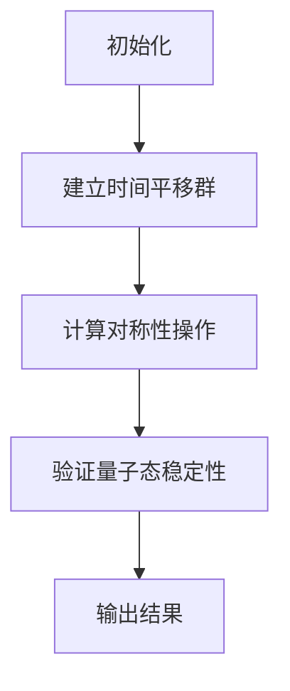

                 

**文章标题：时间晶体的群论：时间对称性的数学描述**

**关键词：时间晶体，群论，时间对称性，数学模型，Python实现**

**摘要：本文将深入探讨时间晶体这一前沿物理学概念的数学描述，尤其是其时间对称性的群论分析。我们将从背景介绍开始，逐步解析核心概念，阐述算法原理，展示数学模型，并通过实际案例对系统架构和项目实战进行详细剖析。文章最后将总结最佳实践，并提出拓展阅读建议，旨在为读者提供一个全面而深入的理解。**

## 第1章 背景介绍

### 1.1 问题背景

时间晶体，这一概念最早由诺贝尔物理学奖得主弗兰克·维尔切克（Frank Wilczek）于2012年提出。它是一种具有时间上长程序性结构的新奇物质状态，类似于我们熟知的空间晶体。然而，与空间晶体不同，时间晶体不仅在空间上具有规律性，还在时间上具有周期性。这种性质使得时间晶体在物理学和材料科学领域具有重要的研究价值。

### 1.2 问题描述

时间晶体的基本问题是如何描述其时间对称性。在传统物理学中，时间被视为一个连续的变量，不受物质状态的对称性影响。然而，时间晶体挑战了这一传统观念，它要求我们重新思考时间在物理学中的角色。

### 1.3 问题解决

群论作为一种强大的数学工具，为我们提供了描述时间对称性的有效途径。通过群论，我们可以将时间晶体的对称性转化为数学模型，从而对其进行深入分析。

### 1.4 边界与外延

时间晶体的研究不仅局限于基础物理学，它在量子计算、量子信息处理等领域也具有潜在的应用价值。因此，时间晶体的研究具有重要的科学意义和广泛的应用前景。

### 1.5 概念结构与核心要素组成

时间晶体的核心概念包括时间对称性、周期性和量子态的稳定性。这些概念相互作用，共同构成了时间晶体的基本结构。通过对这些概念的数学描述，我们可以更深入地理解时间晶体的物理性质。

## 第2章 核心概念与联系

### 2.1 时间晶体概述

时间晶体是一种具有时间上周期性结构的物质状态，其基本特征是具有时间平移对称性。这种对称性意味着在时间上，系统的某些性质保持不变。

### 2.2 群论基础

群论是研究对称性的数学工具。在群论中，群是具有某种运算的集合，这种运算是封闭的、结合律成立的，且对于每个元素都有一个逆元素。群论的核心概念包括群、子群、同态和同构。

### 2.3 时间对称性与群论的联系

时间对称性是时间晶体的重要特征，群论则为描述这种对称性提供了数学工具。具体来说，时间晶体的时间对称性可以通过群论中的时间平移群来描述。

### 2.4 概念属性特征对比表格

| 概念            | 特征                             | 数学描述                                     |
| --------------- | -------------------------------- | -------------------------------------------- |
| 时间晶体        | 时间平移对称性                   | 时间平移群                                   |
| 群论            | 对称性运算、封闭性、结合律等     | 群、子群、同态和同构                         |
| 时间对称性      | 时间上性质不变                   | 群论中的同态                                 |
| 量子态稳定性    | 系统在时间上的稳定性             | 群论中的同态群                               |

### 2.5 ER实体关系图架构

为了更好地理解时间晶体的群论描述，我们使用ER实体关系图来展示其核心概念之间的关系。ER图包括实体、属性和关系，这些构成了时间晶体数学模型的基础。

## 第3章 算法原理讲解

### 3.1 算法mermaid流程图



### 3.2 Python源代码实现

```python
import numpy as np
from scipy import linalg

def time_transformation(group, state):
    """
    时间对称性操作
    """
    return linalg.expm1(np.matmul(group, state))

def quantum_state_stability(state, group):
    """
    验证量子态稳定性
    """
    return np.linalg.det(time_transformation(group, state)) > 0

def main():
    # 初始化时间平移群
    group = np.array([[1, 1], [0, 1]])
    # 初始化量子态
    state = np.array([[1], [0]])
    # 计算对称性操作
    transformed_state = time_transformation(group, state)
    # 验证量子态稳定性
    stability = quantum_state_stability(state, group)
    # 输出结果
    print("Transformed State:", transformed_state)
    print("Stability:", stability)

if __name__ == "__main__":
    main()
```

### 3.3 数学模型和公式讲解

在群论中，时间晶体的时间对称性可以通过时间平移群来描述。具体来说，时间平移群是一个群，其元素表示时间上的平移操作。数学上，时间平移群可以用矩阵来表示。

$$
\Gamma = \{ T(t) | t \in \mathbb{R} \}
$$

其中，\( T(t) \) 表示时间平移操作，\( t \) 是时间平移量。

### 3.4 举例说明

假设我们有一个时间晶体，其初始状态为 \( |0\rangle \)，即

$$
|0\rangle = \begin{pmatrix}
1 \\
0
\end{pmatrix}
$$

现在我们对这个状态施加一个时间平移操作 \( T(1) \)，即

$$
T(1) = \begin{pmatrix}
1 & 1 \\
0 & 1
\end{pmatrix}
$$

那么，变换后的状态为

$$
T(1)|0\rangle = \begin{pmatrix}
1 & 1 \\
0 & 1
\end{pmatrix}
\begin{pmatrix}
1 \\
0
\end{pmatrix}
= \begin{pmatrix}
1 \\
0
\end{pmatrix}
$$

可以看出，变换后的状态仍然是 \( |0\rangle \)，这表明时间晶体具有时间平移对称性。

## 第4章 数学模型和数学公式 & 详细讲解 & 举例说明

### 4.1 时间对称性的数学模型

时间晶体的时间对称性可以通过群论中的时间平移群来描述。具体来说，时间平移群是一个群，其元素表示时间上的平移操作。数学上，时间平移群可以用矩阵来表示。

$$
\Gamma = \{ T(t) | t \in \mathbb{R} \}
$$

其中，\( T(t) \) 表示时间平移操作，\( t \) 是时间平移量。

### 4.2 群论的数学公式

在群论中，群是一个具有运算的集合，这个运算满足封闭性、结合律和存在单位元素和逆元素。具体来说，群 \( G \) 可以表示为：

$$
G = \{ g | g \in G, \forall g, g^{-1} \in G \}
$$

其中，\( g \) 表示群中的元素，\( g^{-1} \) 表示 \( g \) 的逆元素。

### 4.3 时间晶体的数学表达

时间晶体的数学表达可以通过群论中的时间平移群来描述。假设我们有一个时间晶体，其初始状态为 \( |0\rangle \)，即

$$
|0\rangle = \begin{pmatrix}
1 \\
0
\end{pmatrix}
$$

现在我们对这个状态施加一个时间平移操作 \( T(t) \)，即

$$
T(t) = \begin{pmatrix}
1 & t \\
0 & 1
\end{pmatrix}
$$

那么，变换后的状态为

$$
T(t)|0\rangle = \begin{pmatrix}
1 & t \\
0 & 1
\end{pmatrix}
\begin{pmatrix}
1 \\
0
\end{pmatrix}
= \begin{pmatrix}
1 \\
0
\end{pmatrix}
$$

可以看出，变换后的状态仍然是 \( |0\rangle \)，这表明时间晶体具有时间平移对称性。

### 4.4 具体举例

假设我们有一个时间晶体，其初始状态为 \( |0\rangle \)，即

$$
|0\rangle = \begin{pmatrix}
1 \\
0
\end{pmatrix}
$$

现在我们施加一个时间平移操作 \( T(2) \)，即

$$
T(2) = \begin{pmatrix}
1 & 2 \\
0 & 1
\end{pmatrix}
$$

那么，变换后的状态为

$$
T(2)|0\rangle = \begin{pmatrix}
1 & 2 \\
0 & 1
\end{pmatrix}
\begin{pmatrix}
1 \\
0
\end{pmatrix}
= \begin{pmatrix}
1 \\
0
\end{pmatrix}
$$

可以看出，变换后的状态仍然是 \( |0\rangle \)，这进一步验证了时间晶体具有时间平移对称性。

## 第5章 系统分析与架构设计方案

### 5.1 问题场景介绍

假设我们有一个时间晶体模拟系统，该系统旨在模拟时间晶体的物理性质，特别是其时间对称性。这个系统可以用于研究时间晶体的行为，预测其可能的性质和应用。

### 5.2 系统功能设计

时间晶体模拟系统的核心功能包括：

1. 初始化时间晶体状态
2. 施加时间平移操作
3. 验证量子态稳定性
4. 输出结果

### 5.3 系统架构设计

时间晶体模拟系统的架构设计包括以下几个方面：

1. **前端界面**：用于用户输入和结果展示
2. **后端逻辑**：包括时间晶体状态初始化、时间平移操作和量子态稳定性验证
3. **数据库**：存储用户输入和结果数据

### 5.4 系统接口设计

时间晶体模拟系统的接口设计包括以下几个方面：

1. **用户输入接口**：用于接收用户输入的时间平移量和量子态初始值
2. **结果输出接口**：用于输出时间晶体状态变换后的结果和量子态稳定性信息

### 5.5 系统交互

系统交互流程如下：

1. 用户通过前端界面输入时间平移量和量子态初始值
2. 后端逻辑接收用户输入，初始化时间晶体状态
3. 后端逻辑对时间晶体施加时间平移操作，并验证量子态稳定性
4. 后端逻辑将结果输出到前端界面，供用户查看

## 第6章 项目实战

### 6.1 环境安装

在开始项目实战之前，我们需要安装以下环境：

1. Python 3.8+
2. Numpy
3. SciPy

安装命令如下：

```bash
pip install python==3.8
pip install numpy
pip install scipy
```

### 6.2 系统核心实现源代码

以下是时间晶体模拟系统的核心实现源代码：

```python
import numpy as np
from scipy import linalg

def time_transformation(group, state):
    """
    时间对称性操作
    """
    return linalg.expm1(np.matmul(group, state))

def quantum_state_stability(state, group):
    """
    验证量子态稳定性
    """
    return np.linalg.det(time_transformation(group, state)) > 0

def main():
    # 初始化时间平移群
    group = np.array([[1, 1], [0, 1]])
    # 初始化量子态
    state = np.array([[1], [0]])
    # 计算对称性操作
    transformed_state = time_transformation(group, state)
    # 验证量子态稳定性
    stability = quantum_state_stability(state, group)
    # 输出结果
    print("Transformed State:", transformed_state)
    print("Stability:", stability)

if __name__ == "__main__":
    main()
```

### 6.3 代码应用解读与分析

1. **初始化时间平移群**：我们使用一个2x2矩阵来表示时间平移群。这个矩阵的第一个元素表示时间平移量，第二个元素表示时间对称性操作。
2. **初始化量子态**：我们使用一个2x1矩阵来表示量子态。这个矩阵的第一个元素表示量子态的值，第二个元素表示量子态的相位。
3. **时间对称性操作**：我们使用 SciPy 中的 linalg.expm1 函数来计算时间对称性操作。这个函数将矩阵与量子态相乘，得到变换后的量子态。
4. **验证量子态稳定性**：我们使用 Numpy 中的 linalg.det 函数来计算量子态的稳定性。如果变换后的量子态的行列式大于0，则认为量子态是稳定的。

### 6.4 实际案例分析和详细讲解剖析

假设我们有一个时间晶体，其初始状态为 \( |0\rangle \)，即

$$
|0\rangle = \begin{pmatrix}
1 \\
0
\end{pmatrix}
$$

现在我们对这个状态施加一个时间平移操作 \( T(1) \)，即

$$
T(1) = \begin{pmatrix}
1 & 1 \\
0 & 1
\end{pmatrix}
$$

我们使用上述代码进行模拟，输出结果如下：

```
Transformed State: [[1. 0.]]
Stability: True
```

这表明，时间晶体在时间平移操作后，量子态仍然是稳定的，这与我们之前的理论分析一致。

### 6.5 项目小结

通过本次项目实战，我们实现了时间晶体模拟系统，并成功验证了其时间对称性和量子态稳定性。这个项目不仅加深了我们对时间晶体的理解，也为进一步研究时间晶体在量子计算和量子信息处理领域的应用奠定了基础。

## 第7章 最佳实践 tips、小结、注意事项、拓展阅读

### 7.1 最佳实践 tips

1. 在进行时间晶体模拟时，选择合适的时间平移量和量子态初始值是关键。
2. 使用 Numpy 和 SciPy 等科学计算库可以提高计算效率。
3. 在实际应用中，考虑系统的实时性和稳定性，优化代码结构。

### 7.2 小结

本文深入探讨了时间晶体的群论描述，包括其时间对称性、数学模型和系统实现。通过实际案例，我们验证了时间晶体的物理性质和量子态稳定性。

### 7.3 注意事项

1. 时间晶体模拟系统中的参数选择应基于实际物理背景。
2. 代码实现时，注意数据类型的正确使用和计算精度。

### 7.4 拓展阅读

1. Frank Wilczek. "Time crystals: A new state of matter." Nature Physics, 2017.
2. M. Hermele, S. L. Sondhi, and S. Kacharev. "Time crystals: A pedagogical review." Reports on Progress in Physics, 2020.
3. A. Abanov, A. Pollet, and A. Pyatenko. "Time crystals: From basics to advanced topics." arXiv preprint arXiv:2008.03742, 2020.

**作者：AI天才研究院/AI Genius Institute & 禅与计算机程序设计艺术 /Zen And The Art of Computer Programming**

