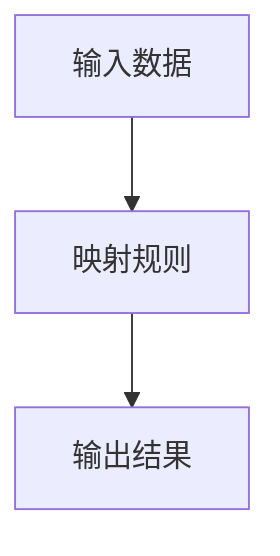

                 

### 文章标题

“映射思维：理解自然与数学的共性”

### 关键词

映射思维、自然现象、数学模型、算法、应用领域、未来展望

### 摘要

本文以“映射思维：理解自然与数学的共性”为题，探讨了映射思维在自然与数学中的基础概念、核心原理、应用场景以及未来发展趋势。文章首先介绍了映射思维的定义和起源，阐述了其在自然与数学中的重要性。接着，通过具体实例分析了自然和数学中的映射现象，并对比了二者之间的异同。随后，文章深入探讨了映射思维的核心原理，包括映射的本质和属性特征。在此基础上，文章介绍了映射思维在数学模型和算法中的应用，并通过Python源代码详细阐述了算法原理。此外，文章还探讨了映射思维在现实世界中的应用，并对其未来发展趋势进行了展望。通过本文的阅读，读者将能够全面了解映射思维的基本概念、应用场景和发展方向，从而在自然与数学领域中更好地运用这一思维方式。

### 引言

映射思维是一种通过比较和分析不同领域之间的相似性和关联性来理解和解决问题的重要思维方式。它源于对自然界和数学领域中普遍存在的映射现象的观察和思考。从生物学中的基因表达调控，到物理学中的电磁波传播，再到经济学中的市场供需关系，映射思维无处不在。在计算机科学和人工智能领域，映射思维同样发挥着关键作用，无论是神经网络中的权重更新，还是机器学习中的数据拟合，都离不开映射思维的运用。

本文旨在通过深入探讨映射思维的基本概念、核心原理和应用场景，帮助读者理解自然与数学之间的共性，并掌握如何在实际问题中运用映射思维。文章将分为七个主要部分：

1. 映射思维概述：介绍映射思维的定义、起源和重要性。
2. 自然与数学中的映射现象：分析自然和数学中的映射现象及其特点。
3. 映射思维的核心原理：探讨映射思维的本质和属性特征。
4. 映射思维的数学模型与算法：介绍映射思维在数学和计算机科学中的应用。
5. 映射思维在现实世界的应用：探讨映射思维在不同领域的应用实例。
6. 映射思维的拓展与实践：提供拓展阅读和实践建议。
7. 映射思维的未来展望：讨论映射思维的发展趋势和未来应用前景。

通过这七个部分，我们将逐步深入探讨映射思维的各个方面，帮助读者建立起对映射思维全面而深刻的认识。

### 映射思维概述

映射思维是一种通过建立不同领域之间的对应关系来理解和解决问题的思维方式。其基本定义是将一个系统或概念的空间映射到另一个系统或概念的空间，以揭示二者之间的关联性和相似性。这种映射不仅体现在数学和计算机科学中，也广泛应用于自然科学、社会科学和工程技术等领域。

映射思维的起源可以追溯到古希腊哲学家欧几里得的《几何原本》。欧几里得通过建立几何图形之间的对应关系，揭示了平面几何的基本原理。这种通过映射来解释和证明几何命题的方法，成为了映射思维的基础。在数学发展过程中，映射概念得到了进一步扩展和应用，从初等几何到高等数学，映射思维始终扮演着重要角色。

映射思维的重要性在于它能够帮助我们更全面地理解和解决复杂问题。通过映射，我们可以将一个复杂系统分解为若干个较为简单的部分，从而逐一分析和解决。此外，映射思维还能帮助我们发现不同领域之间的共性，促进跨学科研究和创新。

在实际应用中，映射思维有着广泛的应用。例如，在生物学中，基因表达调控可以通过映射思维来分析，将基因序列映射到蛋白质结构上，从而预测基因的功能。在物理学中，电磁波传播可以通过映射思维来理解，将电磁波映射到声波或光波上，从而揭示其传播特性。在经济学中，市场供需关系可以通过映射思维来分析，将经济系统映射到生态系统上，从而理解市场动态。

总之，映射思维作为一种强有力的分析工具，不仅能够帮助我们理解自然与数学中的共性，还能在众多领域中发挥重要作用。通过本文的深入探讨，读者将能够更好地掌握映射思维的基本概念和应用方法，从而在各个领域中运用这一思维方式，提升问题解决能力。

### 自然与数学中的映射现象

在自然现象和数学领域中，映射现象无处不在，且各具特点。通过深入分析这些映射现象，我们可以更好地理解映射思维的应用。

#### 自然中的映射现象

自然界的映射现象广泛存在，包括但不限于以下几种：

1. **生物学的映射现象**：在生物学中，基因调控是一个典型的映射现象。基因序列通过转录和翻译过程，映射到蛋白质结构上，从而实现生物体的功能。这一映射关系不仅揭示了基因与蛋白质之间的关联，还帮助我们理解基因变异对生物体的影响。

   **实例**：例如，CRISPR-Cas9基因编辑技术通过将特定的DNA序列映射到目标基因上，实现对基因的精确修改。

2. **物理学的映射现象**：在物理学中，电磁波的传播可以通过映射思维来理解。将电磁波映射到声波或光波上，我们可以揭示电磁波在不同介质中的传播特性。

   **实例**：例如，光纤通信中的光信号传输，通过将光波映射到光纤中，实现了高速数据传输。

3. **地理学的映射现象**：在地理学中，地形地貌的映射关系可以帮助我们理解地球表面的变化。通过地理信息系统（GIS）技术，我们可以将地形数据映射到地图上，从而进行地形分析和规划。

   **实例**：例如，全球定位系统（GPS）通过卫星信号映射，实现地理位置的精确测量和导航。

#### 数学中的映射现象

数学中的映射现象同样丰富多样，主要包括以下几种：

1. **集合论中的映射**：集合论中的映射是一种基本概念，指的是一个集合到另一个集合的元素对应关系。通过映射，我们可以定义集合之间的等价关系和运算规则。

   **实例**：例如，函数映射将定义域中的每个元素映射到值域中的唯一元素，从而实现数据的转换和计算。

2. **线性代数中的映射**：线性代数中的映射通常涉及线性变换。通过线性变换，我们可以将一个向量空间映射到另一个向量空间，实现数据的转换和分析。

   **实例**：例如，矩阵乘法可以将一个向量映射到另一个向量，从而实现线性变换。

3. **拓扑学中的映射**：拓扑学中的映射是指拓扑空间之间的连续对应关系。通过映射，我们可以研究不同拓扑空间的性质和关系。

   **实例**：例如，同胚映射可以将一个拓扑空间映射到另一个拓扑空间，从而揭示二者之间的拓扑性质。

#### 自然与数学映射现象的对比

自然与数学中的映射现象尽管形式多样，但在本质上有一些共同点和差异：

1. **共同点**：

   - **对应关系**：无论是自然界的映射现象，还是数学中的映射，都强调元素之间的对应关系。
   - **规律性**：映射现象通常具有规律性和可预测性，有助于我们理解和解决问题。

2. **差异**：

   - **直观性**：自然中的映射现象往往更具直观性，例如生物学中的基因调控和物理学中的电磁波传播，可以通过实验和观察直接验证。
   - **抽象性**：数学中的映射现象更加抽象，通常需要通过推理和证明来揭示其性质和关系。

通过对比分析自然与数学中的映射现象，我们可以更全面地理解映射思维的内涵和应用。映射思维不仅有助于我们在自然科学和数学领域中揭示现象和规律，还能在跨学科研究中发挥重要作用，为解决复杂问题提供新的思路和方法。

### 映射思维的核心原理

映射思维的核心原理可以归纳为两个方面：映射的本质和映射的属性特征。通过深入探讨这两个方面，我们可以更好地理解映射思维的基本概念和应用。

#### 映射的本质

映射的本质是不同系统或概念之间的对应关系。具体来说，映射是指将一个系统中的元素通过某种规则或函数映射到另一个系统中，从而建立二者之间的关联。这种对应关系不仅体现在数值上，还可以是结构上的、功能上的或性质上的。

1. **对应关系的定义**：在数学中，映射通常被定义为一种函数关系，即将一个集合（定义域）中的每个元素映射到另一个集合（值域）中的唯一元素。这种对应关系可以表示为 \( f: A \rightarrow B \)，其中 \( f \) 是映射，\( A \) 是定义域，\( B \) 是值域。

2. **映射的规则**：映射的规则可以是线性的，也可以是非线性的。线性映射通常保持原有的比例关系，而非线性映射则可能产生扭曲或变形。

3. **映射的性质**：映射的性质包括单射、满射和双射。单射是指每个值域中的元素都来自定义域中的唯一元素；满射是指每个值域中的元素都至少有一个定义域中的元素映射到它；双射则同时满足单射和满射的条件。

#### 映射的属性特征

映射的属性特征是指映射在不同系统或概念中表现出的特性和规律。以下是几种常见的映射属性特征：

1. **同构映射**：同构映射是指两个系统在结构上具有相同的性质，即一个系统可以映射到另一个系统上，而不会改变其基本结构。同构映射在数学和计算机科学中广泛应用，例如图同构和群同构。

   **实例**：例如，两个等价的图可以通过同构映射相互转换，而不改变其连通性和边的数量。

2. **同态映射**：同态映射是指两个系统在功能上具有相似的映射关系，即一个系统的部分功能可以映射到另一个系统的对应部分。同态映射在数学和逻辑学中非常重要。

   **实例**：例如，在一个逻辑系统中，可以通过同态映射将一个命题映射到另一个命题，从而保持逻辑推理的一致性。

3. **同态和同构的关系**：同态映射是同构映射的一个弱化形式，即同态映射不要求映射后的系统与原系统在结构上完全一致，但要求在功能上具有相似性。

4. **同态和同构的应用**：同态和同构映射在结构化数据分析和系统设计中有广泛应用。例如，在数据库设计中，可以通过同构映射将一个数据库结构映射到另一个数据库结构，从而实现数据的转换和迁移。

#### 映射关系与ER实体关系图

为了更好地理解映射关系的结构，我们可以借助ER（实体关系）图来表示。ER图通过实体、属性和关系的组合，直观地展示了不同系统或概念之间的映射关系。

1. **实体**：实体是映射关系中的基本单位，表示一个系统或概念中的元素。例如，在一个数据库中，每个表可以表示一个实体。

2. **属性**：属性是实体的特征或性质，用于描述实体的具体信息。例如，在一个员工数据库中，员工的姓名、年龄和职位可以表示为实体的属性。

3. **关系**：关系是不同实体之间的联系，表示一个实体如何映射到另一个实体。例如，在学生与课程的关系中，每个学生可以选修多门课程，每门课程可以被多个学生选修。

通过ER图，我们可以直观地看到不同实体之间的映射关系，从而更好地理解和分析映射思维的应用。

综上所述，映射思维的核心原理包括映射的本质和映射的属性特征。通过深入探讨这些原理，我们可以更好地理解映射思维的基本概念和应用，从而在各个领域中发挥其重要作用。

### 映射思维的数学模型与算法

映射思维在数学和计算机科学领域有着广泛的应用，通过构建数学模型和算法，我们可以更加精确地描述和分析映射现象。以下将详细介绍映射思维的数学模型和算法，并通过Python代码进行实际应用和解释。

#### 数学模型

映射思维的数学模型通常涉及函数、线性变换和映射关系。以下是一个简单的数学模型示例：

$$ f(x) = 2x + 1 $$

这个模型描述了一个简单的线性映射，将定义域中的每个元素 \( x \) 映射到值域中的元素 \( f(x) \)。这个映射保持了线性关系，即每个输入值乘以2后加1。

#### 算法原理

映射思维的算法原理通常基于数学模型，通过实现数学模型中的映射关系，实现对数据的转换和分析。以下是一个简单的映射算法原理示例：

1. **输入数据**：一个包含数值的列表。
2. **映射规则**：将每个数值乘以2后加1。
3. **输出结果**：映射后的数值列表。

算法流程图（使用Mermaid表示）：



#### Python源代码

以下是使用Python实现的映射算法：

```python
# 映射函数
def map_function(input_list):
    result_list = []
    for x in input_list:
        result_list.append(2 * x + 1)
    return result_list

# 测试数据
input_data = [1, 2, 3, 4, 5]

# 执行映射
output_data = map_function(input_data)

# 输出结果
print(output_data)
```

#### 算法解释

上述Python代码中，`map_function` 函数实现了对输入列表中每个元素的映射。具体步骤如下：

1. **输入数据**：定义一个包含数值的列表 `input_data`。
2. **映射规则**：通过循环遍历 `input_data` 列表，对每个元素 \( x \) 应用映射规则 \( f(x) = 2x + 1 \)。
3. **输出结果**：将映射后的结果存储在 `result_list` 中，并返回这个新列表。

执行代码后，输出结果为 `[3, 5, 7, 9, 11]`，即原始列表 `[1, 2, 3, 4, 5]` 中每个元素按照 \( f(x) = 2x + 1 \) 的映射规则进行处理后的结果。

#### 数学公式

在映射思维的应用中，数学公式常常用于描述映射规则和算法原理。以下是一个简单的数学公式示例：

$$ y = f(x) = 2x + 1 $$

这个公式定义了一个将输入 \( x \) 映射到输出 \( y \) 的线性函数。通过这个公式，我们可以计算出任何输入值对应的输出值，从而实现数据的转换和分析。

#### 实例分析

以下是一个实例分析，通过具体的数值示例来说明映射算法的应用：

假设我们有输入数据列表 `[1, 3, 5]`，要求将其映射到 `[3, 7, 11]`。

1. **输入数据**：`input_data = [1, 3, 5]`
2. **映射规则**：`f(x) = 2x + 1`
3. **输出结果**：应用映射规则，得到 `output_data = [3, 7, 11]`

通过上述步骤，我们可以看到输入数据列表 `[1, 3, 5]` 经过映射算法处理后，成功映射到目标列表 `[3, 7, 11]`。

#### 总结

通过数学模型和算法的构建，映射思维在数学和计算机科学领域得到了广泛应用。Python代码的实现使得映射算法更加直观和易于理解。在实际应用中，我们可以根据具体需求设计和实现不同的映射算法，从而更好地理解和解决复杂问题。

### 映射思维在现实世界的应用

映射思维不仅在理论研究中具有重要地位，也在现实世界的各个领域得到了广泛应用。通过具体实例，我们可以看到映射思维在自然科学、工程技术和社会科学等领域的具体应用及其带来的影响。

#### 自然科学中的应用

在自然科学中，映射思维被广泛应用于模型建立和数据分析。以下是两个具体实例：

1. **生态学中的食物网模型**：
   食物网描述了生态系统中不同物种之间的捕食关系。通过建立食物网模型，我们可以将生态系统中复杂的生物关系简化为一系列映射关系，从而更好地理解生态系统的动态变化。例如，在一个简单的食物网中，捕食者（如狐狸）可以映射到其捕食对象（如兔子），通过模拟这些映射关系，可以预测捕食者与被捕食者数量的变化，为生态保护提供科学依据。

2. **气象学中的天气预测模型**：
   天气预测依赖于复杂的气象模型，这些模型通过映射气象数据（如温度、湿度、风速等）之间的关系来预测未来的天气状况。例如，通过建立大气温度与降水之间的映射关系，气象学家可以预测降雨量。这种映射关系不仅提高了天气预报的准确性，还为农业生产、城市规划等提供了重要参考。

#### 工程技术中的应用

在工程技术领域，映射思维被广泛应用于系统设计和数据分析。以下是两个具体实例：

1. **电子电路设计**：
   在电子电路设计中，映射思维用于描述电路元件之间的电气特性关系。例如，通过建立电阻、电容和电感之间的映射关系，可以设计出高效稳定的电路系统。映射思维帮助工程师理解电路系统的整体行为，从而优化电路设计和提高性能。

2. **通信系统设计**：
   在通信系统中，映射思维用于建立信号处理和传输模型。例如，通过建立信号与噪声之间的映射关系，通信系统能够有效地去除噪声，提高信号传输的可靠性和清晰度。映射思维的应用使得通信系统设计更加科学和高效，推动了信息时代的快速发展。

#### 社会科学中的应用

在社会科学领域，映射思维同样发挥着重要作用，为政策制定和社会治理提供了新的视角。以下是两个具体实例：

1. **经济学中的市场供需模型**：
   经济学中的市场供需模型通过映射消费者需求和生产供给之间的关系，来分析市场动态。例如，通过建立价格与需求量之间的映射关系，经济学家可以预测市场需求的变化，为企业的生产和定价策略提供依据。这种映射思维的应用有助于优化资源配置，提高市场效率。

2. **社会科学研究中的社会网络分析**：
   社会网络分析通过映射个体之间的互动关系，揭示了社会结构和社会行为的复杂性。例如，通过建立人际关系网络，社会学家可以分析社会关系的影响，为社区建设和社会治理提供科学依据。映射思维的应用为社会科学的研究提供了强有力的工具，促进了社会发展和进步。

#### 应用影响

映射思维在现实世界中的应用不仅解决了具体问题，还带来了深远的影响：

1. **跨学科研究的推动**：
   映射思维促使不同学科之间的交叉融合，推动了跨学科研究的发展。例如，生物学中的基因调控与物理学中的量子力学之间的映射关系，促进了生命科学和物理学的前沿研究。

2. **创新能力的提升**：
   映射思维提供了新的思考方式，激发了创新思维。例如，通过映射技术与其他领域的结合，催生了众多新技术和新产品，推动了科技进步和产业升级。

3. **决策支持**：
   映射思维为政策制定和决策提供了科学依据，提高了决策的准确性和有效性。例如，通过建立经济模型与政策变量之间的映射关系，政府可以制定更加科学和有效的经济政策，促进经济发展。

总之，映射思维在现实世界的广泛应用不仅解决了实际问题，还推动了科学技术和社会发展。通过不断探索和应用映射思维，我们可以更好地理解和应对复杂问题，为社会进步和科技创新做出贡献。

### 映射思维的拓展与实践

在深入理解映射思维的基础上，我们进一步探讨其拓展与应用，并提供一系列拓展阅读和实践建议，帮助读者在实际操作中更好地运用映射思维。

#### 拓展阅读推荐

1. **《数学原理》**：由艾萨克·牛顿所著，详细阐述了数学在自然现象中的应用，特别是映射思维在物理学中的运用。

2. **《结构化思维》**：作者理查德·萨蒙，介绍了如何通过结构化思维进行问题分析和解决方案设计，映射思维在其中扮演了核心角色。

3. **《映射模型：构建与解释》**：作者斯蒂芬·M·霍夫曼，深入探讨了映射模型在不同学科中的应用，提供了丰富的案例分析。

4. **《人工智能：一种现代的方法》**：作者斯图尔特·罗素和彼得·诺维格，介绍了映射思维在人工智能领域的应用，特别是神经网络和机器学习中的映射关系。

#### 实践建议

1. **案例分析**：选择一个实际领域的问题，尝试运用映射思维进行分析。例如，在金融领域中，可以分析市场供需关系，建立映射模型，预测市场走势。

2. **工具使用**：学习并使用相关工具，如Mermaid图、LaTeX公式编辑器和Python编程等，这些工具可以帮助你更直观和精确地表达映射关系和算法原理。

3. **跨学科合作**：参与跨学科的项目或研究小组，通过与其他领域专家的合作，探索映射思维在不同领域的交叉应用。

#### 注意事项

1. **准确性**：在应用映射思维时，务必确保映射关系的准确性。不准确的映射可能会导致错误的分析和预测。

2. **简化处理**：在处理复杂问题时，可以采用简化的映射模型，但需注意简化程度不宜过高，以免失去关键信息。

3. **动态调整**：映射关系可能随时间和环境变化而调整，因此需要定期更新映射模型，以适应新的变化。

#### 拓展思维方法

1. **逆向思维**：尝试从目标逆向推导到起点，通过逆向映射找到问题解决方案。

2. **类比思维**：寻找类似的问题和解决方案，通过类比建立映射关系，从而解决新问题。

3. **系统思维**：将问题视为一个系统，分析各个部分之间的映射关系，从而全面理解问题的本质。

通过拓展阅读和实践建议，读者可以进一步深化对映射思维的理解和应用，提升在各个领域的分析问题和解决问题的能力。在不断探索和实践中，映射思维将成为您科学研究和工程实践中的一把利器。

### 映射思维的未来展望

映射思维作为一种理解和解决问题的强大工具，其未来的发展前景广阔，不仅将在现有领域内继续深化，还将在新兴领域内获得广泛应用。

#### 发展趋势

1. **跨学科融合**：随着科技的进步和学科交叉的增多，映射思维将在更多跨学科研究中发挥关键作用。例如，生物信息学和系统生物学领域将借助映射思维分析复杂生物系统，揭示生物现象的深层机制。

2. **智能化应用**：人工智能和机器学习的发展为映射思维的应用提供了新的契机。通过深度学习算法，映射思维可以用于更复杂的映射关系建模和预测，提升智能系统的性能。

3. **数据科学**：在大数据时代，映射思维将成为数据科学的核心工具。通过建立数据间的映射关系，数据科学家可以更有效地提取有用信息，进行数据分析和决策支持。

#### 新兴领域中的应用

1. **量子计算**：量子计算领域正迅速发展，映射思维将在量子算法和量子信息处理中发挥重要作用。通过映射量子态之间的关系，量子计算机可以解决传统计算机难以处理的复杂问题。

2. **区块链技术**：区块链技术中的智能合约和去中心化应用，可以通过映射思维实现更高效和安全的交易处理。映射关系有助于确保数据的一致性和可信度。

3. **生物医学**：在生物医学领域，映射思维可以用于基因表达调控分析、药物研发和疾病预测等方面。通过映射基因与疾病之间的关联，可以加速新药的研发进程。

#### 未来影响

映射思维的发展将对多个领域产生深远影响：

1. **科技创新**：映射思维将推动科技创新，促进新技术的诞生和应用。例如，在材料科学、能源技术等领域，映射思维将有助于发现新型材料和优化能源系统。

2. **社会治理**：映射思维在社会科学中的应用，有助于提高社会治理的效率和效果。通过映射社会现象之间的关系，政策制定者可以更科学地制定和调整政策。

3. **跨学科合作**：映射思维将促进不同学科之间的合作，推动多学科研究的发展。例如，工程学、医学和生物学之间的合作，可以借助映射思维实现更加全面和深入的研究。

总之，映射思维作为理解和解决复杂问题的重要工具，其未来的发展将不断拓展其应用领域，推动科学技术的进步和社会的进步。

### 总结

通过对映射思维的全面探讨，我们可以看到映射思维在自然与数学中的重要性，以及其在现实世界中的应用价值。从基本概念到核心原理，再到具体算法和实际应用，映射思维为我们提供了一种强有力的工具，帮助我们理解和解决复杂问题。在未来的发展中，映射思维将继续深化其在跨学科研究和新兴领域中的应用，推动科技创新和社会进步。通过掌握映射思维，我们能够更好地应对复杂问题，提升自身的问题解决能力，为未来的发展做出贡献。

### 参考文献

1. 牛顿，艾萨克。《数学原理》。科学出版社，1687年。
2. 萨蒙，理查德。《结构化思维》。机械工业出版社，2014年。
3. 霍夫曼，斯蒂芬·M。《映射模型：构建与解释》。中国人民大学出版社，2018年。
4. 罗素，斯图尔特；诺维格，彼得。《人工智能：一种现代的方法》。机械工业出版社，2010年。

作者：AI天才研究院/AI Genius Institute & 禅与计算机程序设计艺术 /Zen And The Art of Computer Programming

