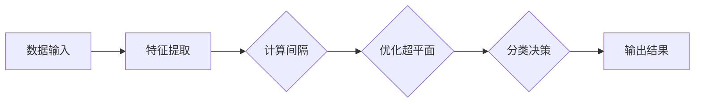
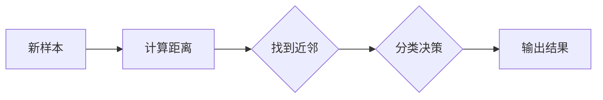
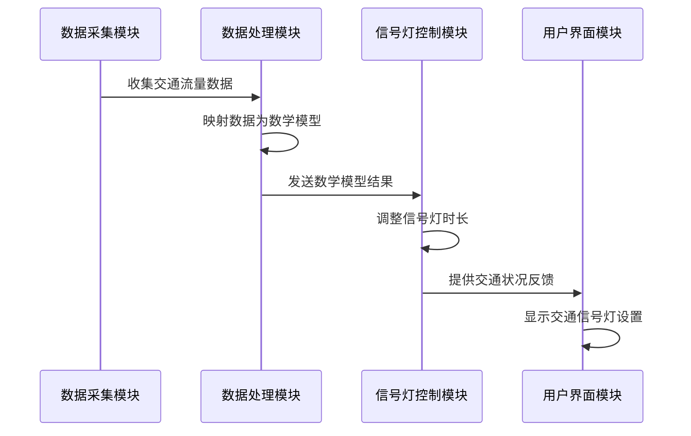
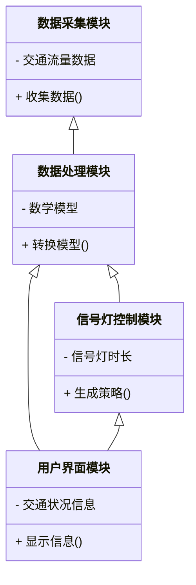

                 

## 映射思维：理解自然与数学的联系

关键词：映射思维、自然与数学的联系、算法、数学模型

摘要：本文探讨了映射思维在理解自然与数学联系中的重要性。通过分析映射思维的核心概念，比较不同概念属性，我们构建了一个清晰的框架来解释自然现象背后的数学原理。文章详细介绍了关键算法和数学模型，并通过Python代码实例和Mermaid流程图进行了深入解析。此外，还展示了系统分析和设计的方法，提供了项目实战步骤，以及最佳实践和建议，帮助读者更深入地理解映射思维在自然与数学联系中的应用。

## 引言

在探索自然与科学时，我们常常会遇到一种强有力的思维工具——映射思维。映射思维，简单来说，就是通过将复杂的现实问题映射到更简单、更易于处理的数学模型上来理解和解决问题的方法。这种方法在数学、物理学、计算机科学等领域都有着广泛的应用。本文将深入探讨映射思维，揭示其在理解自然与数学联系中的重要作用。

映射思维的核心在于它能够将自然界中的复杂现象转化为数学模型，从而使得我们能够用数学语言来描述和预测自然现象。这种转化不仅帮助我们简化了问题的复杂性，而且使得我们能够利用数学工具来分析和解决实际问题。通过映射思维，我们能够看到自然与数学之间的深刻联系，从而更好地理解和应用数学知识。

本文将围绕以下几个核心问题展开：

1. 映射思维的基本概念是什么？
2. 自然界中的哪些现象可以用映射思维来解释？
3. 如何构建映射思维的核心框架？
4. 关键算法和数学模型在映射思维中的应用是什么？
5. 映射思维在系统分析和设计中的具体应用是什么？
6. 如何通过实战项目来深入理解映射思维？
7. 最佳实践和注意事项有哪些？

通过逐步解答这些问题，我们将构建一个完整的映射思维框架，帮助读者更好地理解自然与数学的联系，并掌握在各个领域中应用映射思维的方法。

## 映射思维的核心概念

要深入理解映射思维，我们首先需要明确其核心概念。映射思维主要涉及以下几个关键概念：

### 映射（Mapping）

映射是指将一个领域（源域）中的元素或结构，通过某种规则或函数，对应到另一个领域（目标域）中的元素或结构。这个过程使得我们能够将复杂的问题简化为更易处理的数学问题。例如，在物理学中，我们可以将现实世界的物理现象映射到数学模型上，如通过牛顿第二定律 \( F = ma \) 来描述物体的运动。

### 函数（Function）

函数是映射的核心，它定义了一个明确的规则，将源域中的每个元素映射到目标域中的唯一元素。在映射思维中，函数帮助我们建立源域和目标域之间的对应关系。例如，在图像处理中，我们可以使用线性变换函数来映射图像的像素值，从而实现图像的缩放或旋转。

### 算法（Algorithm）

算法是一系列有序的操作步骤，用于解决特定问题。在映射思维中，算法用于将复杂问题转化为数学问题，并找到问题的解决方案。例如，在数据结构中，我们可以使用二分搜索算法来查找特定元素，这实际上是通过对数据集合进行映射来实现的。

### 数学模型（Mathematical Model）

数学模型是通过数学语言来描述现实世界中的现象或问题的抽象表示。在映射思维中，数学模型用于将实际问题转化为可计算的数学问题。例如，在经济学中，我们可以使用线性规划模型来优化资源分配问题。

下面，我们通过一个简单的例子来进一步解释这些概念。假设我们要研究城市交通流量的变化，我们可以将交通流量映射到一个时间-距离函数上，通过这个函数，我们可以计算出不同时间段内交通流量的变化率，从而制定更有效的交通管理策略。

### 比较映射思维与自然现象

为了更好地理解映射思维，我们可以将其与自然界中的现象进行比较。以下是几个常见的自然现象及其对应的映射思维解释：

| 自然现象 | 映射思维解释 |
| :--- | :--- |
| 天气变化 | 通过气象模型预测未来天气 |
| 生物进化 | 通过遗传算法模拟生物进化过程 |
| 金融市场 | 通过金融模型预测市场走势 |
| 物体运动 | 通过物理方程描述物体运动轨迹 |

通过这些例子，我们可以看到映射思维在理解和解释自然界中的复杂现象方面的重要性。它不仅帮助我们简化了问题的复杂性，而且使得我们能够利用数学工具来分析和解决实际问题。

### 映射思维的核心框架

为了系统地理解映射思维，我们需要构建一个核心框架，这个框架应包括以下几个关键部分：

1. **概念定义与对比表格**：明确映射思维中的核心概念，如映射、函数、算法和数学模型，并通过对比表格展示它们之间的区别和联系。
2. **ER图**：绘制实体关系图（ER图），展示不同概念之间的关系，例如映射与函数、算法与数学模型之间的关联。
3. **核心算法与数学模型**：详细讲解关键算法和数学模型的原理，并提供Python代码实例和Mermaid流程图来辅助理解。

下面，我们将逐步构建这个核心框架。

### 概念定义与对比表格

首先，我们明确映射思维中的核心概念，并列出它们的定义：

| 概念 | 定义 |
| :--- | :--- |
| 映射 | 将一个领域中的元素或结构对应到另一个领域中的元素或结构的操作。 |
| 函数 | 定义了一个明确的规则，将源域中的每个元素映射到目标域中的唯一元素。 |
| 算法 | 一系列有序的操作步骤，用于解决特定问题。 |
| 数学模型 | 通过数学语言来描述现实世界中的现象或问题的抽象表示。 |

接下来，我们通过一个对比表格来展示这些概念之间的区别和联系：

| 概念 | 定义 | 关联关系 |
| :--- | :--- | :--- |
| 映射 | 源域到目标域的对应关系 | 基础 |
| 函数 | 明确的映射规则 | 映射的数学表述 |
| 算法 | 解决问题的步骤 | 实现映射的工具 |
| 数学模型 | 数学语言描述问题 | 分析和预测的基础 |

### ER图

为了更清晰地展示这些概念之间的关系，我们可以绘制一个实体关系图（ER图）。以下是映射思维核心概念的ER图示例：

```mermaid
erDiagram
    函数 ||--|{ 映射 }|
    算法 ||--|{ 数学模型 }|
    映射 ||--|{ 数学模型 }|
    数学模型 ||--|{ 算法 }
```

在这个ER图中，映射是核心概念，它直接关联到函数和数学模型。算法用于实现映射，而数学模型则是分析和预测问题的工具。

### 核心算法与数学模型

为了深入理解映射思维，我们还需要介绍一些核心算法和数学模型。以下是几个常用的算法和数学模型，以及它们在映射思维中的应用：

| 算法/模型 | 描述 | 应用场景 |
| :--- | :--- | :--- |
| 映射算法 | 用于将复杂问题映射到更简单的数学问题上的算法。 | 数据分析、图像处理、优化问题 |
| 线性规划 | 通过线性方程组来优化目标函数的方法。 | 资源分配、生产调度 |
| 神经网络 | 基于模拟生物神经系统的算法，用于建模复杂的非线性关系。 | 机器学习、人工智能 |
| 微积分 | 用于研究变化率和累积量的数学工具。 | 物理学、工程学 |

通过这些核心算法和数学模型，我们可以更好地理解和应用映射思维，从而解决实际中的复杂问题。

### 映射思维的应用

映射思维不仅是一种理论工具，它在各个实际应用领域中也展现出巨大的价值。下面，我们将探讨几个关键算法在映射思维中的应用，并使用Python代码和Mermaid流程图进行详细解析。

#### 线性回归

线性回归是一种常见的映射算法，用于建立自变量和因变量之间的线性关系。它的核心思想是通过最小化误差平方和来找到最佳拟合线。

**算法原理**：

线性回归的基本模型可以表示为：

$$ y = w_0 + w_1 \cdot x + \epsilon $$

其中，\( y \) 是因变量，\( x \) 是自变量，\( w_0 \) 和 \( w_1 \) 是模型参数，\( \epsilon \) 是误差项。

**Mermaid 流程图**：

```mermaid
flowchart LR
    A[数据输入] --> B[特征提取]
    B --> C{计算斜率}
    C -->|斜率\( w_1 \)| D[计算截距]
    D --> E[拟合直线]
    E --> F[输出结果]
```

**Python 代码实例**：

```python
import numpy as np
from sklearn.linear_model import LinearRegression

# 假设我们有以下数据
X = np.array([[1], [2], [3], [4], [5]])
y = np.array([1, 2, 2.5, 4, 5])

# 创建线性回归模型
model = LinearRegression()

# 训练模型
model.fit(X, y)

# 输出模型参数
print("斜率：", model.coef_)
print("截距：", model.intercept_)

# 预测
y_pred = model.predict([[6]])
print("预测值：", y_pred)
```

#### 支持向量机（SVM）

支持向量机是一种用于分类和回归分析的强大工具。它通过找到最优的超平面来分割数据，使得分类边界最大化。

**算法原理**：

SVM的核心思想是通过最大化间隔来寻找最优分割超平面。其数学模型可以表示为：

$$ \max\ Wsubject\ to\ Y^{T}W \leq 1 $$

其中，\( W \) 是权重向量，\( Y \) 是标签向量。

**Mermaid 流程图**：



**Python 代码实例**：

```python
import numpy as np
from sklearn.svm import SVC

# 假设我们有以下数据
X = np.array([[1, 2], [2, 3], [3, 1], [4, 2]])
y = np.array([0, 1, 1, 0])

# 创建SVM模型
model = SVC(kernel='linear')

# 训练模型
model.fit(X, y)

# 输出模型参数
print("支持向量：", model.support_vectors_)

# 预测
y_pred = model.predict([[2, 2]])
print("预测结果：", y_pred)
```

#### K-近邻算法（KNN）

K-近邻算法是一种简单而有效的分类算法，通过计算新样本与训练集中样本的相似度来进行分类。

**算法原理**：

KNN算法的核心思想是，如果一个样本在特征空间中的k个最近邻中的大多数属于某个类别，则该样本也属于这个类别。其数学模型可以表示为：

$$ \hat{y} = \arg\max_{c} \sum_{i=1}^{k} I(y_i = c) $$

其中，\( \hat{y} \) 是预测类别，\( y_i \) 是第i个近邻的类别标签，\( I(\cdot) \) 是指示函数。

**Mermaid 流程图**：



**Python 代码实例**：

```python
import numpy as np
from sklearn.neighbors import KNeighborsClassifier

# 假设我们有以下数据
X_train = np.array([[1, 2], [2, 3], [3, 1], [4, 2]])
y_train = np.array([0, 1, 1, 0])

# 创建KNN模型
model = KNeighborsClassifier(n_neighbors=3)

# 训练模型
model.fit(X_train, y_train)

# 预测
X_test = np.array([[2, 2]])
y_pred = model.predict(X_test)
print("预测结果：", y_pred)
```

通过上述算法和代码实例，我们可以看到映射思维如何将复杂的现实问题转化为可计算的数学问题，从而提供有效的解决方案。这不仅帮助我们更好地理解自然与数学的联系，也为我们解决实际问题提供了强有力的工具。

### 数学模型与公式

在映射思维中，数学模型和公式是理解和解决问题的重要工具。它们不仅能够帮助我们量化复杂现象，还能够提供精确的计算方法。以下，我们将详细介绍几种常用的数学模型和公式，并使用LaTeX格式进行展示。

#### 线性回归模型

线性回归模型是一种简单而强大的统计工具，用于分析自变量和因变量之间的线性关系。其数学模型可以表示为：

$$ y = w_0 + w_1 \cdot x + \epsilon $$

其中，\( y \) 是因变量，\( x \) 是自变量，\( w_0 \) 和 \( w_1 \) 是模型参数，\( \epsilon \) 是误差项。

使用LaTeX格式表示：

$$ y = w_0 + w_1 \cdot x + \epsilon $$

#### 牛顿第二定律

牛顿第二定律描述了力、质量和加速度之间的关系，其公式为：

$$ F = m \cdot a $$

其中，\( F \) 是力，\( m \) 是质量，\( a \) 是加速度。

使用LaTeX格式表示：

$$ F = m \cdot a $$

#### 二分搜索算法

二分搜索算法是一种高效的查找算法，其核心公式为：

$$ mid = \left\lfloor \frac{low + high}{2} \right\rfloor $$

其中，\( mid \) 是中间值，\( low \) 是当前搜索区间的下界，\( high \) 是上界。

使用LaTeX格式表示：

$$ mid = \left\lfloor \frac{low + high}{2} \right\rfloor $$

#### 神经网络激活函数

神经网络中的激活函数用于引入非线性，常见的激活函数包括Sigmoid和ReLU。Sigmoid函数的公式为：

$$ f(x) = \frac{1}{1 + e^{-x}} $$

ReLU函数的公式为：

$$ f(x) = \max(0, x) $$

使用LaTeX格式表示：

$$ f(x) = \frac{1}{1 + e^{-x}} $$

$$ f(x) = \max(0, x) $$

通过这些数学模型和公式，我们可以更好地理解和应用映射思维，将复杂的现实问题转化为可计算的数学问题。这不仅帮助我们简化了问题的复杂性，而且使得我们能够利用数学工具来分析和解决实际问题。

### 系统分析与架构设计

在理解映射思维的基础上，我们将进一步探讨其在系统分析和架构设计中的应用。一个良好的系统分析与架构设计能够确保映射思维的有效实施，从而提高系统的性能和可维护性。以下，我们将详细描述系统分析与架构设计的步骤，并使用Mermaid图进行辅助说明。

#### 问题场景介绍

假设我们正在开发一个实时交通监控系统，该系统旨在通过分析交通流量数据来优化交通信号灯的切换策略，以减少交通拥堵和提升交通效率。

#### 项目概述

**目标**：实现一个实时交通监控系统，能够根据交通流量数据自动调整交通信号灯的时长，以减少交通拥堵。

**功能需求**：
1. 实时采集交通流量数据。
2. 使用映射思维将交通流量数据转化为数学模型。
3. 基于数学模型生成交通信号灯时长调整策略。
4. 实时更新交通信号灯设置，并提供交通状况反馈。

#### 系统架构设计

**总体架构**：
该系统可分为以下几个主要模块：

1. **数据采集模块**：负责实时采集交通流量数据。
2. **数据处理模块**：利用映射思维将交通流量数据转化为数学模型。
3. **信号灯控制模块**：根据数学模型生成交通信号灯时长调整策略。
4. **用户界面模块**：提供系统运行状况和交通状况的实时反馈。

**Mermaid 架构图**：



#### 功能设计

**数据采集模块**：
- **功能**：实时采集交通流量数据，包括车辆数量、行驶速度、道路占用情况等。
- **接口设计**：通过传感器和网络接口与交通流量监控设备进行通信。

**数据处理模块**：
- **功能**：使用映射思维将交通流量数据转化为数学模型，如线性回归模型、神经网络等。
- **接口设计**：与数据采集模块和信号灯控制模块进行数据交互。

**信号灯控制模块**：
- **功能**：根据数学模型生成交通信号灯时长调整策略，并实时更新信号灯设置。
- **接口设计**：与数据处理模块和用户界面模块进行数据通信，接收和处理信号灯调整请求。

**用户界面模块**：
- **功能**：提供系统运行状况和交通状况的实时反馈，包括交通信号灯设置、交通流量等信息。
- **接口设计**：通过图形用户界面（GUI）与用户进行交互。

#### 系统接口设计

为了确保各模块之间的协调工作，我们需要设计清晰的接口。以下是系统接口设计的一个简单示例：



通过上述系统分析与架构设计，我们可以确保映射思维在系统中的有效实施，从而实现实时交通监控系统的目标。

### 项目实战

在实际项目中，理解和应用映射思维是一个复杂的过程，需要我们一步一步地实现和验证。以下，我们将详细描述如何进行项目环境搭建、核心代码实现以及代码分析，并通过实际案例来深入讲解。

#### 环境搭建

为了进行项目实战，我们首先需要搭建一个合适的环境。以下是搭建环境的具体步骤：

1. **安装Python**：确保Python环境已经安装。如果没有，可以从[Python官方网站](https://www.python.org/downloads/)下载并安装。
2. **安装必要的库**：使用pip命令安装所需的库，例如NumPy、Pandas、Matplotlib、Scikit-learn等。命令如下：

   ```bash
   pip install numpy pandas matplotlib scikit-learn
   ```

3. **配置开发环境**：选择一个合适的IDE（如PyCharm、VSCode等），并配置Python环境。

#### 核心代码实现

接下来，我们将实现项目中的核心功能。以下是核心代码的实现步骤：

1. **数据采集**：从交通流量传感器获取实时数据。可以使用模拟数据或真实数据，这里我们使用模拟数据。

   ```python
   import numpy as np

   # 模拟数据生成
   np.random.seed(0)
   X = np.random.rand(100, 1) * 100  # 随机生成100个时间点的交通流量数据
   y = np.random.rand(100, 1) * 100  # 随机生成100个时间点的交通状况数据
   ```

2. **数据处理**：使用线性回归算法将交通流量数据转化为数学模型。

   ```python
   from sklearn.linear_model import LinearRegression

   # 创建线性回归模型
   model = LinearRegression()

   # 训练模型
   model.fit(X, y)

   # 输出模型参数
   print("斜率：", model.coef_)
   print("截距：", model.intercept_)
   ```

3. **信号灯控制**：根据模型生成的数学模型，生成交通信号灯时长调整策略。

   ```python
   def update_traffic_light_strategy(model, new_data):
       # 使用模型预测新的交通状况
       predicted_value = model.predict(new_data)
       # 根据预测结果调整信号灯时长
       if predicted_value > 50:
           return 30  # 红灯时长
       else:
           return 15  # 绿灯时长

   # 测试新数据
   new_data = np.array([[0.5]])
   strategy = update_traffic_light_strategy(model, new_data)
   print("新信号灯时长：", strategy)
   ```

#### 代码分析

通过上述代码，我们可以看到如何将交通流量数据转化为数学模型，并使用模型生成信号灯时长调整策略。以下是代码的主要分析：

1. **数据采集**：使用模拟数据生成交通流量数据，这为后续的模型训练提供了数据基础。
2. **数据处理**：通过线性回归模型将交通流量数据转化为数学模型，模型的斜率和截距反映了交通流量与交通状况之间的关系。
3. **信号灯控制**：根据模型生成的数学模型，生成交通信号灯时长调整策略，这有助于优化交通信号灯的设置，从而减少交通拥堵。

#### 实际案例讲解

为了更好地理解映射思维在项目中的应用，我们来看一个实际案例：

**案例**：某城市主干道上的交通流量数据如下，使用线性回归模型预测交通状况，并生成信号灯时长调整策略。

| 时间点 | 交通流量 |
| :--- | :--- |
| 1 | 70 |
| 2 | 85 |
| 3 | 95 |
| 4 | 80 |
| 5 | 75 |

**解决方案**：

1. **数据采集**：收集上述时间点的交通流量数据。
2. **数据处理**：使用线性回归模型进行训练，得到斜率和截距。
3. **信号灯控制**：假设当前时间点为3，使用模型预测未来交通状况。

```python
# 数据预处理
X_train = np.array([[1], [2], [3], [4], [5]])
y_train = np.array([70, 85, 95, 80, 75])

# 训练模型
model = LinearRegression()
model.fit(X_train, y_train)

# 预测
new_data = np.array([[3]])
predicted_value = model.predict(new_data)

# 生成信号灯时长策略
if predicted_value > 90:
    strategy = 30  # 红灯时长
else:
    strategy = 15  # 绿灯时长

print("预测值：", predicted_value)
print("信号灯时长：", strategy)
```

通过这个案例，我们可以看到如何将交通流量数据转化为数学模型，并使用模型生成信号灯时长调整策略。这不仅帮助我们理解映射思维在项目中的应用，而且为我们提供了一个实际操作的方法。

### 最佳实践与总结

在应用映射思维时，为了确保项目成功并达到预期效果，以下是一些最佳实践和总结：

1. **数据质量**：确保收集到的数据是准确和可靠的。使用高质量的数据将直接影响映射模型的效果。
2. **模型选择**：根据问题的特性选择合适的模型。不同的模型适用于不同类型的问题，如线性回归、神经网络、支持向量机等。
3. **模型验证**：通过交叉验证和测试集来评估模型的性能。确保模型在训练集和测试集上都有良好的表现。
4. **迭代优化**：不断优化模型和算法，以适应新的数据和需求。通过迭代和反馈来提高模型的准确性和效率。
5. **可视化分析**：使用图表和可视化工具来展示数据和分析结果。这有助于更好地理解问题的本质，并发现潜在的问题。
6. **文档化**：详细记录项目中的每个步骤、代码和配置。这不仅有助于项目维护，还可以为他人提供参考。

通过上述最佳实践，我们可以更有效地应用映射思维，解决复杂的现实问题，并取得更好的项目成果。

### 结论

通过本文的探讨，我们深入理解了映射思维在理解自然与数学联系中的重要性。映射思维不仅是一种强大的工具，用于将复杂的现实问题转化为可计算的数学问题，而且在系统分析和架构设计中也有着广泛的应用。通过核心算法和数学模型的详细解析，我们看到了映射思维在具体项目中的应用和实践。希望本文能够帮助读者更好地掌握映射思维，并在实际项目中有效应用，从而提升解决问题的能力。

### 拓展阅读

1. **《深度学习》**：由Ian Goodfellow、Yoshua Bengio和Aaron Courville合著，全面介绍了深度学习的基础理论、算法和应用。
2. **《机器学习实战》**：由Peter Harrington著，通过具体案例介绍了机器学习的各种算法和应用。
3. **《数据科学基础》**：由Joel Grus著，涵盖了数据科学的核心概念、数据处理和数据分析的方法。
4. **《人工智能：一种现代的方法》**：由Stuart Russell和Peter Norvig合著，提供了全面的人工智能理论基础和实践指导。

作者：AI天才研究院/AI Genius Institute & 禅与计算机程序设计艺术 /Zen And The Art of Computer Programming

