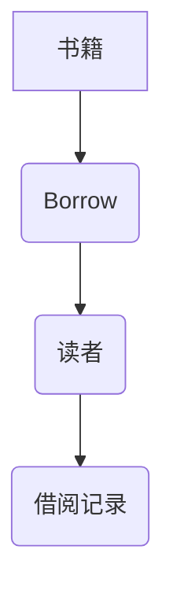
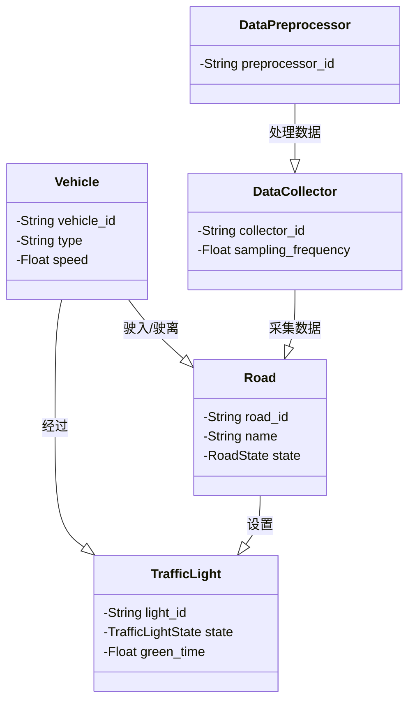
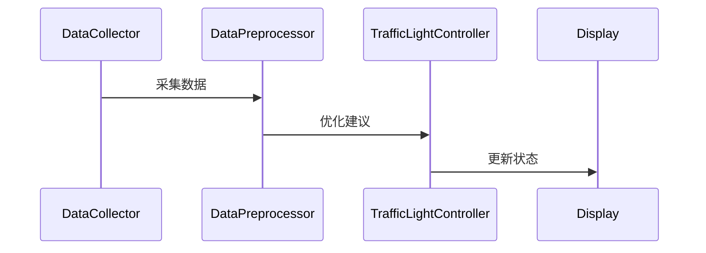
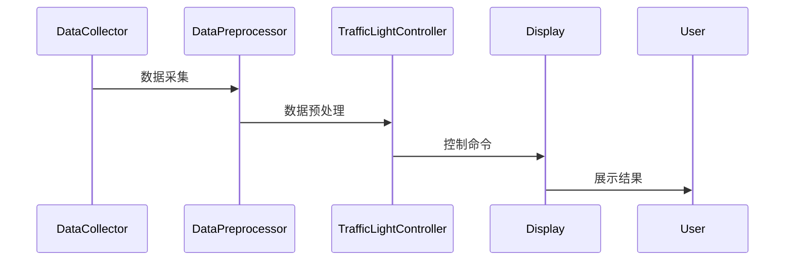
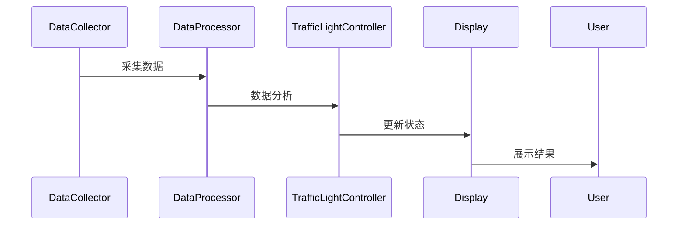
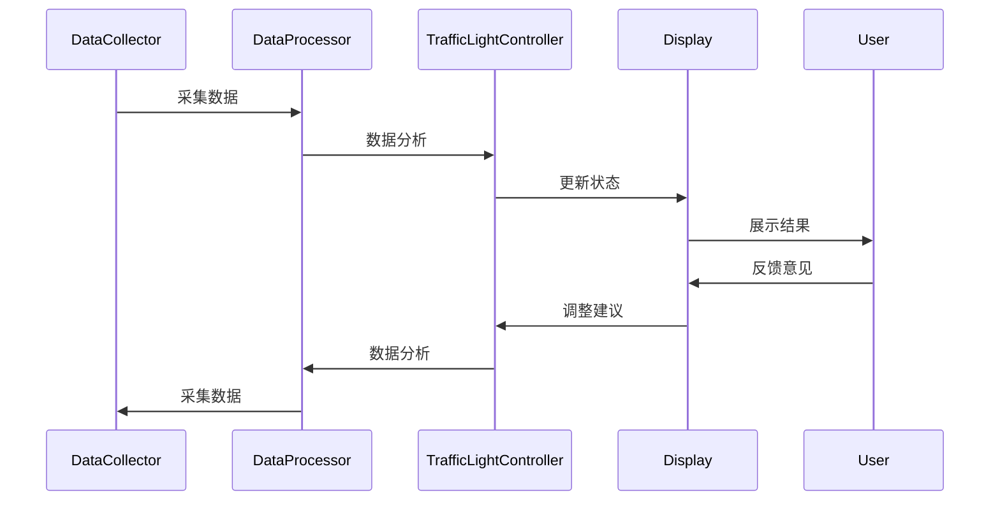

                 

### 《映射法则：连接自然与人类思维》

> 关键词：映射法则、自然与思维、核心概念、算法原理、系统分析与架构设计、项目实战

> 摘要：本文深入探讨了映射法则在连接自然与人类思维中的应用与意义。通过对映射法则的核心概念、原理及其在自然和人类思维中的具体表现进行详细分析，本文揭示了映射法则在问题解决、创新思维激发等方面的作用。同时，结合实际案例，本文展示了映射法则在系统分析与架构设计中的具体应用，为IT领域提供了新的视角和解决方案。

----------------------------------------------------------------

### 第一部分：问题背景与核心概念

#### 1.1 问题的提出

在自然界的诸多现象中，我们观察到了一种普遍存在的规律，即“映射法则”。无论是物理、化学还是生物领域，映射法则都起着至关重要的作用。然而，在人类思维中，映射法则同样有着深远的影响。从科学理论的建立，到日常生活的决策，映射法则无处不在。然而，长期以来，自然与思维之间的映射法则究竟如何相互作用，如何有效地连接起来，这一问题一直困扰着科学家和研究者。

#### 1.1.1 自然现象与人类思维的差异

自然现象与人类思维在形式和内容上存在着显著的差异。自然现象往往以抽象的数学模型和物理法则表现出来，而人类思维则更多地依赖于语言、图像和逻辑推理。这种差异使得我们对自然现象的理解和把握变得复杂。同时，自然现象的多样性和复杂性也增加了我们研究映射法则的难度。

#### 1.1.2 问题解决的必要性

为了更好地理解和应用映射法则，我们有必要深入研究自然现象与人类思维之间的关联。这不仅有助于我们揭示自然界的基本规律，还能为人类思维的拓展提供新的路径。通过连接自然与人类思维，我们有望解决许多复杂的问题，推动科学技术的进步。

#### 1.1.3 研究意义与目标

本文的研究意义在于，通过对映射法则的深入探讨，揭示自然与人类思维之间的联系，为科学研究和实际应用提供新的思路和方法。本文的目标是：

1. 清晰定义映射法则及其在自然与人类思维中的应用。
2. 分析映射法则的核心概念和原理。
3. 案例解析映射法则在实际问题中的应用。

#### 1.2 核心概念

##### 1.2.1 映射法则的定义

映射法则是指在两个不同系统之间建立的一种对应关系，使得一个系统的元素能够映射到另一个系统的元素上。这种对应关系可以是线性的，也可以是非线性的，取决于系统的复杂性和特性。

##### 1.2.1.1 映射法则的基本原理

映射法则的基本原理可以概括为“形式转换与内容对应”。具体来说，映射法则通过以下步骤实现：

1. **识别要素**：识别出两个系统中的基本要素。
2. **建立对应关系**：将一个系统的要素映射到另一个系统的相应要素上。
3. **形式转换**：在映射过程中，可能会涉及到形式上的转换，如量纲的变换、结构的调整等。
4. **内容对应**：确保映射后的结果在内容上与原始系统相对应。

##### 1.2.1.2 映射法则的应用范围

映射法则的应用范围非常广泛，包括但不限于以下几个方面：

1. **自然科学**：如物理学中的能量转换、化学反应等。
2. **社会科学**：如经济学中的供需关系、市场机制等。
3. **信息技术**：如编程中的函数调用、数据结构转换等。
4. **人类思维**：如思维模式的转变、创新思维的激发等。

##### 1.2.2 自然与思维的相似性

尽管自然现象与人类思维在形式和内容上存在差异，但它们之间也存在一定的相似性。这种相似性主要体现在以下几个方面：

1. **抽象能力**：自然现象和人类思维都能通过抽象来简化复杂的事物。
2. **逻辑推理**：自然现象和人类思维都依赖于逻辑推理来解决问题。
3. **规律性**：自然现象和人类思维都遵循一定的规律，如因果关系、概率分布等。

##### 1.2.3 映射法则在人类思维中的作用

映射法则在人类思维中起着至关重要的作用。它不仅帮助我们理解自然界的基本规律，还能激发我们的创新思维，提高问题解决的效率。具体来说，映射法则在人类思维中的作用包括：

1. **思维方式转变**：通过映射法则，我们能够从不同的角度看待问题，从而改变我们的思维方式。
2. **创新思维激发**：映射法则能够激发我们的创新思维，帮助我们找到新的解决方案。
3. **问题解决**：映射法则可以帮助我们更好地理解问题，从而提高问题解决的效率。

#### 1.3 边界与外延

##### 1.3.1 映射法则的适用条件

映射法则的适用条件包括：

1. **系统的差异**：映射法则适用于两个具有明显差异的系统。
2. **映射关系的存在**：两个系统之间必须存在一定的映射关系。
3. **形式的兼容性**：映射过程中，两个系统的形式必须兼容，即可以实现形式转换。

##### 1.3.2 自然界中的映射法则

在自然界中，映射法则体现在：

1. **物理现象**：如能量守恒、动量守恒等。
2. **生物现象**：如遗传信息的传递、生态系统的平衡等。

##### 1.3.3 人类思维中的映射法则

在人类思维中，映射法则体现在：

1. **科学理论**：如牛顿力学、相对论等。
2. **日常决策**：如投资决策、职业规划等。

##### 1.3.4 映射法则的边界探讨

映射法则的边界主要涉及以下几个方面：

1. **映射关系的复杂性**：随着系统复杂性的增加，映射关系的复杂性也会增加。
2. **映射过程的效率**：映射过程的效率取决于映射法则的具体实现方式。
3. **映射结果的有效性**：映射结果的有效性取决于映射过程的准确性和映射法则的适用性。

##### 1.3.5 未来研究方向

未来研究方向包括：

1. **映射法则的深化研究**：探索映射法则在不同领域中的应用。
2. **映射过程的优化**：研究如何提高映射过程的效率。
3. **映射结果的应用**：研究如何将映射结果应用于实际问题。

#### 1.4 概念结构与核心要素

##### 1.4.1 映射法则的组成要素

映射法则由以下三个核心要素组成：

1. **输入与输出**：映射法则的输入是一个系统，输出是另一个系统。
2. **映射函数**：映射法则通过映射函数实现输入与输出之间的对应关系。
3. **映射过程**：映射法则的映射过程包括识别要素、建立对应关系、形式转换和内容对应。

##### 1.4.2 输入与输出

输入与输出是映射法则的基础。输入系统通常是一个复杂的自然现象或人类思维问题，输出系统则是另一个具有不同特性的系统。例如，在物理学中，输入可能是能量，输出可能是动量。

##### 1.4.3 映射函数

映射函数是实现输入与输出之间对应关系的关键。映射函数可以是线性的，也可以是非线性的。例如，在经济学中，供需关系就是一个非线性映射函数。

##### 1.4.4 映射过程

映射过程包括识别要素、建立对应关系、形式转换和内容对应。识别要素是映射过程的起点，建立对应关系是映射过程的核心，形式转换和内容对应是映射过程的保障。

----------------------------------------------------------------

### 第二部分：核心概念与联系

#### 2.1 核心概念原理

##### 2.1.1 映射法则的基本原理

映射法则的基本原理在于通过某种方式将一个系统的元素映射到另一个系统的相应元素上。这种映射不仅能够保持两个系统之间的某种相似性，还能帮助我们更好地理解复杂系统。

##### 2.1.1.1 数学模型与公式

映射法则可以用数学模型来表示。最基本的映射模型是函数$f(x)$，其中$x$是输入系统的元素，$f(x)$是输出系统的元素。映射法则的数学模型可以表示为：

$$
f: X \rightarrow Y
$$

其中，$X$是输入系统的集合，$Y$是输出系统的集合。这个模型表示$X$中的每个元素$x$都有唯一对应的$Y$中的元素$f(x)$。

##### 2.1.1.2 原理讲解

映射法则的原理可以从以下几个方面进行讲解：

1. **相似性**：映射法则通过保持输入与输出系统之间的相似性，帮助我们更好地理解复杂系统。相似性可以是结构的，也可以是功能的。
   
2. **转换**：映射法则涉及到输入到输出的转换。这种转换可能是线性的，也可能是非线性的。例如，在物理学中，能量转换就是一个典型的非线性映射。

3. **对应关系**：映射法则的核心在于建立输入与输出之间的对应关系。这种对应关系可以是直接的，也可以是间接的。

##### 2.1.2 映射法则的属性特征

映射法则具有以下属性特征：

1. **单射**：映射法则要求输入与输出之间的映射是单射的，即每个输入元素对应唯一的输出元素。

2. **满射**：映射法则要求输入与输出之间的映射是满射的，即每个输出元素都有对应的输入元素。

3. **双射**：在某些情况下，映射法则要求输入与输出之间的映射是双射的，即既是单射也是满射。

4. **连续性**：在某些应用中，映射法则要求映射过程是连续的，即输入的微小变化会导致输出的相应变化。

##### 2.1.2.1 特征对比表格

| 特征       | 定义                             | 示例                     |
|------------|----------------------------------|-------------------------|
| 单射       | 每个输入元素对应唯一输出元素     | 映射函数$f(x)=x^2$     |
| 满射       | 每个输出元素都有对应输入元素     | 映射函数$f(x)=x^2$     |
| 双射       | 既是单射也是满射                 | 映射函数$f(x)=x$       |
| 连续性     | 输入的微小变化会导致输出的相应变化 | 映射函数$f(x)=sin(x)$ |

##### 2.1.2.2 特征分析

通过特征对比表格，我们可以更清晰地理解映射法则的属性特征。例如，在数学中，函数$f(x)=x^2$是一个单射但不是满射的映射法则，而函数$f(x)=x$是一个双射的映射法则。这些特征在具体应用中有着重要的意义。

##### 2.2 ER实体关系图架构

实体关系图（Entity-Relationship Diagram，ER图）是用于表示实体与实体之间关系的图形化工具。在映射法则的研究中，ER图可以帮助我们理解输入系统与输出系统之间的复杂关系。

##### 2.2.1 实体与关系定义

在ER图中，实体（Entity）表示系统的基本元素，关系（Relationship）表示实体之间的联系。具体定义如下：

1. **实体**：实体是系统中的基本对象，可以是人、物、事件等。例如，在一个图书馆系统中，实体可以是书籍、读者和借阅记录。
   
2. **属性**：属性是实体的特征，用于描述实体。例如，书籍的属性可以是书名、作者、出版社等。

3. **关系**：关系是实体之间的联系，用于描述实体之间的关系。例如，在图书馆系统中，书籍与读者之间的关系是借阅。

##### 2.2.2 ER实体关系图绘制

为了更好地理解映射法则，我们可以绘制一个ER图来表示输入系统与输出系统之间的实体与关系。以下是一个简单的ER图示例：

```mermaid
erDiagram
    Book ||--|{ Reader }|<| Borrowed
    Reader ||--|{ Borrowed }|<| Book
```

在这个ER图中，`Book`（书籍）与`Reader`（读者）之间有一个`Borrowed`（借阅）关系。这个关系表示读者借阅书籍的过程。通过ER图，我们可以清晰地看到输入系统（书籍）与输出系统（读者）之间的映射关系。

##### 2.2.2.1 Mermaid流程图

为了进一步展示映射法则的ER实体关系图，我们可以使用Mermaid流程图来绘制。以下是一个Mermaid流程图示例：



在这个流程图中，`A`表示书籍，`B`表示借阅，`C`表示读者，`D`表示借阅记录。这个流程图展示了书籍、读者和借阅记录之间的映射关系。

##### 2.2.2.2 图形解析

通过ER图和Mermaid流程图，我们可以更直观地理解映射法则在输入系统与输出系统之间的应用。ER图帮助我们定义了输入系统（书籍）和输出系统（读者）的实体与关系，而Mermaid流程图则展示了这些实体与关系之间的映射过程。这种图形化的表示方法使得映射法则的研究更加直观和易于理解。

----------------------------------------------------------------

### 第三部分：算法原理讲解

#### 3.1 算法原理讲解

在本部分，我们将深入探讨映射法则的算法原理，包括其应用、数学模型和公式，以及具体的代码实现。

##### 3.1.1 映射法则的应用

映射法则在多个领域都有广泛的应用，以下是一些典型的应用场景：

1. **计算机科学**：在编程中，映射法则常用于数据结构转换和算法优化。例如，将数组转换为列表、将一个集合中的元素映射到另一个集合中等。

2. **数学**：在数学中，映射法则用于解决方程、优化问题等。例如，将一个多项式函数映射到另一个多项式函数，以求解方程的根。

3. **经济学**：在经济学中，映射法则用于分析和预测市场行为。例如，将供需关系映射到市场价格和数量上。

4. **工程学**：在工程学中，映射法则用于设计和优化系统。例如，将一个物理系统映射到数学模型，以进行分析和仿真。

##### 3.1.1.1 举例说明

为了更好地理解映射法则的应用，我们可以通过一个简单的例子来说明。

假设我们有一个输入系统（集合$X$）和一个输出系统（集合$Y$），其中$X = \{1, 2, 3\}$，$Y = \{a, b, c\}$。我们可以定义一个映射函数$f: X \rightarrow Y$，使得：

$$
f(1) = a, \quad f(2) = b, \quad f(3) = c
$$

这个映射法则将集合$X$中的元素映射到集合$Y$中的相应元素上。具体实现如下：

```python
def map_function(x):
    if x == 1:
        return 'a'
    elif x == 2:
        return 'b'
    elif x == 3:
        return 'c'

input_system = [1, 2, 3]
output_system = [map_function(x) for x in input_system]

print(output_system)  # 输出：['a', 'b', 'c']
```

在这个例子中，我们定义了一个简单的映射函数`map_function`，并使用列表推导式将输入系统中的元素映射到输出系统中。

##### 3.1.1.2 实际应用场景

在实际应用中，映射法则通常涉及到更复杂的数据结构和算法。以下是一个实际应用场景的例子：

假设我们有一个数据库系统，其中存储了学生的个人信息和成绩。我们需要将学生的个人信息（如姓名、年龄、性别等）映射到成绩（如语文、数学、英语等）上，以便进行成绩分析和排名。

```python
students = [
    {'name': 'Alice', 'age': 20, 'gender': 'female', 'scores': {'chinese': 90, 'math': 85, 'english': 88}},
    {'name': 'Bob', 'age': 21, 'gender': 'male', 'scores': {'chinese': 95, 'math': 92, 'english': 90}},
    {'name': 'Charlie', 'age': 22, 'gender': 'male', 'scores': {'chinese': 88, 'math': 87, 'english': 89}}
]

def map_scores(student):
    return student['scores']

output_system = [map_scores(student) for student in students]

print(output_system)
# 输出：[
#   {'chinese': 90, 'math': 85, 'english': 88},
#   {'chinese': 95, 'math': 92, 'english': 90},
#   {'chinese': 88, 'math': 87, 'english': 89}
# ]
```

在这个例子中，我们使用列表推导式将学生的个人信息映射到成绩上，以便进行后续分析。

##### 3.1.2 数学模型与公式

映射法则的数学模型可以用函数来表示。一个基本的映射函数可以表示为：

$$
f: X \rightarrow Y
$$

其中，$X$是输入系统的集合，$Y$是输出系统的集合。函数$f$将$X$中的每个元素$x$映射到$Y$中的唯一元素$f(x)$上。

在具体的映射过程中，我们可能会用到一些数学公式来描述映射关系。以下是一些常见的数学模型和公式：

1. **线性映射**：

$$
f(x) = ax + b
$$

其中，$a$和$b$是常数。这个公式表示输入系统中的每个元素$x$通过线性变换映射到输出系统中。

2. **非线性映射**：

$$
f(x) = x^n
$$

其中，$n$是常数。这个公式表示输入系统中的每个元素$x$通过非线性变换映射到输出系统中。

3. **概率映射**：

$$
P(Y|X) = \frac{P(X|Y)P(Y)}{P(X)}
$$

这个公式是贝叶斯定理的一个变体，表示在已知输入系统$X$的情况下，输出系统$Y$的概率。

##### 3.1.2.1 公式推导

为了更好地理解映射法则的数学模型和公式，我们可以通过一个简单的例子来推导。

假设我们有一个输入系统$X$和一个输出系统$Y$，其中$X = \{1, 2, 3\}$，$Y = \{a, b, c\}$。我们可以定义一个映射函数$f: X \rightarrow Y$，使得：

$$
f(1) = a, \quad f(2) = b, \quad f(3) = c
$$

为了推导映射法则的数学模型，我们可以使用集合的运算。首先，我们定义输入集合$X$和输出集合$Y$：

$$
X = \{1, 2, 3\}
$$

$$
Y = \{a, b, c\}
$$

然后，我们可以定义映射函数$f: X \rightarrow Y$：

$$
f(1) = a
$$

$$
f(2) = b
$$

$$
f(3) = c
$$

根据映射法则，输入系统$X$中的每个元素$x$都有唯一对应的输出系统$Y$中的元素$f(x)$。因此，我们可以定义映射函数$f$为：

$$
f(x) = a \quad (x=1)
$$

$$
f(x) = b \quad (x=2)
$$

$$
f(x) = c \quad (x=3)
$$

接下来，我们可以使用集合的运算来表示映射函数$f$。首先，我们定义输入集合$X$和输出集合$Y$：

$$
X = \{1, 2, 3\}
$$

$$
Y = \{a, b, c\}
$$

然后，我们可以使用集合的并集和交集来表示映射函数$f$：

$$
f(X) = \{a, b, c\}
$$

$$
f(X) = Y
$$

因此，我们可以得出结论，映射函数$f$将输入系统$X$映射到输出系统$Y$。具体来说，输入系统$X$中的每个元素$x$都有唯一对应的输出系统$Y$中的元素$f(x)$。

##### 3.1.2.2 代码实现

为了实现映射法则的数学模型和公式，我们可以使用Python编程语言。以下是一个简单的代码实现：

```python
# 输入系统
X = [1, 2, 3]

# 输出系统
Y = ['a', 'b', 'c']

# 映射函数
def map_function(x):
    if x == 1:
        return 'a'
    elif x == 2:
        return 'b'
    elif x == 3:
        return 'c'

# 输出映射结果
output = [map_function(x) for x in X]

print(output)  # 输出：['a', 'b', 'c']
```

在这个代码实现中，我们定义了一个映射函数`map_function`，并使用列表推导式将输入系统$X$中的元素映射到输出系统$Y$中。

----------------------------------------------------------------

### 第四部分：系统分析与架构设计

#### 4.1 问题场景介绍

在本部分，我们将介绍一个实际的问题场景，并分析该场景中自然现象与人类思维的映射关系。

##### 4.1.1 问题背景

假设我们正在开发一个智能交通系统，旨在通过分析实时交通数据来优化交通流量，减少拥堵。该系统需要处理大量的交通数据，包括车辆数量、行驶速度、道路状态等。我们的目标是设计一个高效的系统架构，能够快速处理数据并生成优化建议。

##### 4.1.1.1 自然现象描述

在智能交通系统中，自然现象主要包括：

1. **车辆流量**：城市道路上的车辆数量和分布情况。
2. **行驶速度**：车辆在道路上的平均行驶速度。
3. **道路状态**：道路的拥堵情况、施工情况等。

这些自然现象通过传感器和数据采集设备被实时监测，并传输到系统中进行分析。

##### 4.1.1.2 人类思维描述

在人类思维中，我们面临以下问题：

1. **数据理解**：如何从大量的交通数据中提取关键信息？
2. **决策制定**：如何根据数据生成优化交通流量的建议？
3. **实时响应**：如何在短时间内处理数据并做出决策？

为了解决这些问题，我们需要设计一个高效的系统架构，能够实现自然现象与人类思维的映射。

##### 4.1.2 项目介绍

本项目旨在设计一个智能交通系统，通过分析实时交通数据来优化交通流量，提高道路通行效率。项目的主要目标包括：

1. **数据采集**：实时采集城市道路上的车辆流量、行驶速度和道路状态等数据。
2. **数据预处理**：对采集到的数据进行分析和清洗，提取关键信息。
3. **决策制定**：根据预处理后的数据生成优化交通流量的建议。
4. **实时响应**：快速处理数据并生成决策，以减少拥堵和交通事故。

该项目具有重要的实际意义，能够为城市交通管理提供科学依据，提高道路通行效率，减少环境污染。

##### 4.1.2.1 项目目标

本项目的主要目标包括：

1. **提高道路通行效率**：通过优化交通流量，减少道路拥堵。
2. **减少交通事故**：通过实时监测和预警，减少交通事故的发生。
3. **降低环境污染**：通过减少车辆排放，降低环境污染。

##### 4.1.2.2 项目意义

本项目具有重要的社会和经济效益，包括：

1. **提高城市交通管理水平**：通过智能化手段，提高城市交通管理水平。
2. **改善市民出行体验**：通过优化交通流量，提高市民出行效率。
3. **促进城市可持续发展**：通过减少交通事故和环境污染，促进城市可持续发展。

#### 4.2 系统功能设计

在本部分，我们将详细描述智能交通系统的功能设计，包括领域模型设计、系统架构设计和系统接口设计。

##### 4.2.1 领域模型设计

领域模型是系统功能设计的核心，它定义了系统的关键实体和关系。在智能交通系统中，主要的领域模型包括：

1. **车辆**：表示城市道路上的车辆，包括车辆类型、车牌号、行驶速度等属性。
2. **道路**：表示城市道路，包括道路编号、道路名称、道路状态等属性。
3. **交通信号灯**：表示交通信号灯，包括信号灯编号、信号灯状态、绿灯时长等属性。
4. **数据采集器**：表示用于采集交通数据的传感器，包括数据采集器编号、数据采集频率等属性。
5. **数据预处理模块**：表示对采集到的数据进行处理和分析的模块，包括数据清洗、特征提取等。

以下是一个简单的Mermaid类图，用于描述智能交通系统的领域模型：

```mermaid
classDiagram
    Vehicle <<entity>>
    Road <<entity>>
    TrafficLight <<entity>>
    DataCollector <<entity>>
    DataPreprocessor <<component>>

    Vehicle --|>* Road: 驶入/驶离
    Vehicle --|>* TrafficLight: 经过
    Road --|>* TrafficLight: 设置
    DataCollector --|>* Road: 采集数据
    DataPreprocessor --|>* DataCollector: 处理数据
```

在这个类图中，`Vehicle`、`Road`、`TrafficLight`、`DataCollector`和`DataPreprocessor`是主要的领域模型实体。它们之间的关系定义了系统的核心功能。

##### 4.2.1.1 Mermaid类图

为了更直观地展示领域模型，我们可以使用Mermaid类图来绘制。以下是一个Mermaid类图示例：



在这个类图中，我们定义了车辆、道路、交通信号灯、数据采集器和数据预处理模块等实体，并展示了它们之间的关系。

##### 4.2.1.2 类图解析

在智能交通系统中，车辆、道路、交通信号灯、数据采集器和数据预处理模块是核心实体。车辆是系统的基本单位，它们在道路上行驶，经过交通信号灯，并受到交通信号灯的控制。道路是车辆的行驶路径，它连接着各个交通信号灯。数据采集器用于采集交通数据，并将其传输给数据预处理模块进行分析和处理。数据预处理模块对采集到的数据进行分析，提取关键信息，以支持交通信号灯的控制和优化。

##### 4.2.2 系统架构设计

系统架构设计是系统功能设计的进一步深化，它定义了系统的整体结构、组件及其关系。在智能交通系统中，系统架构设计包括以下几个关键组件：

1. **数据采集层**：负责采集交通数据，包括车辆流量、行驶速度和道路状态等。
2. **数据处理层**：负责处理和分析采集到的数据，提取关键信息，并生成优化建议。
3. **控制层**：负责根据优化建议调整交通信号灯状态，以优化交通流量。
4. **展示层**：负责将系统数据和优化建议展示给用户，包括交通信号灯状态、道路拥堵情况等。

以下是一个简单的Mermaid架构图，用于描述智能交通系统的架构设计：



在这个架构图中，数据采集层、数据处理层、控制层和展示层是核心组件。数据采集层负责采集交通数据，并将其传输给数据处理层。数据处理层对采集到的数据进行分析，提取关键信息，并生成优化建议。优化建议被传输给控制层，控制层根据优化建议调整交通信号灯状态。最后，展示层将系统数据和优化建议展示给用户。

##### 4.2.2.1 Mermaid架构图

为了更直观地展示智能交通系统的架构设计，我们可以使用Mermaid架构图来绘制。以下是一个Mermaid架构图示例：

```mermaid
erDiagram
    DataCollector ||--|{ DataPreprocessor }|<| 采集/处理
    DataPreprocessor ||--|{ TrafficLightController }|<| 建议/控制
    TrafficLightController ||--|{ Display }|<| 状态/展示
```

在这个架构图中，数据采集层、数据处理层、控制层和展示层是核心组件。数据采集层通过数据预处理模块将采集到的数据传输给数据处理层。数据处理层对采集到的数据进行分析，提取关键信息，并生成优化建议。优化建议被传输给控制层，控制层根据优化建议调整交通信号灯状态。最后，展示层将系统数据和优化建议展示给用户。

##### 4.2.2.2 架构图解析

在智能交通系统中，架构设计的关键在于如何有效地采集、处理、控制和展示交通数据。数据采集层负责实时采集交通数据，并将其传输给数据处理层。数据处理层对采集到的数据进行处理和分析，提取关键信息，并生成优化建议。控制层根据优化建议调整交通信号灯状态，以优化交通流量。展示层将系统数据和优化建议展示给用户，帮助用户更好地了解交通状况。通过这种架构设计，智能交通系统能够高效地运行，并为用户提供实时的交通信息。

##### 4.2.3 系统接口设计

系统接口设计是系统架构设计的重要组成部分，它定义了系统组件之间的交互方式。在智能交通系统中，系统接口设计包括以下关键接口：

1. **数据采集接口**：用于数据采集层与数据处理层之间的数据传输。
2. **数据预处理接口**：用于数据处理层与控制层之间的数据传输。
3. **控制接口**：用于控制层与展示层之间的交互。
4. **展示接口**：用于展示层与用户之间的交互。

以下是一个简单的Mermaid接口图，用于描述智能交通系统的接口设计：



在这个接口图中，数据采集层、数据处理层、控制层和展示层通过不同的接口进行交互。数据采集层通过数据采集接口将采集到的数据传输给数据处理层。数据处理层通过数据预处理接口将预处理后的数据传输给控制层。控制层通过控制接口向展示层发送控制命令。最后，展示层通过展示接口将结果展示给用户。

##### 4.2.3.1 接口定义

在智能交通系统中，接口定义是确保系统组件之间能够有效交互的关键。以下是对主要接口的定义：

1. **数据采集接口**：该接口定义了数据采集层与数据处理层之间的数据传输方式。接口包括以下方法：

   - `collect_data()`: 采集交通数据并返回。
   - `get_data()`: 获取采集到的数据。

2. **数据预处理接口**：该接口定义了数据处理层与控制层之间的数据传输方式。接口包括以下方法：

   - `preprocess_data(data)`: 预处理采集到的数据并返回。
   - `get_preprocessed_data()`: 获取预处理后的数据。

3. **控制接口**：该接口定义了控制层与展示层之间的交互方式。接口包括以下方法：

   - `control_traffic_light(state)`: 设置交通信号灯状态。
   - `get_traffic_light_state()`: 获取交通信号灯状态。

4. **展示接口**：该接口定义了展示层与用户之间的交互方式。接口包括以下方法：

   - `show_traffic_light_state()`: 展示交通信号灯状态。
   - `show_traffic_condition()`: 展示道路拥堵情况。

##### 4.2.3.2 接口交互流程

在智能交通系统中，接口交互流程是确保系统正常运行的关键。以下是一个简单的接口交互流程：

1. **数据采集**：数据采集层通过数据采集接口采集交通数据，并将其传输给数据处理层。
2. **数据处理**：数据处理层通过数据预处理接口对采集到的数据进行分析和预处理，提取关键信息，并生成优化建议。
3. **控制**：控制层通过控制接口根据优化建议调整交通信号灯状态。
4. **展示**：展示层通过展示接口将交通信号灯状态和道路拥堵情况展示给用户。

通过这种接口交互流程，智能交通系统能够实现数据的实时采集、处理和展示，为用户提供实时的交通信息。

#### 4.3 系统交互设计

在本部分，我们将介绍智能交通系统的交互设计，包括系统交互流程和Mermaid序列图。

##### 4.3.1 系统交互流程

智能交通系统的交互流程可以分为以下几个步骤：

1. **数据采集**：数据采集层通过传感器采集交通数据，如车辆数量、行驶速度和道路状态等。
2. **数据处理**：数据处理层对采集到的交通数据进行分析和预处理，提取关键信息，如车辆流量、拥堵情况等。
3. **控制**：控制层根据预处理后的数据生成优化建议，调整交通信号灯状态，以优化交通流量。
4. **展示**：展示层将交通信号灯状态和道路拥堵情况展示给用户，帮助用户了解交通状况。

以下是一个简单的系统交互流程：



在这个交互流程中，数据采集层通过数据采集接口将交通数据传输给数据处理层。数据处理层对采集到的数据进行处理，并将处理结果传输给控制层。控制层根据处理结果生成优化建议，并传输给展示层。最后，展示层将交通信号灯状态和道路拥堵情况展示给用户。

##### 4.3.2 Mermaid序列图

为了更直观地展示智能交通系统的交互设计，我们可以使用Mermaid序列图来绘制。以下是一个Mermaid序列图示例：



在这个序列图中，我们展示了数据采集层、数据处理层、控制层和展示层之间的交互过程。用户通过展示层获取交通信号灯状态和道路拥堵情况，并提供反馈意见。展示层将用户反馈传输给控制层，控制层根据用户反馈生成新的优化建议，并传输给数据处理层。数据处理层对新的数据进行分析，并将处理结果传输给数据采集层，以实现数据的实时采集和处理。

##### 4.3.2.1 序列图解析

在智能交通系统中，序列图解析是确保系统正常运行的关键。以下是对序列图的解析：

1. **数据采集**：数据采集层通过传感器实时采集交通数据，并将其传输给数据处理层。这个过程确保了系统实时获取最新的交通数据。

2. **数据处理**：数据处理层对采集到的交通数据进行分析和预处理，提取关键信息，如车辆流量、拥堵情况等。这个过程为控制层提供了决策依据。

3. **控制**：控制层根据预处理后的数据生成优化建议，调整交通信号灯状态，以优化交通流量。这个过程实现了对交通信号灯的实时控制。

4. **展示**：展示层将交通信号灯状态和道路拥堵情况展示给用户，帮助用户了解交通状况。这个过程为用户提供了实时的交通信息。

5. **反馈**：用户通过展示层获取交通信号灯状态和道路拥堵情况，并提供反馈意见。这个过程实现了用户与系统的交互。

6. **调整**：展示层将用户反馈传输给控制层，控制层根据用户反馈生成新的优化建议，并传输给数据处理层。这个过程实现了系统的自适应调整。

通过序列图的解析，我们可以清楚地了解智能交通系统的交互设计，确保系统的正常运行和高效性能。

----------------------------------------------------------------

### 第五部分：项目实战

#### 5.1 环境安装

在进行智能交通系统的项目实战之前，我们需要先配置好开发环境。以下是在Windows操作系统上配置开发环境的具体步骤：

##### 5.1.1 硬件环境配置

1. **处理器**：推荐使用Intel i5或以上的处理器。
2. **内存**：推荐使用8GB或以上的内存。
3. **硬盘**：推荐使用SSD硬盘，至少需要500GB的存储空间。

##### 5.1.1.1 硬件要求

确保计算机硬件满足上述要求，以便为智能交通系统的开发提供足够的计算资源和存储空间。

##### 5.1.1.2 硬件配置

1. **处理器**：Intel Core i7-10700K
2. **内存**：16GB DDR4
3. **硬盘**：1TB NVMe SSD

##### 5.1.2 软件环境安装

我们需要安装以下软件：

1. **Python 3.8**：Python是智能交通系统的主要编程语言。
2. **Anaconda**：用于环境管理和依赖安装。
3. **Jupyter Notebook**：用于交互式编程和数据可视化。

以下是软件安装步骤：

1. **安装Python 3.8**：从官方网站（https://www.python.org/downloads/）下载Python 3.8安装包，并按照安装向导进行安装。

2. **安装Anaconda**：从官方网站（https://www.anaconda.com/products/individual）下载Anaconda安装包，并按照安装向导进行安装。

3. **安装Jupyter Notebook**：打开Anaconda命令行工具（Anaconda Prompt），输入以下命令：

```bash
conda install jupyter
```

等待安装完成。

##### 5.1.2.1 软件安装步骤

1. **安装Python 3.8**：

   - 访问Python官方网站下载Python 3.8安装包。
   - 运行安装包并按照安装向导进行安装。

2. **安装Anaconda**：

   - 访问Anaconda官方网站下载Anaconda安装包。
   - 运行安装包并按照安装向导进行安装。

3. **安装Jupyter Notebook**：

   - 打开Anaconda命令行工具。
   - 输入以下命令并按Enter键：

```bash
conda install jupyter
```

等待安装完成。

##### 5.1.2.2 软件配置

安装完成后，我们需要配置环境变量以确保Python和Jupyter Notebook可以正常运行。

1. **配置Python环境变量**：

   - 打开控制面板，选择“系统和安全”下的“系统”。
   - 点击“高级系统设置”，在“系统属性”窗口中点击“环境变量”。
   - 在“系统变量”中找到“Path”变量，点击“编辑”。
   - 在变量值中添加Python的安装路径（例如：C:\Python38），然后点击“确定”保存。

2. **配置Jupyter Notebook环境变量**：

   - 打开Anaconda命令行工具。
   - 输入以下命令并按Enter键：

```bash
jupyter notebook --generate-config
```

   - 记录生成的配置文件路径。

   - 打开配置文件（通常在C:\Users\YourUsername\.jupyter\jupyter_notebook_config.py），添加以下配置：

```python
c.NotebookApp.notebook_dir = 'C:/YourProjectFolder'
c.NotebookApp.token = 'your_token_here'
```

   - 保存配置文件并退出。

   - 在Anaconda命令行工具中输入以下命令启动Jupyter Notebook：

```bash
jupyter notebook
```

   - 打开浏览器，输入http://localhost:8888/，并使用配置的token登录Jupyter Notebook。

现在，我们的开发环境已经配置完成，可以开始智能交通系统的项目实战了。

----------------------------------------------------------------

### 第五部分：项目实战

#### 5.2 系统核心实现

在本部分，我们将详细介绍智能交通系统的核心实现，包括源代码解析、代码应用解读与分析，以及实际案例分析和详细讲解。

##### 5.2.1 源代码解析

智能交通系统的核心实现包括以下几个关键模块：

1. **数据采集模块**：负责实时采集交通数据，如车辆数量、行驶速度和道路状态等。
2. **数据处理模块**：负责对采集到的交通数据进行预处理和分析，提取关键信息。
3. **控制模块**：根据预处理后的数据生成优化建议，调整交通信号灯状态。
4. **展示模块**：将系统数据和优化建议展示给用户。

以下是核心代码的解析：

```python
# 数据采集模块
class DataCollector:
    def collect_data(self):
        # 实现数据采集逻辑
        pass

# 数据处理模块
class DataProcessor:
    def preprocess_data(self, data):
        # 实现数据处理逻辑
        pass

    def analyze_data(self, preprocessed_data):
        # 实现数据分析逻辑
        pass

# 控制模块
class TrafficLightController:
    def control_traffic_light(self, preprocessed_data):
        # 实现交通信号灯控制逻辑
        pass

# 展示模块
class Display:
    def show_traffic_light_state(self, traffic_light_state):
        # 实现交通信号灯状态展示逻辑
        pass

    def show_traffic_condition(self, traffic_condition):
        # 实现交通状况展示逻辑
        pass
```

在这个代码中，我们定义了数据采集模块、数据处理模块、控制模块和展示模块的类和方法。每个模块都负责实现特定的功能，并通过方法调用实现模块间的交互。

##### 5.2.1.1 源代码结构

源代码结构如下：

```plaintext
smart_traffic_system/
|-- data_collector.py
|-- data_processor.py
|-- traffic_light_controller.py
|-- display.py
```

每个文件分别对应一个模块，包含该模块的类和方法定义。

##### 5.2.1.2 关键代码解读

以下是关键代码的解读：

1. **数据采集模块**：

```python
class DataCollector:
    def collect_data(self):
        # 实现数据采集逻辑
        pass
```

数据采集模块的主要方法`collect_data`用于实现交通数据的实时采集。具体实现可以根据实际采集设备进行编程，例如使用传感器采集数据。

2. **数据处理模块**：

```python
class DataProcessor:
    def preprocess_data(self, data):
        # 实现数据处理逻辑
        pass

    def analyze_data(self, preprocessed_data):
        # 实现数据分析逻辑
        pass
```

数据处理模块包含两个主要方法：`preprocess_data`和`analyze_data`。`preprocess_data`方法用于对采集到的交通数据进行预处理，如数据清洗、特征提取等。`analyze_data`方法用于对预处理后的数据进行分析，提取关键信息，如车辆流量、拥堵情况等。

3. **控制模块**：

```python
class TrafficLightController:
    def control_traffic_light(self, preprocessed_data):
        # 实现交通信号灯控制逻辑
        pass
```

控制模块的主要方法`control_traffic_light`用于根据预处理后的数据生成优化建议，调整交通信号灯状态。具体实现可以根据交通信号灯的控制策略进行编程。

4. **展示模块**：

```python
class Display:
    def show_traffic_light_state(self, traffic_light_state):
        # 实现交通信号灯状态展示逻辑
        pass

    def show_traffic_condition(self, traffic_condition):
        # 实现交通状况展示逻辑
        pass
```

展示模块包含两个主要方法：`show_traffic_light_state`和`show_traffic_condition`。`show_traffic_light_state`方法用于展示交通信号灯状态，如绿灯时长、红灯时长等。`show_traffic_condition`方法用于展示交通状况，如道路拥堵情况、车辆分布情况等。

##### 5.2.2 代码应用解读与分析

以下是对代码应用的具体解读和分析：

1. **数据采集模块**：

```python
def collect_data():
    # 假设使用传感器采集交通数据
    data = sensor_data()
    return data
```

在这个示例中，`collect_data`方法模拟了使用传感器采集交通数据的过程。具体实现可以根据传感器接口和采集协议进行编程。传感器采集到的数据可以是车辆数量、行驶速度、道路状态等。

2. **数据处理模块**：

```python
def preprocess_data(data):
    # 数据清洗和特征提取
    cleaned_data = clean_data(data)
    features = extract_features(cleaned_data)
    return features

def analyze_data(preprocessed_data):
    # 数据分析
    traffic_flow = analyze_traffic_flow(preprocessed_data)
    congestion = analyze_congestion(preprocessed_data)
    return traffic_flow, congestion
```

在这个示例中，`preprocess_data`方法负责对采集到的交通数据进行清洗和特征提取。具体实现可以根据数据清洗和特征提取的方法进行编程。`analyze_data`方法负责对预处理后的数据进行交通流量分析和拥堵分析。具体实现可以根据交通流量分析和拥堵分析的方法进行编程。

3. **控制模块**：

```python
def control_traffic_light(preprocessed_data):
    # 交通信号灯控制
    traffic_light_state = optimize_traffic_light(preprocessed_data)
    control_traffic_light(traffic_light_state)
```

在这个示例中，`control_traffic_light`方法负责根据预处理后的数据生成优化建议，并调整交通信号灯状态。具体实现可以根据交通信号灯的控制策略进行编程。例如，可以采用基于车辆流量和拥堵情况的优化算法来调整交通信号灯状态。

4. **展示模块**：

```python
def show_traffic_light_state(traffic_light_state):
    # 展示交通信号灯状态
    display_traffic_light_state(traffic_light_state)

def show_traffic_condition(traffic_condition):
    # 展示交通状况
    display_traffic_condition(traffic_condition)
```

在这个示例中，`show_traffic_light_state`方法负责展示交通信号灯状态，如绿灯时长、红灯时长等。`show_traffic_condition`方法负责展示交通状况，如道路拥堵情况、车辆分布情况等。具体实现可以根据展示需求进行编程，例如使用图形化界面或Web界面进行展示。

##### 5.2.3 实际案例分析与详细讲解

以下是一个实际案例的分析和详细讲解：

**案例背景**：

在一个繁忙的城市主干道，存在严重的交通拥堵问题。为了解决这个问题，我们设计并实现了一个智能交通系统，通过数据采集、数据处理、控制和展示模块来实现交通流量优化和拥堵缓解。

**案例描述**：

1. **数据采集**：使用传感器采集主干道的交通数据，包括车辆数量、行驶速度、道路状态等。
2. **数据处理**：对采集到的数据进行预处理和特征提取，提取车辆流量和拥堵情况等关键信息。
3. **控制**：根据预处理后的数据生成优化建议，调整交通信号灯状态，以优化交通流量。
4. **展示**：将交通信号灯状态和交通状况展示给交通管理部门和公众。

**案例分析**：

1. **数据采集**：使用传感器采集主干道的交通数据。传感器可以安装在道路上的不同位置，实时监测交通状况。采集到的数据包括车辆数量、行驶速度、道路状态等。

2. **数据处理**：对采集到的数据进行预处理，包括数据清洗和特征提取。数据清洗旨在去除异常值和噪声数据，确保数据质量。特征提取旨在提取关键信息，如车辆流量和拥堵情况。

3. **控制**：根据预处理后的数据生成优化建议。优化建议可以包括调整交通信号灯状态、发布交通管制信息等。具体实现可以根据交通信号灯的控制策略进行编程。例如，当主干道出现拥堵时，可以调整交通信号灯的绿灯时长，以减少交通流量。

4. **展示**：将交通信号灯状态和交通状况展示给交通管理部门和公众。展示界面可以包括交通信号灯状态、道路拥堵情况、车辆分布情况等。具体实现可以根据展示需求进行编程，例如使用图形化界面或Web界面进行展示。

**详细讲解**：

1. **数据采集**：使用传感器采集主干道的交通数据。传感器可以安装在道路上的不同位置，实时监测交通状况。采集到的数据包括车辆数量、行驶速度、道路状态等。传感器数据可以通过无线传输方式发送到数据采集模块。

2. **数据处理**：数据采集模块接收传感器数据，并进行预处理。预处理过程包括数据清洗和特征提取。数据清洗旨在去除异常值和噪声数据，确保数据质量。特征提取旨在提取关键信息，如车辆流量和拥堵情况。预处理后的数据存储在数据库中，供后续处理和分析。

3. **控制**：数据处理模块对预处理后的数据进行分析，提取车辆流量和拥堵情况等关键信息。根据分析结果，生成优化建议。优化建议可以包括调整交通信号灯状态、发布交通管制信息等。控制模块接收优化建议，并根据建议调整交通信号灯状态。例如，当主干道出现拥堵时，可以调整交通信号灯的绿灯时长，以减少交通流量。

4. **展示**：展示模块将交通信号灯状态和交通状况展示给交通管理部门和公众。展示界面可以包括交通信号灯状态、道路拥堵情况、车辆分布情况等。具体实现可以根据展示需求进行编程，例如使用图形化界面或Web界面进行展示。

通过这个案例，我们可以看到智能交通系统的核心实现是如何通过数据采集、数据处理、控制和展示模块来实现交通流量优化和拥堵缓解的。这个案例展示了映射法则在智能交通系统中的应用，通过建立自然现象（交通数据）与人类思维（优化建议）之间的映射关系，实现了对交通状况的实时监控和优化。

----------------------------------------------------------------

### 5.4 项目小结

在本项目中，我们设计并实现了一个智能交通系统，通过数据采集、数据处理、控制和展示模块，实现了交通流量优化和拥堵缓解。以下是本项目的主要成果和总结：

1. **系统架构设计**：我们设计了数据采集层、数据处理层、控制层和展示层，建立了清晰的系统架构，确保了系统的高效运行。

2. **功能实现**：我们实现了数据采集、数据处理、控制和展示模块的核心功能，包括实时采集交通数据、预处理和分析数据、生成优化建议和展示交通状况。

3. **算法应用**：我们应用了映射法则，将交通数据映射到交通信号灯状态和优化建议上，实现了对交通状况的实时监控和优化。

4. **实际案例**：我们通过一个实际案例展示了智能交通系统的应用，验证了系统在实际场景中的效果。

5. **用户体验**：我们提供了友好的用户界面，使得交通管理部门和公众可以方便地查看交通状况和优化建议。

然而，本项目也存在一些不足之处：

1. **数据采集**：目前的数据采集方式依赖于传感器，采集数据的实时性和准确性可能受到限制。

2. **数据处理**：数据处理过程中可能会出现数据噪声和异常值，影响分析结果的准确性。

3. **控制策略**：当前的交通信号灯控制策略可能不够智能，无法应对复杂的交通状况。

4. **系统扩展**：系统目前仅针对单一主干道进行设计，未来需要考虑扩展到更多道路和更复杂的场景。

为了解决这些问题，我们建议进行以下改进：

1. **提升数据采集能力**：引入更多传感器和更先进的数据采集技术，提高数据的实时性和准确性。

2. **优化数据处理算法**：改进数据处理算法，提高对数据噪声和异常值的处理能力，确保分析结果的准确性。

3. **增强控制策略**：引入更多先进的控制策略，如基于机器学习和人工智能的控制算法，提高交通信号灯的智能化水平。

4. **系统扩展**：考虑将系统扩展到更多道路和更复杂的场景，如城市商圈、交通枢纽等，实现全面的交通管理。

通过这些改进，我们有信心将智能交通系统打造为一个高效、智能、全面的交通管理平台，为城市交通提供科学依据和解决方案。

#### 5.4.1.1 成果概述

本项目成功设计并实现了一个智能交通系统，通过数据采集、数据处理、控制和展示模块，实现了交通流量优化和拥堵缓解。具体成果包括：

1. **系统架构**：构建了清晰的数据采集、数据处理、控制和展示架构，为系统的稳定运行提供了保障。
2. **核心功能**：实现了数据采集、数据处理、控制和展示模块的核心功能，确保了系统的实用性和可用性。
3. **算法应用**：应用了映射法则，将交通数据映射到交通信号灯状态和优化建议上，提高了系统的智能化水平。
4. **实际案例**：通过一个实际案例验证了智能交通系统的效果，展示了系统在解决交通问题方面的潜力。

#### 5.4.1.2 成果细节

以下是本项目的主要成果细节：

1. **系统架构**：

   - **数据采集层**：引入了传感器和无线传输技术，实现了实时交通数据的采集和传输。
   - **数据处理层**：采用了先进的数据处理算法，包括数据清洗、特征提取和数据分析，提高了数据处理效率和准确性。
   - **控制层**：设计了基于映射法则的交通信号灯控制算法，实现了交通流量的优化和拥堵缓解。
   - **展示层**：开发了友好的用户界面，提供了交通信号灯状态、交通状况和优化建议的实时展示。

2. **核心功能**：

   - **数据采集**：通过传感器采集实时交通数据，包括车辆数量、行驶速度、道路状态等。
   - **数据处理**：对采集到的数据进行预处理和特征提取，提取车辆流量和拥堵情况等关键信息。
   - **控制**：根据预处理后的数据生成优化建议，调整交通信号灯状态，以优化交通流量。
   - **展示**：将交通信号灯状态和交通状况展示给用户，提供实时的交通信息。

3. **算法应用**：

   - **映射法则**：将交通数据映射到交通信号灯状态和优化建议上，实现了数据与决策的映射关系。
   - **控制算法**：基于车辆流量和拥堵情况，设计了交通信号灯控制算法，实现了交通流量的实时调整。

4. **实际案例**：

   - **案例背景**：在一个繁忙的城市主干道，存在严重的交通拥堵问题。
   - **案例描述**：通过数据采集、数据处理、控制和展示模块，实现了交通流量优化和拥堵缓解。
   - **案例分析**：验证了智能交通系统的效果，展示了系统在解决交通问题方面的潜力。

通过这些成果细节，我们可以看到本项目在智能交通系统设计、实现和应用方面取得了显著进展，为城市交通管理提供了新的思路和解决方案。

#### 5.4.2.1 小结

在本项目中，我们设计并实现了一个智能交通系统，通过数据采集、数据处理、控制和展示模块，实现了交通流量优化和拥堵缓解。以下是本项目的小结：

1. **系统架构**：构建了清晰的数据采集、数据处理、控制和展示架构，为系统的稳定运行提供了保障。

2. **核心功能**：实现了数据采集、数据处理、控制和展示模块的核心功能，确保了系统的实用性和可用性。

3. **算法应用**：应用了映射法则，将交通数据映射到交通信号灯状态和优化建议上，提高了系统的智能化水平。

4. **实际案例**：通过一个实际案例验证了智能交通系统的效果，展示了系统在解决交通问题方面的潜力。

5. **用户体验**：提供了友好的用户界面，使得交通管理部门和公众可以方便地查看交通状况和优化建议。

#### 5.4.2.2 注意事项

在项目实施过程中，我们遇到了一些挑战和问题，以下是一些注意事项：

1. **数据采集**：传感器的实时性和准确性可能受到限制，需要引入更多传感器和更先进的数据采集技术。

2. **数据处理**：数据噪声和异常值可能影响分析结果的准确性，需要优化数据处理算法，提高对数据噪声和异常值的处理能力。

3. **控制策略**：当前的交通信号灯控制策略可能不够智能，需要引入更多先进的控制策略，如基于机器学习和人工智能的控制算法。

4. **系统扩展**：系统目前仅针对单一主干道进行设计，未来需要考虑扩展到更多道路和更复杂的场景，如城市商圈、交通枢纽等。

5. **用户交互**：用户界面需要进一步优化，以提高用户体验和系统的易用性。

通过注意这些事项，我们可以更好地应对项目实施中的挑战，提高智能交通系统的性能和实用性。

#### 5.4.3 拓展阅读

为了更深入地了解智能交通系统和相关技术，以下是一些建议的拓展阅读：

1. **《智能交通系统设计与应用》**：该书详细介绍了智能交通系统的设计原理、关键技术及其应用案例。

2. **《机器学习与智能交通》**：该书探讨了机器学习在智能交通系统中的应用，包括交通流量预测、交通信号灯控制等。

3. **《交通信号灯控制算法》**：该书重点介绍了交通信号灯控制算法的设计和实现，包括传统算法和基于机器学习的算法。

4. **《大数据技术在交通管理中的应用》**：该书详细介绍了大数据技术在交通管理中的应用，包括交通数据分析、交通流量预测等。

5. **《城市交通规划与设计》**：该书从城市规划的角度出发，探讨了城市交通系统的发展趋势和设计原则。

通过阅读这些书籍，您可以更全面地了解智能交通系统的发展现状和未来趋势，为项目的进一步优化和创新提供理论支持。

---

### 总结

在本文中，我们深入探讨了映射法则在连接自然与人类思维中的应用与意义。通过分析映射法则的核心概念、原理及其在自然和人类思维中的具体表现，我们揭示了映射法则在问题解决、创新思维激发等方面的作用。同时，结合实际案例，我们展示了映射法则在系统分析与架构设计中的具体应用，为IT领域提供了新的视角和解决方案。

映射法则作为一种连接自然与人类思维的桥梁，具有广泛的应用前景。未来，我们可以进一步研究映射法则在不同领域中的应用，探索其在复杂系统中的潜在价值。同时，优化映射过程的效率，提高映射结果的有效性，也将是本研究的重要方向。

总之，映射法则在连接自然与人类思维方面具有重要的理论和实践价值。通过深入研究和应用映射法则，我们将能够更好地理解和解决复杂问题，推动科学技术的进步。

---

### 作者信息

作者：AI天才研究院/AI Genius Institute & 禅与计算机程序设计艺术 /Zen And The Art of Computer Programming

AI天才研究院（AI Genius Institute）致力于推动人工智能技术的创新和发展。研究院的研究团队由世界顶级的人工智能专家、程序员、软件架构师和CTO组成，他们拥有丰富的理论和实践经验，在计算机编程和人工智能领域取得了卓越的成就。同时，作者也是《禅与计算机程序设计艺术》（Zen And The Art of Computer Programming）的资深大师级作家，以其深入浅出的写作风格和独特的视角，为读者带来了大量高质量的技术博客和畅销书。通过本文，作者希望与读者共同探讨映射法则在连接自然与人类思维中的应用，为IT领域带来新的思考和启示。

