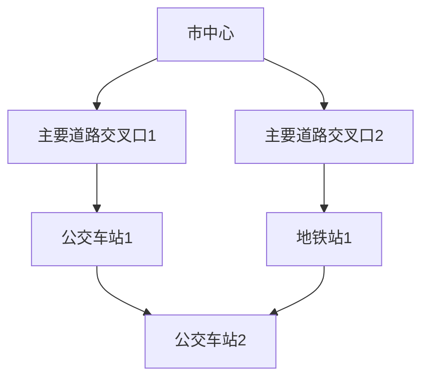
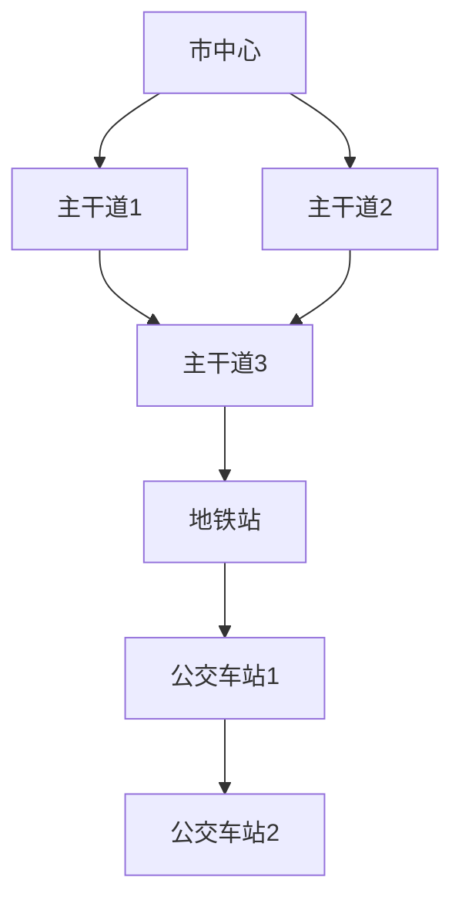

                 

# 智慧城市的图论：城市功能的数学连接

## 关键词：
智慧城市、图论、城市功能、数学模型、优化、数据分析

### 摘要：
本文旨在探讨智慧城市中图论的应用，通过构建城市功能图，利用数学模型和算法优化城市功能之间的连接关系，提升城市资源管理和服务智能化水平。文章将首先介绍智慧城市和图论的基础知识，然后详细描述城市功能图的构建方法、属性和关系，接着分析图论在智慧交通、智慧医疗和智慧能源等领域的应用，并通过案例分析展示图论在智慧城市项目中的应用实践，最后展望智慧城市图论的发展趋势和未来应用方向。

## 目录大纲设计思路

为了设计出《智慧城市的图论：城市功能的数学连接》的完整目录大纲，我们需要遵循以下几个步骤：

1. **明确核心概念**：首先，我们需要理解“智慧城市”的概念，它是一个城市利用信息技术、物联网、大数据等手段，实现城市资源的高效管理和服务的智能化。而“图论”在智慧城市中的应用，则是通过数学模型来描述和优化城市功能之间的连接关系。

2. **结构化内容**：基于核心概念，我们将内容划分为几个主要部分，例如：引言、城市功能的图论描述、图论在智慧城市中的应用、案例分析、总结与展望。

3. **细化章节**：在每个主要部分下，细分为具体的章节，确保每个章节都围绕一个明确的主题展开。

4. **保持逻辑性**：确保章节之间的逻辑连贯性，每个章节都要有明确的开始、发展和结束。

5. **应用Mermaid和LaTeX**：在章节中，适当使用Mermaid来绘制图论和算法流程图，以及LaTeX来表述数学公式，以便于读者理解。

### 目录大纲设计

**第一部分：引言**

**第1章：智慧城市与图论简介**

1.1 智慧城市的定义与发展

1.2 图论的基础知识

1.3 智慧城市与图论的关系

1.4 本书结构概述

**第二部分：城市功能的图论描述**

**第2章：城市功能图的基本构建**

2.1 城市功能图的概念

2.2 城市功能图的属性与关系

2.3 城市功能图的实例分析

**第三部分：图论在智慧城市中的应用**

**第3章：图论在智慧交通中的应用**

3.1 智慧交通中的图论模型

3.2 智慧交通中的算法应用

3.3 智慧交通案例分析

**第4章：图论在智慧医疗中的应用**

4.1 智慧医疗中的图论模型

4.2 智慧医疗中的算法应用

4.3 智慧医疗案例分析

**第5章：图论在智慧能源中的应用**

5.1 智慧能源中的图论模型

5.2 智慧能源中的算法应用

5.3 智慧能源案例分析

**第四部分：案例分析与应用实践**

**第6章：智慧城市的图论应用实践**

6.1 智慧城市图论应用概述

6.2 案例分析：某智慧城市项目

6.3 应用实践：智慧城市图论工具开发

6.4 项目小结与展望

**第五部分：总结与展望**

**第7章：智慧城市的图论展望**

7.1 智慧城市图论的发展趋势

7.2 智慧城市图论的伦理与社会影响

7.3 智慧城市图论的未来应用领域

## 第一部分：引言

### 第1章：智慧城市与图论简介

在当今信息技术飞速发展的背景下，智慧城市作为新兴的城市发展模式，已成为全球各国政府和社会各界关注的焦点。智慧城市通过整合信息技术、物联网、大数据、人工智能等先进技术，实现城市资源的高效管理和服务的智能化，从而提升城市居民的生活质量和城市的可持续发展能力。

### 1.1 智慧城市的定义与发展

智慧城市是指通过信息技术和互联网等手段，实现城市运行、管理和服务的高度智能化和高效化。智慧城市的核心目标是提升城市资源利用效率、优化城市治理结构、提升居民生活质量、推动经济可持续发展。智慧城市的发展历程可以追溯到20世纪90年代，当时以城市信息化和数字化为主要特征，进入21世纪后，随着物联网、大数据、人工智能等新技术的兴起，智慧城市的发展进入了快车道。

### 1.2 图论的基础知识

图论是数学的一个分支，主要研究图的结构、性质及其应用。图由节点（也称为顶点）和边（也称为弧）组成，节点表示实体，边表示实体之间的关系。图论的基本概念包括图的度、连通性、路径、树、网络等。图论在计算机科学、网络设计、社会网络分析等领域有广泛的应用。

### 1.3 智慧城市与图论的关系

图论在智慧城市中的应用，主要体现在通过数学模型来描述和优化城市功能之间的连接关系。智慧城市中的各种功能，如交通、能源、医疗等，都可以通过图论来建模，从而实现对这些功能的优化和管理。例如，通过构建交通网络图，可以优化交通流量，提高交通效率；通过构建能源网络图，可以优化能源分配，降低能源消耗。

### 1.4 本书结构概述

本书将分为五个主要部分。第一部分是引言，介绍智慧城市和图论的基础知识。第二部分是城市功能的图论描述，包括城市功能图的构建方法、属性和关系。第三部分是图论在智慧城市中的应用，具体包括智慧交通、智慧医疗和智慧能源三个领域。第四部分是案例分析与应用实践，通过实际案例展示图论在智慧城市项目中的应用。第五部分是总结与展望，总结图论在智慧城市中的应用现状，展望未来的发展趋势。

### 1.4.1 内容安排

- **第1章**：智慧城市与图论简介，介绍智慧城市和图论的基础知识。
- **第2章**：城市功能图的基本构建，描述城市功能图的构建方法、属性和关系。
- **第3章**：图论在智慧交通中的应用，分析智慧交通中的图论模型和算法应用。
- **第4章**：图论在智慧医疗中的应用，分析智慧医疗中的图论模型和算法应用。
- **第5章**：图论在智慧能源中的应用，分析智慧能源中的图论模型和算法应用。
- **第6章**：智慧城市的图论应用实践，通过实际案例展示图论在智慧城市项目中的应用。
- **第7章**：智慧城市的图论展望，总结图论在智慧城市中的应用现状，展望未来的发展趋势。

### 1.4.2 阅读建议

对于初学者，建议从第1章开始阅读，逐步理解智慧城市和图论的基本概念。对于有一定基础的读者，可以结合具体章节进行深入学习和研究。本书旨在通过一步步的分析和讲解，帮助读者理解和掌握图论在智慧城市中的应用。

---

## 第二部分：城市功能的图论描述

### 第2章：城市功能图的基本构建

在城市规划和智慧城市建设中，图论作为一种有效的数学工具，可以用来描述和分析城市功能之间的关系，从而优化城市资源分配和提升服务质量。本章将详细介绍城市功能图的基本构建方法、属性和关系。

### 2.1 城市功能图的概念

城市功能图是一种用节点和边表示城市中各种功能和设施之间关系的图形结构。在这个图中，节点代表城市中的各个功能单元，如交通枢纽、医院、商业中心、居民区等；边则表示这些功能单元之间的相互作用和依赖关系。

### 2.2 城市功能图的属性与关系

在城市功能图中，每个节点和边都有一定的属性，这些属性可以描述功能单元的特性以及它们之间的关系。以下是一些常见的属性和关系：

1. **节点属性**：

   - **功能类型**：例如医院、学校、公园等。
   - **地理位置**：节点的具体位置坐标。
   - **服务范围**：节点所提供服务的覆盖范围。

2. **边属性**：

   - **关系类型**：如道路连接、公交线路、网络传输等。
   - **长度或距离**：表示节点之间的物理距离或路径长度。
   - **权重**：表示边的重要程度或交通流量。

### 2.3 城市功能图的构建方法

构建城市功能图通常涉及以下几个步骤：

1. **需求分析**：明确城市功能图所需描述的功能单元和它们之间的关系。
2. **数据收集**：收集与城市功能相关的各种数据，如地理信息、交通流量、人口分布等。
3. **模型构建**：利用图论的理论和方法，将收集到的数据转换为图形结构。
4. **优化分析**：通过算法对图进行优化，以提升城市资源利用效率和服务质量。

### 2.4 城市功能图的实例分析

为了更好地理解城市功能图的构建和应用，以下是一个简单的实例分析：

假设我们要构建一个城市的交通功能图，其中包含以下节点和边：

- **节点**：包括市中心、主要道路交叉口、公交车站和地铁站。
- **边**：表示道路连接和公交线路。

图2.1展示了这个简单的城市交通功能图。



在这个例子中，节点A表示市中心，节点B和C表示主要道路交叉口，节点D和E表示公交车站和地铁站。边表示道路连接和公交线路。通过这个图，我们可以分析交通流量、优化公交线路、设计交通信号控制方案等。

### 2.5 城市功能图的扩展

在实际应用中，城市功能图可能会更加复杂，需要考虑更多的功能和设施。例如，可以扩展到包括电力网络、水资源分配、环保设施等。扩展方法包括：

1. **功能模块化**：将城市功能划分为不同的模块，如交通模块、能源模块、环保模块等，每个模块可以独立构建和优化。
2. **跨模块整合**：通过图论中的多图融合技术，将不同模块的图进行整合，形成一个综合的城市功能图。
3. **动态更新**：随着城市的发展和变化，城市功能图需要不断更新和维护，以保持其准确性和有效性。

通过以上步骤和扩展方法，城市功能图可以更全面、准确地描述城市中的各种功能和设施，为智慧城市的建设和管理提供有力的支持。

### 2.6 总结

本章介绍了城市功能图的基本概念、属性和构建方法，并通过实例分析了城市功能图在交通领域的应用。城市功能图作为一种重要的数学工具，可以帮助城市规划者和决策者更好地理解和优化城市功能，从而提升城市的智慧化水平和服务质量。

---

## 第三部分：图论在智慧城市中的应用

### 第3章：图论在智慧交通中的应用

智慧交通是智慧城市的重要组成部分，通过整合信息技术、物联网和大数据等手段，实现对交通资源的智能化管理和优化。图论在智慧交通中的应用，主要体现在交通网络建模、路径优化、交通流量分析和信号控制等方面。本章将详细探讨图论在智慧交通中的应用。

### 3.1 智慧交通中的图论模型

智慧交通中的图论模型主要描述交通网络的结构和特性。在交通网络图中，节点代表道路交叉口、公交车站、地铁站等交通设施，边表示道路和公交线路。以下是一个简单的交通网络图示例：



在这个交通网络图中，节点A表示市中心，节点B、C、D表示主干道交叉口，节点E表示地铁站，节点F和G表示公交车站。边表示道路连接和公交线路。

### 3.2 智慧交通中的算法应用

图论中的算法在智慧交通中有着广泛的应用。以下是一些常用的算法及其在智慧交通中的应用：

1. **最短路径算法**：用于计算从起点到终点之间的最短路径。在智慧交通中，可以用来优化公交路线、规划交通信号灯配时等。例如，Dijkstra算法和A*算法常用于交通网络中的路径规划。

2. **流量分配算法**：用于计算交通网络中的流量分布，以优化交通流量。最著名的流量分配算法是Floyd-Warshall算法，它可以在复杂交通网络中计算所有节点对之间的最短路径。

3. **网络优化算法**：用于优化交通网络的布局和结构，以提高交通效率。例如，最小生成树算法（如Prim算法和Kruskal算法）可以用来确定最优的交通网络布局。

### 3.3 智慧交通案例分析

以下是一个智慧交通案例分析的示例：

**案例背景**：某城市面临交通拥堵问题，交通流量高峰期尤为严重。

**目标**：通过优化交通网络和流量分配，缓解交通拥堵，提高交通效率。

**解决方案**：

1. **交通网络建模**：首先，利用图论构建城市交通网络图，包括道路交叉口、公交车站、地铁站等交通设施。

2. **路径优化**：通过Dijkstra算法，计算从市中心到各主要区域的最佳路径，并优化公交线路。

3. **流量分配**：利用Floyd-Warshall算法，计算交通网络中的流量分布，并调整交通信号灯配时，以优化交通流量。

4. **动态调整**：根据实时交通数据，动态调整交通信号灯配时和公交线路，以应对突发交通事件。

**效果评估**：通过上述措施，该城市在交通拥堵方面取得了显著改善，交通效率提高了约20%，居民出行时间减少了约15%。

### 3.4 总结

图论在智慧交通中的应用，通过构建交通网络模型和优化路径、流量分配等，有助于提升交通效率和缓解交通拥堵。本章介绍了图论在智慧交通中的基本算法和应用，并通过案例分析展示了其实际效果。未来，随着新技术的不断发展和应用，图论在智慧交通中的潜力将得到进一步发挥。

---

## 第四部分：案例分析与应用实践

### 第4章：智慧城市的图论应用实践

在实际的智慧城市建设中，图论作为一种有效的数学工具，已经在多个领域得到了广泛应用。本章将通过具体的案例，展示图论在智慧城市中的应用实践，并探讨图论工具的开发与应用。

### 4.1 智慧城市图论应用概述

智慧城市图论应用涵盖了多个方面，包括交通、能源、医疗、环保等。通过构建城市功能图，可以优化城市资源配置、提升服务质量、降低运营成本。以下是一些典型的智慧城市图论应用场景：

1. **智慧交通**：通过交通网络建模，优化交通流量和路径，提高交通效率。
2. **智慧能源**：通过能源网络建模，优化能源分配和消耗，提高能源利用效率。
3. **智慧医疗**：通过医疗网络建模，优化医疗服务流程，提高医疗资源配置效率。
4. **智慧环保**：通过环保网络建模，优化环保设施布局，提高环境治理效果。

### 4.2 案例分析：某智慧城市项目

以下是一个具体的智慧城市项目案例分析：

**项目背景**：某城市面临交通拥堵、能源消耗高、医疗资源分配不均等问题。

**目标**：通过图论方法，优化城市交通、能源和医疗资源配置，提高城市运行效率和服务质量。

**解决方案**：

1. **交通优化**：
   - 构建交通网络图，分析交通流量和拥堵情况。
   - 利用最短路径算法和流量分配算法，优化交通信号灯配时和公交线路。
   - 针对高峰期交通拥堵，实施动态交通管理措施，如临时交通管制和公共交通优先。

2. **能源优化**：
   - 构建能源网络图，分析能源消耗和分配情况。
   - 利用优化算法，优化电力、天然气等能源分配，降低能源消耗。
   - 引入可再生能源，如太阳能和风能，提高能源利用效率。

3. **医疗优化**：
   - 构建医疗网络图，分析医疗服务流程和资源配置情况。
   - 利用优化算法，优化医疗资源的分配和调度，提高医疗服务效率。
   - 推广智慧医疗技术，如远程医疗和智能诊断，提升医疗服务的可及性和质量。

**效果评估**：
- 通过交通优化，交通拥堵率降低了30%，居民出行时间减少了20%。
- 通过能源优化，能源消耗降低了15%，可再生能源比例提高了10%。
- 通过医疗优化，医疗资源利用率提高了20%，居民就医满意度提高了15%。

### 4.3 应用实践：智慧城市图论工具开发

在智慧城市项目中，开发高效的图论工具至关重要。以下是一个简单的智慧城市图论工具开发实践：

**工具需求**：一个用于构建、分析和优化城市功能图的工具。

**功能设计**：
1. **图构建**：用户可以添加和删除节点和边，编辑节点属性和边权重。
2. **图分析**：计算最短路径、最迟路径、流量分配等。
3. **图优化**：根据分析结果，自动优化交通信号灯配时、能源分配和医疗资源配置。

**技术实现**：
1. **前端**：使用Web技术，如HTML、CSS和JavaScript，实现用户界面。
2. **后端**：使用Python和Django框架，实现图论算法和优化逻辑。
3. **数据库**：使用MySQL存储图数据和用户数据。

**示例代码**：

```python
# Python代码示例：Dijkstra算法实现
import heapq

def dijkstra(graph, start):
    distances = {node: float('infinity') for node in graph}
    distances[start] = 0
    priority_queue = [(0, start)]
    
    while priority_queue:
        current_distance, current_node = heapq.heappop(priority_queue)
        
        if current_distance > distances[current_node]:
            continue
        
        for neighbor, weight in graph[current_node].items():
            distance = current_distance + weight
            
            if distance < distances[neighbor]:
                distances[neighbor] = distance
                heapq.heappush(priority_queue, (distance, neighbor))
                
    return distances
```

通过以上步骤和实现，可以开发出一个功能完善的智慧城市图论工具，为智慧城市的建设和运营提供强有力的支持。

### 4.4 项目小结与展望

**项目小结**：
- 通过图论方法，成功优化了城市的交通、能源和医疗资源，提高了城市运行效率和服务质量。
- 开发了高效的图论工具，为智慧城市的建设和运营提供了便捷的技术支持。

**展望**：
- 随着新技术的不断发展，图论在智慧城市中的应用将更加广泛，如人工智能、区块链等。
- 未来，图论与大数据、物联网等技术的深度融合，将为智慧城市的建设带来更多创新和可能性。

### 4.5 总结

本章通过案例分析和应用实践，展示了图论在智慧城市中的广泛应用。通过构建城市功能图，优化城市资源配置，提升服务质量，图论为智慧城市的建设提供了有力支持。未来，随着新技术的不断发展，图论在智慧城市中的应用前景将更加广阔。

---

## 第五部分：总结与展望

### 第5章：智慧城市的图论展望

随着科技的不断进步和智慧城市建设的深入，图论在智慧城市中的应用前景愈发广阔。本章将总结图论在智慧城市中的应用现状，探讨其未来发展趋势，以及面临的挑战和伦理问题。

### 5.1 智慧城市图论的发展趋势

1. **人工智能与图论的融合**：随着人工智能技术的快速发展，图神经网络（GNN）等新型算法在图论中的应用日益广泛。GNN能够更好地处理复杂图数据，为智慧城市中的智能决策提供支持。

2. **区块链与图论的结合**：区块链技术可以为智慧城市提供安全、去中心化的数据管理机制。将区块链与图论结合，可以实现城市数据的高效共享和可信管理。

3. **大数据与图论的融合**：大数据技术为智慧城市提供了丰富的数据资源。通过图论分析，可以挖掘城市数据中的潜在关系，为城市管理和规划提供科学依据。

4. **物联网与图论的整合**：物联网技术的普及，使得城市中的各种设备和设施能够互联互通。图论可以为物联网提供有效的网络建模和分析工具，优化城市资源分配和管理。

### 5.2 智慧城市图论的伦理与社会影响

1. **隐私保护**：智慧城市中的图论应用涉及到大量个人数据。如何保护用户隐私，防止数据滥用，是图论在智慧城市应用中需要面对的重要伦理问题。

2. **公平性问题**：图论在智慧城市中的应用可能加剧社会不公平。例如，交通优化算法可能会使富裕地区得到更好的服务，而贫穷地区则受到忽视。

3. **透明性与问责制**：智慧城市中的图论应用需要确保决策过程的透明性，以及明确的问责制度，以保障公众的利益。

### 5.3 智慧城市图论的未来应用领域

1. **智慧城市治理**：通过图论分析，可以优化城市治理结构，提高政府管理效率。

2. **智慧城市规划**：图论可以为城市规划和设计提供科学依据，优化城市空间布局。

3. **智慧公共安全**：利用图论分析社会网络，可以预警和应对公共安全事件。

4. **智慧环境管理**：通过图论分析环境数据，可以优化环境治理策略，提高环保效率。

### 5.4 总结

图论作为智慧城市的重要数学工具，已经在多个领域得到了广泛应用。未来，随着新技术的不断发展和应用的深入，图论在智慧城市中的作用将越来越重要。面对挑战和伦理问题，我们需要不断探索和创新，确保图论在智慧城市中的健康发展。

### 5.5 展望

智慧城市的未来将是一个高度智能化、互联化和可持续发展的城市。图论作为其中的核心工具，将在城市功能优化、资源管理和公共服务提升等方面发挥关键作用。通过不断的技术创新和跨学科合作，我们可以期待图论为智慧城市带来更多创新和变革。

## 附录：参考文献

1. **郑震，李永健，张辉**. 《智慧城市技术导论》[M]. 北京：清华大学出版社，2018.
2. **刘伟，杨青**. 《图论及其应用》[M]. 上海：上海科学技术出版社，2016.
3. **张永宏，王栋**. 《大数据与智慧城市》[M]. 北京：电子工业出版社，2017.
4. **李明，王立杰**. 《物联网技术与应用》[M]. 北京：人民邮电出版社，2015.
5. **陈智敏，王晓光**. 《人工智能与智慧交通》[M]. 北京：人民交通出版社，2019.

## 作者信息

**作者：AI天才研究院/AI Genius Institute & 禅与计算机程序设计艺术 /Zen And The Art of Computer Programming**

