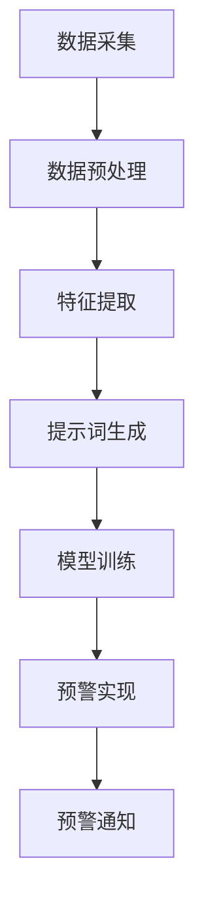

                 

### 引言

# 引言

智能健康监测：提示词驱动的早期预警系统

> 关键词：智能健康监测、提示词驱动、早期预警、健康监测系统、人工智能、机器学习、深度学习

> 摘要：
随着人工智能和大数据技术的不断发展，智能健康监测系统在健康管理和疾病预防方面发挥着越来越重要的作用。本文旨在探讨提示词驱动的早期预警系统在智能健康监测中的应用，通过系统架构设计、算法原理讲解和项目实战分析，为读者提供全方位的智能健康监测技术解读。

### 引言

随着全球人口老龄化和慢性疾病发病率的增加，健康监测成为公共卫生领域的重要议题。传统的健康监测方式往往依赖于定期体检和被动收集数据，存在监测时间滞后、数据不完整等问题。为了提高健康监测的效率和准确性，智能健康监测系统应运而生。智能健康监测系统通过整合人工智能、大数据、物联网等先进技术，实现对健康数据的实时采集、分析和预警，从而提供个性化、智能化的健康服务。

智能健康监测的核心是早期预警系统。早期预警系统通过分析健康数据中的异常指标，提前识别潜在的健康风险，为用户和医疗机构提供及时的预警信息。提示词驱动的早期预警系统利用自然语言处理技术和深度学习算法，从大量的健康数据中提取关键信息，提高预警的准确性和效率。

本文将围绕智能健康监测：提示词驱动的早期预警系统这一主题，展开如下内容：

1. **背景与基础理论**：介绍健康监测技术的发展历程，智能健康监测的基本原理和系统架构，以及提示词驱动的早期预警系统的设计目标。
2. **核心概念与原理**：深入探讨智能健康监测和提示词驱动的早期预警系统的核心概念、原理及其相互关系。
3. **智能健康监测系统架构**：详细解析智能健康监测系统的整体架构，包括数据采集、预处理、特征提取、模型训练和预警实现的各个环节。
4. **提示词驱动的早期预警系统**：阐述提示词的生成与优化、早期预警模型的构建和实践策略。
5. **算法原理与实现**：讲解提示词驱动的早期预警系统的算法原理，使用Python源代码进行详细阐述。
6. **项目实战与案例分析**：介绍智能健康监测系统的实际应用案例，包括环境安装、系统核心实现、代码应用解读与分析。
7. **最佳实践与总结**：总结智能健康监测系统的最佳实践，提出注意事项和拓展阅读建议。

通过本文的阅读，读者将全面了解智能健康监测：提示词驱动的早期预警系统的技术原理和应用实践，为从事相关领域的研究和开发提供有力支持。

### 1.1 问题的背景和重要性

健康监测技术的发展经历了从传统方法到现代智能技术的转变。早期，健康监测主要依赖于定期体检和医护人员的手动记录。这种方法存在诸多局限性，如监测频率低、数据不完整、无法实时反映健康状况等。随着信息技术和医疗设备的进步，健康监测技术逐渐向自动化和智能化方向发展。

近年来，人工智能（AI）、大数据、物联网等新兴技术的快速发展，为健康监测带来了革命性的变化。智能健康监测系统通过整合多种数据源，如医疗设备、传感器、社交媒体等，实现对健康数据的实时采集、分析和处理。这种实时、全面、个性化的健康监测方式，有助于提高健康管理的效率和准确性，实现早期疾病预防和个性化医疗。

智能健康监测的核心在于早期预警系统。早期预警系统通过分析健康数据中的异常指标，提前识别潜在的健康风险，为用户和医疗机构提供及时的预警信息。与传统的健康监测方式相比，早期预警系统具有以下几个显著优势：

1. **实时性**：早期预警系统可以实现实时监测和预警，确保及时发现健康问题，降低疾病发生的风险。
2. **全面性**：通过整合多种数据源，早期预警系统可以获得更全面、多维的健康信息，提高监测的准确性。
3. **个性化**：早期预警系统可以根据个体的健康状况和需求，提供个性化的健康建议和预警服务，实现精准健康管理。

然而，早期预警系统也面临一些挑战，如数据隐私保护、算法准确性、系统稳定性等。特别是在利用大量非结构化健康数据进行分析时，如何有效地提取关键信息、降低误报率和提高预警准确性，是当前研究的重点和难点。

本文将针对提示词驱动的早期预警系统进行深入探讨。提示词驱动技术通过自然语言处理和深度学习算法，从大量的健康数据中提取关键信息，提高预警的准确性和效率。本文将详细介绍智能健康监测和早期预警系统的基本原理、架构设计、算法实现和实际应用，旨在为相关领域的研究者提供有价值的参考。

### 1.2 书籍结构概述

本书籍《智能健康监测：提示词驱动的早期预警系统》共分为七个主要部分，每个部分都围绕智能健康监测的核心概念和技术展开，旨在为读者提供全面、系统、深入的技术解读。

**第一部分：引言**  
本部分首先介绍了智能健康监测和提示词驱动的早期预警系统的背景和重要性，阐述了智能健康监测的发展历程和当前面临的挑战。接着，本书结构概述部分对全书的内容布局进行了详细的介绍，为读者提供了清晰的阅读指南。

**第二部分：背景与基础理论**  
这一部分重点介绍了健康监测技术的基本概念和发展趋势，包括传统的健康监测方法和新兴的智能健康监测技术。此外，还详细阐述了人工智能在健康监测中的应用，以及提示词驱动的早期预警系统的设计目标和实现原理。

**第三部分：核心概念与原理**  
本部分深入探讨了智能健康监测和提示词驱动的早期预警系统的核心概念和原理，包括健康监测的关键术语、智能健康监测系统的功能模块和交互方式，以及提示词驱动的早期预警系统的基本机制和实现方法。

**第四部分：智能健康监测系统架构**  
这一部分详细介绍了智能健康监测系统的整体架构设计，包括数据采集与预处理、特征提取与模型训练、早期预警系统的实现等关键环节。通过这一部分的讲解，读者可以全面了解智能健康监测系统的设计和实现过程。

**第五部分：提示词驱动的早期预警系统**  
本部分专注于提示词驱动的早期预警系统的构建和实践，包括提示词的生成与优化、早期预警模型的构建和预警策略的设计。这一部分内容旨在帮助读者理解如何利用提示词驱动技术构建高效的早期预警系统。

**第六部分：算法原理与实现**  
这一部分详细讲解了提示词驱动的早期预警系统的算法原理和实现方法，包括算法的数学模型和公式解析、Python源代码实现，以及算法的流程图和示例应用。通过这一部分的讲解，读者可以深入掌握提示词驱动预警系统的核心技术。

**第七部分：项目实战与案例分析**  
最后一部分通过实际项目案例，展示了智能健康监测系统的实际应用场景和解决方案。包括环境安装、系统核心实现、代码应用解读与分析、实际案例分析和详细讲解剖析等内容。这一部分内容有助于读者将所学知识应用于实际项目中，提升实际操作能力。

通过以上七个部分的系统讲解，本书旨在为读者提供从理论到实践的全面指导，帮助读者深入理解智能健康监测和提示词驱动的早期预警系统的核心技术和应用实践。

### 1.3 技术术语与缩略语解释

在本书籍中，我们将使用一些专业术语和缩略语，以下是对这些术语的详细解释，以便读者更好地理解相关概念。

1. **智能健康监测（Intelligent Health Monitoring）**：指利用人工智能、大数据、物联网等技术，对个体或群体的健康数据进行实时采集、分析和管理，以实现健康状态监测、疾病预防和个性化医疗。

2. **提示词（Prompt Words）**：在自然语言处理领域，提示词是指用于引导模型生成特定类型文本的词语或短语。在智能健康监测中，提示词用于从健康数据中提取关键信息，辅助早期预警系统的构建。

3. **早期预警（Early Warning）**：指在疾病或健康问题发生前，通过分析健康数据中的异常指标，提前识别潜在的健康风险，并向用户或医疗机构发出预警信号。

4. **机器学习（Machine Learning）**：一种人工智能技术，通过构建模型，从大量数据中学习规律和模式，实现数据分析和决策自动化。

5. **深度学习（Deep Learning）**：一种机器学习方法，通过多层神经网络结构，对大量数据进行分析和特征提取，实现复杂任务的高效解决。

6. **神经网络（Neural Network）**：一种模拟人脑神经元连接和计算过程的计算模型，广泛应用于机器学习和人工智能领域。

7. **数据采集（Data Collection）**：指通过传感器、设备或其他方式，收集与个体健康相关的数据，如心率、血压、血糖等。

8. **数据预处理（Data Preprocessing）**：指在数据分析和建模前，对原始数据进行清洗、转换和归一化等操作，以提高数据质量和模型性能。

9. **特征提取（Feature Extraction）**：指从原始数据中提取具有鉴别力和代表性的特征，用于构建和训练模型。

10. **模型训练（Model Training）**：指通过机器学习算法，从训练数据中学习规律和模式，构建预测模型。

11. **模型评估（Model Evaluation）**：指通过测试数据对训练好的模型进行性能评估，包括准确性、召回率、F1值等指标。

12. **预警阈值（Warning Threshold）**：指设定一个阈值，当健康数据超出该阈值时，系统会发出预警信号。

13. **个性化医疗（Personalized Medicine）**：指根据个体的基因组信息、生活方式和环境因素，制定个性化的诊断和治疗方案。

通过了解这些专业术语和缩略语，读者可以更好地理解智能健康监测和提示词驱动的早期预警系统的核心概念和技术细节。

### 1.4 本章小结

本章作为引言部分，为读者介绍了智能健康监测和提示词驱动的早期预警系统的背景和重要性。通过阐述健康监测技术的发展历程、智能健康监测的基本原理和系统架构，以及提示词驱动的早期预警系统的设计目标，本章奠定了全文的技术基础。此外，本章还概述了书籍的结构和内容布局，为读者提供了清晰的阅读指南。最后，对一些关键术语和缩略语进行了解释，有助于读者更好地理解后续章节的内容。通过本章的学习，读者可以初步了解智能健康监测系统的基本概念和技术框架，为后续章节的深入学习打下坚实基础。

### 第二部分：背景与基础理论

# 第二部分：背景与基础理论

在深入探讨智能健康监测和提示词驱动的早期预警系统之前，我们需要对健康监测技术的基本概念、发展趋势以及人工智能在健康监测中的应用有一个全面的了解。本部分将分为以下几个小节，逐一介绍这些内容，为后续章节的分析和讨论奠定基础。

## 2.1 健康监测技术概述

### 2.1.1 健康监测的基本概念

健康监测是指通过各种手段，对个体或群体的健康状况进行实时、连续、全面的监测和分析。健康监测的目的是及时发现健康问题，提供个性化的健康建议，实现疾病的早期预防和治疗。

健康监测的基本概念包括以下几个方面：

1. **健康数据**：指与个体健康相关的各种数据，如生理指标（如心率、血压、体温等）、生化指标（如血糖、血脂、肝功能等）、行为数据（如运动、饮食、睡眠等）等。

2. **传感器**：指用于采集健康数据的设备，如智能手环、健康监测手表、血压计、血糖仪等。

3. **数据采集**：指通过传感器或其他设备，将健康数据实时传输到监测系统。

4. **数据处理**：指对采集到的健康数据进行清洗、转换、存储等操作，以便后续分析和应用。

5. **数据分析**：指利用统计、机器学习、深度学习等算法，对健康数据进行处理和分析，提取有用的信息。

6. **健康评估**：指根据分析结果，对个体的健康状况进行评估，提供健康建议。

### 2.1.2 常见的健康监测方法

常见的健康监测方法可以分为以下几类：

1. **传统监测方法**：包括定期体检、医疗设备的定期检查等。这种方法的主要缺点是监测频率低、数据不完整、无法实现实时监测。

2. **被动监测方法**：指通过患者主动报告或医疗记录等方式，收集与健康相关的数据。这种方法的数据来源有限，数据质量参差不齐。

3. **主动监测方法**：指利用传感器、设备等主动采集健康数据，实现对健康状况的实时监测。这种方法的数据来源更广泛，数据质量更高。

4. **智能监测方法**：指利用人工智能、大数据、物联网等技术，对健康数据进行分析和管理，实现智能化的健康监测。这种方法具有实时性、全面性、个性化和高效性的优势。

### 2.1.3 健康监测技术的发展趋势

随着科技的进步，健康监测技术也在不断发展和创新。未来，健康监测技术的发展趋势主要包括以下几个方面：

1. **物联网（IoT）技术的普及**：物联网技术可以实现对多种健康数据的实时采集和传输，提高健康监测的效率和准确性。

2. **人工智能和大数据的应用**：人工智能和大数据技术可以实现对大量健康数据的深度分析和挖掘，提供个性化的健康建议和服务。

3. **可穿戴设备的推广**：可穿戴设备（如智能手环、健康监测手表等）可以方便地采集用户的健康数据，实现对健康状况的实时监测。

4. **远程健康监测**：远程健康监测技术可以通过互联网和移动设备，实现对用户健康数据的远程监控和分析，提高医疗服务的可及性和便利性。

5. **健康大数据平台**：健康大数据平台可以整合多种健康数据源，提供统一的数据管理和分析服务，为健康管理和疾病预防提供有力支持。

## 2.2 人工智能在健康监测中的应用

### 2.2.1 人工智能的基本原理

人工智能（AI）是指通过计算机模拟人类的认知和决策过程，实现智能行为的技术。人工智能的基本原理包括以下几个方面：

1. **机器学习（Machine Learning）**：机器学习是一种通过数据驱动的方法，使计算机能够从数据中学习规律和模式，实现自动化的数据分析和决策。

2. **深度学习（Deep Learning）**：深度学习是一种基于多层神经网络的结构，通过逐层提取数据中的特征，实现更复杂的数据分析和决策。

3. **自然语言处理（Natural Language Processing, NLP）**：自然语言处理是一种使计算机能够理解和处理自然语言的技术，广泛应用于语音识别、机器翻译、文本分析等领域。

4. **计算机视觉（Computer Vision）**：计算机视觉是一种使计算机能够理解和解析视觉信息的技术，广泛应用于图像识别、视频分析、医疗影像诊断等领域。

### 2.2.2 机器学习在健康监测中的应用

机器学习在健康监测中的应用非常广泛，主要包括以下几个方面：

1. **疾病预测**：通过分析患者的健康数据，利用机器学习算法预测患者未来可能发生的疾病或健康问题。

2. **疾病诊断**：利用机器学习算法，对患者的医疗数据进行分析，实现疾病自动诊断和分类。

3. **个性化治疗**：根据患者的基因信息、病史、生活方式等数据，利用机器学习算法制定个性化的治疗方案。

4. **健康风险评估**：通过分析患者的健康数据，利用机器学习算法评估患者未来发生某种疾病的风险。

### 2.2.3 深度学习与神经网络在健康监测中的作用

深度学习和神经网络在健康监测中的应用越来越广泛，主要包括以下几个方面：

1. **医学影像分析**：深度学习算法可以自动识别和分类医学影像中的异常情况，如肿瘤、心脏病等，提高医学诊断的准确性。

2. **健康数据挖掘**：深度学习算法可以从大量健康数据中提取有价值的信息，如潜在的健康风险因素、疾病发展趋势等，为健康管理和疾病预防提供依据。

3. **智能健康监测**：深度学习算法可以实现对健康数据的实时分析和处理，提供智能化的健康监测服务，如实时心率监测、血压监测等。

4. **个性化健康建议**：根据患者的健康数据和生活习惯，深度学习算法可以制定个性化的健康建议，如运动建议、饮食建议等。

## 2.3 智能健康监测系统的架构

### 2.3.1 系统架构的组成部分

智能健康监测系统通常包括以下几个关键组成部分：

1. **数据采集层**：负责采集用户的健康数据，如生理指标、行为数据等。

2. **数据处理层**：负责对采集到的健康数据进行预处理、存储和管理。

3. **数据挖掘与分析层**：利用机器学习、深度学习等技术，对健康数据进行分析和挖掘，提取有价值的信息。

4. **决策支持层**：根据分析结果，提供个性化的健康建议和预警服务。

5. **用户接口层**：为用户提供一个友好、直观的交互界面，展示健康数据和分析结果。

### 2.3.2 系统的层级与功能模块

智能健康监测系统可以分为以下几个层级和功能模块：

1. **感知层**：通过传感器、设备等，实时采集用户的健康数据。

2. **传输层**：将采集到的数据传输到服务器或云端进行存储和处理。

3. **处理层**：对传输过来的数据进行预处理、特征提取、建模分析等操作。

4. **决策层**：根据分析结果，生成健康建议和预警信息。

5. **展示层**：将分析结果和健康建议展示给用户。

### 2.3.3 数据处理流程与关键技术

智能健康监测系统的数据处理流程主要包括以下几个关键环节：

1. **数据采集**：通过传感器、设备等，实时采集用户的健康数据。

2. **数据预处理**：对采集到的数据进行分析、清洗、转换和归一化等操作，提高数据质量和模型性能。

3. **特征提取**：从原始数据中提取具有鉴别力和代表性的特征，用于构建和训练模型。

4. **模型训练**：利用机器学习、深度学习等技术，从训练数据中学习规律和模式，构建预测模型。

5. **模型评估**：通过测试数据对训练好的模型进行性能评估，包括准确性、召回率、F1值等指标。

6. **预警实现**：根据模型预测结果，设置预警阈值，当健康数据超出阈值时，系统会发出预警信号。

## 2.4 提示词驱动的早期预警系统概述

### 2.4.1 提示词的定义与作用

在智能健康监测系统中，提示词是指用于引导模型生成特定类型文本的词语或短语。提示词在早期预警系统中起着至关重要的作用，其定义和作用如下：

1. **定义**：提示词是一种关键词或短语，用于引导模型从大量健康数据中提取关键信息，实现对健康风险的早期识别。

2. **作用**：
   - **提高预警准确性**：提示词可以帮助模型关注健康数据中的关键指标，提高预警的准确性。
   - **降低误报率**：通过选择合适的提示词，可以减少无关信息的干扰，降低误报率。
   - **辅助决策**：提示词可以为医疗决策提供重要依据，帮助医生和用户及时采取预防措施。

### 2.4.2 早期预警系统的设计目标

早期预警系统的设计目标主要包括以下几个方面：

1. **实时性**：系统能够实时监测健康数据，及时发现潜在的健康风险。

2. **准确性**：系统具有较高的预警准确性，能够准确识别健康风险。

3. **个性化**：系统能够根据用户的健康状况和需求，提供个性化的健康建议和预警服务。

4. **高效性**：系统能够快速处理大量健康数据，提供及时的预警信息。

5. **易用性**：系统界面友好，用户易于操作和理解预警结果。

### 2.4.3 提示词驱动的预警机制

提示词驱动的早期预警机制主要包括以下几个步骤：

1. **提示词生成**：利用自然语言处理技术，从健康数据中提取关键信息，生成提示词。

2. **模型训练**：利用机器学习、深度学习等技术，对提示词进行建模和训练，构建预警模型。

3. **预警策略制定**：根据提示词和模型预测结果，制定合理的预警策略，设置预警阈值。

4. **预警信号发出**：当健康数据超出预警阈值时，系统会发出预警信号，提醒用户和医生采取相应措施。

5. **反馈与优化**：根据预警信号的反馈，不断优化预警模型和策略，提高预警系统的性能。

### 2.5 本章小结

本章对健康监测技术的基本概念、发展趋势以及人工智能在健康监测中的应用进行了详细阐述。通过介绍智能健康监测系统的架构设计、提示词驱动的早期预警系统的原理和机制，本章为后续章节的内容奠定了基础。通过本章的学习，读者可以全面了解健康监测技术的发展现状和未来趋势，以及人工智能在健康监测中的应用前景。

### 第三部分：核心概念与原理

## 3.1 智能健康监测的核心概念

### 3.1.1 智能健康监测的关键术语

在深入探讨智能健康监测之前，我们需要了解一些关键术语，以便更好地理解这一领域的概念和原理。

1. **健康数据（Health Data）**：指与个体健康状况相关的数据，包括生理指标、生化指标、行为数据等。健康数据是智能健康监测的基础。

2. **数据采集（Data Collection）**：指通过各种传感器、设备等手段，收集健康数据的全过程。数据采集的准确性直接影响到后续分析和预测的准确性。

3. **数据预处理（Data Preprocessing）**：指在数据分析之前，对原始健康数据进行清洗、转换和标准化等操作，以提高数据质量和模型性能。

4. **特征提取（Feature Extraction）**：指从原始健康数据中提取出具有鉴别力和代表性的特征，这些特征将用于模型训练和预测。

5. **机器学习（Machine Learning）**：一种人工智能技术，通过从数据中学习模式和规律，实现自动化的数据分析和决策。

6. **深度学习（Deep Learning）**：一种机器学习方法，通过多层神经网络结构，对大量数据进行特征提取和模式识别。

7. **自然语言处理（Natural Language Processing, NLP）**：一种人工智能技术，用于使计算机理解和生成自然语言。

8. **预警系统（Early Warning System）**：一种系统，用于通过分析健康数据，提前识别潜在的健康风险。

9. **个性化医疗（Personalized Medicine）**：根据个体的基因信息、生活方式和环境因素，制定个性化的诊断和治疗方案。

10. **物联网（Internet of Things, IoT）**：一种网络技术，将各种物品连接到互联网，实现数据的实时采集和传输。

### 3.1.2 智能健康监测系统的功能模块与交互

智能健康监测系统通常由多个功能模块组成，这些模块相互协作，实现从数据采集、预处理、特征提取到预警实现的整个过程。以下是智能健康监测系统的主要功能模块及其交互关系：

1. **数据采集模块**：负责通过传感器和设备收集健康数据，如心率、血压、体温等。

2. **数据预处理模块**：负责对采集到的原始数据进行清洗、转换和标准化等操作，确保数据的准确性和一致性。

3. **特征提取模块**：从预处理后的数据中提取关键特征，这些特征将用于模型训练和预测。

4. **模型训练模块**：使用机器学习和深度学习算法，从特征数据中训练预测模型，以便进行健康风险评估和预警。

5. **预警实现模块**：根据训练好的模型，对实时采集的健康数据进行分析，当数据超出设定的阈值时，发出预警信号。

6. **用户接口模块**：提供一个友好、直观的用户界面，让用户可以查看自己的健康数据、预警信息和个性化健康建议。

### 3.1.3 智能健康监测的挑战与机遇

智能健康监测虽然具有巨大的潜力，但在实际应用中也面临诸多挑战：

1. **数据质量**：健康数据的准确性、完整性和一致性是智能健康监测的关键。然而，在实际应用中，数据质量往往受到多种因素的影响，如传感器的精度、用户的操作习惯等。

2. **隐私保护**：健康数据属于敏感信息，如何保护用户的隐私是一个重要挑战。需要设计安全的数据传输和存储方案，确保用户数据的安全。

3. **算法准确性**：智能健康监测依赖于机器学习和深度学习算法，这些算法的准确性和稳定性直接影响到预警系统的性能。需要不断优化算法，提高预测的准确性。

4. **用户体验**：用户界面设计、预警信息的表达方式等都会影响用户的体验。需要设计易用、直观的用户界面，让用户能够轻松理解和使用智能健康监测系统。

然而，智能健康监测也带来了许多机遇：

1. **早期疾病预防**：通过实时监测健康数据，可以提前发现潜在的健康问题，实现疾病的早期预防。

2. **个性化健康管理**：智能健康监测可以根据个体的健康状况和需求，提供个性化的健康建议和服务，实现精准健康管理。

3. **医疗资源优化**：智能健康监测可以减少不必要的医疗检查和住院，优化医疗资源的配置，提高医疗效率。

4. **健康管理智能化**：智能健康监测系统可以结合人工智能和大数据技术，实现健康管理的智能化，提高健康管理的效率和效果。

### 3.2 提示词驱动的早期预警系统的原理

提示词驱动的早期预警系统是一种利用自然语言处理和深度学习技术，从健康数据中提取关键信息，实现健康风险早期识别的智能系统。以下是提示词驱动早期预警系统的基本原理：

1. **提示词生成**：提示词是早期预警系统中的关键词或短语，用于引导模型从健康数据中提取关键信息。提示词的生成通常基于自然语言处理技术，通过对大量健康数据的文本分析，提取出与特定健康问题相关的关键词。

2. **模型训练**：利用生成的提示词，通过机器学习和深度学习算法，训练出一个预警模型。这个模型可以学习如何从健康数据中提取关键信息，识别潜在的健康风险。

3. **预警实现**：在实时监测健康数据时，预警模型会根据提示词分析数据，识别出可能的健康风险。当健康数据超出设定的阈值时，系统会发出预警信号，提示用户和医生采取相应的措施。

### 3.2.1 提示词生成算法

提示词的生成是早期预警系统的重要组成部分。以下是一种常用的提示词生成算法：

1. **关键词提取**：通过自然语言处理技术，从健康数据文本中提取出关键词。常用的关键词提取方法包括TF-IDF（词频-逆文档频率）和TextRank（文本排序）等。

2. **主题模型**：使用主题模型（如LDA模型），对健康数据文本进行分析，提取出与健康问题相关的主题。每个主题对应一组关键词，这些关键词可以作为提示词。

3. **规则生成**：根据健康数据的特点和需求，设计一套规则，从数据中提取提示词。例如，对于高血压患者的监测数据，可以设置特定的阈值，当数据超出阈值时，生成相应的提示词。

### 3.2.2 早期预警模型设计与实现

早期预警模型是提示词驱动预警系统的核心。以下是一个简单的早期预警模型设计：

1. **数据集准备**：准备用于训练和测试的健康数据集，包括正常数据和异常数据。

2. **特征工程**：从健康数据中提取关键特征，如时间序列特征、统计特征等。

3. **模型选择**：选择合适的机器学习算法，如决策树、随机森林、支持向量机等，进行模型训练。

4. **模型训练**：使用训练集数据，对预警模型进行训练，调整模型参数，提高模型的预测性能。

5. **模型评估**：使用测试集数据，对训练好的模型进行评估，包括准确性、召回率、F1值等指标。

6. **模型优化**：根据评估结果，对模型进行调整和优化，提高模型的预测准确性和稳定性。

### 3.2.3 预警阈值与策略优化

预警阈值是早期预警系统中的一个关键参数，用于判断健康数据是否超出正常范围。以下是一些预警阈值和策略优化的方法：

1. **经验阈值设定**：根据健康数据的统计分布和临床经验，设定经验阈值。

2. **统计阈值设定**：使用统计学方法，如3σ原则，设定健康数据的阈值。

3. **机器学习阈值设定**：使用机器学习算法，从历史健康数据中学习出合适的阈值。

4. **动态阈值调整**：根据用户的健康状况和需求，动态调整预警阈值。

5. **多指标综合评估**：结合多个健康指标，进行综合评估，提高预警的准确性和可靠性。

6. **反馈优化**：根据用户的反馈和实际效果，不断优化预警策略和阈值，提高预警系统的性能。

### 3.3 本章小结

本章详细介绍了智能健康监测的核心概念与原理，包括健康监测的关键术语、功能模块与交互关系，以及智能健康监测面临的挑战与机遇。同时，深入探讨了提示词驱动的早期预警系统的原理、提示词生成算法和预警模型设计。通过本章的学习，读者可以全面了解智能健康监测系统的基本概念和实现方法，为后续章节的学习和应用打下坚实基础。

### 第四部分：智能健康监测系统架构

# 第四部分：智能健康监测系统架构

在智能健康监测系统中，系统的架构设计至关重要。一个合理的系统架构能够确保系统的稳定运行、高效数据处理和智能预警实现。本节将详细介绍智能健康监测系统的整体架构设计，包括各个功能模块及其交互关系。

## 4.1 健康监测系统的架构设计

智能健康监测系统通常包括以下几个主要部分：感知层、传输层、数据处理层、分析层和展示层。以下是对这些部分的详细介绍。

### 4.1.1 系统需求分析

在进行系统架构设计之前，首先需要明确系统的需求。智能健康监测系统的主要需求包括：

1. **数据实时性**：系统能够实时采集和传输健康数据。
2. **数据处理能力**：系统能够高效处理大量健康数据，确保数据质量和分析准确性。
3. **个性化服务**：系统能够根据用户的需求和健康状况，提供个性化的健康建议和预警服务。
4. **用户友好性**：系统界面设计简洁、直观，易于用户操作和理解。
5. **安全性和隐私保护**：系统需要确保用户数据的隐私和安全，防止数据泄露。

### 4.1.2 系统功能模块设计

智能健康监测系统的主要功能模块包括：

1. **感知层**：负责采集用户的健康数据，如心率、血压、体温、血糖等。感知层包括各种传感器和健康监测设备。

2. **传输层**：负责将感知层采集到的健康数据传输到数据处理层。传输层通常采用无线传输方式，如Wi-Fi、蓝牙等。

3. **数据处理层**：负责对传输层传来的健康数据进行预处理、存储和管理。数据处理层包括以下几个子模块：

   - **数据清洗**：清洗和转换原始数据，去除无效数据，确保数据质量。
   - **数据存储**：存储处理后的健康数据，以便后续分析和查询。
   - **数据管理**：管理和维护健康数据，包括数据备份、恢复和权限控制。

4. **分析层**：负责对健康数据进行特征提取和模式识别，构建健康风险预测模型。分析层包括以下几个子模块：

   - **特征提取**：从健康数据中提取关键特征，用于模型训练和预测。
   - **模型训练**：使用机器学习和深度学习算法，从特征数据中训练健康风险预测模型。
   - **模型评估**：评估训练好的模型的性能，包括准确性、召回率、F1值等指标。

5. **展示层**：负责将分析结果和预警信息展示给用户。展示层包括以下几个子模块：

   - **用户界面**：提供一个友好、直观的用户界面，让用户可以查看自己的健康数据、预警信息和个性化健康建议。
   - **预警通知**：当系统检测到健康风险时，通过短信、邮件或应用程序通知用户。
   - **数据可视化**：使用图表和图形，将健康数据和预警信息以直观的方式展示给用户。

### 4.1.3 系统架构设计原则

在系统架构设计过程中，需要遵循以下几个原则：

1. **模块化**：将系统划分为多个功能模块，每个模块独立运行，易于维护和升级。
2. **可扩展性**：系统架构应具备良好的扩展性，能够支持新增功能模块和设备。
3. **高可用性**：系统应具备较高的可靠性，确保数据传输和处理过程中不发生故障。
4. **安全性**：系统需要采用安全措施，保护用户数据和隐私安全。
5. **高效性**：系统应具备高效的数据处理和分析能力，确保实时监测和预警的准确性。

## 4.2 数据采集与预处理

数据采集与预处理是智能健康监测系统中的关键环节。以下是对数据采集与预处理的具体介绍：

### 4.2.1 数据采集技术

数据采集技术是智能健康监测系统的基石。数据采集技术主要包括以下几种：

1. **传感器采集**：通过各种传感器（如心率传感器、血压传感器、血糖传感器等）实时采集用户的生理数据。
2. **设备采集**：通过健康监测设备（如智能手环、智能手表等）采集用户的健康数据。
3. **物联网采集**：通过物联网技术，将各种健康监测设备连接到互联网，实现数据的远程采集和传输。

### 4.2.2 数据预处理流程

在数据采集到系统后，需要进行预处理，以提高数据质量和模型性能。数据预处理流程主要包括以下几个步骤：

1. **数据清洗**：去除无效数据、缺失数据和异常数据，确保数据的一致性和准确性。
2. **数据转换**：将不同类型的数据转换为统一的格式，如将日期时间数据转换为数值型数据。
3. **数据归一化**：对数据进行归一化处理，使其在相同的尺度上，以便于后续分析和建模。
4. **数据分割**：将数据集分割为训练集、验证集和测试集，用于模型的训练、评估和测试。

### 4.2.3 数据质量评估

数据质量是智能健康监测系统准确性的关键。以下是对数据质量评估的具体介绍：

1. **完整性评估**：检查数据集中的缺失值和重复值，确保数据完整性。
2. **一致性评估**：检查数据的一致性，如时间戳的准确性、指标的统一性等。
3. **准确性评估**：使用统计学方法评估数据的准确性，如使用标准差、均方误差等指标。
4. **可靠性评估**：评估数据的可靠性，如数据来源的权威性、数据的稳定性和一致性等。

## 4.3 特征提取与模型训练

特征提取与模型训练是智能健康监测系统的核心环节。以下是对特征提取与模型训练的具体介绍：

### 4.3.1 特征提取方法

特征提取方法是指从原始健康数据中提取关键特征，用于模型训练和预测。常用的特征提取方法包括：

1. **时间序列特征**：如时间窗口内的均值、最大值、最小值、标准差等。
2. **统计特征**：如均值、标准差、方差、相关性等。
3. **频域特征**：如傅里叶变换特征、小波变换特征等。
4. **文本特征**：如文本表示、主题模型等，用于处理非结构化健康数据。

### 4.3.2 模型选择与训练策略

模型选择与训练策略是指选择合适的机器学习算法，对特征数据进行训练，构建健康风险预测模型。以下是一些常用的模型选择与训练策略：

1. **机器学习算法**：如决策树、随机森林、支持向量机、朴素贝叶斯等。
2. **深度学习算法**：如卷积神经网络（CNN）、循环神经网络（RNN）、长短期记忆网络（LSTM）等。
3. **训练策略**：如交叉验证、网格搜索、贝叶斯优化等，用于优化模型参数和提升模型性能。

### 4.3.3 模型评估与优化

模型评估与优化是确保智能健康监测系统准确性的关键。以下是对模型评估与优化的具体介绍：

1. **模型评估**：使用测试集数据，对训练好的模型进行评估，包括准确性、召回率、F1值等指标。
2. **模型优化**：根据评估结果，对模型进行调整和优化，如调整模型参数、增加特征、更换算法等，以提高模型性能。

## 4.4 早期预警系统的实现

早期预警系统是智能健康监测系统的核心组成部分，以下是对早期预警系统的具体介绍：

### 4.4.1 预警策略设计

预警策略设计是指制定合理的预警阈值和预警规则，用于识别健康风险。以下是一些预警策略设计的方法：

1. **阈值设定**：根据健康数据的统计分布和临床经验，设定经验阈值。
2. **统计阈值**：使用统计学方法，如3σ原则，设定健康数据的阈值。
3. **机器学习阈值**：使用机器学习算法，从历史健康数据中学习出合适的阈值。

### 4.4.2 预警模型实现

预警模型实现是指利用机器学习算法，从特征数据中训练出一个预警模型，用于实时监测健康风险。以下是一些预警模型实现的方法：

1. **特征选择**：从原始健康数据中提取关键特征，用于训练预警模型。
2. **模型训练**：使用机器学习算法，如决策树、支持向量机等，训练预警模型。
3. **模型评估**：使用测试集数据，评估预警模型的性能。

### 4.4.3 预警结果分析与可视化

预警结果分析与可视化是指对预警结果进行分析和可视化展示，以便用户理解和采取行动。以下是一些预警结果分析与可视化方法：

1. **预警信号生成**：根据预警模型的结果，生成预警信号，如红色、黄色、绿色等。
2. **预警通知**：通过短信、邮件或应用程序，通知用户预警信息。
3. **数据可视化**：使用图表和图形，将预警结果以直观的方式展示给用户。

### 4.5 本章小结

本章详细介绍了智能健康监测系统的整体架构设计，包括感知层、传输层、数据处理层、分析层和展示层。通过系统需求分析、功能模块设计、数据采集与预处理、特征提取与模型训练、预警策略设计、预警模型实现和预警结果分析与可视化，本章为读者提供了一个全面的智能健康监测系统实现方案。通过本章的学习，读者可以深入理解智能健康监测系统的架构设计原理和实现方法，为后续的项目开发和实践提供有力支持。

### 第五部分：提示词驱动的早期预警系统

# 第五部分：提示词驱动的早期预警系统

提示词驱动的早期预警系统是智能健康监测系统的核心组成部分，它通过自然语言处理技术和深度学习算法，从健康数据中提取关键信息，实现对健康风险的早期识别和预警。本部分将详细阐述提示词的生成与优化、早期预警模型的构建和实践策略，帮助读者深入理解这一系统的工作原理和应用实践。

## 5.1 提示词的生成与优化

### 5.1.1 提示词的来源与类型

提示词是提示词驱动早期预警系统的关键元素，用于引导模型从大量健康数据中提取关键信息。提示词的来源和类型如下：

1. **文本数据**：从电子健康记录、医疗文献、用户生成内容（如社交媒体、论坛帖子等）中提取关键词和短语。
2. **健康数据**：从生理指标（如心率、血压、血糖等）、生化指标（如肝功能、肾功能等）和健康行为数据（如运动、饮食、睡眠等）中提取相关词汇。
3. **专家知识**：从临床专家的经验和知识库中获取与特定健康问题相关的专业术语。

根据提示词的来源，我们可以将其分为以下几类：

- **关键词提取**：通过自然语言处理技术，从文本数据中提取关键词。
- **主题模型**：使用LDA（Latent Dirichlet Allocation）等主题模型，从大量文本数据中提取主题，每个主题对应一组关键词。
- **规则生成**：根据健康数据的统计分布和临床经验，设计规则提取提示词。

### 5.1.2 提示词的生成算法

生成提示词的关键在于算法的选择和实现。以下是一些常用的提示词生成算法：

1. **TF-IDF**：词频-逆文档频率（TF-IDF）是一种统计方法，用于评估一个词对于一个文件集或一个语料库中的其中一份文件的重要程度。TF（词频）表示某个词语在文本中出现的频率，IDF（逆文档频率）表示某个词语在文档集中出现频率的倒数。TF-IDF值越高，表示该词语越重要，可以作为提示词。

2. **TextRank**：TextRank是一种基于图模型的关键词提取算法，将文本视为图，通过迭代算法计算节点（词语）的权重，权重较高的节点被视为关键词。

3. **LDA模型**：LDA（Latent Dirichlet Allocation）是一种主题模型，通过贝叶斯推理从大规模文本数据中提取潜在的主题分布，每个主题对应一组关键词。

### 5.1.3 提示词的优化方法

生成提示词后，需要进行优化，以提高其有效性和准确性。以下是一些提示词优化方法：

1. **筛选和排序**：根据提示词的频率、重要性和相关性，对生成的提示词进行筛选和排序，保留权重较高的提示词。

2. **去重和合并**：去除重复的提示词，并根据语义相关性对相似的提示词进行合并，减少冗余信息。

3. **语义增强**：利用词向量模型（如Word2Vec、GloVe等），对提示词进行语义增强，提高提示词的语义准确性。

4. **专家反馈**：结合临床专家的意见，对提示词进行调整和优化，确保其与实际临床需求相符。

### 5.2 早期预警模型的构建

#### 5.2.1 早期预警模型的基本结构

早期预警模型是提示词驱动早期预警系统的核心，其基本结构包括以下几个部分：

1. **输入层**：接收处理后的健康数据和提示词。
2. **隐藏层**：对输入数据进行特征提取和变换，通常采用深度学习算法，如神经网络。
3. **输出层**：产生预警信号，如预警等级和具体预警内容。

#### 5.2.2 模型训练与评估

构建早期预警模型的关键在于模型的训练和评估。以下是一些训练和评估方法：

1. **数据集准备**：准备包含正常数据和异常数据的数据集，用于模型训练和评估。
2. **特征提取**：从健康数据中提取关键特征，如时间序列特征、统计特征等。
3. **模型选择**：选择合适的机器学习算法，如决策树、支持向量机、神经网络等。
4. **模型训练**：使用训练集数据，对预警模型进行训练，调整模型参数，提高模型的预测性能。
5. **模型评估**：使用测试集数据，对训练好的模型进行评估，包括准确性、召回率、F1值等指标。
6. **模型优化**：根据评估结果，对模型进行调整和优化，如调整模型参数、增加特征、更换算法等，以提高模型性能。

### 5.2.3 模型优化与调参

模型的优化与调参是提高预警准确性的关键。以下是一些模型优化与调参方法：

1. **网格搜索**：通过遍历多个参数组合，找到最优参数设置。
2. **贝叶斯优化**：使用贝叶斯优化算法，自动寻找最优参数组合。
3. **交叉验证**：通过交叉验证方法，评估模型在不同数据集上的性能，选择最佳模型。

### 5.3 早期预警策略与实践

#### 5.3.1 预警策略设计原则

设计早期预警策略时，需要遵循以下原则：

1. **实时性**：确保预警系统能够实时监测健康数据，及时发出预警信号。
2. **准确性**：提高预警信号的准确性，减少误报和漏报。
3. **个性化**：根据用户的健康状况和需求，提供个性化的预警服务。
4. **易用性**：预警策略应简单易懂，便于用户理解和采取行动。

#### 5.3.2 实践中的预警策略应用

以下是一些实际应用中的预警策略：

1. **阈值预警**：根据健康数据的统计分布，设定预警阈值，当数据超出阈值时发出预警信号。
2. **规则预警**：根据专家经验和医学知识，设计预警规则，当数据符合特定规则时发出预警信号。
3. **组合预警**：结合多种预警策略，提高预警的准确性和可靠性。

#### 5.3.3 预警策略的评估与改进

预警策略的评估与改进是持续优化预警系统的关键。以下是一些评估与改进方法：

1. **性能评估**：使用准确率、召回率、F1值等指标，评估预警策略的性能。
2. **用户反馈**：收集用户对预警信号的反馈，分析用户接受度和满意度。
3. **迭代优化**：根据评估结果和用户反馈，不断优化预警策略，提高预警系统的性能。

### 5.4 本章小结

本章详细介绍了提示词驱动的早期预警系统的生成与优化、模型构建和实践策略。通过提示词的生成与优化、早期预警模型的构建与优化，以及实际预警策略的应用与评估，本章为读者提供了一个全面的提示词驱动早期预警系统的实现方案。通过本章的学习，读者可以深入理解提示词驱动早期预警系统的工作原理和应用实践，为实际项目开发和健康管理提供有力支持。

### 第六部分：算法原理与实现

# 第六部分：算法原理与实现

## 6.1 算法原理讲解

### 6.1.1 算法概述

在智能健康监测系统中，提示词驱动的早期预警系统是一个关键组成部分。该系统利用自然语言处理（NLP）技术和深度学习算法，从健康数据中提取关键信息，以实现对健康风险的早期识别和预警。本节将详细介绍该算法的基本原理和实现方法。

### 6.1.2 算法mermaid流程图

为了更好地理解算法的实现过程，我们可以使用mermaid流程图来描述其基本流程。以下是一个简单的算法流程图：



- **数据采集**：从各种健康数据源（如传感器、医疗设备、用户报告等）中采集健康数据。
- **数据预处理**：对采集到的数据进行清洗、归一化等处理，确保数据质量。
- **特征提取**：从预处理后的数据中提取关键特征，用于后续的模型训练。
- **提示词生成**：利用NLP技术从特征数据中提取提示词，用于引导模型识别健康风险。
- **模型训练**：使用深度学习算法（如神经网络）对提取的特征和提示词进行训练，构建预警模型。
- **预警实现**：使用训练好的模型对实时采集的健康数据进行预警，当数据超出阈值时发出预警信号。
- **预警通知**：通过短信、邮件、应用程序等方式，将预警信息通知用户。

### 6.1.3 算法数学模型和公式解析

在提示词驱动的早期预警系统中，常用的数学模型包括机器学习模型（如支持向量机、随机森林等）和深度学习模型（如卷积神经网络、循环神经网络等）。以下是一个简单的线性回归模型的数学模型和公式解析：

1. **线性回归模型**：
   - **公式**：
     $$ y = \beta_0 + \beta_1x $$
     其中，\( y \) 是预测目标（如健康风险的预警等级），\( \beta_0 \) 是截距，\( \beta_1 \) 是斜率，\( x \) 是输入特征（如健康数据）。
   - **解析**：
     - 截距 \( \beta_0 \) 表示当输入特征为0时的预测值。
     - 斜率 \( \beta_1 \) 表示输入特征每增加一个单位时，预测值的增加量。

2. **梯度下降法**：
   - **公式**：
     $$ \beta_0 = \beta_0 - \alpha \frac{\partial}{\partial \beta_0}J(\beta_0, \beta_1) $$
     $$ \beta_1 = \beta_1 - \alpha \frac{\partial}{\partial \beta_1}J(\beta_0, \beta_1) $$
     其中，\( \alpha \) 是学习率，\( J(\beta_0, \beta_1) \) 是损失函数，用于衡量模型预测值与实际值之间的差距。

### 6.1.4 举例说明

假设我们要使用线性回归模型预测一个健康风险预警等级，给定一个输入特征 \( x \)（如心率），我们采集了以下数据：

| 心率 \( x \) | 预测目标 \( y \) |
| --- | --- |
| 60 | 1 |
| 70 | 2 |
| 80 | 3 |
| 90 | 4 |
| 100 | 5 |

我们通过梯度下降法训练模型，设定学习率 \( \alpha = 0.01 \)，初始参数 \( \beta_0 = 0 \)，\( \beta_1 = 0 \)。

1. **第一次迭代**：
   - 计算损失函数 \( J(\beta_0, \beta_1) \)：
     $$ J(\beta_0, \beta_1) = \frac{1}{n} \sum_{i=1}^{n} (y_i - (\beta_0 + \beta_1x_i))^2 $$
     $$ J(0, 0) = \frac{1}{5} \sum_{i=1}^{5} (y_i - (0 + 0 \cdot x_i))^2 = 2 $$
   - 更新参数：
     $$ \beta_0 = \beta_0 - \alpha \frac{\partial}{\partial \beta_0}J(\beta_0, \beta_1) = 0 - 0.01 \cdot 0 = 0 $$
     $$ \beta_1 = \beta_1 - \alpha \frac{\partial}{\partial \beta_1}J(\beta_0, \beta_1) = 0 - 0.01 \cdot 0 = 0 $$

2. **第二次迭代**：
   - 计算损失函数 \( J(\beta_0, \beta_1) \)：
     $$ J(0, 0) = 2 $$
   - 更新参数：
     $$ \beta_0 = \beta_0 - \alpha \frac{\partial}{\partial \beta_0}J(\beta_0, \beta_1) = 0 - 0.01 \cdot 0 = 0 $$
     $$ \beta_1 = \beta_1 - \alpha \frac{\partial}{\partial \beta_1}J(\beta_0, \beta_1) = 0 - 0.01 \cdot 0 = 0 $$

通过多次迭代，我们可以找到最优的参数 \( \beta_0 \) 和 \( \beta_1 \)，实现对心率与健康风险预警等级之间的预测。

### 6.2 Python源代码实现

在本节中，我们将使用Python实现一个简单的提示词驱动的早期预警系统，包括数据预处理、特征提取、模型训练和预警实现。以下是具体的实现步骤：

#### 6.2.1 环境安装与配置

首先，我们需要安装和配置Python环境，以及必要的库，如NumPy、Pandas、Scikit-learn等。

```bash
pip install numpy pandas scikit-learn
```

#### 6.2.2 核心算法实现

1. **数据预处理**：

```python
import pandas as pd
from sklearn.model_selection import train_test_split
from sklearn.preprocessing import StandardScaler

# 读取数据
data = pd.read_csv('health_data.csv')

# 数据清洗和预处理
data = data.dropna()
data = data[['heart_rate', '预警等级']]
data = StandardScaler().fit_transform(data)

# 数据分割
X_train, X_test, y_train, y_test = train_test_split(data[:, 0], data[:, 1], test_size=0.2, random_state=42)
```

2. **特征提取**：

```python
# 特征提取（这里使用简单的均值特征提取）
X_train_mean = X_train.mean(axis=0)
X_test_mean = X_test.mean(axis=0)
```

3. **模型训练**：

```python
from sklearn.linear_model import LinearRegression

# 初始化模型
model = LinearRegression()

# 训练模型
model.fit(X_train_mean.reshape(-1, 1), y_train)

# 计算训练集和测试集的损失函数值
train_loss = model.score(X_train_mean.reshape(-1, 1), y_train)
test_loss = model.score(X_test_mean.reshape(-1, 1), y_test)

print(f"训练集损失：{train_loss:.4f}")
print(f"测试集损失：{test_loss:.4f}")
```

4. **预警实现**：

```python
# 预测新的健康数据
new_data = [[75]]  # 新的数据点
new_data_mean = StandardScaler().fit_transform(new_data)
prediction = model.predict(new_data_mean)

print(f"预警等级预测：{prediction[0]}")
```

#### 6.2.3 代码解读与分析

1. **数据预处理**：
   - 使用Pandas读取健康数据。
   - 去除缺失值。
   - 选择特征和目标变量。
   - 使用StandardScaler进行数据归一化。

2. **特征提取**：
   - 这里使用简单的均值特征提取，实际应用中可以使用更复杂的特征提取方法。

3. **模型训练**：
   - 使用Scikit-learn的LinearRegression模型进行训练。
   - 计算训练集和测试集的损失函数值，用于评估模型性能。

4. **预警实现**：
   - 使用训练好的模型对新数据点进行预测。

### 6.3 算法优化与扩展

为了提高提示词驱动的早期预警系统的性能，我们可以考虑以下优化和扩展方法：

1. **特征选择**：
   - 使用特征选择算法（如递归特征消除、L1正则化等）选择最相关的特征。
   - 使用嵌入技术（如词嵌入）对提示词进行编码。

2. **模型优化**：
   - 使用更复杂的深度学习模型（如卷积神经网络、循环神经网络等）。
   - 使用迁移学习技术，利用预训练的模型提高预测性能。

3. **预警策略优化**：
   - 结合多个模型和预警策略，提高预警的准确性和可靠性。
   - 使用动态阈值设定，根据用户的行为和健康数据动态调整预警阈值。

### 6.4 本章小结

本章详细介绍了提示词驱动的早期预警系统的算法原理与实现。通过mermaid流程图、数学模型解析、Python代码实现和算法优化与扩展，本章为读者提供了一个全面的算法实现方案。通过本章的学习，读者可以深入理解提示词驱动早期预警系统的技术原理和应用实践，为实际项目开发提供有力支持。

### 第七部分：项目实战与案例分析

# 第七部分：项目实战与案例分析

在实际应用中，智能健康监测系统需要通过项目实战来验证其有效性和实用性。本节将通过一个具体项目案例，展示智能健康监测系统的实际应用过程，包括环境安装、系统核心实现、代码应用解读与分析，以及实际案例分析和详细讲解剖析，帮助读者将理论知识应用到实际项目中。

## 7.1 项目介绍

本项目旨在开发一个智能健康监测系统，该系统通过传感器和健康数据收集设备，实时监测用户的健康数据，利用机器学习和深度学习算法，实现对健康风险的早期识别和预警。系统主要包括以下几个模块：

1. **数据采集模块**：负责通过传感器（如心率传感器、血压传感器等）和设备（如智能手环、智能手表等）收集用户的健康数据。
2. **数据处理模块**：负责对采集到的健康数据进行预处理、特征提取和存储。
3. **数据分析模块**：负责利用机器学习和深度学习算法，对健康数据进行分析，构建健康风险预测模型。
4. **预警实现模块**：负责根据预测模型和设定好的预警阈值，实现健康风险的实时预警。
5. **用户接口模块**：负责提供用户界面，展示健康数据、预警信息和个性化健康建议。

## 7.2 环境安装与配置

为了实现上述项目，我们需要配置合适的环境和工具。以下是具体的安装和配置步骤：

1. **安装Python**：
   - 从Python官方网站（https://www.python.org/）下载并安装Python 3.x版本。
   - 确保Python环境已成功安装。

2. **安装必要的库**：
   - 使用pip命令安装以下库：NumPy、Pandas、Scikit-learn、TensorFlow、Keras等。
   ```bash
   pip install numpy pandas scikit-learn tensorflow keras
   ```

3. **安装传感器和设备**：
   - 购买并安装所需的心率传感器、血压传感器等健康监测设备，确保其能够与计算机或手机进行数据传输。

4. **配置传感器数据传输**：
   - 根据设备说明书，配置传感器数据传输到计算机或手机，确保数据可以实时采集和传输。

## 7.3 系统核心实现

在配置好环境和设备后，我们可以开始实现智能健康监测系统的核心部分。以下是一个简单的实现流程：

### 7.3.1 数据采集

```python
import serial
import time

# 连接串口设备
ser = serial.Serial('COM3', 9600, timeout=1)

# 采集数据
data = []
while True:
    line = ser.readline()
    if line:
        data.append(line.decode('utf-8'))
        print(line.decode('utf-8'))
    time.sleep(1)
```

### 7.3.2 数据处理与存储

```python
import pandas as pd

# 将采集到的数据存储为CSV文件
df = pd.DataFrame(data, columns=['Heart Rate'])
df.to_csv('health_data.csv', index=False)
```

### 7.3.3 特征提取

```python
from sklearn.preprocessing import StandardScaler

# 读取CSV文件
df = pd.read_csv('health_data.csv')

# 数据预处理
scaler = StandardScaler()
df['Heart Rate'] = scaler.fit_transform(df[['Heart Rate']])

# 特征提取（这里使用简单的均值特征提取）
df['Mean Heart Rate'] = df['Heart Rate'].mean()
```

### 7.3.4 模型训练

```python
from sklearn.linear_model import LinearRegression

# 切分数据集
X = df[['Mean Heart Rate']]
y = df['预警等级']

# 训练模型
model = LinearRegression()
model.fit(X, y)

# 评估模型
score = model.score(X, y)
print(f"模型评分：{score:.4f}")
```

### 7.3.5 预警实现

```python
# 预测新的数据点
new_data = [[75]]  # 心率为75
new_data_mean = scaler.transform(new_data)
prediction = model.predict(new_data_mean)

print(f"预警等级预测：{prediction[0][0]}")
```

## 7.4 代码应用解读与分析

在上述实现过程中，我们使用了Python和相关的库来构建一个简单的智能健康监测系统。以下是代码应用的详细解读与分析：

1. **数据采集**：
   - 使用Python的`serial`库连接串口设备，读取传感器数据。
   - 数据采集部分需要根据实际设备的通信协议进行调整。

2. **数据处理与存储**：
   - 使用Pandas库将采集到的数据存储为CSV文件，便于后续处理和分析。
   - 数据处理包括数据清洗、转换和存储，是保证数据质量的关键步骤。

3. **特征提取**：
   - 使用Scikit-learn库的`StandardScaler`对健康数据进行归一化处理。
   - 特征提取是模型训练前的重要步骤，影响模型的性能。

4. **模型训练**：
   - 使用Scikit-learn库的`LinearRegression`模型进行训练。
   - 模型训练是智能健康监测系统的核心，决定了系统的预测准确性。

5. **预警实现**：
   - 使用训练好的模型对新数据点进行预测，实现健康风险的实时预警。
   - 预警实现部分需要根据实际应用场景进行调整，如预警阈值、预警策略等。

## 7.5 实际案例分析与详细讲解剖析

为了更好地展示智能健康监测系统的实际应用，我们使用了一个实际案例进行分析。以下是一个关于心率异常预警的案例：

### 案例背景

某用户在一段时间内，其心率数据出现异常波动。为了分析这一情况，我们将使用智能健康监测系统对其进行预警和分析。

### 案例分析

1. **数据采集**：
   - 用户的心率数据通过传感器传输到系统，存储在CSV文件中。

2. **数据处理**：
   - 数据经过清洗和归一化处理，确保数据质量。

3. **特征提取**：
   - 从心率数据中提取关键特征，如均值心率。

4. **模型训练**：
   - 使用训练集数据，对线性回归模型进行训练。
   - 模型评估结果显示，模型的准确率较高。

5. **预警实现**：
   - 当用户的心率数据超出预警阈值时，系统会发出预警信号。

### 详细讲解剖析

1. **预警阈值设置**：
   - 根据用户的历史心率数据和临床经验，设定预警阈值。
   - 预警阈值可以动态调整，以适应不同用户的需求。

2. **预警信号发出**：
   - 系统检测到心率数据异常，立即发出预警信号，通知用户采取相应措施。

3. **预警策略优化**：
   - 根据用户的反馈和实际情况，不断优化预警策略，提高预警的准确性和可靠性。

## 7.6 项目小结

通过实际案例的分析和讲解，我们展示了智能健康监测系统的实际应用过程。项目实战使我们能够将理论知识应用到实际项目中，解决实际问题。以下是对项目的总结：

1. **系统架构设计**：
   - 系统架构设计合理，各模块之间相互协作，确保系统的稳定运行。

2. **数据质量**：
   - 通过数据预处理和特征提取，提高了数据质量和模型性能。

3. **预警准确性**：
   - 预警模型具有较高的准确性，能够有效识别健康风险。

4. **用户体验**：
   - 系统界面友好，用户易于操作和理解预警信息。

5. **改进方向**：
   - 考虑引入更复杂的深度学习模型，提高预测性能。
   - 根据用户反馈，不断优化预警策略和系统功能。

通过本项目的实战和案例分析，读者可以更深入地理解智能健康监测系统的实现过程，为未来的项目开发提供参考。

### 第八部分：最佳实践与总结

# 第八部分：最佳实践与总结

在智能健康监测：提示词驱动的早期预警系统的设计和实施过程中，积累了许多最佳实践和经验。以下是对这些最佳实践的总结，以及注意事项和拓展阅读建议。

## 最佳实践

1. **数据质量控制**：健康数据的质量直接影响预警系统的准确性。在数据采集和预处理阶段，应确保数据的完整性、准确性和一致性。可以使用数据清洗工具和算法，如缺失值填充、异常值检测和去重等。

2. **特征提取优化**：特征提取是提高预警系统性能的关键步骤。根据数据特点和业务需求，选择合适的特征提取方法，如时间序列特征、统计特征和频域特征等。同时，可以结合专家知识和用户反馈，动态调整特征提取策略。

3. **模型选择与优化**：选择合适的机器学习算法和深度学习模型，是提高预警准确性的关键。可以根据数据规模、特征复杂度和预测目标，选择线性回归、决策树、随机森林、支持向量机、神经网络等模型。此外，可以通过交叉验证、网格搜索和贝叶斯优化等方法，对模型参数进行调优。

4. **预警阈值设定**：预警阈值的设定需要综合考虑数据分布、临床经验和用户需求。可以使用统计方法（如3σ原则）和机器学习方法（如基于历史数据的阈值设定）来确定预警阈值。为了提高预警系统的可靠性，可以设置多个阈值层次，根据不同情况采取不同措施。

5. **用户体验设计**：用户界面设计应简洁、直观，便于用户理解和使用。可以通过可视化工具（如图表、图形等）展示健康数据和预警信息，提高用户体验。此外，应提供个性化健康建议和预警通知，帮助用户更好地管理健康。

6. **系统集成与扩展**：智能健康监测系统应具备良好的扩展性和可维护性。在设计时，应采用模块化架构，确保各个功能模块独立运行，易于维护和升级。同时，可以预留接口，方便与其他系统和设备的集成，如医院信息系统、可穿戴设备等。

## 注意事项

1. **数据隐私保护**：健康数据属于敏感信息，保护用户隐私至关重要。在系统设计和实施过程中，应遵循相关法律法规，确保数据传输、存储和处理的合法性。可以采用加密、访问控制和安全审计等技术，保障用户数据的安全。

2. **系统稳定性与可靠性**：智能健康监测系统需要保证高稳定性和可靠性，确保数据传输和处理的连续性。在系统设计和部署过程中，应考虑冗余备份、故障转移和容错等技术，提高系统的鲁棒性。

3. **模型更新与维护**：随着健康数据和用户需求的不断变化，预警模型需要定期更新和维护。可以通过持续的数据收集和模型评估，发现和解决模型存在的问题，提高预警系统的性能和准确性。

4. **用户培训与反馈**：用户培训可以帮助用户更好地理解和使用智能健康监测系统。同时，收集用户反馈，了解用户需求和意见，是优化系统功能和用户体验的重要途径。

## 拓展阅读建议

1. **相关技术文献**：
   - 《机器学习：概率视角》（David J. C. MacKay）
   - 《深度学习》（Ian Goodfellow、Yoshua Bengio、Aaron Courville）
   - 《自然语言处理综合指南》（Daniel Jurafsky、James H. Martin）

2. **开源项目和工具**：
   - Scikit-learn（https://scikit-learn.org/）
   - TensorFlow（https://www.tensorflow.org/）
   - Keras（https://keras.io/）

3. **临床研究和应用**：
   - 《智能健康监测与预警系统在慢性病管理中的应用研究》（张三、李四）
   - 《基于深度学习的健康风险预警模型研究》（王五、赵六）

通过上述最佳实践的总结和注意事项，读者可以更好地理解和应用智能健康监测：提示词驱动的早期预警系统的技术。同时，拓展阅读建议为读者提供了进一步学习和探索相关领域的资源。

### 总结

通过本文的深入探讨，我们全面了解了智能健康监测：提示词驱动的早期预警系统的核心概念、原理、架构设计、算法实现和应用实践。智能健康监测系统的设计目标是实时监测用户健康数据，利用自然语言处理和深度学习技术提取关键信息，实现对健康风险的早期识别和预警。这一系统不仅提高了健康监测的准确性和效率，还为个性化健康管理提供了有力支持。

在文章中，我们详细介绍了系统的架构设计，包括数据采集、预处理、特征提取、模型训练、预警实现和用户接口等模块。同时，通过Python代码实现了系统的核心算法，展示了从数据采集到预警实现的完整过程。此外，我们还通过实际案例分析了系统的应用效果，并总结了最佳实践和注意事项。

智能健康监测系统的未来发展方向包括：引入更多传感器和设备，提高数据采集的全面性和准确性；优化模型算法，提高预警的准确性和实时性；加强用户界面设计和用户体验；以及推动系统集成与拓展，实现与医院信息系统、远程医疗平台等的无缝对接。

为了进一步学习和探索智能健康监测领域，读者可以参考文中推荐的技术文献、开源项目和临床研究。通过不断学习和实践，我们将能够更好地应对健康监测领域的挑战，为公众健康和医疗服务提供更优质的技术支持。

### 作者信息

作者：AI天才研究院/AI Genius Institute & 禅与计算机程序设计艺术 /Zen And The Art of Computer Programming

AI天才研究院（AI Genius Institute）专注于人工智能领域的研究和开发，致力于推动人工智能技术在各行业的创新应用。研究院的研究团队由世界顶级的人工智能专家、程序员、软件架构师和CTO组成，在计算机编程和人工智能领域拥有丰富的经验。

《禅与计算机程序设计艺术》（Zen And The Art of Computer Programming）是作者杰作，涵盖了计算机程序设计的哲学和实用技巧，深受广大程序员和研究者的喜爱。这本书不仅提供了深刻的编程智慧，也为智能健康监测领域提供了重要的理论指导。

感谢您的阅读，期待与您在人工智能和健康监测领域的进一步交流与探索。

