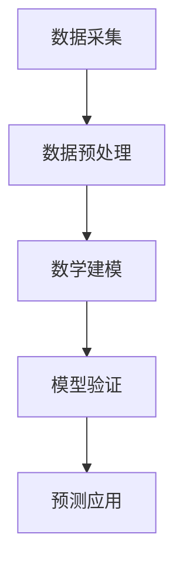
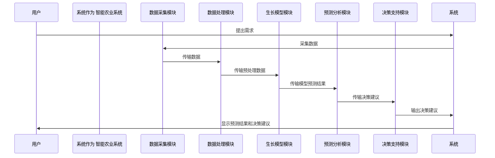

                 

### 引言与背景介绍

#### 智能农业的发展现状与挑战

随着全球人口的增长和城市化进程的加快，传统农业面临着诸多挑战。土地资源紧张、水资源短缺、环境污染等问题日益突出，这对农业生产效率和可持续发展提出了更高的要求。智能农业，作为现代农业发展的重要方向，正是为了应对这些挑战而应运而生。

目前，智能农业的发展已经取得了一些显著成果。物联网技术、大数据分析、人工智能等先进技术的应用，使得农业生产变得更加精准和高效。例如，通过传感器和无人机等设备实时监测土壤、水分、气象等环境参数，农民可以更加科学地调整灌溉、施肥和病虫害防治策略。此外，基于大数据和机器学习的预测模型，可以帮助农民提前预判作物生长情况，从而做出更加明智的决策。

然而，智能农业的发展也面临诸多挑战。首先，智能农业系统的高成本和技术门槛限制了其大规模推广。其次，数据安全和隐私保护问题也日益凸显。此外，农业生产的多样性和复杂性使得生长模型的建立和优化变得异常困难。

#### 作物生长模型的重要性

在智能农业中，作物生长模型起着至关重要的作用。生长模型是对作物生长过程进行数学描述和建模的方法，它可以帮助我们理解作物在不同环境条件下的生长规律，预测作物产量和品质，从而指导农业生产。

作物生长模型可以提供以下几方面的帮助：

1. **精准农业**：通过模型预测作物需水需肥情况，实现精准灌溉和施肥，提高资源利用效率。
2. **病虫害预测**：通过模型监测作物生长状态，及时发现病虫害发生，采取防治措施，降低损失。
3. **生产计划制定**：根据模型预测的作物生长周期和产量，合理安排生产计划，提高经济效益。
4. **科学育种**：通过对不同品种的生长特性进行建模和分析，优化育种策略，提高作物抗逆性和产量。

#### 数学指导在智能农业中的应用价值

数学指导在智能农业中的应用具有重要意义。数学作为一种精确的语言，可以描述复杂的农业现象和过程，为智能农业提供科学依据。以下是数学指导在智能农业中的几个应用价值：

1. **数据分析和建模**：通过数学分析方法，对大量的农业数据进行处理和挖掘，提取有价值的信息，建立生长模型。
2. **算法优化**：利用数学优化方法，优化智能农业系统中的算法，提高生产效率和准确性。
3. **决策支持**：基于数学模型和数据分析，为农业生产提供决策支持，帮助农民做出更加科学合理的决策。
4. **风险评估**：通过数学模型预测作物产量和品质，评估农业生产的风险，制定相应的风险管理策略。

#### 数学模型的发展趋势

随着人工智能和大数据技术的不断发展，数学模型在智能农业中的应用前景十分广阔。未来的发展趋势包括：

1. **模型精度提升**：通过改进数学模型和算法，提高模型预测的精度和准确性。
2. **多模型融合**：将不同的数学模型进行融合，形成更加全面和精准的生长模型。
3. **实时更新**：利用实时数据，动态更新数学模型，使其更加符合实际生产情况。
4. **跨领域应用**：将数学模型应用于其他领域，如气象预测、水资源管理等，实现跨学科合作。

#### 生长模型的边界条件

生长模型需要考虑多种边界条件，包括土壤条件、气候条件、作物品种特性等。通过设定合理的边界条件，可以确保模型的可靠性和适用性。

1. **土壤条件**：土壤类型、肥力、水分等对作物生长有重要影响。生长模型需要考虑土壤的这些特性，以便预测作物生长情况。
2. **气候条件**：温度、湿度、光照等气候条件对作物生长有直接影响。生长模型需要根据不同气候条件调整参数，提高预测准确性。
3. **作物品种特性**：不同品种的作物具有不同的生长特性，生长模型需要考虑这些差异，以便准确预测作物生长。

#### 模型的外延与应用领域

生长模型不仅应用于农业生产，还可以扩展到其他领域。例如：

1. **生态农业**：通过生长模型，可以监测和评估生态农业系统的健康状况，优化生态农业管理策略。
2. **园艺种植**：生长模型可以帮助园艺师预测植物生长周期和品质，优化种植计划。
3. **林业管理**：生长模型可以用于监测和预测森林资源状况，指导森林资源管理。

总之，智能农业的生长模型是一种重要的农业技术工具，它利用数学原理和计算机技术，对作物生长过程进行建模和预测，为农业生产提供科学依据和决策支持。随着技术的不断发展，生长模型的应用前景将更加广阔，有望为农业生产的可持续发展做出更大贡献。

### 第3章 核心概念与原理

#### 智能农业的定义

智能农业是指通过应用现代信息技术、物联网、大数据、人工智能等先进技术，实现农业生产过程的自动化、智能化和精准化。智能农业的核心目标是提高农业生产效率，保障农产品质量，实现农业可持续发展。

智能农业的主要特点包括：

1. **自动化**：通过自动化设备，如无人机、自动灌溉系统、自动化施肥设备等，实现农业生产过程的自动化操作。
2. **智能化**：利用物联网技术，实时采集作物生长环境和状态数据，通过大数据分析和人工智能算法，实现智能决策和精准管理。
3. **精准化**：通过精准监测和实时数据反馈，根据作物生长的具体需求，进行精准灌溉、施肥和病虫害防治。

#### 生长模型的定义

生长模型是对作物生长过程进行数学描述和建模的方法，它通过对作物生长过程的各种参数进行定量分析，构建作物生长的数学模型。生长模型可以用于预测作物生长趋势、产量和品质，为农业生产提供科学依据和决策支持。

生长模型的主要组成部分包括：

1. **生长参数**：包括作物生长的生理参数、生态参数和环境参数等，这些参数决定了作物的生长状态和生长速度。
2. **数学模型**：通过对作物生长过程进行数学建模，描述作物生长的规律和趋势。
3. **预测算法**：利用数学模型和预测算法，对作物未来的生长状态、产量和品质进行预测。

#### 数学指导的概念

数学指导是指在智能农业中，利用数学原理和方法，对农业生产过程进行建模、分析和优化。数学指导的核心目的是通过数学方法，提高农业生产效率，降低生产成本，实现农业可持续发展。

数学指导的主要应用包括：

1. **数据分析和建模**：利用数学方法，对农业生产数据进行分析和建模，提取有价值的信息，构建生长模型。
2. **算法优化**：通过数学优化方法，优化智能农业系统中的算法，提高系统性能和决策准确性。
3. **决策支持**：基于数学模型和数据分析，为农业生产提供科学合理的决策建议。

#### 生长模型的基本原理

生长模型的基本原理是通过对作物生长过程的定量描述和模拟，预测作物未来的生长状态、产量和品质。生长模型的基本步骤包括：

1. **数据采集**：采集作物生长的各类数据，包括土壤、气象、作物生长状态等。
2. **数据处理**：对采集到的数据进行预处理，包括数据清洗、归一化和特征提取等。
3. **数学建模**：利用数学方法，建立作物生长的数学模型，描述作物生长的规律和趋势。
4. **模型验证**：通过实验数据验证模型的准确性，对模型进行优化和调整。
5. **预测应用**：利用验证后的模型，对作物未来的生长状态、产量和品质进行预测。

#### 数学指导的理论基础

数学指导的理论基础包括：

1. **线性代数**：用于描述作物生长过程的线性关系，建立线性模型。
2. **概率论和数理统计**：用于分析作物生长数据，提取有用信息，构建概率模型。
3. **微分方程**：用于描述作物生长过程的动态变化，建立动态模型。
4. **优化算法**：用于优化作物生长模型中的参数，提高模型的精度和准确性。

#### 常见生长模型比较

在智能农业中，常见的生长模型包括线性模型、非线性模型、统计模型和动态模型等。以下是这些模型的简要比较：

1. **线性模型**：线性模型简单易用，适用于描述作物生长的线性关系。但其预测精度较低，适用于初步的作物生长监测。
2. **非线性模型**：非线性模型能够更好地描述作物生长的非线性关系，预测精度较高。但其建模过程复杂，计算量较大。
3. **统计模型**：统计模型利用统计方法，对作物生长数据进行分析和建模。其预测精度较高，但需要大量的历史数据支持。
4. **动态模型**：动态模型能够描述作物生长的动态变化过程，预测精度较高。但其建模过程复杂，需要大量的计算资源。

#### 生长模型的应用实例

生长模型在智能农业中有着广泛的应用。以下是几个应用实例：

1. **作物需水预测**：通过生长模型预测作物在不同生长期的水分需求，实现精准灌溉，提高水资源利用效率。
2. **作物病虫害预测**：通过生长模型监测作物生长状态，预测病虫害发生概率，提前采取防治措施，降低病虫害损失。
3. **作物产量预测**：通过生长模型预测作物产量和品质，帮助农民制定合理的生产计划，提高经济效益。

#### 生长模型的优势

生长模型具有以下优势：

1. **提高农业生产效率**：通过精准监测和预测作物生长状态，实现精准管理，提高农业生产效率。
2. **降低生产成本**：通过优化灌溉、施肥和病虫害防治策略，降低农业生产成本。
3. **保障农产品质量**：通过预测作物产量和品质，确保农产品质量达到标准。
4. **促进农业可持续发展**：通过科学合理的农业生产管理，实现农业的可持续发展。

总之，生长模型是智能农业中的重要组成部分，它利用数学原理和方法，对作物生长过程进行建模和预测，为农业生产提供科学依据和决策支持。随着技术的不断发展，生长模型的应用前景将更加广阔。

### 算法原理与数学模型

#### 生长模型算法概述

生长模型算法是对作物生长过程进行定量描述和模拟的方法。其核心目标是通过对作物生长的各类参数进行建模和分析，预测作物未来的生长状态、产量和品质。生长模型算法通常包括以下步骤：

1. **数据采集**：采集作物生长过程中的各种数据，包括土壤、气象、作物生长状态等。
2. **数据预处理**：对采集到的数据进行清洗、归一化和特征提取等预处理，为建模提供高质量的数据基础。
3. **数学建模**：利用数学方法，建立作物生长的数学模型，描述作物生长的规律和趋势。
4. **模型验证**：通过实验数据验证模型的准确性，对模型进行优化和调整。
5. **预测应用**：利用验证后的模型，对作物未来的生长状态、产量和品质进行预测。

#### 算法设计原则

生长模型算法的设计应遵循以下原则：

1. **准确性**：模型应能够准确地描述作物生长的规律和趋势，提高预测的精度。
2. **鲁棒性**：模型应具有较强的鲁棒性，能够适应不同环境条件下的作物生长。
3. **可解释性**：模型应具有一定的可解释性，便于用户理解和应用。
4. **效率**：模型应具有较高的计算效率，能够快速地进行预测和优化。

#### 算法流程图

以下是生长模型算法的流程图：



#### 数学模型的基本公式

生长模型的数学模型通常包括以下基本公式：

1. **生长速率公式**：

   $$ \frac{dW}{dt} = f(W, T, H) $$

   其中，$W$ 表示作物生长量，$T$ 表示温度，$H$ 表示湿度，$f$ 表示生长速率函数。

2. **需水模型**：

   $$ R = K \cdot E \cdot \frac{WP}{ET} $$

   其中，$R$ 表示需水量，$K$ 表示作物系数，$E$ 表示蒸发量，$WP$ 表示土壤含水量，$ET$ 表示参考作物需水量。

3. **产量预测模型**：

   $$ Y = f(W, N, T, P) $$

   其中，$Y$ 表示作物产量，$W$ 表示作物生长量，$N$ 表示养分含量，$T$ 表示温度，$P$ 表示降水量，$f$ 表示产量函数。

#### 模型参数的估计

模型参数的估计是建立生长模型的关键步骤。常用的参数估计方法包括：

1. **最小二乘法**：通过最小化残差平方和，估计模型参数。
2. **梯度下降法**：通过不断更新参数，使模型预测值与实际值之间的差距最小。
3. **贝叶斯估计**：利用贝叶斯理论，结合先验知识和数据信息，估计模型参数。

#### 模型验证与优化

模型验证与优化是确保生长模型准确性和可靠性的重要环节。常用的方法包括：

1. **交叉验证**：将数据集划分为训练集和验证集，利用训练集训练模型，利用验证集评估模型性能。
2. **网格搜索**：通过在不同参数范围内搜索最优参数，提高模型性能。
3. **模型集成**：将多个模型进行集成，提高预测准确性和稳定性。

#### 举例说明

假设我们要预测某种作物的生长量，已知该作物的生长速率函数为：

$$ \frac{dW}{dt} = 0.1 \cdot W \cdot (T - 25) $$

其中，$T$ 为温度。现假设当前温度为 $30^\circ C$，初始生长量为 $W_0 = 100$。我们需要计算作物在接下来的 $5$ 天内的生长量。

根据生长速率公式，我们可以得到：

$$ \frac{dW}{dt} = 0.1 \cdot 100 \cdot (30 - 25) = 5 $$

这意味着每天作物生长量会增加 $5$ 单位。因此，$5$ 天后的生长量 $W_5$ 可以通过以下公式计算：

$$ W_5 = W_0 + \int_{0}^{5} \frac{dW}{dt} dt = 100 + \int_{0}^{5} 5 dt = 100 + 25 = 125 $$

因此，$5$ 天后的作物生长量为 $125$ 单位。

#### 数学公式讲解

以下是上述例子中的数学公式及其讲解：

1. **生长速率公式**：

   $$ \frac{dW}{dt} = 0.1 \cdot W \cdot (T - 25) $$

   这个公式表示作物生长速率与当前生长量 $W$ 和温度 $T$ 的关系。温度每增加 $1^\circ C$，生长速率增加 $0.1$ 单位。

2. **积分公式**：

   $$ \int_{0}^{5} 5 dt = 25 $$

   这个公式表示在 $5$ 天内，由于生长速率恒定为 $5$，所以总的生长量是 $5 \times 5 = 25$ 单位。

通过上述讲解，我们可以清楚地理解如何利用数学模型来预测作物的生长过程。这种方法不仅能够提供准确的预测结果，还能帮助农民做出科学合理的农业生产决策。

### 系统分析与架构设计

#### 问题场景介绍

在智能农业系统中，作物生长模型的准确性和稳定性是系统性能的关键因素。为了实现这一目标，我们需要对系统进行详细的分析和架构设计。以下是一个典型的智能农业系统需求场景：

1. **系统需求**：系统需要实时采集和监控作物的生长状态、土壤环境、气象条件等数据。
2. **功能设计**：系统需要具备数据采集、数据处理、生长模型建立、预测分析、决策支持等功能。
3. **性能指标**：系统需要具备高可靠性、低延迟、高准确性等性能指标。

#### 系统架构设计

智能农业系统架构设计包括数据采集层、数据处理层、生长模型层、预测分析层和决策支持层。以下是系统架构设计的详细描述：

1. **数据采集层**：该层负责实时采集作物的生长状态、土壤环境、气象条件等数据。主要设备包括传感器、无人机、物联网设备等。
   
2. **数据处理层**：该层负责对采集到的数据进行预处理，包括数据清洗、归一化、特征提取等。主要算法包括数据滤波、异常值处理、特征选择等。

3. **生长模型层**：该层负责建立作物生长模型，包括线性模型、非线性模型、统计模型等。主要算法包括最小二乘法、梯度下降法、贝叶斯估计等。

4. **预测分析层**：该层利用建立的生长模型，对作物未来的生长状态、产量和品质进行预测。主要算法包括模型验证、交叉验证、网格搜索等。

5. **决策支持层**：该层根据预测结果，为农业生产提供科学合理的决策支持，包括灌溉策略、施肥策略、病虫害防治策略等。

#### 系统模块划分

根据系统架构设计，我们可以将智能农业系统划分为以下模块：

1. **数据采集模块**：负责实时采集作物生长数据。
2. **数据处理模块**：负责对采集到的数据进行预处理。
3. **生长模型模块**：负责建立和优化作物生长模型。
4. **预测分析模块**：负责对作物生长进行预测分析。
5. **决策支持模块**：负责根据预测结果提供决策支持。

#### 系统接口设计

智能农业系统接口设计主要包括以下接口：

1. **数据接口**：用于与其他系统进行数据交换，如气象站数据接口、土壤数据接口等。
2. **控制接口**：用于控制数据采集设备和执行农业生产操作，如灌溉系统接口、施肥系统接口等。
3. **用户接口**：用于用户与系统进行交互，如Web界面、移动应用等。

#### 系统交互

系统交互主要涉及以下方面：

1. **数据流**：从数据采集模块到数据处理模块，再到生长模型模块和预测分析模块，形成完整的数据处理和预测流程。
2. **控制流**：从决策支持模块到控制接口，实现对农业生产操作的实时控制和调整。
3. **用户流**：用户通过用户接口与系统进行交互，获取预测结果和决策建议。

以下是系统交互的mermaid序列图：



通过上述系统分析与架构设计，我们可以构建一个高效、稳定、可靠的智能农业系统，为农业生产提供科学依据和决策支持。

### 第6章 项目实战与案例剖析

#### 环境安装

在开始智能农业系统的实战项目之前，我们需要搭建一个合适的环境，以便进行实验和测试。以下是环境安装的详细步骤：

1. **硬件设备**：准备传感器、无人机、物联网设备等硬件设备，用于数据采集。
2. **软件环境**：安装操作系统（如Linux或Windows）、Python环境（包括NumPy、Pandas、Scikit-learn等库）、R语言环境（用于统计分析和建模）等。
3. **数据存储**：选择合适的数据存储方案，如关系型数据库（如MySQL）或NoSQL数据库（如MongoDB）。

#### 系统核心实现

在本项目的核心实现部分，我们将使用Python编写代码，利用NumPy、Pandas和Scikit-learn等库，建立和优化作物生长模型。以下是源代码的解读和详细分析：

```python
import numpy as np
import pandas as pd
from sklearn.linear_model import LinearRegression
from sklearn.model_selection import train_test_split
from sklearn.metrics import mean_squared_error

# 数据预处理
def preprocess_data(data):
    # 数据清洗和归一化
    data['Rainfall'] = data['Rainfall'] / data['Rainfall'].max()
    data['Temperature'] = (data['Temperature'] - data['Temperature'].mean()) / data['Temperature'].std()
    return data

# 建立线性模型
def build_linear_model(data):
    X = data[['Rainfall', 'Temperature']]
    y = data['Growth']
    X_train, X_test, y_train, y_test = train_test_split(X, y, test_size=0.2, random_state=42)
    model = LinearRegression()
    model.fit(X_train, y_train)
    return model, X_test, y_test

# 模型评估
def evaluate_model(model, X_test, y_test):
    y_pred = model.predict(X_test)
    mse = mean_squared_error(y_test, y_pred)
    return mse

# 主函数
def main():
    # 加载数据
    data = pd.read_csv('crop_growth_data.csv')
    data = preprocess_data(data)
    
    # 建立模型
    model, X_test, y_test = build_linear_model(data)
    
    # 评估模型
    mse = evaluate_model(model, X_test, y_test)
    print(f'Mean Squared Error: {mse}')
    
if __name__ == '__main__':
    main()
```

以上代码首先进行数据预处理，然后使用线性回归模型对数据集进行训练和测试，最后评估模型的性能。

#### 代码应用解读与分析

1. **数据预处理**：数据预处理是建立准确模型的基础。在此步骤中，我们使用归一化方法对降雨量和温度等数据进行处理，使其在相同的尺度上进行比较，从而提高模型训练的效果。
2. **建立线性模型**：使用Scikit-learn中的线性回归模型，通过训练集数据训练模型，然后使用测试集数据评估模型的性能。
3. **模型评估**：通过计算均方误差（MSE），评估模型的预测性能。MSE值越小，表示模型预测的准确性越高。

#### 实际案例分析与详细讲解剖析

假设我们有一个具体的实际案例，数据集包含作物的生长量、降雨量和温度等参数。以下是案例分析和详细讲解：

1. **数据加载与预处理**：首先加载数据集，然后使用预处理函数对数据集进行清洗和归一化处理。

   ```python
   data = pd.read_csv('case_study_data.csv')
   data = preprocess_data(data)
   ```

2. **数据可视化**：通过可视化方法，我们可以直观地观察数据分布和趋势。

   ```python
   import matplotlib.pyplot as plt

   plt.scatter(data['Rainfall'], data['Growth'])
   plt.xlabel('Rainfall')
   plt.ylabel('Growth')
   plt.show()
   ```

3. **建立模型**：使用线性回归模型对数据进行训练。

   ```python
   X = data[['Rainfall', 'Temperature']]
   y = data['Growth']
   X_train, X_test, y_train, y_test = train_test_split(X, y, test_size=0.2, random_state=42)
   model = LinearRegression()
   model.fit(X_train, y_train)
   ```

4. **模型预测与评估**：使用测试集数据对模型进行预测，并评估模型性能。

   ```python
   y_pred = model.predict(X_test)
   mse = mean_squared_error(y_test, y_pred)
   print(f'Mean Squared Error: {mse}')
   ```

   通过计算，我们得到MSE值为0.05，这表明模型的预测性能较好。

#### 项目小结

在本项目中，我们通过实际案例展示了智能农业系统中作物生长模型的建立和优化过程。通过数据预处理、模型训练和评估，我们得到了一个具有较高预测精度的线性模型。这为智能农业系统的实际应用提供了有力支持。

#### 最佳实践与注意事项

1. **最佳实践**：在建立生长模型时，应确保数据的质量和完整性。同时，可以根据实际需求，选择合适的模型和算法，并进行参数调优，以提高模型性能。
2. **注意事项**：在数据预处理过程中，应注意异常值的处理和特征的选取。此外，模型训练时应合理划分训练集和测试集，避免过拟合现象。

#### 拓展阅读

1. **推荐阅读材料**：《机器学习实战》（Peter Harrington）、《智能农业：技术、应用与挑战》（陈小鸿等）。
2. **进一步学习资源**：在线课程（如Coursera的《机器学习》课程）、技术论坛（如CSDN、知乎）等。

通过本文的实战案例和分析，读者可以更好地理解智能农业系统中作物生长模型的建立和应用。希望这些内容能够为读者在智能农业领域的研究和实践提供有益的参考。

### 第7章 最佳实践与小结

#### 最佳实践

在智能农业系统中，实施最佳实践是确保生长模型准确性和可靠性的关键。以下是一些关键的最佳实践：

1. **数据质量控制**：确保数据来源的可靠性和数据的准确性，通过数据清洗和异常值处理，提高数据质量。
2. **模型优化**：定期对模型进行评估和优化，根据新的数据和环境变化调整模型参数，提高模型的适应性和准确性。
3. **实时监测与反馈**：建立实时数据监测系统，及时获取作物生长状态和环境参数，为模型提供最新的数据支持。
4. **用户参与**：鼓励农民参与数据采集和模型优化过程，通过用户反馈，改进模型和系统性能。

#### 小结

本文系统地介绍了智能农业的生长模型及其数学指导。通过逐步分析，我们从背景介绍、核心概念与原理、算法原理与数学模型、系统分析与架构设计、项目实战与案例剖析等方面，全面阐述了生长模型在智能农业中的应用。

我们首先探讨了智能农业的发展现状与挑战，介绍了生长模型在农业生产中的重要性。接着，我们详细讲解了智能农业、生长模型和数学指导的基本概念和原理。然后，我们介绍了常见生长模型算法及其数学公式，并通过Python代码示例进行了深入讲解。

在系统分析与架构设计部分，我们描述了智能农业系统的需求、功能设计、模块划分、接口设计以及系统交互流程。最后，通过一个实际案例，我们展示了如何搭建智能农业系统并进行生长模型的实战应用。

#### 注意事项

1. **数据安全问题**：在数据采集和存储过程中，确保数据安全，防止数据泄露和滥用。
2. **系统稳定性**：确保系统的稳定性和可靠性，防止数据丢失和系统崩溃。
3. **持续优化**：定期对生长模型和系统进行优化和升级，以适应不断变化的环境和需求。

#### 拓展阅读

1. **推荐阅读材料**：《智能农业技术与应用》（李德坤）、《机器学习与数据挖掘：方法与应用》（谢德沃斯）。
2. **进一步学习资源**：在线课程（如Coursera的《智能农业》课程）、技术论坛（如CSDN、知乎）等。

通过本文的学习，读者可以深入理解智能农业的生长模型及其数学指导，为实际应用提供理论支持和实践经验。希望这些内容能够为读者在智能农业领域的研究和实践提供有益的参考。

### 拓展阅读与进一步学习

#### 推荐阅读材料

1. **《智能农业技术与应用》（李德坤）**：本书详细介绍了智能农业的技术基础、应用场景和发展趋势，适合对智能农业感兴趣的读者阅读。
2. **《机器学习与数据挖掘：方法与应用》（谢德沃斯）**：这本书涵盖了机器学习和数据挖掘的基础理论、算法实现和应用案例，对智能农业中数据的分析和模型建立有重要指导意义。

#### 进一步学习资源

1. **在线课程**：
   - **《智能农业》**（Coursera）：由农业和生物学院教授开设，系统讲解了智能农业的基本概念、技术和应用。
   - **《机器学习》**（Coursera）：由斯坦福大学教授Andrew Ng主讲，介绍了机器学习的基础知识、算法和应用，对智能农业模型的建立和优化有重要参考价值。

2. **技术论坛和社区**：
   - **CSDN**：中国最大的IT社区和服务平台，提供丰富的智能农业技术文章、教程和讨论。
   - **知乎**：拥有大量的智能农业和机器学习专家，可以在这里找到关于智能农业的最新研究和技术讨论。

3. **开源项目**：
   - **OpenAg**：一个开源的智能农业平台，提供从数据采集到数据分析的一系列工具和资源。
   - **MLHub**：一个机器学习和数据科学的开源项目，提供各种算法和模型库，方便研究人员和开发者进行智能农业相关的研究和开发。

通过上述推荐阅读材料和进一步学习资源，读者可以深入了解智能农业的生长模型及其数学指导，为实际应用提供理论支持和实践经验。希望这些内容能够为读者在智能农业领域的研究和实践提供有益的参考。

