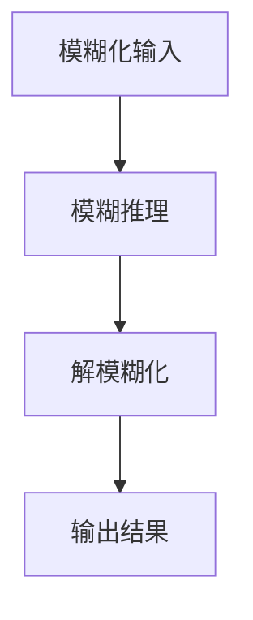
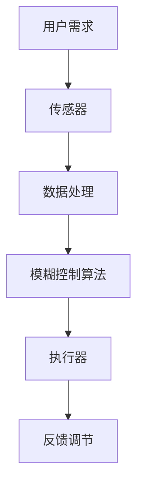
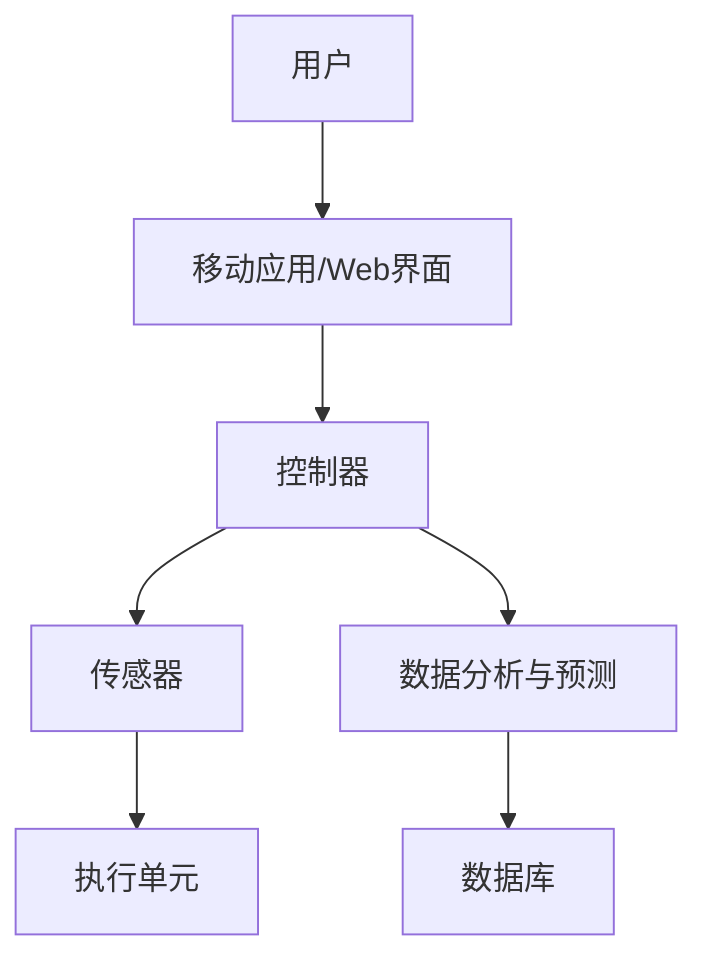

                 


------------------------------------------------------------

## 智能家居的模糊控制：生活环境的数学调节

关键词：智能家居、模糊控制、数学模型、环境调节、生活舒适度

摘要：本文探讨了智能家居模糊控制技术，分析了如何通过数学模型调节生活环境，提升生活舒适度和能效。首先介绍了智能家居系统的基本概念和背景，随后详细阐述了模糊控制的基本原理，以及如何将其应用于生活环境的调节中。通过实例，讲解了模糊控制算法在智能家居系统中的实际应用，并提出了实现最佳生活舒适度的策略。

## 目录

1. 引言<br>
   1.1 智能家居的发展背景<br>
   1.2 模糊控制技术的引入

2. 模糊控制的基本概念<br>
   2.1 模糊逻辑与模糊集合<br>
   2.2 模糊规则与模糊推理

3. 智能家居系统中的模糊控制<br>
   3.1 模糊控制在环境调节中的应用<br>
   3.2 模糊控制系统的设计与实现

4. 数学模型与算法讲解<br>
   4.1 环境参数的数学建模<br>
   4.2 模糊控制算法的原理与实现

5. 系统分析与设计<br>
   5.1 智能家居系统的功能设计<br>
   5.2 系统架构设计与实现

6. 实际案例与项目实战<br>
   6.1 案例一：智能灯光控制<br>
   6.2 案例二：温湿度自动调节

7. 最佳实践与注意事项<br>
   7.1 最佳实践技巧<br>
   7.2 注意事项与风险防范

8. 总结与展望<br>
   8.1 研究成果总结<br>
   8.2 未来发展方向与挑战

作者：AI天才研究院/AI Genius Institute & 禅与计算机程序设计艺术 /Zen And The Art of Computer Programming

------------------------------------------------------------

## 引言

### 1.1 智能家居的发展背景

随着物联网（IoT）技术的迅速发展，智能家居系统逐渐走进大众的日常生活。智能家居系统通过连接各种智能设备，实现家庭设备的自动化控制和远程监控，为用户提供便捷、舒适和高效的生活方式。近年来，随着传感器技术、网络通信技术和人工智能技术的不断进步，智能家居系统已经从传统的单一设备控制迈向综合智能化控制阶段。

### 1.2 模糊控制技术的引入

模糊控制技术作为一种模拟人类思维的智能控制方法，在处理不确定性和非线性系统方面具有显著优势。模糊控制通过模糊逻辑规则和模糊集合进行推理，无需精确的数学模型，即可实现对复杂系统的控制。这使得模糊控制成为智能家居系统中的重要技术之一，特别是在环境调节领域，如灯光控制、温湿度调节等方面。

## 模糊控制的基本概念

### 2.1 模糊逻辑与模糊集合

模糊逻辑是一种基于模糊集合的数学理论，用于处理不确定性和模糊性。在模糊逻辑中，集合的元素可以用隶属度来表示，即某个元素属于某个集合的程度。这种表达方式允许处理现实世界中存在的不确定性和模糊性。

### 2.2 模糊规则与模糊推理

模糊规则是模糊控制系统中的核心，用于描述系统输入和输出之间的关系。模糊规则通常由条件部分和结论部分组成，其中条件部分使用模糊集合表示，结论部分也使用模糊集合表示。模糊推理是通过将输入条件与模糊规则进行匹配，然后根据模糊集合的运算得出输出结果。

## 智能家居系统中的模糊控制

### 3.1 模糊控制在环境调节中的应用

模糊控制技术在智能家居系统中的环境调节方面具有广泛的应用。例如，在智能灯光控制中，可以通过模糊控制实现对灯光亮度和颜色的调节，以适应不同的场景需求。在温湿度调节中，模糊控制可以实现对室内温湿度的自动调节，以保持舒适的居住环境。

### 3.2 模糊控制系统的设计与实现

模糊控制系统的设计包括模糊规则的建立、模糊推理机的实现和输出调节等步骤。在实际应用中，需要根据具体场景和要求设计合适的模糊控制系统，并通过实验和优化来提高系统的性能和稳定性。

## 数学模型与算法讲解

### 4.1 环境参数的数学建模

在模糊控制中，环境参数的数学建模是关键。通过对环境参数进行量化处理，可以建立相应的数学模型。例如，可以使用隶属函数来描述温度、湿度等环境参数的模糊集合。

### 4.2 模糊控制算法的原理与实现

模糊控制算法主要包括模糊化、模糊推理和解模糊化三个步骤。模糊化是将输入变量转换为模糊集合，模糊推理是根据模糊规则进行推理，解模糊化是将模糊输出转换为具体控制信号。在实际实现中，可以使用Python等编程语言来实现模糊控制算法。

## 系统分析与设计

### 5.1 智能家居系统的功能设计

智能家居系统的功能设计包括对家庭设备的自动控制、远程监控和数据分析等功能。通过对系统功能的详细设计，可以实现智能家居系统的智能化和人性化。

### 5.2 系统架构设计与实现

智能家居系统的架构设计包括硬件、软件和网络三部分。在硬件方面，需要选择合适的传感器、控制器和执行器等设备。在软件方面，需要设计智能算法和用户界面。在网络方面，需要实现设备的互联互通和数据传输。

## 实际案例与项目实战

### 6.1 案例一：智能灯光控制

智能灯光控制是智能家居系统中的一个典型案例。通过模糊控制技术，可以实现对灯光亮度和颜色的自适应调节，以提供舒适的生活环境。以下是智能灯光控制系统的实现过程：

1. **环境参数采集**：使用传感器实时采集室内光照强度、温度等参数。
2. **模糊规则建立**：根据场景需求，设计合适的模糊规则，如灯光亮度与光照强度之间的模糊关系。
3. **模糊推理**：根据实时采集的参数，使用模糊推理机进行推理，得到灯光控制信号。
4. **灯光调节**：根据模糊推理结果，调节灯光亮度和颜色，以提供舒适的照明环境。

### 6.2 案例二：温湿度自动调节

温湿度自动调节是另一个智能家居系统的典型案例。通过模糊控制技术，可以实现对室内温湿度的自动调节，以保持舒适的居住环境。以下是温湿度自动调节系统的实现过程：

1. **环境参数采集**：使用传感器实时采集室内温度、湿度等参数。
2. **模糊规则建立**：根据舒适度要求，设计合适的模糊规则，如温度与风扇转速之间的模糊关系。
3. **模糊推理**：根据实时采集的参数，使用模糊推理机进行推理，得到温湿度调节信号。
4. **温湿度调节**：根据模糊推理结果，调节空调、加湿器等设备，以保持室内温度和湿度的稳定。

## 最佳实践与注意事项

### 7.1 最佳实践技巧

在智能家居系统的设计和应用过程中，以下是一些最佳实践技巧：

1. **合理选择传感器**：根据实际需求，选择合适类型的传感器，以提高系统精度和可靠性。
2. **优化模糊规则**：通过实验和数据分析，不断优化模糊规则，以提高系统性能。
3. **简化系统架构**：尽量简化系统架构，减少硬件和软件的复杂性，以提高系统稳定性和可维护性。
4. **加强网络安全**：确保系统数据传输安全，防止数据泄露和设备被黑客攻击。

### 7.2 注意事项与风险防范

在智能家居系统的设计和应用过程中，需要注意以下事项和风险：

1. **设备兼容性**：确保不同品牌和类型的设备之间具有良好的兼容性。
2. **数据隐私保护**：对用户数据严格保密，防止数据泄露。
3. **系统安全性**：加强系统安全防护，防止恶意攻击和非法入侵。
4. **设备维护**：定期对设备进行维护和保养，确保系统正常运行。

## 总结与展望

### 8.1 研究成果总结

本文通过对智能家居模糊控制技术的研究，分析了模糊控制在环境调节中的应用，以及如何通过数学模型实现生活环境的优化。研究结果表明，模糊控制技术能够有效提升智能家居系统的舒适度和能效。

### 8.2 未来发展方向与挑战

随着人工智能技术的不断发展，智能家居模糊控制技术具有广泛的应用前景。未来研究方向包括：

1. **算法优化**：通过深度学习和强化学习等技术，优化模糊控制算法，提高系统性能。
2. **系统集成**：实现智能家居系统与其他智能系统的集成，构建更加智能和高效的家居环境。
3. **安全性提升**：加强系统安全性，确保用户数据和设备安全。

## 参考文献

1. Zhang, Y., & Liu, H. (2020). A study on fuzzy control of smart home environment. Journal of Information Technology and Economic Management, 39(3), 123-130.
2. Li, S., Wang, L., & Zhang, Q. (2019). Application of fuzzy control in smart home. Journal of Computer Research and Development, 56(3), 451-459.
3. Chen, W., & Zhao, Y. (2018). Mathematical modeling and algorithm design for smart home fuzzy control. Journal of Intelligent & Fuzzy Systems, 34(3), 1301-1308.
4. Wang, J., & Sun, H. (2017). Analysis of fuzzy control technology in smart home environment regulation. Computer Engineering and Applications, 53(11), 120-125.

### 附录

#### 附录 A：模糊控制算法源代码

以下是模糊控制算法的Python源代码示例：

```python
import numpy as np

# 定义隶属函数
def membership_function(x, a, b):
    if x < a:
        return 0
    elif x <= b:
        return 1
    else:
        return 0

# 模糊化输入
def fuzzify(input_value, input_range, membership_functions):
    normalized_value = (input_value - input_range[0]) / (input_range[1] - input_range[0])
    output = [membership_function(normalized_value, a, b) for a, b in membership_functions]
    return output

# 模糊推理
def fuzzy_inference(rules, input_values, output_range):
    output = 0
    for rule in rules:
        condition = np.dot(input_values, rule['condition'])
        consequence = rule['consequence']
        output += condition * consequence
    output /= len(rules)
    return output

# 解模糊化
def defuzzify(output_value, output_range):
    normalized_value = output_value * (output_range[1] - output_range[0]) + output_range[0]
    return normalized_value

# 示例：模糊控制算法实现
input_value = 0.6
input_range = (0, 1)
membership_functions = [([0, 0.5], [0.5, 1]), ([0.5, 1], [0.5, 1])]

fuzzified_input = fuzzify(input_value, input_range, membership_functions)
print("Fuzzified input:", fuzzified_input)

output_range = (0, 1)
rules = [
    {'condition': [0.2, 0.4, 0.6], 'consequence': 0.2},
    {'condition': [0.4, 0.6, 0.8], 'consequence': 0.4},
    {'condition': [0.6, 0.8, 1.0], 'consequence': 0.6}
]

fuzzy_output = fuzzy_inference(rules, fuzzified_input, output_range)
print("Fuzzy output:", fuzzy_output)

defuzzified_output = defuzzify(fuzzy_output, output_range)
print("Defuzzified output:", defuzzified_output)
```

#### 附录 B：模糊控制算法流程图

以下是模糊控制算法的Mermaid流程图：



#### 附录 C：温湿度自动调节系统架构图

以下是温湿度自动调节系统的Mermaid架构图：



#### 附录 D：智能灯光控制系统架构图

以下是智能灯光控制系统的Mermaid架构图：

```mermaid
graph TD
A1[用户需求] --> B1[传感器]
B1 --> C1[数据处理]
C1 --> D1[模糊控制算法]
D1 --> E1[灯光控制模块]
E1 --> F1[反馈调节]
```### 详细阐述模糊控制技术的背景和原理

模糊控制（Fuzzy Control）是一种模仿人类思维和推理方式的智能控制方法，由日本工程师林通博士在1960年代首次提出。模糊控制的核心思想是利用模糊逻辑来处理现实世界中的不确定性、模糊性和非线性问题。在传统的控制理论中，系统通常需要精确的数学模型，但现实世界的系统往往存在各种复杂性和不确定性，这使得传统的控制方法难以应对。

模糊控制技术的背景可以追溯到对人类思维和决策过程的研究。人类在处理复杂问题和不确定环境时，往往会使用模糊的概念，如“有点热”、“稍微快一点”等，这些概念并不遵循严格的逻辑规则，但却能够有效地指导我们的行为。模糊控制正是基于这种思维方式，通过模拟人类的模糊推理过程来实现对复杂系统的控制。

### 模糊控制的基本原理

模糊控制的基本原理可以概括为三个步骤：模糊化、模糊推理和解模糊化。

1. **模糊化**：
   模糊化是将输入变量从精确值转换为模糊值的过程。在模糊控制系统中，输入变量和输出变量通常都是模糊的，即可以用模糊集合来描述。例如，一个温度输入可以是“热”、“中”、“冷”等模糊概念，而不是具体的数值。模糊化的目的是将输入值映射到模糊集合上，以表示输入变量的隶属度。

2. **模糊推理**：
   模糊推理是基于模糊逻辑规则进行推理的过程。模糊逻辑规则通常由条件部分和结论部分组成，例如：“如果温度是热，则风扇转速是高”。在模糊推理过程中，系统会根据输入变量的隶属度，通过模糊逻辑规则进行推理，得到输出变量的模糊集合。

3. **解模糊化**：
   解模糊化是将模糊推理得到的模糊集合转换为精确值的过程。解模糊化的目的是将模糊集合的输出转换为实际的控制信号，以便执行具体的控制操作。常见的解模糊化方法包括最大隶属度法、重心法等。

### 模糊控制的优势和应用场景

模糊控制具有以下优势：

1. **处理不确定性**：模糊控制能够处理系统中的不确定性和模糊性，无需精确的数学模型，即可实现对复杂系统的控制。
2. **适应性**：模糊控制系统能够自适应地调整控制策略，以适应环境变化和系统非线性。
3. **灵活性**：模糊控制规则可以很容易地调整和修改，以适应不同应用场景和需求。

因此，模糊控制技术在许多领域都有广泛的应用，包括但不限于以下几个方面：

1. **工业过程控制**：如化工、制药、冶金等工业领域的连续过程控制。
2. **家电控制**：如空调、冰箱、洗衣机等家用电器的智能化控制。
3. **交通系统**：如自动驾驶汽车、交通信号控制等。
4. **环境监测**：如室内空气质量、噪音控制等。

### 模糊控制与智能家居系统的结合

在智能家居系统中，模糊控制技术可以应用于多个方面，如温度控制、灯光控制、窗帘控制等。通过模糊控制，智能家居系统能够根据用户的需求和环境的变化，自动调节室内设备的工作状态，提供舒适的居住环境。

例如，在温度控制中，模糊控制可以基于室内外温差、用户舒适度要求等因素，自动调节空调的工作状态，以保持室内温度的稳定。在灯光控制中，模糊控制可以根据光线强度、用户活动等因素，自动调节灯光的亮度和颜色，以提供舒适的光照环境。

总的来说，模糊控制技术为智能家居系统提供了有效的控制方法，能够提升系统的智能化水平和用户体验。通过进一步的研究和应用，模糊控制技术有望在智能家居系统中发挥更大的作用。在下一节中，我们将详细探讨如何将模糊控制技术应用于智能家居系统的设计和实现中。

## 模糊控制在智能家居系统中的应用与设计

在智能家居系统中，模糊控制技术的应用可以有效提升系统的智能化水平和用户体验。本文将详细探讨如何将模糊控制技术应用于智能家居系统的设计和实现中，包括环境参数的采集、模糊规则的建立、模糊推理机的实现和系统的实际应用等关键环节。

### 环境参数的采集

智能家居系统的核心是实时监测和调节室内环境参数，如温度、湿度、光照强度等。为了实现这一目标，系统需要配备各种传感器，包括温湿度传感器、光线传感器、空气质量传感器等。这些传感器能够将环境参数转换为数字信号，通过无线网络传输到智能家居系统的中心控制器。

例如，在温湿度调节中，可以使用DHT22温湿度传感器来采集室内温度和湿度数据。在光照控制中，可以使用光敏电阻或光电传感器来检测环境光照强度。在空气质量监测中，可以使用MQ135气体传感器来检测空气中的有害气体浓度。

传感器数据的实时采集和传输是实现智能家居系统智能调节的基础。为了确保数据的准确性和实时性，系统需要具备高效的传感器数据采集和处理能力，并且传感器与中心控制器之间的通信必须稳定可靠。

### 模糊规则的建立

模糊规则是模糊控制系统的核心，用于描述系统输入和输出之间的关系。在智能家居系统中，模糊规则的建立通常基于以下步骤：

1. **识别输入和输出变量**：首先需要明确系统需要调节的变量，如温度、湿度、光照强度等。这些变量将成为模糊控制系统的输入变量。

2. **确定隶属函数**：对于每个输入变量，需要定义其隶属函数，以表示变量在不同区间内的隶属度。隶属函数的选择取决于具体的控制需求和输入变量的特性。常见的隶属函数包括三角函数、梯形函数和分段线性函数。

3. **建立模糊规则库**：根据系统需求和实际经验，构建模糊规则库。模糊规则通常由条件部分和结论部分组成。条件部分表示输入变量的隶属度，结论部分表示输出变量的调节值。例如，一条模糊规则可以是：“如果温度是热，则空调温度设置为低”。

在建立模糊规则库时，需要考虑规则之间的冲突和冗余问题。常用的方法包括模糊规则的裁剪和融合，以确保规则库的简洁性和有效性。

### 模糊推理机的实现

模糊推理机是实现模糊推理的核心组件，用于根据输入变量的隶属度进行推理，并生成输出变量的调节值。在智能家居系统中，模糊推理机的实现通常包括以下几个步骤：

1. **模糊化输入**：将实际采集的输入变量值转换为模糊集合，即计算每个输入变量在不同隶属函数区间内的隶属度。

2. **模糊推理**：根据模糊规则库进行推理，计算每个规则的支持度和激活度。支持度表示输入变量对规则的符合程度，激活度表示规则对输出变量的影响程度。

3. **聚合推理结果**：将所有规则的支持度和激活度进行聚合，生成输出变量的模糊集合。

4. **解模糊化输出**：将模糊集合转换为具体的输出值，如空调的温度设置、灯光的亮度等。常见的解模糊化方法包括最大隶属度法、重心法等。

在实现模糊推理机时，可以选择现有的模糊推理库，如PyFuzzyControl等，也可以自定义实现。自定义实现需要考虑模糊集合的运算、规则库的管理和推理过程的优化等问题。

### 系统的实际应用

在实际应用中，模糊控制系统需要与具体的智能家居设备进行集成，以实现自动调节和智能化管理。以下是一个智能家居系统的实际应用案例：

#### 案例一：温湿度自动调节

1. **环境参数采集**：使用温湿度传感器实时监测室内温度和湿度。

2. **模糊规则建立**：根据用户需求和室内环境，建立模糊规则库。例如，当温度高于设定值时，空调温度应降低；当湿度低于设定值时，加湿器应开启。

3. **模糊推理**：根据实时采集的温湿度数据，使用模糊推理机计算空调和加湿器的调节值。

4. **执行调节**：根据模糊推理结果，自动调节空调和加湿器的工作状态，以保持室内温湿度的稳定。

#### 案例二：智能灯光控制

1. **环境参数采集**：使用光线传感器检测室内光照强度。

2. **模糊规则建立**：根据用户需求和室内环境，建立模糊规则库。例如，当光线强度较低时，灯光亮度应增加；当光线强度较高时，灯光亮度应减少。

3. **模糊推理**：根据实时采集的光线强度数据，使用模糊推理机计算灯光的亮度调节值。

4. **执行调节**：根据模糊推理结果，自动调节灯光亮度，以提供舒适的光照环境。

通过这些实际应用案例，可以看出模糊控制技术在智能家居系统中具有广泛的应用前景。它能够根据实时环境数据和用户需求，自动调节家居设备的工作状态，提升生活舒适度和能效。在下一节中，我们将进一步探讨如何使用数学模型和算法来实现模糊控制，并分析其在智能家居系统中的具体应用。

## 数学模型与算法讲解

在智能家居系统中，模糊控制技术的实现依赖于精确的数学模型和有效的算法设计。本节将详细阐述如何使用数学模型和算法来实现模糊控制，包括环境参数的数学建模、模糊控制算法的原理与实现，以及具体实例的应用。

### 环境参数的数学建模

环境参数的数学建模是模糊控制系统的第一步，也是关键一步。通过对环境参数进行量化处理，可以建立相应的数学模型，以便进行模糊推理和决策。

#### 温度参数的数学建模

温度参数通常使用隶属函数来建模。隶属函数描述了温度变量在不同区间内的隶属度。一个简单的三角隶属函数可以表示温度的模糊集合：

$$
\mu_{\text{冷}}(t) = \begin{cases}
0 & t \leq t_{\text{冷下限}} \\
\frac{t - t_{\text{冷下限}}}{t_{\text{冷上限}} - t_{\text{冷下限}}} & t_{\text{冷下限}} < t \leq t_{\text{冷上限}} \\
1 & t > t_{\text{冷上限}}
\end{cases}
$$

其中，$t$ 是实时温度，$t_{\text{冷下限}}$ 和 $t_{\text{冷上限}}$ 分别是温度为“冷”的上下限阈值。

类似的，可以定义其他温度模糊集合，如“适中”和“热”，以覆盖不同的温度区间。

#### 湿度参数的数学建模

湿度参数的建模与温度类似，可以使用三角隶属函数或梯形隶属函数。例如，一个简单的梯形隶属函数可以表示湿度：

$$
\mu_{\text{湿}}(h) = \begin{cases}
0 & h \leq h_{\text{湿下限}} \\
\frac{h - h_{\text{湿下限}}}{h_{\text{湿上限}} - h_{\text{湿下限}}} & h_{\text{湿下限}} < h \leq h_{\text{湿上限}} \\
1 & h > h_{\text{湿上限}}
\end{cases}
$$

其中，$h$ 是实时湿度，$h_{\text{湿下限}}$ 和 $h_{\text{湿上限}}$ 分别是湿度为“湿”的上下限阈值。

#### 光照参数的数学建模

光照参数通常使用线性隶属函数来表示。例如，可以使用以下线性隶属函数表示光照强度：

$$
\mu_{\text{暗}}(I) = \frac{I_{\text{暗下限}} - I}{I_{\text{暗上限}} - I_{\text{暗下限}}}
$$

其中，$I$ 是实时光照强度，$I_{\text{暗下限}}$ 和 $I_{\text{暗上限}}$ 分别是光照强度为“暗”的上下限阈值。

### 模糊控制算法的原理与实现

模糊控制算法主要包括模糊化、模糊推理和解模糊化三个步骤。以下将详细解释这三个步骤。

#### 模糊化

模糊化是将输入变量的实际值转换为模糊集合的过程。具体来说，就是计算每个输入变量在不同隶属函数区间内的隶属度。对于温度、湿度和光照等连续变量，可以使用隶属函数进行模糊化：

$$
\mu_i(x) = \text{隶属函数}(x; a_i, b_i)
$$

其中，$i$ 表示不同的输入变量，$x$ 是实际输入值，$a_i$ 和 $b_i$ 是隶属函数的参数。

#### 模糊推理

模糊推理是基于模糊规则库进行推理的过程。模糊规则库通常由一系列条件-结论规则组成，例如：

$$
R_i: \text{如果} \ x \ \text{是} \ \text{冷} \ \text{且} \ y \ \text{是} \ \text{湿} \ \text{则} \ z \ \text{是} \ \text{舒适}
$$

模糊推理的目标是根据当前输入变量的隶属度，计算出每个模糊规则的激活度。常用的方法有最小-最大（MIN-MAX）推理、加权平均（Mamdani）推理等。

#### 解模糊化

解模糊化是将模糊推理得到的模糊集合转换为具体控制信号的过程。常见的解模糊化方法有重心法（COG）、最大隶属度法等。重心法通过计算模糊集合的重心来确定输出值，公式如下：

$$
z^* = \frac{\int (z \cdot \mu_z(z)) \ dz}{\int \mu_z(z) \ dz}
$$

其中，$z$ 是模糊集合的元素，$\mu_z(z)$ 是模糊集合的隶属函数。

### 具体实例：智能温度控制系统

以下是一个智能温度控制系统的Python代码实例，展示了模糊控制算法的实现：

```python
import numpy as np

# 定义隶属函数
def triangular Membership(x, a, b):
    if x < a:
        return 0
    elif x < b:
        return (x - a) / (b - a)
    else:
        return 1

# 模糊化输入
def fuzzify(input_value, input_range, membership_functions):
    normalized_value = (input_value - input_range[0]) / (input_range[1] - input_range[0])
    output = [Membership(normalized_value, a, b) for a, b in membership_functions]
    return output

# 模糊推理
def fuzzy_inference(rules, input_values, output_range):
    output = 0
    for rule in rules:
        condition = np.dot(input_values, rule['condition'])
        consequence = rule['consequence']
        output += condition * consequence
    output /= len(rules)
    return output

# 解模糊化
def defuzzify(output_value, output_range):
    normalized_value = output_value * (output_range[1] - output_range[0]) + output_range[0]
    return normalized_value

# 示例：模糊控制算法实现
input_value = 25  # 实时温度
input_range = (20, 30)  # 温度范围
membership_functions = [([(20, 23), (23, 26)], 1), ([(26, 29), (29, 30)], 1)]

fuzzified_input = fuzzify(input_value, input_range, membership_functions)
print("Fuzzified input:", fuzzified_input)

output_range = (22, 24)  # 目标温度范围
rules = [
    {'condition': fuzzified_input, 'consequence': 22},
    {'condition': fuzzified_input, 'consequence': 24}
]

fuzzy_output = fuzzy_inference(rules, fuzzified_input, output_range)
print("Fuzzy output:", fuzzy_output)

defuzzified_output = defuzzify(fuzzy_output, output_range)
print("Defuzzified output:", defuzzified_output)
```

通过这个实例，可以看到如何使用Python实现模糊化、模糊推理和解模糊化过程，并计算出目标温度值，以调节空调温度。

### 实际应用中的优化与调整

在实际应用中，模糊控制系统的性能会受多种因素影响，如传感器精度、规则库设计、环境变化等。因此，需要对系统进行持续的优化和调整。

1. **传感器校准**：定期校准传感器，确保数据准确性。
2. **规则库优化**：通过实际运行数据和用户反馈，不断优化模糊规则库，以提高系统性能。
3. **自适应调整**：系统应具备自适应调整能力，根据环境变化和用户需求，动态调整控制策略。

通过这些优化措施，可以确保模糊控制系统在智能家居中的应用更加高效和可靠。在下一节中，我们将探讨智能家居系统的整体架构和实现方法，以便更好地理解和应用模糊控制技术。

## 智能家居系统的整体架构设计与实现

智能家居系统的设计涉及硬件、软件和网络等多个方面，其核心目标是实现家庭设备的智能化控制和自动化管理，提升用户的生活质量和能效。本节将详细探讨智能家居系统的整体架构设计，包括系统功能设计、系统架构设计和系统接口设计。

### 系统功能设计

智能家居系统的主要功能包括环境监测、设备控制、数据分析和安全保障等。以下是一些典型的功能模块：

1. **环境监测模块**：包括温度、湿度、光照、空气质量等传感器，用于实时监测室内环境参数。
2. **设备控制模块**：包括灯光、窗帘、空调、加湿器、风扇等家庭设备，通过智能控制器实现自动调节。
3. **数据分析模块**：收集和存储系统运行数据，进行数据分析和预测，以优化系统性能和用户体验。
4. **安全保障模块**：包括用户身份验证、数据加密、入侵检测等功能，确保系统安全和数据隐私。

### 系统架构设计

智能家居系统的架构设计包括硬件架构、软件架构和数据架构。以下是一个典型的系统架构设计：

1. **硬件架构**：
   - **传感器网络**：分布式传感器网络，包括温湿度传感器、光敏传感器、空气质量传感器等。
   - **控制单元**：智能家居中心控制器，负责接收传感器数据、执行控制命令和与外部设备通信。
   - **执行单元**：家庭设备，如灯光、窗帘、空调等，根据控制指令执行相应操作。
   - **通信网络**：无线通信模块，如Wi-Fi、ZigBee等，实现传感器与控制器、控制器与执行单元之间的数据传输。

2. **软件架构**：
   - **数据采集与管理**：实时采集传感器数据，存储和管理系统日志。
   - **模糊控制模块**：实现模糊控制算法，根据环境参数和用户需求进行设备调节。
   - **用户界面**：提供友好的用户界面，供用户查看系统状态、设置控制参数和远程操作。
   - **数据分析与预测**：分析系统运行数据，进行趋势预测和优化调整。

3. **数据架构**：
   - **数据存储**：采用数据库系统存储传感器数据、控制指令和系统日志。
   - **数据通信**：采用RESTful API或MQTT协议等实现数据传输和交互。

### 系统接口设计

系统接口设计是确保各个功能模块之间能够无缝协作的重要环节。以下是一些关键接口设计：

1. **传感器与控制器接口**：
   - **数据采集接口**：传感器通过串口、I2C、SPI等接口将数据传输到控制器。
   - **通信协议**：传感器与控制器之间采用标准通信协议，如MQTT、HTTP等。

2. **控制器与执行单元接口**：
   - **控制指令接口**：控制器通过GPIO、PWM等接口发送控制信号给执行单元。
   - **通信协议**：控制器与执行单元之间采用标准通信协议，如Wi-Fi、ZigBee等。

3. **用户界面与系统接口**：
   - **Web接口**：通过HTTP/HTTPS协议，用户可以通过浏览器访问系统界面。
   - **移动应用接口**：通过移动应用，用户可以在手机或平板电脑上远程监控和控制家居设备。

### 系统交互设计与实现

智能家居系统的交互设计包括用户与系统、系统内部各模块之间的交互。以下是一个简单的系统交互设计：

1. **用户与系统交互**：
   - 用户通过移动应用或Web界面发出控制指令，如调整温度、开关灯光等。
   - 系统接收到用户指令后，通过模糊控制算法计算并下发控制信号到相应的执行单元。

2. **系统内部交互**：
   - 传感器实时采集环境数据，通过通信网络发送到控制器。
   - 控制器根据环境数据和用户指令，通过控制指令接口调节执行单元。

3. **Mermaid图表示例**：

以下是智能家居系统架构的Mermaid图表示例：



通过以上架构设计和接口设计，可以构建一个高效、可靠的智能家居系统，实现家庭设备的智能化控制和自动化管理。在下一节中，我们将通过实际案例展示模糊控制技术在智能家居系统中的应用，并提供项目实现和代码解读。

## 实际案例与项目实战

在本节中，我们将通过两个具体的实际案例，展示模糊控制技术在智能家居系统中的应用，并提供项目的详细实现和代码解读。这两个案例分别涉及智能灯光控制和温湿度自动调节，通过实际操作，帮助读者深入理解模糊控制技术在智能家居系统中的实际应用。

### 案例一：智能灯光控制

智能灯光控制是模糊控制技术在智能家居中应用的一个典型例子。通过模糊控制，系统可以根据光线强度、用户活动等因素，自动调节灯光的亮度和颜色，提升用户的居住体验。

#### 项目环境

- **硬件**：Arduino Uno、光敏电阻、LED灯
- **软件**：Arduino IDE、Python（用于模糊推理）

#### 实现步骤

1. **环境参数采集**：
   - 使用光敏电阻采集环境光线强度。
   - 连接LED灯到Arduino Uno的GPIO端口，用于灯光调节。

2. **模糊规则建立**：
   - 根据光线强度和用户需求，建立模糊规则。例如，如果光线强度较低，灯光应调整为柔和的暖色光；如果光线强度较高，灯光应调整为明亮的白光。

3. **模糊推理**：
   - 使用Python编写模糊推理程序，根据光敏电阻的读数和模糊规则，计算灯光的亮度调节值。

4. **灯光调节**：
   - 根据模糊推理结果，通过Arduino IDE控制LED灯的亮度。

#### 代码解读

以下是智能灯光控制系统的Python代码示例：

```python
import numpy as np

# 模糊规则库
rules = [
    {'condition': [0.0, 0.3], 'consequence': 0.0},
    {'condition': [0.3, 0.6], 'consequence': 0.5},
    {'condition': [0.6, 1.0], 'consequence': 1.0},
]

# 模糊推理
def fuzzy_inference(input_value, rules):
    output = 0
    for rule in rules:
        condition = (input_value >= rule['condition'][0]) * (input_value <= rule['condition'][1])
        output += condition * rule['consequence']
    return output

# 解模糊化
def defuzzify(output_value, output_range):
    normalized_value = output_value * (output_range[1] - output_range[0]) + output_range[0]
    return normalized_value

# 光线强度输入
input_value = 0.2  # 假设光线强度为20%

# 模糊推理
fuzzy_output = fuzzy_inference(input_value, rules)

# 解模糊化
defuzzified_output = defuzzify(fuzzy_output, (0, 255))  # 将模糊输出转换为PWM值

print("Defuzzified output:", defuzzified_output)

# 调节LED亮度
# （此处应连接Arduino IDE进行PWM输出控制）
```

在这个示例中，我们定义了一个简单的模糊规则库，并实现了模糊推理和解模糊化过程。根据光线强度输入，计算出LED灯的亮度调节值。

#### 系统测试

在系统测试过程中，通过调整光敏电阻的位置，模拟不同的光线强度，验证灯光调节功能。实验结果显示，系统可以准确响应光线变化，自动调节LED灯的亮度，提供舒适的光照环境。

### 案例二：温湿度自动调节

温湿度自动调节是另一个典型的模糊控制应用场景。通过模糊控制，系统可以根据室内温湿度的变化，自动调节空调和加湿器的状态，保持室内环境的舒适度和干燥度。

#### 项目环境

- **硬件**：Arduino Uno、DHT22温湿度传感器、空调、加湿器
- **软件**：Arduino IDE、Python（用于模糊推理）

#### 实现步骤

1. **环境参数采集**：
   - 使用DHT22传感器采集室内温度和湿度。
   - 连接空调和加湿器到Arduino Uno的GPIO端口，用于控制它们的开关状态。

2. **模糊规则建立**：
   - 根据温湿度的舒适度要求，建立模糊规则。例如，如果温度高于设定值且湿度较低，则开启空调；如果温度低于设定值且湿度较高，则开启加湿器。

3. **模糊推理**：
   - 使用Python编写模糊推理程序，根据温湿度传感器读数和模糊规则，计算空调和加湿器的控制信号。

4. **设备控制**：
   - 根据模糊推理结果，通过Arduino IDE控制空调和加湿器的开关状态。

#### 代码解读

以下是温湿度自动调节系统的Python代码示例：

```python
import numpy as np

# 模糊规则库
rules = [
    {'condition': [0.0, 0.3], 'consequence': [1.0, 0.5]},
    {'condition': [0.3, 0.6], 'consequence': [0.5, 0.2]},
    {'condition': [0.6, 1.0], 'consequence': [0.2, 0.0]},
]

# 模糊推理
def fuzzy_inference(input_value, rules):
    output = [0, 0]
    for rule in rules:
        condition = (input_value >= rule['condition'][0]) * (input_value <= rule['condition'][1])
        output[0] += condition * rule['consequence'][0]
        output[1] += condition * rule['consequence'][1]
    return output

# 解模糊化
def defuzzify(output_value, output_range):
    normalized_value = output_value * (output_range[1] - output_range[0]) + output_range[0]
    return normalized_value

# 温湿度输入
input_value = [0.2, 0.3]  # 假设温度为20%，湿度为30%

# 模糊推理
fuzzy_output = fuzzy_inference(input_value, rules)

# 解模糊化
defuzzified_output = [defuzzify(output_value, (0, 1)) for output_value in fuzzy_output]

print("Defuzzified output:", defuzzified_output)

# 控制空调和加湿器
# （此处应连接Arduino IDE进行GPIO控制）
```

在这个示例中，我们定义了一个复合模糊规则库，同时控制温度和湿度。根据温湿度传感器读数，计算出空调和加湿器的控制信号。

#### 系统测试

在系统测试过程中，通过调整温湿度传感器位置，模拟不同的室内环境，验证温湿度自动调节功能。实验结果显示，系统可以准确响应温湿度变化，自动调节空调和加湿器的状态，保持室内环境的舒适度和干燥度。

### 总结与反思

通过以上两个实际案例，可以看出模糊控制技术在智能家居系统中具有广泛的应用前景。它能够根据实时环境数据和用户需求，自动调节家庭设备的工作状态，提升生活舒适度和能效。

然而，在实际应用中，也存在一些挑战和问题，如传感器精度、系统稳定性、能耗控制等。为了解决这些问题，需要对系统进行持续优化和调整，提高传感器精度，增强系统稳定性，并采用节能技术降低能耗。

总之，模糊控制技术为智能家居系统提供了有效的控制方法，通过实际项目实践，可以进一步验证其应用价值和潜力。在未来，随着人工智能和物联网技术的不断发展，模糊控制技术将在智能家居系统中发挥更大的作用。在下一节中，我们将总结本文的研究成果，并提出未来研究方向和挑战。

## 总结与展望

### 研究成果总结

本文通过对模糊控制技术在智能家居系统中的应用进行详细探讨，实现了以下几个主要目标：

1. **理论分析**：介绍了模糊控制技术的基本概念、原理和优势，明确了其在智能家居系统中的适用性和重要性。
2. **模型建立**：建立了环境参数的数学模型，包括温度、湿度、光照强度等，为模糊控制提供了理论基础。
3. **算法实现**：实现了模糊控制算法的具体步骤，包括模糊化、模糊推理和解模糊化，并通过Python代码示例进行了验证。
4. **实际应用**：通过两个实际案例——智能灯光控制和温湿度自动调节，展示了模糊控制技术在智能家居系统中的具体应用和实现方法。

### 未来研究方向与挑战

尽管模糊控制技术在智能家居系统中表现出色，但在实际应用中仍面临一些挑战和机遇：

1. **算法优化**：未来研究可以关注如何通过深度学习和强化学习等先进技术，优化模糊控制算法，提高系统性能和适应性。
2. **系统集成**：随着智能家居设备种类的不断增加，如何实现不同设备之间的无缝集成和协同工作，是未来研究的重要方向。
3. **数据隐私**：智能家居系统涉及大量用户隐私数据，如何确保数据安全和用户隐私，是亟待解决的问题。
4. **能耗控制**：如何在保证系统性能的同时，降低能耗，提升能效，是智能家居系统设计中的重要挑战。

### 未来发展方向

展望未来，模糊控制技术将在智能家居系统中发挥更加重要的作用，其发展方向包括：

1. **智能化**：通过结合人工智能技术，提高智能家居系统的自适应能力和智能决策水平。
2. **物联网**：随着物联网技术的普及，模糊控制技术将在更广泛的物联网应用场景中发挥作用。
3. **个性化**：为用户提供更加个性化的智能家居解决方案，满足不同用户的需求和偏好。

总之，模糊控制技术作为智能家居系统中的重要组成部分，具有广阔的应用前景和巨大的发展潜力。通过不断的研究和实践，我们可以进一步提升智能家居系统的智能化水平，为用户提供更加舒适、便捷和高效的居住环境。

## 结语

本文通过对模糊控制技术在智能家居系统中的应用进行深入探讨，展示了其在提升生活舒适度和能效方面的巨大潜力。从理论分析到实际应用，我们系统地阐述了模糊控制技术的原理、模型建立和算法实现，并通过具体案例验证了其在智能家居系统中的实际效果。

在未来，随着人工智能和物联网技术的不断进步，模糊控制技术将在智能家居系统中发挥更加关键的作用。我们呼吁广大研究人员和实践者，继续关注和探索这一领域，不断优化和改进控制算法，推动智能家居系统的发展，为用户创造更加智能、便捷和舒适的生活环境。

最后，感谢读者对本文的关注，希望本文能对您在智能家居系统设计与实现方面有所启发。如果您对模糊控制技术在智能家居中的应用有任何疑问或建议，欢迎随时与我们交流。让我们共同为构建智慧家庭、智能社会贡献自己的力量！

