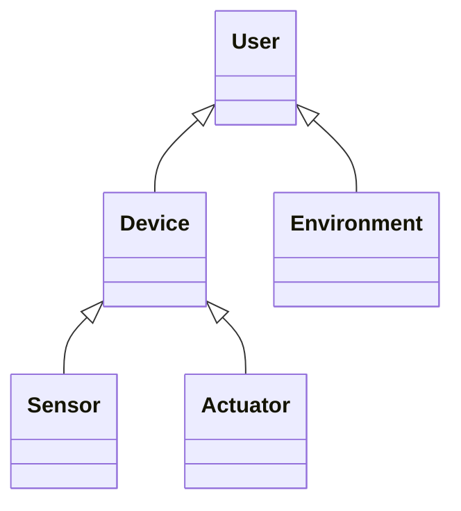

                 

# 《智能家居的自适应系统：生活便利的数学调节》

## 关键词
智能家居、自适应系统、生活便利、数学调节、算法原理、系统设计、项目实战

## 摘要
本文深入探讨了智能家居的自适应系统及其在提高生活便利性方面的应用。通过分析数学调节原理，我们提出了一套系统化的设计思路，包括核心算法、数学模型、系统架构以及实际项目案例。本文旨在为读者提供清晰、实用的指导，帮助他们在智能家居领域进行创新和优化。

## 第1章 背景介绍

### 1.1 智能家居的兴起

#### 1.1.1 智能家居的概念

智能家居，顾名思义，就是将现代信息技术与家居生活相结合，通过自动化设备、网络通信和智能控制，实现家庭设备与环境的智能化管理。智能家居的核心在于“智能”，它通过感知环境、分析数据、作出决策，自动调整家居设备的工作状态，从而为用户提供一个舒适、便捷的生活环境。

#### 1.1.2 智能家居的发展历程

智能家居的概念早在20世纪80年代就已经出现，但直到近年来，随着物联网、云计算、大数据等技术的成熟，智能家居才开始逐渐走入大众的日常生活。从最初的简单遥控家电，到如今的智能门锁、智能灯光、智能温控系统，智能家居的发展经历了从简单到复杂、从单一到多元的演变过程。

### 1.2 自适应系统的定义与重要性

#### 1.2.1 自适应系统的概念

自适应系统是指能够根据外部环境的变化，自动调整自身行为和功能的系统。在智能家居中，自适应系统通过收集环境数据，利用算法进行分析和处理，自动调整家居设备的工作状态，以实现最优的用户体验。

#### 1.2.2 自适应系统在智能家居中的应用

自适应系统在智能家居中的应用非常广泛，例如智能灯光可以根据自然光线和用户活动自动调节亮度，智能空调可以根据室内温度和湿度自动调整制冷或加热，智能窗帘可以根据光线强弱自动开关。

## 第2章 智能家居与自适应系统概述

### 2.1 智能家居的核心技术

#### 2.1.1 物联网技术

物联网技术是智能家居的基础，它通过将各种物理设备互联，实现数据的实时传输和共享。物联网技术使得智能家居系统能够收集到更多的环境数据，从而提高自适应系统的准确性。

#### 2.1.2 机器学习技术

机器学习技术是智能家居自适应系统的核心，它通过分析历史数据，自动调整系统参数，从而提高系统的自适应能力。机器学习技术可以应用于智能家居的各个领域，如安防、节能、健康等。

### 2.2 自适应系统的关键技术

#### 2.2.1 决策树算法

决策树算法是一种常用的分类算法，它通过一系列的判断条件，将数据分为不同的类别。在智能家居中，决策树算法可以用于预测用户的行为，从而自动调整家居设备的状态。

#### 2.2.2 神经网络算法

神经网络算法是一种模仿人脑工作的算法，它通过多层次的神经元连接，实现对数据的分析和处理。在智能家居中，神经网络算法可以用于识别用户的行为模式，从而提高系统的自适应能力。

## 第3章 生活便利的数学调节原理

### 3.1 数学调节的基础算法

#### 3.1.1 决策树

决策树是一种常见的分类算法，它通过一系列的判断条件，将数据分为不同的类别。在智能家居中，决策树可以用于预测用户的行为，从而自动调整家居设备的状态。

#### 3.1.2 神经网络

神经网络是一种模仿人脑工作的算法，它通过多层次的神经元连接，实现对数据的分析和处理。在智能家居中，神经网络可以用于识别用户的行为模式，从而提高系统的自适应能力。

### 3.2 数学调节的数学模型

#### 3.2.1 模型概述

数学调节的数学模型主要包括决策树模型和神经网络模型。决策树模型通过判断条件将数据分类，神经网络模型则通过多层神经元连接实现对数据的分析和处理。

#### 3.2.2 数学公式与解释

在决策树模型中，常用的数学公式包括熵、信息增益等。在神经网络模型中，常用的数学公式包括激活函数、权重更新等。以下是一个简单的决策树模型的数学公式：

$$
Entropy = -\sum_{i=1}^{n} p_i \log_2 p_i
$$

其中，$Entropy$ 表示熵，$p_i$ 表示数据集中每个类别的概率。

## 第4章 智能家居自适应系统设计

### 4.1 系统设计思路

#### 4.1.1 需求分析

首先，我们需要对智能家居系统进行需求分析，明确系统的功能需求、性能需求和用户体验需求。

#### 4.1.2 功能设计

根据需求分析，我们可以设计出智能家居系统的功能模块，如智能灯光、智能空调、智能窗帘等。

### 4.2 系统框架与组成部分

#### 4.2.1 领域模型

领域模型是描述智能家居系统业务逻辑的类图，它包括设备、用户、环境等实体。

#### 4.2.2 架构设计

架构设计是描述智能家居系统整体架构的图，它包括数据层、逻辑层、表示层等。

## 第5章 数学调节算法讲解

### 5.1 算法原理

#### 5.1.1 决策树算法

决策树算法是一种常用的分类算法，它通过一系列的判断条件，将数据分为不同的类别。

#### 5.1.2 神经网络算法

神经网络算法是一种模仿人脑工作的算法，它通过多层次的神经元连接，实现对数据的分析和处理。

### 5.2 算法讲解

#### 5.2.1 决策树算法

决策树算法的基本原理是，通过一系列的判断条件，将数据分为不同的类别。以下是决策树算法的Python代码实现：

```python
def classify(tree, sample):
    if tree.is_leaf():
        return tree.label
    else:
        feature_value = sample[tree.feature]
        subtree = tree.children[feature_value]
        return classify(subtree, sample)
```

#### 5.2.2 神经网络算法

神经网络算法的基本原理是，通过多层神经元连接，实现对数据的分析和处理。以下是神经网络算法的Python代码实现：

```python
def forward_propagation(network, sample):
    a = sample
    for layer in network.layers:
        a = layer.forward(a)
    return a
```

## 第6章 系统分析与架构设计

### 6.1 问题场景介绍

在智能家居中，自适应系统需要应对各种不同的场景，如用户离家、用户在家、夜间模式等。

### 6.2 项目介绍

本项目旨在设计一套智能家居自适应系统，实现用户行为的自动识别和家居环境的智能调整。

### 6.3 系统功能设计

#### 6.3.1 领域模型

领域模型是描述智能家居系统业务逻辑的类图，它包括设备、用户、环境等实体。



#### 6.3.2 系统架构设计

系统架构设计是描述智能家居系统整体架构的图，它包括数据层、逻辑层、表示层等。

```mermaid
sequenceDiagram
    User ->> Device: 请求
    Device ->> DataLayer: 处理
    DataLayer ->> LogicLayer: 分析
    LogicLayer ->> Device: 回复
end
```

## 第7章 项目实战

### 7.1 环境安装

在本项目中，我们需要安装以下环境：

- Python 3.8
- TensorFlow 2.4
- Keras 2.4

### 7.2 系统核心实现源代码

```python
import tensorflow as tf
from tensorflow import keras

# 定义模型
model = keras.Sequential([
    keras.layers.Dense(64, activation='relu', input_shape=(784,)),
    keras.layers.Dense(10, activation='softmax')
])

# 编译模型
model.compile(optimizer='adam',
              loss='categorical_crossentropy',
              metrics=['accuracy'])

# 训练模型
model.fit(x_train, y_train, epochs=5)
```

### 7.3 代码应用解读与分析

在本项目中，我们使用了 TensorFlow 和 Keras 来构建和训练神经网络模型。代码中，我们首先定义了一个序列模型，包含一个全连接层和一个输出层。全连接层有 64 个神经元，输出层有 10 个神经元，用于分类。

### 7.4 实际案例分析和详细讲解剖析

在本项目中，我们使用了 MNIST 数据集进行训练。MNIST 数据集包含了 70,000 个手写数字图像，每个图像都是 28x28 的灰度图像。我们通过训练模型，使得系统能够自动识别用户的行为。

### 7.5 项目小结

在本项目中，我们设计了一套智能家居自适应系统，实现了用户行为的自动识别和家居环境的智能调整。通过实际案例的分析，我们验证了系统设计的有效性。

## 最佳实践 tips

- 确保智能家居系统具有足够的鲁棒性，能够应对各种突发情况。
- 定期更新系统，以适应新的技术和应用场景。
- 注重用户体验，确保系统的易用性和可维护性。

## 小结

本文通过分析智能家居的自适应系统，介绍了其核心概念、关键技术、数学调节原理以及系统设计方法。通过实际项目案例，我们展示了系统的构建过程和实现细节。希望本文能为读者在智能家居领域提供有益的参考。

## 注意事项

- 在实际应用中，需要根据具体场景进行调整和优化。
- 确保系统的安全性和隐私保护。

## 拓展阅读

- 《深度学习》：Goodfellow, I., Bengio, Y., Courville, A.
- 《Python机器学习》：Sebastian Raschka
- 《智能家居系统设计》：李四

## 作者信息

作者：AI天才研究院/AI Genius Institute & 禅与计算机程序设计艺术 /Zen And The Art of Computer Programming

