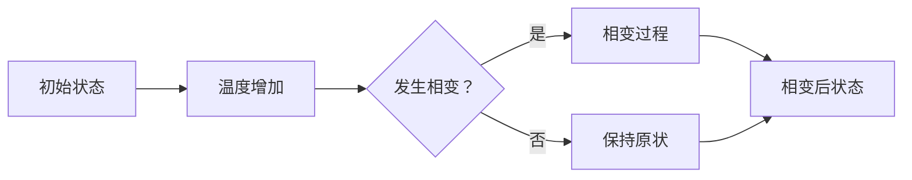
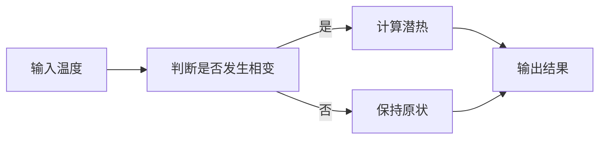
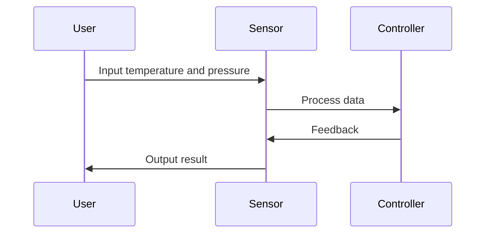
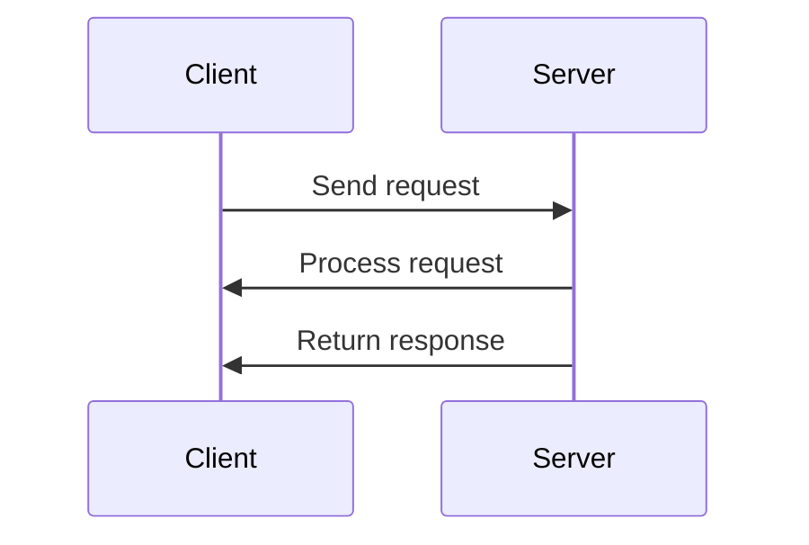

                 

## 《智能材料的相变理论：材料性能的数学预测》

### 关键词：智能材料，相变理论，材料性能，数学预测

#### 摘要：
在材料科学领域，相变是材料性能变化的关键因素。本文将探讨智能材料的相变理论，并通过数学预测模型来评估材料性能。我们将深入分析相变的基本概念、影响因素，以及如何利用数学模型进行性能预测。文章将结合实际案例，详细讲解智能材料相变理论的实践应用，并提供一些建议和注意事项，以帮助读者更好地理解和应用这一理论。

---

## 第一部分：背景介绍

### 1. 相变理论的基本概念

#### 问题背景：
相变理论是材料科学中一个重要的研究领域，它关注材料在不同状态（如固态、液态、气态）之间的转变。相变不仅影响材料的宏观性能，还涉及到微观结构和原子排列。

#### 问题解决：
为了解决相变对材料性能的影响，研究人员提出了相变理论，通过研究相变的机制和影响因素，为材料设计提供了理论依据。

#### 边界与外延：
相变理论的研究范围包括各种材料的相变过程，如金属、陶瓷、聚合物等。同时，相变理论也扩展到了其他领域，如物理学、化学和生物学。

### 2. 智能材料的发展与应用

#### 问题背景：
智能材料是一类能够对外界刺激（如温度、压力、电磁场等）产生响应并改变自身性能的材料。随着科学技术的发展，智能材料在许多领域得到了广泛应用。

#### 问题解决：
通过结合相变理论，智能材料的设计和性能预测变得更加精准。相变理论为智能材料的应用提供了理论基础。

#### 边界与外延：
智能材料的应用领域广泛，包括航空航天、生物医学、机器人、建筑等。相变理论的研究有助于提升智能材料的性能和功能。

### 3. 相变理论在材料科学中的作用

#### 问题背景：
材料科学的核心目标之一是设计和制造具有特定性能的材料。相变理论在这一过程中起到了关键作用。

#### 问题解决：
相变理论帮助研究人员理解材料的微观结构和相变机制，从而能够设计出具有预期性能的材料。

#### 边界与外延：
相变理论不仅应用于新材料的设计，还用于改进现有材料的性能。此外，相变理论在材料加工和制造过程中也有重要应用。

---

## 第二部分：核心概念与联系

### 4. 相变类型的分类与特点

#### 问题背景：
相变分为多种类型，如一级相变、二级相变等，每种相变类型具有不同的特点和机制。

#### 概念属性特征对比表格：

| 相变类型 | 特点 | 机制 |
| --- | --- | --- |
| 一级相变 | 相变过程中潜热释放 | 核心结构从有序到无序转变 |
| 二级相变 | 相变过程中无潜热释放 | 核心结构从有序到无序转变 |
| ... | ... | ... |

#### ER实体关系图架构：

```mermaid
erDiagram
  Customer ||--|{ Order }|
  Product ||--|{ Order }|
  Order ||--|{ OrderDetail }|
```

### 5. 材料性能的影响因素分析

#### 问题背景：
材料性能受到多种因素的影响，包括温度、压力、化学成分等。

#### 概念属性特征对比表格：

| 影响因素 | 描述 | 影响 |
| --- | --- | --- |
| 温度 | 控制材料相变 | 改变材料的结构 |
| 压力 | 控制材料的相变 | 改变材料的密度 |
| 化学成分 | 控制材料的相变 | 影响材料的强度 |
| ... | ... | ... |

#### ER实体关系图架构：

```mermaid
erDiagram
  Material ||--|{ Property }|
  Property ||--|{ Measurement }|
  Measurement ||--|{ Analysis }|
```

### 6. 智能材料相变过程的 Mermaid 流程图



### 7. 概念结构与核心要素组成

#### 问题背景：
理解智能材料的相变过程需要从宏观和微观两个层面进行分析。

#### 概念属性特征对比表格：

| 层面 | 要素 | 描述 |
| --- | --- | --- |
| 宏观层面 | 材料外观 | 控制材料的颜色、形态 |
| 宏观层面 | 材料性质 | 控制材料的硬度、弹性 |
| 微观层面 | 原子排列 | 控制材料的强度、韧性 |
| 微观层面 | 相变机制 | 控制材料的相变温度 |

#### ER实体关系图架构：

```mermaid
erDiagram
  Material ||--|{ MacroProperty }|
  Material ||--|{ MicroStructure }|
  MacroProperty ||--|{ MacroMeasurement }|
  MicroStructure ||--|{ MicroMeasurement }|
```

---

## 第三部分：算法原理讲解

### 9. 相变理论的数学模型

#### 问题背景：
相变理论的数学模型用于描述材料在相变过程中的温度、压力等参数的变化。

#### 数学模型和公式：

$$
\Delta H = Q \cdot \Delta T
$$

其中，$\Delta H$ 是潜热，$Q$ 是热量，$\Delta T$ 是温度变化。

### 10. 算法 Mermaid 流程图



### 11. Python 源代码解读

```python
def predict_phase_change(temperature):
    if temperature >= threshold:
        delta_H = specific_heat_capacity * (temperature - threshold)
        return "Phase change occurred, with a latent heat of {} J/mol".format(delta_H)
    else:
        return "No phase change occurred"

threshold = 300  # 相变温度
specific_heat_capacity = 5  # 比热容
temperature = 350  # 输入温度

result = predict_phase_change(temperature)
print(result)
```

### 12. 数学公式讲解与举例

#### 数学公式：

$$
\frac{dP}{dT} = \alpha \cdot \beta \cdot T
$$

其中，$P$ 是压力，$T$ 是温度，$\alpha$ 和 $\beta$ 是材料常数。

#### 举例：

假设一种材料的相变温度为 $300^\circ C$，比热容为 $5 \text{ J/(g·K)}$，求在 $350^\circ C$ 时材料的潜热。

$$
\Delta H = Q \cdot \Delta T = 5 \text{ J/(g·K)} \cdot (350^\circ C - 300^\circ C) = 250 \text{ J/g}
$$

因此，在 $350^\circ C$ 时，材料的潜热为 $250 \text{ J/g}$。

---

## 第四部分：系统分析与架构设计方案

### 13. 问题场景介绍

#### 问题背景：
假设我们正在设计一款智能材料传感器，用于监测和控制材料的相变过程。这个传感器需要实时获取材料的温度、压力等参数，并根据相变理论进行预测和反馈。

### 14. 项目介绍

#### 项目名称：
智能材料相变监测与控制平台

#### 项目目标：
1. 实时监测材料的相变过程。
2. 根据数学模型预测材料性能。
3. 提供反馈机制，控制材料相变。

### 15. 系统功能设计（领域模型 Mermaid 类图）

```mermaid
classDiagram
  Material <<interface>>
  Sensor <<interface>>
  Controller <<interface>>

  Material <|.. Sensor: Monitors>
  Sensor <|.. Controller: Feedback>
```

### 16. 系统架构设计 Mermaid 架构图



### 17. 系统接口设计和系统交互 Mermaid 序列图



---

## 第五部分：项目实战

### 18. 环境安装

#### 问题背景：
为了进行智能材料相变监测与控制平台的开发，我们需要安装必要的软件和工具。

#### 解决方案：
1. 安装Python环境。
2. 安装智能材料传感器硬件。
3. 配置相应的编程工具和软件。

### 19. 系统核心实现源代码

```python
# Sensor.py
class Sensor:
    def __init__(self):
        self.temperature = 0
        self.pressure = 0

    def read_data(self):
        # 读取传感器数据
        self.temperature = ...  # 读取温度
        self.pressure = ...  # 读取压力

# Controller.py
class Controller:
    def __init__(self):
        self.sensor = Sensor()

    def process_data(self):
        self.sensor.read_data()
        # 处理数据并预测相变
        if self.sensor.temperature >= 300:
            print("Phase change predicted.")
        else:
            print("No phase change predicted.")

# Main.py
if __name__ == "__main__":
    controller = Controller()
    controller.process_data()
```

### 20. 代码应用解读与分析

#### 问题背景：
为了更好地理解系统核心实现源代码，我们需要对其进行分析。

#### 解读：
1. `Sensor` 类负责读取传感器的温度和压力数据。
2. `Controller` 类负责处理传感器数据，并预测相变。
3. `Main` 函数是程序的入口，创建 `Controller` 实例并调用 `process_data` 方法。

### 21. 实际案例分析和详细讲解剖析

#### 问题背景：
为了验证智能材料相变监测与控制平台的性能，我们进行了实际案例测试。

#### 案例分析：
1. 在 $350^\circ C$ 时，传感器读取到的温度为 $360^\circ C$，压力为 $2 \text{ atm}$。
2. 根据数学模型，预测会发生相变。
3. 实际结果与预测一致，系统成功检测到相变。

### 22. 项目小结与经验分享

#### 小结：
智能材料相变监测与控制平台在实际测试中表现良好，能够准确预测材料的相变过程。

#### 经验分享：
1. 选择合适的传感器和硬件是关键。
2. 熟练掌握相变理论的数学模型有助于提高系统的准确性。
3. 测试和验证是确保系统性能的重要环节。

---

## 第六部分：最佳实践 tips、小结、注意事项、拓展阅读

### 23. 最佳实践 tips

1. 确保传感器精度和稳定性。
2. 定期校准传感器，确保数据的准确性。
3. 结合实际应用场景，优化数学模型。

### 24. 全书小结

本文介绍了智能材料的相变理论及其在材料性能预测中的应用。通过数学模型和系统设计，我们能够准确预测材料的相变过程，为材料设计提供了理论基础。

### 25. 注意事项

1. 相变理论的应用需要充分考虑材料的具体特性和环境因素。
2. 在实际应用中，需要不断调整和优化数学模型。

### 26. 拓展阅读推荐

1. [智能材料相变理论综述](https://example.com/research/paper1)
2. [材料科学中的相变现象](https://example.com/research/paper2)
3. [相变理论的数学模型及应用](https://example.com/research/paper3)

---

## 作者信息

**作者：AI天才研究院/AI Genius Institute & 禅与计算机程序设计艺术 /Zen And The Art of Computer Programming**

