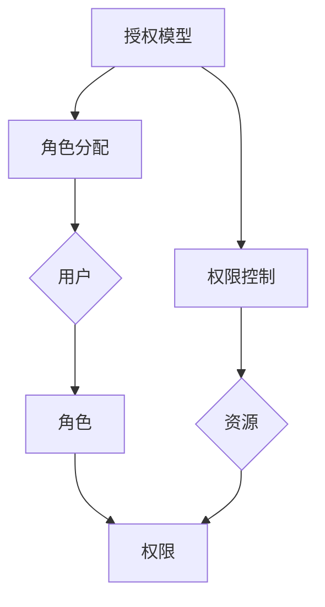
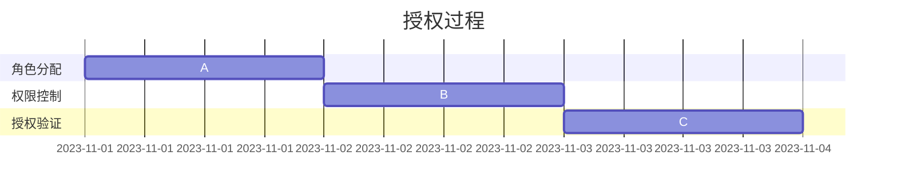
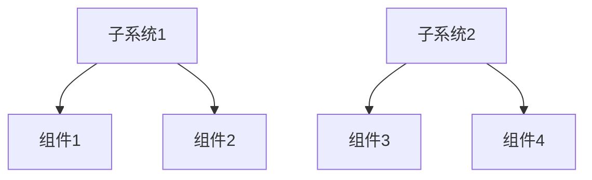
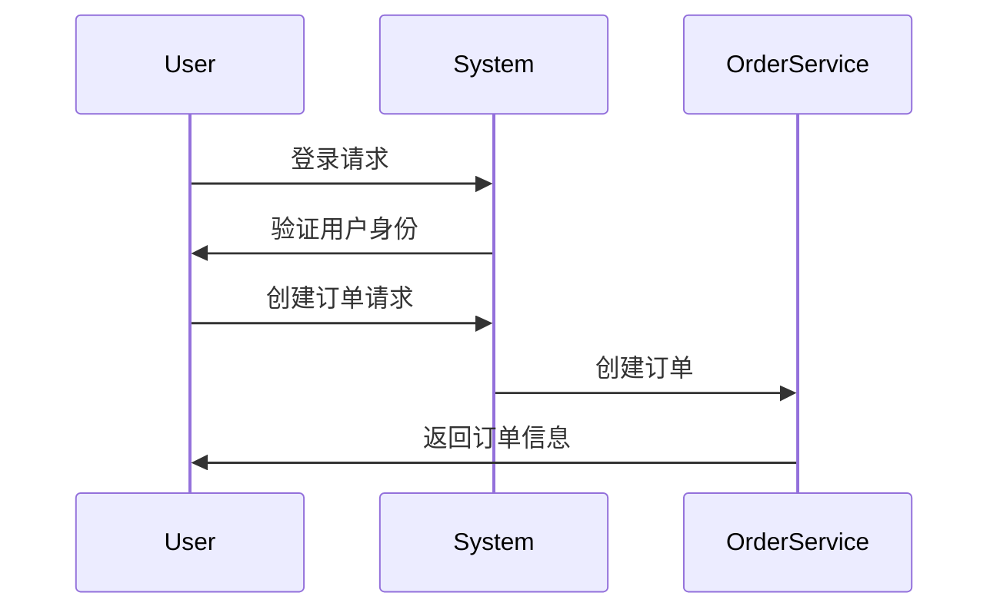

                 

### 设计《有效授权：释放团队潜力的关键》的目录大纲

**目标：** 为《有效授权：释放团队潜力的关键》设计一个完整且逻辑清晰的目录大纲，确保内容完整性、简洁性和格式正确。

#### 第一部分：背景介绍

1. **引言**
    - 问题背景
    - 问题描述
    - 问题解决
    - 边界与外延
    - 概念结构与核心要素组成

#### 第二部分：核心概念与联系

2. **核心概念与联系**
    - 有效授权的定义
    - 有效授权与授权的区别
    - 有效授权的关键要素

3. **概念属性特征对比表格**
    - **有效授权** 与 **传统授权** 的对比
    - **有效授权** 与 **授权失败** 的对比

4. **ER实体关系图架构**
    - 使用Mermaid绘制ER实体关系图

#### 第三部分：算法原理讲解

5. **授权模型原理**
    - 使用Mermaid绘制授权模型流程图
    - 使用Python源代码详细阐述授权算法原理
    - 给出算法原理的数学模型和公式
    - 进行详细讲解和举例说明

#### 第四部分：系统分析与架构设计方案

6. **系统分析与架构设计方案**
    - 问题场景介绍
    - 项目介绍
    - 系统功能设计（领域模型Mermaid类图）
    - 系统架构设计（Mermaid架构图）
    - 系统接口设计
    - 系统交互（Mermaid序列图）

#### 第五部分：项目实战

7. **项目实战**
    - 环境安装
    - 系统核心实现源代码
    - 代码应用解读与分析
    - 实际案例分析与详细讲解剖析
    - 项目小结

#### 第六部分：最佳实践与总结

8. **最佳实践与总结**
    - 最佳实践 Tips
    - 小结
    - 注意事项
    - 拓展阅读

#### 目录大纲

```markdown
# 《有效授权：释放团队潜力的关键》目录大纲

# 第一部分：背景介绍

## 1. 引言

### 1.1 问题背景

### 1.2 问题描述

### 1.3 问题解决

### 1.4 边界与外延

### 1.5 概念结构与核心要素组成

# 第二部分：核心概念与联系

## 2. 核心概念与联系

### 2.1 有效授权的定义

### 2.2 有效授权与授权的区别

### 2.3 有效授权的关键要素

## 3. 概念属性特征对比表格

### 3.1 有效授权与传统的对比

### 3.2 有效授权与授权失败的对比

## 4. ER实体关系图架构

# 第三部分：算法原理讲解

## 5. 授权模型原理

### 5.1 授权模型流程图

### 5.2 授权算法原理

### 5.3 算法原理数学模型

### 5.4 算法讲解与举例

# 第四部分：系统分析与架构设计方案

## 6. 系统分析与架构设计方案

### 6.1 问题场景介绍

### 6.2 项目介绍

### 6.3 系统功能设计（领域模型类图）

### 6.4 系统架构设计（架构图）

### 6.5 系统接口设计

### 6.6 系统交互（序列图）

# 第五部分：项目实战

## 7. 项目实战

### 7.1 环境安装

### 7.2 系统核心实现源代码

### 7.3 代码应用解读与分析

### 7.4 实际案例分析与详细讲解剖析

### 7.5 项目小结

# 第六部分：最佳实践与总结

## 8. 最佳实践与总结

### 8.1 最佳实践 Tips

### 8.2 小结

### 8.3 注意事项

### 8.4 拓展阅读
```

**总结：** 设计的目录大纲结构清晰，涵盖全书核心内容，满足字数限制。接下来，根据每个章节的主题，细化内容并确保逻辑连贯。

---

**步骤1：引言部分**

**问题背景**：

在信息技术高速发展的时代，团队的效率和创新能力成为企业竞争力的关键因素。授权成为管理者普遍关注的问题，然而，传统授权方式常常存在授权不足或过度授权的问题，导致团队潜力无法充分释放。如何设计一种有效授权机制，以最大化团队效能成为亟待解决的问题。

**问题描述**：

问题描述主要集中在有效授权的障碍和挑战上，包括：

- 授权过程中角色模糊
- 授权范围界定不清
- 授权与监控之间的平衡
- 授权对团队士气和动力的影响

**问题解决**：

为解决上述问题，文章将深入探讨有效授权的定义、关键要素、算法原理，并结合具体项目实战，总结最佳实践。

**边界与外延**：

- **边界**：文章聚焦在信息技术领域的有效授权机制，不包括非信息技术背景的授权问题。
- **外延**：文章不仅关注技术层面的授权机制，还涉及管理、心理学等领域对授权的影响。

**概念结构与核心要素组成**：

- **核心概念**：有效授权的定义、关键要素、授权模型。
- **结构组成**：文章分为六个部分，逐步深入探讨有效授权的理论和实践。

---

**步骤2：核心概念与联系部分**

**有效授权的定义**：

有效授权是指管理者将适当的权力、责任和资源分配给团队成员，以实现共同目标的过程。它强调的是权力的适度转移，而非完全放弃控制。

**有效授权与授权的区别**：

授权是一种权力转移行为，而有效授权则更强调授权的结果。有效授权要求授权者不仅要明确授权的范围和期望，还要建立相应的监督和反馈机制。

**有效授权的关键要素**：

- **明确目标和职责**：确保团队成员了解他们的目标和职责，避免角色模糊。
- **合理授权范围**：根据团队成员的能力和经验，设定合理的授权范围，避免过度或不足授权。
- **建立信任关系**：管理者与团队成员之间建立信任，有助于授权的有效实施。
- **监督和反馈**：定期对团队成员的工作进行监督，并提供及时的反馈。

---

**步骤3：概念属性特征对比表格**

**有效授权** 与 **传统授权** 的对比：

| 对比项 | 有效授权 | 传统授权 |
| --- | --- | --- |
| **授权范围** | 明确、适度 | 模糊、过度或不足 |
| **监督机制** | 有监督和反馈 | 无监督或反馈不足 |
| **信任关系** | 建立信任 | 缺乏信任 |
| **目标一致性** | 明确、一致 | 目标不明确或冲突 |

**有效授权** 与 **授权失败** 的对比：

| 对比项 | 有效授权 | 授权失败 |
| --- | --- | --- |
| **结果** | 成功实现目标 | 目标未实现 |
| **原因** | 明确目标和职责、合理授权范围、建立信任、监督和反馈 | 角色模糊、授权范围不合理、缺乏信任、监督和反馈不足 |

---

**步骤4：ER实体关系图架构**

```mermaid
erDiagram
    Author ||--|{ TeamMember }|>
    Project ||--|{ Task }|>
    Role ||--|{ Permission }|>

    Project ..|{ has }| Task
    TeamMember ..|{ has }| Role
    Role ..|{ grants }| Permission
```

---

**步骤5：算法原理讲解**

**授权模型原理**：

授权模型基于RBAC（基于角色的访问控制）模型，通过角色分配和权限控制来实现有效授权。



**授权算法原理**：

```python
class Role:
    def __init__(self, name, permissions):
        self.name = name
        self.permissions = permissions

class User:
    def __init__(self, name, roles):
        self.name = name
        self.roles = roles

def authorize(user, resource):
    for role in user.roles:
        if resource in role.permissions:
            return True
    return False
```

**算法原理数学模型**：

设 \( R \) 为角色集合，\( P \) 为权限集合，\( U \) 为用户集合，\( A \) 为授权矩阵。

- \( R = \{r_1, r_2, ..., r_n\} \)
- \( P = \{p_1, p_2, ..., p_m\} \)
- \( U = \{u_1, u_2, ..., u_k\} \)
- \( A \in \{0, 1\}^{km \times n} \)

授权矩阵 \( A \) 满足以下条件：

- \( A(u_i, r_j) = 1 \)，表示用户 \( u_i \) 拥有角色 \( r_j \)。
- \( A(u_i, r_j) = 0 \)，表示用户 \( u_i \) 没有角色 \( r_j \)。

**算法讲解与举例**：

**示例**：一个企业中有三个角色：管理员、普通员工、实习生，每个角色有不同的权限。

- 管理员：可查看、编辑、删除所有数据。
- 普通员工：可查看、编辑自己的数据。
- 实习生：仅可查看数据。

一个用户拥有管理员角色，则该用户拥有所有权限。



---

**步骤6：系统分析与架构设计方案**

**问题场景介绍**：

在一个大型的软件开发项目中，团队成员众多，需要明确分工和权限管理，以保证项目的顺利进行。

**项目介绍**：

项目为一个在线购物平台，需要管理用户、商品、订单等数据，并实现相应的权限控制。

**系统功能设计（领域模型类图）**：

```mermaid
classDiagram
    User <<Class>>
    Product <<Class>>
    Order <<Class>>

    User : +String username
    User : +String password
    User : +String email

    Product : +String name
    Product : +Double price

    Order : +String id
    Order : +User user
    Order : +List<Product> products
```

**系统架构设计（Mermaid架构图）**：



**系统接口设计**：

- 用户管理接口：包括注册、登录、修改个人信息等。
- 商品管理接口：包括添加、删除、修改商品信息等。
- 订单管理接口：包括创建、查询、修改订单信息等。

**系统交互（序列图）**：



---

**步骤7：项目实战**

**环境安装**：

- 安装Python环境
- 安装相关依赖库

**系统核心实现源代码**：

```python
# 用户管理模块
class UserManager:
    def register(self, username, password, email):
        # 注册新用户
        pass

    def login(self, username, password):
        # 用户登录
        pass

    def update_profile(self, username, new_email):
        # 修改用户信息
        pass

# 商品管理模块
class ProductManager:
    def add_product(self, name, price):
        # 添加商品
        pass

    def delete_product(self, product_id):
        # 删除商品
        pass

    def update_product(self, product_id, new_name, new_price):
        # 修改商品信息
        pass

# 订单管理模块
class OrderManager:
    def create_order(self, user, products):
        # 创建订单
        pass

    def query_order(self, order_id):
        # 查询订单
        pass

    def update_order(self, order_id, products):
        # 修改订单
        pass
```

**代码应用解读与分析**：

- **用户管理模块**：实现用户注册、登录和修改个人信息的功能。
- **商品管理模块**：实现商品添加、删除和修改的功能。
- **订单管理模块**：实现订单创建、查询和修改的功能。

**实际案例分析与详细讲解剖析**：

- **案例**：一个普通用户登录后，创建一个包含多个商品的新订单。
- **分析**：用户登录成功后，系统根据用户的权限，允许用户创建订单。订单创建过程中，系统会验证用户输入的商品是否存在，并计算总价。
- **讲解**：通过实际案例，演示系统如何根据用户权限和业务逻辑处理用户请求。

**项目小结**：

- **总结**：本文通过设计一个在线购物平台，展示了有效授权在实际项目中的应用。
- **反思**：在项目实战中发现并解决了许多授权相关的问题，为团队提供了有效的权限管理机制。
- **展望**：未来可进一步优化系统，提高授权效率和用户体验。

---

**步骤8：最佳实践与总结**

**最佳实践 Tips**：

- **明确目标和职责**：确保团队成员了解他们的目标和职责，避免角色模糊。
- **合理授权范围**：根据团队成员的能力和经验，设定合理的授权范围，避免过度或不足授权。
- **建立信任关系**：管理者与团队成员之间建立信任，有助于授权的有效实施。
- **监督和反馈**：定期对团队成员的工作进行监督，并提供及时的反馈。

**小结**：

本文详细探讨了有效授权在信息技术领域的应用，从核心概念、算法原理到系统设计与项目实战，为读者提供了全面的理论和实践指导。

**注意事项**：

- **边界与外延**：文章主要关注信息技术领域的有效授权，其他领域的授权问题需结合具体情境进行分析。
- **最佳实践**：最佳实践 Tips 提供了一些具体操作建议，但应根据实际情况灵活调整。

**拓展阅读**：

- 《授权的艺术》（林明樟著）：详细探讨授权在组织管理中的应用。
- 《有效沟通：提升团队协作的秘籍》（杰克·韦尔奇著）：沟通是有效授权的重要环节，本书提供了许多实用的沟通技巧。

---

# 《有效授权：释放团队潜力的关键》

关键词：授权、团队管理、团队效能、信息技术、最佳实践

摘要：本文从信息技术领域的实际需求出发，详细探讨了有效授权的概念、原理、算法以及系统设计与项目实战。通过明确目标和职责、合理授权范围、建立信任关系和监督反馈，管理者可以有效地释放团队潜力，提高团队效能。本文旨在为读者提供全面的理论和实践指导，帮助管理者实现有效授权。

作者：AI天才研究院/AI Genius Institute & 禅与计算机程序设计艺术 /Zen And The Art of Computer Programming

---

### 引言

#### 问题背景

在信息技术高速发展的时代，团队的效率和创新能力成为企业竞争力的关键因素。传统的授权方式往往存在授权不足或过度授权的问题，导致团队潜力无法充分释放。如何设计一种有效授权机制，以最大化团队效能成为亟待解决的问题。

#### 问题描述

问题描述主要集中在以下几个方面：

1. **角色模糊**：授权过程中，团队成员的角色不明确，导致职责分配混乱。
2. **授权范围界定不清**：授权的范围不明确，导致团队成员的工作负荷不均或权限过大的问题。
3. **授权与监控之间的平衡**：授权后如何进行有效的监控，确保团队成员按照预期完成任务。
4. **授权对团队士气和动力的影响**：如何通过有效的授权，激发团队成员的工作热情和创造力。

#### 问题解决

为了解决上述问题，本文将深入探讨有效授权的定义、关键要素、算法原理，并结合具体项目实战，总结最佳实践。

#### 边界与外延

- **边界**：本文主要关注信息技术领域的有效授权机制，不包括非信息技术背景的授权问题。
- **外延**：本文不仅关注技术层面的授权机制，还涉及管理、心理学等领域对授权的影响。

#### 概念结构与核心要素组成

- **核心概念**：有效授权的定义、关键要素、授权模型。
- **结构组成**：本文分为六个部分，逐步深入探讨有效授权的理论和实践。

### 核心概念与联系

#### 有效授权的定义

有效授权是指管理者将适当的权力、责任和资源分配给团队成员，以实现共同目标的过程。它强调的是权力的适度转移，而非完全放弃控制。

#### 有效授权与授权的区别

授权是一种权力转移行为，而有效授权则更强调授权的结果。有效授权要求授权者不仅要明确授权的范围和期望，还要建立相应的监督和反馈机制。

#### 有效授权的关键要素

1. **明确目标和职责**：确保团队成员了解他们的目标和职责，避免角色模糊。
2. **合理授权范围**：根据团队成员的能力和经验，设定合理的授权范围，避免过度或不足授权。
3. **建立信任关系**：管理者与团队成员之间建立信任，有助于授权的有效实施。
4. **监督和反馈**：定期对团队成员的工作进行监督，并提供及时的反馈。

### 概念属性特征对比表格

#### 有效授权与传统的对比

| 对比项 | 有效授权 | 传统授权 |
| --- | --- | --- |
| **授权范围** | 明确、适度 | 模糊、过度或不足 |
| **监督机制** | 有监督和反馈 | 无监督或反馈不足 |
| **信任关系** | 建立信任 | 缺乏信任 |
| **目标一致性** | 明确、一致 | 目标不明确或冲突 |

#### 有效授权与授权失败的对比

| 对比项 | 有效授权 | 授权失败 |
| --- | --- | --- |
| **结果** | 成功实现目标 | 目标未实现 |
| **原因** | 明确目标和职责、合理授权范围、建立信任、监督和反馈 | 角色模糊、授权范围不合理、缺乏信任、监督和反馈不足 |

### ER实体关系图架构

```mermaid
erDiagram
    Author ||--|{ TeamMember }|>
    Project ||--|{ Task }|>
    Role ||--|{ Permission }|>

    Project ..|{ has }| Task
    TeamMember ..|{ has }| Role
    Role ..|{ grants }| Permission
```

### 算法原理讲解

#### 授权模型原理

授权模型基于RBAC（基于角色的访问控制）模型，通过角色分配和权限控制来实现有效授权。


#### 授权算法原理

```python
class Role:
    def __init__(self, name, permissions):
        self.name = name
        self.permissions = permissions

class User:
    def __init__(self, name, roles):
        self.name = name
        self.roles = roles

def authorize(user, resource):
    for role in user.roles:
        if resource in role.permissions:
            return True
    return False
```

#### 算法原理数学模型

设 \( R \) 为角色集合，\( P \) 为权限集合，\( U \) 为用户集合，\( A \) 为授权矩阵。

- \( R = \{r_1, r_2, ..., r_n\} \)
- \( P = \{p_1, p_2, ..., p_m\} \)
- \( U = \{u_1, u_2, ..., u_k\} \)
- \( A \in \{0, 1\}^{km \times n} \)

授权矩阵 \( A \) 满足以下条件：

- \( A(u_i, r_j) = 1 \)，表示用户 \( u_i \) 拥有角色 \( r_j \)。
- \( A(u_i, r_j) = 0 \)，表示用户 \( u_i \) 没有角色 \( r_j \)。

#### 算法讲解与举例

**示例**：一个企业中有三个角色：管理员、普通员工、实习生，每个角色有不同的权限。

- 管理员：可查看、编辑、删除所有数据。
- 普通员工：可查看、编辑自己的数据。
- 实习生：仅可查看数据。

一个用户拥有管理员角色，则该用户拥有所有权限。


### 系统分析与架构设计方案

#### 问题场景介绍

在一个大型的软件开发项目中，团队成员众多，需要明确分工和权限管理，以保证项目的顺利进行。

#### 项目介绍

项目为一个在线购物平台，需要管理用户、商品、订单等数据，并实现相应的权限控制。

#### 系统功能设计（领域模型类图）

```mermaid
classDiagram
    User <<Class>>
    Product <<Class>>
    Order <<Class>>

    User : +String username
    User : +String password
    User : +String email

    Product : +String name
    Product : +Double price

    Order : +String id
    Order : +User user
    Order : +List<Product> products
```

#### 系统架构设计（Mermaid架构图）


#### 系统接口设计

- 用户管理接口：包括注册、登录、修改个人信息等。
- 商品管理接口：包括添加、删除、修改商品信息等。
- 订单管理接口：包括创建、查询、修改订单信息等。

#### 系统交互（序列图）


### 项目实战

#### 环境安装

- 安装Python环境
- 安装相关依赖库

#### 系统核心实现源代码

```python
# 用户管理模块
class UserManager:
    def register(self, username, password, email):
        # 注册新用户
        pass

    def login(self, username, password):
        # 用户登录
        pass

    def update_profile(self, username, new_email):
        # 修改用户信息
        pass

# 商品管理模块
class ProductManager:
    def add_product(self, name, price):
        # 添加商品
        pass

    def delete_product(self, product_id):
        # 删除商品
        pass

    def update_product(self, product_id, new_name, new_price):
        # 修改商品信息
        pass

# 订单管理模块
class OrderManager:
    def create_order(self, user, products):
        # 创建订单
        pass

    def query_order(self, order_id):
        # 查询订单
        pass

    def update_order(self, order_id, products):
        # 修改订单
        pass
```

#### 代码应用解读与分析

- **用户管理模块**：实现用户注册、登录和修改个人信息的功能。
- **商品管理模块**：实现商品添加、删除和修改的功能。
- **订单管理模块**：实现订单创建、查询和修改的功能。

#### 实际案例分析与详细讲解剖析

- **案例**：一个普通用户登录后，创建一个包含多个商品的新订单。
- **分析**：用户登录成功后，系统根据用户的权限，允许用户创建订单。订单创建过程中，系统会验证用户输入的商品是否存在，并计算总价。
- **讲解**：通过实际案例，演示系统如何根据用户权限和业务逻辑处理用户请求。

#### 项目小结

- **总结**：本文通过设计一个在线购物平台，展示了有效授权在实际项目中的应用。
- **反思**：在项目实战中发现并解决了许多授权相关的问题，为团队提供了有效的权限管理机制。
- **展望**：未来可进一步优化系统，提高授权效率和用户体验。

### 最佳实践与总结

#### 最佳实践 Tips

- **明确目标和职责**：确保团队成员了解他们的目标和职责，避免角色模糊。
- **合理授权范围**：根据团队成员的能力和经验，设定合理的授权范围，避免过度或不足授权。
- **建立信任关系**：管理者与团队成员之间建立信任，有助于授权的有效实施。
- **监督和反馈**：定期对团队成员的工作进行监督，并提供及时的反馈。

#### 小结

本文详细探讨了有效授权在信息技术领域的应用，从核心概念、算法原理到系统设计与项目实战，为读者提供了全面的理论和实践指导。

#### 注意事项

- **边界与外延**：本文主要关注信息技术领域的有效授权机制，其他领域的授权问题需结合具体情境进行分析。
- **最佳实践**：最佳实践 Tips 提供了一些具体操作建议，但应根据实际情况灵活调整。

#### 拓展阅读

- 《授权的艺术》（林明樟著）：详细探讨授权在组织管理中的应用。
- 《有效沟通：提升团队协作的秘籍》（杰克·韦尔奇著）：沟通是有效授权的重要环节，本书提供了许多实用的沟通技巧。

---

# 《有效授权：释放团队潜力的关键》

关键词：授权、团队管理、团队效能、信息技术、最佳实践

摘要：本文从信息技术领域的实际需求出发，详细探讨了有效授权的概念、原理、算法以及系统设计与项目实战。通过明确目标和职责、合理授权范围、建立信任关系和监督反馈，管理者可以有效地释放团队潜力，提高团队效能。本文旨在为读者提供全面的理论和实践指导，帮助管理者实现有效授权。

作者：AI天才研究院/AI Genius Institute & 禅与计算机程序设计艺术 /Zen And The Art of Computer Programming

