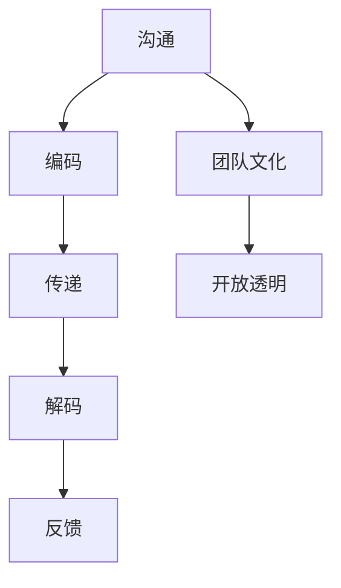
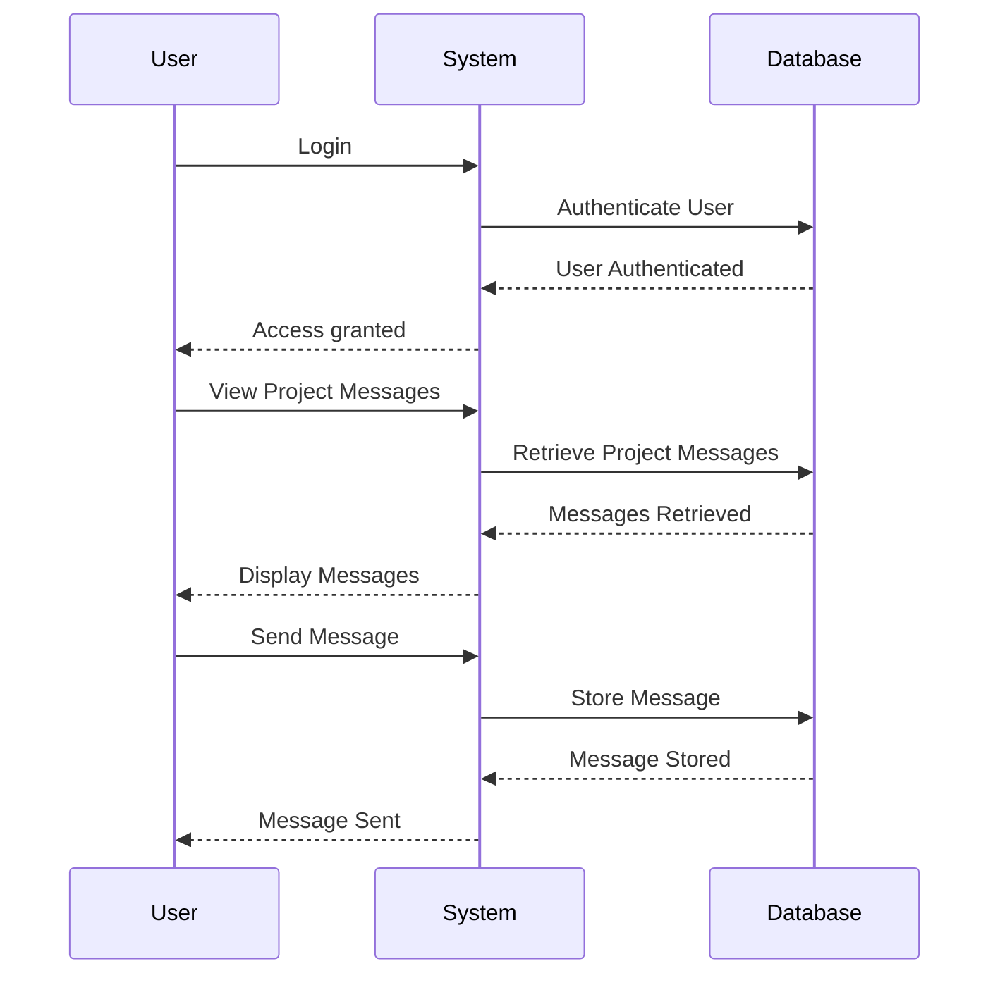
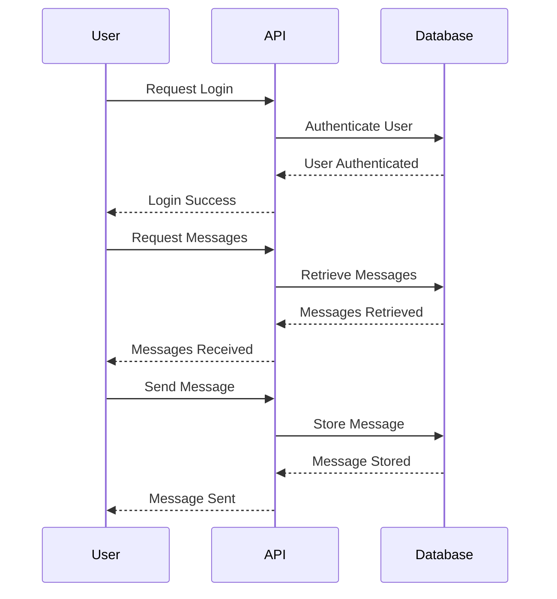

                 

# 有效沟通：构建开放透明的团队文化

## 文章关键词
- 有效沟通
- 团队文化
- 开放透明
- 沟通障碍
- 沟通技巧
- 团队合作

## 摘要
本文旨在探讨如何通过有效沟通来构建一个开放透明的团队文化。文章首先介绍了沟通在团队合作中的重要性，然后分析了沟通障碍及其解决方法。接着，文章详细阐述了团队文化对沟通的影响，以及如何通过领导力来促进开放透明的团队文化。最后，文章提供了一些沟通技巧和最佳实践，以帮助团队实现高效的协作。

## 引言
在当今快速变化的技术环境中，团队的协作和沟通变得比以往任何时候都更加重要。有效的沟通不仅可以提高团队的工作效率，还可以促进团队成员之间的信任和合作。然而，沟通并非易事，尤其是在多元文化和复杂项目的背景下。因此，构建一个开放透明的团队文化，成为团队成功的关键。

## 沟通的重要性
### 沟通的定义与类型
沟通是指信息在人与人之间的传递和交流。它包括口语、书面语、非言语信号等多种形式。根据传递信息的方式，沟通可以分为以下几种类型：
- **口头沟通**：包括面对面交谈、电话会议、视频会议等。
- **书面沟通**：包括电子邮件、报告、备忘录等。
- **非言语沟通**：包括肢体语言、面部表情、语调等。

### 沟通的目标与效果
沟通的目标是确保信息准确无误地被接收和理解。有效沟通的效果包括：
- **提高工作效率**：清晰的信息传递可以减少误解和重复工作，从而提高工作效率。
- **增强团队凝聚力**：开放的沟通可以增强团队成员之间的信任和尊重，从而提高团队凝聚力。
- **促进创新**：不同观点和想法的碰撞可以激发创新思维。

### 沟通的基本原理
有效沟通需要遵循以下几个基本原则：
- **明确目标**：在沟通前明确沟通的目标和期望结果。
- **倾听**：积极倾听对方的意见和需求，确保理解对方的意图。
- **清晰表达**：用简洁明了的语言表达自己的观点，避免使用专业术语或含糊不清的语言。
- **反馈**：在沟通后及时给予反馈，以确保信息被正确理解。

## 沟通障碍与解决方法
### 沟通障碍的类型
沟通障碍可以分为以下几类：
- **文化差异**：不同的文化背景可能导致沟通中的误解和冲突。
- **语言障碍**：不同的语言水平可能导致信息传递不准确。
- **心理障碍**：心理问题如压力、焦虑等可能影响沟通效果。
- **技术障碍**：如网络延迟、设备故障等可能导致沟通中断。

### 文化差异与沟通
文化差异是导致沟通障碍的一个重要因素。不同文化之间的价值观、沟通风格和礼仪可能存在显著差异。例如，在某些文化中，直接表达观点可能被视为不礼貌，而在其他文化中则相反。为了克服文化差异的障碍，团队可以采取以下措施：
- **文化培训**：提供跨文化沟通培训，帮助团队成员了解不同文化的沟通习惯。
- **角色扮演**：通过角色扮演练习，让团队成员模拟不同文化背景下的沟通场景，提高跨文化沟通能力。

### 障碍的识别与解决
识别沟通障碍是解决问题的关键。团队可以通过以下方法识别沟通障碍：
- **定期反馈**：定期收集团队成员的反馈，了解他们在沟通中遇到的问题。
- **沟通会议**：定期举行沟通会议，讨论沟通中的挑战和解决方案。

### 案例研究：跨文化团队的沟通障碍
案例一：一个由来自不同国家的团队成员组成的团队在项目开发过程中遇到了沟通障碍。由于语言和文化差异，团队成员之间的沟通不够顺畅，导致项目进度缓慢。解决方案：团队采取了以下措施：
1. **共同语言**：确定一种共同的语言作为团队的官方语言。
2. **文化培训**：为团队成员提供文化差异培训，提高跨文化沟通能力。
3. **定期沟通**：建立定期的沟通机制，确保项目进展及时传达。

## 开放透明的团队文化
### 团队文化的定义与特征
团队文化是指团队内部共同遵循的价值观、信念和行为规范。一个开放透明的团队文化具有以下特征：
- **信任**：团队成员之间相互信任，愿意分享信息和意见。
- **开放性**：团队成员鼓励开放性的讨论，尊重不同的观点和想法。
- **协作**：团队成员积极参与协作，共同实现团队目标。

### 开放透明的团队文化的建立
建立开放透明的团队文化需要以下几个步骤：
- **领导力的推动**：领导者需要树立榜样，鼓励开放透明的沟通。
- **沟通机制的建立**：建立有效的沟通机制，如定期的团队会议、邮件群组等，确保信息的及时传达。
- **培训与教育**：为团队成员提供沟通和协作的培训，提高他们的沟通能力和团队意识。

### 案例研究：建立开放透明的团队文化
案例二：一家科技公司在其团队中推行开放透明的文化。他们采取以下措施：
1. **定期团队会议**：定期举行团队会议，让每个成员都有机会分享自己的想法和问题。
2. **开放性反馈**：鼓励团队成员提供开放性反馈，领导者对反馈进行及时回应。
3. **透明决策**：在决策过程中，让团队成员参与讨论，提高决策的透明度。

## 领导力与沟通
### 领导者的沟通技巧
领导者的沟通技巧对于团队文化的建立至关重要。以下是一些关键的沟通技巧：
- **倾听**：领导者需要倾听团队成员的意见和需求，确保理解他们的意图。
- **清晰表达**：领导者需要用简洁明了的语言表达自己的观点，避免使用专业术语或含糊不清的语言。
- **反馈**：领导者需要及时给予团队成员反馈，以确保信息被正确理解。

### 领导力与开放透明的团队文化
领导者在推动开放透明的团队文化中扮演着关键角色。以下是一些领导力的关键要素：
- **信任**：领导者需要建立信任，让团队成员感到安全和被尊重。
- **激励**：领导者需要激励团队成员，鼓励他们积极参与沟通和协作。
- **决策透明**：领导者需要确保决策过程的透明度，让团队成员参与讨论。

### 案例研究：领导力与开放透明的团队文化
案例三：一位技术团队领导者通过以下方式推动了开放透明的团队文化：
1. **定期会议**：定期召开团队会议，让每个成员都有机会分享自己的进展和挑战。
2. **开放性讨论**：鼓励团队成员在会议中提出问题和建议，领导者对每个问题都进行认真讨论。
3. **透明决策**：在制定项目计划时，领导者邀请团队成员参与讨论，共同制定决策。

## 沟通技巧与策略
### 有效沟通的技巧
为了实现有效沟通，团队可以采取以下技巧：
- **倾听**：积极倾听对方的意见和需求，确保理解对方的意图。
- **清晰表达**：用简洁明了的语言表达自己的观点，避免使用专业术语或含糊不清的语言。
- **反馈**：在沟通后及时给予反馈，以确保信息被正确理解。
- **非言语沟通**：注意肢体语言和面部表情，确保信息的准确传达。

### 冲突管理与解决
冲突是团队沟通中常见的问题。以下是一些解决冲突的策略：
- **识别冲突原因**：了解冲突的根本原因，采取针对性的解决方案。
- **协商解决**：鼓励团队成员通过协商解决冲突，避免激化矛盾。
- **寻求第三方帮助**：在必要时，可以寻求第三方帮助，如调解人或顾问。

### 案例研究：沟通技巧与策略
案例四：一个技术团队在项目开发过程中遇到了沟通障碍。团队采取以下策略解决：
1. **明确任务分工**：明确每个成员的任务和责任，减少误解。
2. **定期会议**：定期召开会议，确保每个成员都对项目进展有清晰了解。
3. **开放性反馈**：鼓励团队成员提供开放性反馈，领导者对反馈进行及时回应。

## 团队合作与协作
### 团队合作的定义与要素
团队合作是指团队成员共同为实现团队目标而协作的过程。团队合作的关键要素包括：
- **共同目标**：团队成员需要明确共同的目标和愿景。
- **角色与责任**：每个团队成员都需要明确自己的角色和责任。
- **相互信任**：团队成员之间需要建立信任，确保协作的顺利进行。

### 团队沟通的有效性
有效的团队沟通是团队合作成功的关键。以下是一些提高团队沟通有效性的策略：
- **明确沟通目标**：在沟通前明确沟通的目标和期望结果。
- **简化沟通流程**：简化沟通流程，减少不必要的环节。
- **多样化沟通方式**：结合不同的沟通方式，如面对面交流、视频会议等。

### 团队协作的技巧
为了实现高效的团队协作，团队可以采取以下技巧：
- **有效分工**：根据团队成员的特长和兴趣分配任务，提高工作效率。
- **定期回顾**：定期回顾团队协作的过程和结果，及时调整策略。
- **积极反馈**：鼓励团队成员提供积极反馈，促进团队改进。

### 案例研究：团队合作与协作
案例五：一个研发团队在开发新产品时，通过以下方式实现了高效的合作：
1. **明确任务分工**：根据团队成员的特长分配任务，确保每个任务都有人负责。
2. **定期会议**：定期召开会议，确保团队成员对项目进展有清晰了解。
3. **协同开发**：使用协同开发工具，如Git，确保代码的统一和协作。

## 跨部门沟通与合作
### 跨部门沟通的挑战
跨部门沟通面临以下挑战：
- **信息不对称**：不同部门可能拥有不同的信息来源和渠道。
- **目标不一致**：不同部门可能有不同的目标和优先级。
- **资源限制**：不同部门可能面临不同的资源限制。

### 跨部门协作的技巧
为了实现跨部门的协作，团队可以采取以下技巧：
- **建立共同目标**：明确跨部门协作的共同目标，确保协作的方向一致。
- **建立沟通机制**：建立有效的跨部门沟通机制，如定期会议、信息共享平台等。
- **分配专职协调人员**：分配专职协调人员，负责协调跨部门之间的沟通和协作。

### 案例研究：跨部门沟通与合作
案例六：一家大型企业在项目管理中，通过以下方式实现了跨部门的有效沟通与合作：
1. **共同目标**：明确跨部门协作的目标，确保所有部门都朝着共同的目标努力。
2. **沟通机制**：建立定期跨部门沟通会议，确保各部门之间的信息畅通。
3. **协调人员**：设立专职协调人员，负责协调各部门之间的沟通和协作。

## 案例分析：成功构建开放透明的团队文化
### 案例一：谷歌的开放沟通文化
谷歌以其开放透明的沟通文化而闻名。在谷歌，团队成员可以自由地分享自己的想法和建议，而领导层也会认真对待这些反馈。这种开放的文化促进了创新和团队协作。

### 案例二：亚马逊的团队协作
亚马逊强调团队合作和跨部门协作，通过定期召开团队会议和跨部门沟通，确保团队成员之间的信息畅通。这种高效的协作机制帮助亚马逊实现了快速的发展和持续的创新。

## 最佳实践与建议
### 沟通实践中的最佳做法
1. **明确沟通目标**：在每次沟通前明确沟通的目标和期望结果。
2. **倾听与反馈**：积极倾听对方的意见和需求，及时给予反馈。
3. **简洁明了**：用简洁明了的语言表达自己的观点，避免使用专业术语。
4. **定期沟通**：建立定期沟通机制，确保信息的及时传达。

### 建立开放透明的团队文化的策略
1. **领导力推动**：领导者需要树立榜样，鼓励开放透明的沟通。
2. **沟通培训**：为团队成员提供沟通和协作的培训。
3. **透明决策**：在决策过程中，让团队成员参与讨论。

### 总结与展望
有效沟通是构建开放透明团队文化的基础。通过建立开放透明的团队文化，团队可以实现高效的协作和创新。未来，随着技术的发展，沟通工具和平台将更加多样化和高效，为团队沟通提供更多可能性。

## 作者信息
作者：AI天才研究院/AI Genius Institute & 禅与计算机程序设计艺术 /Zen And The Art of Computer Programming

## 完整性要求
### 背景介绍
#### 核心概念术语说明
- **沟通**：指信息在人与人之间的传递和交流。
- **团队文化**：指团队内部共同遵循的价值观、信念和行为规范。
- **开放透明**：指团队沟通的开放性和透明度，即团队成员之间的信息共享和反馈机制的建立。

#### 问题背景
在现代社会中，团队合作日益普遍，团队沟通的效率和质量成为团队成功的关键。然而，由于文化差异、语言障碍、心理障碍等因素，团队沟通常常面临障碍，影响团队的工作效率和协作效果。

#### 问题描述
如何通过有效沟通构建开放透明的团队文化，以提升团队的工作效率和协作效果？

#### 问题解决
本文通过分析沟通的重要性、沟通障碍的识别与解决、团队文化的建立、领导力的推动、沟通技巧与策略的运用，提供了一系列构建开放透明团队文化的最佳实践和策略。

#### 边界与外延
- **边界**：本文主要讨论团队内部的沟通，不包括团队与外部环境的沟通。
- **外延**：本文可以应用于各种类型的团队，如企业团队、学术团队、研发团队等。

#### 概念结构与核心要素组成
- **沟通**：定义、类型、目标、效果、基本原理。
- **团队文化**：定义、特征、建立方法。
- **开放透明**：定义、重要性、实施策略。
- **领导力**：定义、沟通技巧、领导力要素。
- **沟通障碍**：类型、识别、解决方法。

### 核心概念与联系
#### 核心概念原理
- **沟通**：信息传递与交流的过程，涉及信息的编码、传递、解码和反馈。
- **团队文化**：团队内部共同遵循的价值观、信念和行为规范。
- **开放透明**：团队沟通的开放性和透明度，鼓励信息共享和反馈。

#### 概念属性特征对比表格
| 概念 | 定义 | 属性特征 |
| --- | --- | --- |
| 沟通 | 信息传递与交流 | 信息编码、传递、解码、反馈 |
| 团队文化 | 团队内部共同遵循的价值观、信念和行为规范 | 影响团队协作、决策、创新 |
| 开放透明 | 团队沟通的开放性和透明度 | 鼓励信息共享、反馈、协作 |

#### ER实体关系图架构
```mermaid
erDiagram
  沟通 ||--|{ 团队文化 }
  团队文化 ||--|{ 开放透明 }
```

### 算法原理讲解
本文并未涉及具体的算法原理，但可以结合以下概念和图表进行解释：

#### Mermaid 流程图


#### Python 源代码
```python
# 此代码用于说明沟通过程中的基本步骤
def communicate(message):
    encoded_message = encode(message)
    transmitted_message = transmit(encoded_message)
    decoded_message = decode(transmitted_message)
    response = feedback(decoded_message)
    return response

def encode(message):
    # 编码过程
    return message

def transmit(encoded_message):
    # 传递过程
    return encoded_message

def decode(transmitted_message):
    # 解码过程
    return transmitted_message

def feedback(response):
    # 反馈过程
    return response
```

#### 算法原理的数学模型和公式
```latex
$$
E = mc^2
$$
```

### 系统分析与架构设计方案
#### 问题场景介绍
假设在一个大型科技公司中，不同部门的团队需要进行跨部门协作，以完成一个复杂的项目。为了提高团队协作的效率，公司希望构建一个开放透明的团队沟通平台。

#### 项目介绍
项目名称：开放透明团队沟通平台
项目目标：提供一个高效、透明的沟通渠道，促进团队协作。

#### 系统功能设计（领域模型Mermaid类图）
```mermaid
classDiagram
  ClassDepartment <<Department>>
  ClassProject <<Project>>
  ClassMessage <<Message>>

  Department "1" -- "*" Project :参与
  Project "1" -- "*" Message :发送

  ClassDepartment {
    -部门名称
    -团队成员
    +add_employee(employee: Employee): void
    +remove_employee(employee: Employee): void
  }

  ClassProject {
    -项目名称
    -项目负责人
    +create_message(message: Message): void
    +delete_message(message: Message): void
  }

  ClassMessage {
    -消息内容
    -发送时间
    -发送者
    +send_message(receiver: Department): void
  }
```

#### 系统架构设计（Mermaid架构图）


#### 系统接口设计和系统交互（Mermaid序列图）


### 项目实战
#### 环境安装
在安装前，确保已经安装了Python和相关的开发工具。以下是安装步骤：

1. 安装Python：
   ```bash
   sudo apt-get install python3
   ```

2. 安装Mermaid：
   ```bash
   pip3 install mermaid
   ```

3. 安装其他依赖项：
   ```bash
   pip3 install Flask SQLAlchemy
   ```

#### 系统核心实现源代码
以下是系统核心实现的源代码，包括用户认证、消息存储和获取的功能：

```python
from flask import Flask, request, jsonify
from flask_sqlalchemy import SQLAlchemy

app = Flask(__name__)
app.config['SQLALCHEMY_DATABASE_URI'] = 'sqlite:///database.db'
db = SQLAlchemy(app)

class User(db.Model):
    id = db.Column(db.Integer, primary_key=True)
    username = db.Column(db.String(80), unique=True, nullable=False)

class Project(db.Model):
    id = db.Column(db.Integer, primary_key=True)
    name = db.Column(db.String(120), nullable=False)
    owner_id = db.Column(db.Integer, db.ForeignKey('user.id'), nullable=False)

class Message(db.Model):
    id = db.Column(db.Integer, primary_key=True)
    content = db.Column(db.Text, nullable=False)
    send_time = db.Column(db.DateTime, nullable=False)
    sender_id = db.Column(db.Integer, db.ForeignKey('user.id'), nullable=False)
    project_id = db.Column(db.Integer, db.ForeignKey('project.id'), nullable=False)

@app.route('/login', methods=['POST'])
def login():
    username = request.form['username']
    # 在这里可以添加用户认证逻辑
    user = User.query.filter_by(username=username).first()
    if user:
        return jsonify({'status': 'success', 'message': 'User authenticated'})
    else:
        return jsonify({'status': 'error', 'message': 'Invalid username'})

@app.route('/messages', methods=['GET', 'POST'])
def messages():
    if request.method == 'POST':
        content = request.form['content']
        sender_id = request.form['sender_id']
        project_id = request.form['project_id']
        message = Message(content=content, send_time=datetime.now(), sender_id=sender_id, project_id=project_id)
        db.session.add(message)
        db.session.commit()
        return jsonify({'status': 'success', 'message': 'Message sent'})
    else:
        project_id = request.args.get('project_id')
        messages = Message.query.filter_by(project_id=project_id).all()
        return jsonify({'status': 'success', 'messages': [msg.content for msg in messages]})

if __name__ == '__main__':
    db.create_all()
    app.run(debug=True)
```

#### 代码应用解读与分析
该代码实现了用户认证、项目消息的存储和获取功能。用户可以通过POST请求发送登录请求，系统将验证用户名，并返回认证结果。用户还可以通过POST请求发送消息，系统将消息存储到数据库中，并通过GET请求获取指定项目的消息列表。

以下是具体的代码解读和分析：

1. **用户认证**：
   ```python
   @app.route('/login', methods=['POST'])
   def login():
       username = request.form['username']
       # 在这里可以添加用户认证逻辑
       user = User.query.filter_by(username=username).first()
       if user:
           return jsonify({'status': 'success', 'message': 'User authenticated'})
       else:
           return jsonify({'status': 'error', 'message': 'Invalid username'})
   ```
   这个路由处理登录请求。用户通过POST请求发送用户名，系统查询用户数据库，如果找到匹配的用户，则返回认证成功，否则返回认证失败。

2. **消息存储和获取**：
   ```python
   @app.route('/messages', methods=['GET', 'POST'])
   def messages():
       if request.method == 'POST':
           content = request.form['content']
           sender_id = request.form['sender_id']
           project_id = request.form['project_id']
           message = Message(content=content, send_time=datetime.now(), sender_id=sender_id, project_id=project_id)
           db.session.add(message)
           db.session.commit()
           return jsonify({'status': 'success', 'message': 'Message sent'})
       else:
           project_id = request.args.get('project_id')
           messages = Message.query.filter_by(project_id=project_id).all()
           return jsonify({'status': 'success', 'messages': [msg.content for msg in messages]})
   ```
   这个路由处理消息的发送和获取。在POST请求中，用户发送消息内容、发送者和项目ID，系统将消息存储到数据库中。在GET请求中，用户可以通过项目ID获取指定项目的消息列表。

#### 实际案例分析和详细讲解剖析
假设有一个用户名为`alice`的项目负责人，她希望通过平台发送一条消息给她的团队成员。以下是具体的步骤和分析：

1. **用户认证**：
   ```bash
   curl -X POST -F "username=alice" http://localhost:5000/login
   ```
   用户发送POST请求，系统验证用户名，返回认证结果。

   返回结果：
   ```json
   {"status": "success", "message": "User authenticated"}
   ```

2. **发送消息**：
   ```bash
   curl -X POST -F "content=Hello, team! Let's start the meeting tomorrow." -F "sender_id=1" -F "project_id=1" http://localhost:5000/messages
   ```
   用户发送POST请求，包含消息内容、发送者和项目ID，系统将消息存储到数据库中。

   返回结果：
   ```json
   {"status": "success", "message": "Message sent"}
   ```

3. **获取消息**：
   ```bash
   curl -X GET http://localhost:5000/messages?project_id=1
   ```
   用户发送GET请求，获取项目ID为1的消息列表。

   返回结果：
   ```json
   {"status": "success", "messages": ["Hello, team! Let's start the meeting tomorrow."]}
   ```

#### 项目小结
通过上述实战，我们实现了一个简单的开放透明团队沟通平台，可以用于用户认证、消息存储和获取。虽然该平台功能简单，但它提供了一个基础架构，可以在实际项目中扩展和改进。

#### 最佳实践 tips
1. **确保用户认证的安全性**：在实际应用中，应使用更安全的认证方式，如JWT（JSON Web Tokens）。
2. **消息加密**：为了保护用户隐私，应考虑对消息进行加密。
3. **性能优化**：对于高并发请求，可以考虑使用缓存和负载均衡来提高系统的响应速度。

#### 小结
本文通过详细的案例分析和实战，介绍了如何构建开放透明的团队沟通平台。通过有效的沟通和开放的团队文化，团队可以更好地协作，提高工作效率和项目成功率。

#### 注意事项
1. **定期维护和更新**：系统应定期进行维护和更新，确保其稳定性和安全性。
2. **用户隐私保护**：在处理用户数据时，必须遵守相关法律法规，保护用户隐私。

#### 拓展阅读
1. **《团队协作工具选型与实战》**：介绍了如何选择合适的团队协作工具，并提供了实际案例。
2. **《敏捷开发与团队协作》**：探讨了敏捷开发方法在团队协作中的应用，以及如何提高团队效率。

### 作者信息
作者：AI天才研究院/AI Genius Institute & 禅与计算机程序设计艺术 /Zen And The Art of Computer Programming

通过本文的详细探讨，我们可以看到有效沟通在构建开放透明的团队文化中的关键作用。希望读者能够结合实际工作，运用文中提到的策略和技巧，提升团队的沟通效率，从而实现更好的协作和成果。在未来的工作中，不断反思和改进沟通方式，将有助于团队持续进步。同时，也期待读者能够分享自己的经验和见解，共同推动团队沟通的进步。

