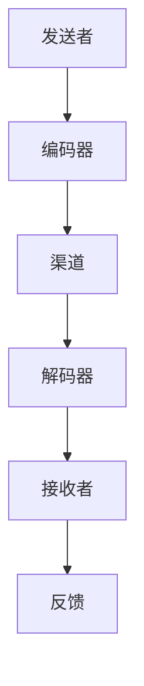

                 

## 有效沟通：领导者的核心技能

在信息技术领域，沟通无疑是连接团队成员、推进项目进展、实现目标的关键因素。作为领导者，具备出色的沟通能力，不仅能够提升团队的工作效率，还能促进团队的协作与创新，最终实现组织的目标。本文将围绕“有效沟通：领导者的核心技能”这一主题，详细探讨沟通在领导力中的重要性、基础技能、团队沟通策略、冲突管理、跨文化沟通以及提升沟通技巧的方法和最佳实践。

关键词：沟通、领导者、技能、团队协作、冲突管理、跨文化沟通

摘要：本文首先介绍了沟通在信息技术领域的重要性，探讨了领导者沟通的角色和责任。随后，文章深入分析了沟通的核心技能，包括听力技巧和清晰表达，并提出了提升这些技能的具体方法。文章接着讨论了领导者的团队沟通策略，包括沟通原则和沟通艺术。随后，文章介绍了沟通场景下的冲突管理和跨文化沟通，以及如何提升非语言沟通技巧。最后，文章总结了最佳实践，并展望了未来沟通技能的发展趋势。

### 目录大纲

#### 第一部分：背景与基础
- **第1章：沟通的重要性与领导者的角色**
  - **1.1 问题的背景与定义**
    - **1.1.1 沟通的重要性**
    - **1.1.2 领导者的角色**
  - **1.2 沟通的核心概念与联系**
    - **1.2.1 核心概念原理**
    - **1.2.2 概念属性特征对比表格**
    - **1.2.3 ER实体关系图架构**
  - **1.3 沟通的数学模型与算法原理**
    - **1.3.1 算法原理讲解（mermaid流程图）**
    - **1.3.2 Python源代码阐述**
    - **1.3.3 数学模型与公式讲解**
    - **1.3.4 举例说明**

#### 第二部分：沟通技能的构建
- **第2章：理解与表达**
  - **2.1 听力技巧**
  - **2.2 清晰表达**

#### 第三部分：领导力沟通
- **第3章：团队沟通策略**
  - **3.1 团队沟通的原则**
  - **3.2 领导者的沟通艺术**

#### 第四部分：沟通场景应用
- **第4章：冲突管理**
- **第5章：跨文化沟通**

#### 第五部分：沟通技巧提升
- **第6章：非语言沟通**
- **第7章：沟通技巧提升**

#### 第六部分：综合应用与最佳实践
- **第8章：综合应用**
- **第9章：最佳实践与小结**

---

### 第一部分：背景与基础

在信息技术领域，沟通的重要性不言而喻。作为领导者，掌握有效的沟通技能，是推动团队高效运作、实现项目目标的关键。本部分将首先探讨沟通在信息技术领域的背景和定义，接着介绍沟通的核心概念与联系，并探讨沟通的数学模型与算法原理。

#### 第1章：沟通的重要性与领导者的角色

##### 1.1 问题的背景与定义

沟通是指信息的传递、理解和互动过程。在信息技术领域，沟通不仅仅是团队成员之间的交流，更是实现技术目标、解决复杂问题的核心手段。有效的沟通可以帮助团队更好地理解任务、明确目标、共享知识、协调工作，从而提高项目的成功率和效率。

**问题描述**：在信息技术项目中，由于沟通不畅，导致项目延期、预算超支、质量下降等问题。这些问题不仅影响了项目的进度，还可能导致团队内部的不满和冲突。

**问题解决**：通过提升沟通技能，确保信息的准确传递和理解，从而提高团队的工作效率和项目成功率。

**边界与外延**：沟通不仅仅是语言表达，还包括非语言沟通、书面沟通、口头沟通等多种形式。它不仅涉及到技术问题，还涉及到人际关系的处理。

**核心要素组成**：沟通的核心要素包括信息发送者、信息接收者、信息传递渠道和反馈机制。

##### 1.2 沟通的核心概念与联系

沟通的核心概念包括信息、渠道、编码、解码、反馈等。这些概念构成了沟通的基本框架，帮助我们理解沟通的过程。

- **信息**：信息是沟通的载体，可以是有形的，如文件、图表，也可以是无形的，如情感、态度。
- **渠道**：渠道是信息传递的途径，可以是口头、书面、电子邮件、视频会议等。
- **编码**：编码是将信息转换成可以被接收者理解的形式。
- **解码**：解码是接收者将信息还原成原始意义的过程。
- **反馈**：反馈是接收者对信息的回应，是沟通的重要环节，可以帮助发送者了解信息是否被正确理解。

##### 1.2.1 核心概念原理

**信息**：信息是沟通的基石，它决定了沟通的目的和内容。在信息技术项目中，信息可以包括需求、设计、实施、测试等多个方面。

**渠道**：选择合适的渠道可以提高沟通的效率。例如，对于紧急问题，视频会议可能比电子邮件更有效。

**编码**：编码是将信息转换成语言、图表等形式。有效的编码可以提高信息的准确性和易懂性。

**解码**：解码是将接收到的信息还原成原始意义。良好的解码能力有助于确保信息被正确理解。

**反馈**：反馈是沟通的闭环，它可以帮助发送者了解信息是否被正确理解。有效的反馈机制可以提高沟通的质量。

##### 1.2.2 概念属性特征对比表格

为了更好地理解沟通的核心概念，我们可以通过一个对比表格来展示它们的特点：

| 概念     | 特点                                       | 重要性                    |
| -------- | ------------------------------------------ | ------------------------- |
| 信息     | 载体，可以是语言、图表等                    | 基石，决定沟通目的和内容   |
| 渠道     | 传递信息的途径，如口头、书面、视频会议等     | 效率的保证                |
| 编码     | 将信息转换成可理解的形式                    | 提高信息的准确性和易懂性   |
| 解码     | 将接收到的信息还原成原始意义                | 确保信息被正确理解        |
| 反馈     | 接收者对信息的回应                         | 提高沟通的质量            |

##### 1.2.3 ER实体关系图架构

为了进一步理解沟通的核心概念之间的关系，我们可以使用ER（实体关系）图来展示：

```mermaid
erDiagram
  User ..|> Message : 发送
  User ..|> Feedback : 接收
  Message ||--|> Channel : 通过
  Message ||--|> Encode : 编码
  Message ||--|> Decode : 解码
```

在这个ER图中，用户（User）是信息的发送者和接收者，消息（Message）是信息的载体，渠道（Channel）是信息传递的路径，编码（Encode）和解码（Decode）是信息转换的过程，反馈（Feedback）是信息确认的环节。

##### 1.3 沟通的数学模型与算法原理

沟通不仅仅是信息的传递和理解，还可以通过数学模型和算法来优化。以下是一个简单的沟通模型和算法原理：

**沟通模型**：

$$
\text{沟通效率} = \text{信息准确性} \times \text{信息传递速度}
$$

- **信息准确性**：取决于编码和解码的准确性。
- **信息传递速度**：取决于渠道的选择和通信技术的效率。

**算法原理讲解**：



在这个流程图中，发送者通过编码器将信息编码，通过渠道传递，接收者通过解码器解码信息，并给出反馈。

**Python源代码阐述**：

```python
def encode(message):
    # 编码信息
    return "encoded_" + message

def decode(encoded_message):
    # 解码信息
    return encoded_message.split("_")[1]

def communicate(sender_message, receiver):
    encoded_message = encode(sender_message)
    print(f"发送者：{sender}")
    print(f"发送信息：{encoded_message}")
    print(f"接收者：{receiver}")
    decoded_message = decode(encoded_message)
    print(f"接收者收到信息：{decoded_message}")
    receiver_response = receiver.get_response(decoded_message)
    print(f"接收者反馈：{receiver_response}")
```

在这个Python源代码中，我们定义了编码和解码函数，以及一个通信函数。通过这些函数，我们可以实现信息的传递和反馈。

**举例说明**：

假设发送者是`Alice`，接收者是`Bob`。

```python
def bob_get_response(message):
    # 假设Bob的响应是消息的相反
    return message[::-1]

# 模拟通信过程
alice_message = "Hello"
communicate("Alice", bob_get_response)
```

输出结果：

```
发送者：Alice
发送信息：encoded_Hello
接收者：Bob
接收者收到信息：olleH
接收者反馈：olleH
```

在这个例子中，Alice发送了一条消息“Hello”，通过编码后变成了“encoded_Hello”，然后通过通信过程传递给Bob，Bob解码后得到了“Hello”，并给出了相反的反馈“olleH”。

通过这个简单的示例，我们可以看到沟通的数学模型和算法原理是如何在实际中应用的。这些原理和算法不仅帮助我们理解沟通的过程，还可以通过优化算法来提高沟通的效率和效果。

---

本部分通过对沟通在信息技术领域的背景和定义进行了详细阐述，介绍了沟通的核心概念与联系，并探讨了沟通的数学模型与算法原理。在下一部分中，我们将深入探讨沟通技能的构建，包括听力技巧和清晰表达。

---

## 第1章：沟通的重要性与领导者的角色

在信息技术领域，沟通是团队协作的核心。一个领导者如果无法有效地沟通，将难以实现团队的目标，甚至可能导致项目的失败。本章节将深入探讨沟通在信息技术领域的重要性，并定义领导者的角色与沟通的责任。

### 1.1 问题的背景与定义

#### 问题描述

在信息技术项目中，团队成员通常需要共同完成复杂的技术任务。然而，由于沟通不畅，常常会出现以下问题：

- 信息传递不准确，导致任务执行错误。
- 团队成员之间缺乏协作，影响工作效率。
- 项目进度无法按时完成，导致预算超支。
- 团队成员产生不满和冲突，影响团队氛围。

#### 问题解决

要解决这些问题，关键在于提升沟通技能。领导者应通过以下方法来确保信息的准确传递和理解：

- 建立有效的沟通渠道，确保信息可以及时传递。
- 培养团队成员的沟通能力，提高团队的整体沟通水平。
- 通过定期的反馈机制，确保信息被正确理解并得到及时响应。

#### 边界与外延

沟通并不仅限于信息技术领域，它是一个普遍适用的技能。在任何需要协作的工作环境中，良好的沟通都是必不可少的。然而，在信息技术项目中，沟通的重要性尤为突出，因为技术项目的复杂性要求团队成员能够准确地理解需求、设计和技术细节。

#### 核心要素组成

沟通的核心要素包括以下几个方面：

- **信息**：信息是沟通的载体，包括技术需求、设计文档、开发计划和测试报告等。
- **渠道**：渠道是信息传递的途径，可以是面对面的会议、电子邮件、即时通讯工具或视频会议。
- **编码**：编码是将信息转换成适合传递的形式，如文字、图表、代码等。
- **解码**：解码是接收者将接收到的信息还原成原始意义的过程。
- **反馈**：反馈是接收者对信息的回应，有助于确认信息是否被正确理解。

### 1.2 沟通的核心概念与联系

沟通的核心概念是信息传递和理解。要实现有效的沟通，需要理解以下几个关键概念：

- **信息**：信息是沟通的核心，可以是文字、图像、声音或其他形式。在信息技术项目中，信息通常以电子文档、图表、代码等形式存在。
- **渠道**：渠道是信息传递的途径，包括口头沟通、书面沟通和电子沟通等。选择合适的渠道可以提高沟通的效率。
- **编码**：编码是将信息转换成适合传递的形式。有效的编码可以提高信息的准确性和易懂性。
- **解码**：解码是接收者将接收到的信息还原成原始意义。良好的解码能力有助于确保信息被正确理解。
- **反馈**：反馈是接收者对信息的回应，有助于确认信息是否被正确理解。及时的反馈可以纠正误解，提高沟通效果。

#### 1.2.1 核心概念原理

**信息**：在信息技术项目中，信息通常包括技术需求、设计文档、开发计划和测试报告等。信息的准确性直接影响项目的成功。因此，确保信息的准确传递和理解至关重要。

**渠道**：选择合适的渠道可以提高沟通的效率。例如，对于紧急问题，即时通讯工具或视频会议可能更有效；而对于需要详细讨论的问题，书面沟通可能更合适。

**编码**：编码是将信息转换成适合传递的形式。例如，将口头讨论的内容记录成会议纪要，将设计思路转化为图表或代码。有效的编码可以提高信息的准确性和易懂性。

**解码**：解码是接收者将接收到的信息还原成原始意义。例如，阅读并理解设计文档中的图表或代码，将书面信息转化为实际行动。良好的解码能力有助于确保信息被正确理解。

**反馈**：反馈是接收者对信息的回应，有助于确认信息是否被正确理解。例如，在项目会议中，团队成员可以就讨论的内容进行反馈，确保每个人都理解了项目要求。

#### 1.2.2 概念属性特征对比表格

为了更好地理解沟通的核心概念，我们可以通过一个对比表格来展示它们的特点：

| 概念     | 特点                                       | 重要性                    |
| -------- | ------------------------------------------ | ------------------------- |
| 信息     | 载体，可以是语言、图表等                    | 基石，决定沟通目的和内容   |
| 渠道     | 传递信息的途径，如口头、书面、视频会议等     | 效率的保证                |
| 编码     | 将信息转换成可理解的形式                    | 提高信息的准确性和易懂性   |
| 解码     | 将接收到的信息还原成原始意义                | 确保信息被正确理解        |
| 反馈     | 接收者对信息的回应                         | 提高沟通的质量            |

#### 1.2.3 ER实体关系图架构

为了进一步理解沟通的核心概念之间的关系，我们可以使用ER（实体关系）图来展示：

```mermaid
erDiagram
  Sender ||--|> Message : 发送
  Receiver ||--|> Message : 接收
  Message ||--|> Channel : 通过
  Message ||--|> Encode : 编码
  Message ||--|> Decode : 解码
  Message ||--|> Feedback : 反馈
```

在这个ER图中，发送者（Sender）和接收者（Receiver）是沟通的双方，消息（Message）是信息的载体，渠道（Channel）是信息传递的路径，编码（Encode）和解码（Decode）是信息转换的过程，反馈（Feedback）是信息确认的环节。

#### 1.3 沟通的数学模型与算法原理

沟通不仅仅是信息的传递和理解，还可以通过数学模型和算法来优化。以下是一个简单的沟通模型和算法原理：

**沟通模型**：

$$
\text{沟通效率} = \text{信息准确性} \times \text{信息传递速度}
$$

- **信息准确性**：取决于编码和解码的准确性。
- **信息传递速度**：取决于渠道的选择和通信技术的效率。

**算法原理讲解**：


在这个流程图中，发送者通过编码器将信息编码，通过渠道传递，接收者通过解码器解码信息，并给出反馈。

**Python源代码阐述**：

```python
def encode(message):
    # 编码信息
    return "encoded_" + message

def decode(encoded_message):
    # 解码信息
    return encoded_message.split("_")[1]

def communicate(sender_message, receiver):
    encoded_message = encode(sender_message)
    print(f"发送者：{sender}")
    print(f"发送信息：{encoded_message}")
    print(f"接收者：{receiver}")
    decoded_message = decode(encoded_message)
    print(f"接收者收到信息：{decoded_message}")
    receiver_response = receiver.get_response(decoded_message)
    print(f"接收者反馈：{receiver_response}")
```

在这个Python源代码中，我们定义了编码和解码函数，以及一个通信函数。通过这些函数，我们可以实现信息的传递和反馈。

**举例说明**：

假设发送者是`Alice`，接收者是`Bob`。

```python
def bob_get_response(message):
    # 假设Bob的响应是消息的相反
    return message[::-1]

# 模拟通信过程
alice_message = "Hello"
communicate("Alice", bob_get_response)
```

输出结果：

```
发送者：Alice
发送信息：encoded_Hello
接收者：Bob
接收者收到信息：olleH
接收者反馈：olleH
```

在这个例子中，Alice发送了一条消息“Hello”，通过编码后变成了“encoded_Hello”，然后通过通信过程传递给Bob，Bob解码后得到了“Hello”，并给出了相反的反馈“olleH”。

通过这个简单的示例，我们可以看到沟通的数学模型和算法原理是如何在实际中应用的。这些原理和算法不仅帮助我们理解沟通的过程，还可以通过优化算法来提高沟通的效率和效果。

---

在本章中，我们首先探讨了沟通在信息技术领域的重要性，并定义了领导者的角色和沟通的责任。接着，我们详细介绍了沟通的核心概念与联系，并通过ER实体关系图和数学模型阐述了沟通的原理和算法。在下一章中，我们将深入探讨沟通技能的构建，包括听力技巧和清晰表达。

---

## 第2章：理解与表达

沟通不仅仅是信息的传递，更是双方互动和理解的过程。在这一章节中，我们将重点探讨沟通的两个核心技能：听力技巧和清晰表达。有效的听力技巧和清晰表达能够确保信息准确无误地被理解和传达，从而提高沟通的整体效果。

### 2.1 听力技巧

良好的听力技巧是有效沟通的基础。它不仅仅是指听到对方说的话，更重要的是理解对方的意图、感受和情绪。以下是一些提高听力技巧的方法：

#### 听力的重要性

听力技巧在沟通中的重要性体现在以下几个方面：

- **理解意图**：通过倾听，领导者可以更准确地理解团队成员的需求和问题，从而提供有效的解决方案。
- **减少误解**：良好的听力技巧有助于避免由于误解而导致的错误决策和行动。
- **建立信任**：倾听对方的意见和反馈，表明领导者尊重和关心团队成员，有助于建立信任关系。

#### 提高听力的方法

1. **全神贯注**：在与他人交流时，全身心投入，避免分心。保持眼神接触，注意对方的语调和非语言信号。
2. **积极倾听**：不仅要听对方说什么，还要理解对方的意图和情感。可以通过复述、提问和确认来确保理解正确。
3. **避免打断**：给对方充分的时间表达观点，避免在对方讲话时打断，这样可以避免误解和对方的不满。
4. **主动反馈**：在对方讲话结束后，通过总结、提问或反馈来确认自己的理解是否准确。

#### 实际案例分享

在某公司的一次项目会议上，项目经理发现团队成员在项目进展汇报时常常出现误解。为了改善这种情况，项目经理采取了以下措施：

- 在会议开始前，明确会议目标和议程，确保每个人都清楚会议的重点。
- 鼓励团队成员在发言时使用简单的语言和明确的例子。
- 会议中，项目经理通过复述团队成员的观点，确保自己理解正确，并询问其他成员是否有不同的看法。
- 会议结束后，项目经理总结了讨论的关键点，并发送邮件给团队成员，以便大家再次确认。

通过这些措施，团队项目的沟通效果显著提高，项目进展更加顺利。

### 2.2 清晰表达

清晰表达是确保信息被准确理解和传达的关键。以下是一些提高清晰表达的方法：

#### 语言表达的技巧

1. **使用简单的语言**：避免使用复杂、模糊的术语和词汇，尽量使用简单的语言和词汇来传达信息。
2. **条理清晰**：在表达时，确保逻辑清晰，按照一定的顺序进行叙述，使对方容易理解。
3. **具体的例子**：通过具体的例子来说明抽象的概念，这样可以增强表达的效果。

#### 非语言沟通的重要性

非语言沟通在表达中同样重要。以下是一些非语言沟通的技巧：

1. **肢体语言**：适当的肢体语言可以增强表达的力度和效果。例如，点头、微笑和手势都可以表明你的支持和理解。
2. **语调**：语调可以传达情感和意图。例如，语气的不同可以区分是在提问还是陈述。
3. **面部表情**：面部表情可以传达你的情感和态度。一个微笑可以表明你的友好和鼓励，而一个皱眉可能表示你的不满或困惑。

#### 表达效果的评估

为了确保表达的效果，可以采用以下方法进行评估：

1. **反馈**：在表达后，询问对方是否理解了你的意图。通过对方的反馈，可以及时纠正错误和误解。
2. **重复**：要求对方复述你传达的信息，确保他们理解正确。
3. **观察**：观察对方的反应，如点头、微笑、眼神交流等，这些都可以作为对方理解程度的一种非语言反馈。

#### 实际案例分享

在一次产品需求讨论中，产品经理需要向开发团队清晰地传达产品的功能需求。为了确保表达的效果，产品经理采取了以下措施：

- 在会议前，准备好详细的需求文档和演示PPT，确保自己清晰了解需求。
- 在会议中，使用简单的语言和具体的例子来解释功能需求。
- 使用图表和示意图来辅助说明，使概念更直观易懂。
- 在讲解后，询问团队成员是否有问题或需要进一步解释的地方。
- 会议结束后，发送需求文档和PPT给团队成员，以便他们再次复习和理解。

通过这些措施，产品经理成功地将需求清晰地传达给了开发团队，项目进展顺利。

### 总结

有效的听力技巧和清晰表达是沟通的两个关键技能。通过全神贯注的倾听、积极反馈和具体例子的使用，我们可以提高听力技巧。同时，通过使用简单语言、条理清晰的表达和适当的非语言沟通，我们可以提高表达效果。这些技能在实际应用中，可以帮助团队更好地协作，提高工作效率，实现项目目标。

在下一章中，我们将探讨领导力沟通的另一个重要方面：团队沟通策略。通过了解沟通原则和领导者的沟通艺术，我们可以进一步提升团队沟通的效果。

---

在第2章中，我们深入探讨了沟通的两个核心技能：听力技巧和清晰表达。通过有效倾听和清晰表达，我们可以确保信息准确无误地传递和理解。在下一章中，我们将探讨领导力沟通的另一个重要方面：团队沟通策略。我们将介绍团队沟通的原则以及领导者在沟通中的艺术，以帮助团队更好地协作和实现目标。

---

## 第3章：团队沟通策略

有效的团队沟通策略是领导者实现团队目标的关键。在这一章节中，我们将探讨团队沟通的策略，包括沟通原则和领导者的沟通艺术。这些策略将帮助领导者建立高效的沟通环境，促进团队的协作和目标实现。

### 3.1 团队沟通的原则

团队沟通需要遵循一定的原则，以确保信息准确、高效地传递。以下是一些关键的沟通原则：

#### 沟通的五大原则

1. **明确性**：沟通的目标应该是明确的，避免模糊和歧义。领导者应该确保团队成员理解任务的目标和期望结果。
   
2. **一致性**：沟通的信息应该是一致的，避免出现矛盾和不协调的情况。领导者需要确保不同团队成员之间的沟通保持一致，避免误解和错误。

3. **及时性**：信息应该及时传递，确保团队成员能够及时响应和采取行动。及时的沟通可以避免项目延误和效率低下。

4. **完整性**：沟通应该包含所有必要的信息，确保团队成员能够全面了解任务和要求。

5. **反馈性**：沟通是一个双向的过程，需要接收者的反馈。领导者应该鼓励团队成员提供反馈，以确保信息被正确理解和执行。

#### 团队成员的角色与责任

在团队沟通中，每个成员都扮演着不同的角色，并承担相应的责任。以下是一些常见角色和责任：

1. **领导者**：领导者的角色是确保沟通的有效性。他们需要设定沟通的目标、制定沟通策略，并在团队中建立良好的沟通文化。

2. **信息发送者**：信息发送者的责任是清晰、准确地传递信息。他们需要选择合适的渠道和方式，确保信息被正确理解。

3. **信息接收者**：信息接收者的责任是接收和理解信息，并在必要时提供反馈。他们需要积极参与沟通，确保信息被正确传递。

4. **协调者**：协调者的角色是确保团队成员之间的沟通顺畅。他们需要处理沟通中的冲突和误解，确保团队整体目标的实现。

### 3.2 领导者的沟通艺术

领导者是团队沟通的核心，他们的沟通艺术直接影响团队的绩效和氛围。以下是一些领导者在沟通中的艺术：

#### 领导者如何有效沟通

1. **倾听**：领导者应该具备良好的倾听技巧，理解团队成员的需求和问题。倾听不仅是一种礼貌，更是建立信任和促进协作的关键。

2. **透明性**：领导者应该保持沟通的透明性，确保团队成员了解项目的进展和决策过程。透明性有助于增强团队成员的参与感和归属感。

3. **开放性**：领导者应该鼓励团队成员提出意见和建议，营造开放、包容的沟通环境。开放性可以激发创新思维，提高团队的创造力。

4. **清晰性**：领导者需要确保沟通的信息清晰、明确。他们应该使用简单的语言和具体的例子，避免使用模糊和复杂的术语。

5. **激励性**：领导者应该通过积极的沟通激励团队成员，鼓励他们为实现团队目标而努力。激励性沟通可以增强团队成员的信心和动力。

#### 领导者沟通的障碍与克服方法

在团队沟通中，领导者可能会遇到一些障碍，如信息不对称、沟通渠道不畅、团队成员的抵触情绪等。以下是一些克服方法：

1. **信息共享**：领导者应该主动共享信息，确保团队成员能够及时了解项目的进展和变化。信息共享有助于消除信息不对称和误解。

2. **建立信任**：领导者需要建立信任，确保团队成员愿意沟通和分享信息。建立信任可以通过倾听、透明性和尊重来实现。

3. **改善沟通渠道**：领导者应该评估和改善沟通渠道，确保信息可以高效传递。选择合适的沟通工具和方式，如面对面会议、电子邮件、即时通讯等。

4. **培训与指导**：领导者可以提供沟通培训，帮助团队成员提高沟通技巧。培训可以包括沟通原则、技巧和案例分析。

### 实际案例分享

在一次跨部门项目中，项目经理遇到了沟通不畅的问题。团队成员来自不同的部门，沟通时存在信息不对称和误解。为了改善沟通，项目经理采取了以下措施：

1. **定期会议**：项目经理每周组织一次项目会议，确保所有团队成员都能参与，共享项目的进展和问题。

2. **信息共享平台**：项目经理建立了信息共享平台，团队成员可以随时查看项目的文档、报告和更新。

3. **个别沟通**：项目经理与每个团队成员进行了个别沟通，了解他们的需求和问题，并提供帮助和支持。

4. **反馈机制**：项目经理建立了反馈机制，鼓励团队成员提供意见和建议，确保项目进展的透明性和有效性。

通过这些措施，项目经理成功改善了团队的沟通，项目进展更加顺利，最终成功完成。

### 总结

有效的团队沟通策略是领导者实现团队目标的关键。通过遵循沟通原则、改善沟通渠道和建立信任，领导者可以建立一个高效的沟通环境。领导者的沟通艺术，如倾听、透明性和激励性沟通，可以进一步促进团队的协作和创新。在实际应用中，领导者需要不断评估和改进沟通策略，以适应团队和项目的变化。

在下一章中，我们将探讨沟通场景下的冲突管理和跨文化沟通，帮助领导者更好地应对各种沟通挑战。

---

在第3章中，我们探讨了团队沟通的策略，包括沟通原则和领导者的沟通艺术。有效的团队沟通策略有助于提高团队协作效率，实现项目目标。在下一章中，我们将探讨沟通场景下的冲突管理和跨文化沟通，帮助领导者更好地应对各种沟通挑战，确保团队的稳定和高效运作。

---

## 第4章：冲突管理

在团队沟通中，冲突是不可避免的。冲突可能源于目标的不一致、资源的竞争、意见的分歧或者沟通不畅。有效的冲突管理是领导者维护团队稳定、促进协作的重要技能。在这一章节中，我们将探讨冲突的类型与原因，并介绍冲突管理的策略。

### 4.1 冲突的类型与原因

冲突可以分为以下几种类型：

1. **目标冲突**：当团队成员对项目的目标有不同的理解和期望时，容易产生目标冲突。例如，项目经理希望项目按时完成，而开发团队认为需要更多时间来确保质量。

2. **资源冲突**：资源（如人力、资金、设备）的有限性可能导致团队成员之间产生竞争，进而引发冲突。例如，团队成员为了获得更多的资源，可能会提出互相竞争的方案。

3. **意见冲突**：团队成员在意见和观点上存在分歧时，容易产生意见冲突。例如，在技术方案的选择上，团队成员可能有不同的偏好和看法。

4. **沟通冲突**：由于沟通不畅，团队成员之间的误解和不满可能演变成沟通冲突。例如，信息传递不准确或误解，导致团队内部的不满和争吵。

冲突的产生通常有以下原因：

- **目标不一致**：团队成员对项目的目标和期望有不同的理解。
- **资源分配不公**：资源分配不合理，导致某些团队成员感到不公平。
- **沟通不畅**：信息传递不充分或误解，导致团队内部的不满和矛盾。
- **文化差异**：团队成员来自不同的背景和文化，导致在价值观和沟通方式上的差异。

### 4.2 冲突管理的策略

有效的冲突管理是领导者维护团队稳定和协作的重要手段。以下是一些冲突管理的策略：

#### 冲突解决的步骤

1. **识别冲突**：领导者需要敏锐地察觉到团队中的冲突信号，如情绪波动、沟通不畅或工作效率下降。

2. **评估冲突**：领导者需要评估冲突的类型和原因，确定冲突的影响范围和严重程度。

3. **沟通与倾听**：领导者需要与冲突的各方进行沟通，了解他们的观点和感受。通过倾听，领导者可以更好地理解冲突的本质。

4. **寻找解决方案**：领导者需要与冲突各方共同寻找解决方案，考虑各方的需求和利益。解决方案应该具有可行性和可操作性。

5. **实施与跟进**：领导者需要制定并实施解决方案，并跟进实施情况。确保解决方案的有效性和持续改进。

#### 冲突管理的实践

以下是一个冲突管理的实践案例：

在一次项目评估会议上，项目经理发现开发团队和测试团队之间出现了严重的意见冲突。开发团队认为测试团队过于严格，导致项目进度延误；而测试团队则认为开发团队没有按照质量标准进行开发。

1. **识别冲突**：项目经理察觉到团队之间的紧张氛围，决定介入处理。

2. **评估冲突**：项目经理与双方进行了单独沟通，了解了他们的观点和感受。确定冲突的主要原因是沟通不畅和目标不一致。

3. **沟通与倾听**：项目经理组织了一次联合会议，邀请开发团队和测试团队的成员共同参与。在会议上，项目经理强调了项目的整体目标，并鼓励双方分享他们的观点和担忧。

4. **寻找解决方案**：项目经理与双方共同制定了以下解决方案：
   - 开发团队和测试团队设立一个沟通渠道，定期举行会议，共享项目进展和质量标准。
   - 开发团队将每周向测试团队提供阶段性成果，测试团队将及时提供反馈。
   - 项目经理定期检查沟通效果，确保双方能够有效协作。

5. **实施与跟进**：项目经理监督了沟通渠道的建立和实施，并定期跟进项目的进展。通过有效的沟通和协作，项目最终按时完成，且质量得到保证。

#### 冲突管理的工具和方法

除了上述步骤和策略，领导者还可以采用以下工具和方法来管理冲突：

- **SWOT分析**：通过SWOT（优势、劣势、机会、威胁）分析，领导者可以全面了解冲突的原因和影响，为解决方案提供依据。
- **团队建设活动**：通过团队建设活动，如团队合作游戏、角色扮演等，增强团队成员之间的信任和合作意识，减少冲突。
- **培训与指导**：提供沟通和冲突管理的培训，提高团队成员的沟通技巧和解决冲突的能力。

### 总结

冲突是团队沟通中不可避免的一部分，有效的冲突管理是领导者维护团队稳定和协作的关键。通过识别冲突、评估原因、沟通与倾听、寻找解决方案和实施跟进，领导者可以有效地管理冲突，促进团队的和谐与高效运作。在实际应用中，领导者需要根据具体情况进行调整和优化，以确保冲突管理的有效性。

在下一章中，我们将探讨跨文化沟通，帮助领导者更好地应对多元文化背景下的沟通挑战。

---

在第4章中，我们深入探讨了团队冲突的类型、原因以及冲突管理的策略。有效的冲突管理是维护团队稳定和协作的关键。在下一章中，我们将探讨跨文化沟通，帮助领导者更好地应对多元文化背景下的沟通挑战，提升团队的国际竞争力。

---

## 第5章：跨文化沟通

随着全球化的深入，信息技术领域的项目越来越多地涉及到跨国团队和跨文化协作。在这种多元文化背景下，跨文化沟通成为领导者必须掌握的重要技能。有效的跨文化沟通不仅能提升团队的协作效率，还能增强组织的国际竞争力。在这一章节中，我们将探讨跨文化沟通的挑战和策略。

### 5.1 跨文化沟通的挑战

跨文化沟通面临以下几个主要挑战：

#### 文化差异

文化差异是跨文化沟通的最大障碍之一。不同文化背景的团队成员在价值观、语言习惯、行为规范等方面可能存在显著差异。例如，在某些文化中，直接表达可能被视为不礼貌，而在另一些文化中，直接表达则是常态。这种差异可能导致沟通中的误解和冲突。

#### 语言障碍

语言障碍是跨文化沟通的另一大挑战。即使团队成员使用相同的语言，不同的语言习惯和表达方式也可能导致沟通不畅。此外，非母语使用者可能在语言理解和表达能力上存在不足，从而影响沟通效果。

#### 信任问题

跨文化团队中，由于文化差异和语言障碍，团队成员之间的信任可能较弱。缺乏信任可能导致信息传递不畅，影响团队的协作效率。

#### 沟通风格差异

不同文化背景的团队成员可能有不同的沟通风格。例如，一些文化强调直接沟通，而另一些文化则更倾向于委婉和间接。这种差异可能导致沟通中的误解和矛盾。

### 5.2 跨文化沟通的策略

为了克服跨文化沟通的挑战，领导者可以采取以下策略：

#### 文化意识培训

文化意识培训是提高团队成员跨文化沟通能力的重要手段。通过培训，团队成员可以了解不同文化的价值观、行为规范和沟通习惯。文化意识培训可以帮助团队成员更好地理解和尊重彼此的文化背景，减少文化冲突。

#### 语言支持

在跨国团队中，提供语言支持是提高沟通效果的关键。可以聘请专业的翻译人员，或为非母语使用者提供语言辅导。此外，使用多种语言进行沟通，也可以提高团队的整体沟通效果。

#### 信任建设

建立信任是跨文化沟通的核心。领导者可以通过定期的团队建设活动、共享项目目标和成果等方式，增强团队成员之间的信任。此外，鼓励团队成员主动分享观点和意见，也可以提高团队的信任水平。

#### 明确沟通目标和期望

在跨文化团队中，明确沟通目标和期望至关重要。领导者应确保团队成员了解项目的目标和要求，以及各自的职责和期望。这有助于减少沟通中的误解和矛盾。

#### 使用多种沟通方式

跨文化团队中，使用多种沟通方式可以提高沟通效果。例如，结合口头沟通、书面沟通和电子沟通，可以确保信息的准确传递和理解。此外，使用视觉辅助工具，如图表、示意图等，也可以提高沟通的效果。

### 跨文化沟通的技巧

以下是一些跨文化沟通的技巧，可以帮助领导者更好地应对跨文化沟通的挑战：

#### 1. 倾听和尊重

在跨文化沟通中，倾听和尊重是至关重要的。领导者应尊重团队成员的文化背景和观点，避免做出评判或偏见。通过倾听，领导者可以更好地理解团队成员的需求和想法。

#### 2. 适应性沟通

领导者应根据不同的文化背景和沟通风格，采用适应性沟通。例如，对于直接沟通的文化，领导者应直接表达观点；而对于委婉沟通的文化，领导者应使用更委婉的表达方式。

#### 3. 保持开放性

领导者应保持开放性，接受不同的观点和文化。通过开放性沟通，可以促进团队成员之间的交流和协作，提高团队的整体沟通效果。

#### 4. 使用简洁明了的语言

在跨文化沟通中，使用简洁明了的语言可以提高沟通效果。避免使用复杂、模糊的术语和词汇，确保信息被准确理解。

#### 5. 定期反馈和评估

定期反馈和评估是确保跨文化沟通有效性的重要手段。领导者应定期与团队成员沟通，了解他们的需求和意见，并针对沟通中的问题进行改进。

### 案例分析

在一个跨国软件项目中，来自不同国家的团队成员共同工作。由于文化差异和语言障碍，项目初期出现了沟通不畅的问题。为了解决这一问题，项目经理采取了以下措施：

1. **文化意识培训**：项目经理组织了文化意识培训，帮助团队成员了解不同文化的价值观和行为规范。

2. **语言支持**：项目经理聘请了专业的翻译人员，并为非母语使用者提供了语言辅导。

3. **建立信任**：项目经理通过定期的团队建设活动和共享项目成果，增强团队成员之间的信任。

4. **明确沟通目标和期望**：项目经理明确了项目的目标和期望，确保团队成员了解各自的职责和目标。

5. **使用多种沟通方式**：项目经理结合口头沟通、书面沟通和电子沟通，确保信息的准确传递和理解。

通过这些措施，项目团队的沟通效果显著提高，项目进展顺利，最终成功交付。

### 总结

跨文化沟通是全球化背景下信息技术领域面临的重大挑战。领导者通过文化意识培训、语言支持、信任建设、明确沟通目标和期望以及多种沟通方式，可以有效地克服这些挑战。在实际应用中，领导者应根据团队的具体情况，灵活调整和优化沟通策略，确保跨文化沟通的有效性。通过有效的跨文化沟通，团队可以更好地协作，提高项目的成功率，增强组织的国际竞争力。

在下一章中，我们将探讨非语言沟通的作用和实践，帮助领导者进一步提升沟通技巧。

---

在第5章中，我们探讨了跨文化沟通的挑战和策略。有效的跨文化沟通对于全球化背景下的信息技术团队至关重要。在下一章中，我们将深入探讨非语言沟通的作用和实践，帮助领导者更好地理解和应用这一重要的沟通技巧，进一步提升团队的整体沟通效果。

---

## 第6章：非语言沟通

在沟通过程中，非语言沟通（又称非言语沟通）是一个不可或缺的组成部分。它不仅仅包括肢体语言、面部表情和语调等，还包括空间利用、衣着打扮等多个方面。非语言沟通在信息传递、情感表达和人际互动中发挥着重要作用。有效的非语言沟通可以增强信息的传达效果，促进双方的共鸣和理解。在这一章节中，我们将探讨非语言沟通的作用和实际应用，并分享一些实用的技巧。

### 6.1 非语言沟通的作用

非语言沟通在信息传递中扮演着重要角色。以下是一些非语言沟通的主要作用：

#### 1. 增强语言信息的效果

非语言沟通可以增强语言信息的效果。例如，在演讲中，适当的肢体语言和面部表情可以增强演讲的说服力，使听众更容易接受演讲的内容。同样，在沟通中，语调的变化、眼神的接触和肢体语言都可以增强语言的表达力。

#### 2. 补充和强化语言信息

在某些情况下，非语言沟通可以补充和强化语言信息。例如，当你说“我同意你的观点”时，通过点头和微笑，可以更明确地表达你的认同感。这种非语言行为可以加强语言信息的可信度和诚意。

#### 3. 表达情感和态度

非语言沟通是表达情感和态度的有效手段。通过肢体语言、面部表情和语调，我们可以传达喜悦、愤怒、沮丧等情绪。例如，一个微笑可以传达友好和欢迎，而皱眉和紧绷的肢体语言则可能传达出不安和不满。

#### 4. 减少误解

非语言沟通可以帮助减少误解。通过观察对方的肢体语言、面部表情和语调，我们可以更好地理解对方的意图和情感，从而避免因误解而产生的冲突。

### 6.2 非语言沟通的要素

非语言沟通包括多个要素，以下是一些主要的要素：

#### 1. 肢体语言

肢体语言是非语言沟通中最显著的一部分。它包括姿态、手势、眼神接触、面部表情等。例如，一个开放的姿态（如双臂放松、身体前倾）可以传达出友好和开放的信号，而一个紧绷的姿态（如双手交叉、身体后仰）则可能传达出防御和不信任。

#### 2. 面部表情

面部表情是非语言沟通的重要元素。微笑、皱眉、眯眼等面部表情可以传达出不同的情感和态度。例如，一个微笑可以传达出友好和喜悦，而一个皱眉则可能传达出不满和烦恼。

#### 3. 语调

语调是指语言的声音特征，如音量、速度、音调和节奏等。语调的变化可以传达出不同的情感和态度。例如，高音调的声音可能传达出兴奋或恐惧，而低音调的声音则可能传达出严肃或权威。

#### 4. 空间利用

空间利用是指沟通双方在交流过程中对空间的分配和使用。例如，距离的远近可以影响沟通的效果。适度的距离可以促进开放和亲密的沟通，而过近或过远的距离都可能影响沟通的舒适度和效果。

#### 5. 衣着打扮

衣着打扮也是非语言沟通的一部分。适当的衣着打扮可以传达出专业性和自信，而不当的衣着打扮可能给对方留下不专业的印象。

### 6.3 非语言沟通的实践

在实际沟通中，我们可以通过以下方式提高非语言沟通的效果：

#### 1. 增强肢体语言

通过增强肢体语言，我们可以更好地传达信息。例如，使用开放的手势、保持眼神接触、适当的面部表情等。

#### 2. 注意语调的变化

通过注意语调的变化，我们可以增强沟通的效果。例如，在强调某个观点时，可以适当提高音量和语调，以增加说服力。

#### 3. 调整空间利用

通过调整空间利用，我们可以创造一个舒适的沟通环境。例如，在面对面沟通时，选择一个合适的距离，以保持沟通的舒适度。

#### 4. 注意衣着打扮

在正式场合，注意衣着打扮，选择适合的服装，可以传达出专业性和自信。而在非正式场合，适当的衣着打扮可以创造一个轻松的氛围。

### 实际案例分享

在一个团队会议中，团队成员A和团队成员B正在讨论一个关键项目。团队成员A在表达观点时，频繁地使用肢体语言，如点头、微笑和开放的手势。这些非语言行为不仅增强了他的观点的说服力，还使团队成员B感到更加开放和舒适。相反，团队成员C在表达观点时，双手交叉，面部表情紧张，这些非语言行为可能传达出防御和不满的情绪，导致团队成员B感到不信任。

通过这个案例，我们可以看到非语言沟通在增强信息传递、促进沟通效果和建立信任方面的作用。有效的非语言沟通可以帮助团队更好地协作，提高项目的成功率。

### 总结

非语言沟通在信息传递、情感表达和人际互动中发挥着重要作用。通过增强肢体语言、注意语调的变化、调整空间利用和注意衣着打扮，我们可以提高非语言沟通的效果。在实际应用中，领导者应该意识到非语言沟通的重要性，并不断实践和提升自己的非语言沟通技巧。通过有效的非语言沟通，团队可以更好地协作，提高项目的成功率，实现组织的目标。

在下一章中，我们将探讨如何通过反馈技巧和沟通训练提升沟通技巧，帮助领导者成为更有效的沟通者。

---

在第6章中，我们深入探讨了非语言沟通的作用和实际应用。有效的非语言沟通可以帮助团队更好地理解信息、表达情感和建立信任。在下一章中，我们将探讨如何通过反馈技巧和沟通训练提升沟通技巧，帮助领导者成为更有效的沟通者，进一步提升团队的整体沟通效果。

---

## 第7章：沟通技巧提升

提升沟通技巧是每一位领导者的重要任务。通过系统化的反馈技巧和沟通训练，领导者可以不断提高自身的沟通能力，从而更好地应对复杂的沟通挑战。在这一章节中，我们将详细探讨反馈技巧、沟通训练和自我提升的方法。

### 7.1 反馈技巧

反馈是沟通的重要组成部分，它不仅有助于信息的传递和理解，还能促进个人和团队的成长。有效的反馈技巧可以增强沟通的效果，提高团队的协作水平。

#### 反馈的重要性

1. **促进改进**：反馈可以帮助我们了解自己的不足，从而有机会进行改进。无论是个人技能的提升还是团队协作的优化，反馈都起到了关键作用。
2. **增强信任**：及时的反馈可以增强团队成员之间的信任。通过反馈，领导者表明自己关心团队成员的发展和进步，从而增强团队的凝聚力和信任感。
3. **提高效率**：有效的反馈可以减少误解和错误，提高沟通的效率。通过及时纠正问题，团队可以更快地达成共识，实现目标。

#### 提供有效反馈的方法

1. **具体而明确**：在提供反馈时，应尽量具体而明确，避免模糊的表述。例如，如果某个团队成员的口头表达不够清晰，可以具体指出哪些方面需要改进，并提供具体的建议。
2. **积极而建设性**：反馈应积极而建设性，强调改进的方向和方法，而不是批评和指责。例如，可以说“这个方案在逻辑上有些欠缺，可以尝试从另一个角度来分析”，而不是简单地说“这个方案不好”。
3. **及时而真诚**：及时提供反馈可以避免问题的积累，有助于问题的及时解决。同时，真诚的反馈更能被接受和采纳。

#### 实际案例分享

在一次项目汇报会议上，项目经理小王对团队成员小李的汇报进行了反馈。以下是反馈的内容：

- **具体而明确**：“小李，你的汇报中有些信息不够具体，比如在阐述项目进展时，可以提供一些具体的数字和数据，这样大家更容易理解。”
- **积极而建设性**：“你的分析很到位，但表达时可以更清晰一些，比如在阐述某个技术问题时，可以多用一些图表或示意图来辅助说明。”
- **及时而真诚**：“我注意到你在汇报中的语气有些紧张，我们可以一起练习一些演讲技巧，提高你的表达自信心。”

通过这样的反馈，小李不仅得到了具体的改进建议，还感受到了团队对他的支持和关心，从而更有动力进行提升。

### 7.2 沟通训练与自我提升

除了反馈技巧，领导者还可以通过沟通训练和自我提升来提高沟通能力。以下是一些有效的方法：

#### 沟通训练的途径

1. **专业培训**：参加专业的沟通技巧培训，学习最新的沟通理论和实践方法。这些培训通常由专业的培训机构或咨询师提供，可以帮助领导者系统性地提升沟通能力。
2. **实践演练**：通过模拟沟通场景，进行实践演练。例如，可以组织模拟会议、角色扮演等活动，让领导者在模拟的环境中练习沟通技巧。
3. **团队讨论**：与团队成员一起讨论沟通中的问题和挑战，共同寻找解决方案。这种方式不仅可以提高个人的沟通能力，还能增强团队的协作和凝聚力。

#### 自我提升的方法

1. **阅读和反思**：阅读相关的书籍和文章，学习沟通理论和技巧。同时，通过反思自己的沟通经历，找出不足之处，并思考改进的方法。
2. **倾听和学习**：倾听他人的沟通方式，学习他们的优点和长处。在交流中，注意观察对方的表达方式和肢体语言，从中吸取经验和教训。
3. **定期评估**：定期对自己的沟通能力进行评估，识别自己的优点和不足。通过评估，可以明确自我提升的方向和目标。

#### 实际案例分享

项目经理小李决定通过以下方法提升自己的沟通能力：

- **专业培训**：报名参加了一场关于领导力沟通的培训，学习了如何有效进行口头和书面沟通、如何处理冲突等实用技巧。
- **实践演练**：在公司内部组织了一次沟通技巧的实践演练，通过模拟会议和角色扮演，提高了自己的表达能力和应对复杂情况的能力。
- **阅读和反思**：阅读了《沟通的艺术》等书籍，并定期反思自己的沟通经历，总结经验教训。
- **倾听和学习**：在与团队成员的交流中，注意倾听他们的意见和反馈，学习他们的沟通技巧和风格。

通过这些方法，小李的沟通能力得到了显著提升，项目团队的协作效率和沟通效果也大大改善。

### 总结

提升沟通技巧是领导者的重要任务。通过反馈技巧和沟通训练，领导者可以不断提高自身的沟通能力，从而更好地应对各种沟通挑战。有效的反馈能够促进个人和团队的成长，沟通训练则提供了系统化的方法和途径。通过不断学习和实践，领导者可以成为更有效的沟通者，推动团队的协作和创新，实现组织的目标。

在下一章中，我们将探讨沟通在不同场景下的应用，包括会议沟通、演讲沟通和客户沟通，帮助领导者掌握各类沟通技巧的最佳实践。

---

在第7章中，我们详细探讨了反馈技巧、沟通训练和自我提升的方法，帮助领导者提升沟通能力。有效的沟通技巧不仅是领导力的体现，更是团队协作和创新的关键。在下一章中，我们将探讨沟通在不同场景下的应用，包括会议沟通、演讲沟通和客户沟通，帮助领导者掌握各类沟通技巧的最佳实践。

---

## 第8章：综合应用

在信息技术领域，有效的沟通不仅是一种技能，更是一种艺术。领导者需要根据不同的沟通场景，灵活运用各种沟通技巧，以实现最佳效果。在这一章节中，我们将探讨沟通在会议沟通、演讲沟通和客户沟通等不同场景中的应用，并提供具体的策略和技巧。

### 8.1 沟通在不同场景的应用

#### 会议沟通

会议是团队沟通的重要形式，通过会议，团队成员可以分享信息、讨论问题和制定决策。有效的会议沟通能够提高团队的工作效率和项目成功率。以下是一些会议沟通的策略和技巧：

1. **明确会议目标**：在会议开始前，明确会议的目标和议程，确保每个人都清楚会议的内容和目的。
2. **有效主持会议**：主持人应确保会议有序进行，鼓励参与者发言，并确保每个人的观点都能被听到。
3. **使用视觉辅助工具**：利用图表、幻灯片等视觉辅助工具，可以更好地传达信息，提高会议的效率。
4. **及时反馈**：在会议过程中，主持人应鼓励参与者提供反馈，确保信息的准确理解和传达。

#### 演讲沟通

演讲沟通是领导者展示领导力和影响力的平台。有效的演讲沟通能够增强领导者的个人魅力，提升团队的士气和凝聚力。以下是一些演讲沟通的策略和技巧：

1. **准备充分**：在演讲前，充分准备演讲内容，确保信息准确、条理清晰。
2. **吸引听众**：通过开场白、故事或有趣的事例吸引听众的注意力，使他们保持兴趣。
3. **使用肢体语言**：适当的肢体语言可以增强演讲的说服力，如眼神交流、面部表情和手势。
4. **控制节奏**：在演讲过程中，控制语速和节奏，确保信息传递的连贯性和易懂性。
5. **互动与反馈**：在演讲过程中，鼓励听众提问和反馈，与听众建立互动，提高演讲的效果。

#### 客户沟通

客户沟通是信息技术项目中至关重要的一环。有效的客户沟通能够满足客户需求，提高客户满意度，促进业务的持续发展。以下是一些客户沟通的策略和技巧：

1. **了解客户需求**：在沟通前，深入了解客户的需求和期望，确保沟通内容符合客户的期望。
2. **主动倾听**：在沟通过程中，主动倾听客户的意见和反馈，了解他们的需求和问题。
3. **清晰表达**：使用简单、明了的语言表达，确保客户能够理解和接受。
4. **建立信任**：通过诚信和专业，建立与客户的信任关系，增强客户对团队的信任。
5. **及时反馈**：在沟通结束后，及时向客户提供项目进展和解决方案的反馈，确保客户对项目进展有清晰的了解。

### 案例分析

以下是一个实际案例，展示了如何在不同的沟通场景中应用沟通技巧：

#### 会议沟通案例

在一个关键项目的启动会上，项目经理李先生主持了会议。为了确保会议的有效性，他采取了以下措施：

1. **明确会议目标**：在会议前，李先生明确了会议的目标和议程，并向团队成员发送了会议通知。
2. **有效主持会议**：在会议中，李先生鼓励团队成员积极参与讨论，确保每个人的观点都能被听到。他使用图表和幻灯片展示了项目的关键信息和里程碑。
3. **及时反馈**：在会议过程中，李先生鼓励团队成员提供反馈，及时解决了项目中出现的问题。

通过这些措施，会议取得了很好的效果，团队成员对项目的目标和方法有了清晰的认识。

#### 演讲沟通案例

在公司的年度大会上，技术总监张女士做了关于公司技术战略的演讲。为了确保演讲的效果，她采取了以下措施：

1. **准备充分**：在演讲前，张女士充分准备了演讲内容，确保信息准确、条理清晰。
2. **吸引听众**：在演讲的开场，张女士通过一个有趣的故事吸引了听众的注意力。她使用了生动的例子和图表，使演讲内容更加直观易懂。
3. **互动与反馈**：在演讲过程中，张女士鼓励听众提问和反馈，与听众建立了良好的互动。

通过这些措施，张女士的演讲不仅内容丰富，而且互动性强，得到了听众的积极响应。

#### 客户沟通案例

在一次项目需求讨论会上，销售经理王先生负责与客户进行沟通。为了确保沟通的效果，他采取了以下措施：

1. **了解客户需求**：在沟通前，王先生详细了解了客户的需求和期望，确保沟通内容符合客户的期望。
2. **主动倾听**：在沟通过程中，王先生主动倾听客户的意见和反馈，了解他们的需求和问题。
3. **清晰表达**：王先生使用简单、明了的语言表达，确保客户能够理解和接受。他提供了详细的解决方案，并解释了项目实施的步骤和时间表。
4. **建立信任**：通过诚信和专业，王先生建立了与客户的信任关系，增强了客户对团队的信任。

通过这些措施，王先生成功满足了客户的需求，项目进展顺利，客户满意度显著提升。

### 总结

在会议沟通、演讲沟通和客户沟通等不同场景中，有效的沟通技巧是关键。通过明确目标、有效主持会议、使用视觉辅助工具、吸引听众、互动与反馈、了解客户需求、主动倾听、清晰表达和建立信任等策略和技巧，领导者可以确保沟通的效果，推动团队协作和客户满意度。在实际应用中，领导者应根据具体场景和需求，灵活调整和优化沟通策略，以实现最佳效果。

在下一章中，我们将分享一些有效沟通的最佳实践，帮助领导者进一步提升沟通技巧和团队协作能力。

---

在第8章中，我们详细探讨了沟通在会议沟通、演讲沟通和客户沟通等不同场景中的应用。通过具体的策略和技巧，领导者可以确保沟通的有效性，提高团队协作和客户满意度。在下一章中，我们将分享一些有效沟通的最佳实践，帮助领导者进一步提升沟通技巧和团队协作能力。

---

## 第9章：最佳实践与小结

在信息技术领域，有效的沟通不仅是领导者实现目标的关键，也是团队协作和创新的基础。在这一章节中，我们将总结本书的核心内容，分享最佳实践，并对未来的沟通技能发展趋势进行展望。

### 9.1 最佳实践分享

#### 1. 明确沟通目标

在每一次沟通之前，明确沟通的目标和议程是非常重要的。这有助于确保沟通的效率和效果。领导者可以通过制定详细的会议议程、项目目标和沟通计划，确保团队成员都清楚沟通的目的和期望结果。

#### 2. 建立有效的沟通渠道

选择合适的沟通渠道可以提高信息传递的效率。例如，对于紧急问题，视频会议可能比电子邮件更有效；而对于需要详细讨论的问题，书面沟通可能更合适。此外，建立多元化的沟通渠道（如即时通讯、邮件、电话等），可以确保信息的及时传递和准确理解。

#### 3. 提高听力技巧和清晰表达

倾听和表达是有效沟通的核心。领导者应通过全神贯注的倾听、积极的反馈和具体例子的使用来提高听力技巧。同时，通过使用简单明了的语言、条理清晰的表述和适当的非语言沟通，可以提高表达效果。

#### 4. 建立信任和促进开放性

建立信任和促进开放性是确保沟通有效性的关键。领导者应通过透明性、开放性和积极参与，营造一个信任和开放的沟通环境。这有助于团队成员愿意分享观点、提出建议，从而提高团队的协作和创新。

#### 5. 定期反馈和沟通训练

定期提供反馈和进行沟通训练是提升沟通技巧的重要方法。通过定期的沟通反馈，领导者可以了解团队成员的改进需求和方向，并通过沟通训练，提升团队成员的沟通能力。

#### 6. 跨文化沟通和冲突管理

在全球化背景下，领导者需要具备跨文化沟通的能力。通过文化意识培训、语言支持和信任建设，可以有效应对跨文化沟通的挑战。同时，有效的冲突管理策略可以帮助领导者维护团队的稳定和高效运作。

### 9.2 小结

本书围绕“有效沟通：领导者的核心技能”这一主题，详细探讨了沟通在信息技术领域的重要性，以及领导者如何通过理解与表达、团队沟通策略、沟通场景应用、沟通技巧提升等方面，提高自身的沟通能力。以下是本书的核心要点：

- 沟通是信息技术领域的重要技能，对团队协作和项目成功至关重要。
- 领导者的沟通技能包括听力技巧、清晰表达、团队沟通策略和冲突管理。
- 跨文化沟通和冲突管理是全球化背景下领导者必须掌握的能力。
- 定期反馈和沟通训练是提升沟通技巧的有效方法。

### 9.3 展望未来沟通技能的发展趋势

随着技术的进步和全球化的发展，沟通技能也在不断演变。以下是一些未来沟通技能的发展趋势：

#### 1. 数字化沟通工具的普及

随着云计算、人工智能和大数据技术的普及，数字化沟通工具将变得更加智能化和高效化。领导者需要熟练掌握这些工具，以提高沟通效率。

#### 2. 跨文化沟通的深化

全球化的深入发展将使跨文化沟通变得更加复杂和重要。领导者需要不断学习和适应不同文化的沟通习惯，以更好地应对跨文化团队和客户沟通的挑战。

#### 3. 情感智能的提升

情感智能（EQ）在沟通中的重要性日益凸显。领导者需要通过情感智能的提升，更好地理解和管理自己的情绪，以及团队成员的情绪，从而提高沟通的效果和团队的整体绩效。

#### 4. 沟通培训的个性化

未来的沟通培训将更加注重个性化。根据不同领导者的需求和特点，提供定制化的沟通培训，以提高沟通技巧的针对性。

### 总结

有效的沟通是领导者实现目标的关键。通过理解与表达、团队沟通策略、沟通场景应用、沟通技巧提升等方法的综合应用，领导者可以不断提升自身的沟通能力，推动团队的协作和创新。随着数字化和全球化的发展，沟通技能也在不断演变，领导者需要不断学习和适应，以应对未来的沟通挑战。

作者：AI天才研究院/AI Genius Institute & 禅与计算机程序设计艺术 /Zen And The Art of Computer Programming

