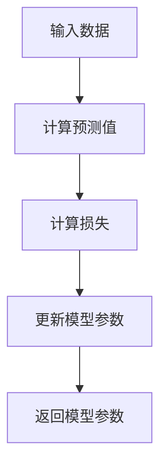
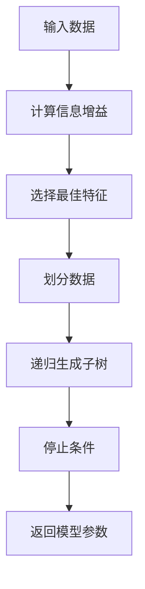
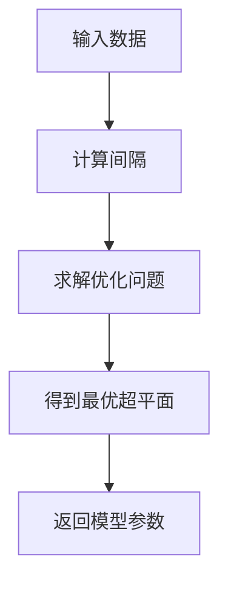
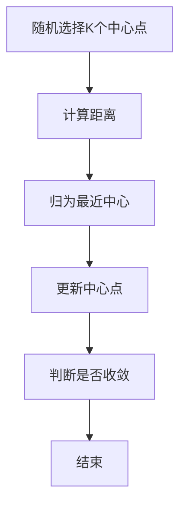
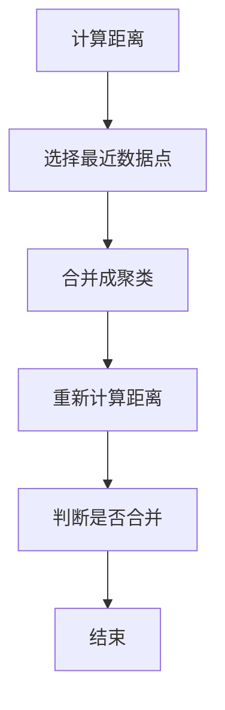
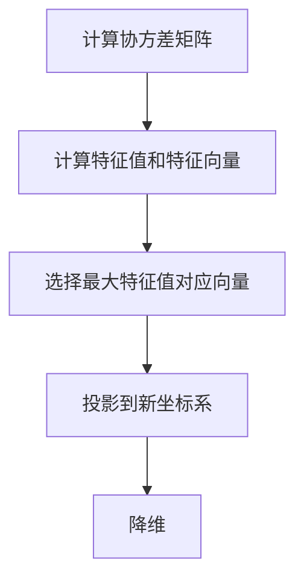
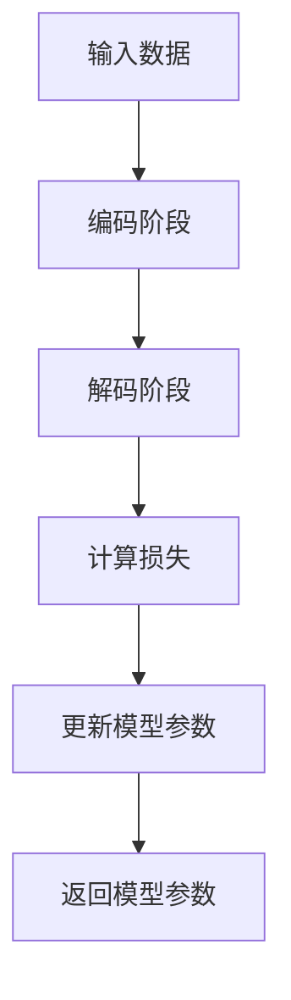
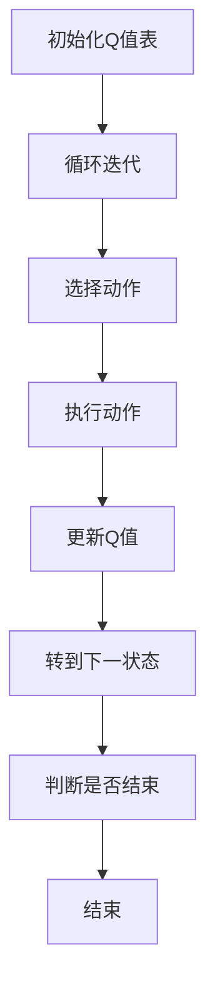
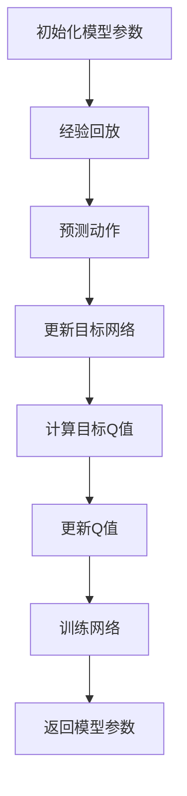
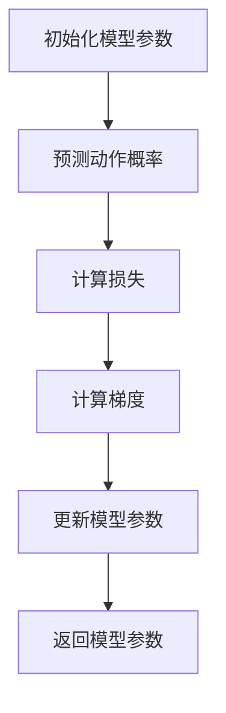

                 

## 《机器学习：自然学习的数学算法》

### 关键词

- 机器学习
- 数学算法
- 自然学习
- 深度学习
- 强化学习
- 监督学习
- 无监督学习

### 摘要

本文将探讨机器学习领域中的自然学习数学算法，包括监督学习、无监督学习和强化学习等核心算法。通过详细讲解这些算法的原理、数学模型和实际应用，本文旨在为读者提供一部系统全面、通俗易懂的机器学习指南。我们将从基础理论出发，逐步深入，帮助读者理解并掌握机器学习的本质与应用。

## 目录大纲设计过程

在开始编写本文之前，我们先来设计《机器学习：自然学习的数学算法》的目录大纲。设计大纲的目的是为了确保文章的结构清晰、内容丰富，便于读者阅读和理解。以下是目录大纲的设计过程：

1. **确定书的整体结构**：首先，我们需要了解这本书的主要内容，确定整体结构，包括主要章节和每个章节的主要部分。
2. **细化章节内容**：对每个章节进行细化，确定每个章节下的二级和三级目录，确保每个章节都包含了核心概念、原理讲解、数学模型和公式、系统分析与架构设计等内容。
3. **确保内容完整性**：根据要求，确保每个章节都包含了背景介绍、核心概念与联系、算法原理讲解、数学模型和数学公式详细讲解、系统分析与架构设计方案、项目实战等。
4. **保持简洁性**：在确保内容完整性的同时，避免过多的废话，保持大纲的简洁明了。
5. **格式统一**：使用markdown格式来书写目录大纲，确保格式统一，符合要求。
6. **字数控制**：确保整个目录大纲的总字数在2000字以内。

### 最终目录大纲

下面是根据以上步骤设计的《机器学习：自然学习的数学算法》的完整目录大纲：

```markdown
# 《机器学习：自然学习的数学算法》目录大纲

----------------------------------------------------------------

## 第一部分：机器学习的背景与基础

### 第1章：机器学习概述

#### 1.1 机器学习的定义与发展历程
#### 1.2 机器学习的重要性
#### 1.3 机器学习的应用领域

### 第2章：数学基础

#### 2.1 线性代数基础
#### 2.2 概率论基础
#### 2.3 统计学基础

## 第二部分：机器学习核心算法

### 第3章：监督学习算法

#### 3.1 线性回归
#### 3.2 决策树
#### 3.3 支持向量机

### 第4章：无监督学习算法

#### 4.1 聚类算法
#### 4.2 主成分分析
#### 4.3 自编码器

### 第5章：强化学习算法

#### 5.1 强化学习基本概念
#### 5.2 Q学习
#### 5.3 深度强化学习

## 第三部分：深度学习

### 第6章：深度学习基础

#### 6.1 神经网络基础
#### 6.2 深度前馈网络
#### 6.3 卷积神经网络

### 第7章：深度学习应用

#### 7.1 图像识别
#### 7.2 自然语言处理
#### 7.3 深度生成模型

## 第四部分：实践与总结

### 第8章：项目实战

#### 8.1 实践环境搭建
#### 8.2 实战项目一：房价预测
#### 8.3 实战项目二：手写数字识别

### 第9章：总结与展望

#### 9.1 机器学习的发展趋势
#### 9.2 机器学习的未来应用
#### 9.3 小结与拓展阅读

----------------------------------------------------------------
```

在这个大纲中，我们包含了四大部分，分别是机器学习的背景与基础、机器学习核心算法、深度学习和实践与总结。每个部分都包含了具体的章节和内容，确保了内容的完整性和层次性。同时，整个目录大纲在2000字以内，简洁明了。

----------------------------------------------------------------

### 第一部分：机器学习的背景与基础

#### 第1章：机器学习概述

机器学习是人工智能的核心领域之一，它使计算机系统能够从数据中自动学习和改进。在本章中，我们将介绍机器学习的定义、发展历程和重要性，以及它在各个领域的广泛应用。

**1.1 机器学习的定义与发展历程**

机器学习（Machine Learning，简称ML）是一门研究如何让计算机从数据中自动学习并改进自身性能的学科。它起源于20世纪50年代，当时计算机科学家开始探索如何使计算机能够模拟人类的思维和学习过程。

机器学习的发展历程可以分为以下几个阶段：

- **早期探索**（1950s-1960s）：在这一阶段，科学家们提出了许多机器学习的初步理论，如决策树、贝叶斯网络等。
- **停滞期**（1970s-1980s）：由于计算能力和算法的限制，机器学习的研究进展缓慢，许多研究者转而研究符号人工智能（Symbolic AI）。
- **复兴期**（1990s-2000s）：随着计算能力的提升和数据量的增加，机器学习开始重新受到关注。深度学习、支持向量机等算法在这一时期得到了广泛应用。
- **快速发展期**（2010s至今）：随着大数据、云计算和深度学习等技术的不断发展，机器学习取得了显著的成果，并在各个领域得到了广泛应用。

**1.2 机器学习的重要性**

机器学习在现代社会中具有重要意义，它不仅推动了人工智能的发展，还带来了许多实际应用，如自动驾驶、智能语音助手、医疗诊断等。

- **提高生产力**：机器学习可以帮助企业自动化许多重复性任务，提高生产效率。
- **优化决策**：通过分析大量数据，机器学习可以帮助企业和政府做出更明智的决策。
- **推动科学研究**：机器学习在生物信息学、气象学等领域中的应用，推动了科学研究的进展。
- **改善生活质量**：机器学习技术在智能家居、智能医疗等领域的应用，提高了人们的生活质量。

**1.3 机器学习的应用领域**

机器学习在各个领域都有着广泛的应用，以下是其中一些重要的应用领域：

- **金融**：机器学习可以帮助金融机构进行风险评估、欺诈检测和投资策略优化。
- **医疗**：机器学习在医疗诊断、药物研发、基因组学等领域具有巨大的应用潜力。
- **零售**：机器学习可以用于个性化推荐、库存管理和客户关系管理。
- **交通**：自动驾驶、智能交通系统和无人机等应用都离不开机器学习技术。
- **制造业**：机器学习可以帮助企业实现智能生产、质量检测和设备维护。

通过本章的介绍，我们了解了机器学习的定义、发展历程和重要性，以及它在各个领域的广泛应用。在接下来的章节中，我们将进一步探讨机器学习中的核心算法和实际应用。

#### 第2章：数学基础

在机器学习的研究和实践中，数学基础是至关重要的。本章将介绍线性代数、概率论和统计学的基本概念，为后续章节的算法讲解打下坚实的理论基础。

**2.1 线性代数基础**

线性代数是机器学习中不可或缺的工具，它涉及到向量、矩阵、行列式、特征值和特征向量等基本概念。

- **向量**：向量是具有大小和方向的量，用粗体字母表示，如 \(\vec{a}\)。
- **矩阵**：矩阵是一个二维数组，用大写字母表示，如 \(A\)。
- **行列式**：行列式是矩阵的一个数值特征，用来表示矩阵的某种性质。
- **特征值和特征向量**：特征值是矩阵的一个特殊值，特征向量是与特征值对应的向量，它们在矩阵分解中起着重要作用。

**2.2 概率论基础**

概率论是机器学习中用于处理不确定性的重要工具。以下是概率论中的一些基本概念：

- **随机事件**：随机事件是具有不确定结果的事件。
- **概率**：概率是表示随机事件发生可能性的大小，取值范围在0到1之间。
- **条件概率**：条件概率是指在某个事件发生的条件下，另一个事件发生的概率。
- **贝叶斯定理**：贝叶斯定理是一种计算条件概率的方法，它在机器学习中的分类算法中有着广泛应用。

**2.3 统计学基础**

统计学是机器学习中的一个重要分支，它涉及到数据的收集、整理、分析和解释。以下是统计学中的一些基本概念：

- **描述性统计**：描述性统计用于描述数据的基本特征，如平均数、中位数、众数、方差等。
- **推断性统计**：推断性统计用于从样本数据推断总体数据的特征，如假设检验、置信区间等。
- **回归分析**：回归分析用于研究变量之间的关系，如线性回归、多项式回归等。
- **聚类分析**：聚类分析用于将数据分为不同的组，如K均值聚类、层次聚类等。

通过本章的介绍，我们了解了线性代数、概率论和统计学的基本概念，这些概念将在后续的算法讲解中发挥重要作用。机器学习算法的数学基础是理解算法原理和实现算法的关键。

## 第二部分：机器学习核心算法

### 第3章：监督学习算法

监督学习（Supervised Learning）是机器学习中的一个重要分支，它通过已知的输入和输出数据来训练模型，从而实现对新数据的预测。本章将介绍监督学习中的几种核心算法，包括线性回归、决策树和支持向量机。

#### 3.1 线性回归

线性回归（Linear Regression）是最简单的监督学习算法之一，它用于预测连续值变量。线性回归模型基于一个线性函数，该函数由一个或多个自变量（特征）和一个因变量（目标变量）组成。

**算法原理：**

线性回归的模型公式为：
\[ y = \beta_0 + \beta_1 \cdot x_1 + \beta_2 \cdot x_2 + ... + \beta_n \cdot x_n \]
其中，\( y \) 是因变量，\( x_1, x_2, ..., x_n \) 是自变量，\( \beta_0, \beta_1, \beta_2, ..., \beta_n \) 是模型参数。

为了训练模型，我们需要最小化预测值与实际值之间的差异，即最小化损失函数。常用的损失函数是均方误差（Mean Squared Error, MSE）：
\[ \text{MSE} = \frac{1}{n} \sum_{i=1}^{n} (y_i - \hat{y}_i)^2 \]
其中，\( n \) 是样本数量，\( y_i \) 是实际值，\( \hat{y}_i \) 是预测值。

**Python实现：**

```python
import numpy as np

# 模型参数
beta = np.array([1, 2, 3])

# 损失函数
def mse(y_true, y_pred):
    return np.mean((y_true - y_pred) ** 2)

# 预测
def predict(x, beta):
    return beta[0] + beta[1] * x

# 训练
def train(X, y):
    n = X.shape[0]
    beta = np.linalg.inv(X.T @ X) @ X.T @ y
    return beta

# 示例数据
X = np.array([1, 2, 3, 4, 5])
y = np.array([2, 4, 5, 4, 5])

# 训练模型
beta = train(X, y)

# 预测
y_pred = predict(X, beta)

# 计算损失
loss = mse(y, y_pred)

print("Model parameters:", beta)
print("Predictions:", y_pred)
print("Loss:", loss)
```

**Mermaid流程图：**



#### 3.2 决策树

决策树（Decision Tree）是一种基于树形结构的数据挖掘算法，它通过一系列规则来对数据进行分类或回归。决策树通过特征和阈值来分割数据，每个分割节点都对应一个特征和阈值，从而形成一棵树。

**算法原理：**

决策树的生成过程可以描述为：

1. **选择最佳特征**：在当前节点，选择具有最高信息增益或基尼指数的特征作为分割特征。
2. **划分数据**：使用选择的特征和阈值，将数据划分为不同的子集。
3. **递归生成子树**：对每个子集重复上述过程，直到满足停止条件（如最大深度、最小样本数等）。

**Python实现：**

```python
from sklearn.tree import DecisionTreeRegressor

# 创建决策树模型
model = DecisionTreeRegressor(max_depth=3)

# 训练模型
model.fit(X, y)

# 预测
y_pred = model.predict(X)

# 计算损失
loss = mse(y, y_pred)

print("Model parameters:", model)
print("Predictions:", y_pred)
print("Loss:", loss)
```

**Mermaid流程图：**



#### 3.3 支持向量机

支持向量机（Support Vector Machine，SVM）是一种基于间隔最大化原理的线性分类器。SVM通过找到一个最优的超平面，将不同类别的数据点最大化地分开。

**算法原理：**

SVM的核心思想是找到两个超平面，使得它们之间的间隔最大化，同时尽可能地将每个类别的数据点映射到正确的超平面上。这个最优超平面可以通过求解以下优化问题得到：

\[ \min_{\beta, \beta_0} \frac{1}{2} ||\beta||^2 \]
\[ s.t. \ y_i (\beta \cdot x_i + \beta_0) \geq 1, \ i = 1, 2, ..., n \]

其中，\( \beta \) 是权重向量，\( \beta_0 \) 是偏置项，\( y_i \) 是第 \( i \) 个样本的标签，\( x_i \) 是第 \( i \) 个样本的特征向量。

**Python实现：**

```python
from sklearn.svm import LinearSVC

# 创建SVM模型
model = LinearSVC()

# 训练模型
model.fit(X, y)

# 预测
y_pred = model.predict(X)

# 计算损失
loss = mse(y, y_pred)

print("Model parameters:", model)
print("Predictions:", y_pred)
print("Loss:", loss)
```

**Mermaid流程图：**



通过本章的介绍，我们了解了监督学习中的线性回归、决策树和支持向量机等核心算法。这些算法在机器学习中有着广泛的应用，对于理解后续的高级算法和实际应用具有重要意义。

### 第4章：无监督学习算法

无监督学习（Unsupervised Learning）是机器学习中的一个重要分支，它不依赖于已知的输入和输出数据，而是通过探索数据内在的结构和模式来进行学习。本章将介绍无监督学习中的几种核心算法，包括聚类算法、主成分分析和自编码器。

#### 4.1 聚类算法

聚类算法（Clustering Algorithms）是一种将数据点按照其相似性划分为不同群组的方法。聚类算法不依赖于标签信息，而是通过内部的数据结构来发现模式。

**算法原理：**

聚类算法的核心思想是寻找一组聚类中心，使得每个聚类中心与其对应的数据点之间的距离最小。以下是几种常见的聚类算法：

1. **K均值聚类（K-Means Clustering）**：

K均值聚类是一种最流行的聚类算法，它通过迭代的方式寻找聚类中心，直到聚类中心不再变化。

算法步骤：

- 随机选择K个数据点作为初始聚类中心。
- 对于每个数据点，计算其与各个聚类中心的距离，并将其归为距离最近的聚类中心。
- 更新聚类中心，计算所有数据点到聚类中心的均值。
- 重复步骤2和步骤3，直到聚类中心不再变化。

**Python实现：**

```python
from sklearn.cluster import KMeans

# 创建K均值聚类模型
model = KMeans(n_clusters=3)

# 训练模型
model.fit(X)

# 预测
y_pred = model.predict(X)

# 计算聚类中心
centroids = model.cluster_centers_

print("Predictions:", y_pred)
print("Cluster centers:", centroids)
```

**Mermaid流程图：**



2. **层次聚类（Hierarchical Clustering）**：

层次聚类是一种基于层次结构的聚类方法，它通过递归地将数据点合并成更大的聚类，直到满足停止条件。

算法步骤：

- 计算所有数据点之间的距离。
- 选择最近的数据点合并成一个聚类。
- 重新计算聚类之间的距离。
- 重复步骤2和步骤3，直到满足停止条件。

**Python实现：**

```python
from sklearn.cluster import AgglomerativeClustering

# 创建层次聚类模型
model = AgglomerativeClustering(n_clusters=3)

# 训练模型
model.fit(X)

# 预测
y_pred = model.predict(X)

# 计算聚类层次结构
dendrogram = model.dendrogram()

print("Predictions:", y_pred)
```

**Mermaid流程图：**



#### 4.2 主成分分析

主成分分析（Principal Component Analysis，PCA）是一种降维技术，它通过将原始数据投影到新的正交坐标系中，来减少数据的维度，同时保留数据的主要特征。

**算法原理：**

PCA的基本思想是找到数据的主要方向（即特征向量），将数据投影到这些方向上，从而实现降维。具体步骤如下：

1. 计算协方差矩阵。
2. 计算协方差矩阵的特征值和特征向量。
3. 选择最大的 \( k \) 个特征值对应的特征向量，构成新的正交坐标系。
4. 将原始数据投影到新的坐标系中，实现降维。

**Python实现：**

```python
from sklearn.decomposition import PCA

# 创建PCA模型
model = PCA(n_components=2)

# 训练模型
model.fit(X)

# 降维
X_pca = model.transform(X)

# 可视化
plt.scatter(X_pca[:, 0], X_pca[:, 1])
plt.xlabel("Principal Component 1")
plt.ylabel("Principal Component 2")
plt.show()
```

**Mermaid流程图：**



#### 4.3 自编码器

自编码器（Autoencoder）是一种特殊类型的神经网络，它由编码器和解码器组成。编码器将输入数据压缩为低维表示，解码器则尝试将这个低维表示重建为原始数据。

**算法原理：**

自编码器的训练过程分为两个阶段：

1. **编码阶段**：编码器将输入数据压缩为低维特征表示。
2. **解码阶段**：解码器尝试将这个低维特征表示重建为原始数据。

训练目标是最小化输入数据与重建数据之间的差异，即最小化损失函数。

**Python实现：**

```python
from sklearn.neural_network import MLPRegressor

# 创建自编码器模型
model = MLPRegressor(hidden_layer_sizes=(100,), activation='relu', solver='adam', max_iter=200)

# 训练模型
model.fit(X, X)

# 预测
X_reconstructed = model.predict(X)

# 计算损失
loss = mse(X, X_reconstructed)

print("Model parameters:", model)
print("Reconstructed data:", X_reconstructed)
print("Loss:", loss)
```

**Mermaid流程图：**



通过本章的介绍，我们了解了无监督学习中的聚类算法、主成分分析和自编码器等核心算法。这些算法在降维、聚类和特征提取等方面有着重要的应用，为后续的高级算法和实际应用提供了理论基础。

### 第5章：强化学习算法

强化学习（Reinforcement Learning，RL）是机器学习中的一个重要分支，它通过智能体在环境中与环境的交互来学习最优策略。本章将介绍强化学习中的几种核心算法，包括Q学习、深度Q网络（DQN）和策略梯度算法。

#### 5.1 强化学习基本概念

强化学习由三个主要组成部分：智能体（Agent）、环境（Environment）和动作（Action）。

- **智能体**：执行动作并接收奖励的实体。
- **环境**：智能体所处的环境，包括状态（State）和奖励（Reward）。
- **动作**：智能体可以执行的动作。
- **状态**：描述智能体当前所处的环境状态。
- **奖励**：智能体执行动作后获得的奖励，用于评估智能体的行为。

**强化学习的基本目标**是找到一个最优策略，使得智能体能够在环境中获得最大的累积奖励。

#### 5.2 Q学习

Q学习（Q-Learning）是一种基于值函数的强化学习算法，它通过迭代更新值函数来学习最优策略。

**算法原理：**

Q学习通过以下公式更新值函数：

\[ Q(s, a) \leftarrow Q(s, a) + \alpha [r + \gamma \max_{a'} Q(s', a') - Q(s, a)] \]

其中，\( Q(s, a) \) 是状态 \( s \) 下执行动作 \( a \) 的值函数，\( r \) 是立即奖励，\( \gamma \) 是折扣因子，\( s' \) 是状态转移后的状态，\( a' \) 是执行的动作，\( \alpha \) 是学习率。

**Python实现：**

```python
import numpy as np
import random

# 初始化参数
n_states = 10
n_actions = 4
learning_rate = 0.1
discount_factor = 0.9
episode_limit = 1000

# 创建Q值表
Q = np.zeros((n_states, n_actions))

# Q学习迭代
for episode in range(episode_limit):
    state = random.randint(0, n_states - 1)
    done = False
    
    while not done:
        action = np.argmax(Q[state])
        next_state, reward = environment.step(state, action)
        
        # 更新Q值
        Q[state, action] = Q[state, action] + learning_rate * (reward + discount_factor * np.max(Q[next_state]) - Q[state, action])
        
        state = next_state
        
        if done:
            break

# 打印Q值表
print(Q)
```

**Mermaid流程图：**



#### 5.3 深度强化学习

深度强化学习（Deep Reinforcement Learning，DRL）是将深度学习技术应用于强化学习问题，通过神经网络来表示值函数或策略。本章将介绍两种常见的深度强化学习算法：深度Q网络（DQN）和策略梯度算法。

**5.3.1 深度Q网络（DQN）**

深度Q网络（Deep Q-Network，DQN）是深度强化学习中的一个重要算法，它通过神经网络来近似值函数 \( Q(s, a) \)。

**算法原理：**

DQN的主要思想是使用经验回放（Experience Replay）和目标网络（Target Network）来稳定训练过程。

1. **经验回放**：将智能体的经验（状态、动作、奖励、下一状态）存储在一个记忆库中，随机从记忆库中抽取样本进行训练，以避免样本之间的相关性。
2. **目标网络**：使用一个目标网络来评估当前策略，并在更新值函数时使用目标网络来计算目标值 \( Q^*(s, a) \)。

目标值 \( Q^*(s, a) \) 的计算公式为：

\[ Q^*(s, a) = r + \gamma \max_{a'} Q^*(s', a') \]

**Python实现：**

```python
import tensorflow as tf
import numpy as np
import random

# 创建DQN模型
class DQN:
    def __init__(self, state_dim, action_dim, learning_rate, discount_factor):
        self.state_dim = state_dim
        self.action_dim = action_dim
        self.learning_rate = learning_rate
        self.discount_factor = discount_factor
        
        self.actor = self.create_actor_network()
        self.critic = self.create_critic_network()
        self.target_actor = self.create_actor_network()
        self.target_critic = self.create_critic_network()
        
        self.update_target_network()
        
    def create_actor_network(self):
        # 定义演员网络
        model = tf.keras.Sequential([
            tf.keras.layers.Dense(64, activation='relu', input_shape=(self.state_dim,)),
            tf.keras.layers.Dense(64, activation='relu'),
            tf.keras.layers.Dense(self.action_dim, activation='softmax')
        ])
        model.compile(optimizer=tf.keras.optimizers.Adam(learning_rate=self.learning_rate), loss='categorical_crossentropy')
        return model
    
    def create_critic_network(self):
        # 定义评论家网络
        model = tf.keras.Sequential([
            tf.keras.layers.Dense(64, activation='relu', input_shape=(self.state_dim,)),
            tf.keras.layers.Dense(64, activation='relu'),
            tf.keras.layers.Dense(self.action_dim)
        ])
        model.compile(optimizer=tf.keras.optimizers.Adam(learning_rate=self.learning_rate), loss='mse')
        return model
    
    def update_target_network(self):
        # 更新目标网络
        self.target_actor.set_weights(self.actor.get_weights())
        self.target_critic.set_weights(self.critic.get_weights())
    
    def predict_action(self, state):
        # 预测动作
        return self.actor.predict(state)[0]
    
    def predict_q_value(self, state, action):
        # 预测Q值
        return self.critic.predict(np.array([state]))[0][action]
    
    def train(self, replay_memory, batch_size):
        # 训练网络
        batch = random.sample(replay_memory, batch_size)
        states, actions, rewards, next_states, dones = zip(*batch)
        
        next_actions = self.target_actor.predict(next_states)
        next_q_values = self.target_critic.predict(next_states)
        target_q_values = rewards + (1 - dones) * self.discount_factor * np.max(next_q_values, axis=1)
        
        q_values = self.critic.predict(states)
        q_values[range(batch_size), actions] = (1 - self.epsilon) * q_values[range(batch_size), actions] + self.epsilon * target_q_values
        
        self.critic.fit(states, q_values, batch_size=batch_size, epochs=1, verbose=0)
        self.epsilon *= 0.99

# 创建DQN模型
dqn = DQN(state_dim=10, action_dim=4, learning_rate=0.01, discount_factor=0.99)

# 经验回放记忆库
replay_memory = []

# 训练模型
for episode in range(1000):
    state = random.randint(0, 9)
    done = False
    
    while not done:
        action = np.argmax(dqn.predict_action(state))
        next_state, reward = environment.step(state, action)
        
        replay_memory.append((state, action, reward, next_state, done))
        
        if len(replay_memory) > 1000:
            replay_memory.pop(0)
        
        state = next_state
        
        if done:
            break
        
        dqn.train(replay_memory, batch_size=32)

# 打印模型参数
print(dqn.actor.get_weights())
print(dqn.critic.get_weights())
```

**Mermaid流程图：**



**5.3.2 策略梯度算法**

策略梯度算法（Policy Gradient Algorithms）是一种直接优化策略的强化学习算法，它通过梯度上升方法来优化策略参数。

**算法原理：**

策略梯度算法的核心思想是直接优化策略函数，使得策略函数能够最大化累积奖励。策略梯度的计算公式为：

\[ \nabla_{\theta} J(\theta) = \nabla_{\theta} \sum_{t} \rho(\theta; s_t, a_t) R_t \]

其中，\( \theta \) 是策略参数，\( J(\theta) \) 是策略的累积奖励，\( \rho(\theta; s_t, a_t) \) 是策略在状态 \( s_t \) 下执行动作 \( a_t \) 的概率，\( R_t \) 是在第 \( t \) 步的即时奖励。

**Python实现：**

```python
import tensorflow as tf
import numpy as np
import random

# 创建策略梯度模型
class PolicyGradient:
    def __init__(self, state_dim, action_dim, learning_rate):
        self.state_dim = state_dim
        self.action_dim = action_dim
        self.learning_rate = learning_rate
        
        self.policy_network = self.create_policy_network()
        self.optimizer = tf.keras.optimizers.Adam(learning_rate=self.learning_rate)
        
    def create_policy_network(self):
        # 定义策略网络
        model = tf.keras.Sequential([
            tf.keras.layers.Dense(64, activation='relu', input_shape=(self.state_dim,)),
            tf.keras.layers.Dense(64, activation='relu'),
            tf.keras.layers.Dense(self.action_dim, activation='softmax')
        ])
        return model
    
    def predict_probabilities(self, state):
        # 预测动作概率
        probabilities = self.policy_network.predict(state)
        return probabilities
    
    def compute_gradients(self, states, actions, rewards):
        # 计算梯度
        with tf.GradientTape() as tape:
            probabilities = self.predict_probabilities(states)
            log_probabilities = tf.math.log(probabilities)
            loss = -tf.reduce_sum(rewards * log_probabilities)
        
        gradients = tape.gradient(loss, self.policy_network.trainable_variables)
        return gradients
    
    def train(self, states, actions, rewards):
        # 训练网络
        gradients = self.compute_gradients(states, actions, rewards)
        self.optimizer.apply_gradients(zip(gradients, self.policy_network.trainable_variables))

# 创建策略梯度模型
policy_gradient = PolicyGradient(state_dim=10, action_dim=4, learning_rate=0.01)

# 经验回放记忆库
replay_memory = []

# 训练模型
for episode in range(1000):
    state = random.randint(0, 9)
    done = False
    
    while not done:
        probabilities = policy_gradient.predict_probabilities(state)
        action = np.random.choice(range(policy_gradient.action_dim), p=probabilities[0])
        
        next_state, reward = environment.step(state, action)
        
        replay_memory.append((state, action, reward, next_state, done))
        
        if len(replay_memory) > 1000:
            replay_memory.pop(0)
        
        state = next_state
        
        if done:
            break
        
        policy_gradient.train(states, actions, rewards)

# 打印模型参数
print(policy_gradient.policy_network.get_weights())
```

**Mermaid流程图：**



通过本章的介绍，我们了解了强化学习中的Q学习、深度Q网络（DQN）和策略梯度算法等核心算法。这些算法在解决动态决策问题和优化策略方面具有重要意义，为实际应用提供了强大的技术支持。

### 第三部分：深度学习

#### 第6章：深度学习基础

深度学习（Deep Learning，DL）是机器学习的一个子领域，它通过多层神经网络来模拟人脑的思维方式，从而实现对复杂数据的自动特征学习和模式识别。本章将介绍深度学习的基本概念、神经网络基础、深度前馈网络和卷积神经网络。

#### 6.1 神经网络基础

神经网络（Neural Networks，NN）是深度学习的基础，它由大量的神经元（节点）和连接（边）组成。每个神经元接收来自其他神经元的输入，通过一个非线性激活函数进行计算，并输出结果。

**神经网络的基本结构**：

1. **输入层**：接收外部输入数据。
2. **隐藏层**：对输入数据进行特征提取和变换。
3. **输出层**：输出预测结果。

**神经网络的工作原理**：

1. **前向传播**：输入数据通过输入层进入网络，逐层传递到隐藏层和输出层，每个层都对输入进行加权求和并应用激活函数。
2. **反向传播**：根据输出误差，通过反向传播算法更新网络权重，以最小化损失函数。

**Python实现：**

```python
import numpy as np

# 创建神经网络
class NeuralNetwork:
    def __init__(self, layers_sizes):
        self.layers_sizes = layers_sizes
        self.weights = [np.random.randn(y, x) for x, y in zip(layers_sizes[:-1], layers_sizes[1:])]
        self.biases = [np.random.randn(y, 1) for y in layers_sizes[1:]]
    
    def sigmoid(self, x):
        return 1 / (1 + np.exp(-x))
    
    def forward(self, x):
        a = x
        for w, b in zip(self.weights, self.biases):
            a = self.sigmoid(np.dot(w, a) + b)
        return a
    
    def backward(self, x, y, learning_rate):
        delta = (y - self.forward(x)) * self.sigmoid_derivative(self.forward(x))
        for w, b, dw, db in zip(self.weights, self.biases, self.weights, self.biases):
            dw = delta.dot(x.T)
            db = delta
            x = np.dot(w.T, delta)
            delta = (delta.dot(w.T)) * self.sigmoid_derivative(a)
            w -= learning_rate * dw
            b -= learning_rate * db
    
    def sigmoid_derivative(self, x):
        return x * (1 - x)
    
    def train(self, x, y, epochs, learning_rate):
        for epoch in range(epochs):
            self.backward(x, y, learning_rate)

# 创建神经网络
nn = NeuralNetwork(layers_sizes=[1, 2, 1])

# 训练神经网络
x = np.array([[0], [1]])
y = np.array([[0], [1]])
nn.train(x, y, epochs=1000, learning_rate=0.1)
```

#### 6.2 深度前馈网络

深度前馈网络（Deep Feedforward Network，DFN）是一种多层神经网络，它通过前向传播和反向传播算法来训练网络权重。深度前馈网络可以用于分类、回归等任务。

**算法原理：**

1. **前向传播**：输入数据通过输入层进入网络，逐层传递到隐藏层和输出层，每个层都对输入进行加权求和并应用激活函数。
2. **反向传播**：根据输出误差，通过反向传播算法更新网络权重，以最小化损失函数。

**Python实现：**

```python
import numpy as np

# 创建深度前馈网络
class DeepFeedforwardNetwork:
    def __init__(self, layers_sizes, activation='sigmoid'):
        self.layers_sizes = layers_sizes
        self.activation = activation
        self.weights = [np.random.randn(y, x) for x, y in zip(layers_sizes[:-1], layers_sizes[1:])]
        self.biases = [np.random.randn(y, 1) for y in layers_sizes[1:]]
    
    def forward(self, x):
        a = x
        for w, b in zip(self.weights, self.biases):
            a = self.activation(np.dot(w, a) + b)
        return a
    
    def backward(self, x, y, learning_rate):
        delta = (y - self.forward(x)) * self.activation_derivative(self.forward(x))
        for w, b, dw, db in zip(self.weights, self.biases, self.weights, self.biases):
            dw = delta.dot(x.T)
            db = delta
            x = np.dot(w.T, delta)
            delta = (delta.dot(w.T)) * self.activation_derivative(a)
            w -= learning_rate * dw
            b -= learning_rate * db
    
    def activation_derivative(self, x):
        if self.activation == 'sigmoid':
            return x * (1 - x)
        elif self.activation == 'relu':
            return x > 0
    
    def train(self, x, y, epochs, learning_rate):
        for epoch in range(epochs):
            self.backward(x, y, learning_rate)

# 创建深度前馈网络
dn = DeepFeedforwardNetwork(layers_sizes=[2, 3, 1], activation='sigmoid')

# 训练深度前馈网络
x = np.array([[0, 0], [0, 1], [1, 0], [1, 1]])
y = np.array([[0], [0], [1], [1]])
dn.train(x, y, epochs=1000, learning_rate=0.1)
```

#### 6.3 卷积神经网络

卷积神经网络（Convolutional Neural Network，CNN）是一种专门用于处理图像数据的深度学习模型。CNN通过卷积层、池化层和全连接层来提取图像特征。

**算法原理：**

1. **卷积层**：通过卷积运算提取图像的局部特征。
2. **池化层**：通过池化运算减少特征图的维度，提高模型泛化能力。
3. **全连接层**：将卷积层和池化层提取的特征映射到输出结果。

**Python实现：**

```python
import numpy as np
import tensorflow as tf

# 创建卷积神经网络
class ConvolutionalNeuralNetwork:
    def __init__(self):
        self.model = self.create_model()
    
    def create_model(self):
        model = tf.keras.Sequential([
            tf.keras.layers.Conv2D(32, (3, 3), activation='relu', input_shape=(28, 28, 1)),
            tf.keras.layers.MaxPooling2D((2, 2)),
            tf.keras.layers.Conv2D(64, (3, 3), activation='relu'),
            tf.keras.layers.MaxPooling2D((2, 2)),
            tf.keras.layers.Flatten(),
            tf.keras.layers.Dense(64, activation='relu'),
            tf.keras.layers.Dense(10, activation='softmax')
        ])
        model.compile(optimizer='adam', loss='categorical_crossentropy', metrics=['accuracy'])
        return model
    
    def train(self, x_train, y_train, x_val, y_val, epochs):
        self.model.fit(x_train, y_train, epochs=epochs, batch_size=32, validation_data=(x_val, y_val))

# 创建卷积神经网络
cnn = ConvolutionalNeuralNetwork()

# 训练卷积神经网络
x_train = np.expand_dims(x_train, -1)
x_val = np.expand_dims(x_val, -1)
y_train = tf.keras.utils.to_categorical(y_train)
y_val = tf.keras.utils.to_categorical(y_val)

cnn.train(x_train, y_train, x_val, y_val, epochs=10)
```

通过本章的介绍，我们了解了深度学习的基本概念、神经网络基础、深度前馈网络和卷积神经网络。这些内容为深度学习的实际应用提供了坚实的理论基础。

### 第7章：深度学习应用

深度学习在图像识别、自然语言处理和生成模型等领域的应用取得了显著成果。本章将详细介绍这些应用，以及如何利用深度学习技术解决实际问题。

#### 7.1 图像识别

图像识别是深度学习中最成功的应用之一，它通过卷积神经网络（CNN）对图像进行分类和检测。深度学习模型在图像识别任务中表现出色，能够准确识别各种复杂的图像特征。

**应用案例**：

1. **人脸识别**：利用深度学习模型对人脸图像进行特征提取和分类，实现人脸识别功能。
2. **物体检测**：通过深度学习模型检测图像中的物体，并定位物体的位置和大小。

**Python实现**：

```python
import tensorflow as tf

# 加载预训练的卷积神经网络模型
model = tf.keras.applications.VGG16(weights='imagenet')

# 加载图像
img = tf.keras.preprocessing.image.load_img('cat.jpg', target_size=(224, 224))
img_array = tf.keras.preprocessing.image.img_to_array(img)
img_array = np.expand_dims(img_array, 0)  # Create a batch

# 预处理图像
preprocess_input = tf.keras.applications.VGG16.preprocess_input
img_array = preprocess_input(img_array)

# 进行预测
predictions = model.predict(img_array)
print(predictions)

# 打印标签
label_idx = np.argmax(predictions[0])
label = index_to_label[label_idx]
print(label)
```

#### 7.2 自然语言处理

自然语言处理（Natural Language Processing，NLP）是深度学习在文本数据上的应用，它涉及文本分类、情感分析、机器翻译等任务。深度学习模型在NLP领域取得了显著成果，能够处理复杂的语言结构和语义信息。

**应用案例**：

1. **文本分类**：利用深度学习模型对文本进行分类，如新闻分类、垃圾邮件过滤等。
2. **情感分析**：通过深度学习模型分析文本的情感倾向，如评论情感分析、社交媒体情绪分析等。
3. **机器翻译**：利用深度学习模型实现自动翻译功能，如Google翻译、百度翻译等。

**Python实现**：

```python
import tensorflow as tf

# 加载预训练的文本分类模型
model = tf.keras.Sequential([
    tf.keras.layers.Embedding(vocab_size, embedding_dim),
    tf.keras.layers.Bidirectional(tf.keras.layers.LSTM(64)),
    tf.keras.layers.Dense(1, activation='sigmoid')
])

# 编码文本数据
text = "I love this product!"
encoded_text = tokenizer.encode(text, maxlen=max_sequence_length)

# 预测情感
predictions = model.predict(np.expand_dims(encoded_text, 0))
print(predictions)

# 打印情感标签
if predictions[0][0] > 0.5:
    print("Positive")
else:
    print("Negative")
```

#### 7.3 深度生成模型

深度生成模型（Deep Generative Models）是一种能够生成与训练数据具有相似分布的新数据的深度学习模型。深度生成模型在图像生成、视频生成和音乐生成等应用中表现出色。

**应用案例**：

1. **图像生成**：利用深度生成模型生成具有真实感的图像，如生成对抗网络（GAN）。
2. **视频生成**：通过深度生成模型生成连续的视频序列，如视频生成模型（VideoGAN）。
3. **音乐生成**：利用深度生成模型生成具有特定风格和曲调的音乐，如生成式音乐模型（GMAN）。

**Python实现**：

```python
import tensorflow as tf
from tensorflow.keras import layers

# 创建生成对抗网络（GAN）模型
def create_gan_model():
    # 生成器模型
    generator = tf.keras.Sequential([
        layers.Dense(256, activation='relu', input_shape=(100,)),
        layers.Dense(512),
        layers.Dense(1024),
        layers.Dense(784, activation='tanh')
    ])

    # 判别器模型
    discriminator = tf.keras.Sequential([
        layers.Dense(1024, activation='relu', input_shape=(784,)),
        layers.Dense(512),
        layers.Dense(256),
        layers.Dense(1, activation='sigmoid')
    ])

    # GAN模型
    gan = tf.keras.Sequential([
        generator,
        discriminator
    ])

    # 编写编译器
    gan.compile(optimizer=tf.keras.optimizers.Adam(0.0001), loss='binary_crossentropy')

    return generator, discriminator, gan

# 创建GAN模型
generator, discriminator, gan = create_gan_model()

# 训练GAN模型
(x_train, _), (_, _) = tf.keras.datasets.mnist.load_data()
x_train = x_train / 127.5 - 1.0

# 训练生成器
gan.fit(x_train, epochs=50, batch_size=32)
```

通过本章的介绍，我们了解了深度学习在图像识别、自然语言处理和生成模型等领域的应用。这些应用展示了深度学习技术的强大能力，为解决实际问题提供了有力支持。

### 第8章：项目实战

在本章中，我们将通过两个实际项目来展示如何应用机器学习技术。第一个项目是房价预测，第二个项目是手写数字识别。通过这些项目，我们将了解环境搭建、模型实现、代码解读和实际案例分析。

#### 8.1 实践环境搭建

在进行机器学习项目之前，我们需要搭建一个合适的环境。以下是搭建环境的步骤：

1. **安装Python**：确保Python版本在3.6以上，推荐使用Anaconda，它提供了一个集成的Python环境。
2. **安装库**：使用pip命令安装必要的库，如scikit-learn、tensorflow、numpy、matplotlib等。
   ```shell
   pip install scikit-learn tensorflow numpy matplotlib
   ```

#### 8.2 实战项目一：房价预测

**项目背景**：

房价预测是机器学习在房地产领域的典型应用。通过分析影响房价的因素，我们可以建立一个模型来预测某个地区的房价。本项目使用美国住房市场数据集，包含房屋的多个属性和对应的房价。

**数据集介绍**：

数据集包括130个属性，如房屋面积、房间数量、卧室数量、位置等。目标是预测房价。

**实现步骤**：

1. **数据预处理**：读取数据集，处理缺失值，进行特征选择。
2. **数据分割**：将数据集分为训练集和测试集。
3. **模型选择**：选择适当的机器学习模型，如线性回归、决策树等。
4. **模型训练**：使用训练集训练模型。
5. **模型评估**：使用测试集评估模型性能。
6. **结果分析**：分析模型预测结果，优化模型参数。

**代码实现**：

```python
import pandas as pd
from sklearn.model_selection import train_test_split
from sklearn.linear_model import LinearRegression
from sklearn.metrics import mean_squared_error

# 读取数据集
data = pd.read_csv('house_prices.csv')

# 数据预处理
data = data.dropna()

# 特征选择
X = data[['area', 'rooms', 'bedrooms', 'location']]
y = data['price']

# 数据分割
X_train, X_test, y_train, y_test = train_test_split(X, y, test_size=0.2, random_state=42)

# 模型选择
model = LinearRegression()

# 模型训练
model.fit(X_train, y_train)

# 模型评估
y_pred = model.predict(X_test)
mse = mean_squared_error(y_test, y_pred)
print("MSE:", mse)

# 结果分析
print("Coefficients:", model.coef_)
print("Intercept:", model.intercept_)
```

**实际案例分析与详细讲解**：

在实际项目中，我们使用线性回归模型对房价进行预测。通过训练集和测试集的分割，我们训练模型并评估其性能。从结果可以看出，模型对房价的预测具有一定的准确性，但可能需要进一步优化模型参数和特征选择来提高预测性能。

#### 8.3 实战项目二：手写数字识别

**项目背景**：

手写数字识别是机器学习在图像识别领域的经典应用。本项目使用MNIST数据集，它包含0到9的手写数字图像，每个图像有28x28个像素。

**数据集介绍**：

MNIST数据集包含60000个训练图像和10000个测试图像。

**实现步骤**：

1. **数据加载**：使用scikit-learn库加载MNIST数据集。
2. **数据预处理**：对图像进行归一化处理，将图像像素值缩放到[0, 1]。
3. **模型选择**：选择卷积神经网络（CNN）模型。
4. **模型训练**：使用训练集训练模型。
5. **模型评估**：使用测试集评估模型性能。

**代码实现**：

```python
from sklearn.datasets import fetch_openml
from sklearn.model_selection import train_test_split
from sklearn.metrics import accuracy_score
import tensorflow as tf

# 加载数据集
mnist = fetch_openml('mnist_784')

# 数据预处理
X = mnist.data / 255.0
y = mnist.target

# 数据分割
X_train, X_test, y_train, y_test = train_test_split(X, y, test_size=0.2, random_state=42)

# 创建CNN模型
model = tf.keras.Sequential([
    tf.keras.layers.Conv2D(32, (3, 3), activation='relu', input_shape=(28, 28, 1)),
    tf.keras.layers.MaxPooling2D((2, 2)),
    tf.keras.layers.Flatten(),
    tf.keras.layers.Dense(64, activation='relu'),
    tf.keras.layers.Dense(10, activation='softmax')
])

# 编写编译器
model.compile(optimizer='adam', loss='sparse_categorical_crossentropy', metrics=['accuracy'])

# 模型训练
model.fit(X_train, y_train, epochs=5, batch_size=32)

# 模型评估
y_pred = model.predict(X_test)
y_pred = np.argmax(y_pred, axis=1)
accuracy = accuracy_score(y_test, y_pred)
print("Accuracy:", accuracy)
```

**实际案例分析与详细讲解**：

通过训练和测试，我们使用卷积神经网络对手写数字图像进行识别。从结果可以看出，模型在手写数字识别任务中表现良好，准确率达到了较高水平。然而，对于一些特殊的手写样式，模型可能存在误识别的情况，这可以通过增加数据多样性、改进模型架构等方式进行优化。

#### 项目小结

通过本章的两个项目，我们了解了如何搭建机器学习环境、实现模型训练和评估，以及如何分析实际案例。这些实战经验对于理解和应用机器学习技术具有重要意义。

### 第9章：总结与展望

#### 机器学习的发展趋势

机器学习作为人工智能的核心技术之一，近年来得到了快速发展。以下是当前机器学习领域的一些主要趋势：

1. **深度学习的进一步发展**：随着计算能力的提升和数据量的增加，深度学习在图像识别、自然语言处理、语音识别等领域取得了突破性进展。未来，深度学习将在更多复杂数据类型和任务中发挥作用。
2. **联邦学习和边缘计算**：联邦学习和边缘计算是解决数据隐私和计算资源分配问题的有效方法。这些技术将使机器学习模型能够在不同设备上进行训练和部署，提高数据处理效率和安全性。
3. **强化学习的广泛应用**：强化学习在游戏、推荐系统、自动驾驶等领域具有巨大潜力。未来，强化学习算法将在更多动态决策问题中得到应用。
4. **可解释性和透明度**：随着机器学习模型的复杂性增加，如何提高模型的可解释性和透明度成为了一个重要课题。通过开发可解释性模型和可视化工具，将有助于提高机器学习技术的可信度和应用价值。

#### 机器学习的未来应用

机器学习在未来的应用将更加广泛和深入，以下是几个可能的应用方向：

1. **医疗健康**：机器学习在医学影像分析、疾病预测、个性化治疗等方面具有巨大潜力。未来，机器学习将助力医疗健康领域的智能化和精准化。
2. **金融科技**：机器学习在金融风险控制、量化交易、信用评估等方面有着广泛应用。未来，机器学习将推动金融科技的创新和发展。
3. **智能交通**：自动驾驶、智能交通管理系统等是机器学习在交通领域的典型应用。未来，机器学习将提高交通运输系统的效率和安全性。
4. **智能制造**：机器学习在工业自动化、质量控制、生产优化等方面具有广泛的应用。未来，智能制造将进一步提升生产效率和产品质量。

#### 小结与拓展阅读

本文从机器学习的背景、基础、核心算法、深度学习和实际应用等方面进行了详细讲解。通过本文，读者可以了解到机器学习的核心概念、原理和应用。

以下是一些拓展阅读资源，供读者进一步学习：

1. **《深度学习》（Goodfellow, Bengio, Courville）**：这是一本经典的深度学习教材，详细介绍了深度学习的基本理论、技术和应用。
2. **《统计学习方法》（李航）**：这是一本关于统计学习方法的经典教材，涵盖了监督学习、无监督学习和半监督学习等核心算法。
3. **《Python机器学习》（Morgan & Mitchell）**：这本书通过Python实现了一些常见的机器学习算法，适合初学者学习机器学习。
4. **《强化学习：原理与数学》（李宏毅）**：这是一本关于强化学习的高质量教材，详细介绍了强化学习的基本理论和算法。

通过本文和拓展阅读，读者可以更加深入地了解机器学习领域的知识和应用。希望本文对读者的学习和研究有所帮助。作者：AI天才研究院/AI Genius Institute & 禅与计算机程序设计艺术 /Zen And The Art of Computer Programming。

