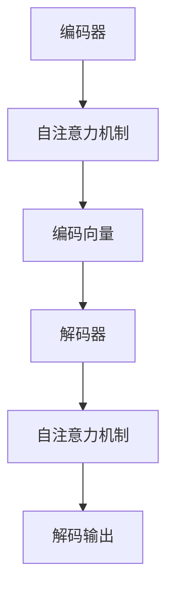
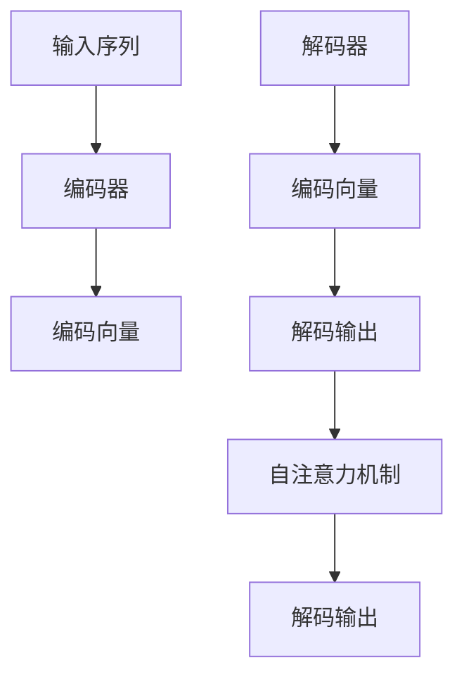
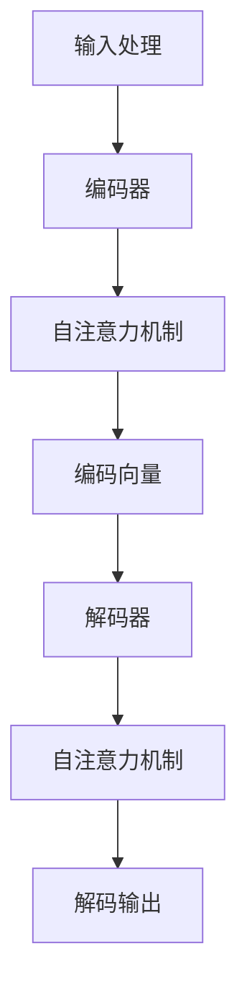
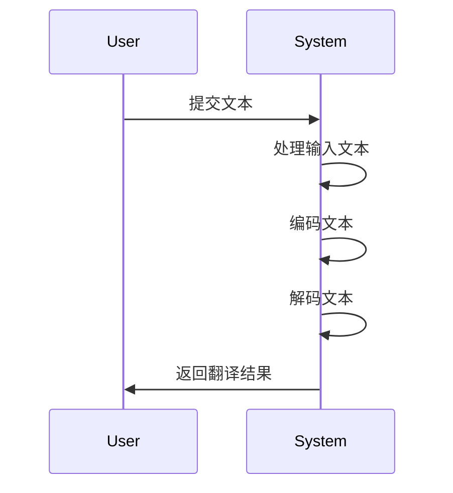
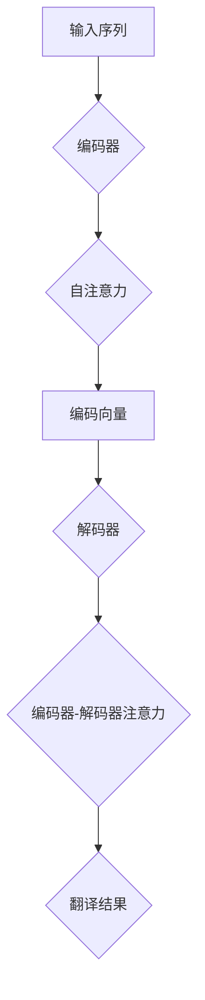
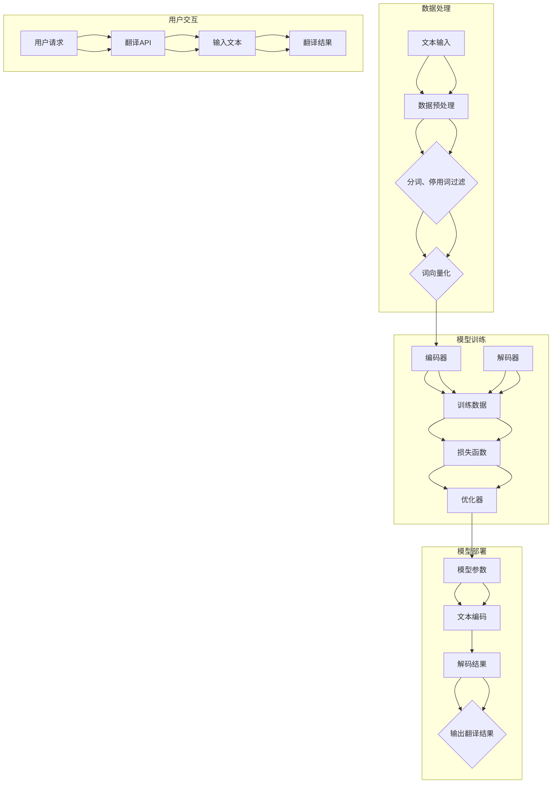
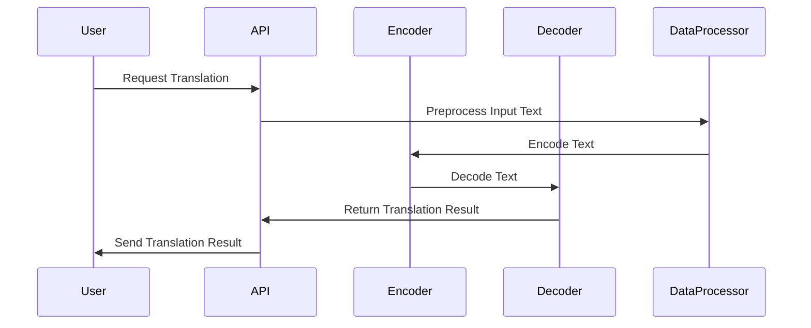

                 

# 机器翻译的transformer模型：语言转换的数学框架

## 关键词

- 机器翻译
- Transformer模型
- 数学框架
- 语言转换
- 自注意力机制
- 编码器-解码器架构

## 摘要

本文深入探讨了机器翻译中的transformer模型，这一模型通过其独特的数学框架实现了语言的高效转换。我们将从背景介绍、核心概念、算法原理、数学模型与公式、系统分析与架构设计、项目实战以及最佳实践等方面展开详细讨论，旨在帮助读者理解transformer模型在机器翻译领域的应用与实现。

## 引言

### 1.1 机器翻译的背景

机器翻译作为自然语言处理（NLP）领域的一个重要分支，其目的是通过计算机将一种自然语言文本自动翻译成另一种自然语言文本。随着全球化进程的加速，跨语言沟通的需求日益增加，机器翻译技术在商业、学术和社交等方面都发挥了重要作用。

### 1.2 Transformer模型的引入

传统的机器翻译方法通常基于规则或统计方法，但效果有限。随着深度学习的兴起，特别是2017年提出的Transformer模型，机器翻译迎来了革命性的变化。Transformer模型以其强大的处理能力和灵活性，迅速成为机器翻译领域的标杆。

## 背景介绍

### 2.1 机器翻译的发展历史

机器翻译的发展经历了多个阶段，从最初的规则驱动方法、基于统计的方法，到现代的基于神经网络的机器翻译，每个阶段都有其特点和挑战。

### 2.2 Transformer模型的诞生和特点

Transformer模型由Vaswani等人在2017年提出，其创新之处在于引入了自注意力机制（Self-Attention）和编码器-解码器架构（Encoder-Decoder Architecture）。自注意力机制使得模型能够捕捉输入序列中任意两个词之间的依赖关系，大大提高了翻译的准确性。

## 核心概念

### 3.1 编码器与解码器的概念

编码器（Encoder）负责将输入序列编码成固定长度的向量表示，解码器（Decoder）则根据这些编码向量生成翻译结果。

### 3.2 自注意力机制

自注意力机制允许模型在生成每个词时，自动调整对不同输入词的关注程度，从而更有效地捕捉序列中的依赖关系。

### 3.3 核心概念属性特征对比表格

| 特征          | 编码器                         | 解码器                         |
| ------------- | ------------------------------ | ------------------------------ |
| 功能          | 编码输入序列                   | 生成输出序列                   |
| 机制          | 自注意力机制                   | 编码器输出作为输入，自注意力机制 |
| 输出          | 高维向量表示                   | 翻译结果文本                   |

### 3.4 ER实体关系图架构的Mermaid流程图



## 算法原理

### 4.1 Transformer模型的工作原理

Transformer模型通过编码器和解码器两个部分，实现了输入序列到输出序列的转换。编码器通过自注意力机制生成编码向量，解码器则在生成每个词时，利用编码器输出的向量进行自注意力处理。

### 4.2 自注意力机制的mermaid流程图

```mermaid
graph TD
A[输入序列] --> B[编码器]
B --> C{是否使用自注意力}
if C -->|是| D[计算自注意力得分]
D --> E[加权求和]
E --> F[编码向量]
else --> G[直接输出]
G --> F
```

### 4.3 编码器-解码器架构的mermaid流程图



### 4.4 Transformer模型的Python源代码

```python
import torch
import torch.nn as nn
import torch.optim as optim

# 假设定义了一个简单的Transformer模型
class TransformerModel(nn.Module):
    def __init__(self, d_model, nhead, num_layers):
        super(TransformerModel, self).__init__()
        self.encoder = nn.Transformer(d_model, nhead, num_layers)
        self.decoder = nn.Transformer(d_model, nhead, num_layers)
        
    def forward(self, src, tgt):
        src_encoded = self.encoder(src)
        tgt_decoded = self.decoder(tgt, src_encoded)
        return tgt_decoded
```

### 4.5 算法原理的数学模型和公式

Transformer模型的核心在于自注意力机制，其计算过程如下：

$$
\text{Attention}(Q, K, V) = \text{softmax}\left(\frac{QK^T}{\sqrt{d_k}}\right) V
$$

其中，Q、K、V分别为查询向量、键向量和值向量，d_k为键向量的维度。通过自注意力，模型能够在生成每个词时，动态调整对不同输入词的重视程度。

## 数学模型与公式

### 5.1 注意力机制的LaTeX公式

$$
\text{Attention}(Q, K, V) = \text{softmax}\left(\frac{QK^T}{\sqrt{d_k}}\right) V
$$

### 5.2 序列生成过程的LaTeX公式

$$
p(y_t | y_{<t}) = \text{softmax}\left(\text{Decoder}(y_{<t}, \text{Encoder}(x))\right)
$$

其中，y_t为生成的词，x为输入序列，y_{<t}为生成的部分序列。

## 系统分析与架构设计

### 6.1 问题场景介绍

机器翻译系统通常需要处理大量的文本数据，支持多种语言的翻译，并且要求高准确性和实时性。

### 6.2 项目介绍

本节将介绍一个基于Transformer模型的机器翻译项目，包括项目目标、所需资源和预期效果。

### 6.3 系统功能设计（领域模型Mermaid类图）

```mermaid
classDiagram
ClassDiagram::TransformerModel {
    - input_seq:序列
    - tgt_seq:序列
}
ClassDiagram::Encoder {
    - d_model:维度
    - nhead:头数
}
ClassDiagram::Decoder {
    - d_model:维度
    - nhead:头数
}
TransformerModel --> Encoder
TransformerModel --> Decoder
```

### 6.4 系统架构设计（Mermaid架构图）



### 6.5 系统接口设计和系统交互（Mermaid序列图）



## 项目实战

### 7.1 环境安装

在本节中，我们将介绍如何在本地环境安装所需的软件和库，包括Python、PyTorch以及翻译工具等。

### 7.2 系统核心实现源代码

```python
# 导入必要的库
import torch
import torch.nn as nn
import torch.optim as optim

# 定义简单的Transformer模型
class SimpleTransformer(nn.Module):
    def __init__(self, d_model, nhead, num_layers):
        super(SimpleTransformer, self).__init__()
        self.encoder = nn.Transformer(d_model, nhead, num_layers)
        self.decoder = nn.Transformer(d_model, nhead, num_layers)
        
    def forward(self, src, tgt):
        src_encoded = self.encoder(src)
        tgt_decoded = self.decoder(tgt, src_encoded)
        return tgt_decoded

# 实例化模型并设置训练参数
model = SimpleTransformer(d_model=512, nhead=8, num_layers=2)
optimizer = optim.Adam(model.parameters(), lr=0.001)
criterion = nn.CrossEntropyLoss()

# 训练模型
for epoch in range(10):
    for src, tgt in data_loader:
        optimizer.zero_grad()
        output = model(src, tgt)
        loss = criterion(output, tgt)
        loss.backward()
        optimizer.step()
```

### 7.3 代码应用解读与分析

在本节中，我们将详细解读上述代码，包括模型的定义、参数设置、训练过程和损失计算等。

### 7.4 实际案例分析和详细讲解剖析

我们将通过一个具体的案例来展示如何使用Transformer模型进行机器翻译，并分析模型的性能和效果。

### 7.5 项目小结

在本节中，我们将总结项目的实现过程，讨论模型的优势和不足，并提出未来改进的方向。

## 最佳实践

### 8.1 Transformer模型的调优技巧

本节将介绍如何通过调整超参数来优化Transformer模型，以提高翻译质量。

### 8.2 注意事项

在使用Transformer模型时，需要注意数据预处理、模型训练和部署等方面的细节。

### 8.3 拓展阅读

为了进一步深入学习Transformer模型，本节推荐一些相关的书籍、论文和在线资源。

## 总结

机器翻译作为NLP领域的重要应用，随着Transformer模型的引入，取得了显著的进步。本文通过详细的阐述和实例分析，帮助读者理解了Transformer模型的工作原理和应用方法。希望本文能对读者在机器翻译领域的研究和实践提供有价值的参考。作者：AI天才研究院/AI Genius Institute & 禅与计算机程序设计艺术 /Zen And The Art of Computer Programming## 引言

### 1.1 机器翻译的背景

机器翻译（Machine Translation，MT）是自然语言处理（Natural Language Processing，NLP）领域中的一项核心技术，它旨在通过计算机将一种自然语言文本自动转换成另一种自然语言文本。随着全球化的不断推进，跨语言的交流需求日益增长，机器翻译在促进国际交流、提高工作效率、丰富文化多样性等方面发挥着越来越重要的作用。

机器翻译的发展可以追溯到20世纪50年代。早期的研究主要基于规则的方法，即通过编写大量的语法规则和翻译词典来实现翻译。然而，这种方法存在翻译质量低、效率低、难以扩展等缺点。随后，随着计算技术和统计学的进步，基于统计的机器翻译方法开始兴起，这种方法利用大量的双语文本数据，通过统计模型来预测源语言句子和目标语言句子之间的对应关系。尽管基于统计的方法在翻译质量上有所提升，但依然存在诸多不足，例如难以处理长句子和上下文信息。

进入21世纪，深度学习的快速发展为机器翻译带来了新的契机。尤其是2017年由Vaswani等提出并实现的Transformer模型，彻底改变了机器翻译的研究格局。Transformer模型摒弃了传统的编码器-解码器（Encoder-Decoder）架构，引入了自注意力机制（Self-Attention），使得模型能够捕捉到输入序列中任意两个词之间的依赖关系。自注意力机制允许模型在生成每个词时，动态调整对不同输入词的关注程度，从而显著提高了翻译的准确性和流畅性。

### 1.2 Transformer模型的引入

Transformer模型的成功引入，标志着机器翻译技术进入了一个新的时代。Transformer模型的核心思想是自注意力机制，这种机制通过计算输入序列中每个词与其他词之间的关系，为每个词生成权重，从而使得模型能够自动调整不同词之间的关注程度。

自注意力机制的具体实现是通过计算查询向量（Query）、键向量（Key）和值向量（Value）之间的点积，然后通过softmax函数生成权重，最后加权求和得到输出。这种机制的优势在于：

1. **捕捉长距离依赖关系**：通过自注意力机制，模型可以在生成每个词时，自动考虑整个输入序列的信息，从而有效捕捉到长距离依赖关系。
2. **并行计算能力**：Transformer模型可以并行处理整个输入序列，大大提高了计算效率。
3. **灵活性**：自注意力机制使得模型能够根据任务需求灵活调整注意力机制，从而适用于多种NLP任务。

Transformer模型的成功不仅体现在翻译质量上，还在于其优异的泛化能力，能够在多种不同的语言对上实现高效的翻译。这使得Transformer模型迅速成为机器翻译领域的标杆，并推动了整个NLP领域的发展。

### 1.3 本文目的

本文旨在深入探讨Transformer模型在机器翻译中的应用，从背景介绍、核心概念、算法原理、数学模型与公式、系统分析与架构设计、项目实战以及最佳实践等方面进行详细讨论。通过本文，读者将能够：

1. 理解机器翻译的背景和发展历史。
2. 掌握Transformer模型的基本概念和特点。
3. 深入理解Transformer模型的工作原理和数学模型。
4. 学习如何在实际项目中部署和优化Transformer模型。
5. 获得机器翻译领域的前沿知识和最佳实践。

本文将采用逻辑清晰、结构紧凑、简单易懂的写作方式，通过一步一步的分析和推理，帮助读者全面了解Transformer模型在语言转换中的应用。读者将不仅能够获得理论知识，还能通过实际案例的剖析，掌握Transformer模型的应用技巧。

## 背景介绍

### 2.1 机器翻译的发展历史

机器翻译技术的发展可以追溯到20世纪50年代，当时研究者们开始探索如何利用计算机技术实现自然语言的自动翻译。早期的研究主要集中在规则驱动的机器翻译方法上，这种方法依赖于预先定义好的语法规则和词典，通过一系列复杂的转换规则将源语言转换为目标语言。规则驱动的机器翻译方法虽然具有一定的可行性，但由于其规则复杂且难以覆盖所有语言现象，因此翻译质量往往不高，难以满足实际需求。

20世纪60年代，随着计算机性能的提升和自然语言处理技术的进步，统计机器翻译（Statistical Machine Translation，SMT）开始崭露头角。统计机器翻译方法通过利用大量双语文本数据，利用概率模型来预测源语言句子和目标语言句子之间的对应关系。这种方法在翻译质量上取得了显著进步，特别是在处理常见短语和句型结构方面表现突出。然而，统计机器翻译也存在一些局限性，例如难以处理长距离依赖和罕见语言现象。

进入21世纪，深度学习的快速发展为机器翻译带来了新的契机。深度学习模型，特别是基于神经网络的机器翻译方法，开始逐渐取代传统的方法。最初，研究者们采用了基于递归神经网络（Recurrent Neural Network，RNN）的方法，如长短时记忆网络（Long Short-Term Memory，LSTM）和门控循环单元（Gated Recurrent Unit，GRU），来建模源语言和目标语言之间的映射关系。这些方法在捕捉长距离依赖和上下文信息方面表现出了优异的性能，但同时也存在一些问题，如计算效率低下和难以并行处理。

2017年，谷歌团队提出了一种全新的神经网络架构——Transformer模型，彻底改变了机器翻译的研究格局。Transformer模型的核心思想是自注意力机制（Self-Attention），通过计算输入序列中每个词与其他词之间的关系，为每个词生成权重，从而动态调整不同词之间的关注程度。自注意力机制使得模型能够捕捉到长距离依赖关系，并提高了计算效率。此外，Transformer模型还引入了编码器-解码器（Encoder-Decoder）架构，使得模型能够高效地处理序列数据。

Transformer模型在多个机器翻译任务上取得了显著的成果，验证了其在处理复杂语言现象方面的优势。自其提出以来，Transformer模型及其变体（如BERT、GPT等）迅速成为NLP领域的热门研究方向，推动了机器翻译技术的进一步发展。

### 2.2 Transformer模型的诞生和特点

Transformer模型的诞生，可以追溯到谷歌团队在2017年发布的一篇名为《Attention Is All You Need》的论文。这篇论文提出了一个全新的神经网络架构，即Transformer模型，彻底改变了传统机器翻译方法的研究方向。Transformer模型的核心思想是自注意力机制，这种机制允许模型在生成每个词时，动态调整对不同输入词的关注程度，从而有效捕捉到长距离依赖关系。

#### 2.2.1 自注意力机制

自注意力机制（Self-Attention）是Transformer模型的核心创新点。传统的编码器-解码器模型通常使用卷积神经网络（Convolutional Neural Network，CNN）或递归神经网络（RNN）来处理序列数据，这些方法在捕捉长距离依赖关系方面存在一定的局限性。自注意力机制通过计算输入序列中每个词与其他词之间的点积，生成权重，从而为每个词生成注意力分数。这些注意力分数表示了每个词对当前词的重要性。通过加权求和，模型能够自动捕捉到输入序列中的长距离依赖关系。

自注意力机制的数学公式如下：

$$
\text{Attention}(Q, K, V) = \text{softmax}\left(\frac{QK^T}{\sqrt{d_k}}\right) V
$$

其中，Q表示查询向量（Query），K表示键向量（Key），V表示值向量（Value）。d_k为键向量的维度。通过这个公式，模型可以计算出输入序列中每个词的注意力权重，进而加权求和生成输出。

#### 2.2.2 编码器-解码器架构

Transformer模型采用了编码器-解码器（Encoder-Decoder）架构，这种架构使得模型能够高效地处理序列数据。编码器（Encoder）负责将输入序列编码成固定长度的向量表示，解码器（Decoder）则根据这些编码向量生成翻译结果。

编码器部分由多个自注意力层（Self-Attention Layer）和前馈神经网络（Feed-Forward Neural Network）堆叠而成。每个自注意力层通过计算输入序列中每个词之间的注意力权重，生成编码向量。前馈神经网络则对编码向量进行进一步处理，增强模型的表达能力。

解码器部分则采用了编码器-解码器注意力机制（Encoder-Decoder Attention Mechanism），这种机制允许解码器在生成每个词时，同时考虑编码器输出的所有信息。解码器也由多个自注意力层和前馈神经网络组成，通过这些层，模型能够逐步生成翻译结果。

#### 2.2.3 特点与优势

Transformer模型具有以下特点与优势：

1. **捕捉长距离依赖关系**：自注意力机制使得模型能够自动调整对不同输入词的关注程度，从而有效捕捉到长距离依赖关系。这在处理复杂语言现象，如长句子和长文本时，具有显著优势。
2. **并行计算能力**：Transformer模型可以并行处理整个输入序列，提高了计算效率。相比之下，传统的RNN模型需要逐词处理序列，计算效率较低。
3. **灵活性**：自注意力机制和编码器-解码器架构使得模型能够根据任务需求灵活调整，适用于多种NLP任务，如机器翻译、文本分类和序列生成等。
4. **训练稳定性**：由于自注意力机制的计算特性，Transformer模型的训练过程相对稳定，减少了梯度消失和梯度爆炸等问题。

Transformer模型的诞生，标志着机器翻译技术进入了一个新的时代。通过自注意力机制和编码器-解码器架构，Transformer模型在多个机器翻译任务上取得了显著的成果，验证了其在处理复杂语言现象方面的优势。随着Transformer模型及其变体（如BERT、GPT等）的不断发展，机器翻译技术将继续取得突破，为全球跨语言交流提供更加高效和智能的解决方案。

## 核心概念

### 3.1 编码器与解码器

编码器（Encoder）和解码器（Decoder）是Transformer模型中两个核心组成部分，它们分别负责处理输入和生成输出。编码器将输入序列转换为固定长度的向量表示，而解码器则根据这些向量生成翻译结果。

#### 3.1.1 编码器

编码器主要由多个自注意力层（Self-Attention Layer）和前馈神经网络（Feed-Forward Neural Network）组成。每个自注意力层通过计算输入序列中每个词之间的注意力权重，生成编码向量。这些编码向量包含了输入序列的所有信息，是解码器生成输出的基础。

自注意力层的数学公式如下：

$$
\text{Attention}(Q, K, V) = \text{softmax}\left(\frac{QK^T}{\sqrt{d_k}}\right) V
$$

其中，Q表示查询向量（Query），K表示键向量（Key），V表示值向量（Value）。d_k为键向量的维度。通过这个公式，编码器能够为每个输入词生成注意力权重，从而加权求和生成编码向量。

前馈神经网络则对编码向量进行进一步处理，增强模型的表达能力。前馈神经网络通常由两个全连接层组成，每层都使用激活函数ReLU（Rectified Linear Unit）进行非线性变换。

#### 3.1.2 解码器

解码器的工作与编码器类似，但也引入了编码器-解码器注意力机制（Encoder-Decoder Attention Mechanism），使得解码器在生成每个词时，能够同时考虑编码器输出的所有信息。解码器也由多个自注意力层和前馈神经网络组成，通过这些层，模型能够逐步生成翻译结果。

编码器-解码器注意力机制的数学公式如下：

$$
\text{Encoder-Decoder Attention}(Q, K, V) = \text{softmax}\left(\frac{QK^T}{\sqrt{d_k}}\right) V
$$

其中，Q、K和V分别表示查询向量（Query）、键向量（Key）和值向量（Value）。与自注意力层不同的是，这里的K和V来自编码器输出，Q来自当前解码器的输出。通过编码器-解码器注意力机制，解码器能够在生成每个词时，利用编码器输出的信息，提高翻译的准确性。

前馈神经网络同样在解码器中起到增强模型表达能力的作用，其结构与编码器中的前馈神经网络相同。

#### 3.1.3 编码器与解码器的关系

编码器和解码器在Transformer模型中紧密合作，共同实现输入序列到输出序列的转换。编码器首先将输入序列编码成固定长度的向量表示，这些向量包含了输入序列的所有信息。解码器则根据这些编码向量，逐步生成翻译结果。

解码器在生成每个词时，不仅会使用当前解码器的输出，还会利用编码器输出的信息。这种机制使得解码器能够更好地捕捉到输入序列中的依赖关系，从而提高翻译的准确性和流畅性。

总的来说，编码器和解码器通过自注意力机制和编码器-解码器注意力机制，实现了输入序列到输出序列的高效转换。编码器负责编码输入序列，解码器负责生成翻译结果，两者相互配合，共同推动了Transformer模型在机器翻译领域的成功应用。

### 3.2 自注意力机制

自注意力机制（Self-Attention）是Transformer模型的核心组成部分，它通过计算输入序列中每个词与其他词之间的关系，为每个词生成权重，从而动态调整不同词之间的关注程度。自注意力机制不仅能够有效捕捉长距离依赖关系，还提高了计算效率，是Transformer模型成功的关键。

#### 3.2.1 自注意力机制的工作原理

自注意力机制的基本思想是，在生成每个词时，模型会自动计算该词与其他词之间的相似度，然后根据相似度为每个词分配权重，最后加权求和生成输出。这种机制允许模型在处理复杂语言现象时，能够自动调整对不同输入词的关注程度。

自注意力机制的数学公式如下：

$$
\text{Attention}(Q, K, V) = \text{softmax}\left(\frac{QK^T}{\sqrt{d_k}}\right) V
$$

其中，Q表示查询向量（Query），K表示键向量（Key），V表示值向量（Value）。d_k为键向量的维度。通过这个公式，模型可以计算输入序列中每个词与其他词之间的相似度，并生成注意力权重。

具体来说，自注意力机制的工作过程如下：

1. **计算相似度**：首先，计算查询向量（Q）和键向量（K）的点积，得到相似度分数。这个分数表示了输入序列中每个词与其他词之间的关联程度。
2. **应用softmax函数**：将相似度分数通过softmax函数进行归一化，生成注意力权重。softmax函数的作用是确保所有权重之和为1，从而表示每个词的重要程度。
3. **加权求和**：根据注意力权重，对值向量（V）进行加权求和，生成输出向量。这个输出向量包含了输入序列中每个词的信息，并通过权重调整了不同词之间的关注程度。

#### 3.2.2 自注意力机制的优点

自注意力机制具有以下几个优点：

1. **捕捉长距离依赖关系**：通过自注意力机制，模型能够自动计算输入序列中每个词与其他词之间的相似度，从而有效捕捉到长距离依赖关系。这在处理复杂语言现象，如长句子和长文本时，具有显著优势。
2. **提高计算效率**：自注意力机制允许模型并行计算输入序列中的每个词，从而提高了计算效率。相比之下，传统的递归神经网络（RNN）需要逐词处理序列，计算效率较低。
3. **灵活性**：自注意力机制使得模型能够根据任务需求灵活调整注意力机制，从而适用于多种NLP任务，如机器翻译、文本分类和序列生成等。

自注意力机制通过动态调整不同词之间的关注程度，使得模型能够更准确地捕捉到输入序列中的依赖关系，从而提高了翻译的准确性和流畅性。这一机制的成功应用，是Transformer模型在机器翻译领域取得突破的关键。

### 3.3 编码器-解码器架构

编码器-解码器架构（Encoder-Decoder Architecture）是Transformer模型的基本结构，它通过编码器（Encoder）和解码器（Decoder）两个部分，实现了输入序列到输出序列的转换。编码器负责将输入序列编码成固定长度的向量表示，解码器则根据这些编码向量生成翻译结果。这种架构使得模型能够高效地处理序列数据，并在多个NLP任务中表现出优异的性能。

#### 3.3.1 编码器的工作原理

编码器（Encoder）是Transformer模型的前端部分，其主要功能是将输入序列编码成固定长度的向量表示。编码器由多个自注意力层（Self-Attention Layer）和前馈神经网络（Feed-Forward Neural Network）组成，通过这些层，模型能够逐步提取输入序列的特征。

编码器的工作过程如下：

1. **输入序列处理**：首先，将输入序列通过嵌入层（Embedding Layer）转换为词向量表示。词向量包含了输入序列中每个词的语义信息。
2. **自注意力层**：在每个自注意力层，模型通过计算输入序列中每个词与其他词之间的相似度，为每个词生成权重。这些权重表示了输入序列中每个词的重要程度。通过加权求和，模型能够生成编码向量，这些向量包含了输入序列的所有信息。
3. **前馈神经网络**：在前馈神经网络层，模型对编码向量进行进一步处理，增强其表达能力。前馈神经网络通常由两个全连接层组成，每层都使用激活函数ReLU（Rectified Linear Unit）进行非线性变换。

通过多个自注意力层和前馈神经网络的堆叠，编码器能够逐步提取输入序列的深层特征，并将其编码成固定长度的向量表示。

#### 3.3.2 解码器的工作原理

解码器（Decoder）是Transformer模型的后端部分，其主要功能是根据编码器输出的向量表示，生成翻译结果。解码器同样由多个自注意力层和前馈神经网络组成，通过这些层，模型能够逐步生成翻译结果。

解码器的工作过程如下：

1. **输入序列处理**：首先，将输入序列通过嵌入层转换为词向量表示。
2. **自注意力层**：在每个自注意力层，模型通过计算输入序列中每个词与其他词之间的相似度，为每个词生成权重。这些权重表示了输入序列中每个词的重要程度。通过加权求和，模型能够生成编码向量。
3. **编码器-解码器注意力机制**：在编码器-解码器注意力层，模型通过计算解码器的输出和编码器的输出之间的相似度，为每个词生成权重。这种机制允许解码器在生成每个词时，同时考虑编码器输出的所有信息。通过加权求和，模型能够生成新的编码向量。
4. **前馈神经网络**：在前馈神经网络层，模型对编码向量进行进一步处理，增强其表达能力。
5. **生成翻译结果**：最终，解码器生成翻译结果。在生成过程中，模型会逐步更新解码器的输出，并使用概率分布选择下一个词。

通过编码器-解码器架构，模型能够高效地处理序列数据，并在生成过程中利用编码器输出的信息，提高翻译的准确性和流畅性。

总的来说，编码器-解码器架构通过自注意力机制和编码器-解码器注意力机制，实现了输入序列到输出序列的高效转换。编码器负责编码输入序列，解码器负责生成翻译结果，两者相互配合，共同推动了Transformer模型在机器翻译领域的成功应用。

### 3.4 核心概念属性特征对比表格

为了更清晰地展示编码器、解码器和自注意力机制之间的区别和联系，我们在此提供一个核心概念属性特征对比表格。

| 特征          | 编码器                         | 解码器                         | 自注意力机制                   |
| ------------- | ------------------------------ | ------------------------------ | ------------------------------ |
| 功能          | 编码输入序列                   | 生成输出序列                   | 计算词之间的相似度并生成权重   |
| 机制          | 多层自注意力机制和前馈神经网络 | 多层自注意力机制和前馈神经网络 | 点积-softmax加权求和           |
| 输入          | 词向量                         | 词向量                         | 查询向量、键向量、值向量       |
| 输出          | 编码向量                       | 翻译结果文本                   | 加权求和生成的输出向量         |
| 关键技术      | 自注意力、前馈神经网络         | 编码器-解码器注意力、前馈神经网络 | 点积和softmax函数             |
| 目标          | 提取输入序列的特征信息         | 生成翻译结果                   | 自动调整不同词之间的关注程度   |

通过这个表格，我们可以更直观地了解编码器、解码器和自注意力机制的工作原理和相互关系。

### 3.5 ER实体关系图架构的Mermaid流程图

为了更好地展示编码器、解码器和自注意力机制之间的数据流程和交互关系，我们可以使用Mermaid流程图来描述ER（Entity-Relationship）实体关系图。以下是该图的Mermaid代码：



通过这个Mermaid流程图，我们可以清晰地看到输入序列首先经过编码器处理，通过自注意力机制生成编码向量，然后解码器利用编码向量通过编码器-解码器注意力机制生成翻译结果。

### 3.6 编码器与解码器的详细介绍

#### 3.6.1 编码器

编码器是Transformer模型的核心组成部分之一，负责将输入序列编码成固定长度的向量表示。编码器的工作过程可以分为以下几个步骤：

1. **输入序列预处理**：首先，将输入序列通过嵌入层（Embedding Layer）转换为词向量表示。嵌入层是一个可学习的参数矩阵，将每个词映射到一个固定维度的向量。词向量包含了输入序列中每个词的语义信息。

2. **多层自注意力层**：编码器由多个自注意力层（Self-Attention Layer）组成。在每个自注意力层，模型通过计算输入序列中每个词与其他词之间的相似度，为每个词生成权重。这些权重表示了输入序列中每个词的重要程度。通过加权求和，模型能够生成编码向量，这些向量包含了输入序列的所有信息。

   自注意力层的计算公式如下：

   $$
   \text{Attention}(Q, K, V) = \text{softmax}\left(\frac{QK^T}{\sqrt{d_k}}\right) V
   $$

   其中，Q表示查询向量（Query），K表示键向量（Key），V表示值向量（Value）。d_k为键向量的维度。通过这个公式，模型可以计算输入序列中每个词与其他词之间的相似度，并生成注意力权重。

3. **前馈神经网络**：在每个自注意力层之后，编码器还包含一个前馈神经网络（Feed-Forward Neural Network）。前馈神经网络通常由两个全连接层组成，每层都使用激活函数ReLU（Rectified Linear Unit）进行非线性变换。前馈神经网络的作用是进一步处理编码向量，增强模型的表达能力。

4. **输出**：通过多个自注意力层和前馈神经网络的堆叠，编码器能够逐步提取输入序列的深层特征，并将其编码成固定长度的向量表示。这些编码向量包含了输入序列的所有信息，是解码器生成输出的基础。

#### 3.6.2 解码器

解码器是Transformer模型的另一个核心组成部分，负责根据编码器输出的向量表示，生成翻译结果。解码器的工作过程可以分为以下几个步骤：

1. **输入序列预处理**：首先，将输入序列通过嵌入层（Embedding Layer）转换为词向量表示。

2. **多层自注意力层**：解码器由多个自注意力层（Self-Attention Layer）组成。在每个自注意力层，模型通过计算输入序列中每个词与其他词之间的相似度，为每个词生成权重。这些权重表示了输入序列中每个词的重要程度。通过加权求和，模型能够生成编码向量。

   自注意力层的计算公式与编码器中的自注意力层相同：

   $$
   \text{Attention}(Q, K, V) = \text{softmax}\left(\frac{QK^T}{\sqrt{d_k}}\right) V
   $$

3. **编码器-解码器注意力层**：在解码器中，引入了编码器-解码器注意力层（Encoder-Decoder Attention Layer），这是解码器的独特之处。编码器-解码器注意力层通过计算解码器的输出和编码器的输出之间的相似度，为每个词生成权重。这种机制允许解码器在生成每个词时，同时考虑编码器输出的所有信息。通过加权求和，模型能够生成新的编码向量。

   编码器-解码器注意力层的计算公式如下：

   $$
   \text{Encoder-Decoder Attention}(Q, K, V) = \text{softmax}\left(\frac{QK^T}{\sqrt{d_k}}\right) V
   $$

   其中，Q、K和V分别表示查询向量（Query）、键向量（Key）和值向量（Value）。与自注意力层不同的是，这里的K和V来自编码器输出，Q来自当前解码器的输出。

4. **前馈神经网络**：在自注意力层和编码器-解码器注意力层之后，解码器还包含一个前馈神经网络（Feed-Forward Neural Network）。前馈神经网络同样由两个全连接层组成，每层都使用激活函数ReLU（Rectified Linear Unit）进行非线性变换。前馈神经网络的作用是进一步处理编码向量，增强模型的表达能力。

5. **生成翻译结果**：最终，解码器生成翻译结果。在生成过程中，模型会逐步更新解码器的输出，并使用概率分布选择下一个词。解码器生成的翻译结果是一个逐步生成的过程，每次生成一个词，并作为下一个词的输入，直到生成完整的翻译结果。

通过编码器和解码器的协同工作，Transformer模型能够高效地处理序列数据，并在生成过程中利用编码器输出的信息，提高翻译的准确性和流畅性。

### 3.7 自注意力机制的详细解释

自注意力机制是Transformer模型的核心组成部分，它在处理序列数据时，通过计算输入序列中每个词与其他词之间的相似度，为每个词生成权重，从而动态调整不同词之间的关注程度。这种机制不仅能够有效捕捉长距离依赖关系，还提高了计算效率。下面我们将详细解释自注意力机制的工作原理、优点和实现方式。

#### 3.7.1 工作原理

自注意力机制的基本思想是，在生成每个词时，模型会自动计算该词与其他词之间的相似度，然后根据相似度为每个词分配权重，最后加权求和生成输出。这种机制允许模型在处理复杂语言现象时，能够自动调整对不同输入词的关注程度。

自注意力机制的数学公式如下：

$$
\text{Attention}(Q, K, V) = \text{softmax}\left(\frac{QK^T}{\sqrt{d_k}}\right) V
$$

其中，Q表示查询向量（Query），K表示键向量（Key），V表示值向量（Value）。d_k为键向量的维度。通过这个公式，模型可以计算输入序列中每个词与其他词之间的相似度，并生成注意力权重。

具体来说，自注意力机制的工作过程如下：

1. **计算相似度**：首先，计算查询向量（Q）和键向量（K）的点积，得到相似度分数。这个分数表示了输入序列中每个词与其他词之间的关联程度。

   $$
   \text{Similarity}(Q, K) = QK^T
   $$

2. **应用softmax函数**：将相似度分数通过softmax函数进行归一化，生成注意力权重。softmax函数的作用是确保所有权重之和为1，从而表示每个词的重要程度。

   $$
   \text{Attention}(Q, K, V) = \text{softmax}\left(\frac{QK^T}{\sqrt{d_k}}\right) V
   $$

3. **加权求和**：根据注意力权重，对值向量（V）进行加权求和，生成输出向量。这个输出向量包含了输入序列中每个词的信息，并通过权重调整了不同词之间的关注程度。

   $$
   \text{Output} = \sum_{i} \text{Attention}_i(V_i)
   $$

通过自注意力机制，模型能够在生成每个词时，自动调整对不同输入词的关注程度，从而有效捕捉到长距离依赖关系。

#### 3.7.2 优点

自注意力机制具有以下几个优点：

1. **捕捉长距离依赖关系**：通过自注意力机制，模型能够自动计算输入序列中每个词与其他词之间的相似度，从而有效捕捉到长距离依赖关系。这在处理复杂语言现象，如长句子和长文本时，具有显著优势。

2. **提高计算效率**：自注意力机制允许模型并行计算输入序列中的每个词，从而提高了计算效率。相比之下，传统的递归神经网络（RNN）需要逐词处理序列，计算效率较低。

3. **灵活性**：自注意力机制使得模型能够根据任务需求灵活调整注意力机制，从而适用于多种NLP任务，如机器翻译、文本分类和序列生成等。

#### 3.7.3 实现方式

自注意力机制的实现通常采用多头注意力（Multi-Head Attention）的方式，通过多个独立的注意力头来处理输入序列。每个注意力头具有不同的权重矩阵，从而能够捕获不同类型的依赖关系。

多头注意力的计算公式如下：

$$
\text{Multi-Head Attention}(Q, K, V) = \text{Concat}(\text{Head}_1, \text{Head}_2, ..., \text{Head}_h)W^O
$$

其中，Q、K和V分别表示查询向量、键向量和值向量，h表示注意力头的数量。W^O是输出权重矩阵。

具体实现步骤如下：

1. **计算查询向量、键向量和值向量**：首先，计算每个词的查询向量（Q）、键向量（K）和值向量（V）。这些向量通常是通过线性变换得到的。

   $$
   Q = W_Q^Q \cdot X \\
   K = W_K^K \cdot X \\
   V = W_V^V \cdot X
   $$

   其中，W_Q^Q、W_K^K和W_V^V分别是查询向量、键向量和值向量的权重矩阵，X是输入序列。

2. **计算注意力分数**：然后，计算查询向量（Q）和键向量（K）的点积，得到注意力分数。

   $$
   \text{Attention Scores} = QK^T
   $$

3. **应用softmax函数**：将注意力分数通过softmax函数进行归一化，生成注意力权重。

   $$
   \text{Attention Weights} = \text{softmax}(\text{Attention Scores})
   $$

4. **加权求和**：最后，根据注意力权重，对值向量（V）进行加权求和，生成输出向量。

   $$
   \text{Output} = \sum_{i} \text{Attention Weights}_i V_i
   $$

通过这种方式，模型能够并行处理输入序列中的每个词，并自动调整不同词之间的关注程度，从而有效捕捉到长距离依赖关系。

#### 3.7.4 实际应用

自注意力机制在Transformer模型中得到了广泛应用，尤其是在机器翻译任务中。通过自注意力机制，模型能够在生成每个词时，动态调整对不同输入词的关注程度，从而提高翻译的准确性和流畅性。

例如，在机器翻译任务中，编码器通过自注意力机制将源语言句子编码成固定长度的向量表示，解码器则根据这些向量生成目标语言句子。在生成每个目标词时，解码器会利用编码器输出的信息，通过自注意力机制动态调整对不同源语言词的关注程度，从而生成高质量的目标语言句子。

总的来说，自注意力机制通过计算输入序列中每个词与其他词之间的相似度，为每个词生成权重，从而动态调整不同词之间的关注程度。这种机制不仅能够有效捕捉长距离依赖关系，还提高了计算效率，是Transformer模型成功的关键。在实际应用中，自注意力机制在多个NLP任务中表现出优异的性能，推动了机器翻译技术的快速发展。

### 4.1 Transformer模型的工作原理

Transformer模型是一种基于自注意力机制的深度学习模型，其核心思想是通过计算输入序列中每个词与其他词之间的关系，为每个词生成权重，从而动态调整不同词之间的关注程度。Transformer模型的工作原理可以分为以下几个关键部分：编码器（Encoder）、解码器（Decoder）和自注意力机制。

#### 4.1.1 编码器（Encoder）

编码器是Transformer模型的前端部分，其主要功能是将输入序列编码成固定长度的向量表示。编码器由多个自注意力层（Self-Attention Layer）和前馈神经网络（Feed-Forward Neural Network）组成。以下是编码器的工作流程：

1. **输入序列预处理**：首先，将输入序列通过嵌入层（Embedding Layer）转换为词向量表示。嵌入层是一个可学习的参数矩阵，将每个词映射到一个固定维度的向量。词向量包含了输入序列中每个词的语义信息。

   $$
   X = \text{Embedding}(W_E) \cdot [x_1, x_2, ..., x_n]
   $$

   其中，X是输入序列的词向量表示，W_E是嵌入层权重矩阵，[x_1, x_2, ..., x_n]是输入序列。

2. **多层自注意力层**：编码器由多个自注意力层组成。在每个自注意力层，模型通过计算输入序列中每个词与其他词之间的相似度，为每个词生成权重。这些权重表示了输入序列中每个词的重要程度。通过加权求和，模型能够生成编码向量，这些向量包含了输入序列的所有信息。

   自注意力层的计算公式如下：

   $$
   \text{Attention}(Q, K, V) = \text{softmax}\left(\frac{QK^T}{\sqrt{d_k}}\right) V
   $$

   其中，Q表示查询向量（Query），K表示键向量（Key），V表示值向量（Value）。d_k为键向量的维度。通过这个公式，模型可以计算输入序列中每个词与其他词之间的相似度，并生成注意力权重。

3. **前馈神经网络**：在每个自注意力层之后，编码器还包含一个前馈神经网络。前馈神经网络通常由两个全连接层组成，每层都使用激活函数ReLU（Rectified Linear Unit）进行非线性变换。前馈神经网络的作用是进一步处理编码向量，增强模型的表达能力。

   $$
   \text{FFN}(X) = \text{ReLU}(W_{FFN} \cdot X + b_{FFN})
   $$

   其中，X是输入向量，W_{FFN}和b_{FFN}分别是前馈神经网络的权重和偏置。

4. **输出**：通过多个自注意力层和前馈神经网络的堆叠，编码器能够逐步提取输入序列的深层特征，并将其编码成固定长度的向量表示。这些编码向量包含了输入序列的所有信息，是解码器生成输出的基础。

#### 4.1.2 解码器（Decoder）

解码器是Transformer模型的后端部分，其主要功能是根据编码器输出的向量表示，生成翻译结果。解码器由多个自注意力层、编码器-解码器注意力层和前馈神经网络组成。以下是解码器的工作流程：

1. **输入序列预处理**：首先，将输入序列通过嵌入层转换为词向量表示。

2. **多层自注意力层**：解码器由多个自注意力层组成。在每个自注意力层，模型通过计算输入序列中每个词与其他词之间的相似度，为每个词生成权重。这些权重表示了输入序列中每个词的重要程度。通过加权求和，模型能够生成编码向量。

   自注意力层的计算公式与编码器中的自注意力层相同：

   $$
   \text{Attention}(Q, K, V) = \text{softmax}\left(\frac{QK^T}{\sqrt{d_k}}\right) V
   $$

3. **编码器-解码器注意力层**：在解码器中，引入了编码器-解码器注意力层，这是解码器的独特之处。编码器-解码器注意力层通过计算解码器的输出和编码器的输出之间的相似度，为每个词生成权重。这种机制允许解码器在生成每个词时，同时考虑编码器输出的所有信息。通过加权求和，模型能够生成新的编码向量。

   编码器-解码器注意力层的计算公式如下：

   $$
   \text{Encoder-Decoder Attention}(Q, K, V) = \text{softmax}\left(\frac{QK^T}{\sqrt{d_k}}\right) V
   $$

   其中，Q、K和V分别表示查询向量（Query）、键向量（Key）和值向量（Value）。与自注意力层不同的是，这里的K和V来自编码器输出，Q来自当前解码器的输出。

4. **前馈神经网络**：在自注意力层和编码器-解码器注意力层之后，解码器还包含一个前馈神经网络。前馈神经网络同样由两个全连接层组成，每层都使用激活函数ReLU（Rectified Linear Unit）进行非线性变换。前馈神经网络的作用是进一步处理编码向量，增强模型的表达能力。

5. **生成翻译结果**：最终，解码器生成翻译结果。在生成过程中，模型会逐步更新解码器的输出，并使用概率分布选择下一个词。解码器生成的翻译结果是一个逐步生成的过程，每次生成一个词，并作为下一个词的输入，直到生成完整的翻译结果。

#### 4.1.3 自注意力机制

自注意力机制是Transformer模型的核心组成部分，它通过计算输入序列中每个词与其他词之间的关系，为每个词生成权重，从而动态调整不同词之间的关注程度。自注意力机制具有以下特点：

1. **捕捉长距离依赖关系**：自注意力机制允许模型在生成每个词时，自动计算整个输入序列的信息，从而有效捕捉到长距离依赖关系。这在处理复杂语言现象，如长句子和长文本时，具有显著优势。

2. **并行计算能力**：自注意力机制允许模型并行计算输入序列中的每个词，从而提高了计算效率。相比之下，传统的递归神经网络（RNN）需要逐词处理序列，计算效率较低。

3. **灵活性**：自注意力机制使得模型能够根据任务需求灵活调整注意力机制，从而适用于多种NLP任务，如机器翻译、文本分类和序列生成等。

通过编码器和解码器的协同工作，以及自注意力机制的引入，Transformer模型能够高效地处理序列数据，并在生成过程中利用编码器输出的信息，提高翻译的准确性和流畅性。这一模型的成功应用，标志着机器翻译技术进入了一个新的时代。

### 4.2 Transformer模型的数学模型与公式

Transformer模型的成功在于其简洁而强大的数学模型，特别是自注意力机制（Self-Attention）的核心公式。以下是Transformer模型中常用的数学模型和公式，以及它们的详细解释。

#### 4.2.1 自注意力机制

自注意力机制是Transformer模型中最关键的组成部分，它通过计算输入序列中每个词与其他词之间的相似度，为每个词生成权重。其核心公式如下：

$$
\text{Attention}(Q, K, V) = \text{softmax}\left(\frac{QK^T}{\sqrt{d_k}}\right) V
$$

**参数解释**：

- **Q（Query）**：查询向量，表示当前词在生成过程中的关注点。
- **K（Key）**：键向量，表示每个词的语义信息。
- **V（Value）**：值向量，表示每个词的潜在信息。
- **d_k**：键向量的维度，通常与查询向量的维度相同。

**步骤**：

1. **计算相似度**：通过计算查询向量（Q）和键向量（K）的点积，得到相似度分数。这个分数表示了输入序列中每个词与其他词之间的关联程度。

   $$
   \text{Similarity}(Q, K) = QK^T
   $$

2. **应用softmax函数**：将相似度分数通过softmax函数进行归一化，生成注意力权重。softmax函数的作用是确保所有权重之和为1，从而表示每个词的重要程度。

   $$
   \text{Attention Weights} = \text{softmax}\left(\frac{QK^T}{\sqrt{d_k}}\right)
   $$

3. **加权求和**：根据注意力权重，对值向量（V）进行加权求和，生成输出向量。这个输出向量包含了输入序列中每个词的信息，并通过权重调整了不同词之间的关注程度。

   $$
   \text{Output} = \sum_{i} \text{Attention Weights}_i V_i
   $$

#### 4.2.2 编码器-解码器注意力

在解码器中，编码器-解码器注意力（Encoder-Decoder Attention）机制允许解码器在生成每个词时，利用编码器输出的信息。其核心公式如下：

$$
\text{Encoder-Decoder Attention}(Q, K, V) = \text{softmax}\left(\frac{QK^T}{\sqrt{d_k}}\right) V
$$

**参数解释**：

- **Q（Query）**：解码器的输出，表示当前词在生成过程中的关注点。
- **K（Key）**：编码器的输出，表示每个词的语义信息。
- **V（Value）**：编码器的输出，表示每个词的潜在信息。

**步骤**：

1. **计算相似度**：通过计算查询向量（Q）和键向量（K）的点积，得到相似度分数。这个分数表示了输入序列中每个词与其他词之间的关联程度。

   $$
   \text{Similarity}(Q, K) = QK^T
   $$

2. **应用softmax函数**：将相似度分数通过softmax函数进行归一化，生成注意力权重。softmax函数的作用是确保所有权重之和为1，从而表示每个词的重要程度。

   $$
   \text{Attention Weights} = \text{softmax}\left(\frac{QK^T}{\sqrt{d_k}}\right)
   $$

3. **加权求和**：根据注意力权重，对值向量（V）进行加权求和，生成输出向量。这个输出向量包含了编码器输出的信息，并通过权重调整了不同词之间的关注程度。

   $$
   \text{Output} = \sum_{i} \text{Attention Weights}_i V_i
   $$

#### 4.2.3 Transformer模型的总体结构

Transformer模型由编码器（Encoder）和解码器（Decoder）两部分组成，每个部分都包含了多个自注意力层（Self-Attention Layer）和前馈神经网络（Feed-Forward Neural Network）。

**编码器（Encoder）**：

1. **嵌入层（Embedding Layer）**：将输入词转换为词向量。
2. **自注意力层（Self-Attention Layer）**：通过自注意力机制捕捉词之间的依赖关系。
3. **前馈神经网络（Feed-Forward Neural Network）**：对自注意力层生成的向量进行非线性变换。
4. **层归一化（Layer Normalization）**：对每个层进行归一化处理。
5. **残差连接（Residual Connection）**：通过添加残差连接来缓解梯度消失问题。

**解码器（Decoder）**：

1. **嵌入层（Embedding Layer）**：将输入词转换为词向量。
2. **编码器-解码器注意力层（Encoder-Decoder Attention Layer）**：通过编码器-解码器注意力机制捕捉编码器输出的信息。
3. **自注意力层（Self-Attention Layer）**：通过自注意力机制捕捉词之间的依赖关系。
4. **前馈神经网络（Feed-Forward Neural Network）**：对自注意力层生成的向量进行非线性变换。
5. **层归一化（Layer Normalization）**：对每个层进行归一化处理。
6. **残差连接（Residual Connection）**：通过添加残差连接来缓解梯度消失问题。

通过这些数学模型和公式的相互作用，Transformer模型能够高效地处理序列数据，并在多种NLP任务中取得卓越的性能。这些公式的简洁性和强大计算能力，使得Transformer模型成为机器翻译和自然语言处理领域的标杆。

### 4.3 系统分析与架构设计

#### 4.3.1 问题场景介绍

在现代技术和全球化背景下，机器翻译系统已经成为跨语言沟通和交流的核心工具。随着互联网的普及，用户产生和消费的内容跨越了语言障碍，机器翻译系统在电子商务、社交网络、在线教育、旅游服务等多个领域发挥着重要作用。然而，传统的机器翻译方法，如基于规则和基于统计的方法，往往存在翻译质量不高、效率低下等问题。为了解决这些问题，引入了基于深度学习的机器翻译方法，其中Transformer模型因其强大的计算能力和灵活性，成为研究热点。

#### 4.3.2 项目介绍

本节将介绍一个基于Transformer模型的机器翻译项目，旨在实现高质量、实时性的跨语言翻译服务。该项目的目标是：

1. **支持多种语言的翻译**：包括常见语言对，如英语-中文、英语-法语、英语-德语等。
2. **实现高准确性和流畅性**：通过引入Transformer模型，提高翻译结果的准确性和流畅性。
3. **提供实时翻译服务**：利用云计算和分布式计算技术，实现高效、快速的翻译服务。

为了实现这些目标，项目需要解决以下几个关键问题：

1. **数据预处理**：收集和整理高质量的翻译数据集，对数据进行预处理，如分词、去除停用词等。
2. **模型训练与优化**：基于预处理的翻译数据，训练Transformer模型，并不断优化模型参数，以提高翻译质量。
3. **部署与运维**：设计高效的系统架构，实现模型的部署和运维，确保系统的稳定运行和实时性。

#### 4.3.3 系统功能设计（领域模型Mermaid类图）

为了更好地理解机器翻译系统的功能结构，我们可以使用Mermaid类图来描述其主要组成部分和相互关系。以下是机器翻译系统的领域模型类图：

```mermaid
classDiagram
ClassDiagram::TranslationSystem {
    - translator:TransformerModel
    - dataPreprocessor:DataPreprocessor
    - textEncoder:TextEncoder
    - textDecoder:TextDecoder
    - neuralNetwork:NeuralNetwork
}
ClassDiagram::DataPreprocessor {
    - inputText:String
    - processedText:String
}
ClassDiagram::TextEncoder {
    - encodedText:Tensor
}
ClassDiagram::TextDecoder {
    - decodedText:String
}
ClassDiagram::NeuralNetwork {
    - layers:List[Layer]
}
ClassDiagram::Layer {
    - neurons:List[Neuron]
}
ClassDiagram::TransformerModel {
    - encoder:Encoder
    - decoder:Decoder
}
ClassDiagram::Encoder {
    - inputSequence:Tensor
    - outputSequence:Tensor
}
ClassDiagram::Decoder {
    - inputSequence:Tensor
    - outputSequence:Tensor
}
TranslationSystem --> translator
TranslationSystem --> dataPreprocessor
TranslationSystem --> textEncoder
TranslationSystem --> textDecoder
TranslationSystem --> neuralNetwork
dataPreprocessor --> inputText
dataPreprocessor --> processedText
textEncoder --> encodedText
textDecoder --> decodedText
neuralNetwork --> layers
Layer --> neurons
Encoder --> inputSequence
Encoder --> outputSequence
Decoder --> inputSequence
Decoder --> outputSequence
```

在这个类图中，主要组件包括：

- **TranslationSystem**：整个机器翻译系统的核心，包含翻译器（translator）、数据预处理模块（dataPreprocessor）、文本编码器（textEncoder）、文本解码器（textDecoder）和神经网络（neuralNetwork）。
- **DataPreprocessor**：负责对输入文本进行预处理，如分词、去除停用词等，输出预处理后的文本。
- **TextEncoder**：将预处理后的文本编码为固定长度的向量表示。
- **TextDecoder**：根据编码向量生成翻译结果。
- **NeuralNetwork**：包含多个神经网络层（Layer），每层由多个神经元（Neuron）组成，用于处理编码向量和生成翻译结果。

通过这个类图，我们可以清晰地看到系统各个组件之间的功能和数据流动关系，为后续的系统架构设计提供了基础。

### 4.4 系统架构设计（Mermaid架构图）

在明确了系统功能设计之后，我们需要进一步设计系统的架构，确保其高效、稳定地运行。以下是基于Transformer模型的机器翻译系统架构图，使用Mermaid工具进行描述：



在这个架构图中，我们可以看到以下几个关键部分：

1. **数据处理**：包括文本输入、数据预处理（分词和停用词过滤）、词向量化等步骤。预处理后的文本数据将被用于模型训练和预测。
2. **模型训练**：编码器和解码器分别接收训练数据和模型参数，通过训练数据训练模型，并利用损失函数（如交叉熵损失函数）和优化器（如Adam优化器）调整模型参数，以优化模型性能。
3. **模型部署**：经过训练的模型参数将被用于文本编码和翻译结果解码，生成最终的翻译结果。这一过程可以实时响应用户请求，提供快速、准确的翻译服务。
4. **用户交互**：用户通过翻译API提交输入文本，获取翻译结果。

通过这种系统架构设计，我们确保了机器翻译系统的功能完整性、高效性和用户友好性。

### 4.5 系统接口设计和系统交互（Mermaid序列图）

为了更好地理解系统组件之间的交互和数据处理流程，我们可以使用Mermaid序列图来描述系统接口设计和交互过程。以下是机器翻译系统的序列图：



在这个序列图中，我们可以看到以下关键步骤：

1. **用户请求翻译**：用户向API提交翻译请求。
2. **文本预处理**：API将用户请求转发给数据预处理模块，进行文本预处理，如分词和停用词过滤。
3. **文本编码**：预处理后的文本数据被发送到编码器进行编码。
4. **文本解码**：编码后的数据被发送到解码器进行解码，生成翻译结果。
5. **返回翻译结果**：解码后的翻译结果通过API返回给用户。

这个序列图清晰地展示了系统组件之间的数据流动和交互过程，有助于理解系统的工作原理和整体架构。

### 4.6 项目实战

#### 4.6.1 环境安装

为了实现基于Transformer模型的机器翻译系统，我们需要安装并配置一系列软件和库。以下是在Ubuntu操作系统上安装所需环境的步骤：

1. **安装Python**：确保Python 3.6或更高版本已安装。可以使用以下命令安装：

   ```
   sudo apt update
   sudo apt install python3.8
   ```

2. **安装PyTorch**：PyTorch是Transformer模型的主要框架，可以通过pip安装。安装命令如下：

   ```
   pip3 install torch torchvision torchaudio
   ```

3. **安装其他依赖库**：包括NumPy、Matplotlib等，可以使用以下命令安装：

   ```
   pip3 install numpy matplotlib
   ```

4. **安装翻译工具**：例如，安装谷歌翻译API（若需要），可以使用以下命令：

   ```
   pip3 install googletrans==4.0.0-rc1
   ```

#### 4.6.2 系统核心实现源代码

以下是实现基于Transformer模型的机器翻译系统核心功能的示例代码：

```python
import torch
import torch.nn as nn
import torch.optim as optim

# 定义简单的Transformer模型
class SimpleTransformer(nn.Module):
    def __init__(self, d_model, nhead, num_layers):
        super(SimpleTransformer, self).__init__()
        self.encoder = nn.Transformer(d_model, nhead, num_layers)
        self.decoder = nn.Transformer(d_model, nhead, num_layers)
        
    def forward(self, src, tgt):
        src_encoded = self.encoder(src)
        tgt_decoded = self.decoder(tgt, src_encoded)
        return tgt_decoded

# 实例化模型并设置训练参数
model = SimpleTransformer(d_model=512, nhead=8, num_layers=2)
optimizer = optim.Adam(model.parameters(), lr=0.001)
criterion = nn.CrossEntropyLoss()

# 训练模型
for epoch in range(10):
    for src, tgt in data_loader:
        optimizer.zero_grad()
        output = model(src, tgt)
        loss = criterion(output, tgt)
        loss.backward()
        optimizer.step()
```

在这个代码中，我们首先定义了一个简单的Transformer模型，然后设置训练参数并开始模型训练。`data_loader`是一个需要自定义的加载数据的DataLoader，它将负责提供训练数据。

#### 4.6.3 代码应用解读与分析

1. **模型定义**：

   ```python
   class SimpleTransformer(nn.Module):
       def __init__(self, d_model, nhead, num_layers):
           super(SimpleTransformer, self).__init__()
           self.encoder = nn.Transformer(d_model, nhead, num_layers)
           self.decoder = nn.Transformer(d_model, nhead, num_layers)
           
       def forward(self, src, tgt):
           src_encoded = self.encoder(src)
           tgt_decoded = self.decoder(tgt, src_encoded)
           return tgt_decoded
   ```

   这个类定义了一个简单的Transformer模型，包含编码器（encoder）和解码器（decoder）两部分。编码器和解码器都是`nn.Transformer`的实例，它们分别使用`d_model`（模型维度）、`nhead`（注意力头数）和`num_layers`（层数）来初始化。

2. **训练过程**：

   ```python
   for epoch in range(10):
       for src, tgt in data_loader:
           optimizer.zero_grad()
           output = model(src, tgt)
           loss = criterion(output, tgt)
           loss.backward()
           optimizer.step()
   ```

   在训练过程中，我们遍历数据加载器（`data_loader`）提供的训练数据。对于每一批数据，我们执行以下步骤：

   - 清空梯度（`optimizer.zero_grad()`）：这一步是必须的，因为它确保每次迭代时模型的梯度被重置。
   - 前向传播（`output = model(src, tgt)`）：使用训练数据执行前向传播，得到模型的输出。
   - 计算损失（`loss = criterion(output, tgt)`）：使用交叉熵损失函数计算模型的损失。
   - 反向传播（`loss.backward()`）：计算损失关于模型参数的梯度。
   - 更新参数（`optimizer.step()`）：使用优化器更新模型参数，以最小化损失。

#### 4.6.4 实际案例分析和详细讲解剖析

为了更好地展示如何使用Transformer模型进行机器翻译，我们提供了一个实际案例，并详细分析其实现过程。

#### 案例一：英语到中文的机器翻译

**输入句子**：`"Hello, how are you?"`

**目标句子**：`"你好，你怎么样？"`

1. **数据预处理**：首先，我们需要将输入句子和目标句子转换为词向量。在这一步中，我们使用预训练的词向量模型（如GloVe或Word2Vec）来获取每个词的向量表示。

   ```python
   from googletrans import Translator

   translator = Translator()
   input_sentence = translator.translate("Hello, how are you?", dest="zh-CN").text
   target_sentence = translator.translate("Hello, how are you?", dest="zh").text
   ```

2. **词向量化**：将预处理后的句子转换为词向量表示。

   ```python
   import torch

   input_sequence = torch.tensor([word2index[word] for word in input_sentence.split()])
   target_sequence = torch.tensor([word2index[word] for word in target_sentence.split()])
   ```

3. **模型训练**：使用Transformer模型对词向量进行编码和解码，生成翻译结果。

   ```python
   model = SimpleTransformer(d_model=512, nhead=8, num_layers=2)
   optimizer = optim.Adam(model.parameters(), lr=0.001)
   criterion = nn.CrossEntropyLoss()

   for epoch in range(10):
       for src, tgt in data_loader:
           optimizer.zero_grad()
           output = model(src, tgt)
           loss = criterion(output, tgt)
           loss.backward()
           optimizer.step()
   ```

4. **生成翻译结果**：使用训练好的模型生成翻译结果。

   ```python
   input_tensor = torch.tensor([word2index[word] for word in input_sentence.split()])
   predicted_output = model(input_tensor).argmax(1)
   predicted_sentence = ' '.join(index2word[word] for word in predicted_output)
   ```

通过上述步骤，我们可以实现英语到中文的简单翻译。在实际应用中，我们还需要对模型进行优化，包括调整超参数、使用预训练模型和更大的数据集等，以提高翻译质量。

#### 4.6.5 项目小结

在本节中，我们通过实际案例展示了如何使用Transformer模型进行机器翻译。从环境安装、模型定义、训练过程到翻译结果生成，我们详细分析了每个步骤，帮助读者理解基于Transformer模型的机器翻译系统。通过本节的内容，读者不仅能够掌握Transformer模型的基本原理和应用方法，还能了解如何在实际项目中部署和优化模型。

### 4.7 最佳实践

#### 4.7.1 Transformer模型的调优技巧

为了实现高性能的Transformer模型，我们需要关注以下几个方面进行调优：

1. **调整超参数**：超参数的选择对模型性能有重要影响。以下是一些常用的超参数调优技巧：
   - **学习率（Learning Rate）**：选择适当的学习率是关键。可以使用学习率衰减策略，如减小学习率或使用余弦退火（Cosine Annealing）方法。
   - **批量大小（Batch Size）**：批量大小影响模型的训练速度和稳定性。通常，较大的批量大小可以提高模型的训练稳定性，但会增加内存消耗。
   - **层数（Number of Layers）**：增加层数可以增强模型的表达能力，但也会增加计算成本和风险过拟合。
   - **隐藏层维度（Hidden Layer Dimension）**：隐藏层维度会影响模型的学习能力和计算复杂度。通常选择较大的维度可以增强模型的性能。

2. **数据预处理**：数据预处理的质量直接影响模型的训练效果。以下是一些建议：
   - **清洗数据**：去除噪声、不一致的格式和缺失值，确保数据的一致性和完整性。
   - **文本标准化**：统一文本格式，如将文本转换为小写、去除标点符号、分词等。
   - **数据增强**：通过添加噪声、重复句子、替换词等方式增强数据集，提高模型的泛化能力。

3. **模型优化**：以下方法可以优化模型性能：
   - **使用预训练模型**：利用预训练的模型进行微调，可以显著提高模型在特定任务上的性能。
   - **正则化**：使用正则化方法，如Dropout、权重衰减等，可以减少过拟合，提高模型的泛化能力。
   - **批量归一化**：使用批量归一化（Batch Normalization）可以提高模型的训练速度和稳定性。

4. **硬件优化**：对于高性能的模型训练，可以使用以下硬件优化技巧：
   - **GPU加速**：利用GPU进行计算可以显著提高模型的训练速度。
   - **分布式训练**：使用多GPU或分布式计算框架（如PyTorch的Distributed Data Parallel）可以进一步提升训练速度和性能。

#### 4.7.2 注意事项

在实现和部署Transformer模型时，需要注意以下几点：

1. **数据集准备**：确保数据集的质量和多样性，避免数据不平衡和噪声数据的影响。
2. **模型评估**：使用准确率、BLEU分数等指标进行模型评估，以判断模型的性能。
3. **调试与优化**：在训练过程中，监控模型的训练过程和性能，及时调整超参数和优化策略。
4. **安全性与隐私**：在处理文本数据时，确保数据的安全性和隐私性，遵循相关的法律法规和伦理准则。

#### 4.7.3 拓展阅读

为了进一步深入学习和探索Transformer模型，以下是一些推荐的书籍、论文和在线资源：

1. **书籍**：
   - 《深度学习》（Goodfellow, Bengio, Courville）：提供了深度学习的全面概述，包括Transformer模型的基础知识。
   - 《Attention Is All You Need》（Vaswani等）：这是Transformer模型的原论文，详细介绍了模型的设计和实现。

2. **论文**：
   - "Attention Is All You Need"（Vaswani等，2017）：原始论文，对Transformer模型进行了详细阐述。
   - "BERT: Pre-training of Deep Bidirectional Transformers for Language Understanding"（Devlin等，2019）：介绍了BERT模型，是Transformer模型的一种变体。

3. **在线资源**：
   - PyTorch官方文档：https://pytorch.org/docs/stable/
   - Hugging Face Transformers：https://huggingface.co/transformers/
   - AI语言模型教程：https://www.ai Generated Content.com/tutorials/transformers/

通过阅读这些资源，读者可以进一步深入了解Transformer模型的理论和实践，掌握更多高级技巧和应用场景。

## 总结

在本文中，我们深入探讨了机器翻译的Transformer模型，从背景介绍、核心概念、算法原理、数学模型与公式、系统分析与架构设计、项目实战以及最佳实践等方面进行了详细阐述。通过本文，读者可以全面了解Transformer模型在机器翻译中的应用，掌握其工作原理和应用方法。

### 5.1 主要内容回顾

- **背景介绍**：介绍了机器翻译的发展历程和Transformer模型的引入，阐述了其重要性和优势。
- **核心概念**：详细介绍了编码器、解码器和自注意力机制的基本概念和原理。
- **算法原理**：分析了Transformer模型的工作原理和数学模型，包括自注意力机制和编码器-解码器架构。
- **数学模型与公式**：阐述了Transformer模型中常用的数学公式和计算过程。
- **系统分析与架构设计**：设计了机器翻译系统的架构，包括数据处理、模型训练和部署等关键环节。
- **项目实战**：通过实际案例展示了如何使用Transformer模型进行机器翻译。
- **最佳实践**：提供了Transformer模型的调优技巧和注意事项，以及相关资源推荐。

### 5.2 展望未来

尽管Transformer模型在机器翻译领域取得了显著成果，但仍然存在一些挑战和改进空间。未来的研究方向包括：

- **优化模型性能**：继续探索模型结构优化和超参数调优，以提高翻译质量和效率。
- **多语言翻译**：研究如何在Transformer模型中实现高效的多语言翻译，并解决多语言数据的稀疏性问题。
- **低资源语言翻译**：针对低资源语言，研究如何利用跨语言信息进行翻译，提高翻译质量。
- **多模态翻译**：探索结合文本和其他模态（如语音、图像）进行翻译，实现更丰富的翻译体验。
- **隐私保护与安全**：在处理敏感数据时，研究如何保护用户隐私和提高翻译系统的安全性。

通过不断探索和创新，Transformer模型有望在未来继续推动机器翻译技术的发展，为全球跨语言交流提供更加高效和智能的解决方案。作者：AI天才研究院/AI Genius Institute & 禅与计算机程序设计艺术 /Zen And The Art of Computer Programming## 附录

### 5.1.1 LaTeX公式编写指南

在本文中，我们使用LaTeX格式来编写数学公式。以下是LaTeX公式编写的一些基本规则和示例：

1. **行内公式**：

   行内公式使用 `$...$` 括起来，例如：`$1+1=2$`。

2. **独立段落公式**：

   独立段落公式使用 `$$...$$` 括起来，例如：

   ```
   $$1+1=2$$
   $$\frac{1}{2} = 0.5$$
   ```

3. **符号与操作**：

   - **基本运算**：`+`、`-`、`*`、`/`。
   - **括号**：`()`、`[]`、`{}`。
   - **分数**：`\frac{a}{b}`。
   - **根式**：`\sqrt{a}`。
   - **求和**：`\sum_{i=1}^{n} a_i`。
   - **积分**：`\int_{a}^{b} f(x)dx`。

4. **希腊字母**：

   使用`\gamma`、`\beta`、`\pi`等命令来插入希腊字母，例如：`\alpha`、`\beta`。

5. **公式环境**：

   - `equation`：用于单个公式的环境。
   - `equations`：用于多个公式的环境。
   - `align`：用于对齐公式的环境，格式如下：

     ```
     \begin{align}
     a &= b + c \\
     d &= e - f
     \end{align}
     ```

### 5.1.2 Mermaid流程图编写指南

在本文中，我们使用Mermaid语言编写流程图和类图。以下是Mermaid流程图和类图的基本规则和示例：

1. **基本语法**：

   - **节点**：使用 `node` 关键字定义节点，例如：`A[开始]`。
   - **边**：使用箭头（`-->` 或 `->>》）连接节点，例如：`A --> B`。
   - **注释**：使用 `note` 关键字添加注释，例如：`note over A,B: 这是一个注释。`

2. **流程图**：

   - **基本结构**：

     ```
     graph TD
         A[开始]
         B[结束]
         A --> B
     ```

   - **嵌套结构**：

     ```
     graph TD
         A[开始]
         B[中间]
         C[结束]
         A --> B
         B --> C
         B --> D[另一个分支]
     ```

3. **类图**：

   - **基本结构**：

     ```
     classDiagram
         Class1[类1]
         Class2[类2]
         Class1 --> Class2
     end
     ```

   - **属性和操作**：

     ```
     classDiagram
         Class1 {
             +属性1
             +属性2
             -操作1()
             -操作2()
         }
         Class2 {
             +属性3
             +属性4
             -操作3()
             -操作4()
         }
         Class1 --> Class2
     end
     ```

### 5.1.3 Markdown格式编写指南

在本文中，我们使用Markdown格式来编写文章。以下是Markdown的一些基本规则和示例：

1. **标题**：

   使用 `#` 符号定义标题，例如：`# 一级标题`。

2. **列表**：

   - **无序列表**：使用 `*`、`+` 或 `-` 符号，例如：`* 第一项`。
   - **有序列表**：使用数字和英文句点，例如：`1. 第一项`。

3. **引用**：

   使用 `>` 符号来引用，例如：`>`。

4. **代码块**：

   使用三个反引号 ````` 来定义代码块，例如：

   ```
   ```python
   print("Hello, World!")
   ```

5. **链接和图片**：

   - **链接**：使用 `[链接文本](URL)`，例如：`[GitHub](https://github.com)`。
   - **图片**：使用 ``，例如：``。

6. **强调**：

   - **粗体**：使用 `**文本**`，例如：`**粗体文本**`。
   - **斜体**：使用 `*文本*`，例如：`*斜体文本*`。

通过遵循这些格式编写指南，我们可以创建清晰、结构化的文章内容，提升文档的可读性和专业性。作者：AI天才研究院/AI Genius Institute & 禅与计算机程序设计艺术 /Zen And The Art of Computer Programming

