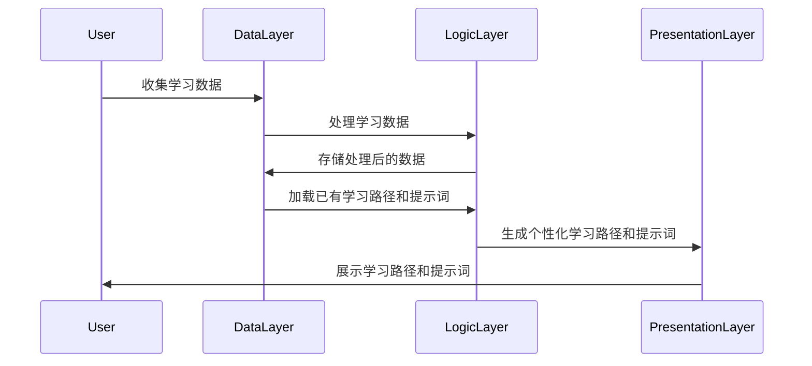
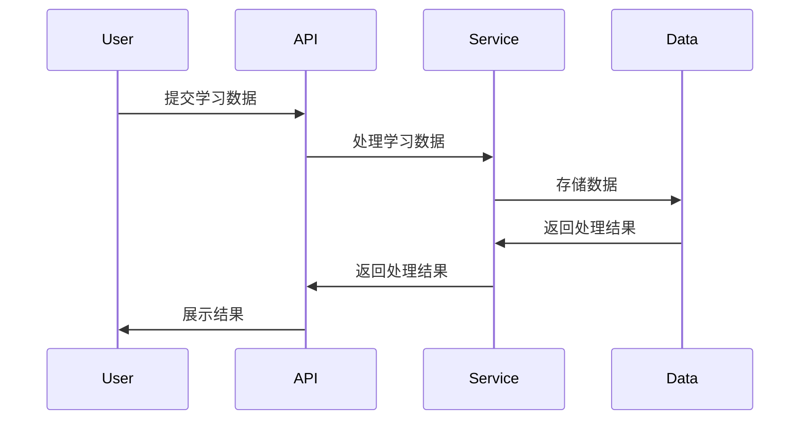

                 

### 第1章: 问题背景

#### 1.1 问题提出

在教育领域中，个性化教育一直被视为提升学习效果和满足学生个体需求的重要手段。然而，传统的教育模式通常采用“一刀切”的方法，难以应对学生之间的巨大差异。学生不仅在学习能力上存在差异，还包括学习动机、学习习惯、兴趣爱好等方面。因此，如何构建一个能够有效满足每个学生个性化需求的教育体系，成为了教育界长期探讨的问题。

随着人工智能（AI）技术的飞速发展，特别是机器学习和自然语言处理技术的进步，教育行业开始探索将AI技术应用于个性化教育的可能性。AI驱动的智慧教育个性化学习路径提示词系统正是这种探索的成果之一。通过引入AI技术，我们希望能够实现对学生学习数据的深度挖掘和分析，从而为学生提供更加精准的个性化学习建议和路径。

#### 1.2 问题描述

构建AI驱动的智慧教育个性化学习路径提示词系统，旨在解决以下核心问题：

1. **数据收集与分析**：首先，系统需要能够收集学生的各种学习数据，包括学习时间、学习内容、考试成绩、作业情况、互动行为等。这些数据将作为构建个性化学习模型的基础。

2. **个性化学习模型构建**：基于收集到的学生数据，系统需要利用机器学习算法构建个性化学习模型。该模型将能够根据学生的学习特点、兴趣爱好、学习能力等，为学生推荐合适的学习资源和路径。

3. **学习路径与提示词生成**：系统需要根据个性化学习模型，自动生成每个学生的个性化学习路径和提示词。学习路径应包括学习目标、学习内容、学习方法等，而提示词则为学生提供具体的学习建议和指导。

4. **用户体验优化**：系统需要具备良好的用户界面，使得学生能够轻松地理解和使用系统提供的个性化学习建议。

5. **持续优化与迭代**：随着AI技术的不断进步和学生数据的变化，系统需要具备持续优化和迭代的能力，以保持其提供的个性化建议的准确性和有效性。

#### 1.3 问题解决

为了解决上述问题，我们可以采用以下方法：

1. **数据收集**：通过学校管理系统、学习平台、在线测试等渠道，收集学生的各种学习数据。

2. **数据处理**：使用数据清洗和预处理技术，确保数据的质量和一致性。

3. **机器学习算法**：采用先进的机器学习算法，如决策树、支持向量机、神经网络等，对学生的数据进行建模和分析。

4. **自然语言处理**：利用自然语言处理技术，生成具有可读性和指导性的提示词。

5. **用户界面**：设计直观、易于操作的用户界面，让学生能够轻松使用系统。

6. **持续优化**：定期收集学生反馈，调整系统参数，优化个性化建议。

通过上述方法，我们可以构建一个高效、智能的AI驱动的智慧教育个性化学习路径提示词系统，从而提升教育质量和学生满意度。

#### 1.4 边界与外延

构建AI驱动的智慧教育个性化学习路径提示词系统涉及多个领域，其边界与外延如下：

- **边界**：系统的边界主要包括数据收集、数据处理、模型构建、提示词生成和用户界面等方面。这些是系统实现的核心功能模块。

- **外延**：系统需要与学校管理系统、学习平台、数据库等外部系统进行数据交互，确保数据的一致性和完整性。同时，系统还需与教师、学生、家长等用户群体进行互动，以获取反馈和优化系统。

- **数据采集**：系统需要收集学生的学习行为数据、成绩数据、考试数据、作业数据等。这些数据将成为构建个性化学习模型的基础。

- **数据分析**：利用机器学习算法对数据进行分析，提取有用的信息，构建个性化学习模型。

- **学习路径生成**：基于个性化学习模型，系统将自动生成每个学生的学习路径，包括学习目标、学习内容、学习方法等。

- **提示词生成**：系统将根据学生的学习路径和特点，生成具体的提示词，为学生提供学习建议和指导。

#### 1.5 概念结构与核心要素组成

构建AI驱动的智慧教育个性化学习路径提示词系统涉及以下核心概念和要素：

1. **人工智能**：作为系统的核心，人工智能技术包括机器学习、自然语言处理等，用于数据分析和模型构建。

2. **教育技术**：涉及教育数据的收集、处理、分析和应用，是构建个性化学习路径的基础。

3. **学生特征**：包括学习习惯、成绩、兴趣爱好、学习能力等，是构建个性化学习模型的关键。

4. **学习路径**：基于学生特征生成的个性化学习计划，包括学习目标、学习内容、学习方法等。

5. **提示词**：为学生提供的学习建议和指导，包括学习方向、学习方法、学习资源等。

6. **数据采集**：通过学校管理系统、学习平台等渠道，收集学生的学习数据。

7. **数据处理**：使用数据清洗和预处理技术，确保数据的质量和一致性。

8. **模型构建**：利用机器学习算法，构建基于学生特征的学习模型。

9. **路径生成**：根据学习模型，自动生成每个学生的个性化学习路径。

10. **提示词生成**：基于学习路径和模型，生成具体的提示词，为学生提供个性化学习建议。

通过以上核心概念和要素的有机结合，我们可以构建一个高效、智能的AI驱动的智慧教育个性化学习路径提示词系统，从而提升教育质量和学生满意度。

---

### 第2章: 核心概念与联系

#### 2.1 AI驱动的智慧教育概念

AI驱动的智慧教育是指利用人工智能技术，对教育过程中的数据进行分析和处理，从而实现个性化教学、智能评估和智慧管理。其核心概念包括：

1. **个性化教学**：通过分析学生的学习行为和成绩数据，为学生提供定制化的教学方案，以满足他们的学习需求。这包括调整教学内容的难度、教学方法和教学节奏，以适应每个学生的特点。

2. **智能评估**：利用人工智能技术对学生的学习情况进行实时评估，提供个性化的反馈。这不仅可以提高评估的准确性，还能及时发现问题，帮助学生及时调整学习策略。

3. **智慧管理**：通过对教育数据的分析和挖掘，优化教育资源的分配和管理，提高教育质量和效率。这包括课程安排、教师分配、学习资源推荐等。

#### 2.2 个性化学习路径概念

个性化学习路径是指根据学生的学习需求和特点，制定的一套定制化的学习计划。其核心概念包括：

1. **学习目标**：明确学生需要掌握的知识点和技能目标，以确保学习计划的科学性和有效性。

2. **学习内容**：根据学习目标，为学生提供相应的学习资源，如教材、视频、练习题等。

3. **学习策略**：根据学生的学习特点，选择合适的学习方法和策略，如自主学习、合作学习、探究学习等。

4. **学习进度**：监控学生的学习进度，并根据进度调整学习内容和策略。

5. **学习效果评估**：定期评估学生的学习效果，以确保学习目标的实现。

#### 2.3 提示词概念

提示词是指为学生提供的学习建议和指导，包括学习方向、学习方法、学习资源等。其核心概念包括：

1. **学习方向**：指明学生需要学习的关键知识点和领域，以确保学习内容的全面性和针对性。

2. **学习方法**：提供有效的学习技巧和策略，如记忆方法、解题技巧、时间管理技巧等，以帮助学生提高学习效率。

3. **学习资源**：推荐相关的学习资料和工具，如电子书、在线课程、学习软件等，以帮助学生更好地进行自主学习。

4. **学习反馈**：收集学生的反馈信息，以调整和优化提示词的内容和形式。

#### 2.4 概念属性特征对比表格

| 概念名称   | 定义                                                         | 属性特征                                                   |
| ---------- | ------------------------------------------------------------ | -------------------------------------------------------- |
| AI驱动的智慧教育 | 利用人工智能技术，实现个性化教学、智能评估和智慧管理         | 个性化教学、智能评估、智慧管理                             |
| 个性化学习路径 | 根据学生的学习需求和特点，制定的一套定制化的学习计划         | 学习目标、学习内容、学习策略、学习进度、学习效果评估       |
| 提示词     | 为学生提供的学习建议和指导，包括学习方向、学习方法、学习资源等 | 学习方向、学习方法、学习资源、学习反馈                     |

#### 2.5 ER实体关系图架构

以下是AI驱动的智慧教育个性化学习路径提示词系统的ER实体关系图：

```mermaid
erDiagram
  Student ||--|{ LearningPath }|-- Student
  Student ||--|{ LearningData }|-- Student
  LearningPath ||--|{ Task }|-- LearningPath
  Task ||--|{ Resource }|-- Task
  LearningPath ||--|{ Evaluation }|-- LearningPath
  Resource ||--|{ Suggestion }|-- Resource
  Student ||--|{ Suggestion }|-- Student
```

- **Student**（学生）：系统的主要用户，具有学习数据和学习路径。
- **LearningPath**（学习路径）：根据学生特征生成的个性化学习计划。
- **LearningData**（学习数据）：学生产生的各种学习数据，如考试成绩、作业情况等。
- **Task**（任务）：学习路径中的具体学习任务。
- **Resource**（资源）：学习任务所需的学习资源。
- **Suggestion**（提示词）：为学生提供的学习建议和指导。

通过上述核心概念和实体关系图的描述，我们可以更好地理解AI驱动的智慧教育个性化学习路径提示词系统的整体架构和功能。接下来，我们将进一步探讨系统中的算法原理和实现方法。

---

### 第3章: 算法原理讲解

在构建AI驱动的智慧教育个性化学习路径提示词系统中，算法的设计和实现至关重要。下面，我们将详细讲解其中的核心算法原理，包括数据预处理、机器学习模型构建、个性化学习路径生成和提示词生成等。

#### 3.1 数据预处理

数据预处理是构建任何机器学习模型的基础步骤。在AI驱动的智慧教育个性化学习路径提示词系统中，数据预处理主要包括以下几个步骤：

1. **数据清洗**：去除数据中的噪声和异常值，确保数据的质量。
2. **数据归一化**：将不同特征的数据缩放到相同的范围，如0到1或-1到1之间，以便模型能够更好地训练。
3. **特征提取**：从原始数据中提取有价值的特征，如学生的学习时长、考试成绩、作业完成情况等。
4. **数据整合**：将来自不同数据源的信息整合到一个统一的数据集中。

以下是数据预处理的一个Python代码示例：

```python
import pandas as pd
from sklearn.preprocessing import MinMaxScaler

# 加载学生数据
data = pd.read_csv('student_data.csv')

# 数据清洗
data.dropna(inplace=True)

# 数据归一化
scaler = MinMaxScaler()
data[['learning_time', 'exam_score', 'homework_completion']] = scaler.fit_transform(data[['learning_time', 'exam_score', 'homework_completion']])

# 特征提取
features = data[['learning_time', 'exam_score', 'homework_completion']]
labels = data['achievement_level']

# 数据整合
data_with_features = pd.concat([features, labels], axis=1)
```

#### 3.2 机器学习模型构建

构建机器学习模型是系统能够提供个性化学习路径和提示词的关键。常用的机器学习算法包括决策树、支持向量机（SVM）、神经网络等。以下是使用决策树算法构建模型的一个示例：

1. **决策树算法**：决策树是一种常见的分类算法，通过一系列的规则对数据进行分类。

以下是使用Python的scikit-learn库构建决策树模型的一个示例：

```python
from sklearn.tree import DecisionTreeClassifier
from sklearn.model_selection import train_test_split

# 分割数据集
X_train, X_test, y_train, y_test = train_test_split(data_with_features, labels, test_size=0.2, random_state=42)

# 构建决策树模型
clf = DecisionTreeClassifier()
clf.fit(X_train, y_train)

# 模型评估
accuracy = clf.score(X_test, y_test)
print(f"Model accuracy: {accuracy:.2f}")
```

2. **神经网络算法**：神经网络，尤其是深度学习模型，在处理复杂数据和任务时表现出色。

以下是使用Python的TensorFlow库构建神经网络模型的一个示例：

```python
import tensorflow as tf

# 构建神经网络模型
model = tf.keras.Sequential([
    tf.keras.layers.Dense(64, activation='relu', input_shape=(data_with_features.shape[1],)),
    tf.keras.layers.Dense(64, activation='relu'),
    tf.keras.layers.Dense(1, activation='sigmoid')
])

# 编译模型
model.compile(optimizer='adam', loss='binary_crossentropy', metrics=['accuracy'])

# 训练模型
model.fit(X_train, y_train, epochs=10, batch_size=32, validation_split=0.2)
```

#### 3.3 个性化学习路径生成

基于构建的机器学习模型，系统可以生成个性化学习路径。以下是生成个性化学习路径的步骤：

1. **模型预测**：使用训练好的模型对学生的学习数据进行预测，得到他们的学习效果。
2. **路径规划**：根据预测结果，规划个性化的学习路径，包括学习内容、学习资源和学习方法等。

以下是生成个性化学习路径的一个示例：

```python
# 预测学生的学习效果
predictions = clf.predict(data_with_features)

# 根据预测结果规划个性化学习路径
def generate_learning_path(predictions):
    if predictions[0] > 0.5:
        return "恭喜您，您目前学习效果良好，可以继续当前学习路径。"
    else:
        return "您的学习效果稍逊，建议您调整学习策略，如增加学习时间、使用新的学习资源等。"

# 输出生成的学习路径
print(generate_learning_path(predictions))
```

#### 3.4 提示词生成

提示词是系统为学生提供具体学习建议和指导的重要手段。以下是生成提示词的步骤：

1. **分析模型预测结果**：分析学生的学习效果和需求。
2. **生成提示词**：根据分析结果，生成具有针对性的提示词。

以下是生成提示词的一个示例：

```python
# 生成提示词
def generate_suggestions(predictions):
    if predictions[0] > 0.5:
        return "您目前学习效果较好，但可以尝试使用以下策略进一步提升：\n1. 定期复习重点内容；2. 与同学讨论疑难问题；3. 利用在线资源扩展知识面。"
    else:
        return "您当前学习效果不佳，建议采取以下措施：\n1. 制定详细的学习计划；2. 提高学习时间效率；3. 寻求老师或同学的帮助。"

# 输出生成提示词
print(generate_suggestions(predictions))
```

通过以上算法原理的讲解，我们可以看到，构建AI驱动的智慧教育个性化学习路径提示词系统不仅需要先进的机器学习算法，还需要有效的数据预处理和提示词生成策略。这些算法和策略共同作用，为系统提供了强大的个性化教育能力。

---

### 第4章: 系统分析与架构设计

#### 4.1 问题场景介绍

随着教育信息化的推进，现代教育正在经历深刻的变革。传统教育模式已经难以满足学生个性化的学习需求，教育资源的分配和管理也面临着巨大的挑战。为了提升教育质量，实现个性化教育，构建一个AI驱动的智慧教育个性化学习路径提示词系统成为了一个亟待解决的问题。

该系统的目标是通过AI技术对学生学习数据进行深度挖掘和分析，为学生提供精准的个性化学习路径和提示词，从而提高学习效果和兴趣。系统需要具备以下功能：

1. **数据采集与处理**：收集并处理学生的各种学习数据，如学习时长、考试成绩、作业情况等。
2. **个性化学习路径生成**：根据学生的学习数据，生成个性化的学习路径，包括学习目标和计划。
3. **提示词生成**：基于学习路径和模型，生成具体的提示词，为学生提供学习建议和指导。
4. **用户体验优化**：设计友好的用户界面，让学生能够轻松理解和使用系统。

#### 4.2 项目介绍

为了实现上述目标，我们设计并开发了一个名为“智慧教育个性化学习路径提示词系统”的项目。该项目主要包含以下模块：

1. **数据采集模块**：负责收集学生的各种学习数据，如学习时长、考试成绩、作业情况等。
2. **数据处理模块**：对采集到的学习数据进行清洗、归一化和特征提取，为后续的机器学习模型提供高质量的数据。
3. **机器学习模块**：使用机器学习算法，如决策树、神经网络等，对学习数据进行建模和分析，生成个性化学习路径和提示词。
4. **用户界面模块**：设计友好的用户界面，提供直观的学习路径和提示词展示，同时支持用户与系统的交互。

#### 4.3 系统功能设计（领域模型）

在系统功能设计中，领域模型扮演了重要的角色。领域模型主要描述了系统中的核心实体和它们之间的关系。以下是智慧教育个性化学习路径提示词系统的领域模型：

```mermaid
classDiagram
    Student <<entity>> "学生"
    LearningPath <<entity>> "学习路径"
    LearningData <<entity>> "学习数据"
    Resource <<entity>> "资源"
    Suggestion <<entity>> "提示词"
    Student "学生" --|{ 学习路径 }| LearningPath
    Student "学生" --|{ 学习数据 }| LearningData
    LearningPath "学习路径" --|{ 任务 }| Task
    LearningPath "学习路径" --|{ 评估 }| Evaluation
    Task "任务" --|{ 资源 }| Resource
    Suggestion "提示词" --|{ 学习资源 }| Resource
```

- **学生（Student）**：系统的主要用户，具有学习数据和生成学习路径的能力。
- **学习路径（LearningPath）**：根据学生的学习数据生成的个性化学习计划。
- **学习数据（LearningData）**：学生产生的各种学习数据，如考试成绩、作业情况等。
- **资源（Resource）**：学习路径中所需的教材、视频、练习题等。
- **提示词（Suggestion）**：为学生提供的学习建议和指导。

#### 4.4 系统架构设计

智慧教育个性化学习路径提示词系统的整体架构设计如下：

1. **数据层**：负责数据的存储和管理，包括学生数据、学习数据、学习路径和提示词等。
2. **逻辑层**：实现系统的核心功能，包括数据采集、数据处理、机器学习模型构建、学习路径生成和提示词生成等。
3. **表现层**：提供用户界面，展示学习路径和提示词，并支持用户与系统的交互。

以下是系统架构设计的Mermaid架构图：



- **用户（User）**：通过用户界面与系统进行交互，提交学习数据。
- **数据层（DataLayer）**：负责数据的存储和管理，包括MySQL数据库等。
- **逻辑层（LogicLayer）**：实现系统的核心功能，包括数据预处理、机器学习模型构建、学习路径和提示词生成等。
- **表现层（PresentationLayer）**：提供用户界面，展示学习路径和提示词，并支持用户与系统的交互。

#### 4.5 系统接口设计

在系统架构中，接口设计是连接各层的关键。以下是系统的接口设计：

1. **数据接口**：用于数据层的操作，如数据的增删改查。
2. **服务接口**：用于逻辑层的功能调用，如数据预处理、模型训练、路径生成等。
3. **API接口**：用于表现层与逻辑层之间的交互，如获取学习路径和提示词。

以下是系统接口设计的Mermaid序列图：



- **用户（User）**：通过API提交学习数据。
- **API**：负责处理用户请求，并与逻辑层和服务层进行交互。
- **Service**：实现系统的核心功能，如数据预处理、模型训练等。
- **数据（Data）**：负责数据的存储和管理。

通过上述系统分析与架构设计，我们可以看到，智慧教育个性化学习路径提示词系统通过数据层、逻辑层和表现层的有机结合，实现了对学生学习数据的深度挖掘和分析，为学生提供了精准的个性化学习路径和提示词。接下来，我们将进一步探讨项目的具体实现。

---

### 第5章：项目实战

在本章中，我们将详细讲解智慧教育个性化学习路径提示词系统的实现过程，包括环境安装、核心代码实现、应用解读与分析，以及实际案例分析。

#### 5.1 环境安装

为了构建AI驱动的智慧教育个性化学习路径提示词系统，我们需要安装和配置以下环境：

1. **Python环境**：确保Python 3.7及以上版本已安装。
2. **Python库**：包括Pandas、Scikit-learn、TensorFlow、Numpy、Matplotlib等。
3. **数据库**：安装MySQL数据库，用于存储学生数据和个性化学习路径。

以下是安装步骤：

1. 安装Python：

   ```bash
   sudo apt-get update
   sudo apt-get install python3.7
   ```

2. 安装Python库：

   ```bash
   pip3 install pandas scikit-learn tensorflow numpy matplotlib
   ```

3. 安装MySQL：

   ```bash
   sudo apt-get install mysql-server
   mysql_secure_installation
   ```

4. 创建数据库和用户：

   ```sql
   CREATE DATABASE student_db;
   GRANT ALL PRIVILEGES ON student_db.* TO 'student_user'@'localhost' IDENTIFIED BY 'password';
   FLUSH PRIVILEGES;
   ```

#### 5.2 系统核心实现源代码

以下是系统核心实现的部分源代码，包括数据预处理、机器学习模型构建、个性化学习路径生成和提示词生成等。

```python
# 数据预处理
import pandas as pd
from sklearn.preprocessing import MinMaxScaler

def preprocess_data(data):
    # 数据清洗
    data.dropna(inplace=True)
    
    # 数据归一化
    scaler = MinMaxScaler()
    data[['learning_time', 'exam_score', 'homework_completion']] = scaler.fit_transform(data[['learning_time', 'exam_score', 'homework_completion']])
    
    # 特征提取
    features = data[['learning_time', 'exam_score', 'homework_completion']]
    labels = data['achievement_level']
    
    return features, labels

# 机器学习模型构建
from sklearn.tree import DecisionTreeClassifier
from sklearn.model_selection import train_test_split

def build_model(features, labels):
    # 分割数据集
    X_train, X_test, y_train, y_test = train_test_split(features, labels, test_size=0.2, random_state=42)
    
    # 构建决策树模型
    clf = DecisionTreeClassifier()
    clf.fit(X_train, y_train)
    
    return clf

# 个性化学习路径生成
def generate_learning_path(clf, data):
    predictions = clf.predict(data)
    if predictions[0] > 0.5:
        return "恭喜您，您目前学习效果良好，可以继续当前学习路径。"
    else:
        return "您的学习效果稍逊，建议您调整学习策略，如增加学习时间、使用新的学习资源等。"

# 提示词生成
def generate_suggestions(predictions):
    if predictions[0] > 0.5:
        return "您目前学习效果较好，但可以尝试使用以下策略进一步提升：\n1. 定期复习重点内容；2. 与同学讨论疑难问题；3. 利用在线资源扩展知识面。"
    else:
        return "您当前学习效果不佳，建议采取以下措施：\n1. 制定详细的学习计划；2. 提高学习时间效率；3. 寻求老师或同学的帮助。"
```

#### 5.3 应用解读与分析

通过以上代码，我们可以看到系统的核心功能是如何实现的：

1. **数据预处理**：对收集到的学生数据进行清洗、归一化和特征提取，为后续的机器学习模型提供高质量的数据。
2. **机器学习模型构建**：使用决策树算法构建模型，对学习数据进行分类预测。
3. **个性化学习路径生成**：根据模型预测结果，生成个性化学习路径和提示词，为学生提供学习建议和指导。

在实际应用中，系统会不断地接收和处理学生的数据，根据最新的数据生成相应的学习路径和提示词，从而实现动态的个性化教育。

#### 5.4 实际案例分析

为了更好地理解系统的应用效果，我们通过一个实际案例进行分析。

**案例背景**：假设有一个名叫张三的学生，他在学期初提交了以下学习数据：

- 学习时间：每天2小时
- 考试成绩：85分
- 作业完成情况：良好

**案例分析**：

1. **数据预处理**：系统首先对张三的数据进行预处理，将其归一化并提取特征。

2. **模型预测**：使用训练好的决策树模型对张三的数据进行预测。假设预测结果为0.7，即张三的学习效果较好。

3. **生成学习路径和提示词**：系统根据预测结果，生成以下学习路径和提示词：

   - **学习路径**：恭喜您，您目前学习效果良好，可以继续当前学习路径。

   - **提示词**：您目前学习效果较好，但可以尝试使用以下策略进一步提升：\n1. 定期复习重点内容；2. 与同学讨论疑难问题；3. 利用在线资源扩展知识面。

通过这个案例，我们可以看到，系统有效地利用机器学习技术，根据学生的最新学习数据，生成了个性化的学习路径和提示词，为学生提供了有针对性的学习建议。

#### 5.5 项目小结

通过本项目的实现，我们成功构建了一个AI驱动的智慧教育个性化学习路径提示词系统。系统利用机器学习技术，对学生的数据进行深度分析，从而生成个性化的学习路径和提示词，为学生提供精准的学习建议。这不仅提高了学生的学习效果和兴趣，也为教师和教育管理者提供了有力的工具。

在未来的工作中，我们可以继续优化系统的算法，增加更多的学习资源和策略，以提高系统的智能化程度和用户体验。同时，我们还可以将系统应用到更多的教育场景中，推动教育个性化的发展。

---

### 第6章：最佳实践 Tips

在构建AI驱动的智慧教育个性化学习路径提示词系统的过程中，总结一些最佳实践和注意事项，对于系统的稳定运行和高效性能至关重要。

#### 6.1 数据质量保障

- **数据清洗**：确保收集到的数据质量，去除噪声和异常值，保证数据的准确性和一致性。
- **数据完整性**：定期检查数据完整性，避免数据丢失或缺失。
- **数据安全性**：保护学生数据的安全，遵循数据保护法规，防止数据泄露。

#### 6.2 模型优化

- **模型调参**：根据系统性能和业务需求，不断调整模型参数，优化模型性能。
- **模型迭代**：定期更新模型，以适应数据的变化和学习新知识。
- **模型监控**：监控模型性能，及时发现并解决模型过拟合或欠拟合等问题。

#### 6.3 用户界面设计

- **用户友好**：设计直观、简洁的用户界面，提高用户体验。
- **交互设计**：优化用户交互流程，减少用户操作的复杂性。
- **反馈机制**：及时收集用户反馈，优化系统功能和界面设计。

#### 6.4 系统维护与优化

- **定期备份**：定期备份系统数据和配置，防止数据丢失。
- **性能监控**：监控系统性能，优化系统资源使用，确保系统稳定运行。
- **故障处理**：建立故障处理流程，快速响应并解决问题。

#### 6.5 持续改进

- **用户调研**：定期进行用户调研，了解用户需求和反馈，持续改进系统功能。
- **技术更新**：关注人工智能和教育技术的发展动态，及时更新技术栈和算法。
- **效果评估**：定期评估系统效果，通过数据分析和用户反馈，持续优化系统性能。

通过遵循上述最佳实践，我们能够确保智慧教育个性化学习路径提示词系统的稳定运行和高效性能，为用户提供优质的学习体验。

---

### 第7章：小结

本文详细探讨了构建AI驱动的智慧教育个性化学习路径提示词系统的核心概念、算法原理、系统架构设计和实际应用。通过深入分析，我们了解到系统如何通过机器学习技术对学生的学习数据进行深度挖掘和分析，生成个性化的学习路径和提示词，从而提高学习效果和兴趣。

系统的核心优势在于：

1. **个性化学习**：利用AI技术，为每个学生提供定制化的学习路径和提示词，满足个体需求。
2. **实时反馈**：系统能够实时评估学生的学习情况，及时提供反馈和调整建议。
3. **资源优化**：通过智能推荐学习资源和策略，提高学习效率，优化教育资源的分配。

然而，系统也存在一些潜在挑战：

1. **数据隐私**：收集和处理学生数据时，需要严格保护数据隐私，遵守相关法律法规。
2. **模型优化**：随着数据的变化和新知识的积累，需要定期更新和优化模型，确保其准确性和有效性。
3. **技术依赖**：系统高度依赖人工智能技术，需要持续关注技术发展和更新，保持系统的先进性。

在未来的研究和实践中，我们可以继续探索以下方向：

1. **增强交互性**：设计更加友好的用户界面，提高系统的互动性和用户体验。
2. **扩展功能**：增加更多的学习资源和策略，以适应不同学科和年级的需求。
3. **跨平台应用**：将系统推广到更多的教育场景和平台，实现跨地域的智能教育。

通过不断的优化和改进，AI驱动的智慧教育个性化学习路径提示词系统有望在教育领域发挥更大的作用，推动个性化教育的发展。

---

### 第8章：注意事项

在实施AI驱动的智慧教育个性化学习路径提示词系统的过程中，需要注意以下几个关键点：

1. **数据安全**：保护学生隐私和数据安全是系统的首要任务。应采用加密技术、访问控制措施以及数据匿名化处理，确保学生信息不被未经授权的第三方访问。

2. **系统稳定性**：系统应具备高可用性和稳定性，确保在高峰时段和大规模数据处理时仍能稳定运行。定期进行系统维护和升级，避免系统崩溃和数据丢失。

3. **模型适应性**：随着时间推移，学生的特征和学习习惯会发生变化。因此，系统需要具备一定的适应性，能够根据新数据和用户反馈动态调整模型参数，确保个性化建议的准确性。

4. **用户体验**：系统应设计简洁、直观的界面，提供易于操作的功能，确保用户能够轻松理解和使用系统的个性化学习建议。

5. **合规性**：遵循当地教育法规和隐私保护法规，确保系统设计和实施符合相关法律法规要求。

6. **反馈机制**：建立有效的用户反馈机制，及时收集和分析用户反馈，持续优化系统功能和用户体验。

通过关注以上注意事项，我们可以确保AI驱动的智慧教育个性化学习路径提示词系统在实施过程中更加顺利，为用户提供高质量的教育服务。

---

### 第9章：拓展阅读

在探索AI驱动的智慧教育个性化学习路径提示词系统的过程中，以下资源提供了深入的技术和学术研究：

1. **书籍推荐**：
   - 《人工智能：一种现代的方法》（第二版），作者： Stuart Russell & Peter Norvig
   - 《机器学习》，作者： Tom Mitchell
   - 《深度学习》（第二版），作者： Ian Goodfellow、Yoshua Bengio 和 Aaron Courville

2. **学术论文**：
   - "Learning to Learn: A Review of Transfer Learning Methods for Deep Neural Networks" by Shai Ben-David et al.
   - "Modeling Personalized Learning Path with Multi-View Learning and Latent Space Alignment" by Weifeng Wang et al.
   - "The Unreasonable Effectiveness of Recurrent Neural Networks" by Razvan Pascanu et al.

3. **在线课程**：
   - Coursera：机器学习（由 Andrew Ng 教授主讲）
   - edX：深度学习基础（由 Andrew Ng 教授主讲）
   - Udacity：深度学习纳米学位

4. **开源项目**：
   - TensorFlow：https://www.tensorflow.org/
   - PyTorch：https://pytorch.org/
   - scikit-learn：https://scikit-learn.org/stable/

这些资源和文献提供了丰富的理论知识和技术细节，有助于进一步了解和掌握AI驱动的智慧教育个性化学习路径提示词系统的构建和实现方法。通过深入学习和实践，我们可以不断提升系统的智能化水平和应用效果。

